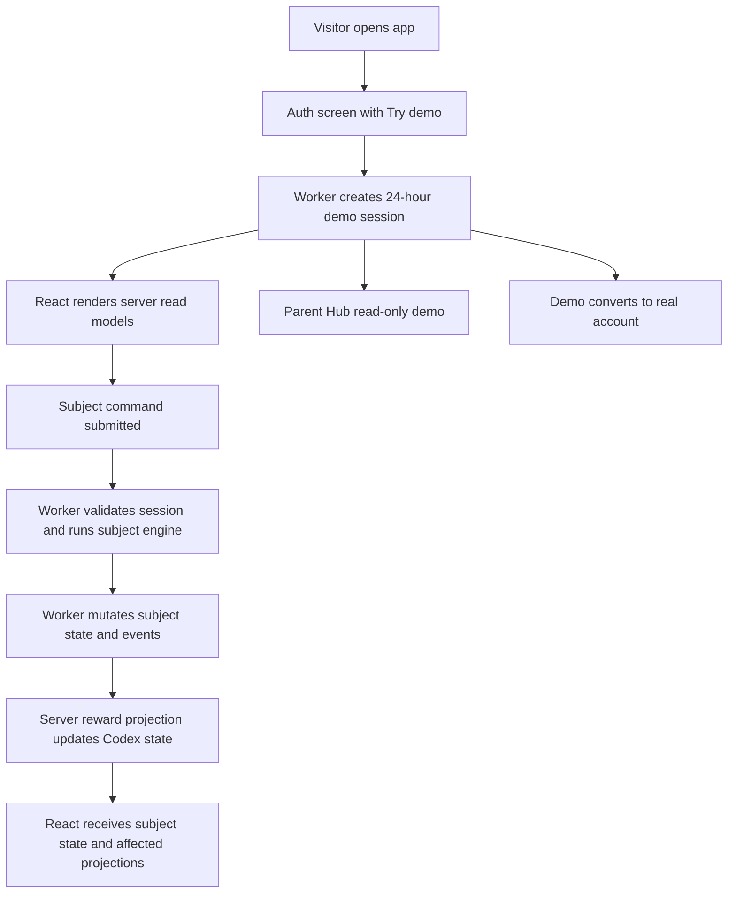

# Full Lockdown and Ephemeral Demo Session

## Problem Frame

KS2 Mastery should move from a React browser app that still ships production learning and read-model logic into a server-authoritative product. The React app remains the user interface, but production subject engines, scoring, queue selection, progress mutation, reward projection, dashboard aggregation, Parent Hub aggregation, and content selection must run behind Worker APIs.

This matters because James wants to be able to say, with production evidence, that the app no longer leaks production engine logic. Demo access should not reintroduce a browser-local runtime. Instead, public demo users get a 24-hour server-owned demo session backed by isolated demo data.

---

## Actors

- A1. Learner: Uses the React app to practise KS2 subjects and receive immediate feedback.
- A2. Demo visitor: Tries the app without a user-facing login through a server-owned demo session.
- A3. Parent or adult evaluator: Reviews learner progress through Parent Hub, including demo read-only Parent Hub.
- A4. Account owner: Converts a demo session into a real email or social-auth account.
- A5. Admin/operator: Monitors aggregate demo operation, rate-limit health, and deployment safety.
- A6. React client: Renders UI, owns interaction state, and sends commands, but does not own production runtime logic.
- A7. Worker runtime: Owns subject engines, sessions, read models, projections, auth, persistence, and verification boundaries.

---

## Key Flows

- F1. Try demo and practise
  - **Trigger:** A visitor clicks Try demo on the unauthenticated root screen.
  - **Actors:** A2, A6, A7
  - **Steps:** The Worker creates or replaces a 24-hour demo session, clones the demo template into an isolated demo account, returns authorised app read models, and receives later subject commands through the server-authoritative runtime.
  - **Outcome:** The demo visitor can practise and see learner progress without a browser-local engine or access to real account data.
  - **Covered by:** R1, R2, R5, R6, R7, R9, R12

- F2. Read Parent Hub in demo
  - **Trigger:** A demo visitor opens Parent Hub.
  - **Actors:** A2, A3, A6, A7
  - **Steps:** React requests the server Parent Hub read model, the Worker returns a read-only demo-scoped summary, and write/admin/profile affordances remain unavailable.
  - **Outcome:** The demo can show reporting value without exposing admin operations or cross-user data.
  - **Covered by:** R2, R12, R16

- F3. Convert demo to real account
  - **Trigger:** A demo visitor registers through email/password or configured social auth before demo expiry.
  - **Actors:** A2, A4, A7
  - **Steps:** The Worker validates the active demo session, links or creates the real account through the chosen registration path, preserves demo learner data, removes demo TTL restrictions, and returns a normal signed-in session.
  - **Outcome:** Demo progress becomes real account progress without merging into an existing account.
  - **Covered by:** R3

- F4. Submit a subject command
  - **Trigger:** A learner submits a subject action such as starting a session, submitting an answer, continuing, skipping, or ending.
  - **Actors:** A1, A6, A7
  - **Steps:** React sends a command envelope, the Worker validates access and idempotency, the subject engine runs server-side, domain events are appended, reward/game projections are applied synchronously, and the response includes the subject state plus affected global projections.
  - **Outcome:** The user sees immediate feedback and rewards while the browser never owns the mutation logic.
  - **Covered by:** R5, R6, R7, R9, R11, R15

- F5. Degraded production connection
  - **Trigger:** Worker/API access fails after the browser has cached an authorised server read model.
  - **Actors:** A1, A2, A6
  - **Steps:** React displays the cached read-only shell, marks actions unavailable, and prompts reconnection instead of falling back to local practice.
  - **Outcome:** Context remains visible, but no offline engine or local mutation path exists.
  - **Covered by:** R14

---

## Requirements

**Demo and auth**

- R1. The unauthenticated root must show login/register/social auth, concise UK English product copy, and a Try demo CTA. The `/demo` route may directly create a demo session for testing/direct demo entry, but `?local=1` must be completely removed from product behaviour.
- R2. Demo access must use a 24-hour server-owned session cloned from a shared demo template into an isolated per-visitor demo account with learner practice, Codex/rewards, and Parent Hub read-only access.
- R3. A non-expired demo session must be convertible into a real account through email/password registration or configured social registration, preserving learner progress, completed sessions, rewards, and read-model history. Existing real-account merge/import is out of scope for this release.
- R4. Demo creation, reset, commands, Parent Hub reads, and TTS fallback generation must be protected by layered rate limits across IP, demo account, session, and command type. Expired demo data must be blocked on read/write and opportunistically cleaned up, with later scheduled cleanup left possible.

**Server-authoritative runtime**

- R5. The production React client may contain UI, routing, interaction state, form state, focus/accessibility handling, display formatting, theme/modals, TTS playback controls, and harmless local filtering/sorting over already-authorised loaded read models only.
- R6. Production subject runtime writes must go through a generic subject command boundary. React must not write subject state, practice sessions, game state, event logs, or reward state directly.
- R7. The Worker must own production subject engines. English Spelling must be implemented as a new server-native engine with strict algorithmic parity against the current behaviour under controlled time/random fixtures.
- R8. Migration may abandon active/incomplete practice sessions rather than converting client-shaped session state. Durable progress, completed sessions, event history, and reward state must be preserved.
- R9. Subject commands must run through a synchronous authoritative command pipeline: validate access and session state, run the subject engine, mutate subject state/practice session records, append domain events, apply reward/game projections through a generic server-side projection boundary, and return authorised UI state.
- R10. Prompt audio must be token-bound to the server-owned session and current prompt. The TTS path should support a future hybrid where pre-generated/static audio is preferred and protected runtime TTS is used only when generated audio is not ready.
- R11. Subject command responses must include the current subject read model and affected global projections such as reward/celebration events, shell counters, dashboard-card deltas, and revision/cache metadata. Parent Hub and Admin read models may refresh lazily on page entry or explicit refresh.

**Read models and content exposure**

- R12. Worker APIs must own dashboard, Parent Hub, Admin/Operations, and subject read-model aggregation. Demo Parent Hub must be read-only and demo-scoped.
- R13. The production React bundle must not include the full spelling word/sentence/content dataset. Content-heavy views such as Word Bank must use server-served, searchable/filterable/paginated read models; React may locally filter or sort the rows already loaded.
- R14. Production degraded mode must be a cached read-only shell. It may show the last authorised server read model but must disable practice, progress writes, reward writes, demo reset, conversion, and other runtime mutations until reconnection.

**Admin, operations, and development**

- R15. Existing broad repository write routes must not remain available as learner/demo runtime escape hatches. Any retained write routes must be explicit admin/operator/import/reset paths with role checks.
- R16. Admin/Operations should show minimal aggregate demo counters: demo sessions created, active demo sessions, conversions, cleanup count, rate-limit blocks, and TTS fallback usage indicators. Individual demo account browsing is out of scope.
- R17. Browser development/manual QA must use Worker-backed auth or demo sessions. Node tests may use in-memory/server harnesses, but no hidden browser local runtime path may replace `?local=1`.

**Release evidence**

- R18. Local build checks must use both a bundle/module manifest and static grep-style checks to reject forbidden production client content, including subject engines, scoring, queue selection, progress mutation, reward/game mutation, read-model builders, local runtime switches, full bundled content datasets, and broad runtime write clients.
- R19. A production curl audit against `ks2.eugnel.uk` must verify that deployed HTML and bundles satisfy the lockdown boundary before the strongest public claim is made.
- R20. Any forbidden bundle audit failure is a release blocker. The public claim must not be downgraded within the same release; only UI-only/display-only/filter-only exceptions may be explicitly allowlisted.

---

## Acceptance Examples

- AE1. **Covers R1, R2, R6.** Given a new visitor on `ks2.eugnel.uk`, when they click Try demo, the app creates a server-owned demo session and all later practice actions go through the subject command boundary rather than browser-local repositories or engines.
- AE2. **Covers R3.** Given a non-expired demo user with completed spelling practice, when they register through email or configured social auth, their learner progress, sessions, rewards, and Parent Hub history remain visible under the new real account.
- AE3. **Covers R7, R8.** Given an existing signed-in learner with durable progress and an active client-shaped spelling session, when the full-lockdown release is deployed, the learner keeps durable progress and completed history but must start a fresh server-owned session.
- AE4. **Covers R9, R11.** Given a learner submits a correct spelling answer, when the Worker processes the command, the response includes authoritative feedback, updated subject state, reward/celebration events if earned, and affected shell/dashboard projections.
- AE5. **Covers R10.** Given a learner replays audio for the current spelling prompt, when React calls the TTS path, the Worker validates the prompt token and either serves pre-generated audio or performs protected fallback TTS without trusting client-supplied text.
- AE6. **Covers R14.** Given the API becomes unavailable after a successful session load, when the learner returns to the app, React may show cached read-only context but cannot submit answers, start sessions, reset demo data, or mutate rewards.
- AE7. **Covers R18, R19, R20.** Given a production build includes a forbidden scoring helper in the React bundle, when the bundle audit runs, the release is blocked and no "production no longer leaks engine logic" claim is made.

---

## Success Criteria

- James can credibly say: "The production app no longer leaks the engine logic," with the precise supporting statement that production no longer ships client-side production engine logic and that engines, scoring, queue selection, progress mutation, reward projection, and read-model aggregation run behind Worker APIs.
- Demo users can try the product and see read-only Parent Hub value without login friction, cross-user interference, browser-local runtime logic, or access to real account data.
- Signed-in learners retain durable progress and user-visible English Spelling behaviour while moving to a server-authoritative runtime.
- Future subjects can plug into the same subject command and server-side projection model without copying Spelling-specific browser runtime patterns.
- Planning can proceed without inventing product behaviour for demo identity, conversion, degraded mode, content exposure, bundle evidence, or release gates.

---

## Scope Boundaries

- Do not preserve or replace `?local=1`; it is removed from product behaviour.
- Do not support offline/local practice in production.
- Do not merge a demo session into an already signed-in real account in this release.
- Do not expose Admin/Operations to demo users beyond minimal read-only or aggregate demo-related surfaces already specified.
- Do not build production engines for the five future subjects in this release; build the generic runtime platform and Spelling as the first implementation.
- Do not create a full public marketing site in this release.
- Do not require scheduled cleanup in the first implementation, but do not block adding it later.
- Do not remove all client-side logic. UI, formatting, interaction state, and harmless filtering over authorised loaded read models remain valid client responsibilities.

---

## Key Decisions

- Full lockdown target: server-authoritative app runtime, not spelling-only lockdown.
- Demo model: 24-hour per-visitor demo account cloned from a shared template.
- Demo surfaces: learner practice, Codex/rewards, and Parent Hub read-only.
- Public entry: root auth screen with Try demo; `/demo` remains available for testing/direct entry.
- Client boundary: engine and read-model lockdown, with UI plus harmless local filtering allowed.
- Runtime API style: single generic subject command boundary with per-subject command ownership.
- Reward architecture: synchronous user-visible projection through a generic server-side event/projection layer.
- TTS boundary: prompt-token validation now, designed for pre-generated/static audio first with protected fallback TTS.
- Migration: abandon active sessions, preserve durable state and history.
- Demo conversion: support email/password and configured social registration now; real-account merge later.
- Release gate: block until bundle manifest, grep checks, and production curl audit are clean.

---

## Dependencies / Assumptions

- The current repo already has a React-owned browser shell, Worker/D1 auth and repository routes, Parent/Admin hub read routes, TTS proxying, and a spelling service/engine that can be used as the behavioural reference.
- Cloudflare D1 remains the durable store for account, learner, session, content, event, and reward state.
- Configured social providers are available or can be feature-gated cleanly for demo conversion.
- Existing package scripts remain the deployment path: `npm test`, `npm run check`, `npm run db:migrate:remote`, and `npm run deploy`.
- Browser QA after deployment requires a logged-in session and a demo session on `https://ks2.eugnel.uk`.

---

## Outstanding Questions

### Deferred to Planning

- [Affects R6, R9][Technical] Define the exact command envelope, validation strategy, idempotency semantics, and revision metadata for subject commands.
- [Affects R7][Technical] Select the strict parity fixtures for the new server-native Spelling engine, including seeded random/time coverage.
- [Affects R10][Technical] Define the audio token lifetime, static audio lookup order, protected fallback caching behaviour, and TTS rate-limit thresholds.
- [Affects R13][Technical] Define the Word Bank pagination/search/filter read model and what rows may be locally filtered after loading.
- [Affects R18][Technical] Choose the build-manifest mechanism and forbidden-module allowlist format for bundle audits.
- [Affects R4, R16][Technical] Choose the first rate-limit backing store and opportunistic cleanup trigger points.

---

## Next Steps

-> /ce-plan for structured implementation planning.
