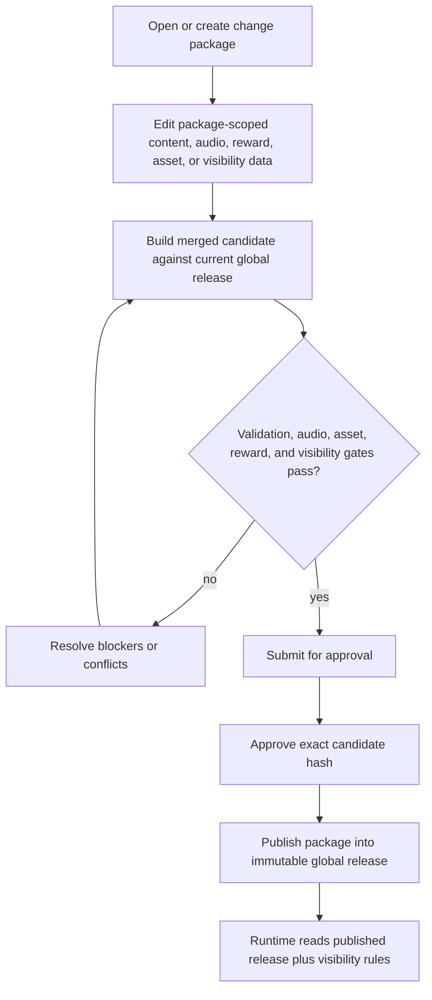

# Content Operations Centre

## Summary

The Content Operations Centre is a global Admin Console workflow for managing English Spelling content, spelling audio generation, spelling pools, reward tracks, monster bindings, monster image assets, and Hero / Codex exposure through one approved release package model.

The work should be delivered as one contract and implementation plan, then split into epics and tickets. Delivery order may be staged, but the data model, approval workflow, validation gates, and rollback strategy must be designed as one connected system so no ticket ships a partial surface with hidden production gaps.

---

## Problem Frame

English Spelling now has a draft, validation, publish, and runtime-snapshot content model, but the Admin Console only exposes thin import, export, publish, reset, and status hooks. Adding or correcting a word still requires engineering work against `content/spelling.seed.json`, regeneration, validation, deployment, and separate audio cache handling.

James needs an operator-facing UI that can manage every learner-facing part of a spelling content release: words, word families, sentence entries, pools, audio readiness, reward tracks, monster bindings, Hero / Codex visibility, and monster image assets. The same workflow must protect production-sensitive paths such as learner state, D1 content storage, R2 audio, generated runtime bundles, Hero rewards, and English Spelling parity.

The existing Monster Visual & Effect Config and Asset & Effect Registry establish a useful admin pattern for draft, publish, restore, review gates, preview, and fallback. The new centre should reuse that discipline but widen it from visual config alone to complete spelling content operations.

---

## Key Decisions

- **Single release package.** Spelling words, word-family variants, sentence entries, pools, reward tracks, monster bindings, Hero / Codex visibility, required audio readiness, and monster image asset references are approved and published together.
- **Multiple change packages.** Every ticket or epic works inside a `changePackage` with its own base release hash, diff, validation results, audio scan, asset checks, approval record, and publish state.
- **Optimistic merge with hard conflict blocking.** Unrelated packages can rebase automatically onto the current global release. Same entity and same field conflicts block publish until an admin resolves them.
- **Approval required for publish.** V1 maps edit, approve, and publish capability to the existing `admin` role, so one admin user can complete the whole workflow. The UI and audit model still separate edit, approval, and publish states so future roles can split these capabilities without changing the workflow.
- **Global default with account override capability.** V1 manages global product content. The runtime model should reserve account override support for future special programmes or diagnostics, but the primary Admin UI must not make account-specific content the default path.
- **Audio is generated, not uploaded.** Admin users may scan, generate, batch generate, and override audio through the TTS generation service. They must not upload arbitrary audio files.
- **Audio requirements are lane-configurable.** Each release package declares an `audioRequirementProfile` by lane. The default profile requires word audio in male and female natural pace, and sentence dictation audio in male and female normal and slow pace.
- **Pools have reward tracks, not hard-coded one-monster rules.** A pool may have zero or more reward tracks. Learner-facing pools require at least one active reward track unless the package explicitly approves a no-reward exception.
- **Track-defined progression.** Each reward track defines whether it progresses in parallel or after another track. UI defaults to parallel.
- **Hero is an exposure layer.** Monster identity, reward track progression, and Hero / Codex exposure are separate concepts. Hero does not introduce a second creature model.
- **Scheduled and staged visibility.** A package can publish content before making a pool or reward track learner-visible. Visibility can be hidden, visible, scheduled, or gated by rollout flag.
- **Published deletion becomes retirement.** Draft-only items may be hard deleted. Once published, words, sentence entries, pools, reward tracks, and bindings are retired or tombstoned instead of removed.
- **Rollback and revert both exist.** Operators can roll back a whole global release for emergencies and create inverse packages to revert individual published packages in normal operations.

---

## Terminology

- **Global release:** The immutable platform-level published spelling operations state used by learner runtime surfaces.
- **Change package:** A ticket-scoped draft diff against a base global release. It is the unit of edit, validation, approval, publish, revert, and audit.
- **Merged candidate:** The result of applying a change package to the current global release. Approval binds to this exact candidate hash.
- **Spelling pool:** A content and practice grouping such as core statutory words, Extra words, or a future themed pool.
- **Word-family variant:** A variant prompt under a base word. Variants may have their own accepted spellings, explanations, and sentence references, while progress can remain keyed to the base slug where the pool rules require it.
- **Audio lane:** A generation target such as word audio or sentence dictation audio, each with its own voice and pace requirements.
- **Reward track:** A rule that converts pool progress into monster catch, evolve, level-up, mega, or related reward states.
- **Monster:** The creature identity, image assets, visual metadata, branches, and stages shown in learner-facing surfaces.
- **Hero exposure:** The configuration that makes a reward track or monster appear in Hero Camp, Hero Quest, Codex, or subject setup.

---

## Actors

- A1. James / Admin operator: Creates packages, edits content, runs scans, generates audio, uploads monster images, resolves conflicts, approves, publishes, rolls back, and reverts.
- A2. Future approver / publisher: A capability holder who may later approve or publish without being the same role as the editor.
- A3. Operations viewer: Can inspect packages, release history, validation, audio status, and asset previews without mutating production state.
- A4. Learner: Sees only published and currently visible spelling content, reward tracks, monster assets, and Hero / Codex exposure.
- A5. Content runtime: Resolves global release, optional account override, visibility state, and bundled fallback into learner-safe runtime snapshots.
- A6. TTS generation service: Generates approved word and sentence audio variants and stores them in R2 with provenance.
- A7. R2 audio store: Serves generated spelling audio by content-addressed keys and retains orphaned objects until cleanup.
- A8. Monster asset registry: Stores, validates, previews, and publishes monster image assets and visual metadata.
- A9. Package merge engine: Rebases packages, detects conflicts, builds merged candidates, invalidates stale approvals, and records audit events.

---

## Key Flows

- F1. Create a package from a light template
  - **Trigger:** An admin wants to add words, create a pool, refill audio, update a monster asset, bind rewards, or change Hero visibility.
  - **Actors:** A1, A9
  - **Steps:** The admin chooses a light template, the system records the base release id and hash, and the package opens with relevant checklist tabs.
  - **Outcome:** All future mutations are scoped to a package rather than an untracked shared draft.
  - **Covered by:** R1, R2, R3, R4, R50, R51

- F2. Edit spelling content in a package
  - **Trigger:** An admin edits words, word families, sentence entries, accepted spellings, explanations, pools, provenance, or visibility.
  - **Actors:** A1, A5, A9
  - **Steps:** The UI shows the current published value beside the package draft value, records structured operations, and validates the package plus merged candidate.
  - **Outcome:** The admin can manage content through UI without touching generated runtime files.
  - **Covered by:** R12, R13, R14, R15, R16, R17, R18, R19, R52, R53

- F3. Scan and generate audio
  - **Trigger:** A package adds or changes words, variants, sentences, audio profile requirements, or requests an override.
  - **Actors:** A1, A6, A7, A9
  - **Steps:** The system computes missing audio by lane, voice, pace, slug, and sentence id, then allows selected generation, batch generation, or approved override through the TTS service.
  - **Outcome:** R2 audio readiness is visible and traceable before approval, with no manual audio upload path.
  - **Covered by:** R29, R30, R31, R32, R33, R34, R35, R36, R37, R38, R39, R40

- F4. Configure pools, rewards, monsters, and Hero exposure
  - **Trigger:** A package creates a pool, changes a reward rule, binds a monster, uploads assets, or changes Hero / Codex visibility.
  - **Actors:** A1, A5, A8, A9
  - **Steps:** The admin configures pool metadata, reward tracks, progression mode, thresholds, monster bindings, image assets, and staged visibility in one package.
  - **Outcome:** A learner-visible pool cannot ship without complete reward, asset, and exposure configuration unless the package explicitly approves an exception.
  - **Covered by:** R41, R42, R43, R44, R45, R46, R47, R48, R49, R50, R51, R52, R53, R54, R55, R56, R57, R58, R59, R60, R61

- F5. Rebase, resolve conflicts, approve, and publish
  - **Trigger:** An admin submits a package for approval or attempts to publish after the global release has changed.
  - **Actors:** A1, A2, A9
  - **Steps:** The system auto-rebases unrelated changes, blocks same-field conflicts, requires manual conflict resolution, rebuilds the merged candidate, invalidates stale approvals, and allows publish only after approval of the exact candidate hash.
  - **Outcome:** Packages do not overwrite each other by accident, and production receives only reviewed merged releases.
  - **Covered by:** R5, R6, R7, R8, R9, R10, R11, R54, R55, R56, R57

- F6. Stage visibility and prove production readiness
  - **Trigger:** A package is published with hidden, scheduled, or rollout-flagged exposure.
  - **Actors:** A1, A4, A5
  - **Steps:** Runtime surfaces read the published release and visibility rules, the Admin Console tracks hidden or scheduled assets, and production proof checks the exposed learner surfaces when visibility is enabled.
  - **Outcome:** Content can be prepared ahead of learner exposure without leaking drafts.
  - **Covered by:** R44, R45, R46, R58, R59

- F7. Roll back or revert
  - **Trigger:** A production issue requires reversing a whole release or undoing one package.
  - **Actors:** A1, A2, A5, A7, A9
  - **Steps:** Whole-release rollback restores a prior global release after approval; package revert creates an inverse package that goes through validation, approval, and publish.
  - **Outcome:** Recovery is available without deleting R2 audio or losing package audit history.
  - **Covered by:** R74, R75, R76, R77, R78

---

## Requirements

**Release and Package Model**

- R1. The Content Operations Centre must live inside the existing role-gated Admin Console rather than a public route.
- R2. Every production mutation must belong to a `changePackage`; browsing current state may be package-free, but editing may not.
- R3. A package must record its light template, base global release id, base release hash, creator, created time, and current lifecycle state.
- R4. Light templates must include new spelling words, edit spelling word or family, new spelling pool, audio refill or regenerate, monster asset update, reward binding update, and Hero / Codex visibility update.
- R5. Package validation must run against both the package diff and the merged candidate global release.
- R6. If the global release changes after package creation, the system must auto-rebase unrelated changes.
- R7. Same entity and same field conflicts must block publish until an admin resolves them in UI; last-write-wins is not allowed.
- R8. Conflict resolution must invalidate prior approval and require validation, audio scan, asset checks, and approval to run again.
- R9. Publishing a package must create a new immutable global release version linked to the package id and candidate hash.

**Approval and Audit**

- R10. Approval is required before publish, even when the same V1 admin user edits and approves the package.
- R11. V1 must expose edit, approval, and publish actions to the existing `admin` role while modelling separate capabilities for future role splits.
- R12. Package lifecycle states must distinguish draft, ready for approval, approved, published, rejected, blocked, reverted, and superseded states.
- R13. Approval must record approver account id, approval time, notes, candidate hash, base release id, merged release hash, validation summary, audio fallback decision, and asset readiness summary.
- R14. Any package mutation after approval must invalidate approval.
- R15. Publish must only apply the exact approved candidate hash.
- R16. Audit history must record create, edit, scan, generate, override, rebase, conflict resolution, approval, publish, rollback, and revert events.
- R17. Safe-copy and export actions must use the existing admin redaction discipline and avoid leaking learner or account personal data.

**Spelling Editorial Management**

- R18. Admin UI must manage spelling word lists, pools, words, word-family variants, sentence entries, accepted spellings, explanations, tags, source notes, and provenance.
- R19. Each editable word must show its current published state, package draft state, validation state, audio readiness, pool membership, and reward impact.
- R20. Word-family variants must be first-class editable children of a base word, with their own accepted spellings, learner-facing explanation, sentence references, and audio readiness.
- R21. The model must keep clear whether progress and rewards are keyed to the base word slug or to variant-specific prompts.
- R22. Core statutory spelling parity must be preserved unless James explicitly accepts a documented trade-off in the package approval notes.
- R23. Extra and future non-statutory pools must not inflate statutory Years 3-4, Years 5-6, or core completion metrics.
- R24. Sentence entries must remain linked by stable ids rather than free text embedded directly in each word row.
- R25. A word or variant cannot become learner-visible without at least one valid sentence reference, accepted spelling set, explanation, pool assignment, and provenance.
- R26. Draft-only items may be hard deleted before first publish.
- R27. Published words, sentences, pools, reward tracks, and bindings must be retired or tombstoned instead of hard deleted.
- R28. Retired items must not appear in new learner sessions or active pool totals, but must remain available for audit and learner-history references.

**Audio Operations**

- R29. Each package must have an `audioRequirementProfile` that defines required voices and paces by audio lane.
- R30. The default word lane must require male and female natural pace audio.
- R31. The default sentence dictation lane must require male and female normal and slow pace audio.
- R32. Audio readiness scans must report missing, present, stale, generated, failed, skipped, and override-requested states by lane, voice, pace, slug, sentence id, model, and content key.
- R33. Admins must be able to generate selected audio, batch generate a package scope, and regenerate existing audio through an explicit override action.
- R34. Audio override must be a high-risk action that invalidates approval and records the reason.
- R35. Audio assets must be generated through the approved TTS generation service and stored in R2; manual audio upload must not be supported.
- R36. Generated audio provenance must include source content identity, voice, pace, model, prompt/profile version, generated account id, generated time, and R2 key.
- R37. The publish gate must default to strict audio readiness.
- R38. Approval may explicitly allow runtime TTS fallback for a release, with reason, affected matrix summary, approving account id, and timestamp.
- R39. Packages published with fallback allowed must leave a visible Admin warning until all required audio is generated.
- R40. Audio scans and generation must cover both word audio and sentence dictation audio.

**Pools, Reward Tracks, and Monster Bindings**

- R41. A spelling pool must be a learner-facing practice grouping with stable id, title, pool type, source notes, active or retired state, and visibility configuration.
- R42. A pool may have zero or more reward tracks, but learner-facing active pools require at least one active reward track unless the package approval explicitly allows no reward.
- R43. Each reward track must bind to one monster and define progression mode, threshold template, optional threshold overrides, active state, and display labels.
- R44. Threshold templates must provide sensible defaults, and per-pool overrides must be allowed.
- R45. Reward thresholds must validate against active pool word counts and cannot require impossible progress.
- R46. Track-defined progression must support `parallel` and `sequentialAfter`, with `parallel` as the UI default.
- R47. Sequential reward tracks must reference an existing prior track and must not create cycles.
- R48. Cross-pool reward dependencies must be blocked unless explicitly allowed by package approval.
- R49. Reward track changes must preserve learner history and avoid corrupting existing monster progress.

**Monster Image Assets**

- R50. V1 asset upload must support monster image assets only.
- R51. Uploaded monster assets must be validated for allowed format, expected dimensions or derivable responsive sizes, monster id, branch, stage, and renderer-preview compatibility.
- R52. Asset upload must create draft assets in a package; learner runtime must continue using published assets until package publish.
- R53. Admin UI must preview monster assets in relevant renderer contexts before approval.
- R54. A learner-visible monster binding must not publish if required image assets are missing or invalid.
- R55. Existing Monster Visual & Effect Config review and fallback principles must remain compatible with uploaded assets.
- R56. Asset changes must not alter reward thresholds, learner state, or progression logic unless those changes are explicitly included in the same package.

**Hero and Codex Exposure**

- R57. Hero exposure must be configuration over published reward tracks and monsters, not a separate creature identity model.
- R58. Hero Camp, Hero Quest, Codex, and subject setup must read published and currently visible exposure rules.
- R59. Exposure rules must support hidden, visible, scheduled, and rollout-flag states.
- R60. First learner-visible exposure of a new pool, monster, or reward track must go through the package approval boundary.
- R61. Hidden or scheduled published content must remain available for audio generation, asset checks, and admin preview.

**Global Content Resolution**

- R62. The primary V1 UI must manage global product content, not account-scoped content.
- R63. Runtime resolution must reserve the order: explicit account override, global published release, bundled fallback.
- R64. Account override support must remain outside the main V1 UI unless used for diagnostics or a later special programme workflow.
- R65. Bundled fallback must stay available so a broken remote release cannot blank spelling or monster runtime surfaces.

**UI and Operator Experience**

- R66. The Content Operations Centre home must prioritise open packages, blocked packages, ready-for-approval packages, approved pending publish packages, and recently published releases.
- R67. Top-level areas must include Packages, Spelling, Audio, Pools & Rewards, Monsters & Assets, Hero / Codex, Approvals, and Release History.
- R68. Area pages may browse published state without an active package, but any mutation must ask the admin to choose or create a package.
- R69. Package detail pages must expose the same domain tabs scoped to that package.
- R70. Item-level UI must show published value, package draft value, diff state, validation blockers, audio blockers, asset blockers, reward impact, and visibility impact.
- R71. The conflict resolver must support keeping the package value, keeping the current release value, or editing a merged value.
- R72. Generated runtime files must remain downstream outputs; operators must not be asked to edit `src/subjects/spelling/data/*` or `worker/src/generated-spelling-content-seed.js`.
- R73. Large content reads must avoid pulling the full spelling dataset into the public React bundle.

**Release History, Rollback, and Revert**

- R74. Release History must show global release versions, included packages, changed entities, audio fallback decisions, asset changes, approver, publisher, publish time, and production proof status.
- R75. Whole-release rollback must be available as an approved high-risk action for emergency recovery.
- R76. Package-level revert must create an inverse change package that follows the same validation, approval, and publish workflow.
- R77. Rollback and revert must not delete R2 audio objects; audio cleanup belongs to a separate retention process.
- R78. Production proof must be captured when learner-facing visibility changes, especially for Spelling setup, Word Bank, Hero / Codex, and monster rendering surfaces.

---

## Acceptance Examples

- AE1. **Covers R1, R2, R18, R29, R41, R42, R57.** Given an admin creates a "New spelling pool" package, when they add a pool, words, sentences, audio requirements, reward track, monster binding, and Hero exposure, then the package validates as one release unit rather than separate partial approvals.
- AE2. **Covers R10, R13, R14, R15.** Given an admin approves a package, when any word, sentence, reward track, asset, or visibility field changes afterwards, then the previous approval becomes invalid and publish is blocked until re-approval.
- AE3. **Covers R10, R11.** Given V1 only has the `admin` role, when James edits and approves a package with the same account, then the UI allows the workflow but still records distinct edit and approval events.
- AE4. **Covers R6, R7, R8, R71.** Given package A edits `metamorphosis.explanation` and package B also edits the same field, when package B tries to publish second, then the system blocks publish and opens conflict resolution.
- AE5. **Covers R6, R9.** Given package A adds `botanist` to one pool and package B adds `arachnid` to another pool, when package B publishes after package A, then the system auto-rebases package B and publishes a new global release without manual conflict resolution.
- AE6. **Covers R20, R21, R25, R40.** Given an Extra base word has two word-family variants, when a variant lacks a sentence reference or sentence audio readiness, then approval shows the gap at the variant level rather than hiding it under the base word.
- AE7. **Covers R29, R32, R37, R38, R39.** Given a package adds a new sentence and the required slow female audio is missing, when the admin approves fallback with notes, then publish can proceed and the Admin Console keeps warning until that audio is generated.
- AE8. **Covers R33, R34, R35, R36.** Given an admin wants to replace poor-quality audio, when they choose override, then the system regenerates through TTS, writes to R2 with new provenance, invalidates approval, and does not offer file upload.
- AE9. **Covers R42, R43, R45, R46, R47.** Given a pool has two reward tracks, one parallel and one sequential, when thresholds exceed the active pool count or create a sequence cycle, then publish is blocked with specific reward-track errors.
- AE10. **Covers R50, R51, R52, R53, R54.** Given an admin uploads a new monster stage image, when the image fails validation or cannot preview in required contexts, then the package cannot make that monster binding learner-visible.
- AE11. **Covers R58, R59, R60, R61.** Given a new pool is published with scheduled visibility for next week, when learners open Spelling today, then they do not see the pool, while Admin can still preview it and generate audio.
- AE12. **Covers R26, R27, R28.** Given a word has already been published and learners may have progress for it, when an admin removes it from active practice, then the word is retired rather than hard deleted.
- AE13. **Covers R62, R63, R64, R65.** Given no account override exists, when a learner starts Spelling, then runtime uses the global published release; if remote content is unavailable, it falls back to the bundled release.
- AE14. **Covers R74, R75, R76, R77.** Given a published package causes a production issue, when the admin chooses recovery, then they can either roll back the whole release or create a package-level revert without deleting audio objects.

---

## Success Criteria

- James can add, edit, retire, and review spelling words, word families, sentence entries, pools, reward tracks, monster bindings, Hero / Codex exposure, and monster images from Admin UI without code edits.
- Every learner-visible spelling content change is package-scoped, validated as a merged candidate, approved, audited, and published into an immutable global release.
- Word and sentence audio readiness is visible at the same level as content readiness, with controlled fallback and no arbitrary audio upload.
- A new pool cannot become learner-visible with missing reward, monster, asset, audio, or visibility configuration unless the package explicitly records the approved exception.
- Multiple tickets can proceed in parallel without a shared-draft collision or last-write-wins overwrite.
- English Spelling statutory parity, learner progress, D1 content safety, R2 audio provenance, and runtime fallback behaviour remain protected.
- Release History gives enough evidence to review, roll back, or revert production changes without reconstructing what happened from git alone.

---

## Scope Boundaries

- Do not build a general CMS for every subject in V1. The full manager is for spelling-centred content operations with reward, audio, monster, and Hero dependencies.
- Do not support manual audio upload. Audio must be generated through the approved TTS service and stored in R2.
- Do not make account-scoped content the primary Admin UI path in V1.
- Do not rewrite the spelling engine, scheduler, marking logic, or statutory word parity rules as part of this centre.
- Do not let draft package edits leak into learner runtime before publish and visibility activation.
- Do not hard delete published content or R2 audio objects as part of normal editorial removal.
- Do not require operators to edit generated runtime modules or seed files manually for normal content operations.
- Do not make monster image changes alter reward progression unless the package explicitly changes reward-track rules.

---

## Dependencies / Assumptions

- The existing Admin Console remains the correct protected home for this workflow.
- Existing `admin` role can perform edit, approval, and publish in V1, while capability names are modelled for future role separation.
- Existing spelling draft, publish, validation, and runtime snapshot helpers remain the behavioural starting point.
- Existing account-scoped `account_subject_content` storage is not the final global product-content model; planning must define how global releases and optional account overrides coexist.
- Existing TTS and R2 cache helpers remain the approved audio path, but planning may need to extend key shapes or job metadata to support configurable lane profiles.
- Existing Monster Visual & Effect Config and Asset & Effect Registry patterns provide the draft, publish, preview, review, restore, and fallback precedent for monster image assets.
- Existing generated runtime bundle-size constraints still apply; public client bundles must not absorb full content datasets.
- Production verification remains required when learner-facing visibility changes on `https://ks2.eugnel.uk`.

---

## Sources / Research

- `docs/spelling-content-model.md`
- `docs/spelling-word-audio.md`
- `docs/monster-visual-config.md`
- `docs/brainstorms/2026-04-22-spelling-extra-expansion-requirements.md`
- `docs/brainstorms/2026-04-24-monster-visual-config-centre-requirements.md`
- `docs/solutions/learning-spelling-audio-cache-contract.md`
- `docs/solutions/architecture-patterns/admin-console-p6-evidence-integrity-content-ops-maturity-2026-04-29.md`
- `src/surfaces/hubs/AdminContentSection.jsx`
- `src/platform/hubs/admin-asset-registry.js`
- `src/subjects/spelling/content/model.js`
- `src/subjects/spelling/content/service.js`
- `worker/src/app.js`
- `worker/src/repository.js`

---

## Outstanding Questions

### Resolve Before Planning

- None.

### Deferred to Planning

- [Affects R3, R5, R9, R62][Technical] Define the D1 schema and migration path for global releases, change packages, package operations, approvals, and optional account overrides.
- [Affects R6, R7, R8, R71][Technical] Define the operation format and conflict-detection rules for same entity and same field merges.
- [Affects R29, R30, R31, R36][Technical] Confirm exact TTS voice identifiers, pace identifiers, model defaults, and cache-key versioning for configurable audio lanes.
- [Affects R32, R33, R39][Technical] Decide whether batch audio generation runs inside Worker-triggered queues, local operator scripts, or a hybrid service wrapper.
- [Affects R50, R51, R53, R55][Technical] Define monster image upload constraints, responsive size generation, storage location, validation rules, and preview contexts.
- [Affects R41, R42, R43, R44, R45][Technical] Define the reward-track schema and how existing Spelling monsters map into the new track model without changing current learner progress.
- [Affects R58, R59, R60][Technical] Define the storage and runtime resolution model for hidden, scheduled, visible, and rollout-flagged exposure.
- [Affects R74, R75, R76][Technical] Define rollback and inverse-package generation rules, including how retired content and visibility changes revert.
