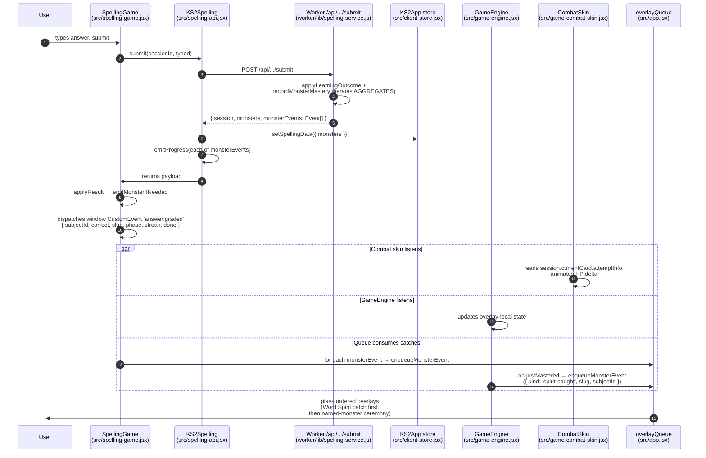

# feat: Overlay Game System (Word Spirits + Sanctuary)

## Overview

Layer a read-only game system on top of the existing server-authoritative
study engine. Every practice question becomes a micro-fight with a
**Word Spirit** (per-word creature, shown in *wild form* during the
question and *card form* once caught). Mastered words populate a new
two-tier **Collection** and a spatial **Sanctuary** meta-loop. The
study engine remains the sole writer of mastery; the overlay subscribes
to a new event contract and writes only to its own `ks2-overlay-<pid>`
storage namespace.

## Problem Frame

The study engine is doing real pedagogic work but the motivational
surface on top is thin — catches and evolutions of three named monsters
(Inklet, Glimmerbug, Phaeton) are the only celebrated moments, leaving
long stretches of flat practice between them. The overlay adds a
constant-cadence reward loop (per-question fight, per-word spirit,
spatial sanctuary) without touching grading, stages, or persistence.

See origin: `docs/brainstorms/2026-04-19-overlay-game-system-requirements.md`.

## Requirements Trace

- R1. Study-first entry — practice-led home, game surfaces are secondary tabs.
- R2. Every practice question is a micro-fight driven by a new
  `answer:graded` DOM event; `SECURE_STAGE` fires a catch.
- R3. Cosmetic combat skin only — HP bar + damage numbers + streak combos
  + catch animation, no type / team / move decisions.
- R4. Every mastered word represented as a Word Spirit card.
- R5. Card carries word + sentence + audio + procedural art; includes
  reveal-toggle retrieval practice (no spaced-rep integration).
- R6. Milestone monsters retain existing thresholds and `MonsterEngine.AGGREGATES`
  rules; aggregate events emitted alongside direct monster events.
- R7. Collection tab shows milestone row + Word Spirit grid (uncaught silhouettes).
- R8. Sanctuary = primary meta-progression, spatial not transactional.
- R9. Six named zones (Ink Grove … Reading Reading-Room); caught spirits populate home zone.
- R10. Zone unlocks derived from `MonsterEngine.getMonsterProgress`.
- R11. Tap-to-animate; no care mechanics, no daily timers.
- R12. Pool-agnostic engine (softened — see Key Decisions #3).
- R13. v1 ships Spelling fully lit; 5 other zones show locked silhouettes.
- R14. No combat overlay or Word Spirit generation on mock subjects
  or test-mode sessions.
- R15. Game engine is read-only on study state; subscribes to submit
  payload + `monster:progress` + new `answer:graded` DOM event.
- R16. `ks2-overlay-<profileId>` localStorage for game-only state, device-local v1.
- R17. Engine equivalence verified by vitest-pool-workers harness
  (submit-payload stream + `KS2App.state.monsters` snapshot byte-equality)
  with **real** overlay subscribers (not no-ops).

## Scope Boundaries

- **Deferred to v2**: cosmetic coin shop, `/api/overlay/*` D1 mirror of
  overlay state, PvP, non-spelling subject wiring, full multi-subject
  content (templates / named monsters / unlocked zones),
  cross-tab BroadcastChannel sync.
- **Out of scope**: any write to `ks2-spell-progress-*`, `ks2-monsters-*`,
  `KS2App.setSpellingData`, or any endpoint under `/api/spelling/*`.
- **Out of scope**: reshuffling the build pipeline; overlay code ships
  through the existing `scripts/build-public.mjs` concatenation.
- **Out of scope**: persistent care mechanics, hunger timers, login
  streak punishment.
- **Out of scope**: cross-tab live sync; v1 accepts per-tab divergence
  until next submit refreshes `state.monsters`.

## Context & Research

### Relevant Code and Patterns

- **Event queue reuse** — `src/app.jsx:22-41` already owns dual
  `overlayQueue` (fullscreen, one-at-a-time) + `toastQueue` (bottom-right,
  stackable) with `enqueueMonsterEvent(payload | payload[])`. Word Spirit
  catch celebration piggybacks on the same queue; `'levelup'` → toast,
  everything else → fullscreen overlay.
- **Natural `answer:graded` emit site** — `src/spelling-game.jsx:95-133`
  `applyResult` runs immediately after `KS2Spelling.submit` resolves,
  and already dispatches the `monster:progress` side-effect via
  `emitMonsterIfNeeded`. The `answer:graded` event is a sibling emission.
- **`monster:progress` subscription pattern** — `src/shell.jsx:166-180`
  and `src/dashboard.jsx:20-24` use `React.useEffect` + `window.addEventListener`
  with local tick state. New overlay subscribers follow the same shape.
- **Aggregate declarations** — `src/monster-engine.jsx:24-50` (client
  declarative table, kept for documentation; the file is NOT in the
  bundled `clientSourceFiles` today) and `worker/lib/spelling-service.js:90-124`
  (server evaluator). Server `recordMonsterMastery` currently emits a
  single `event`; extending it to iterate aggregates is Unit 1's job.
- **Combat skin wrap site** — `src/practice.jsx:6-23` dispatches
  `SpellingGame` for spelling only. The skin wrapper goes here.
- **Sanctuary natural replacement** — `src/dashboard.jsx:284-431`
  `MonsterPlayground` subscribes to `monster:progress`, runs a
  `requestAnimationFrame` motion loop, and has declarative slot
  positioning. Home's `MonsterPlayground` will be replaced by
  `<SanctuaryScreen compact />` (single spatial surface).
- **Procedural art prior art** — `src/monsters.jsx:600-629` `MonsterArt`
  has PNG-first / SVG-fallback pattern with silhouette mode.
  `src/monster-overlay.jsx:15-36` `seededRandom` provides the
  deterministic-seed pattern Word Spirits will reuse.
- **Collection extension site** — `src/collection.jsx:56-95` has the
  per-subject section layout.
- **Test harness template** — `test/integration/spelling.test.mjs:102-173`
  is the closest pattern: submits through the real Worker via `SELF.fetch`.
  Helpers must be inlined per file (vitest-pool-workers 0.14.x limitation).
- **Route dispatch** — `src/app.jsx:75` derives `subject` from route.
  Sanctuary route must be excluded from the subject branch and handled
  as its own render case (see Unit 6).
- **D1 `monsterState` shape** — `test/unit/store.test.mjs:193-207` is
  the canonical example of server `monsters: { <id>: { mastered: [...], caught: bool } }`.
- **Existing client shim** — `src/client-store.jsx:161-188` provides a
  read-only `window.MonsterEngine` backed by `KS2App.state.monsters`.
  `recordMastery()` is a no-op; client does not write monster state.

### Institutional Learnings

- **Monster aggregates + `monster:progress`** (memory) — fire-and-forget
  DOM events with listeners re-reading state themselves; no payload
  coupling. Clone for `answer:graded`.
- **Engine immutable when porting** (memory) — pedagogic engine verbatim;
  UX aligns to engine. Applies to R15 / R17.
- **Vite bundle order** (memory) — new `src/*.jsx` must be appended to
  `scripts/build-public.mjs:20-41` `clientSourceFiles` in the right load
  position; modules still write to `window` at parse time. The current
  array does NOT include `src/monster-engine.jsx`; new files go after
  `src/client-store.jsx` (slot 5) so `window.KS2App` is available.
- **vitest-pool-workers helpers** (memory) — 0.14.x will not bundle
  non-entry helper files. Inline harness helpers per test file.
- **PR#5 server-authoritative shift** (memory) — mastery and Phaeton
  progress owned by Worker; client `spelling-api.jsx` rebroadcasts
  `monster:progress`. Overlay must not reintroduce client-side
  authoritative writes.
- **No `docs/solutions/` corpus yet** — this plan is a strong candidate
  to seed one (the `answer:graded` contract + the read-only-overlay
  invariant are both compound-engineering-worthy learnings).

### External References

External research skipped. Codebase has strong local patterns for every
layer the plan touches (event buses, overlay surfaces, Collection, test
harness, SVG-first art pipeline).

## Key Technical Decisions

1. **Reuse `app.jsx` `overlayQueue` for Word Spirit catches.**
   The existing queue already handles one-at-a-time fullscreen +
   dismissal. Ordering rule: Word Spirit catch fires first, then
   named-monster milestone, both dismissible.

2. **`answer:graded` as a DOM CustomEvent on `window`.**
   Mirrors existing `monster:progress` contract exactly. Payload is
   `{ subjectId, correct, slug, phase, streak, done }`.

3. **Soften R12 "zero core engine changes".**
   The overlay consumes an adapter boundary (submit payload +
   `answer:graded`) rather than calling subject engines directly.
   The adapter contract is frozen for spelling; subject engine #2
   is allowed to evolve the contract before v1.1 ships.

4. **HP bar state derivation, not event state.**
   HP derives from the new `payload.session.currentCard.attemptInfo`
   field (`attempts`, `successes`, `needed`, `hadWrong`) added by
   Unit 1. This re-hydrates cleanly across page refresh because it
   arrives inside the bootstrap / submit payloads already plumbed to
   `KS2App.state.spelling.session`. `answer:graded` only drives
   *animations* (hit burst, miss shake, catch burst).
   **Catch-to-next-word HP freeze**: because the Worker does not
   auto-advance on a `done` submit and the client schedules
   `KS2Spelling.advance()` via a 500 ms timeout (see
   `src/spelling-game.jsx:61-85`), the combat skin **freezes HP
   derivation during an active spirit-caught overlay** and only
   re-derives from `attemptInfo` once both (a) `advance()` has
   resolved and (b) the catch overlay is dismissed.

5. **Three-phase HP semantics.**
   Spelling's learning mode runs `question` → `retry` → `correction`:
   - `question` correct, `needed=1`: 100% HP → 0% → catch burst
   - `question` correct, `needed=2` (new word): 100% → 50% → 0% → catch
   - `retry` correct: no HP change; soft "hit" glow
   - `retry` incorrect: soft miss shake, no HP increase to enemy
   - `correction` retype: neutral; soft "confirmed" glow, no HP delta
   HP only reaches zero on `info.done = true`; catch is driven by the
   engine's `justMastered`.

6. **Test-mode skin off.** `MODES.TEST` has no retry phase and a single
   attempt per word; the skin falls back to plain practice UI.
   Catches still celebrate when `justMastered` fires through existing
   milestone ceremonies. Fallback rule for any subject engine that
   cannot emit `answer:graded`.

7. **Network-failure freeze.** If `/api/spelling/sessions/:id/submit`
   throws, suppress `answer:graded` entirely. Combat skin shows a
   brief "checking…" state. No optimistic client grading.

8. **Skip-word flow = flee animation.** `SpellingEngine.skipCurrent`
   does not fire submit; wild form plays 400 ms fade + translate-out,
   no HP damage taken. No `answer:graded`.

9. **Per-tab divergence accepted for v1.** Each tab's combat skin is
   local. Next submit refreshes `KS2App.state.monsters` globally.
   BroadcastChannel / `storage` event sync is v2.

10. **Procedural Word Spirit art: 4-6 silhouette templates per subject.**
    Deterministic selection by `hash(wordSlug)` modulo template count,
    subject palette tint, word glyph stamp. PNG override path mirrors
    `MonsterArt`. Not per-word unique — per-template-slot unique.

11. **Silhouette collectibles use faint word outline only.** No
    speculative baby-form silhouette; keeps art budget bounded.

12. **Locked Sanctuary zones tap to preview, not silence.** Tap a
    locked zone → tooltip dialog with preview silhouette of the future
    named monster + "Opens when Year-5 Maths goes live" copy.

13. **Extend Worker `recordMonsterMastery` to iterate AGGREGATES.** The
    submit response returns `monsterEvents: Event[]` (breaking rename
    from `monsterEvent: Event | null` — single commit rewrites Worker
    + `worker/index.js:474` + `src/spelling-api.jsx:35` + `src/spelling-game.jsx:100`).

14. **HP metaphor: wildness meter, not enemy HP.** The bar visually
    represents the spirit's "wildness" shrinking as the kid answers;
    at wildness = 0 the spirit is befriended (tamed / caught), not
    defeated. Copy / colour / icon all commit to the taming grammar
    — no red "enemy", no "KO" language. "HP bar" in this plan is
    shorthand for "wildness meter"; UI copy uses the kid-facing term.

15. **Network-freeze chip via `GameEngine`, not `KS2App.state`.**
    Combat skin reads a new `GameEngine.getSubmitInFlight()` getter
    that `spelling-api.jsx.submit` sets on entry and clears on
    resolution. Avoids adding overlay-serving fields to
    `KS2App.state.spelling`. `spelling-api.jsx` becomes the one place
    that writes a diagnostic signal to `GameEngine` from the study
    path.

16. **Equivalence test: two harnesses, one intent.**
    - **Integration**: `test/integration/overlay-equivalence.test.mjs`
      (vitest-pool-workers, inlined helpers) — replays a scripted
      sequence through the real Worker; asserts byte-equal payload
      stream and final `child_state.monsters` between overlay-off and
      overlay-on runs. Overlay-on mounts **real** subscribers with
      real side-effects (GameEngine writes to a test localStorage
      shim, CombatSkin enqueues onto a captured `App.overlayQueue`).
    - **Unit**: `test/unit/game-engine-equivalence.test.mjs` —
      in-process vitest asserting zero calls to `KS2App.setSpellingData`
      and zero writes to study localStorage keys during scripted DOM
      event streams.

## Open Questions

### Resolved During Planning

- Aggregate event emission strategy → Decision 13.
- Combat skin component boundary → new `src/game-combat-skin.jsx`
  wrapping `SpellingGame` inside `src/practice.jsx`.
- Word Spirit art uniqueness floor → Decision 10.
- MonsterOverlay copy rewording → named-monster ceremony keeps existing
  copy; Word Spirit catch gets a separate smaller overlay.
- HP state source of truth → Decision 4.
- Three-phase HP semantics → Decision 5.
- Test-mode skin → Decision 6.
- Network failure / skip / profile switch / multi-tab → Decisions 7, 8, 9.
- Locked-zone tap affordance → Decision 12.
- HP metaphor (enemy vs friend) → Decision 14.
- Submit-in-flight flag placement → Decision 15.

### Deferred to Implementation

- Exact silhouette template SVG shapes for Word Spirits (hand-drawn;
  requires design pass with Claude design app before coding).
- Final Sanctuary canvas composition for Ink Grove (single scrolling
  scene vs panned regions — sample one zone before committing).
- Whether to use `React.memo` / virtualised grid for the 200+ Word
  Spirit card grid (profile on device first; start simple).
- Exact reduced-motion fallback visuals (need a11y pass after combat
  skin lands).
- Whether to add a `BroadcastChannel('ks2-overlay')` in v1.1 or defer
  fully to v2.

## High-Level Technical Design

> *This illustrates the intended approach and is directional guidance
> for review, not implementation specification. The implementing agent
> should treat it as context, not code to reproduce.*

### Event & data flow on a single submit



### Storage boundary

```
┌─── Study-engine owned (server-authoritative, never written by overlay) ───┐
│                                                                           │
│   D1: child_state.monsterState       ──read──►  KS2App.state.monsters    │
│   D1: child_state.spellingProgress   ──read──►  KS2App.state.spelling    │
│                                                                           │
└───────────────────────────────────────────────────────────────────────────┘
                                   ▲
                                   │ overlay only reads, never writes
                                   │
┌─── Overlay-engine owned (device-local localStorage, v1) ──────────────────┐
│                                                                           │
│   ks2-overlay-<profileId>  ◄──read/write──  GameEngine                    │
│     { seenSpirits: string[], dismissedIntros: {[key]: bool},              │
│       sanctuaryDecor?: {...}, lastSubjectVisited?: string, ... }          │
│                                                                           │
└───────────────────────────────────────────────────────────────────────────┘
```

## Implementation Units

- [x] **Unit 1: Subject-engine contract — `answer:graded` + aggregate events**

_Landed in commit `b63be48` — feat(overlay): Unit 1._

**Goal:** Establish the two new signals the overlay subscribes to:
the `answer:graded` DOM event per submit, and a multi-event
`monsterEvents: Event[]` submit payload so aggregate (Phaeton)
transitions fire alongside direct monster transitions. Also extend
the submit payload to surface `session.currentCard.attemptInfo` for
the combat skin's HP derivation.

**Requirements:** R2, R6, R15, R17 (equivalence precondition)

**Dependencies:** None

**Files:**
- Modify: `worker/lib/spelling-service.js` — replace single-event return
  from `recordMonsterMastery` with an array iterator over
  `MONSTER_AGGREGATES` (Worker-side mirror); rename submit response
  field to `monsterEvents: Event[]`. Also extend `buildSessionPayload`
  (`worker/lib/spelling-service.js:147-176`) to include
  `currentCard.attemptInfo: { attempts, successes, needed, hadWrong }`
  derived from `status[currentSlug]`.
- Modify: `worker/index.js:474` — the submit route currently forwards
  `submission.monsterEvent` in the response envelope; update to
  `monsterEvents` to match the new return shape.
- Modify: `src/spelling-api.jsx:35` — `submit()` reads
  `payload.monsterEvents`, loops `emitProgress` per event. Also emit
  new `answer:graded` CustomEvent after `setSpellingData` updates
  state.
- Modify: `src/spelling-game.jsx:100` — `applyResult` receives the
  array, fans each event through `emitMonsterIfNeeded`.
- Create: `worker/lib/monster-aggregates.js` — mirror of client
  `AGGREGATES`. Port `eventFromTransition` from `src/monster-engine.jsx:102-120`
  — the Worker currently only *projects* aggregate state via
  `derivePhaetonProgress` and emits no events. The port computes prev
  and next aggregate state around the write, diffs them, and appends
  any resulting event to `monsterEvents`.
- Test: `test/unit/spelling-service.test.mjs` (extend) — new case for
  submit that crosses both Glimmerbug's hatch threshold AND Phaeton's
  hatch gate simultaneously, assert array length and ordering.

**Approach:**
- Server-side `AGGREGATES` table stays tiny and explicit.
- Back-compat: `monsterEvent` (singular) is not kept; single commit
  renames across Worker + `spelling-api.jsx` + `spelling-game.jsx`.
  Deploy cache-bust mitigation noted in Known Residual Risks.
- `answer:graded` payload shape: `{ subjectId: 'spelling', correct,
  slug, phase: 'question'|'retry'|'correction', streak, done }`.
  Streak is **owned by `GameEngine` (single source)** per Unit 2.

**Execution note:** Start with a failing extension to
`test/unit/spelling-service.test.mjs` asserting the new
`monsterEvents` array for a Glimmerbug-10th+Phaeton-hatch scenario.

**Patterns to follow:**
- `src/monster-engine.jsx:124-176` — canonical "record mastery →
  iterate aggregates → return events" pattern.
- `worker/lib/spelling-service.js:90-124` — the existing single-event
  version to extend in-place.

**Test scenarios:**
- Happy path: submit that masters Glimmerbug's 10th word (crossing
  hatch threshold) → `monsterEvents` is a single-element array
  `[{ kind: 'caught', monsterId: 'glimmerbug', mastered: 10, stage: 1, ... }]`.
  Masteries 1-9 produce `monsterEvents: []`.
- Edge case: submit that masters Inklet's 100th word AND satisfies
  Phaeton's both-maxed gate → 2-element array, direct first
  (`{ kind: 'mega', monsterId: 'inklet' }`), aggregate second
  (`{ kind: 'mega', monsterId: 'phaeton' }`).
- Edge case: submit that crosses no threshold → `monsterEvents: []`
  (never null).
- Integration: `test/integration/spelling.test.mjs` — add a scripted
  sequence ending in Phaeton hatch; assert `session` + `monsters`
  snapshots still match, and `monsterEvents` carries both transitions.
- Happy path: `answer:graded` fires exactly once per submit
  resolution; `correct`/`phase`/`streak` match engine state.
- Edge case: `answer:graded` does NOT fire when submit throws.
- Happy path: `currentCard.attemptInfo` is populated with the
  current word's `{ attempts, successes, needed, hadWrong }` for
  both pre-done and post-done submits.

**Verification:**
- All existing `test/integration/spelling.test.mjs` cases pass.
- New targeted test proves aggregate events fire in the same submit.
- `KS2App.getState().monsters.phaeton` reflects the aggregate stage
  transition on the same submit that triggered it.

---

- [x] **Unit 2: `GameEngine` module — read-only subscriber + overlay storage**

_Landed in commit `68ffde8` — feat(overlay): Unit 2. Module shipped without the DOM-bound test (deferred to Unit 8 per plan, once the jsdom vitest project exists). Factory is reachable at `globalThis.__ks2CreateGameEngine` for that follow-up._

**Goal:** Introduce the overlay's single entry point. Subscribes to
the study-engine events, exposes a read-only view of overlay state,
owns the `ks2-overlay-<pid>` localStorage namespace, enforces the
R15 / R17 invariants structurally.

**Requirements:** R15, R16, R17

**Dependencies:** Unit 1

**Files:**
- Create: `src/game-engine.jsx` — IIFE module following the
  `client-store.jsx` / `monster-engine.jsx` convention; exports
  `window.GameEngine` with `.subscribe(fn)`, `.getOverlayState()`,
  `.saveOverlayState(patch)`, `.resetOverlayState(profileId)`,
  `.getStreak()`, `.getLastSpiritSlug()`, `.getSubmitInFlight()`,
  `.setSubmitInFlight(bool)` (only callable from `spelling-api.jsx`
  per Decision 15).
- Modify: `scripts/build-public.mjs` — append `src/game-engine.jsx`
  to `clientSourceFiles` **after `src/client-store.jsx` (slot 5)**
  and before `src/practice.jsx` (slot 18). Note: `src/monster-engine.jsx`
  is NOT in the bundled `clientSourceFiles` today — the client ships
  the read-only `window.MonsterEngine` shim inside `client-store.jsx`
  instead.
- Test: `test/unit/game-engine.test.mjs` — jsdom vitest project
  (see Unit 8). Inlined helpers.

**Approach:**
- Storage key: `ks2-overlay-${profileId || 'default'}`.
- Initial overlay state shape:
  ```
  { version: 1, seenSpirits: [], dismissedIntros: {},
    lastVisitedSubject: null, lastSessionEndedAt: null }
  ```
- Never imports from or calls `KS2App.setSpellingData`, `KS2App.state.spelling`
  mutators, or `/api/spelling/*` endpoints. Subscription is one-way.
- `subscribe(fn)` returns an unsubscribe, mirroring `KS2App.subscribe`.
- Profile-switch handling: listener on `KS2App.subscribe` watches
  `state.selectedChild`; on change, flushes in-memory caches and
  re-reads `ks2-overlay-<pid>` for the new profile.
- Streak: in-memory only; ephemeral by design. Resets on refresh.

**Execution note:** Test-first. Start with a failing
`test/unit/game-engine.test.mjs` asserting the read-only invariant
(spies on `KS2App.setSpellingData` + `localStorage.setItem` for
study keys; zero calls during a scripted event sequence).

**Patterns to follow:**
- `src/monster-engine.jsx` — IIFE shape, storage convention.
- `src/client-store.jsx:145-157` — subscribe signature.

**Test scenarios:**
- Happy path: subscribe, fire scripted `monster:progress`, confirm
  subscriber called with expected snapshot.
- Happy path: `saveOverlayState({ dismissedIntros: { first: true } })`
  writes to the correct key; `getOverlayState()` reflects it.
- Edge case: `resetOverlayState(pid)` clears only the overlay key.
- Edge case: profile switch mid-session flushes and re-reads.
- Error path: localStorage quota exceeded — engine logs and no-ops.
- Invariant: fire 1000 synthetic events; zero calls to
  `setSpellingData` / study localStorage keys.
- Edge case: streak increments / resets across events.

**Verification:**
- All 119+ existing vitest cases continue to pass.
- Invariant test fails clearly if a future change violates read-only.

---

- [x] **Unit 3: Word Spirit card + procedural art pipeline**
  _Landed in the same spirit as Unit 2: components ship but the
  DOM-bound render/snapshot tests are deferred to Unit 8 once the jsdom
  vitest project exists. Pure helpers (`hashSlug`,
  `wordSpiritTemplateIndex`, `wordSpiritSeededRandom`,
  `wordSpiritPaletteFor`, `WordSpiritTemplates`, `WordSpiritArt`) are
  reachable at `globalThis.__ks2WordSpiritArt` for that follow-up.
  Templates: four generic creature shapes (`Puff`, `Serpent`, `Bird`,
  `Quad`) shared across subjects; per-subject divergence is a one-line
  map change when the combat skin needs it._

**Goal:** The per-word collectible component used by Collection,
Sanctuary, combat skin catch ceremony, and flashcard retrieval.

**Requirements:** R4, R5, R7

**Dependencies:** Unit 2

**Files:**
- Create: `src/word-spirit.jsx` — exports `window.WordSpiritCard`,
  `window.WordSpiritSilhouette`, `window.WordSpiritWild`,
  `window.WordSpiritDetailDialog`.
- Create: `src/word-spirit-art.jsx` — exports
  `window.WordSpiritTemplates = { spelling: [fn, fn, fn, fn], ... }`.
- Modify: `scripts/build-public.mjs` — append both files after
  `src/client-store.jsx` (and Unit 2's game-engine) and before
  `src/collection.jsx`.
- Test: `test/unit/word-spirit.test.mjs` — renders each component,
  snapshots deterministic art for fixed `(word, subject)`.

**Approach:**
- Art generator signature:
  `WordSpiritArt({ slug, subjectId, size, silhouette, caught })`.
  `tmplIndex = hash(slug) % templates.length`; palette from
  `SUBJECTS[subjectId]`; returns inline SVG.
- Hash: djb2 or FNV-1a, inlined per file.
- Silhouette: reuse `MonsterArt`'s
  `filter: brightness(0.1) opacity(0.35)`; overlay faint word glyph.
- `WordSpiritDetailDialog`: reveal-toggle only. Hidden-by-default,
  tap Reveal → word appears; no persistent reveal state.
- No spaced-rep scheduling.

**Patterns to follow:**
- `src/monsters.jsx:600-629` `MonsterArt` PNG-first/SVG-fallback.
- `src/monster-overlay.jsx:15-21` `seededRandom`.
- `src/tokens.jsx` `SUBJECTS` palette.

**Test scenarios:**
- Happy path: rendering for `('necessary', 'spelling')` is
  deterministic.
- Happy path: two different words produce visibly different template
  slots (in at least one sample pair).
- Edge case: words with special characters render without errors.
- Edge case: uncaught silhouette shows faint word outline; caught
  shows full word + sentence + audio button.
- Integration: audio button fires `KS2_TTS.speak(word)`.
- Flashcard: open → hidden → Reveal → word appears; next open →
  hidden again.
- Regression: 200-card grid renders in <500 ms on dev hardware
  (rough budget).

**Verification:**
- Snapshot tests pass.
- Collection tab (Unit 5) renders correctly once this lands.

---

- [ ] **Unit 4: Combat skin — HP bar + streak + catch + skip/fail flows**

**Goal:** The R2 micro-fight frame. Wraps `SpellingGame` and drives
a per-question wild Word Spirit with HP, streak combo, catch burst,
flee animation, network-freeze state.

**Requirements:** R2, R3

**Dependencies:** Units 1, 2, 3

**Files:**
- Create: `src/game-combat-skin.jsx` — exports `window.CombatSkin`.
- Modify: `src/practice.jsx:6-23` — wrap `SpellingPractice` with
  `<CombatSkin subject={subject}>` when the subject has a real
  engine (spelling only in v1).
- Modify: `scripts/build-public.mjs` — append after
  `src/word-spirit.jsx`, before `src/practice.jsx`.
- Test: `test/unit/game-combat-skin.test.mjs` — jsdom vitest; renders
  the skin, dispatches scripted `answer:graded` events.

**Approach:**
- HP derived per Decision 4/5 from `session.currentCard.attemptInfo`:
  `hp = Math.round(100 * (1 - info.successes / info.needed))`.
- HP-freeze rule during spirit-caught overlay (Decision 4 catch-gap).
- `answer:graded` drives animations only.
- Test-mode bypass: if `session.type === 'test'`, skin renders plain.
- Network-failure freeze via `GameEngine.getSubmitInFlight()`.
- Skip flow: new `answer:skipped` DOM event from
  `spelling-api.jsx.skip(sessionId, slug)`; skin plays flee (400 ms).
- Streak combo chip: `×3+` appears at streak≥3, resets on wrong.
  Cosmetic only.
- Catch celebration: enqueues `App.enqueueMonsterEvent({ kind: 'spirit-caught', slug, subjectId })`;
  `app.jsx` renders this as a smaller centred card (~1.8 s auto or tap).
- Reduced-motion: HP bar updates in single transition, no shake /
  confetti / flash. Live `window.matchMedia(...).addEventListener('change', ...)`
  listener — mid-session OS toggles take effect immediately. Information
  parity preserved: catches announce via `aria-live="polite"` even
  when burst animation is disabled.
- Colour-blind: HP bar uses value gradient + icon badge, not red/green alone.

**Patterns to follow:**
- `src/monster-overlay.jsx` CSS-keyframes + inline styles.
- `src/spelling-game.jsx:95-133` inline feedback banner coexistence.

**Test scenarios:**
- Happy path: `question` correct `needed=1` → HP 100%→0% → catch burst.
- Happy path: `needed=2` → HP 100%→50% (no catch) → 50%→0% + catch.
- Edge case: `retry` correct → soft glow, HP unchanged.
- Edge case: `retry` wrong → soft shake, HP unchanged.
- Edge case: `correction` retype → confirmed glow, no HP delta.
- Edge case: streak 3+ shows chip; wrong resets.
- Error path: submit throws → `answer:graded` suppressed → "checking…" chip.
- Error path: skip → `answer:skipped` → flee animation.
- Edge case: test-mode → skin bypassed, plain UI.
- Integration: 20 scripted questions with one `justMastered` — assert
  `App.overlayQueue` receives one `spirit-caught` at the expected
  position, then existing `caught` monsterEvent enqueues right after.
- A11y: `prefers-reduced-motion: reduce` → no CSS animation; mid-session
  toggle flip takes immediate effect.

**Verification:**
- Unit tests green. Existing `test/e2e/spelling.spec.js` passes
  unchanged.

---

- [ ] **Unit 5: Collection two-tier layout (milestone row + Word Spirit grid)**

**Goal:** The R7 Collection tab surface.

**Requirements:** R4, R5, R6, R7

**Dependencies:** Units 2, 3

**Files:**
- Modify: `src/collection.jsx:56-95` — split `SubjectSection` into a
  milestone row + new `<WordSpiritGrid>` beneath.
- Modify: `src/collection.jsx:111-149` — update `ComingSoonStrip` to
  carry over into Word Spirit grid layout for unfinished subjects.
- Test: `test/unit/collection-word-spirit.test.mjs`.

**Approach:**
- Milestone row: per-subject `MonsterCard` for
  `MONSTERS_BY_SUBJECT[subjectId]`.
- Word Spirit grid: reads `KS2App.state.monsters.<id>.masteredList`,
  flattens across monsters in the subject, dedupes, alphabetical by
  default. Renders `<WordSpiritCard caught>`.
- Uncaught silhouettes: reads `window.KS2_WORD_META` (vendor global
  loaded before React bundle per `index.html`), filters by subject's
  pool (`y3-4` / `y5-6` for spelling), diffs against
  `masteredList`. Renders `<WordSpiritSilhouette>`. Do not add a new
  bootstrap field; if `KS2_WORD_META` lacks `pool`, enrich the vendor
  asset rather than calling a new endpoint.
- Density: simple `grid-template-columns: repeat(auto-fill, minmax(160px, 1fr))`;
  virtualise only if profiling shows lag.
- Empty state: "Your first word spirit arrives after a SECURE catch."

**Patterns to follow:**
- `src/collection.jsx:75-95` existing grid CSS.
- `src/collection.jsx:476-487` silhouette pattern.

**Test scenarios:**
- Happy path: profile with 12 mastered Y3-4 words → milestone row
  shows caught Inklet / silhouette Glimmerbug / silhouette Phaeton;
  grid shows 12 caught + rest silhouettes.
- Empty: fresh profile → three egg silhouettes + full silhouette grid.
- Edge: subject without monsters → ComingSoonStrip only.
- Edge: tap silhouette → dialog with word revealed + "Master this
  word in practice to catch its spirit."
- Edge: tap caught → reveal-toggle dialog (Unit 3).
- Integration: firing scripted `monster:progress` (new word) flips
  silhouette to caught card without reload.

**Verification:**
- Deterministic rendering across profile switches.

---

- [ ] **Unit 6: Sanctuary scene + zones (Ink Grove lit, five locked)**

**Goal:** R8–R11 spatial meta-loop. New app route rendering a six-zone
scene; Ink Grove lit; five locked silhouettes with tap-to-preview.

**Requirements:** R8, R9, R10, R11, R13

**Dependencies:** Units 2, 3

**Files:**
- Create: `src/sanctuary.jsx` — exports `window.SanctuaryScreen`,
  `window.SanctuaryZone`, `window.LockedZoneDialog`.
- Modify: `src/app.jsx` — extend the route enum to include
  `'sanctuary'`. Three concrete changes:
    1. Update route persistence in localStorage (`ks2-route`) to
       accept the new value.
    2. Update subject derivation at `src/app.jsx:75` to exclude
       `'sanctuary'` (`route !== 'home' && route !== 'collection' &&
       route !== 'sanctuary' ? subjectsMap[route] : null`).
    3. Add a fourth render branch between the `collection` branch
       and `SubjectView` that renders `<SanctuaryScreen profile={profile} onBack={() => setRoute('home')} />`.
  Add Sanctuary nav entry in `Sidebar` / `Topbar` / `Dashboard`.
  Nav label: "Sanctuary".
- Modify: `src/shell.jsx` — add a `sanctuary` entry to the nav list.
- Modify: `src/dashboard.jsx:284-431` — **replace** `MonsterPlayground`
  with `<SanctuaryScreen compact />` (narrow variant rendering Ink
  Grove only, no zone grid, plus a "See full Sanctuary" CTA). Single
  spatial surface avoids parallel-scenes confusion.
- Modify: `scripts/build-public.mjs` — append `src/sanctuary.jsx`
  after `src/collection.jsx`, before `src/app.jsx`.
- Test: `test/unit/sanctuary.test.mjs`.

**Approach:**
- Scene: full-viewport container with six `<SanctuaryZone>` children.
  Ink Grove is ~2× the sibling cells; five locked zones arrange around.
  Content-forward, not map-like.
- `<SanctuaryZone>`: `{ subjectId, status, zoneName, copy, progress }`.
  Lit zone scatters caught Word Spirits; milestone monsters render as
  larger central figures using `MonsterArt`. Ambient motion via the
  `MonsterPlayground` RAF pattern, gated by
  `prefers-reduced-motion` with live change listener.
- Locked zone: subject accent desaturated + silhouette of future named
  monster. Tap opens `<LockedZoneDialog>` with title, enlarged
  silhouette, and copy "This grove opens when Year-5 <subject> joins
  Spelling. You'll keep all the progress you make today."
- Zone unlock derivation (R10): pure function
  `zoneStateFor(subjectId, monsterState)` returning `'lit'`,
  `'lit-mega'` (Phaeton mega → Observatory sub-state), or `'locked'`.
- R11 interaction: tap caught Word Spirit → "happy" animation
  (bounce + glow) + speak word via `KS2_TTS`. 1200 ms debounce per
  spirit.
- First-visit intro: one-time dialog if
  `GameEngine.getOverlayState().dismissedIntros.sanctuary !== true`.

**Patterns to follow:**
- `src/dashboard.jsx:284-431` MonsterPlayground RAF + slots.
- `src/collection.jsx:111-149` ComingSoonStrip copy tone.

**Test scenarios:**
- Happy: fresh profile → Ink Grove lit but empty + 5 locked. First-visit
  dialog appears; dismiss writes to overlay storage.
- Happy: mid-game (20 Y3-4) → Ink Grove shows Inklet baby + 20 scattered.
- Happy: Phaeton-mega → Observatory state.
- Edge: tap locked → correct copy + silhouette.
- Edge: tap caught spirit → animation + speak; 2nd tap within 1200 ms
  debounced.
- Edge: `prefers-reduced-motion` on → no RAF; live toggle flip works.
- Edge: navigate away mid-RAF → `cancelAnimationFrame`.
- Edge: profile switch → scene re-derives within one render.
- Integration: scripted `monster:progress` (new word) → Ink Grove gains
  the Word Spirit immediately.

**Verification:**
- Scene renders correctly across fresh / mid-game / mega fixtures.
- Dashboard continues to render without regression.
- No TTS rate-limit alerts during 20-tap test.

---

- [ ] **Unit 7: Onboarding, flow edge cases, and accessibility pass**

**Goal:** Close flow-analysis gaps and ship kid-facing accessibility.

**Requirements:** R1 (first-session grace), R2 (phase edges),
R13 (locked-zone copy), R15–R17 (invariants during edge transitions)

**Dependencies:** Units 4, 5, 6

**Files:**
- Modify: `src/game-combat-skin.jsx` — first-catch coach-mark,
  network-freeze chip polish, skip-flee polish.
- Modify: `src/sanctuary.jsx` — reduced-motion parity, screen-reader
  labelling, 44-48 px tap targets.
- Modify: `src/word-spirit.jsx` — `aria-label` on cards; keyboard
  activation; alt text on silhouettes.
- Modify: `src/game-engine.jsx` — profile-switch teardown routine;
  page-refresh HP re-hydrate helper
  (`GameEngine.deriveHpFromSession(session, slug)`).
- Modify: `src/spelling-api.jsx` — emit `answer:skipped` from
  `skip(sessionId, slug)`. Signature changes to accept `slug`; caller
  `src/spelling-game.jsx:157` passes `currentCard.slug`.
- Modify: `src/app.jsx` — on profile-queue clear, also notify
  `GameEngine.onProfileSwitch(newPid)`.
- Test: `test/unit/overlay-flows.test.mjs` + `test/unit/a11y.test.mjs`.

**Approach:**
- First-catch coach-mark: single dismissible marker on first
  `answer:graded` of a new profile.
- Locked-zone copy: "Coming soon: Year-5 Maths. This grove will open
  when the Maths engine is ready. You'll keep every Word Spirit you
  catch in Ink Grove until then."
- Network-freeze chip near HP bar, reads "checking…" during
  `GameEngine.getSubmitInFlight() === true`.
- Profile-switch teardown: clear streak, flush pending
  spirit-caught enqueues for outgoing profile, reset HP to 100%.
- Page-refresh: HP derived from `session.currentCard.attemptInfo`
  (Unit 1 payload extension).
- Multi-tab: explicit non-goal v1; documented in `src/game-engine.jsx`
  header.
- A11y checklist (WCAG 2.2 AA floor):
  - reduced-motion parity across skin + Sanctuary (live matchMedia).
  - HP bar colour pairs (value + icon), not value alone.
  - Minimum 44×44 px tap targets.
  - `aria-live="polite"` region for catch announcements.
  - Keyboard: tab navigate; Enter/Space opens detail dialog; Escape closes.
  - Responsive: Sanctuary vertical-stacks below ~600 px.

**Test scenarios:**
- Happy: first catch on fresh profile → coach-mark → dismissal persists.
- Happy: reduced-motion on → no HP animation, no Sanctuary RAF;
  catches still announce via aria-live.
- Edge: submit timeout → "checking…" chip → error banner takes over → HP unchanged.
- Edge: skip → `answer:skipped` → flee animation → next question clean.
- Edge: profile switch mid-session → HP/streak reset; queued
  spirit-caught for outgoing profile dropped.
- Edge: page refresh mid-retry → HP reconstructed from `attemptInfo`.
- Edge: locked zone tap → dialog with UK-English copy.
- A11y: tab order; HP bar `aria-valuenow`/`aria-valuemin`/`aria-valuemax`.
- A11y: Sanctuary scatter `role="list"` + `role="listitem"` with
  `aria-label`.

**Verification:**
- Axe-core (or equivalent checklist) — zero critical violations.
- Manual tap-through on touch device confirms 44 px minimum.

---

- [ ] **Unit 8: Equivalence harness + CI gate**

**Goal:** Prove R17 — enabling the overlay cannot alter study engine
outputs. Test against **real** overlay side-effects, not no-op
subscribers.

**Requirements:** R17, R15

**Dependencies:** Units 1, 2, 4

**Files:**
- Create: `test/integration/overlay-equivalence.test.mjs` —
  vitest-pool-workers. Helpers inlined.
- Create: `test/unit/game-engine-equivalence.test.mjs` — jsdom vitest.
- Modify: `vitest.config.mjs` — if needed, add a `projects` entry for
  a jsdom-backed test environment. Requires adding `jsdom` or
  `happy-dom` (+ `@testing-library/react` if React render assertions
  are used) to devDependencies.
- Modify: `package.json` scripts — optional `test:equivalence` alias.

**Approach (integration harness):**
1. Seed two fresh children via `createChild` through the Worker.
2. Script a 40-word sequence of `submit` calls for each child. Child A
   runs "overlay-off" (no subscribers mounted). Child B runs "overlay-on"
   — subscribers perform their **real** side-effects: GameEngine writes
   to an in-test localStorage shim, CombatSkin enqueues `spirit-caught`
   onto a test-captured `App.overlayQueue`, RAF callbacks run.
3. After the script, assert:
   - `JSON.parse(child.child_state).monsterState` byte-equal A vs B.
   - Ordered `/api/spelling/sessions/*/submit` response body list
     (excluding non-deterministic fields) byte-equal A vs B.
   - Child B's localStorage shim shows writes to `ks2-overlay-<pid>`
     but **zero** writes to `ks2-spell-progress-*` / `ks2-monsters-*`.
   - `KS2App.setSpellingData` was never invoked by the overlay
     during Child B's run (spy assertion).

**Approach (unit harness):**
1. Mount `GameEngine`, wire spies on `KS2App.setSpellingData` and
   on `localStorage.setItem` filtered for study keys.
2. Dispatch 500 scripted DOM events (mix of `answer:graded`,
   `monster:progress`, profile switches).
3. Assert zero spy calls.

**Execution note:** Test-first for the unit harness — write the
failing spy assertion before `GameEngine` is added in Unit 2.

**Patterns to follow:**
- `test/integration/spelling.test.mjs:102-173` submit-replay pattern.
- `test/unit/store.test.mjs:193-207` `monsterState` JSON fixture.

**Test scenarios:**
- Happy: 40-submit script overlay-off → snapshot captured once.
- Happy: identical script overlay-on → byte-equal to snapshot.
- Regression: seeded bug (overlay writes to `KS2App.setSpellingData`)
  causes unit harness to fail loudly.
- Regression: seeded Worker branching on `monsterEvents.length`
  causes integration harness to fail.
- Edge: sequence including Phaeton hatch — `monsterEvents` length 2
  and byte-equal in both runs.
- Edge: overlay-on writes to `ks2-overlay-<pid>` expected; study
  keys still unchanged.

**Verification:**
- `npm test` runs both harnesses; green locally and in CI.
- Any future PR violating R15 / R17 fails at least one harness.

## System-Wide Impact

- **Interaction graph:** `app.jsx` event queue shared with new Word
  Spirit catch surface; `spelling-api.jsx` emits new `answer:graded`
  alongside existing `monster:progress`; `spelling-game.jsx`
  `applyResult` fans `monsterEvents` array; `MonsterEngine` client
  shim remains pass-through reader. Sanctuary route joins `home |
  collection | <subject>`; `practice.jsx` dispatcher grows a wrap on
  the spelling branch; home-screen `MonsterPlayground` replaced by
  `<SanctuaryScreen compact />`.
- **Error propagation:** Submit throw → no `answer:graded` → combat
  skin freezes → existing `spelling-game.jsx` error banner takes
  over. TTS errors in Sanctuary tap: silent fail + "audio unavailable"
  chip.
- **State lifecycle risks:** `ks2-overlay-<pid>` holds no derivable
  study data — if lost, all game surfaces re-derive from
  `KS2App.state.monsters`. Streak ephemeral by design. Profile switch
  clears overlay caches cleanly.
- **API surface parity:** Worker submit response field rename
  `monsterEvent → monsterEvents` affects three sites:
  `worker/index.js:474` (forwarder), `src/spelling-api.jsx:35`
  (consumer), `src/spelling-game.jsx:100` (consumer). No external API.
- **Integration coverage:** Unit 8 covers the R15/R17 invariant. Unit 4
  covers per-question render path. Unit 6 covers route + scene lifecycle.
- **Unchanged invariants:** Spelling engine grading, stage math,
  interval table, session phase machine unchanged.
  `MonsterEngine.AGGREGATES` client table unchanged. Existing
  `MonsterOverlay` / `MonsterToast` surfaces unchanged in appearance
  and copy. Home-screen `MonsterPlayground` is replaced by
  `<SanctuaryScreen compact />`; Sanctuary is additive as a route.

## Risks & Dependencies

| Risk | Mitigation |
|------|------------|
| `monsterEvent → monsterEvents` rename breaks an unmapped caller. | Single-commit rename across 3 in-repo sites; see cache-window mitigation in Known Residual Risks. |
| Word Spirit procedural art reads as AI-slop at 200 cards. | Decision 10 caps v1 at 4-6 hand-drawn silhouette templates per subject; sample-20 review before template freeze. |
| TTS rate limits hit on Sanctuary tap-spam. | 1200 ms debounce per spirit; PR#5 Worker rate-limits hold the floor. |
| Combat skin interferes with existing spelling feedback banner. | Unit 4 owns the wrap; `SpellingGame` internals unchanged. Regression test asserts feedback banner timing unchanged. |
| jsdom project addition breaks `npm test`. | Unit 8 adds it behind a new `projects` entry; Unit 2's test-first approach surfaces the need early. |
| Build bundle miss — new `src/*.jsx` forgotten in `build-public.mjs`. | Each new-file unit's Approach notes the update; Unit 8's harness boots the built bundle, catching missing files. |
| Sanctuary RAF leaks across navigations. | Unit 6 test covers cleanup; `useEffect` cancels `cancelAnimationFrame`. |
| Profile switch race leaves stale HP. | Unit 7 teardown + test. |
| Test-mode catches miss celebration. | Unit 4 routes test-mode catches through existing milestone queue; regression test. |

## Documentation / Operational Notes

- **CLAUDE.md** benefits from a new "Overlay game layer" section after
  Unit 2 lands, pointing at `src/game-engine.jsx` and its read-only
  invariant.
- **`docs/solutions/`** does not yet exist in this repo; post-ship,
  seed it with: (1) the `answer:graded` contract pattern, (2) the
  read-only-overlay invariant.
- **Rollout**: feature-flag not required — additive, new surfaces
  hidden until navigation. Combat skin opt-out via
  `prefers-reduced-motion`.
- **Monitoring**: no new server metrics required in v1.
- **Rollback**: if Unit 4 causes regressions in pilot, revert
  `src/practice.jsx` to bypass the skin wrap; overlay remains
  fully toggleable at the wrap boundary without reverting the
  server change (Unit 1).

## Known Residual Risks (post document-review)

These P2 items were surfaced by the document-review pass and are
accepted rather than resolved in this plan. Implementer should
re-examine before shipping each unit.

- **6-zone Sanctuary ships with only Ink Grove lit.** Accepted because
  the silhouette + tooltip pattern gives a concrete roadmap signal
  cheaply. If Unit 6's sample-one-zone prototype reads as
  "unfinished-farm-sim", collapse the five locked zones behind a
  single "More groves opening as subjects arrive" card and re-plan v1.1.
- **Word Spirit visual distinctiveness at 200 cards.** Decision 10
  caps templates at 4-6 per subject; ~33 spirits will share
  `(template, palette, subject)` tuple. Unit 3's implementation must
  include a sample-20-cards design review before the template shapes
  are frozen. If distinctiveness fails, add per-template accessory
  variants (hat / trail / posture) rather than increasing template count.
- **Multi-tab duplicate catch celebration.** Decision 9 accepts
  per-tab divergence. If user reports surface, add a BroadcastChannel
  dedupe in v1.1.
- **Deploy cache window for `monsterEvent → monsterEvents` rename.**
  Workers Builds deploys the Worker independently of the client
  bundle. A cached client hitting the new Worker sees `monsterEvent`
  as `undefined` and drops the single-event rebroadcast path.
  Mitigation for Unit 1: bump the Vite bundle hash (e.g. no-op touch
  of `src/app.jsx`) in the same commit as the Worker change;
  optionally, ship one release where the Worker sends both
  `monsterEvent` (legacy, last element of array) and `monsterEvents`
  (new), then remove `monsterEvent` a release later.
- **Celebration cascade on 10th-word submit.** Three celebrations can
  fire in sequence (spirit-caught small overlay → named-monster
  `caught` fullscreen → optional aggregate Phaeton event). Implementer
  in Unit 4 should start with: spirit-caught auto-dismisses after 1.2 s
  if a named-monster event is also queued; full 1.8 s if alone. TTS
  calls serialised, never concurrent.
- **Streak lost on refresh.** Accepted — streak is ephemeral,
  session-scoped, not persisted to `ks2-overlay-<pid>`. Display a
  gentle "back to ×1" on re-mount.
- **Equivalence harness cannot catch UI-side regressions** (focus
  theft, keystroke drop, overlay component unmounting SpellingGame
  input). Existing `test/e2e/spelling.spec.js` Playwright suite
  continues to assert answer-typing flow end-to-end; any regression
  there is caught before merge.

## Sources & References

- **Origin document:** `docs/brainstorms/2026-04-19-overlay-game-system-requirements.md`
- Related code:
  - `src/app.jsx:22-41` (event queue reuse site)
  - `src/spelling-api.jsx:29-37` (submit payload + emitProgress)
  - `src/spelling-game.jsx:95-133` (applyResult, natural `answer:graded` emit)
  - `src/monster-engine.jsx:24-50, 124-176` (aggregate table + event fan-out pattern)
  - `worker/lib/spelling-service.js:90-124, 147-176` (server recordMonsterMastery + buildSessionPayload)
  - `worker/index.js:474` (submit response forwarder)
  - `src/collection.jsx:56-95, 111-149` (two-tier extension site)
  - `src/dashboard.jsx:284-431` (MonsterPlayground prior art)
  - `src/monsters.jsx:600-629` (MonsterArt PNG/SVG pattern)
  - `src/monster-overlay.jsx:15-36` (seededRandom prior art)
  - `src/client-store.jsx:161-188` (MonsterEngine client shim)
- Related tests:
  - `test/integration/spelling.test.mjs:102-173` (submit harness template)
  - `test/unit/store.test.mjs:193-207` (monsterState fixture shape)
  - `test/unit/spelling-service.test.mjs` (server unit pattern)
- Build integration:
  - `scripts/build-public.mjs:20-41` (`clientSourceFiles` array)
- Institutional memory (personal, `~/.claude/projects/...`):
  - `project_monster_aggregates_toasts.md` — event bus pattern
  - `project_pr5_security_baseline.md` — server-authoritative shift
  - `project_saas_migration.md` — localStorage vs D1 boundary
  - `feedback_vitest_pool_workers_helpers.md` — inline-helpers gotcha
  - `feedback_engine_immutable.md` — pedagogy-first rule
