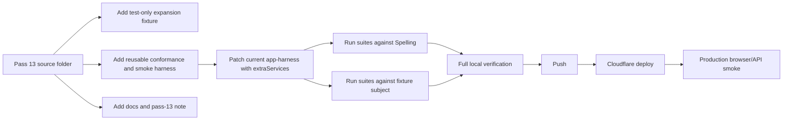

# feat: Integrate Pass 13 Subject Expansion Harness

## Overview

Integrate Pass 13 from `/Users/jamesto/Coding/ks2-mastery-legacy/pass13/ks2-platform-v2-pass13-subject-expansion` into the live `fol2/ks2-mastery` repo and deploy it to `ks2.eugnel.uk`.

Pass 13 is an expansion acceptance gate. It does not add Arithmetic or any other real new subject. It adds reusable conformance and golden-path smoke harnesses, a non-production candidate subject fixture, subject-expansion documentation, and a narrow GO decision for the future first Arithmetic thin slice.

The integration must be additive and selective because the Pass 13 source snapshot is behind the current production repo in several areas: production auth, OpenAI TTS, admin account role management, deployment OAuth wrapping, spelling sync fixes, monster-stage tuning, profile dropdown fixes, analytics search fixes, and legacy spelling progress import/export.

## Problem Frame

The development team will continue delivering pass folders that must be integrated into the production repo without regressions. For Pass 13, the main risk is treating the folder as a whole-repo replacement. That would overwrite recent production fixes and Cloudflare operational safeguards. The correct approach is to port Pass 13's subject-expansion assets and any required harness seam while preserving all newer production behaviour.

## Requirements Trace

- R1. Add every Pass 13 subject-expansion deliverable: reusable harness, candidate fixture, subject-expansion tests, docs, `pass-13.md`, and README update.
- R2. Preserve all current production fixes and features that are newer than the Pass 13 snapshot.
- R3. Avoid adding a real Arithmetic subject or widening product scope.
- R4. Keep English Spelling as the reference subject and prove it still passes the reusable conformance/smoke suites.
- R5. Keep deployment scripts OAuth-safe and do not regress the permanent `scripts/wrangler-oauth.mjs` fix.
- R6. Verify locally, push to GitHub, apply any required D1 migrations, deploy to Cloudflare, and run production browser/API smoke checks.

## Scope Boundaries

- Do not replace the current repo with the Pass 13 folder wholesale.
- Do not revert current production files to the Pass 13 snapshot.
- Do not add the real Arithmetic subject in this pass.
- Do not change Cloudflare D1 schema unless implementation discovers a genuine Pass 13 need; the report suggests no new migrations are required.
- Do not alter OpenAI TTS, production auth, admin role management, legacy progress import/export, or monster-stage thresholds except to keep tests compatible with them.

## Context & Research

### Relevant Code and Patterns

- `src/platform/core/subject-contract.js` enforces the module contract used by all subjects.
- `src/platform/core/subject-registry.js` registers Spelling plus placeholder subjects.
- `src/platform/core/repositories/*` already provides generic `subjectStates`, `practiceSessions`, `gameState`, and `eventLog` collections.
- `src/platform/events/runtime.js` publishes subject domain events and derived reward events.
- `tests/helpers/app-harness.js` is the test shell. Current production version includes important spelling auto-advance and persistence retry behaviour that the Pass 13 snapshot does not have.
- `tests/smoke.test.js`, `tests/runtime-boundary.test.js`, `tests/store.test.js`, and `tests/spelling.test.js` already cover the existing platform shell and Spelling behaviour.

### Institutional Learnings

- No `docs/solutions/` directory exists in this repo, so there are no stored compound-engineering learnings to apply.
- The important local learning from prior commits is that pass-folder integration must be a selective merge, not a snapshot overwrite.

### External References

- External research is not needed. This pass uses local platform contracts and test harness patterns only.

## Key Technical Decisions

- **Cherry-pick Pass 13, not sync directories:** The source folder is older than production in critical areas. Only Pass 13's new expansion assets and explicit doc updates should move across.
- **Keep the candidate fixture test-only:** `tests/helpers/expansion-fixture-subject.js` must not enter `src/subjects` or the production registry.
- **Patch `app-harness` minimally:** Add `extraServices` injection while preserving current auto-advance and retry-route preservation logic.
- **Treat docs as additive:** Add `docs/subject-expansion.md`, `docs/expansion-readiness.md`, and `pass-13.md`; update README wording without losing current production status notes.
- **No migration by default:** Pass 13 is test/docs/harness work. Deployment still runs migration listing to confirm no pending schema work.

## Open Questions

### Resolved During Planning

- **Should the Pass 13 folder replace the current repo?** No. It would regress recent production work.
- **Does Pass 13 ship Arithmetic?** No. It only creates the acceptance path and documents the future thin-slice scope.
- **Does Pass 13 require D1/R2 changes?** No evidence from the report or file list. D1 migration checks still run before deploy.

### Deferred to Implementation

- **Exact assertion adjustments for current Spelling UI text:** The Pass 13 tests reference snapshot-era strings. Implementation should update matchers only where current production copy intentionally differs.
- **Whether current production tests expose extra fixture incompatibilities:** Resolve while running the new `tests/subject-expansion.test.js` against the live codebase.

## High-Level Technical Design

> This illustrates the intended approach and is directional guidance for review, not implementation specification. The implementing agent should treat it as context, not code to reproduce.

## Implementation Units

- [x] **Unit 1: Add Expansion Test Assets**

**Goal:** Add the reusable subject expansion harness, non-production candidate fixture, and subject-expansion test file.

**Requirements:** R1, R3, R4

**Dependencies:** None

**Files:**
- Create: `tests/helpers/subject-expansion-harness.js`
- Create: `tests/helpers/expansion-fixture-subject.js`
- Create: `tests/subject-expansion.test.js`

**Approach:**
- Port the three Pass 13 test files.
- Keep the fixture inside `tests/helpers` only.
- Update assertions only where the current production UI copy or data shape intentionally differs.
- Ensure event assertions match current `src/platform/events/runtime.js` event storage shape.

**Execution note:** Characterisation-first where assertions conflict with current production behaviour. Do not loosen assertions just to pass.

**Patterns to follow:**
- `tests/smoke.test.js`
- `tests/runtime-boundary.test.js`
- `tests/helpers/app-harness.js`
- `src/platform/core/subject-contract.js`

**Test scenarios:**
- Happy path: Spelling satisfies the thin-slice module/service contract and renders Practice, Analytics, Profiles, Settings, and Method tabs.
- Happy path: The fixture subject satisfies the same contract without being registered in production.
- Integration: Spelling and fixture sessions write `child_subject_state` and `practice_sessions`.
- Integration: Spelling and fixture sessions publish domain events through `eventLog`.
- Error path: Broken render paths are contained inside the active subject tab.
- Error path: Broken action paths are contained inside the active subject tab.
- Smoke: Dashboard to session to summary and back works for both Spelling and the fixture.
- Smoke: Live sessions survive learner switching for both subjects.
- Smoke: Live sessions survive platform export/import restore for both subjects.

**Verification:**
- `node --test tests/subject-expansion.test.js` passes.
- No fixture subject appears in the production subject registry.

- [x] **Unit 2: Patch App Harness Seam**

**Goal:** Let tests inject non-Spelling services without regressing current harness behaviour.

**Requirements:** R1, R2, R4

**Dependencies:** Unit 1

**Files:**
- Modify: `tests/helpers/app-harness.js`

**Approach:**
- Add an optional `extraServices = {}` parameter.
- Merge `extraServices` into the `services` object after the Spelling service.
- Preserve current `ensureSpellingAutoAdvanceFromCurrentState()` and the current `persistence-retry` route-preserving reload behaviour. The Pass 13 snapshot removed or simplified these; that must not be copied.

**Patterns to follow:**
- Current `tests/helpers/app-harness.js`
- Current `src/main.js` subject action dispatch pattern

**Test scenarios:**
- Happy path: Fixture harness receives `services[EXPANSION_FIXTURE_SUBJECT_ID]`.
- Regression: Spelling auto-advance tests and smoke tests remain green.
- Regression: Existing persistence retry tests remain green and do not return the user to the front page.

**Verification:**
- Existing Spelling, persistence, smoke, and new subject-expansion tests all pass together.

- [x] **Unit 3: Add Pass 13 Documentation**

**Goal:** Add the subject-expansion checklist, readiness gate, and pass note while preserving current operational documentation.

**Requirements:** R1, R2, R3

**Dependencies:** Unit 1

**Files:**
- Create: `docs/subject-expansion.md`
- Create: `docs/expansion-readiness.md`
- Create: `pass-13.md`
- Modify: `README.md`

**Approach:**
- Port the new docs from Pass 13.
- Update README to mention the expansion harness and GO for the future Arithmetic thin slice.
- Preserve current README sections for production remote sync, OpenAI TTS, role-aware hubs, OAuth-safe deploy scripts, and current operating surfaces.
- Do not copy Pass 13's older `package.json` or deployment instructions.

**Patterns to follow:**
- `docs/operating-surfaces.md`
- `docs/reconstruction-plan.md`
- Existing README status and quick-start sections

**Test scenarios:**
- Documentation check: README lists the new docs and test harness without overstating full SaaS readiness.
- Documentation check: `docs/subject-expansion.md` states that the fixture is non-production and that Arithmetic is not included yet.
- Documentation check: `docs/expansion-readiness.md` gives a narrow GO for the first Arithmetic thin slice only.

**Verification:**
- The docs match the Pass 13 report and do not contradict current production behaviour.

- [x] **Unit 4: Regression Guard Against Snapshot Overwrite**

**Goal:** Confirm the integration did not remove current production changes that are absent from the Pass 13 folder.

**Requirements:** R2, R5

**Dependencies:** Units 1 to 3

**Files:**
- Inspect: `package.json`
- Inspect: `scripts/wrangler-oauth.mjs`
- Inspect: `src/platform/access/roles.js`
- Inspect: `worker/src/app.js`
- Inspect: `worker/src/repository.js`
- Inspect: `src/subjects/spelling/tts.js`
- Inspect: `worker/src/tts.js`
- Inspect: `src/platform/game/monster-system.js`
- Inspect: `src/platform/core/data-transfer.js`
- Inspect: `src/platform/core/dom-actions.js`

**Approach:**
- Use `git diff` before commit to verify only intended files changed.
- Confirm `package.json` still uses `ks2-mastery`, build/check/deploy scripts, and `scripts/wrangler-oauth.mjs`.
- Confirm admin role management and OpenAI TTS files remain untouched unless test compatibility requires a narrow update.

**Test scenarios:**
- Regression: `npm test` still includes auth, hub, TTS, import/export, monster, DOM action, sync/persistence, and spelling parity tests.
- Regression: No current production-only test file is deleted or weakened.

**Verification:**
- `git diff --name-status` shows an additive/narrow patch.
- `npm test` passes with the new subject-expansion tests included.

- [ ] **Unit 5: Local Verification, Commit, Push, Deploy, Production Smoke**

**Goal:** Ship Pass 13 to `fol2/ks2-mastery` and production safely.

**Requirements:** R5, R6

**Dependencies:** Units 1 to 4

**Files:**
- No planned source files; this unit validates and deploys the completed change.

**Approach:**
- Run the repo's standard verification commands.
- Commit with a focused Pass 13 message.
- Push `main` to GitHub.
- Confirm remote D1 migrations list; apply only if pending migrations appear.
- Deploy with the OAuth-safe npm script.
- Use gstack/bb-browser production smoke with existing login state when available.

**Test scenarios:**
- Local: Full unit suite passes.
- Local: Build and Worker dry-run pass.
- Remote: Production bootstrap returns the current signed-in account and platform role.
- Browser: `ks2.eugnel.uk` loads, signed-in state works, Spelling opens, Analytics still renders, Operations remains visible for `fol2hk@gmail.com`, and no obvious console errors appear.

**Verification:**
- `npm test`
- `npm run check`
- `git diff --check`
- `npm run db:migrations:list:remote`
- `npm run deploy:oauth`
- Production browser/API smoke evidence captured in the final handoff.

## System-Wide Impact

- **Interaction graph:** The new tests exercise subject module rendering, subject actions, repository persistence, event runtime publication, import/export, learner switching, and runtime containment.
- **Error propagation:** Broken subject render/action paths must remain contained by `createSubjectRuntimeBoundary`; failures should not crash the whole shell.
- **State lifecycle risks:** Live session state must remain serialisable and restorable through `child_subject_state` and platform import/export.
- **API surface parity:** No production API contract change is intended. Worker routes should remain unchanged.
- **Integration coverage:** The new harness deliberately crosses module/service/repository/event/render boundaries.
- **Unchanged invariants:** Spelling remains the only production real subject; placeholder subjects remain placeholders; current auth/TTS/admin/deploy behaviour remains intact.

## Risks & Dependencies

| Risk | Mitigation |
| --- | --- |
| Pass 13 snapshot overwrites newer production fixes | Use selective add/patch only; inspect `git diff --name-status` before commit. |
| New harness assumes older Spelling copy or state shape | Adjust assertions to current intentional behaviour; do not change Spelling to satisfy stale tests. |
| Fixture event shape mismatches current event runtime | Align fixture event payload with existing `eventToken` and `eventLog` normalisation. |
| App harness patch regresses auto-advance or retry-sync behaviour | Add only `extraServices`; preserve existing `finally` scheduling and retry reload path. |
| Deployment uses stale Cloudflare API token | Keep and use `scripts/wrangler-oauth.mjs` via `npm run deploy:oauth`. |

## Documentation / Operational Notes

- This plan should be executed with `ce:work` after review.
- Browser production verification should use gstack or `bb-browser` with the user's logged-in state.
- If implementation discovers a conflict between Pass 13 and current production behaviour, current production behaviour wins unless the Pass 13 report explicitly says it is replacing that behaviour.
