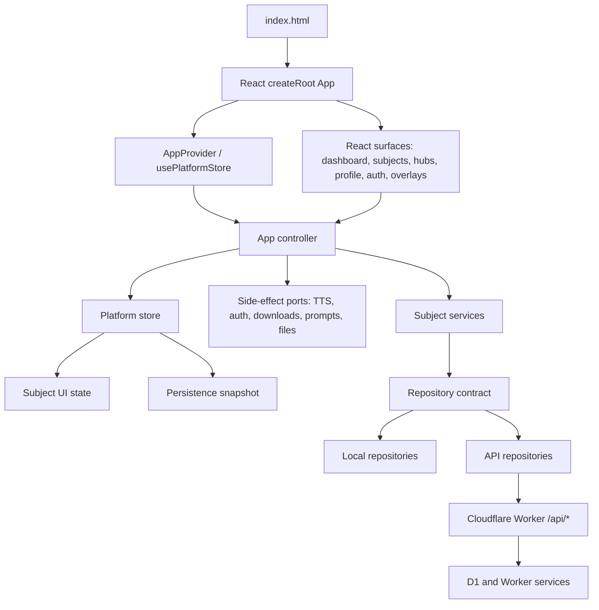

<!-- /autoplan restore point: /Users/jamesto/.gstack/projects/fol2-ks2-mastery/main-autoplan-restore-20260422-190409.md -->
---
title: "refactor: Convert KS2 Mastery to Full-Stack React"
type: refactor
status: approved
date: 2026-04-22
deepened: 2026-04-22
approved: 2026-04-22
---

# refactor: Convert KS2 Mastery to Full-Stack React

## Overview

Convert the browser application from a vanilla string-rendered shell with React islands into a single React-owned application shell, while preserving the current Cloudflare Worker API, D1-backed repository contract, spelling engine, subject expansion harness, remote sync semantics, adult hub access honesty, and deployment safety.

This is a framework migration and production-sensitive refactor, not a product feature pass. The intended end state is a React SPA deployed as static Worker assets, backed by the existing Worker routes under `/api/*`. The Worker remains the full-stack backend boundary; React owns the browser UI and orchestration layer.

## Problem Frame

The repo already has clean platform boundaries, but the browser shell is still split across `src/main.js`, `src/platform/ui/render.js`, subject-owned template strings, root-level DOM event delegation, and three global React island renderers in `src/surfaces/home/index.jsx`. This creates two UI runtimes at once:

- React manages dashboard, Codex, and top navigation islands.
- `root.innerHTML = renderApp(...)` still owns most routes, focus restoration, adult hubs, profile settings, subject screens, spelling scenes, toasts, and modal choreography.

The conversion should finish the move that the current architecture already points towards: keep deterministic services and repository adapters intact, but make React the single UI runtime so future subjects and SaaS surfaces can be composed as components rather than HTML strings.

## Planning Bootstrap

No matching `docs/brainstorms/*-requirements.md` file exists for this request, so this plan proceeds from James's direct request with these explicit assumptions:

- "Full stack React conversion" means a full browser React app backed by the existing Cloudflare Worker API, not a move to server-side rendering or a Next.js-style framework.
- No product behaviour should change unless the implementation uncovers a bug that must be fixed to preserve parity.
- The spelling learning engine remains preserved behind its service boundary.
- Cloudflare D1/R2/Worker deployment paths remain production-sensitive.
- Existing dirty asset changes in the worktree are unrelated to this planning task and must not be reverted by the implementer.
- The React SPA assumption should be rechecked after Units 2 and 2.5, when the team has real evidence about build feedback, asset handling, Cloudflare deployment friction, and the Spelling interaction spike.

## Requirements Trace

- R1. Replace the root `innerHTML` render loop with a single React root that owns routing, shell chrome, surfaces, overlays, and subject screens.
- R2. Preserve current domain boundaries: store, subject modules, subject services, repository adapters, event runtime, Worker API routes, D1 schema, and spelling content repository.
- R3. Preserve production-sensitive behaviours: remote sync/degraded states, learner state, spelling content import/publish/reset, OpenAI TTS, adult hub read-only access, monster celebrations, import/export, and OAuth-safe deployment scripts.
- R4. Keep English Spelling parity intact while migrating its UI from template strings to React components.
- R5. Keep the subject expansion harness valid for future non-Spelling subjects under the new React subject contract.
- R6. Replace global React island registration (`window.__ks2HomeSurface`, `window.__ks2CodexSurface`, `window.__ks2SubjectTopNavSurface`) with explicit imports and component composition.
- R7. Maintain Cloudflare Worker static asset behaviour with `/api/*` routed to the Worker first and SPA navigation falling back to `index.html`.
- R8. Add migration-focused tests that prove controller behaviour, React rendering, subject runtime containment, and API/read-model parity before deployment.
- R9. Define and verify route-level UI state matrices, accessibility contracts, responsive breakpoints, and the Spelling interaction contract before broad route migration.

## Scope Boundaries

- Do not rewrite the spelling engine, scheduling, marking, retry flow, content model, or analytics rules.
- Do not add Arithmetic or another real subject as part of this conversion.
- Do not add billing, invites, organisations, messaging, or richer parent reporting.
- Do not change the Worker API contract unless the React client needs a thin client wrapper around an existing route.
- Do not add a D1 migration unless implementation proves a real backend contract change is unavoidable.
- Do not switch to SSR, React Server Components, Next.js, Remix, or a new data framework in this pass.
- Do not weaken English Spelling parity, subject expansion coverage, mutation safety, or adult access rules.

## Context & Research

### Relevant Code and Patterns

- `index.html` currently loads `src/bundles/home.bundle.js` before `src/main.js`.
- `src/main.js` owns boot, auth screen rendering, repository selection, service creation, adult hub loading state, global action dispatch, focus restoration, modal focus handling, shortcuts, TTS side effects, and `root.innerHTML = renderApp(...)`.
- `src/platform/ui/render.js` is the string-rendered shell. It already delegates dashboard, Codex, and subject top navigation to React mount points, but still renders adult hubs, profile settings, subject layout, toasts, monster celebration overlay, persistence banners, and fallback screens as strings.
- `src/surfaces/home/index.jsx` exposes three React island renderers on `window`.
- `src/platform/core/store.js` is a small external store with `subscribe()` and `getState()`, which is a good fit for a React bridge based on `useSyncExternalStore`.
- `src/platform/core/repositories/*` defines the production-critical local/API repository contract. The API adapter queues optimistic writes, tracks pending operations, and exposes explicit persistence snapshots.
- `src/platform/core/subject-contract.js` validates the current subject module contract at startup. It still expects `renderPractice()` to return string markup.
- `src/subjects/spelling/module.js` is the largest remaining template-string UI surface and also owns spelling action routing. Its service calls should stay; its rendering should move to components.
- `tests/helpers/app-harness.js` mirrors the current `main.js` dispatch/render shape and should become the first consumer of the extracted app controller.
- `tests/subject-expansion.test.js` and `tests/helpers/subject-expansion-harness.js` are the acceptance gate for future real subjects.
- `worker/src/app.js` already exposes the full backend API needed by the React client: auth/session, bootstrap, learner writes, subject state, practice sessions, game state, event log, spelling content, TTS, parent/admin hubs, and account role management.
- `wrangler.jsonc` already serves `dist/public` as Worker static assets, uses `not_found_handling: "single-page-application"`, and routes `/api/*` Worker-first.
- `package.json` currently has an OAuth-safe `check` path but its default `deploy` script still uses raw `npx wrangler deploy`; Unit 2 must correct this if it modifies package scripts.
- `scripts/assert-build-public.mjs` currently requires `src/main.js` and `src/bundles/home.bundle.js`, and explicitly rejects Worker source in `dist/public`. The React bundle migration must update these public-output assertions rather than copying Worker code into static assets.

### Institutional Learnings

- No `docs/solutions/` directory exists, so there are no stored compound-engineering learnings to apply.
- `docs/architecture.md` explicitly says the shell can move back onto React because the subject contract and repository boundary already exist.
- `docs/repositories.md`, `docs/mutation-policy.md`, and `docs/state-integrity.md` make repository normalisation, remote sync honesty, and mutation safety non-negotiable boundaries.
- `docs/subject-expansion.md` establishes that future subjects should reuse generic repositories, event publication, runtime containment, and the reusable conformance/smoke harness.
- `docs/audit.md` warns against global-script frontend integration and build-order architecture. The current repo has improved that materially, but the remaining React island globals are the same class of risk in smaller form.

### External References

- React official docs support incremental adoption and describe moving from isolated React components towards React owning the whole page.
- React `createRoot` docs distinguish a single root for a fully React app from multiple roots for partial adoption, and note that repeated `root.render()` is not the normal end-state for a full React app.
- React `useSyncExternalStore` is designed for subscribing React components to an existing external store.
- Cloudflare Workers docs support static assets deployed with a Worker, SPA fallback through `not_found_handling`, and Worker-first routing for API paths.
- esbuild supports the automatic JSX runtime already used by `scripts/build-bundles.mjs`.

## Key Technical Decisions

- **Use a React SPA backed by the existing Worker API, not SSR:** The current Worker API and repository contract already provide the full-stack boundary. SSR would add a second migration axis without solving the current `innerHTML`/island split.
- **Keep the store and repositories first, then move UI ownership:** Replacing state management during a UI migration would raise sync and learner-state risk. React should subscribe to the current store first, then later refactors can decide whether a React-native state layer is worth it.
- **Extract an app controller before converting screens:** `src/main.js` currently mixes boot, side effects, dispatch, and DOM concerns. A controller seam lets the harness, React root, and tests share the same behaviour before markup changes begin.
- **Keep the controller small and non-frameworky:** The controller should expose a minimal surface such as `boot`, `getSnapshot`, `subscribe`, `dispatch`, `loadHub`, and ports. It should not become a new event bus, state manager, or parallel routing framework.
- **Make the controller snapshot the single client view model:** React must subscribe to a controller snapshot that combines the platform store with current non-store UI state: auth requirement, persistence labels, TTS playback state, adult hub load state, admin account directory, spelling content mutation state, toast timers, global session metadata, and runtime-boundary status.
- **Transition the subject contract with an adapter:** Subjects should gain a React component surface while retaining enough compatibility to keep Spelling and the expansion fixture green during migration.
- **Port Spelling rendering last among core surfaces:** Spelling has the largest template surface and highest parity risk. Shared shell, controller, hubs, and subject route infrastructure should land first.
- **Keep esbuild initially, but add a post-Unit-2 tooling gate:** The repo already uses esbuild with React automatic JSX and Wrangler static assets. After the single React root proves the migration path, explicitly decide whether esbuild remains sufficient or whether Vite plus the Cloudflare plugin is justified for dev-server, HMR, asset-import, or code-splitting needs.
- **Use safe controller callbacks instead of raw `data-action` as the React default:** `data-action` can remain temporarily inside legacy adapters, but React components should call typed controller action wrappers that still flow through central dispatch, read-only policy, and error containment.
- **Preserve Worker route contracts:** React client wrappers can be created for ergonomics, but `/api/bootstrap`, mutation routes, hub routes, TTS, and content routes should keep their current semantics.

## Open Questions

### Resolved During Planning

- **Should this become a server-rendered React framework migration?** No. The safer first target is a client React SPA over the current Worker API.
- **Should state management be replaced while migrating UI?** No. Use `useSyncExternalStore` to bridge the existing store and keep repository semantics stable.
- **Should the Worker/D1 schema change?** No planned schema change. The current API already exposes the required backend contracts.
- **Should Vite be adopted immediately?** No. Keep esbuild initially and defer Vite/Cloudflare plugin adoption until the UI migration no longer depends on it.
- **Should the SPA assumption be revisited?** Yes. Record build/tooling evidence after Unit 2, then make the continue-or-narrow decision after Unit 2.5 when the UI contract and Spelling spike are also available. Do not combine that decision with the initial controller extraction.

### Deferred to Implementation

- **Exact component file split inside Spelling:** The plan names the expected component areas, but implementation should adjust file granularity based on real duplication and readability.
- **Whether to add DOM/browser tooling outside Spelling:** Use Playwright Test as the migration's browser proof tool for Unit 2.5 and later responsive smoke. Keep non-interactive React coverage in Node/server-render helpers where possible, and add any further DOM library only if Playwright plus Node coverage leaves a specific gap.
- **Final focus-management implementation details:** Modal focus trap, restored focus, replay glow, and hero luminance probing must be preserved, but React may implement them through effects, refs, and portals rather than one-to-one copies of current helpers.
- **Whether to adopt Vite after conversion:** Revisit after the single React root exists and build/deploy friction is visible.

## High-Level Technical Design

> *This illustrates the intended approach and is directional guidance for review, not implementation specification. The implementing agent should treat it as context, not code to reproduce.*



The important shape is that React becomes the only DOM owner. The app controller remains the bridge between React events and the existing deterministic store/service/repository world.

## Implementation Units

- [x] **Unit 1: Extract App Controller and Side-Effect Ports**

**Goal:** Move `src/main.js` orchestration into a testable controller that React and the Node harness can share.

**Requirements:** R1, R2, R3, R8

**Dependencies:** None

**Files:**
- Create: `src/platform/app/bootstrap.js`
- Create: `src/platform/app/create-app-controller.js`
- Create: `src/platform/app/controller-snapshot.js`
- Create: `src/platform/app/surface-models.js`
- Create: `src/platform/app/side-effect-ports.js`
- Modify: `src/main.js`
- Modify: `tests/helpers/app-harness.js`
- Test: `tests/app-controller.test.js`
- Test: `tests/persistence.test.js`
- Test: `tests/smoke.test.js`

**Approach:**
- Move repository selection, service creation, hub loading state, dispatch handling, persistence retry, content mutation refresh, event runtime publication, and route actions behind `createAppController()`.
- Pass browser-only behaviours through ports: `fetch`, `storage`, `document`, `location`, `confirm`, `alert`, file picking, JSON download, TTS, and timer functions.
- Define `controller-snapshot.js` as the only React-facing read model. It must combine `store.getState()` with non-store UI state currently held in module variables: auth requirement, session metadata, adult hub state, admin account directory, TTS playback, spelling content mutation status, toast scheduling, and runtime-boundary metadata.
- Define safe action wrappers for React components. Wrappers may be exposed as callbacks, but they must still route through central dispatch/read-only policy/error containment rather than letting components mutate stores, repositories, or global state directly.
- Keep `createStore()`, repositories, subject services, event runtime, and runtime boundary unchanged at this stage.
- Keep the controller API deliberately narrow: subscribe/read snapshot, dispatch actions, boot/load route data, and access ports. Avoid adding a second event bus or React-specific state container here.
- Keep `src/main.js` as a thin bootstrapper until the React entry replaces it.

**Execution note:** Characterisation-first. The controller must first reproduce the current harness behaviour before React components consume it.

**Patterns to follow:**
- `src/main.js`
- `tests/helpers/app-harness.js`
- `src/platform/core/store.js`
- `src/platform/core/repositories/api.js`

**Test scenarios:**
- Happy path: local bootstrap creates local repositories, a spelling service, a store, and a selected learner without rendering DOM.
- Happy path: remote bootstrap uses API repositories and does not seed a writable learner when the Worker bootstrap is empty.
- Integration: `dispatch("spelling-start")` updates subject UI, writes subject state, publishes events, and schedules TTS through the port.
- Integration: `dispatch("persistence-retry")` preserves the current route and clears runtime boundary state on success.
- Integration: hub loading, admin account saving, content mutation, TTS playback, auth-required, and toast timer state all appear in the controller snapshot and notify subscribers exactly once per logical state change.
- Policy: React-safe callbacks still pass through read-only adult access checks and subject/global error containment.
- Error path: subject action throw is captured in `runtimeBoundary` and does not mutate unrelated learner or spelling state.
- Error path: signed-in parent/admin hub load failure produces a readable hub state without crashing controller dispatch.
- Regression: monster celebration delay/release behaviour still matches the current spelling session lifecycle.

**Verification:**
- Existing smoke, persistence, runtime-boundary, hub, and spelling tests can run through the controller-backed harness with no product copy or state-contract regression.

- [x] **Unit 2: Add Single React Root and Store Bridge**

**Goal:** Introduce one React application root that subscribes to the existing store and renders routes without global island renderers.

**Requirements:** R1, R2, R3, R6, R7, R8

**Dependencies:** Unit 1

**Files:**
- Create: `src/app/entry.jsx`
- Create: `src/app/App.jsx`
- Create: `src/app/AppProviders.jsx`
- Create: `src/surfaces/auth/AuthSurface.jsx`
- Create: `src/platform/react/use-platform-store.js`
- Create: `src/platform/react/ErrorBoundary.jsx`
- Create: `tests/helpers/react-render.js`
- Create: `scripts/build-client.mjs`
- Modify: `index.html`
- Modify: `package.json`
- Modify: `scripts/build-bundles.mjs`
- Modify: `scripts/build-public.mjs`
- Modify: `scripts/assert-build-public.mjs`
- Test: `tests/react-app-shell.test.js`
- Test: `tests/react-auth-boot.test.js`
- Test: `tests/build-public.test.js`

**Approach:**
- Use `createRoot()` once for `#app`.
- Bridge `controller.subscribe()` and `controller.getSnapshot()` with a custom `usePlatformStore()` hook based on `useSyncExternalStore`. The hook should not read `store.getState()` directly, because the UI also depends on non-store controller state.
- Render a route-level `<App />` that receives the controller through context and delegates route bodies to surface components.
- Move the unauthenticated remote boot path into the controller snapshot and React root in this unit. `AuthSurface` should replace `renderAuthScreen()` before Unit 2 claims a single React root, including credential sign-in, register, social-provider start, error display, and session-required states.
- Keep esbuild as the initial bundler, but change it from a home-island bundle to a single app bundle.
- Add an explicit post-Unit-2 build-tool decision record. Keep esbuild if the bundle, tests, and Cloudflare asset flow stay simple; adopt Vite before broad surface migration if HMR, asset imports, or code splitting become material migration drag.
- Keep `wrangler.jsonc` static asset semantics: built client assets in `dist/public`, `/api/*` Worker-first, SPA fallback to `index.html`.
- Because Unit 2 modifies `package.json`, fix the default deploy path to be OAuth-safe through `scripts/wrangler-oauth.mjs` and keep `deploy:ci` aligned with that default unless the authentication strategy is deliberately changed and documented.
- Start non-interactive React coverage with server-render or lightweight helper tests. Real interaction, focus, keyboard, modal, and responsive proof belongs to the Playwright-backed Unit 2.5 gate.

**Patterns to follow:**
- `src/surfaces/home/index.jsx`
- `scripts/build-bundles.mjs`
- `scripts/build-public.mjs`
- `wrangler.jsonc`

**Test scenarios:**
- Happy path: rendering `<App />` for dashboard includes the home surface without requiring `window.__ks2HomeSurface`.
- Happy path: rendering `<App />` for subject route includes the subject top navigation through imports, not a global mount.
- Happy path: unauthenticated remote boot renders `AuthSurface` through the React root and does not use `root.innerHTML` or a permanent unresolved boot promise.
- Error path: failed credential and social sign-in attempts update auth state through the controller snapshot without leaving stale form state or duplicate listeners.
- Edge case: store subscription update re-renders the active route exactly once for a learner selection change.
- Error path: a React render throw is caught by `ErrorBoundary` and surfaced as a contained app-level or subject-level fallback.
- Build: production build emits a single app bundle and no longer requires `src/bundles/home.bundle.js` to boot.
- Deployment: built `dist/public/index.html` references bundled assets and still leaves Worker API paths under `/api/*`.
- Deployment: `scripts/assert-build-public.mjs` no longer requires legacy source entry points or the home island bundle, still rejects Worker source in public output, and verifies the new app bundle instead.

**Verification:**
- The app can be built and served from `dist/public` with the Worker API config unchanged.
- No global React island symbols are required for dashboard, Codex, or subject top navigation.

- [x] **Unit 2.5: Prove UI/UX Migration Contract Before Broad Surface Porting**

**Goal:** Turn the current UI behaviour into an explicit migration contract so React ports preserve learner, parent, and operator experience instead of only matching component output.

**Requirements:** R1, R3, R4, R8, R9

**Dependencies:** Units 1 and 2

**Files:**
- Create: `docs/plans/2026-04-22-001-react-migration-ui-contract.md`
- Create: `playwright.config.mjs`
- Create: `tests/helpers/browser-app-server.js`
- Create or modify: `tests/react-spelling-scene-spike.test.js`
- Create or modify: `tests/react-accessibility-contract.test.js`
- Create or modify: `tests/browser-react-migration-smoke.test.js`
- Modify: `package.json`
- Modify: `tests/smoke.test.js`
- Modify: `tests/dom-actions.test.js`

**Approach:**
- Write a persona route hierarchy for the migrated app before Unit 3: each route needs a primary user, primary question, primary action, secondary diagnostics, and route-level rescue path.
- Write state matrices for boot/auth, persistence, dashboard, profile, Parent Hub, Admin / Operations, subject route, Spelling setup, Spelling session, Spelling summary, word bank, and word detail modal. Include loading, empty, error, disabled, partial, degraded, retrying, and success where relevant.
- Make the narrow Spelling session scene spike a hard prerequisite for broad migration. It should prove controlled input, answer submission, replay, TTS failure, shortcuts, modal open/close, focus restoration, no answer leak, and no visible flicker under React ownership.
- Add Playwright Test as the explicit browser proof tool for the migration, with a local app server/helper that can run against the built public output or a minimal test build. Keep the dependency scoped to migration smoke and interaction tests.
- Convert accessibility from "preserve" to testable acceptance: route focus targets, modal first focus, modal return focus, Escape semantics, `aria-live` feedback, reduced motion, replay in-flight/failure states, and keyboard shortcut ownership.
- Record a responsive matrix for `360x740`, `390x844`, `768x1024`, `1024` wide, and `1440` wide viewports, covering Spelling session, word bank modal, dashboard navigation, Parent Hub, Admin / Operations, and profile settings.
- Treat Spelling DOM interaction coverage as required, not optional. Server-render tests may support model checks, but Playwright or equivalent browser assertions must prove focus, keyboard, form, modal, TTS-failure, and responsive behaviour before Unit 3.
- Preserve CSS classes and visible behaviour first, but do not blindly preserve developer-facing Parent/Admin copy if the route hierarchy identifies a clearer parent/operator label that can be changed without product scope creep.

**Patterns to follow:**
- `src/main.js` focus trap, shortcut, toast, and dispatch behaviours
- `src/subjects/spelling/module.js` setup, session, word bank, modal, and hidden-layout behaviours
- `src/subjects/spelling/shortcuts.js`
- `styles/app.css` responsive, focus-visible, reduced-motion, safe-area, and modal rules
- `docs/operating-surfaces.md`

**Test scenarios:**
- Spelling scene spike: one-word round preserves input focus, submit semantics, replay state, answer feedback, auto-advance timing, and keyboard shortcuts.
- Word-bank modal: opening a row traps focus, Escape closes the modal, and focus returns to the originating row.
- TTS: replay failure shows contained feedback and does not break the route.
- Callback containment: a React callback throw is reported through the controller's safe dispatch path, and adult read-only write blocking still applies.
- Reduced motion: celebration, replay, and modal transitions remain usable when motion is reduced.
- Responsive: each required viewport can render the primary migrated route state without clipped controls, overlapping text, or unreachable actions.
- Adult hubs: readable learner state and writable learner state remain visually distinct in loading, partial, read-only, and error states.

**Verification:**
- The UI contract document exists and is referenced by Units 3-6.
- The Spelling spike, accessibility contract, and responsive smoke checks pass before Unit 3 starts.
- The Unit 2.5 strategic gate records whether the migration continues to Units 3-7, narrows to a smaller React tranche, or pauses for the first Arithmetic thin-slice estimate.

- [ ] **Unit 3: Port Shared Shell, Profile, Dashboard, Codex, and Overlays**

**Goal:** Convert shared UI surfaces from string templates or global islands into normal React components after auth is already React-owned.

**Requirements:** R1, R3, R4, R6, R8

**Dependencies:** Units 2 and 2.5

**Files:**
- Move/Modify: `src/surfaces/home/TopNav.jsx` -> `src/surfaces/shell/TopNav.jsx`
- Modify: `src/surfaces/home/HomeSurface.jsx`
- Modify: `src/surfaces/home/CodexSurface.jsx`
- Create: `src/surfaces/shell/PersistenceBanner.jsx`
- Create: `src/surfaces/shell/ToastShelf.jsx`
- Create: `src/surfaces/shell/MonsterCelebrationOverlay.jsx`
- Create: `src/surfaces/shell/SubjectBreadcrumb.jsx`
- Create: `src/surfaces/profile/ProfileSettingsSurface.jsx`
- Modify: `src/platform/ui/render.js`
- Modify: `src/platform/ui/luminance.js`
- Test: `tests/react-shared-surfaces.test.js`
- Test: `tests/render.test.js`
- Test: `tests/smoke.test.js`
- Test: `tests/local-review-profile.test.js`

**Approach:**
- Reuse existing home/Codex React components by importing them into `<App />`.
- Move shared chrome out of `src/surfaces/home` so subject, hub, profile, and dashboard routes do not depend on a home-specific namespace.
- Convert persistence banner, toast shelf, monster celebration overlay, and profile settings from string templates to components.
- Preserve current UI copy, CSS class names, action semantics, and accessibility affordances.
- Replace root-level `data-action` handling with callback props where the component is fully React-owned.
- Keep a temporary legacy fallback only for surfaces not yet migrated by later units.
- Implement the route states defined in the UI contract rather than relying on a single happy-path render for each migrated surface.

**Patterns to follow:**
- `src/surfaces/home/HomeSurface.jsx`
- `src/surfaces/home/CodexSurface.jsx`
- `src/platform/ui/render.js`
- `src/main.js` focus and toast scheduling behaviours

**Test scenarios:**
- Happy path: dashboard renders learner switcher, persistence state, subject cards, Parent Hub entry point, and Codex actions from React.
- Happy path: Codex route renders the existing monster roster model and preview lightbox.
- Happy path: profile settings can add, edit, delete, reset, export, and import learners through controller actions.
- Edge case: signed-in remote shell with zero writable learners renders honest empty states rather than fabricating a learner.
- Edge case: route-level loading, empty, partial, degraded, retrying, and failed states use the state matrix copy, affordances, focus target, and `aria-live` behaviour from the UI contract.
- Error path: degraded persistence banner shows retry affordance and debug information equivalent to the current template.
- Integration: monster celebration overlay still delays until session end, displays the correct kind, and dismisses through the store queue.
- Accessibility: word-detail modal focus behaviour is not regressed by moving global focus choreography into React effects.

**Verification:**
- Existing render and smoke assertions that pin visible copy still pass after being pointed at React-rendered surfaces.
- Browser smoke covers the UI contract viewports for dashboard, profile, auth, Codex, persistence banner, toasts, and overlays.

- [ ] **Unit 4: Convert Parent Hub and Admin / Operations to React**

**Goal:** Move adult operating surfaces to React while preserving signed-in Worker payload loading, readable viewer selection, and read-only write blocking.

**Requirements:** R1, R2, R3, R7, R8

**Dependencies:** Units 1 to 3

**Files:**
- Create: `src/surfaces/hubs/ParentHubSurface.jsx`
- Create: `src/surfaces/hubs/AdminHubSurface.jsx`
- Create: `src/surfaces/hubs/AdultLearnerSelect.jsx`
- Create: `src/surfaces/hubs/ReadOnlyLearnerNotice.jsx`
- Modify: `src/platform/hubs/api.js`
- Modify: `src/platform/hubs/parent-read-model.js`
- Modify: `src/platform/hubs/admin-read-model.js`
- Modify: `src/platform/hubs/shell-access.js`
- Modify: `src/platform/app/create-app-controller.js`
- Test: `tests/react-hub-surfaces.test.js`
- Test: `tests/hub-api.test.js`
- Test: `tests/hub-read-models.test.js`
- Test: `tests/hub-shell-access.test.js`
- Test: `tests/worker-hubs.test.js`
- Test: `tests/worker-access.test.js`

**Approach:**
- Keep read-model builders and Worker route contracts unchanged.
- Have React components render the controller's hub state, including loading, loaded, error, selected learner, accessible learners, account role directory, and notice fields.
- Keep `buildParentHubAccessContext()`, `buildAdminHubAccessContext()`, and `readOnlyLearnerActionBlockReason()` as the central read-only rule helpers.
- Trigger signed-in hub loads through controller actions/effects instead of `queueMicrotask()` calls inside `render()`.
- Preserve the separation between adult-surface selected readable learner and writable subject-shell learner.
- Apply the UI contract hierarchy so Parent Hub answers parent questions first, Admin / Operations answers operator diagnostics first, and developer-only labels are kept only where they are genuinely diagnostic.

**Patterns to follow:**
- `src/platform/ui/render.js#renderParentHub`
- `src/platform/ui/render.js#renderAdminHub`
- `src/platform/hubs/api.js`
- `docs/operating-surfaces.md`

**Test scenarios:**
- Happy path: signed-in Parent Hub renders live Worker payload with accessible learners and selected learner labels.
- Happy path: signed-in Admin / Operations renders content status, account roles, audit entries, and learner diagnostics.
- Edge case: viewer membership renders read-only labels and disabled write affordances while still allowing hub diagnostics.
- Edge case: loading with stale data, partial Worker payloads, no readable learners, read-only learner selection, role save pending, role save failed, and content validation failed all render distinct states from the UI contract.
- Error path: failed parent/admin hub fetch renders a route-level error card without changing the writable shell learner.
- Integration: changing adult learner selection reloads the correct hub payload and syncs writable learner selection only when that learner exists in bootstrap state.
- Security/permission: parent role cannot open Admin / Operations; ops role does not get Parent Hub access without the right role and readable membership.

**Verification:**
- Worker hub tests remain green, and React hub tests prove the same payload shape is rendered without synthetic local membership drift.

- [ ] **Unit 5: Introduce React Subject Contract and Route**

**Goal:** Replace subject string rendering with a React-capable subject surface while preserving runtime containment and the expansion harness.

**Requirements:** R1, R2, R5, R8

**Dependencies:** Units 1 to 4

**Files:**
- Modify: `src/platform/core/subject-contract.js`
- Modify: `src/platform/core/subject-registry.js`
- Create: `src/surfaces/subject/SubjectRoute.jsx`
- Create: `src/surfaces/subject/SubjectRuntimeFallback.jsx`
- Create: `src/surfaces/subject/SubjectRouteContext.js`
- Modify: `src/platform/core/subject-runtime.js`
- Modify: `src/subjects/placeholders/module-factory.js`
- Modify: `tests/helpers/subject-expansion-harness.js`
- Modify: `tests/helpers/expansion-fixture-subject.js`
- Test: `tests/react-subject-contract.test.js`
- Test: `tests/subject-contract.test.js`
- Test: `tests/subject-expansion.test.js`
- Test: `tests/runtime-boundary.test.js`

**Approach:**
- Extend subject modules to support a React practice component while temporarily accepting `renderPractice()` for compatibility.
- Make `SubjectRoute` resolve the active subject and render the React subject component through a runtime boundary.
- Preserve subject-local containment for render and action failures, with the fallback confined to the active subject route.
- Update placeholder and expansion fixture subjects before Spelling so the contract change is proven on a small surface first.
- Add a compatibility sunset test or warning: legacy `renderPractice()` should be accepted only until Unit 7, unless a follow-up plan explicitly keeps a long-term adapter.
- Keep the service transition shape `{ ok, changed, state, events, audio }` unchanged.

**Execution note:** Start with failing conformance coverage for the React subject contract before modifying the registry.

**Patterns to follow:**
- `src/platform/core/subject-contract.js`
- `src/platform/core/subject-runtime.js`
- `tests/helpers/subject-expansion-harness.js`
- `tests/runtime-boundary.test.js`

**Test scenarios:**
- Happy path: a subject exposing a React practice component passes registry validation.
- Happy path: legacy `renderPractice()` subjects are still accepted only during the compatibility window.
- Happy path: placeholder subjects render through `SubjectRoute` without route-specific shell special cases.
- Integration: expansion fixture starts, answers, completes, persists subject state, writes practice sessions, and emits events under the React route.
- Error path: React subject render failure shows `SubjectRuntimeFallback` and leaves dashboard, learner switching, toasts, and other subjects usable.
- Error path: subject action failure is captured with the same runtime-boundary metadata as the current implementation.

**Verification:**
- The subject expansion harness proves the React subject route still supports Spelling and the fixture before the Spelling UI is ported.

- [ ] **Unit 6: Port English Spelling UI to React Components**

**Goal:** Convert `src/subjects/spelling/module.js` rendering into React components without changing the spelling service, persistence, parity, or action semantics.

**Requirements:** R2, R3, R4, R5, R8

**Dependencies:** Unit 5

**Files:**
- Modify: `src/subjects/spelling/module.js`
- Create: `src/subjects/spelling/components/SpellingPracticeSurface.jsx`
- Create: `src/subjects/spelling/components/SpellingSetupScene.jsx`
- Create: `src/subjects/spelling/components/SpellingSessionScene.jsx`
- Create: `src/subjects/spelling/components/SpellingSummaryScene.jsx`
- Create: `src/subjects/spelling/components/SpellingWordBankScene.jsx`
- Create: `src/subjects/spelling/components/SpellingWordDetailModal.jsx`
- Create: `src/subjects/spelling/components/spelling-view-model.js`
- Modify: `src/subjects/spelling/session-ui.js`
- Modify: `src/platform/app/create-app-controller.js`
- Test: `tests/react-spelling-surface.test.js`
- Test: `tests/spelling.test.js`
- Test: `tests/spelling-parity.test.js`
- Test: `tests/smoke.test.js`
- Test: `tests/subject-expansion.test.js`
- Test: `tests/dom-actions.test.js`

**Approach:**
- Split the current template functions by scene: setup, session, summary, word bank, modal, shared controls, and view-model helpers.
- Keep `handleAction()` in the subject module initially so all existing service calls remain stable.
- Replace `data-action` form/button contracts with callback props where practical, while keeping form data shape and keyboard shortcut semantics equivalent.
- Preserve spelling transient UI state in the store: word-bank search, status filter, modal slug/mode, drill typed value, and drill result.
- Preserve accessibility details: modal focus trap, restore focus to originating word row, replay controls, input autofocus, and keyboard shortcuts.
- Preserve hero background and luminance behaviour through React effects and refs.
- Implement the Spelling interaction contract from Unit 2.5 before broad scene cleanup, especially controlled input ownership, TTS replay/failure, shortcut routing, modal focus, no answer leak, SATs hidden-layout parity, and no route flicker.

**Patterns to follow:**
- `src/subjects/spelling/module.js`
- `src/subjects/spelling/service.js`
- `src/subjects/spelling/service-contract.js`
- `src/subjects/spelling/shortcuts.js`
- `tests/spelling-parity.test.js`

**Test scenarios:**
- Happy path: setup scene renders Smart Review, Trouble Drill, SATs Test, round length, year filter, and options with current enabled/disabled behaviour.
- Happy path: starting a one-word round enters session, accepts a correct answer, advances, and reaches summary.
- Happy path: summary drill-all and drill-single start the expected follow-up session without changing service semantics.
- Happy path: word bank search/filter renders the same visible rows and opens explainer/drill modal.
- Edge case: drill modal never writes scheduler progress and never leaks the answer before the learner checks.
- Edge case: SATs mode hides irrelevant tweaks while preserving layout height.
- Edge case: setup empty content, no trouble words, TTS unavailable, TTS in-flight, awaiting advance, incorrect answer, empty summary, word-bank no match, and modal entries with missing explanation or sentence all render explicit states from the UI contract.
- Error path: TTS replay failure is contained by the existing TTS port and does not break the React route.
- Integration: spelling events still append to event log and trigger monster reward subscribers exactly once.
- Accessibility: Escape/Shift+Escape replay shortcuts, Alt+S skip, Alt+K focus, modal Tab trap, and focus restoration still work.

**Verification:**
- English Spelling parity tests remain green, including legacy progress import/export, content snapshot behaviour, word-bank modal behaviour, and monster celebration timing.

- [ ] **Unit 7: Retire Legacy Renderers, Globals, and Build Artefacts**

**Goal:** Remove the transitional string-rendering and global island paths once all routes are React-owned.

**Requirements:** R1, R3, R6, R7, R8

**Dependencies:** Units 1 to 6

**Files:**
- Delete or reduce: `src/platform/ui/render.js`
- Delete or replace: `src/surfaces/home/index.jsx`
- Delete generated artefact from source control if no longer needed: `src/bundles/home.bundle.js`
- Modify: `scripts/build-bundles.mjs`
- Modify: `scripts/build-client.mjs`
- Modify: `scripts/build-public.mjs`
- Modify: `scripts/assert-build-public.mjs`
- Modify: `README.md`
- Modify: `docs/architecture.md`
- Modify: `docs/subject-expansion.md`
- Modify: `docs/repositories.md`
- Test: `tests/build-public.test.js`
- Test: `tests/react-app-shell.test.js`
- Test: `tests/smoke.test.js`
- Test: `tests/worker-auth.test.js`
- Test: `tests/worker-backend.test.js`

**Approach:**
- Remove `window.__ks2*Surface` globals and any React island bootstrap that is no longer used.
- Remove root-level `data-action` delegation once React components own their events.
- Remove or formally retire the temporary `renderPractice()` compatibility path so production subjects use the React subject contract.
- Keep any generic helpers that remain useful by moving them out of `render.js` before deleting or shrinking it.
- Ensure `dist/public` ships the built app bundle, `index.html`, styles, required assets, and no accidental Worker source, tests, generated files, or raw source-only artefacts.
- Update docs to describe React as the browser shell while keeping repository and subject boundaries unchanged.
- Preserve package script names expected by deployment guidance and keep the default deploy path OAuth-safe through `scripts/wrangler-oauth.mjs`.

**Patterns to follow:**
- `scripts/assert-build-public.mjs`
- `wrangler.jsonc`
- `README.md`
- `AGENTS.md`

**Test scenarios:**
- Build: public output contains the React app bundle, `index.html`, `styles`, required assets, and Worker entry.
- Regression: no production path references `src/bundles/home.bundle.js` or `window.__ks2HomeSurface`.
- Regression: local-only mode still works from direct file/static serving where supported by the existing local mode contract.
- Regression: signed-in mode still gates unauthenticated users through the auth surface.
- Production smoke: dashboard, spelling round, Codex, Parent Hub, Admin / Operations, import/export affordances, TTS route, and remote persistence states render after deployment.

**Verification:**
- Standard repo verification passes locally.
- Production UI on `https://ks2.eugnel.uk` is checked with a logged-in browser session for user-facing routes after deployment.

## System-Wide Impact

- **Interaction graph:** React components call controller actions; controller actions update store/services/repositories and non-store controller state; controller notifications re-render React through `useSyncExternalStore`; subject services emit transitions; event runtime publishes reward/toast events; repository persistence snapshots flow back into shell banners.
- **Error propagation:** Subject action/render errors remain subject-local through `runtimeBoundary`; React subject component errors map to `SubjectRuntimeFallback`; route or shell component errors map to an app-level fallback. Boundaries should report and contain failures, not silently swallow them. Repository errors remain visible through persistence snapshots; Worker route errors remain route-local for hubs/content/auth.
- **State lifecycle risks:** The migration removes destructive `root.innerHTML` replacement, so focus/caret behaviour should improve, but current hand-written focus restoration must be deliberately replaced with React refs/effects. Optimistic remote writes, pending operations, stale-write rebasing, and local cache trust labels must be unchanged.
- **API surface parity:** `/api/bootstrap`, learner writes, subject state writes, practice session writes, game state writes, event log, TTS, spelling content, parent/admin hubs, and account-role routes keep their current request/response semantics.
- **Integration coverage:** Unit tests alone are not enough. The implementation needs controller tests, React rendering tests, subject expansion tests, Worker tests, and browser smoke coverage for signed-in routes.
- **Unchanged invariants:** Spelling service transitions, repository record shapes, event types, monster thresholds, spelling content publication rules, adult access roles, and Cloudflare D1 schema remain stable unless explicitly changed in a later plan.
- **UI contract:** React ports should implement the Unit 2.5 persona hierarchy, route state matrices, accessibility acceptance, and responsive viewport matrix before deleting the legacy renderer for that surface.

## Risks & Dependencies

| Risk | Likelihood | Impact | Mitigation |
|------|------------|--------|------------|
| Spelling parity regresses while moving template strings to components | Medium | High | Port Spelling last, keep service/action logic stable, and keep `tests/spelling-parity.test.js`, `tests/spelling.test.js`, and golden-path smoke coverage green throughout. |
| Remote sync semantics break because React bypasses repository snapshots | Low | High | React must only read/write through controller, store, and repository contracts; no component should write persistence directly. |
| Adult viewer/read-only access regresses | Medium | High | Keep `shell-access.js` as the single source of read-only block reasons and add React hub surface tests for viewer memberships. |
| Runtime containment weakens when subject render moves into React | Medium | High | Build a React subject boundary before migrating Spelling and prove broken fixture subjects are contained. |
| Build/deploy scripts drift away from OAuth-safe Wrangler usage | Medium | High | Treat package script edits as production-sensitive and keep default deployment routed through `scripts/wrangler-oauth.mjs`. |
| React migration becomes a broad redesign | Medium | Medium | Preserve CSS class names and visible copy first; defer visual redesign and component-system cleanup until parity is proven. |
| Tests become brittle if they inspect React implementation details | Medium | Medium | Prefer controller behaviour, visible copy, accessibility roles, and durable state outcomes over component internals. |
| Current dirty asset worktree changes get accidentally reverted | Medium | Medium | Implementation should inspect `git status` before edits and ignore unrelated monster asset changes. |
| Controller extraction becomes a new mini-framework | Medium | Medium | Keep the public controller API narrow, reuse existing store/repository/runtime primitives, and reject abstractions that do not remove immediate migration complexity. |
| React interaction coverage misses focus, modal, and keyboard regressions | Medium | High | Add DOM-oriented test tooling when server-render tests are insufficient, and use gstack/browser smoke for migrated interactive routes. |
| Temporary legacy subject compatibility lingers permanently | Medium | Medium | Add a sunset check in Unit 5 and remove or explicitly document the adapter in Unit 7. |
| Migration preserves confusing developer-facing adult-surface copy | Medium | Medium | Use the Unit 2.5 route hierarchy to separate parent/operator primary questions from diagnostics before porting Parent Hub and Admin / Operations. |

## Alternative Approaches Considered

- **Big-bang rewrite to Next.js/SSR:** Rejected. It changes routing, build, deployment, and data-loading semantics at the same time as UI ownership.
- **Keep React islands and port only more screens:** Rejected as the final target. It would keep the dual runtime and global integration problem.
- **Replace store with React reducer/context immediately:** Rejected. The existing store and repositories encode important sync, learner, and subject-state behaviour.
- **Adopt Vite and the Cloudflare Vite plugin immediately:** Deferred. The docs support it, but the current esbuild/Wrangler static asset setup is already adequate. Tooling should not become a second migration axis unless implementation proves it is worth the added dependency.

## Phased Delivery

### Phase 1: Behavioural Seams

- Unit 1 extracts the controller and ports.
- Unit 2 creates the single React root and store bridge.
- Unit 2.5 proves the UI/UX migration contract and the narrow Spelling scene spike.

### Strategic Gate: Continue or Narrow

Before committing to Units 3-7 as one uninterrupted migration, pause after Units 1, 2, and 2.5 and review the evidence:

- Does the single React root remove the current dual-runtime boot path without weakening local or signed-in mode?
- Does a narrow Spelling session scene spike prove that focus, TTS, modal, and keyboard parity can survive React ownership?
- Does the UI contract cover persona route hierarchy, route state matrices, accessibility acceptance, and responsive smoke for the migrated surfaces?
- Does the updated build/test loop make migration faster rather than adding a second tooling problem?
- Does the team still believe full React migration accelerates the first Arithmetic thin slice more than starting that slice now?
- Are there business-facing signals, such as reduced visible flicker, shorter subject implementation lead time, fewer shell bugs, or clearer contributor onboarding?

This gate does not reduce the plan by itself. It stops the team from treating architectural cleanliness as proof of product progress.

### Phase 2: Shared Surfaces

- Unit 3 ports shell, profile, dashboard, Codex, and overlays.
- Unit 4 ports Parent Hub and Admin / Operations.

### Phase 3: Subject Runtime

- Unit 5 introduces React subject contract and route.
- Unit 6 ports English Spelling.

### Phase 4: Cleanup and Shipping

- Unit 7 removes transitional renderer paths, updates docs/build checks, and completes browser/deployment verification.

## Documentation / Operational Notes

- Update `README.md` to say the browser shell is React-owned while Worker/D1 remains the backend.
- Update `docs/architecture.md` to replace the "could move back onto React" note with the new React shell boundary.
- Update `docs/subject-expansion.md` to document the React subject component contract once the compatibility window closes.
- Keep deployment guidance aligned with `AGENTS.md`: normal deploys should use package scripts, and package scripts should remain OAuth-safe.
- After implementation, use gstack/browser smoke on local and production routes that changed visually or interactively.
- Keep `docs/plans/2026-04-22-001-react-migration-ui-contract.md` current while Units 3-6 migrate route states and interactions.

## Success Metrics

- No production user-facing route depends on `root.innerHTML = renderApp(...)`.
- No production route depends on `window.__ks2HomeSurface`, `window.__ks2CodexSurface`, or `window.__ks2SubjectTopNavSurface`.
- No production subject relies solely on the legacy string `renderPractice()` contract after the migration cleanup unit.
- Existing Worker tests pass without API contract changes.
- Existing Spelling parity and subject expansion tests pass.
- React-rendered dashboard, Codex, spelling, profile, Parent Hub, and Admin / Operations routes match current visible behaviour.
- `npm test` and the repo's build/check path pass before deployment.
- Production smoke on `https://ks2.eugnel.uk` confirms signed-in browser flows after deployment.
- After Units 1, 2, and 2.5, the strategic gate has recorded whether full migration still beats starting the first Arithmetic thin slice.
- The migration can explain its product payoff in concrete terms: visible flicker reduction, lower subject implementation effort, fewer shell/runtime bugs, or faster contributor onboarding.
- The UI contract proves route state, accessibility, focus, keyboard, TTS, modal, and responsive behaviour for the migrated surfaces before broad legacy renderer deletion.

## Sources & References

- Local: `index.html`
- Local: `src/main.js`
- Local: `src/platform/ui/render.js`
- Local: `src/surfaces/home/index.jsx`
- Local: `src/platform/core/store.js`
- Local: `src/platform/core/repositories/api.js`
- Local: `src/platform/core/subject-contract.js`
- Local: `src/subjects/spelling/module.js`
- Local: `tests/helpers/app-harness.js`
- Local: `tests/subject-expansion.test.js`
- Local: `worker/src/app.js`
- Local: `wrangler.jsonc`
- Local docs: `docs/architecture.md`, `docs/repositories.md`, `docs/mutation-policy.md`, `docs/state-integrity.md`, `docs/subject-expansion.md`, `docs/operating-surfaces.md`, `docs/audit.md`
- React docs: [Add React to an Existing Project](https://react.dev/learn/add-react-to-an-existing-project)
- React docs: [createRoot](https://react.dev/reference/react-dom/client/createRoot)
- React docs: [useSyncExternalStore](https://react.dev/reference/react/useSyncExternalStore)
- Cloudflare docs: [Workers Static Assets](https://developers.cloudflare.com/workers/static-assets/)
- Cloudflare docs: [React SPA with an API Worker](https://developers.cloudflare.com/workers/vite-plugin/tutorial/)
- esbuild docs: [JSX automatic runtime support](https://esbuild.github.io/api/)

## AUTOPLAN REVIEW APPENDIX

Generated by `/autoplan` on 2026-04-22.

### Approval Record

| Item | Result |
|------|--------|
| Approval choice | Approve full revised plan |
| Approved by | James |
| Approved at | 2026-04-22T18:53:49Z |
| Implementation scope | Full revised Units 1-7, with the Unit 2.5 strategic gate required before broad surface migration |
| Next suggested step | `/ship` when ready to create the PR or implementation branch |

### Intake

| Item | Result |
|------|--------|
| Branch | `main` |
| Base branch | `main` |
| Platform | GitHub, `fol2/ks2-mastery` |
| Restore point | `/Users/jamesto/.gstack/projects/fol2-ks2-mastery/main-autoplan-restore-20260422-190409.md` |
| Office-hours design doc | `/Users/jamesto/.gstack/projects/fol2-ks2-mastery/jamesto-main-design-20260422-191214.md` |
| Test plan artifact | `/Users/jamesto/.gstack/projects/fol2-ks2-mastery/jamesto-main-test-plan-20260422-192400.md` |
| UI scope | Yes, the plan changes the browser runtime, components, routes, modals, keyboard flows, and user-facing states. |
| `CLAUDE.md` / `TODOS.md` | Not present in repo root during intake. Project instructions are in `AGENTS.md`. |

Prior learning checked: two gstack learnings were loaded. Neither directly changes this migration, but the stale-branch learning reinforces checking remote state before drawing conclusions from diffs.

### Phase 1: CEO Review

#### 0A. Premise Challenge

| Premise | Review |
|---------|--------|
| Dual UI runtime is the real engineering problem | Supported by `src/main.js` using `root.innerHTML = renderApp(...)`, global `data-action` listeners, and React island globals. Not yet proven as the highest-value product problem. |
| React SPA over existing Worker API is the right first target | Technically sound. The Worker API, D1, and repository contracts already exist. Go-to-market concerns such as marketing pages and shareable reports should stay visible as future framework triggers. |
| Spelling parity, sync, adult access, D1, and deployment scripts are production contracts | Correct. These are load-bearing constraints, not polish. |
| Controller first, root second, shared surfaces third, subject runtime fourth, Spelling last | Good default order for blast-radius control. CEO review flags one strategic risk: Spelling is the only real product surface, so a narrow Spelling scene spike should happen before fully committing to Units 3-7. |
| Deliverable is a refactor plan, not product redesign or new subject expansion | Correct for this plan. However the plan now needs a strategic gate that compares full migration with starting the first Arithmetic thin slice. |

James approved the premises during `/office-hours`. The review accepts them with the added strategic gate above.

#### 0B. Existing Code Leverage

| Sub-problem | Existing leverage |
|-------------|-------------------|
| State subscription | `src/platform/core/store.js` exposes `subscribe()` and `getState()`, suitable for `useSyncExternalStore`. |
| Dispatch and side effects | `src/main.js` already centralises `dispatchAction()`, `handleGlobalAction()`, `handleSubjectAction()`, TTS, hub loads, imports, exports, and persistence retry. |
| Subject containment | `src/platform/core/subject-runtime.js` and runtime-boundary tests already capture render/action failures. |
| Remote sync | `src/platform/core/repositories/api.js` already owns optimistic writes, stale-write handling, degraded mode, and persistence snapshots. |
| Backend routes | `worker/src/app.js` already exposes the API needed by the React app. |
| Subject expansion | `tests/helpers/subject-expansion-harness.js` and `tests/subject-expansion.test.js` already define the acceptance path for future subjects. |
| Existing React islands | `src/surfaces/home/*` already gives dashboard and Codex components to reuse. |
| Build/deploy | `scripts/build-bundles.mjs`, `scripts/build-public.mjs`, `scripts/assert-build-public.mjs`, `wrangler.jsonc`, and package scripts already define the Cloudflare path. |

#### 0C. Dream State Mapping

```txt
CURRENT
  React islands + string-rendered shell
  root.innerHTML rebuilds most routes
  subject contract requires renderPractice()
  first non-Spelling subject is technically possible but still awkward for UI

THIS PLAN
  single React root
  extracted controller
  React subject route and components
  Spelling parity preserved
  legacy renderer/globals retired

12-MONTH IDEAL
  multiple real KS2 subjects ship as deterministic services + React surfaces
  parent/admin reporting spans subjects without subject-owned side stores
  contributor can add a thin subject through one documented path
  marketing/onboarding/report surfaces have an explicit strategy
  React tooling choice is evidence-backed, not inherited by accident
```

#### 0C-bis. Implementation Alternatives

| Approach | Effort | Risk | Pros | Cons | Decision |
|----------|--------|------|------|------|----------|
| Minimal React root only | M | Medium | Proves controller and store bridge quickly | Leaves highest-value Spelling surface and subject runtime split | Keep as fallback if strategic gate fails |
| Controller-first full React SPA | L | Medium | Solves the whole dual-runtime problem while preserving backend contracts | Can become architecture work without product payoff evidence | Recommended, with strategic gate after Units 1-2 |
| Tooling/framework-first rewrite | XL | High | Better dev ergonomics may arrive sooner | Changes tooling, deployment, routing, and UI ownership together | Reject for this pass |
| Start Arithmetic before full migration | M-L | Medium | Tests the multi-subject product thesis sooner | May build another subject on an awkward UI runtime | Surface as final approval challenge, not auto-applied |

#### 0D. Mode-Specific Analysis

Mode: `SELECTIVE EXPANSION`.

Accepted scope additions:

- Add a strategic gate after Units 1-2.
- Add business-facing success metrics, including visible flicker reduction, subject implementation lead time, shell/runtime bug reduction, and contributor onboarding clarity.
- Require a narrow Spelling session scene spike before continuing the broad surface migration.

Deferred scope:

- First Arithmetic thin slice remains outside this implementation plan, but should be estimated at the strategic gate.
- Billing, invites, organisations, messaging, richer parent reporting, marketing pages, and SEO surfaces remain out of scope.

Rejected scope:

- Framework-first rewrite to Next.js, Remix, SSR, or React Server Components.
- Replacing repository or subject-service contracts during the UI migration.

#### 0E. Temporal Interrogation

| Time | Likely truth |
|------|--------------|
| Hour 1 | The implementation will discover more boot and side-effect coupling in `src/main.js` than the plan can fully enumerate. |
| Hour 6 | Controller extraction is either a clean shared seam or the start of a mini-framework. Keep the public API small. |
| Day 2 | Build/test friction will reveal whether esbuild remains enough for a full React app. Record that evidence instead of debating tooling abstractly. |
| Week 1 | If Spelling focus/TTS parity is not tested by now, the migration is accumulating risk in the only real learner surface. |
| Month 1 | The plan is successful only if it helps ship the next subject or lowers shell bug rate, not merely if it deletes `render.js`. |
| Six months | The regret case is a clean React shell with no second subject, no clearer acquisition path, and no proof parents value multi-subject mastery. |

#### 0F. Mode Confirmation

Proceed with the full React migration target, but no longer treat Units 1-7 as an unconditional straight line. The review added a stop-and-decide gate after Units 1-2.

#### 0.5 Dual Voices

Claude subagent: unavailable in this Codex environment, so the outside voice phase ran in `codex-only` mode.

CODEX SAYS, CEO strategy challenge:

- The plan solves a true engineering problem but has not proven that this is the highest-value business problem now.
- The repo already says the next product-learning step could be the first Arithmetic thin slice, and the plan explicitly excludes it.
- The plan's success metrics are mostly implementation outputs. It needs company or product-facing outcomes.
- Approach A was dismissed too quickly. A constrained discovery tranche, Units 1-2 plus a narrow Spelling React spike and Arithmetic estimate, may be the better first approval.
- SPA-only may become an acquisition tax later if marketing pages, SEO, shareable reports, school onboarding, or parent funnels matter.

CEO dual voices consensus table:

| Dimension | Claude subagent | Codex | Consensus |
|-----------|-----------------|-------|-----------|
| Premises valid? | N/A | Partly | N/A, flagged for strategic gate |
| Right problem to solve? | N/A | Engineering yes, strategy unproven | N/A, concern kept |
| Scope calibration correct? | N/A | Too broad to approve unconditionally | N/A, user challenge surfaced |
| Alternatives sufficiently explored? | N/A | No, Arithmetic and constrained tranche need comparison | N/A, concern kept |
| Competitive/market risks covered? | N/A | No | N/A, add future-facing section |
| Six-month trajectory sound? | N/A | Risky without product payoff metrics | N/A, add success metrics and gate |

#### Sections 1-11

| Section | Review Result |
|---------|---------------|
| Architecture | Sound if controller stays minimal. Gap: plan needed a strategic gate so architecture work does not outrun product learning. |
| Error & Rescue | Covered for subject runtime, repository errors, and Worker route errors. Added risk: React route and app-level boundaries must report failures instead of swallowing them. |
| Security & Threat Model | No new backend auth surface planned. Risk remains in adult access rendering, import/export actions, content publishing, and preserving Worker route contracts. |
| Data Flow & Interaction Edge Cases | Strong coverage of sync, stale writes, adult hubs, and subject state. Needs explicit browser smoke around focus, TTS, modal trap, and keyboard shortcuts. |
| Code Quality | Good emphasis on DRY/YAGNI and preserving existing contracts. Controller overgrowth remains the main quality risk. |
| Tests | Migration tests are named. CEO review adds product-facing exit criteria and a Spelling scene spike before broad migration. |
| Performance | Removing `root.innerHTML` should improve flicker and avoid repeated DOM rebuild cost. Need visible/browser evidence, not only unit tests. |
| Observability & Debuggability | Plan mentions persistence banners and runtime boundaries. Add explicit logs or test assertions for route-level React boundary failures during implementation. |
| Deployment & Rollout | Cloudflare asset path and `/api/*` Worker-first routing are covered. Package `deploy` currently uses raw `npx wrangler deploy`; implementation must restore OAuth-safe default if scripts are touched. |
| Long-Term Trajectory | Full React ownership helps future subjects, but the plan must not delay the first Arithmetic proof forever. |
| Design & UX | UI scope is real. Design review should focus on preserving existing flows and specifying loading, empty, error, focus, and responsive states for migrated routes. |

#### NOT In Scope

- Building Arithmetic or another real subject in this migration.
- Billing, invites, organisations, messaging, marketing, SEO, or richer parent reporting.
- D1 schema changes unless implementation discovers an unavoidable backend contract gap.
- Product redesign, visual rebrand, or new learner mechanics.

#### Error & Rescue Registry

| Failure | User impact | Rescue path |
|---------|-------------|-------------|
| Controller extraction changes boot/session behaviour | Signed-in or local users may see empty or wrong learner state | Characterisation tests through `tests/helpers/app-harness.js`, local and remote bootstrap cases |
| React subject render throws | Learner loses current subject route | Subject-level React boundary maps to `SubjectRuntimeFallback` and keeps shell usable |
| App shell render throws | User sees broken app instead of recoverable route | App-level error boundary with retry/report path |
| Persistence retry regresses | Local progress can appear lost or stuck degraded | Existing repository tests plus controller retry test preserving route and pending writes |
| Adult read-only rules regress | Parent/viewer can trigger blocked writes or lose diagnostics | Hub access tests plus React hub surface tests for viewer memberships |
| Spelling focus/TTS parity regresses | Learner loses typed answer, replay, or modal navigation | Narrow Spelling scene spike, DOM/browser tests, shortcut tests |
| Build script drifts from OAuth-safe deploy | Deployment fails or uses wrong Cloudflare auth path | Keep package scripts routed through `scripts/wrangler-oauth.mjs` when touched |

#### Failure Modes Registry

| ID | Failure Mode | Severity | Gap Status |
|----|--------------|----------|------------|
| F1 | Architecture work ships but does not speed product learning | High | Mitigated by strategic gate |
| F2 | Controller becomes a second framework | High | Mitigated by minimal API decision |
| F3 | Spelling UI parity breaks late in migration | High | Gap reduced by requiring narrow Spelling spike before Units 3-7 |
| F4 | React tests miss real DOM focus and keyboard behaviour | High | Gap remains until DOM/browser tooling is chosen |
| F5 | Worker/API route semantics change accidentally | High | Mitigated by keeping backend contracts unchanged and Worker tests |
| F6 | Tooling choice creates a second migration later | Medium | Mitigated by post-Unit-2 tooling gate |
| F7 | Arithmetic/product validation is delayed too long | Medium | Surfaced as final approval challenge |

#### Dream State Delta

This plan moves the app from "React islands around a string-rendered product" to "React-owned product over stable platform contracts." It does not, by itself, prove the six-subject product thesis, solve monetisation readiness, or create differentiation against other KS2 apps. The strategic gate exists so the migration must justify its next tranche against the first Arithmetic thin slice and product-facing outcomes.

#### CEO Completion Summary

| Area | Result |
|------|--------|
| Step 0 | Selective expansion, plan retained with strategic gate |
| Dual voice | Codex-only, 10 strategic concerns, 1 user challenge candidate |
| Architecture | 1 major concern, migration may outrun product learning |
| Errors | 7 rescue paths mapped |
| Security | No new backend auth scope, adult access remains sensitive |
| Data/UX | Focus, TTS, modal, shortcut parity are highest-risk UI edges |
| Quality | Controller overgrowth is the main code-quality risk |
| Tests | Need browser/DOM evidence for migrated interactions |
| Performance | Flicker reduction should be measured visibly |
| Observability | Boundary failure reporting should be explicit |
| Deploy | OAuth-safe package scripts remain production-sensitive |
| Future | Full React ownership useful, but must not block product validation indefinitely |

#### Phase 1 Decision Audit

| # | Phase | Decision | Classification | Principle | Rationale | Rejected |
|---|-------|----------|----------------|-----------|-----------|----------|
| 1 | CEO | Keep React SPA over existing Worker API as the target | Mechanical | P5 explicit over clever | Existing Worker, D1, and repository contracts already provide the full-stack boundary | Framework-first rewrite |
| 2 | CEO | Add strategic gate after Units 1-2 | Mechanical | P1 completeness | Prevents the migration from treating clean architecture as product progress | Unconditional Unit 1-7 approval |
| 3 | CEO | Add product-facing success metrics | Mechanical | P1 completeness | Tests must prove value, not just absence of breakage | Pure implementation-output metrics |
| 4 | CEO | Surface "constrained tranche versus full migration" at final gate | User challenge | User sovereignty | Codex recommends not approving full Unit 1-7 as-is; James's original direction remains default until he decides | Silent scope reduction |

### Phase 2: Design Review

#### Design Verdict

Conditional pass. The technical direction is viable, but the plan was still too implementation-centred to approve a full learner, parent, and operator UI migration without an explicit interaction contract. Unit 2.5 was added as a hard gate before Units 3-7.

#### Pass Results

| Pass | Result |
|------|--------|
| Information architecture | Needs strengthening. Implementation units are clear for engineers, but each route also needs the user's primary question, primary action, diagnostics, and rescue path. |
| Interaction state coverage | Needs strengthening. Loading, empty, partial, degraded, disabled, retrying, and failed states must be specified route by route, not only named in tests. |
| Learner journey | Highest risk is English Spelling. Focus, replay, TTS failure, shortcut routing, answer feedback, auto-advance, and modal recovery need proof before broad migration. |
| Parent/operator journey | Parent Hub and Admin / Operations should separate parent-facing questions from operator diagnostics; the React port should not preserve confusing developer-facing labels by accident. |
| Accessibility | Direction is good, but acceptance needs to name route focus targets, modal first focus, focus return, Escape semantics, `aria-live`, replay states, and reduced-motion behaviour. |
| Responsive behaviour | Current CSS has strong breakpoint and safe-area work. The plan now requires explicit viewport smoke for `360x740`, `390x844`, `768x1024`, `1024`, and `1440`. |
| Visual design | No new visual design system or mockups are required for this refactor. Preserve the current CSS/classes first; record any copy or hierarchy changes as migration fixes, not redesign. |

#### Required Plan Changes Applied

- Added R9 for route-level UI state matrices, accessibility contracts, responsive coverage, and Spelling interaction proof.
- Added Unit 2.5 to write `docs/plans/2026-04-22-001-react-migration-ui-contract.md`.
- Made the narrow Spelling session scene spike a prerequisite before broad route migration.
- Made DOM/browser coverage required for Spelling interactions if server-render tests cannot prove focus, keyboard, form, and modal behaviour.
- Added route state, responsive, and accessibility requirements to Units 3, 4, and 6.
- Added a risk for preserving confusing developer-facing adult-surface copy.

#### Design Error & Rescue Registry

| Failure | User impact | Rescue path |
|---------|-------------|-------------|
| React port preserves implementation hierarchy instead of user hierarchy | Learners, parents, or operators see technically correct screens that do not answer their next question | Unit 2.5 persona route hierarchy before Unit 3 |
| Spelling focus/TTS/keyboard behaviour regresses late | The main learner flow becomes frustrating or inaccessible | Narrow Spelling scene spike with DOM/browser proof |
| State matrices remain implicit | Error and degraded states become inconsistent across routes | Route-by-route state matrix in the UI contract |
| Responsive regressions slip through | Mobile controls clip, overlap, or become unreachable | Required viewport smoke matrix |
| Accessibility remains "best effort" | Modal, shortcut, replay, and feedback semantics drift | Role/name/focus assertions and `aria-live` acceptance |

#### Phase 2 Decision Audit

| # | Phase | Decision | Classification | Principle | Rationale | Rejected |
|---|-------|----------|----------------|-----------|-----------|----------|
| 5 | Design | Add Unit 2.5 as a hard UI/UX gate | Mechanical | P1 completeness | UI parity needs an explicit contract before broad route migration | Treating design concerns as comments only |
| 6 | Design | Require a narrow Spelling scene spike before Units 3-7 | Mechanical | P4 multi-step reasoning | Spelling is the highest-risk real learner surface, so late discovery would be expensive | Waiting until Unit 6 to prove focus/TTS/modal parity |
| 7 | Design | Require route state matrices and viewport smoke | Mechanical | P3 consistency | React ports must preserve loading, empty, degraded, responsive, and accessibility behaviour consistently | Snapshot-only or happy-path-only UI tests |
| 8 | Design | Allow parent/operator copy hierarchy fixes when the UI contract identifies them | Taste choice | P5 explicit over clever | "Preserve copy" should not freeze developer-facing labels into adult surfaces | Blindly preserving all current diagnostic copy |

### Phase 3: Engineering Review

#### Engineering Verdict

Conditional pass, not ready for implementation handoff until the plan resolves boot/auth sequencing, controller snapshot ownership, public asset/deploy reality, browser interaction tooling, and safe React callback dispatch. The plan has been tightened in those areas.

#### Findings

| Finding | Severity | Resolution |
|---------|----------|------------|
| Unit 2 claimed a single React root while unauthenticated remote boot still used `renderAuthScreen()` and a permanently unresolved boot promise | High | Moved `AuthSurface` into Unit 2 and required unauthenticated boot through the React root before claiming R1 |
| `useSyncExternalStore` was described against `store.getState()` only, but current UI depends on non-store module state | High | Added a controller snapshot contract covering store plus auth, session, TTS, adult hubs, admin directory, spelling content mutation, toast timers, and runtime-boundary metadata |
| Build/deploy wording conflicted with repo assertions and deployment guidance | High | Clarified that Worker source must stay outside `dist/public`; Unit 2 must make default `npm run deploy` OAuth-safe through `scripts/wrangler-oauth.mjs`; public-output assertions must target the new app bundle |
| DOM/browser interaction tooling was still optional in practice | Medium/High | Selected Playwright Test as the migration browser proof tool for Unit 2.5 and later responsive smoke |
| Strategic gate happened before the UI evidence it required | Medium | Moved the continue-or-narrow gate to after Units 1, 2, and 2.5 |
| React callback props could bypass central policy and error containment | Medium | Reframed callbacks as safe controller wrappers that still route through central dispatch, read-only policy, and error reporting |

#### Required Plan Changes Applied

- Added `src/platform/app/controller-snapshot.js` to Unit 1.
- Added safe controller action wrappers to Unit 1.
- Added `AuthSurface` and `tests/react-auth-boot.test.js` to Unit 2.
- Changed `usePlatformStore()` to subscribe to the controller snapshot rather than the raw platform store.
- Added explicit package-script remediation for the default OAuth-safe deploy path.
- Added Playwright Test, `playwright.config.mjs`, and `tests/helpers/browser-app-server.js` to Unit 2.5.
- Moved the strategic continue-or-narrow decision to after Unit 2.5.
- Corrected public-output wording so Worker source remains outside `dist/public`.

#### Engineering Error & Rescue Registry

| Failure | User impact | Rescue path |
|---------|-------------|-------------|
| Auth remains outside React root | Signed-out production users keep a legacy DOM path and R1 is false | Unit 2 auth boot tests require React-owned auth before broad migration |
| Non-store controller state is missed | Hubs, TTS, admin roles, content status, or toasts go stale | Controller snapshot contract and subscriber tests |
| Callback bypasses read-only policy | Adult viewer can reach write actions or error containment weakens | Safe controller callbacks plus read-only/action throw tests |
| Public build copies the wrong files | Deploy ships raw source or misses the app bundle | Updated `assert-build-public` expectations |
| Browser interaction proof is deferred | Focus, modal, shortcut, and responsive regressions are found too late | Playwright-based Unit 2.5 proof before Unit 3 |

#### Phase 3 Decision Audit

| # | Phase | Decision | Classification | Principle | Rationale | Rejected |
|---|-------|----------|----------------|-----------|-----------|----------|
| 9 | Engineering | Move auth boot into Unit 2 | Mechanical | P1 completeness | A single React root cannot exclude unauthenticated production boot | Leaving auth as a Unit 3 legacy DOM path |
| 10 | Engineering | Add controller snapshot as the React subscription source | Mechanical | P3 consistency | Store state alone does not cover current UI state or side-effect status | Direct React subscription to `store.getState()` only |
| 11 | Engineering | Make default deploy OAuth-safe during package script migration | Mechanical | P1 completeness | Unit 2 touches package scripts and AGENTS says default scripts must be OAuth-safe | Keeping raw `npx wrangler deploy` |
| 12 | Engineering | Choose Playwright Test for migration browser proof | Mechanical | P4 multi-step reasoning | Current tests cannot prove focus, keyboard, modal, TTS failure, or responsive behaviour | Leaving DOM/browser tooling to implementation judgement |
| 13 | Engineering | Move continue-or-narrow gate after Unit 2.5 | Mechanical | P4 multi-step reasoning | The gate requires evidence produced by Unit 2.5 | Deciding after Unit 2 only |
| 14 | Engineering | Route React callbacks through safe controller wrappers | Mechanical | P5 explicit over clever | React event errors and direct callbacks are not caught by ErrorBoundary and can bypass policy | Raw component callbacks that mutate state directly |

## Decision Audit Trail

| # | Phase | Decision | Classification | Principle | Rationale | Rejected |
|---|-------|----------|----------------|-----------|-----------|----------|
| 1 | CEO | Keep React SPA over existing Worker API as the target | Mechanical | P5 explicit over clever | Existing Worker, D1, and repository contracts already provide the full-stack boundary | Framework-first rewrite |
| 2 | CEO | Add strategic gate after Units 1, 2, and 2.5 | Mechanical | P1 completeness | Prevents architecture work from outrunning product and UX evidence | Unconditional Unit 1-7 execution |
| 3 | CEO | Add product-facing success metrics | Mechanical | P1 completeness | The migration must prove product value, not only implementation completion | Pure implementation-output metrics |
| 4 | CEO | Surface constrained tranche versus full migration at final gate | User challenge | User sovereignty | Review recommended a smaller first tranche, but James approved the full revised plan | Silent scope reduction |
| 5 | Design | Add Unit 2.5 as a hard UI/UX gate | Mechanical | P1 completeness | UI parity needs an explicit contract before broad route migration | Treating design concerns as comments only |
| 6 | Design | Require a narrow Spelling scene spike before Units 3-7 | Mechanical | P4 multi-step reasoning | Spelling is the highest-risk real learner surface, so late discovery would be expensive | Waiting until Unit 6 to prove focus/TTS/modal parity |
| 7 | Design | Require route state matrices and viewport smoke | Mechanical | P3 consistency | React ports must preserve loading, empty, degraded, responsive, and accessibility behaviour consistently | Snapshot-only or happy-path-only UI tests |
| 8 | Design | Allow parent/operator copy hierarchy fixes when the UI contract identifies them | Taste choice | P5 explicit over clever | "Preserve copy" should not freeze developer-facing labels into adult surfaces | Blindly preserving all current diagnostic copy |
| 9 | Engineering | Move auth boot into Unit 2 | Mechanical | P1 completeness | A single React root cannot exclude unauthenticated production boot | Leaving auth as a Unit 3 legacy DOM path |
| 10 | Engineering | Add controller snapshot as the React subscription source | Mechanical | P3 consistency | Store state alone does not cover current UI state or side-effect status | Direct React subscription to `store.getState()` only |
| 11 | Engineering | Make default deploy OAuth-safe during package script migration | Mechanical | P1 completeness | Unit 2 touches package scripts and AGENTS says default scripts must be OAuth-safe | Keeping raw `npx wrangler deploy` |
| 12 | Engineering | Choose Playwright Test for migration browser proof | Mechanical | P4 multi-step reasoning | Current tests cannot prove focus, keyboard, modal, TTS failure, or responsive behaviour | Leaving DOM/browser tooling to implementation judgement |
| 13 | Engineering | Move continue-or-narrow gate after Unit 2.5 | Mechanical | P4 multi-step reasoning | The gate requires evidence produced by Unit 2.5 | Deciding after Unit 2 only |
| 14 | Engineering | Route React callbacks through safe controller wrappers | Mechanical | P5 explicit over clever | React event errors and direct callbacks are not caught by ErrorBoundary and can bypass policy | Raw component callbacks that mutate state directly |

## GSTACK REVIEW REPORT

| Review | Trigger | Why | Runs | Status | Findings |
|--------|---------|-----|------|--------|----------|
| CEO Review | `/plan-ceo-review` | Scope and strategy | 1 | Approved after revisions | Added strategic product gate, business-facing success metrics, and final user challenge around constrained tranche versus full migration. |
| Codex Review | `/codex review` | Independent second opinion | 3 | Approved after revisions | Codex-only outside voices covered CEO, design, and engineering review because Claude subagents are unavailable in this environment. |
| Eng Review | `/plan-eng-review` | Architecture and tests | 1 | Approved after revisions | Tightened auth boot sequencing, controller snapshot ownership, deploy script safety, browser tooling, strategic gate timing, and callback containment. |
| Design Review | `/plan-design-review` | UI/UX gaps | 1 | Approved after revisions | Added Unit 2.5 UI contract, Spelling scene spike, state matrices, responsive matrix, accessibility acceptance, and adult-surface copy hierarchy guardrails. |

**VERDICT:** APPROVED. James chose to approve the full revised plan. Implementation may proceed with Units 1-7, and the Unit 2.5 strategic gate remains mandatory before broad surface migration.
