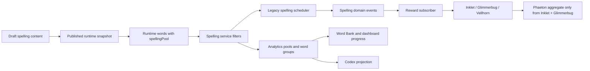

# feat: Add Spelling Extra Expansion

## Overview

Add an independent "Extra" spelling expansion pool beside the existing Years 3-4 and Years 5-6 statutory spelling pools. Extra words should use the existing spelling learning cycle, but they must not change statutory completion, SATs Test behaviour, or the meaning of the current core spelling monsters. Extra secure words progress Vellhorn, while Inklet, Glimmerbug, and Phaeton keep their current statutory meanings.

This plan is grounded in the origin requirements document at `docs/brainstorms/2026-04-22-spelling-extra-expansion-requirements.md`.

## Problem Frame

English Spelling currently has two statutory runtime pools: Years 3-4 and Years 5-6. The UI often labels the aggregate of those two pools as "All". That label becomes misleading once James adds non-statutory expansion words, because "All" could mean every spelling word or only the statutory list.

The implementation therefore needs to add a durable pool distinction, not just append words to the current list. Extra needs its own content metadata, filters, analytics, Word Bank progress, and monster reward, while the existing statutory path remains trustworthy for KS2 SATs preparation and core completion.

## Requirements Trace

- R1. Rename the current aggregate "All" concept wherever it means Years 3-4 plus Years 5-6.
- R2. Add Extra as an independent spelling pool.
- R3. Keep Extra out of Years 3-4, Years 5-6, and core statutory completion.
- R4. Show Extra separately in Word Bank and progress surfaces.
- R5. Support Smart Review for Extra.
- R6. Support Trouble Drill for Extra.
- R7. Keep Extra out of SATs Test wording and SATs Test mode.
- R8. Reuse the current spelling cycle for Extra: dictation, attempts, retries, corrections, due scheduling, explanations, secure status, and word-bank drill.
- R9. Progress a dedicated Extra monster, defaulting to Vellhorn.
- R10. Keep Inklet tied to Years 3-4 statutory words.
- R11. Keep Glimmerbug tied to Years 5-6 statutory words.
- R12. Keep Phaeton as the core statutory bonus monster, excluding Extra.
- R13. Use the existing caught, evolve, level-up, and mega reward pattern for Vellhorn unless a later product decision changes it.
- R14. Keep Extra inside the spelling content draft, validation, publish, and runtime-snapshot discipline.
- R15. Give every Extra word accepted answers, sentence entries, explanations, grouping metadata, and provenance/source notes.
- R16. Ensure unpublished Extra draft edits do not affect active learner sessions.
- R17. Preserve existing learner progress for core spelling and the current core monsters.
- R18. Preserve legacy import/restore behaviour: old spelling progress should keep projecting only known core statutory words unless Extra data is explicitly present.

## Scope Boundaries

- Do not redesign the whole spelling engine.
- Do not change current secure thresholds or due-day scheduling.
- Do not include Extra in SATs Test.
- Do not add a general CMS beyond the existing spelling content draft/publish model.
- Do not add a new cross-subject reward taxonomy.
- Do not change D1 schema unless implementation finds the existing JSON content storage cannot carry the new fields. Current research indicates no D1 migration is needed.
- Do not automatically overwrite account-scoped custom spelling content on production accounts.

## Context & Research

### Relevant Code and Patterns

- `src/subjects/spelling/content/model.js` owns the spelling content schema, validation, draft publishing, and runtime snapshot generation. It currently assumes all lists and words have `Y3`-`Y6` year-group metadata and collapses runtime `year` to `3-4` or `5-6`.
- `content/spelling.seed.json` is the source seed bundle. `src/subjects/spelling/data/content-data.js` and `src/subjects/spelling/data/word-data.js` are generated from it by the existing content generation script.
- `src/subjects/spelling/service-contract.js`, `src/subjects/spelling/service.js`, and `legacy/spelling-engine.source.js` currently treat `all`, `y3-4`, and `y5-6` as the only spelling filters. The generated wrapper at `src/subjects/spelling/engine/legacy-engine.js` mirrors the legacy source.
- `src/subjects/spelling/module.js` hard-codes the setup picker labels, hides year tweaks in SATs mode, and renders Word Bank aggregate cards for All, Years 3-4, and Years 5-6.
- `src/subjects/spelling/events.js` emits secure-word events with `yearBand`. `src/subjects/spelling/event-hooks.js` maps that year band to a reward monster.
- `src/platform/game/monsters.js` defines Inklet, Glimmerbug, and Phaeton, while `src/platform/game/monster-system.js` assigns spelling words to monsters and derives Phaeton from Inklet plus Glimmerbug.
- `src/surfaces/home/data.js` builds Codex entries and meadow placements. It currently has explicit power, scale, face, and motion defaults only for the existing three spelling monsters.
- `src/platform/core/local-review-profile.js` seeds local Codex review learners using the current statutory word pools.
- `src/platform/core/data-transfer.js` normalises imports and exports. The existing shapes should remain valid because spelling subject state and game state are JSON maps.
- `worker/src/app.js`, `worker/src/repository.js`, and `tests/spelling-content-api.test.js` show that account-scoped spelling content is stored as JSON in `account_subject_content` and validated through the same content model.

### Institutional Learnings

- There is no `docs/solutions/` directory in this repo at planning time.
- `docs/spelling-content-model.md` establishes the current content boundary: draft edits do not affect runtime until published, and the engine consumes a pinned runtime snapshot.
- `docs/spelling-service.md` documents that the spelling service emits domain events and does not mutate rewards directly.
- `docs/events.md` documents that reward subscribers are downstream reactions and can be disabled without changing spelling outcomes.
- `docs/spelling-parity.md` treats SATs wording, session creation, retry/correction flow, and analytics parity as important regression surfaces.

### External References

- GOV.UK National Curriculum English appendix: the statutory spelling lists are Years 3-4 and Years 5-6, and teacher-selected additions are allowed beside them. This supports keeping Extra separate from statutory completion.

## Key Technical Decisions

- **Introduce a first-class `spellingPool` field with values `core` and `extra`:** Do not overload `yearGroups` or fake Extra as a statutory year band. Existing bundles without this field should default to `core`.
- **Bump the spelling content model version but keep backwards-compatible reads:** The content schema is gaining a pool concept, so `SPELLING_CONTENT_MODEL_VERSION` should move forward. Version-1 bundles must still validate after normalisation by defaulting to `core`.
- **Use `core` as the canonical aggregate filter, with `all` retained as a legacy alias:** UI and new analytics should say `Core` or `Core statutory`. Existing saved prefs, tests, imports, and stored subject state that still contain `all` should continue to work by normalising to `core`.
- **Keep `year` for statutory bands and use pool metadata as the reward/filter authority:** Core words keep `year` as `3-4` or `5-6`. Extra runtime words should use `year: extra` and `yearLabel: Extra` for display/backwards-compatible row shapes, but code that decides filters, completion, analytics, and rewards should read `spellingPool` first.
- **SATs Test always runs against core statutory content:** UI should not expose Extra as a SATs choice, and service-level session creation should guard against a saved Extra filter being used with `mode: test`.
- **Vellhorn is a direct Extra monster, not an aggregate contributor:** Securing Extra words should progress Vellhorn only. Phaeton should continue deriving only from Inklet and Glimmerbug.
- **Do not change monster thresholds for the first 22 Extra words:** With the existing direct-monster thresholds, the initial Extra list can catch Vellhorn and reach Stage 1, but later evolutions require more Extra words. Lowering thresholds would be a separate product decision.
- **Do not auto-mutate account-scoped stored content during normal reads:** New or empty accounts receive the updated seeded bundle. Accounts with customised stored spelling content should keep their content until an operator intentionally imports/publishes the updated bundle or resets to seeded content.

## Open Questions

### Resolved During Planning

- **Which product label replaces "All"?** Use `Core` in compact controls and `Core statutory` where a little more precision is useful.
- **What is the smallest content-model extension?** Add `spellingPool`, defaulting to `core`, and relax year-group validation only for `extra` words/lists with sufficient grouping metadata.
- **Is Vellhorn asset coverage present?** Yes. `assets/monsters/vellhorn/b1` and `assets/monsters/vellhorn/b2` contain tracked WebP assets for stages 0-4 at 320, 640, and 1280 widths. Runtime should reference the WebP files only.
- **Should `mollusk` be accepted?** No. James confirmed this is UK-only, so `Mollusc` accepts `mollusc` only.
- **Does this require a D1 migration?** No. The Worker stores spelling content JSON and validates through the shared model.

### Deferred to Implementation

- **Exact Vellhorn stage names and accent colours:** Use concise UK English copy following the existing monster metadata pattern. This does not affect data contracts.
- **Whether a production account already has customised spelling content:** Implementation and rollout should check the target account before deployment or content publication. Do not assume updating the bundled seed updates every stored account row.
- **Full Vellhorn staged local review coverage:** The production Extra list has only 22 words, so analytics-driven review profiles cannot naturally project Vellhorn to Stage 4 without synthetic data or more Extra content. Add code-level render tests for mature Vellhorn assets rather than fabricating learner progress in production review profiles.
- **Final content proofreading:** The origin document contains AI-drafted explanations and sentence prompts. Implementation should proofread them before publishing the generated seed release.

## High-Level Technical Design

> This illustrates the intended approach and is directional guidance for review, not implementation specification. The implementing agent should treat it as context, not code to reproduce.

The important invariant is that `spellingPool` becomes the authority for core-vs-extra behaviour, while statutory `year` remains the authority only within the core pool.

## Implementation Units

- [x] **Unit 1: Add The Spelling Pool Contract**

**Goal:** Extend the content and runtime word model so spelling words can belong to either the core statutory pool or the Extra expansion pool.

**Requirements:** R1, R2, R3, R14, R16, R17, R18

**Dependencies:** None

**Files:**
- Modify: `src/subjects/spelling/content/model.js`
- Modify: `src/subjects/spelling/content/service.js`
- Modify: `src/subjects/spelling/content/repository.js`
- Modify: `worker/src/repository.js`
- Test: `tests/spelling-content.test.js`
- Test: `tests/spelling-content-api.test.js`

**Approach:**
- Add normalisation for a `spellingPool` field, defaulting missing or unknown legacy values to `core`.
- Store `spellingPool` at word-list and word-entry level, with words inheriting from their list when omitted. Validation should catch accidental cross-pool list/word mismatches.
- Bump the content model version and make old stored bundles readable without requiring manual migration.
- Keep year-group metadata required for `core` lists and words.
- Allow `extra` lists and words to omit statutory year groups, but still require list membership, family/grouping metadata, explanation text, accepted answers, sentence references, and provenance.
- Include `spellingPool` and display-friendly pool metadata in published runtime words.
- Publish Extra runtime words with `year: extra`, `yearLabel: Extra`, and `spellingPool: extra`; avoid any implicit fallback that would make Extra look like Years 3-4.
- Ensure runtime family grouping does not merge Extra words into statutory families by accident.
- Preserve draft/publish semantics: only the published release snapshot is used by `createSpellingService()`.
- Keep Worker validation on the same shared model so API writes reject malformed Extra content with explicit validation details.

**Patterns to follow:**
- `normaliseWordList`, `normaliseWordEntry`, `normaliseRuntimeWord`, and `buildPublishedSnapshotFromDraft` in `src/subjects/spelling/content/model.js`.
- The existing backfill approach for word explanations, where old bundles are accepted but enriched by normalisation.
- Worker content tests in `tests/spelling-content-api.test.js`.

**Test scenarios:**
- Happy path: a legacy seeded bundle without `spellingPool` validates and publishes with every existing word normalised to `core`.
- Happy path: an Extra word list with no statutory year groups but valid pool metadata, words, explanations, accepted answers, and sentence references validates successfully.
- Edge case: a core word without year-group metadata still fails validation.
- Edge case: an Extra word without list membership, accepted answers, explanation, or sentence references fails validation with explicit issue paths.
- Integration: publishing a draft containing Extra words produces a runtime snapshot where Extra words carry `spellingPool: extra` and do not appear as Years 3-4 or Years 5-6 words.
- Integration: the Worker `PUT /api/content/spelling` route accepts a valid pool-aware bundle and rejects an invalid one without changing the mutation receipt behaviour.

**Verification:**
- Existing content bundles remain readable.
- The content service can expose a runtime snapshot containing both core and Extra words while draft-only changes stay out of runtime.

- [x] **Unit 2: Seed And Publish The Initial Extra Word Set**

**Goal:** Add James's first Extra word list to the spelling content seed and generated runtime data.

**Requirements:** R2, R14, R15, R16

**Dependencies:** Unit 1

**Files:**
- Modify: `content/spelling.seed.json`
- Modify: `src/subjects/spelling/data/content-data.js`
- Modify: `src/subjects/spelling/data/word-data.js`
- Test: `tests/spelling-content.test.js`

**Approach:**
- Add a new Extra word list after the statutory lists, with a stable id such as `extra-science-word-building`.
- Use the origin document's word table as the source of truth for canonical words, explanations, sentence prompts, groups, and accepted-answer suggestions.
- Preserve UK spelling. In particular, `Mollusc` should accept only `mollusc`, not `mollusk`.
- Keep `cold-blooded` as the canonical form and allow the no-hyphen typing variant only if the accepted answers in the origin document remain unchanged.
- Add provenance/source notes stating that James supplied the canonical Extra list on 2026-04-22 and that the support copy was AI-drafted in UK English for KS2 learners.
- Publish the updated seed as a new release in the content bundle rather than silently replacing the existing release history.
- Regenerate the checked-in runtime data files from the published seed snapshot.

**Patterns to follow:**
- Current list and sentence id naming in `content/spelling.seed.json`.
- Existing generated-file comments in `src/subjects/spelling/data/content-data.js` and `src/subjects/spelling/data/word-data.js`.

**Test scenarios:**
- Happy path: seeded content validates with the original statutory words plus the 22 Extra words.
- Happy path: the current published release points at the new release containing Extra, while the previous release remains intact.
- Happy path: runtime generated data includes Extra words in `WORDS` and `WORD_BY_SLUG`.
- Edge case: `wordBySlug.mollusc.accepted` contains `mollusc` and does not contain `mollusk`.
- Integration: adding a draft-only Extra word after this seed change still does not affect runtime until publish.

**Verification:**
- The generated runtime word count increases by exactly 22 compared with the statutory-only baseline.
- The published release snapshot, not the draft alone, is what the spelling service consumes.

- [ ] **Unit 3: Extend Spelling Filters, Sessions, And Analytics**

**Goal:** Make Smart Review, Trouble Drill, stats, and analytics understand `core`, `y3-4`, `y5-6`, and `extra`.

**Requirements:** R1, R2, R3, R4, R5, R6, R7, R8, R17, R18

**Dependencies:** Units 1 and 2

**Files:**
- Modify: `src/subjects/spelling/service-contract.js`
- Modify: `src/subjects/spelling/service.js`
- Modify: `legacy/spelling-engine.source.js`
- Modify: `src/subjects/spelling/engine/legacy-engine.js`
- Modify: `src/subjects/spelling/read-model.js`
- Test: `tests/spelling.test.js`
- Test: `tests/spelling-parity.test.js`
- Test: `tests/runtime-boundary.test.js`

**Approach:**
- Canonicalise filter values as `core`, `y3-4`, `y5-6`, and `extra`.
- Keep `all` as a backwards-compatible alias for `core` in normalisation, saved prefs, imports, and direct service calls.
- Update the legacy source and regenerate or mirror the generated engine wrapper so engine selection uses pool-aware filtering.
- Define `core` as words with `spellingPool: core`.
- Define `extra` as words with `spellingPool: extra`.
- Keep `y3-4` and `y5-6` scoped to `spellingPool: core` plus the statutory year band.
- Ensure Smart Review and Trouble Drill operate within the requested pool and do not fall back from Extra to core words.
- Add a service-level guard so SATs Test mode always uses the core statutory pool, even if persisted prefs contain `extra`.
- Expand analytics to include `core`, `y34`, `y56`, and `extra` pools. Keep a legacy `all` alias to the `core` stats during the transition, but do not build new UI against it.
- Add an Extra word group in analytics without duplicating every core word into an additional aggregate word group.
- Include pool metadata in analytics rows so downstream rewards and UI do not infer Extra from `year` alone.

**Patterns to follow:**
- Existing `normaliseYearFilter`, `getStats`, `analyticsWordGroups`, and `getAnalyticsSnapshot` service structure.
- Current legacy engine selection functions for Smart Review, Trouble Drill, and Test mode.
- Existing spelling parity tests that protect SATs behaviour.

**Test scenarios:**
- Happy path: `startSession` with Smart Review and `extra` selects only Extra words.
- Happy path: after an incorrect Extra attempt, Trouble Drill with `extra` selects due or weak Extra words only.
- Edge case: Trouble Drill with `extra` and no trouble words falls back to Smart Review within Extra, not core.
- Edge case: `startSession` with Test mode plus an `extra` filter produces a core statutory SATs session and contains no Extra words.
- Edge case: a saved or imported `all` filter normalises safely to core behaviour.
- Integration: `getStats(learnerId, 'core')` and `getStats(learnerId, 'all')` match, and both exclude Extra progress.
- Integration: `getAnalyticsSnapshot()` exposes `core`, `y34`, `y56`, `extra`, and legacy `all` stats, with an Extra word group.
- Happy path: `mollusc` is accepted for `Mollusc`.
- Edge case: `mollusk` is rejected for `Mollusc`.

**Verification:**
- Existing core spelling session behaviour remains stable.
- Extra can be practised deliberately through Smart Review and Trouble Drill, and cannot enter SATs Test.

- [ ] **Unit 4: Update Spelling UI Labels And Word Bank Surfaces**

**Goal:** Expose Extra intentionally in the spelling UI while removing misleading "All" wording from statutory aggregate surfaces.

**Requirements:** R1, R2, R4, R5, R6, R7, R8

**Dependencies:** Unit 3

**Files:**
- Modify: `src/subjects/spelling/module.js`
- Modify: `src/subjects/spelling/session-ui.js`
- Modify: `src/platform/ui/render.js`
- Modify: `styles/app.css`
- Test: `tests/render.test.js`
- Test: `tests/spelling-parity.test.js`
- Test: `tests/smoke.test.js`

**Approach:**
- Replace the setup filter label from "Year group" to a pool-aware label such as "Pool".
- Render filter choices as Core, Y3-4, Y5-6, and Extra when the selected mode supports them.
- Keep SATs Test copy and controls statutory. If the learner has Extra selected and switches to SATs Test, the visible stats and session start path should use core.
- Disable Trouble Drill based on the currently active pool's stats, not global core stats.
- Rename Word Bank aggregate "All spellings" to "Core spellings" or "Core statutory progress".
- Add an Extra aggregate card alongside Core, Years 3-4, and Years 5-6. Keep the layout responsive rather than assuming three cards.
- Ensure the searchable Word Bank includes Extra words and shows their Extra label in modal/explainer context.
- Keep Word Bank drill and single-word drill as practice-only flows and ensure they work with Extra slugs.
- Review setup-side mini meadow behaviour so caught Vellhorn is visible in compact progress surfaces. Increase the displayed compact monster count or choose deterministic ordering if necessary.

**Patterns to follow:**
- Current segmented picker structure in `renderYearPicker`.
- Current Word Bank aggregate structure in `renderWordBankAggregates`.
- Existing SATs hidden-layout parity in the setup scene.

**Test scenarios:**
- Happy path: Smart Review setup shows Core, Y3-4, Y5-6, and Extra choices with no visible "All" label.
- Happy path: selecting Extra updates setup stats to the Extra pool.
- Edge case: SATs Test mode hides or ignores Extra selection and still says "Begin SATs test".
- Edge case: Trouble Drill is disabled when the selected Extra pool has no trouble words, even if core has trouble words.
- Happy path: Word Bank aggregates show Core, Years 3-4, Years 5-6, and Extra.
- Happy path: searching for `mollusc` finds the Extra word row and the modal shows an Extra label.
- Integration: Word Bank drill for an Extra word accepts the configured UK answer and rejects non-accepted variants.
- Regression: existing SATs audio-only wording and save/next wording remain unchanged.

**Verification:**
- The learner can choose Extra without confusing it with statutory practice.
- No production UI still labels the statutory aggregate as "All".

- [ ] **Unit 5: Add Vellhorn To Rewards, Codex, And Home Projections**

**Goal:** Add Vellhorn as the Extra spelling monster without changing Inklet, Glimmerbug, or Phaeton semantics.

**Requirements:** R3, R4, R9, R10, R11, R12, R13, R17, R18

**Dependencies:** Units 1 through 4

**Files:**
- Modify: `src/platform/game/monsters.js`
- Modify: `src/platform/game/monster-system.js`
- Modify: `src/subjects/spelling/events.js`
- Modify: `src/subjects/spelling/event-hooks.js`
- Modify: `src/surfaces/home/data.js`
- Modify: `src/platform/game/monster-celebrations.js`
- Test: `tests/monster-system.test.js`
- Test: `tests/events.test.js`
- Test: `tests/local-review-profile.test.js`
- Test: `tests/render.test.js`

**Approach:**
- Add Vellhorn metadata to `MONSTERS` and the spelling monster list, appending it so the existing core trio keeps its relative order.
- Use existing Vellhorn WebP asset paths under `assets/monsters/vellhorn`. Runtime should not reference PNG source files or zip archives.
- Extend secure-word event metadata with pool information so the reward subscriber can route Extra to Vellhorn without guessing from year band.
- Replace or supplement `monsterIdForSpellingYearBand` with pool-aware reward routing.
- Keep Phaeton derivation limited to Inklet and Glimmerbug. `recordMonsterMastery` should not emit Phaeton events when the direct monster is Vellhorn.
- Update analytics-based Codex projection so secure Extra words appear under Vellhorn.
- Update branch assignment, summaries, Codex entries, home meadow rank/scale/face/path data, and celebrations so Vellhorn can render consistently.
- Keep the direct monster thresholds unchanged. Document that the first 22-word Extra set cannot naturally reach all Vellhorn stages yet.
- Do not fabricate production learner progress to force Vellhorn Stage 4 in local review profiles. Use test fixtures for mature Vellhorn rendering where needed.

**Patterns to follow:**
- Current Inklet/Glimmerbug/Phaeton metadata in `src/platform/game/monsters.js`.
- Current reward event transition handling in `src/platform/game/monster-system.js`.
- Current event decoupling described in `docs/events.md`.
- Current home meadow projection in `src/surfaces/home/data.js`.

**Test scenarios:**
- Happy path: securing a core Years 3-4 word still catches or levels Inklet.
- Happy path: securing a core Years 5-6 word still catches or levels Glimmerbug.
- Happy path: combined Inklet and Glimmerbug progress still derives Phaeton exactly as before.
- Happy path: securing an Extra word catches or levels Vellhorn.
- Edge case: securing an Extra word emits no Phaeton reward event.
- Edge case: duplicate secure events for the same Extra slug do not double-count Vellhorn progress.
- Integration: analytics projection with secure Extra rows returns Vellhorn progress and leaves Phaeton unchanged.
- Integration: branch assignment includes Vellhorn and preserves existing stored branches.
- Integration: Codex and home data can build Vellhorn entries with valid stage, branch, srcset, and display labels.

**Verification:**
- Vellhorn appears as the Extra reward path.
- Phaeton remains a statutory core bonus monster only.

- [ ] **Unit 6: Preserve Compatibility, Rollout Safety, And Documentation**

**Goal:** Protect existing learners, import/export paths, account-scoped content, and docs while shipping the expansion.

**Requirements:** R1, R3, R7, R14, R16, R17, R18

**Dependencies:** Units 1 through 5

**Files:**
- Modify: `src/platform/core/data-transfer.js`
- Modify: `src/platform/core/local-review-profile.js`
- Modify: `docs/spelling-content-model.md`
- Modify: `docs/spelling-service.md`
- Modify: `docs/events.md`
- Modify: `docs/spelling-parity.md`
- Modify: `worker/README.md`
- Test: `tests/state-integrity.test.js`
- Test: `tests/repositories.test.js`
- Test: `tests/local-review-profile.test.js`
- Test: `tests/spelling-content-api.test.js`

**Approach:**
- Ensure platform export/import preserves Vellhorn game state if present.
- Ensure legacy spelling imports continue to restore core progress without creating Vellhorn state from statutory slugs.
- Ensure old saved prefs containing `all` do not crash and resolve to core statutory behaviour.
- Update local Codex review profiles so they do not crash with a fourth spelling monster. Include Vellhorn where real Extra content can support it, and rely on render tests for stages not reachable from the first 22 Extra words.
- Document the new `spellingPool` model, `core` filter, `all` alias, Extra analytics pool, and Vellhorn reward routing.
- Document rollout behaviour for account-scoped content: accounts with no stored content receive the new seed automatically; accounts with stored custom content need an intentional content import/publish or reset to seeded content.
- Keep deployment verification aligned with project guidance: run the project test suite and package check before deployment, then verify affected production UI with a logged-in browser session.

**Patterns to follow:**
- Current import/export compatibility tests in `tests/state-integrity.test.js`.
- Current content route persistence and receipt tests in `tests/spelling-content-api.test.js`.
- Existing docs that describe spelling service, content, events, and parity.

**Test scenarios:**
- Happy path: importing an old platform snapshot with spelling prefs `yearFilter: all` restores a learner whose stats resolve to core.
- Happy path: importing a snapshot that already includes Vellhorn game state preserves Vellhorn branch and mastered slugs.
- Edge case: importing legacy spelling progress containing only statutory slugs produces no Vellhorn progress.
- Edge case: reading stored version-1 account content still validates by defaulting words to `core`.
- Integration: a remote account with no stored content receives the updated seeded content.
- Integration: a remote account with stored custom content remains readable and is not silently overwritten by the new seed.
- Documentation: docs describe that Extra is excluded from SATs and Phaeton.

**Verification:**
- Existing learners and old imports keep working.
- Operators have clear instructions for how Extra reaches account-scoped content.

## System-Wide Impact

- **Interaction graph:** The change crosses the spelling content model, generated runtime data, spelling service, legacy scheduler, analytics, UI rendering, event runtime, reward subscriber, Codex projection, home meadow, local review profile, and Worker content route.
- **Error propagation:** Invalid Extra content should fail through existing content validation errors. Invalid runtime filters should normalise to safe core behaviour. Missing or stale slugs should continue to use existing session-restore and start-session failure paths.
- **State lifecycle risks:** Existing saved sessions store slugs and session state, not pool-wide snapshots. Adding Extra should not mutate active sessions. Stored account content may remain on an older bundle until intentionally updated.
- **API surface parity:** `/api/content/spelling` remains the route for content. The JSON payload gains optional pool fields but should remain backwards-compatible for older stored bundles.
- **Integration coverage:** Unit tests must cover content-to-runtime, runtime-to-service, service-to-events, events-to-rewards, and analytics-to-Codex projections. Render tests must cover visible labels and Word Bank aggregation.
- **Unchanged invariants:** SATs Test remains statutory; Inklet remains Years 3-4; Glimmerbug remains Years 5-6; Phaeton derives only from the two core statutory monsters; draft content does not leak into runtime.

## Risks & Dependencies

| Risk | Mitigation |
|------|------------|
| Extra accidentally appears in SATs Test | Add service-level mode guard, UI tests, and spelling parity regression coverage. |
| Extra inflates core completion or Phaeton | Make `spellingPool` authoritative for filtering and rewards; add monster-system tests proving Vellhorn does not trigger Phaeton. |
| Legacy `all` prefs break or start meaning every word | Keep `all` as an alias to `core` and update UI to use `core` labels. |
| Stored account content does not receive the new Extra seed | Document intentional content rollout. Do not silently overwrite custom content. Verify the production target account content state before rollout. |
| Content validation rejects old remote bundles | Default missing pool metadata to `core` and test version-1 stored bundles. |
| Vellhorn assets fail to render | Use existing WebP asset path conventions and add render/Codex tests for Vellhorn srcsets. |
| The first Extra list cannot reach all Vellhorn stages | Keep thresholds unchanged and document that full evolution requires future Extra words. Use synthetic test fixtures for visual coverage only. |
| Product copy regresses to US spelling | Keep UK English in content; assert `mollusc` only and reject `mollusk`. |

## Documentation / Operational Notes

- Update spelling content documentation with the new pool field and model-version behaviour.
- Update spelling service documentation with `core`, `extra`, and legacy `all` alias semantics.
- Update event documentation with Vellhorn routing and Phaeton exclusion rules.
- Update parity documentation to state that SATs remains core statutory only.
- Before production rollout, check whether the target production account has an `account_subject_content` row. If it has a customised row, apply the updated Extra bundle through the existing content import/publish flow or intentionally reset to seeded content after backing up.
- After implementation, verify the user-facing spelling flow in a logged-in browser because this change affects setup, Word Bank, Codex, and home surfaces.

## Alternative Approaches Considered

- **Tag-only Extra words:** Rejected because tags are not authoritative enough for rewards, stats, SATs exclusion, or compatibility.
- **Treat Extra as another year band:** Rejected because it would blur statutory metadata and make legacy year-band code route Extra incorrectly.
- **Count Extra inside the legacy `all` pool:** Rejected because "All" would stop meaning statutory completion.
- **Let Vellhorn contribute to Phaeton:** Rejected because Phaeton is the Years 3-6 statutory bonus monster.
- **Auto-merge Extra into every stored account content bundle on read:** Rejected because it could overwrite intentional custom content and create invisible production mutations.

## Sources & References

- Origin document: `docs/brainstorms/2026-04-22-spelling-extra-expansion-requirements.md`
- Content model: `docs/spelling-content-model.md`
- Spelling service: `docs/spelling-service.md`
- Event runtime: `docs/events.md`
- Spelling parity: `docs/spelling-parity.md`
- GOV.UK National Curriculum English appendix: `https://www.gov.uk/government/uploads/system/uploads/attachment_data/file/335186/PRIMARY_national_curriculum_-_English_220714.pdf`
