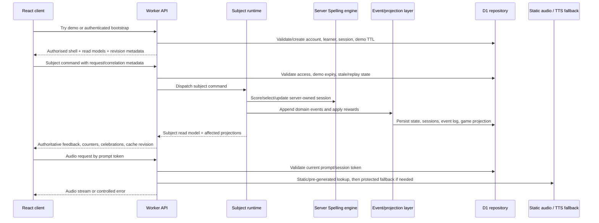
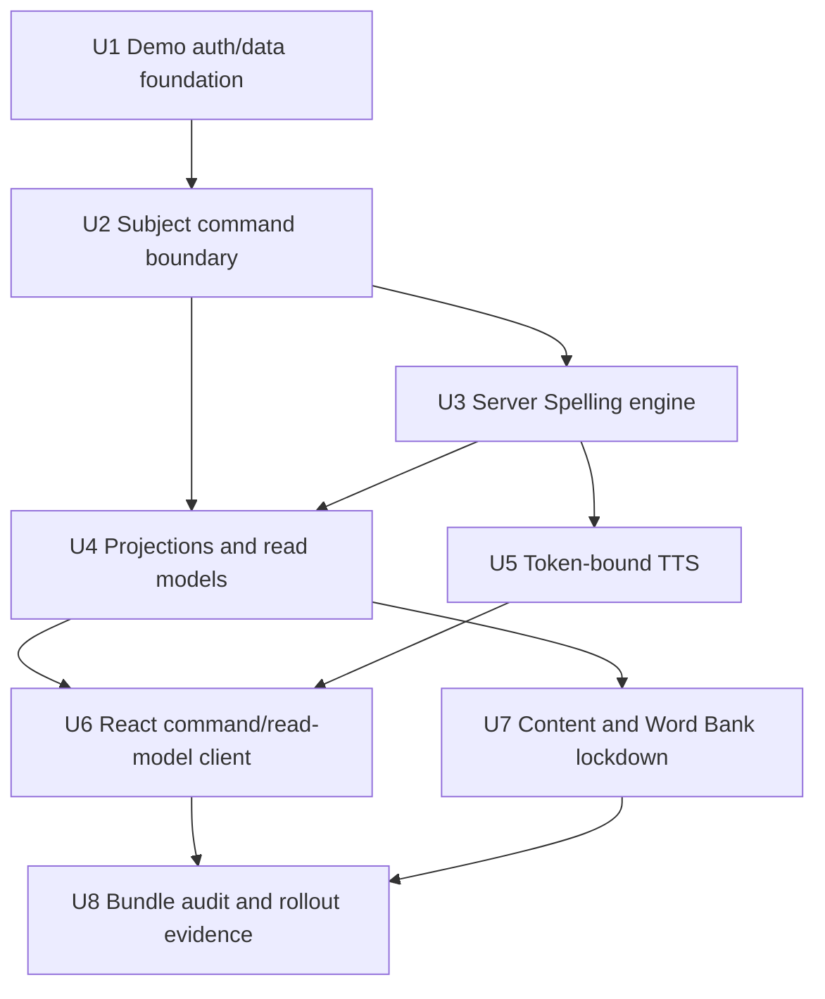
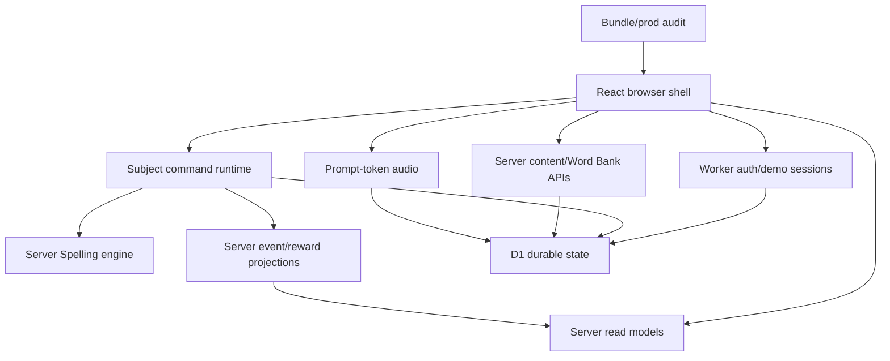

# feat: Full Lockdown Runtime and Ephemeral Demo Sessions

## Overview

Move KS2 Mastery from a React app that still ships production learning/runtime logic into a Worker-authoritative product. React remains the browser UI shell, but production subject engines, scoring, word selection, progress mutation, reward projection, dashboard aggregation, Parent Hub/Admin read models, and content-heavy read models move behind Worker APIs.

This plan also replaces `?local=1` with 24-hour server-owned demo sessions. Demo access remains frictionless from the user's point of view, but every demo action still uses the same server-authoritative command and read-model paths as signed-in users (see origin: `docs/brainstorms/2026-04-23-full-lockdown-demo-session-requirements.md`).

| Runtime mode | User experience | Authority boundary | Allowed browser behaviour |
|---|---|---|---|
| Signed-in production | Full app after auth | Worker session, D1, subject command pipeline | UI state, routing, forms, display formatting, playback controls, local filtering over loaded rows |
| Ephemeral demo | Try the app without visible login | Worker-created demo account/session with 24-hour TTL | Same as signed-in, with demo-scoped read models and restricted account/admin privileges |
| Degraded production | Previously loaded context remains visible | Last authorised server read model only | Cached read-only shell; runtime mutations disabled |
| Node test harness | Fast deterministic coverage | In-memory/server harnesses only | No hidden browser-local production runtime |

---

## Problem Frame

James wants to be able to make a strong, evidence-backed production claim that the app no longer leaks production engine logic. The current React migration removed the legacy DOM renderer path, but the browser bundle still imports client-side Spelling service/engine logic, hub read-model builders, reward/event mutation code, broad API repository write clients, local runtime switches, and full spelling content data.

The target is not "no JavaScript logic in the browser". The target is a clear security/product boundary: the browser may render authorised UI state and collect user input, while the Worker owns production runtime decisions and persistence. Demo mode must not weaken that claim by reintroducing `?local=1` or another browser-local practice path.

---

## Requirements Trace

- R1. Root auth shows login/register/social auth, concise UK English copy, Try demo, and keeps `/demo` as a direct testing/demo entry; `?local=1` is removed.
- R2. Demo access uses a 24-hour server-owned session cloned from a shared template into an isolated per-visitor demo account.
- R3. Non-expired demo sessions can convert into real email/password or configured social accounts while preserving learner progress, sessions, rewards, and read-model history.
- R4. Demo creation, reset, commands, Parent Hub reads, and TTS fallback generation are rate-limited by IP, demo account, session, and command type; expired data is blocked and cleaned opportunistically.
- R5. React may keep UI/routing/interaction/display/playback logic and harmless local filtering/sorting over authorised loaded rows.
- R6. Production subject writes go through a generic subject command boundary; React does not write subject state, practice sessions, game state, event logs, or reward state directly.
- R7. Worker owns production subject engines; English Spelling gets a new server-native engine with strict parity against current behaviour under controlled time/random fixtures.
- R8. Migration may abandon active/incomplete client-shaped sessions; durable progress, completed sessions, event history, and reward state are preserved.
- R9. Subject commands run synchronously through validation, engine execution, persistence, event append, reward projection, and authorised UI-state response.
- R10. Prompt audio is token-bound to the server-owned session/current prompt and designed for static/pre-generated audio first, protected fallback TTS second.
- R11. Subject command responses include current subject read model plus affected global projections, counters, revision/cache metadata, and celebration events.
- R12. Worker APIs own dashboard, Parent Hub, Admin/Operations, and subject read-model aggregation; demo Parent Hub is read-only and demo-scoped.
- R13. Production React bundle does not include the full spelling word/sentence/content dataset; Word Bank uses server-served searchable/filterable/paginated read models.
- R14. Degraded production mode is cached read-only shell with runtime mutations disabled.
- R15. Broad repository write routes cannot remain learner/demo runtime escape hatches; retained writes are explicit admin/operator/import/reset paths with role checks.
- R16. Admin/Operations shows minimal aggregate demo counters only.
- R17. Browser development/manual QA uses Worker-backed auth or demo sessions; Node tests may use in-memory/server harnesses.
- R18. Local build checks use both bundle/module manifest and static grep-style checks for forbidden production-client content.
- R19. Production curl audit against `ks2.eugnel.uk` verifies deployed HTML/bundles before the strongest public claim is made.
- R20. Forbidden bundle audit failures block release; only UI/display/filter exceptions may be explicitly allowlisted.

**Origin actors:** A1 Learner, A2 Demo visitor, A3 Parent/adult evaluator, A4 Account owner, A5 Admin/operator, A6 React client, A7 Worker runtime.

**Origin flows:** F1 Try demo and practise, F2 Read Parent Hub in demo, F3 Convert demo to real account, F4 Submit a subject command, F5 Degraded production connection.

**Origin acceptance examples:** AE1 Try demo uses server command boundary, AE2 demo converts to real account, AE3 active sessions are abandoned while durable state remains, AE4 command returns feedback and projections, AE5 TTS validates prompt token, AE6 degraded mode is read-only, AE7 bundle audit blocks forbidden engine logic.

---

## Scope Boundaries

- Do not preserve or replace `?local=1`; remove it from product behaviour.
- Do not support offline/local practice in production.
- Do not merge a demo session into an already signed-in real account in this release.
- Do not expose Admin/Operations to demo users beyond read-only/demo-scoped and aggregate demo surfaces specified by the origin.
- Do not build production engines for future subjects in this release; build the generic runtime platform and Spelling as the first implementation.
- Do not create a public marketing site in this release.
- Do not require scheduled cleanup in the first implementation, but keep the design compatible with later scheduled cleanup.
- Do not remove all client-side logic; UI, formatting, interaction state, and harmless filtering over authorised loaded read models remain valid React responsibilities.

### Deferred to Follow-Up Work

- Scheduled cleanup hardening: add a Cron Trigger cleanup pass after opportunistic cleanup has production evidence.
- Production engines for future subjects: plug into the new command/projection platform after Spelling proves the contract.
- Demo-to-existing-account merge/import: design separately because it changes account ownership and conflict semantics.
- Full pre-generated TTS pipeline: the current release designs the hybrid path and supports static lookup/fallback, but large-scale audio generation can land later.

---

## Context & Research

### Relevant Code and Patterns

- `docs/plans/2026-04-22-001-refactor-full-stack-react-conversion-plan.md` and `docs/plans/2026-04-22-001-react-migration-ui-contract.md` establish the current React SPA direction. This plan supersedes their local/degraded/local-only assumptions where they conflict with full lockdown.
- `src/main.js` currently imports `createSpellingService`, `createSpellingPersistence`, `buildParentHubReadModel`, `buildAdminHubReadModel`, local spelling content repositories, and reward helpers. These are client-bundle lockdown blockers.
- `src/platform/app/bootstrap.js` currently treats `file:` and `?local=1` as local mode, creates local repositories, and exposes local review learner shortcuts. This is the main browser-local runtime entry point to remove or test-scope.
- `src/platform/app/create-app-controller.js` currently creates local repositories, Spelling service, event runtime, and reward subscribers by default. It is useful as a controller seam, but its production defaults must stop implying browser authority.
- `src/platform/core/repositories/api.js` currently queues optimistic writes to `/api/learners`, `/api/child-subject-state`, `/api/practice-sessions`, `/api/child-game-state`, `/api/event-log`, and `/api/debug/reset`. These routes are incompatible with R6/R15 for learner/demo runtime.
- `worker/src/app.js` already owns session, auth, bootstrap, content, TTS, hub, admin, and broad write routes. It is the right place to add demo routes, subject command routes, read-model APIs, and to restrict legacy writes.
- `worker/src/auth.js` already has production cookies, email auth, social auth, request-limit storage, Turnstile verification, and OAuth callback handling. It must be extended carefully for demo sessions and demo conversion, especially because current social identity creation can reuse an email-matching account.
- `worker/src/repository.js` already has D1 repository patterns, access checks, mutation receipts, learner/account revision compare-and-swap, and hub read access checks. The new command boundary should reuse those safety patterns instead of inventing a parallel persistence model.
- `worker/src/tts.js` currently accepts client-supplied `word`/`sentence`, rate-limits, and proxies OpenAI speech generation. Full lockdown requires prompt-token validation and server-derived text.
- `worker/migrations/0002_saas_foundation.sql`, `worker/migrations/0004_production_auth.sql`, and `worker/migrations/0005_spelling_content_model.sql` define the current account, learner, session, request-limit, content, event, practice-session, and game-state tables.
- `scripts/build-client.mjs`, `scripts/build-public.mjs`, `scripts/assert-build-public.mjs`, and `tests/build-public.test.js` already assert the React app bundle and reject retired legacy frontend artefacts. Important review finding: `scripts/build-public.mjs` currently copies the whole `src` tree into `dist/public`, so raw source/data files can be public even when they are not imported by `app.bundle.js`. Full lockdown must change public output to an explicit allowlist rather than only auditing the bundle.
- `docs/mutation-policy.md` documents request receipts, expected revisions, stale-write rejection, and replay semantics. Subject commands should align with this rather than silently merging.
- `docs/state-integrity.md` documents fail-safe normalisation and upgrade behaviour. Migration from client-shaped sessions should preserve durable state and abandon unsafe active sessions.
- `docs/subject-expansion.md` defines the existing future-subject harness. This plan changes the subject architecture from client service ownership to server command ownership while preserving the generic platform idea.
- `docs/spelling-parity.md` records the current English Spelling parity baseline and intentional deltas. The server-native engine should use this as the behavioural reference.
- `worker/src/index.js` defines `LearnerLock` as a future Durable Object coordination hook, while `docs/mutation-policy.md` currently relies on compare-and-swap plus idempotency. Command implementation should deliberately choose whether single-command CAS/batch semantics are enough before using the Durable Object hook.

### Institutional Learnings

- No `docs/solutions/` directory exists, so there are no stored solution learnings to apply.
- Previous plans repeatedly treat Cloudflare Worker/D1 deployment and OAuth-safe Wrangler scripts as production-sensitive. This plan keeps `package.json` scripts routed through `scripts/wrangler-oauth.mjs` and does not introduce raw Wrangler commands.
- The React migration plan already proved a single React bundle with Worker-first `/api/*` routing. Full lockdown should build on that rather than switching frameworks.

### External References

- Cloudflare Workers Static Assets docs describe SPA fallback with `assets.not_found_handling = "single-page-application"` and recommend pairing it with `run_worker_first` for API routing: https://developers.cloudflare.com/workers/static-assets/
- Cloudflare SPA routing docs describe serving `index.html` for unmatched navigation requests and using `run_worker_first` for explicit API paths: https://developers.cloudflare.com/workers/static-assets/routing/single-page-application/
- Cloudflare D1 Worker Binding API documents prepared statements, `batch()`, and the transactional rollback behaviour of batched statements: https://developers.cloudflare.com/d1/worker-api/d1-database/
- Cloudflare D1 read replication docs describe Sessions API bookmarks for sequentially consistent reads, useful for future command/read-model revision metadata: https://developers.cloudflare.com/d1/best-practices/read-replication/
- Cloudflare Cron Triggers docs describe scheduled Worker handlers for later cleanup jobs; first implementation can stay opportunistic: https://developers.cloudflare.com/workers/configuration/cron-triggers/
- OpenAI API reference states API keys are secrets that must not be exposed in client-side code and documents the Audio speech endpoint used behind the Worker TTS proxy: https://developers.openai.com/api/reference/overview and https://developers.openai.com/api/reference/resources/audio/subresources/speech/methods/create

---

## Key Technical Decisions

- **One Worker-owned runtime platform, not Spelling-only hardening:** The origin explicitly asks for full lockdown and future scalability. Build a generic subject command/read-model/projection boundary, then implement Spelling as the first subject.
- **Keep React as UI shell only:** React keeps route state, forms, focus, playback controls, UI formatting, and local filtering of authorised rows. It does not own production engines, scoring, queue selection, progress mutation, reward mutation, read-model aggregation, or full content datasets.
- **Use server-created demo accounts, not a client demo mode:** `/demo` and Try demo call Worker routes that create 24-hour isolated demo sessions from a template. This preserves the no-login experience without reintroducing browser-local authority.
- **Support demo conversion by promoting the active demo account:** Email/password and configured social registration should bind to the active non-expired demo account and remove demo TTL restrictions. Existing real-account merge stays out of scope.
- **Make the subject command route generic, with subject-owned command handlers:** Use a route shape such as `POST /api/subjects/:subjectId/command` as the conceptual boundary. Exact route names can be adjusted during implementation, but the contract must keep subject execution server-side.
- **Reuse existing mutation safety ideas:** Request IDs, correlation IDs, expected revisions, idempotency receipts, and stale-write rejection should remain the mental model. Commands may produce richer response envelopes than broad repository writes, but they should not weaken revision/idempotency behaviour.
- **Make command commits atomic enough to protect pedagogy and rewards:** A command that updates progress, practice-session state, event log, and reward projection must either commit as one logical mutation or fail without partial user-visible state. Prefer D1 `batch()`/transaction-friendly repository helpers and the existing CAS/idempotency model; use `LearnerLock` only if implementation proves a command cannot be made safe as one learner-scoped mutation.
- **Rewrite Spelling as server-native instead of moving `legacy-engine.js` into Worker wholesale:** Directly importing generated legacy browser engine code into the server would reduce bundle leakage but would not produce the clean future-subject architecture James asked for. Parity fixtures provide the safety net.
- **Move event/reward authority server-side, but keep rewards synchronous in the user-visible command response:** The user should see immediate feedback and celebrations, while the architecture stays event/projection-based for future subjects.
- **Token-bind TTS to server prompts:** React asks for audio by prompt token/session context. Worker derives the word/sentence from the current server-owned session, checks static/pre-generated audio first, and only then uses protected OpenAI fallback.
- **Serve content-heavy Word Bank data through APIs:** The production bundle must not include full spelling word/sentence/content data. Client-side search/filtering is allowed only over already loaded, authorised rows.
- **Make degraded mode visibly read-only:** Cached bootstrap/read-model data may render, but all practice, reset, conversion, reward, and content mutation affordances are disabled until reconnection.
- **Ship an explicit public asset allowlist:** The production output should include `index.html`, headers, styles, required assets, and the built app bundle; it must not copy the raw `src` tree. Bundle manifest/grep checks are necessary but not sufficient if raw source files remain publicly addressable.
- **Treat bundle and public-output audit as a release gate:** The plan's strongest claim is only valid if local manifest/grep checks, public file allowlist checks, source-path denial checks, and production curl audit all prove forbidden client content is absent.

---

## Open Questions

### Resolved During Planning

- **Should this be a single PR-sized scope?** Yes, as one full-lockdown milestone, but internally phased so implementation can proceed in dependency order without weakening the final release claim.
- **Should `/demo` remain?** Yes. It remains as a Worker-backed direct demo/testing entry and creates a server-owned demo session.
- **Should `?local=1` stay for development?** No. Browser development/manual QA uses Worker-backed auth or demo sessions. Node tests can keep in-memory/server harnesses.
- **Should active client-shaped Spelling sessions migrate?** No. Preserve durable progress, completed sessions, event history, and rewards; abandon active/incomplete client-shaped sessions.
- **Should rewards be async or immediate?** Immediate in the command response, implemented through a generic server-side event/projection boundary.
- **Should TTS be all pre-generated now?** No. Use hybrid-ready design now: static/pre-generated first when available, protected OpenAI fallback when generated audio is not ready.
- **Should Word Bank search require a server round trip for every UI filter change?** No. Server owns searchable/filterable/paginated read models and authorisation; React may locally filter/sort the rows already loaded.
- **Can the production public output keep copying the raw `src` tree if the app bundle is clean?** No. Full lockdown must stop publishing raw source modules/data, because a user can request public files directly even if `index.html` only loads `app.bundle.js`.
- **Should commands rely only on best-effort multi-step writes?** No. A command must have an explicit atomicity strategy before reward/progress/session/event changes are considered safe.

### Deferred to Implementation

- **Exact SQL/table/column names for demo metadata and command receipts:** The plan defines required semantics; final schema should fit the existing migration and repository style.
- **Exact subject command envelope fields:** The envelope must include command type, learner/session context, idempotency/correlation metadata, expected revision/cache metadata, origin/same-site validation expectations, and payload. Implementation should finalise field names with tests.
- **Exact parity fixture set for server Spelling:** Use `docs/spelling-parity.md` and current tests as the baseline, then choose minimal deterministic fixtures that cover modes, scoring, retry/correction, progression, and content pools.
- **Exact demo rate-limit thresholds:** Use current `request_limits` patterns first; tune thresholds during implementation based on the command categories and TTS fallback cost.
- **Exact static audio lookup location:** The plan allows R2/static asset lookup and cache metadata; implementation should choose the path that fits existing Cloudflare bindings and generated audio rollout.
- **Exact build manifest file shape and allowlist format:** It must be machine-readable, checked locally, and usable for production curl audit evidence.

---

## Output Structure

This expected shape is directional. Implementation may adjust names if a tighter local pattern appears, but the plan expects new Worker-side runtime modules plus thin client command/read-model adapters.

```text
worker/src/demo/
  sessions.js
  template.js
worker/src/subjects/
  runtime.js
  spelling/
    engine.js
    commands.js
    read-models.js
worker/src/projections/
  events.js
  rewards.js
  read-models.js
worker/src/content/
  spelling-read-models.js
src/platform/runtime/
  subject-command-client.js
  read-model-client.js
src/subjects/spelling/
  client-read-models.js
scripts/
  audit-client-bundle.mjs
  production-bundle-audit.mjs
```

---

## High-Level Technical Design

> *This illustrates the intended approach and is directional guidance for review, not implementation specification. The implementing agent should treat it as context, not code to reproduce.*



### Unit Dependency Graph



---

## Implementation Units

- [x] U1. **Demo Auth and Data Foundation**

**Goal:** Add 24-hour Worker-owned demo sessions, demo templates, reset, expiry blocking, rate-limit hooks, and demo-to-real conversion foundations.

**Requirements:** R1, R2, R3, R4, R12, R16, R17; F1, F2, F3; AE1, AE2.

**Dependencies:** None.

**Files:**
- Create: `worker/migrations/0007_full_lockdown_runtime.sql`
- Create: `worker/src/demo/sessions.js`
- Create: `worker/src/demo/template.js`
- Modify: `worker/src/auth.js`
- Modify: `worker/src/app.js`
- Modify: `worker/src/repository.js`
- Modify: `src/surfaces/auth/AuthSurface.jsx`
- Modify: `src/main.js`
- Modify: `src/platform/app/bootstrap.js`
- Test: `tests/worker-auth.test.js`
- Test: `tests/worker-demo-session.test.js`
- Test: `tests/react-auth-boot.test.js`

**Approach:**
- Add explicit demo account/session metadata to D1 while keeping normal real-account rows compatible with existing auth and repository code.
- Add Worker routes for Try demo, direct `/demo` entry, demo reset, and demo conversion. `/demo` should route through Worker-backed session creation, not a browser-local path.
- Clone from a shared demo template into an isolated learner/account per visitor. Template reads should be server-owned so changing the template later does not require client bundle changes.
- Extend session payloads/read models with demo flags, demo expiry, and allowed surfaces. Demo users get learner practice, Codex/rewards, and read-only Parent Hub; no admin role escalation.
- Add expiry checks at session/read/write boundaries. Expired demo sessions should fail closed for bootstrap, Parent Hub, commands, reset, conversion, and TTS fallback.
- Reuse the existing `request_limits` style for layered rate limits. Track enough aggregate counters for Admin/Operations without exposing individual demo browsing.
- Keep state-changing demo/auth/conversion routes same-origin by default. Use existing SameSite cookie posture, avoid permissive CORS, and add origin/host checks where the current route shape needs explicit CSRF hardening.
- For email conversion, promote the active demo account into a normal account, create credentials, preserve learner memberships/state/history/rewards, and remove demo TTL restrictions.
- For social conversion, use the configured provider flow but bind the identity to the active non-expired demo account. Do not silently merge the demo into an existing account with the same email in this release.
- Bind social conversion state to the active demo session across OAuth start/callback so a provider redirect cannot accidentally attach a different account/session.
- Remove product-facing `?local=1` handling from browser bootstrap. Any remaining local harness behaviour must be test-only and inaccessible through production navigation.

**Execution note:** Start with failing Worker integration tests for demo lifecycle and conversion before touching React auth UI.

**Patterns to follow:**
- `worker/src/auth.js` for cookie sessions, social auth, Turnstile, and request-limit style.
- `worker/src/repository.js` for account/learner creation, memberships, and access checks.
- `worker/migrations/0002_saas_foundation.sql` and `worker/migrations/0004_production_auth.sql` for D1 naming/index patterns.
- `src/surfaces/auth/AuthSurface.jsx` for the current root auth UI.

**Test scenarios:**
- Happy path: a new visitor clicks Try demo, Worker creates a 24-hour demo session, selected learner, isolated demo account, demo-scoped bootstrap, and read-only Parent Hub access.
- Happy path: direct navigation to `/demo` creates the same server-owned demo session shape as Try demo.
- Happy path: demo reset replaces demo learner progress/rewards from the server template without changing session ownership.
- Happy path: non-expired demo with completed practice converts through email registration and preserves learner progress, completed sessions, rewards, event history, and Parent Hub visibility.
- Happy path: configured social conversion links provider identity to the active demo account and returns a normal signed-in session.
- Edge case: two demo visitors receive isolated accounts and cannot see or mutate each other's learner data.
- Edge case: demo conversion with an email already used by a real account is rejected or routed to a clear out-of-scope message rather than merging data.
- Error path: expired demo session cannot bootstrap, run commands, reset, convert, read Parent Hub, or trigger TTS fallback.
- Error path: demo creation/reset/command/TTS/Parent Hub rate limits return controlled responses with retry metadata and increment aggregate counters.
- Error path: cross-origin state-changing demo/auth/conversion requests are denied or receive no usable session mutation.
- Error path: social conversion callback without the active non-expired demo binding cannot promote or merge demo data.
- Integration: demo Parent Hub renders read-only and demo-scoped; learner/profile/admin write affordances are unavailable.
- Covers AE1. Try demo creates a server-owned session and leaves no browser-local runtime route.
- Covers AE2. Demo conversion preserves learner progress, sessions, rewards, and read-model history under the promoted account.

**Verification:**
- Demo sessions exist only as Worker-authenticated sessions.
- `?local=1` no longer changes product behaviour.
- Demo lifecycle and conversion are covered at Worker and React-auth surfaces.

---

- [x] U2. **Generic Subject Command Boundary**

**Goal:** Replace browser-owned subject/runtime writes with a generic Worker command route that validates access, idempotency, revisions, demo expiry, and subject ownership before mutating learner state.

**Requirements:** R5, R6, R9, R11, R14, R15, R17; F4, F5; AE1, AE4, AE6.

**Dependencies:** U1.

**Files:**
- Create: `worker/src/subjects/runtime.js`
- Create: `worker/src/subjects/command-contract.js`
- Modify: `worker/src/app.js`
- Modify: `worker/src/repository.js`
- Inspect: `worker/src/index.js`
- Modify: `docs/mutation-policy.md`
- Modify: `docs/subject-expansion.md`
- Test: `tests/worker-subject-runtime.test.js`
- Test: `tests/worker-access.test.js`
- Test: `tests/mutation-policy.test.js`
- Test: `tests/subject-expansion.test.js`

**Approach:**
- Add one generic subject command boundary for start, submit, continue, skip, end, preference changes, and subject-specific drill actions. The exact URL can be finalised during implementation, but all production subject writes must enter through this boundary.
- Define a command envelope with subject id, learner id, command type, command payload, request id, correlation id, expected revision/cache metadata, and optional active session token.
- Route command execution through subject-specific server handlers registered by subject id. Unknown subjects/commands fail closed.
- Apply access checks before running a subject command: authenticated session, learner write access, demo expiry, demo surface restrictions, and role restrictions.
- Reuse or adapt mutation receipt semantics so retrying the same command request cannot double-score, double-append events, or double-award rewards.
- Define the command commit strategy before implementing handlers. The command pipeline must update progress/session state, event log, and reward projection as one logical learner-scoped mutation, using D1 batch/transaction-capable helpers where possible and preserving replay/stale-write semantics.
- Treat `LearnerLock` as a narrow fallback coordination hook, not the default abstraction. Use it only if implementation evidence shows command-level CAS/batch semantics cannot protect a multi-step learner mutation.
- Add same-origin/origin validation for state-changing command routes if existing cookie/session posture is not sufficient for the final route shape.
- Return a response envelope containing the current subject read model, affected global projections, command result/feedback, revision/cache metadata, and recoverable error details when relevant.
- Restrict existing broad write routes. Browser learner/demo runtime must not be able to write `child_subject_state`, `practice_sessions`, `child_game_state`, or `event_log` directly. Retained routes must be role-scoped admin/operator/import/reset paths with clear names and checks.
- Make command failures leave the browser in read-only/error-contained state rather than falling back to queued local mutations.

**Execution note:** Contract-first. Add request/response and permission/idempotency tests before migrating Spelling commands onto the boundary.

**Patterns to follow:**
- `docs/mutation-policy.md` for expected revisions, request receipts, stale writes, and idempotency replay.
- `worker/src/repository.js` `withAccountMutation` / `withLearnerMutation` patterns.
- `worker/src/index.js` `LearnerLock` placeholder, only if command serialisation genuinely needs it.
- `worker/src/app.js` route style and error handling.
- `src/platform/core/subject-contract.js` for existing subject registry thinking, translated to server authority.

**Test scenarios:**
- Happy path: valid signed-in learner command passes access checks, executes the subject handler, persists learner state, and returns subject/global projections.
- Happy path: valid demo learner command uses the same command route and is scoped to demo account data.
- Edge case: duplicate request id with identical payload replays the previous response without double mutation.
- Edge case: duplicate request id with different payload returns idempotency reuse conflict.
- Edge case: stale expected revision rejects without partial state, session, event, or reward writes.
- Edge case: projection or event append failure rolls back or suppresses the whole command result; learner progress cannot advance without matching event/reward consistency.
- Error path: unauthenticated, expired demo, viewer-only, wrong learner, unknown subject, and unknown command all fail closed.
- Error path: cross-origin command POST does not mutate learner state.
- Integration: broad runtime write routes are unavailable to learner/demo browser sessions and only retained behind explicit admin/operator/import/reset checks.
- Covers AE1. Practice actions go through the command boundary rather than browser-local repositories or engines.
- Covers AE4. Subject command response carries authoritative feedback and affected projections.
- Covers AE6. Failed/ unavailable command path does not queue local runtime writes.

**Verification:**
- There is one production path for subject runtime mutations.
- Existing broad repository routes cannot be used as learner/demo escape hatches.
- Command responses are rich enough for React to render without recomputing engine state.

---

- [ ] U3. **Server-Native Spelling Engine With Parity Harness**

**Goal:** Implement English Spelling as the first Worker-owned subject engine while proving behavioural parity with current Spelling logic under deterministic fixtures.

**Requirements:** R7, R8, R9, R11, R17; F4; AE3, AE4.

**Dependencies:** U2.

**Files:**
- Create: `worker/src/subjects/spelling/engine.js`
- Create: `worker/src/subjects/spelling/commands.js`
- Create: `worker/src/subjects/spelling/read-models.js`
- Modify: `worker/src/subjects/runtime.js`
- Modify: `worker/src/repository.js`
- Modify: `docs/spelling-parity.md`
- Modify: `docs/spelling-service.md`
- Test: `tests/server-spelling-engine-parity.test.js`
- Test: `tests/spelling-parity.test.js`
- Test: `tests/spelling.test.js`
- Test: `tests/worker-subject-runtime.test.js`
- Test: `tests/worker-backend.test.js`

**Approach:**
- Treat the current browser Spelling service/legacy engine as a behavioural reference only. The production Worker engine should be server-native and free of browser storage assumptions.
- Port the subject behaviours needed for current UI parity: smart review, trouble drill, SATs/test mode, single-word drill, year/core/extra filtering, accepted answers, retry/correction, secure progression, due scheduling, session summary, and abandoned active-session handling.
- Persist durable progress, preferences, completed sessions, event history, and reward state in existing D1-backed learner collections or narrowly extended command-owned tables.
- Abandon active/incomplete client-shaped sessions on migration. Do not try to convert arbitrary browser service state into server-owned active sessions.
- Build server read models for Spelling setup, live session, summary, analytics, and Word Bank entry points. The read model should expose only what React needs to render.
- Keep deterministic clocks/randomness injectable in tests so parity fixtures can pin queue selection, scoring, retry flow, progression, and summaries.
- Ensure subject engine code does not import from browser-only modules, React components, DOM helpers, or local storage adapters.

**Execution note:** Characterisation-first. Add parity fixtures before replacing the browser service in production flows.

**Patterns to follow:**
- `src/subjects/spelling/service.js` and `src/subjects/spelling/service-contract.js` for existing behaviour and state normalisation.
- `docs/spelling-parity.md` for baseline parity areas and known intentional deltas.
- `tests/spelling-parity.test.js`, `tests/spelling.test.js`, and `tests/state-integrity.test.js` for current coverage shape.
- `worker/src/repository.js` for D1 persistence conventions.

**Test scenarios:**
- Happy path: smart review with seeded time/random selects the same eligible queue and produces the same first prompt as the reference fixture.
- Happy path: trouble drill and SATs/test mode preserve mode-specific filtering, round length, and summary behaviour.
- Happy path: correct answer updates stage/progress/session summary and produces expected domain events.
- Happy path: wrong answer enters blind retry, then correction, without answer leakage before the allowed phase.
- Happy path: single-word/Word Bank drill validates accepted answers and records practice-only behaviour according to the existing contract.
- Edge case: no eligible words, invalid slug, missing content release, and stale session token return controlled command errors.
- Edge case: active client-shaped sessions are abandoned on migration while durable progress and completed sessions remain readable.
- Integration: Worker command route starts, submits, continues, skips, and ends a Spelling session entirely server-side.
- Covers AE3. Existing durable progress/history remains, but active client-shaped session must start fresh.
- Covers AE4. Correct answer returns authoritative feedback, updated read model, and projection events.

**Verification:**
- Spelling parity fixtures pass under controlled time/random inputs.
- Production React no longer needs to import `src/subjects/spelling/service.js` or `src/subjects/spelling/engine/legacy-engine.js`.
- Server Spelling engine can serve demo and signed-in learners through the same command route.

---

- [ ] U4. **Server Projections, Hubs, and Read Models**

**Goal:** Move reward/game projection, dashboard aggregation, Parent Hub, Admin/Operations, and subject read-model aggregation behind Worker-owned projection/read-model modules.

**Requirements:** R9, R11, R12, R14, R16; F2, F4, F5; AE4, AE6.

**Dependencies:** U2, U3.

**Files:**
- Create: `worker/src/projections/events.js`
- Create: `worker/src/projections/rewards.js`
- Create: `worker/src/projections/read-models.js`
- Modify: `worker/src/repository.js`
- Modify: `worker/src/app.js`
- Modify: `src/platform/game/monster-system.js`
- Modify: `src/platform/events/runtime.js`
- Modify: `src/platform/hubs/parent-read-model.js`
- Modify: `src/platform/hubs/admin-read-model.js`
- Test: `tests/worker-projections.test.js`
- Test: `tests/worker-hubs.test.js`
- Test: `tests/hub-api.test.js`
- Test: `tests/hub-read-models.test.js`
- Test: `tests/monster-system.test.js`
- Test: `tests/codex-view-model.test.js`

**Approach:**
- Implement a generic server-side event/projection boundary that accepts subject domain events from command handlers and synchronously applies user-visible projections before responding.
- Move reward/game mutation authority to the Worker. React may display Codex state and celebration events, but it must not compute or persist reward mutations.
- Apply event append and reward projection inside the same logical command commit as the subject progress/session update. A projection failure must not leave a scored answer without its matching domain event or reward state decision.
- Build Worker-owned dashboard and shell counter read models so the command response can return affected projections without React recomputing from raw repositories.
- Move Parent Hub/Admin aggregation to Worker modules that do not require importing browser/client read-model builders into the production app bundle.
- Keep demo Parent Hub read-only and demo-scoped. Admin/Operations should expose aggregate demo counters only: created, active, conversions, cleanup count, rate-limit blocks, and TTS fallback usage.
- Preserve role checks from existing hub access logic. Demo users must not be able to access Admin/Operations.
- Keep Parent Hub/Admin lazy refresh semantics: command responses return affected lightweight projections; full hub read models can refresh on page entry or explicit refresh.

**Execution note:** Start with server projection tests around one Spelling correct answer and one reward threshold before deleting client reward mutation paths.

**Patterns to follow:**
- `src/platform/events/runtime.js` and `src/subjects/spelling/event-hooks.js` for current event/reward intent.
- `src/platform/game/monster-system.js` for reward outcome semantics.
- `worker/src/repository.js` `readParentHub` / `readAdminHub` access checks.
- `docs/operating-surfaces.md` and `docs/ownership-access.md` for adult/admin surface expectations.

**Test scenarios:**
- Happy path: a Spelling domain event produces expected reward/game projection and celebration payload synchronously in the command response.
- Happy path: command response includes subject read model, shell counters, dashboard-card deltas, reward/celebration events, and revision/cache metadata.
- Happy path: Parent Hub read model is built server-side and remains demo-scoped/read-only for demo sessions.
- Happy path: Admin/Operations reports aggregate demo counters without individual demo account browsing.
- Edge case: duplicate/replayed command response does not duplicate rewards or event log entries.
- Edge case: projection failure causes the whole command to fail or roll back; it must not partially award rewards or advance progress without event history.
- Error path: viewer/non-admin/demo attempts to access Admin/Operations are denied.
- Integration: React Codex/dashboard can render server projections without importing reward mutation code.
- Covers AE4. Correct answer returns updated subject state plus reward/celebration projections.
- Covers AE6. Degraded cached read models render read-only and cannot mutate projections.

**Verification:**
- Reward mutation authority exists only in Worker-side command/projection code for production flows.
- Hub/Admin read models are served by Worker APIs and no longer require production bundle read-model builders.
- Demo aggregate counters are available without individual demo account browsing.

---

- [ ] U5. **Prompt-Token Audio and Hybrid TTS Boundary**

**Goal:** Replace client-supplied TTS text with prompt-token validation and a static/pre-generated-first audio path with protected OpenAI fallback.

**Requirements:** R4, R10, R11, R13; F4; AE5.

**Dependencies:** U3.

**Files:**
- Create: `worker/src/subjects/spelling/audio.js`
- Modify: `worker/src/tts.js`
- Modify: `worker/src/app.js`
- Modify: `worker/src/subjects/spelling/commands.js`
- Modify: `src/subjects/spelling/tts.js`
- Modify: `src/subjects/spelling/components/SpellingSessionScene.jsx`
- Test: `tests/worker-tts.test.js`
- Test: `tests/spelling-tts.test.js`
- Test: `tests/worker-subject-runtime.test.js`

**Approach:**
- Generate prompt/audio tokens as part of the server-owned Spelling session read model. Tokens identify the current prompt without exposing trusted scoring/selection logic.
- Change the browser audio request to submit prompt/session token and playback options only. Worker derives the word/sentence/transcript from the current server session.
- Check static/pre-generated audio first. If no generated audio exists, use the current OpenAI speech proxy as a protected fallback, with rate limits by IP, account, demo session, and fallback type.
- Keep OpenAI API key and model/voice configuration server-only. The browser never sees provider credentials or arbitrary transcript generation controls.
- Cache fallback metadata carefully so repeated replay of the same prompt does not hammer OpenAI, while still respecting demo/session expiry.
- Return controlled errors that React can render as TTS feedback without breaking the subject route.

**Execution note:** Add tests that prove arbitrary client `word`/`sentence` payloads are rejected before refactoring React playback.

**Patterns to follow:**
- `worker/src/tts.js` for current provider proxy, headers, and request-limit style.
- `src/subjects/spelling/tts.js` for existing playback UI contract.
- OpenAI API reference for server-only API key handling and speech endpoint constraints.

**Test scenarios:**
- Happy path: replay audio for the current prompt token returns generated/static audio when available.
- Happy path: replay audio falls back to OpenAI speech only when static/generated audio is missing and rate limits allow it.
- Happy path: slow replay/word-only options are validated against the current prompt without trusting client-supplied text.
- Edge case: stale prompt token, wrong session, expired demo, wrong learner, and ended session all reject audio.
- Error path: arbitrary `word`/`sentence` payloads are ignored or rejected; Worker never trusts browser-supplied transcript text.
- Error path: fallback provider failure returns a controlled TTS error and does not mutate session/progress state.
- Integration: command response and audio route share enough prompt identity that React can replay without importing word content datasets.
- Covers AE5. TTS validates prompt token and serves generated audio or protected fallback without trusting client text.

**Verification:**
- TTS provider secrets remain Worker-only.
- Browser audio code cannot generate speech for arbitrary client-provided content.
- The design supports James's future mixture of pre-generated audio and fallback TTS.

---

- [ ] U6. **React Command Client and Read-Only Degraded Mode**

**Goal:** Refactor React/browser runtime to consume Worker command/read-model APIs, remove local mode product behaviour, and disable all runtime mutations while degraded.

**Requirements:** R1, R5, R6, R11, R14, R15, R17; F1, F4, F5; AE1, AE4, AE6.

**Dependencies:** U1, U2, U4, U5.

**Files:**
- Create: `src/platform/runtime/subject-command-client.js`
- Create: `src/platform/runtime/read-model-client.js`
- Modify: `src/main.js`
- Modify: `src/app/App.jsx`
- Modify: `src/platform/app/bootstrap.js`
- Modify: `src/platform/app/create-app-controller.js`
- Modify: `src/platform/app/controller-snapshot.js`
- Modify: `src/platform/core/repositories/api.js`
- Modify: `src/subjects/spelling/module.js`
- Modify: `src/subjects/spelling/components/SpellingSessionScene.jsx`
- Modify: `src/subjects/spelling/spelling-view-model.js`
- Modify: `tests/helpers/mock-api-server.js`
- Test: `tests/app-controller.test.js`
- Test: `tests/persistence.test.js`
- Test: `tests/react-auth-boot.test.js`
- Test: `tests/react-spelling-surface.test.js`
- Test: `tests/react-accessibility-contract.test.js`
- Test: `tests/browser-react-migration-smoke.test.js`

**Approach:**
- Replace production Spelling action handling with command-client calls. React submits user intent, then renders the authoritative response.
- Stop creating production browser `createSpellingService`, event runtime, reward subscriber, local spelling content repository, local hub read models, or local platform repositories.
- Remove `isLocalMode` product semantics from `src/platform/app/bootstrap.js`. `file:` and `?local=1` must not create a usable production-like browser runtime.
- Keep Node test harnesses/in-memory helpers where useful, but make their test-only nature explicit and ensure they are not bundled into production.
- Partition `src/platform/core/repositories/api.js`: keep read-model/bootstrap/cache behaviour as needed, but remove or quarantine broad learner/runtime write clients from production browser paths.
- Implement cached read-only degraded mode. If bootstrap/read-model refresh fails after a successful load, React can show cached authorised data and persistence diagnostics, but must disable practice, answer submit, start session, demo reset, conversion, reward mutation, content mutation, import/reset, and other runtime writes.
- Ensure AuthSurface supports Try demo, direct `/demo` behaviour, conversion entry points, and UK English copy without exposing implementation details in app text.
- Preserve accessibility/focus contracts from the React migration UI contract while removing local runtime fallbacks.

**Execution note:** Characterisation-first for degraded mode and auth boot; then replace production action paths with command-client calls.

**Patterns to follow:**
- `docs/plans/2026-04-22-001-react-migration-ui-contract.md` for UI/accessibility/responsive parity, with local/degraded assumptions superseded by this plan.
- `src/platform/app/create-app-controller.js` for the existing controller seam, narrowed to UI orchestration.
- `tests/react-auth-boot.test.js` and `tests/react-spelling-surface.test.js` for current React coverage style.

**Test scenarios:**
- Happy path: signed-in learner starts and completes a Spelling command flow through Worker responses only.
- Happy path: demo visitor enters through Try demo or `/demo`, practises through the command client, and sees demo read models.
- Happy path: cached read model renders after a failed refresh with all mutation controls disabled.
- Edge case: hard refresh on `/?local=1` does not create local repositories, local learner data, or local practice access.
- Edge case: direct file/static serving cannot run a hidden local practice engine.
- Error path: command API unavailable shows contained subject/degraded feedback and does not queue local mutations.
- Error path: expired demo session returns to auth/demo-expired state without exposing cached write controls.
- Integration: React no longer imports production Spelling service/engine, reward mutation, local hub read-model builders, or broad API write clients.
- Covers AE1. Browser practice actions use the server command boundary.
- Covers AE4. React renders authoritative command feedback/projections.
- Covers AE6. Degraded mode is read-only.

**Verification:**
- Production browser bundle path does not instantiate local repositories or Spelling engine/service.
- All runtime mutation UI flows go through command/read-model clients.
- Degraded mode is useful but visibly read-only.

---

- [ ] U7. **Content and Word Bank Lockdown**

**Goal:** Remove full spelling content datasets and client-side read-model builders from the production bundle while preserving Word Bank UX through server-served read models.

**Requirements:** R5, R10, R12, R13, R18; F4; AE5, AE7.

**Dependencies:** U3, U4, U6.

**Files:**
- Create: `worker/src/content/spelling-read-models.js`
- Modify: `worker/src/app.js`
- Modify: `worker/src/repository.js`
- Modify: `src/subjects/spelling/content/repository.js`
- Modify: `src/subjects/spelling/spelling-view-model.js`
- Modify: `src/subjects/spelling/components/SpellingWordBankScene.jsx`
- Modify: `src/subjects/spelling/components/SpellingWordDetailModal.jsx`
- Test: `tests/spelling-content-api.test.js`
- Test: `tests/react-spelling-surface.test.js`
- Test: `tests/worker-subject-runtime.test.js`
- Test: `tests/build-public.test.js`

**Approach:**
- Serve Word Bank data through Worker APIs with pagination, search, year/pool/status filters, drill eligibility, and authorised row fields.
- Keep React local filtering/sorting limited to rows already loaded and authorised by the Worker. Do not bundle the full word/sentence/content dataset.
- Move word detail/read-model derivation to Worker responses. React may render detail modals and drill forms, but validation/grading must go through command routes.
- Keep content admin/import/publish/reset routes role-scoped and server-owned. Learner/demo runtime should only receive published/authorised read models.
- Ensure TTS prompt/audio tokens derive from server content/session state, not from bundled word data.
- Move or isolate seeded/published content helpers so Worker/import scripts can use them without making raw datasets publicly addressable. Removing production imports is not enough if the public build still publishes the source file.
- Remove production imports of `src/subjects/spelling/data/content-data.js`, word data, content model helpers, and read-model builders from React entry paths unless explicitly proven to be display-only and allowlisted.

**Execution note:** Add bundle-audit expectations for content modules before deleting client imports, so accidental re-imports fail loudly.

**Patterns to follow:**
- `worker/src/repository.js` `readSubjectContent` / `writeSubjectContent` for existing content storage.
- `docs/spelling-content-model.md` for published/draft content semantics.
- Current Word Bank components for UX and accessibility, with authority moved to server read models.

**Test scenarios:**
- Happy path: Word Bank API returns paginated authorised rows for year/status/search filters and includes counts needed by the UI.
- Happy path: React can locally filter/sort already loaded rows without requesting or bundling the full dataset.
- Happy path: word detail modal opens from server row/detail data and launches drill through the subject command route.
- Edge case: empty search, invalid filter, high page number, unpublished content, and demo session all return controlled read models.
- Error path: client attempts to drill or validate using stale/unauthorised slug are rejected by the server command path.
- Integration: production build does not include full spelling word/sentence/content dataset tokens.
- Integration: public output does not include raw spelling content/source files at direct URLs, even if no bundle imports them.
- Covers AE5. Audio prompt text comes from server-owned content/session state.
- Covers AE7. Bundle audit blocks forbidden content/read-model imports.

**Verification:**
- Word Bank remains usable without shipping the full content dataset in `app.bundle.js`.
- Server owns content-heavy read models and drill validation.
- Client bundle audit can prove content lockdown.

---

- [ ] U8. **Bundle Audit, Documentation, and Rollout Evidence**

**Goal:** Add enforceable local and production evidence that the production app no longer ships forbidden runtime logic, then update docs/runbooks for the new claim.

**Requirements:** R18, R19, R20, plus all success criteria; AE7.

**Dependencies:** U6, U7.

**Files:**
- Create: `scripts/audit-client-bundle.mjs`
- Create: `scripts/production-bundle-audit.mjs`
- Create: `docs/full-lockdown-runtime.md`
- Modify: `scripts/build-client.mjs`
- Modify: `scripts/build-bundles.mjs`
- Modify: `scripts/build-public.mjs`
- Modify: `scripts/assert-build-public.mjs`
- Modify: `tests/build-public.test.js`
- Modify: `package.json`
- Modify: `README.md`
- Modify: `worker/README.md`
- Modify: `docs/architecture.md`
- Modify: `docs/repositories.md`
- Modify: `docs/mutation-policy.md`
- Modify: `docs/subject-expansion.md`
- Test: `tests/build-public.test.js`
- Test: `tests/runtime-boundary.test.js`
- Test: `tests/worker-backend.test.js`
- Test: `tests/browser-react-migration-smoke.test.js`

**Approach:**
- Extend the build to emit or collect a bundle/module manifest for the production React bundle. The manifest should make it easy to detect forbidden modules even when minification obscures text.
- Change public asset assembly from "copy the whole `src` tree" to an explicit allowlist. The production public directory should include the built app bundle and required static assets, not raw source modules, generated data, tests, docs, Worker code, or subject engine/content files.
- Add static grep-style checks over emitted HTML/bundles for forbidden tokens and known runtime concepts: legacy engine, scoring helpers, queue selection, progress mutation, reward/game mutation, read-model builders, local runtime switches, broad write clients, full content datasets, and retired legacy renderer tokens.
- Add direct public-path denial checks for known sensitive source paths such as Spelling engine/data modules, repository write clients, read-model builders, local-mode bootstrap paths, and Worker/source directories. Production audit should check both referenced bundles and representative direct URLs.
- Define a small explicit allowlist format for UI-only/display-only/filter-only exceptions. Allowlist entries must include rationale and should be reviewed as release-sensitive.
- Add production curl audit tooling that downloads `https://ks2.eugnel.uk` HTML and referenced production bundles, then runs the same forbidden-content checks against deployed artefacts.
- Keep package scripts OAuth-safe through `scripts/wrangler-oauth.mjs`. If scripts are touched, preserve the existing `npm test`, `npm run check`, `npm run db:migrate:remote`, and `npm run deploy` workflow expected by project guidance.
- Update docs to state the precise public claim: production no longer ships client-side production engine logic; engines, scoring, queue selection, progress mutation, reward projection, and read-model aggregation run behind Worker APIs. Do not claim "no client app logic exists".
- Update Worker and repository docs to remove `?local=1` guidance and describe demo sessions, command boundary, degraded read-only mode, and retained admin/operator/import/reset write routes.

**Execution note:** Treat any forbidden bundle audit failure as a release blocker, not as a warning.

**Patterns to follow:**
- `scripts/assert-build-public.mjs` and `tests/build-public.test.js` for current public-output assertions.
- `README.md` and `AGENTS.md` deployment guidance for OAuth-safe script expectations.
- `docs/architecture.md`, `docs/repositories.md`, and `docs/mutation-policy.md` for durable architecture docs.

**Test scenarios:**
- Happy path: production build manifest contains only allowed React/UI/runtime-client modules.
- Happy path: `dist/public` contains only the explicit public allowlist and does not include the raw `src` tree.
- Happy path: static bundle grep passes when forbidden modules/tokens are absent.
- Happy path: production audit can fetch deployed HTML/bundles and run the same checks.
- Edge case: allowlisted display-only token passes only when rationale entry exists and forbidden module import is still absent.
- Error path: intentionally including a forbidden Spelling engine/scoring/content token in the bundle fixture fails the audit.
- Error path: retired `?local=1`, local runtime switches, broad write route clients, and legacy renderer tokens fail the audit.
- Error path: direct requests for raw source/data paths in production return unavailable responses or are absent from the deployed asset set.
- Integration: package verification path includes build-public assertions and client bundle audit without changing OAuth-safe deploy scripts.
- Covers AE7. Forbidden scoring helper in React bundle blocks release and prevents the strongest public claim.

**Verification:**
- Local bundle audit and production curl audit both prove the boundary before public claim.
- Documentation explains the claim precisely and removes local-mode instructions.
- Release cannot proceed with forbidden production-client runtime content.

---

## System-Wide Impact



- **Interaction graph:** Auth/demo, subject commands, Spelling engine, projections, content read models, TTS, React controller, and build audit all change together. The command boundary becomes the central path for runtime writes.
- **Error propagation:** Worker command/auth/content/TTS errors should return controlled API errors with codes. React renders contained route/subject/degraded states and must not recover by mutating local runtime state.
- **State lifecycle risks:** Demo TTL, stale revisions, duplicate command requests, abandoned active sessions, cached read models, and projection atomicity are the main lifecycle risks. Idempotency receipts and fail-closed expiry checks are load-bearing.
- **Atomicity boundary:** A scored answer, updated active/completed session, appended event, and reward projection must share one logical commit/replay boundary. If implementation cannot express that safely with D1/CAS helpers, it must deliberately escalate to the existing learner-scoped coordination hook rather than accepting partial writes.
- **API surface parity:** Signed-in and demo practice use the same command path. Parent Hub/Admin move to server read models. Browser tests shift from local mode to Worker-backed sessions.
- **Integration coverage:** Unit tests alone will not prove the production claim. Browser smoke and production curl audit are required release evidence.
- **Public asset surface:** The deployed public directory is part of the leak boundary. A clean `app.bundle.js` is insufficient if raw `src` files remain directly fetchable.
- **Unchanged invariants:** Cloudflare Worker/D1 remains the backend. React remains the UI shell. Existing OAuth-safe deployment scripts remain the operational path. Durable learner progress, completed sessions, event history, rewards, and account ownership must be preserved.

---

## Alternative Approaches Considered

- **Spelling-only server hardening:** Rejected because James explicitly chose full lockdown and future scalability. A Spelling-only fix would leave dashboard, reward, read-model, and content logic exposed.
- **Keep `?local=1` as a private/dev shortcut:** Rejected because any public browser-local runtime undermines the production claim. Browser QA should use Worker-backed demo/auth sessions.
- **Shared resetting demo account:** Rejected for production because concurrent visitors interfere with each other and it weakens isolation. Ephemeral per-visitor demo accounts are cleaner and scale better.
- **Move current generated `legacy-engine.js` into Worker unchanged:** Rejected as the final architecture because it preserves browser-shaped assumptions and does not create the future subject model. It may remain a test reference only.
- **Async reward projection after command response:** Rejected for this milestone because user-visible rewards should remain immediate. The implementation can still be event/projection-based while applying synchronously.
- **All TTS pre-generated before release:** Rejected because James expects a future hybrid. The first release should prefer generated/static audio where available and retain protected fallback when not ready.

---

## Success Metrics

- Production React bundle and deployed assets pass manifest and grep audits with no forbidden engine/scoring/queue/progress/reward/read-model/content/local-runtime/broad-write client code.
- Try demo and `/demo` create isolated 24-hour Worker-owned demo sessions and do not expose local mode.
- Spelling signed-in and demo practice run through the generic Worker command boundary with parity-tested server-native behaviour.
- Correct answer command responses include immediate authoritative feedback and reward/celebration projections.
- Parent Hub and Admin read models come from Worker APIs; demo Parent Hub is read-only and demo-scoped.
- Degraded mode shows cached authorised read models but disables all runtime mutations.
- Documentation supports the precise public claim without overstating that the browser contains no app logic.

---

## Dependencies / Prerequisites

- Keep Cloudflare D1 as the durable store and use migrations under `worker/migrations`.
- Keep package scripts routed through `scripts/wrangler-oauth.mjs` for check, remote migration, and deploy.
- Keep social providers feature-gated by existing configuration so demo conversion can support configured providers without blocking email conversion.
- Preserve current React SPA deployment through `dist/public`, `wrangler.jsonc` static assets, SPA fallback, and Worker-first `/api/*`.
- Use current Spelling service/engine/tests as reference material only until server-native parity is proven.

---

## Risk Analysis & Mitigation

| Risk | Likelihood | Impact | Mitigation |
|---|---:|---:|---|
| Server-native Spelling drifts from current pedagogy | Medium | High | Add deterministic parity fixtures before production replacement; preserve durable state and abandon only active client-shaped sessions. |
| Demo conversion accidentally merges into an existing real account | Medium | High | Explicitly reject or gate existing-email/social merge in this release; bind conversion only to active non-expired demo account. |
| State-changing routes are exposed to CSRF-style cross-origin attempts | Medium | High | Keep same-origin credential fetch posture, avoid permissive CORS, validate origin/host where needed, and test cross-origin state-changing requests. |
| Command persistence partially commits progress/events/rewards | Medium | High | Require one logical learner-scoped commit/replay boundary using D1/CAS helpers, and only use `LearnerLock` if implementation evidence shows stronger serialisation is needed. |
| Broad write routes remain usable from browser runtime | Medium | High | Add access tests and bundle audit for broad write clients; role-scope retained admin/operator/import/reset routes. |
| Reward projection double-applies on retries | Medium | High | Reuse idempotency receipts and replay semantics at command level; test duplicate command requests. |
| TTS fallback can be abused by demo visitors | Medium | Medium | Layer IP/account/session/command-type limits and derive transcript from server prompt tokens only. |
| Word Bank UX regresses when full content leaves bundle | Medium | Medium | Server paginated/searchable read models plus React tests for local filtering/sorting over loaded rows. |
| Degraded mode silently allows local writes | Low | High | Make degraded state read-only by construction and test disabled controls/action guards. |
| Raw source files remain public even after the bundle is clean | High | High | Replace whole-`src` public copy with explicit asset allowlist and production direct-path denial checks. |
| Bundle audit creates false confidence due to minification | Medium | High | Combine module manifest with static grep and production curl audit; allowlist only display/filter exceptions with rationale. |
| Large single milestone is hard to review | Medium | Medium | Keep units dependency-ordered, test each boundary, and use the plan's U-IDs for focused review slices inside one PR. |

---

## Phased Delivery

### Phase 1: Authority Foundations

- Land U1 and U2 first: demo/auth data foundation plus the generic subject command boundary.
- Goal: prove server-owned sessions and one safe runtime mutation path before moving Spelling.

### Phase 2: Server Runtime and Projections

- Land U3, U4, and U5: server-native Spelling, projections/read models, and token-bound audio.
- Goal: produce authoritative command responses rich enough for React to render.

### Phase 3: React Lockdown

- Land U6 and U7: React command/read-model clients, read-only degraded mode, and content/Word Bank lockdown.
- Goal: remove browser-local production runtime and full content datasets.

### Phase 4: Evidence and Release Claim

- Land U8: manifest/grep audit, production curl audit, and docs.
- Goal: block release unless evidence supports the precise public claim.

---

## Documentation / Operational Notes

- Update `worker/README.md` to remove direct file/local mode and `?local=1` guidance.
- Update `docs/architecture.md` to describe React as UI shell and Worker as runtime authority.
- Update `docs/repositories.md` and `docs/mutation-policy.md` to describe command-owned mutations and retained admin/operator/import/reset write paths.
- Update `docs/subject-expansion.md` so future subjects plug into server command handlers and projections rather than browser services.
- Add `docs/full-lockdown-runtime.md` with the public claim wording, demo-session model, degraded read-only policy, and audit procedure.
- Admin/Operations should display aggregate demo counters only; individual demo account browsing remains out of scope.
- Before deployment, use the existing project verification path and remote migration/deploy scripts from `package.json`.
- After deployment, verify signed-in and demo production flows on `https://ks2.eugnel.uk`, then run the production bundle audit before making the strongest claim.

---

## Sources & References

- **Origin document:** [docs/brainstorms/2026-04-23-full-lockdown-demo-session-requirements.md](../brainstorms/2026-04-23-full-lockdown-demo-session-requirements.md)
- Related plan: [docs/plans/2026-04-22-001-refactor-full-stack-react-conversion-plan.md](2026-04-22-001-refactor-full-stack-react-conversion-plan.md)
- Related UI contract: [docs/plans/2026-04-22-001-react-migration-ui-contract.md](2026-04-22-001-react-migration-ui-contract.md)
- Related docs: [docs/mutation-policy.md](../mutation-policy.md), [docs/state-integrity.md](../state-integrity.md), [docs/subject-expansion.md](../subject-expansion.md), [docs/spelling-parity.md](../spelling-parity.md)
- Related Worker files: `worker/src/app.js`, `worker/src/auth.js`, `worker/src/repository.js`, `worker/src/tts.js`, `worker/migrations/0002_saas_foundation.sql`, `worker/migrations/0004_production_auth.sql`, `worker/migrations/0005_spelling_content_model.sql`
- Related React/client files: `src/main.js`, `src/platform/app/bootstrap.js`, `src/platform/app/create-app-controller.js`, `src/platform/core/repositories/api.js`, `src/subjects/spelling/service.js`, `src/subjects/spelling/module.js`
- Related audit files: `scripts/build-client.mjs`, `scripts/build-public.mjs`, `scripts/assert-build-public.mjs`, `tests/build-public.test.js`
- Cloudflare Workers Static Assets: https://developers.cloudflare.com/workers/static-assets/
- Cloudflare SPA routing: https://developers.cloudflare.com/workers/static-assets/routing/single-page-application/
- Cloudflare D1 Worker Binding API: https://developers.cloudflare.com/d1/worker-api/d1-database/
- Cloudflare D1 read replication/Sessions API: https://developers.cloudflare.com/d1/best-practices/read-replication/
- Cloudflare Cron Triggers: https://developers.cloudflare.com/workers/configuration/cron-triggers/
- OpenAI API overview/authentication: https://developers.openai.com/api/reference/overview
- OpenAI Audio speech endpoint: https://developers.openai.com/api/reference/resources/audio/subresources/speech/methods/create
