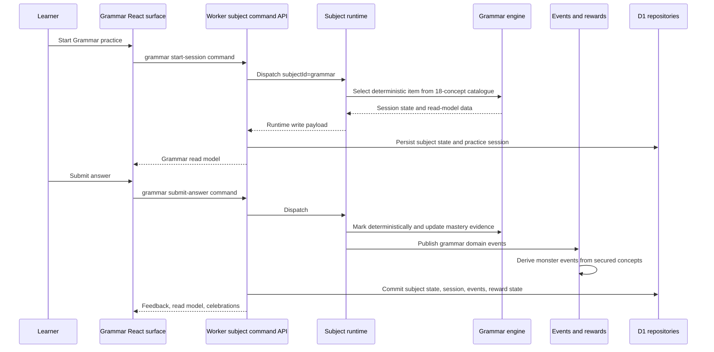

# feat: Full Grammar Mastery Region

## Overview

Build The Clause Conservatory as the full Grammar region, delivered in stages. Stage 1 is a production-safe v1, but the architecture, content denominator, monster catalogue, analytics shape, and subject contracts must already point at the full product rather than a throwaway slice.

The full target is the legacy Grammar mastery model: 18 KS2 Grammar / GPS concepts, 51 deterministic templates, misconception-aware feedback, spaced review, KS2-style mini-tests, and seven Grammar monsters. The game layer derives from secured learning evidence only. It must never influence marking, scheduling, retry queues, or mastery status.

This plan assumes the full-lockdown runtime direction continues: React renders UI and submitted form state, while production scored session creation, marking, scheduling, persistence, domain events, reward projection, and read models are Worker-owned.

## Live Checklist Snapshot

This plan is now a live checklist for the Grammar line. The original plan text below preserves the implementation rationale and staged sequencing, while this snapshot reflects the current branch target after the Grammar production-smoke and sentence-builder work has landed.

Current Grammar state:

- [x] Grammar is a Worker-owned production subject behind `POST /api/subjects/grammar/command`.
- [x] The Clause Conservatory surface is live as the real Grammar subject route, not the placeholder.
- [x] Current content release id is `grammar-legacy-reviewed-2026-04-24`.
- [x] The full denominator is represented: 18 KS2 Grammar / GPS concepts and 51 deterministic templates.
- [x] Analytics read models expose concept status, misconception patterns, question-type weakness, recent activity, and evidence summaries.
- [x] All seven Grammar monsters are wired as derived reward progress from secured Grammar evidence.
- [x] Enabled Grammar modes cover learn, smart mixed review, KS2-style mini-set, weak concepts drill, sentence surgery, sentence builder, worked examples, and faded guidance.
- [x] Strict KS2-style mini-set mode remains unsupported by pre-answer worked/faded guidance.
- [x] AI enrichment now has a non-scored Worker safe lane that validates server-side enrichment output and only permits reviewed deterministic drill ids.
- [x] Production smoke exists as `npm run smoke:production:grammar`.

Open Grammar follow-up scope:

- [ ] Add transfer and Bellstorm bridge placeholders without collapsing Grammar and Punctuation product identities.
- [ ] Decide later whether paragraph-level transfer becomes non-scored, teacher-reviewed, or a separate deterministic workflow.
- [ ] Decide whether to connect a live AI provider to the safe lane; provider keys must stay server-side and output must pass the existing validator.
- [ ] Continue to run `npm test`, `npm run check`, and Grammar production/UI smoke for each shipped Grammar slice.

---

## Problem Frame

James wants the full Grammar subject, not a small experiment that later has to be rebuilt. The practical delivery should still be staged across multiple PRs so each stage can be reviewed, tested, and shipped without blocking on every future capability.

The key product call is now resolved: the full Grammar denominator includes all 18 legacy concepts, including the five punctuation-for-grammar concepts. Bellstorm Coast can still become a richer Punctuation region later, but The Clause Conservatory needs the full KS2 GPS-style Grammar coverage for Concordium and the Grammar mastery claim.

---

## Requirements Trace

- R1. Grammar is a concept mastery engine, not a full English writing engine.
- R2. Preserve or deliberately route the legacy baseline: 18 concepts, 51 deterministic templates, 31 selected-response templates, 20 constructed-response templates, and classify / identify / choose / fill / fix / rewrite / build / explain question types.
- R3. Track mastery at concept, template, question-type, generated-item, misconception, retry, event, and session levels.
- R4. Derive the 0-100% Grammar scale from secured learning evidence, not raw accuracy or session volume.
- R5. A concept is secured only when strength, spacing, streak, due status, and weak status all support it.
- R6. Preserve mixed retrieval, interleaving, spaced return, mistake recycling, contrast, minimal hints, worked support, faded support, and no pre-attempt answer leakage.
- R7. Supported correctness counts less than independent first-attempt correctness.
- R8. AI stays enrichment-only; score-bearing generation and marking stay deterministic.
- R9. Use The Clause Conservatory region identity and assets.
- R10. Use seven Grammar creatures: Bracehart, Glossbloom, Loomrill, Chronalyx, Couronnail, Mirrane, and Concordium.
- R11. Map six direct monster families to the six Grammar domains.
- R12. Direct evolution derives from secured domain concepts; Concordium derives from aggregate Grammar mastery and reaches Mega only at full selected denominator.
- R13. Monster state derives from committed learning events or read models and never mutates learning state.
- R14. Reuse existing monster assets before requesting new image generation.
- R15. Reporting separates educational evidence from game rewards.
- R16. Parent-facing summaries expose concept status, misconception trends, due review, recent activity, and question-type weakness.
- R17. Learner-facing creature copy must not imply rewards replace mastery evidence.
- R18. Production Grammar follows the Worker-owned subject command/read-model direction.
- R19. Browser-local Grammar can exist only as development/reference mode.
- R20. Do not regress English Spelling parity, routing, persistence, import/export, learner switching, event publication, or bundle audit guarantees.

**Origin actors:** A1 KS2 learner, A2 Parent or supervising adult, A3 Grammar subject engine, A4 Game and reward layer, A5 Platform runtime.

**Origin flows:** F1 Grammar practice without game dependency, F2 Monster progress as a derived reward, F3 Adult-facing evidence.

**Origin acceptance examples:** AE1 due review blocks monster progress, AE2 supported correctness gives lower gain, AE3 AI drill uses deterministic templates, AE4 parent report separates education evidence from rewards.

---

## Scope Boundaries

- Do not directly ship the legacy single-file HTML as the production subject.
- Do not let AI author scored items or mark scored free-text answers.
- Do not base monster progression on session volume alone.
- Do not build a Grammar content CMS in the first stages.
- Do not alter English Spelling parity or existing spelling monster rules.
- Do not collapse Bellstorm Coast into The Clause Conservatory. Grammar full includes punctuation-for-grammar concepts; Bellstorm Coast remains a future distinct Punctuation progression.
- Do not expose production Grammar engine/content authority in the public browser bundle.

### Deferred to Follow-Up Work

- Full paragraph-level writing transfer: ship after the deterministic Grammar engine and reporting are stable.
- Bellstorm Coast as its own rich Punctuation subject: plan separately after Grammar's punctuation-for-grammar bridge is clear.
- Grammar content-management workflows: defer until the deterministic content has production evidence.
- Optional AI tutor/reporting polish: only after deterministic scoring and read models are complete.

### Explicitly Not In This Plan

- Daily Grammar Mission / habit loop: defer until the core Grammar product is on the table and the deterministic engine, Worker boundary, and evidence model have shipped.
- SATs countdown, weekly digest, and exam coaching flows: defer to a later product pass rather than bundling them into the engine translation and full skeleton work.
- Gamified streak/ranking mechanics beyond derived monster progress: defer unless they can be proved to reinforce, not replace, secured Grammar evidence.

---

## Context & Research

### Relevant Code and Patterns

- `docs/brainstorms/2026-04-24-grammar-mastery-region-requirements.md` is the origin product decision.
- `docs/plans/2026-04-23-001-feat-full-lockdown-runtime-plan.md` defines the Worker-owned subject command/read-model direction.
- `docs/subject-expansion.md` defines the future-subject harness, React subject module contract, generic persistence boundaries, and production rule that a public subject must not ship its production engine as a browser runtime.
- `src/platform/core/subject-registry.js` currently registers `grammarModule` as a placeholder subject from `src/subjects/placeholders/index.js`.
- `worker/src/subjects/runtime.js` registers Worker subject command handlers by subject id. Grammar should plug into the same runtime as Spelling.
- `worker/src/subjects/spelling/commands.js` is the current pattern for subject command handling, read model building, projection events, rewards, audio cues, and runtime writes.
- `worker/src/subjects/spelling/read-models.js` is the current safe read-model shape for browser rendering.
- `src/subjects/spelling/module.js` and `src/subjects/spelling/components/` are the current React subject surface patterns.
- `src/platform/game/monsters.js`, `src/platform/game/monster-system.js`, and `tests/monster-system.test.js` are the reward pattern to extend.
- `tests/subject-expansion.test.js` and `tests/helpers/subject-expansion-harness.js` define the subject expansion conformance and golden-path expectations.
- `tests/worker-subject-runtime.test.js`, `tests/worker-projections.test.js`, and `tests/server-spelling-engine-parity.test.js` show the server runtime and parity test style to mirror.
- `docs/plans/james/grammar/grammar-conversation.md` records the Clause Conservatory identity, monster names, and asset direction.
- `assets/regions/the-clause-conservatory/` already contains the Grammar region backgrounds.
- `assets/monsters/bracehart/`, `assets/monsters/glossbloom/`, `assets/monsters/loomrill/`, `assets/monsters/chronalyx/`, `assets/monsters/couronnail/`, `assets/monsters/mirrane/`, and `assets/monsters/concordium/` already contain stage assets.

### Institutional Learnings

- The previous ks2-mastery release-gate work treated pre-production validation as a real gate: tests, check, production-bundle audit, deterministic smoke checks, and production UI verification when user-facing flows change.
- Browser/gstack validation can be flaky on this machine, so deterministic HTTP/Node checks should be the fallback evidence path.
- Current project instructions require package scripts for Cloudflare operations and warn not to regress spelling parity, remote sync, learner state, D1, R2, or deployment paths.

### External References

- External research is not needed for this plan. The core risk is local architecture and pedagogy preservation, and the repo already has strong local patterns for subject command boundaries, read models, deterministic engines, reward projection, and subject expansion testing.

---

## What Already Exists

| Need | Existing foundation | Plan posture |
|---|---|---|
| Grammar pedagogy and deterministic content | Reviewed legacy Grammar HTML engine | Use as oracle and translate, do not discard fidelity. |
| Subject command boundary | `POST /api/subjects/:subjectId/command`, `worker/src/subjects/runtime.js`, command contract tests | Reuse for Grammar; no Grammar-specific endpoint. |
| Worker subject pattern | `worker/src/subjects/spelling/commands.js`, `worker/src/subjects/spelling/read-models.js` | Mirror command/read-model shape while keeping Grammar engine separate. |
| Generic persistence | `child_subject_state`, `practice_sessions`, `event_log`, `child_game_state` repository paths | Store Grammar state through the existing generic tables. |
| Reward projection | `src/platform/game/monsters.js`, `src/platform/game/monster-system.js`, `worker/src/projections/rewards.js` | Extend subject-aware reward helpers without changing Spelling semantics. |
| Subject UI shell | React subject route, registry, Spelling components, placeholder modules | Replace Grammar placeholder with a real module and reuse shell patterns. |
| Production bundle lockdown | `tests/build-public.test.js`, `scripts/production-bundle-audit.mjs` | Add Grammar forbidden-path assertions. |
| Release gate | `npm test`, `npm run check`, production-style smoke posture | Keep package-script verification and logged-in/demo UI verification. |

## Dream State Delta

```text
CURRENT STATE
  Spelling is real. Grammar is a placeholder. Legacy Grammar engine exists outside the production platform.

THIS PLAN
  Grammar becomes the first full non-Spelling mastery subject:
  deterministic engine, Worker commands, full 18-concept map, evidence read model,
  derived monsters, bundle lockdown, and staged future modes.

12-MONTH IDEAL
  KS2 Mastery has multiple real subjects using the same subject command/read-model spine.
  Parents trust the evidence. Learners see creature progress, but mastery remains auditable.
  New subjects reuse the platform instead of reopening architecture every time.
```

## Architecture Fit

```text
React Grammar Surface
  |
  | command intent only
  v
POST /api/subjects/grammar/command
  |
  | existing subject command contract
  v
worker/src/subjects/runtime.js
  |
  | dispatch subjectId=grammar
  v
worker/src/subjects/grammar/commands.js
  |
  +--> worker/src/subjects/grammar/engine.js
  |      |
  |      +--> worker/src/subjects/grammar/content.js
  |
  +--> worker/src/subjects/grammar/read-models.js
  |
  +--> worker/src/projections/rewards.js
  |
  v
D1 generic persistence
  child_subject_state
  practice_sessions
  event_log
  child_game_state
```

State machine:

```text
setup
  | start-session
  v
session
  | submit-answer
  v
feedback
  | continue-session              | end-session
  v                               v
session ----------------------> summary
  ^                               |
  | resume/reload read model      | start-session
  +-------------------------------+

Invalid transitions:
  submit-answer without active session -> grammar_session_stale
  worked/faded support in strict mini-test before marking -> grammar_mode_unsupported
  locked future mode command -> subject_command_not_found or grammar_mode_unsupported
```

---

## Key Technical Decisions

- **Full target from day one:** Stage 1 may ship as v1, but every durable contract should reference the full 18-concept Grammar denominator and seven-monster progression path.
- **Stage 1 skeleton is full-product shaped:** Stage 1 may enable only learn, smart mixed review, and KS2-style mini-set modes, but its read models, capability flags, concept map, monster metadata, analytics fields, and locked/future UI states should already represent the full Grammar product.
- **Worker-first subject authority:** Grammar production scoring, scheduling, session state, persistence, and rewards should be Worker-owned, matching the full-lockdown direction.
- **Reuse the generic subject command route:** Grammar should plug into the existing `POST /api/subjects/:subjectId/command` route and subject runtime. It should not add a Grammar-specific command endpoint or bypass request ids, expected learner revisions, same-origin checks, replay handling, or stale-write retry semantics.
- **Legacy engine as source material, not production code:** Extract concepts, templates, state transitions, and tests from the HTML, but do not copy DOM, localStorage, browser AI key handling, or closure-heavy runtime assumptions into production.
- **Legacy engine as oracle before translation:** Stage 1 should first capture the reviewed HTML engine's observable behaviour as golden fixtures, then translate that behaviour into Worker-safe modules. Fidelity is proven by tests, not by manual interpretation.
- **Characterisation-first extraction:** Before changing the legacy logic shape, pin template generation, marking, mini-set generation, secured status, and retry scheduling with tests.
- **Stable replay identity:** Generated items, attempts, and analytics evidence should be replayable by `contentReleaseId`, template id, seed, and learner response data. This lets Stage 1 remain auditable while later stages add modes and accepted-answer improvements.
- **Multi-skill templates preserve legacy update semantics:** If a template carries multiple `skillIds`, the translated engine should update every listed concept node, matching the legacy engine's `applyLearningUpdate()` behaviour, unless an oracle fixture proves a narrower rule for a specific item.
- **All 18 concepts are in full Grammar:** The five punctuation-for-grammar concepts count towards the full Grammar denominator and Concordium. Bellstorm Coast remains a future Punctuation subject for richer punctuation identity.
- **Stage 1 user promise:** Stage 1 should feel like a real Clause Conservatory v1, not an empty placeholder: learner can practise, see concept status, and see locked/full progression. Some advanced modes may be visibly "coming next".
- **Game layer remains derived:** Grammar monsters evolve from secured concept evidence and aggregate Grammar mastery only. Reward projection never writes Grammar mastery.
- **Read models are the UI contract:** React components should render the current Grammar read model and submit command payloads. They should not import scoring templates or engine content in production.
- **Parent evidence before rewards:** Adult reporting should show secured/due/weak/misconception evidence first, then creature progress as a derived motivator.

---

## Open Questions

### Resolved During Planning

- **Should this stay v1-only?** No. The product target is full Grammar, staged across PRs.
- **Should Stage 1 still exist?** Yes. Stage 1 is the first production-safe delivery, but with full placeholders and denominator contracts.
- **Should punctuation-for-grammar count for full Concordium?** Yes. Full Grammar uses all 18 legacy concepts. Bellstorm Coast remains a future distinct subject/region.
- **Should the legacy HTML be directly merged?** No. It is a reference implementation and test oracle.
- **Should AI be part of Stage 1 scoring?** No. AI stays optional enrichment later and never owns scored marking.

### Deferred to Implementation

- **Exact staged feature flag / availability copy:** Choose during React implementation so locked placeholders fit the current subject UI.
- **Exact Grammar command envelope fields:** Follow the final full-lockdown command contract when implementation starts.
- **Exact threshold numbers for each direct Grammar monster:** Use proportional thresholds over each domain denominator, then tune with tests and James review.
- **Exact accepted-answer expansion strategy:** Preserve deterministic marking first, then add accepted variants where tests prove legitimate alternatives.

## Implementation Prerequisites

- The generic Worker subject command route from the full-lockdown work exists and must be reused. U3 should only extend the subject runtime with Grammar handlers and any generic hook that Grammar proves is missing.
- The supplied legacy Grammar artefacts remain reference inputs only. Extracted production content should live in Worker-safe modules and plan/code references should stay repo-relative.
- Existing Clause Conservatory region assets and the seven Grammar monster asset folders are available and should be reused before requesting new assets.
- Stage 1 release decisions must preserve the full 18-concept denominator even if only the core practice modes are enabled.
- Feature flags or capability fields should distinguish "not enabled yet" from "not part of the full Grammar product" so Stage 1 placeholders do not become product debt.

---

## Phased Delivery

### Stage 1: Production-Safe Grammar v1 With Full Skeleton

- Build a legacy engine translation harness that snapshots generated items, marking results, mini-set generation, secured-status examples, and retry/scheduling transitions from the reviewed HTML engine.
- Port and test the full 18-concept content catalogue and deterministic engine core.
- Ship a Worker-owned Grammar subject command/read-model path for core practice.
- Replace the placeholder Grammar route with a real Clause Conservatory surface.
- Show full concept map, all seven monsters, locked/coming-next states, and aggregate Concordium path.
- Include core modes only: learn, smart mixed review, and KS2-style mini-set, unless implementation proves additional modes are cheap and safe.

### Stage 2: Full Legacy Practice Modes

- Add trouble, surgery, builder, worked-example, and faded-support modes.
- Harden retry scheduling, misconception repair loops, and question-type balancing.
- Expand analytics to match the educational method in the legacy report.

### Stage 3: Reporting, Parent Evidence, And AI Safe Lane

- Add parent/adult summaries, exportable progress evidence, and richer read models.
- Add optional AI explanation/revision-card enrichment with deterministic drill whitelisting.
- Keep AI output non-scored.

### Stage 4: Transfer And Punctuation Bridge

- Add paragraph/sentence-transfer modes as non-scored or explicitly teacher-reviewed workflows.
- Define how Bellstorm Coast receives richer Punctuation progression without stealing or corrupting the Grammar denominator.
- Decide whether punctuation monsters remain separate from the Grammar seven or become a cross-region progression.

---

## Output Structure

This expected shape is directional. Implementation may adjust names if a tighter local pattern appears, but the plan expects production authority to live in Worker-side Grammar modules and browser code to render read models only.

```text
worker/src/subjects/grammar/
  content.js
  engine.js
  commands.js
  read-models.js
tests/fixtures/grammar-legacy-oracle/
src/subjects/grammar/
  module.js
  components/
    GrammarPracticeSurface.jsx
    GrammarSetupScene.jsx
    GrammarSessionScene.jsx
    GrammarSummaryScene.jsx
    GrammarAnalyticsScene.jsx
    GrammarMonsterProgress.jsx
src/platform/game/
  monsters.js
  monster-system.js
tests/
  grammar-engine.test.js
  worker-grammar-subject-runtime.test.js
  react-grammar-surface.test.js
  grammar-monster-system.test.js
```

---

## High-Level Technical Design

> *This illustrates the intended approach and is directional guidance for review, not implementation specification. The implementing agent should treat it as context, not code to reproduce.*



---

## Implementation Units

- [x] U1. **Extract Full Grammar Content And Characterisation Tests**

**Goal:** Convert the legacy Grammar engine into a tested, portable source of Grammar content and expected behaviour before production integration starts.

**Requirements:** R1, R2, R3, R4, R5, R6, R7, R8, AE1, AE2, AE3

**Dependencies:** None.

**Files:**
- Create: `worker/src/subjects/grammar/content.js`
- Create: `tests/grammar-engine.test.js`
- Create: `scripts/extract-grammar-legacy-oracle.mjs`
- Create: `tests/helpers/grammar-legacy-oracle.js`
- Create: `tests/fixtures/grammar-legacy-oracle/`
- Reference: `docs/plans/james/grammar/grammar-conversation.md`
- Reference: `docs/brainstorms/2026-04-24-grammar-mastery-region-requirements.md`

**Approach:**
- Treat the reviewed legacy HTML engine as the behavioural oracle for Stage 1 extraction.
- Build an offline translation harness that captures representative generated questions, expected marking outcomes, mini-set packs, concept status examples, misconception tags, and retry/scheduling transitions from the supplied legacy artefact.
- Keep the legacy source artefact out of production output. The extraction script may read a local supplied file during development, but committed tests should rely on repo-local fixtures and Worker-safe content modules.
- Extract the 18 concept definitions, misconception labels, minimal hints, question-type metadata, template metadata, and lexicon/reference items into Worker-safe content.
- Preserve the full denominator in data, including punctuation-for-grammar concepts.
- Assign a `contentReleaseId` and replay metadata so every generated item can be traced by release, template id, seed, concept ids, question type, and deterministic answer model.
- Preserve template `skillIds` arrays and test that multi-skill generated items update every listed concept node in the translated engine.
- Avoid DOM, localStorage, browser AI settings, or render string assumptions.
- Add characterisation tests for all 51 templates: deterministic generation, evaluate without runtime errors, item ids, skill ids, question type ids, and accepted-answer behaviour where deterministic.
- Compare the translated Worker-safe content and engine behaviour against the legacy oracle fixtures before any product UI work depends on it.
- Add mini-set generation regression tests for mixed plus each concept focus.

**Execution note:** Characterisation-first. Pin behaviour before improving structure.

**Patterns to follow:**
- `worker/src/subjects/spelling/engine.js`
- `tests/server-spelling-engine-parity.test.js`
- `tests/spelling-parity.test.js`

**Test scenarios:**
- Happy path: legacy oracle fixtures load without browser APIs and document the reviewed legacy content release.
- Happy path: all 18 concept ids exist and are mapped either to a direct Grammar monster domain or the aggregate-only punctuation-for-grammar bucket.
- Happy path: all 51 templates generate valid serialisable question data for multiple fixed seeds.
- Happy path: selected-response and constructed-response template counts match the legacy baseline.
- Happy path: all template skill ids reference known concepts.
- Happy path: generated items include stable replay metadata for `contentReleaseId`, template id, seed, concept ids, and question type.
- Happy path: multi-skill template answers update all listed concept mastery nodes, not only the first skill id.
- Regression: translated Worker-safe generation and marking match the legacy oracle for the fixed fixture seeds and responses.
- Error path: constructed-response marking handles empty or malformed learner responses without throwing.
- Integration: mini-set generation returns target length for mixed plus all 18 focused concept cases.
- Regression: mini-set generation does not loop indefinitely for narrow concept pools.
- Regression: template repeat caps and fallback broadening preserve executable test packs.

**Verification:**
- The full Grammar catalogue is represented in Worker-safe modules.
- The extracted content is covered by deterministic tests and can be used without browser APIs.

- [x] U2. **Build Grammar Engine State And Mastery Transitions**

**Goal:** Implement the Grammar engine's core state machine: session creation, deterministic marking, learning updates, retry queue, status calculation, and analytics-friendly events.

**Requirements:** R3, R4, R5, R6, R7, R8, R15, R16, AE1, AE2

**Dependencies:** U1.

**Files:**
- Create: `worker/src/subjects/grammar/engine.js`
- Modify: `tests/grammar-engine.test.js`

**Approach:**
- Define serialisable Grammar state: prefs, mastery nodes, retry queue, sessions, current round, recent events, and content release id.
- Implement the legacy status model: new, learning, weak, due, secured.
- Preserve answer quality weighting so independent first-attempt correctness gives the strongest gain and worked/faded support gives reduced gain.
- Use deterministic time/random fixtures in tests; avoid live `Math.random()` inside selection logic once a session seed exists.
- Store attempt evidence in a replayable shape: content release id, template id, seed, learner response, support level, marker result, misconception tags, and resulting status delta.
- Emit domain events such as `grammar.answer-submitted`, `grammar.concept-secured`, `grammar.misconception-seen`, and `grammar.session-completed`.

**Patterns to follow:**
- `worker/src/subjects/spelling/engine.js`
- `src/subjects/spelling/service-contract.js`
- `docs/spelling-parity.md`

**Test scenarios:**
- Happy path: first independent correct answer increases concept/template/question-type/item strength.
- Covers AE1. Edge case: a concept with high strength but due now is not reported as secured.
- Covers AE2. Happy path: worked/faded supported correctness improves state less than independent first-attempt correctness.
- Error path: wrong answers reduce strength, reset correct streak, tag misconception, and enqueue retry.
- Edge case: partial constructed-response credit schedules shorter review than independent correct.
- Edge case: a content release mismatch does not silently replay old attempt evidence against new template semantics.
- Integration: completing a mini-set records a session summary and emits session events.
- Regression: retry queue de-duplicates repeated misses for the same template/seed.

**Verification:**
- Grammar state transitions are deterministic, serialisable, and independent of React/browser APIs.

- [x] U3. **Add Worker Grammar Commands And Read Models**

**Goal:** Plug Grammar into the Worker subject runtime so production Grammar sessions use the same command/read-model boundary as Spelling.

**Requirements:** R18, R19, R20, F1, F2, AE3

**Dependencies:** U1, U2, full-lockdown subject command route available.

**Files:**
- Create: `worker/src/subjects/grammar/commands.js`
- Create: `worker/src/subjects/grammar/read-models.js`
- Modify: `worker/src/subjects/runtime.js`
- Test: `tests/worker-grammar-subject-runtime.test.js`
- Test: `tests/worker-subject-runtime.test.js`

**Approach:**
- Register Grammar command handlers behind subject id `grammar`.
- Support Stage 1 commands: `start-session`, `submit-answer`, `continue-session`, `end-session`, `save-prefs`, and `reset-learner`.
- Reuse the existing command contract: request id, correlation id, expected learner revision, learner access checks, same-origin production checks, replay receipts, and stale-write retry behaviour.
- Return a safe Grammar read model containing phase, session, current item view, feedback, summary, prefs, stats, analytics snapshot, concept map, and monster projection inputs.
- Include capability metadata for enabled Stage 1 modes and locked future modes so React does not infer product scope from missing fields.
- Ensure runtime writes include subject state, practice-session state, domain events, and reward projection updates.
- Do not expose template internals in the browser read model beyond what is needed to render the current item.

**Patterns to follow:**
- `worker/src/subjects/runtime.js`
- `worker/src/subjects/spelling/commands.js`
- `worker/src/subjects/spelling/read-models.js`
- `tests/worker-subject-runtime.test.js`

**Test scenarios:**
- Happy path: `start-session` returns a Grammar read model with Worker authority metadata.
- Happy path: `submit-answer` marks deterministically, persists runtime writes, and returns feedback.
- Covers AE3. Error path: AI/revision drill commands cannot submit AI-authored scored question text.
- Error path: unknown Grammar command fails closed through `subject_command_not_found`.
- Error path: cross-origin production command attempts are rejected before Grammar handlers run.
- Error path: stale learner revision retries once through the existing client/repository path and does not double-apply Grammar mastery or rewards.
- Integration: valid Grammar command persists `child_subject_state`, `practice_sessions`, and `event_log` through existing repository paths.
- Integration: command replay/idempotency follows the same semantics as other subject commands.

**Verification:**
- Grammar is registered in Worker subject runtime and can complete a command lifecycle without client-owned scoring.

- [x] U4. **Replace Grammar Placeholder With Stage 1 Clause Conservatory Surface**

**Goal:** Make Grammar a real React subject route that renders Worker read models, shows the full future map, and supports Stage 1 practice without importing production engine code.

**Requirements:** R1, R9, R15, R16, R17, R18, R19, R20, F1, F3

**Dependencies:** U3.

**Files:**
- Create: `src/subjects/grammar/module.js`
- Create: `src/subjects/grammar/components/GrammarPracticeSurface.jsx`
- Create: `src/subjects/grammar/components/GrammarSetupScene.jsx`
- Create: `src/subjects/grammar/components/GrammarSessionScene.jsx`
- Create: `src/subjects/grammar/components/GrammarSummaryScene.jsx`
- Create: `src/subjects/grammar/components/GrammarAnalyticsScene.jsx`
- Modify: `src/platform/core/subject-registry.js`
- Modify: `src/subjects/placeholders/index.js`
- Test: `tests/react-grammar-surface.test.js`
- Test: `tests/subject-expansion.test.js`

**Approach:**
- Replace the placeholder `grammarModule` with a real module that satisfies the subject registry contract.
- Use the subject command client to start/submit/continue/end sessions.
- Render the Clause Conservatory identity using existing region assets.
- Display all 18 concepts in the full mastery map, with Stage 1 capabilities enabled and future modes visibly locked/coming-next.
- Show all seven Grammar monsters from the start, including locked direct-domain monsters and Concordium aggregate progress, so the v1 route communicates the full destination.
- Keep copy in UK English.
- Keep all scoring/content authority out of production React imports.

**Patterns to follow:**
- `src/subjects/spelling/module.js`
- `src/subjects/spelling/components/SpellingPracticeSurface.jsx`
- `src/surfaces/subject/SubjectRoute.jsx`
- `src/subjects/placeholders/module-factory.js`

**Test scenarios:**
- Happy path: dashboard opens Grammar and renders the Clause Conservatory setup scene.
- Happy path: learner starts a Grammar session, submits an answer, receives feedback, reaches summary, and returns to dashboard.
- Happy path: all shared subject tabs render without special shell routes.
- Edge case: locked future modes render as unavailable without dispatching commands.
- Error path: Worker command failure is contained inside the Grammar subject tab.
- Integration: learner switching preserves or safely reloads the current Grammar read model.
- Integration: import/export restore does not break a live Grammar route.
- Regression: production browser bundle does not import `worker/src/subjects/grammar/engine.js` or full template content.

**Verification:**
- Grammar is visible as a real subject and passes subject expansion conformance without weakening browser/runtime containment.

- [x] U5. **Extend Monster System For Grammar Rewards**

**Goal:** Add Grammar monster metadata, domain routing, reward derivation, and celebration events for all seven Grammar creatures.

**Requirements:** R9, R10, R11, R12, R13, R14, R17, F2, AE1, AE2, AE4

**Dependencies:** U2, U3.

**Files:**
- Modify: `src/platform/game/monsters.js`
- Modify: `src/platform/game/monster-system.js`
- Modify: `worker/src/projections/rewards.js`
- Create: `tests/grammar-monster-system.test.js`
- Modify: `tests/monster-system.test.js`
- Reference: `assets/monsters/bracehart/`
- Reference: `assets/monsters/glossbloom/`
- Reference: `assets/monsters/loomrill/`
- Reference: `assets/monsters/chronalyx/`
- Reference: `assets/monsters/couronnail/`
- Reference: `assets/monsters/mirrane/`
- Reference: `assets/monsters/concordium/`

**Approach:**
- Add Grammar monsters and `MONSTERS_BY_SUBJECT.grammar`.
- Add subject-aware progress helpers so Spelling and Grammar can coexist without changing Spelling semantics.
- Extend reward projection through a subject-aware adapter rather than cloning Spelling-only projection logic into a parallel Grammar path.
- Make branch initialisation subject-aware. Existing Spelling summaries and projections must not start persisting empty Grammar monster entries just because Grammar metadata now exists.
- Map direct Grammar monsters to domains:
  - Bracehart: `sentence_functions`, `clauses`, `relative_clauses`
  - Glossbloom: `word_classes`, `noun_phrases`
  - Loomrill: `adverbials`, `pronouns_cohesion`
  - Chronalyx: `tense_aspect`, `modal_verbs`
  - Couronnail: `standard_english`, `formality`
  - Mirrane: `active_passive`, `subject_object`
  - Concordium: all 18 Grammar concepts
- Include punctuation-for-grammar concepts in Concordium's full denominator and, if needed, route them to aggregate-only progress until Bellstorm Coast gets its own direct progression.
- Emit caught/evolve/mega/level-up events only when committed Grammar domain events prove new secured concepts.

**Patterns to follow:**
- `src/platform/game/monsters.js`
- `src/platform/game/monster-system.js`
- `tests/monster-system.test.js`
- `worker/src/projections/rewards.js`

**Test scenarios:**
- Happy path: each direct Grammar monster catches/evolves from secured concepts in its domain.
- Happy path: Concordium progresses from all 18 Grammar concepts and reaches Mega only at full denominator.
- Covers AE1. Edge case: due or weak concepts do not count as secured monster evidence.
- Edge case: punctuation-for-grammar concepts count for Concordium but do not accidentally mutate a future Bellstorm direct monster state.
- Regression: loading Spelling monster summaries does not create or persist Grammar monster branches or empty Grammar monster state.
- Regression: Spelling monsters and Phaeton thresholds are unchanged.
- Integration: Grammar reward events appear in command projections and toast events after concept-secured events.

**Verification:**
- Grammar rewards are derived, subject-aware, asset-backed, and non-regressive for existing spelling rewards.

- [x] U6. **Add Stage 1 Analytics And Parent Evidence Read Models**

**Goal:** Provide educational evidence first and reward progress second for learner and adult-facing Grammar surfaces.

**Requirements:** R3, R4, R5, R15, R16, R17, F3, AE4

**Dependencies:** U2, U3, U4, U5.

**Files:**
- Modify: `worker/src/subjects/grammar/read-models.js`
- Modify: `src/subjects/grammar/components/GrammarAnalyticsScene.jsx`
- Modify: `src/subjects/grammar/components/GrammarSummaryScene.jsx`
- Test: `tests/worker-grammar-subject-runtime.test.js`
- Test: `tests/react-grammar-surface.test.js`

**Approach:**
- Build an analytics snapshot from durable Grammar state and events.
- Include secured, due, weak, untouched, misconception, recent activity, and question-type summaries.
- Add learner-facing monster progress as a separate derived panel.
- Add copy explaining the method: retrieval, contrast, spaced review, misconception repair, and secured evidence.
- Leave AI parent summary out of Stage 1 unless the deterministic report already exists and the safe lane is easy to add later.

**Patterns to follow:**
- `worker/src/subjects/spelling/read-models.js`
- `src/subjects/spelling/components/SpellingSummaryScene.jsx`
- `src/surfaces/hubs/ParentHubSurface.jsx`

**Test scenarios:**
- Covers AE4. Happy path: analytics shows concept evidence before monster progress.
- Happy path: secured/due/weak counts update after answer submission.
- Edge case: untouched concepts appear as untouched rather than weak.
- Error path: malformed or missing analytics state renders a safe empty state.
- Integration: parent/adult read model can consume Grammar analytics without importing engine content client-side.

**Verification:**
- Grammar progress can be explained without the game layer, and the game layer remains visibly secondary.

- [x] U7. **Add Full Legacy Practice Modes**

**Goal:** Complete the legacy practice experience beyond Stage 1 core modes.

**Requirements:** R1, R2, R6, R7, R8, R15

**Dependencies:** U2, U3, U4, U6.

**Files:**
- Modify: `worker/src/subjects/grammar/engine.js`
- Modify: `worker/src/subjects/grammar/commands.js`
- Modify: `worker/src/subjects/grammar/read-models.js`
- Modify: `src/subjects/grammar/components/GrammarPracticeSurface.jsx`
- Modify: `src/subjects/grammar/components/GrammarSetupScene.jsx`
- Modify: `src/subjects/grammar/components/GrammarSessionScene.jsx`
- Test: `tests/grammar-engine.test.js`
- Test: `tests/worker-grammar-subject-runtime.test.js`
- Test: `tests/react-grammar-surface.test.js`

**Approach:**
- Add trouble drill, sentence surgery, sentence builder/transformation, worked examples, and faded guidance.
- Keep support-level scoring penalties.
- Keep strict mini-test mode free of early hints and worked support.
- Ensure template selection balances due, weak, recent wrong, question-type weakness, and repeat penalty.

**Patterns to follow:**
- Legacy Grammar design conversation in `docs/plans/james/grammar/grammar-conversation.md`
- Origin requirements in `docs/brainstorms/2026-04-24-grammar-mastery-region-requirements.md`
- `worker/src/subjects/spelling/engine.js`
- `tests/spelling.test.js`

**Test scenarios:**
- Happy path: each mode starts a session with appropriate template filtering.
- Happy path: worked/faded support changes support level and reduces mastery gain.
- Edge case: narrow focus pools fall back safely without infinite loops.
- Error path: strict test mode blocks worked/faded actions until marking.
- Integration: mode changes persist in prefs and recover after learner switching.

**Verification:**
- Full legacy practice modes are available through Worker-owned Grammar commands and covered by deterministic tests.

- [x] U8. **Add AI Enrichment Safe Lane**

**Goal:** Restore the useful legacy AI lane without allowing AI to score, author production items, or bypass deterministic templates.

**Requirements:** R8, R15, R16, AE3

**Dependencies:** U3, U6, U7.

**Files:**
- Create: `worker/src/subjects/grammar/ai-enrichment.js`
- Modify: `worker/src/subjects/grammar/commands.js`
- Modify: `worker/src/subjects/grammar/read-models.js`
- Modify: `src/subjects/grammar/components/GrammarSessionScene.jsx`
- Test: `tests/worker-grammar-subject-runtime.test.js`
- Test: `tests/react-grammar-surface.test.js`

**Approach:**
- If AI is enabled, expose commands for explanation, revision cards, and parent summary drafts.
- Validate AI responses server-side: short UK English text, no score-bearing question bodies, drill section may only reference whitelisted deterministic template ids.
- Return AI enrichment as non-scored read-model content.
- Keep API keys and model calls server-side; do not bring legacy browser key storage forward.

**Patterns to follow:**
- `worker/src/tts.js` for protected server-side third-party calls
- `worker/src/subjects/spelling/commands.js` for command result structure

**Test scenarios:**
- Covers AE3. Happy path: AI drill suggestion loads only whitelisted deterministic template ids.
- Error path: AI-authored scored question text is rejected.
- Error path: malformed AI JSON returns contained enrichment failure and does not mutate Grammar mastery.
- Integration: AI explanation renders as enrichment and no subject state write is produced unless a deterministic follow-up drill is explicitly started.

**Verification:**
- AI improves explanation and reporting only; deterministic engine remains the sole score-bearing authority.

- [ ] U9. **Add Transfer And Bellstorm Bridge Placeholders**

**Goal:** Make the full product path explicit without overbuilding paragraph writing or the future Punctuation region in the initial stages.

**Requirements:** R1, R2, R9, R12, R15, R20

**Dependencies:** U4, U5, U6.

**Files:**
- Modify: `src/subjects/grammar/components/GrammarPracticeSurface.jsx`
- Modify: `src/subjects/grammar/components/GrammarAnalyticsScene.jsx`
- Modify: `src/subjects/placeholders/index.js`
- Test: `tests/react-grammar-surface.test.js`

**Approach:**
- Add non-scored/coming-next surfaces for paragraph transfer and richer writing application.
- Show how punctuation-for-grammar concepts are counted in Grammar, while Bellstorm Coast remains a separate future subject.
- Avoid adding Punctuation engine code in this plan.
- Ensure copy does not promise teacher-reviewed writing transfer until that capability exists.

**Patterns to follow:**
- `src/subjects/placeholders/module-factory.js`
- `docs/plans/james/punctuation/punctuation-conversation.md`

**Test scenarios:**
- Happy path: transfer and Bellstorm bridge placeholders render as future capabilities.
- Edge case: locked placeholders cannot submit scoring commands.
- Regression: Punctuation placeholder subject still appears separately in the subject registry.

**Verification:**
- Full roadmap is visible in product UI without creating fake functionality or collapsing subject identities.

- [x] U10. **Release Gate And Production Verification**

**Goal:** Treat Grammar as production-sensitive and verify it without weakening Spelling, bundle lockdown, or deployment safety.

**Requirements:** R18, R19, R20

**Dependencies:** U1 through U9 as applicable for the release stage.

**Files:**
- Modify: `tests/build-public.test.js`
- Modify: `tests/browser-react-migration-smoke.test.js`
- Create: `tests/grammar.playwright.test.mjs`
- Modify: `scripts/production-bundle-audit.mjs`
- Test: `tests/worker-grammar-subject-runtime.test.js`
- Test: `tests/react-grammar-surface.test.js`
- Test: `tests/grammar-monster-system.test.js`

**Approach:**
- Treat every staged Grammar release as production-sensitive. Stage 1 should gate U1 through U6 plus U10; later stages repeat the same gate for their added surface.
- Extend bundle/public-output audit to assert production browser output does not include Worker Grammar engine/content authority.
- Add browser smoke coverage for dashboard to Grammar to session to summary.
- Add Playwright coverage through the existing multi-viewport config for the Stage 1 Grammar route: desktop and mobile navigation, start session, answer, feedback, summary, and locked-mode non-dispatch.
- Keep package-script verification path: `npm test`, `npm run check`, production bundle audit, then production UI verification when deploying.
- Verify Spelling parity and existing reward tests remain green.

**Patterns to follow:**
- `scripts/production-bundle-audit.mjs`
- `tests/build-public.test.js`
- `tests/browser-react-migration-smoke.test.js`
- `docs/plans/2026-04-23-001-feat-full-lockdown-runtime-plan.md`

**Test scenarios:**
- Integration: Grammar production bundle does not expose engine/content authority.
- Integration: Grammar route works through Worker-backed demo/signed-in session.
- Integration: Grammar Playwright smoke passes at representative mobile and desktop viewports without text overlap or blocked controls.
- Regression: Spelling tests, subject expansion tests, monster tests, and build-public tests remain green.
- Error path: Worker command outage renders contained Grammar degraded state and does not fall back to browser-local scoring.

**Verification:**
- Grammar is ready for production only when local tests/checks and production-style smoke evidence pass.

---

## System-Wide Impact

- **Interaction graph:** Grammar touches subject registry, Worker subject runtime, D1-backed subject state, practice sessions, event log, reward projections, dashboard stats, subject route rendering, and asset loading.
- **Error propagation:** Worker command failures must surface as contained Grammar route errors. React must not recover by scoring locally.
- **State lifecycle risks:** Incomplete sessions, learner switching, import/export restore, stale writes, and duplicate command replay must follow the same semantics as current subject runtime work.
- **API surface parity:** Grammar should use the same conceptual command/read-model boundary as Spelling so future Arithmetic, Reasoning, Punctuation, and Reading can reuse the pattern.
- **Integration coverage:** Unit tests alone are insufficient. Browser smoke, Worker command tests, subject expansion conformance, bundle audit, and monster reward projection tests are required.
- **Unchanged invariants:** Spelling parity, existing spelling monsters, OAuth-safe deployment scripts, and generic platform persistence remain unchanged.

---

## Error And Rescue Registry

This registry is part of the implementation contract. New Grammar code should name and test these failures rather than relying on generic catch-all handling.

| Codepath | Failure | Error class / code | Rescue action | User sees | Required test |
|---|---|---|---|---|---|
| Subject command contract | Missing subject id, command, learner id, request id, or expected revision | `BadRequestError` with `subject_id_required`, `subject_command_required`, `learner_id_required`, `command_request_id_required`, or `command_revision_required` | Reject before Grammar handler runs | Contained subject error | Worker command validation test |
| Subject runtime dispatch | Unknown Grammar command | `NotFoundError` with `subject_command_not_found` | Fail closed | Contained subject error | Unknown command test |
| Worker command route | Cross-origin production command | `ForbiddenError` with `same_origin_required` | Reject before mutation | Contained subject error | Cross-origin route test |
| Repository mutation | Stale learner revision | `ConflictError` with `stale_write` | Client retries once after reload/rebase path; command must not double-apply events | Retry or contained stale-state message | Stale retry test |
| Repository mutation | Reused request id with different payload | `ConflictError` with `idempotency_reuse` | Reject replay | Contained subject error | Idempotency collision test |
| Grammar content read | Missing or empty Grammar content catalogue | `NotFoundError` with `grammar_content_unavailable` | Block session start | "Grammar content is not available yet" style message | Empty content test |
| Grammar engine | Stale or inactive session submit | `BadRequestError` with `grammar_session_stale` | Reject submit; read model returns setup or recoverable state | Session needs restarting | Stale session test |
| Grammar engine | Unsupported mode or template id | `BadRequestError` with `grammar_mode_unsupported` or `grammar_template_not_found` | Reject before mutation | Contained subject error | Unsupported mode/template test |
| Grammar engine | Malformed answer payload | `BadRequestError` with `grammar_answer_invalid` | Reject or normalise to safe empty answer based on question type | Field-level answer error | Nil/empty/wrong-type answer tests |
| Legacy oracle harness | Fixture cannot be loaded or parsed | Test failure, not production route | Stop implementation before port depends on bad fixture | No production user impact | Fixture load test |
| Reward projection | Duplicate `grammar.concept-secured` replay | No new error; idempotent no-op | Do not emit duplicate monster/reward events | No duplicate toast | Replay reward test |
| AI enrichment | Malformed, empty, or score-bearing AI output | `BadRequestError` or contained enrichment failure with `grammar_ai_enrichment_invalid` | Drop enrichment; never mutate mastery | Enrichment unavailable, practice still works | Malformed AI tests |

### Failure Modes Registry

| Codepath | Failure mode | Rescued? | Test? | User sees? | Logged? |
|---|---|---:|---:|---|---|
| `start-session` | Grammar content unavailable | Yes | Required | Content unavailable message | Yes, with subject id and learner id |
| `submit-answer` | Double-click or replayed submit | Yes | Required | Single feedback/result | Yes, via request id |
| `submit-answer` | Stale revision from another tab | Yes | Required | Retry or stale-state recovery | Yes, via mutation log |
| `continue-session` | Session already completed | Yes | Required | Summary/setup state | Yes |
| Reward projection | Due/weak concept passed to monster layer | Yes | Required | No reward change | Yes, if event rejected |
| React subject surface | Worker command outage | Yes | Required | Contained Grammar degraded state | Yes |
| Browser bundle | Grammar engine/content imported into production bundle | Yes | Required | Build/check failure, not runtime exposure | Yes, in audit output |

---

## Security And Threat Model

| Threat | Likelihood | Impact | Plan response |
|---|---:|---:|---|
| User submits another learner id to a Grammar command | Medium | High | Reuse repository learner access checks and subject command route tests before Grammar handler mutation. |
| Cross-origin command submission | Medium | High | Reuse production same-origin checks; add Grammar-specific route coverage so the handler is not reachable cross-origin. |
| Replay or double-click applies mastery/rewards twice | Medium | High | Reuse request ids, mutation receipts, and reward idempotency tests for `grammar.concept-secured`. |
| Long, malformed, or HTML/script answer payload | Medium | Medium | Validate/normalise per question type; cap answer length; render feedback as text/React nodes, not raw HTML. |
| AI prompt/output injection becomes scored content | Medium | High | AI enrichment is non-scored; deterministic template ids only; reject score-bearing AI question bodies. |
| Production bundle exposes Grammar engine/content | Medium | High | Worker-only modules and public-output audit block engine/content in browser output. |
| Imported/exported state injects malformed Grammar state | Medium | Medium | Subject state normalisation must shrink invalid Grammar payloads to safe defaults before read models render. |

Security-specific test additions:

- `tests/worker-grammar-subject-runtime.test.js`: learner access denial, cross-origin denial, stale retry, idempotency collision, malformed answer payload, unsupported mode/template.
- `tests/react-grammar-surface.test.js`: feedback and learner answers render as escaped text, command outage is contained, locked modes cannot dispatch scoring commands.
- `tests/build-public.test.js`: production output does not include `worker/src/subjects/grammar/`, fixture-only oracle code, or full template content.
- `tests/grammar.playwright.test.mjs`: rendered Grammar route works on mobile and desktop, locked controls do not dispatch commands, and core prompt/answer UI remains usable.
- `tests/worker-grammar-subject-runtime.test.js` for U8: malformed AI JSON, empty AI response, invalid deterministic template id, and AI-authored scored item rejection.

---

## Test Coverage Map

```text
NEW UX FLOWS
  Dashboard -> Grammar setup -> start -> answer -> feedback -> continue -> summary -> dashboard
  Grammar analytics tab -> concept evidence -> derived monster panel
  Locked future mode -> no command dispatch

NEW DATA FLOWS
  Legacy HTML oracle -> fixture snapshots -> Worker-safe content parity tests
  React command intent -> /api/subjects/grammar/command -> runtime -> engine -> D1 writes -> read model
  grammar.concept-secured -> subject-aware reward projection -> monster state -> toast/read model

NEW STATEFUL OBJECTS
  Grammar content release
  Grammar mastery node
  Grammar session
  Grammar retry queue
  Grammar read model
  Grammar reward projection state

NEW ERROR PATHS
  Missing content
  Malformed answer payload
  Stale revision
  Replayed request
  Unknown command
  Unsupported mode/template
  Worker outage
  Bundle audit failure
```

Minimum Stage 1 confidence tests:

- Unit: legacy oracle fixture loading, 51-template generation, deterministic marking, status calculation, retry queue, mini-set generation, content release mismatch.
- Worker integration: command contract validation, start/submit/continue/end/save/reset, stale retry, replay idempotency, D1 batch rollback, projection output.
- React/system: dashboard to Grammar to summary, locked modes, command failure containment, learner switching, import/export restore, no client-owned scoring.
- E2E/Playwright: dashboard to Grammar to feedback/summary at mobile and desktop viewports, with locked future modes unable to dispatch commands.
- Reward: direct Grammar monster progress, Concordium full denominator, due/weak concepts excluded, duplicate secured event no-op, Spelling monsters unchanged.
- Build/security: production bundle/public-output audit blocks Worker Grammar engine/content and oracle fixtures.

Flakiness controls:

- Use deterministic time and seed fixtures.
- Do not depend on live AI, live TTS, live browser network, or wall-clock randomness in Stage 1 correctness tests.
- Run build-sensitive checks sequentially when they touch public output.

---

## Performance, Observability, And Operations

### Performance

- The 18-concept / 51-template catalogue is small enough for Worker memory, but the production browser bundle must not carry full scoring content.
- Mini-set generation must have hard iteration caps and fallback broadening so narrow concept pools cannot loop indefinitely.
- Analytics read models should derive from stored Grammar state and recent event/session rows; avoid scanning unbounded event history on every command.
- Parent/adult summaries should receive compact evidence snapshots, not raw attempt history.

### Observability

Every Grammar command should log or emit enough context to reconstruct a reported bug without exposing child answer text unnecessarily:

- subject id, learner id, command, request id, correlation id, content release id
- session id, template id, seed, question type, concept ids
- result class: correct, partial, incorrect, invalid, stale, replayed
- domain events and reward events emitted
- mutation expected/applied revision

Metrics to add or derive:

- Grammar command success/error counts by command and error code
- stale write retry count
- template generation failure count
- mini-set fallback-broadening count
- concept-secured and reward-event counts
- bundle audit pass/fail for Grammar forbidden paths

### Deployment And Rollback

- Gate each release stage behind existing package-script verification and production bundle audit.
- Stage 1 should be feature-flag or capability-gated until Worker Grammar commands and read models pass production-style smoke.
- Rollback should be a code revert or capability disable that leaves existing `child_subject_state` and `practice_sessions` rows readable but not mutable by browser-local scoring.
- New D1 migrations should be avoided for Stage 1 unless implementation proves existing generic subject tables cannot safely store Grammar state.
- After deployment, verify a logged-in or demo-backed flow from dashboard to Grammar session to summary, plus a direct bundle/source denial audit.

---

## Implementation Parallelisation Strategy

The first three units are the spine and should stay sequential. Parallel work becomes useful only after the Worker-safe content, engine state, and command/read-model contract are stable.

| Step | Modules touched | Depends on |
|---|---|---|
| U1 Legacy oracle and content extraction | `worker/src/subjects/grammar/`, `tests/fixtures/`, `tests/helpers/`, `scripts/` | - |
| U2 Engine state and mastery transitions | `worker/src/subjects/grammar/`, `tests/` | U1 |
| U3 Worker commands and read models | `worker/src/subjects/grammar/`, `worker/src/subjects/runtime.js`, `tests/` | U1, U2 |
| U4 React Grammar surface | `src/subjects/grammar/`, subject registry, React tests | U3 |
| U5 Grammar rewards | `src/platform/game/`, `worker/src/projections/`, reward tests | U2, U3 |
| U6 Analytics and evidence read models | `worker/src/subjects/grammar/`, `src/subjects/grammar/` | U2, U3, U4, U5 |
| U7 Full legacy modes | `worker/src/subjects/grammar/`, `src/subjects/grammar/` | U2, U3, U4, U6 |
| U8 AI enrichment safe lane | `worker/src/subjects/grammar/`, `src/subjects/grammar/` | U3, U6, U7 |
| U9 Transfer/Bellstorm placeholders | `src/subjects/grammar/`, `src/subjects/placeholders/` | U4, U5, U6 |
| U10 Release gate | `tests/`, `scripts/` | Current release stage |

Suggested lanes:

```text
Lane A: U1 -> U2 -> U3
  Sequential. This defines the contract everyone else depends on.

Lane B: U4
  Starts after U3. UI work can run while rewards are implemented.

Lane C: U5
  Starts after U3. Reward work can run beside U4, but must avoid Spelling state drift.

Lane D: U6 -> U7 -> U8/U9
  Sequential enough to avoid read-model churn.

Lane E: U10
  Runs at each release gate, after the relevant stage lands.
```

Conflict flags:

- U4 and U6 both touch `src/subjects/grammar/`; merge U4 before broad analytics UI work.
- U5 and U10 both touch reward/bundle tests; coordinate test helper names.
- U7 and U8 both touch Grammar commands/read models; keep AI enrichment out until full deterministic modes are stable.

---

## Design And UX Guardrails

- The first Grammar screen should be The Clause Conservatory subject surface, not a marketing page or engine explanation.
- Show the learning task first, concept evidence second, derived monster progress third.
- Locked future modes must look unavailable and must not dispatch scoring commands.
- All user-visible copy should be UK English and must not imply monster progress replaces secured Grammar evidence.
- Render long concept names, question prompts, and learner answers without overflow on mobile and desktop.
- Avoid raw HTML injection for legacy prompt/feedback text. Translate legacy prompt structures into safe renderable fields or React nodes.
- Keep future Bellstorm Coast references lightweight so the Grammar route does not feel like an advert for a subject that does not exist yet.

---

## Risks & Dependencies

| Risk | Likelihood | Impact | Mitigation |
|------|------------|--------|------------|
| Legacy engine extraction changes pedagogy by accident | Medium | High | Characterisation-first tests before refactor; preserve answer-quality and status thresholds. |
| Grammar engine leaks into browser bundle | Medium | High | Worker-only engine modules, read-model-only React surface, bundle/public-output audit. |
| Full denominator makes Stage 1 too large | Medium | Medium | Stage 1 can expose full map and denominator while enabling only core modes; advanced modes land later. |
| Punctuation overlap confuses product identity | Medium | Medium | State clearly: punctuation-for-grammar counts in Grammar GPS mastery; Bellstorm Coast remains future richer Punctuation. |
| Monster rewards corrupt mastery incentives | Low | High | Rewards derive only from secured concepts and committed events; tests assert due/weak concepts do not count. |
| Free-text marking becomes too rigid | Medium | Medium | Preserve deterministic accepted answers first; expand accepted variants through tests, not AI marking. |
| Full-lockdown work shifts before implementation | Medium | Medium | Treat Worker command/read-model shape as deferred to implementation and align with latest full-lockdown contracts. |

---

## Documentation / Operational Notes

- Update `docs/subject-expansion.md` after Grammar lands if it becomes the first real non-Spelling reference subject.
- Add a Grammar implementation note documenting the 18-concept denominator, secured definition, and monster mapping.
- Keep James-facing product copy in UK English.
- Before deployment, run the existing verification gates from `AGENTS.md`: `npm test` and `npm run check`.
- For deployment, use package scripts only; do not introduce raw Wrangler commands.
- After user-facing deployment, verify `https://ks2.eugnel.uk` with a logged-in browser session or deterministic demo-session checks, depending on the stage.

---

## Alternative Approaches Considered

- **Small 13-concept Grammar-only v1:** Rejected as the product target because James wants full. It remains useful only as an internal implementation subset if needed, but the public contract should point at all 18 concepts.
- **Directly ship the legacy HTML:** Rejected because it bypasses the current React/Worker architecture, localStorage/source-of-truth rules, and full-lockdown production boundary.
- **Make Punctuation a separate subject before Grammar ships:** Rejected for sequencing. It would delay the full Grammar region and complicate the KS2 GPS denominator. Bellstorm Coast should be planned after Grammar's punctuation-for-grammar bridge is stable.
- **Client-owned Grammar engine for speed:** Rejected for production because it repeats the subject-runtime authority problem that full-lockdown is solving.

---

## Success Metrics

- A learner can complete a Grammar practice round through Worker-owned commands.
- The subject dashboard can explain Grammar progress by concept status and misconception evidence.
- All seven Grammar monsters show correct locked/caught/evolved states from secured evidence.
- Concordium reaches Mega only when the selected full Grammar denominator is secured.
- Spelling parity and existing monster tests remain unchanged.
- Production bundle/public-output audit proves Grammar engine/content authority is not shipped as browser runtime.

---

## Sources & References

- **Origin document:** `docs/brainstorms/2026-04-24-grammar-mastery-region-requirements.md`
- `docs/plans/james/grammar/grammar-conversation.md`
- `docs/plans/james/punctuation/punctuation-conversation.md`
- `docs/subject-expansion.md`
- `docs/plans/2026-04-23-001-feat-full-lockdown-runtime-plan.md`
- `src/platform/core/subject-registry.js`
- `src/subjects/placeholders/index.js`
- `worker/src/subjects/runtime.js`
- `worker/src/subjects/spelling/commands.js`
- `worker/src/subjects/spelling/read-models.js`
- `src/platform/game/monsters.js`
- `src/platform/game/monster-system.js`
- `tests/monster-system.test.js`
- `tests/subject-expansion.test.js`

## GSTACK REVIEW REPORT

| Review | Trigger | Why | Runs | Status | Findings |
|--------|---------|-----|------|--------|----------|
| CEO Review | `/plan-ceo-review` | Scope & strategy | 1 | clean | mode: HOLD_SCOPE, 0 critical gaps, 1 fidelity proposal accepted, 1 product-loop proposal deferred |
| Codex Review | `/codex review` | Independent 2nd opinion | 0 | - | Not run for this docs-only planning gate |
| Eng Review | `/plan-eng-review` | Architecture & tests (required) | 1 | clean | 4 engineering gaps found and folded into this plan |
| Design Review | `/plan-design-review` | UI/UX gaps | 0 | - | Deferred until UI implementation has a concrete surface to inspect |

- **UNRESOLVED:** 0
- **VERDICT:** CEO + ENG CLEARED FOR IMPLEMENTATION PLANNING. Start with U1 to U3 to lock fidelity and Worker contracts before UI/reward work.
