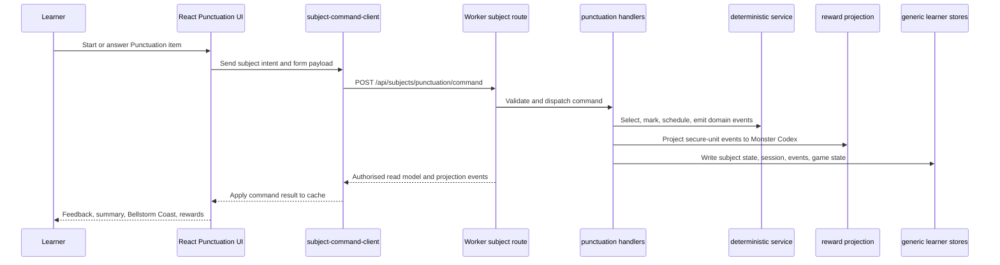
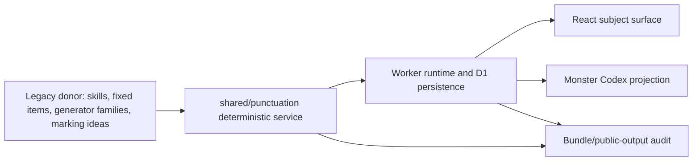

# feat: Punctuation Production Subject

## Overview

Add Punctuation as a real production subject on `ks2.eugnel.uk`. The legacy punctuation engine remains a donor artefact for pedagogy, content, scheduler rules, marking ideas, and analytics shape; the shipped subject runs through the current Worker command boundary, persists through the generic learner collections, renders through the React subject shell, and projects Monster Codex rewards server-side.

The plan chooses a production vertical slice first: publish a deliberately scoped but honest release covering Endmarks, Apostrophe, and Speech skills, while scaffolding the complete 14-skill map, six reward clusters, and grand aggregate. This proves the architecture that matters before broadening content volume.

---

## Problem Frame

James wants "blend in" to mean the old engine, code, ideas, and plan become a working subject in the current KS2 Mastery product, not a separate HTML app and not a concept deck. The risk is copying too much legacy browser-owned logic into React and accidentally weakening the full-lockdown boundary that Spelling now uses.

The production target is therefore narrow but real: React renders the Punctuation experience and local form state, while the Worker owns session creation, deterministic item selection, marking, scheduling, progress mutation, domain events, reward projection, and authorised read models (see origin: `docs/brainstorms/2026-04-24-punctuation-subject-engine-reward-blend-requirements.md`).

---

## Requirements Trace

- R1. Punctuation must be writing-skill practice, not multiple-choice-only quiz behaviour.
- R2. Preserve the 14 legacy atomic skills in the canonical skill map.
- R3. Preserve the five-stage Smart Review rhythm: retrieve, discriminate, place marks, proofread, transfer.
- R4. One correct answer must not equal mastery.
- R5. Secure status follows the legacy bucket unless tests prove a better variant: at least 80% accuracy, streak at least 3, spacing at least 7 days, and no active weak/lapse state.
- R6. Analytics preserve item mastery and skill-facet mastery.
- R7. Marking is deterministic, with accepted variants and explicit rubric facets for transfer work.
- R8. Misconception tags are preserved and exposed in analytics.
- R9. Generated practice is deterministic under fixed seed/time inputs; AI may later support safe vocabulary, not final authoring or marking.
- R10. Punctuation uses six cluster monsters plus one grand aggregate line.
- R11. The six clusters cover all 14 atomic skills.
- R12. Reward progress is based on stable published reward mastery units, not raw generated item count.
- R13. Cluster evolution uses percentage thresholds over published reward units.
- R14. The grand aggregate reaches full mastery only for the published release scope, and the product must not imply full KS2 coverage before all 14 skills ship.
- R15. Monster progress is additive; later due/weak learning state does not de-evolve earned creature stages.
- R16. Reward projection is server-side and separate from the Punctuation engine.
- R17. Monster routing uses the provided creature asset folders, starting with the candidate mapping from the origin.
- R18. Bellstorm Coast uses the provided region assets.
- R19. Legacy HTML is donor/reference only, never a production route.
- R20. Production runtime uses `POST /api/subjects/punctuation/command`.
- R21. Punctuation is added as a subject-owned Worker handler in the existing runtime pattern.
- R22. Commands cover start, submit, continue, skip/end, save preferences, reset, and read-only check actions where needed.
- R23. The engine is deterministic, serialisable, and free from DOM/browser-storage authority.
- R24. React is a thin UI/read-model client.
- R25. The placeholder becomes available only when the real Worker-backed subject flow exists and an explicit Punctuation availability gate confirms the command route, read model, bundle/source audit, and smoke evidence are ready.
- R26. State uses `child_subject_state`, `practice_sessions`, and `event_log`; no side database or hidden browser source of truth.
- R27. The first production slice prioritises end-to-end production architecture over a broad local-only port.
- R28. Bundle/public-output audits reject exposed client-owned Punctuation authority.
- R29. Release gate includes tests, check, bundle audit, Worker command tests, demo/logged-in smoke coverage, and the same availability gate evidence that prevents half-live production exposure.
- R30. After deployment, production UI is verified on `https://ks2.eugnel.uk`.
- R31. Punctuation command, marking, reward, and availability failures are observable through named error codes, structured domain/audit events, tests, and release documentation.
- R32. Punctuation read models are explicitly redacted by phase so live sessions never expose accepted answers, full rubric internals, unpublished content, generator seeds, or hidden answer banks to the browser.
- R33. Punctuation reward events use stable release-scoped mastery-unit keys so duplicate submits, command replay, concurrent secure events, generated-template expansion, and future content releases cannot corrupt Codex progress.
- R34. Punctuation command wiring uses a small generic subject-command action adapter instead of copying the full Spelling remote-action handler.
- R35. The first-slice Speech rubric is fixed before implementation with an acceptance matrix for quote variants, punctuation-inside-quote rules, reporting-clause punctuation, capitalisation, misconception tags, and negative transfer tests.
- R36. The first published slice has a content-readiness floor for Endmarks, Apostrophe, and Speech across retrieve/discriminate, insertion, proofreading repair, constrained transfer, misconception, and negative-test coverage before public exposure.
- R37. Punctuation has an explicit session state machine and transition tests for start, submit, feedback, continue, skip/end, reset, stale state, refresh, learner switch, duplicate actions, and command errors.
- R38. Punctuation Worker commands inherit and test the existing auth, same-origin, demo expiry, demo rate-limit, learner-access, read-only/degraded, and production broad-write protections.
- R39. Punctuation command execution stays bounded as content grows: pre-index content manifests, keep scheduling windows finite, avoid full analytics recomputation on every submit, keep read-model payloads lean, and add performance regression tests for first-slice and expanded-manifest fixtures.

**Origin actors:** A1 Learner, A2 Parent or adult evaluator, A3 React client, A4 Worker runtime, A5 Punctuation engine, A6 Monster Codex projection, A7 Deployment verifier.

**Origin flows:** F1 Scientific practice loop, F2 Monster reward projection, F3 Bellstorm Coast presentation, F4 Production release gate.

**Origin acceptance examples:** AE1 secure status requires repeated spaced evidence, AE2 speech punctuation misconception is tagged, AE3 stable reward units survive generator expansion, AE4 aggregate legendary represents full published release, AE5 rewards are additive, AE6 bundle audit blocks browser-owned engine logic, AE7 production commands use Worker runtime, AE8 partial first slice uses honest copy, AE9 post-deploy smoke proves live command path, AE10 named observability distinguishes content, marking, stale-write, reward, and availability failures, AE11 read models expose learner-safe prompts and feedback without leaking hidden answers or rubric authority, AE12 reward projection dedupes by release-scoped mastery unit and stays stable when generated content expands, AE13 Punctuation and Spelling share command dispatch infrastructure while keeping subject-specific UI actions separate, AE14 Speech transfer marking accepts valid UK quote variants and rejects punctuation outside the closing inverted comma, AE15 every published first-slice skill meets the content-readiness floor, AE16 illegal session transitions are contained and named, AE17 demo/auth/rate-limit protections block mutation before Punctuation code runs, AE18 expanded-manifest performance stays bounded under deterministic tests.

---

## Scope Boundaries

- Do not serve or route the legacy HTML in production.
- Do not ship a browser-local production Punctuation engine, scheduler, marker, generated-content authority, or reward mutator.
- Do not claim complete KS2 Punctuation mastery in the first slice.
- Do not introduce a new subject-specific database, side cache, or hidden browser store as source of truth.
- Do not redesign the whole subject shell, Parent Hub, Admin Hub, content-management model, or Monster Codex system.
- Do not let AI generate final questions, mark answers, or bypass deterministic Worker logic.
- Do not weaken English Spelling parity or its production command path.

### Deferred to Follow-Up Work

- Full R1 practice-mode breadth: sentence combining, paragraph repair, broader proofread passages, GPS-style practice, and unconstrained transfer should follow after the first Worker-backed release proves the production spine.
- Full 14-skill content expansion: add Comma / Flow, List / Structure, Boundary, paragraph repair, GPS-style practice, and deeper transfer modes after the first production architecture lands.
- AI-assisted vocabulary/context packs: design later as deterministic compiler input only, not as runtime marker or source of truth.
- Parent/Admin reporting expansion: expose richer Punctuation weak spots after the subject analytics snapshot is stable.
- Operator content-management UI for Punctuation: defer until the published manifest/content model has evidence from the first release.
- Final monster naming/copy polish: confirm learner-facing Codex names and blurbs with James before broad release copy hardens.

---

## Context & Research

### Relevant Code and Patterns

- `worker/README.md` defines the Worker as production authority for subject commands, demo sessions, read models, and protected routes.
- `worker/src/app.js` already routes `POST /api/subjects/:subjectId/command`, validates same-origin/session/demo access, and executes commands through `repository.runSubjectCommand`.
- `worker/src/subjects/runtime.js` registers subject handlers by subject id; Punctuation should add `punctuation: createPunctuationCommandHandlers(...)`.
- `worker/src/subjects/spelling/commands.js`, `worker/src/subjects/spelling/engine.js`, and `worker/src/subjects/spelling/read-models.js` provide the current production subject pattern: read runtime state, run a server engine, project rewards, persist runtime writes, and return a redacted read model.
- `src/platform/runtime/subject-command-client.js` is the browser command client. Punctuation should reuse it instead of adding another API style.
- `src/platform/core/repositories/api.js` already applies subject command results into the browser cache through `runtime.applySubjectCommandResult`.
- `src/platform/app/create-app-controller.js` centralises subject transitions, event publication, toasts, monster celebrations, and runtime containment.
- `src/surfaces/subject/SubjectRoute.jsx` renders React practice components through the shared subject route and runtime fallback.
- `src/platform/core/subject-registry.js` currently imports `punctuationModule` from `src/subjects/placeholders/index.js`; the placeholder should be replaced only when the real subject is ready.
- `docs/subject-expansion.md` defines the first non-Spelling subject acceptance path and explicitly says production deployment needs Worker command/read-model ownership.
- `tests/helpers/subject-expansion-harness.js` and `tests/subject-expansion.test.js` provide reusable subject conformance and golden-path smoke expectations.
- `src/platform/game/monsters.js`, `src/platform/game/monster-system.js`, `src/subjects/spelling/event-hooks.js`, and `worker/src/projections/rewards.js` define the current Monster Codex and Spelling reward projection pattern.
- `scripts/audit-client-bundle.mjs`, `scripts/production-bundle-audit.mjs`, and `tests/bundle-audit.test.js` are the production-client lockdown gates to extend for Punctuation source and authority tokens.
- `worker/src/app.js` currently locks down public source paths such as `/src/`, `/worker/`, `/tests/`, `/docs/`, and `/legacy/`. Punctuation's shared domain modules mean `/shared/` must also become a denied public source prefix.
- `tests/browser-react-migration-smoke.test.js` and `tests/helpers/browser-app-server.js` provide the optional gstack-backed browser smoke harness that can exercise `/demo` through Worker-backed APIs.
- Existing assets are present under `assets/monsters/` and `assets/regions/bellstorm-coast/`, including the candidate Punctuation monster folders and Bellstorm Coast scene files.

### Institutional Learnings

- The recent full-lockdown production gate uses sequential `npm test`, `npm run check`, production bundle audit, `/demo` cookie/session checks, and deterministic HTTP/browser fallbacks when browser tooling is flaky.
- Build-sensitive checks in this repo should not be run in parallel because public build temp directories can collide.
- For ks2-mastery production-sensitive work, deterministic evidence is preferred over a tool-specific success claim.

### External References

- No new external framework research is needed for this plan. The required command route, repository, D1, React shell, and bundle-audit patterns already exist in this repo and are more specific than generic Cloudflare or React guidance.

---

## Key Technical Decisions

- **Ship a production vertical slice first:** Implement Endmarks, Apostrophe, and Speech as the first published slice because they cover foundational sentence boundaries, possession/contractions, and the highest-risk deterministic marking example from the legacy audit. This satisfies R27 without pretending to cover the whole 14-skill subject.
- **Treat the first slice as a real release, not the whole R1 destination:** The first release should include recognition/discrimination, insertion, proofreading repair, and constrained transfer. Sentence combining, paragraph repair, and full transfer remain planned expansion work, and learner-facing copy must reflect that.
- **Declare the complete 14-skill map immediately:** The content manifest should list all atomic skills and cluster ownership from the start, even when only the first three clusters are published. This prevents reward and analytics IDs from being reshaped later.
- **Use stable published reward mastery units:** Reward denominators come from a manifest, not generated item count. This keeps 100% meaningful when generated families expand.
- **Make reward event keys release-scoped and idempotent:** Every Punctuation reward event should carry `releaseId`, `clusterId`, `rewardUnitId`, and a deterministic dedupe key. The same learner securing the same published unit twice must not create duplicate Codex progress, while a future release can add units without colliding with old ones.
- **Extract a shared deterministic domain service, then wrap it in Worker handlers:** `shared/punctuation/` should hold portable content, marking, scheduling, events, and service logic. Worker code adapts that service to durable repositories and projection boundaries. React receives read models and submits intents.
- **Keep Punctuation command-compatible with Spelling where practical:** Use command names such as `start-session`, `submit-answer`, `continue-session`, `skip-item`, `end-session`, `save-prefs`, and `reset-learner`. Only add Punctuation-specific commands if a real UX or marking need appears.
- **Extract the second-subject command adapter now:** Punctuation should not copy `handleRemoteSpellingAction` wholesale. Add a tiny generic subject-command action adapter for Worker command actions, read-only blocking, pending-command dedupe, stale-write hydration via `subject-command-client`, command-result application, and contained error surfacing. Keep Spelling-only affordances such as TTS replay and word-bank local UI separate.
- **Make the client module thin from day one:** `src/subjects/punctuation/module.js` should satisfy the subject contract and render the practice component, but production answer marking and queue mutation must flow through the command client wiring.
- **Define read-model redaction before React consumes it:** Punctuation read models should use a phase-specific allowlist. Live items may expose prompt text, item id, mode, visible skill labels, input constraints, and learner-safe hints. Feedback may expose correctness, the learner's submitted answer, safe explanation, misconception tags, and a single display correction for that attempted item. No phase should expose accepted-answer arrays, full rubric rules, unpublished items, generator seeds, hidden pools, or server-only scheduler state.
- **Gate production availability explicitly:** Punctuation should remain hidden or unavailable in production until a repo-native availability gate confirms the Worker command path, read model, audit rules, and smoke evidence are all present. A partial merge must not expose a half-live subject card.
- **Name observable failures before shipping:** Punctuation should use stable subject-specific error codes and structured events for missing content, invalid answer payloads, no active session, stale writes, reward projection dedupe, audit denial, and availability-gate denial. Generic command failure is not enough for production diagnosis.
- **Extend Monster Codex subject awareness without breaking Spelling:** Add Punctuation monster metadata and projection helpers in a way that keeps existing Spelling thresholds, `phaeton` behaviour, and tests intact.
- **Make partial-release copy honest:** The UI may say the published Punctuation release covers Endmarks, Apostrophe, and Speech. It must not say full KS2 Punctuation mastery until all 14 atomic skills are published.
- **Characterise legacy marking before changing it:** The riskiest donor logic is marking/rubric behaviour. The first implementation pass should create focused tests from the legacy donor for accepted variants, speech punctuation positions, misconception tags, and secure-threshold transitions before adapting behaviour.
- **Fix the first Speech rubric matrix before code:** Speech is part of the first public slice, so its marking acceptance cannot be left as copy polish. The deterministic rubric should accept matched single or double inverted commas, including straight and curly variants, require punctuation that belongs to the spoken words inside the closing inverted comma, require the reporting-clause comma pattern where the prompt calls for it, preserve target words, and emit named misconception tags for each failed facet.
- **Set a first-slice content readiness floor:** The first release can be narrow, but it cannot be thin. Endmarks, Apostrophe, and Speech each need enough deterministic item families to exercise retrieval/discrimination, insertion, proofreading repair, constrained transfer, misconception tagging, and negative tests before public exposure.
- **Make the session state machine explicit:** Punctuation should not infer phase transitions from UI behaviour. The service and Worker read model should agree on named phases and legal transitions, with illegal transitions returning controlled errors.
- **Reuse platform protection tests deliberately:** The generic command route already carries auth, same-origin, demo, learner-access, stale-write, and degraded-mode protections. Punctuation must prove those protections still fire before subject mutation.
- **Keep command work bounded:** Build manifest indexes once, select from bounded scheduler windows, project analytics incrementally where possible, and return lean read models. The first slice is small, but the architecture should not assume it stays small.
- **Treat bundle/public-output audit as part of the feature:** A subject is not production-ready if its engine authority is visible in the client bundle or as raw public source.

---

## Open Questions

### Resolved During Planning

- **Which origin document drives this plan?** `docs/brainstorms/2026-04-24-punctuation-subject-engine-reward-blend-requirements.md`.
- **Should the first release include all 14 skills?** No. The first implementation should prove the production architecture with Endmarks, Apostrophe, and Speech, while preserving the full 14-skill map and making partial scope explicit.
- **Should Punctuation use a new API route shape?** No. Use the existing generic `POST /api/subjects/:subjectId/command` route.
- **Should rewards be mutated by the Punctuation engine?** No. The engine emits domain events; Worker projection mutates Monster Codex state.
- **Should external research shape the plan?** No. Local Worker/runtime/bundle-audit patterns are already direct and current for this repo.
- **Should subject exposure rely on `available: true` alone?** No. The implementation should add a small explicit availability gate so the card is not user-visible until Worker, read-model, audit, and smoke evidence are complete.
- **Should observability wait until after launch?** No. Named Punctuation errors and structured command/reward/gate events are part of the first production slice because learners will experience these failures as broken practice, not as backend details.
- **Can React receive raw Punctuation item objects and just hide sensitive fields in UI?** No. The Worker read model must redact by construction so hidden answers, rubric internals, unpublished content, and generator seeds never reach the browser during a live session.
- **Can Punctuation reuse raw item ids as Monster Codex mastery keys?** No. Rewards should use release-scoped `rewardUnitId` values, not item ids or generated-template ids, so content expansion does not change mastery denominators or duplicate progress.
- **Should Punctuation get its own copied `handleRemotePunctuationAction` block?** No. The second real subject is the right time to introduce a small shared command adapter so future subjects do not duplicate read-only, dedupe, stale-write, and error handling.

### Deferred to Implementation

- **Exact function names and file splits inside `shared/punctuation/`:** The plan defines boundaries; implementation should pick names that fit the extracted domain code.
- **Exact first-slice item count:** The content-readiness floor is fixed in U1. The final count can follow donor characterization, but every published skill must satisfy the readiness matrix before public exposure.
- **Exact Speech learner-facing feedback wording:** The deterministic acceptance matrix is fixed in U2; implementation may refine learner-facing wording as long as tests preserve the same facets, accepted variants, and negative cases.
- **Exact Codex names, blurbs, and ordering:** Use the candidate mapping initially, then refine copy/art ordering before release.
- **Exact browser smoke selectors:** Add stable data attributes during UI implementation, then wire the smoke test to those selectors.

---

## Alternative Approaches Considered

| Approach | Decision | Rationale |
|---|---|---|
| Full one-pass legacy migration | Rejected for first release | Too much marking/content/UI surface in one review, and high risk of accidentally shipping client-owned authority. |
| Engine-first hidden integration | Not chosen as default | Strong for code quality, but delays proving the real product integration James asked for. Characterization tests still protect the engine inside the vertical slice. |
| Browser-local prototype first | Rejected | It would make the subject appear to work while violating the production boundary and bundle-audit intent. |
| Punctuation-specific backend API | Rejected | The generic subject command route already exists and carries auth, demo, idempotency, stale-write, and projection semantics. |

---

## Output Structure

This is the expected shape, not a rigid implementation specification. The per-unit file lists are authoritative for review.

```text
shared/punctuation/
  content.js
  marking.js
  scheduler.js
  service.js
  events.js
src/subjects/punctuation/
  module.js
  service-contract.js
  components/
    PunctuationPracticeSurface.jsx
    punctuation-view-model.js
worker/src/subjects/punctuation/
  commands.js
  engine.js
  read-models.js
tests/
  punctuation-content.test.js
  punctuation-marking.test.js
  punctuation-service.test.js
  worker-punctuation-runtime.test.js
  punctuation-rewards.test.js
  react-punctuation-scene.test.js
```

---

## High-Level Technical Design

> *This illustrates the intended approach and is directional guidance for review, not implementation specification. The implementing agent should treat it as context, not code to reproduce.*





---

## Phased Delivery

### Phase 1: Production Spine

Create the canonical Punctuation domain model, first-slice content, marking/scheduling service, Worker handlers, and command read model.

### Phase 2: Product Surface

Replace the placeholder with the React Punctuation subject, Bellstorm Coast scenes, subject dashboard stats, and Monster Codex presentation.

### Phase 3: Release Evidence

Extend bundle/public-output audits, subject expansion tests, Worker projection tests, and demo/browser smoke coverage before deployment.

### Rollout Checkpoints

These checkpoints are part of the plan, not informal release advice. A unit may land incrementally, but learner-visible exposure stays off until the public exposure gate passes.

| Checkpoint | Units | Exposure rule | Must prove |
|---|---|---|---|
| Hidden engine gate | U1-U3 | No dashboard card or learner route exposure. | Manifest, deterministic service, Worker command runtime, named errors, redacted read model, and generic learner persistence all pass tests. |
| Reward projection gate | U4 | Reward projection can run in tests and hidden command flows only. | Punctuation reward events are server-projected, idempotent, additive, and do not regress Spelling Codex behaviour. |
| Hidden UI gate | U5-U6 | React surface may exist behind disabled availability only. | UI consumes only redacted read models, keeps copy honest, renders assets, and cannot enter a half-live route when the gate is disabled. |
| Audit gate | U7 | Still not public. | Client bundle, public output, direct source denial, and raw source checks block Punctuation engine authority and donor leakage. |
| Public exposure gate | U8 | Subject card may become visible only after this gate passes. | Demo/logged-in smoke, HTTP/Worker evidence, release docs, availability-gate evidence, and post-deploy verification are complete. |

---

## Implementation Units

- [ ] U1. **Create the Punctuation Content and Reward Manifest**

**Goal:** Establish the portable Punctuation domain map: all 14 atomic skills, six reward clusters, the first published slice, deterministic item IDs, misconception tags, and stable reward mastery units.

**Requirements:** R1, R2, R3, R6, R8, R10, R11, R12, R13, R14, R17, R27, R33, R36; supports A5, F1, F2, AE3, AE8, AE12, AE15.

**Dependencies:** None.

**Files:**
- Create: `shared/punctuation/content.js`
- Create: `src/subjects/punctuation/service-contract.js`
- Create: `tests/punctuation-content.test.js`
- Modify: `docs/subject-expansion.md` only if it needs a Punctuation-specific note after implementation clarifies the first-slice contract.

**Approach:**
- Extract the legacy 14-skill taxonomy into stable ids and cluster ids.
- Mark Endmarks, Apostrophe, and Speech as the first published release scope; keep the remaining clusters present but unpublished.
- Define reward mastery units separately from fixed/generated items so generated volume never changes reward denominators.
- Define each reward mastery unit with a stable `releaseId`, `clusterId`, `rewardUnitId`, published status, and evidence mapping. Item ids and generator-family ids may provide evidence, but they must not become Codex mastery keys.
- Add a content-readiness matrix for each published first-slice skill:
  - Endmarks: retrieve/discriminate, insertion, proofreading repair, constrained transfer, misconception tags, and negative tests for full stop/question mark/exclamation mark placement.
  - Apostrophe: retrieve/discriminate, insertion, proofreading repair, constrained transfer, misconception tags, and negative tests for contraction versus possession.
  - Speech: retrieve/discriminate, insertion, proofreading repair, constrained transfer, misconception tags, and the Speech rubric matrix in U2.
- Mark a skill `published: true` only when its readiness matrix has deterministic evidence items or generator families for every required row.
- Include candidate monster mapping: Endmarks `pealark`, Apostrophe `claspin`, Speech `quoral`, Comma / Flow `curlune`, List / Structure `colisk`, Boundary `hyphang`, Grand `carillon`.
- Include misconception tag ids on items and reward units where applicable.

**Execution note:** Start with characterization-oriented tests from the legacy donor counts and skill ids before shaping the new manifest.

**Patterns to follow:**
- `src/subjects/spelling/service-contract.js` for serialisable state constants and normalisers.
- `src/subjects/spelling/content/model.js` for explicit content snapshots and release identity, without copying its Spelling-specific content-management complexity.

**Test scenarios:**
- Happy path: loading the manifest exposes all 14 atomic skill ids and maps each to exactly one of the six clusters.
- Happy path: the first published release reports Endmarks, Apostrophe, and Speech as published, while other clusters remain known but unpublished.
- Happy path: reward-unit counts are stable when generated item families are added to the same skill.
- Happy path: every published reward unit has a deterministic release-scoped key such as `punctuation:<releaseId>:<clusterId>:<rewardUnitId>`.
- Happy path: Covers AE15. Endmarks, Apostrophe, and Speech each meet the content-readiness matrix before the manifest reports them as published.
- Edge case: duplicate skill ids, reward-unit ids, or cluster ids are rejected by the manifest validation helper.
- Edge case: duplicate release-scoped reward keys are rejected even if they come from different item families or future release metadata.
- Edge case: every published reward unit has at least one deterministic evidence item or generator family.
- Edge case: a published first-slice skill missing constrained transfer, proofreading, misconception, or negative-test coverage fails manifest validation.
- Integration: Covers AE3 and AE8. Dashboard/reward metadata can distinguish "published release mastery" from full future KS2 coverage.

**Verification:**
- The manifest can be imported by tests and Worker code without DOM, storage, or browser globals.
- All candidate asset ids referenced by the manifest exist under `assets/monsters/`.

---

- [ ] U2. **Build Deterministic Marking, Scheduling, and Service Transitions**

**Goal:** Implement the portable Punctuation service that starts sessions, selects deterministic items, marks answers, updates mastery memory, emits domain events, and returns serialisable UI state.

**Requirements:** R1, R3, R4, R5, R6, R7, R8, R9, R23, R31, R35, R37, R39; supports F1, AE1, AE2, AE10, AE14, AE16, AE18.

**Dependencies:** U1.

**Files:**
- Create: `shared/punctuation/marking.js`
- Create: `shared/punctuation/scheduler.js`
- Create: `shared/punctuation/events.js`
- Create: `shared/punctuation/service.js`
- Create: `tests/punctuation-marking.test.js`
- Create: `tests/punctuation-service.test.js`
- Create: `tests/punctuation-scheduler.test.js`
- Create: `tests/punctuation-performance.test.js`

**Approach:**
- Keep service inputs and outputs serialisable and deterministic under injected `now` and `random`.
- Build or expose content indexes for skill id, cluster id, reward unit id, item id, generator family id, and misconception tag lookup rather than repeatedly scanning the whole manifest during submit.
- Support the first-slice modes needed to prove the Smart Review rhythm: recognition/discrimination, insertion, proofreading repair, and a constrained transfer prompt.
- Define the serialisable session state machine before implementing transitions:
  - `setup`: no active session, can start or save preferences.
  - `active-item`: one redacted item is active, can submit, skip, or end.
  - `feedback`: one submitted answer has feedback, can continue or end.
  - `summary`: completed session summary is visible, can start again or return.
  - `unavailable`: content or availability gate blocks practice.
  - `error`: recoverable command error is visible without corrupting the previous safe state.
- Implement exact-answer accepted variants and explicit Speech rubric facets for quote placement, punctuation inside quotes, sentence boundary, capitalisation, and unwanted punctuation.
- Implement the first-slice Speech rubric acceptance matrix before writing UI feedback copy:
  - Quote variant facet: accept matched straight or curly double quotes and matched straight or curly single inverted commas around the spoken words.
  - Quote mismatch facet: reject missing, unmatched, crossed, or mixed quote pairs unless the normaliser can prove they are the same quote family.
  - Speech punctuation facet: require full stop, question mark, or exclamation mark inside the closing inverted comma when the punctuation belongs to the spoken words.
  - Reporting clause facet: require a comma after the reporting clause when it introduces speech, and a comma inside the closing inverted comma when speech comes before the reporting clause and the prompt expects continuation.
  - Capitalisation facet: require sentence-start capitals and a capital at the start of the spoken sentence where the prompt expects a complete spoken sentence.
  - Preservation facet: require the target spoken words and reporting clause words to remain materially unchanged in insertion/proofreading tasks.
  - Unwanted punctuation facet: reject extra terminal punctuation outside the closing quote when it duplicates punctuation that belongs to the speech.
  - Misconception tags: emit stable tags such as `speech.quote_missing`, `speech.quote_unmatched`, `speech.punctuation_outside_quote`, `speech.reporting_comma_missing`, `speech.capitalisation_missing`, `speech.words_changed`, and `speech.unwanted_punctuation`.
- Apply secure status only after repeated clean evidence, spacing, streak, and accuracy criteria.
- Keep scheduler candidate windows bounded and deterministic. Expanded content should increase available variety without making every submit scan every future item family.
- Emit domain events such as session completed, item attempted, item secured, unit secured, and misconception observed.
- Return controlled domain error shapes for invalid answer payloads, unsupported item types, no active session, unavailable content, and malformed transfer rubrics so the Worker adapter can translate them to named HTTP errors without losing diagnostic detail.

**Execution note:** Use test-first implementation for marking and secure-threshold logic; these are the highest-risk legacy behaviours.

**Patterns to follow:**
- `shared/spelling/service.js` for service transition shape and serialisable state.
- `src/subjects/spelling/events.js` and `src/subjects/spelling/event-hooks.js` for event naming and reward subscriber separation.
- `worker/src/subjects/spelling/engine.js` for adapting browser-style persistence into server-owned runtime state, but avoid browser storage as authority.

**Test scenarios:**
- Happy path: a learner starts an Endmarks session with fixed time/random and receives the same first item on repeated runs.
- Happy path: a correct Apostrophe answer increments attempts/successes but does not become secure until the secure threshold is satisfied.
- Happy path: after at least three clean spaced attempts at 80%+ accuracy and seven-day spacing, the relevant reward unit emits a secure-unit event.
- Happy path: the legal state path `setup -> active-item -> feedback -> active-item -> summary` is deterministic and serialisable.
- Happy path: Covers AE2. A speech answer with punctuation outside the closing quote is marked incorrect and returns the expected misconception tag.
- Happy path: Covers AE14. Equivalent straight/curly and single/double inverted comma variants pass when all other Speech facets are correct.
- Edge case: a speech question with the question mark outside the closing inverted comma fails with `speech.punctuation_outside_quote`.
- Edge case: missing or mismatched inverted commas fail with `speech.quote_missing` or `speech.quote_unmatched`.
- Edge case: a missing reporting comma fails with `speech.reporting_comma_missing`.
- Edge case: changed target words in an insertion/proofreading item fail with `speech.words_changed` even if the punctuation pattern looks plausible.
- Edge case: empty, whitespace-only, overlong, or unsupported answer payloads are normalised and marked without throwing.
- Edge case: a generated item uses stable seed inputs; changing time/random only changes output through the injected seams.
- Performance: Covers AE18. With an expanded-manifest fixture, start/submit operations use bounded candidate windows and avoid full-manifest scans on every command.
- Error path: submitting an answer without an active session returns a controlled stale/no-active-session error shape for the Worker adapter to translate.
- Error path: Covers AE16. Illegal transitions such as submit from `setup`, continue from `active-item`, double submit from `feedback`, and skip from `summary` return named errors and do not mutate learner state.
- Error path: invalid, empty, overlong, or unsupported answer payloads return named Punctuation error codes rather than an uncaught exception.
- Integration: service events contain enough learner, skill, mode, unit, item, and misconception metadata for reward projection and analytics.

**Verification:**
- Service tests can run entirely in Node without Worker, DOM, React, browser storage, or network.
- The secure rule demonstrates AE1: one correct answer cannot unlock full monster progress.

---

- [ ] U3. **Add Worker Punctuation Command Runtime**

**Goal:** Register Punctuation in the Worker subject runtime and persist command results through the generic learner stores.

**Requirements:** R20, R21, R22, R23, R26, R27, R31, R32, R38, R39; supports A4, F1, F4, AE7, AE10, AE11, AE17, AE18.

**Dependencies:** U1, U2.

**Files:**
- Create: `worker/src/subjects/punctuation/engine.js`
- Create: `worker/src/subjects/punctuation/commands.js`
- Create: `worker/src/subjects/punctuation/read-models.js`
- Modify: `worker/src/subjects/runtime.js`
- Create: `tests/worker-punctuation-runtime.test.js`
- Modify: `tests/worker-subject-runtime.test.js`

**Approach:**
- Mirror the Spelling handler shape: validate command names, read `readSubjectRuntime`, execute a server Punctuation engine, project rewards, combine domain/reaction events, and return a redacted `subjectReadModel`.
- Persist UI state/data to `child_subject_state`, active/completed/abandoned rounds to `practice_sessions`, domain/reaction events to `event_log`, and reward state to `child_game_state`.
- Return only authorised item/read-model information to the client, including stats and analytics summaries; do not return full hidden answer banks or unpublished content.
- Build `read-models.js` around explicit phase allowlists: setup, live item, feedback, summary, analytics, unavailable, and error. Treat any new item field as server-only until tests opt it into the client shape.
- During live items, exclude accepted-answer arrays, canonical solution fields, full rubric rules, generator seeds, unpublished item metadata, hidden queues, scheduler internals, and server-only reward unit state.
- During feedback, return only the attempted item's learner-safe display correction and facet feedback, not the full accepted-answer set or reusable marking rubric.
- Keep read-only checking commands separate from scheduler-mutating commands if any drill affordance needs immediate validation without progression.
- Translate service failures into named Worker errors such as `punctuation_content_unavailable`, `punctuation_session_stale`, `punctuation_answer_invalid`, `punctuation_item_unsupported`, and `punctuation_availability_denied`; preserve the existing generic stale-write and auth errors where those are already the platform contract.
- Emit structured domain/audit events for command accepted, item attempted, unit secured, misconception observed, reward projected or deduped, and availability-gate denied, with enough metadata to debug without exposing answer banks.
- Prove the existing route protections for Punctuation: unauthenticated requests, cross-origin requests, expired demo sessions, demo command rate limits, learner-mismatch access, production broad writes, read-only/degraded mode, and stale learner revisions all fail before subject mutation.
- Keep Worker command read models lean: current item, feedback, summary, stats, analytics summary, and projections only. Do not serialise whole content manifests, hidden queues, or full analytics tables in command responses.

**Patterns to follow:**
- `worker/src/subjects/spelling/commands.js`
- `worker/src/subjects/spelling/engine.js`
- `worker/src/subjects/spelling/read-models.js`
- `worker/src/subjects/command-contract.js`
- `tests/worker-subject-runtime.test.js`

**Test scenarios:**
- Happy path: Covers AE7. `POST /api/subjects/punctuation/command` with `start-session` returns a Punctuation read model and writes an active practice session.
- Happy path: `submit-answer` marks a correct first-slice answer and persists subject UI/data through the repository runtime write.
- Happy path: `end-session` or final `submit-answer` writes a completed practice session summary.
- Happy path: the returned read model includes dashboard-ready stats and analytics-ready weak/due/secure unit summaries without exposing hidden answer data.
- Happy path: Covers AE11. Live, feedback, summary, analytics, unavailable, and error read-model snapshots contain only their allowed fields.
- Edge case: adding `accepted`, `solution`, `rubric`, `seed`, `generator`, `unpublished`, `hiddenQueue`, or server-only scheduler fields to raw engine state fails read-model redaction tests unless a safe display field is deliberately mapped.
- Edge case: unknown Punctuation command returns `subject_command_not_found` without mutating learner state.
- Edge case: stale `expectedLearnerRevision` returns the existing stale-write behaviour and does not double-write domain events.
- Error path: unauthenticated, cross-origin, expired demo, or learner-mismatch requests are rejected by the existing Worker route before the Punctuation handler mutates state.
- Error path: Covers AE17. Demo command rate-limit and expired-demo checks return the existing platform errors and no Punctuation state, session, event, or game-state writes occur.
- Error path: production broad-write and read-only/degraded runtime conditions block start/submit/reset without falling back to browser-owned scoring.
- Error path: content unavailable, invalid answer payload, unsupported item type, no active session, and availability-gate denial each return the expected named code and do not write subject/game/event state.
- Integration: Covers AE10. Logs/events can distinguish marking failure, stale write, reward dedupe, and gate denial during production smoke or post-deploy inspection.
- Integration: command replay with the same request id returns the stored result and does not append duplicate reward/domain events.
- Performance: expanded-manifest command fixtures stay within the agreed response-size and operation-count budget without importing browser-local engine code.

**Verification:**
- Punctuation commands use the existing Worker command route; no new broad write route is introduced.
- Worker tests prove the subject id dispatch is generic rather than Spelling-special.
- Redaction tests prove browser-visible read models cannot mark answers without the Worker.

---

- [ ] U4. **Project Punctuation Rewards into Monster Codex**

**Goal:** Convert first-time secure Punctuation reward units into additive Monster Codex progress, including cluster creatures and the grand aggregate.

**Requirements:** R10, R11, R12, R13, R14, R15, R16, R17, R33; supports A6, F2, AE3, AE4, AE5, AE12.

**Dependencies:** U1, U2, U3.

**Files:**
- Modify: `src/platform/game/monsters.js`
- Modify: `src/platform/game/monster-system.js`
- Create: `src/subjects/punctuation/event-hooks.js`
- Modify: `worker/src/projections/rewards.js`
- Create: `tests/punctuation-rewards.test.js`
- Modify: `tests/monster-system.test.js`
- Modify: `tests/worker-projections.test.js`

**Approach:**
- Add Punctuation monster metadata and `MONSTERS_BY_SUBJECT.punctuation` while preserving existing Spelling ids, thresholds, and behaviour.
- Add subject-aware reward progress helpers that can calculate cluster stage from `secureUnits / publishedUnits`, not raw mastered count.
- Record mastered reward unit ids in Codex state using release-scoped keys and keep them additive even if later analytics says the unit is due or weak again.
- Let the Punctuation event hook translate `punctuation.unit-secured` events into reward events; the Punctuation service must not mutate game state directly.
- Make the grand aggregate use the currently published release denominator and copy guardrails from R14/AE8.
- Define the Punctuation reward event schema before projection code: `id`, `type`, `learnerId`, `subjectId`, `releaseId`, `clusterId`, `rewardUnitId`, `masteryKey`, `monsterId`, `previous`, `next`, and `createdAt`. The dedupe token should be deterministic from learner id, release id, cluster id, reward unit id, monster id, and transition kind, not from wall-clock time.
- Treat duplicate submit, command replay, duplicate `punctuation.unit-secured` events, and near-concurrent secure events as no-op reward projection once the same mastery key is recorded.

**Patterns to follow:**
- `src/subjects/spelling/event-hooks.js`
- `src/platform/game/monster-system.js`
- `worker/src/projections/rewards.js`
- `tests/worker-projections.test.js`

**Test scenarios:**
- Happy path: a first secure Endmarks unit emits a caught reward for `pealark` and records the unit id once.
- Happy path: securing all published Apostrophe units moves `claspin` to stage 4 no matter how many generated apostrophe templates exist.
- Happy path: Covers AE4. When all currently published cluster units are secure, the grand `carillon` aggregate reaches the correct published-release stage.
- Edge case: duplicate secure-unit events for the same learner/unit do not emit duplicate reward events.
- Edge case: duplicate submit and command replay for the same secure event keep one event-log reward and one Codex mastery key.
- Edge case: two near-concurrent secure events for the same release-scoped reward unit converge to one Codex mastery record.
- Edge case: adding a future generated item family under an existing skill does not change the recorded mastery key or denominator for the published release.
- Edge case: adding a future release creates new reward unit keys only when the manifest deliberately publishes new reward units; old keys remain readable and do not collide.
- Edge case: unpublishing or non-publishing future clusters does not make the first release claim full 14-skill mastery.
- Integration: Covers AE5. A previously secured unit becoming due again does not remove the mastered reward unit from Codex state.
- Integration: Covers AE12. Reward projection dedupes by release-scoped mastery unit, not raw item id, generated-template id, or session id.
- Regression: existing Spelling tests for `inklet`, `glimmerbug`, `phaeton`, and `vellhorn` still pass unchanged.

**Verification:**
- Reward projection is server-side and idempotent under command replay.
- Spelling reward behaviour remains unchanged.

---

- [ ] U5. **Replace the Placeholder with a Worker-Backed React Subject Surface**

**Goal:** Make Punctuation available in the subject registry with a real React practice surface that sends commands and renders returned read models.

**Requirements:** R1, R18, R20, R24, R25, R27, R32, R34; supports A1, A3, F1, F3, AE7, AE8, AE11, AE13.

**Dependencies:** U1, U2, U3.

**Files:**
- Create: `src/subjects/punctuation/module.js`
- Create: `src/subjects/punctuation/components/PunctuationPracticeSurface.jsx`
- Create: `src/subjects/punctuation/components/punctuation-view-model.js`
- Create: `src/platform/runtime/subject-command-actions.js`
- Modify: `src/subjects/placeholders/index.js`
- Modify: `src/platform/core/subject-registry.js`
- Modify: `src/surfaces/subject/SubjectRoute.jsx`
- Modify: `src/main.js`
- Create: `tests/subject-command-actions.test.js`
- Create: `tests/react-punctuation-scene.test.js`
- Modify: `tests/subject-expansion.test.js`

**Approach:**
- Replace the placeholder import with the real module only after the module exposes a React practice component, dashboard stats, safe initial state, and the explicit Punctuation availability gate can allow production exposure.
- Keep the default production state unavailable or hidden until the gate passes; a partial Worker/UI merge must not show learners a half-live subject card.
- Treat U5 as a hidden UI gate, not a public release. The React module may be implemented and tested while the dashboard card remains hidden or unavailable.
- Add a small generic subject-command action adapter in `src/platform/runtime/subject-command-actions.js` and wire Punctuation through it.
- Use a per-subject action map for command names and payload builders; keep subject-specific local UI actions in the subject module or existing main-handler seams.
- Share read-only blocking, pending-command dedupe, command error messaging, stale-write retry through `subject-command-client`, and `repositories.runtime.applySubjectCommandResult`.
- Keep Spelling-specific TTS replay, word-bank modal actions, and analytics filter state outside the generic adapter, but move the shared Worker command path behind the adapter where that can be done without a risky broad refactor.
- Keep local state to form input, focus, filter controls, and optimistic pending affordances only.
- Render setup, active item, feedback, summary, and partial-release messaging from the Worker read model.
- Do not compensate for leaked fields in React. If the UI needs a display answer, hint, or facet explanation, add that safe field to the Worker read model and test it there.
- Ensure the subject copy says "published Punctuation release" or equivalent partial-scope wording until all 14 skills are live.

**Patterns to follow:**
- `src/subjects/spelling/module.js` for subject contract shape.
- `src/subjects/spelling/components/SpellingPracticeSurface.jsx` for React surface structure.
- `src/main.js` `handleRemoteSpellingAction` for command-client wiring, while looking for a cleaner subject-command helper if duplication grows.
- `tests/helpers/subject-expansion-harness.js` for conformance and golden-path expectations.

**Test scenarios:**
- Happy path: the dashboard card for Punctuation is available and opens the React subject route.
- Happy path: starting a Punctuation session sends a Worker command and renders an active item from the returned read model.
- Happy path: submitting an answer renders deterministic feedback and then a summary when the session ends.
- Happy path: Covers AE13. Punctuation `start-session`, `submit-answer`, `continue-session`, `skip-item`, `end-session`, and `save-prefs` use the shared subject-command action adapter.
- Happy path: learner switch and import/export restore preserve the live Punctuation round through the existing subject-expansion harness expectations.
- Edge case: duplicate start/submit/continue clicks are deduped according to the adapter's pending-command rules and do not create extra command requests.
- Edge case: read-only/degraded production mode disables start/submit actions and shows a clear subject message.
- Edge case: if the Punctuation availability gate is disabled or incomplete, the dashboard does not expose the production subject card and no learner can enter a half-live route.
- Error path: a rejected command surfaces a contained subject error without leaving the route or crashing other subjects.
- Error path: stale-write retry still hydrates once through `subject-command-client` and applies the returned read model through the existing runtime repository path.
- Integration: React tests use only redacted read-model fixtures and fail if the component depends on server-only answer, rubric, seed, or hidden queue fields.
- Integration: Covers AE8. First-slice UI does not claim complete KS2 Punctuation mastery.
- Regression: Spelling practice route, shared command actions, replay controls, word-bank modal actions, and subject runtime fallback still work.

**Verification:**
- Punctuation satisfies the subject module contract and shared React subject route.
- The React bundle does not import `shared/punctuation/service.js`, `shared/punctuation/marking.js`, or Worker Punctuation handlers.

---

- [ ] U6. **Wire Bellstorm Coast and Punctuation Asset Presentation**

**Goal:** Use the provided Bellstorm Coast and monster assets in the Punctuation practice, summary, and Codex-facing models without creating a separate asset pipeline.

**Requirements:** R10, R11, R14, R17, R18, R24, R25; supports F2, F3.

**Dependencies:** U1, U4, U5.

**Files:**
- Modify: `src/subjects/punctuation/components/punctuation-view-model.js`
- Modify: `src/subjects/punctuation/components/PunctuationPracticeSurface.jsx`
- Modify: `src/platform/game/monsters.js`
- Modify: `src/surfaces/home/CodexSurface.jsx` if Codex needs subject-aware grouping beyond existing model data.
- Create: `tests/react-punctuation-assets.test.js`

**Approach:**
- Add view-model helpers for Bellstorm Coast scene selection using `assets/regions/bellstorm-coast/` cover and A-E scene groups.
- Route monster images through existing `monsterAsset` and `monsterAssetSrcSet` helpers.
- Use daily/setup scenes from A-C and higher-stakes summary/aggregate scenes from D-E, matching the origin.
- Keep visual state derived from authorised read models and Codex projection state, not hidden client progress.

**Patterns to follow:**
- `src/subjects/spelling/components/spelling-view-model.js` for view-model based asset selection.
- `src/platform/game/monsters.js` for monster asset URLs and srcset generation.
- `src/surfaces/home/CodexSurface.jsx` for existing Codex presentation.

**Test scenarios:**
- Happy path: setup view returns Bellstorm Coast cover or A-C scene URLs that exist in the asset tree.
- Happy path: summary/reward view can choose D-E scene URLs for boss/final moments.
- Happy path: each Punctuation cluster monster resolves stage 0-4 image URLs through `monsterAsset`.
- Edge case: unknown branch, missing stage, or unpublished cluster falls back to safe known assets and does not break render.
- Integration: Codex surfaces can include Punctuation monsters without hiding existing Spelling monsters.

**Verification:**
- Punctuation assets render via the existing public asset path and do not require generated SVG placeholders.
- Text and controls remain readable over Bellstorm Coast backgrounds in desktop and mobile screenshots during later `ce-work` verification.

---

- [ ] U7. **Extend Bundle and Public-Output Lockdown for Punctuation**

**Goal:** Block releases that expose Punctuation engine authority, raw donor source, unpublished content, or local runtime switches in the client bundle or public output.

**Requirements:** R19, R23, R24, R28, R29; supports A7, F4, AE6.

**Dependencies:** U2, U3, U5.

**Files:**
- Modify: `scripts/audit-client-bundle.mjs`
- Modify: `scripts/production-bundle-audit.mjs`
- Modify: `tests/bundle-audit.test.js`
- Modify: `worker/src/app.js`
- Modify: `scripts/build-public.mjs` if the explicit public-output allowlist needs to exclude shared runtime source.
- Modify: `scripts/assert-build-public.mjs` if public-output denial needs additional path checks.

**Approach:**
- Add forbidden module patterns for `shared/punctuation/content.js`, `shared/punctuation/marking.js`, `shared/punctuation/service.js`, `shared/punctuation/scheduler.js`, `worker/src/subjects/punctuation/`, and any raw donor/content-heavy source that should never be public.
- Add forbidden text tokens for legacy donor markers, local runtime switches, and Punctuation engine factory names once implementation names settle.
- Extend Worker public-source lockdown and direct-denial production paths so `/shared/punctuation/...`, `/worker/src/subjects/punctuation/...`, and raw source under `/src/subjects/punctuation/` cannot be fetched as public source.
- Keep allowlists narrow for React-only view-model/component code when it is intentionally bundled.

**Patterns to follow:**
- Existing Spelling entries in `scripts/audit-client-bundle.mjs`.
- Existing `DIRECT_DENIAL_PATHS` and forbidden token checks in `scripts/production-bundle-audit.mjs`.
- `tests/bundle-audit.test.js` negative fixture style.

**Test scenarios:**
- Happy path: a valid React-only Punctuation bundle passes the client audit.
- Error path: a bundle metafile importing `shared/punctuation/service.js` fails with a Punctuation-specific forbidden module reason.
- Error path: a direct public request for `/shared/punctuation/content.js` returns a denied/not-found source response, not raw source and not SPA fallback HTML.
- Error path: public output containing raw `worker/src/subjects/punctuation/commands.js` fails the audit.
- Error path: production audit treats direct requests for Punctuation source paths as failures if they return SPA HTML or raw source.
- Integration: Covers AE6. A build that includes the legacy donor engine token in the browser bundle is blocked.

**Verification:**
- Punctuation cannot be claimed production-ready unless the same lockdown gates that protect Spelling also protect Punctuation.

---

- [ ] U8. **Add Production Smoke, Documentation, and Rollout Evidence**

**Goal:** Make the release verifiable locally, in preview/demo, and after deployment on `ks2.eugnel.uk`.

**Requirements:** R25, R27, R29, R30, R31; supports A7, F4, AE9, AE10.

**Dependencies:** U3, U5, U7.

**Files:**
- Modify: `tests/browser-react-migration-smoke.test.js`
- Modify: `tests/helpers/browser-app-server.js` only if the Worker-backed test server needs Punctuation-specific seed support.
- Modify: `worker/README.md`
- Modify: `docs/subject-expansion.md`
- Create: `docs/punctuation-production.md`

**Approach:**
- Add a browser smoke path that opens `/demo`, selects Punctuation, starts a session, submits a controlled answer, and observes Worker-returned feedback or summary.
- Treat U8 as the public exposure gate. The subject card can become visible only after hidden engine, reward projection, hidden UI, audit, and smoke evidence have all passed.
- Keep the smoke optional behind the existing browser-smoke environment gate, but make deterministic HTTP/Worker tests cover the core command path by default.
- Document the first published release scope, partial-mastery copy rule, Worker authority boundary, reward mapping, and expansion plan.
- Document the Punctuation observability contract: named error codes, expected domain/reward/gate events, and the post-deploy checks an operator should use when start, submit, reward, or gate behaviour fails.
- Use the existing package scripts for release verification: `npm test`, `npm run check`, and the production bundle audit script. Do not add raw Wrangler deployment instructions.
- Capture the availability-gate evidence in the release notes or verification artefact: Worker route present, read model present, bundle/source audit extended, and demo/logged-in smoke passing before the subject is marked live.
- After deployment, verify `https://ks2.eugnel.uk` with a real logged-in or demo browser session before marking the subject live.

**Patterns to follow:**
- `tests/browser-react-migration-smoke.test.js`
- `tests/helpers/browser-app-server.js`
- `worker/README.md` subject command runtime section.
- `docs/subject-expansion.md` add-a-subject checklist.

**Test scenarios:**
- Happy path: Covers AE9. Demo smoke opens Punctuation and proves the Worker command path processes at least one learner action.
- Happy path: dashboard-to-subject-to-session-to-summary path passes through shared React route and does not expose placeholder copy.
- Error path: the subject remains hidden/unavailable when the availability gate reports missing Worker, read-model, audit, or smoke evidence.
- Error path: smoke or HTTP verification surfaces named Punctuation failures clearly enough to tell content unavailable, stale write, invalid answer, reward projection, and gate denial apart.
- Edge case: smoke remains skipped unless the browser-smoke environment flag is set.
- Integration: production bundle audit plus source-denial checks pass before post-deploy verification is considered complete.

**Verification:**
- A future implementer can produce release evidence without inventing a new checklist.
- Documentation states what is in the first published release and what remains follow-up work.

---

## System-Wide Impact

- **Interaction graph:** Punctuation touches subject registry, React subject route, command client, Worker subject runtime, generic repository runtime writes, event projection, Monster Codex, bundle audits, and demo/browser smoke tests.
- **Error propagation:** Worker command errors should surface through the same contained subject UI path as Spelling command failures. Runtime render/action failures should remain isolated by `SubjectRuntimeFallback`.
- **Observability:** Punctuation needs stable subject-specific error codes and structured events so support/debugging can tell content, marking, stale-write, reward, audit, and availability-gate failures apart.
- **Read-model boundary:** Punctuation answer authority must stop at the Worker. React receives a learner-safe projection, not raw engine items, accepted variants, generator seeds, hidden queues, or full rubric rules.
- **Rollout sequencing:** U5 is a hidden UI checkpoint, not public launch. U8 is the first point where the Punctuation card may become visible to learners.
- **Reward identity:** Punctuation Codex progress must key additive mastery by release-scoped reward units, not item ids, generated-template ids, session ids, or learner-visible copy.
- **Speech rubric:** First-slice Speech marking has a fixed acceptance matrix for quote variants, punctuation placement, reporting-clause punctuation, capitalisation, word preservation, and misconception tags.
- **Content readiness:** Narrow release means fewer skills, not shallow evidence. Published first-slice skills need the readiness matrix before public exposure.
- **Session state:** Legal and illegal transitions are part of the engine contract, not React convention.
- **State lifecycle risks:** Command replay, stale learner revisions, active session abandonment, secure-unit idempotency, and reward-event dedupe must be tested because the feature writes subject state, sessions, events, and game state together.
- **Route protection:** Punctuation inherits generic Worker auth, same-origin, demo, learner-access, stale-write, and degraded-mode protections. Tests must prove those run before subject mutation.
- **API surface parity:** The generic command route remains the only production mutation path for Punctuation. Broad legacy write routes must not become a fallback.
- **Client command wiring:** Shared Worker-command concerns belong in one small adapter. Subject-specific affordances such as Spelling TTS and Punctuation input controls stay outside it.
- **Performance budget:** Content lookup, scheduling, analytics projection, reward projection, and read-model building must stay bounded under expanded-manifest fixtures.
- **Integration coverage:** Unit tests alone cannot prove the production boundary; Worker route tests, projection tests, bundle audits, and demo/browser smoke coverage all matter.
- **Unchanged invariants:** Spelling remains available and Worker-backed; existing Spelling monsters and `phaeton` aggregate behaviour must not change; package scripts remain the deployment/check path.
- **Stakeholders:** Learners get a new subject; parents/admins need honest analytics semantics; maintainers need a repeatable first-non-Spelling pattern; operations need clear release gates.

---

## Engineering Review Lock-In

### Step 0 Scope Challenge

- **Existing leverage:** The Worker subject command route, repository runtime writes, Spelling command handlers, redacted Spelling read model, generic subject registry, React `SubjectRoute`, subject-expansion harness, Monster Codex projection, bundle audits, demo protections, and package-script release gates already solve most platform work. Punctuation should plug into those seams, not rebuild them.
- **Minimum complete change:** U1-U3 are the minimum learner-engine spine. U5 is required only as hidden UI until the public gate. U4, U7, and U8 are not optional because rewards, lockdown, and production evidence are part of the product claim.
- **Complexity judgement:** The plan touches more than eight files because this is the first real non-Spelling subject, crossing shared engine, Worker, React, rewards, audit, tests, and docs. The scope is large but not overbuilt because each touched layer is an existing production boundary.
- **Search check:** No new external framework, database, queue, package, or concurrency primitive is introduced. The plan uses Layer 1 repo-native patterns: Node `node:test`, existing Worker command route, D1 repository batch/CAS, React subject shell, and current bundle-audit scripts.
- **Distribution check:** No new artifact type is introduced. Distribution remains the existing Cloudflare Worker plus static React bundle, using `npm run check` and `npm run deploy`.
- **Completeness check:** The plan now chooses the complete lake: explicit gates, redaction, observability, tests, performance budget, and release evidence. No shortcut remains that saves meaningful time with CC+gstack.

### What Already Exists

| Sub-problem | Existing code or flow | Reuse decision |
|---|---|---|
| Auth, same-origin, demo expiry, demo rate limits | `worker/src/app.js`, `worker/src/demo/sessions.js`, `tests/worker-subject-runtime.test.js` | Reuse. Add Punctuation-specific route tests. |
| Subject command client and stale-write retry | `src/platform/runtime/subject-command-client.js`, `src/platform/core/repositories/api.js` | Reuse. Add generic action adapter instead of subject-specific copy. |
| Worker subject runtime dispatch | `worker/src/subjects/runtime.js` | Reuse. Register `punctuation` handlers. |
| Spelling server-owned subject pattern | `worker/src/subjects/spelling/commands.js`, `engine.js`, `read-models.js` | Reuse pattern, not content. Punctuation owns its service and read model. |
| Durable subject state and sessions | `child_subject_state`, `practice_sessions`, `event_log`, `child_game_state` repository paths | Reuse. No subject-specific database. |
| Subject expansion harness | `tests/helpers/subject-expansion-harness.js`, `tests/subject-expansion.test.js` | Reuse and extend for Punctuation. |
| Reward projection and Codex | `src/platform/game/monster-system.js`, `worker/src/projections/rewards.js` | Extend subject-aware helpers while preserving Spelling. |
| Bundle/public-output lockdown | `scripts/audit-client-bundle.mjs`, `scripts/production-bundle-audit.mjs`, `tests/bundle-audit.test.js` | Extend with Punctuation source and authority rules. |
| Production release gate | `npm test`, `npm run check`, `npm run deploy`, `npm run audit:production` | Reuse. Do not add raw Wrangler commands. |

### NOT In Scope

- **Full 14-skill production content:** Deferred until the Endmarks, Apostrophe, and Speech production spine is verified.
- **Paragraph repair, GPS timing, unconstrained transfer, and sentence combining:** Deferred because the first release proves architecture and core marking, not the full R1 destination.
- **AI-authored final items or AI marking:** Out of scope. AI may later provide safe vocabulary/compiler inputs only.
- **New subject-specific database or content-management UI:** Out of scope. Use generic subject stores and a published manifest first.
- **Parent/Admin reporting expansion:** Deferred until Punctuation analytics snapshots are stable.
- **New build tool, framework, queue, or deployment pipeline:** Out of scope. Keep esbuild, React SPA, Worker API, and package scripts.
- **Public launch before U8:** Out of scope. U5 can be hidden UI only.

### ASCII Data Flow

```text
---------+      intent       +-------------------------+
| Learner | ---------------> | React Punctuation UI    |
+---------+                  | local form state only   |
                             +-----------+-------------+
                                         |
                                         | subject command
                                         v
                             +-----------+-------------+
                             | subject-command client  |
                             | revision + retry once   |
                             +-----------+-------------+
                                         |
                                         | POST /api/subjects/punctuation/command
                                         v
                             +-----------+-------------+
                             | Worker route            |
                             | auth, origin, demo, CAS |
                             +-----------+-------------+
                                         |
                                         v
      +----------------------+-----------+----------------------+
      |                      |                                  |
      v                      v                                  v
+-----+------+       +-------+--------+                +--------+------+
| Punctuation |      | Repository     |                | Reward        |
| service     |      | D1 batch/CAS   |                | projection    |
| mark/sched  |      | state/sessions |                | Codex state   |
+-----+------+       +-------+--------+                +--------+------+
      |                      |                                  |
      +----------------------+---------------+------------------+
                                             |
                                             v
                             +---------------+----------------+
                             | Redacted subject read model    |
                             | no hidden answers/rubrics      |
                             +---------------+----------------+
                                             |
                                             v
                                      React renders
```

### ASCII Session State Machine

```text
setup
  | start-session
  v
active-item <--------------------------+
  | submit-answer                      |
  | skip-item                          | continue-session
  | end-session                        |
  v                                   |
feedback ------------------------------+
  |
  | final item or end-session
  v
summary

unavailable  <- content missing, gate denied, degraded read-only
error        <- recoverable command failure, previous safe state preserved

Illegal examples:
  setup + submit-answer      -> punctuation_session_stale
  active-item + continue     -> punctuation_transition_invalid
  feedback + duplicate submit -> punctuation_transition_invalid or deduped no-op
  summary + skip-item        -> punctuation_transition_invalid
```

### ASCII Reward Pipeline

```text
punctuation.unit-secured
  |
  | releaseId + clusterId + rewardUnitId
  v
masteryKey = punctuation:<releaseId>:<clusterId>:<rewardUnitId>
  |
  | already in Codex state?
  +---- yes ---> no-op, no reward event
  |
  +---- no ----> append masteryKey
                 derive cluster stage
                 derive grand aggregate stage
                 emit deterministic reward.monster event
```

### Inline Diagram Targets

- `shared/punctuation/service.js`: state machine and transition table.
- `shared/punctuation/scheduler.js`: bounded candidate-window selection pipeline.
- `worker/src/subjects/punctuation/commands.js`: Worker request -> engine -> projection -> repository write flow.
- `worker/src/subjects/punctuation/read-models.js`: phase-specific redaction allowlist.
- `src/platform/runtime/subject-command-actions.js`: generic action adapter flow and dedupe points.
- `tests/worker-punctuation-runtime.test.js`: test fixture setup for auth/demo/replay/protection cases.

### Test Coverage Diagram

Test framework: Node built-in `node --test`, command `npm test`.

```text
CODE PATH COVERAGE, PLANNED
===========================
[PLAN] shared/punctuation/content.js
  ├── manifest validation, all 14 skills, clusters, published scope
  ├── release-scoped reward keys and duplicate rejection
  └── first-slice content-readiness matrix

[PLAN] shared/punctuation/marking.js
  ├── Endmarks exact/variant marking
  ├── Apostrophe contraction vs possession marking
  ├── Speech rubric matrix, quote variants, punctuation placement
  ├── empty/overlong/invalid payloads
  └── misconception tags and safe feedback facets

[PLAN] shared/punctuation/scheduler.js
  ├── deterministic start under fixed now/random
  ├── secure threshold, spacing, streak, accuracy
  ├── bounded candidate windows
  └── expanded-manifest performance fixture

[PLAN] shared/punctuation/service.js
  ├── setup -> active-item -> feedback -> active-item -> summary
  ├── illegal transitions and no-mutation errors
  ├── session abandon/reset
  └── serialisable state restore

[PLAN] worker/src/subjects/punctuation/*
  ├── command dispatch and unknown command
  ├── auth, same-origin, demo expiry, demo rate-limit, learner mismatch
  ├── stale write, replay, duplicate secure event
  ├── D1 runtimeWrite, practice_sessions, event_log, child_game_state
  └── redacted read-model snapshots by phase

[PLAN] src/platform/runtime/subject-command-actions.js
  ├── action map -> command payload
  ├── read-only block
  ├── pending-command dedupe
  ├── stale-write hydration via subject-command-client
  └── contained error surfacing

[PLAN] src/subjects/punctuation/*
  ├── hidden availability gate
  ├── start, submit, continue, skip/end, save preferences
  ├── partial-release copy
  ├── Bellstorm Coast and monster asset resolution
  └── no dependency on server-only fields

[PLAN] scripts/*audit*
  ├── bundle metafile forbidden modules
  ├── forbidden text tokens
  ├── public output path denial
  └── production direct-source denial
```

```text
USER FLOW COVERAGE, PLANNED
===========================
[PLAN] Demo learner opens Punctuation
  ├── dashboard hidden while gate disabled
  ├── dashboard card visible after U8 gate
  ├── start session through Worker
  ├── submit answer, see feedback, continue
  ├── finish summary
  └── refresh and learner switch preserve state

[PLAN] Error states
  ├── degraded/read-only mode blocks start/submit
  ├── expired demo blocks mutation
  ├── stale write hydrates once and retries through client
  ├── invalid answer payload shows contained subject error
  └── content unavailable shows unavailable phase

[PLAN] Security and privacy
  ├── browser read model has no hidden answers/rubrics/seeds
  ├── bundle audit blocks engine authority
  ├── direct source paths return 4xx
  └── same-origin/auth/learner-access failures mutate nothing

COVERAGE TARGET: 100% of planned code paths, failure paths, and user-visible flows.
QUALITY TARGET: all critical paths ★★★, happy path + edge + error.
E2E/SMOKE: demo dashboard -> Punctuation -> start -> submit -> feedback/summary.
```

### Failure Modes

| Codepath | Production failure | Planned test | Handling | User sees |
|---|---|---|---|---|
| Manifest load | Duplicate skill/reward id | `tests/punctuation-content.test.js` | Validation fails before publish | Not exposed |
| Manifest load | Published skill missing transfer/negative coverage | `tests/punctuation-content.test.js` | Availability/public gate fails | Not exposed |
| Scheduler | Expanded content causes slow full scan | `tests/punctuation-performance.test.js` | Bounded windows and indexes | No visible slowdown |
| Marking | Valid UK single inverted commas rejected | `tests/punctuation-marking.test.js` | Speech rubric accepts variants | Correct feedback |
| Marking | Punctuation outside closing quote accepted | `tests/punctuation-marking.test.js` | Misconception tag, incorrect | Clear feedback |
| Service transition | Double submit from feedback | `tests/punctuation-service.test.js` | Named no-mutation error or dedupe | Contained message |
| Worker route | Expired demo submits answer | `tests/worker-punctuation-runtime.test.js` | Existing demo expiry error before mutation | Sign-in/demo message |
| Worker route | Stale learner revision | `tests/worker-punctuation-runtime.test.js` | Client hydrates once and retries | Retry or contained error |
| Read model | Hidden answer leaks | `tests/worker-punctuation-runtime.test.js` | Snapshot redaction test fails | Build blocked |
| Reward projection | Duplicate secure-unit event | `tests/punctuation-rewards.test.js` | Mastery key no-op | No duplicate celebration |
| Client adapter | Rapid double click start/submit | `tests/subject-command-actions.test.js` | Pending-command dedupe | Single action result |
| Bundle audit | Client imports `shared/punctuation/service.js` | `tests/bundle-audit.test.js` | Audit fails | Release blocked |
| Production smoke | Browser tooling flakes | `tests/browser-react-migration-smoke.test.js` plus HTTP fallback | Deterministic Worker/HTTP evidence remains gate | No false release claim |

Critical silent gaps after review: none planned. Any implementation that removes a named error, redaction test, or audit test reopens a critical gap.

### Worktree Parallelisation Strategy

| Step | Modules touched | Depends on |
|---|---|---|
| A. Domain contract and content | `shared/punctuation/`, `src/subjects/punctuation/service-contract.js`, `tests/` | — |
| B. Worker runtime and read model | `worker/src/subjects/punctuation/`, `worker/src/subjects/runtime.js`, `tests/` | A |
| C. Reward projection | `src/platform/game/`, `src/subjects/punctuation/event-hooks.js`, `worker/src/projections/`, `tests/` | A, B event schema |
| D. Command adapter and hidden UI | `src/platform/runtime/`, `src/subjects/punctuation/`, `src/main.js`, `tests/` | A, B read-model contract |
| E. Assets and Codex presentation | `src/subjects/punctuation/components/`, `src/platform/game/`, `src/surfaces/home/`, `tests/` | C, D |
| F. Audit, smoke, docs, public gate | `scripts/`, `worker/src/app.js`, `tests/`, `docs/` | B, D, E |

Parallel lanes:

- Lane 1: A, sequential. Freeze ids, read-model phases, event schema, and content readiness first.
- Lane 2: B after A.
- Lane 3: C after A, coordinate with B on event shape.
- Lane 4: D after A, use B read-model fixtures and keep UI hidden.
- Lane 5: E after C + D.
- Lane 6: F after B + D + E.

Execution order: land A first, then run B + C + D in parallel worktrees with a frozen contract. Merge B/C/D, then run E and F. Final public gate remains sequential.

Conflict flags:

- C and E both touch `src/platform/game/`; coordinate or sequence the `monsters.js`/Codex changes.
- D and F both touch subject command smoke/tests; keep smoke fixtures small and merge after adapter tests.
- B and F both touch Worker route tests; avoid editing the same broad `tests/worker-subject-runtime.test.js` block in parallel.

### Performance Review

- **D1 writes:** Use the existing repository batch/CAS path. No extra subject-specific writes outside `runSubjectCommandMutation`.
- **Content lookup:** Index manifest data once per service invocation or module load, not per branch inside marking.
- **Scheduling:** Use bounded candidate windows and deterministic weighting. Do not scan all future unpublished families per submit.
- **Analytics:** Return dashboard-ready summaries in command responses. Full future Parent/Admin reporting stays deferred.
- **Payload size:** Read models must exclude full manifests, hidden queues, accepted-answer arrays, and generator internals.
- **Cache:** If Punctuation content later moves to D1-backed publication like Spelling, add a `readPunctuationRuntimeContent` cache equivalent before public expansion.

---

## Risks & Dependencies

| Risk | Likelihood | Impact | Mitigation |
|---|---:|---:|---|
| Legacy marking behaviour is misinterpreted during extraction | Medium | High | Characterize accepted variants, speech punctuation, misconception tags, and secure thresholds before adapting service code. |
| Speech transfer marking stays too vague and ships false positives or false negatives | Medium | High | Fix the first-slice Speech acceptance matrix in U2 and test quote variants, punctuation-inside-quote rules, reporting commas, capitalisation, word preservation, and misconception tags. |
| Published first-slice skills are technically present but educationally thin | Medium | High | Add a content-readiness matrix in U1 for retrieve/discriminate, insertion, proofreading, constrained transfer, misconceptions, and negative tests. |
| First slice feels too small | Medium | Medium | Publish Endmarks, Apostrophe, and Speech as an honest release, but scaffold all 14 skills and reward clusters so expansion is straightforward. |
| React accidentally imports production engine code | Medium | High | Add explicit Punctuation forbidden module/text/path audit rules in U7. |
| Reward denominator drifts when generated content expands | Medium | High | Use stable reward mastery units in U1 and projection tests in U4. |
| Command replay duplicates reward events | Low | High | Use existing request-receipt/idempotency path and add replay tests in U3/U4. |
| Reward mastery keys collide across generated content or future releases | Medium | High | Use release-scoped `rewardUnitId` keys and test duplicate submit, replay, concurrent secure events, and future release expansion in U1/U4. |
| Punctuation reward changes regress Spelling Codex behaviour | Medium | High | Keep Spelling regression tests and avoid renaming existing monster ids or thresholds. |
| Expanded content makes every command scan too much state | Medium | Medium | Pre-index manifest data, bound scheduler candidate windows, keep read models lean, and add expanded-manifest performance tests in U2/U3. |
| Production failures collapse into generic command errors | Medium | High | Add named Punctuation errors, structured events, tests, and documentation in U2/U3/U8. |
| Read models leak hidden answer or rubric authority to the browser | Medium | High | Add phase-specific read-model allowlists and redaction snapshot tests in U3/U5. |
| `src/main.js` grows a copied Punctuation command handler | Medium | Medium | Add a small generic subject-command action adapter in U5 and keep Spelling-only affordances separate. |
| UI work is mistaken for public launch readiness | Medium | High | Use the rollout checkpoints: U5 is hidden UI, U7 is audit, and U8 is the public exposure gate. |
| Route protections are assumed rather than proven for Punctuation | Low | High | Add Punctuation-specific Worker tests for auth, same-origin, demo expiry, demo rate limits, learner mismatch, broad writes, read-only/degraded mode, and stale writes. |
| Punctuation becomes visible before the production path is complete | Medium | High | Add an explicit availability gate in U5/U8 so the subject card stays hidden until Worker, read-model, audit, and smoke evidence are present. |
| Partial-release copy overclaims mastery | Medium | Medium | Encode published-scope metadata in read models and test copy guardrails in U5. |
| Browser smoke tooling flakes | Medium | Low | Keep deterministic Worker/HTTP tests as the release gate and treat browser smoke as evidence, not the only proof. |
| Production verification is skipped after deployment | Low | High | Document post-deploy verification explicitly in U8 and follow repo AGENTS guidance. |

---

## Success Metrics

- A learner can open Punctuation in production/demo, start a session, answer, see feedback, finish to summary, and retain state after refresh.
- Public learner exposure happens only after the hidden engine, reward projection, hidden UI, audit, and public exposure gates have passed.
- Endmarks, Apostrophe, and Speech each meet the content-readiness matrix before `published: true`.
- Illegal session transitions return named errors without mutating subject, session, event, or game state.
- Punctuation command responses come from the Worker subject route and persist through generic learner stores.
- Punctuation and Spelling share the subject-command action adapter for Worker command concerns, with tests proving Spelling parity and Punctuation command flow.
- At least one first-slice secure-unit path emits a domain event and projects a Monster Codex reward without duplicate replay events.
- Reward projection stores release-scoped mastery keys and dedupes duplicate submit, command replay, duplicate secure events, and future generated-template expansion.
- Bundle/public-output audits fail if Punctuation engine authority or raw source is exposed to the client.
- Read-model tests fail if live browser payloads contain accepted answers, canonical solution arrays, full rubric rules, generator seeds, unpublished content, hidden queues, or server-only scheduler state.
- Speech marking tests prove valid UK single/double quote variants pass, punctuation outside the closing inverted comma fails, reporting-comma errors are tagged, and target-word changes are rejected.
- Named Punctuation errors and structured events make start, submit, marking, reward, stale-write, and availability-gate failures diagnosable after deployment.
- Worker route tests prove auth, same-origin, demo expiry, demo rate limits, learner mismatch, read-only/degraded mode, production broad-write, and stale-write protections for Punctuation.
- Expanded-manifest performance tests prove command execution and response payloads remain bounded as generated item families grow.
- Spelling command, reward, and subject route tests still pass.
- Documentation clearly distinguishes the first published Punctuation release from future full 14-skill KS2 coverage.

---

## Documentation / Operational Notes

- Update `worker/README.md` to list Punctuation as a Worker-owned production subject once U3 lands.
- Update `docs/subject-expansion.md` with lessons from the first real non-Spelling subject after U8.
- Add `docs/punctuation-production.md` with first release scope, content-readiness matrix, skill/cluster map, first-slice Speech rubric matrix, session state machine, release-scoped reward event schema, reward mapping, read-model redaction contract, command-adapter contract, performance budget, partial-scope copy rule, observability contract, and expansion path.
- Document the rollout checkpoints and make clear that U5 hidden UI is not public launch readiness.
- Keep all deployment/check guidance on package scripts: `npm test`, `npm run check`, and `npm run deploy` when deployment is requested.
- After deployment, verify `https://ks2.eugnel.uk` with a logged-in or demo browser session because the change affects user-facing flows.

---

## Sources & References

- **Origin document:** [docs/brainstorms/2026-04-24-punctuation-subject-engine-reward-blend-requirements.md](../brainstorms/2026-04-24-punctuation-subject-engine-reward-blend-requirements.md)
- `docs/plans/james/punctuation/punctuation-conversation.md`
- `docs/subject-expansion.md`
- `worker/README.md`
- `worker/src/app.js`
- `worker/src/subjects/runtime.js`
- `worker/src/subjects/spelling/commands.js`
- `worker/src/subjects/spelling/engine.js`
- `worker/src/subjects/spelling/read-models.js`
- `src/platform/runtime/subject-command-client.js`
- `src/platform/core/repositories/api.js`
- `src/platform/app/create-app-controller.js`
- `src/surfaces/subject/SubjectRoute.jsx`
- `src/platform/game/monsters.js`
- `src/platform/game/monster-system.js`
- `scripts/audit-client-bundle.mjs`
- `scripts/production-bundle-audit.mjs`
- `tests/subject-expansion.test.js`
- `tests/worker-subject-runtime.test.js`
- `tests/worker-projections.test.js`
- `tests/bundle-audit.test.js`
- `tests/browser-react-migration-smoke.test.js`

---

## GSTACK REVIEW REPORT

| Review | Trigger | Why | Runs | Status | Findings |
|--------|---------|-----|------|--------|----------|
| CEO Review | `/plan-ceo-review` | Scope & strategy | 1 | CLEAN | 1 proposal accepted, HOLD SCOPE confirmed. |
| Codex Review | `/codex review` | Independent 2nd opinion | 0 | NOT RUN | Outside voice skipped for this plan-stage pass. |
| Eng Review | `/plan-eng-review` | Architecture & tests (required) | 1 | CLEAN | 4 engineering issues resolved in-plan, 0 critical gaps. |
| Design Review | `/plan-design-review` | UI/UX gaps | 0 | NOT RUN | Recommended after first UI/screenshots for Bellstorm Coast readability and partial-scope copy. |

**UNRESOLVED:** 0.
**VERDICT:** CEO + ENG CLEARED. Ready to implement with HOLD SCOPE: learner engine first, reward projection second, public exposure only after U8.
