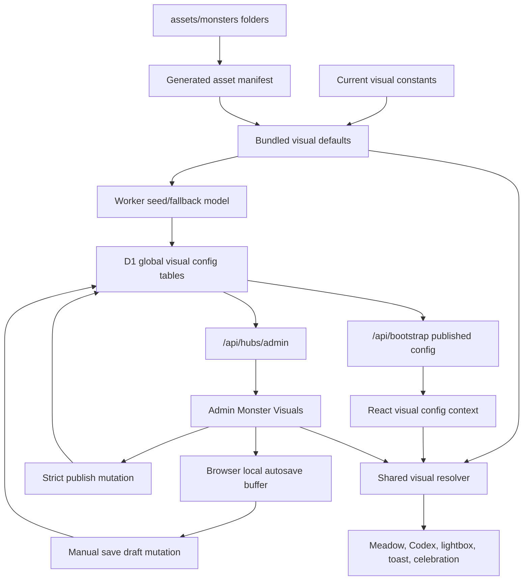
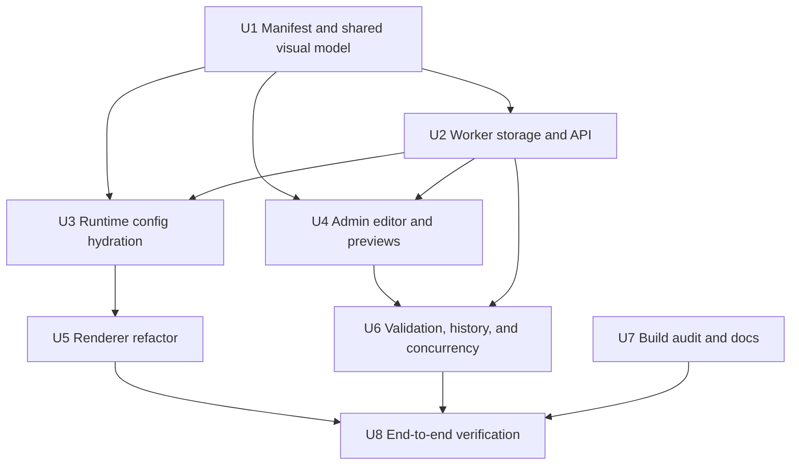

# feat: Monster Visual Config Centre

## Overview

Build an Admin / Operations visual config centre for monster art. Admins can review every asset folder present under `assets/monsters/`, tune visual metadata across all renderer contexts, save a shared cloud draft, publish a complete reviewed global config, and restore old published versions into draft. Operations users can inspect the same previews without mutating state.

Learner-facing surfaces should eventually consume one published visual model, with bundled defaults as the hard fallback. The first implementation milestone is intentionally end-to-end: Admin editor plus all renderers reading the live published config, so the admin page is not an isolated toy (see origin: `docs/brainstorms/2026-04-24-monster-visual-config-centre-requirements.md`).

| Mode | Data source | Who can change it | Production effect |
|---|---|---|---|
| Bundled fallback | Generated modules from repo assets and current constants | Code change only | Always available when remote config is missing, unsafe, or missing a newly discovered asset |
| Local admin buffer | Browser local storage | Admin in current browser | Preview only, protects unsaved work across refreshes |
| Shared cloud draft | D1 global config draft | Admin only | Preview in Admin, no learner effect |
| Published config | D1 retained published version | Admin publish only | Drives learner renderers for covered assets; new manifest assets fall back until reviewed and published |

---

## Problem Frame

Monster visual metadata is currently split across source modules and renderer-specific constants. `src/surfaces/home/data.js` owns facing and meadow path behaviour, `src/surfaces/home/codex-view-model.js` owns Codex feature and lightbox foot alignment, and `src/platform/game/monsters.js` owns asset URLs and monster catalogue data. That makes visual review slow because every facing, path, scale, offset, crop, shadow, and timing change requires code edits and redeploys.

James wants to make this a web-operated workflow inside Admin / Operations. The Admin page should render all context previews itself so review does not require visiting every learner surface. Once published, the same global config should feed dashboard meadow, Codex card, Codex feature, lightbox, celebration overlay, and toast portrait renderers while preserving current behaviour until a reviewed published config intentionally changes it.

---

## Requirements Trace

- R1. Cover every monster asset folder present under `assets/monsters/`, including dormant or not-yet-active monsters.
- R2. Generate asset discovery from `assets/monsters/` at build time.
- R3. Seed the initial published config from current bundled defaults and conservative generated defaults where no hand-tuned value exists.
- R4. Use asset baseline plus renderer context overrides.
- R5. Support `meadow`, `codexCard`, `codexFeature`, `lightbox`, `celebrationOverlay`, and `toastPortrait` contexts.
- R6. Require every exposed visual field before publish, including facing, path or motion profile, offsets, scale, anchors, shadows, layering, timing, crop, filter, bob, and tilt.
- R7. House Monster Visuals inside the existing Admin / Operations surface.
- R8. Render previews inside Admin rather than making James navigate through learner surfaces during tuning.
- R9. Provide queue filters for monster, branch, stage, incomplete, changed, unreviewed, and published mismatch.
- R10. Show all six renderer contexts together for the selected asset.
- R11. Support visual drag controls and exact numeric controls.
- R12. Support basic shortcuts for navigation, context switching, draft save, publish, review, and revert.
- R13. Autosave draft edits locally; require manual Save for shared cloud draft writes.
- R14. Track review state per asset/context.
- R15. Let Admin edit, save, publish, restore, and mark reviewed; let Ops inspect only.
- R16. Keep shared draft out of learner production UI until publish.
- R17. Strictly block publish until every asset baseline, context override, field, and asset/context review state is complete and valid.
- R18. Make published config global platform-wide, not account, learner, or subject scoped.
- R19. Retain the last 20 published versions; restore copies an old version into draft before publish.
- R20. When a new asset folder appears, keep current live config unaffected and block the next publish until the new asset is completed and reviewed.
- R21. Audit save, publish, and restore mutations through the mutation receipt pattern.
- R22. Refactor all current monster renderers to consume the shared visual model.
- R23. Keep hard fallback to bundled defaults when remote config is unavailable, incomplete, or stale against the current asset manifest.
- R24. Do not alter learning logic, monster progress, mastery thresholds, rewards, or content.
- R25. Preserve current learner-visible behaviour until a reviewed published config explicitly changes visuals.

**Origin actors:** A1 James / Admin, A2 Operations user, A3 Learner, A4 Admin preview renderer, A5 Worker config boundary, A6 Monster renderers, A7 Asset manifest generator.

**Origin flows:** F1 Asset discovery and seeded config, F2 Admin review and local tuning, F3 Cloud draft save and review completion, F4 Strict publish, F5 Restore previous version.

**Origin acceptance examples:** AE1 Admin preview/local buffer does not affect production before Save and Publish, AE2 Ops is read-only, AE3 publish blocks on unreviewed context, AE4 new assets block next publish without changing live config, AE5 published config feeds all renderer contexts, AE6 restore old version into draft only, AE7 Worker config read failure falls back safely.

---

## Scope Boundaries

- Do not build asset upload, replacement, image editing, or background-removal workflows.
- Do not make monster visual config account-scoped, learner-scoped, or subject-scoped.
- Do not let draft changes affect production renderers before publish.
- Do not allow partial publish with warnings; V1 publish remains strict.
- Do not allow Operations users to mutate global visual config.
- Do not change monster progression, reward events, mastery thresholds, spelling content, punctuation content, learner state, or D1 learner/game state semantics.
- Do not require James to preview values by navigating out to normal learner surfaces.
- Do not remove bundled visual defaults.
- Do not generate or regenerate monster images as part of this feature; the manifest reads files already present under `assets/monsters/`.

### Deferred to Follow-Up Work

- Asset upload/replacement workflow: separate product and storage design.
- Per-field visual presets or batch transforms: useful later, but V1 focuses on complete review and precise editing.
- Multi-admin real-time collaboration: V1 uses stale-draft detection and explicit refresh/merge handling rather than live cursors.

---

## Context & Research

### Relevant Code and Patterns

- `src/surfaces/home/data.js` currently contains `MONSTER_FACE`, meadow path zones, `defaultPathForMonster`, `buildMeadowMonsters`, `monsterAssetPath`, and `monsterAssetSrcset`.
- `src/surfaces/home/MonsterMeadow.jsx` consumes meadow entries plus `monsterFaceSign` to set CSS variables, roam direction, shadows, size, and asset sources.
- `src/surfaces/home/codex-view-model.js` contains `FEATURE_FOOT_PAD_BY_ASSET`, `codexFeatureStyle`, and `codexLightboxStyle`.
- `src/surfaces/home/CodexCreature.jsx`, `src/surfaces/home/CodexHero.jsx`, `src/surfaces/home/CodexCard.jsx`, and `src/surfaces/home/CodexCreatureLightbox.jsx` are the Codex renderer path.
- `src/surfaces/shell/ToastShelf.jsx` and `src/surfaces/shell/MonsterCelebrationOverlay.jsx` use `monsterAsset` and `monsterAssetSrcSet` directly for reward UI.
- `src/platform/game/monsters.js` is the current monster catalogue and asset URL helper. It only knows active gameplay monsters, while `assets/monsters/` contains additional folders, so the visual manifest must not be derived solely from `MONSTERS`.
- `src/surfaces/hubs/AdminHubSurface.jsx`, `src/platform/hubs/admin-read-model.js`, `src/platform/hubs/api.js`, and `src/main.js` already provide the Admin / Operations shell, role-aware actions, and Worker hub payload loading.
- `worker/src/app.js` has the existing Admin routes: `/api/hubs/admin`, `/api/admin/accounts`, `/api/admin/accounts/role`, and `/api/content/spelling`.
- `worker/src/repository.js` has role guards such as `requireAdminHubAccess` and `requireAccountRoleManager`, global/admin mutation receipt examples in `updateManagedAccountRole`, account-scoped idempotency in `withAccountMutation`, and audit lookup via `listMutationReceiptRows`.
- `worker/migrations/0003_mutation_safety.sql`, `worker/migrations/0005_spelling_content_model.sql`, and `worker/migrations/0006_operating_surfaces.sql` show the D1 migration style for receipts, content storage, and operator indexes.
- `src/platform/core/repositories/api.js` hydrates browser runtime state from `/api/bootstrap` with cache fallback. Published monster visual config should use the same fail-safe posture without becoming learner-owned state.
- `scripts/assert-build-public.mjs`, `scripts/build-public.mjs`, `tests/build-public.test.js`, and `tests/bundle-audit.test.js` are the current build/public-output safety checks.
- Existing visual tests to extend include `tests/codex-view-model.test.js`, `tests/render.test.js`, `tests/react-app-shell.test.js`, `tests/react-hub-surfaces.test.js`, and `tests/react-punctuation-assets.test.js`.

### Institutional Learnings

- There is no `docs/solutions/` directory in this repo, so no stored solution notes apply.
- Prior ks2-mastery release work shows the meaningful project gates are the existing package test and Worker dry-run checks, run sequentially for build-sensitive paths so temporary public-build output cannot collide.
- Prior production validation work favours deterministic fallbacks when browser tooling is flaky: preview/server HTTP checks, `/demo` session checks when relevant, and production bundle audit over relying on one browser daemon.
- Existing project guidance requires package scripts for Cloudflare operations; this plan does not introduce raw Wrangler usage.

### External References

- None used. The relevant Worker, D1, Admin, and renderer patterns are already present in the repo, and the requested workflow is product-specific.

---

## Key Technical Decisions

- **Use a generated asset manifest from `assets/monsters/`, not `MONSTERS`:** Requirements include every asset folder, including dormant assets. `MONSTERS` remains gameplay catalogue data; the visual centre needs asset inventory data.
- **Create a shared visual config model in `src/platform/game/`:** Worker, Admin UI, tests, and renderers should share one normaliser/validator/resolver rather than duplicating rules in each renderer.
- **Seed a complete bundled baseline before D1 publishing:** The seed should preserve current tuned behaviour for active assets and generate conservative neutral defaults for assets with no hand-tuned constants. The seed can be system-reviewed so first live config is valid, while new manifest entries after that block the next publish until reviewed.
- **Store one global D1 draft/published config, separate from account content:** Visual config is platform-wide and must not be tied to an adult account, learner, or subject. Mutations still record the actor account in `mutation_receipts` for audit and replay.
- **Use draft revision compare-and-swap plus request receipts for cloud saves:** Local autosave can be optimistic, but cloud save/publish/restore must detect stale shared draft edits and be idempotent by request id.
- **Serve published config through runtime bootstrap with compatibility validation:** Learner renderers should use a schema-compatible published config for every asset/context it covers. If the current manifest has new assets missing from the published config, those assets fall back to bundled defaults and the next publish is blocked; only fatal schema/config corruption should disable the remote config wholesale.
- **Pass visual config through React props/context instead of importing remote state inside renderers:** This keeps renderers testable and lets Admin previews render arbitrary local/draft configs without mutating app-wide state.
- **Build Admin previews from the same resolver used by production renderers:** The Admin page can edit local draft values, but preview output must exercise the same visual-model path the learner UI will use after publish.
- **Keep strict publish in Worker, not only the browser:** Browser validation improves UX, but the Worker must enforce required fields, complete context overrides, review state, manifest coverage, and version retention.

---

## Open Questions

### Resolved During Planning

- **Should the config centre be a small facing/path editor or a broader visual centre?** Broader visual centre. James selected all exposed visual fields, all contexts, and all asset folders in the origin.
- **Should Admin previews be separate from learner surfaces?** Yes. Admin renders previews in-place, while runtime renderers consume published config after publish.
- **Should the config be per learner/account/subject?** No. It is a global platform-wide visual config.
- **Should a new asset immediately change production?** No. The current published config remains live for already-covered assets; the new asset uses bundled fallback, and the next publish is blocked until the manifest addition is completed and reviewed.
- **How should R20 and R23 interact when the manifest grows?** Treat manifest growth as a partial-fallback render condition and a strict publish blocker. This preserves current live config for existing assets while still ensuring missing new assets cannot be published silently.
- **Should external research drive the architecture?** No. Existing repo patterns already cover Admin role boundaries, D1 migrations, mutation receipts, bootstrap fallback, React renderers, and build audits.

### Deferred to Implementation

- **Exact schema field names and ranges:** The implementation should finalise field names while building the shared normaliser, but must cover every field exposed by the editor and every required context from the origin.
- **Exact Admin component split:** The plan names likely files, but implementation can adjust component boundaries if a smaller split keeps the UI clearer.
- **Exact migration SQL shape:** The plan fixes the data lifecycle and tables conceptually; final D1 SQL should follow the existing migration style.
- **Conflict UX details:** The plan requires stale-draft detection and safe refresh/merge handling. The exact copy and merge affordance can be refined while wiring the Admin UI.
- **Pixel-perfect preview dimensions:** The Admin preview must use representative frames for all contexts. Exact preview sizing should be tuned during UI implementation and visual verification.

---

## High-Level Technical Design

> *This illustrates the intended approach and is directional guidance for review, not implementation specification. The implementing agent should treat it as context, not code to reproduce.*

The core lifecycle is: manifest generation creates the asset universe; bundled defaults provide a safe complete baseline; Worker stores global draft/published/history; Admin edits and previews draft/local config; publish promotes only complete reviewed config; runtime bootstrap supplies the published config; the resolver falls back to bundled defaults whenever the remote config is unsafe.

---

## Implementation Units

- U1. **Generate Manifest and Shared Visual Defaults**

**Goal:** Create the asset manifest, bundled baseline config, shared field registry, normaliser, validator, and resolver that all later units consume.

**Requirements:** R1, R2, R3, R4, R5, R6, R20, R23, R25; F1; AE4, AE7.

**Dependencies:** None.

**Files:**
- Create: `scripts/generate-monster-visual-manifest.mjs`
- Create: `src/platform/game/monster-asset-manifest.js`
- Create: `src/platform/game/monster-visual-defaults.js`
- Create: `src/platform/game/monster-visual-config.js`
- Modify: `package.json`
- Modify: `scripts/build-bundles.mjs`
- Modify: `scripts/assert-build-public.mjs`
- Modify: `src/surfaces/home/data.js`
- Modify: `src/surfaces/home/codex-view-model.js`
- Test: `tests/monster-visual-config.test.js`
- Test: `tests/build-public.test.js`

**Approach:**
- Generate a deterministic manifest from `assets/monsters/<monster>/<branch>/<monster>-<branch>-<stage>.<size>.webp`.
- Include every discovered monster id, branch, stage, available sizes, asset key, display label fallback, and a manifest hash that changes when the asset universe changes.
- Keep gameplay catalogue data in `src/platform/game/monsters.js`; do not derive asset coverage from `MONSTERS`.
- Move current facing defaults, meadow path defaults, and Codex foot padding into a generated or hand-maintained bundled visual default config.
- For assets with no current tuning, generate neutral complete defaults for every required context. Mark their provenance as generated default so Admin can surface review backlog without breaking the initial fallback.
- Define context field definitions in the shared model, including ranges/defaults for face, path/motion, offsets, scale, anchors, shadows, layering, timing, bob, tilt, crop, and filter.
- Export a resolver that takes `assetKey`, `context`, and optional remote config and returns a complete safe visual object from remote values plus bundled fallback.
- Export validation that can distinguish "safe to render with fallback" from "valid to publish"; render can be forgiving, publish must be strict.

**Execution note:** Add characterization coverage for current Vellhorn facing, current preferred paths, and existing Codex foot shifts before moving constants.

**Patterns to follow:**
- `scripts/generate-spelling-content.mjs` for generated module shape and clear regeneration comments.
- `src/subjects/spelling/content/model.js` for normalise/validate distinction.
- `src/surfaces/home/data.js` and `src/surfaces/home/codex-view-model.js` for existing visual defaults to preserve.

**Test scenarios:**
- Happy path: manifest generation over current `assets/monsters/` produces all present monster folders, branches, stages, and sizes, including dormant folders such as `bracehart`, `chronalyx`, and `couronnail`.
- Happy path: current tuned defaults survive the move, including `vellhorn-b1-1` through `vellhorn-b1-4` facing left and Vellhorn meadow path defaulting to `walk-b`.
- Happy path: resolver returns complete `meadow`, `codexCard`, `codexFeature`, `lightbox`, `celebrationOverlay`, and `toastPortrait` values for every manifest asset.
- Edge case: an asset has only generated neutral defaults, and publish validation still sees every required field while provenance identifies it as generated.
- Error path: a malformed config with a missing required context fails publish validation but still resolves to bundled render defaults.
- Integration: build/public assertion fails when the generated manifest is stale against `assets/monsters/`.
- Covers AE4. A simulated new asset key appears in the manifest but not in a published config, and validation reports "publish blocked" while resolver still renders from bundled fallback.
- Covers AE7. Missing remote config resolves to bundled defaults without blank asset URLs or missing CSS variables.

**Verification:**
- The manifest is deterministic, complete for the current asset tree, and portable.
- Existing visual helper exports either remain available as compatibility wrappers or have test-covered replacements.
- Tests prove current learner-visible defaults are preserved before any remote config is introduced.

---

- U2. **Add Worker Storage, Permissions, and Config APIs**

**Goal:** Store the global monster visual draft, published version, and version history in D1 with Admin/Ops permissions, idempotent mutations, strict Worker-side validation, and audit receipts.

**Requirements:** R7, R14, R15, R16, R17, R18, R19, R20, R21, R23; F3, F4, F5; AE2, AE3, AE4, AE6, AE7.

**Dependencies:** U1.

**Files:**
- Create: `worker/migrations/0008_monster_visual_config.sql`
- Modify: `worker/src/app.js`
- Modify: `worker/src/repository.js`
- Modify: `src/platform/hubs/admin-read-model.js`
- Modify: `src/platform/hubs/api.js`
- Modify: `tests/helpers/worker-server.js`
- Test: `tests/worker-monster-visual-config.test.js`
- Test: `tests/worker-hubs.test.js`

**Approach:**
- Add global D1 tables for singleton draft/published metadata and retained published versions. Keep the data platform-wide, not account-scoped.
- Store draft JSON, published JSON, manifest hash, schema version, draft revision, published version, updated/published actor ids, timestamps, and retained version rows.
- Seed from bundled defaults when D1 has no visual config row. The seed must be complete and safe to serve before the Admin UI exists.
- Expose Admin/Ops read data through the existing Admin hub payload so the UI can render config status, draft, published summary, validation issues, review queue metadata, and version history.
- Add admin-only mutation routes for saving draft, publishing, and restoring a version into draft. Route names can follow existing `/api/admin/*` conventions, but must stay protected by same-origin checks for writes.
- Let Operations users read Admin hub visual data but deny save, publish, restore, and review-state mutation with explicit 403 responses.
- Use actor-account `mutation_receipts` with visual-specific mutation kinds and scope metadata. Follow `updateManagedAccountRole` when target scope differs from actor account.
- Include request id, correlation id, expected draft revision, and replay-safe response handling for idempotency.
- Enforce last-20 published-version retention after successful publish while preserving the newly published row.

**Patterns to follow:**
- `worker/src/repository.js` `updateManagedAccountRole` for admin-only mutation, actor audit, and replay handling.
- `worker/src/repository.js` `withAccountMutation` for idempotency and stale-write error semantics.
- `worker/src/app.js` Admin and content routes for same-origin write protection.
- `tests/worker-hubs.test.js` for role-gated Admin/Ops coverage.
- `tests/spelling-content-api.test.js` for replay-safe receipt response sizing.

**Test scenarios:**
- Happy path: admin reads Admin hub and receives visual config status, draft revision, manifest hash, validation summary, and version list.
- Happy path: admin saves a valid draft with expected draft revision and receives an incremented draft revision plus mutation receipt metadata.
- Happy path: admin publishes a complete reviewed draft and receives a new published version while the draft remains aligned to that version.
- Happy path: admin restores version 4 while version 7 is live; version 4 becomes the draft and version 7 remains published.
- Edge case: version history contains more than 20 rows after repeated publishes, and only the latest 20 retained published versions remain.
- Error path: parent and demo accounts cannot read the Admin hub visual payload.
- Error path: Ops can read visual config but save, publish, restore, and mark-reviewed routes return forbidden responses.
- Error path: stale draft save with an old expected draft revision returns a conflict with the current draft revision.
- Error path: idempotency request id reuse with a different payload is rejected.
- Integration: audit lookup includes visual config mutation receipts with visual mutation kinds and global config scope.
- Covers AE2. Ops can inspect but cannot mutate.
- Covers AE3. Publish with one unreviewed `codexFeature` context is rejected and identifies the asset/context.
- Covers AE4. A manifest hash mismatch blocks publish without changing the current published config.
- Covers AE6. Restore copies into draft only.

**Verification:**
- Worker API enforces the permission model without relying on browser checks.
- D1 persistence can represent draft, published, history, and review state without touching learner, subject, or game-state tables.
- Mutation receipt rows are replay-safe and auditable from Admin / Operations.

---

- U3. **Hydrate Published Config into Browser Runtime**

**Goal:** Deliver the published visual config to the browser runtime safely, cache it separately from learner-owned data, and expose a render-time visual config context with bundled fallback.

**Requirements:** R16, R18, R22, R23, R24, R25; F1, F4; AE5, AE7.

**Dependencies:** U1, U2.

**Files:**
- Modify: `worker/src/repository.js`
- Modify: `worker/src/app.js`
- Modify: `src/platform/core/repositories/helpers.js`
- Modify: `src/platform/core/repositories/api.js`
- Modify: `src/platform/app/bootstrap.js`
- Modify: `src/main.js`
- Modify: `src/app/App.jsx`
- Create: `src/platform/game/MonsterVisualConfigContext.jsx`
- Test: `tests/repositories.test.js`
- Test: `tests/persistence.test.js`
- Test: `tests/app-controller.test.js`
- Test: `tests/worker-backend.test.js`

**Approach:**
- Include the active published monster visual config in `/api/bootstrap` or an equivalent startup payload used by the React app. The payload should carry schema version, manifest hash, published version, and config JSON.
- Keep the config read-only in browser runtime. It must not enter learner sync queues or optimistic persistence operations.
- Normalise the published config with the shared model. Fatal schema/version errors should disable the remote config wholesale; manifest growth or missing per-asset entries should produce per-asset fallback reasons so already-covered assets keep using the current published config.
- Provide a React context or equivalent top-level prop from `App` so all renderers can resolve visuals without each issuing network calls.
- Keep fallback local and synchronous. Initial render should never depend on a successful config network call beyond the existing bootstrap.
- Avoid expanding the repository contract's required learner-data methods unless necessary; visual config can be an optional runtime payload so local tests and helper repositories stay simple.

**Patterns to follow:**
- `src/platform/core/repositories/api.js` `hydrateRemoteState` fallback behaviour.
- `src/platform/app/bootstrap.js` session and repository bootstrapping.
- `src/app/App.jsx` top-level shell props for toast and celebration surfaces.
- `src/platform/core/repositories/contract.js` for keeping repository interface expansion conservative.

**Test scenarios:**
- Happy path: bootstrap payload with matching manifest hash produces a visual config context containing the published version.
- Happy path: a renderer resolving an asset/context through the context receives remote values when valid.
- Edge case: bootstrap omits visual config and renderers use bundled defaults.
- Edge case: bootstrap returns a config from an older manifest; runtime uses published values for covered assets, falls back for newly missing assets, and records a publish-blocking compatibility warning.
- Error path: bootstrap request fails but cache has learner data; the app keeps existing degraded behaviour and visual resolution falls back locally.
- Integration: visual config hydration does not enqueue learner, subject, practice-session, game-state, or event-log writes.
- Covers AE5. A valid published config becomes available to all top-level renderer branches.
- Covers AE7. Invalid or missing Worker config does not produce blank images or missing styles.

**Verification:**
- Runtime visual config is read-only, globally scoped, and safe to ignore.
- Learner state and subject logic are unchanged.
- Renderers have a single way to access remote visual config plus fallback.

---

- U4. **Build Admin Editor, Review Queue, and In-Page Previews**

**Goal:** Add the Monster Visuals panel inside Admin / Operations with queue filters, all-context previews, local autosave, manual cloud save, numeric controls, drag controls, review state, shortcuts, and read-only Ops mode.

**Requirements:** R7, R8, R9, R10, R11, R12, R13, R14, R15; F2, F3; AE1, AE2, AE3.

**Dependencies:** U1, U2.

**Files:**
- Modify: `src/surfaces/hubs/AdminHubSurface.jsx`
- Create: `src/surfaces/hubs/MonsterVisualConfigPanel.jsx`
- Create: `src/surfaces/hubs/MonsterVisualPreviewGrid.jsx`
- Create: `src/surfaces/hubs/MonsterVisualFieldControls.jsx`
- Modify: `src/main.js`
- Modify: `src/platform/hubs/api.js`
- Modify: `styles/app.css`
- Test: `tests/react-hub-surfaces.test.js`
- Test: `tests/hub-api.test.js`
- Test: `tests/helpers/react-render.js`

**Approach:**
- Add a Monster Visuals section to Admin / Operations after the top platform-access summary and before lower-priority diagnostics where it remains easy to reach.
- Present a dense operator interface: queue/filter rail, selected asset header, six context previews, field controls, validation issues, status chips, and version actions. Avoid marketing copy or nested card-heavy layout.
- Use Admin hub model permissions to render editable controls for Admin and disabled/read-only controls for Ops.
- Keep local autosave in browser storage keyed by manifest hash, draft revision, and account id. Loading a stale local buffer should require explicit user action before it overwrites current draft values.
- Manual Save writes to the shared cloud draft through Admin API; publish and restore use separate explicit actions.
- Mark asset/context reviewed only when required fields for that context are valid in the local/draft buffer.
- Reset changed contexts to unreviewed when values are edited after review, unless the action is a deliberate revert to the published value.
- Render all six contexts using the shared resolver against the selected local/draft config. Context previews can use frame components that mimic each production renderer's sizing and CSS variables without navigating out of Admin.
- Implement basic keyboard shortcuts only when focus is inside the Monster Visuals panel and not inside a text/number input where the key would be normal editing input.
- Surface publish blockers from Worker validation exactly enough to jump back to the asset/context.

**Execution note:** Build the interaction model test-first around role mode, local-buffer behaviour, and save/publish action dispatches before polishing visual styling.

**Patterns to follow:**
- `src/surfaces/hubs/AdminHubSurface.jsx` for role-aware Admin sections and action dispatch.
- `src/surfaces/hubs/AdultLearnerSelect.jsx` for compact operator controls.
- `tests/react-hub-surfaces.test.js` and `tests/helpers/react-render.js` for static React surface coverage.
- Frontend design guidance in repo instructions: operational tools should be dense, restrained, and scan-friendly.

**Test scenarios:**
- Happy path: Admin sees Monster Visuals with queue filters, selected asset details, all six context previews, numeric fields, save, publish, and restore controls.
- Happy path: changing `vellhorn-b1-3` facing updates the Admin preview and local buffer without calling a cloud save action.
- Happy path: manual Save sends the current draft payload with expected draft revision and request id.
- Happy path: shortcuts move next/previous asset and switch context when focus is in the panel.
- Edge case: refreshing with a matching local autosave buffer restores unsaved values into the preview only, with cloud draft unchanged.
- Edge case: a stale local buffer from an old draft revision is surfaced as recoverable but not silently applied.
- Error path: Ops sees previews and validation status but mutation controls are disabled or absent and API calls are not dispatched.
- Error path: Worker publish rejection shows the first incomplete asset/context and keeps the draft editable.
- Covers AE1. Admin preview changes before Save/Publish do not affect production.
- Covers AE2. Ops read-only state is visible and enforced in the UI.
- Covers AE3. Unreviewed context prevents publish and is easy to locate.

**Verification:**
- Admin page supports the full review loop without leaving Admin / Operations.
- Local autosave and shared draft save are visibly distinct.
- Role-based edit affordances match Worker permissions.

---

- U5. **Refactor All Monster Renderers onto the Shared Visual Model**

**Goal:** Replace scattered renderer-specific constants and direct asset helper usage with the shared resolver, while preserving current visuals under bundled defaults and enabling published config consumption everywhere.

**Requirements:** R4, R5, R22, R23, R24, R25; F4; AE5, AE7.

**Dependencies:** U1, U3.

**Files:**
- Modify: `src/surfaces/home/HomeSurface.jsx`
- Modify: `src/surfaces/home/MonsterMeadow.jsx`
- Modify: `src/surfaces/home/CodexCard.jsx`
- Modify: `src/surfaces/home/CodexHero.jsx`
- Modify: `src/surfaces/home/CodexCreature.jsx`
- Modify: `src/surfaces/home/CodexCreatureLightbox.jsx`
- Modify: `src/surfaces/home/codex-view-model.js`
- Modify: `src/surfaces/shell/ToastShelf.jsx`
- Modify: `src/surfaces/shell/MonsterCelebrationOverlay.jsx`
- Modify: `src/subjects/spelling/components/spelling-view-model.js`
- Modify: `src/subjects/punctuation/components/punctuation-view-model.js`
- Modify: `src/subjects/grammar/metadata.js`
- Modify: `src/platform/ui/render.js`
- Test: `tests/codex-view-model.test.js`
- Test: `tests/react-app-shell.test.js`
- Test: `tests/render.test.js`
- Test: `tests/react-punctuation-assets.test.js`
- Test: `tests/monster-visual-renderers.test.js`

**Approach:**
- Add a small renderer-facing helper layer that resolves asset sources and context CSS variables from the visual model.
- Preserve existing exported helper names where practical to reduce blast radius, but move implementation to the shared visual resolver.
- Pass visual config from top-level React context/props down to meadow, Codex, toast, and celebration components.
- For view-models that currently only produce image sources, add optional visual config inputs while keeping existing call sites fallback-safe.
- Update legacy string renderer `src/platform/ui/render.js` enough that tests and any still-supported fallback output do not drift from React semantics.
- For meadow movement, separate slot generation from visual tuning: learner state decides which monsters appear and where seed placement starts; visual config decides facing/path/motion parameters for the matching asset/context.
- For Codex feature/lightbox, replace hard-coded foot pad tables with context visual config while keeping bundled default output identical.
- For toast and celebration, use context-specific scale/crop/offset/filter/shadow settings without changing reward event payload shape.

**Execution note:** Characterize current generated styles and asset URLs before swapping each renderer to the resolver, then add remote-config override tests.

**Patterns to follow:**
- `src/surfaces/home/MonsterMeadow.jsx` CSS-variable style application.
- `src/surfaces/home/codex-view-model.js` view-model style helpers.
- `src/surfaces/shell/ToastShelf.jsx` and `src/surfaces/shell/MonsterCelebrationOverlay.jsx` for reward UI event inputs.
- `tests/codex-view-model.test.js` for exact CSS variable expectations.

**Test scenarios:**
- Happy path: bundled defaults produce the same Codex feature and lightbox CSS variables currently asserted for known assets.
- Happy path: remote published config changes a selected context value, and only that context's renderer output changes.
- Happy path: meadow uses remote facing/path/motion values while retaining deterministic placement and z-index behaviour.
- Happy path: toast portrait and celebration overlay use configured asset source and context styling without changing toast or reward event copy.
- Edge case: renderer receives a monster id/branch/stage not present in remote config but present in the manifest; that asset/context falls back to bundled defaults without disabling remote config for covered assets.
- Edge case: renderer receives no visual config context; output remains valid.
- Error path: malformed context override does not crash render and does not leak partial CSS variables.
- Integration: published config is visible in dashboard meadow, Codex card, Codex feature, lightbox, toast portrait, and celebration overlay from one runtime payload.
- Covers AE5. All six renderer contexts consume the same global published values.
- Covers AE7. Runtime fallback prevents blank or broken visuals when config is missing or invalid.

**Verification:**
- Current visual output remains stable under bundled defaults.
- All monster visual renderers have an explicit path to consume the shared visual config.
- Learning, rewards, and subject view-model semantics remain unchanged.

---

- U6. **Harden Publish Validation, Review State, History, and Conflicts**

**Goal:** Make the publish gate, review queue semantics, version retention, rollback-to-draft, and multi-admin stale-save behaviour robust enough for production-sensitive global visual config.

**Requirements:** R14, R15, R16, R17, R19, R20, R21, R23; F3, F4, F5; AE3, AE4, AE6, AE7.

**Dependencies:** U1, U2, U4.

**Files:**
- Modify: `src/platform/game/monster-visual-config.js`
- Modify: `worker/src/repository.js`
- Modify: `src/surfaces/hubs/MonsterVisualConfigPanel.jsx`
- Modify: `src/surfaces/hubs/MonsterVisualFieldControls.jsx`
- Test: `tests/monster-visual-config.test.js`
- Test: `tests/worker-monster-visual-config.test.js`
- Test: `tests/react-hub-surfaces.test.js`

**Approach:**
- Define publish validation as a Worker-enforced decision: all manifest assets, all six contexts, all exposed fields, all context review flags, schema version, and manifest hash must be complete.
- Keep render validation separate and more forgiving so production never blanks because of a bad or stale remote payload.
- Track review state per asset/context with enough metadata to explain who/what marked it reviewed and when.
- Reset review state for a context when a field edit changes its effective config away from the reviewed value.
- Mark contexts as "published mismatch" when draft differs from published even if valid; this drives queue filters without blocking save.
- Handle new manifest assets by reporting missing baseline/context/review entries in draft validation. Published runtime keeps using the last valid published values for covered assets and bundled fallback for missing new assets.
- Use stale draft revision errors for concurrent cloud saves and restore actions. The UI should preserve the local buffer and prompt refresh/merge rather than dropping edits.
- Keep last-20 version retention transactionally tied to publish; restore should not delete history.

**Patterns to follow:**
- `src/subjects/spelling/content/model.js` validation result shape for errors and warnings.
- `worker/src/repository.js` stale write and idempotency error payloads.
- `src/platform/hubs/admin-read-model.js` for compact validation status summaries.

**Test scenarios:**
- Happy path: a complete draft with every required field and review flag passes publish validation.
- Happy path: editing a reviewed context changes its queue state to changed/unreviewed until reviewed again.
- Edge case: draft differs from published only in one context and the queue shows one published mismatch.
- Edge case: a system-seeded baseline is accepted for initial published config but a newly discovered asset after the manifest hash changes blocks the next publish.
- Error path: publish validation returns structured blockers for missing baseline, missing context override, missing field, invalid range, missing review flag, and manifest mismatch.
- Error path: two admins save from the same draft revision; the second save gets a stale-draft conflict and the UI preserves the local unsaved buffer.
- Integration: restoring an old version updates draft revision, marks draft source as restored, and leaves published version unchanged.
- Covers AE3. One unreviewed context blocks publish and names the asset/context.
- Covers AE4. New asset blocks next publish while current published config remains safe.
- Covers AE6. Restore-to-draft lifecycle is test-covered.

**Verification:**
- Publish cannot leak partial, stale, or unreviewed config into production.
- Review queue state matches Worker validation.
- Concurrent admin edits are recoverable and explicit.

---

- U7. **Extend Build Audits, Generated Artefact Checks, and Docs**

**Goal:** Keep generated visual artefacts reliable, public output safe, and operator/developer documentation clear without changing Cloudflare auth strategy.

**Requirements:** R1, R2, R3, R20, R21, R23; F1; AE4, AE7.

**Dependencies:** U1, U2, U5.

**Files:**
- Modify: `scripts/build-bundles.mjs`
- Modify: `scripts/build-public.mjs`
- Modify: `scripts/assert-build-public.mjs`
- Modify: `scripts/audit-client-bundle.mjs`
- Modify: `tests/build-public.test.js`
- Modify: `tests/bundle-audit.test.js`
- Modify: `worker/README.md`
- Modify: `docs/operating-surfaces.md`
- Create: `docs/monster-visual-config.md`

**Approach:**
- Ensure build flow generates or verifies the manifest before bundle/public assertions depend on it.
- Extend public-output assertions so required monster assets and generated visual manifest/default modules are present where the browser needs them, and raw private/server files remain unavailable.
- Extend bundle audit only for meaningful regressions: it should not forbid the visual config needed for rendering, but it should continue protecting retired runtime/source surfaces.
- Document Admin/Ops permissions, draft/publish/restore semantics, last-20 version retention, new asset policy, and fallback behaviour.
- Mention Cloudflare operations through existing package scripts only; do not add raw Wrangler instructions.
- Add a concise developer note explaining how to refresh the manifest when monster asset folders change.

**Patterns to follow:**
- `docs/operating-surfaces.md` for Admin / Operations user-facing operator documentation.
- `worker/README.md` Admin/Operations API notes.
- `scripts/assert-build-public.mjs` for static public-output checks.
- `docs/plans/2026-04-23-001-feat-full-lockdown-runtime-plan.md` for build-public audit treatment.

**Test scenarios:**
- Happy path: build-public test passes with generated monster manifest/default artefacts available to the app.
- Edge case: asset folder changes without regenerated manifest and build/public assertion fails with a clear message.
- Error path: production bundle audit still rejects forbidden raw source/test/Worker surfaces.
- Integration: docs mention the same permission, publish, retention, and fallback behaviour implemented by Worker tests.

**Verification:**
- Generated files and static assets stay in sync.
- Operator docs explain the workflow James will use.
- No Cloudflare deployment path regresses to raw Wrangler commands.

---

- U8. **End-to-End Verification and Rollout Gate**

**Goal:** Prove the feature works across Worker API, Admin UI, runtime renderers, fallback behaviour, and production-sensitive build/deploy checks.

**Requirements:** R7 through R25; F2, F3, F4, F5; AE1 through AE7.

**Dependencies:** U2, U3, U4, U5, U6, U7.

**Files:**
- Create: `tests/monster-visual-config-flow.test.js`
- Modify: `tests/browser-react-migration-smoke.test.js`
- Modify: `tests/helpers/browser-app-server.js`
- Modify: `tests/helpers/react-render.js`
- Modify: `docs/monster-visual-config.md`

**Approach:**
- Add a cross-layer Worker/UI test path that loads Admin hub visual data, edits a draft, saves, validates blockers, publishes a valid config, and observes runtime bootstrap using the published version.
- Add static React render coverage for Admin Visuals and runtime surfaces so the feature has deterministic tests even without browser tooling.
- Where browser smoke is used, keep it focused on visible Admin workflow and one learner surface proof that published config is consumed. Avoid making screenshot tooling the only gate.
- Include a production-style rollout checklist in docs: local package gates, migration, deploy, Admin smoke, runtime fallback smoke, and production UI verification for `https://ks2.eugnel.uk` because this change affects user-facing renderers.
- Verify package checks sequentially when executing the plan, following project guidance for build-sensitive work.

**Patterns to follow:**
- `tests/browser-react-migration-smoke.test.js` for deterministic UI waits.
- `tests/helpers/browser-app-server.js` for Worker-backed browser tests.
- `tests/worker-hubs.test.js` for signed-in role simulation.
- Existing pre-production validation pattern: prefer deterministic preview/server checks when browser automation is flaky.

**Test scenarios:**
- Happy path: Admin edits `vellhorn-b1-3` facing locally, saves draft, marks contexts reviewed, publishes, and runtime bootstrap reports the new published version.
- Happy path: a learner renderer consumes the published config on dashboard/Codex/reward UI while learning progress data remains unchanged.
- Edge case: Worker published config read fails, has fatal schema corruption, or lacks a newly discovered asset; learner surfaces still render covered assets from published values when safe and bundled defaults where needed.
- Error path: publish attempt with one invalid numeric field is blocked by Worker and surfaced in Admin UI.
- Integration: Admin/Ops roles are exercised end-to-end with read-only Ops and editable Admin.
- Integration: restore older version into draft, preview it, and verify live production config is unchanged until publish.
- Covers AE1. Local buffer and draft save do not affect production before publish.
- Covers AE2. Ops remains read-only through UI and API.
- Covers AE3. Publish blockers identify incomplete context.
- Covers AE4. Manifest addition blocks publish while live config remains safe.
- Covers AE5. Published config reaches all renderer contexts.
- Covers AE6. Restore-to-draft is not immediate rollback.
- Covers AE7. Missing config falls back safely.

**Verification:**
- All implementation paths have deterministic tests before production rollout.
- The final release gate includes package verification, Worker dry-run, migration safety, and production UI verification appropriate for a user-facing renderer change.
- The feature can be paused after Admin-only preview stages without exposing draft config to learners.

---

## System-Wide Impact

- **Interaction graph:** Admin hub read model, Admin mutation routes, D1 global visual tables, runtime bootstrap, React top-level app shell, and six renderer contexts all participate. The shared visual resolver is the central boundary to keep these paths consistent.
- **Error propagation:** Worker mutation validation errors should return structured blockers; Admin UI maps blockers to queue asset/context locations; runtime config errors should not reach users as visible failures and should degrade to bundled defaults.
- **State lifecycle risks:** Local autosave, shared cloud draft, published config, version history, and bundled fallback are distinct states. The plan prevents accidental draft-to-production leakage by only exposing published config through runtime bootstrap.
- **API surface parity:** Admin read/write APIs, runtime bootstrap payload, and legacy/static render tests must all agree on schema version, manifest hash, and context names.
- **Integration coverage:** Unit tests must be backed by Worker/API/UI integration coverage because publish safety depends on cross-layer behaviour.
- **Unchanged invariants:** Learning progress, subject content, monster mastery thresholds, reward event payload semantics, account/learner sync queues, and deployment authentication strategy remain unchanged.

---

## Alternative Approaches Considered

- **Tiny facing/path editor only:** Rejected because James selected a broader visual config centre with all exposed fields and all renderer contexts. A tiny editor would create another temporary source of truth.
- **Admin-only preview without runtime consumption:** Rejected because the centre must eventually drive all renderers; otherwise James would still need code changes to apply reviewed values.
- **Per-account or per-subject config:** Rejected because visual metadata is product-level and global.
- **Runtime config only, no bundled defaults:** Rejected because the origin requires hard fallback and current renderer behaviour must survive Worker/config failures.
- **Discover assets dynamically in Worker at runtime:** Rejected because current assets are static app files, and build-time manifest generation gives deterministic validation, testability, and public-output checks.
- **Store config in subject content tables:** Rejected because this config is not spelling/punctuation learner content and should not inherit account/subject scoping.

---

## Success Metrics

- James can tune a monster asset/context from Admin without touching source constants.
- Admin preview updates immediately while production renderers remain unchanged until publish.
- A complete publish updates all six renderer contexts from one global published config.
- Ops can inspect but cannot mutate.
- New asset folders are detected automatically and block next publish until reviewed.
- Missing, stale, or malformed remote config never breaks learner visuals.

---

## Dependencies / Prerequisites

- Current static asset layout under `assets/monsters/<monster>/<branch>/<monster>-<branch>-<stage>.<size>.webp` remains the asset source convention.
- Existing Admin / Operations role model remains authoritative for operator access.
- D1 migrations can add a global config table and history table before Admin writes are used in production.
- The first implementation should include enough UI styling time to make the operator workflow usable, not merely technically wired.

---

## Risk Analysis & Mitigation

| Risk | Likelihood | Impact | Mitigation |
|---|---:|---:|---|
| First PR becomes too large because Admin UI, Worker API, and renderer refactor are all connected | Medium | High | Keep units dependency-ordered, preserve fallback at each step, and land characterization tests before renderer changes. |
| Strict publish blocks James because many dormant assets need review | High | Medium | Seed complete system-reviewed defaults and make queue filters identify generated defaults/new assets clearly; current live config remains unaffected. |
| Remote config failure causes blank or broken learner visuals | Medium | High | Runtime resolver only uses remote config after schema/manifest validation and otherwise falls back to bundled defaults. |
| Multi-admin edits overwrite draft work | Medium | Medium | Use draft revision CAS, request receipts, local buffer preservation, and explicit stale-refresh UI. |
| Visual config bloats the client bundle or bootstrap payload | Medium | Medium | Keep manifest/config schema compact, audit bundle size, and avoid storing duplicate image metadata beyond sizes and asset keys. |
| Renderer parity drifts between Admin preview and production surfaces | Medium | High | Admin previews use the same shared resolver and representative frame components; integration tests exercise all six contexts. |
| Permissions rely on UI disabled controls only | Low | High | Worker enforces Admin write/publish/restore and Ops read-only behaviour with tests. |
| New asset manifest mismatch invalidates production config at deploy time | Medium | Medium | Existing published values remain active for covered assets, new assets fall back safely, and next publish is blocked with actionable validation blockers. |
| Generated files get stale after asset folder changes | Medium | Medium | Build/public assertions compare manifest to `assets/monsters/` and fail clearly. |
| Deployment path regresses to raw Wrangler commands | Low | Medium | Keep docs and package scripts aligned with existing OAuth-safe scripts. |

---

## Documentation / Operational Notes

- Update `docs/operating-surfaces.md` with Monster Visuals permissions and operator workflow.
- Add `docs/monster-visual-config.md` for manifest refresh, draft/save/publish/restore semantics, validation blockers, fallback behaviour, and new asset policy.
- Update `worker/README.md` with Admin visual config API behaviour and mutation receipt kinds.
- Rollout requires D1 migration before Admin cloud draft writes.
- Before deployment, use the existing project package verification gates and keep build-sensitive checks sequential.
- After deployment, verify production UI on `https://ks2.eugnel.uk` with a logged-in session because published visual config affects learner-facing renderers.

---

## Sources & References

- **Origin document:** `docs/brainstorms/2026-04-24-monster-visual-config-centre-requirements.md`
- Related code: `src/surfaces/home/data.js`
- Related code: `src/surfaces/home/MonsterMeadow.jsx`
- Related code: `src/surfaces/home/codex-view-model.js`
- Related code: `src/surfaces/home/CodexCreature.jsx`
- Related code: `src/surfaces/shell/ToastShelf.jsx`
- Related code: `src/surfaces/shell/MonsterCelebrationOverlay.jsx`
- Related code: `src/platform/game/monsters.js`
- Related code: `src/surfaces/hubs/AdminHubSurface.jsx`
- Related code: `src/platform/hubs/admin-read-model.js`
- Related code: `src/platform/hubs/api.js`
- Related code: `src/main.js`
- Related code: `src/platform/core/repositories/api.js`
- Related code: `worker/src/app.js`
- Related code: `worker/src/repository.js`
- Related code: `worker/migrations/0003_mutation_safety.sql`
- Related code: `worker/migrations/0005_spelling_content_model.sql`
- Related code: `worker/migrations/0006_operating_surfaces.sql`
- Related assets: `assets/monsters/`
- Related docs: `worker/README.md`
- Related docs: `docs/operating-surfaces.md`
