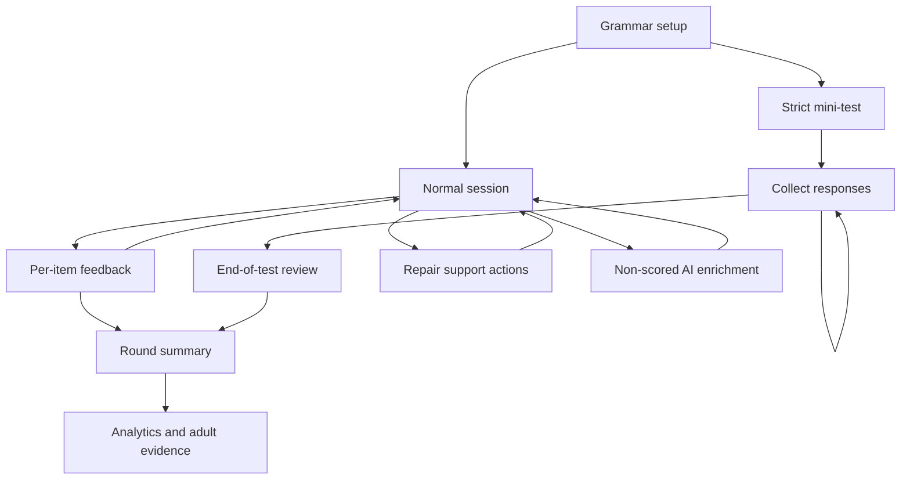
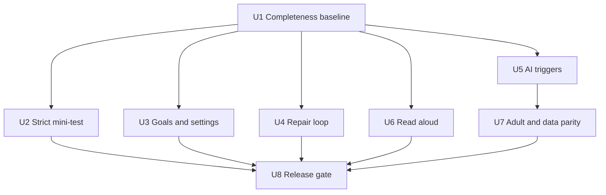

# feat: Grammar Functionality Completeness

## Overview

Complete the remaining learner-facing Grammar functionality gaps after the production Grammar rollout. The current implementation is a real Worker-owned Grammar subject: it has the reviewed legacy content denominator, all eight legacy mode ids enabled, deterministic marking, redacted read models, analytics, rewards, Bellstorm bridge copy, and a non-scored AI enrichment safe lane. It is not yet feature-complete against the legacy HTML experience.

This plan intentionally starts a new completeness line instead of reopening the shipped Grammar mastery region plan. The source plan is now a live checklist for what has landed; this plan is the implementation map for the remaining Grammar-only functionality parity work.

Current gap matrix:

| Legacy Grammar capability | Current production state | Completeness target |
|---|---|---|
| Strict KS2-style mini-test | `satsset` exists, but behaves like the generic per-item feedback loop | Add true delayed feedback, timer, mini-paper navigation, finish action, and end review. |
| Session goals | Round length exists | Add time goal, fixed question goal, and clear-due goal semantics without corrupting mastery evidence. |
| In-session repair tools | Worked/faded exist as modes; retry queue exists internally | Add explicit retry, worked solution, faded support, and built-in similar problem actions inside a session. |
| AI learner/adult workflow | Safe lane exists and read model can render enrichment | Add visible triggers for explanation, revision cards, safe drill suggestions, and parent summary drafts. |
| Read aloud | Not present in Grammar React UI | Add client-side read aloud and speech-rate preference as an assistive feature only. |
| Legacy settings and data surfaces | Platform replaces learner/localStorage authority | Preserve platform-owned learner data while exposing or documenting Grammar-specific settings, reporting, import/export expectations, and rejected legacy localStorage/API-key behaviours. |
| Completeness claim | Existing tests prove the current Worker slice | Add a durable completeness baseline and production smoke coverage for the newly completed behaviours. |

---

## Problem Frame

James wants Grammar to be fully responsible as a real product path, not merely a Worker-backed quiz surface. The shipped implementation correctly prioritised production safety and deterministic authority, but several legacy learning workflows are still missing or only partially represented. The risk is overclaiming Grammar as complete while learners lose the strict test workflow, support/repair loop, read-aloud affordance, and adult-facing summary workflow that made the legacy prototype useful.

The plan preserves the current production boundary: React can render controls and collect intent, but scored selection, marking, support-level changes, session completion, mastery mutation, analytics, and reward projection remain Worker-owned.

---

## Requirements Trace

- R1. Complete Grammar-only functionality gaps against the reviewed legacy HTML donor without touching Punctuation scope.
- R2. Preserve the current full Grammar denominator: 18 concepts, 51 deterministic templates, 31 selected-response templates, 20 constructed-response templates, and the eight legacy mode ids.
- R3. Keep deterministic Worker authority for all scored practice, support-level scoring, session completion, mastery mutation, retry queues, analytics, and reward projection.
- R4. Add a true strict mini-test experience for `satsset`: fixed set, no pre-answer hints/support, delayed marking, timer, navigation, finish action, and end-of-test review.
- R5. Add legacy session-goal semantics: timed practice, fixed question goal, and clear-due review.
- R6. Restore the learner repair loop: retry current question, show worked solution, use faded support, and load a built-in similar problem without leaking answers before a first attempt.
- R7. Restore the useful AI workflow as server-side, non-scored enrichment triggers only; AI must not author scored questions or mark scored answers.
- R8. Restore Grammar read aloud as a browser assistive feature that never changes scoring or server state beyond safe preferences.
- R9. Clarify which legacy profile/data/settings behaviours are replaced by the platform, which are intentionally rejected, and which Grammar-specific settings must be exposed.
- R10. Add a durable completeness baseline, focused tests, and production smoke coverage so future changes cannot silently regress these behaviours.
- R11. Do not regress English Spelling parity, existing Grammar content/redaction guarantees, learner switching, import/export restoration, remote sync, reward projection, or production bundle lockdown.

**Origin actors:** A1 KS2 learner, A2 Parent or supervising adult, A3 Grammar subject engine, A4 Game and reward layer, A5 Platform runtime.

**Origin flows:** F1 Grammar practice without game dependency, F2 Monster progress as a derived reward, F3 Adult-facing evidence.

**Origin acceptance examples:** AE1 due review blocks monster progress, AE2 supported correctness gives lower gain, AE3 AI drill uses deterministic templates, AE4 parent report separates education evidence from rewards.

---

## Scope Boundaries

- Only Grammar is in scope. Do not add Punctuation functionality or change Bellstorm Coast beyond preserving the existing Grammar bridge copy.
- Do not serve the legacy single-file HTML or reintroduce browser-local scoring authority.
- Do not store learner AI keys in the browser or call providers directly from React.
- Do not let AI write score-bearing Grammar items, hidden answers, rubrics, or marking logic.
- Do not rebuild learner CRUD or localStorage import/export inside the Grammar surface if the platform already owns that responsibility.
- Do not convert paragraph-level writing transfer placeholders into scored writing assessment in this plan.
- Do not alter the Grammar content denominator unless a separate reviewed content-release plan explicitly changes it.
- Do not change Cloudflare deployment authentication strategy or introduce raw Wrangler operations.

### Deferred to Follow-Up Work

- Live third-party AI provider integration may remain behind existing server-side enrichment stubs if provider configuration is not available during implementation.
- Paragraph-level writing transfer remains non-scored and "coming next".
- A Grammar content CMS remains out of scope.

---

## Context & Research

### Relevant Code and Patterns

- `docs/brainstorms/2026-04-24-grammar-mastery-region-requirements.md` is the product source of truth for Grammar scope, Worker authority, and AI limits.
- `docs/plans/2026-04-24-001-feat-grammar-mastery-region-plan.md` records the shipped Grammar line and the current live checklist.
- `worker/src/subjects/grammar/engine.js` owns modes, template selection, support-level scoring, retry queue, session state, summary, and AI enrichment application.
- `worker/src/subjects/grammar/commands.js` is the Worker subject command boundary that should remain the only production mutation path.
- `worker/src/subjects/grammar/read-models.js` is the browser-visible allowlist and redaction boundary.
- `src/subjects/grammar/module.js` maps React actions to Grammar commands and local subject state.
- `src/subjects/grammar/components/GrammarSetupScene.jsx`, `GrammarSessionScene.jsx`, `GrammarSummaryScene.jsx`, and `GrammarAnalyticsScene.jsx` are the current React surfaces to extend.
- `worker/src/subjects/grammar/ai-enrichment.js` already validates non-scored AI enrichment output and rejects score-bearing content.
- `tests/grammar-engine.test.js`, `tests/worker-grammar-subject-runtime.test.js`, `tests/react-grammar-surface.test.js`, and `tests/grammar-production-smoke.test.js` are the focused test foundations to extend.
- `scripts/grammar-production-smoke.mjs` is the production API-contract smoke pattern; it should continue to derive answers from production-visible options and scan start, feedback, and summary read models for forbidden fields.
- `src/platform/hubs/parent-read-model.js`, `src/platform/hubs/admin-read-model.js`, `src/surfaces/hubs/ParentHubSurface.jsx`, and `src/surfaces/hubs/AdminHubSurface.jsx` are the adult reporting surfaces to extend carefully.
- `src/platform/core/repositories/persistence.js` and `tests/persistence.test.js` are the persistence/import/export guardrail areas.

### Institutional Learnings

- Grammar production smoke should behave like an API-contract test, not a local oracle shortcut: use production-visible options and scan all phase read models for forbidden server-only fields.
- Multi-worktree review work can lack local dependencies; React surface verification may need the existing dependency root while keeping source changes in the clean worktree.
- Build-sensitive checks should run sequentially because public output directories can collide.
- Project instructions require `npm test` and `npm run check` before deployment, and production UI verification for user-facing changes.

### External References

- External research is not needed. The work is dominated by local parity, Worker command contracts, React surfaces, and existing subject-runtime patterns.

---

## Key Technical Decisions

- **Completeness is measured against behaviour, not labels:** Having a `satsset` mode id is not enough; the strict test workflow must match the legacy delayed-feedback semantics.
- **Worker owns anything that affects learning evidence:** Repair actions, support escalation, retry, mini-test completion, goal fulfilment, and AI drill suggestions all route through Worker commands or read models when they can affect state.
- **Read aloud stays client-assistive:** Speech synthesis reads the visible prompt/support/feedback and never affects mastery, events, rewards, or correctness.
- **Legacy localStorage and browser API keys are rejected behaviours:** The plan should document replacement paths instead of recreating them.
- **Characterise first:** Every missing legacy workflow gets a repo-local baseline or explicit test before implementation changes.
- **Keep UI triggers thin:** React exposes controls and form state; Worker responses decide whether support, feedback, review, or AI content is available.

---

## Open Questions

### Resolved During Planning

- **Should Punctuation be included?** No. James clarified this is Grammar only.
- **Should learner CRUD/import/export be rebuilt inside Grammar?** No. Platform learner and persistence flows remain authoritative; Grammar should document and verify the replacement behaviour.
- **Should legacy browser AI key storage return?** No. AI remains server-side and non-scored.
- **Should read aloud require Worker support?** No. It reads visible content and stores only safe preferences if needed.

### Deferred to Implementation

- **Exact AI provider availability:** If no live provider configuration exists, implementation should keep deterministic fixture/stub enrichment and still ship visible non-scored triggers behind the existing safe lane.
- **Exact copy and keyboard shortcut layout:** Final wording and responsive layout should be validated with the React surface tests and browser smoke.

---

## High-Level Technical Design

> This illustrates the intended approach and is directional guidance for review, not implementation specification. The implementing agent should treat it as context, not code to reproduce.

---

## Implementation Units

- U1. **Create the Grammar Completeness Baseline**

**Goal:** Convert the reviewed legacy functionality audit into a durable repo-local baseline that distinguishes completed, planned, replaced, and rejected behaviours.

**Requirements:** R1, R2, R9, R10

**Dependencies:** None.

**Files:**
- Create: `tests/fixtures/grammar-functionality-completeness/legacy-baseline.json`
- Create: `tests/grammar-functionality-completeness.test.js`
- Create: `docs/grammar-functionality-completeness.md`
- Modify: `docs/plans/2026-04-24-001-feat-grammar-mastery-region-plan.md`

**Approach:**
- Record legacy modes, controls, session goals, mini-test behaviours, repair actions, AI actions, settings, analytics/reporting surfaces, and rejected single-file/browser-local behaviours as data.
- Compare the baseline against current Grammar capabilities and assign each row an owner unit or a replacement/rejection rationale.
- Treat current full content coverage, Worker command boundary, analytics, rewards, Bellstorm bridge, and AI safe-lane validation as completed foundations.
- Keep the baseline portable. It should not depend on an absolute path to the local legacy donor.

**Execution note:** Start with characterization coverage before modifying product behaviour.

**Patterns to follow:**
- `tests/fixtures/grammar-legacy-oracle/legacy-baseline.json`
- `tests/grammar-engine.test.js`
- `docs/plans/2026-04-24-002-feat-punctuation-legacy-parity-plan.md`

**Test scenarios:**
- Happy path: the baseline records all eight legacy Grammar mode ids and current production reports all eight as enabled.
- Happy path: the baseline records 18 concepts and 51 templates and current content still matches that denominator.
- Edge case: a legacy row marked `planned` must name exactly one owner unit in this plan.
- Edge case: rejected rows include browser-local scoring, browser-held AI keys, and single-file HTML routing.
- Regression: if a future change removes a completed capability row, the completeness test fails with the missing row name.

**Verification:**
- The plan has a machine-readable checklist that prevents future "complete" claims from drifting away from actual Grammar behaviours.

---

- U2. **Implement True Strict Mini-Test Mode**

**Goal:** Make `satsset` behave like a strict KS2-style mini-paper rather than a normal round with per-item feedback.

**Requirements:** R3, R4, R10, R11, AE1

**Dependencies:** U1.

**Files:**
- Modify: `worker/src/subjects/grammar/engine.js`
- Modify: `worker/src/subjects/grammar/commands.js`
- Modify: `worker/src/subjects/grammar/read-models.js`
- Modify: `src/subjects/grammar/module.js`
- Modify: `src/subjects/grammar/components/GrammarSetupScene.jsx`
- Modify: `src/subjects/grammar/components/GrammarSessionScene.jsx`
- Modify: `src/subjects/grammar/components/GrammarSummaryScene.jsx`
- Test: `tests/grammar-engine.test.js`
- Test: `tests/worker-grammar-subject-runtime.test.js`
- Test: `tests/react-grammar-surface.test.js`

**Approach:**
- Represent mini-test state separately from normal `session -> feedback -> continue` flow so answers can be saved without item-by-item marking feedback.
- Add mini-test set size, timer metadata, current index, saved responses, completion state, aggregate score, and per-question review read model.
- Preserve the legacy set-size and timing shape: 8 or 12 questions, with a time limit of at least 6 minutes and otherwise roughly 54 seconds per available mark.
- Treat Worker timestamps as authoritative for started/finished state and timer expiry; React may display the countdown but must not be the source of truth for completion.
- Block worked/faded support, AI explanation, and answer-revealing repair actions while the mini-test is active and unfinished.
- Allow navigation between unanswered/answered mini-test items and an explicit finish action that marks the whole set.
- Preserve mastery mutation through deterministic marking only, ideally at finish time so delayed feedback remains true.

**Patterns to follow:**
- Existing `buildGrammarMiniSet` coverage in `worker/src/subjects/grammar/engine.js`
- `tests/grammar-engine.test.js`
- Legacy strict-test semantics captured in U1

**Test scenarios:**
- Happy path: starting `satsset` creates a fixed mini-test with safe browser-visible prompts and no feedback payload before finish.
- Happy path: selecting 8 or 12 questions creates the requested mini-test size and exposes the expected timer metadata.
- Happy path: saving responses across multiple items preserves each response and allows navigation before finish.
- Happy path: finishing the mini-test marks every saved response, updates mastery once per answered item, emits session summary, and renders an end review.
- Edge case: an unanswered mini-test item appears as unanswered in review and does not invent a correct response.
- Edge case: timer expiry finishes the set through the same marking path as manual finish.
- Edge case: stale or client-tampered timer values cannot extend an expired mini-test on the Worker.
- Error path: support or AI commands during an unfinished strict mini-test fail closed without mutating mastery.
- Integration: React mini-test UI shows timer, progress, navigation, finish action, and final review without exposing hidden answer fields.

**Verification:**
- `satsset` behaves as a strict mini-paper: no early feedback, no early support, and full end-of-test review after deterministic marking.

---

- U3. **Restore Session Goals and Practice Settings**

**Goal:** Restore legacy goal semantics and safe Grammar-specific practice settings without returning to browser-local authority.

**Requirements:** R3, R5, R9, R10, R11

**Dependencies:** U1.

**Files:**
- Modify: `worker/src/subjects/grammar/engine.js`
- Modify: `worker/src/subjects/grammar/read-models.js`
- Modify: `src/subjects/grammar/metadata.js`
- Modify: `src/subjects/grammar/module.js`
- Modify: `src/subjects/grammar/components/GrammarSetupScene.jsx`
- Modify: `src/subjects/grammar/components/GrammarAnalyticsScene.jsx`
- Test: `tests/grammar-engine.test.js`
- Test: `tests/worker-grammar-subject-runtime.test.js`
- Test: `tests/react-grammar-surface.test.js`

**Approach:**
- Add a goal model that distinguishes fixed question count, timed practice, and clear-due review.
- Keep round length as the existing low-friction default, but expose goal selection where it changes session termination behaviour.
- Add `allowTeachingItems` as a Smart Review preference only if Worker selection can safely inject worked/faded support without answer leakage and with support-aware scoring.
- Add `showDomainBeforeAnswer` as a safe display preference that affects read model/UI only.
- Store preferences through Grammar subject prefs and normalisation, not browser localStorage.

**Patterns to follow:**
- `worker/src/subjects/grammar/engine.js` prefs normalisation
- `src/subjects/grammar/components/GrammarSetupScene.jsx`
- `tests/react-grammar-surface.test.js`

**Test scenarios:**
- Happy path: fixed question goal ends after the configured number of answered items and produces the expected summary.
- Happy path: timed goal exposes elapsed/remaining time and can end the round without corrupting answered/correct counts.
- Happy path: clear-due goal keeps selecting due/retry items until no eligible due items remain or a safe cap is reached.
- Edge case: clear-due with no due items starts a normal safe review or shows a clear empty state without looping.
- Edge case: disabling teaching items prevents Smart Review from injecting worked/faded support.
- Regression: `showDomainBeforeAnswer` changes visible chips/copy only and does not alter scoring.

**Verification:**
- Learners can choose legacy-shaped session goals and settings while Worker state remains the source of truth.

---

- U4. **Restore the In-Session Repair Loop**

**Goal:** Restore the legacy learner repair affordances inside a session while preserving no-leak and support-aware mastery rules.

**Requirements:** R3, R6, R10, R11, AE2

**Dependencies:** U1, U3 for optional Smart Review support injection.

**Files:**
- Modify: `worker/src/subjects/grammar/engine.js`
- Modify: `worker/src/subjects/grammar/commands.js`
- Modify: `worker/src/subjects/grammar/read-models.js`
- Modify: `src/subjects/grammar/module.js`
- Modify: `src/subjects/grammar/components/GrammarSessionScene.jsx`
- Test: `tests/grammar-engine.test.js`
- Test: `tests/worker-grammar-subject-runtime.test.js`
- Test: `tests/react-grammar-surface.test.js`

**Approach:**
- Add explicit commands/actions for retry current question, show worked solution after it is safe, use faded support, and start a built-in similar problem.
- Treat support escalation as stateful metadata so a later correct answer receives supported scoring rather than independent first-attempt scoring.
- Keep answer-revealing worked content hidden until after a submitted attempt, unless the learner is in the explicit `worked` mode where the current no-leak guidance rules already apply.
- Use built-in similar problem generation from deterministic templates and seeds; do not let AI create score-bearing variants.
- Add keyboard shortcut support only after the visible button flows are stable.

**Patterns to follow:**
- Existing support guidance redaction in `worker/src/subjects/grammar/read-models.js`
- Existing retry queue behaviour in `worker/src/subjects/grammar/engine.js`
- Existing React action dispatch pattern in `src/subjects/grammar/module.js`

**Test scenarios:**
- Happy path: after an incorrect answer, retry keeps the same learning target, increments attempts safely, and does not double-count mastery for an unsubmitted retry.
- Happy path: show worked solution after marking renders safe solution guidance and marks later progress as supported if the same item is retried.
- Happy path: faded support can be requested before a second attempt without revealing the current answer.
- Happy path: built-in similar problem creates a deterministic new item in the same concept/template family and marks independently.
- Edge case: repair actions are unavailable in unfinished strict mini-test mode.
- Error path: requesting worked/faded support for a stale session returns a contained Grammar error and no mutation.
- Integration: React buttons appear only in valid phases and remain disabled in read-only runtime.

**Verification:**
- Learners can recover from mistakes in the legacy style without creating false mastery or hidden-answer leaks.

---

- U5. **Expose AI Enrichment Triggers and Parent Summary Drafts**

**Goal:** Make the existing AI safe lane usable from the Grammar product while keeping all AI output non-scored and server-validated.

**Requirements:** R3, R7, R10, R11, AE3, AE4

**Dependencies:** U1, U4.

**Files:**
- Modify: `worker/src/subjects/grammar/ai-enrichment.js`
- Modify: `worker/src/subjects/grammar/commands.js`
- Modify: `worker/src/subjects/grammar/read-models.js`
- Modify: `src/subjects/grammar/module.js`
- Modify: `src/subjects/grammar/components/GrammarSessionScene.jsx`
- Modify: `src/subjects/grammar/components/GrammarAnalyticsScene.jsx`
- Modify: `src/platform/hubs/parent-read-model.js`
- Modify: `src/surfaces/hubs/ParentHubSurface.jsx`
- Test: `tests/worker-grammar-subject-runtime.test.js`
- Test: `tests/react-grammar-surface.test.js`
- Test: `tests/grammar-production-smoke.test.js`
- Test: `tests/hub-read-models.test.js`
- Test: `tests/react-hub-surfaces.test.js`

**Approach:**
- Add visible learner controls for explanation and revision cards where the current item/session phase permits enrichment.
- Add a parent summary draft trigger from analytics/adult evidence, with deterministic fallback text if provider-backed enrichment is unavailable.
- Keep AI responses behind `request-ai-enrichment` and the existing validator; reject score-bearing fields, hidden answers, unknown template ids, and malformed output.
- Distinguish "safe drill suggestion" from "start scored drill": AI may reference reviewed deterministic template ids, but the Worker still starts any scored follow-up through normal Grammar commands.
- Ensure parent/adult surfaces consume a redacted summary rather than raw answer history or hidden feedback internals.

**Patterns to follow:**
- `worker/src/subjects/grammar/ai-enrichment.js`
- `tests/grammar-production-smoke.test.js`
- `src/platform/hubs/parent-read-model.js`

**Test scenarios:**
- Happy path: explanation trigger returns non-scored enrichment and does not mutate mastery, session progress, or rewards.
- Happy path: revision-card trigger renders safe card content and deterministic drill template references only.
- Happy path: parent summary draft uses concept status, due/weak concepts, misconception patterns, and recent activity without exposing hidden answers.
- Error path: AI output containing a scored question, answer key, rubric, or unknown template id is rejected and practice still works.
- Error path: provider unavailable returns a contained enrichment failure or deterministic fallback, not a crashed Grammar scene.
- Integration: production smoke scans enrichment-bearing read models for forbidden fields across start, feedback, and summary phases.

**Verification:**
- AI is visible and useful again, but remains enrichment-only and cannot become scoring authority.

---

- U6. **Add Grammar Read Aloud and Speech Preference**

**Goal:** Restore the legacy read-aloud affordance as a safe client-side accessibility feature.

**Requirements:** R8, R9, R10, R11

**Dependencies:** U1.

**Files:**
- Create: `src/subjects/grammar/speech.js`
- Modify: `worker/src/subjects/grammar/engine.js`
- Modify: `src/subjects/grammar/module.js`
- Modify: `src/subjects/grammar/components/GrammarSessionScene.jsx`
- Modify: `src/subjects/grammar/components/GrammarSetupScene.jsx`
- Modify: `worker/src/subjects/grammar/read-models.js`
- Create: `tests/grammar-speech.test.js`
- Test: `tests/grammar-engine.test.js`
- Test: `tests/worker-grammar-subject-runtime.test.js`
- Test: `tests/react-grammar-surface.test.js`

**Approach:**
- Build a small client-side helper that extracts safe visible text from the current Grammar read model and calls browser speech synthesis when available.
- Store speech rate as a safe Grammar preference or local UI preference; it must not affect scoring, scheduling, mastery, or events.
- Render a contained unavailable state when the browser lacks speech synthesis.
- Include the prompt, check line, visible options, and visible feedback/support; do not read hidden answers before they are visible.

**Patterns to follow:**
- Existing React component action/disabled-state patterns in `src/subjects/grammar/components/GrammarSessionScene.jsx`
- Existing preference normalisation in `worker/src/subjects/grammar/read-models.js`

**Test scenarios:**
- Happy path: read aloud receives visible prompt and option text for a selected-response item.
- Happy path: speech rate preference is clamped to the supported range and survives reload/normalisation.
- Edge case: read aloud before a session starts is disabled or reads only non-sensitive setup copy.
- Edge case: strict mini-test read aloud does not include hidden answer or feedback text before finish.
- Error path: no `speechSynthesis` support shows a contained unavailable state and does not dispatch a Worker scoring command.
- Regression: read-aloud actions do not change Grammar mastery, events, rewards, or summaries.

**Verification:**
- Grammar read aloud is restored as an accessibility affordance without changing any learning evidence.

---

- U7. **Complete Adult Reporting and Data-Replacement Parity**

**Goal:** Close the gap between legacy Profiles/Data/Settings and the current platform by exposing the right Grammar evidence and explicitly documenting replaced behaviours.

**Requirements:** R3, R7, R9, R10, R11, AE4

**Dependencies:** U1, U3, U5.

**Files:**
- Modify: `src/platform/hubs/parent-read-model.js`
- Modify: `src/platform/hubs/admin-read-model.js`
- Modify: `src/surfaces/hubs/ParentHubSurface.jsx`
- Modify: `src/surfaces/hubs/AdminHubSurface.jsx`
- Modify: `src/platform/core/repositories/persistence.js`
- Modify: `docs/grammar-functionality-completeness.md`
- Test: `tests/hub-read-models.test.js`
- Test: `tests/react-hub-surfaces.test.js`
- Test: `tests/persistence.test.js`

**Approach:**
- Expand adult evidence to include Grammar concept status, due/weak concepts, question-type weakness, misconception patterns, recent activity, and parent summary drafts.
- Verify platform import/export/restore preserves Grammar subject state and preferences, rather than recreating legacy localStorage buttons inside Grammar.
- Document legacy behaviours as `replaced` when the platform already owns them: learner create/rename/delete, all-app import/export, remote sync, and reset flows.
- Keep rejected behaviours explicit: browser API keys, localStorage authority, and direct HTML-file persistence.
- Avoid exposing raw learner response text beyond existing platform policy.

**Patterns to follow:**
- `src/platform/hubs/parent-read-model.js`
- `src/surfaces/hubs/ParentHubSurface.jsx`
- `tests/persistence.test.js`

**Test scenarios:**
- Happy path: Parent Hub shows Grammar secured, due, weak, recent activity, and misconception evidence before reward framing.
- Happy path: Admin Hub can summarise Grammar evidence without importing server-only engine content.
- Happy path: export/import or restore keeps Grammar prefs, current safe read model, and evidence snapshots consistent.
- Edge case: malformed restored Grammar state normalises to safe defaults and does not crash adult surfaces.
- Error path: parent summary draft unavailable still leaves deterministic adult evidence visible.
- Regression: Spelling parent/admin fields remain unchanged.

**Verification:**
- Adult-facing Grammar evidence is complete enough to replace the legacy Profiles/Data tab without restoring legacy localStorage authority.

---

- U8. **Add Functionality Completeness Release Gate**

**Goal:** Make the completed Grammar functionality independently verifiable before claiming the product is legacy-complete.

**Requirements:** R1, R2, R3, R10, R11

**Dependencies:** U2, U3, U4, U5, U6, U7.

**Files:**
- Modify: `scripts/grammar-production-smoke.mjs`
- Modify: `tests/grammar-production-smoke.test.js`
- Modify: `tests/browser-react-migration-smoke.test.js`
- Modify: `tests/build-public.test.js`
- Modify: `docs/grammar-functionality-completeness.md`
- Modify: `docs/plans/2026-04-24-001-feat-grammar-mastery-region-plan.md`
- Test: `tests/grammar-functionality-completeness.test.js`
- Test: `tests/grammar-engine.test.js`
- Test: `tests/worker-grammar-subject-runtime.test.js`
- Test: `tests/react-grammar-surface.test.js`

**Approach:**
- Extend the completeness baseline so every planned legacy behaviour is either passing, replaced, or explicitly rejected.
- Extend production smoke to exercise representative strict mini-test, support/repair, AI enrichment, and redaction paths without depending on hidden local answers.
- Keep bundle/public-output audit strict: no Worker Grammar engine/content authority, oracle extraction helpers, hidden answers, or fixture-only donor material in the browser bundle.
- Update Grammar documentation and the live checklist only when verification evidence supports the completeness claim.
- Preserve production UI/manual verification expectations for user-facing flows.

**Patterns to follow:**
- `scripts/grammar-production-smoke.mjs`
- `tests/grammar-production-smoke.test.js`
- `tests/build-public.test.js`
- `docs/plans/2026-04-24-001-feat-grammar-mastery-region-plan.md`

**Test scenarios:**
- Happy path: completeness baseline reports all owner-unit behaviours as completed after implementation.
- Happy path: production smoke derives answers from production-visible options for normal and strict-review paths.
- Happy path: smoke can request AI enrichment and confirm it is non-scored and redacted.
- Error path: forbidden keys in mini-test review, support guidance, feedback, summary, or AI enrichment fail the smoke.
- Regression: browser bundle/public output does not include Worker Grammar engine/content authority or donor fixture internals.
- Integration: browser migration smoke covers setup, mini-test, repair controls, AI enrichment panel, read aloud disabled/unavailable state, summary, and adult evidence link.

**Verification:**
- Grammar can be labelled functionality-complete only when the baseline, focused tests, bundle audit, and production smoke agree.

---

## System-Wide Impact

- **Interaction graph:** The work touches Grammar Worker commands, engine state, read models, React subject scenes, parent/admin hubs, persistence normalisation, production smoke, and bundle audit.
- **Error propagation:** Worker command errors remain contained inside Grammar read models and React error panels; React must not fall back to local scoring.
- **State lifecycle risks:** Mini-test saved responses, timer expiry, repair support metadata, AI enrichment, learner switching, import/export restore, stale revisions, and command replay all need explicit tests.
- **API surface parity:** New Grammar commands should follow the existing subject command route, request id, expected revision, and read-model response conventions.
- **Integration coverage:** Unit tests alone are insufficient because the gaps cross Worker commands, React rendering, platform hubs, and production smoke.
- **Unchanged invariants:** Spelling parity, Grammar denominator, Punctuation subject identity, Monster Codex reward derivation, Cloudflare deployment scripts, and bundle lockdown remain unchanged.

---

## Risks & Dependencies

| Risk | Likelihood | Impact | Mitigation |
|------|------------|--------|------------|
| `satsset` remains label-complete but not behaviour-complete | Medium | High | U2 separates strict mini-test state and requires delayed-feedback tests. |
| Repair actions leak answers before an independent attempt | Medium | High | U4 routes support through Worker read models and no-leak tests. |
| Supported attempts inflate mastery | Medium | High | U3/U4 preserve support-level scoring and tests for lower gains. |
| AI enrichment becomes hidden scoring authority | Medium | High | U5 keeps AI non-scored, validates output, and smoke-tests redaction. |
| Read aloud accidentally reads hidden answers | Low | Medium | U6 reads only visible read-model text and tests strict mini-test phases. |
| Platform replacement for legacy data surfaces is ambiguous | Medium | Medium | U7 documents replaced/rejected behaviours and adds persistence/hub tests. |
| Release-gate drift after multiple small PRs | Medium | High | U8 turns the gap matrix into a durable completeness gate. |

---

## Documentation / Operational Notes

- Keep James-facing chat in Hong Kong Cantonese, but plan text, product copy, code comments, and docs in UK English.
- Update `docs/grammar-functionality-completeness.md` as the source for what is completed, replaced, rejected, or deferred.
- Update the existing Grammar live checklist only when a completed unit has landed and verification evidence exists.
- Production deployment remains behind the existing package-script gates and logged-in or demo-backed production UI verification.
- Do not add raw Wrangler commands or browser-held AI key workflows.

---

## Alternative Approaches Considered

- **Declare current Grammar complete because all eight mode ids exist:** Rejected. Behavioural parity matters; strict mini-test, repair loop, read aloud, and AI triggers are not complete enough.
- **Copy the legacy single-file UI into React wholesale:** Rejected. It would reintroduce browser-local assumptions and weaken Worker authority.
- **Fold this into the Punctuation parity plan:** Rejected. James clarified this is Grammar only, and Punctuation has its own path.
- **Make AI provider integration a blocker:** Rejected. The product can complete visible non-scored AI workflows with deterministic or server-configured enrichment while keeping provider availability as an implementation-time dependency.

---

## Sources & References

- Origin document: `docs/brainstorms/2026-04-24-grammar-mastery-region-requirements.md`
- Source plan: `docs/plans/2026-04-24-001-feat-grammar-mastery-region-plan.md`
- Related production smoke: `scripts/grammar-production-smoke.mjs`
- Related tests: `tests/grammar-engine.test.js`, `tests/worker-grammar-subject-runtime.test.js`, `tests/react-grammar-surface.test.js`, `tests/grammar-production-smoke.test.js`
