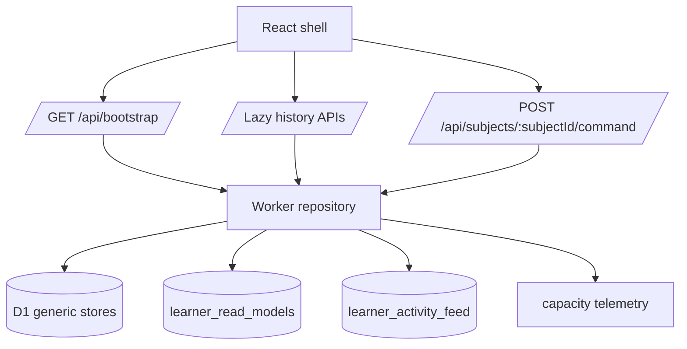
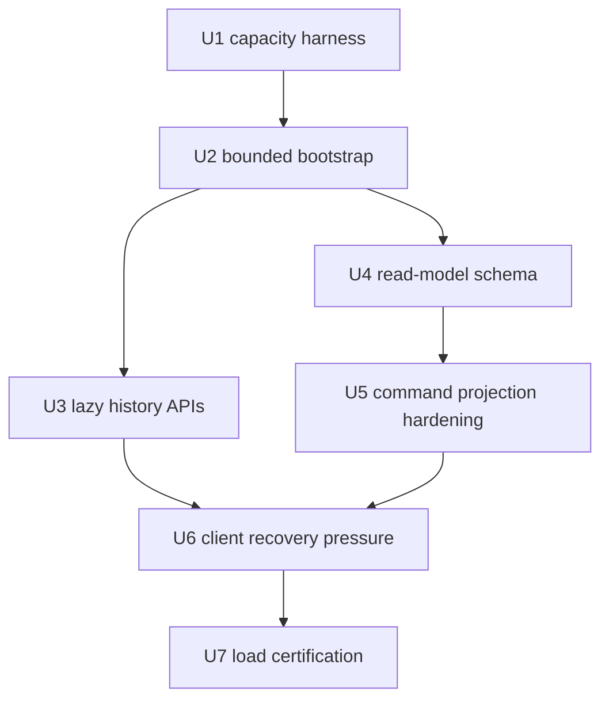
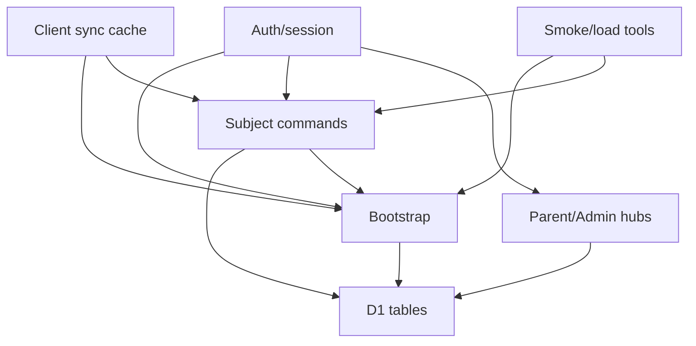

# fix: Bound Bootstrap CPU and Capacity Surfaces

## Overview

Turn the Cloudflare Worker / D1 capacity analysis in the origin document into a production hardening plan for KS2 Mastery. The immediate goal is to make `/api/bootstrap` and subject command responses bounded, measurable, and safe on the Workers Free CPU target. The longer-term goal is to support classroom-style concurrent learners through constant-size bootstrap payloads, lazy history reads, precomputed read models, and measured load certification.

This plan treats the Free tier estimates as planning targets, not guarantees. The implementation must prove them with high-history fixtures, production bootstrap smoke checks, and classroom-shaped load tests before James uses them as capacity claims.

---

## Problem Frame

The origin document identifies the real bottleneck as Worker CPU and D1 query work on high-history accounts, especially `/api/bootstrap` and command projection paths that read, parse, redact, normalise, and serialise historical `practice_sessions` and `event_log` data. The current repository confirms that `bootstrapBundle()` reads all practice sessions and all events for every writable learner in the bootstrap bundle, and `readLearnerProjectionBundle()` reads all learner events for command projection.

The product need is simple: learners should be able to continue practising without losing progress or seeing 503s, even when a whole class opens or reloads the app. The engineering response is to make the hot paths small and predictable, not to rely on a paid plan to mask an unbounded architecture.

---

## Requirements Trace

- R1. Reproduce and guard the high-history bootstrap failure mode with deterministic local fixtures and production-safe smoke checks.
- R2. Make production `/api/bootstrap` constant-size with explicit caps for historical sessions, events, and response bytes.
- R3. Preserve the existing authenticated Worker ownership, demo-expiry, mutation, idempotency, and public redaction boundaries.
- R4. Move historical learner sessions and activity away from bootstrap into authorised, paginated, lazy-loaded routes.
- R5. Introduce persistent learner read models and a public activity feed so normal reads do not rebuild UI state from full event history.
- R6. Harden subject command projection so common commands do not scan full `event_log`, especially no-op, replay, preference, and answer-transition paths.
- R7. Keep Spelling, Grammar, and Punctuation on the existing Worker subject command/read-model spine; do not reintroduce browser-owned production engines.
- R8. Add request-level capacity telemetry for endpoint, wall time, response bytes, D1 rows read/written when available, bounded counts, and failure mode.
- R9. Reduce client retry amplification: stale revision recovery, bootstrap fallback, and multi-tab behaviour must not turn one CPU failure into repeated full bootstraps.
- R10. Certify classroom readiness with synthetic history, cold-bootstrap burst, and human-paced learner load tests before making capacity claims.
- R11. Keep Cloudflare operations on the existing package-script deployment path and production audit posture.

---

## Scope Boundaries

- Do not solve capacity by requiring Workers Paid as the only fix. Paid can be a rollout safety margin, but hot paths still need bounded work.
- Do not add school/class D1 sharding in the first pass; measure single-database behaviour before splitting tenants.
- Do not build a full analytics warehouse, reporting redesign, or teacher dashboard in this plan.
- Do not move production subject scoring, queue selection, or reward mutation back into the browser.
- Do not expose raw private spelling state, answer-bearing runtime fields, or full historical event payloads through public read models.
- Do not replace the existing mutation receipt and `state_revision` compare-and-swap model.

### Deferred to Follow-Up Work

- Per-school, per-class, or per-account D1 sharding: decide only after single-database load testing shows D1 queue pressure.
- Heavy analytics/offline reporting: add later through async read models or exports once hot-path read models are stable.
- Formal SLO dashboards in an external observability tool: this plan should emit structured data and document thresholds; external dashboard build-out can follow.
- Workers Paid migration: decide after bounded hot paths and measured Free-tier behaviour are known.

---

## Context & Research

### Relevant Code and Patterns

- `AGENTS.md` requires Hong Kong Cantonese chat, UK English writing/code, package scripts for Cloudflare operations, and extra care around remote sync, learner state, D1, R2, and deployment paths.
- `package.json` routes deploy/check/migration through OAuth-safe package scripts and contains `audit:production`, `smoke:production:punctuation`, and `verify` patterns.
- `wrangler.jsonc` uses Worker assets, D1 `DB`, R2 `SPELLING_AUDIO_BUCKET`, `LEARNER_LOCK`, production vars, and enabled observability.
- `worker/README.md` defines the production Worker as the authority for sessions, learner access, subject commands, read models, protected audio, Parent Hub, Admin / Operations, and mutation safety.
- `worker/src/app.js` routes `GET /api/bootstrap`, subject commands, demo reset, hub reads, and production public read-model behaviour.
- `worker/src/repository.js` currently builds bootstrap from all writable learner rows, all matching `practice_sessions`, all matching `event_log`, subject state, game state, and published monster visual config.
- `worker/src/repository.js` also exposes `readLearnerProjectionBundle()`, which reads all learner game rows and all learner event rows before command projection.
- `worker/src/subjects/spelling/commands.js` shows the current command pattern: read runtime, run engine, read projection state, project rewards, build read model, and persist runtime writes.
- `worker/src/projections/events.js` dedupes against existing events, which is why replacing full-history scans needs an explicit recent-window or token strategy.
- `worker/migrations/0002_saas_foundation.sql` and `worker/migrations/0006_operating_surfaces.sql` already define the generic tables and basic indexes for `practice_sessions` and `event_log`.
- `tests/worker-backend.test.js`, `tests/worker-hubs.test.js`, `tests/worker-projections.test.js`, `tests/persistence.test.js`, and `tests/helpers/worker-server.js` are the right test surfaces for bootstrap, hub, command projection, client sync, and D1-backed Worker behaviour.
- `scripts/production-bundle-audit.mjs` is the existing production-audit style to mirror for a high-history bootstrap probe.

### Institutional Learnings

- Prior ks2-mastery release-gate work used deterministic Node/HTTP checks when browser tooling was flaky; this plan should keep that posture for capacity validation.
- Production bundle audit is already a strong repo-specific release gate, but it does not prove high-history bootstrap behaviour.
- No `docs/solutions/` directory exists in this checkout, so institutional learnings come from current repo docs, tests, and recent ks2-mastery release-gate work.

### External References

- Cloudflare Workers limits currently document 100,000 requests/day on Free, 10 ms CPU per HTTP request on Free, no general requests-per-second limit, and Error 1102 for exceeded CPU.
- Cloudflare D1 limits currently document that each D1 database is single-threaded and processes one query at a time; throughput depends on query duration.
- Cloudflare D1 pricing currently documents 5 million rows read/day, 100,000 rows written/day, 5 GB storage on Free, and `meta.rows_read` / `meta.rows_written` as the usage tracking path.

---

## Key Technical Decisions

- Bound production bootstrap first, then deepen read models: `/api/bootstrap` is the confirmed hot path and must stop growing with historical rows before the broader read-model migration lands.
- Keep a compatibility envelope for the API repository bundle: production bootstrap can return bounded `practiceSessions` and `eventLog`, but it should still normalise through the existing repository bundle shape so the React shell does not require a simultaneous rewrite.
- Move history behind explicit read routes: Parent Hub, activity history, and recent sessions should request their own paginated data instead of receiving it as an incidental bootstrap side effect.
- Persist read models during existing learner-scoped mutations: updating `learner_read_models` and `learner_activity_feed` inside the same CAS-protected mutation batch keeps reads deterministic without adding a background worker dependency.
- Replace full-event dedupe with bounded tokens: command projection should dedupe against current command output, request receipts, stored game state, or a small recent event window, not the learner's whole event history.
- Treat capacity numbers as release evidence: Free-tier classroom estimates stay provisional until high-history fixtures, burst tests, and human-paced simulations prove the actual Worker/D1 profile.
- Keep telemetry low-risk: log counts, timings, row metrics, caps, and route names; do not log answer-bearing payloads, full event JSON, private spelling prompts, or PII.

---

## Success Metrics

- `/api/bootstrap` has no `outcome: exceededCpu`, Worker Error 1102, or bootstrap-specific 503 in high-history smoke checks.
- Public production bootstrap returns a bounded payload: first target below 150 KB, later target 75-100 KB once history has moved to lazy routes.
- Free-tier target: bootstrap P95 Worker CPU remains below 10 ms and subject-command P95 Worker CPU remains below 5 ms in measured high-history and classroom-shaped runs.
- Learner-facing submit-to-feedback remains reliable under human-paced load: P95 wall time target below 250-400 ms, depending on subject and remote conditions.
- D1 rows read/write, query duration, and response bytes are visible per capacity run so bottlenecks can be attributed to bootstrap, commands, hubs, TTS, or admin surfaces.
- Reliability target for capacity certification: 5xx below 0.1%, zero lost progress, stale revision recovery bounded, and no retry storm against `/api/bootstrap`.
- Product capacity claims stay tied to measured tiers: small pilot, 30-learner classroom beta, 60-learner stretch, and 100+ active learner school-ready target only after corresponding load evidence exists.

---

## Open Questions

### Resolved During Planning

- Is this a planning task or a debug task? The origin has a known architectural failure mode and concrete desired direction, so this can be planned without further root-cause investigation.
- Should external docs be refreshed? Yes. Cloudflare limits/pricing are operationally unstable enough to verify against official docs during planning.
- Should this be a lightweight hotfix only? No. The immediate fix is bounded bootstrap, but command projection, read models, client retry pressure, and load certification are linked production surfaces.

### Deferred to Implementation

- Exact bootstrap caps: choose final per-learner `practiceSessions`, `eventLog`, and response-byte thresholds after the first high-history fixture shows current payload shape.
- Exact read-model keys: finalise names while implementing the migration, but keep the categories aligned to dashboard summary, parent summary, subject summary, and activity feed.
- D1 meta availability in local tests: production D1 exposes row metrics, while the local SQLite D1 helper currently returns limited meta; implementers may need a test-only instrumentation layer.
- Production high-history account identifier: the probe script should support a configured account/learner selector without hard-coding private identifiers.
- Backfill batch sizing: choose chunk size after checking real D1 SQL duration and write counts on a backup or preview copy.
- Load-test driver choice: a Node script is likely enough for repo-local repeatability; k6 or autocannon can be adopted if they add clear value.

---

## High-Level Technical Design

> *This illustrates the intended approach and is directional guidance for review, not implementation specification. The implementing agent should treat it as context, not code to reproduce.*

Bootstrap should read only account/session metadata, writable learner identities, selected/current subject state, active or recent bounded sessions, bounded public event/activity rows, published monster config, and revision metadata. Historical timelines move to lazy routes. Commands continue to persist through generic D1 tables but update read models and activity-feed rows as part of the same mutation result.

---

## Implementation Units

- U1. **Capacity Harness and High-History Gate**

**Goal:** Add deterministic fixtures and smoke tooling that prove whether high-history bootstrap and command projection are bounded.

**Requirements:** R1, R8, R10, R11

**Dependencies:** None

**Files:**
- Create: `tests/worker-bootstrap-capacity.test.js`
- Create: `scripts/probe-production-bootstrap.mjs`
- Modify: `tests/helpers/worker-server.js`
- Modify: `tests/helpers/sqlite-d1.js`
- Modify: `package.json`

**Approach:**
- Build a reusable high-history fixture with multiple learners, hundreds of practice sessions, and hundreds to thousands of events.
- Assert public production bootstrap returns bounded counts, preserves selected learner/revision metadata, and keeps private spelling runtime fields redacted.
- Extend the local D1 helper only as far as needed to expose test-visible row/query counts or query observations; do not pretend local SQLite meta is identical to production D1.
- Add a production bootstrap probe that can authenticate with an existing session/cookie or configured request headers and report status, response bytes, bounded counts, and redaction checks.

**Execution note:** Start characterization-first. Let the high-history fixture describe the current failure shape before changing repository behaviour.

**Patterns to follow:**
- `tests/worker-backend.test.js`
- `tests/helpers/worker-server.js`
- `scripts/production-bundle-audit.mjs`
- `scripts/punctuation-production-smoke.mjs`

**Test scenarios:**
- Happy path: production-mode public bootstrap for a high-history account returns `200`, selected learner metadata, sync revisions, and a bounded payload.
- Edge case: an account with multiple writable learners keeps learner selection stable while applying the same history caps per learner or per account.
- Error path: unauthenticated production bootstrap still fails through the existing auth/session boundary, not through the new probe or capacity code.
- Integration: the production probe rejects a payload that includes unredacted spelling prompt text, full session state, or uncapped historical event arrays.
- Integration: local high-history fixture reports the same bounded-count fields that the production probe expects.

**Verification:**
- High-history bootstrap capacity tests fail on an uncapped implementation and pass once bootstrap is bounded.
- The production probe produces a clear pass/fail summary without exposing private learner data.

---

- U2. **Bound Production Bootstrap**

**Goal:** Make `/api/bootstrap` safe and constant-size for production public read-model mode.

**Requirements:** R2, R3, R7, R8

**Dependencies:** U1

**Files:**
- Modify: `worker/src/app.js`
- Modify: `worker/src/repository.js`
- Modify: `worker/src/http.js`
- Modify: `worker/src/d1.js`
- Test: `tests/worker-bootstrap-capacity.test.js`
- Test: `tests/worker-backend.test.js`
- Test: `tests/worker-access.test.js`
- Test: `tests/worker-monster-visual-config.test.js`

**Approach:**
- Keep `shouldUsePublicReadModels()` as the production switch, but route public bootstrap through bounded query logic.
- Limit `practice_sessions` to the active session plus a small recent window needed by the first usable screen.
- Limit `event_log` to a small public recent window or remove it from bootstrap once lazy history routes exist, while preserving enough command/reward state for the shell to render.
- Preserve `subjectStates`, `gameState`, `syncState`, `monsterVisualConfig`, account/session metadata, subject exposure gates, and public spelling redaction.
- Return explicit bounded-count metadata for tests and probes, such as sessions returned, events returned, and whether caps were applied.
- Keep non-production development/test full bundle behaviour only where it is still needed for compatibility, and make sure production never depends on it.

**Patterns to follow:**
- `bootstrapBundle()` in `worker/src/repository.js`
- `publicSubjectStateRowToRecord()` and public spelling redaction helpers in `worker/src/repository.js`
- `tests/worker-backend.test.js` redaction coverage
- `tests/worker-access.test.js` account-scoping coverage

**Test scenarios:**
- Happy path: production-mode public bootstrap returns selected learner, current subject UI, revision metadata, and published monster visual config.
- Happy path: an active practice session is still available after caps are applied.
- Edge case: high-history accounts with 20 sessions and with 300 sessions produce payloads within the same bounded count envelope.
- Edge case: learners with no sessions/events still receive an empty but valid bundle.
- Error path: stale or missing monster visual config still falls back through the existing bootstrap fallback path.
- Integration: public bootstrap redacts spelling progress/private prompt fields and nulls answer-bearing `sessionState` exactly as existing redaction tests require.
- Integration: account A cannot see account B learner rows after bounded `IN (...)` query refactoring.

**Verification:**
- `/api/bootstrap` no longer reads or serialises all historical `practice_sessions` or `event_log` rows in production public read-model mode.
- Existing bootstrap, access, and monster visual config behaviours remain compatible.

---

- U3. **Lazy Learner History APIs**

**Goal:** Provide authorised, paginated routes for recent sessions and learner activity so history can leave bootstrap without removing user-visible history.

**Requirements:** R3, R4, R7, R9

**Dependencies:** U2

**Files:**
- Modify: `worker/src/app.js`
- Modify: `worker/src/repository.js`
- Modify: `src/platform/core/repositories/api.js`
- Modify: `src/platform/hubs/api.js`
- Modify: `src/surfaces/hubs/ParentHubSurface.jsx`
- Test: `tests/worker-history-api.test.js`
- Test: `tests/hub-api.test.js`
- Test: `tests/worker-hubs.test.js`

**Approach:**
- Add learner-scoped read routes for recent sessions and public activity with `limit` and cursor semantics.
- Reuse existing membership checks so `owner`, `member`, `viewer`, demo, parent, admin, and ops access stays consistent with current hub rules.
- Return public/redacted records only; answer-bearing session state and private event JSON must not become visible through the new routes.
- Update Parent Hub and any shell surfaces that need history to call lazy APIs instead of expecting bootstrap to carry the full timeline.
- Keep the first learner practice screen independent from these routes so a lazy history failure does not block practice.

**Patterns to follow:**
- `readParentHub()` / `readAdminHub()` in `worker/src/repository.js`
- `src/platform/hubs/api.js`
- `tests/worker-hubs.test.js`
- `tests/hub-api.test.js`

**Test scenarios:**
- Happy path: a parent with readable membership receives the first page of recent completed sessions ordered newest first.
- Happy path: the second page uses the cursor and does not duplicate records from the first page.
- Edge case: a learner with no historical rows returns an empty page and no error.
- Error path: a parent without readable membership receives the existing access-denied shape.
- Error path: expired demo access fails closed before returning learner history.
- Integration: Parent Hub renders from lazy recent sessions while bootstrap remains bounded.
- Integration: public activity records do not include private spelling prompt text or answer-bearing engine fields.

**Verification:**
- Historical UI surfaces can still show recent activity without `/api/bootstrap` returning full history.

---

- U4. **Persistent Read-Model and Activity Feed Stores**

**Goal:** Add the storage foundation for small, fixed-row read models and public activity feed rows.

**Requirements:** R4, R5, R8, R11

**Dependencies:** U2

**Files:**
- Create: `worker/migrations/0009_capacity_read_models.sql`
- Create: `worker/src/read-models/learner-read-models.js`
- Create: `scripts/backfill-learner-read-models.mjs`
- Modify: `worker/src/repository.js`
- Modify: `package.json`
- Test: `tests/worker-read-model-capacity.test.js`
- Test: `tests/read-model-backfill.test.js`
- Test: `tests/helpers/sqlite-d1.js`

**Approach:**
- Add `learner_read_models` keyed by learner and model key for small JSON summaries.
- Add `learner_activity_feed` keyed by event/activity id, learner, subject, public event type, created time, and redacted public JSON.
- Index the read paths used by bootstrap, Parent Hub, activity pages, and subject summaries.
- Keep schema generic and subject-neutral; Spelling, Grammar, and Punctuation should share the store rather than creating subject-specific side tables.
- Store only public or summary-safe JSON in activity feed rows.
- Add a resumable backfill script that reads existing generic rows in small learner-scoped batches, writes read-model/activity rows idempotently, and reports rows read/written plus remaining learners.
- Keep schema migration and data backfill separate: the migration creates empty tables safely; backfill is an explicit operational step after backup/preview verification.

**Patterns to follow:**
- Generic platform tables in `worker/migrations/0002_saas_foundation.sql`
- Operating-surface indexes in `worker/migrations/0006_operating_surfaces.sql`
- Repository normalisation helpers in `worker/src/repository.js`

**Test scenarios:**
- Happy path: migrations create read-model and activity-feed tables with the expected unique constraints and indexes.
- Happy path: repository helpers can upsert and read a learner summary by model key.
- Edge case: missing read-model rows return safe empty summaries, not bootstrap failures.
- Error path: malformed stored JSON is ignored or normalised without leaking raw storage errors to users.
- Error path: an interrupted backfill can be rerun without duplicating activity rows or corrupting existing summaries.
- Integration: activity-feed rows are queryable by learner and cursor order without scanning full `event_log`.
- Integration: high-history fixture backfill produces summary/read rows that bounded bootstrap and lazy history APIs can consume without full event replay.

**Verification:**
- The schema and backfill path support bounded reads for existing and future learners before command writers start depending on the new tables.

---

- U5. **Incremental Read Models and Command Projection Hardening**

**Goal:** Update read models during writes and remove full-event scans from common subject command projection.

**Requirements:** R5, R6, R7, R8

**Dependencies:** U4

**Files:**
- Modify: `worker/src/repository.js`
- Modify: `worker/src/subjects/spelling/commands.js`
- Modify: `worker/src/subjects/grammar/commands.js`
- Modify: `worker/src/subjects/punctuation/commands.js`
- Modify: `worker/src/projections/events.js`
- Modify: `worker/src/projections/read-models.js`
- Modify: `worker/src/projections/rewards.js`
- Test: `tests/worker-projections.test.js`
- Test: `tests/server-spelling-engine-parity.test.js`
- Test: `tests/worker-grammar-subject-runtime.test.js`
- Test: `tests/worker-punctuation-runtime.test.js`
- Test: `tests/worker-read-model-capacity.test.js`

**Approach:**
- Extend the existing runtime persistence plan so command writes can also upsert read-model summaries and append public activity-feed rows in the same guarded mutation batch.
- Replace `readLearnerProjectionBundle()` full event history reads with a smaller projection input: current game state, relevant read-model summary, and a bounded recent event/token window when dedupe needs historical context.
- Treat no-op or observational commands, such as word-bank drill checks or commands with `changed: false`, as non-mutating responses that do not load or write historical projection state.
- Keep reward projection semantics unchanged for Spelling, Grammar, and Punctuation; the change is where historical context comes from, not what rewards mean.
- Preserve request-receipt replay semantics so duplicate retries do not append duplicate events or rewards.

**Patterns to follow:**
- `runSubjectCommandMutation()` and `buildSubjectRuntimePersistencePlan()` in `worker/src/repository.js`
- `worker/src/projections/events.js`
- `tests/worker-projections.test.js`
- Subject runtime tests for Spelling, Grammar, and Punctuation

**Test scenarios:**
- Happy path: securing a spelling word still writes subject state, practice session, event rows, game state, projection read model, and activity feed atomically.
- Happy path: Grammar and Punctuation command responses preserve their current read-model/reward behaviour.
- Edge case: a no-op command returns a valid read model without loading full learner event history or incrementing learner revision.
- Edge case: replaying the same request id returns the stored response and does not create duplicate activity or reward rows.
- Error path: stale learner revision still returns `409 stale_write` and does not partially update read models.
- Integration: command projection passes with a high-history learner whose `event_log` contains many unrelated rows.
- Integration: D1 guarded mutation failure leaves subject state, read models, activity feed, and revision unchanged.

**Verification:**
- Common commands no longer require full `event_log` reads for projection or dedupe.
- Existing subject parity and reward tests remain green with incremental read-model writes enabled.

---

- U6. **Client Sync and Retry Pressure Reduction**

**Goal:** Ensure browser recovery behaviour does not amplify CPU pressure through repeated full bootstraps.

**Requirements:** R3, R7, R9

**Dependencies:** U3, U5

**Files:**
- Modify: `src/platform/core/repositories/api.js`
- Modify: `src/platform/runtime/subject-command-client.js`
- Modify: `src/platform/app/bootstrap.js`
- Test: `tests/persistence.test.js`
- Test: `tests/spelling-remote-actions.test.js`
- Test: `tests/hub-api.test.js`

**Approach:**
- Keep cached bootstrap fallback for unavailable bootstrap responses, but distinguish CPU/503 failure from ordinary offline recovery so the client backs off instead of hammering full bootstrap.
- Route stale command recovery to the smallest available refresh path once lazy history/read-model endpoints exist; full bootstrap remains the last resort.
- Add jittered retry/backoff around retryable bootstrap and command failures.
- Coordinate tabs through a small browser-local mechanism such as `BroadcastChannel` where supported, with a safe fallback when unavailable.
- Preserve optimistic UI and pending-operation visibility; the user should not lose answers or see false success.

**Patterns to follow:**
- `hydrateRemoteState()` and `rebasePendingFromRemote()` in `src/platform/core/repositories/api.js`
- Existing degraded persistence tests in `tests/persistence.test.js`
- Subject command client tests in `tests/spelling-remote-actions.test.js`

**Test scenarios:**
- Happy path: one successful bootstrap hydrates cache and subsequent subject commands apply command read models without full rehydrate.
- Edge case: two tabs hydrating at the same time coordinate or back off so they do not both repeatedly call `/api/bootstrap`.
- Error path: bootstrap `503` with a usable cache surfaces degraded state and schedules bounded retry/backoff.
- Error path: stale command recovery tries a minimal state refresh before falling back to full bootstrap.
- Integration: pending writes remain visible and are not dropped during backoff or tab coordination.
- Integration: lazy Parent Hub/history failures do not block learner practice.

**Verification:**
- The client cannot create a retry storm against `/api/bootstrap` under deterministic 503 or stale-revision scenarios.

---

- U7. **Classroom Load Certification and Operational Runbook**

**Goal:** Produce measured capacity evidence and operational guidance for Free-tier pilot, classroom beta, and later school-ready targets.

**Requirements:** R8, R10, R11

**Dependencies:** U1, U2, U5, U6

**Files:**
- Create: `scripts/classroom-load-test.mjs`
- Create: `docs/operations/capacity.md`
- Modify: `package.json`
- Test: `tests/capacity-scripts.test.js`

**Approach:**
- Add a repeatable load driver that can run synthetic history setup, cold-bootstrap burst tests, and human-paced learner simulations with distinct learners, request ids, sessions, and revisions.
- Report endpoint wall time, status distribution, response bytes, bounded counts, D1 row metrics where available, retries, stale conflicts, and 5xx outcomes.
- Document launch caps as measured results, not theory: family demo, small pilot, classroom beta, and school-ready criteria.
- Include rollback/degrade guidance for `exceededCpu`, bootstrap 503, D1 overloaded, and D1 Free daily limit errors.
- Keep production verification aligned with package scripts and the logged-in browser-session rule when user-facing flows change.

**Patterns to follow:**
- `scripts/production-bundle-audit.mjs`
- `scripts/punctuation-production-smoke.mjs`
- `docs/mutation-policy.md`
- `worker/README.md`

**Test scenarios:**
- Happy path: script dry-run validates configuration and reports planned scenarios without touching production.
- Happy path: local fixture mode creates distinct learners and request ids so conflict/idempotency paths are exercised.
- Edge case: script refuses to run production load without explicit origin and authentication configuration.
- Error path: failed requests are grouped by endpoint/status and do not hide `exceededCpu`, D1 overloaded, or auth failures.
- Integration: capacity report includes enough evidence to decide whether 30, 60, or 100 active learner targets are supportable.

**Verification:**
- James can point to a measured capacity table and operational runbook rather than an estimate-only answer.

---

## System-Wide Impact

- **Interaction graph:** Auth/session, bootstrap, subject commands, D1 persistence, read models, hub routes, client cache, and production probes all interact.
- **Error propagation:** Bootstrap 503 and D1 overload must become explicit probe/load-test failures and bounded client degraded states, not invisible retries.
- **State lifecycle risks:** Read-model updates must share the existing CAS/idempotency boundary so subject state, activity, rewards, and revision cannot diverge.
- **API surface parity:** Spelling, Grammar, and Punctuation should keep the same subject command/read-model contract; only projection internals and read inputs should change.
- **Integration coverage:** Unit tests alone will not prove classroom readiness; high-history fixtures, production smoke, and load tests are required.
- **Unchanged invariants:** Production scoring stays Worker-owned, public bootstrap stays redacted, demo sessions fail closed when expired, and Cloudflare operations use package scripts.

---

## Risks & Dependencies

| Risk | Likelihood | Impact | Mitigation |
|------|------------|--------|------------|
| Bootstrap caps remove data the React shell still assumes is present | Medium | High | Add high-history bootstrap tests plus UI/hub tests before removing historical rows; move consumers to lazy APIs first when needed. |
| Read-model writes create partial-state bugs | Medium | High | Write read models inside existing guarded mutation batches and test stale-write rollback. |
| Projection dedupe changes reward semantics | Medium | High | Keep reward projection parity tests and replay/idempotency tests around secured-word and reward rows. |
| Local SQLite helper cannot model production D1 row metrics exactly | High | Medium | Treat local meta as instrumentation for shape, not truth; production probe and load scripts collect real D1/Worker evidence. |
| New indexes reduce reads but increase Free-tier writes | Medium | Medium | Measure rows written and document the trade-off; add only indexes that serve hot-path queries. |
| Client backoff hides real sync failures | Low | High | Preserve degraded persistence UI and pending-operation state; never mark failed writes as synced. |
| Capacity claims overrun evidence | Medium | High | Keep launch caps in `docs/operations/capacity.md` tied to measured runs and dates. |

---

## Alternative Approaches Considered

- Upgrade Workers Paid first: useful as a safety margin, but rejected as the primary fix because unbounded bootstrap/history work would still hurt latency, D1 queueing, and product trust.
- Shard D1 by class immediately: deferred because current evidence points first to unbounded reads/serialisation; sharding should follow measured D1 queue pressure.
- Build async analytics first: deferred because learner practice and bootstrap reliability are the urgent production surfaces.
- Remove all history from the product temporarily: rejected because Parent Hub and recovery workflows still need history; paginated/lazy reads preserve UX without loading everything at startup.

---

## Phased Delivery

### Phase 1: Stop the Known Hot Path

- U1 Capacity Harness and High-History Gate
- U2 Bound Production Bootstrap

Exit criterion: high-history production bootstrap is bounded, redacted, and has no known `exceededCpu` path from full historical payload reconstruction.

### Phase 2: Remove History From Startup

- U3 Lazy Learner History APIs
- U4 Persistent Read-Model and Activity Feed Stores

Exit criterion: bootstrap no longer grows with `event_log` or completed-session history, and history views have explicit authorised routes.

### Phase 3: Harden Writes and Recovery

- U5 Incremental Read Models and Command Projection Hardening
- U6 Client Sync and Retry Pressure Reduction

Exit criterion: common commands do not scan full learner history, stale/retry paths do not full-bootstrap unless unavoidable, and no-progress-loss behaviours remain intact.

### Phase 4: Certify Capacity

- U7 Classroom Load Certification and Operational Runbook

Exit criterion: capacity guidance is backed by measured synthetic history, cold-bootstrap burst, and human-paced learner runs.

---

## Documentation / Operational Notes

- Update `docs/operations/capacity.md` with measured capacity tiers, thresholds, run dates, and what plan/version was tested.
- Keep deployment and migration instructions aligned with package scripts: `npm run check`, `npm run db:migrate:remote`, and `npm run deploy` are the normal Cloudflare path.
- Production UI verification is required after deployment because this changes user-facing bootstrap, history, and recovery flows.
- Alert thresholds should include any `exceededCpu`, `/api/bootstrap` 503, D1 overloaded errors, high bootstrap response bytes, and D1 Free daily-limit approach.
- Rollout should prefer bounded bootstrap first, then lazy endpoints/read models, then projection hardening, then capacity claims.

---

## Sources & References

- **Origin document:** [docs/plans/james/cpuload/cpuload.md](docs/plans/james/cpuload/cpuload.md)
- Related code: [worker/src/app.js](worker/src/app.js)
- Related code: [worker/src/repository.js](worker/src/repository.js)
- Related code: [worker/src/subjects/spelling/commands.js](worker/src/subjects/spelling/commands.js)
- Related code: [src/platform/core/repositories/api.js](src/platform/core/repositories/api.js)
- Related tests: [tests/worker-backend.test.js](tests/worker-backend.test.js)
- Related tests: [tests/worker-projections.test.js](tests/worker-projections.test.js)
- Related tests: [tests/persistence.test.js](tests/persistence.test.js)
- Cloudflare Workers limits: [https://developers.cloudflare.com/workers/platform/limits/](https://developers.cloudflare.com/workers/platform/limits/)
- Cloudflare Workers pricing: [https://developers.cloudflare.com/workers/platform/pricing/](https://developers.cloudflare.com/workers/platform/pricing/)
- Cloudflare D1 limits: [https://developers.cloudflare.com/d1/platform/limits/](https://developers.cloudflare.com/d1/platform/limits/)
- Cloudflare D1 pricing: [https://developers.cloudflare.com/d1/platform/pricing/](https://developers.cloudflare.com/d1/platform/pricing/)
