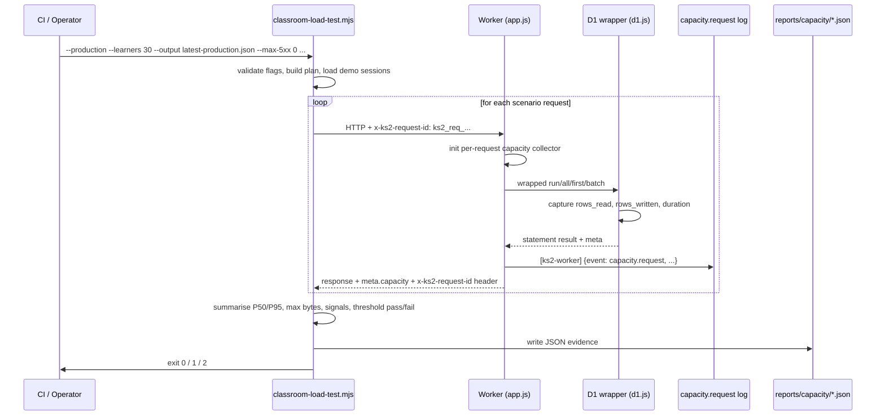
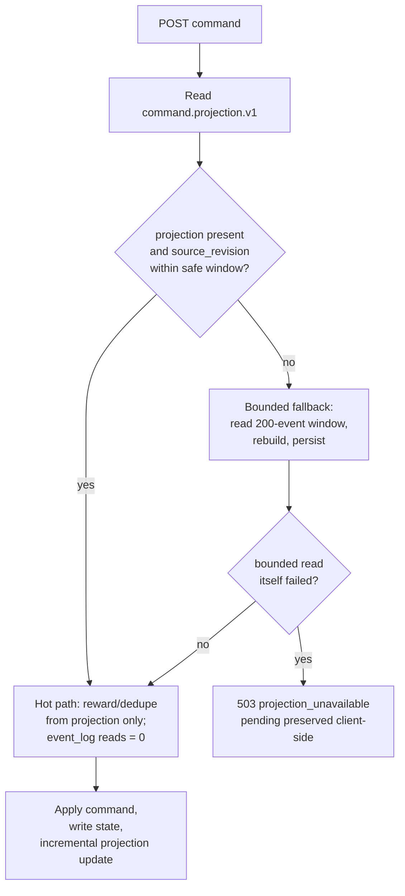
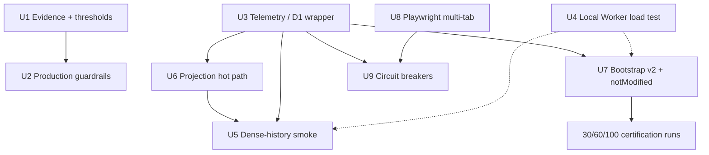

# feat: Classroom Capacity Release Gates and Telemetry

## Overview

Phase 1 (`docs/plans/2026-04-25-001-fix-bootstrap-cpu-capacity-plan.md`, merged in commit `3978f59`) bounded `/api/bootstrap`, introduced lazy history APIs, persisted read-model foundations, bounded command projection, reduced client retry amplification, and shipped a classroom load driver plus a capacity runbook. The current risk is no longer "we don't know how to reduce bootstrap CPU"; it is "we don't yet have hard evidence gates that stop us from shipping or claiming capacity too early."

This plan converts the shipped safety gates into measurable, release-blocking release evidence. It adds threshold-gated load-test failure, production high-load guardrails, D1/Worker telemetry with request-id correlation, a real local-Worker integration test, dense-history subject smoke, hot-path consumption of `command.projection.v1`, a selected-learner minimal bootstrap v2 with JSON not-modified, Playwright multi-tab validation, and circuit-breaker-backed graceful degradation — ordered so that the classroom-tier evidence runs happen against the production shape the repo will continue to carry.

The plan deliberately stops short of architecture rewrites. Every unit extends a mechanism that Phase 1 already introduced.

---

## Problem Frame

The original CPU incident was caused by `/api/bootstrap` and subject command projection performing unbounded historical work on high-history accounts. Phase 1 removed the hot-path unboundedness but did not produce release-blocking evidence — certification tiers `30-learner beta`, `60-learner stretch`, and `100+ school-ready` all remain **Not certified** in `docs/operations/capacity.md`.

Without persisted evidence JSON, threshold-enforced exit codes, telemetry correlation, and real browser / real Worker verification, the team can accidentally ship regressions that look identical to the pre-fix shape. Product claims can also drift ahead of the measurements that back them. The remaining work is not new optimisation — it is enforcement, correlation, and final hot-path hardening.

---

## Requirements Trace

- R1. Persist every capacity run as machine-readable JSON with commit SHA, environment, origin, learners, burst, rounds, auth mode, `startedAt/finishedAt`, per-endpoint P50/P95, max response bytes, signals, failures, and configured thresholds.
- R2. Fail release (non-zero exit) when any configured threshold is violated; per-threshold JSON shape must show `{configured, observed, passed}` so trend tooling can surface "near ceiling" before breach.
- R3. Require escalating confirmation for production load proportional to risk: existing `--confirm-production-load` as base, `--confirm-high-production-load` when mode=production and (learners >= 20 or burst >= 20), `--confirm-school-load` when mode=production and learners >= 60.
- R4. Instrument every D1 call in the Worker with a per-request capacity collector carrying request id, endpoint, method, query count, rows read/written, statement duration, and a per-statement breakdown.
- R5. Emit `[ks2-worker] {event: "capacity.request", ...}` structured log line and add a `meta.capacity` block to every capacity-relevant JSON response, with matching `requestId` and redaction-preserving schema.
- R6. Prove route behaviour against a real local Worker via `wrangler dev --local` + load driver (`npm run capacity:local-worker`), not only mocked-fetch unit tests.
- R7. Smoke dense-history subject command paths (`start-session` smart → `answer` → `advance` → `end-session`) for Spelling first, then Grammar, Punctuation, stale 409 recovery, Parent Hub lazy history pagination.
- R8. Make `command.projection.v1` the hot-path **input** (not only persisted output). A bounded recent event window remains as a migration/fallback path; common command paths must show zero `event_log` reads for a dense-history learner.
- R9. When projection is missing AND bounded fallback itself fails, the hot-path command rejects with `503 projection_unavailable` and preserves the pending command locally; no silent full-history scan.
- R10. Bound `/api/bootstrap` by **selected learner**, not account learner count. Introduce `/api/hubs/parent/summary`, `/api/hubs/parent/recent-sessions`, `/api/hubs/parent/activity`, `/api/classroom/learners/summary` as authoritative lazy surfaces.
- R11. Support unchanged-state bootstrap via JSON `{ok: true, notModified: true, revision: {...}}` driven by a revision hash (`accountRevision`, selected `learnerRevision`, `bootstrapCapacityVersion`). Defer true HTTP `ETag/304` to a later initiative.
- R12. Validate multi-tab bootstrap coordination in a real Chromium browser via Playwright (`@playwright/test` is already the repo's declared browser proof tool).
- R13. Add graceful-degradation rules that preserve priority order: **student answer write > reward/event projection > parent analytics**. Treat it as a reliability PR, not an optimisation PR.
- R14. Preserve every Phase 1 invariant: CAS + mutation receipts, demo auth stripping, non-enumerable raw failure bodies, writable-only bootstrap, no hidden server-side merge, UK English writing, Cantonese chat, AGENTS.md package-script deployment path.
- R15. Ship the minimal bootstrap v2 (selected-learner bounded + JSON not-modified) **before** any 30/60/100-learner classroom-tier certification run, so certification evidence matches the shape the repo will ship.
- R16. Persist capacity evidence files under `reports/capacity/`: `latest-{env}.json` tracked in git plus `snapshots/YYYY-Qn/` quarterly archives; intermediate runs remain CI-artifact-only.

---

## Scope Boundaries

- Do not introduce per-school or per-class D1 sharding. Single-database behaviour must be measurable first.
- Do not add Workers Paid as a prerequisite for certification. Paid remains a future rollout safety margin.
- Do not replace the existing mutation receipt / `state_revision` CAS model in any form.
- Do not reintroduce browser-owned production subject scoring or reward mutation.
- Do not expose private spelling prompt text, answer-bearing session state, or full event JSON through any new telemetry or lazy route.
- Do not wire production smoke or `capacity:classroom --production` into `npm run check`; they remain manual post-deploy release gates per `docs/full-lockdown-runtime.md`.
- Do not adopt a new logging vendor or an external observability SaaS; this plan stays on structured console JSON + Cloudflare Workers Logs / tail.
- Do not rename or version-bump the existing `/api/bootstrap` response envelope fields that the React shell depends on (`subjectStates`, `practiceSessions`, `eventLog`, `syncState`, `monsterVisualConfig`). `meta.capacity` is additive.

### Deferred to Follow-Up Work

- True HTTP `ETag` / `If-None-Match` / `304` headers for bootstrap: separate RFC once JSON `notModified` is in production and any CDN caching question arises.
- Durable Object learner lock for cross-tab coordination: only if Playwright evidence shows `localStorage` coordination is insufficient in real browsers.
- External observability dashboards (Grafana, Datadog): evaluate once structured `capacity.request` volume justifies a sink.
- Backfill production-safe resumability with dedicated `capacity_backfill_runs` table: handle in the read-model operations stream if rerunning becomes a recurring need.
- `--confirm-school-load` environment-variable factor (e.g. `KS2_CAPACITY_SCHOOL_LOAD_TOKEN`): add once real 100+ learner runs are scheduled.

---

## Context & Research

### Relevant Code and Patterns

- `scripts/classroom-load-test.mjs` — existing driver. `parseClassroomLoadArgs()`, `buildClassroomLoadPlan()`, `summariseCapacityResults()`, `signalFor()` already return `{ok, totalRequests, expectedRequests, statusCounts, endpointStatus, endpoints, signals, failures}`. Exit codes already use `process.exitCode` with `0/1/2`. `timedJsonRequest()` uses `Object.defineProperty` to keep `payload`/`failureText`/`cookie` non-enumerable — every new evidence-persistence path must preserve this.
- `scripts/probe-production-bootstrap.mjs` and `scripts/lib/production-smoke.mjs` — the shared `configuredOrigin`, `createDemoSession`, `loadBootstrap`, `subjectCommand` helpers. New smoke scripts must reuse them, not rebuild demo-session / cookie logic.
- `scripts/grammar-production-smoke.mjs`, `scripts/punctuation-production-smoke.mjs` — naming convention `smoke:production:{subject}` and the pattern of one function per scenario (`smokeGrammarNormalRound`, `smokeGrammarMiniTest`, etc.) are the template for the new `smoke:production:spelling-start`.
- `worker/src/d1.js` — thin wrapper (`bindStatement`, `run`, `first`, `all`, `scalar`, `batch`, `exec`, `withTransaction`). No per-request accounting today. Cleanest telemetry hook point. `batch()` already returns `{success, meta: {rows_read, rows_written, changes, last_row_id}}` — use `meta.rows_read/rows_written` directly; for `first()` / `all()` the wrapper must either capture from the D1 statement result or synthesise (see `tests/helpers/sqlite-d1.js` for how local fixtures synthesise `rows_read: rows.length`).
- `worker/src/app.js` — monolithic `if/else` dispatch inside `createWorkerApp.fetch` (lines ~210-698). New per-request collector lives in the outer `try/catch`. Existing `x-ks2-request-id` handling exists only inside `mutationFromRequest()` for legacy runtime writes and subject command normalisation; bootstrap / history routes do not currently stamp a request id. Telemetry PR must generate-if-missing, attach to the collector, and echo in response headers for every capacity-relevant route.
- `worker/src/repository.js` — `bootstrapBundle()` (~line 2652) still fans out per writable learner. `bootstrapCapacityMeta()` (~line 2616) emits caps as `learnerCount × perLearnerLimit`. `readLearnerProjectionBundle()` (~line 2828) reads bounded 200-event window **and** `command.projection.v1` but the read model is **not yet consumed** — spelling, grammar, punctuation handlers pass `projectionState.events` into `combineCommandEvents` for dedupe. This is the exact surface U6 (hot-path projection consumption) must change.
- `worker/src/read-models/learner-read-models.js` — exports `COMMAND_PROJECTION_MODEL_KEY='command.projection.v1'`, `PUBLIC_ACTIVITY_TYPES` allowlist, `publicActivityFromEventRow`, redaction-safe row normalisers. Any hot-path consumption must go through these normalisers.
- `worker/src/projections/events.js` — `eventToken()` and `dedupeEvents()`. U6 will seed dedupe from tokens persisted inside `command.projection.v1` (add `recentEventTokens: []` field) rather than from the 200-event window when the projection is fresh.
- `worker/src/projections/read-models.js` — `buildCommandProjectionReadModel()` returns client-facing shape (`{version, rewards, eventCounts}`). The persisted shape (`commandProjectionReadModelFromRuntime()` in `repository.js` ~line 1490) is different. U6 must decide whether to align shapes — keeping them distinct is acceptable as long as the persisted shape strictly contains what the hot path needs.
- `worker/src/subjects/spelling/commands.js`, `.../grammar/commands.js`, `.../punctuation/commands.js` — the three hot paths. Punctuation already skips projection read when `result.changed === false` (an important no-op pattern U6 must preserve and extend to spelling/grammar).
- `worker/migrations/0009_capacity_read_models.sql` — `learner_read_models` (PK `(learner_id, model_key)`) and `learner_activity_feed` with `source_event_id` unique index. Covers U6 hot-path lookups; no new migration required for that unit. Revision-based stale catch-up (`WHERE model_key = ? AND source_revision < ?`) may still need a secondary index.
- `src/platform/core/repositories/api.js` — client bootstrap backoff (`bootstrapBackoffDelay`, `isBootstrapBackoffError`, `BOOTSTRAP_COORDINATION_LEASE_MS`, `acquireBootstrapCoordination`, `readBootstrapCoordination`). Multi-tab coordination uses `localStorage`-based leases with re-read race guard; no `BroadcastChannel`. Counters for leader/follower/timeout are **not** currently surfaced — U3 telemetry + U8 Playwright rely on exposing these counters.
- `src/platform/runtime/subject-command-client.js` — retry jitter, stale-409 `onStaleWrite` callback, per-learner promise chain via `enqueueLearnerCommand`.
- `src/platform/hubs/api.js`, `src/surfaces/hubs/ParentHubSurface.jsx` — existing lazy Parent Hub consumption path. U7 new endpoints (`/api/hubs/parent/summary`, `/api/classroom/learners/summary`) plug in here.
- `tests/capacity-scripts.test.js`, `tests/worker-bootstrap-capacity.test.js`, `tests/worker-read-model-capacity.test.js`, `tests/worker-projections.test.js`, `tests/persistence.test.js`, `tests/subject-command-client.test.js`, `tests/spelling.test.js` — existing regression coverage. Extend rather than duplicate. `tests/helpers/sqlite-d1.js` already synthesises `meta.rows_read` and exposes `takeQueryLog()` / `clearQueryLog()` — use these as the authoritative assertion oracle for U3 and U6.
- `playwright.config.mjs` — already configured with 5 viewport projects and a `webServer` entry starting `tests/helpers/browser-app-server.js --serve-only --port 4173`. Test match: `.*\.playwright\.test\.(js|mjs)$`. `@playwright/test` is **not** in `package.json` dependencies yet; U8 installs it.
- `docs/operations/capacity.md` — current certification status table, "Evidence To Record" bullets, operational threshold list, degrade guidance. U1 extends the table with a dated evidence section; U9 extends degrade guidance with circuit-breaker state names.
- `docs/full-lockdown-runtime.md` — establishes that subject smokes are intentionally manual post-deploy gates, not wired into `check`. New `smoke:production:spelling-start` follows the same convention.
- `docs/mutation-policy.md`, `docs/repositories.md` — non-negotiable rules: CAS + `requestId` idempotency, no hidden server-side merge, degraded-mode vocabulary (`trustedCopy`, `cacheState`, modes). U6 idempotent replay + U9 circuit breakers must map to this existing vocabulary.
- `AGENTS.md` — James-addressed, Cantonese chat, UK English code/docs, package scripts for Cloudflare ops (never raw `wrangler`, never `CLOUDFLARE_API_TOKEN`), production verify on `https://ks2.eugnel.uk`.

### Institutional Learnings

- The CPU incident post-mortem (`docs/plans/james/cpuload/cpuload.md`) and its follow-through (`implementation-report.md`) establish that the durable lesson is "every important request must be bounded, small, and boring" — not "more CPU." Every unit in this plan should preserve or re-assert that property, not regress it.
- PR #139 reviewer caught three last-minute Phase 1 bugs: raw HTML leakage via `parseError.message`, empty auth-header acceptance in production guard, and demo-session setup carrying operator auth. Every new flag / probe / report path must include regression tests mirroring those three.
- Phase 1 `--confirm-production-load` gated production runs and `--demo-sessions` stripped operator auth. The pattern of "a flag gates, tests assert rejection shape, non-enumerable fields keep report JSON clean" is the template U1 and U2 must match.
- Playwright adoption was already decided in the React migration plan (`docs/plans/2026-04-22-001-refactor-full-stack-react-conversion-plan.md` Unit 2.5) as "the explicit browser proof tool for the migration"; the repo also ships `playwright.config.mjs`. U8 is installation + first real test, not a new tooling decision.
- `[ks2-worker]` log prefix + ISO `at` timestamp is the existing structured-log convention (see `logMutation` in `repository.js` and `logSync` in `api.js`). U3 `capacity.request` log lines follow the same prefix so correlation with existing `mutation.applied` / `mutation.replayed` entries is trivial.
- `docs/solutions/` does not exist. Institutional knowledge lives in top-level `docs/` files plus the three `cpuload*.md` notes under `docs/plans/james/cpuload/`.

### External References

- Cloudflare Workers limits and pricing (cited in Phase 1 plan): Free 10 ms CPU / HTTP request, 100k requests/day; Paid 30M CPU-ms/month included, 30 s default / 5 min max per invocation.
- Cloudflare D1 limits: single-threaded per database; Free 50 queries per Worker invocation, Paid 1000; 5M rows read/day Free, 100k rows written/day Free; `meta.rows_read`/`rows_written` available on statement results.
- `@playwright/test` configuration and multi-context browser coordination patterns (required for U8 only — confirmed the package is not yet installed).

---

## Deepening Synthesis (2026-04-25)

This plan was strengthened after a parallel five-reviewer confidence check (correctness, adversarial, architecture, performance/reliability, security). The findings were integrated directly into the affected units and the Risks table; this section summarises the patterns so future contributors see them as a whole.

### Findings integrated into the plan

- **U6 projection hot-path:** stale-catchup window widened from 50 to 200 events (classroom session size); `recentEventTokens` ring default 250 (strict superset of 200-event fallback); schema version rollback asymmetric handling (`newer-opaque` vs `miss-rehydrated`); concurrent write → CAS-retry with token merge, not silent skip; `derivedWriteSkipped.reason` as a closed union (`missing-table`, `concurrent-retry-exhausted`, `write-failed`, `breaker-open`); idempotent replay skips projection increment; `ProjectionUnavailableError` lives in `worker/src/errors.js`; client `isCommandBackendExhausted()` classifier added in `subject-command-client.js` to prevent retry-storm on `projection_unavailable`.
- **U7 bootstrap v2:** release rule that any envelope required-field addition MUST bump `BOOTSTRAP_CAPACITY_VERSION` (enforced by snapshot test); server-side-only revision hash (`crypto.subtle.digest('SHA-256', ...)`, not password hash); `accountLearnerListRevision` added so add/remove/rename invalidates `notModified`; cold-start preference precedence (client sends preferred `learnerId` to avoid double-bootstrap); LRU of learner revisions for teacher-sweep UX; access-check specification for new endpoints; three-consecutive-missing-metadata client backstop to prevent refuse-cache retry storm.
- **U3 telemetry:** request-id ingress validation (regex-based, non-matching replaced server-side); `CapacityCollector.toPublicJSON()` as explicit closed allowlist with schema test; constructor-injection design choice documented (not AsyncLocalStorage); `statements[]` hard-capped at 50 to bound JSON serialisation cost; benchmark-gated PR merge (+10% bootstrap / +5% command wall-time budget); `CAPACITY_LOG_SAMPLE_RATE` env default 0.1 in production with always-on logging for `status >= 500`; pre-route 401 emits log with `phase: 'pre-route'` but no `meta.capacity` in body.
- **U1 evidence gates:** `scripts/verify-capacity-evidence.mjs` wired into `npm run check` cross-checks `docs/operations/capacity.md` rows against JSON files; `evidenceSchemaVersion` migration rule (v1 for `smoke-pass` and `small-pilot-provisional`; v2 after U3 required for tier claims above `small-pilot-provisional`); certification-tier runs require a pinned `--config reports/capacity/configs/<tier>.json` (PR-reviewed, no ad-hoc threshold relaxation); network-failure threshold required when any status threshold set.
- **U5 dense-history smoke:** explicit fixture credential management (Cloudflare secret storage, quarterly rotation runbook, fail-closed auth, `demo-only` scope, KV-backed advisory lock for concurrent-operator protection); 503 `projection_unavailable` scenario fails smoke with distinguishable exit code; narrow tolerance for 503 only on stale-409 retry race.
- **U9 circuit breakers:** state lives under `persistenceChannel.breakers.*` sub-namespace (architecture feedback: avoid flattening 20+ fields onto the existing snapshot); client-facing exposure reduced to aggregate `breakersDegraded` boolean map (security feedback: don't expose named-endpoint health map to low-privilege clients); short-TTL `localStorage` multi-tab broadcast to prevent Tab B retry storms; incognito / managed-profile fallback documented as accepted residual risk; breaker ordering with `notModified` is notModified-first, breaker-second; refuse-cache backstop after 3 consecutive missing-metadata bootstraps.
- **U4 local-Worker:** environment-strip verification (assert `CLOUDFLARE_API_TOKEN` absent in subprocess env); log output scrubbed through redaction filter; two-stage readiness check (static asset + demo-session creation) to avoid treating auth-401 as ready; explicit port logging (not silent selection); Windows CI pre-step safety pass.
- **Phase ordering:** U4 runs in parallel with U3 (architecture feedback); U6 `Files` now includes `src/platform/runtime/subject-command-client.js` (correctness feedback: the retry-classifier work must not be deferred to U9).

### Accepted residual risks

- **Workers Logs quota** at classroom scale (100 learners × 10 cmd/min) is mitigated by sampling, not eliminated. A 7-day post-U3 monitoring window is scheduled before first 30-learner certification.
- **School managed-profile / incognito `localStorage` disabled** reproduces the pre-Phase-1 fan-out shape. Deployment-level mitigation is documented; Durable Object escalation is a Phase 6 branch if U8 confirms the failure mode.
- **U6 rollback** is a revert-deploy (~15 minutes). Fastest live mitigation is widening the stale-catchup window via config env var; full revert is a second resort.
- **Fixture account concurrent-run indeterminacy** has an advisory lock, not a hard guarantee; runbook warns against parallel runs as first defence.
- **Cross-origin log timing attacks** via `breakersDegraded` are reduced by exposing only aggregate booleans, not endpoint-level health; acceptable for the product's threat model (children's education app, no high-value financial surface).

### What the reviewers could not break

- The additive-fields bundle strategy — `meta.capacity`, `account.learnerList`, `notModified`, `revision` all coexist without touching existing envelope fields. Architecture, correctness, and adversarial reviewers all agreed this preserves `worker/README.md` single-authority principle and avoids the `/v2` endpoint's duplicated-auth-path hazard.
- The CAS + mutation-receipts preservation across every unit. All five reviewers independently confirmed `docs/mutation-policy.md` invariants stay intact.
- The telemetry-in-response-body + structured-log dual surface. Security reviewer confirmed the closed allowlist model is the right mitigation for PII leak; correctness reviewer confirmed PR E smoke can assert against the body without needing Worker tail access.
- The ordering of U7 (bootstrap v2) before classroom-tier certification. Adversarial reviewer probed post-hoc claim retraction; the fixed sequencing survives.

### Reviewers did NOT run

- **Product-lens** (no obvious misalignment with the origin document's product claims; carry-forward from Phase 1 plan's Scope Boundaries).
- **Feasibility** (carrying forward from Phase 1 Risks table; no new technology stack).
- **Coherence** (the plan's structure mirrors Phase 1; shared vocabulary).

### Open items left for implementation

- Exact wall-time delta budget numbers for each capacity-relevant endpoint (the +10% / +5% headline numbers stand; endpoint-specific overrides may land during U3 implementation).
- Whether `/api/hubs/parent/summary` is a new endpoint or an extension of the existing Parent Hub route (noted in Deferred to Implementation; resolved during U7 code review).
- Final choice of readiness check static endpoint for U4 — the plan lists "static asset or `/api/health`"; pick whichever exists or lands first.
- Whether to back the `BOOTSTRAP_CAPACITY_VERSION` snapshot assertion with a golden JSON fixture or a live-synthesis-and-diff — both work; first implementation reviewer decides.

---

## Key Technical Decisions

- **Evidence JSON per-threshold object** — for every configured threshold emit `{configured, observed, passed}`; `failures: [name, ...]` lists only the failed names. Unlocks trend tooling and "near ceiling" warnings without additional passes.
- **`meta.capacity` in response body + structured log** — tests and smokes read `meta.capacity` directly; ops queries use `capacity.request` log lines. Same `requestId` links both so neither path relies on the other.
- **Project `x-ks2-request-id` uniformly** — if the client/load driver sends one, Worker echoes it; otherwise Worker generates `ks2_req_<uuid>` via `crypto.randomUUID()`. Echoed in response header on every capacity-relevant endpoint.
- **Fallback-fail rejects with 503** — if `command.projection.v1` is missing and the bounded 200-event rebuild also fails, the command returns `503 projection_unavailable` with the pending request preserved client-side. Silent full-history rebuild is the exact class of bug that caused the original incident; we refuse to reintroduce it, even as a graceful path.
- **`503 projection_unavailable` is a distinct, non-retryable command-path failure class** — the client retry layer in `src/platform/runtime/subject-command-client.js` must classify this response separately from transient D1 5xx. Phase 1 shipped `isBootstrapBackoffError` that treats every `>= 500` status as CPU-exhaustion-worthy, but that classifier is scoped to `/api/bootstrap`. Command path today has jittered transport retry without a backend-exhausted classifier. U6 adds `isCommandBackendExhausted(error)` that returns `true` only for `projection_unavailable` (explicit payload shape) and triggers immediate move-to-pending without further retry. Retrying a `projection_unavailable` response would re-trigger the same bounded fallback that just failed, risking the original CPU storm.
- **Additive bundle fields only** — per Scope Boundaries above. `meta.capacity`, `account.learnerList`, `notModified`, `revision` are added; no existing field is renamed, reshaped, or version-bumped. Rationale: `worker/README.md` makes `/api/bootstrap` the single authoritative surface; creating a `/v2` endpoint would duplicate the auth/access/redaction path and force the client to choose authorities.
- **Any required-field addition to the bootstrap envelope MUST bump `bootstrapCapacityVersion`** — otherwise the `notModified` path retains stale caches indefinitely for accounts where `accountRevision` does not naturally change (e.g., stable classroom populations for days). This is a release rule documented in `docs/operations/capacity.md`, enforced by a `tests/worker-bootstrap-v2.test.js` assertion that scans the envelope shape against the current version.
- **Selected-learner bootstrap v2 ships before classroom-tier evidence** — 30/60/100-learner certification runs must measure the shape the repo will continue to ship. Certifying v1 then landing v2 would force claim retraction.
- **JSON `notModified` over HTTP 304** — initial ship. Reuses existing hydrate/cache semantics, avoids browser Service Worker / CDN edge-case review. True ETag/304 lives in a separate RFC once CDN caching enters the conversation.
- **Install `@playwright/test` now** — the dependency, config, and webServer harness are already in the repo; the only missing artefact is the test file. Postponing install does not reduce risk.
- **Circuit breakers are a separate PR (U9/PR I), not bundled with Playwright (U8/PR H)** — breakers touch client persistence vocabulary, carry their own closed/half-open/open state matrix, and deserve independent review.
- **Evidence retention: latest-per-env in git + quarterly snapshots** — `reports/capacity/latest-production.json` + `latest-preview.json` + `latest-local.json` tracked; `reports/capacity/snapshots/2026-Q2/` receives quarterly archives. Intermediate runs remain CI artefacts.
- **`>= 20` / `>= 60` learner guardrail boundaries** — conservative inclusive thresholds. 20 learners is already classroom-adjacent; prefer false-positive confirmation prompts over accidental overload.
- **Preserve demo-session auth stripping everywhere** — any new mode (`capacity:local-worker`, `smoke:production:spelling-start`) reuses `createDemoContextWithResponse()` and includes the "operator auth not present in demo request" regression test.
- **`command.projection.v1` schema versioning** — introduce `COMMAND_PROJECTION_SCHEMA_VERSION` constant; additive changes only; breaking changes require a new version key and explicit migration.
- **`--confirm-high-production-load` implies `--confirm-production-load`** — superset: passing the high-load flag alone is sufficient. Avoids CLI friction while preserving opt-in semantics.

---

## Success Metrics

- Every merged PR from this plan ships with at least one capacity report JSON file (or deliberate opt-out justification in the PR description).
- `docs/operations/capacity.md` gains a dated Capacity Evidence table; every status change in the Current Certification Status table links to a row in the Evidence table.
- A failed classroom run exits non-zero from CI with a JSON report that names the violated threshold(s).
- For a dense-history learner (≥ 2,000 events), common spelling/grammar/punctuation commands record `queryCount ≤ 12` and zero `event_log` reads on the hot path.
- `/api/bootstrap` P95 response bytes for an account with 30 learners (one selected) drops materially versus Phase 1 baseline — target below 150 KB initially, below 100 KB once lazy parent/classroom surfaces take over.
- Repeated bootstrap with unchanged revision returns in the `notModified` shape with response bytes < 2 KB.
- Playwright multi-tab test: exactly one real `/api/bootstrap` HTTP fetch from three simultaneously-reloaded tabs; counters `bootstrapLeaderAcquired=1`, `bootstrapFollowerWaited ≥ 1`.
- Zero regression of Phase 1 invariants: redaction tests, CAS tests, access tests, demo-session auth-stripping tests all remain green.

---

## Open Questions

### Resolved During Planning

- **Evidence JSON shape for per-threshold pass/fail** — resolved as per-threshold object `{configured, observed, passed}` with `failures` array. (See Key Technical Decisions.)
- **Telemetry surface for smoke assertions** — resolved as both structured log **and** `meta.capacity` in response body. Smoke scripts assert against body; ops queries against log.
- **Projection missing + bounded fallback fail** — resolved as `503 projection_unavailable` with pending command preserved. No silent full-history scan.
- **Bootstrap v2 ordering relative to classroom certification** — resolved as v2 ships before 30-learner certification run.
- **Multi-tab validation tooling** — resolved as install `@playwright/test` + first real browser test in U8.
- **Circuit breakers bundling** — resolved as separate U9 (PR I) after U8 (PR H).
- **Evidence file retention** — resolved as latest-per-env in git + quarterly snapshots; intermediate runs are CI artefacts only.
- **Guardrail boundary inclusivity** — resolved as `learners >= 20` or `burst >= 20` for `--confirm-high-production-load`; `learners >= 60` for `--confirm-school-load`.
- **Confirmation flag stacking** — resolved as superset implication: `--confirm-high-production-load` implies `--confirm-production-load`; `--confirm-school-load` implies both.
- **Playwright vs the existing `browser-app-server.js` harness** — start with `browser-app-server.js --with-worker-api` against `http://127.0.0.1:4173`. If multi-tab coordination requires real Worker semantics the harness cannot replicate, wire U8 to `capacity:local-worker` (U4) in a follow-up commit.
- **Stale-catchup window size** — resolved as `currentRevision - 200` (was 50). A single classroom session can produce 60-120 commands; 200 covers the session plus retry jitter headroom.
- **`recentEventTokens` ring size** — resolved as default 250, strict superset of `PROJECTION_RECENT_EVENT_LIMIT` (200).
- **Concurrent projection write policy** — resolved as CAS-retry with token merge on CAS failure; second failure surfaces `derivedWriteSkipped` but primary state write succeeds.
- **`derivedWriteSkipped` signal shape** — resolved as a closed union: `'missing-table' | 'concurrent-retry-exhausted' | 'write-failed' | 'breaker-open'`. Vocabulary drift rejected by test-level schema assertion.
- **Request-id ingress validation** — resolved as regex-based acceptance (`ks2_req_<uuid-v4>`, max 48 chars); non-matching values replaced server-side; never used without validation.
- **Collector design** — resolved as constructor injection via `createWorkerRepository({capacity})`, not AsyncLocalStorage.
- **`BOOTSTRAP_CAPACITY_VERSION` bump release rule** — resolved as required-field addition must bump version in the same PR; snapshot test enforces.
- **Evidence integrity cross-check** — resolved as `scripts/verify-capacity-evidence.mjs` in `npm run check`.
- **`evidenceSchemaVersion` migration** — resolved as v1 (U1) for `smoke-pass` and `small-pilot-provisional`; v2 (U3+) required for tier claims above `small-pilot-provisional`.
- **Circuit-breaker state surface** — resolved as `persistenceChannel.breakers.*` sub-namespace for internal; aggregate `breakersDegraded` boolean map for UI components.
- **Multi-tab breaker coordination** — resolved as short-TTL `localStorage` broadcast with per-tab fallback when unavailable.
- **Projection schema rollback semantics** — resolved as asymmetric: `newer-opaque` on rollback direction (preserve data), `miss-rehydrated` on migration direction (overwrite safely).
- **U4 wrangler readiness-detection strategy** — resolved as two-stage check: poll a static endpoint (health or ASSETS root) first, then post a demo-session creation request, both must return 200 before the load driver starts. Avoids the "auth-401 treated as ready" ambiguity when D1 bindings are misconfigured.

### Deferred to Implementation

- Exact request-id format beyond `ks2_req_<uuid>` — match whatever the repo already uses in legacy runtime writes once confirmed during implementation.
- Exact `reportMeta.decision` enum values and the automated decision-function — draft from the origin's seven-value list (`fail` / `smoke-pass` / `small-pilot-provisional` / `30-learner-beta-certified` / `60-learner-stretch-certified` / `100-plus-certified`), but finalise after the first evidence run lands.
- Whether `COMMAND_PROJECTION_MODEL_KEY` gains a secondary index for revision-based catch-up — decide after the first dense-history smoke reveals whether stale-catchup queries appear in query logs.
- Whether `/api/hubs/parent/summary` and `/api/classroom/learners/summary` are new endpoints or extensions of existing hub reads — decide while mapping the current `readParentHub()` / `readAdminHub()` surface to the new lazy contract.
- Exact static readiness endpoint path for U4 — the plan specifies a two-stage check (static asset/health-endpoint probe then demo-session creation); the exact `/api/health` path vs `ASSETS` root will be picked during implementation based on whichever lands first in the Worker.
- Final circuit-breaker state-machine fields surfaced in client `persistenceChannel` snapshot — finalise after looking at what `createApiPlatformRepositories()` already emits.

---

## Output Structure

```text
reports/
  capacity/
    latest-local.json              # tracked in git, overwritten by CI/CLI
    latest-preview.json            # tracked in git, overwritten by CI/CLI
    latest-production.json         # tracked in git, overwritten by CI/CLI
    snapshots/
      2026-Q2/
        2026-04-25-main-10l-preview.json
        2026-04-27-main-30l-preview.json
        ...
    .gitignore                     # ignores everything under reports/capacity/
                                   # except latest-*.json and snapshots/**
worker/src/
  logger.js                        # new: capacity.request log helper
  d1.js                            # extended: per-request collector hook
scripts/
  classroom-load-test.mjs          # extended: thresholds, evidence output
  capacity-local-worker.mjs        # new: wrangler dev + load driver runner
  probe-production-bootstrap.mjs   # extended: --output evidence
  spelling-production-smoke.mjs    # new: dense-history subject smoke
  lib/
    capacity-evidence.mjs          # new: shared evidence JSON builder
docs/operations/
  capacity.md                      # extended: Capacity Evidence table
tests/
  capacity-scripts.test.js         # extended: thresholds, guardrails
  worker-capacity-telemetry.test.js # new: d1 wrapper + meta.capacity
  worker-projection-hot-path.test.js # new: zero event_log reads on hot path
  worker-bootstrap-v2.test.js      # new: selected-learner + notModified
  bootstrap-multi-tab.playwright.test.js  # new: Playwright 3-tab
  capacity-circuit-breakers.test.js # new: breaker state matrix
```

This tree declares expected output shape. Implementers may adjust the layout if a cleaner structure emerges during the work — per-unit `**Files:**` sections remain authoritative.

---

## High-Level Technical Design

> *This illustrates the intended approach and is directional guidance for review, not implementation specification. The implementing agent should treat it as context, not code to reproduce.*

### Evidence and Telemetry Flow



### Projection Hot-Path Decision Matrix



### Unit Dependency Graph



Dashed edges indicate "helps but does not hard-block." Classroom-tier certification runs are not a plan unit; they are the downstream outcome the plan unblocks.

---

## Implementation Units

- U1. **Evidence Persistence and Threshold Gates**

**Goal:** Every classroom load run produces a persisted JSON evidence file with per-threshold pass/fail metadata, and any configured threshold violation fails the run with a non-zero exit code.

**Requirements:** R1, R2, R14, R16

**Dependencies:** None (but enriched later by U3's `meta.capacity` fields)

**Files:**
- Modify: `scripts/classroom-load-test.mjs`
- Modify: `scripts/probe-production-bootstrap.mjs`
- Create: `scripts/lib/capacity-evidence.mjs`
- Create: `reports/capacity/.gitignore`
- Modify: `.gitignore`
- Modify: `package.json`
- Modify: `docs/operations/capacity.md`
- Test: `tests/capacity-scripts.test.js`
- Test: `tests/production-smoke-helpers.test.js`

**Approach:**
- Extend `parseClassroomLoadArgs()` with `--output <path>`, `--max-5xx`, `--max-network-failures`, `--max-bootstrap-p95-ms`, `--max-command-p95-ms`, `--max-response-bytes`, `--require-zero-signals`, `--require-bootstrap-capacity`.
- Build a shared `scripts/lib/capacity-evidence.mjs` that takes the existing summary and threshold config and returns `{thresholds: {name: {configured, observed, passed}}, failures: [name, ...], reportMeta: {commit, environment, origin, authMode, learners, burst, rounds, startedAt, finishedAt, evidenceSchemaVersion: 1}}`.
- Capture commit SHA via `process.env.GITHUB_SHA` or `git rev-parse HEAD`; degrade to `unknown` with a warning when unavailable.
- Keep `payload`, `failureText`, `cookie` non-enumerable when serialising to the `--output` file.
- Create `reports/capacity/` with a `.gitignore` that allows `latest-*.json` and `snapshots/**` but ignores everything else; add top-level `.gitignore` patterns so intermediate runs stay local.
- Auto-name when `--output` is omitted: `reports/capacity/<timestamp>-<commit>-<env>.json`.
- Make `report.ok === false` when any threshold fails; preserve existing `process.exitCode = report.ok ? 0 : 1` and `2` on thrown errors.
- **Network-failure threshold required when any status threshold is set** — if `--max-5xx` is provided, `--max-network-failures` must also be provided (default 0 suggested). Prevents the silent-success case where 100% network failure reports `max5xx: {observed: 0, passed: true}`. Validation rejects the CLI combination at parse.
- Add a Capacity Evidence table to `docs/operations/capacity.md` with the columns from the origin document (`Date | Commit | Env | Plan | Learners | Burst | Rounds | P95 Bootstrap | P95 Command | Max Bytes | 5xx | Signals | Decision`).
- **Evidence integrity cross-check:** add `scripts/verify-capacity-evidence.mjs` (called from `npm run check` as a lightweight assertion) that scans `docs/operations/capacity.md` for rows claiming "certified" / "provisional" and verifies each such claim points to a JSON evidence file at `reports/capacity/snapshots/` or `reports/capacity/latest-*.json` with (a) matching `commit` SHA, (b) `report.ok === true`, (c) **tier-appropriate `evidenceSchemaVersion`** — `smoke-pass` and `small-pilot-provisional` accept `v1` or later; `30-learner-beta-certified`, `60-learner-stretch-certified`, and `100-plus-certified` require `v2` or later (i.e. U3 telemetry fields must be present before classroom-tier certification). A row without a matching file fails `npm run check`. Handwritten "looks good" decisions are rejected. Between U1 merge and U3 merge, only `smoke-pass` / `small-pilot-provisional` rows can be added — the verify script errors with a clear "U3 not yet shipped — classroom-tier certification not available" message for any higher-tier row. Stops threshold-drift and fabricated-row incentive distortion.
- **`evidenceSchemaVersion` migration rule:** U1 ships `evidenceSchemaVersion: 1` (no telemetry fields). U3 bumps to `evidenceSchemaVersion: 2` (adds `d1RowsRead`, `queryCount`, per-endpoint telemetry aggregates). Tier claims above `small-pilot-provisional` require `v2`. `docs/operations/capacity.md` section explicitly lists which tiers each schema version can back. Until U3 merges, the verify script tolerates v1 evidence files for the two eligible tiers only; after U3 merges, new `v2` evidence can back higher tiers.
- **Threshold-drift prevention:** certification-tier runs (learners ≥ 20) are run via a config file input `--config reports/capacity/configs/<tier>.json` that pins the full threshold set; omitting the config is allowed only for `--dry-run` or small-pilot (<10 learner) runs. Config files are checked into git; any change goes through PR review. Prevents an operator under pressure from relaxing thresholds ad-hoc.

**Execution note:** Characterization-first. Add tests that assert current-shape evidence before introducing threshold flags; then TDD new threshold logic.

**Patterns to follow:**
- `parseClassroomLoadArgs()` argument-walking shape in `scripts/classroom-load-test.mjs`
- Non-enumerable raw-body handling in `timedJsonRequest()`
- Existing rejection tests in `tests/capacity-scripts.test.js` lines 196-226

**Test scenarios:**
- Happy path: `--max-5xx 0 --max-network-failures 0 --max-bootstrap-p95-ms 1000 --output <tmp>` on a passing dry-run writes JSON with every threshold `passed: true`, `failures: []`, `report.ok: true`, exit 0. (`--max-network-failures` is required whenever `--max-5xx` is set — see the network-failure threshold rule in Approach.)
- Happy path: evidence JSON includes `reportMeta` with commit SHA (or `unknown`), environment, origin, authMode, learners, burst, rounds, startedAt, finishedAt, evidenceSchemaVersion.
- Edge case: threshold flag `0` vs undefined — `--max-5xx 0` must still gate (strict zero), whereas omitted flag skips the gate.
- Edge case: `--output` to a non-existent directory creates the path recursively; `--output` to a read-only path fails with clear error and exit 2.
- Edge case: concurrent runs to the same auto-named path — default naming includes millisecond timestamp so collisions are effectively impossible; confirm explicit same-path runs overwrite atomically.
- Edge case: empty measurements (all network fail) — P50/P95 are `null`, threshold `{configured, observed: null, passed: false}` for latency-based gates.
- Error path: malformed threshold value (`--max-5xx abc`, negative, repeated) rejected at parse with exit 2.
- Error path: `--output` path parent exists but cannot be written — fail with exit 2, no partial JSON.
- Integration: existing Phase 1 tests (dry-run shape, local-fixture demo isolation, production guards, demo-session fail-closed, signal grouping, 1102 HTML body redaction) remain green.
- Integration: raw HTML 1102 body still non-enumerable in persisted JSON (verify via `JSON.parse(fs.readFileSync(output))` finds no raw body prefix).
- Covers AE: a failing run exits 1 and writes a JSON report listing `maxBootstrapP95Ms` in `failures` with `{configured: 1000, observed: 1240, passed: false}`.

**Verification:**
- A threshold-failing run writes a persisted JSON file and exits 1.
- A passing run writes a persisted JSON file and exits 0.
- No test introduced in U1 relies on `meta.capacity` (that arrives in U3).

---

- U2. **Production High-Load Guardrails**

**Goal:** Make accidental large production runs harder to trigger while keeping legitimate certification runs possible. Escalating confirmation: base, high-load, school-load.

**Requirements:** R3, R14

**Dependencies:** U1

**Files:**
- Modify: `scripts/classroom-load-test.mjs`
- Test: `tests/capacity-scripts.test.js`

**Approach:**
- Add `--confirm-high-production-load` and `--confirm-school-load` flags.
- Implement guardrails as a table-driven function `requiredProductionConfirmations({mode, learners, bootstrapBurst})` returning an ordered list (`['production', 'high-production-load', 'school-load']`).
- In `validateClassroomLoadOptions()`, reject when any required confirmation is missing; include the full missing list in the error message.
- `--confirm-high-production-load` implies `--confirm-production-load`; `--confirm-school-load` implies both (superset). Missing base flag is auto-upgraded silently if the more-specific flag is present.
- Inclusive boundaries: `learners >= 20` or `bootstrapBurst >= 20` triggers high-load; `learners >= 60` triggers school-load.
- Emit a `safety` block in the evidence JSON: `{mode, origin, learners, bootstrapBurst, demoSessions, authMode, guardrailsTriggered: [...], confirmedVia: [...]}`.
- Dry-run bypasses guardrails but still reports `guardrailsTriggered` so CI can preview requirement changes without risk.
- Non-production modes (`--local-fixture`, `--dry-run`) warn but do not reject if guardrail flags are set (useful for rehearsal).

**Execution note:** Table-driven unit test across the full (mode × learners × burst × flags) matrix.

**Patterns to follow:**
- Existing `validateClassroomLoadOptions()` rejection shape in `scripts/classroom-load-test.mjs`
- Existing guard tests at lines 196-226 of `tests/capacity-scripts.test.js`

**Test scenarios:**
- Happy path: `--production --learners 10 --confirm-production-load --demo-sessions` runs unchanged (no new confirmation needed).
- Happy path: `--production --learners 30 --confirm-high-production-load --demo-sessions` runs; base confirmation auto-implied.
- Happy path: `--production --learners 80 --confirm-school-load --demo-sessions` runs; both base and high-load auto-implied.
- Edge case: `--production --learners 20 --demo-sessions` (boundary) rejects with missing `--confirm-high-production-load`.
- Edge case: `--production --learners 19 --burst 25 --demo-sessions` (burst only) rejects with missing `--confirm-high-production-load`.
- Edge case: `--production --learners 60 --confirm-high-production-load` (boundary, missing school) rejects with missing `--confirm-school-load`.
- Edge case: `--dry-run --production --learners 100` warns but does not reject; evidence JSON lists `guardrailsTriggered: ['high-production-load', 'school-load']` **and** a `wouldRejectInProduction: true` field listing missing confirmation flags so operators removing `--dry-run` later cannot miss the escalation requirement.
- Error path: unknown flag `--confirm-hight-production-load` (typo) rejected at parse.
- Error path: `--production --learners 30` with no confirmation flags and no `--demo-sessions` — rejection error message lists all missing pieces (auth + confirmations).
- Integration: evidence JSON from U1 gains a `safety` block populated correctly for every production run.

**Verification:**
- Dangerous production shapes cannot be triggered without the explicit escalating flags.
- Evidence JSON shows which guardrails applied and which confirmations were supplied.

---

- U3. **Worker Capacity Telemetry and D1 Wrapper**

**Goal:** Instrument every Worker request with a per-request capacity collector, wrap D1 calls to capture query counts and row metrics, and expose the data both as a `[ks2-worker] capacity.request` structured log line and as `meta.capacity` on capacity-relevant JSON responses.

**Requirements:** R4, R5, R14

**Dependencies:** None (unlocks U5, U6, U7, U9)

**Files:**
- Create: `worker/src/logger.js`
- Modify: `worker/src/d1.js`
- Modify: `worker/src/app.js`
- Modify: `worker/src/repository.js`
- Modify: `worker/src/http.js`
- Modify: `src/platform/core/repositories/api.js`
- Modify: `src/platform/runtime/subject-command-client.js` (**coordinate with U6**: U3's touch is an ingest-validator audit on outgoing `x-ks2-request-id` only; U6 adds `isCommandBackendExhausted()`. Whichever unit lands first, the second must rebase cleanly — both edits target different functions in the same file.)
- Modify: `scripts/classroom-load-test.mjs`
- Modify: `scripts/probe-production-bootstrap.mjs`
- Test: `tests/worker-capacity-telemetry.test.js` (new)
- Test: `tests/worker-bootstrap-capacity.test.js`
- Test: `tests/worker-projections.test.js`

**Approach:**
- Create a `CapacityCollector` class in `worker/src/logger.js` scoped per-request: tracks `requestId`, `endpoint`, `method`, `queryCount`, `d1RowsRead`, `d1RowsWritten`, `d1DurationMs`, per-statement array `[{name, rowsRead, rowsWritten, durationMs}]` **hard-capped at 50 entries** (matches D1 Free 50/invocation limit; additional statements increment `queryCount` but are not appended), plus mutable flags `bootstrapCapacity`, `projectionFallback`, `derivedWriteSkipped`, `signals[]`.
- **Design choice: constructor injection, not AsyncLocalStorage.** The collector is passed explicitly through `createWorkerRepository({env, now, capacity})`; no async-local storage is used. Rationale: Workers AsyncLocalStorage requires `nodejs_compat` and carries per-hop CPU cost contrary to Phase 1's "bounded, small, boring" principle. A one-paragraph note in `worker/README.md` documents that `CapacityCollector` mutation is telemetry-only — not a general pattern for side effects.
- Extend `worker/src/d1.js` to accept an optional `collector` parameter on `bindStatement`, `run`, `first`, `all`, `scalar`, `batch`, `exec`. When present, record `meta.rows_read`, `meta.rows_written`, and `meta.duration`. For `first()` and `all()` where D1 does not expose meta, synthesise from result shape; for `batch()` walk `results[]` per-statement. Absent `collector` (tests, fixtures): no instrumentation, zero overhead.
- **Request ID ingress validation:** in `createWorkerApp.fetch`, read `request.headers.get('x-ks2-request-id')`. Accept only if it matches `/^ks2_req_[0-9a-f]{8}-[0-9a-f]{4}-[0-9a-f]{4}-[0-9a-f]{4}-[0-9a-f]{12}$/` (prefix + UUID v4 shape, max 48 chars). Non-matching or missing: generate `ks2_req_${crypto.randomUUID()}` server-side. This protects against header injection (CRLF / oversized values) and log-forging attempts. Never use a client-supplied id without this validation.
- Construct `CapacityCollector` per request and thread it through `createWorkerRepository({env, now, capacity: collector})`. The collector is closure-captured by the repository for that request only; Workers isolate-scope guarantees no cross-request pollution.
- After the response is built, compute `responseBytes` via `Buffer.byteLength` on the serialised body, emit `logger.capacityRequest(collector.toJSON())`, and echo the validated `x-ks2-request-id` in response headers. **Auth-failed (401) pre-route responses echo the header and emit the log (with `phase: 'pre-route'`, `queryCount: 0`, no `meta.capacity` body)** so auth-failure storms are observable.
- **`CapacityCollector.toPublicJSON()` is a closed allowlist** — the returned shape includes ONLY: `requestId`, `queryCount`, `d1RowsRead`, `d1RowsWritten`, `wallMs`, `responseBytes`, `bootstrapCapacity?`, `projectionFallback?`, `derivedWriteSkipped?`, `bootstrapMode?`, `signals: []`. The per-statement breakdown is NEVER included in the public shape; it appears only in the structured log. Unknown fields are rejected by a test-level schema assertion. Only attach `meta: { capacity: collector.toPublicJSON() }` to JSON responses on capacity-relevant endpoints (`/api/bootstrap`, `/api/subjects/:subject/command`, `/api/hubs/parent/*`, `/api/classroom/*`).
- `repository.js` stamps `bootstrapCapacity` on the collector inside `bootstrapBundle()` and `derivedWriteSkipped` / `projectionFallback` in `readLearnerProjectionInput()` (per U6); wire through as mutation of the passed collector, not as return value — keeps existing signatures stable. The telemetry-only mutation pattern is documented explicitly.
- Extend `scripts/classroom-load-test.mjs` and `scripts/probe-production-bootstrap.mjs` to generate and send `x-ks2-request-id: ks2_req_<uuid>` on every request and capture the echo. U1's evidence JSON gains optional `requestSamples[]` **capped at first 100 + last 100 samples per endpoint**, opt-in via `--include-request-samples`. Default off to keep evidence JSON bounded (< 5 MB on classroom-tier runs).
- Client `api.js` and `subject-command-client.js` already send `x-ks2-request-id` for specific paths; U3 audits that every outgoing request includes one generated via `crypto.randomUUID()` and matches the ingest validator.
- **Redaction as a closed contract:** `toPublicJSON()` and the structured log payload builder are the ONLY two surfaces that render `CapacityCollector` state. Both use the same allowlist. Adding a new collector field requires a PR that updates both builders and an explicit regression test in `tests/worker-capacity-telemetry.test.js` asserting no PII leak. Structured log and `meta.capacity` NEVER include: request bodies, response bodies, learner identifiers beyond `requestId`, answer-bearing fields, spelling prompts, full event JSON.
- **Overhead budget:** a Phase-1-baseline-vs-U3-instrumented benchmark test gates PR merge. `/api/bootstrap` wall-time delta for a 30-learner account must stay within +10% of Phase 1 baseline; hot-path command wall-time delta within +5%. Exceeding the budget is a PR-blocker, not a deploy-time concern.
- **Log sampling:** `CAPACITY_LOG_SAMPLE_RATE` env var defaults to `1.0` for local/preview and `0.1` for production. Error-status responses (`>= 500`) are always logged at rate `1.0` regardless. Sampling applies only to the structured log; `meta.capacity` in responses is always present. The configuration is documented in `docs/operations/capacity.md`.

**Execution note:** Test-first. Add `tests/worker-capacity-telemetry.test.js` that asserts `/api/bootstrap` response includes `meta.capacity.queryCount > 0` and `meta.capacity.d1RowsRead >= 0` before implementing the wrapper.

**Patterns to follow:**
- `logMutation()` in `worker/src/repository.js` — structured `[ks2-worker]` log line shape
- `logSync()` in `src/platform/core/repositories/api.js` — client side mirror
- `DB.takeQueryLog()` / `clearQueryLog()` in `tests/helpers/sqlite-d1.js` as the assertion oracle

**Test scenarios:**
- Happy path: `/api/bootstrap` response includes `meta.capacity` with `requestId`, `queryCount`, `d1RowsRead`, `d1RowsWritten`, `wallMs`, `responseBytes`, `bootstrapCapacity.version: 1`.
- Happy path: `capacity.request` log line emitted once per request; `requestId` matches `meta.capacity.requestId`.
- Happy path: `x-ks2-request-id` echoed in response headers; if client sends a pattern-valid one, Worker uses it verbatim; if pattern-invalid or omitted, Worker generates `ks2_req_<uuid>`.
- Happy path: `toPublicJSON()` allowlist snapshot — output contains only the documented fields; adding an unexpected field fails the schema test.
- Edge case: request-id ingress validation — headers like `ks2_req_abc`, CRLF-injected values, 200-char payloads, or blank strings are rejected; server generates fresh id; the rejected value never appears in logs or response.
- Edge case: an auth-failed request (401 before route match) echoes `x-ks2-request-id` header, emits `capacity.request` log with `phase: 'pre-route'` and `queryCount: 0`, and response body does NOT include `meta.capacity` (non-capacity-relevant endpoint). Smoke tests tolerate this.
- Edge case: request that only hits KV/R2 (no D1) emits `capacity.request` with `queryCount: 0`, `d1: null`.
- Edge case: `batch()` call attribution — each inner statement contributes to `queryCount` and per-statement breakdown.
- Edge case: D1 statement result missing `meta.rows_read` — collector records `null`, not `0`.
- Edge case: statement count exceeds 50 (hard cap) — `queryCount` continues incrementing but `statements[]` is capped; a `statementsTruncated: true` flag is set.
- Error path: thrown handler error still emits `capacity.request` with `status: 500`, `queryCount` up to failure point, `wallMs` set.
- Error path: PII leak regression — assert that `meta.capacity` and `capacity.request` log contain zero occurrences of spelling prompts, answer text, or full event JSON when the request body contained them.
- Error path: sample-rate config — `CAPACITY_LOG_SAMPLE_RATE=0.0` still emits every log line for `status >= 500`; `meta.capacity` in response body always present regardless of sample rate.
- Integration: overhead benchmark — `/api/bootstrap` wall-time with collector enabled stays within +10% of Phase 1 baseline on a 30-learner account; benchmark gates PR merge.
- Integration: `tests/worker-bootstrap-capacity.test.js` assertions extend to check `bootstrapCapacity` stamped on collector matches the payload.
- Integration: `tests/worker-projections.test.js` dense-history fixture shows `queryCount ≤ 15` for a common projection command (pre-U6 soft budget — this is U3's baseline while projection is still bounded-fallback-based. U6 tightens the budget to `≤ 12` once the read model becomes the hot-path input — see U6 test scenarios and Success Metrics).
- Integration: load driver `--output` evidence JSON (U1) gains `d1RowsRead`, `queryCount` aggregated per endpoint once U3 lands; `--include-request-samples` opt-in caps samples at 100+100 per endpoint.

**Verification:**
- Every response on a capacity-relevant endpoint carries `meta.capacity`.
- Every request produces exactly one `[ks2-worker] {event: capacity.request, ...}` log line.
- No existing bootstrap/access/projection/redaction test regresses.

---

- U4. **Real Worker Local-Fixture Integration Load Test**

**Goal:** Bridge the gap between mocked-fetch unit tests and production load runs by wiring `wrangler dev --local` + the classroom load driver into `npm run capacity:local-worker`.

**Requirements:** R6, R14

**Dependencies:** None (valuable for verification of U3, U5, U6, U7 when they land)

**Files:**
- Create: `scripts/capacity-local-worker.mjs`
- Modify: `package.json`
- Test: `tests/capacity-scripts.test.js`

**Approach:**
- Create `scripts/capacity-local-worker.mjs` that orchestrates: apply local D1 migrations via `npm run db:migrate:local`, spawn `wrangler dev --local --port <dynamic>` through `scripts/wrangler-oauth.mjs`, poll readiness, run the load driver with `--local-fixture --origin http://localhost:<port> --demo-sessions`, capture evidence, tear down wrangler subprocess.
- **Wrangler subprocess always spawned through `scripts/wrangler-oauth.mjs`** so `CLOUDFLARE_API_TOKEN` stripping applies. The orchestrator constructs the subprocess env object from the cleaned env `wrangler-oauth.mjs` provides; never falls back to `env: process.env`. Assertion in `tests/capacity-scripts.test.js`: spawn invocation inspects the child-process env arg and verifies `CLOUDFLARE_API_TOKEN` is absent.
- **Log redaction:** `reports/capacity/local-worker-stdout.log` is scrubbed through the same redaction filter as `meta.capacity` before writing — any OAuth token, cookie, or session artefact in wrangler output is replaced with `[redacted]`. Filter is unit-tested.
- Port selection: default 8787; on bind failure try 8788, 8789, then abort with clear error. **Log the chosen port explicitly** in both stdout and the evidence JSON `safety.originResolved` — not silent.
- Readiness: 30-second hard timeout with exponential poll (100ms, 200ms, 400ms, capped at 1s). **Two-stage check:** first poll a static `/api/health` endpoint or the `ASSETS` root (expect 200); then post a demo-session creation request (expect 200). Only after both succeed does the load driver start. This avoids the "auth-401 treated as ready" ambiguity where a misconfigured D1 binding produces 401 from auth middleware.
- Teardown: `SIGINT` on POSIX, `taskkill /F /PID` on Windows. Use `AbortSignal` timeout on subprocess I/O. **Windows CI pre-step:** runbook adds a `taskkill /F /IM wrangler.exe` safety pass before starting, to clear leaks from previous SIGKILLed orchestrators.
- Capture wrangler stdout/stderr (post-redaction) into `reports/capacity/local-worker-stdout.log` (gitignored) for post-mortem.
- Pass every remaining argv after `--` to the load driver.
- Do NOT wire into `npm run check`; document it in `docs/operations/capacity.md` as a local/CI pre-deploy optional gate.

**Execution note:** Unit test the orchestrator's port-selection / readiness-polling logic with a mocked subprocess; run the full integration manually for first validation.

**Patterns to follow:**
- `scripts/wrangler-oauth.mjs` stripping `CLOUDFLARE_API_TOKEN`
- `scripts/classroom-load-test.mjs` argv forwarding shape
- `tests/helpers/browser-app-server.js` spawn + wait-for-ready pattern (adapted — this wraps real wrangler)

**Test scenarios:**
- Happy path: orchestrator selects port 8787, wrangler reports ready, load driver runs, evidence JSON written, subprocess torn down, exit 0.
- Edge case: port 8787 busy — orchestrator selects 8788 silently, logs the chosen port in the evidence JSON `safety.originResolved`.
- Edge case: wrangler fails to start within 30 s — orchestrator kills subprocess, writes partial log, exits 2 with clear error.
- Edge case: load driver exits non-zero (threshold violation) — orchestrator still tears down wrangler cleanly and propagates the exit code.
- Edge case: previous `.wrangler/state` dirty — document `--fresh` pass-through flag; no auto-reset in v1.
- Error path: `SIGINT` from operator during the load — both subprocess and driver shut down; temporary files cleaned.
- Error path: Windows path with spaces — `taskkill` invocation quoted correctly.
- Integration: CI invocation (manual for now) produces an evidence JSON with env=local, origin=http://localhost:<port>.

**Verification:**
- `npm run capacity:local-worker -- --learners 5 --bootstrap-burst 5 --rounds 1 --require-zero-signals` completes locally with exit 0 on a clean repo.
- Evidence JSON is written to `reports/capacity/latest-local.json`.
- No dangling wrangler process remains after a clean or abnormal exit.

---

- U5. **Dense-History Subject Command Smoke**

**Goal:** Extend production smoke coverage beyond `/api/bootstrap` to the full hot command loop (start-session smart → answer → advance → end-session) for Spelling, Grammar, Punctuation, stale-409 recovery, and Parent Hub lazy history pagination.

**Requirements:** R5, R7, R14

**Dependencies:** U3 (telemetry asserted via `meta.capacity`); U6 soft dependency (only the "projection hit after first command" assertion needs U6 landed).

**Files:**
- Create: `scripts/spelling-production-smoke.mjs`
- Modify: `scripts/grammar-production-smoke.mjs`
- Modify: `scripts/punctuation-production-smoke.mjs`
- Modify: `scripts/lib/production-smoke.mjs`
- Modify: `package.json`
- Modify: `docs/operations/capacity.md`
- Test: `tests/production-smoke-helpers.test.js`

**Approach:**
- Reuse `scripts/lib/production-smoke.mjs` shared helpers (`configuredOrigin`, `createDemoSession`, `loadBootstrap`, `subjectCommand`). Do not duplicate demo-session / cookie logic.
- Add `scripts/spelling-production-smoke.mjs` exporting `smokeSpellingSmartReviewStart`, `smokeSpellingAnswerAdvance`, `smokeSpellingEndSession`. Each function asserts `status === 200`, no 5xx, `meta.capacity.signals` empty, `wallMs` under per-endpoint threshold, response bytes under threshold, `meta.capacity.projectionFallback` value meets expectation (`null` for fresh learner; `'miss-rehydrated'` allowed once during migration). Values MUST match U6's closed union: `'hit' | 'miss-rehydrated' | 'stale-catchup' | 'rejected' | 'newer-opaque'`.
- Add a "dense-history seed" mode: seed a fixture learner (stable identifier `ks2-capacity-probe@internal`, documented in `docs/operations/capacity.md`) with ≥ 200 events, shared across smoke runs.
- **Fixture credential management (explicit specification):**
  - **Storage:** account password stored as `KS2_CAPACITY_PROBE_PASSWORD` Cloudflare secret (never in git, never in CI plain env); local operator runs pull from a password manager. Session cookies derived per run.
  - **Scope:** the account has `demo-only` role — cannot read other accounts' data, cannot execute admin operations, subject to the same `/api/hubs/parent/*` and `/api/classroom/*` access checks as a normal demo session.
  - **Rotation cadence:** quarterly, on the first Monday of each calendar quarter. Rotation executor: the ops role holding the `KS2_CAPACITY_PROBE_PASSWORD` secret.
  - **Rotation procedure:** documented in `docs/operations/capacity.md` as a runbook. Includes credential regeneration, secret update across environments, and a verification smoke run.
  - **Rotation-failure fail-closed:** if the smoke cannot authenticate, exit 2 with `authFailure` signal; never silently skip. A dedicated regression test in `tests/production-smoke-helpers.test.js` asserts the fail-closed path.
  - **Concurrency hazard:** the fixture is shared; concurrent CI + operator runs against the same learner produce indeterminate stale-409 behaviour. Runbook warns against parallel runs; add a lightweight advisory lock via `Cloudflare KV` key `capacity-probe-run-lock` with 10-minute TTL — first-writer acquires, others wait/abort.
- Extend Grammar and Punctuation smokes with stale-409 probe (send two commands with the same `expectedLearnerRevision` back-to-back; assert second returns 409 with `staleRevision` signal, third retry with refreshed revision succeeds).
- Extend Parent Hub smoke: `GET /api/hubs/parent/recent-sessions?limit=10` then `?cursor=<next>` — assert `nextCursor` is consumable, page 2 does not duplicate page 1, both pages under threshold bytes.
- Add `npm run smoke:production:spelling-start` and per-step packages scripts; document them as manual post-deploy gates (same convention as `smoke:production:grammar`, `smoke:production:punctuation`).

**Execution note:** Run first against the local-Worker fixture (U4) before any production attempt.

**Patterns to follow:**
- `scripts/grammar-production-smoke.mjs` function-per-scenario layout
- `scripts/punctuation-production-smoke.mjs` redaction allowlist (`FORBIDDEN_PUNCTUATION_READ_MODEL_KEYS`)
- `docs/full-lockdown-runtime.md` manual-post-deploy convention

**Test scenarios:**
- Happy path: dense-history Spelling Smart Review start-session returns 200 with `meta.capacity.wallMs < 500`, `signals: []`, `projectionFallback: 'hit'` (steady state after U6 lands, or `'miss-rehydrated'` on first run against a learner whose projection has not yet been persisted).
- Happy path: full loop (start → answer → advance → end) completes without a 5xx, each step under its threshold.
- Happy path: second round after the first shows `meta.capacity` with zero `event_log`-named queries (once U6 lands — assertion gated by telemetry field rather than deleted).
- Edge case: Parent Hub recent-sessions first page → second page via cursor; no duplicate `session.id`, page 2 response bytes under threshold.
- Edge case: fixture account with zero history still passes (smoke falls through gracefully with threshold-met).
- Error path: deliberate stale 409 — second back-to-back command returns 409 with `staleRevision` signal; smoke treats it as expected.
- Error path: demo-session creation failure surfaces exit 2 (not silent success) per Phase 1 hard-fail convention.
- Error path: `503 projection_unavailable` observed during the loop fails the smoke with a distinguishable exit code (exit 3) and surfaces the `requestId` for Worker-tail correlation; never a silent pass.
- Error path: stale 409 retry itself returns `503 projection_unavailable` — smoke tolerates one 503 on retry only if the preceding 409 is observed (documents the known narrow race); any other 503 fails.
- Error path: fixture credential auth failure → exit 2 with `authFailure` signal; never silently skip.
- Integration: smoke script assertion on `meta.capacity.projectionFallback` only fires when U3 has shipped; gate via feature detection (`'capacity' in response.meta`) so the smoke survives partial rollout.
- Integration: operator `Authorization` / cookie headers never appear in any outgoing demo-session request — regression mirroring PR #139 pass 1 blocker; assertion extended to the new `capacity-local-worker.mjs` subprocess spawn path.
- Integration: concurrent-run lock — second smoke invocation against production-probe fixture within 10 minutes waits or aborts cleanly (no stale-409 cross-talk).

**Verification:**
- `npm run smoke:production:spelling-start -- --url https://ks2.eugnel.uk --cookie "..."` returns exit 0 with the fixture account populated.
- Stale 409 probe completes with expected 409 observed once and retry success observed once.
- No operator-auth leak in demo flows (assertion added to `tests/production-smoke-helpers.test.js`).

---

- U6. **Projection Hot-Path Consumption**

**Goal:** Make `command.projection.v1` the hot-path **input** for Spelling, Grammar, and Punctuation commands. Bounded 200-event window is only a migration/fallback path. When fallback itself fails, reject with 503 rather than silently scan full history.

**Requirements:** R8, R9, R14

**Dependencies:** U3 (`projectionFallback` signal in telemetry)

**Files:**
- Modify: `worker/src/repository.js`
- Modify: `worker/src/read-models/learner-read-models.js`
- Modify: `worker/src/projections/events.js`
- Modify: `worker/src/projections/read-models.js`
- Modify: `worker/src/projections/rewards.js`
- Modify: `worker/src/subjects/spelling/commands.js`
- Modify: `worker/src/subjects/grammar/commands.js`
- Modify: `worker/src/subjects/punctuation/commands.js`
- Modify: `worker/src/errors.js` (add `ProjectionUnavailableError` alongside existing error classes)
- Modify: `src/platform/runtime/subject-command-client.js` (non-retryable classifier for `projection_unavailable`; **coordinate with U3**: whichever unit lands first, the second rebases cleanly — U3's ingest-validator audit and U6's `isCommandBackendExhausted()` target different functions in the same file)
- Test: `tests/worker-projection-hot-path.test.js` (new)
- Test: `tests/worker-projections.test.js`
- Test: `tests/spelling.test.js`
- Test: `tests/subject-command-client.test.js`

**Approach:**
- Add `COMMAND_PROJECTION_SCHEMA_VERSION = 1` constant; persist it inside the read-model row `payload_json`. Additive-only changes at `v1`; a future breaking change bumps to `v2` with a migration path. **Unknown-version handling splits by direction:** if `persisted.version > reader.version` (reader older than writer — rollback scenario), treat as present-but-opaque and do **not** overwrite with an older-shape rehydrate; command path continues without `recentEventTokens` optimisation and logs `projectionVersionNewer`. If `persisted.version < reader.version` (writer older — migration scenario), degrade to `miss-rehydrated` path and overwrite with the newer shape, logging `projectionVersionOlder`. Never silently delete newer-shape data.
- Extend the persisted `command.projection.v1` shape with `recentEventTokens: []` (a fixed-length ring of the most recent event tokens, **default 250**). Rationale: a single KS2 Smart Review session can produce 60-120 commands; the earlier `source_revision - 50` lag window (below) plus typical session volume requires a ring comfortably larger than session size. 250 aligns above the 200-event `PROJECTION_RECENT_EVENT_LIMIT` so the token set is a strict superset of the bounded-fallback read.
- Refactor `readLearnerProjectionBundle()` → `readLearnerProjectionInput()` returning one of:
  - `{mode: 'hit', projection, sourceRevision}` when the read-model row is present and `source_revision` is within the safe window (`currentRevision - 200`). **The 200 lag budget** is sized to cover one dense classroom session (60-120 commands) plus retry jitter headroom; `50` was under-sized for classroom use and has been rejected.
  - `{mode: 'miss-rehydrated', projection, sourceRevision, fallbackDurationMs}` after a successful bounded fallback.
  - `{mode: 'stale-catchup', projection, sourceRevision, fallbackDurationMs}` when a stale row was refreshed via bounded catch-up.
  - Or throws `ProjectionUnavailableError` (in `worker/src/errors.js`) when the read model is missing AND the bounded fallback itself fails.
- In `runSubjectCommandMutation`, catch `ProjectionUnavailableError` and return `503 projection_unavailable` with payload `{ok: false, error: 'projection_unavailable', retryable: false, requestId}`. Client-side: `src/platform/runtime/subject-command-client.js` gains `isCommandBackendExhausted(error)` — returns `true` only when payload `error === 'projection_unavailable'`. When true, the command moves to the existing pending queue without further retry; no transport-retry, no jitter, no bootstrap recovery.
- Command handlers consume `projection.rewards`, `projection.eventCounts`, and `projection.recentEventTokens` directly. The 2000-event fixture test asserts zero `event_log` reads on the hot path (after the first write that populates the projection).
- **Projection write concurrency:** two concurrent commands against the same base `source_revision` use CAS semantics — `UPDATE learner_read_models SET payload_json=?, source_revision=? WHERE learner_id=? AND model_key=? AND source_revision=?`. The losing writer retries once with a fresh read (merging its `recentEventTokens` into the winner's token ring before re-writing). If the retry also fails CAS, surface `derivedWriteSkipped: {reason: 'concurrent-retry-exhausted', baseRevision, currentRevision}` and let the primary subject state write proceed unchanged. A subsequent command on the same learner will catch up via the `stale-catchup` path. No silent data loss; no unbounded retry loop.
- **`derivedWriteSkipped` signal shape is now a closed union** — allowed `reason` values: `'missing-table'` (Phase 1 tolerance), `'concurrent-retry-exhausted'` (U6), `'write-failed'` (U6 transient D1 error), `'breaker-open'` (U9). All other values are rejected by a schema assertion in `tests/worker-capacity-telemetry.test.js` to prevent vocabulary drift across PRs.
- Preserve every Phase 1 invariant: mutation receipts, stale-write CAS, no-op command short-circuit, redaction allowlist, derived-write-skipped tolerance when read-model tables missing. **Idempotent replay:** a replay of the same `requestId` returns the stored `mutation_receipts` payload and **skips** the projection incremental update (no double-increment of `recentEventTokens`).
- U3 telemetry: each command stamps `projectionFallback = 'hit' | 'miss-rehydrated' | 'stale-catchup' | 'rejected' | 'newer-opaque'` on the collector. `null` for no-op commands that short-circuit before reading projection.

**Execution note:** Test-first. Add `tests/worker-projection-hot-path.test.js` asserting zero `event_log` queries on the hot path before refactoring. The 2000-event fixture is the anchor test.

**Patterns to follow:**
- `readLearnerProjectionBundle()` in `worker/src/repository.js` ~line 2828
- `combineCommandEvents()` in `worker/src/projections/events.js`
- `punctuation/commands.js` lines 83-88 — existing no-op short-circuit that must be preserved
- `isMissingCapacityReadModelTableError()` in `worker/src/repository.js` ~line 145 — tolerance pattern for missing migration state

**Test scenarios:**
- Happy path: 2000-event learner issues a common Spelling command after first write; `DB.takeQueryLog()` shows zero `SELECT ... FROM event_log` statements on the hot path.
- Happy path: Grammar no-op command (result.changed === false) does not load projection at all (preserve punctuation's existing skip pattern, extend to grammar/spelling).
- Happy path: first command on a fresh learner triggers `miss-rehydrated` path; `meta.capacity.projectionFallback === 'miss-rehydrated'`.
- Happy path: sustained session — 60 back-to-back commands against a dense-history learner stay on the `hit` path; no stale-catchup transition.
- Edge case: stale projection (`source_revision < currentRevision - 200`) triggers `stale-catchup`; bounded window read ≤ 200 events; subsequent command reads `hit`.
- Edge case: older reader encounters `version: 99` (newer writer) — treats as `newer-opaque`, does NOT overwrite, command succeeds without token ring; `projectionVersionNewer` logged.
- Edge case: newer reader encounters `version: 0` (older writer) — degrades to `miss-rehydrated`, overwrites with newer shape, `projectionVersionOlder` logged.
- Edge case: idempotent replay (same `requestId`) returns stored `mutation_receipts` payload; projection `recentEventTokens` is NOT incremented, per `docs/mutation-policy.md`.
- Edge case: two concurrent commands at the same base revision — first CAS wins, second CAS fails, second retries with a fresh read and merges its tokens, re-writes successfully. Both commands' primary state writes succeed.
- Edge case: concurrent CAS retry also fails — `derivedWriteSkipped: {reason: 'concurrent-retry-exhausted', ...}` logged; primary state persists; next command on same learner picks up `stale-catchup`.
- Edge case: `derivedWriteSkipped.reason` is a closed union — attempting to emit an unknown reason fails a schema assertion.
- Error path: projection missing AND bounded fallback fails (simulated D1 5xx) — command returns `503 projection_unavailable` with `{retryable: false}`, no full-history scan attempted.
- Error path: client `isCommandBackendExhausted()` returns true for `projection_unavailable` payload and moves the command to pending without jitter, transport-retry, or bootstrap recovery.
- Error path: projection write failure (D1 transient) does not rollback primary subject state write; `derivedWriteSkipped: {reason: 'write-failed'}` logged.
- Integration: Spelling Smart Review dense-history start time stays at the current 12.5ms magnitude (reference from PR #135).
- Integration: Grammar and Punctuation subject runtime tests (`tests/worker-grammar-subject-runtime.test.js`, `tests/worker-punctuation-runtime.test.js`) remain green.
- Integration: partial-failure response consistency — if primary state write succeeds and projection incremental write fails, the response body reflects the primary state's post-write view (not the unchanged projection); a follow-up test asserts a subsequent command sees correct state.
- Integration: token ring size (default 250) is strictly greater than lag window (200) so the token set is always a superset of events bootstrap could surface; dedupe never misses a token visible in bootstrap eventLog.
- Covers AE: for a 2000-event learner, `meta.capacity.queryCount ≤ 12` on the hot path per the soft budget.

**Verification:**
- Hot-path commands read zero `event_log` rows after the first projection write.
- Missing + fallback-fail rejects with 503 and preserves client state.
- Reward, dedupe, and replay semantics unchanged.

---

- U7. **Minimal Bootstrap v2: Selected-Learner Bounded + JSON Not-Modified**

**Goal:** Make `/api/bootstrap` bounded by the **selected learner**, not by account learner count. Introduce lazy parent/classroom summary endpoints and a JSON `notModified` response path driven by a revision hash.

**Requirements:** R10, R11, R14, R15

**Dependencies:** U3 (to measure byte-drop evidence and surface `meta.capacity.bootstrapMode`, which uses U7's canonical enum `'selected-learner-bounded' | 'full-legacy' | 'not-modified'`)

**Files:**
- Modify: `worker/src/app.js`
- Modify: `worker/src/repository.js`
- Modify: `worker/src/http.js`
- Create: `worker/src/hubs/summary.js` (or extend existing hub module if one exists)
- Modify: `src/platform/core/repositories/api.js`
- Modify: `src/platform/app/bootstrap.js`
- Modify: `src/platform/hubs/api.js`
- Modify: `src/surfaces/hubs/ParentHubSurface.jsx`
- Test: `tests/worker-bootstrap-v2.test.js` (new)
- Test: `tests/worker-bootstrap-capacity.test.js`
- Test: `tests/worker-access.test.js`
- Test: `tests/worker-hubs.test.js`
- Test: `tests/persistence.test.js`

**Approach:**
- In `bootstrapBundle()` (`worker/src/repository.js`), when `publicReadModels=true` and a selected learner is present, restrict per-learner reads to **only** the selected learner for `subjectStates`, `practiceSessions`, `eventLog`, `gameState`, `readModels`. Other learners return a small display list (id, name, avatar, revision — ≤ 1 KB per learner) via a new `account.learnerList` field. **Access scope enforced at query level:** the `account.learnerList` query is scoped by `account_id = session.accountId` before any other filter, matching the existing writable-learner scoping pattern. A regression test in `tests/worker-access.test.js` asserts no cross-account learners can appear.
- Add new endpoints: `GET /api/hubs/parent/summary?learnerId=`, `GET /api/classroom/learners/summary` (batched but paginated, hard cap 50 per response). **Auth specification per endpoint:**
  - `/api/hubs/parent/summary?learnerId=X` — requires authenticated real or parent session; `learnerId` query parameter must be validated against the authenticated account's writable learner set before any query runs; demo sessions refused; unauthenticated refused.
  - `/api/classroom/learners/summary` — requires authenticated real session with classroom/operator role; demo sessions refused; unauthenticated refused; response scoped to `account_id = session.accountId`.
  - Reuse existing `requireReadableLearner()` / `requireClassroomRole()` helpers where they exist; add new helpers named consistently if missing.
- Compute revision hash server-side: `hash(accountRevision:<N>;selectedLearnerRevision:<M>;bootstrapCapacityVersion:<V>;accountLearnerListRevision:<L>)` using a fast, collision-resistant function (`crypto.subtle.digest('SHA-256', ...)` truncated to 16 bytes hex; not a password hash). `accountLearnerListRevision` increments whenever a learner is added/removed/renamed so changes to the learner list invalidate even when `accountRevision` does not. **Hash is always computed server-side and never accepted directly from the client.**
- Accept client JSON request field `lastKnownRevision: "<hash>"` in the bootstrap POST body (existing bootstrap is a GET; upgrade to POST-with-JSON-body while preserving GET for compatibility). Respond `{ok: true, notModified: true, revision: {...}}` when hashes match and `bootstrapCapacityVersion` matches the server's current; otherwise return full bundle with `revision: {...}` set.
- **`notModified` response also includes `meta.capacity` with `bootstrapMode: 'not-modified'`** so U9's `bootstrapCapacityMetadata` breaker does not trip on a legitimate short response.
- **Release rule:** any additive required field on the bootstrap envelope MUST bump `BOOTSTRAP_CAPACITY_VERSION` in the same PR. A Node test in `tests/worker-bootstrap-v2.test.js` snapshots the envelope shape per version; a shape change without a version bump fails the test.
- Client side: `hydrateRemoteState()` in `src/platform/core/repositories/api.js` sends `lastKnownRevision` from cached state; `applyHydratedState()` branches on `notModified: true` (retain cache, update `lastSyncAt`, leave pending queue untouched). **Client-side schema check:** before honouring a `notModified` response, the client validates that its cached bundle contains every required field for the response's `bootstrapCapacityVersion`. Mismatch → discard `notModified`, force full refresh, log `cacheDivergence`.
- **Consecutive-missing-metadata backstop:** if three consecutive bootstrap responses arrive without `meta.capacity.bootstrapCapacity` (the U9 regression-detection field), the client escalates to an operator-visible error and STOPS bootstrap retries. This prevents the U9 "refuse to cache → full bootstrap N times" storm described in the correctness review.
- `bootstrapCapacityMeta()` gains `mode: 'selected-learner-bounded' | 'full-legacy' | 'not-modified'`, `selectedLearnerId`, `accountLearnerListSize`. Existing caps remain.
- Preserve fallback to full bundle when cache is corrupted or `schemaRevisionMatch` fails.
- **Learner switch UX:** selecting a different learner triggers a fresh bootstrap **via the `notModified` probe first** (client sends the switched-to learner's cached revision if known). Unknown learners cause a full bootstrap (current behaviour). LRU cache of last-K learners' revisions on the client avoids re-fetching the same learner during a teacher-review sweep.
- **Cold-start preference precedence:** server returns the first learner alphabetically when no selection exists; the client may immediately re-select based on its stored last-selected preference. To avoid a double-bootstrap in that common case, the client sends its stored preferred `learnerId` as a query parameter on bootstrap; server uses that selection when the learner is in the writable set, otherwise falls back to alphabetical first.
- Family mode vs classroom mode: no explicit switch required in v2; classroom roster uses the new lazy summary endpoint rather than inline bootstrap data.
- Preserve every Phase 1 invariant: writable-only bootstrap, redaction, demo expiry, existing `bootstrapCapacity` metadata shape (additive only).

**Execution note:** Characterization-first. Record baseline response bytes for 1-learner / 5-learner / 30-learner accounts before changing `bootstrapBundle()`.

**Patterns to follow:**
- `bootstrapBundle()` in `worker/src/repository.js`
- Existing lazy `GET /api/hubs/parent/recent-sessions` endpoint in `worker/src/app.js`
- `publicSubjectStateRowToRecord()` redaction
- Client `applyHydratedState()` handling of partial remote updates

**Test scenarios:**
- Happy path: 1-learner account bootstrap byte count unchanged (or smaller); `meta.capacity.bootstrapMode: 'selected-learner-bounded'`.
- Happy path: 30-learner account with learner 1 selected; bootstrap response ≤ 150 KB (target); other 29 learners present only as list entries.
- Happy path: repeat bootstrap with matching `lastKnownRevision` → response is `{ok: true, notModified: true, revision: {...}, meta: {capacity: {bootstrapMode: 'not-modified', ...}}}` under 2 KB.
- Happy path: account switch flow — selecting learner 2 first sends cached `lastKnownRevision` for learner 2; if unchanged, `notModified` returns < 2 KB; if unknown, full bootstrap for learner 2.
- Happy path: classroom sweep — teacher clicks through 30 learners; each click uses LRU cache + `notModified` probe; cumulative wall time stays within threshold.
- Happy path: cold-start preference precedence — client sends `?learnerId=preferred`; server honours when in writable set; no double-bootstrap round trip.
- Edge case: mutation on learner 1 bumps `accountRevision`; next bootstrap with old `lastKnownRevision` returns full bundle.
- Edge case: add/remove/rename a learner bumps `accountLearnerListRevision` even if `accountRevision` is unchanged; `notModified` hash no longer matches; full bundle returned.
- Edge case: cold start with no selected learner AND no client preference — server selects first alphabetically; response includes `selectedLearnerId` explicitly.
- Edge case: cold start with client preference pointing at a learner NOT in writable set — server falls back to alphabetical first, logs `clientPreferenceRejected`, does NOT expose reason to response body.
- Edge case: concurrent bootstrap — Tab A sends old `lastKnownRevision`, server bumps revision between request arrival and hash compute, Tab A receives full bundle (no race window exposing stale `notModified`).
- Edge case: classroom roster endpoint with 100 learners paginates at 50; second page via cursor.
- Edge case: `lastKnownRevision` present but client-side schema check fails (cached bundle missing a field required at new `bootstrapCapacityVersion`) — client discards `notModified`, forces full refresh, logs `cacheDivergence`.
- Edge case: server-side schema mismatch — `bootstrapCapacityVersion` in `lastKnownRevision` does not match server's current; server returns full bundle with current version.
- Edge case: three consecutive bootstraps without `meta.capacity.bootstrapCapacity` → client stops retrying and surfaces operator-visible error (no retry storm).
- Edge case: BOOTSTRAP_CAPACITY_VERSION bump assertion — snapshot test fails when envelope shape changes without a version bump.
- Error path: `/api/hubs/parent/summary?learnerId=X` where X is not in authenticated account's writable set → 403 before any query executes; no cross-account leak.
- Error path: `/api/classroom/learners/summary` called with demo session → 403; response body does not include any learner data.
- Error path: ParentHubSurface rendering with lazy-loaded summary does not block practice when the summary fetch fails (circuit-breaker territory, full implementation in U9).
- Error path: `notModified` response + local cache corrupted — client detects missing required fields and forces full refresh, logs `cacheDivergence`.
- Integration: access tests (`tests/worker-access.test.js`) — account A still cannot see account B learners; `account.learnerList` never contains cross-account learners; selected-learner bounding does not widen access.
- Integration: redaction tests — private spelling prompt text never appears in any response variant, including the new lazy summary endpoints.
- Integration: multi-tab bootstrap coordination (Phase 1) still short-circuits when `notModified` response lands; follower counter increments.
- Integration: hash function is `crypto.subtle.digest('SHA-256', ...)` truncated to 16 bytes hex; never a password hash (bcrypt/scrypt/PBKDF2 rejected at review).
- Covers AE: a 30-learner account with learner 1 selected has response bytes below 150 KB.
- Covers AE: repeated no-change bootstrap responds `notModified: true` with bytes < 2 KB.

**Verification:**
- Selected-learner bootstrap bytes scale with selected learner history, not account learner count.
- `notModified` path works end-to-end; cache corruption triggers full refresh.
- No existing access, redaction, or bootstrap test regresses.

---

- U8. **Playwright Multi-Tab Bootstrap Validation**

**Goal:** Install `@playwright/test` and validate the Phase 1 multi-tab bootstrap coordination end-to-end in a real Chromium browser.

**Requirements:** R12, R14

**Dependencies:** None hard; U3 telemetry enables counter assertions.

**Files:**
- Modify: `package.json`
- Modify: `src/platform/core/repositories/api.js`
- Modify: `src/main.js`
- Modify: `tests/helpers/browser-app-server.js`
- Create: `tests/bootstrap-multi-tab.playwright.test.js`
- Modify: `docs/operations/capacity.md`
- Modify: `playwright.config.mjs`

**Approach:**
- Install `@playwright/test` as a dev dependency (use `npm install --save-dev`; record exact version in `package.json`).
- Expose per-tab counters on `window.__ks2_capacityMeta__` in dev/test builds only — fields `bootstrapLeaderAcquired`, `bootstrapFollowerWaited`, `bootstrapFollowerUsedCache`, `bootstrapFollowerTimedOut`, `bootstrapFallbackFullRefresh`, `staleCommandSmallRefresh`, `staleCommandFullBootstrapFallback`. Guard behind a `ENVIRONMENT === 'test'` or debug flag so production does not leak state.
- Counters live in `src/platform/core/repositories/api.js` adjacent to existing coordination code; increment at each observable event; snapshot on demand.
- Extend `tests/helpers/browser-app-server.js` if needed to ensure `--with-worker-api` can serve `/api/bootstrap` deterministically (fixture demo sessions, bounded response).
- Add `tests/bootstrap-multi-tab.playwright.test.js`: opens 3 browser contexts at `http://127.0.0.1:4173`, simulates simultaneous reload within a 1-second window, asserts exactly one network request to `/api/bootstrap` succeeds (assert via Playwright's `page.waitForResponse` + `page.on('request')` tally), and counter snapshot shows `bootstrapLeaderAcquired=1`, `bootstrapFollowerWaited >= 1`.
- Add headless-only run to `playwright.config.mjs` for this test. Retry 2x tolerance; track flake rate as part of the PR.
- Document the test in `docs/operations/capacity.md` under "Browser Validation" — state what failure means operationally.

**Execution note:** Manual smoke-run locally before CI adoption. Tolerate up to 1.5-second window rather than hard 1s.

**Patterns to follow:**
- `playwright.config.mjs` webServer block (already configured)
- Existing multi-tab unit tests in `tests/persistence.test.js`
- `src/platform/core/repositories/api.js` coordination helpers (`acquireBootstrapCoordination`, `readBootstrapCoordination`)

**Test scenarios:**
- Happy path: 3 tabs simultaneous reload → exactly 1 bootstrap fetch; `bootstrapLeaderAcquired === 1`, `bootstrapFollowerWaited >= 1`.
- Happy path: tab counters reset cleanly between tests (isolation).
- Edge case: `localStorage` disabled (incognito mode) — each tab performs its own bootstrap; test asserts each completes successfully (no coordination expected).
- Edge case: 1-second window tolerance — test asserts `bootstrap fetch count <= 1` within 1.5s, not exactly 1 in a strict sub-second window (flake tolerance).
- Edge case: 5 tabs instead of 3 — counter assertion generalises (`bootstrapLeaderAcquired === 1`, `bootstrapFollowerWaited >= 2`).
- Error path: leader tab closes mid-bootstrap — follower backoff / takeover behaviour logged; assert no deadlock (no pending forever state).
- Error path: leader tab hangs mid-bootstrap (no close event, lease never released) — followers hit lease TTL, `bootstrapFollowerTimedOut` counter increments, one follower takes over leader role, bootstrap completes.
- Integration: existing unit tests in `tests/persistence.test.js` remain green.
- Integration: `window.__ks2_capacityMeta__` is `undefined` in production build — verified by a build-step check that scans the production bundle for the string; the counter code is behind a `ENVIRONMENT === 'test' || DEBUG === 'true'` branch that the production build omits via dead-code elimination.

**Verification:**
- `npx playwright test bootstrap-multi-tab.playwright.test.js` passes locally on Chromium headless.
- CI integration deferred by default; document the command and flake-rate expectation.

---

- U9. **Circuit Breakers and Graceful Degradation**

**Goal:** Add explicit degrade rules so that student practice never blocks on non-critical surfaces (Parent Hub history, activity feed, read-model derived writes, capacity metadata). Preserve the priority order: **student answer write > reward/event projection > parent analytics**.

**Requirements:** R13, R14

**Dependencies:** U3 (signal surface for breaker triggers), U7 (new lazy endpoints this guards), U8 (counter infrastructure)

**Files:**
- Modify: `src/platform/core/repositories/api.js`
- Modify: `src/platform/hubs/api.js`
- Modify: `src/surfaces/hubs/ParentHubSurface.jsx`
- Modify: `worker/src/repository.js`
- Modify: `worker/src/subjects/spelling/commands.js`
- Modify: `worker/src/subjects/grammar/commands.js`
- Modify: `worker/src/subjects/punctuation/commands.js`
- Test: `tests/capacity-circuit-breakers.test.js` (new)
- Test: `tests/persistence.test.js`
- Test: `tests/hub-api.test.js`
- Modify: `docs/operations/capacity.md`
- Modify: `docs/repositories.md`

**Approach:**
- Introduce a `CircuitBreaker` primitive (closed / half-open / open) parameterised by `{failureThreshold, cooldownMs, probeIntervalMs, cooldownMaxMs}`. Distinct breakers per surface: `parentHubRecentSessions`, `parentHubActivity`, `classroomSummary`, `readModelDerivedWrite`, `bootstrapCapacityMetadata`.
- **Breaker state lives under a sub-namespace: `persistenceChannel.read().breakers = { parentHubRecentSessions: {state, openedAt, failureCount, cooldownUntil}, ... }`.** NOT flattened onto the top-level snapshot. Keeps the existing 7-field snapshot readable; maps cleanly onto `docs/repositories.md` vocabulary; avoids forcing every `persistenceChannel.read()` consumer to learn 20+ new fields. (Shorthand `persistenceChannel.breakers.*` used elsewhere in this plan refers to the same structure.)
- **Client-facing exposure:** only a minimal `breakersDegraded: { parentHub: boolean, classroomSummary: boolean, derivedWrite: boolean, bootstrapCapacity: boolean }` boolean map is exposed to components that render UX; the full state (with endpoint names, failure counts, transition timestamps) stays inside `persistenceChannel` for internal observability only. This avoids a low-privilege client learning a live map of degraded backend surfaces for targeted timing.
- Client UX rules:
  - `parentHubRecentSessions` open → show "Recent history temporarily unavailable" in Parent Hub; practice unaffected.
  - `parentHubActivity` open → hide activity feed, practice unaffected.
  - `classroomSummary` open → roster renders in degraded "learner-list-only" mode.
  - `readModelDerivedWrite` open → primary subject command still writes; derived read-model update skipped; `meta.capacity.derivedWriteSkipped = {reason: 'breaker-open'}` (closed-union shape per U6).
  - `bootstrapCapacityMetadata` missing from response (server regression) → client logs `bootstrapCapacityMissing` and refuses to cache the response. **Escalation backstop: after 3 consecutive bootstrap responses missing the metadata, the client STOPS retrying and surfaces an operator-visible error** (not a bootstrap storm). Resumes automatically once a response includes the field again.
- **Multi-tab breaker coordination (lightweight broadcast):** breaker `open` transitions write a short-TTL `localStorage` entry `ks2-breaker:<name>:open:<until-ts>`; new tabs reading this entry at init skip the first probe and start in open state until the TTL expires. Prevents Tab B firing a retry storm the moment Tab A tripped the breaker. Close transitions clear the entry. If `localStorage` is unavailable (private mode / managed profile), per-tab behaviour is the fallback — documented; in practice the single-tab behaviour is already safe.
- **Incognito / managed-profile scenario (UK school Chromebooks):** when `localStorage` is unavailable the Phase 1 multi-tab coordination degrades to per-tab bootstrap, which at classroom scale re-introduces the fan-out. Document this as an accepted residual risk for v2 and recommend a deployment mitigation (configure managed profiles to allow site-scoped storage for `ks2.eugnel.uk`). If Playwright evidence (U8) confirms the failure mode at school scale, escalate to a Durable-Object-backed coordination layer per `worker/README.md` deferral.
- Worker side: `runSubjectCommandMutation` continues the Phase 1 tolerance of missing read-model tables (`isMissingCapacityReadModelTableError`) and adds explicit `derivedWriteSkipped` signal surfaces to U3's collector with the closed-union `reason` shape.
- Breakers wrap existing retry/backoff; open state short-circuits retries (no silent retry while open), half-open fires one probe on next interaction, success closes. Exponential cooldown capped at `cooldownMaxMs` per breaker.
- Document the state machine + UX rules in `docs/operations/capacity.md` and map breaker states to `docs/repositories.md` `cacheState`/`mode` vocabulary rather than inventing new terms.
- Preserve `docs/mutation-policy.md`: no silent merge, no hidden conflict resolution, no mask of failed writes. A failed write is NEVER surfaced as "synced" regardless of breaker state.

**Execution note:** Test-first with a table-driven state-machine matrix per breaker.

**Patterns to follow:**
- `docs/repositories.md` degraded-mode vocabulary (`trustedCopy`, `cacheState`, modes)
- `docs/mutation-policy.md` retry semantics
- Phase 1 bootstrap backoff in `src/platform/core/repositories/api.js`
- `isMissingCapacityReadModelTableError()` tolerance pattern in `worker/src/repository.js`

**Test scenarios:**
- Happy path: closed → N consecutive failures within window → open → UX degrades; probe after cooldown closes on success.
- Happy path: half-open probe fails → open reopens with exponential cooldown (capped at `cooldownMaxMs`).
- Happy path: student answer write succeeds even when `parentHubRecentSessions` breaker is open (priority order preserved).
- Happy path: breaker state sub-namespace — `persistenceChannel.read().breakers.parentHubRecentSessions.state` returns `'closed' | 'half-open' | 'open'`; client-facing `breakersDegraded.parentHub` boolean map reflects aggregate state.
- Edge case: `bootstrapCapacityMetadata` missing in response — breaker trips, client refuses to cache response, forces full refresh next bootstrap.
- Edge case: three consecutive missing-metadata responses — client escalates to operator-visible error and STOPS bootstrap retries; resumes automatically when a subsequent response includes the field.
- Edge case: `readModelDerivedWrite` failure does not rollback primary subject state (preserve Phase 1 PR #133 behaviour); `derivedWriteSkipped.reason = 'breaker-open'` (closed union).
- Edge case: all 5 breakers open simultaneously — practice still works; pending write count still visible per `docs/repositories.md`.
- Edge case: multi-tab coordination — Tab A trips `parentHubRecentSessions` breaker; Tab B opens seconds later, reads `ks2-breaker:parentHubRecentSessions:open:<ts>` from `localStorage`, starts in open state, does NOT fire a retry probe.
- Edge case: multi-tab TTL expiry — the `localStorage` hint TTL matches the breaker's cooldown; after expiry, a new tab re-probes normally.
- Edge case: `localStorage` unavailable (incognito / managed profile) — breakers fall back to per-tab behaviour; documented as a known residual risk; no test failure (the fallback is expected).
- Edge case: breaker open while `notModified` path applicable — the `notModified` short-circuit still runs (bootstrap returns < 2 KB); `bootstrapCapacityMetadata` breaker is bypassed when `notModified: true` because U7 sends `meta.capacity.bootstrapMode: 'not-modified'`. Order: notModified-hash-check THEN breaker-check.
- Error path: breaker opens due to transient network → half-open probe succeeds → closed state; no stuck-open bug.
- Error path: disallowed mask — a failed write is NEVER surfaced as "synced" regardless of breaker state (regression assertion matching `docs/mutation-policy.md`).
- Error path: breaker transition during command in-flight — in-flight commands preserve `docs/mutation-policy.md` semantics; breaker state change does not retroactively alter their outcome.
- Integration: Parent Hub `recent-sessions` 5xx triggers `parentHubRecentSessions` breaker; UI shows degraded message; subsequent practice commands succeed.
- Integration: `meta.capacity.signals` from U3 includes breaker state transitions (`breakerTransition: parentHubRecentSessions:closed->open`).
- Integration: client-facing `breakersDegraded` map is the ONLY breaker state exposed to UI components; full state in `persistenceChannel.breakers.*` is internal observability only (regression test asserts no component imports the full state).
- Covers AE: a learner can complete a spelling answer/advance/end-session loop while every non-critical breaker is open.

**Verification:**
- Breaker state matrix tested across closed/half-open/open × per-breaker grid.
- Priority order (student answer > reward > parent analytics) preserved under every failure combination.
- No existing persistence or mutation policy test regresses.

---

## System-Wide Impact

- **Interaction graph:** Auth / session → bootstrap v2 (selected-learner bounded) → D1 via capacity collector → projection hot path / lazy hub summaries / activity feed → `meta.capacity` response → client sync + circuit breakers → load driver evidence + Playwright multi-tab proofs. Every capacity-relevant endpoint emits a `capacity.request` log line.
- **Error propagation:** Projection fallback failure surfaces as `503 projection_unavailable` with client pending preserved; breaker state transitions ride the existing `persistenceChannel` snapshot; 5xx/CPU signals remain classified in the load driver's existing `signals` block; `notModified` responses are distinguishable from full bundles by explicit field.
- **State lifecycle risks:** Projection hot-path introduces a new `source_revision` compare-and-update; concurrent writes resolve via last-writer-with-higher-revision (tested). Circuit-breaker state persists only in memory; reset between tabs and sessions (documented).
- **API surface parity:** Spelling, Grammar, and Punctuation keep identical subject-command + read-model contracts; only internal projection inputs change. Bootstrap envelope fields `subjectStates`, `practiceSessions`, `eventLog`, `syncState`, `monsterVisualConfig` remain; `meta.capacity`, `notModified`, `account.learnerList` are additive.
- **Integration coverage:** Unit tests alone do not prove classroom readiness; U4 (local-Worker), U5 (production smoke), U7 (bootstrap v2 bytes), and U8 (Playwright multi-tab) together provide the cross-layer proof stack.
- **Unchanged invariants:** CAS + `mutation_receipts` idempotency, demo expiry fail-closed, public redaction, writable-only bootstrap, operator-auth stripping in demo sessions, package-script deploy path, `[ks2-worker]` / `[ks2-sync]` log prefixes, AGENTS.md UK English for code/docs and Cantonese chat.

---

## Risks & Dependencies

| Risk | Likelihood | Impact | Mitigation |
|------|-----------|--------|------------|
| D1 wrapper adds non-trivial CPU overhead per request — measurement itself regresses what Phase 1 fixed | Medium | High | Benchmark-gated PR merge: `/api/bootstrap` wall-time delta ≤ +10%, command hot path ≤ +5% vs Phase 1 baseline; hard-cap `statements[]` at 50; default production `CAPACITY_LOG_SAMPLE_RATE = 0.1` with always-on logging for `status >= 500`; `meta.capacity` always present regardless of sample rate. |
| Workers Logs quota exhaustion at classroom scale | Medium | Medium | Sample rate default 0.1 production; document quota calculation in runbook (100 learners × 10 cmd/min × 8 hr = 48k samples/day at 0.1 rate); monitor quota usage 7 days post-U3 deploy. |
| Selected-learner bootstrap breaks UI code that assumed all-learner data in `/api/bootstrap` | High | High | Characterization-first: snapshot current byte counts per account size; add `account.learnerList` for cross-learner identity; reconcile the Risks table's "capability flag" wording with the Key Technical Decisions "additive only" stance — the plan ships additive, no feature flag; rollback is revert-deploy, documented explicitly. |
| JSON `notModified` path retains stale cache indefinitely if a deploy adds a required envelope field without bumping `BOOTSTRAP_CAPACITY_VERSION` | Medium | High | Release rule: any envelope shape change MUST bump the version in the same PR; `tests/worker-bootstrap-v2.test.js` snapshot test fails otherwise; client-side schema check discards `notModified` on mismatch. |
| Projection hot-path `rejected` on both missing + fallback-fail blocks practice; client retry layer mis-classifies as transient 5xx and creates retry storm | Medium | High | `isCommandBackendExhausted()` classifier added to `subject-command-client.js` in U6; `projection_unavailable` payload carries `retryable: false`; move-to-pending without retry; regression test asserts no transport-retry after `projection_unavailable`. |
| Projection schema rollback-forward thundering herd (v1→v2 ships, rollback to v1, redeploy v2 → all v2 rows need rehydrate) | Low | High | Reader treats `persisted.version > reader.version` as present-but-opaque (newer-opaque path); never overwrites newer data; pre-U6 compatibility regression test asserts pre-U6 code ignores the `version` field gracefully. |
| Concurrent projection writes lose dedupe tokens under "silent-skip" semantics | Medium | High | CAS-retry with token merge; second CAS failure surfaces `derivedWriteSkipped: {reason: 'concurrent-retry-exhausted'}` but primary state succeeds; no unbounded retry; next command picks up via `stale-catchup`. |
| Stale-catchup window too small for realistic classroom session (60-120 cmd/session) | High | High | Window set at `currentRevision - 200` (was 50); `recentEventTokens` ring default 250 (strict superset of 200-event bounded-fallback read); sustained 60-command session test added to U6. |
| Playwright install + CI Chromium add ~300 MB and flake risk | Medium | Low | Headless Linux runner; retry 2x; track flake rate; keep U8 local-only initially; cache Playwright browsers dir in CI. |
| Circuit breakers mask real bugs if cooldown too permissive | Medium | High | Table-driven state tests; breaker transition logged in telemetry; `docs/mutation-policy.md` "no silent merge" rule enforced in tests; `breakers.*` sub-namespace in `persistenceChannel` keeps state observable. |
| Multi-tab breaker coordination storm — Tab B opens moments after Tab A trips breaker, fires retry probe before learning | Medium | Medium | Short-TTL `localStorage` broadcast (`ks2-breaker:<name>:open:<ts>`); new tabs inherit open state; documented fallback for private mode / managed profile. |
| Incognito / school managed-profile disables `localStorage` → per-tab uncoordinated bootstrap at classroom scale (reproduces original CPU incident) | High | High | Documented residual risk; deployment mitigation (managed-profile storage exemption for the production origin); escalate to Durable-Object learner lock per `worker/README.md` if Playwright (U8) confirms failure mode. |
| Evidence JSON schema changes later break CI tooling | Low | Medium | `evidenceSchemaVersion` field from v1; U1 ships v1 (backs `smoke-pass` and `small-pilot-provisional`), U3 bumps to v2 (required for tiers above `small-pilot-provisional`); breaking changes bump version + update consumers atomically. |
| Evidence-table fabrication — `docs/operations/capacity.md` is human-editable; certification claims could be added without backing evidence file | High | High | `scripts/verify-capacity-evidence.mjs` wired into `npm run check` cross-checks every "certified"/"provisional" row against a matching JSON file at `reports/capacity/`; missing match fails CI. |
| Threshold drift under deadline pressure — operators relax flags to unblock certification | Medium | High | Certification-tier runs (learners ≥ 20) require `--config reports/capacity/configs/<tier>.json` with pinned thresholds; config changes go through PR review; operator cannot override via CLI ad-hoc. |
| Request-ID spoofing via unvalidated `x-ks2-request-id` echo | Medium | Medium | Ingress validation: regex `/^ks2_req_[uuid-v4]$/` max 48 chars; non-matching values replaced with server-generated id; never used without validation. |
| `account.learnerList` cross-account leak via incorrectly scoped query | Low | High | Query scoped by `account_id = session.accountId` at repository level; `tests/worker-access.test.js` asserts no cross-account leak in every response variant. |
| Probe fixture account credential leak | Medium | High | Secret stored only as `KS2_CAPACITY_PROBE_PASSWORD` Cloudflare secret, never in git; `demo-only` scope; quarterly rotation with documented runbook; fail-closed auth on smoke. |
| OAuth token leak through wrangler subprocess stdout in U4 | Low | High | `CLOUDFLARE_API_TOKEN` stripped via `wrangler-oauth.mjs`; log output scrubbed through redaction filter before write; spawn env assertion in tests. |
| Local-Worker subprocess leaks under Windows CI | Medium | Low | `taskkill /F /PID` with explicit PID; temp log cleanup; pre-run `taskkill /F /IM wrangler.exe` safety pass; document "if dangling, `.wrangler/state` may be dirty" runbook step. |
| Dense-history fixture account collides with concurrent operators | Medium | Medium | KV-backed advisory lock with 10-minute TTL; runbook documents serial-run expectation. |
| 30+ learner classroom certification on v1 → post-hoc retraction after v2 ships | High | High | U7 explicitly ships before any classroom-tier certification run (R15); certification sequencing locked in Documentation / Operational Notes. |
| `@playwright/test` install takes time; delays U8 | Low | Low | Start install in parallel with U6 / U7 implementation work. |
| U6 rollback is per-file revert (no per-subject runtime toggle) | Medium | High | Plan's rollback rubric clarified: revert is a full redeploy (~15 min); fastest mitigation for a live regression is widening the stale-catchup window via a config env var (no deploy required) before a full revert is built. |

---

## Alternative Approaches Considered

- **True HTTP ETag / 304 for bootstrap** — rejected for initial ship. Browser Service Worker caching, Cloudflare edge cache, and CDN behaviour add review surface. JSON `notModified` reuses existing hydrate/cache semantics. Revisit once CDN caching becomes part of the product.
- **Durable Object learner lock for cross-tab coordination** — rejected for initial ship. `localStorage`-based coordination is already shipped; add a Durable Object only if Playwright evidence exposes gaps.
- **BroadcastChannel instead of localStorage for tab coordination** — rejected because Phase 1 already implemented localStorage-based lease and it is tested. BroadcastChannel is a follow-up if `localStorage` proves insufficient.
- **Bundle circuit breakers into U8 (Playwright PR)** — rejected. Circuit breakers deserve their own review surface, test matrix, and client persistence vocabulary work.
- **Ship evidence-gate flags (U1) in a single PR with D1 telemetry (U3)** — rejected. U1 is a script-only change; U3 touches Worker runtime, D1 wrapper, and client. Splitting lets U1 land fast and unblock scheduled classroom-tier certification runs sooner.
- **Precompute all learner projections in one backfill before U6 deploys** — partial adoption. Continue to rely on Phase 1's `read-models:backfill` for a pre-deploy backfill; runtime miss path (`miss-rehydrated`) handles any stragglers safely.
- **External observability SaaS (Grafana, Datadog, Honeycomb)** — deferred. Structured `[ks2-worker]` logs plus Cloudflare Workers Logs are enough to identify bottlenecks for the 30/60/100-learner tiers. Revisit once log volume or query complexity justifies a sink.
- **Single "capacity-ready" feature flag guarding all of U3/U7 behind a runtime toggle** — rejected. Individual PRs already gate tests; a global flag adds drift without benefit.

---

## Dependencies / Prerequisites

- `@playwright/test` dev dependency to install during U8.
- `crypto.randomUUID()` available in Worker runtime (standard since 2022).
- Existing `scripts/wrangler-oauth.mjs` and `scripts/lib/production-smoke.mjs` modules operable.
- Production demo-session fixture account (`ks2-capacity-probe@internal`) provisioned with stable credentials — captured in `docs/operations/capacity.md` fixture section.
- Current Phase 1 merge commit (`3978f59`) is the baseline for every benchmark. Any follow-on Phase 1 hotfix that lands before this plan starts must be merged in before U3 telemetry benchmarks are taken.
- Local SQLite D1 helper (`tests/helpers/sqlite-d1.js`) continues to synthesise `meta.rows_read`/`rows_written` for tests that do not run against a real Worker.

---

## Phased Delivery

### Phase 1: Release-Blocking Evidence Gates (P0)

- U1 Evidence Persistence and Threshold Gates
- U2 Production High-Load Guardrails

**Exit criterion:** `npm run capacity:classroom` produces a persisted JSON evidence file and can fail a release non-zero on configured thresholds. Production high-load shapes require escalating confirmation. `docs/operations/capacity.md` has a Capacity Evidence table ready to receive the first dated row.

### Phase 2: Telemetry and Local Verification (P1)

- U3 Worker Capacity Telemetry and D1 Wrapper
- U4 Real Worker Local-Fixture Integration Load Test (run parallel with U3)

**Rationale for parallel:** U4 has no hard dependency on U3; its value is as a verification surface for U3/U5/U6/U7. Starting U4 alongside U3 means every later unit can verify against the real-Worker harness from its first commit rather than waiting. Architectural review flagged U4 being pushed too late relative to the units that benefit from it.

**Exit criterion:** Every capacity-relevant request carries `meta.capacity` and emits a `capacity.request` structured log. Load driver can run against a real local Worker (`wrangler dev`) in a single command. Benchmark gates for U3 (`/api/bootstrap` wall-time ≤ +10% vs Phase 1 baseline) pass.

### Phase 3: Hot-Path Hardening and Subject Smoke (P1)

- U5 Dense-History Subject Command Smoke
- U6 Projection Hot-Path Consumption

**Exit criterion:** Common Spelling / Grammar / Punctuation commands read zero `event_log` rows on the hot path. Production smoke covers full command loop plus stale 409 and Parent Hub pagination.

### Phase 4: Bootstrap v2 and Browser Validation (P2)

- U7 Minimal Bootstrap v2
- U8 Playwright Multi-Tab Bootstrap Validation

**Exit criterion:** `/api/bootstrap` bytes scale with selected learner history, not account learner count. JSON `notModified` cycles round-trip under 2 KB. Real Chromium browser test shows exactly one bootstrap fetch across 3 simultaneous tab reloads.

### Phase 5: Reliability Hardening (P3)

- U9 Circuit Breakers and Graceful Degradation

**Exit criterion:** Student practice completes successfully when every non-critical surface (Parent Hub history / activity / classroom summary / derived writes) is in breaker-open state. Priority order (student answer > reward > analytics) verified under failure combinations.

### Post-Plan: Classroom-Tier Certification Runs

Not a plan unit. Once Phase 4 exits:
1. Deploy main.
2. Run `npm run smoke:production:bootstrap` and `npm run smoke:production:spelling-start`.
3. Run `npm run capacity:classroom --production --learners 10 --bootstrap-burst 10 --confirm-production-load --demo-sessions --output reports/capacity/latest-production.json` → small-pilot-provisional.
4. Repeat at 30 learners (with `--confirm-high-production-load`) across two deploys → 30-learner-beta-certified.
5. Continue to 60 / 100+ with evidence on separate dates / deploys.

---

## Documentation Plan

- Extend `docs/operations/capacity.md` with:
  - Capacity Evidence table (dated rows with commit SHA, env, plan, learners, burst, rounds, P95 bootstrap, P95 command, max bytes, 5xx, signals, decision).
  - `reports/capacity/` retention policy (latest-per-env in git, quarterly snapshots, CI artefacts).
  - Fixture account section (`ks2-capacity-probe@internal`, rotation policy, seeding instructions).
  - Circuit-breaker state reference and UX degrade rules.
  - Command reference: `capacity:local-worker`, `smoke:production:spelling-start`, new threshold flags, new guardrail flags.
- Extend `docs/repositories.md` with circuit-breaker state names mapped onto existing degraded-mode vocabulary.
- Extend `docs/full-lockdown-runtime.md` manual-post-deploy gate list with `smoke:production:spelling-start`.
- Update `worker/README.md` Production Worker surface table if the new `/api/hubs/parent/summary` and `/api/classroom/learners/summary` endpoints add scope beyond existing Parent Hub / Admin hub sections.
- Do **not** create a new top-level README. Keep additive edits only.

---

## Operational / Rollout Notes

- Every PR runs through `npm test && npm run check` locally before merge.
- Database migrations introduced in U6 (if any) apply via `npm run db:migrations:list:remote` → `npm run db:migrate:remote` per `docs/full-lockdown-runtime.md`.
- U3 telemetry adds log volume; monitor Cloudflare Workers Logs usage for the first 24 hours after deploy.
- U4 local-Worker harness is not wired into `npm run check`; operators run it on demand before risky deploys.
- U5 smokes (including new `smoke:production:spelling-start`) remain manual post-deploy gates, as with existing `smoke:production:grammar` / `smoke:production:punctuation`.
- U7 bootstrap v2 ships with `meta.capacity.bootstrapMode` visible; a quick rollback path is reverting client `hydrateRemoteState` to ignore `notModified` while leaving server-side feature intact.
- U9 circuit-breaker state is memory-local; no persistence means no rollback required beyond normal deploy.
- Certification runs happen **after** this plan's exit criteria are met; any partial-plan deploy does not automatically permit a certification tier upgrade. Update `docs/operations/capacity.md` Current Certification Status table only after the evidence row exists.
- Evidence files: `reports/capacity/latest-production.json` is overwritten each production run; `reports/capacity/snapshots/2026-Q2/` receives the first quarterly archive at the close of the quarter or when the first classroom-tier tier certifies, whichever is sooner.
- Rollback rubric (extends `docs/operations/capacity.md`):
  - `meta.capacity.bootstrapCapacity` missing → regression: roll back to last green deploy.
  - `meta.capacity.bootstrapCapacity` present but `queryCount > 20` → D1 path: investigate query shape, do not redeploy without query-plan audit.
  - `meta.capacity.projectionFallback = 'rejected'` spike → deploy a hotfix that widens the fallback window or reverts U6 for the affected subject.

---

## Sources & References

- **Origin document:** [docs/plans/james/cpuload/cpuload-p2.md](docs/plans/james/cpuload/cpuload-p2.md)
- **Phase 1 plan:** [docs/plans/2026-04-25-001-fix-bootstrap-cpu-capacity-plan.md](docs/plans/2026-04-25-001-fix-bootstrap-cpu-capacity-plan.md)
- **Phase 1 implementation report:** [docs/plans/james/cpuload/implementation-report.md](docs/plans/james/cpuload/implementation-report.md)
- **Phase 1 origin analysis:** [docs/plans/james/cpuload/cpuload.md](docs/plans/james/cpuload/cpuload.md)
- **Capacity runbook:** [docs/operations/capacity.md](docs/operations/capacity.md)
- **Mutation policy:** [docs/mutation-policy.md](docs/mutation-policy.md)
- **Repositories contract:** [docs/repositories.md](docs/repositories.md)
- **Full lockdown runtime / release gates:** [docs/full-lockdown-runtime.md](docs/full-lockdown-runtime.md)
- **Worker authority:** [worker/README.md](worker/README.md)
- **AGENTS.md:** [AGENTS.md](AGENTS.md)
- Related code: [worker/src/app.js](worker/src/app.js), [worker/src/repository.js](worker/src/repository.js), [worker/src/d1.js](worker/src/d1.js), [worker/src/read-models/learner-read-models.js](worker/src/read-models/learner-read-models.js), [worker/src/subjects/spelling/commands.js](worker/src/subjects/spelling/commands.js)
- Related code: [scripts/classroom-load-test.mjs](scripts/classroom-load-test.mjs), [scripts/probe-production-bootstrap.mjs](scripts/probe-production-bootstrap.mjs), [scripts/lib/production-smoke.mjs](scripts/lib/production-smoke.mjs)
- Related code: [src/platform/core/repositories/api.js](src/platform/core/repositories/api.js), [src/platform/runtime/subject-command-client.js](src/platform/runtime/subject-command-client.js)
- Related tests: [tests/capacity-scripts.test.js](tests/capacity-scripts.test.js), [tests/worker-bootstrap-capacity.test.js](tests/worker-bootstrap-capacity.test.js), [tests/worker-projections.test.js](tests/worker-projections.test.js), [tests/persistence.test.js](tests/persistence.test.js), [tests/subject-command-client.test.js](tests/subject-command-client.test.js)
- Playwright config: [playwright.config.mjs](playwright.config.mjs)
- Migrations: [worker/migrations/0009_capacity_read_models.sql](worker/migrations/0009_capacity_read_models.sql)
- Cloudflare Workers limits: [https://developers.cloudflare.com/workers/platform/limits/](https://developers.cloudflare.com/workers/platform/limits/)
- Cloudflare D1 limits: [https://developers.cloudflare.com/d1/platform/limits/](https://developers.cloudflare.com/d1/platform/limits/)
- Cloudflare Workers pricing: [https://developers.cloudflare.com/workers/platform/pricing/](https://developers.cloudflare.com/workers/platform/pricing/)
