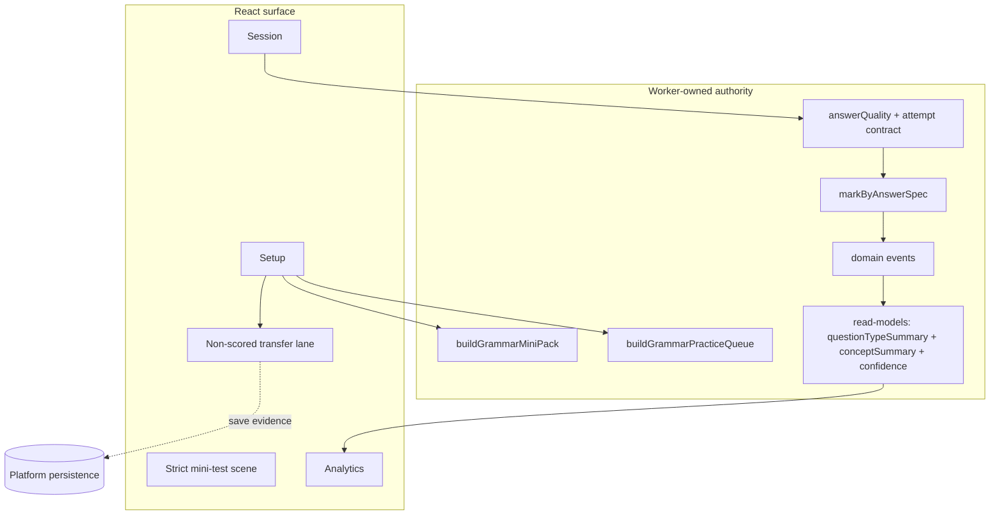
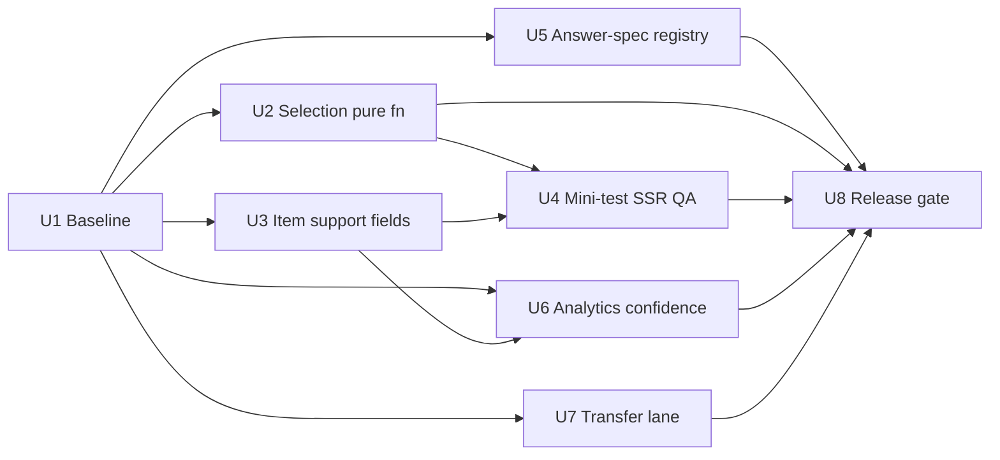

# feat: Grammar Perfection Pass

## Overview

Harden Grammar fidelity, fairness, and behavioural proof after Grammar Mastery Region (U1-U10 landed) and Grammar Functionality Completeness (U1-U8 landed). The current Grammar surface is a real Worker-owned subject with the full 18/51 content denominator, all eight legacy modes enabled, strict mini-test state, repair loop, AI safe lane, read aloud, adult evidence, and production smoke. An external review (`docs/plans/james/grammar/grammar-phase2.md`) identifies a fidelity-and-fairness gap: Grammar crossed the "functionality exists" line but not the "fairness, depth, and behavioural proof" line.

This plan does not reopen either shipped plan. It treats the review as a surface-level audit and routes the remaining issues into one focused perfection-pass plan. Issue 7 (mode focus handling) has already been addressed by `NO_STORED_FOCUS_MODES` / `NO_SESSION_FOCUS_MODES` and is covered by existing tests; the plan records that finding in the baseline and does not reimplement it. Issues 4 (content expansion) and 5 (transfer lane) are product decisions that were partly pre-empted by `docs/grammar-transfer-decision.md`; per user scope, the non-scored transfer writing lane is included here as a self-contained unit while broader content expansion is deferred to a follow-up content-release plan.

Gap matrix after research verification:

| Review issue | Code reality today | Planned unit |
|---|---|---|
| 1. Docs overclaim completeness vs behaviour tests | `docs/grammar-functionality-completeness.md` lists U2-U8 "Completed" with no perfection-pass caveat; behaviour tests exist but are coarse. | U1 baseline: record known gaps and mark review issues as planned / already-fixed / deferred. |
| 2. Adaptive selection thin (no recent-repeat penalty, no QT weakness) | `weightedTemplatePick` is internal; weights `strength`, `new/weak/due`, focus, generative only. `state.mastery.questionTypes` exists but is not read by selection. | U2 pure `buildGrammarPracticeQueue` extraction. |
| 3. Support scoring may be session-level | Already item-level: `supportLevel` + `attempts` persist per attempt in `state.recentAttempts`; Smart + `allowTeachingItems` still promotes session-wide support level via `supportLevelForSession`. | U3 rename + contract: `firstAttemptIndependent` / `supportUsed` / `supportLevelAtScoring`, fix session-vs-item regression for Smart + `allowTeachingItems`. |
| 4. Content gaps (2 explain templates, thin pools) | Counted per question-type: `classify`(1), `identify`(6), `choose`(16), `fill`(3), `fix`(11), `rewrite`(6), `build`(4), `explain`(2). | **Deferred to follow-up content-release plan.** U1 records per-question-type and per-concept floors as baseline. |
| 5. Transfer writing placeholder-only | `docs/grammar-transfer-decision.md` commits to non-scored lane first; no `transfer` mode exists. | U7 non-scored transfer lane. |
| 6. Strict mini-test needs harsher QA | Engine timer/unanswered/preservation behaviour exists and is unit-tested; no Playwright / cross-navigation-viewport coverage. | U4 strict mini-test SSR QA against `tests/react-grammar-surface.test.js`. |
| 7. Mode focus behaviour unclear | Already encoded: `NO_STORED_FOCUS_MODES` / `NO_SESSION_FOCUS_MODES`; trouble picks weakest via `weakestConceptIdForTrouble`; explicit payload focus still honoured. | **Verify-only** in U1; no reimplementation. |
| 8. Analytics confidence/sample-size | Read model exposes `attempts`, `correct`, `accuracyPercent`, `strength` only; scene shows raw counts, no low-n warning. | U6 confidence taxonomy + small-sample surfacing. |
| 9. Accepted-answer registry | Inline `accepted` arrays per item in `content.js`; no declarative answer-spec shape; grep shows zero uses of `acceptedSet`/`manualReviewOnly`/etc. | U5 declarative per-template answer spec. |

---

## Problem Frame

The Grammar product currently passes structural completeness tests (denominator, modes, mastered file layout) but is still vulnerable to the fairness and fidelity gaps the review names: adaptive selection that cannot surface due-weak-recent-wrong items strongly, support scoring that can be promoted to session level when Smart Review enables teaching items, strict mini-test QA that covers engine state but not the React flow a learner actually experiences, analytics that show a number without confidence, and accepted-answer marking that relies on inline arrays rather than a declarative contract. These gaps compound: a learner may appear to have "82% mastery" from thin evidence, or may be marked down for accepted punctuation variants the template did not anticipate.

The plan preserves the current production boundary: React renders controls and form state; scored selection, marking, mastery mutation, analytics, rewards, and support-level decisions remain Worker-owned. Content expansion (adding more explain/vocabulary/formality templates) is intentionally deferred because it is content work, not engine work, and should travel through a reviewed content-release path rather than riding along in a perfection pass.

---

## Requirements Trace

- R1. Extract template selection into an exported pure function with explicit weights for due, weak, recent-miss, question-type weakness, template freshness, concept freshness, and focus matching, so fairness is testable and reproducible.
- R2. Mini-set generation must use quota-aware balancing (concept quotas, question-type quotas, repeat caps) so a 12-question pack does not repeat the same template unless the pool forces it.
- R3. Support evidence must be item-attempt level, not session-level: Smart Review with `allowTeachingItems` enabled must not downweight an independent first-attempt correct response that did not actually consume worked/faded support.
- R4. Strict mini-test behaviour must be covered by behaviour-level React tests: answer preservation across navigation, timer expiry, unanswered handling, no early feedback, end-of-test review. Repair/support/AI-trigger actions must fail closed while an unfinished mini-test is active.
- R5. Analytics must expose and render concept strength with sample-size context: emerging / building / secure / needs-repair labels driven by a small-n threshold, with question-type evidence carrying the same confidence signal.
- R6. Accepted-answer handling must be declarative per template through a shared shape covering `exact`, `normalisedText`, `acceptedSet`, `punctuationPattern`, `multiField`, and `manualReviewOnly` kinds, with golden + near-miss examples tested.
- R7. Add a non-scored transfer writing lane that provides paragraph prompts, grammar-target checklist, saved evidence, and parent-review copy, without mutating mastery, scheduling, retry, monster progress, or SATs accuracy.
- R8. Ship a durable perfection-pass baseline (`docs/grammar-functionality-completeness.md` extended or a sibling doc) that records which review issues are completed, which are already-fixed, and which are deferred, so future "perfect" claims cannot drift.
- R9. Preserve all invariants from the source plans: Worker authority, no AI scoring, redacted read models, bundle lockdown, Spelling parity, full denominator, Punctuation identity, existing reward derivation.

**Origin actors:** A1 KS2 learner, A2 Parent or supervising adult, A3 Grammar subject engine, A4 Game and reward layer, A5 Platform runtime.

**Origin flows:** F1 Grammar practice without game dependency, F2 Monster progress as a derived reward, F3 Adult-facing evidence.

**Origin acceptance examples:** AE1 due review blocks monster progress, AE2 supported correctness gives lower gain, AE3 AI drill uses deterministic templates, AE4 parent report separates education evidence from rewards.

---

## Scope Boundaries

- Only Grammar is in scope. Do not change Spelling, Punctuation, or Bellstorm Coast scope beyond preserving existing bridge copy.
- Do not serve the legacy single-file HTML or reintroduce browser-local scoring authority.
- Do not store learner AI keys in the browser or call providers directly from React.
- Do not let AI author score-bearing Grammar items, mark free-text answers, or decide support levels.
- Do not add paragraph-level scored writing assessment. The transfer lane ships as non-scored only, per `docs/grammar-transfer-decision.md`.
- Do not expand the content denominator (new templates, new concepts, new misconceptions) in this plan. Content expansion travels through a separate reviewed content-release plan.
- Do not introduce Playwright or a new browser-test runner. Extend the existing `tests/react-grammar-surface.test.js` SSR harness and Worker runtime tests.
- Do not rename legacy mode ids, `contentReleaseId` values, or existing event names in a way that breaks stored state or analytics trend lines.
- Do not change Cloudflare deployment authentication or raw Wrangler workflows.

### Deferred to Follow-Up Work

- Content expansion: additional explain / vocabulary / formality / misconception-aware templates, and broadening narrow concept pools. Ship as `feat: Grammar Content Release N+1` once the perfection-pass engine is stable.
- Live AI provider integration for enrichment: remains deferred per `docs/grammar-ai-provider-decision.md`.
- Teacher-reviewed or deterministic paragraph scoring on top of the non-scored transfer lane: deferred per `docs/grammar-transfer-decision.md`.
- Playwright / real-browser coverage for Grammar: if ever introduced, it lands through a repo-wide test-runner decision, not this plan.
- Bellstorm Coast as its own rich Punctuation subject.

---

## Context & Research

### Relevant Code and Patterns

- `docs/brainstorms/2026-04-24-grammar-mastery-region-requirements.md` — product source of truth (R/A/F/AE carried forward).
- `docs/plans/2026-04-24-001-feat-grammar-mastery-region-plan.md` — shipped mastery plan (U1-U10 ✓); live checklist.
- `docs/plans/2026-04-25-001-feat-grammar-functionality-completeness-plan.md` — shipped completeness plan (U1-U8 ✓).
- `docs/plans/james/grammar/grammar-phase2.md` — review input being routed into this plan.
- `docs/grammar-functionality-completeness.md` — completeness baseline doc; U1 extends it.
- `docs/grammar-ai-provider-decision.md` — AI provider still deferred, deterministic fallback is the production contract.
- `docs/grammar-transfer-decision.md` — non-scored transfer lane first; teacher-reviewed scoring deferred.
- `worker/src/subjects/grammar/engine.js` — scoring, `answerQuality`, `supportLevelForSession` (line 464), `weightedTemplatePick` (line 525), `takeDueRetry`, `buildGrammarMiniSet` (line 808), attempt persistence (line 1478-1491), mini-test state (line 1079+).
- `worker/src/subjects/grammar/content.js` — 51 templates; per-question-type counts: classify 1, identify 6, choose 16, fill 3, fix 11, rewrite 6, build 4, explain 2; inline `accepted` arrays at e.g. lines 703, 719, 735.
- `worker/src/subjects/grammar/read-models.js` — `questionTypeSummaryFromState` (line 471-499), `recentActivityFromAttempts` (line 501+), concept status projection.
- `src/subjects/grammar/module.js` — React dispatch, focus-concept guards (`NO_STORED_FOCUS_MODES` mirror around line 27-30).
- `src/subjects/grammar/components/GrammarSessionScene.jsx` — strict mini-test UI, timer, navigation, repair controls.
- `src/subjects/grammar/components/GrammarAnalyticsScene.jsx` — concept / question-type / recent activity rendering (line 150+).
- `tests/grammar-engine.test.js` — 26 scenarios; covers support level per attempt, mini-set, mode focus matrix.
- `tests/react-grammar-surface.test.js` — SSR harness; strict mini-test flow regex coverage.
- `tests/worker-grammar-subject-runtime.test.js` — command contract, stale/idempotency, mode/template gates.
- `tests/grammar-functionality-completeness.test.js` — baseline-to-code cross-check.
- `tests/grammar-production-smoke.test.js` + `scripts/grammar-production-smoke.mjs` — API-contract smoke, forbidden-field scan; remains a manual post-deploy gate per institutional learning.
- `tests/fixtures/grammar-legacy-oracle/legacy-baseline.json` — 3957-line oracle pinning `contentReleaseId`, concepts, templates, expected marking.

### Institutional Learnings

- Characterisation-first oracle pattern (`tests/fixtures/grammar-legacy-oracle/`) is the accepted way to pin Grammar behaviour before refactoring — use for U2 selection extraction and U5 accepted-answer registry regression pass.
- Deterministic seeds + `mulberry32` variant `seededRandom(seed)` (engine line 230-238) keep selection replayable; never use live `Math.random()` inside selection once a session seed exists.
- Content-versioning pattern from `docs/spelling-content-model.md` supports publishing per-template answer specs as immutable snapshots keyed by `contentReleaseId`, rather than closure-embedded marker rules.
- Mutation-policy invariants (`docs/mutation-policy.md`) require `requestId`, `expectedLearnerRevision`, same-origin, idempotency receipts on any new commands; replayed reward events must no-op.
- Full-lockdown runtime (`docs/full-lockdown-runtime.md`) + public-output audit (`tests/build-public.test.js`) reject Worker-only engine/content in the browser bundle. Any new module created in U2/U5/U7 must live on the Worker side and stay out of the React surface import graph.
- `npm run smoke:production:grammar` is a manual post-deploy gate; do not wire it into `npm run check` or CI green.
- Spelling "live family leakage" regression (`docs/spelling-parity.md`) is the canonical hidden-answer-leakage warning — mirror for U4 strict mini-test review gating and U7 transfer-lane checklist rendering.

### External References

- External research is not needed. The work is dominated by local engine hardening, read-model contracts, React surface behaviour, and existing subject-runtime test patterns.

---

## Key Technical Decisions

- **Selection becomes a pure function:** `buildGrammarPracticeQueue({ mode, focusConceptId, dueQueue, mastery, recentEvents, questionTypeStats, seed, now })` is exported from Worker-side Grammar and used by the existing command handlers. Weights are explicit constants at the top of the module so they can be tuned by tests rather than inspected by reading code.
- **Mini-sets use a separate quota-aware pack builder:** Strict `satsset` packs come from `buildGrammarMiniPack({ size, focusConceptId, mastery, questionTypeStats, seed })` with concept quotas, question-type quotas, and per-template repeat caps. This is a specialised sibling of the general queue function, not a branch inside it.
- **Support fields are renamed and extended at the attempt level:** `state.recentAttempts[i]` gains `firstAttemptIndependent: boolean`, `supportUsed: 'none' | 'nudge' | 'faded' | 'worked' | 'ai-explanation-after-marking'`, and `supportLevelAtScoring: 0 | 1 | 2`. Legacy `supportLevel` + `attempts` remain for one release as derived / backcompat fields; both are read during scoring, but only the new fields are used by analytics and projections. Migration operates at **three layers**: (1) state reload — normalise older `state.recentAttempts[i]` at load time to synthesise the new fields from the old; (2) emitted events — `grammar.answer-submitted` **dual-writes** both shapes for one release so any event-log replayer sees consistent projections; (3) in-flight sessions — session snapshots stamp `supportContractVersion: 1 | 2` at `start-session` time and `submit-answer` honours the version the session began with, so a pre-deploy session does not read post-deploy semantics mid-flight.
- **Session-level support promotion is removed for independent attempts:** `supportLevelForSession` stops returning `1` for Smart + `allowTeachingItems` under `supportContractVersion: 2`. Support level is set by what actually happened on the attempt (mode + any in-session repair escalation), not by what the session setting allowed. Sessions stamped `supportContractVersion: 1` (pre-deploy) continue to honour the old promotion until they end, preserving learner-facing consistency with what the UI offered at session start.
- **`contentReleaseId` bump policy is explicit:** A bump is required when a template broadens or narrows accepted answers in a way a replayer would score differently. A bump is **not** required for a pure bug fix where the old marker produced a spec-violating false-positive (in that case, the attempt was wrongly marked correct under the old contract, and the fix is the point). The rule-of-thumb table: new `answerSpec.kind` introduced → bump; previously-accepted answer now rejected without spec justification → bump + fixture update; additive near-miss expansion that narrows accept → bump; tightening against a documented spec violation → no bump, but commit message cites the spec. U5 tests enforce the rule via a regression that fails if `GRAMMAR_CONTENT_RELEASE_ID` changes without a `tests/fixtures/grammar-legacy-oracle/release-notes.md` entry.
- **Accepted-answer registry lives alongside each template in `content.js`:** Each template declares `answerSpec: { kind, ...params, golden: [...], nearMiss: [...] }` where `kind` is `exact | normalisedText | acceptedSet | punctuationPattern | multiField | manualReviewOnly`. The existing `markStringAnswer` / inline `accepted` flow becomes a thin adapter that reads `answerSpec` via a new `markByAnswerSpec(answerSpec, response)` marker. No change to `contentReleaseId` unless a test finds marking behaviour changed; if it did, bump the release.
- **Analytics confidence is label-driven, not percentile-driven:** Five labels: `emerging` (<= 2 attempts), `needs-repair` (recent-misses >= 2 OR `weak` status), `consolidating` (strength >= 0.82 AND `correctStreak` >= 3 AND `intervalDays` < 7 — heavy same-week practice not yet spaced), `secure` (strength >= 0.82 AND `correctStreak` >= 3 AND `intervalDays` >= 7), `building` (everything else). This avoids labelling a concept with 100 attempts at 0.95 strength as "building" simply because the learner has not waited a week between practice sessions. The scene renders the label alongside the number; the read model carries the label.
- **Strict mini-test test coverage stays in `node:test` + SSR harness:** Extend `tests/react-grammar-surface.test.js` rather than adding Playwright. Behaviour under test: navigation preservation, timer expiry, unanswered handling, repair-command-fails-closed during active mini-test, end-of-test review reveals worked guidance only after finish.
- **Transfer lane is a new non-scored surface with its own module:** `src/subjects/grammar/transfer-lane.js` handles prompt selection, checklist state, evidence save through the platform's existing persistence path. It does not touch `worker/src/subjects/grammar/engine.js`, `state.mastery`, retry queues, or reward projection. Evidence is readable by adult surfaces but flagged `source: 'transfer-lane'` so analytics never mixes it with scored evidence.
- **Baseline doc, not a new doc:** U1 extends `docs/grammar-functionality-completeness.md` with a "Perfection Pass" section and a machine-readable row-per-issue table, rather than creating a third doc.

---

## Open Questions

### Resolved During Planning

- **Should Issue 7 (mode focus) be reimplemented?** No. Research shows `NO_STORED_FOCUS_MODES` / `NO_SESSION_FOCUS_MODES` already encode the intended behaviour and tests cover it. U1 records the finding.
- **Should content expansion (Issue 4) ship here?** No. Deferred to a reviewed content-release plan so the engine work can land first without content churn risk.
- **Should Playwright be added for Issue 6?** No. Extend existing SSR / `node:test` coverage to match repo convention.
- **Should the transfer lane affect mastery?** No. `docs/grammar-transfer-decision.md` is authoritative; transfer is non-scored.
- **Should `supportLevel` be renamed destructively?** No. Keep the old field for one release as backcompat; read-models and analytics consume the new fields.

### Deferred to Implementation

- **Exact weight constants for `buildGrammarPracticeQueue`:** Start from a first-pass table (due 2.2, weak 2.0, recent-miss 1.6, question-type weakness 1.3, template freshness 1.15, concept freshness 1.1, focus 1.8), then tune against oracle fixtures and hand-built scenarios.
- **Exact low-n thresholds for confidence labels:** Start from `<=2 attempts -> emerging`, tune with example learner fixtures.
- **Transfer-lane prompt catalogue size:** Ship with 8-12 seed prompts; expand through the content-release plan.
- **Whether to bump `contentReleaseId`:** Only if U5 marking behaviour changes vs oracle. Decided at implementation time by running the oracle fixtures through the new marker.

---

## High-Level Technical Design

> *This illustrates the intended approach and is directional guidance for review, not implementation specification. The implementing agent should treat it as context, not code to reproduce.*

---

## Implementation Units

- U1. **Extend Completeness Baseline for Perfection Pass**

**Goal:** Turn the review's nine findings into a durable baseline row in `docs/grammar-functionality-completeness.md`, record the already-fixed and deferred outcomes so "complete" cannot silently drift, and pin the per-question-type content-floor counts so content erosion is detectable.

**Requirements:** R8, R9

**Dependencies:** None.

**Files:**
- Modify: `docs/grammar-functionality-completeness.md`
- Modify: `tests/grammar-functionality-completeness.test.js`
- Create: `tests/fixtures/grammar-functionality-completeness/perfection-pass-baseline.json`
- Modify: `docs/plans/2026-04-24-001-feat-grammar-mastery-region-plan.md` (live checklist row)

**Approach:**
- Add a "Perfection Pass" section to the completeness doc with one row per review issue, owner unit or "already-fixed" / "deferred to content-release" / "deferred to test-runner decision".
- Encode per-question-type minimum counts for current content (classify 1, identify 6, choose 16, fill 3, fix 11, rewrite 6, build 4, explain 2) as a floor; any drop fails the test.
- Record the Issue 7 "verify-only" finding with a direct reference to `NO_STORED_FOCUS_MODES` / `NO_SESSION_FOCUS_MODES` and the test names that cover it.
- Update the mastery plan's live checklist with a pointer to this plan.

**Execution note:** Characterisation-first. Record today's truth before changing behaviour.

**Patterns to follow:**
- `tests/fixtures/grammar-functionality-completeness/legacy-baseline.json`
- Existing completeness-test loader in `tests/grammar-functionality-completeness.test.js`

**Test scenarios:**
- Happy path: baseline lists every Phase 2 review issue (I1-I9) with a resolution status (`planned`, `already-fixed`, `deferred`).
- Happy path: `already-fixed` rows reference at least one existing test by name.
- Happy path: `planned` rows reference exactly one owner unit in this plan.
- Happy path: per-question-type floor matches current `content.js` counts, and the test fails if any count drops.
- Edge case: adding a new template that brings a question type above its floor does not fail the test.
- Regression: removing a completed capability row fails the existing completeness test by missing row name.

**Verification:**
- The completeness doc and its fixture describe the current perfection-pass state machine-readably and the test fails on silent regression.

---

- U2. **Extract `buildGrammarPracticeQueue` as a Tested Pure Function**

**Goal:** Move template selection out of `weightedTemplatePick` into an exported, pure, seed-deterministic function with explicit weights for due, weak, recent-miss, question-type weakness, template freshness, concept freshness, and focus matching. Add a sibling `buildGrammarMiniPack` for strict mini-test quota-aware balancing.

**Requirements:** R1, R2, R9, AE1

**Dependencies:** U1.

**Files:**
- Modify: `worker/src/subjects/grammar/engine.js`
- Create: `worker/src/subjects/grammar/selection.js`
- Modify: `tests/grammar-engine.test.js`
- Create: `tests/grammar-selection.test.js`
- Test: `tests/worker-grammar-subject-runtime.test.js`

**Approach:**
- Export `buildGrammarPracticeQueue({ mode, focusConceptId, dueQueue, mastery, recentEvents, questionTypeStats, seed, now })` from a new `selection.js` module; re-export from `engine.js` so the command layer's import site changes minimally. `recentEvents` is projected from `state.recentAttempts` (in-memory, O(1)) rather than queried from `event_log` per call — the selection path is in the `submit-answer` hot path and must not introduce per-turn IO. The projection tolerates both pre-U3 and post-U3 attempt shapes via the same normalisation used in U3.
- Declare weight constants at module top (`WEIGHTS.due`, `WEIGHTS.weak`, `WEIGHTS.recentMiss`, `WEIGHTS.qtWeakness`, `WEIGHTS.templateFreshness`, `WEIGHTS.conceptFreshness`, `WEIGHTS.focus`, `WEIGHTS.generative`). Preserve existing bias magnitudes as the starting point.
- Read `recentEvents` (last N `grammar.answer-submitted`) to derive template-freshness penalty (last 3 attempts penalised) and recent-miss bonus (wrong within last 10 attempts).
- Read `questionTypeStats` (from `state.mastery.questionTypes`) to add question-type weakness weighting — a question type with strength below 0.5 or status `weak` boosts candidates of that type.
- Add `buildGrammarMiniPack({ size, focusConceptId, mastery, questionTypeStats, seed })` with concept quotas (aim for `ceil(size / 6)` per active domain), question-type quotas (prefer mixed), and per-template repeat caps (max 1 per mini-set unless pool smaller than needed).
- Have existing `nextItem` + `buildGrammarMiniSet` call the new functions; keep outer signatures stable.
- Run the Grammar legacy oracle fixtures through the new selection to confirm replay equivalence for the fixed-seed scenarios; update fixtures only if divergence is intended and justified.

**Execution note:** Write selection tests first against explicit fairness scenarios, then extract — the existing oracle pins marking fidelity but not selection fairness.

**Patterns to follow:**
- `worker/src/subjects/grammar/engine.js:230-238` seeded random
- `worker/src/subjects/grammar/engine.js:525-548` existing weighted pick
- `tests/fixtures/grammar-legacy-oracle/legacy-baseline.json` fixture loader

**Test scenarios:**
- Happy path: with all concepts new, the queue spreads across templates — a 12-question run uses at least 8 distinct templates when pool allows.
- Happy path: a concept marked `due` with recent misses dominates weighting above an untouched concept at equal pool size.
- Happy path: question-type stats with `build` at strength 0.3 increase the share of `build` templates in a 12-question queue compared with a flat baseline.
- Happy path: focus concept at 1.8x still allows non-focus templates when the focus pool is smaller than the queue size.
- Edge case: empty mastery / empty `recentEvents` collapses to the current baseline weighting and does not throw.
- Edge case: `buildGrammarMiniPack` with size 12 against a pool where every concept has at least 3 templates returns no duplicate template ids.
- Edge case: `buildGrammarMiniPack` with size 12 against a pool where a focused concept has only 2 templates falls back gracefully and documents the repeat in metadata.
- Integration: `nextItem` called from `submit-answer` continues to honour retry-queue priority over the general queue.
- Regression: running legacy oracle seeds through the new queue produces the same template ids that the existing tests pin, OR the fixture is updated with justification.
- Covers AE1. Regression: due-review items continue to block monster progress because selection surfaces them before untouched items, preserving secured-status ordering.

**Verification:**
- The pure function is covered by seed-deterministic tests; live `Math.random()` is absent from the selection path; fairness scenarios pass without manual tuning.

---

- U3. **Item-Level Support Contract and Smart Review Fix**

**Goal:** Make the attempt-level support contract explicit through renamed fields and remove the session-level support promotion that currently fires when Smart Review has `allowTeachingItems: true`.

**Requirements:** R3, R9, AE2

**Dependencies:** U1. Implementer should also re-read the Key Technical Decisions section above for the `supportContractVersion`, `deriveAttemptSupport`, and three-layer migration contract before starting this unit — U3 assumes those decisions as given.

**Files:**
- Modify: `worker/src/subjects/grammar/engine.js`
- Modify: `worker/src/subjects/grammar/read-models.js`
- Modify: `worker/src/subjects/grammar/commands.js`
- Create: `worker/src/subjects/grammar/attempt-support.js` (houses `deriveAttemptSupport`)
- Modify: `src/subjects/grammar/module.js` (only if dispatched payload shape changes)
- Modify: `tests/grammar-engine.test.js`
- Create: `tests/grammar-attempt-support.test.js`
- Test: `tests/worker-grammar-subject-runtime.test.js`
- Test: `tests/react-grammar-surface.test.js`

**Approach:**
- Add new fields to each attempt in `state.recentAttempts`: `firstAttemptIndependent: boolean`, `supportUsed: 'none' | 'nudge' | 'faded' | 'worked' | 'ai-explanation-after-marking'`, `supportLevelAtScoring: 0 | 1 | 2`. Keep `supportLevel` + `attempts` as read-only backcompat fields derived from the new fields.
- Derive `firstAttemptIndependent` as `attempts === 1 && supportUsed === 'none'`.
- Add `supportContractVersion: 1 | 2` to the session snapshot at `start-session`. Version 1 preserves the pre-deploy `supportLevelForSession` promotion (Smart + `allowTeachingItems` → 1). Version 2 is the new contract. `submit-answer` reads the session's stamped version, not the current module behaviour, so in-flight sessions are internally consistent with the UI they opened.
- Under `supportContractVersion: 2`, `supportLevelForSession(mode, prefs)` returns `0` for Smart + `allowTeachingItems: true`. The `1` semantics move into actual in-session repair escalation: `supportLevelAtScoring` only reaches `1` when the learner requested faded support for the current attempt, and only `2` when `worked` support was shown before the scored attempt.
- Attribute `ai-explanation-after-marking` as a `supportUsed` value that does NOT reduce mastery gain (post-marking enrichment). Update `answerQuality` so this value is treated as independent first-attempt credit.
- Extend `questionTypeSummaryFromState` + concept summary + `recentActivityFromAttempts` to read the new fields.
- **Three-layer migration.** (a) State reload: normalise older `state.recentAttempts[i]` on load — `supportUsed` defaults from mode + `supportLevel` (mode `worked` → `'worked'`, mode `faded` → `'faded'`, `supportLevel === 1` under Smart → `'faded'` as conservative fallback, otherwise `'none'`); `firstAttemptIndependent` defaults from `attempts === 1 && supportLevel === 0`. (b) Event emission: `grammar.answer-submitted` dual-writes both shapes for one release so `event_log` replayers see a consistent projection. (c) In-flight sessions: `supportContractVersion` above.
- Publish an `attemptSupportDerivation` pure function — `deriveAttemptSupport({ mode, supportLevel, attempts })` — used by both state-reload normalisation and event-log replay so the two paths cannot drift.

**Patterns to follow:**
- Existing `answerQuality` (engine line 444) weighting
- Existing `applyGrammarAttemptToState` attempt push (line 1478-1491)
- `docs/mutation-policy.md` envelope invariants

**Test scenarios:**
- Covers AE2. Happy path: Smart Review with `allowTeachingItems: true` under `supportContractVersion: 2`, independent first-attempt correct — quality is 5 (full credit), `firstAttemptIndependent: true`, `supportLevelAtScoring: 0`.
- Happy path: Smart Review with `allowTeachingItems: true`, learner requests faded then answers correctly — quality capped, `supportUsed: 'faded'`, `supportLevelAtScoring: 1`.
- Happy path: `worked` mode correct — `supportUsed: 'worked'`, `supportLevelAtScoring: 2`, quality reduced.
- Happy path: learner requests post-marking AI explanation — `supportUsed: 'ai-explanation-after-marking'`, mastery unchanged vs no enrichment.
- Happy path (in-flight session migration): session stamped `supportContractVersion: 1` continues to apply the old Smart + `allowTeachingItems` → 1 promotion on every submit until it ends, even after the engine module is upgraded to v2.
- Happy path (derivation exhaustiveness): `deriveAttemptSupport` maps every legal legacy combination — (mode, supportLevel, attempts) ∈ {worked/faded/smart/learn/trouble/surgery/builder/satsset} × {0,1,2} × {1,2,3+} — to a defined `(supportUsed, firstAttemptIndependent, supportLevelAtScoring)` triple; the ambiguous `(faded, 1, 2)` is tested to return `supportUsed: 'faded'`, not `'nudge'`.
- Happy path (event-log replay): a stream mixing pre-U3 events (with only `{supportLevel, attempts}`) and post-U3 events (with both shapes) projects to identical analytics as a pure post-U3 stream when run through `deriveAttemptSupport`.
- Edge case: a loaded older attempt without the new fields is normalised on read and emits the same read-model values as a fresh attempt with equivalent support.
- Edge case: dual-written events can be parsed by both a pre-U3 consumer (reading `supportLevel`) and a post-U3 consumer (reading `supportUsed`); neither crashes on the extra fields.
- Error path: invalid `supportUsed` string is normalised to `'none'` with a contained log, not a thrown error.
- Regression: `worked` / `faded` mode attempts still get reduced mastery gain at the same numerical magnitude as before this unit.
- Integration: analytics `questionTypeSummary` and `recentActivity` expose the new fields to the React surface.

**Verification:**
- Smart Review no longer penalises independent correctness; faded/worked/AI-post-marking semantics are driven by what happened on the attempt, not by what the session permitted.

---

- U4. **Strict Mini-Test Behaviour Coverage via SSR Harness**

**Goal:** Add behaviour-level React tests that prove the strict mini-test scene preserves answers across navigation, handles timer expiry, marks unanswered items without inventing a correct response, blocks repair/AI actions while unfinished, and reveals end-of-test review only after marking.

**Requirements:** R4, R9

**Dependencies:** U1, U3 (for support-attempt contract).

**Files:**
- Modify: `tests/react-grammar-surface.test.js`
- Test: `tests/worker-grammar-subject-runtime.test.js`
- Modify (if gaps surface): `worker/src/subjects/grammar/engine.js`
- Modify (if gaps surface): `src/subjects/grammar/components/GrammarSessionScene.jsx`

**Approach:**
- Use the existing SSR harness pattern already in `tests/react-grammar-surface.test.js` (`renderGrammarSurface`) to drive a strict `satsset` session through start → answer-Q1 → navigate-to-Q3 → answer-Q3 → navigate-back-to-Q1 → confirm-answer-still-there → finish.
- **Known SSR coverage limits** (disclosed so implementers do not over-trust this unit): the harness cannot observe pointer-capture, focus management, CSS overflow hiding, `scroll-into-view`, input IME, or timer rendering glitches. A visual `0:00` that is still server-side extendable could pass the harness as long as the Worker command layer rejects the extension. The plan accepts this trade-off; if a real-browser runner is ever adopted repo-wide, revisit these scenarios.
- Verify no feedback / worked / faded / AI-enrichment content appears in the rendered HTML strings before finish.
- Stub the Worker clock and call `finishMiniTest({ timedOut: true })` through the command boundary to assert the end-review state and that every answered item is marked once.
- Add a scenario where some items are left unanswered — confirm they are marked as unanswered in the end review and do not invent responses.
- Add a negative scenario: while a mini-test is active and unfinished, a `grammar.request-support` / `grammar.request-ai-enrichment` / `grammar.start-similar-problem` command fails with an existing contained error code and does not mutate mastery.
- If a gap appears in engine state preservation or command gating, fix it here rather than creating a new unit.

**Patterns to follow:**
- `tests/react-grammar-surface.test.js` existing SSR harness
- `worker/src/subjects/grammar/engine.js:1079-1144` mini-test state + unanswered handling
- `docs/spelling-parity.md` hidden-answer leakage discipline

**Test scenarios:**
- Happy path: answer Q1, navigate to Q3, navigate back — Q1 answer is preserved in rendered HTML.
- Happy path: finish with all answered — end review renders score, worked guidance, misconception tags; no guidance appeared mid-test.
- Happy path: timer expiry (via stubbed clock) auto-finishes with the same marking path and renders end review.
- Edge case: Q2 unanswered — end review marks Q2 as unanswered without inventing a correct response.
- Edge case: client-tampered timer value cannot extend an expired mini-test; Worker rejects with the existing contained error.
- Error path: support / AI-enrichment / similar-problem commands during an unfinished mini-test fail with `grammar_mode_unsupported` or the equivalent existing contained code; mastery unchanged.
- Integration: the React surface disables repair / AI buttons while a mini-test is active; rendered HTML does not include their affordances before finish.
- Regression: finishing the mini-test emits the expected `grammar.session-completed` event once and updates concept/template/question-type nodes from saved responses.

**Verification:**
- Strict mini-test behaviour is covered behaviourally in CI, not just at engine-state unit level.

---

- U5. **Declarative Accepted-Answer Registry**

**Goal:** Replace inline `accepted: [...]` arrays with a per-template `answerSpec` declaration, validate it at content-load time, add a `markByAnswerSpec(answerSpec, response)` marker, and ensure every constructed-response template ships with golden and near-miss examples as tests.

**Requirements:** R6, R9, AE3

**Dependencies:** U1.

**Files:**
- Modify: `worker/src/subjects/grammar/content.js`
- Create: `worker/src/subjects/grammar/answer-spec.js`
- Modify: `worker/src/subjects/grammar/engine.js` (only if scoring call sites change)
- Create: `tests/grammar-answer-spec.test.js`
- Create (conditional on release-id bump): `tests/fixtures/grammar-legacy-oracle/release-notes.md`
- Modify: `tests/grammar-engine.test.js`
- Test: `tests/worker-grammar-subject-runtime.test.js`
- Test: `tests/grammar-production-smoke.test.js`

**Approach:**
- Define `answerSpec` shape: `{ kind, params, golden: string[], nearMiss: string[] }` where `kind ∈ { 'exact', 'normalisedText', 'acceptedSet', 'punctuationPattern', 'multiField', 'manualReviewOnly' }`.
- Implement `markByAnswerSpec(answerSpec, response)` in a new `answer-spec.js` module. `exact` = case-sensitive equality; `normalisedText` = trim + collapse whitespace + case-fold for labels; `acceptedSet` = exact match against a small set; `punctuationPattern` = whitespace-insensitive punctuation-significant; `multiField` = per-sub-field specs recursively; `manualReviewOnly` = never auto-correct (used by transfer lane, defers to teacher workflow but in this plan only surfaces the "no auto-score" path).
- Add `answerSpec` to every constructed-response template in `content.js`. Existing inline `accepted` arrays become the `acceptedSet.params.values`, and existing misconception tagging moves into `answerSpec.params.misconception`.
- Replace the existing `markStringAnswer(resp, accepted, opts)` call sites with `markByAnswerSpec(template.answerSpec, resp)` — keep `markStringAnswer` as a thin adapter for one release to reduce blast radius.
- Load-time validation: every template that is constructed-response must carry an `answerSpec` with at least one `golden` example; the validator runs at module import and throws if any template is missing a spec.
- Run the Grammar legacy oracle fixtures through the new marker — if any fixture changes marking result, the test fails and forces a `contentReleaseId` bump per the Key Technical Decision table. Release-id changes require a `tests/fixtures/grammar-legacy-oracle/release-notes.md` entry describing the behavioural change and why it warrants a bump (broadening) versus a bug fix (no bump required, but commit message cites the spec).

**Patterns to follow:**
- `worker/src/subjects/grammar/content.js` existing per-item `accepted` arrays (e.g. lines 703-727)
- `worker/src/subjects/grammar/content.js` `markStringAnswer` call sites
- `docs/spelling-content-model.md` immutable snapshot discipline
- `tests/fixtures/grammar-legacy-oracle/legacy-baseline.json` marker fidelity

**Test scenarios:**
- Happy path: `acceptedSet` with two equivalent clause-combine sentences marks both as correct.
- Happy path: `normalisedText` for "subordinate clause" accepts `" Subordinate  Clause "` as equivalent.
- Happy path: `punctuationPattern` for parenthesis-commas scores a variant with optional surrounding commas as correct.
- Happy path: `multiField` for a rewrite-plus-justify task scores each sub-field independently.
- Happy path: `exact` closed-answer template still rejects near-miss punctuation.
- Edge case: every constructed-response template ships at least one `golden` and one `nearMiss` example; near-miss scores strictly below golden.
- Edge case: a template missing `answerSpec` fails content-load validation before production.
- Edge case: a template with a malformed `answerSpec` (missing `golden` array, unknown `kind`) fails load-time validation before any scoring call is made.
- Error path: malformed / empty learner response is normalised to a contained failure, not a crash.
- Regression: running the oracle fixture seeds through `markByAnswerSpec` produces the same correctness verdicts the oracle pins — or the fixture bump is explicit and justified.
- Regression: `GRAMMAR_CONTENT_RELEASE_ID` cannot change without a `tests/fixtures/grammar-legacy-oracle/release-notes.md` entry; the content-completeness test fails when the two diverge.
- Covers AE3. Integration: production smoke still derives answers from production-visible options and no answer keys leak into browser-visible read models.

**Verification:**
- Every constructed-response template has a declarative answer spec with golden and near-miss coverage; marking is reproducible and auditable per-template.

---

- U6. **Analytics Confidence and Sample-Size Surfacing**

**Goal:** Expose a confidence label alongside strength and sample-size context in the read model, and render it in both the learner and adult Grammar analytics surfaces.

**Requirements:** R5, R9, AE4

**Dependencies:** U1, U3.

**Files:**
- Modify: `worker/src/subjects/grammar/read-models.js`
- Modify: `src/subjects/grammar/components/GrammarAnalyticsScene.jsx`
- Modify: `src/subjects/grammar/components/GrammarSummaryScene.jsx`
- Modify: `src/platform/hubs/parent-read-model.js`
- Modify: `src/surfaces/hubs/ParentHubSurface.jsx`
- Test: `tests/worker-grammar-subject-runtime.test.js`
- Test: `tests/react-grammar-surface.test.js`
- Test: `tests/hub-read-models.test.js`
- Test: `tests/react-hub-surfaces.test.js`

**Approach:**
- Add a `confidence` field to each concept and question-type entry in the Grammar read model: `{ label: 'emerging' | 'building' | 'secure' | 'needs-repair', sampleSize: number, intervalDays: number, distinctTemplates: number }`.
- Threshold rules: `emerging` when `attempts <= 2`; `needs-repair` when `status === 'weak'` OR 2+ misses in `recentAttempts`; `secure` when `strength >= 0.82 AND correctStreak >= 3 AND intervalDays >= 7`; otherwise `building`.
- Scene: replace raw `82%` numerics with the confidence label + sample-size copy, e.g. `Building — 4 / 6 correct across 3 templates`.
- Parent surface consumes the same label taxonomy so adult evidence shares the same vocabulary as learner-facing analytics.
- Do not mutate underlying `strength`, `correctStreak`, or `dueAt` — confidence is a derived read-model projection.

**Patterns to follow:**
- `worker/src/subjects/grammar/read-models.js:471-499` existing question-type summary
- `src/subjects/grammar/components/GrammarAnalyticsScene.jsx:239-248` current question-type rendering
- `src/platform/hubs/parent-read-model.js` existing concept-evidence shape

**Test scenarios:**
- Happy path: new concept with 1 attempt correct surfaces as `emerging`, `sampleSize: 1`, single template.
- Happy path: concept with 9/10 correct across 5 templates over 8 days surfaces as `secure`.
- Happy path: concept with 100 attempts, `correctStreak: 10`, `strength: 0.95`, `intervalDays: 3` surfaces as `consolidating` (heavy same-week practice not yet spaced) — not `building` and not `secure`.
- Happy path: concept with 2 recent misses surfaces as `needs-repair` even if strength is above 0.6.
- Happy path: concept with 4/6 correct, 3 distinct templates, no recent misses, strength 0.7 surfaces as `building`.
- Edge case: untouched concept (attempts === 0) surfaces as `emerging` with `sampleSize: 0` and no misleading accuracy number.
- Edge case: malformed or missing question-type entry falls back to `emerging` without crashing the scene.
- Regression: strength / `correctStreak` / `dueAt` underlying values are unchanged; confidence is derived, not persisted.
- Integration: parent hub consumes the same confidence taxonomy; Grammar Analytics Scene and Parent Hub Surface render the label in the rendered HTML.
- Covers AE4. Integration: adult-facing report shows educational evidence with confidence labels before the derived monster progress, preserving the origin ordering rule.

**Verification:**
- Analytics and adult surfaces expose strength with evidence quality; a learner with thin evidence is no longer presented as "secure".

---

- U7. **Non-Scored Transfer Writing Lane**

**Goal:** Ship a non-scored transfer writing lane — paragraph prompts with grammar targets, learner checklist, saved evidence, adult-review copy — without touching mastery, scheduling, retry, rewards, or SATs accuracy.

**Requirements:** R7, R9

**Dependencies:** U1.

**Files:**
- Create: `src/subjects/grammar/transfer-lane.js`
- Create: `src/subjects/grammar/components/GrammarTransferScene.jsx`
- Modify: `src/subjects/grammar/components/GrammarPracticeSurface.jsx`
- Modify: `src/subjects/grammar/module.js`
- Create: `worker/src/subjects/grammar/transfer-prompts.js` (static prompt catalogue)
- Modify: `worker/src/subjects/grammar/commands.js` (non-scored save command only)
- Modify: `worker/src/subjects/grammar/read-models.js`
- Modify: `src/platform/hubs/parent-read-model.js`
- Modify: `src/surfaces/hubs/ParentHubSurface.jsx`
- Create: `tests/grammar-transfer-lane.test.js`
- Test: `tests/react-grammar-surface.test.js`
- Test: `tests/worker-grammar-subject-runtime.test.js`
- Test: `tests/hub-read-models.test.js`
- Modify: `docs/grammar-transfer-decision.md` (update status to "landed non-scored v1")

**Approach:**
- Static seed catalogue of 8-12 paragraph prompts, each with: title, paragraph brief, 2-4 explicit grammar targets (concept ids), a learner-facing checklist, and parent-review copy. Prompts are non-scored — `answerSpec.kind = 'manualReviewOnly'`.
- Worker command `grammar.save-transfer-evidence` accepts `{ promptId, writing, selfAssessment }`, validates length caps + same-origin + `requestId`, and persists through the existing subject-state path under a dedicated `transferEvidence` slot. Storage is **keyed per `promptId`**: each prompt holds its latest save plus the most recent 4 history snapshots (5 slots total per prompt). This keeps longitudinal evidence per prompt useful for adult review while preventing unbounded growth. Global cap: 20 distinct prompts; attempting to save for a 21st prompt fails closed with a contained error, prompting the learner to revisit an existing prompt.
- Evidence is flagged `source: 'transfer-lane'` and is never aggregated into `mastery`, `retryQueue`, `recentAttempts`, reward projection, or Concordium progress.
- React scene renders prompt → writing area → self-assessment checklist → save action. Adult surfaces read the saved evidence read-only; no scoring affordance.
- Entry point lives inside the Grammar practice surface as a distinct tab / panel marked non-scored. Setup scene lists it with the "coming next" copy replaced by a live entry point.
- Bundle audit: `transfer-prompts.js` is Worker-side and must not be imported into the React surface. React consumes the redacted prompt view through the existing read model.

**Patterns to follow:**
- `worker/src/subjects/grammar/commands.js` existing save-prefs command envelope
- `worker/src/subjects/grammar/read-models.js` redaction boundary
- `docs/grammar-transfer-decision.md` non-scored contract
- `src/platform/hubs/parent-read-model.js` adult evidence exposure

**Test scenarios:**
- Happy path: learner starts a transfer prompt, writes text, saves — evidence appears in `transferEvidence`, mastery / retry / reward state unchanged.
- Happy path: learner sees the grammar-target checklist; self-assessment state is saved alongside writing.
- Happy path: adult surface renders saved transfer evidence read-only with parent-review copy.
- Happy path: the transfer scene surfaces no score, no correctness feedback, no retry prompt.
- Edge case: empty writing is rejected client-side and server-side with a contained error; no evidence row is saved.
- Edge case: writing above the length cap is truncated at the worker boundary with a contained feedback message.
- Edge case: repeated save for the same prompt keeps the latest save plus the most recent 4 history snapshots (5 per prompt); older snapshots drop off in FIFO order.
- Edge case: saving for a 21st distinct prompt when 20 prompts are already stored fails closed with a contained `grammar_transfer_quota_exceeded` error; no existing prompt evidence is evicted.
- Edge case: adult surface renders per-prompt history in reverse-chronological order with the latest save at the top.
- Error path: attempt to use scored commands (`submit-answer`, `request-support`) on a transfer prompt fails with `grammar_mode_unsupported`.
- Regression: mastery, retry queue, reward projection, Concordium progress, and SATs accuracy do not change across any transfer-lane scenario.
- Integration: production bundle audit fails if `worker/src/subjects/grammar/transfer-prompts.js` appears in the browser output.
- Integration: parent hub reflects the new evidence lane without touching existing Grammar concept evidence ordering.

**Verification:**
- Non-scored transfer writing lane is live, auditable, and fully isolated from the scoring path.

---

- U8. **Perfection-Pass Release Gate**

**Goal:** Tie the plan together with an extended production smoke, an updated completeness baseline assertion, a bundle-audit refresh, and documentation that records the shipped perfection-pass evidence.

**Requirements:** R8, R9

**Dependencies:** U2, U3, U4, U5, U6, U7.

**Files:**
- Modify: `scripts/grammar-production-smoke.mjs`
- Modify: `tests/grammar-production-smoke.test.js`
- Modify: `tests/build-public.test.js`
- Modify: `tests/browser-react-migration-smoke.test.js`
- Modify: `docs/grammar-functionality-completeness.md`
- Modify: `docs/plans/2026-04-24-001-feat-grammar-mastery-region-plan.md` (live checklist)
- Test: `tests/grammar-functionality-completeness.test.js`
- Test: `tests/grammar-engine.test.js`
- Test: `tests/worker-grammar-subject-runtime.test.js`
- Test: `tests/react-grammar-surface.test.js`

**Approach:**
- Extend production smoke to exercise: a scored path with the new `buildGrammarPracticeQueue`, a strict mini-test end-to-end including unanswered handling, a Smart Review with `allowTeachingItems: true` asserting the session-level promotion has been removed, the new `answerSpec`-backed marking on at least one constructed-response template per kind, the confidence label in the analytics read model, and a non-scored transfer-evidence save.
- Refresh bundle / public-output audit to forbid `worker/src/subjects/grammar/selection.js`, `answer-spec.js`, and `transfer-prompts.js` in browser output.
- Update `docs/grammar-functionality-completeness.md` Perfection Pass rows from `planned` to `completed` (or `deferred` / `already-fixed` where explicit).
- Update the mastery plan live checklist with pointers to this plan's completed units.
- Do not wire the production smoke into `npm run check` (institutional learning: it is a manual post-deploy gate).
- Preserve external PR CI discipline: fix branch-caused failures; document infrastructure-only failures with deterministic local evidence before merge.

**Patterns to follow:**
- `scripts/grammar-production-smoke.mjs` existing API-contract shape
- `tests/build-public.test.js` forbidden-path assertions
- `docs/plans/2026-04-25-001-feat-grammar-functionality-completeness-plan.md` U8 release-gate posture

**Test scenarios:**
- Happy path: production smoke walks a normal practice session, strict mini-test, Smart Review + teaching items, and transfer-evidence save; every phase read model passes forbidden-field scan.
- Happy path: bundle audit fails when Worker-only selection / answer-spec / transfer-prompts modules leak into the browser output.
- Edge case (over-credit regression): smoke detects a Smart Review + teaching-items session where `supportLevelForSession` is still promoting session-wide and fails with a named assertion.
- Edge case (under-credit regression): smoke detects a session that legitimately used in-session faded escalation and asserts the resulting attempt carries `supportLevelAtScoring: 1` with reduced quality — catches a regression that silently drops support attribution.
- Error path: confidence read model missing `label` or `sampleSize` fails the smoke with a named assertion.
- Regression: Spelling parity tests, monster tests, subject-expansion conformance, and existing Grammar tests remain green.
- Integration: `docs/grammar-functionality-completeness.md` Perfection Pass rows are all `completed` or `deferred` with a pointer; no `planned` row survives without a deferral justification.
- Integration: `tests/fixtures/grammar-legacy-oracle/release-notes.md` exists iff `GRAMMAR_CONTENT_RELEASE_ID` changed during this plan; the test fails on either-without-the-other.

**Verification:**
- Grammar can be labelled perfection-pass complete only when baseline, focused tests, bundle audit, and production smoke agree.

---

## System-Wide Impact

- **Interaction graph:** Grammar Worker selection, content marking, scoring contract, read models, analytics, React session / setup / analytics / transfer surfaces, Parent/Admin hubs, persistence, production smoke, bundle audit.
- **Error propagation:** Contained Grammar error codes remain the surface (`grammar_mode_unsupported`, `grammar_session_stale`, `grammar_answer_invalid`, `grammar_ai_enrichment_invalid`); new failures reuse these codes rather than introducing parallel error vocabulary.
- **State lifecycle risks:** Attempt-field migration from old `supportLevel` to new `supportUsed` / `firstAttemptIndependent` / `supportLevelAtScoring`; stored transfer evidence cap; `answerSpec` load-time validation. All covered by tests.
- **API surface parity:** New commands (transfer evidence save) and renamed fields (attempt support) must follow the existing subject command envelope (`requestId`, `expectedLearnerRevision`, same-origin, idempotency) per `docs/mutation-policy.md`.
- **Integration coverage:** Unit tests insufficient — behaviour tests in the SSR harness, Worker runtime integration, persistence tests, hub surface tests, bundle audit, production smoke all required.
- **Unchanged invariants:** Spelling parity, full 18 / 51 Grammar denominator, Punctuation subject identity, existing monster derivation from secured evidence, reward idempotency on replay, `contentReleaseId` unless U5 marking behaviour changes.

---

## Risks & Dependencies

| Risk | Likelihood | Impact | Mitigation |
|------|------------|--------|------------|
| Selection extraction changes observed template choice for existing stored state | Medium | High | U2 pins legacy oracle seeds through the new queue; divergence forces explicit fixture bump with justification. |
| Support-field rename breaks stored learner state loads | Medium | High | U3 normalises older attempts at load time; keep legacy `supportLevel` as backcompat read-only for one release. |
| Session-level support removal accidentally under-credits existing in-session repair escalation | Medium | Medium | U3 moves the `1` semantics to per-attempt escalation; explicit tests pin the new behaviour against the old. |
| Confidence label taxonomy becomes inconsistent between learner and adult surfaces | Medium | Medium | U6 defines the label + thresholds once in the read model; both surfaces consume the same field. |
| `answerSpec` migration changes oracle marking outcomes | Medium | High | U5 runs fixtures through the new marker; any divergence bumps `contentReleaseId` with explicit commit message. |
| Transfer lane accidentally feeds mastery / rewards | Low | High | U7 flags evidence `source: 'transfer-lane'`; regression tests assert mastery / retry / reward state is unchanged across all transfer scenarios. |
| Event-log replay projects mixed pre-U3 and post-U3 payloads inconsistently | Medium | High | U3 dual-writes both shapes for one release and publishes a single `deriveAttemptSupport` function used by both state normalisation and event replay. |
| In-flight sessions at U3 deploy apply mixed contract across their own submissions | Medium | High | U3 stamps `supportContractVersion` at session start; `submit-answer` reads the stamped version, not the module-at-call-time behaviour. |
| Heavy same-week practice concepts labelled misleadingly as "building" | Medium | Medium | U6 introduces `consolidating` label for `strength >= 0.82 AND correctStreak >= 3 AND intervalDays < 7`; test pins the expected label. |
| `GRAMMAR_CONTENT_RELEASE_ID` bumped without justification or not bumped when broadening | Medium | High | U5 codifies the bump policy and U8 regression test pairs release-id changes with `tests/fixtures/grammar-legacy-oracle/release-notes.md` entries. |
| Perfection-pass plan overreaches into content expansion | Medium | Medium | Scope boundary explicitly defers content expansion to a separate content-release plan. |
| SSR harness misses a real-browser regression | Medium | Medium | Accepted trade-off per user decision; document the limit in U4 and revisit if a real-browser runner is ever adopted repo-wide. |
| External PR CI fails beyond local gates | Medium | High | Treat external CI investigation as a PR fix task; reproduce with package scripts, fix branch issues, document infra-only failures with local evidence before merge. |

---

## Documentation / Operational Notes

- Keep James-facing chat in Hong Kong Cantonese, but plan text, product copy, code comments, and docs in UK English.
- Update `docs/grammar-functionality-completeness.md` as the perfection-pass source of truth.
- Update `docs/grammar-transfer-decision.md` once U7 lands so the status reflects the non-scored v1 shipped.
- Production deployment remains behind existing package-script gates and logged-in or demo-backed production UI verification.
- PR merge readiness includes external CI status or documented external-CI diagnosis alongside local `npm test`, `npm run check`, smoke, and reviewer evidence.
- Do not introduce Playwright, raw Wrangler commands, or browser-held AI key workflows.

---

## Alternative Approaches Considered

- **Re-run the full Phase 0-8 review blueprint as eight separate plans.** Rejected. Issue 7 is already fixed, Issue 4 belongs in a reviewed content-release plan, and several of the phases (adult polish, visual/game polish) are implementation-level tweaks that do not need a new planning artefact. One focused perfection pass with explicit deferrals is cheaper to review and ship.
- **Add Playwright for the strict mini-test coverage in Issue 6.** Rejected. The repo uses `node:test` + SSR harness; introducing Playwright is a repo-wide test-runner decision that should not ride along in a fidelity plan. The SSR harness can express the behaviours the review names.
- **Expand content (Issue 4) inside this plan.** Rejected. Content expansion changes `contentReleaseId` risk surface, oracle fixtures, and mastery trend lines. It should travel through a content-release plan after the engine and marker are hardened.
- **Destructively rename `supportLevel` in one release.** Rejected. Stored learner state exists; a one-release backcompat shim reduces blast radius.
- **Make the transfer lane scored.** Rejected. `docs/grammar-transfer-decision.md` is authoritative; scored writing transfer requires teacher review workflow design that is out of scope here.
- **Skip the baseline unit and go straight to engine work.** Rejected. The review explicitly calls out docs overclaiming completeness; U1 captures today's truth before new work starts and prevents future drift.

---

## Sources & References

- **Origin document:** [docs/brainstorms/2026-04-24-grammar-mastery-region-requirements.md](../brainstorms/2026-04-24-grammar-mastery-region-requirements.md)
- **Source plans:** [docs/plans/2026-04-24-001-feat-grammar-mastery-region-plan.md](2026-04-24-001-feat-grammar-mastery-region-plan.md), [docs/plans/2026-04-25-001-feat-grammar-functionality-completeness-plan.md](2026-04-25-001-feat-grammar-functionality-completeness-plan.md)
- **Review input:** [docs/plans/james/grammar/grammar-phase2.md](james/grammar/grammar-phase2.md)
- Related code:
  - `worker/src/subjects/grammar/engine.js`
  - `worker/src/subjects/grammar/content.js`
  - `worker/src/subjects/grammar/read-models.js`
  - `worker/src/subjects/grammar/commands.js`
  - `src/subjects/grammar/module.js`
  - `src/subjects/grammar/components/GrammarSessionScene.jsx`
  - `src/subjects/grammar/components/GrammarAnalyticsScene.jsx`
- Related docs:
  - `docs/grammar-functionality-completeness.md`
  - `docs/grammar-ai-provider-decision.md`
  - `docs/grammar-transfer-decision.md`
  - `docs/mutation-policy.md`
  - `docs/spelling-parity.md`
  - `docs/spelling-content-model.md`
  - `docs/full-lockdown-runtime.md`
- Related tests: `tests/grammar-engine.test.js`, `tests/grammar-functionality-completeness.test.js`, `tests/grammar-production-smoke.test.js`, `tests/react-grammar-surface.test.js`, `tests/worker-grammar-subject-runtime.test.js`
- Related fixtures: `tests/fixtures/grammar-legacy-oracle/legacy-baseline.json`
