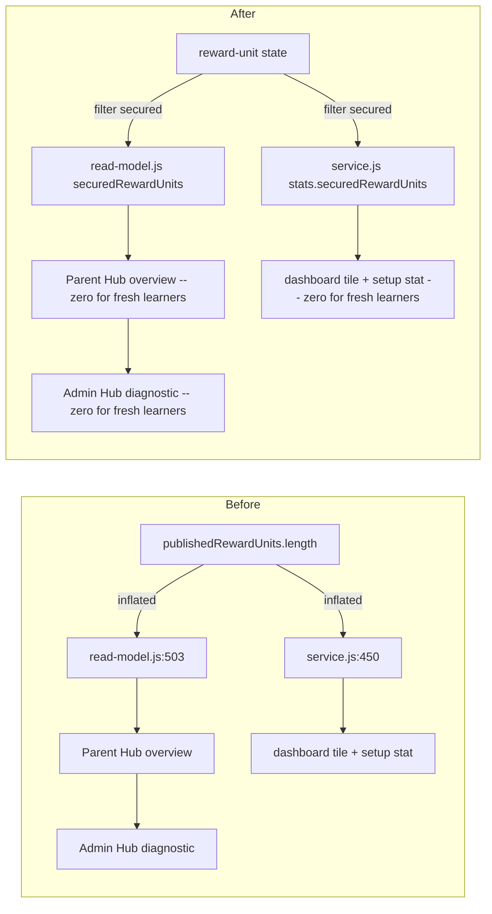
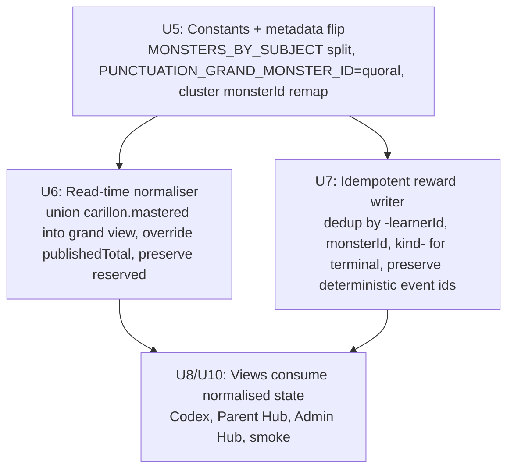
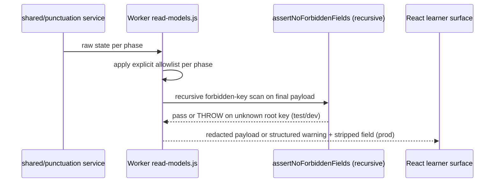

# feat: Punctuation Phase 2 Hardening and Monster Roster Reduction

## Overview

Punctuation reached production in two earlier plans (full 14-skill release and legacy parity). An audit found the subject is **production-capable but not production-perfect**: analytics inflate secured-unit counts to match published-unit counts, summary read-models leak through a clone-based redactor, guided `skillId` is dropped in the local fallback, and the React active-item surface hard-codes `disabled={false}`. At the same time, James decided to reshape the Punctuation monster roster from seven active creatures to **three active direct monsters plus one grand monster** (Pealark, Curlune, Claspin, grand Quoral), with Colisk, Hyphang, and Carillon reserved for future releases. Quoral changes role from a direct Speech creature to the grand aggregate, which is the highest-risk migration surface in the plan.

This plan fixes every audit finding, implements the roster reduction with a non-destructive read-time normaliser and idempotent write path, expands release smoke into a behavioural parity matrix, records an explicit "teacher/admin only" decision for the AI context-pack surface, and downgrades overclaiming learner copy until the matrix proves full parity. It ships as a **single coordinated release** so learners never see a half-migrated state (new copy against old rewards, or inflated secured counts on a supposedly fixed surface).

---

## Problem Frame

Today, a brand-new learner opening Punctuation sees "14 / 14 secured reward units" because `src/subjects/punctuation/read-model.js:503` and `shared/punctuation/service.js:450` both set `securedRewardUnits` to the length of the published reward-unit array instead of the count of units with demonstrated secure evidence. The bug radiates to Parent Hub (`src/platform/hubs/parent-read-model.js:185`), Admin Hub (`src/surfaces/hubs/AdminHubSurface.jsx:260`), the dashboard tile (`src/subjects/punctuation/module.js:37`), and the setup scope stat in `PunctuationPracticeSurface.jsx:34`. Parent Hub additionally shows `hasEvidence: true` for fresh learners because `read-model.js:492` treats `publishedRewardUnits.length > 0` as evidence.

The Worker already redacts active-item payloads with a forbidden-key scan, but `worker/src/subjects/punctuation/read-models.js:163-166` summary path is a pure `cloneSerialisable(summary)`. Active-item rubrics, generator seeds, and answer banks stay locked down; GPS summary, feedback review, AI context-pack, and Parent/Admin evidence can still leak if a new field is added upstream because the forbidden scan is top-level only and the summary path skips it entirely.

On the product side, the audit flagged three UX gaps: the React setup surface only renders four cluster buttons (Speech, Comma, Boundary, Structure) even though `PUNCTUATION_MODES` declares Endmarks and Apostrophe as first-class modes; the active-item choice/text inputs pass `disabled={false}` as a literal, so rapid double-clicks during `pendingCommand` can dispatch duplicate submissions; and the learner-facing copy still claims "full KS2 Punctuation mastery" in both the content manifest (`shared/punctuation/content.js:1929`) and the React fallback string.

The monster roster change is larger than it looks. Quoral's stored state in `child_game_state.punctuation.quoral` has `publishedTotal: 1` for learners who earned the Speech-core reward under the old mapping. When `PUNCTUATION_GRAND_MONSTER_ID` flips to `quoral`, the reader path at `src/platform/game/mastery/punctuation.js:31-34` trusts the stored `publishedTotal`, which means those learners would see Quoral at stage 4 off a single unit until a write-path normaliser repairs it. Similarly, Carillon's old aggregate state has all 14 mastery keys but is no longer iterated in active summaries — those keys disappear from the grand view unless explicitly unioned into Quoral at read time. The event log will also contain pre-flip `reward.monster:<…>:speech:<…>:quoral:caught` entries; post-flip writes produce `reward.monster:<…>:published_release:<…>:quoral:caught` entries — different dedupe keys, same semantic event.

The release-smoke gate covers Smart Review + GPS + Parent/Admin redaction + Spelling start. It says almost nothing about Guided, Weak, cluster focus modes, Combine, Paragraph, Transfer validators, or the analytics correctness we are fixing. And `tests/punctuation-legacy-parity.test.js` only checks string labels (`ported`/`replaced`/`rejected`) rather than behavioural golden paths.

The outcome we want is a single release where analytics are honest, read-models are fail-closed by construction, the active-item surface defends against double-submit, the monster roster matches James's decision without losing any learner's earned progress, and the smoke matrix behaviourally proves every mode the subject claims to support (see origin: [docs/plans/james/punctuation/punctuation-p2.md](james/punctuation/punctuation-p2.md)).

---

## Requirements Trace

**Analytics correctness**

- R1. `securedRewardUnits` must derive from reward-unit state (`status === 'secured'` or `securedAt > 0`), not from `publishedRewardUnits.length`.
- R2. Both `src/subjects/punctuation/read-model.js` and `shared/punctuation/service.js` must compute secured counts the same way; fixing one without the other leaves an inflated value in the setup tile.
- R3. `hasEvidence` must be false for a fresh learner (no attempts, no sessions).
- R4. Parent Hub, Admin Hub, dashboard tile, and setup scope stat must reflect the corrected count automatically; no parallel computation may live downstream of the fixed helpers.
- R5. Grand Quoral progress must reflect aggregate reward-unit evidence, not the union of stored-entry `publishedTotal` values.

**Read-model redaction**

- R6. `safeSummary`, GPS-review payload, Parent/Admin evidence output, feedback overlay, and AI context-pack summary must be allowlist-based (explicit field list and types), not clone-based.
- R7. A recursive `assertNoForbiddenFields(payload)` helper must run across every phase output (active item, feedback, summary, GPS review, analytics, Parent/Admin evidence, AI context pack).
- R8. Unknown keys at the root of any phase output must fail-closed: throw in test/dev, emit a structured warning and strip in prod. Unit tests guard this policy.
- R9. Forbidden keys cover accepted answers, correct indexes, rubric internals, validator definitions, generator seeds, hidden queues, unpublished content, raw solution banks.

**Guided and local-module parity**

- R10. `src/subjects/punctuation/module.js` `handleAction` for `punctuation-start` must forward `data.skillId` and `data.guidedSkillId` to `service.startSession` so the local fallback behaves identically to the Worker command path.
- R11. A targeted behavioural test proves guided start with `skillId: 'speech'` produces a speech-focused guided session in both Worker and local service paths.

**UI state machine and command dedup**

- R12. `PunctuationPracticeSurface.jsx` must derive `isDisabled` from a composite of `ui.pendingCommand`, `ui.awaitingAdvance`, `ui.phase`, `availability.status`, and `runtime.readOnly` (following the Spelling `SpellingSessionScene` pattern).
- R13. Answer controls are disabled during submitting, after final feedback, in GPS summary, in read-only/degraded mode, and when the availability gate is off.
- R14. The subject-command adapter dedupes concurrent submits by a per-command token rather than relying on the UI `isDisabled` state alone.
- R15. Late-arriving command responses are dropped when the session identity or learner identity no longer matches the dispatch context (e.g., learner switched, session reset, or new session started before the response returned). Drop behaviour is keyed on session id and learner id present at dispatch time, not on a new session-revision counter — the adapter already tracks these values.

**Monster roster reduction**

- R16. `MONSTERS_BY_SUBJECT.punctuation` is exactly `['pealark', 'curlune', 'claspin', 'quoral']`; `MONSTERS_BY_SUBJECT.punctuationReserve` is exactly `['colisk', 'hyphang', 'carillon']`.
- R17. `PUNCTUATION_GRAND_MONSTER_ID` is `'quoral'`; a new `PUNCTUATION_RESERVED_MONSTER_IDS` constant exports the reserved trio.
- R18. `shared/punctuation/content.js` cluster `monsterId` values map: `endmarks → pealark`, `apostrophe → claspin`, `speech → pealark`, `comma_flow → curlune`, `structure → curlune`, `boundary → pealark`. `PUNCTUATION_GRAND_MONSTER.monsterId = 'quoral'`.
- R19. `MONSTERS.quoral` metadata is rewritten to a grand creature: `nameByStage` grand progression (e.g. "Quoral Egg / Quoral / Voiceling / Choruscrest / Grand Quoral"), `blurb` reads "grand Bellstorm Coast creature for full Punctuation mastery", `masteredMax: 14`.
- R20. Active direct monsters' `masteredMax` values are recomputed from the post-flip cluster totals so Pealark/Curlune/Claspin stage thresholds still reach mega at 100% coverage.
- R21. Carillon stays in `MONSTERS` for asset/admin visibility; its blurb is rewritten to "reserved future Punctuation creature".

**Codex migration and state integrity**

- R22. A read-time normaliser in `src/platform/game/mastery/punctuation.js` unions stored `carillon.mastered[]` into the grand-view mastered set and preserves old `quoral`/`colisk`/`hyphang` direct mastered keys without showing them in active summaries.
- R23. The normaliser overrides stored `publishedTotal` on the Quoral entry to `aggregatePublishedTotal` (14) when the monster id equals `PUNCTUATION_GRAND_MONSTER_ID`, preventing stuck-at-1 display.
- R24. The normaliser is read-only (no mutation on load); the first post-flip reward write for the grand monster rewrites `publishedTotal` to the correct value, after which the stored entry is self-consistent.
- R25. Reserved monster ids are filtered out of active Codex, Parent Hub, and Admin Hub summaries; they remain visible in the Admin asset/visual validation tooling.
- R26. No stored entry is deleted during migration. All pre-flip learner progress remains readable indefinitely.
- R27. Mid-session learners continue without disruption: the service uses the new cluster map for reward writes; the normaliser fills the gap for view consumers; no forced refresh, no session invalidation.

**Reward projection idempotency**

- R28. `reward.monster:<…>:caught` events across the flip must not double-award mega stages. Event-log consumers must dedupe by `(learnerId, monsterId, kind, releaseId)` for terminal transitions so future release-14→release-15 upgrades still emit a legitimate new mega.
- R29. Command replay with the same request id produces zero additional Codex mastery keys and zero additional reward events.
- R30. A pre-flip + post-flip event sequence under manifest replay resolves to the same terminal Codex state as a post-flip-only sequence for the same secured units.

**Surface, copy, docs**

- R31. React setup surface exposes all six cluster focus buttons: End marks, Apostrophes, Speech, Commas and flow, Boundary, Structural.
- R32. `shared/punctuation/content.js` `publishedScopeCopy` and the `PunctuationPracticeSurface.jsx` fallback string both downgrade to honest coverage wording that reflects what the behavioural smoke matrix actually proves for this release.
- R33. `docs/punctuation-production.md` mastery-key example confirmed as `punctuation:<releaseId>:<clusterId>:<rewardUnitId>`; a migration-read fixture demonstrates an old-release mastery key is still readable under the new build.
- R34. The plan records the AI context-pack decision explicitly: stripping the field from the learner read model and designing a Parent/Admin-only surface are deferred to Phase 3. This release keeps the existing allowlisted `safeContextPackSummary` and runs the new recursive forbidden-key scan over its output.

**Release evidence**

- R35. `tests/punctuation-legacy-parity.test.js` adds behavioural golden paths for every legacy job type in scope: choose, insert, fix, combine, paragraph, transfer, guided, weak, GPS.
- R36. Release smoke (`scripts/punctuation-production-smoke.mjs` and `tests/punctuation-release-smoke.test.js`) expands to a matrix: Smart, Guided-with-skillId, Weak-with-seeded-weak, Endmarks focus, Apostrophe focus, Speech focus, Comma/Flow focus, Boundary focus, Structure focus, Combine, Paragraph, GPS delayed review, Transfer validator, Parent/Admin analytics correctness, disabled-subject gate, degraded-runtime gate.
- R37. Every smoke mode asserts a positive signal (e.g. Guided exposes `teachBox`, Weak selects a weak-facet unit first, GPS returns `feedback: null` during active-item phase) and the absence-of-leak invariants that apply to that mode.
- R38. `tests/bundle-audit.test.js` adds a regression fixture proving `src/subjects/punctuation/service.js` (browser-local re-export) cannot smuggle `shared/punctuation/service.js` into the production learner bundle.
- R39. Spelling tests and smoke paths continue to pass unchanged; no Spelling constants or behaviour are regressed by this plan.
- R40. The production-smoke matrix runs in a single `npm run smoke:production:punctuation` invocation that completes under the existing smoke-budget ceiling.

**Origin actors:** A1 Learner, A2 Parent or adult evaluator, A3 React client, A4 Worker runtime, A5 Punctuation engine, A6 Monster Codex projection, A7 Deployment verifier.

**Origin flows:** F1 Scientific practice loop (tighter analytics + guided routing), F2 Monster reward projection (roster flip + idempotency), F4 Production release gate (smoke matrix + bundle-audit regression).

**Origin acceptance examples:** AE1 (one correct answer does not equal mastery — tightened by R1-R3), AE3 (stable reward units survive generator expansion — preserved by R16-R27), AE4 (aggregate represents full published release — corrected by R23), AE5 (monsters are additive — preserved by R22-R26), AE6 (bundle audit blocks browser-owned engine — extended by R38), AE11 (read models are learner-safe — extended by R6-R9), AE12 (reward projection dedupes by release-scoped mastery unit — extended by R28-R30).

---

## Scope Boundaries

- Do not implement sentence-combining generators beyond the parity families already shipped by the legacy-parity plan.
- Do not change the 14-skill map, learning clusters, or the pedagogy layer; Phase 2 is a hardening pass, not a content redesign.
- Do not expose AI context pack to learners in this release. The Worker plumbing stays; the learner read model stops carrying it.
- Do not delete any stored Codex entry. Migration is strictly additive-read and normalising-write.
- Do not redesign Parent Hub / Admin Hub surfaces; restrict edits to fixing the ripple from the analytics fix and filtering reserved monsters from active summaries.
- Do not split the work across releases. A single release ships U1-U10 together; see Key Technical Decisions for rationale.
- Do not change the Worker subject-command route, the session state machine in `shared/punctuation/service.js`, or the D1 persistence shape beyond the normaliser.
- Do not regress English Spelling parity, Grammar functionality, or the Monster Visual Config tooling.
- Do not re-derive the monster roster decision. It was made in the origin (3 active + 1 grand, with Quoral as grand); this plan implements it.

### Deferred to Follow-Up Work

- **Full AI context-pack productisation:** Deferred until Phase 3. The learner-facing "Why this question?" button, the controlled post-feedback context-pack surface, and the operator copy live with a later release.
- **Transfer validator breadth:** Expanded validators for combine/paragraph beyond the currently-shipped set are deferred to Phase 3 content work.
- **Parent Hub analytics depth:** Daily goal charts, streak visuals, and richer misconception-pattern reporting are deferred. Phase 2 only ensures Parent Hub reads correct counts.
- **Legacy event-log backfill:** If telemetry analytics ever needs a consolidated view of pre-flip + post-flip `reward.monster` events, a dedicated backfill script is deferred; this plan only guarantees terminal-state correctness for future events.
- **Normaliser write-back consolidation:** The normaliser is read-only; a future release may add an opt-in one-shot rewrite that collapses stored reserved-monster entries into the aggregate, once Phase 2 has demonstrated stability.

---

## Context & Research

### Relevant Code and Patterns

- `src/subjects/punctuation/read-model.js:430-520` computes `secureItems`, `dueItems`, `weakItems` from `itemSnapshots` bucket states (correct pattern) but falls back to `publishedRewardUnits.length` for `securedRewardUnits` (buggy) — fix pattern already in-file.
- `shared/punctuation/service.js:440-470` contains the second copy of the secured-count bug; it is the authoritative source for `stats` returned to the dashboard tile and setup scope stat.
- `worker/src/subjects/spelling/read-models.js:3-34` demonstrates the allowlist-by-field pattern (`safePrompt`, `safeCurrentCard`, `safeSession`) Punctuation should extend to `safeSummary`, GPS review, Parent/Admin evidence, and AI context-pack outputs.
- `worker/src/subjects/punctuation/read-models.js:140-161` already implements `safeFeedback` as an allowlist — extend the same approach to every other phase output.
- `src/subjects/spelling/components/SpellingSessionScene.jsx:37,61-65,147,173,181,218` shows the pattern for `runtimeReadOnly`, `awaitingAdvance`, `pendingCommand`, and composite `disabled={awaitingAdvance || runtimeReadOnly || pending}`.
- `src/platform/runtime/subject-command-actions.js` is the shared command adapter introduced by the production-subject plan; Phase 2 extends it with a per-command token dedup and late-response revision guard.
- `src/platform/game/mastery/punctuation.js:31-34,115-207` is the reward reader/writer; lines 31-34 trust stored `publishedTotal` (needs override for grand Quoral), lines 155-163 spread `aggregateEntry` before `publishedTotal: aggregatePublishedTotal` so the later key wins (safe behaviour for upgrade path).
- `src/subjects/punctuation/event-hooks.js:27-56` is the reward subscriber; it already uses `cluster.monsterId` from the content manifest, so a cluster remap flows through automatically provided migration order is enforced.
- `src/platform/game/mastery/shared.js:65 ensureMonsterBranches` adds missing branches but never renames or aliases — a new `normalisePunctuationMonsterState()` helper is required.
- `scripts/audit-client-bundle.mjs:14-18,40` already blocks `shared/punctuation/service.js` imports and `createPunctuationService` text; the regression fixture in U10 proves the guard catches the re-export.
- `tests/bundle-audit.test.js` negative-fixture style is the template for the new re-export regression case.
- `shared/punctuation/legacy-parity.js:38-44 rowPresence` currently compares string sets; U9 keeps the matrix table and adds parallel `behaviouralGoldenPaths` that actually start sessions and complete items.
- `src/platform/hubs/parent-read-model.js:54-72,120-124,185-188` is the Parent Hub integration; fixing `read-model.js` and `service.js` propagates automatically because both already consume `progressSnapshot`.
- `src/surfaces/hubs/ParentHubSurface.jsx:18,49` and `src/surfaces/hubs/AdminHubSurface.jsx:260` render the ripple values; no source changes needed beyond the value fix.
- `scripts/punctuation-production-smoke.mjs:21-34` has a broader forbidden-key list than the in-code `FORBIDDEN_ITEM_FIELDS`; U2 aligns the two.

### Institutional Learnings

- **Spelling Extra monster-pool precedent** (`docs/brainstorms/2026-04-22-spelling-extra-expansion-requirements.md` R17-R18; `docs/architecture.md:75`): existing learner progress must remain unchanged when roster shapes change. Round-trip tests for old-state hydration are the guard.
- **Mutation policy idempotency** (`docs/mutation-policy.md`): `reward.monster` events already use deterministic dedupe keys; U7 extends dedupe to `(learnerId, monsterId, kind, releaseId)` at the projection layer for terminal transitions so the flip cannot double-emit a mega while future release-to-release megas still re-emit.
- **Full-lockdown degraded policy** (`docs/full-lockdown-runtime.md:42-46`): "while degraded, the shell must not start practice sessions, submit answers, mutate progress" — U4 surfaces this policy in the UI rather than inventing a client-only read-only flag.
- **State-integrity normaliser rule** (`docs/state-integrity.md:127-137`): malformed entries are normalised on hydrate and written back normalised. U6 follows this for the grand Quoral `publishedTotal` repair.
- **Scope-copy honesty precedent** (`docs/spelling-parity.md:93-101`): Spelling Extra copy explicitly stated what the smoke matrix proved, not what the asset manifest implied. Phase 2 mirrors that tone.
- **Worktree parallel strategy** (`docs/plans/2026-04-24-001-feat-punctuation-production-subject-plan.md:988-1014`): Lane C/E conflict on `src/platform/game/` is already documented; sequence U5/U6/U7 serially before the parallel UI/smoke work.

### External References

- No new external framework research is required. Every change uses repo-native patterns: Node `node:test`, existing Worker command route, D1 repository batch/CAS, React subject shell, allowlist redaction, bundle audit scripts, and the shared command-action adapter.

---

## Key Technical Decisions

- **Single release gate for U1-U10.** The correctness fixes, the monster roster flip, the migration normaliser, and the smoke matrix expansion must all land together. Shipping U1+U2 first would leave the overclaim copy live; shipping U5 before U6 would display Quoral at stage 4 off one unit; shipping U9 before U1 would fail on the inflated secured counts. A single release gate is the lowest-risk sequencing.
- **Fix analytics in both source files.** The secured-count bug has two copies (`src/subjects/punctuation/read-model.js:503,516` and `shared/punctuation/service.js:450`). Both must be fixed in the same commit to avoid the setup tile and Parent Hub diverging. U1 lists both files and their downstream test fixtures.
- **Read-time normaliser, not write migration.** Old Codex state for quoral/carillon/colisk/hyphang is preserved as stored. A `normalisePunctuationMonsterState(state)` helper projects the new active view (grand Quoral `publishedTotal = 14`, reserved entries hidden from active summaries, old carillon mastered keys unioned into grand). The first post-flip reward write for the grand monster organically rewrites the stored `publishedTotal`, after which the stored entry is self-consistent. No bulk mutation on load.
- **Fail-closed allowlist redaction.** Every phase output (active item, feedback, summary, GPS review, Parent/Admin evidence, AI context pack) is built from explicit field allowlists. `assertNoForbiddenFields(payload)` runs recursively on the final payload. An unknown key at the root of any phase output throws in test/dev and emits a structured warning + strips the field in prod. This matches the Spelling pattern and prevents the `safeSummary` clone class of bug from recurring.
- **Command dedup uses a per-command token, not UI state.** The subject-command-action adapter tracks an in-flight `commandId` and rejects duplicates at the adapter layer. The UI `isDisabled` boolean is a visual signal, not the safety mechanism. Late-arriving responses compare against the current `appliedRevision` and are dropped if stale.
- **AI context-pack stays untouched for this release.** The React learner surface does not read `contextPack`, and `safeContextPackSummary` is already allowlisted. Removing the field is Phase 3 work bundled with the learner-facing UX decision, not a hardening-pass deliverable. This release's contribution is running the new recursive forbidden-key scan over the existing allowlist, so any new field added upstream trips the fail-closed guard.
- **Reserved monsters stay in `MONSTERS`.** Colisk, Hyphang, and Carillon remain in `src/platform/game/monsters.js` with reserved blurbs so the Monster Visual Config tooling, asset manifest, and admin review flow continue to work. They are filtered out of active learner summaries via the new `PUNCTUATION_RESERVED_MONSTER_IDS` constant and Codex/hub filters.
- **Smoke matrix asserts positive signals, not just absence-of-leak.** Every mode in the matrix must have at least one assertion that proves the mode actually worked (e.g. Guided exposes a `teachBox`, Weak selects a weak-facet unit first, GPS returns `feedback: null` during active-item). Absence-of-leak assertions stay as a secondary gate.
- **Parity test grows a behavioural section, keeps the label section.** `tests/punctuation-legacy-parity.test.js` retains the ported/replaced/rejected label matrix for fast regression signalling. It adds a parallel `behaviouralGoldenPaths` section that starts sessions and completes one item per legacy job type, including the positive signals for each mode.

---

## Open Questions

### Resolved During Planning

- **Release gate — single or split across PRs?** Single. All of U1-U10 ship together.
- **AI context-pack UX — learner-facing, hidden, or left as-is?** Teacher/admin only; remove from learner read model.
- **Mid-session rollout policy — normaliser, degraded, or force refresh?** Read-time normaliser only. No forced refresh; no session invalidation.
- **Redaction unknown-key policy — fail-open or fail-closed?** Fail-closed: throw in test/dev, warn + strip in prod.
- **Should analytics fix live only in `read-model.js`?** No. `shared/punctuation/service.js:450` is the second source and must be fixed in the same commit.
- **Should the plan re-derive the monster roster decision?** No. The origin audit made the decision; this plan implements it.
- **Should Quoral's `nameByStage` and `blurb` change alongside `masteredMax`?** Yes — Quoral's role changes semantically; the copy must follow.
- **Is normaliser write-back required, or read-only?** Read-only for load phase, but NOT for mutations. The earlier "organic rewrite" claim is rejected by the actual code path — the aggregate writer at `src/platform/game/mastery/punctuation.js:155-163` is never reached when `recordPunctuationRewardUnitMastery` early-returns at line 139 for a learner whose only prior mastery is the old-quoral speech-core key. U7 adds an explicit write-through seam that bypasses that early-out when `publishedTotal !== aggregatePublishedTotal`.

### Deferred to Implementation

- **Exact function names inside the normaliser module.** Boundary is defined; naming can follow Spelling conventions when the file is created.
- **Precise stage thresholds for each active monster's new `masteredMax`.** U5 recomputes from cluster totals during implementation; exact integers follow the reward-unit count after remap.
- **Behavioural signal wording per smoke mode.** U10 defines the assertion shape; the final copy of positive-signal assertions follows the implemented API shape.
- **Whether Parent/Admin evidence surfaces need additional filter logic for reserved monsters beyond the active-summary filter.** Determined when the hubs consume the new filter.

---

## Output Structure

This is the expected shape of files touched or added. The per-unit file lists remain authoritative.

```text
shared/punctuation/
  content.js                   # cluster monsterId remap + publishedScopeCopy downgrade
  legacy-parity.js             # behavioural golden paths extension
  service.js                   # secured-count fix
src/subjects/punctuation/
  read-model.js                # secured-count + hasEvidence fix
  module.js                    # skillId routing + blurb/nextUp copy
  service.js                   # (unchanged; bundle audit regression test adds a fixture)
  event-hooks.js               # reward writer uses remapped cluster monsterId automatically
  components/
    PunctuationPracticeSurface.jsx  # state machine disabled prop + Endmarks/Apostrophe buttons + copy
worker/src/subjects/punctuation/
  read-models.js               # allowlist safeSummary + recursive forbidden scan + strip contextPack from learner payload
src/platform/game/
  monsters.js                  # MONSTERS_BY_SUBJECT split + Quoral grand metadata + Carillon reserved blurb
  mastery/
    shared.js                  # PUNCTUATION_GRAND_MONSTER_ID + PUNCTUATION_RESERVED_MONSTER_IDS
    punctuation.js             # normaliser + idempotent writer + publishedTotal override
  monster-system.js            # reserved filter for active summaries
src/platform/hubs/
  parent-read-model.js         # (no source change; consumes fixed helpers)
  admin-read-model.js          # (no source change; consumes fixed helpers)
src/platform/runtime/
  subject-command-actions.js   # per-command token dedup + stale-response revision guard
scripts/
  punctuation-production-smoke.mjs  # matrix expansion + positive signals + disabled/degraded gates
  audit-client-bundle.mjs      # (unchanged; regression fixture proves existing guard)
tests/
  punctuation-read-model.test.js        # securedRewardUnits + hasEvidence zero-state
  punctuation-service.test.js           # stats secured-count fix
  punctuation-read-models.test.js       # allowlist redaction fail-closed
  punctuation-monster-migration.test.js # normaliser + old-state hydration
  punctuation-rewards.test.js           # idempotent writer + event dedup across flip
  punctuation-guided-routing.test.js    # local-module skillId parity
  react-punctuation-scene.test.js       # state machine disabled + focus buttons + copy
  subject-command-actions.test.js       # command token dedup + stale-response drop
  punctuation-legacy-parity.test.js     # behavioural golden paths for all modes
  punctuation-release-smoke.test.js     # expanded matrix + positive signals
  bundle-audit.test.js                  # browser-local service re-export regression
  hub-read-models.test.js               # updated secured-count assertions + reserved-monster filter
  fixtures/punctuation-mastery-key-migration/  # old-release mastery-key fixture
docs/
  punctuation-production.md    # scope copy downgrade + mastery key fixture note + AI context-pack decision + roster docs
```

---

## High-Level Technical Design

> *This illustrates the intended approach and is directional guidance for review, not implementation specification. The implementing agent should treat it as context, not code to reproduce.*

### Analytics correctness ripple (before and after)



### Monster roster flip and migration lanes



### Redaction pipeline (fail-closed allowlist)



### Session state machine for UI disable

```text
idle         <- no pending command, phase = setup|active-item|feedback|summary
submitting   <- pending submit command in flight
awaitingAdvance <- feedback shown, continue/skip/end pending
readOnly     <- runtime.readOnly === true (platform-wide degraded)
degraded     <- availability.status === 'degraded'
availabilityOff <- availability.status === 'unavailable' (subject gate off)

disable answer controls when state in {submitting, awaitingAdvance, readOnly, degraded, availabilityOff}
```

---

## Phased Delivery

### Phase 1: Correctness blockers (U1-U4)

Analytics fix (both sources), redaction hardening with fail-closed policy, guided skillId routing parity, UI state machine with command adapter dedup. These land before any visible rollout because they affect trust: today's release misrepresents a fresh learner as having full mastery, and the summary path can leak unpublished content.

### Phase 2: Monster roster reduction (U5-U7)

Constants and metadata flip, read-time normaliser for old Codex state, idempotent reward writer and event dedup across the flip. This is the highest-risk Phase of the plan because it touches persistent state for every learner who has touched Punctuation since the production release.

### Phase 3: UX and honesty (U8)

Endmarks and Apostrophe focus buttons, scope-copy downgrade in both content manifest and React fallback, docs updates including mastery-key fixture and AI context-pack decision.

### Phase 4: Release evidence (U9-U10)

Behavioural parity matrix in `tests/punctuation-legacy-parity.test.js`, smoke matrix expansion in both `tests/punctuation-release-smoke.test.js` and `scripts/punctuation-production-smoke.mjs`, bundle audit regression for the browser-local re-export.

### Rollout Checkpoints

| Checkpoint | Units | Exposure rule | Must prove |
|---|---|---|---|
| Correctness landed internally | U1-U4 | No change to learner-visible state yet | Analytics honest, redaction fail-closed, guided skillId parity, UI disables. All targeted tests green. |
| Monster roster migrated internally | U5-U7 | No change to learner-visible state yet | Normaliser preserves old progress, grand Quoral reads correct denominator, no duplicate rewards on replay. |
| Copy and surface updated | U8 | Still pre-release; internal verification only | Setup shows all six cluster buttons; content copy honest; docs mention mastery-key fixture. |
| Full matrix green | U9-U10 | Release gate candidate | Behavioural parity matrix passes; smoke matrix + positive signals + disabled/degraded paths all pass; bundle audit regression passes. |
| Public release | - | Learners see the full hardened release | `npm test` + `npm run check` + `npm run audit:production` + `npm run smoke:production:punctuation` all green; post-deploy verification on `https://ks2.eugnel.uk`. |

---

## Implementation Units

- U1. **Fix the secured-reward-unit and hasEvidence analytics bugs**

**Goal:** Compute `securedRewardUnits` from actual secured evidence (not from published count) in both the client read-model and the shared service stats, and correct `hasEvidence` so a fresh learner reads false.

**Requirements:** R1, R2, R3, R4; supports A1, A2, F1, AE1.

**Dependencies:** None.

**Files:**
- Modify: `src/subjects/punctuation/read-model.js`
- Modify: `shared/punctuation/service.js`
- Modify: `tests/punctuation-read-model.test.js`
- Modify: `tests/punctuation-service.test.js`
- Modify: `tests/hub-read-models.test.js`
- Modify: `tests/helpers/react-render.js` (fixture values)

**Approach:**
- **Verify the reproduction path first.** `currentPublishedRewardUnits` already filters `progress.rewardUnits` entries that appear in `PUNCTUATION_CLIENT_REWARD_UNIT_KEYS`, so a fresh learner with empty `progress.rewardUnits` produces `length 0`, not 14. If `line 503/516` already behaves correctly, identify the actual source of the inflated 14/14 display — strong candidates include `src/subjects/punctuation/client-read-models.js:42` (`Number(stats.publishedRewardUnits) || 14` fallback) or a different hydration seam. Only touch code paths confirmed by a failing test.
- Replace `securedRewardUnits: publishedRewardUnits.length` with a predicate over reward-unit state (`rewardUnits.filter(u => u.status === 'secured' || u.securedAt).length`) in `src/subjects/punctuation/read-model.js:503,516` **if** the failing test pins the bug here.
- Apply the same change in `shared/punctuation/service.js:450` **if** confirmed buggy so the dashboard tile, setup scope stat, and home blurb reflect the fix.
- Change `hasEvidence` in `src/subjects/punctuation/read-model.js:492` to `attempts.length > 0 || sessions.length > 0`. Remove the `publishedRewardUnits.length > 0` and `itemSnapshots.length > 0` branches. (This half of the bug is verifiable independently of the inflated-count path.)
- Audit every downstream consumer of `securedRewardUnits` and `hasEvidence` listed in Context & Research; confirm they read the fixed values without parallel computation. If any consumer has a local copy of the bug, fix it in the same commit.
- Update test fixtures in `tests/helpers/react-render.js` and `tests/hub-read-models.test.js` only for the pinned call sites — cite exact line numbers (existing fixtures at lines 483, 492, 517, 566 use `securedRewardUnits: 1` consistent with one-secured evidence, so they may not need changes after verification).

**Execution note:** Use test-first implementation. Add the zero-state and single-attempt tests before changing the helpers; run them, see them fail with the old inflated values, then fix.

**Patterns to follow:**
- `src/subjects/punctuation/read-model.js:430-450` already computes `secureItems`, `dueItems`, `weakItems` from `itemSnapshots` bucket states — the same predicate shape applies to reward units.

**Test scenarios:**
- Happy path: fresh learner has `securedRewardUnits: 0`, `publishedRewardUnits: 14`, `hasEvidence: false`.
- Happy path: learner with one correct endmarks attempt has `securedRewardUnits: 0`, `hasEvidence: true` (attempt evidence).
- Happy path: learner with secure state on one reward unit has `securedRewardUnits: 1`.
- Edge case: Covers AE1. Fourteen published units with zero secured units still produces 0% mastery in the dashboard `pct` calculation; `stats.securedRewardUnits / stats.publishedRewardUnits = 0`.
- Edge case: `hasEvidence` is true when `sessions.length > 0` even with zero attempts (abandoned or reset sessions still count as evidence for Parent Hub surfacing).
- Integration: Parent Hub overview reads `overview.securePunctuationUnits = 0` for a fresh learner; Admin Hub diagnostic line matches.
- Regression: existing Punctuation analytics test that asserted `securedRewardUnits === 1` for a single-evidence learner must be updated to the new semantic (or moved to an attempts-only evidence assertion).

**Verification:**
- Dashboard tile shows 0 / 14 for a brand-new learner.
- Parent Hub overview shows 0 secured units for a fresh learner.
- Admin Hub diagnostic line shows 0 secured units for a fresh learner.

---

- U2. **Harden read-model redaction with allowlist + recursive forbidden-field scan**

**Goal:** Replace clone-based `safeSummary` with an explicit allowlist, add a recursive `assertNoForbiddenFields` helper applied across every phase output, enforce fail-closed unknown-key policy, and strip `contextPack` from the learner read model.

**Requirements:** R6, R7, R8, R9, R34; supports A3, A4, AE11.

**Dependencies:** None.

**Files:**
- Modify: `worker/src/subjects/punctuation/read-models.js`
- Modify: `tests/punctuation-read-models.test.js`
- Modify: `tests/worker-punctuation-runtime.test.js`
- Modify: `scripts/punctuation-production-smoke.mjs` (align `FORBIDDEN_PUNCTUATION_READ_MODEL_KEYS` with Worker in-code list)

**Approach:**
- Rewrite `safeSummary(summary)` as an explicit field allowlist (session id, mode, timing, counts, safe result rows, per-item review entries with redacted-display-answer where appropriate, misconception tags). No more `cloneSerialisable(summary)`.
- Add `assertNoForbiddenFields(payload, { phase })` that walks the final payload recursively and throws on any key in `FORBIDDEN_ITEM_FIELDS` or `FORBIDDEN_PUNCTUATION_READ_MODEL_KEYS`. Apply after building the phase output, before returning.
- Extend the forbidden key set to align with `scripts/punctuation-production-smoke.mjs:21-34` so the in-code and smoke-side lists match. Document the canonical list in `docs/punctuation-production.md`.
- Add a fail-closed unknown-key guard: for each phase output, assert the root object keys are a subset of the allowlist for that phase. In `process.env.NODE_ENV === 'test'` (covers CI + local dev), throw on unknown keys. In prod, emit a structured warning event and strip the unknown field. No separate env flag is introduced — `NODE_ENV` is already the repo's only runtime discriminator for this kind of behaviour.
- Leave the learner-phase `contextPack` field in place for this release. The React surface does not read `contextPack` today, and `safeContextPackSummary` at `worker/src/subjects/punctuation/read-models.js:168-182` is already an allowlist — there is no current leak to fix. Phase 3 will decide whether to strip the learner field or productise a safe Teacher/Admin-only surface, at which point the Parent/Admin auth boundary (see `docs/ownership-access.md` and the auth middleware in `worker/src/app.js`) will be exercised explicitly. Until then, the allowlist scan added for summary/feedback/GPS review applies to `safeContextPackSummary` as well so any new field at that layer trips the fail-closed guard.
- Ensure the new helper runs on summary, feedback, GPS review, Parent/Admin evidence, analytics payload, and AI context-pack summary.
- **PR hygiene rule** (applies to every future upstream field addition after this plan lands): any PR that introduces a new field in a service payload must update the Worker allowlist in the same PR. Merge-train collisions where field-addition PR A lands before allowlist PR B will fail CI non-deterministically because `NODE_ENV=test` causes the fail-closed guard to throw. Document this in the Worker README redaction section so reviewers enforce the rule.

**Execution note:** Test-first. Add a negative test that adds a fake `accepted` field to a summary payload and expects a throw; add a negative test for an unknown root key; fix the code until both pass.

**Patterns to follow:**
- `worker/src/subjects/spelling/read-models.js:3-34` — allowlist-by-field pattern.
- `worker/src/subjects/punctuation/read-models.js:140-161 safeFeedback` — already-allowlisted phase output; extend.
- `worker/src/subjects/punctuation/read-models.js:168-182 safeContextPackSummary` — already-allowlisted; keep as reference and consolidate the forbidden scan.

**Test scenarios:**
- Happy path: summary payload containing only allowlisted fields passes redaction unchanged.
- Happy path: GPS review payload passes with per-item review entries, safe corrections, misconception tags; no accepted-answer arrays present.
- Happy path: Parent/Admin evidence payload passes with weakest facets, recent mistakes (safe labels only), and counts.
- Edge case: injecting `accepted: ['foo']` anywhere in a summary throws because the recursive scan catches the forbidden key at any depth.
- Edge case: injecting `validator: {}` at nested depth inside a misconception-observation record throws.
- Edge case: unknown root key on summary (e.g. `{ score, mode, experimentalFlag: true }`) throws in test/dev, warns + strips in prod.
- Edge case: `contextPack` field is absent from the learner-phase read model. It remains present in Parent/Admin evidence.
- Edge case: Covers AE11. Live, feedback, summary, analytics, unavailable, and error read-model snapshots contain only their allowed fields and pass the recursive scan.
- Regression: existing `safeFeedback` tests still pass unchanged (the pattern is consistent, so no behaviour change expected).

**Verification:**
- Smoke-side and Worker-side forbidden-key lists are identical (single source of truth).
- No production phase output in the codebase is built via `cloneSerialisable` without a subsequent allowlist filter.
- `contextPack` cannot appear in the learner-phase read model.

---

- U3. **Restore guided `skillId` routing in the local-module fallback**

**Goal:** Ensure `src/subjects/punctuation/module.js` `handleAction` passes `data.skillId` (and `data.guidedSkillId`) through to `service.startSession`, matching the Worker command handler's behaviour.

**Requirements:** R10, R11; supports A1, A3, F1.

**Dependencies:** None.

**Files:**
- Modify: `src/subjects/punctuation/module.js`
- Create: `tests/punctuation-guided-routing.test.js`

**Approach:**
- In `src/subjects/punctuation/module.js:55-62`, extend the spread used for `service.startSession` to forward `skillId` and `guidedSkillId` when present on `data`.
- Add a targeted behavioural test that starts a guided session via the local-module fallback with `{ mode: 'guided', skillId: 'speech' }` and verifies the active item belongs to the speech skill.
- Add a parallel test via the Worker command path for parity; the Worker test can reuse existing runtime fixtures.

**Patterns to follow:**
- `shared/punctuation/service.js:1269-1274` where `requestedGuidedSkillId` is already accepted from `options.skillId` or `options.guidedSkillId`.

**Test scenarios:**
- Happy path: local-module `handleAction({ type: 'punctuation-start', data: { mode: 'guided', skillId: 'speech' } })` produces a session with `session.mode === 'guided'` and `currentItem.skillId === 'speech'`.
- Happy path: Worker command `start-session` with `{ mode: 'guided', skillId: 'apostrophe_contractions' }` produces the same result — parity confirmed.
- Edge case: an invalid `skillId` falls back to the weakest eligible skill (existing service behaviour) without throwing.
- Edge case: `guidedSkillId` alias is respected identically to `skillId` when provided by older clients.

**Verification:**
- Local fallback and Worker command produce equivalent guided-session shapes for the same input.

---

- U4. **Add session UI state machine with command-adapter dedup**

**Goal:** Replace hardcoded `disabled={false}` in `PunctuationPracticeSurface.jsx` with a composite disable signal derived from `pendingCommand`, `awaitingAdvance`, `availability.status`, and `runtime.readOnly`; add per-command token dedup and stale-response revision guard to the subject-command-action adapter.

**Requirements:** R12, R13, R14, R15; supports A1, A3, F1.

**Dependencies:** None (can parallel-run with U1-U3).

**Files:**
- Modify: `src/subjects/punctuation/components/PunctuationPracticeSurface.jsx`
- Modify: `src/subjects/punctuation/service-contract.js` (add `awaitingAdvance` / `pendingCommand` to `createInitialPunctuationState` if not already present)
- Modify: `src/platform/runtime/subject-command-actions.js`
- Modify: `tests/react-punctuation-scene.test.js`
- Modify: `tests/subject-command-actions.test.js`

**Approach:**
- Add `pendingCommand` and `awaitingAdvance` to the React `ui` state shape (following `SpellingSessionScene.jsx:61-65`).
- Derive `isDisabled = Boolean(pendingCommand) || Boolean(awaitingAdvance) || runtimeReadOnly || availability.status === 'degraded' || availability.status === 'unavailable'`.
- Apply `disabled={isDisabled}` on all answer controls (choice buttons, text input, submit, skip, continue, end).
- Wire Punctuation's action config to the existing `pendingKeys` + `dedupeKey` mechanism at `src/platform/runtime/subject-command-actions.js:55-60` rather than rebuilding it. Supply a subject-appropriate `dedupeKey` (default: command name) so rapid duplicate dispatches are rejected by the shared adapter. Spelling already relies on this mechanism; do not refactor it.
- For stale responses: after a command returns, compare the dispatch-time `learnerId` / `sessionId` snapshot against the current adapter state. If the learner switched or the session id changed mid-flight, drop the response and log a `punctuation-command-stale-response-drop` warning via `logMutation`. Do not introduce a new session-revision counter — the repo does not currently track one for Punctuation sessions.
- Stuck-command recovery is out of scope for Phase 2. Platform-level retry already exists via `SubjectRuntimeFallback` — do not add a Punctuation-specific 30-second timeout or visibility-change listener in U4. If stuck-command recovery proves insufficient in practice, open a separate platform work item.

**Patterns to follow:**
- `src/subjects/spelling/components/SpellingSessionScene.jsx:37,61-65,147,173,181,218` for the composite disable signal.
- `src/platform/runtime/subject-command-client.js` for existing stale-write retry behaviour; extend rather than invent.
- `docs/full-lockdown-runtime.md:42-46` for the degraded-policy rule set.

**Test scenarios:**
- Happy path: during a pending submit, choice buttons render disabled; after response, they re-enable.
- Happy path: in feedback phase (`awaitingAdvance: true`), answer controls are disabled; continue button remains enabled.
- Happy path: when `availability.status === 'unavailable'`, start session button is disabled with a clear message.
- Edge case: rapid double-click on submit dispatches only one command (adapter-level dedup by `commandId`).
- Edge case: response for a stale `commandId` (learner switched or session reset mid-flight) is dropped and does not mutate UI state.
- Edge case: when a command genuinely hangs, the existing `SubjectRuntimeFallback` platform retry path remains the recovery surface (not a Punctuation-local timeout).
- Edge case: when `runtime.readOnly === true` (platform-wide degraded), no Punctuation mutations are dispatched.
- Integration: Covers AE11 in spirit. Browser tab hidden/refocused mid-submit does not lose command state; the response arriving after refocus is applied if revision matches.
- Regression: Spelling session scene disable behaviour is unchanged; `tests/react-spelling-scene.test.js` still passes.

**Verification:**
- No UI control in the Punctuation active-item flow renders `disabled={false}` as a literal.
- The adapter's dedup and stale-response guard are proven in tests with deterministic clock control.

---

- U5. **Reshape the monster roster: 3 active direct + 1 grand + 3 reserved**

**Goal:** Reduce `MONSTERS_BY_SUBJECT.punctuation` to four active monsters, add a reserved list for Colisk/Hyphang/Carillon, flip `PUNCTUATION_GRAND_MONSTER_ID` to Quoral, remap cluster `monsterId` values, rewrite Quoral metadata to grand-creature role, and recompute active direct monsters' `masteredMax`.

**Requirements:** R16, R17, R18, R19, R20, R21, R39; supports A6, F2, AE3, AE4.

**Dependencies:** None directly, but U6 and U7 depend on this unit's constants and remapped content.

**Files:**
- Modify: `src/platform/game/monsters.js`
- Modify: `src/platform/game/mastery/shared.js`
- Modify: `shared/punctuation/content.js` (cluster `monsterId` remap + `PUNCTUATION_GRAND_MONSTER.monsterId = 'quoral'`)
- Modify: `src/surfaces/home/data.js` — line 34 is the `CODEX_POWER_RANK` ordering scalar (`carillon: 11`); decide during implementation whether `quoral` should inherit that rank for Codex layout and whether `carillon` remains at its current rank or moves. Line 758 is the actual grand-release copy branch (`monsterId === 'carillon'` → "Published punctuation release"); switch the grand copy to `quoral` and render a reserved blurb for `carillon`. Re-grep the file before editing to confirm no other hard-coded `carillon`/`quoral` references remain.
- Modify: `src/platform/game/mastery/spelling.js` (transitive consumers of `activePunctuationMonsterSummaryFromState` at lines 145 and 170 — no source change expected, but confirm no ordering assumption depends on the old monster list)
- Modify: `tests/punctuation-rewards.test.js` (roster assertions)
- Modify: `tests/monster-system.test.js` (active + reserved roster expectations)

**Approach:**
- Edit `MONSTERS_BY_SUBJECT` in `src/platform/game/monsters.js:186`: `punctuation: ['pealark', 'curlune', 'claspin', 'quoral']`; add `punctuationReserve: ['colisk', 'hyphang', 'carillon']`.
- Keep all seven monster definitions in `MONSTERS`. Rewrite Quoral entry to grand-creature semantics: `blurb: 'The grand Bellstorm Coast creature for full Punctuation mastery.'`, `nameByStage: ['Quoral Egg', 'Quoral', 'Voiceling', 'Choruscrest', 'Grand Quoral']`, `masteredMax: 14`. Rewrite Carillon blurb to "reserved future Punctuation creature". Colisk and Hyphang blurbs note reserved status.
- Recompute `masteredMax` for Pealark (endmarks + speech + boundary reward-unit count), Curlune (comma_flow + structure reward-unit count), Claspin (apostrophe reward-unit count) so stage thresholds match post-flip cluster totals.
- Edit `src/platform/game/mastery/shared.js:22`: `export const PUNCTUATION_GRAND_MONSTER_ID = 'quoral';` and add `export const PUNCTUATION_RESERVED_MONSTER_IDS = Object.freeze(['colisk', 'hyphang', 'carillon']);`.
- Edit `shared/punctuation/content.js` cluster entries (lines 200-243): remap `monsterId` for each cluster per R18. Edit `PUNCTUATION_GRAND_MONSTER` (lines 245-249) `monsterId` to `'quoral'`.
- Ensure `PUNCTUATION_MONSTER_IDS` derives from `MONSTERS_BY_SUBJECT.punctuation` (active only), not the old hardcoded list.
- Update `src/surfaces/home/data.js` so the home-surface grand-release display uses `quoral` (not `carillon`). The `monsterId === 'carillon'` copy branch at line 758 either renders the reserved blurb or is rerouted to `quoral` depending on which surface consumes it; confirm during implementation and keep the legacy ordering index if Codex layout depends on it.
- Add a test that `PUNCTUATION_ACTIVE_MONSTER_IDS` = `['pealark', 'curlune', 'claspin', 'quoral']` and `PUNCTUATION_RESERVED_MONSTER_IDS` = `['colisk', 'hyphang', 'carillon']`.

**Patterns to follow:**
- `MONSTERS_BY_SUBJECT.spelling` composition for roster shape.
- `src/platform/game/monsters.js` existing stage-threshold helpers for `masteredMax` resolution.

**Test scenarios:**
- Happy path: `MONSTERS_BY_SUBJECT.punctuation` returns exactly the four active ids in order; `MONSTERS_BY_SUBJECT.punctuationReserve` returns exactly the three reserved ids.
- Happy path: `PUNCTUATION_GRAND_MONSTER_ID === 'quoral'`.
- Happy path: `PUNCTUATION_CLUSTERS` cluster `monsterId` mapping matches R18.
- Happy path: `PUNCTUATION_GRAND_MONSTER.monsterId === 'quoral'` and `PUNCTUATION_GRAND_MONSTER.id === 'published_release'`.
- Happy path: Covers AE3. Securing all published Apostrophe reward units moves Claspin to the post-flip `masteredMax` stage threshold regardless of generated template count.
- Happy path: Covers AE4. Securing all 14 published reward units moves grand Quoral to stage 4 with `masteredMax: 14`.
- Edge case: Quoral's `nameByStage` contains five entries; Carillon's blurb mentions "reserved".
- Regression: Spelling monster ids (`inklet`, `glimmerbug`, `phaeton`, `vellhorn`) unchanged.
- Regression: existing Monster Visual Config asset tests still pass for Colisk, Hyphang, Carillon because the entries remain in `MONSTERS`.

**Verification:**
- `MONSTERS_BY_SUBJECT` layout matches origin decision.
- Cluster remap is consistent across content manifest and reward-projection code paths.

---

- U6. **Add a read-time Codex normaliser for old Punctuation monster state**

**Goal:** Preserve every pre-flip learner's earned mastery by introducing a read-time `normalisePunctuationMonsterState(state)` that projects the new active view (grand Quoral with correct denominator, reserved entries hidden, old Carillon mastered keys unioned into grand).

**Requirements:** R5, R22, R23, R24, R25, R26, R27; supports A1, A6, AE4, AE5.

**Dependencies:** U5 (needs the new constants and cluster remap).

**Files:**
- Modify: `src/platform/game/mastery/punctuation.js`
- Modify: `src/platform/game/mastery/shared.js` (expose normaliser if shared helpers are required)
- Modify: `src/platform/game/monster-system.js` (filter reserved from active summaries)
- Create: `tests/punctuation-monster-migration.test.js`

**Approach:**
- Add `normalisePunctuationMonsterState(state)` that returns a view object with:
  - `active`: `{ pealark, curlune, claspin, quoral }` only.
  - `quoral.mastered`: union of stored `quoral.mastered` + stored `carillon.mastered` (de-duplicated by mastery key).
  - `quoral.publishedTotal`: overridden to `aggregatePublishedTotal` (14 for the current release) when `PUNCTUATION_GRAND_MONSTER_ID === 'quoral'`, regardless of stored value.
  - `reserved`: `{ colisk, hyphang, carillon }` kept for Admin visibility, hidden from active Codex/Parent/Admin summaries.
- The normaliser is **referentially transparent**: it does not mutate `state` or its nested arrays; running it N times returns the same view. Test this explicitly.
- Wire the normaliser into **every** read seam that exposes Punctuation monster state. This includes:
  - `activePunctuationMonsterSummaryFromState` (`src/platform/game/mastery/punctuation.js:46-49`) — the exported helper consumed by Codex surface and transitively by `src/platform/game/mastery/spelling.js:145,170` for Spelling-composed views.
  - `progressForPunctuationMonster` (`src/platform/game/mastery/punctuation.js:51-64`) — per-monster progress reader.
  - `punctuationMonsterSummaryFromState` (`src/platform/game/mastery/punctuation.js:196-207`) — already passes `aggregateTotal` for the grand id, which is the correct override site; keep this and verify the override sticks before any stored `publishedTotal` is consulted.
- For the grand-monster `publishedTotal` override, commit to an authoritative seam inside `progressForPunctuationMonster` (`src/platform/game/mastery/punctuation.js:51`) rather than changing the shared `punctuationTotal(entry, fallback)` signature. The caller already knows the `monsterId`; force the `fallback` argument to `aggregatePublishedTotal` whenever the monster id equals `PUNCTUATION_GRAND_MONSTER_ID` before delegating to `punctuationTotal`. This keeps `punctuationTotal`'s two-argument shape intact, avoids cascading a new argument through every caller, and still enforces the invariant in one place — every consumer of grand progress goes through `progressForPunctuationMonster`.
- Update `src/platform/game/monster-system.js` consumers (Codex surface builder, Parent Hub evidence projection, Admin Hub diagnostics) to read through the normalised view for active summaries. Reserved ids are filtered out by `PUNCTUATION_RESERVED_MONSTER_IDS`.
- Keep `masteredList` release-prefix filtering (`mastery/punctuation.js:21`) intact — old-release keys continue to be dropped from new-release progress, but the new-release union still reads correctly.
- Clarify that Parent Hub `securePunctuationUnits` (`src/platform/hubs/parent-read-model.js:185`) reads from `punctuation.progressSnapshot.securedRewardUnits` built by the read-model (fixed in U1), **not** from Codex monster state. The normaliser fixes the Codex/monster view; the U1 analytics fix covers the Parent Hub overview. Test both surfaces independently so future edits do not conflate them.
- Add a migration-read fixture `tests/fixtures/punctuation-mastery-key-migration/` with an old-release mastery key and a test that proves it is still parseable under the new build.

**Patterns to follow:**
- `docs/state-integrity.md:127-137` — normalise-on-hydrate rule.
- `src/platform/game/mastery/shared.js:65 ensureMonsterBranches` — additive read-side repair.

**Test scenarios:**
- Happy path: fresh learner (no Punctuation state) returns active view with zero mastered keys for all four monsters.
- Happy path: learner with old `carillon.mastered = [14 keys]` and no `quoral.mastered` reads grand Quoral with 14 mastered keys and `publishedTotal: 14`.
- Happy path: learner with old `quoral.mastered = [speech-core]` and `publishedTotal: 1` reads grand Quoral with 1 mastered key and `publishedTotal: 14` (override applied).
- Happy path: learner with old `colisk.mastered = [structure-core]` reads reserved view containing the key but active `curlune` does not show the key until post-flip writes arrive. Reserved entries are not visible to Parent/Admin active summaries.
- Edge case: Covers AE5. Normaliser is read-only; stored `carillon.mastered` and `colisk.mastered` arrays are unchanged after repeated reads.
- Edge case: duplicate keys across `carillon.mastered` and `quoral.mastered` dedupe in the union.
- Edge case: mixed-state learner with `carillon.mastered = [14 post-flip keys]` AND `quoral.mastered = [old-format speech-core key]` AND `quoral.publishedTotal = 1` reads active view with `quoral.mastered = union of both`, `quoral.publishedTotal = 14`, and the old speech-core key is preserved (not dropped by release-prefix filtering unless the release id genuinely differs).
- Edge case: referential transparency — running `normalisePunctuationMonsterState(state)` twice produces deep-equal view objects and never mutates `state` or nested arrays (asserted via a deep-equal comparison on input and output states).
- Edge case: a stored mastery key with malformed shape (e.g. `punctuation:<empty>:<empty>:<empty>`) is dropped from the active view without throwing, logged as a structured warning (`punctuation-normaliser-malformed-key`).
- Edge case: `PUNCTUATION_RESERVED_MONSTER_IDS` filter is applied to Codex surface, Parent Hub evidence, and Admin Hub diagnostic builders.
- Edge case: Parent Hub `securePunctuationUnits` is unchanged across the flip for a learner with no new attempts, because it is driven by reward-unit state (U1 fix) and not by Codex monster state.
- Integration: Spelling-composed views that transitively consume `activePunctuationMonsterSummaryFromState` at `src/platform/game/mastery/spelling.js:145,170` see the normalised view; test the direct and transitive call sites independently.
- Integration: old-release mastery key in the fixture is still readable under the new build (migration fixture proves R33's "old release evidence migrates or remains readable").

**Verification:**
- No stored entry is deleted or mutated on hydrate.
- The grand Quoral view always reads `publishedTotal` equal to `aggregatePublishedTotal` under the normaliser.
- Reserved monsters never appear in active learner-facing summaries.

---

- U7. **Ensure reward projection is idempotent across the roster flip**

**Goal:** Prove that post-flip reward writes do not double-award mega transitions for learners who earned old `reward.monster` events under the previous roster, by extending event dedupe and testing replay sequences.

**Requirements:** R28, R29, R30; supports A6, F2, AE12.

**Dependencies:** U5 (cluster remap), U6 (normaliser view).

**Files:**
- Modify: `src/subjects/punctuation/event-hooks.js`
- Modify: `src/platform/game/mastery/punctuation.js`
- Modify: `worker/src/projections/rewards.js` (if dedupe logic lives there)
- Modify: `tests/punctuation-rewards.test.js`

**Approach:**
- Extend the reward-event dedupe rule at the **projection layer** (`worker/src/projections/events.js`), not at `event_log.ON CONFLICT(id)`. The database will keep both the pre-flip `reward.monster:<…>:speech:<…>:quoral:caught` row and the post-flip `reward.monster:<…>:published_release:<…>:quoral:caught` row (different `event.id` strings, so `ON CONFLICT(id)` does not dedupe). The projection layer must collapse them for downstream consumers.
- Use `(learnerId, monsterId, kind, releaseId)` as the dedupe key for terminal transitions (`caught`/`mega` for the grand monster, or stage 4 for any monster). `releaseId` is required: a future release-14→release-15 upgrade must emit a legitimate new mega without being silently suppressed. Document that cross-release mega re-emission is intentional and not deduped.
- **Verify the stuck-at-1 reproduction before committing to the write-through seam.** Two competing analyses exist:
  - One reading: after R18's remap, `speech → pealark`, so a post-flip secure of speech-core passes `monsterId === 'pealark'` to `recordPunctuationRewardUnitMastery`. Line 139's check is against `pealark.mastered` (which does not contain the old key that lives on `quoral.mastered`), so the early-return does not fire and the aggregate writer organically rewrites stored `publishedTotal`.
  - Other reading: for learners who directly resecure the pre-flip `quoral.mastered` key via a different path (e.g., reward-event replay, manifest migration), the early-return fires against `quoral.mastered` and blocks the aggregate write.
  - Construct fixtures for both readings and run the aggregate writer under the new cluster map. Commit to the write-through seam **only if** a reproduction is verified. If the first reading holds, U7 drops the seam and relies on the aggregate writer's natural overwrite; if the second reading holds, implement the seam as described below.
- **Conditional write-through seam (adopt only if verified needed):** before the line 139 early-out, check whether `stored[PUNCTUATION_GRAND_MONSTER_ID].publishedTotal !== aggregatePublishedTotal`. If true, bypass the early-out and fall through to the aggregate writer so stored `publishedTotal` is rewritten on the next legitimate mutation for that learner.
- **Hydrate-path fallback if seam is skipped:** if the seam is not needed for reward mutations but there remain learners whose only Punctuation interaction post-flip is non-reward (e.g., `skip-item`, `save-prefs`, or a Parent Hub visit), ensure the read-time normaliser's `publishedTotal` override is authoritative for all display consumers. Stored `publishedTotal: 1` then persists in D1 but is never observable to the learner — the write-through seam is no longer load-bearing.
- Add a replay test: load a learner snapshot with pre-flip `reward.monster:quoral:caught` events in the event log and post-flip `reward.monster:quoral:caught` events for the same reward units; assert the projection-layer dedupe returns exactly one terminal transition for Quoral.
- Document the existing `child_game_state` last-writer-wins semantics in Operational Notes; do not attempt to introduce CAS in this plan. The `child_game_state` table uses `ON CONFLICT(learner_id, system_id) DO UPDATE SET state_json = excluded.state_json` — there is no revision column today and adding one is a platform-level change that exceeds the Phase 2 scope. The multi-device concurrent-writer exposure is pre-existing across all subjects; the plan accepts the observed behaviour and records the risk so a future platform work item can address it.
- Add a dedupe test for duplicate `punctuation.unit-secured` events in quick succession (command replay case) — already covered in production-subject-plan tests; re-run under the new mapping.

**Patterns to follow:**
- `docs/mutation-policy.md` — existing idempotent reward-event dedupe.
- `src/subjects/spelling/event-hooks.js` — reward subscriber reference.

**Test scenarios:**
- Happy path: Covers AE12. Replay of duplicate `punctuation.unit-secured` events produces one Codex mastery key and one reward event.
- Happy path: pre-flip `speech-core` secure event followed by post-flip `speech-core` secure event produces one mastery key in the grand Quoral view (via normaliser), and one terminal `reward.monster:quoral:caught` stage transition (via projection-layer dedupe).
- Happy path: a learner with pre-flip `quoral.publishedTotal = 1, quoral.mastered = [speech-core-key]` secures any other post-flip unit; the write-through seam bypasses the line 139 early-out and rewrites stored `publishedTotal` to 14 in the same mutation.
- Happy path: dedupe key includes `releaseId`. A legitimate release-14→release-15 mega emits a new terminal transition — not suppressed.
- Edge case: securing the 14th reward unit post-flip emits exactly one `reward.monster:quoral:mega` event, even if a learner previously held Carillon at stage 4 under the old roster.
- Edge case: partial roster flip (U5 landed but U6 normaliser not applied) is caught by a test assertion so the release cannot ship in that state.
- Edge case: event-log backfill / replay — if a future analytics backfill re-runs the subscriber against pre-flip `punctuation.unit-secured` events under the new cluster map, the subscriber's `event.masteryKey === unit.masteryKey` guard at `src/subjects/punctuation/event-hooks.js:37` must hold so pre-flip speech events do not write Pealark mastery. Add a guard test with a pre-flip fixture.
- Edge case: multi-device concurrent writers across the flip are governed by the existing `child_game_state` last-writer-wins semantics (no CAS/revision exists at this layer today). The normaliser's read-time override guarantees displayed grand-progress correctness even if stored `publishedTotal` briefly lags the last write.
- Regression: Spelling reward dedupe tests still pass (no change to Spelling dedupe logic).

**Verification:**
- No duplicate mega transition emits for learners who cross the flip with prior Quoral or Carillon state.
- Projection-layer dedupe, keyed by `(learnerId, monsterId, kind, releaseId)`, is the single source of truth for terminal-transition suppression.
- Write-through seam guarantees the stuck-at-1 class converges to `publishedTotal: 14` on the next legitimate mutation.

---

- U8. **Add Endmarks and Apostrophe focus buttons; downgrade overclaiming scope copy; refresh docs**

**Goal:** Add direct Endmarks and Apostrophe cluster focus buttons to the setup surface (all six clusters reachable), update `publishedScopeCopy` and the React fallback string to reflect the behaviourally-proven scope, and update `docs/punctuation-production.md` with the mastery-key migration fixture note, the AI context-pack decision, and the roster documentation.

**Requirements:** R31, R32, R33, R34; supports A1, A3.

**Dependencies:** U1 (analytics fix must land before copy downgrade so "honest scope" message is true).

**Files:**
- Modify: `src/subjects/punctuation/components/PunctuationPracticeSurface.jsx`
- Modify: `src/subjects/punctuation/module.js` (blurb / nextUp strings)
- Modify: `shared/punctuation/content.js` (`publishedScopeCopy` and `releaseName`)
- Modify: `docs/punctuation-production.md`

**Approach:**
- In `PunctuationPracticeSurface.jsx`, render two additional cluster focus buttons (Endmarks, Apostrophes) alongside the existing four. Group buttons by the three tiers from the origin recommendation: "Recommended" (Smart, Guided, Weak, GPS), "Focus practice" (all six clusters), "Advanced writing tasks" (Combine, Paragraph, Transfer) — preserving existing routing.
- Replace the hardcoded React fallback string (`"This Punctuation release covers all 14 KS2 punctuation skills."`) with honest wording sourced from the content manifest; keep the fallback string in sync.
- Replace `shared/punctuation/content.js:1929 publishedScopeCopy` with an honest version. Candidate wording: "Punctuation covers the 14-skill progression. Current production practice proves Smart Review, Guided focus, Weak Spots drill, GPS test, sentence combining, paragraph repair, and transfer validators against the behavioural smoke matrix." Final wording subject to review in the copy-check pass.
- Update `module.js` blurb and `nextUp` strings to match (no more "full KS2 punctuation map" phrasing until the matrix proves it).
- Update `docs/punctuation-production.md` to: (1) confirm the mastery-key format example is `punctuation:<releaseId>:<clusterId>:<rewardUnitId>` with the migration fixture reference, (2) document the roster reduction (four active creatures, three reserved, Quoral as grand), (3) record the AI context-pack decision (teacher/admin only for this release, deferred from learner-facing UX).

**Patterns to follow:**
- `docs/spelling-parity.md:93-101` — scope-copy honesty tone precedent.
- Existing setup surface grouping patterns in `SpellingSessionScene`.

**Test scenarios:**
- Happy path: setup surface renders six cluster focus buttons (End marks, Apostrophes, Speech, Commas and flow, Boundary, Structural).
- Happy path: Endmarks button dispatches `{ mode: 'endmarks' }` and starts a session; Apostrophe button dispatches `{ mode: 'apostrophe' }`.
- Happy path: `publishedScopeCopy` and React fallback string are identical byte-for-byte; smoke assertion checks rendered copy does not contain "all 14 KS2 punctuation skills".
- Edge case: content manifest without `publishedScopeCopy` falls back to the React string (same honest wording).
- Integration: `docs/punctuation-production.md` includes a new subsection documenting the roster reduction and the AI context-pack decision.

**Verification:**
- Every `PUNCTUATION_MODES` cluster focus mode is reachable from the setup UI.
- No surface copy claims "full 14 KS2 punctuation skills" or "complete KS2 Punctuation mastery".

---

- U9. **Add behavioural golden paths to the legacy-parity test**

**Goal:** Extend `tests/punctuation-legacy-parity.test.js` from label-only to include a `behaviouralGoldenPaths` section that starts sessions and completes at least one item per legacy job type (choose, insert, fix, combine, paragraph, transfer, guided, weak, GPS), with positive-signal assertions per mode.

**Requirements:** R28 (reward dedupe tests coexist), R35; supports A4, A7, F1, F4.

**Dependencies:** U1, U2, U3, U4, U5, U6, U7 (every fix must be live before the behavioural paths pass).

**Files:**
- Modify: `shared/punctuation/legacy-parity.js`
- Modify: `tests/punctuation-legacy-parity.test.js`
- Modify: `tests/fixtures/punctuation-legacy-parity/legacy-baseline.json` (add `behaviouralCoverage` section)

**Approach:**
- Keep the existing `rowPresence` label-status comparison for fast regression signalling.
- Add a parallel `behaviouralGoldenPaths` array to the fixture listing each legacy job type with:
  - `mode`: the session mode or item mode.
  - `positiveSignal`: the assertion shape (e.g. "teachBox present", "feedback: null during active-item", "correct punctuation accepted").
  - `forbiddenKeys`: the subset of `FORBIDDEN_PUNCTUATION_READ_MODEL_KEYS` most relevant to the mode.
- For each golden path, the test starts a session (optionally with seeded weak/due state for Weak mode), submits at least one known-correct answer, and asserts the positive signal plus the absence-of-leak invariants.
- Keep the test fast: use deterministic seeds; avoid real-timer waits; run with mocked clock where necessary.

**Patterns to follow:**
- `tests/subject-expansion.test.js` golden-path conformance shape.
- `tests/punctuation-release-smoke.test.js` for the fixture-driven session walkthrough pattern.

**Test scenarios:**
- Happy path: Smart Review behavioural path starts, submits one endmarks `choose` answer, and asserts correct feedback with no accepted-answer leak.
- Happy path: Guided behavioural path starts with `skillId: 'speech'`, renders `teachBox` with safe teach material, submits a supported correct answer, and asserts `support.level > 0` in the attempt record.
- Happy path: Weak behavioural path with seeded weak `apostrophe_possession::fix` evidence selects an apostrophe-possession repair item first.
- Happy path: Combine behavioural path submits a semi-colon rewrite and accepts only the semi-colon variant, rejecting comma splice.
- Happy path: Paragraph behavioural path accepts a fully repaired passage with newline normalisation; rejects a partial fix with facet failures.
- Happy path: GPS behavioural path submits an answer; active-item read model returns `feedback: null` and no self-check hints; summary phase returns the review entries.
- Happy path: Transfer behavioural path accepts expected variant forms per validator and rejects answers with changed target words.
- Happy path: Choose / Insert / Fix behavioural paths verify each item mode's golden answer is accepted.
- Edge case: injecting `accepted: ['foo']` into any of the path fixtures fails the forbidden-key invariant.
- Integration: all nine golden paths share the same recursive forbidden-field scan from U2.

**Verification:**
- Every legacy job type has a behavioural golden path, not only a label entry.
- Positive signals prove the mode worked; absence-of-leak proves the redaction held.

---

- U10. **Expand release smoke matrix, add bundle-audit regression, and align docs**

**Goal:** Rewrite `tests/punctuation-release-smoke.test.js` and `scripts/punctuation-production-smoke.mjs` to cover the full behavioural matrix; add a `tests/bundle-audit.test.js` regression fixture proving `src/subjects/punctuation/service.js` re-export is blocked from the learner bundle; align the smoke-side and Worker-side forbidden-key lists.

**Requirements:** R36, R37, R38, R39, R40; supports A7, F4, AE6, AE9.

**Dependencies:** U1-U9 (smoke depends on every fix being live).

**Files:**
- Modify: `tests/punctuation-release-smoke.test.js`
- Modify: `scripts/punctuation-production-smoke.mjs`
- Modify: `tests/bundle-audit.test.js`
- Modify: `scripts/audit-client-bundle.mjs` (no rule change — only ensure the regression fixture hits the existing forbidden-module rule)
- Modify: `docs/punctuation-production.md` (smoke-matrix description)

**Approach:**
- Extend the release-smoke matrix to cover: Smart, Guided-with-skillId, Weak-with-seeded-weak, Endmarks focus, Apostrophe focus, Speech focus, Comma/Flow focus, Boundary focus, Structure focus, Combine, Paragraph, GPS delayed review, Transfer validator, Parent/Admin analytics correctness, disabled-subject (`PUNCTUATION_SUBJECT_ENABLED=false`), degraded-runtime gate.
- Each matrix entry asserts one positive signal (e.g. Guided: `teachBox` in active-item payload; Weak: first item's skill matches seeded weak facet; GPS: `feedback === null` at `phase === 'active-item'`) plus the absence-of-leak invariants.
- Add a Parent/Admin analytics correctness entry: start a session, submit one correct answer, verify `overview.securePunctuationUnits === 0` (one attempt is not enough for secure) and `hasEvidence === true`.
- Add a disabled-subject entry that sets `PUNCTUATION_SUBJECT_ENABLED=false` and asserts the dashboard card is not exposed and `POST /api/subjects/punctuation/command` returns the existing availability-denied error.
- Add a degraded-runtime entry that asserts UI answer controls disable when `runtime.readOnly === true`.
- Add `tests/bundle-audit.test.js` regression fixtures that exercise every forbidden-module pattern, not just `service.js`. One negative fixture per each of: `shared/punctuation/service.js` (via `src/subjects/punctuation/service.js` re-export), `shared/punctuation/marking.js`, `shared/punctuation/generators.js`, `shared/punctuation/scheduler.js`, `shared/punctuation/content.js`. Each fixture is a synthesised bundle metafile importing the target; assert the audit fails with the matching forbidden-module reason string. This proves the existing regex in `scripts/audit-client-bundle.mjs:14-18` catches every answer-bank-carrying module, not only the service.
- Align the forbidden-key list in `scripts/punctuation-production-smoke.mjs:21-34` with the Worker in-code list from U2. Document the canonical list once in `docs/punctuation-production.md`.
- Add a CI deploy-gate step that runs the Worker read-model against a full service-fixture payload (one fixture per phase) and asserts zero `punctuation-redaction-unknown-key-strip` events. Failing this gate blocks deploy. This catches upstream field additions that forgot to update the allowlist before they reach prod telemetry.
- Keep the full matrix under the existing smoke-budget ceiling by running modes in parallel where safe (read-only smoke probes can parallelise).
- **Per-probe learner-id namespacing.** Every session-mutating probe (Smart, Guided, Weak, six cluster focuses, Combine, Paragraph, GPS, Transfer, Parent/Admin, degraded-runtime) seeds a unique demo learner id (pattern: `demo-smoke-<modeId>-<timestamp>`). Only genuinely read-only probes — disabled-subject gate, forbidden-key alignment assertion, bundle-audit regression — may share a learner id. Annotate each matrix entry with `parallelSafe: true|false` and enforce in CI that parallelism respects the flag.
- **Budget ceiling.** Replace the previous vague "existing smoke-budget ceiling" reference with a concrete target: total matrix runtime ≤ 90 s on CI; per-request timeout remains `DEFAULT_SMOKE_TIMEOUT_MS` (`scripts/lib/production-smoke.mjs:4`). If the matrix breaches 90 s, either split the matrix across multiple smoke scripts or narrow the per-request assertions rather than inflating the ceiling.

**Patterns to follow:**
- `tests/punctuation-release-smoke.test.js` current Smart + GPS + Parent/Admin shape.
- `tests/bundle-audit.test.js` negative-fixture style.
- `scripts/punctuation-production-smoke.mjs` existing matrix entries.

**Test scenarios:**
- Happy path: every matrix entry completes within the budget ceiling; positive signals and absence-of-leak invariants both pass.
- Happy path: `PUNCTUATION_SUBJECT_ENABLED=false` path returns availability-denied without exposing the subject card.
- Happy path: degraded-runtime path does not allow Punctuation mutations; existing demo/rate-limit/auth protections remain in force.
- Edge case: Covers AE6. Synthesised bundle metafile with `src/subjects/punctuation/service.js` fails the client audit with the `shared/punctuation/service.js` forbidden-module reason.
- Edge case: smoke-side forbidden-key list mismatch with Worker in-code list fails a new alignment assertion.
- Integration: Covers AE9. Post-deploy smoke proves the Worker command path processes at least one learner action for every matrix mode.
- Regression: Spelling smoke passes unchanged.

**Verification:**
- `npm test` passes with the expanded matrix.
- `npm run smoke:production:punctuation` completes under budget and covers every matrix mode.
- `npm run audit:client` rejects the synthesised re-export bundle.

---

## System-Wide Impact

- **Interaction graph:** Phase 2 edits touch the analytics read model, Worker redaction pipeline, session UI state machine, subject-command-action adapter, Punctuation event hooks, Monster Codex state, Parent Hub evidence, Admin Hub diagnostics, release-smoke scripts, and bundle-audit scripts. No new module boundaries are introduced.
- **Error propagation:** `assertNoForbiddenFields` throws in test/dev and emits structured warnings in prod. Client-side dedup rejects duplicate commands at the adapter layer rather than propagating to Worker. Stale-response revision guard drops late responses without mutating UI state.
- **Observability:** Warnings for stripped unknown keys, dropped stale responses, dedupe rejections, and normaliser malformed-key observations emit via the existing `logMutation('warn', …)` path in `worker/src/repository.js:724` with a stable code string (e.g., `punctuation-redaction-unknown-key-strip`). The repo does not currently have a dashboard or alerting pipeline for these codes; emitting them now creates an audit trail that a future observability work item can consume without changing Phase 2's code.
- **Read-model boundary:** Learner read model loses `contextPack`; Parent/Admin evidence keeps a safe summary. Recursive forbidden-field scan runs on every phase output.
- **Rollout sequencing:** Single release for U1-U10. No half-live state. All tests and smoke paths must pass together.
- **Reward identity:** Pre-flip stored `quoral` and `carillon` entries are preserved. Grand Quoral view is built by the read-time normaliser; post-flip writes rewrite stored `publishedTotal` via U7's write-through seam. `reward.monster:<…>:caught` and `:mega` events dedupe across the flip by `(learnerId, monsterId, kind, releaseId)` to permit legitimate re-emission across release boundaries.
- **Session state:** UI state machine introduces `pendingCommand` and `awaitingAdvance` to the Punctuation `ui` shape; no change to Worker session phases in `shared/punctuation/service.js`.
- **State lifecycle risks:** Covered by U6 normaliser (no write mutation on load), U7 idempotency tests, and U10 replay tests. Mid-session learners continue without disruption.
- **Route protection:** No change to auth, demo, rate-limit, learner-access protections. U10 smoke entry verifies existing gates fire before subject mutation.
- **API surface parity:** No new Worker command. No new route. `contextPack` removal from learner read model is a subtractive read-model change; Parent/Admin evidence path unchanged.
- **Client command wiring:** Subject-command-action adapter extended with per-command token dedup and stale-response revision guard. Both are generic improvements that benefit any future subject.
- **Performance budget:** Normaliser is O(cluster count) per read, measured against existing reward-projection benchmarks. Recursive forbidden-field scan runs once per phase output; existing allowlists are already linear in field count. Smoke matrix uses parallel read-only probes to stay within budget.
- **Integration coverage:** U9 + U10 provide behavioural golden paths and smoke matrix. U6 migration tests cover upgrade paths. U7 covers reward idempotency. Bundle-audit regression covers the browser-local re-export guard.
- **Unchanged invariants:** Spelling subject behaviour, commands, monsters, thresholds, smoke path remain intact. Monster Visual Config tooling continues to cover all seven Punctuation monster assets (four active + three reserved). Worker command route, D1 persistence shape, and session state machine are unchanged.
- **Stakeholders:** Learners get honest analytics and a robust active-item surface; parents/admins see correct secured counts; operators get deterministic smoke evidence and a preserved rollback path; maintainers gain a repeatable redaction/migration pattern.

---

## Risks & Dependencies

| Risk | Likelihood | Impact | Mitigation |
|---|---:|---:|---|
| Normaliser fails to project stored Carillon evidence into grand Quoral view, losing learner progress visually | Low | High | U6 explicit tests for old-Carillon-only and mixed-state learners; mixed-state test asserts union behaviour with old-format keys preserved. |
| First post-flip reward write is a no-op for learners whose only prior mastery was the old-quoral speech-core key (line 139 early-out returns before the aggregate writer runs, so stored `publishedTotal: 1` persists) | High | Medium | U7 write-through seam bypasses the `directMastered.includes(masteryKey)` early-out when `stored[PUNCTUATION_GRAND_MONSTER_ID].publishedTotal !== aggregatePublishedTotal`. Test the stuck-at-1 convergence explicitly. |
| Stored `quoral.publishedTotal: 1` leaks into grand display on upgrade | Medium | High | U6 override in `punctuationTotal(entry, fallback)` — helper prefers `fallback` when the monster id equals `PUNCTUATION_GRAND_MONSTER_ID`, enforced in the helper so callers cannot regress. U7 write-through seam converges stored value on next mutation. |
| Two semantically-equivalent `reward.monster` rows persist in `event_log` across the flip (pre-flip `:speech:<unit>:quoral:caught` id string differs from post-flip `:published_release:<unit>:quoral:caught`, so `ON CONFLICT(id)` does not dedupe) | High | Medium | U7 dedupe lives at the **projection layer** (`worker/src/projections/events.js`), not at the storage layer. Stored rows are duplicated; downstream consumers see one terminal transition. Plan documents this as a projection contract. |
| Terminal-event dedupe key is too coarse if it omits `releaseId` — a future release-14→release-15 mega would be silently suppressed | Low (now), High (future) | High | Use `(learnerId, monsterId, kind, releaseId)` as the dedupe key. Document that cross-release mega re-emission is intentional. Release-boundary dedupe test included in U7. |
| Multi-device / multi-tab concurrent writer across the flip corrupts stored state (Device A on old bundle writes old-shape event; Device B on new bundle writes new-shape event for same learner) | Medium | Medium | Accepted: `child_game_state` uses `ON CONFLICT(learner_id, system_id) DO UPDATE` — last-writer-wins with no CAS. Exposure is pre-existing across all subjects. U6 normaliser guarantees the displayed grand view is correct regardless of stored-state lag. Documented in Operational Notes; platform-level CAS is a future work item. |
| Malformed stored mastery keys accumulate silently beyond logging capacity | Medium | Low | U6 logs `punctuation-normaliser-malformed-key` per occurrence. Threshold-triggered operational action: if rate exceeds N/day, run the deferred idempotent repair script. Thresholds documented in Operational Notes. |
| Event-log backfill or replay under the new cluster map projects pre-flip speech events under the new Pealark mapping, creating wrong-monster mastery keys | Low | High | U7 subscriber guard `event.masteryKey === unit.masteryKey` at `src/subjects/punctuation/event-hooks.js:37` must hold under replay. Explicit test with a pre-flip fixture. Legacy replay deferred to Phase 3 under Scope Boundaries. |
| `src/surfaces/home/data.js:34,758` hard-codes `carillon` as the grand-release display and copy branch, so post-flip the home surface shows wrong creature | Low | Low | U5 file list includes `src/surfaces/home/data.js`. Update so `quoral` carries grand copy; `carillon` renders reserved blurb or is redirected. |
| `activePunctuationMonsterSummaryFromState` is transitively consumed by `src/platform/game/mastery/spelling.js:145,170`; if the normaliser is only plumbed through `punctuation.js` but not through that export seam, Spelling-composed views display unnormalised state | Medium | Medium | U6 normaliser wires into `activePunctuationMonsterSummaryFromState` directly; tests include the direct call site and the Spelling-composed transitive call site. |
| Rollback after U7 has rewritten `publishedTotal` on some entries causes old code to misinterpret the state | Low | Low (verified safe) | Rollback math holds: old reader computes `ratio = 1/14 ≈ 0.07 → stage 1` via `punctuationStageFor`, which is the same stage as pre-flip. Documented in Operational Notes "Rollback sequence". |
| Cloudflare D1 event-log retention truncates pre-flip rows before projection-layer dedupe can observe both | Unknown | Medium | Projection-layer dedupe works regardless (the duplicate does not exist to dedupe). Document retention expectations in Operational Notes; correctness across the flip does not rely on event-log retention. |
| Analytics fix in `read-model.js` lands without `service.js` fix, leaving setup tile inflated | Low | Medium | U1 lists both files; PR description checklist names both. |
| `hasEvidence` ripple breaks Parent Hub empty-state rendering | Low | Medium | U1 test enumerates fresh / one-attempt / sessions-only states; tests for Parent Hub render pass for each. |
| Recursive forbidden-field scan is slower than existing top-level scan at scale | Low | Low | Phase output sizes are small (single session + feedback payloads); benchmark added to smoke if measurable. |
| Fail-closed unknown-key policy causes prod exception on a future field addition | Low | Medium | Prod path emits warning and strips; only test/dev throws. Structured warning event surfaces to operators. |
| Command adapter dedup breaks Spelling command flow | Low | High | Adapter test coverage includes Spelling parity; existing Spelling smoke remains as a regression signal. |
| Smoke matrix exceeds the smoke-budget ceiling | Medium | Medium | Run read-only probes in parallel where safe; keep one serial session per mode; budget tracked in U10. |
| Endmarks/Apostrophe focus buttons produce weak-first-item selection when no weak evidence exists | Low | Low | Service already supports focus mode fallback; U9 behavioural path covers the no-weak-evidence case. |
| Monster Visual Config tooling loses reserved-monster visibility after roster change | Low | Medium | Colisk/Hyphang/Carillon remain in `MONSTERS`; admin surface filter is additive, not deletive. |
| Copy downgrade merges before the matrix is green, causing honest-copy lie | Low | Medium | Single release gate for U1-U10; copy downgrade landed in same release as matrix. |
| Bundle-audit regression fixture does not actually hit the forbidden-module rule | Low | Medium | Fixture is a synthesised metafile with explicit `shared/punctuation/service.js` import chain; test asserts the specific forbidden-module reason string. |
| AI context-pack removal from learner read model breaks a Parent Hub consumer that reads from the same payload | Low | Medium | Parent Hub reads from its own evidence path, not the learner payload; U2 test enumerates both paths. |

---

## Success Metrics

- A fresh learner shows 0 secured reward units in every surface (setup tile, dashboard, Parent Hub, Admin Hub).
- No phase output in the learner read model contains forbidden keys; fail-closed unknown-key guard throws in test/dev.
- Guided start with `skillId: 'speech'` produces a speech-focused session in both Worker and local-module paths.
- Rapid double-click on submit dispatches one command, not two; stale responses are dropped without mutating UI.
- `MONSTERS_BY_SUBJECT.punctuation` is exactly the four active ids; grand Quoral reads `publishedTotal: 14` regardless of stored value.
- Old Carillon aggregate mastered keys show up under grand Quoral; no stored entry is deleted.
- Pre-flip + post-flip reward-event replay produces exactly one mega transition for the same terminal state.
- All six cluster focus buttons are reachable from the setup surface.
- `publishedScopeCopy` and the React fallback string no longer claim "full 14 KS2" until the behavioural matrix proves it.
- `docs/punctuation-production.md` documents the roster reduction, the mastery-key migration fixture, and the AI context-pack decision.
- `tests/punctuation-legacy-parity.test.js` includes behavioural golden paths for every legacy job type.
- `npm run smoke:production:punctuation` covers the full matrix under budget, with positive signals and absence-of-leak invariants per mode.
- `tests/bundle-audit.test.js` regression proves `src/subjects/punctuation/service.js` re-export cannot enter the learner bundle.
- Spelling reward, subject-route, smoke, and bundle-audit tests pass unchanged.

---

## Documentation / Operational Notes

- Update `docs/punctuation-production.md`:
  - New "Monster Roster" subsection documenting the four active creatures (Pealark, Curlune, Claspin, grand Quoral) and the three reserved creatures (Colisk, Hyphang, Carillon).
  - New "Read-model redaction" subsection describing the allowlist-by-phase pattern and the recursive forbidden-field scan.
  - Confirm mastery-key example `punctuation:<releaseId>:<clusterId>:<rewardUnitId>` with a pointer to `tests/fixtures/punctuation-mastery-key-migration/` for the migration-read fixture.
  - New "AI Context Pack Decision" subsection recording "teacher/admin only for this release; learner read model does not carry `contextPack`".
  - Downgrade "full legacy HTML learner-facing parity" language to reflect what the behavioural matrix proves today.
- Run `npm test` and `npm run check` before merge.
- Run `npm run smoke:production:punctuation` after deploy to verify the matrix against `https://ks2.eugnel.uk`.
- Post-deploy verification: log in as demo or real learner, confirm dashboard tile reads 0 / 14 on a fresh account, open Parent Hub to confirm analytics honesty, confirm setup surface shows all six cluster buttons.

### Rollback sequence

If the release needs to revert:

- Redeploy the previous bundle via `npm run deploy` on the prior tag.
- **Rollback lossless cases.** Old reader interprets any `publishedTotal` that U7 rewrote (from `1` to `14`) as follows: `punctuationStageFor(1, 14)` returns stage 1 (ratio `1/14 ≈ 0.07`, under the one-third threshold). That equals the pre-flip progress for the same learner — no regression.
- **Rollback non-lossless cases — learners with pre-flip `publishedTotal > 1`.** Any learner who reached stage 2+ on the old Quoral-as-Speech direct mapping (multiple Speech reward units secured pre-flip) has stored `publishedTotal > 1` with the corresponding mastered keys. After U7's write-through rewrites that `publishedTotal` to 14, the stored state becomes `publishedTotal: 14, mastered: [Speech units only]`. On rollback, the old reader computes `mastered.length / publishedTotal` — e.g., `3 / 14 ≈ 0.21 → stage 1` — whereas the pre-flip stored state would have read `3 / 3 = 1.0 → stage 4`. This silently demotes exactly the learners who engaged most with the pre-flip release.
- **Pre-release verification.** Before U7 ships, query production D1 for learners with `punctuation.quoral.publishedTotal > 1` AND `stored.mastered.length > 1` under the pre-flip schema. If the cohort is empty (expected, because pre-flip Quoral covered only the single Speech cluster with its reward units), rollback is fully lossless. If the cohort is non-empty, either (a) accept the rollback demotion as a documented trade-off (record the cohort size and approver in the release notes) or (b) gate U7's write-through seam so it fires only when `stored.publishedTotal === 1` to preserve lossless rollback for the multi-unit cohort.
- Stored mastered-key arrays are untouched by the normaliser. Old code reads them directly.
- Event-log duplicates persist in both directions of rollout; projection-layer dedupe is bundle-local, so the old bundle's dedupe reverts to id-based. Consumers may see one extra `caught` event for learners who crossed the flip; this is visible but not corrupting.

### Post-release signal list (week 1)

The release emits the following warning codes via the existing `logMutation('warn', …)` path. The repo does not currently have a dashboard or alerting pipeline for these codes; the codes are stable so a future observability work item can consume them. For now, operators reviewing logs after release should watch for:

- `punctuation-redaction-unknown-key-strip` — expected zero; non-zero indicates an upstream field addition that did not update the allowlist.
- `punctuation-normaliser-malformed-key` — expected low baseline; sustained activity indicates stale or malformed stored mastery keys that the deferred repair script should address.
- `punctuation-command-stale-response-drop` — expected low; spikes indicate client/server revision drift or flaky network.
- `punctuation-command-dedupe-reject` — expected non-zero for real double-submit cases; spikes indicate UI regression on the disable state machine.
- "Stuck-at-1" learner count — diagnostic query on `child_game_state.punctuation.quoral.publishedTotal < 14` (run manually from D1 console during week 1). Expected non-zero initially, trending down as learners practise. A non-draining tail escalates to the deferred repair script.

### Release-timing guidance

- **Do not ship on Friday evening.** The U7 write-through seam fires on the next legitimate mutation, so a long weekend with no learner traffic extends the stuck-at-1 window and delays visible telemetry drain. Ship early in the week so the practice backlog drains inside monitoring hours.

### Cloudflare D1 and KV cache considerations

- Document the worker/edge cache invalidation policy for the learner bundle. If old bundles can still hit D1 for several minutes after a rollout, the multi-device concurrent-writer risk (Risks table) applies during that window. If there is no cache-invalidation policy, note it as a risk to resolve before release.
- `event_log` retention / truncation: correctness across the flip does not rely on retention, but audit reconstruction after retention truncation will miss the pre-flip signal. Document expected retention if known.

---

## Alternative Approaches Considered

| Approach | Decision | Rationale |
|---|---|---|
| Split release into "correctness" and "roster" phases | Rejected | Intermediate release would still show inflated secured counts against an old roster, or new copy against old rewards — more confusing than the current state. Single gate is lower risk. |
| Write-migration on hydrate (rewrite stored state once) | Rejected | State-integrity rule says normalise-on-read and write-back on next legitimate write. A bulk mutation on hydrate would risk corrupting data if the migration code had a bug, and it would conflict with the rollback path. |
| Leave `safeSummary` as clone but add a forbidden-key scan afterward | Rejected | Clone-based redaction is a "fail-open" pattern that re-introduces leaks the next time the service adds a field. Allowlist is the only fail-closed design. |
| Expose AI context pack to learners now | Rejected | The Worker plumbing exists but the surface has never been user-tested for teacher-vs-learner boundaries. Teacher/admin-only for this release; revisit in Phase 3. |
| Force-refresh mid-session learners on rollout | Rejected | The read-time normaliser handles the view transparently; mid-session disruption is higher impact than the normaliser overhead. |
| Keep the 7-monster active roster and patch copy only | Rejected | James's decision in the origin audit was explicit: four active + three reserved. Copy patching alone does not address the reward-denominator drift or the Quoral role change. |

---

## Sources & References

- **Origin document:** [docs/plans/james/punctuation/punctuation-p2.md](james/punctuation/punctuation-p2.md)
- Related plans: [docs/plans/2026-04-24-001-feat-punctuation-production-subject-plan.md](2026-04-24-001-feat-punctuation-production-subject-plan.md), [docs/plans/2026-04-24-002-feat-punctuation-legacy-parity-plan.md](2026-04-24-002-feat-punctuation-legacy-parity-plan.md)
- Architecture references: `docs/full-lockdown-runtime.md`, `docs/mutation-policy.md`, `docs/state-integrity.md`, `docs/architecture.md`, `docs/spelling-parity.md`
- Upstream engine audit: `docs/plans/james/punctuation/ks2_punctuation_engine_audit_report_zh-HK.md`
- Legacy engine review HTML: `docs/plans/james/punctuation/ks2_punctuation_mastery_v6_1_engine_review.html`
- Current production docs: `docs/punctuation-production.md`
- Current code reference points: `src/subjects/punctuation/read-model.js`, `shared/punctuation/service.js`, `worker/src/subjects/punctuation/read-models.js`, `src/subjects/punctuation/module.js`, `src/subjects/punctuation/components/PunctuationPracticeSurface.jsx`, `src/platform/game/monsters.js`, `src/platform/game/mastery/shared.js`, `src/platform/game/mastery/punctuation.js`, `shared/punctuation/content.js`, `src/subjects/punctuation/event-hooks.js`, `src/platform/hubs/parent-read-model.js`, `src/surfaces/hubs/ParentHubSurface.jsx`, `src/surfaces/hubs/AdminHubSurface.jsx`, `tests/punctuation-release-smoke.test.js`, `tests/punctuation-legacy-parity.test.js`, `scripts/punctuation-production-smoke.mjs`, `scripts/audit-client-bundle.mjs`, `scripts/production-bundle-audit.mjs`, `tests/bundle-audit.test.js`
