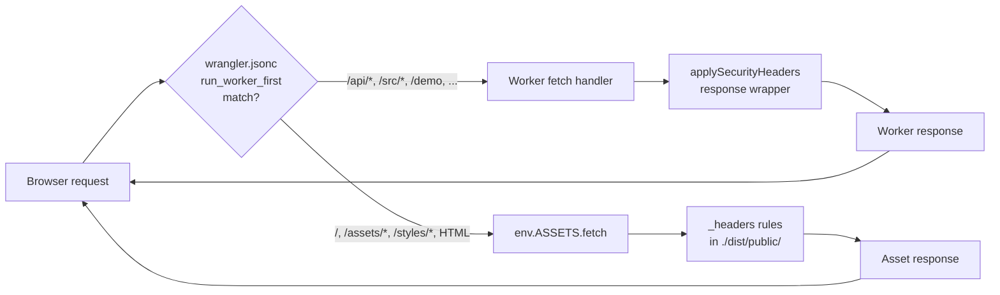
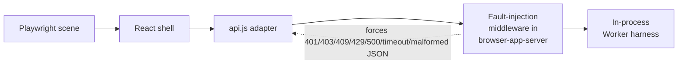
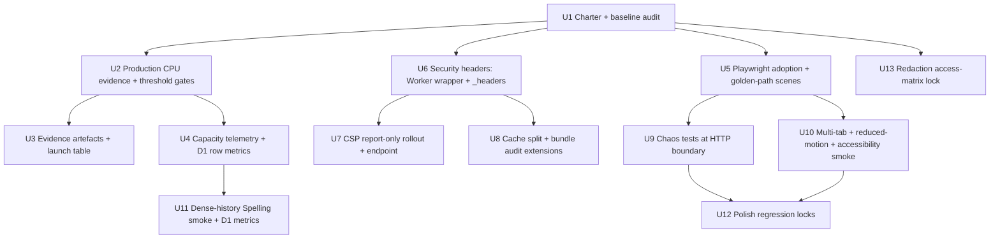
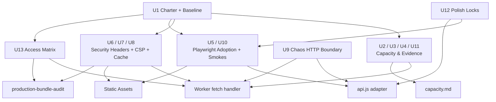

# fix: System Hardening Pass 1

> **Post-merge note (2026-04-26, Option B merge).** U4 capacity telemetry
> originally landed via PR #207 with a `[ks2-capacity]` log prefix,
> `worker/src/capacity/telemetry.js` module, `createCapacityCollector`
> factory, `wrapDatabaseForTelemetry` D1 proxy, `attachCollectorToEnv`
> env-attach pattern, and a hard-coded 0.1 sample rate. PR #201 (Option
> B decision) consolidated that implementation into the 9-round-hardened
> architecture in `worker/src/logger.js::CapacityCollector` +
> `worker/src/d1.js::withCapacityCollector` + the `meta.capacity` response
> surface, emitting `[ks2-worker] {event: "capacity.request", ...}`
> structured logs under the `CAPACITY_LOG_SAMPLE_RATE` env var with a
> closed `SIGNAL_ALLOWED_TOKENS` allowlist and constructor injection of
> the collector through `createWorkerRepository({env, now, capacity})`.
> References to `[ks2-capacity]`, `worker/src/capacity/telemetry.js`,
> `createCapacityCollector`, and the hard-coded 0.1 sampler below are
> retained as the original plan text; the final landed implementation
> lives under U3 rather than U4.

## Overview

A stabilisation pass for KS2 Mastery: no new product features, no new subjects, no new reward mechanics. The goal is fewer crashes, fewer visual glitches, bounded and verified production behaviour, safer response headers, faster reloads for returning users, clearer failure states, and regression locks on the bugs fixed along the way.

This pass sits on top of the already-merged bootstrap/CPU work (`docs/plans/2026-04-25-001-fix-bootstrap-cpu-capacity-plan.md`, PRs #126-#139). It absorbs the H1–H10 residual backlog from `docs/plans/james/cpuload/implementation-report.md` rather than duplicating the server-side bounding work already in production. Where the brainstorm describes client-side recovery work, this plan references the existing `src/platform/core/repositories/api.js` coordination and retry machinery instead of rewriting it.

---

## Problem Frame

The KS2 Mastery repo has shipped significant architectural change recently: a React-owned shell, a Worker-backed auth and subject command boundary, demo sessions, protected audio, D1-backed persistence, and bounded bootstrap. That work is functionally complete but has not yet been proven out end-to-end at classroom scale, and three concrete reliability surfaces remain weak:

1. **Verifiable production evidence is missing.** Capacity runbook tiers are all `Not certified` above Family demo, no dated production smoke exists, and the classroom load driver has no threshold gates or evidence artefacts.
2. **Security posture is under-specified at the response layer.** Repo root holds a Pages-style `_headers` file with only a global `Cache-Control: no-store`; there is no CSP, no HSTS, no `X-Content-Type-Options`, no `Referrer-Policy`, no `Permissions-Policy`, no `frame-ancestors`, and no cache split between HTML and hashed static bundles. Worker-generated responses receive none of these headers because `_headers` only applies to asset-direct requests.
3. **Visual, runtime, and accessibility regressions are uncaught.** The Playwright config is wired for five viewports (360/390/768/1024/1440), but no `*.playwright.test.*` file exists and `@playwright/test` is not installed. There is no route-change audio cleanup contract, no `prefers-reduced-motion` smoke, no chaos-mode coverage for 401/403/409/429/500/timeout/malformed-JSON/slow-TTS/offline/refresh-during-submit, and no browser-level multi-tab coordination validation.

The product need is simple: the app must feel boringly reliable to a Year 5/6 learner on a mid-range mobile device, to their parent scrolling a Parent Hub, and to a class teacher loading 30 browsers at once. The engineering response is charter-bound stabilisation, not another architectural rewrite.

---

## Requirements Trace

- R1. Lock the hardening charter and baseline audit buckets into repo documentation so in-flight work can be accepted or rejected against an explicit stabilisation-only rule.
- R2. Certify post-merge CPU load behaviour against production with a dated evidence artefact (commit SHA, learner count, burst size, P50/P95, 5xx, signals).
- R3. Add threshold-based gates to the classroom load driver so it can act as a release gate, not only an observer.
- R4. Persist capacity evidence (run JSON + markdown summary) under an ignored `reports/capacity/` path with a documented template.
- R5. Add response security headers (CSP in report-only first, then enforced; HSTS; `X-Content-Type-Options`; `Referrer-Policy`; `Permissions-Policy`; `X-Frame-Options` + `frame-ancestors 'none'`; `COOP`; `CORP`) to every production response — both static assets (via `_headers` at the correct directory) and Worker-generated responses (via a response wrapper in the Worker entry).
- R6. Split cache policy so hashed bundles and app icons get `public, max-age=31536000, immutable` while HTML and `/api/*` stay `no-store`, solving the current blanket `no-store` penalty on returning visitors without losing safety on dynamic responses.
- R7. Adopt Playwright as the browser regression surface: install `@playwright/test`, author golden-path scenes per subject, add reduced-motion and keyboard-navigation smokes, and lock down toast / modal / monster-effect layering on all five configured viewports.
- R8. Add chaos coverage at the HTTP boundary for 401 / 403 / 409 stale_write / 409 idempotency_reuse / 429 / 500 / timeout / malformed JSON / slow TTS / offline / refresh-during-submit; each failure mode must match the degraded-mode UI contract in `docs/mutation-policy.md` and `docs/state-integrity.md`.
- R9. Add a dense-history subject smoke (Smart Review spelling start) beyond `/api/bootstrap`, using the existing production-smoke helper pattern.
- R10. Validate multi-tab bootstrap coordination end-to-end in a real browser (Playwright), not only the existing `tests/persistence.test.js` unit coverage.
- R11. Emit request-level capacity telemetry (endpoint, wall time, response bytes, D1 rows read/written when available, bounded counts, failure category) so capacity incidents can be attributed without log archaeology — without logging answer-bearing payloads, private spelling prompts, or child-identifying content.
- R12. Convert the recurring visual and runtime glitches that surface during this pass into regression tests (parser-level CSS contract tests where targeted, Playwright screenshots where genuinely visual) so they cannot come back silently.
- R13. Document child-data redaction as an access-matrix test: platform role × membership role × route × payload shape, covering `/api/bootstrap`, Parent Hub, Admin Hub, lazy history, activity feed, and TTS prompt-token routes.
- R14. Extend polish backlog items (skeletons, empty-state copy, button-label consistency, destructive-action confirmations, route-change audio cleanup, reduced-motion alternatives, colour contrast) that directly enable an accessibility or visual regression test — the polish is the regression.
- R15. Keep all existing invariants: Cloudflare OAuth deployment path via package scripts, UK English in code/docs, Spelling parity, server-authoritative runtime, learner-scoped CAS + idempotency receipts, raw-source lockdown, and the `docs/full-lockdown-runtime.md` contract.

---

## Scope Boundaries

### Deferred for later

*(Carried from origin brainstorm: work that fits the product identity but is deliberately out of this pass.)*

- New subject types, new question types, new reward mechanics, new game systems, new dashboard panels, new analytics, new adult workflows, major art redesign, or any AI behaviour expansion.
- Migration of React `style={}` inline-style usage off `unsafe-inline` in CSP — large refactor covering 93+ component sites, tracked separately.
- D1 per-school or per-class sharding — still deferred pending classroom-beta evidence per the bootstrap-CPU plan.
- Full analytics warehouse, teacher dashboard, or reporting redesign.
- Durable Object coordination beyond the existing `LearnerLock` stub.
- Converting Cloudflare Workers assets to Cloudflare Pages — keep the current Workers + ASSETS model.

### Outside this product's identity

*(Work the plan must not accidentally build.)*

- Browser-owned runtime re-entry — production scoring, queue selection, progress mutation, and reward projection stay Worker-owned.
- Third-party analytics / tag-manager integrations — CSP policy explicitly excludes them.
- Client-side TTS provider keys or prompt resolution — provider configuration stays server-side only.
- Local-runtime `?local=1` path for end users — remains a test harness only per `docs/full-lockdown-runtime.md`.

### Deferred to Follow-Up Work

- **CSP enforcement flip** — land report-only first in this pass; the flip to enforced Content-Security-Policy is a separate PR after ≥7 days of report-only observations with no false positives.
- **Full accessibility audit** — this pass adds keyboard-only practice + reduced-motion smoke + `role`/`aria-live` coverage; a WCAG 2.2 AA compliance audit is a follow-up plan.
- **Web Vitals SLO dashboard** — this pass emits CWV metrics from Playwright runs; a production-observed CWV SLO dashboard through `web-vitals` + Workers observability is separately scoped.
- **Turnstile rollout** — `SOCIAL_LOGIN_WIRE_ENABLED=true` but Turnstile is not yet installed. CSP leaves room for `https://challenges.cloudflare.com`; the rollout itself is a separate plan.

---

## Context & Research

### Relevant Code and Patterns

- `AGENTS.md` — Cantonese in chat, UK English in code/docs, OAuth deploy path via package scripts, SOLID/DRY/YAGNI, Spelling parity guardrail, post-deploy verification on `https://ks2.eugnel.uk` with a logged-in browser session.
- `wrangler.jsonc` — `compatibility_date: "2026-04-20"`, `assets.directory: "./dist/public"`, `assets.binding: "ASSETS"`, `not_found_handling: "single-page-application"`, `run_worker_first` array covers `/api/*`, `/demo`, `/src/*`, `/shared/*`, `/worker/*`, `/tests/*`, `/docs/*`, `/legacy/*`, `/migration-plan.md`.
- `_headers` — currently at repo root (`/*  Cache-Control: no-store`). `scripts/build-public.mjs` copies it to `./dist/public/_headers`, so Cloudflare Workers Assets does honour it; but it does not apply to Worker-generated responses or to paths matched by `run_worker_first`.
- `index.html` — contains an inline theme-flash `<script>` (lines 25-34), preconnects to `fonts.googleapis.com` + `fonts.gstatic.com`, and loads `./src/bundles/app.bundle.js` which matches `run_worker_first: ["/src/*"]` and therefore bypasses `_headers` cache rules.
- `worker/src/index.js` — default `fetch` handler directly delegates to `app.fetch(...)` with no security-header wrapper and no Response mutation pass.
- `worker/src/http.js` — `json()` sets only `content-type` + `cache-control: no-store`.
- `worker/src/app.js` — central route switch; already reads `sec-fetch-mode` / `sec-fetch-dest` via `requireSameOrigin()`.
- `src/platform/core/repositories/api.js` — already implements single-flight bootstrap coordination (`bootstrapCoordinationStorageKey`, `BOOTSTRAP_COORDINATION_LEASE_MS = 30_000`), exponential backoff with jitter, stale-write rebase (up to 3 attempts), blocked-stale handling, mutation envelope headers (`x-ks2-request-id`, `x-ks2-correlation-id`), persistence channel publishing (`mode`, `trustedState`, `cacheState`). This pass does not rebuild the client retry layer.
- `src/surfaces/shell/PersistenceBanner.jsx` — renders degraded-mode UI from persistence channel snapshots.
- `docs/mutation-policy.md` — `409 stale_write` / `409 idempotency_reuse` semantics, replay rule, reuse rule, degraded-mode persistence contract.
- `docs/state-integrity.md` — fail-safe normalisation rule: malformed state shrinks to smaller known-good shape rather than breaking the UI.
- `docs/full-lockdown-runtime.md` — production runtime authority, demo model, TTS prompt-token policy, bundle audit release gate, allowlisted client strings.
- `docs/ownership-access.md`, `docs/operating-surfaces.md` — platform role (`parent` / `admin` / `ops`) × membership role (`owner` / `member` / `viewer`) access matrix; `/api/bootstrap` writable-only, viewer learners appear only in hub payloads, last-admin protection.
- `docs/operations/capacity.md` — canonical capacity tier table; any new hardening threshold (CSP violation rate, Playwright pass, P75 CWV, degrade event count) becomes a row here with dated evidence.
- `scripts/build-public.mjs` and `scripts/assert-build-public.mjs` — canonical asset-copy and public-output assertion surface; new `_headers` assertions should extend `assert-build-public.mjs`.
- `scripts/production-bundle-audit.mjs` — live-origin HTML + same-origin-bundle fetch, forbidden-token check, source-path denial check; exact pattern to mirror for response-header audits and CSP assertions.
- `scripts/punctuation-production-smoke.mjs` / `scripts/grammar-production-smoke.mjs` / `scripts/lib/production-smoke.mjs` — subject production-smoke pattern to mirror for the dense-history Spelling smoke.
- `scripts/classroom-load-test.mjs` — existing classroom load driver; extend with threshold flags and `--output` rather than fork.
- `scripts/probe-production-bootstrap.mjs` — existing bootstrap probe; extend with evidence-output mode.
- `tests/helpers/browser-app-server.js` — supports `--serve-only --port`, wired by `playwright.config.mjs webServer.command`.
- `tests/react-accessibility-contract.test.js` — already pins `role="alert"`, `aria-live="polite"`, `role="dialog"`, `aria-modal="true"`, `role="tablist"`, `role="radio"`. Accessibility smoke extensions belong here.
- `tests/celebration-keyframe-contract.test.js` — precedent for cheap parser-level CSS contract tests where the regression class is specific; mirror this pattern for `_headers` / CSP string validation rather than screenshot-only gates.
- `tests/mutation-policy.test.js`, `tests/state-integrity.test.js`, `tests/persistence.test.js` — chaos-test oracles for 409/429/500/timeout/malformed-JSON expected client behaviour.

### Institutional Learnings

- `docs/solutions/` does not exist. Institutional knowledge lives in `docs/*.md`, `docs/plans/*.md`, `docs/plans/james/*/`, `docs/brainstorms/*.md`, and recent commit history. Capture this pass's learnings into `docs/solutions/` at the end of the sprint via `/ce-compound` to bootstrap that directory.
- From `docs/plans/james/cpuload/implementation-report.md`: the bootstrap/client-retry spine is complete — hardening should add telemetry, threshold gates, and end-to-end browser validation, not rebuild retry machinery. Residual H1–H10 items are the shortest path from "implemented safety gates" to "evidence we can use for a launch decision."
- From `docs/plans/2026-04-25-002-fix-celebration-sprite-centring-plan.md`: parser-level CSS contract tests (like `tests/celebration-keyframe-contract.test.js`) are preferable to screenshot diffs for specific regression classes; screenshots are for genuinely visual states (toast overlap, mobile overflow, sprite layering).
- From `docs/plans/2026-04-24-002-feat-monster-effect-library-plan.md`: reduced-motion is already enforced per-effect via `reducedMotion: 'omit' | 'simplify' | 'asis'`; hardening adds one stage-level Playwright assertion rather than per-effect coverage.
- From `docs/superpowers/specs/2026-04-22-react-port-flicker-elimination-design.md`: `useFocusRestore`, `useModalFocusTrap`, `useAudioPlayingClass` primitives exist; accessibility smoke extends `tests/react-accessibility-contract.test.js` rather than starting a new file.

### H1–H10 Residual Backlog Mapping

The CPU-load implementation report defined ten residual hardening items. This plan absorbs all ten into the unit list as follows:

| H-ID (source) | Description | Addressed by |
|---|---|---|
| H1. Post-Merge Production Validation | Deploy, run production bootstrap smoke, record commit SHA + capacity result | U2 (post-merge production run + threshold gates) |
| H2. Capacity Evidence Artefacts | `--output` mode, `reports/capacity/` JSON, markdown template, launch evidence table | U3 |
| H3. Threshold-Based Load Failure | `--max-5xx`, `--max-bootstrap-p95-ms`, `--max-command-p95-ms`, `--max-response-bytes`, `--require-zero-signals` | U2 |
| H4. Production Load Safety Guardrails | `--confirm-high-production-load`, prominent safety JSON block | U2 (adds threshold guard flags), deferred extension to follow-up if scope expands |
| H5. Real Worker Integration Load Test | Start local Worker, run load driver against live route handling | U2 (local-fixture mode) + U11 (dense-history smoke provides the same coverage for Spelling) |
| H6. D1 Row Metrics and Worker Tail Correlation | Structured `[ks2-capacity]` log fields, correlation by request ID | U4 |
| H7. Consume `command.projection.v1` More Directly | Finish read-model direction for command projection | **Deferred to Follow-Up Work** — outside stabilisation scope; plan preserves current projection write behaviour, does not refactor command handlers |
| H8. Dense-History Subject Smoke Coverage | Production/preview smoke for dense-history subject starts | U11 |
| H9. Browser Multi-Tab Validation | Logged-in browser, 2+ tabs, simultaneous refresh | U10 |
| H10. Launch Evidence Table | Dated table in `docs/operations/capacity.md` | U3 |

H4 and H7 are partially deferred:
- H4's simple guard (threshold flags) lands in U2; the `--confirm-high-production-load` second-confirmation flag lands in U2 only if implementation budget allows, otherwise scheduled into a follow-up.
- H7 is a command-handler refactor that sits above the stabilisation charter; noted here as awareness only.

### Deepening Review Findings Index

**Security review findings (F-01 … F-12)** — integrated in Key Technical Decisions and per-unit approach sections:

| F-ID | Topic | Integrated into |
|---|---|---|
| F-01 | `applySecurityHeaders` single-site enforcement + `ASSETS.fetch` bypass coverage | Key Technical Decisions (wrapper collapse), U6 approach + test scenarios |
| F-02 | CSP report endpoint body-size cap + field sanitisation | U7 approach + test scenarios |
| F-03 | HSTS `preload` deferred | Key Technical Decisions, U6 header set, Risks table, Scope Boundaries |
| F-04 | `style-src 'unsafe-inline'` residual-risk documentation | Key Technical Decisions (`img-src` mitigation framing), U1 verification (charter documents residual risk) |
| F-05 | `connect-src` includes Google Fonts origins | Key Technical Decisions, U7 CSP string |
| F-06 | `manifest-src 'self'` + `worker-src 'none'` | Key Technical Decisions, U7 CSP string |
| F-07 | `requireSameOrigin()` default-on for authenticated routes | Key Technical Decisions, U6 approach, Risks table |
| F-08 | Logout `Clear-Site-Data` includes `"cache"` | Key Technical Decisions, U6 approach |
| F-09 | Permissions-Policy `microphone=()` deny-by-default | Key Technical Decisions, U6 header set |
| F-10 | Access matrix unauthenticated + expired-demo + cross-account rows | U13 approach + test scenarios |
| F-11 | Fault-injection forbidden-token enforcement | U9 approach, Risks table |
| F-12 | `p1-baseline.md` PII redaction scan | Key Technical Decisions, U1 verification |

**Feasibility review claims (Claim 1 … Claim 10)** — integrated in Key Technical Decisions and per-unit approach sections:

| Claim | Topic | Integrated into |
|---|---|---|
| Claim 1 | Worker response-wrapper coverage for `ASSETS.fetch`, TTS, redirects, 404 text | U6 approach + test scenarios (five response shapes enumerated) |
| Claim 2 | `_headers` vs `run_worker_first` assumption | Confirmed — no plan change needed |
| Claim 3 | Inline theme-script hash injection site | U7 files (use `scripts/build-public.mjs`, not `build-bundles.mjs`) |
| Claim 4 | Playwright config + Wrangler build interaction | U5 files (pass `--with-worker-api`, set `PLAYWRIGHT_SKIP_BROWSER_DOWNLOAD`) |
| Claim 5 | `/src/bundles/*` cache-override semantics | Key Technical Decisions (explicit `set()` over ASSETS response), U6 approach |
| Claim 6 | `consumeRateLimit` extraction for shared use | U7 files (create `worker/src/rate-limit.js`) |
| Claim 7 | Telemetry volume at 100% sampling | Key Technical Decisions (10% sampling default), U4 approach |
| Claim 8 | Multi-tab Playwright primitive — `newPage()` vs `newContext()` | U10 approach + test scenarios |
| Claim 9 | Fault-injection production-bundle exclusion | Confirmed by build-public asserts; U9 adds explicit forbidden token as belt-and-braces |
| Claim 10 | U13 parallelisation feasibility | Confirmed — no plan change needed |

### External References

- **Cloudflare Workers Static Assets — Headers** (retrieved 2026-04-25, https://developers.cloudflare.com/workers/static-assets/headers/): `_headers` is natively supported when the file sits inside `assets.directory`; does not apply to Worker-generated responses or `run_worker_first` paths. Default cache header absent `_headers` is `public, max-age=0, must-revalidate`.
- **Cloudflare Workers — Alter Headers example** (retrieved 2026-04-25, https://developers.cloudflare.com/workers/examples/alter-headers/): canonical pattern `const newResponse = new Response(response.body, response); newResponse.headers.set(...)` — Worker responses are immutable and must be wrapped.
- **Cloudflare Workers — Security Headers example** (retrieved 2026-04-25, https://developers.cloudflare.com/workers/examples/security-headers/): Workers do not strip security headers; explicit set is enough.
- **OWASP CSP Cheat Sheet** (retrieved 2026-04-25, https://cheatsheetseries.owasp.org/cheatsheets/Content_Security_Policy_Cheat_Sheet.html): report-only first, hash-or-nonce over `'unsafe-inline'`, `'strict-dynamic'` for transitive script trust.
- **web.dev — Strict CSP** (retrieved 2026-04-25, https://web.dev/articles/strict-csp): for statically served HTML use hash-based CSP; nonce-based only for per-request rendering.
- **Cloudflare Turnstile — CSP** (retrieved 2026-04-25, https://developers.cloudflare.com/turnstile/reference/content-security-policy/): Turnstile works with `'strict-dynamic'`; fall-back allowlist `https://challenges.cloudflare.com`.
- **MDN — CSP reference** (retrieved 2026-04-25, https://developer.mozilla.org/en-US/docs/Web/HTTP/Headers/Content-Security-Policy): `block-all-mixed-content` is deprecated; use `upgrade-insecure-requests`. `report-uri` deprecated but still shipped alongside `report-to` for compat.
- **MDN — Permissions-Policy** (retrieved 2026-04-25): `=()` denies, `=(self)` allows own origin only; `interest-cohort` superseded by `browsing-topics` but still ship both for compat.
- **MDN — Cross-Origin-Opener-Policy** (retrieved 2026-04-25): `same-origin-allow-popups` is the OAuth-compatible value when popup references must be retained.
- **HSTS Preload** (retrieved 2026-04-25, https://hstspreload.org/): `max-age=63072000; includeSubDomains; preload` qualifies after apex HTTPS + all subdomains HTTPS verified.
- **web.dev — Core Web Vitals** (retrieved 2026-04-25, https://web.dev/articles/vitals): LCP ≤ 2.5s, INP ≤ 200ms, CLS ≤ 0.1 (P75 field targets).
- **Cloudflare Workers — Sec-Fetch headers** (native in 2026-04-20 compat): already read by `worker/src/app.js requireSameOrigin()`; extend usage for CSRF defence-in-depth on mutation endpoints.

---

## Key Technical Decisions

- **Absorb H1-H10 from the CPU load report into this pass.** Decided with James. Treat post-merge production evidence, threshold-based load failure, evidence artefacts, real-Worker integration load test, D1-row-metric telemetry, dense-history subject smoke, multi-tab browser validation, and launch evidence table as this pass's Stream A, alongside security / visual / runtime / polish streams.
- **Layer security headers in one place at the Worker entry; `_headers` mirrors static-asset-direct paths.** `worker/src/index.js` wraps `app.fetch(...)` result with `applySecurityHeaders(response, { path })` as the single outermost layer. `http.js::json()` does NOT duplicate the wrap — the entry-level wrapper handles JSON, ASSETS pass-through, TTS binary streams, 302 redirects, and 404 plaintext uniformly. `_headers` covers paths that do not match `run_worker_first`. Both paths import values from `worker/src/security-headers.js` (single source of truth). Build step verifies drift. Feasibility review F-01 prompted collapsing the two-wrap-site design into one to avoid regression when a new response construction site is added.
- **Leave `/src/bundles/app.bundle.js` under `run_worker_first`; apply immutable cache via Worker wrapper with explicit `set()` override.** Renaming the bundle path would ripple through `scripts/build-bundles.mjs`, `scripts/build-public.mjs`, `scripts/assert-build-public.mjs`, `scripts/audit-client-bundle.mjs`, `index.html`, and production audit token lists; decision is not worth the blast radius for a hardening pass. The Worker wrapper `applySecurityHeaders(response, { path })` matches `/src/bundles/*` and emits `public, max-age=31536000, immutable` using `headers.set('Cache-Control', ...)` — not `append()` — because `env.ASSETS.fetch(request)` already returns the response with `no-store` applied from `_headers` and must be overridden, not merged. Feasibility review F-05 / Claim 5 prompted this explicit-override language.
- **CSP uses hash-based `script-src 'self' 'sha256-<theme>' 'strict-dynamic' https://challenges.cloudflare.com` + accept `style-src 'unsafe-inline'` with `img-src 'self'` as active mitigating control.** Hash computed by build step from inline theme script in `index.html`. Accepting `unsafe-inline` on styles is a scope concession — React's 93+ `style={}` sites make hashing impractical without a multi-week refactor, which sits outside the stabilisation charter. The residual XSS-via-CSS vector (CSS `url()` exfiltration, attribute-selector side-channel) is explicitly bounded by `img-src 'self' data: blob:` and `font-src 'self' https://fonts.gstatic.com` — these directives govern CSS `url()` fetches and close the main exfiltration path. Charter (`docs/hardening/charter.md`, U1 output) documents the residual risk and its mitigations explicitly. Tracked for retirement by separate `style={}` migration plan. Security review F-04 prompted the explicit mitigation documentation.
- **Two-phase CSP rollout: Report-Only → Enforced.** Report-only ships first with `/api/security/csp-report` Worker endpoint logging to Workers observability (already enabled, `head_sampling_rate: 1`). Enforced flip is a separate PR after a quiet observation window documented in capacity runbook.
- **`_headers` stays in repo root.** `scripts/build-public.mjs` already copies to `./dist/public/_headers`. Keep the source of truth at the root and add an `assert:build-public` check that the published file contains the expected security-header block, preventing silent drift.
- **Parser-level contract tests over screenshot diffs for targeted regressions.** `_headers` string validation, CSP policy parsing, forbidden token absence, and CSS keyframe invariants all become cheap node tests. Playwright screenshots cover genuinely visual states (toast overlap, mobile overflow, monster layering, celebration frames).
- **Adopt `@playwright/test` as a devDependency, keep the same five viewports.** Install locally and in CI; baseline screenshots check into the repo. Start with golden-path-per-subject (spelling / grammar / punctuation) at one viewport, expand to the full matrix unit by unit.
- **Extend `docs/operations/capacity.md` rather than open a new hardening runbook.** Add rows for each new gate (CSP-violation rate, Playwright pass rate, bundle-audit extended checks, CWV P75, degraded-event rate). Reuse launch-language conventions.
- **Telemetry emits only bounded metadata.** Endpoint, route, wall time, response bytes, bounded counts, failure category, D1 rows-read/written where `meta` exposes them. No answer-bearing payloads, no private spelling prompts, no child-identifying content. Pattern mirrors the existing Worker log hygiene in `docs/full-lockdown-runtime.md`.
- **Chaos tests drive the Worker boundary and assert degraded-mode UI per contract.** Use `tests/helpers/browser-app-server.js` plus a fault-injection layer. Oracle is `docs/mutation-policy.md` + `docs/state-integrity.md`. No new contract definitions.
- **Fetch Metadata hardening defaults ON for every authenticated route, not opt-in per mutation endpoint.** Extend `requireSameOrigin()` so it runs inside the route switch at the first checkpoint after session validation, before any per-route dispatch. Every route that calls `auth.requireSession()` inherits the Sec-Fetch-Site check automatically. This removes the "one forgotten route" gap that per-route enumeration creates. Existing auth + idempotency remain primary defences. Security review F-07 prompted the default-on framing.
- **HSTS ships without `preload` in this pass.** Value: `max-age=63072000; includeSubDomains` (no `preload`). Preload submission is a one-way commitment that would force every subdomain of `eugnel.uk` to be HTTPS-only for 2 years. Without a documented subdomain audit, preload is unsafe. The preload flip is a separate PR with a signed subdomain audit as its entry requirement. Security review F-03 prompted this deferral.
- **Logout `Clear-Site-Data` includes `"cache"`.** `/api/auth/logout` response emits `Clear-Site-Data: "cache", "cookies", "storage"`. Shared school and family devices are an expected deployment context; full browsing-state cleanup on logout is the safer default. Security review F-08 prompted the `"cache"` addition. (This supersedes any earlier two-field variant; `"cache"` is part of the decision.)
- **Permissions-Policy is deny-by-default, including microphone.** Value: `camera=(), geolocation=(), payment=(), usb=(), bluetooth=(), serial=(), hid=(), midi=(), microphone=(), accelerometer=(), gyroscope=(), magnetometer=(), autoplay=(), encrypted-media=(), fullscreen=(self), picture-in-picture=(), interest-cohort=(), browsing-topics=()`. `microphone=()` (not `=(self)`) — if voice recording lands later, that PR explicitly re-opens it with its justification. Security review F-09 prompted the deny-by-default shift.
- **CSP `connect-src` includes Google Fonts origins.** Value: `connect-src 'self' https://fonts.googleapis.com https://fonts.gstatic.com`. Firefox governs `<link rel="preconnect">` hints through `connect-src`; omitting these origins would generate violation noise during the report-only window and potentially break font preconnect in enforcement. Security review F-05 prompted this addition.
- **CSP includes `manifest-src 'self'` and `worker-src 'none'`.** The app loads `/manifest.webmanifest`; without explicit `manifest-src`, strict browsers fall back to `default-src 'none'` and block the manifest. `worker-src 'none'` is explicit deny — no Service Worker is registered in this pass. Security review F-06 prompted both additions.
- **Capacity telemetry starts at 10% sampling.** `head_sampling_rate: 1` stays enabled at Cloudflare-observability level, but `[ks2-capacity]` emission logic uses a 10% probabilistic sampler for bootstrap + subject-command + hub-read routes with a one-line sampling note in capacity.md. Scale to 100% after a baseline week shows quota headroom. Feasibility review Claim 7 prompted this sampling posture.
- **Skip `Cross-Origin-Embedder-Policy: require-corp`.** No `SharedArrayBuffer` need; enabling would break Google Fonts and future Turnstile iframe. `Cross-Origin-Opener-Policy: same-origin-allow-popups` + `Cross-Origin-Resource-Policy: same-site` are safe defaults.
- **Ship both `X-Frame-Options: DENY` and `frame-ancestors 'none'`.** Modern browsers honour `frame-ancestors`; `X-Frame-Options` still serves legacy crawlers. Zero-cost defence-in-depth.
- **Logout `Clear-Site-Data` value** — see expanded decision above; full value is `"cache", "cookies", "storage"`.
- **Baseline audit produces two doc artefacts, with explicit PII redaction gate.** `docs/hardening/charter.md` (charter-only, one page) and `docs/hardening/p1-baseline.md` (audit findings and known-issue log bucketed by visual / runtime / server / access-privacy / test-gap). Plan units reference these as the authority for what was broken before the pass. Before `p1-baseline.md` is committed, an explicit redaction pass scrubs any real account IDs, learner names, email fragments, session cookie values, or child-identifying content — placeholders `[account-A]` / `[learner-1]` / `[email-fragment]` replace real identifiers. Commit-ready state is a review gate. Security review F-12 prompted this gate.

---

## Open Questions

### Resolved During Planning

- **Should hardening p1 absorb H1-H10 from the CPU load report?** Resolved with James: yes (Stream A). Absorb H1-H10, then stack security / visual / runtime / polish streams.
- **Is `_headers` honoured in a Workers + ASSETS deployment?** Resolved: yes, when it sits inside `assets.directory`. `scripts/build-public.mjs:9` already copies it to `./dist/public/_headers`. `_headers` does not apply to Worker-generated responses or paths matched by `run_worker_first`.
- **How do security headers reach the bundle path `/src/bundles/app.bundle.js`?** Resolved: via the new Worker response wrapper, because `run_worker_first: ["/src/*"]` routes the bundle through the Worker. `_headers` cache rules against `/src/bundles/*` would not take effect.
- **CSP nonce or hash?** Resolved: hash-based, because HTML is statically served. Build step computes SHA-256 of the inline theme script and injects into both `_headers` and Worker wrapper policy strings.
- **Should the plan rebuild multi-tab coordination with `BroadcastChannel`?** Resolved: no. `src/platform/core/repositories/api.js` already coordinates via `localStorage` leases. This pass adds browser-level validation (Playwright multi-tab scenario) instead of re-architecting.
- **Does R15 conflict with `style-src 'unsafe-inline'`?** Resolved: accept the concession; migration of React `style={}` to stylesheet-only is out of scope and tracked as a separate follow-up. Residual vector (CSS `url()` exfiltration, attribute-selector side-channels) bounded by `img-src 'self'` + `font-src` constraints. Charter explicitly documents this.
- **Which existing runbook hosts new threshold gates?** Resolved: extend `docs/operations/capacity.md`. Do not create a parallel hardening runbook.
- **Should HSTS ship with `preload` in this pass?** Resolved: no. `preload` requires a subdomain tree audit that is out of scope; ship `max-age=63072000; includeSubDomains` only. Preload flip is a separate PR gated on a signed audit.
- **Is `microphone=(self)` or `microphone=()` the right default?** Resolved: `microphone=()` per deny-by-default posture. Re-open explicitly in the PR that introduces voice recording.
- **Should the `Clear-Site-Data` value include `"cache"`?** Resolved: yes. Value is `"cache", "cookies", "storage"` because the app is used on shared school and family devices.
- **Does `connect-src 'self'` cover `<link rel="preconnect">` in Firefox?** Resolved: no. Added `https://fonts.googleapis.com https://fonts.gstatic.com` to `connect-src` to avoid violation noise during report-only and breakage in enforcement.
- **Should CSP include `manifest-src` and `worker-src`?** Resolved: yes — `manifest-src 'self'` (for `/manifest.webmanifest`) and `worker-src 'none'` (explicit deny; no Service Worker in scope).
- **Should `requireSameOrigin()` be default-on or per-route opt-in?** Resolved: default-on, called inside `auth.requireSession()` so every session-requiring route inherits the Sec-Fetch-Site check.
- **Should capacity telemetry emit at 100% or sampled?** Resolved: start at 10% for `ok` rows, 100% for failure rows. Ramp after baseline data.
- **Should multi-tab Playwright use `browser.newContext()` or `browser.newPage()`?** Resolved: `browser.newPage()` inside a single context — `newContext()` creates isolated `localStorage` and would prevent the coordination lease from being visible across tabs.
- **Is the existing `consumeRateLimit` helper exported for reuse?** Resolved: no — it is module-private in `worker/src/auth.js` and duplicated in both `worker/src/demo/sessions.js` and `worker/src/tts.js` (three copies total). U7 extracts a shared `worker/src/rate-limit.js` first, then the CSP report endpoint imports it alongside the three existing call sites.
- **Does `playwright.config.mjs` webServer command currently expose `/api/*`?** Resolved: no — the existing command does not pass `--with-worker-api`. U5 updates the config to enable the flag.

### Deferred to Implementation

- **Exact CSP `sha256-...` hash** for the theme script — computed at build time; build step wires it through `_headers` and the Worker wrapper.
- **Playwright screenshot tolerance** — `maxDiffPixelRatio` vs `maxDiffPixels`, per-viewport threshold tuning; pick defaults during U5 and refine per unit.
- **CI install path for `@playwright/test`** — full browser binary install (~300 MB per browser) vs Chromium-only; decide when wiring the CI step. Wrangler remote-build host must have `PLAYWRIGHT_SKIP_BROWSER_DOWNLOAD=1` regardless.
- **Worker security-header constants share mechanism** — inline JS import from `worker/src/security-headers.js` versus a build-time generation pass writing to `_headers`; default to checked-in `_headers` + parser-level drift assertion for reviewability.
- **D1 `meta.rows_read` surfacing in local SQLite helper** — mock or instrument; decide during U4 telemetry implementation.
- **`Reporting-Endpoints` vs `Report-To` alone** — ship both for compat; decide if `Report-To` can be dropped after Firefox support for `Reporting-Endpoints` matures.
- **Whether `auth.requireSession()` is the right host for `requireSameOrigin()` default-on**, or whether it should live in a dedicated `requireRoute` guard called by both session and non-session routes. Decide during U6 implementation.
- **CSP report endpoint body-size enforcement**: 8 KB is the default from security F-02; measured violation payload sizes may suggest lowering to 4 KB once data exists.
- **Telemetry sampling ramp** — start at 10%, ramp to 50% after baseline week, 100% after two weeks of stable production. Exact ramp gates decided during U4 rollout.

---

## High-Level Technical Design

> *This illustrates the intended approach and is directional guidance for review, not implementation specification. The implementing agent should treat it as context, not code to reproduce.*

### Response header delivery topology

Both paths import their policy values from `worker/src/security-headers.js` (single source of truth). A build-time check asserts the strings serialised into `_headers` match the module.

### Chaos-test injection topology

Each chaos scenario asserts the degraded-mode UI contract: persistence banner visibility, pending-write preservation, blocked-stale discard behaviour, request receipt replay, and no answer loss.

---

## Implementation Units

---

- U1. **Hardening Charter + Baseline Audit**

**Goal:** Lock the stabilisation charter and a known-faults baseline into repo documentation so every subsequent unit has an explicit "was this already broken?" oracle.

**Requirements:** R1, R15

**Dependencies:** None

**Files:**
- Create: `docs/hardening/charter.md`
- Create: `docs/hardening/p1-baseline.md`
- Modify: `docs/operations/capacity.md` (add charter cross-reference)
- Test: none -- documentation-only unit

**Approach:**
- Charter is one page: "During hardening, no new learner-visible feature is accepted unless it fixes an existing broken, confusing, unsafe, slow, or inaccessible behaviour." Include allowed-scope and disallowed-scope bullets lifted from the origin brainstorm Section 1.
- Baseline audit is bucketed: visual / runtime / server / access-privacy / test-gap. Each entry: short description, repro pointer (file path or test name), severity (blocker/major/minor), status (open/tracked in unit U?).
- Baseline is populated by reading recent issues, recent PRs, this session's research findings, and the bootstrap-CPU implementation report residuals. Not comprehensive; explicitly marked as "known at time of writing" with a date.
- Charter and baseline are not auto-regenerated; they are a signed snapshot at sprint start.

**Patterns to follow:**
- `docs/full-lockdown-runtime.md` (concise, boundary-defining prose)
- `docs/operations/capacity.md` (tier table + evidence convention)

**Test expectation:** none -- documentation unit with no executable assertions. Verification is review-based.

**Verification:**
- `docs/hardening/charter.md` exists and states the stabilisation rule plus allowed/disallowed scopes.
- `docs/hardening/p1-baseline.md` exists with all five buckets populated and ≥1 entry per bucket where known issues exist.
- `docs/operations/capacity.md` links forward to the charter.
- Pre-commit redaction scan against `docs/hardening/p1-baseline.md` surfaces no `@`-pattern emails, no UUID-like learner/account IDs, no real names. Scan output attached to commit note.
- Charter explicitly names the residual `style-src 'unsafe-inline'` risk and the `img-src 'self'` + `font-src` mitigations that bound it (security review F-04).

---

- U2. **Post-Merge Production Evidence + Threshold Gates**

**Goal:** Convert `scripts/classroom-load-test.mjs` into a release gate by adding threshold flags and run the first dated production capacity measurement.

**Requirements:** R2, R3, R15

**Dependencies:** U1

**Files:**
- Modify: `scripts/classroom-load-test.mjs`
- Modify: `scripts/probe-production-bootstrap.mjs`
- Modify: `tests/capacity-scripts.test.js`
- Create: `tests/capacity-thresholds.test.js`
- Modify: `package.json` (add `--max-5xx 0 --max-bootstrap-p95-ms 1000 --max-command-p95-ms 750 --max-response-bytes 600000` flags to `capacity:classroom` as defaults)
- Modify: `docs/operations/capacity.md` (add threshold-run procedure)

**Approach:**
- Add threshold flags to the load driver: `--max-5xx`, `--max-network-failures`, `--max-bootstrap-p95-ms`, `--max-command-p95-ms`, `--max-response-bytes`, `--require-zero-signals`. Non-zero exit on any violation.
- Add `--max-bytes`, `--max-sessions`, `--max-events` as hard gates to `probe-production-bootstrap.mjs` (soft warnings exist today; convert to hard failure when flag present).
- Keep existing production-safety controls: `--confirm-production-load`, stripped operator auth on `--demo-sessions` setup, non-enumerable raw failure bodies.
- Run against production with demo sessions: a small `--learners 5 --bootstrap-burst 5 --rounds 1` smoke first, then escalate only after first run passes. Capture commit SHA, timestamp, status distribution, P95s.

**Execution note:** Test-first. The threshold-parsing and violation-exit logic should be driven by a failing test in `tests/capacity-thresholds.test.js` before modifying the script.

**Patterns to follow:**
- Existing `scripts/classroom-load-test.mjs` flag-parsing style
- `tests/capacity-scripts.test.js` for test shape (mocked fetch, deterministic timestamps)
- `docs/operations/capacity.md` launch-language convention

**Test scenarios:**
- Happy path: dry-run with no threshold violations exits 0 and reports a clean threshold block.
- Happy path: local-fixture run under threshold exits 0.
- Edge case: threshold flags are absent -- script behaves exactly as today (back-compat).
- Error path: `--max-5xx 0` with a single 500 response exits non-zero and surfaces the failing threshold.
- Error path: `--max-bootstrap-p95-ms 100` with a slow response exits non-zero.
- Error path: `--require-zero-signals` with any `exceededCpu` / `d1Overloaded` / `d1DailyLimit` / `rateLimited` signal exits non-zero.
- Integration: probe-production-bootstrap with `--max-bytes 1000` against a larger response exits non-zero and does not expose the raw body in output.
- Integration: running with `--confirm-production-load` missing from production mode exits with a clear safety message (existing behaviour preserved).

**Verification:**
- The load driver can fail a CI step purely on threshold violation.
- A dated production smoke row appears in `docs/operations/capacity.md` with the commit SHA.

---

- U3. **Capacity Evidence Artefacts + Launch Evidence Table**

**Goal:** Persist capacity run results as durable artefacts that can be attached to a release review without copying terminal output.

**Requirements:** R2, R4, R15

**Dependencies:** U2

**Files:**
- Modify: `scripts/classroom-load-test.mjs` (add `--output <path>`)
- Modify: `scripts/probe-production-bootstrap.mjs` (add `--output <path>`)
- Create: `reports/capacity/.gitkeep`
- Modify: `.gitignore` (ignore `reports/capacity/*.json` but keep `.gitkeep`)
- Create: `docs/operations/capacity-evidence-template.md`
- Modify: `docs/operations/capacity.md` (add "Launch Evidence Table" section with columns: date, commit, environment, learners, burst, rounds, P95 bootstrap, P95 command, 5xx count, signals, decision)
- Modify: `tests/capacity-scripts.test.js`

**Approach:**
- `--output <path>` writes a JSON artefact containing: commit SHA (read from `git rev-parse HEAD` or `GITHUB_SHA` env), environment, origin, learner count, bootstrap burst, rounds, auth mode (demo/real/bearer, without secret values), status distribution, P50/P95s, operational signals, failure grouping, and threshold-violation summary.
- Artefact path defaults under `reports/capacity/`. `.gitignore` excludes the contents but keeps the directory via `.gitkeep`.
- Markdown evidence template provides a fill-in-the-blank format for release reviews.
- Launch evidence table in capacity.md appends rows as they are measured; rows are never deleted, only superseded.

**Patterns to follow:**
- `docs/operations/capacity.md` existing tier-table style
- `scripts/production-bundle-audit.mjs` CLI option parsing

**Test scenarios:**
- Happy path: `--output reports/capacity/test.json` writes a valid JSON file with commit SHA, environment, and aggregated metrics.
- Happy path: JSON shape is stable across runs (schema validated by test).
- Edge case: `--output` to a non-existent directory creates the directory.
- Error path: git SHA cannot be read (no git repo) -- artefact records `<unknown>` rather than failing.
- Edge case: secret values (auth cookies, bearer tokens) are never included in the artefact JSON.
- Integration: the markdown template renders correctly when populated with a sample JSON.

**Verification:**
- A capacity run can be fully reconstructed from its JSON artefact plus the markdown template.
- Launch evidence table has its first row populated from U2 production run.

---

- U4. **Capacity Telemetry + D1 Row Metrics**

**Goal:** Surface structured per-request capacity telemetry from Worker routes so capacity incidents can be attributed to CPU, D1 rows, D1 duration, queueing, or payload size.

**Requirements:** R11, R15

**Dependencies:** U2

**Files:**
- Create: `worker/src/capacity/telemetry.js`
- Modify: `worker/src/app.js`
- Modify: `worker/src/d1.js`
- Modify: `worker/src/repository.js`
- Modify: `tests/helpers/sqlite-d1.js`
- Create: `tests/worker-capacity-telemetry.test.js`
- Modify: `docs/operations/capacity.md`

**Approach:**
- Add a request-local collector registered per `fetch` entry. Fields: `endpoint`, `route`, `method`, `status`, `wallTimeMs`, `responseBytes`, `boundedCounts` (sessions / events returned), `d1.queryCount`, `d1.rowsRead`, `d1.rowsWritten` where `meta` exposes them, `failureCategory` (`exceededCpu` / `d1Overloaded` / `d1DailyLimit` / `staleWrite` / `idempotencyReuse` / `authFailure` / `rateLimited` / `redactionFailure` / `ok`), `requestId`.
- Wrap `worker/src/d1.js` `query`, `first`, `all`, `run` to tag each call with telemetry and accumulate row-metric `meta` fields.
- Redaction is structural: telemetry records metadata only; no answer-bearing payloads, no private spelling prompts, no child-identifying content.
- **Sampling**: start with a 10% probabilistic sampler on `[ks2-capacity]` emission for bootstrap + subject-command + hub-read routes; failure rows (`failureCategory !== 'ok'`) bypass sampling and emit at 100%. `head_sampling_rate: 1` stays enabled at Cloudflare-observability level. Scale emission sampling up after a week of production data shows quota headroom. Feasibility Claim 7 prompted this sampling posture.
- Emit as a single structured `console.log` line keyed `[ks2-capacity]` at response time. Observability is already enabled at `head_sampling_rate: 1` (Wrangler config) — `console.log` propagates natively without `env.LOG`.
- Extend `tests/helpers/sqlite-d1.js` to simulate `meta.rows_read` / `meta.rows_written` on the operations the tests need; acknowledge in code comments that the local helper is shape-only and production D1 is the source of truth.

**Execution note:** Characterization-first. Add a single telemetry assertion to a representative test (`tests/worker-bootstrap-capacity.test.js`) that pins the current telemetry shape (currently absent) before introducing the collector.

**Patterns to follow:**
- `docs/mutation-policy.md` logging contract (`[ks2-worker]` lines)
- Existing `worker/src/repository.js` capacity-metadata emission patterns

**Test scenarios:**
- Happy path: bootstrap response emits `[ks2-capacity]` with endpoint `/api/bootstrap`, status 200, response bytes, bounded session/event counts.
- Happy path: subject command emits telemetry with D1 query count, wall time, failure category `ok`.
- Edge case: a request that errors inside Worker handler still emits telemetry with `failureCategory` set.
- Edge case: a request that does not touch D1 emits `d1.queryCount: 0` without crashing.
- Error path: telemetry emission failure (e.g. JSON stringify error on cyclic object) logs an `[ks2-capacity-telemetry-error]` line but does not break the user response.
- Integration: telemetry lines do not contain any of `FORBIDDEN_GRAMMAR_READ_MODEL_KEYS`, private spelling prompt text, raw answers, or session cookie values.
- Integration: D1 row metrics from `sqlite-d1` helper match expected values for a known fixture.
- Integration: a failing production bootstrap probe in `--output` mode correlates its request ID with the corresponding `[ks2-capacity]` line in Worker logs.

**Verification:**
- Every capacity-relevant endpoint logs one structured `[ks2-capacity]` line per request.
- Redaction tests confirm no sensitive content appears in telemetry lines.

---

- U5. **Playwright Adoption + Golden-Path Scenes**

**Goal:** Install `@playwright/test`, author a golden-path Playwright scene per subject on the five configured viewports, and land the first screenshot baseline.

**Requirements:** R7, R15

**Dependencies:** U1

**Files:**
- Modify: `package.json` (add `@playwright/test` devDependency; add `test:playwright` script; extend `verify` with Playwright when feasible locally)
- Modify: `playwright.config.mjs` (confirm existing viewports, add `toHaveScreenshot` defaults, set `snapshotDir`; **update `webServer.command` to pass `--with-worker-api` so `/api/*` routes respond during golden-path scenes** — the existing command at line 6 does not enable the flag)
- Create: `tests/playwright/spelling-golden-path.playwright.test.mjs`
- Create: `tests/playwright/grammar-golden-path.playwright.test.mjs`
- Create: `tests/playwright/punctuation-golden-path.playwright.test.mjs`
- Create: `tests/playwright/shared.mjs` (helpers: demo session cookie seed, navigation primitives, screenshot naming)
- Create: `tests/playwright/__screenshots__/` (committed baselines per viewport)
- Modify: `tests/helpers/browser-app-server.js` (verify the existing `--with-worker-api` flag path works end-to-end; preserve `--serve-only --port` contract)
- Modify: `wrangler.jsonc` or `.env` guidance (document `PLAYWRIGHT_SKIP_BROWSER_DOWNLOAD=1` for Cloudflare remote build hosts so deploy does not download ~300 MB of browsers through the `wrangler.jsonc:12` build command)
- Modify: `docs/operations/capacity.md` (add Playwright run documentation and screenshot-review convention)

**Approach:**
- Install Playwright with Chromium only in the first cut; add Firefox and WebKit in a follow-up if CI allows.
- Each subject golden path: start demo session → navigate dashboard → enter subject → complete one correct answer + one wrong answer + finish flow → reload → verify progress preserved.
- Screenshot baselines: five viewports, key states (dashboard, subject-start, mid-practice, feedback, summary). Baseline diff threshold per unit; start with `maxDiffPixelRatio: 0.02` and tune.
- Use `tests/helpers/browser-app-server.js` as the dev server; Playwright `webServer` config already points there.
- Do NOT snapshot non-deterministic visual content (timestamps, random celebrations); mask with `mask:` option or route-level stubbing.
- Screenshot-review convention documented: when a visual change is intentional, a reviewer updates the baseline by running `npm run test:playwright -- --update-snapshots` locally.

**Execution note:** Test-first at scene level — write the golden-path flow assertions before taking the first screenshot baseline.

**Patterns to follow:**
- `tests/browser-react-migration-smoke.test.js` for build-public + browser-app-server harness wiring
- `tests/react-accessibility-contract.test.js` for role/aria assertions to extend into Playwright
- `playwright.config.mjs` existing viewport projects

**Test scenarios:**
- Happy path: spelling golden-path completes start → correct → wrong → finish → reload with progress preserved on mobile-390.
- Happy path: grammar and punctuation golden-paths complete analogously.
- Edge case: mid-practice reload resumes state without loss of completed answers.
- Edge case: demo expiry mid-session surfaces the expiry UI cleanly (no crash).
- Error path: bootstrap failure during page load shows the degraded persistence banner.
- Integration: screenshots for dashboard + feedback + summary match committed baselines within tolerance on all five viewports for at least one subject (tablet snapshots may be expanded in follow-up units).

**Verification:**
- `npm run test:playwright` passes locally with the five-viewport matrix for at least one subject.
- Baseline screenshots exist for the default viewport of each subject.
- CI runs Playwright on PRs touching `src/surfaces/**`, `styles/**`, or `src/subjects/**`.

---

- U6. **Security Headers: `_headers` + Worker Wrapper**

**Goal:** Add a full response-security-header set to both static-asset responses and Worker-generated responses, backed by one shared constants module.

**Requirements:** R5, R15

**Dependencies:** U1

**Files:**
- Create: `worker/src/security-headers.js`
- Modify: `worker/src/index.js` (wrap response with `applySecurityHeaders`)
- Modify: `worker/src/http.js` (apply headers in `json()` helper)
- Modify: `worker/src/app.js` (apply headers on redirect / form responses)
- Modify: `worker/src/auth.js` (add `Clear-Site-Data` to logout response)
- Modify: `_headers` (populate security header block; align rules with shared constants)
- Modify: `scripts/build-public.mjs` (ensure `_headers` copy preserves newly added lines)
- Modify: `scripts/assert-build-public.mjs` (assert `_headers` contains the expected security-header set and CSP string)
- Modify: `scripts/production-bundle-audit.mjs` (extend to fetch `HEAD` on live origin and assert security headers present)
- Create: `tests/security-headers.test.js`
- Modify: `tests/bundle-audit.test.js` (extend forbidden-token list if needed)
- Modify: `docs/operations/capacity.md` (add security-header post-deploy check)

**Approach:**
- `worker/src/security-headers.js` exports a single object keyed by header name and a `serialiseHeadersBlock()` helper that produces the exact line block `_headers` expects.
- `applySecurityHeaders(response, { path })` is called from **`worker/src/index.js` only**, wrapping whatever `app.fetch(...)` returns. It is NOT duplicated inside `http.js::json()`. The wrapper uses `new Response(response.body, response)` and `headers.set(...)` (never `append()`). Feasibility F-01 prompted the single-site constraint.
- Default header set: HSTS (without `preload` in this pass per security F-03), `X-Content-Type-Options: nosniff`, `Referrer-Policy: strict-origin-when-cross-origin`, `Permissions-Policy` (deny-by-default per security F-09), `X-Frame-Options: DENY`, `Cross-Origin-Opener-Policy: same-origin-allow-popups`, `Cross-Origin-Resource-Policy: same-site`.
- Path-specific cache rules: `/src/bundles/*` or `/assets/bundles/*` → `headers.set('Cache-Control', 'public, max-age=31536000, immutable')` (explicit override, because ASSETS response arrives with `no-store` applied from `_headers`). TTS binary responses (`content-type: audio/*` or existing `x-ks2-tts-*` metadata markers from `bufferedAudioHeaders()` in `worker/src/tts.js`) → preserve existing `Cache-Control` without override. All other responses with an explicit `Cache-Control` already set → preserve it; only inject the fallback when absent.
- `_headers` mirrors the same values for ASSETS-direct paths via `serialiseHeadersBlock()` or a checked-in copy with a drift test (both approaches reviewed during implementation; default to checked-in copy with parser-level assertion for reviewability).
- Build-time `assert:build-public` fails if `./dist/public/_headers` does not contain the expected block.
- Production audit extends with `HEAD` checks on `/`, `/src/bundles/app.bundle.js`, `/manifest.webmanifest` for the security-header set.
- `/api/auth/logout` response emits `Clear-Site-Data: "cache", "cookies", "storage"` (security F-08).
- Extend `requireSameOrigin()` usage so it runs on every authenticated route, not per-mutation opt-in. The cleanest implementation is to call it inside `auth.requireSession()` itself so every session-requiring route inherits the Sec-Fetch-Site check (security F-07). Verify `GET /api/bootstrap`, `GET /api/hubs/parent`, `GET /api/hubs/admin`, `GET /api/subjects/spelling/word-bank` all reject cross-site `Sec-Fetch-Site` after this change.

**Execution note:** Test-first. Security-header assertions in `tests/security-headers.test.js` before modifying Worker code.

**Patterns to follow:**
- Cloudflare Workers `alter-headers` example (`new Response(body, init)` pattern)
- `scripts/production-bundle-audit.mjs` forbidden-token + direct-denial pattern (extend for header assertion)
- `scripts/assert-build-public.mjs` file-content assertion style

**Test scenarios:**
- Happy path: a Worker JSON response from `/api/bootstrap` includes HSTS (without `preload`), `X-Content-Type-Options: nosniff`, `Referrer-Policy`, `Permissions-Policy` (deny-by-default including `microphone=()`), `X-Frame-Options: DENY`, `Cross-Origin-Opener-Policy`, `Cross-Origin-Resource-Policy`.
- Happy path: a 302 redirect from Worker (`/demo`, OAuth callback) carries the security header set with null body.
- Happy path: a 404 plaintext response from `publicSourceAssetResponse()` (e.g. `GET /src/main.js`) carries the security header set.
- Happy path: a TTS binary response from `/api/tts/*` preserves its existing `Cache-Control` (no `immutable` override) and does not have its `x-ks2-tts-*` metadata stripped.
- Happy path: an `env.ASSETS.fetch()` pass-through response for an unmatched GET (the `app.js:692` catch-all) carries the security header set.
- Happy path: `./dist/public/_headers` after build contains the same security header set.
- Happy path: `/api/auth/logout` response includes `Clear-Site-Data: "cache", "cookies", "storage"`.
- Edge case: a Worker response already carrying a `Cache-Control` value keeps it after wrapping (no silent override for API routes that intentionally set custom caching).
- Edge case: `/src/bundles/app.bundle.js` Worker response emits `Cache-Control: public, max-age=31536000, immutable` (not `no-store`) via explicit `headers.set()` — overrides the `no-store` applied by `env.ASSETS.fetch` from `_headers`.
- Edge case: a cross-site `Sec-Fetch-Site: cross-site` request to `GET /api/bootstrap` (an authenticated read route) is rejected with 403 after `requireSameOrigin()` is default-on.
- Error path: `_headers` drift between repo and `dist/public/` fails `assert:build-public`.
- Error path: a new route that returns a raw `new Response(body)` without going through `http.js::json()` still receives security headers because the wrapper is at the `index.js` boundary.
- Integration: production audit `HEAD` check against `https://ks2.eugnel.uk/` surfaces the expected header set after deploy.
- Integration: production audit `HEAD` check against `/src/bundles/app.bundle.js` shows `immutable` cache.
- Integration: production audit `HEAD` check against `/api/tts/...` (demo TTS route) shows TTS-specific cache semantics preserved.
- Integration: logging out a demo session on production clears the session cookie, storage, and cache client-side.

**Verification:**
- Every Worker-generated response carries the full non-CSP header set.
- `./dist/public/_headers` passes the post-build assertion.
- Production HEAD check returns the header set after deploy.

---

- U7. **CSP Report-Only Rollout + Report Endpoint**

**Goal:** Ship a strict-CSP header in Report-Only mode, with a Worker endpoint receiving violation reports, and observe for ≥7 days before flipping to enforced.

**Requirements:** R5, R15

**Dependencies:** U6

**Files:**
- Modify: `worker/src/security-headers.js` (add CSP policy string builder; hash-based `script-src`, accept `style-src 'unsafe-inline'`)
- Create: `scripts/compute-inline-script-hash.mjs`
- Modify: `scripts/build-public.mjs` (compute inline theme-script SHA-256 and inject into CSP string during build — this is the preferred site because `_headers` and `index.html` are both copied here; `scripts/build-bundles.mjs` runs esbuild only and is the wrong slot)
- Create: `worker/src/rate-limit.js` (extract shared `consumeRateLimit` from `worker/src/auth.js` — currently non-exported — so the CSP report endpoint and existing demo/auth/tts paths can share the helper. Feasibility F-06 prompted this extraction. Adversarial review surfaced a third duplicate in `worker/src/tts.js` that the original review missed.)
- Modify: `worker/src/auth.js` (import `consumeRateLimit` from new shared module)
- Modify: `worker/src/demo/sessions.js` (import `consumeRateLimit` from shared module; collapse the near-duplicate local copy at line 91)
- Modify: `worker/src/tts.js` (import `consumeRateLimit` from shared module; remove the third local duplicate at line 61 — TTS currently maintains its own copy with the same shape)
- Modify: `worker/src/app.js` (add `POST /api/security/csp-report` endpoint, parse `application/csp-report` + `application/reports+json`)
- Create: `tests/csp-policy.test.js`
- Create: `tests/csp-report-endpoint.test.js`
- Modify: `tests/security-headers.test.js`
- Modify: `docs/operations/capacity.md` (add CSP-rollout observation procedure + evidence row)
- Modify: `docs/hardening/p1-baseline.md` (record CSP start date)

**Approach:**
- Build the CSP policy string with:
  - `default-src 'none'`
  - `script-src 'self' 'sha256-<THEME_HASH>' 'strict-dynamic' https://challenges.cloudflare.com`
  - `script-src-elem 'self' 'sha256-<THEME_HASH>' https://challenges.cloudflare.com`
  - `style-src 'self' 'unsafe-inline' https://fonts.googleapis.com`
  - `style-src-elem 'self' 'unsafe-inline' https://fonts.googleapis.com`
  - `img-src 'self' data: blob:`
  - `font-src 'self' https://fonts.gstatic.com`
  - `connect-src 'self' https://fonts.googleapis.com https://fonts.gstatic.com` (Google Fonts origins required for preconnect hints per security F-05)
  - `media-src 'self' blob:`
  - `form-action 'self'`
  - `frame-ancestors 'none'`
  - `frame-src https://challenges.cloudflare.com`
  - `base-uri 'none'`
  - `object-src 'none'`
  - `manifest-src 'self'` (security F-06 — `/manifest.webmanifest` requires explicit directive under strict `default-src 'none'`)
  - `worker-src 'none'` (security F-06 — explicit deny; app does not register Service Workers)
  - `upgrade-insecure-requests`
  - `report-uri /api/security/csp-report`
  - `report-to csp-endpoint`
  - Ship `Report-To` + `Reporting-Endpoints` headers for dual-compat.
- Build step computes SHA-256 of inline theme script from `index.html`; injects into CSP string at build time; fails build if script content changes without hash update. The hash must reach both `_headers` (via `scripts/build-public.mjs`) AND the Worker module (via `scripts/build-public.mjs` writing it to a generated file consumed by `worker/src/security-headers.js` at build time, before Wrangler publish runs).
- Ship header as `Content-Security-Policy-Report-Only` first. Enforcement flip is a separate PR.
- `/api/security/csp-report` endpoint:
  - Accept POST with `application/csp-report` or `application/reports+json` content types.
  - **Size limit**: reject with 413 when `Content-Length` exceeds 8 KB; slice the body to a fixed byte cap before JSON parsing. Security F-02 prompted this.
  - **Sanitise logged values**: strip newline and control characters from `blocked-uri`, `document-uri`, `source-file`, and `violated-directive` fields before emitting `[ks2-csp-report]` to prevent log-line spoofing. Security F-02 prompted this.
  - Rate-limit per-IP via the new `worker/src/rate-limit.js` shared helper (extracted in this unit — feasibility F-06).
  - Respond 204 on success / 400 on malformed JSON / 413 on oversize / 429 on rate-limit.
- Do NOT persist reports to D1 in the report-only window; Workers observability logs are sufficient for 7-day volumes.

**Patterns to follow:**
- `worker/src/app.js` existing route switch with rate-limit decorators
- `worker/src/auth.js` rate-limit helper patterns
- `tests/security-headers.test.js` assertion shape

**Test scenarios:**
- Happy path: response includes `Content-Security-Policy-Report-Only` with `default-src 'none'`, hash-based script-src, `strict-dynamic`, correct origins, `connect-src` includes Google Fonts, `manifest-src 'self'`, `worker-src 'none'`.
- Happy path: POST `/api/security/csp-report` with a sample CSP violation report returns 204 and logs `[ks2-csp-report]`.
- Happy path: POST with content-type `application/reports+json` (Reporting API v2) parses correctly.
- Edge case: POST with malformed JSON returns 400 without crashing and without leaking body in response.
- Edge case: POST with body size 16 KB returns 413 and does not parse the payload.
- Edge case: POST with `Content-Length` header missing — stream slicing still enforces the 8 KB cap.
- Edge case: POST with `blocked-uri` containing `\n[ks2-capacity] ATTACKER_INJECTED` — sanitiser strips the newline so logged line cannot spoof a capacity event (security F-02).
- Error path: report-endpoint rate limit exhausted returns 429 per-IP.
- Error path: inline theme script content changes without hash regeneration fails build-time assertion.
- Error path: `connect-src 'self'` alone (without Google Fonts origins) fails a `tests/csp-policy.test.js` assertion to prevent regression.
- Error path: `manifest-src` or `worker-src` missing fails a `tests/csp-policy.test.js` assertion.
- Integration: production CSP header includes the current theme-script hash (verified via production audit HEAD check).
- Integration: CSP report arriving from a `style-src` violation is logged with enough context to identify the blocked source.
- Integration: rate-limit scaffolding shared between `worker/src/auth.js` demo/auth routes and the CSP report endpoint (feasibility F-06).

**Verification:**
- Production `/` carries `Content-Security-Policy-Report-Only` with the full policy.
- `/api/security/csp-report` accepts and logs violations.
- `docs/operations/capacity.md` records the CSP-rollout start date and checkpoint.

---

- U8. **Cache Split + Bundle-Audit Extensions**

**Goal:** Split cache policy so hashed bundles get `immutable` cache while HTML and API stay `no-store`; extend bundle audit and production audit to enforce the split.

**Requirements:** R6, R15

**Dependencies:** U6

**Files:**
- Modify: `_headers` (split rules for HTML / bundles / assets / manifest)
- Modify: `worker/src/security-headers.js` (path-aware cache rules for Worker-wrapped bundle path)
- Modify: `scripts/assert-build-public.mjs` (assert `_headers` contains the cache-split rules)
- Modify: `scripts/production-bundle-audit.mjs` (HEAD-check cache headers)
- Modify: `tests/bundle-audit.test.js`
- Modify: `docs/operations/capacity.md` (add cache-policy evidence row)

**Approach:**
- `_headers` structure:
  - `/*`: default security header set + `Cache-Control: no-store` fallback for anything not explicitly overridden.
  - `/assets/bundles/*`, `/assets/app-icons/*`, `/styles/*.css` (hashed): `Cache-Control: public, max-age=31536000, immutable`.
  - `/favicon.ico`, `/manifest.webmanifest`: `Cache-Control: public, max-age=86400`.
  - `/index.html`, `/`: `Cache-Control: no-store` (explicit, not fallback).
- Worker wrapper applies `immutable` cache for `/src/bundles/*` (bypasses `_headers` because of `run_worker_first`).
- `/api/*`: stays `no-store` (enforced in `worker/src/http.js`).
- Production audit extends with `HEAD` checks: HTML paths carry `no-store`, bundle paths carry `immutable`.

**Patterns to follow:**
- `_headers` file syntax (Cloudflare Workers Static Assets docs)
- `scripts/production-bundle-audit.mjs` fetch + assert pattern

**Test scenarios:**
- Happy path: `HEAD /` returns `Cache-Control: no-store`.
- Happy path: `HEAD /src/bundles/app.bundle.js` returns `Cache-Control: public, max-age=31536000, immutable` (Worker-wrapped).
- Happy path: `HEAD /assets/app-icons/favicon-32.png` returns `Cache-Control: public, max-age=31536000, immutable` (ASSETS-direct).
- Happy path: `HEAD /api/bootstrap` returns `Cache-Control: no-store`.
- Edge case: `/manifest.webmanifest` returns 1-day cache (not immutable, not no-store).
- Error path: a newly added route without explicit cache policy falls back to `no-store` (safe default).
- Integration: post-deploy audit verifies the split is live.

**Verification:**
- Production returning visitors hit cached bundles with zero network cost for app code.
- HTML responses still revalidate every time.

---

- U9. **Chaos Tests at the HTTP Boundary**

**Goal:** Force the full matrix of HTTP failure modes against the real client adapter and assert the degraded-mode UI contract.

**Requirements:** R8, R15

**Dependencies:** U5

**Files:**
- Create: `tests/playwright/chaos-http-boundary.playwright.test.mjs`
- Modify: `tests/helpers/browser-app-server.js` (add fault-injection middleware hooks; default off)
- Create: `tests/helpers/fault-injection.mjs`
- Modify: `src/surfaces/shell/PersistenceBanner.jsx` (ensure degraded-state text + `data-testid` anchors are stable for scene queries)
- Modify: `tests/persistence.test.js` (port scenarios to Playwright where browser-level validation matters)

**Approach:**
- Fault-injection middleware in `browser-app-server.js` accepts a per-request fault plan (query param or header) that forces 401/403/409 stale_write / 409 idempotency_reuse / 429 / 500 / simulated-timeout / malformed-JSON / slow-TTS / refresh-during-submit / offline. Default behaviour unchanged; only enabled when test scene opts in.
- **Named export for production-bundle denylist**: `tests/helpers/fault-injection.mjs` exports a uniquely-named symbol (e.g. `__ks2_injectFault_TESTS_ONLY__`) that is added to `scripts/production-bundle-audit.mjs` `FORBIDDEN_TEXT` and to `scripts/audit-client-bundle.mjs` forbidden-module list. If a future import accidentally drags fault-injection into the production bundle, the bundle audit fails. Security F-11 prompted explicit token specification.
- One chaos scene per failure mode. Assertion: persistence banner visible with correct copy, pending-write count preserved, no answer lost, no duplicate request id applied.
- Offline and refresh-during-submit use Playwright's native `page.context().setOffline(true)` and reload-mid-POST primitives (note: Playwright API is `context.setOffline()`, not `page.setOfflineMode`).
- Oracle: `docs/mutation-policy.md` Section "Client retry and resync policy" + `docs/state-integrity.md` fail-safe normalisation rule.

**Execution note:** Characterization-first. Port an existing node-level `tests/persistence.test.js` scenario first (expected behaviour already known), then add the new scenarios.

**Patterns to follow:**
- `tests/persistence.test.js` existing stale-write / interrupted-request scenarios
- `tests/helpers/worker-server.js` for Worker mocking shape
- Playwright `page.route()` for request interception

**Test scenarios:**
- Happy path (control): a normal submit round-trips and clears the pending queue.
- Error path: 401 on command submit surfaces auth error, preserves pending write, allows explicit retry after re-auth.
- Error path: 403 surfaces access denied, preserves pending write as `blocked-stale`, discards on retry per policy.
- Error path: 409 stale_write surfaces degraded mode, retries once with rebased revision, succeeds.
- Error path: 409 idempotency_reuse surfaces a user-safe error without applying a second mutation.
- Error path: 429 on bootstrap triggers jittered backoff (not a retry storm).
- Error path: 500 on bootstrap surfaces degraded banner; cached state remains usable.
- Edge case: timeout (network-level) triggers retry; request ID stable across retry.
- Edge case: malformed JSON from server surfaces a specific error, not a crash.
- Edge case: slow TTS does not block practice advancement; fallback path engages.
- Edge case: refresh during submit -- on reload, pending queue rehydrates and retries with same request ID; server replays stored response; no duplicate.
- Error path: offline mode triggers degraded cache; reconnecting drains the queue.

**Verification:**
- Every chaos scene maps cleanly to a mutation-policy-documented failure mode.
- Persistence banner and store state match documented contract for every mode.

---

- U10. **Multi-Tab + Reduced-Motion + Accessibility Playwright Smoke**

**Goal:** Prove multi-tab bootstrap coordination, reduced-motion contract, and keyboard-only practice end-to-end at the browser level.

**Requirements:** R7, R10, R13, R14, R15

**Dependencies:** U5

**Files:**
- Create: `tests/playwright/multi-tab-bootstrap.playwright.test.mjs`
- Create: `tests/playwright/reduced-motion.playwright.test.mjs`
- Create: `tests/playwright/accessibility-golden.playwright.test.mjs`
- Modify: `tests/react-accessibility-contract.test.js` (add new `role`/`aria` assertions for toast, loading, empty states, confirmations)
- Modify: `src/surfaces/shell/ToastShelf.jsx` (ensure `role="status"` / `aria-live="polite"`, `data-testid` anchor)
- Modify: `src/surfaces/shell/MonsterCelebrationOverlay.jsx` (confirm reduced-motion contract respected — assertion-only, not a refactor)

**Approach:**
- Multi-tab scene: open 3 `browser.newPage()` pages **inside a single `browser.newContext()`** so they share `localStorage` (same browsing session, analogous to three tabs in one Chrome window). `browser.newContext()` creates isolated storage per context — that is the wrong primitive for testing coordination. Feasibility Claim 8 prompted this correction. Force simultaneous bootstrap; assert exactly one `/api/bootstrap` request wins, followers reuse cached state; `bootstrapCoordinationStorageKey` lease visible in shared `localStorage` (inspect via `page.evaluate(() => localStorage.getItem(...))` on any of the three pages).
- Reduced-motion scene: `page.emulateMedia({ reducedMotion: 'reduce' })`; trigger celebration; assert static `.after` frame renders, no `.halo` / `.flash` / `.particles` keyframes animate; modal opens/closes; practice advances on submit.
- Accessibility scene: keyboard-only complete a spelling practice (Tab to input, type, Enter to submit, Enter to continue, Escape to close confirmation); assert focus restored to last trigger after modal close; toast announced via `aria-live`; loading state has SR-friendly label.

**Patterns to follow:**
- `tests/react-accessibility-contract.test.js` role/aria assertions
- `src/platform/game/render/` reduced-motion effect declarations (already enforced per-effect)
- `src/surfaces/shell/*` existing `data-testid` policy (minimal and targeted)

**Test scenarios:**
- Happy path: 3-page multi-tab (all inside one `browser.newContext()`) bootstrap coordination elects a single leader; followers do not issue parallel `/api/bootstrap` requests — verified by counting `page.route()` intercepts across all three pages.
- Edge case: leader page closes mid-bootstrap — a follower takes over within the lease window.
- Edge case: `browser.newContext()` isolation check — a test explicitly asserts that two separate contexts **cannot** coordinate (confirms the test infrastructure actually tests the right thing, and documents the `localStorage`-per-context boundary).
- Edge case: reduced-motion emulation on mobile-390 plays static celebration; monster-motion-float does not animate.
- Happy path: keyboard-only spelling round-trip completes without mouse events.
- Integration: focus restored to word-detail trigger button after modal close.
- Integration: toast message announced via `aria-live="polite"` during practice submit.
- Integration: loading state skeleton is tagged with SR label (not blank).
- Integration: empty state shows plain sentence + one available action per charter.

**Verification:**
- Multi-tab coordination works against a live browser, not only unit mocks.
- Reduced-motion smoke passes on all five viewports.
- Keyboard-only practice completes for at least spelling subject; grammar + punctuation covered in follow-up unit if time allows.

---

- U11. **Dense-History Spelling Smoke + D1 Metric Row**

**Goal:** Prove the Smart Review spelling start-session optimisation (PR #135) holds under a dense-history production account.

**Requirements:** R9, R11, R15

**Dependencies:** U4

**Files:**
- Create: `scripts/spelling-dense-history-smoke.mjs`
- Modify: `package.json` (add `smoke:production:spelling-dense`)
- Create: `tests/spelling-dense-history-smoke.test.js`
- Modify: `scripts/lib/production-smoke.mjs` (shared helper if new)
- Modify: `docs/operations/capacity.md` (add dense-history smoke evidence row)

**Approach:**
- Smoke script mirrors `scripts/grammar-production-smoke.mjs` / `scripts/punctuation-production-smoke.mjs`: create demo session (or accept configured cookie/bearer) → bootstrap → start a Smart Review spelling session → submit one answer → assert subject command P95 wall time, no `exceededCpu`, no redaction failure, `bootstrapCapacity` metadata present.
- Capture `[ks2-capacity]` telemetry lines from Worker tail via `wrangler tail` wrapper (safe-logged, no answers); correlate with request IDs.
- Persist evidence under `reports/capacity/spelling-dense-*.json` (U3 artefact convention).

**Patterns to follow:**
- `scripts/grammar-production-smoke.mjs` entry-guard pattern
- `scripts/lib/production-smoke.mjs` shared helpers
- PR #135 performance benchmark format (before/after wall time)

**Test scenarios:**
- Happy path: dry-run with local fixture creates demo session, starts Smart Review, submits, reports P95 < 750 ms.
- Happy path: production smoke against a demo account with 200+ practice sessions completes under threshold.
- Edge case: demo session cannot start Smart Review (empty progress) -- script reports gracefully and does not crash.
- Error path: bootstrap 503 during smoke -- script surfaces failure with exit code matching threshold policy.
- Error path: redaction failure in subject command response fails the smoke.
- Integration: evidence JSON artefact contains P95 wall time, response bytes, telemetry excerpt.

**Verification:**
- Smoke passes against production for a known high-history demo learner.
- `docs/operations/capacity.md` records the first dense-history spelling evidence row.

---

- U12. **Polish Regression Locks**

**Goal:** Convert the polish-backlog items that directly enable a regression test into executable gates; skip cosmetic-only polish without a test story.

**Requirements:** R12, R14, R15

**Dependencies:** U9, U10

**Files:**
- Modify: `styles/app.css` (targeted fixes for toast overlap, mobile overflow, focus ring consistency, empty-state copy spacing)
- Modify: `src/surfaces/shell/ToastShelf.jsx` (corner-status positioning, `role="status"`)
- Modify: `src/surfaces/shell/PersistenceBanner.jsx` (consistent "Saving…" disabled-state pattern)
- Create: `tests/toast-positioning-contract.test.js` (parser-level; assert keyframe / layering invariants)
- Create: `tests/button-label-consistency.test.js` (parser-level; assert canonical labels: Start / Continue / Try again / Finish / Back to dashboard)
- Modify: `tests/playwright/spelling-golden-path.playwright.test.mjs` (add mobile overflow + toast-during-submit checks)
- Modify: `src/platform/runtime/subject-command-client.js` (ensure destructive/reset actions require confirmation; surface clear error copy on failure — audit-only change unless existing behaviour diverges from charter)
- Modify: `src/surfaces/shell/*` (route-change audio cleanup — verify and document the existing hook; add test)

**Approach:**
- Do NOT redesign. Every change has an accompanying parser-level or Playwright test.
- Button-label canonical list lives in a test constants file; test greps React source for label string usage and fails on divergence.
- Toast positioning contract test inspects CSS keyframes + z-index pairings following the `tests/celebration-keyframe-contract.test.js` precedent.
- Route-change audio cleanup: audit `src/platform/app/` router hook for `stopAudio()` on route change; add test that navigating away from spelling during active TTS playback stops playback.

**Patterns to follow:**
- `tests/celebration-keyframe-contract.test.js` parser-level pattern
- Existing `styles/app.css` 27 `prefers-reduced-motion` blocks as the style surface

**Test scenarios:**
- Happy path: toast-during-practice test asserts toast sits in corner, does not overlap submit button.
- Happy path: button-label consistency test passes with canonical labels.
- Edge case: long learner name + long word does not overflow practice card on mobile-360.
- Edge case: navigating from spelling to dashboard stops active TTS within 100 ms.
- Edge case: destructive action ("Clear progress") requires explicit confirmation and surfaces what will be deleted.
- Error path: a regression that removes `prefers-reduced-motion` from an effect fails the parser test.
- Integration: Playwright mobile-overflow screenshot at mobile-360 matches baseline.

**Verification:**
- Polish changes are backed by tests that fail before the change and pass after.
- No cosmetic-only change lands without test coverage.

---

- U13. **Child-Data Redaction Access-Matrix Lock**

**Goal:** Codify the full access matrix (platform role × membership role × route × payload shape) as a single test harness that is hard to regress.

**Requirements:** R13, R15

**Dependencies:** U1

**Files:**
- Create: `tests/redaction-access-matrix.test.js`
- Modify: `tests/worker-access.test.js`, `tests/hub-shell-access.test.js` (cross-reference shared matrix)
- Modify: `scripts/production-bundle-audit.mjs` (add matrix-driven forbidden-key check against live bootstrap response)
- Modify: `docs/hardening/p1-baseline.md` (log matrix coverage baseline)

**Approach:**
- Define the matrix as a constants file. Axes:
  - **Authenticated platform role**: `parent`, `admin`, `ops`.
  - **Authenticated membership role**: `owner`, `member`, `viewer`.
  - **Session variant**: real-auth, demo-active, demo-expired-with-valid-cookie, **unauthenticated** (no session at all). Security F-10 prompted adding unauthenticated + expired-demo rows.
  - **Route**: `/api/bootstrap`, Parent Hub, Admin Hub, lazy history, activity feed, TTS prompt-token fetch, demo reset, `/api/auth/session`, `/api/health`, OAuth start, OAuth callback, `/api/security/csp-report`.
  - **Expected payload shape**: `allowedKeys`, `forbiddenKeys`, `authRequired`, `expectedStatus`.
- Test iterates the matrix, drives each row against the existing Worker test harness, asserts payload matches expected shape.
- **Cross-account probe**: explicitly include a row where a valid session for account A attempts to read learner IDs belonging to account B. Assert denial at the repository scoping layer — F-10 prompted this explicit coverage to prove account isolation.
- **Expired-demo → `/api/bootstrap`**: a demo session whose D1 `demo_expires_at` is in the past but whose cookie is still within `maxAge` must not receive learner data via `/api/bootstrap`. If current code does not call `requireActiveDemoAccount` on this path, the matrix test failure is the driver to fix it in-unit (one-line change in `worker/src/app.js` bootstrap handler). F-10 prompted this gap surfacing.
- Extend production audit: for a configured demo session, fetch `/api/bootstrap` + Parent Hub + Admin Hub and assert forbidden keys absent.
- Baseline doc logs which roles × routes already have coverage vs new.

**Patterns to follow:**
- `scripts/grammar-production-smoke.mjs` `FORBIDDEN_GRAMMAR_READ_MODEL_KEYS` style
- `tests/worker-access.test.js` role-driven assertion style
- `docs/ownership-access.md` matrix definition

**Test scenarios:**
- Happy path: parent-owner sees writable learner rows in `/api/bootstrap`; parent-viewer sees viewable learner rows only in Parent Hub.
- Happy path: admin sees Admin Hub; parent receives access-denied on Admin Hub.
- Happy path: ops cannot demote last admin (existing safety rule preserved).
- Edge case: demo session never reads non-demo data.
- Edge case: unauthenticated requests to `/api/bootstrap`, Parent Hub, Admin Hub each return 401 without leaking account-existence signal in the error body.
- Edge case: `/api/health` is reachable unauthenticated and returns a minimal OK payload.
- Error path: expired demo (`demo_expires_at` past, cookie still valid) fails closed on `/api/bootstrap`, Parent Hub, subject commands, and TTS routes.
- Error path: account A session fetching a learner ID owned by account B receives access-denied, not an empty-payload success.
- Error path: a route response containing a forbidden key (private spelling prompt, raw answer, answer-bearing session state) fails the matrix.
- Integration: production audit HEAD + body check against demo `/api/bootstrap` asserts no forbidden keys present.
- Integration: the matrix test is referenced from `docs/hardening/p1-baseline.md` under the `access-privacy` bucket with coverage status per route.

**Verification:**
- Every matrix row has a test; new routes cannot be merged without extending the matrix.
- Production audit surfaces a matrix-driven failure if redaction regresses.

---

## System-Wide Impact

- **Interaction graph:** Worker `fetch` handler, client `api.js` adapter, static asset pipeline, capacity runbook, production bundle audit, bootstrap probe, classroom load driver all interact. The response-wrapper and `_headers` path intersect at every user-visible response.
- **Error propagation:** Worker `fetch` wrapper must never swallow errors — it only adds headers. `applySecurityHeaders` returns the wrapped response unchanged on body/status. CSP report endpoint must not crash on malformed bodies; it logs and returns 204 / 400.
- **State lifecycle risks:** Capacity telemetry must not leak answer-bearing payloads. CSP report logs must not contain session cookies or bearer tokens. Fault-injection middleware in `browser-app-server.js` must default off and require explicit test opt-in.
- **API surface parity:** Spelling / Grammar / Punctuation subject commands keep the same contract; U4 only adds telemetry, U9 only exercises failure modes. Existing idempotency + CAS behaviour preserved. `docs/full-lockdown-runtime.md` invariants remain: raw-source denial, allowlisted client strings, prompt-token audio boundary.
- **Integration coverage:** Unit tests cannot prove multi-tab coordination, reduced-motion contract, keyboard-only practice, or response-header presence on production. Playwright multi-viewport smoke + production audit HEAD checks cover those cases. Capacity runs in production are the only source of truth for P95s and row metrics.
- **Unchanged invariants:** Production scoring / queue selection / progress mutation / reward projection remain Worker-owned. Learner-scoped CAS + idempotency receipts unchanged. OAuth-only Cloudflare operations via package scripts. Spelling parity preserved. UK English in code / docs. Cantonese in chat. No Durable Object coordination added.

---

## Risks & Dependencies

| Risk | Likelihood | Impact | Mitigation |
|------|-----------|--------|------------|
| CSP report-only enforcement flip breaks an unknown third-party dependency | Medium | Medium | 7-day report-only observation window with logged violations; flip only after zero false-positives. `docs/operations/capacity.md` records start date + checkpoint. |
| Playwright screenshot baselines are flaky across OS / GPU | Medium | Medium | Use tolerance settings (`maxDiffPixelRatio`); mask timestamp / random content; run Chromium-only initially; document baseline-update procedure. |
| Worker response wrapper regresses an existing `Cache-Control` caller | Medium | High | Single wrap site in `worker/src/index.js`; wrapper preserves existing `Cache-Control` when already set; TTS routes explicitly protected; test every existing response-construction path (JSON, redirect, 404 plaintext, TTS binary, ASSETS pass-through) for cache semantics before and after. |
| `_headers` drift between repo and `./dist/public/` after build changes | Low | High | `assert:build-public` fails if the published file lacks expected block; security-headers test pins string content. |
| Fault-injection middleware accidentally included in production bundle | Low | Critical | Named export `__ks2_injectFault_TESTS_ONLY__` added to `scripts/audit-client-bundle.mjs` forbidden-module list and `scripts/production-bundle-audit.mjs` `FORBIDDEN_TEXT`. If any import accidentally drags fault-injection into production, bundle audit fails. |
| CSP hash mismatch after inline script changes silently breaks scripts in enforcement | Medium | High | Build step computes hash at build time; test fails if inline script is modified without hash regeneration. |
| Capacity telemetry includes answer-bearing payloads | Low | Critical | U4 redaction test explicitly asserts forbidden keys absent. Redaction runs on every `[ks2-capacity]` line in CI. |
| Capacity telemetry blows through observability quota at 100% sampling | Medium | Medium | Start at 10% sampling for `ok` rows; 100% for failure rows; revisit after baseline week. |
| Extending `scripts/production-bundle-audit.mjs` slows post-deploy significantly | Low | Low | Keep HEAD checks bounded; retry logic unchanged; acceptable 5-10 s overhead. |
| Multi-tab Playwright scene is flaky on CI | Medium | Medium | Use `browser.newPage()` inside a single `browser.newContext()` for shared localStorage; seed storage state deterministically via `context.addInitScript()`; allow retry in CI only. |
| CSP report endpoint abuse (log spoofing, memory exhaustion) | Medium | Medium | 8 KB body-size cap before parsing; newline/control-char sanitisation on logged fields; per-IP rate limit via shared `worker/src/rate-limit.js`. |
| HSTS preload shipped prematurely breaks `eugnel.uk` subdomains | Low | Critical | Ship without `preload` in this pass. Preload flip is a separate PR gated on a signed subdomain audit recorded in `docs/hardening/charter.md`. |
| New authenticated route added without Sec-Fetch-Site check | Medium | High | `requireSameOrigin()` is called inside `auth.requireSession()` so every session-requiring route inherits the check; no per-route opt-in. |
| `preload` hint in `index.html` triggers CSP `connect-src` violation | Medium | Medium | `connect-src` includes `https://fonts.googleapis.com https://fonts.gstatic.com`; report-only window observes any Firefox-specific violations. |
| H1-H10 absorption expands sprint beyond hardening charter | Medium | Medium | Each unit has concrete exit criteria; drop optional polish items if capacity evidence gates fail. |
| Inline theme-flash script removal would change CSP hash | Low | Low | Ship build step that recomputes hash automatically; contributors do not need to know the hash value. |
| COOP `same-origin-allow-popups` breaks a future feature | Low | Medium | Document the choice in `docs/hardening/charter.md`; revisit if OAuth popup is deprecated. |
| Playwright browser binaries downloaded during Wrangler remote build | Medium | Medium | Set `PLAYWRIGHT_SKIP_BROWSER_DOWNLOAD=1` in Cloudflare build env; document in `wrangler.jsonc` comment or `AGENTS.md`. |
| `p1-baseline.md` commits learner-identifying data | Low | High | Pre-commit redaction scan for `@`-patterns, UUID-like IDs, and real names. Scan output attached to commit. |

---

## Alternative Approaches Considered

- **Rename `/src/bundles/app.bundle.js` to `/assets/bundles/app.bundle.js` to escape `run_worker_first`.** Rejected for this pass: the ripple spans `scripts/build-bundles.mjs`, `scripts/build-public.mjs`, `scripts/assert-build-public.mjs`, `scripts/audit-client-bundle.mjs`, `index.html`, `tests/build-public.test.js`, `tests/bundle-audit.test.js`, and `scripts/production-bundle-audit.mjs`. Worker wrapper achieves the same immutable caching with a two-line path match. Consider the rename in a dedicated refactor plan.
- **Migrate Cloudflare Workers assets to Cloudflare Pages to inherit `_headers` on all paths.** Rejected: existing Worker entry handles auth, demo sessions, subject commands, bundle audit — migration is a full replatform, not hardening.
- **Write a node-only chaos harness without Playwright.** Rejected: the brainstorm flagged that real browser behaviour (reload during submit, offline, multi-tab, reduced-motion) only surfaces in a browser. Playwright is the right tool, and adoption brings golden-path coverage as a bonus.
- **Build a dedicated hardening runbook separate from `docs/operations/capacity.md`.** Rejected: fragments institutional knowledge. Extending capacity.md preserves the "evidence-as-truth" convention.
- **Ship `Cross-Origin-Embedder-Policy: require-corp` for cross-origin isolation.** Rejected: breaks Google Fonts + future Turnstile iframe; no `SharedArrayBuffer` need to justify the cost.
- **Skip CSP Report-Only and ship enforced directly.** Rejected: statically served SPAs with inline styles have high risk of silent breakage; a 7-day observation window is cheap insurance.
- **Use nonce-based CSP instead of hash-based.** Rejected: nonces require per-request HTML rendering; this SPA is served as a static file.

---

## Success Metrics

- Launch evidence table in `docs/operations/capacity.md` has at least one dated row for every certification tier candidate (Family demo certified, Small pilot certified, 30-learner beta measurement recorded).
- `npm run capacity:classroom` with threshold flags can be used as a CI release gate.
- `scripts/production-bundle-audit.mjs` HEAD-checks pass for the full security header set including CSP Report-Only.
- Playwright smoke passes on five viewports for at least spelling golden path + reduced-motion + multi-tab scenes.
- Chaos test matrix covers 401 / 403 / 409 (both flavours) / 429 / 500 / timeout / malformed JSON / slow TTS / offline / refresh-during-submit with documented UI assertions.
- Capacity telemetry surfaces `[ks2-capacity]` lines for every bootstrap + subject command + hub read in production, verifiable via `npm run ops:tail`.
- No redaction failure across the access-matrix test or production audit.
- CSP enforced with zero false-positive violations for ≥7 days before enforcement flip.
- Bundle returning-visitor cache hit rate visible via production audit; bundle fetched from cache on reload.
- First `docs/solutions/` entries exist by end of sprint, documenting at least: CSP rollout learning, Playwright adoption learning, fault-injection pattern learning.

---

## Phased Delivery

### Phase 1: Charter + Evidence Foundation

- U1 Hardening Charter + Baseline Audit
- U2 Post-Merge Production Evidence + Threshold Gates
- U3 Capacity Evidence Artefacts + Launch Evidence Table
- U13 Child-Data Redaction Access-Matrix Lock

**Exit criterion:** charter is documented, first dated production capacity evidence exists, threshold gates land, access-matrix test is in place.

### Phase 2: Telemetry + Security Headers

- U4 Capacity Telemetry + D1 Row Metrics
- U6 Security Headers: `_headers` + Worker Wrapper
- U7 CSP Report-Only Rollout + Report Endpoint
- U8 Cache Split + Bundle-Audit Extensions

**Exit criterion:** every Worker-generated response carries the full header set, CSP Report-Only is live on production with report endpoint receiving events, cache split verified via HEAD audit, request-level telemetry is visible in `ops:tail`.

### Phase 3: Browser-Level Validation + Smoke

- U5 Playwright Adoption + Golden-Path Scenes
- U11 Dense-History Spelling Smoke + D1 Metric Row
- U10 Multi-Tab + Reduced-Motion + Accessibility Smoke
- U9 Chaos Tests at HTTP Boundary

**Exit criterion:** Playwright runs locally + in CI across the five viewports for at least one subject golden path, multi-tab + reduced-motion smoke pass, chaos matrix exercises all documented failure modes, dense-history spelling smoke row on launch evidence table.

### Phase 4: Polish Regression Locks

- U12 Polish Regression Locks

**Exit criterion:** every polish change has an accompanying test; no cosmetic-only change lands; CSP enforcement flip PR prepared for a separate merge after ≥7 day observation.

---

## Documentation / Operational Notes

- Update `docs/operations/capacity.md` with new evidence rows (production capacity smoke, dense-history spelling smoke, CSP-rollout checkpoint, cache-split verification, Playwright smoke coverage).
- Create `docs/hardening/charter.md` + `docs/hardening/p1-baseline.md` (U1 output); these are the authority for what was broken pre-pass.
- Create `docs/operations/capacity-evidence-template.md` (U3 output) for reproducible release reviews.
- Update `AGENTS.md` if any new package script changes the default verification path (U2 adds threshold flags, U5 adds `test:playwright`, U7 adds `scripts/compute-inline-script-hash.mjs`).
- Production UI verification is mandatory after every deployment that lands a user-facing change: CSP Report-Only flip, Playwright baselines, security-header flip, and cache-split flip each need logged-in browser verification on `https://ks2.eugnel.uk` per `AGENTS.md`.
- Alert thresholds (to add to capacity.md operational thresholds table): CSP violation rate > 0 on known-good commits, Playwright screenshot diff above tolerance, bundle-audit HEAD check failure, telemetry emission failure rate, dense-history spelling P95 > 750 ms.
- Rollout order: U1 → U2 → U3 → U4 → U6 (security headers base) → U7 (CSP report-only) → U8 (cache split) → U5 (Playwright adoption) → U9 / U10 / U11 (parallel browser smoke + chaos) → U12 (polish locks) → CSP enforcement flip (separate PR).
- Rollback: every unit is independently revertable. Security header wrapper failures surface immediately in production audit HEAD checks. Playwright flake does not gate deploy on the first rollout; gate is flipped after 2 weeks of green baselines.
- Capacity evidence artefacts are ignored from git but retained in CI artifacts or `reports/capacity/` locally. `.gitkeep` keeps the directory visible.

---

## Sources & References

- **Origin document:** [docs/plans/james/sys-hardening/sys-hardening-p1.md](docs/plans/james/sys-hardening/sys-hardening-p1.md)
- **Dependency plan:** [docs/plans/2026-04-25-001-fix-bootstrap-cpu-capacity-plan.md](docs/plans/2026-04-25-001-fix-bootstrap-cpu-capacity-plan.md)
- **CPU load implementation report (H1–H10 source):** [docs/plans/james/cpuload/implementation-report.md](docs/plans/james/cpuload/implementation-report.md)
- **CPU load p2 origin (threshold-gate + telemetry patterns):** [docs/plans/james/cpuload/cpuload-p2.md](docs/plans/james/cpuload/cpuload-p2.md)
- **Architecture boundary:** [docs/full-lockdown-runtime.md](docs/full-lockdown-runtime.md)
- **Mutation and chaos-test oracle:** [docs/mutation-policy.md](docs/mutation-policy.md)
- **State-integrity contract:** [docs/state-integrity.md](docs/state-integrity.md)
- **Access matrix:** [docs/ownership-access.md](docs/ownership-access.md), [docs/operating-surfaces.md](docs/operating-surfaces.md)
- **Capacity runbook:** [docs/operations/capacity.md](docs/operations/capacity.md)
- **Agents standards:** [AGENTS.md](AGENTS.md)
- **Related code:** [worker/src/index.js](worker/src/index.js), [worker/src/app.js](worker/src/app.js), [worker/src/http.js](worker/src/http.js), [src/platform/core/repositories/api.js](src/platform/core/repositories/api.js), [scripts/build-public.mjs](scripts/build-public.mjs), [scripts/assert-build-public.mjs](scripts/assert-build-public.mjs), [scripts/production-bundle-audit.mjs](scripts/production-bundle-audit.mjs), [scripts/classroom-load-test.mjs](scripts/classroom-load-test.mjs), [scripts/probe-production-bootstrap.mjs](scripts/probe-production-bootstrap.mjs), [playwright.config.mjs](playwright.config.mjs), [_headers](_headers), [wrangler.jsonc](wrangler.jsonc)
- **External docs:**
  - Cloudflare Workers Static Assets — Headers: https://developers.cloudflare.com/workers/static-assets/headers/ (retrieved 2026-04-25)
  - Cloudflare Workers — Alter Headers example: https://developers.cloudflare.com/workers/examples/alter-headers/ (retrieved 2026-04-25)
  - Cloudflare Workers — Security Headers example: https://developers.cloudflare.com/workers/examples/security-headers/ (retrieved 2026-04-25)
  - Cloudflare Turnstile — CSP: https://developers.cloudflare.com/turnstile/reference/content-security-policy/ (retrieved 2026-04-25)
  - OWASP CSP Cheat Sheet: https://cheatsheetseries.owasp.org/cheatsheets/Content_Security_Policy_Cheat_Sheet.html (retrieved 2026-04-25)
  - web.dev — Strict CSP: https://web.dev/articles/strict-csp (retrieved 2026-04-25)
  - web.dev — Core Web Vitals: https://web.dev/articles/vitals (retrieved 2026-04-25)
  - MDN — Content-Security-Policy: https://developer.mozilla.org/en-US/docs/Web/HTTP/Headers/Content-Security-Policy (retrieved 2026-04-25)
  - MDN — Permissions-Policy: https://developer.mozilla.org/en-US/docs/Web/HTTP/Headers/Permissions-Policy (retrieved 2026-04-25)
  - MDN — Cross-Origin-Opener-Policy: https://developer.mozilla.org/en-US/docs/Web/HTTP/Headers/Cross-Origin-Opener-Policy (retrieved 2026-04-25)
  - HSTS Preload: https://hstspreload.org/ (retrieved 2026-04-25)
