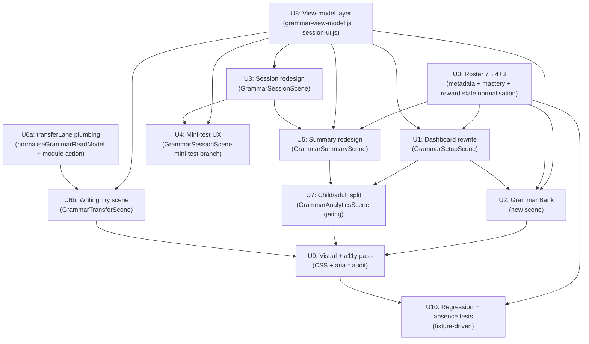

# feat: Grammar Phase 3 UX/UI reset (child dashboard, Grammar Bank, roster 4+3, transfer scene)

## Overview

Phase 2 shipped the Grammar Worker engine to production parity: deterministic selection fairness, attempt-support contract v2, declarative answer-spec, five-label confidence taxonomy, non-scored transfer lane, and a completeness gate (8 PRs, 201 tests green). The learner-facing React surface still reads as an adult diagnostic panel, not a child product. Dashboard exposes Worker-marked mode labels and the full 18-concept placeholder map; session surfaces Worker-authority chips and pre-answer AI buttons; analytics bleeds "Evidence snapshot", "Stage 1", and "Bellstorm bridge" into the learner path; the Worker's `transferLane` read model is plumbed on the server but silently dropped by the client normaliser; the monster roster still shows all seven as equal active creatures even though the product has decided a 4-active + 3-reserve shape.

Phase 3 rewrites the Grammar client surface around a single child-facing flow — **Start → Practise → Fix → Review → Browse Grammar Bank** — and ships the non-scored Writing Try scene that Phase 2 intentionally deferred. It also rationalises the Grammar monster roster to match Punctuation's shipped 3-direct + 1-grand pattern, carrying forward existing learner reward progress without loss.

---

## Problem Frame

The legacy Grammar learner surface was built as a technical inspection view: it explains how the Worker derives mastery, how Stage 1 differs from the full 18-concept denominator, how routes are reserved, and how the Bellstorm bridge interacts with punctuation. That copy is honest but it speaks to adults, not KS2 learners. Spelling already proved the child-facing shape in-product: hero, three mode cards, "Where you stand", a session page that asks one question at a time, a Word Bank with search and filters (see `src/subjects/spelling/components/SpellingSetupScene.jsx`, `src/subjects/spelling/components/SpellingWordBankScene.jsx`, `src/subjects/spelling/session-ui.js`, `src/subjects/spelling/components/spelling-view-model.js`). Punctuation already proved the monster-roster migration shape in-product: 7→3+1 with a `punctuationReserve` filter, grand-monster aggregate via `PUNCTUATION_GRAND_MONSTER_ID = 'quoral'`, and read-time normalisation that unions pre-flip caught/mastered state into the post-flip grand view (`src/platform/game/mastery/shared.js:18-22,30-31`). Grammar has neither yet.

The job of Phase 3 is to bring the Grammar client surface up to Spelling's child-friendliness and Punctuation's roster hygiene, without touching any Phase 2 Worker scoring or schedule logic.

---

## Requirements Trace

- R1. Child can use Grammar without seeing any implementation/reporting language. (origin R15, R16, R17)
- R2. The default path is obvious: Smart Practice sits as the primary action from the dashboard. (origin R6)
- R3. Grammar Bank is useful in the same way Spelling Word Bank is useful: search, status filters, cluster filters, concept detail, "Practise this" from card. (origin R15, R16)
- R4. Session screen shows one task and one primary action at a time; no pre-answer AI/worked/similar-problem buttons in independent practice. (origin R6, R7, R8)
- R5. Strict mini-test feels clearly different from learning practice: no feedback, worked solution, support, or AI before finish. (origin R6)
- R6. Wrong answers lead to simple retry/support, not a wall of explanation; worked solution/similar-problem/AI "Explain another way" only appear after marking. (origin R7, R8)
- R7. Adult analytics exist but are separated from the child flow; reachable from a secondary button, not the default post-session path. (origin R15, R16, R17)
- R8. Only Bracehart, Chronalyx, Couronnail, and Concordium are active in learner UI; Glossbloom, Loomrill, and Mirrane are retained only as reserve assets. (updates origin R10, R11 — see **Product decisions carried forward** below)
- R9. Existing saved reward progress for retired direct monsters is not lost: read-time normalisation unions pre-flip mastered concepts into the Concordium aggregate view. (origin R13, R14)
- R10. Transfer writing has a real non-scored UI: "Writing Try" lets the child choose a prompt, write 2-4 sentences, tick a self-assessment checklist, save, see saved history; Worker invariants (no mastery delta, no reward toast, no retry-queue mutation, no misconception delta, no session-state mutation) are preserved and asserted at the UI layer. (origin R18; carries forward Phase 2 U7 Worker contract)
- R11. Client `normaliseGrammarReadModel` exposes `transferLane` so the React scene can read prompts, limits, and evidence; drift between Worker and client read models is closed with a shape test. (origin R18, R20)
- R12. Child status labels map from Phase 2's five-label taxonomy to child-friendly copy: emerging→New, building→Learning, needs-repair→Trouble spot, consolidating→Nearly secure, secure→Secure. Adult analytics continues to see the internal labels plus sample size. (origin R15, R16)
- R13. No score-bearing behaviour changes are introduced; `contentReleaseId` is not bumped; oracle replay stays byte-for-byte equivalent. (origin R18, R20)
- R14. Accessibility: feedback uses `role="status"`, errors use `role="alert"`, mini-test nav uses `aria-current="step"`, status filter chips use `aria-pressed`; keyboard path answer→submit→retry/next works; every form field has a visible label. (origin R20 via existing app-level a11y contract)
- R15. Monster progress UI uses only the four active Grammar creatures; reserved ids remain in `MONSTERS` for asset tooling and Admin review but do not appear in dashboard/Codex/summary/Grammar Bank. (origin R13, R14; follows Punctuation precedent)
- R16. Phase 3 does not regress English Spelling parity; shared primitives extracted (if any) leave Spelling byte-for-byte equivalent. (origin R20; AGENTS.md line 14)

**Origin actors:** A1 (KS2 learner), A2 (parent/adult), A3 (Grammar subject engine — no client change), A4 (Game/reward layer), A5 (Platform runtime).
**Origin flows:** F1 (Grammar practice without game dependency), F2 (Monster progress as derived reward), F3 (Adult-facing evidence).
**Origin acceptance examples:** AE1 (covers R4, R5, R12), AE2 (covers R7, R13), AE3 (covers R8), AE4 (covers R15, R16, R17).

---

## Scope Boundaries

- No changes to `worker/src/subjects/grammar/*` scoring, marking, selection, answer-spec, confidence derivation, transfer-lane engine, or reward projection. Phase 2 Worker contract is frozen.
- No `contentReleaseId` bump. No `content.js` template edits. No per-template `answerSpec` declarations (deferred per Phase 2 U5).
- No new content expansion for thin concept pools (`pronouns_cohesion`, `formality`, `active_passive`, `subject_object`, `modal_verbs`, `hyphen_ambiguity`). Deferred per Phase 2 I4 to a separate content-release plan.
- No Playwright / real-browser coverage introduction. Stay on `node:test` + SSR harness by convention (AGENTS.md line 13; Phase 2 U4 scope note).
- No Parent/Admin hub rendering of Phase 2 confidence labels. The read-model exposes them; UI rendering in the hub is a separate UI task.
- No English Spelling regression: any shared primitive extraction must leave Spelling parity byte-for-byte (AGENTS.md line 14).
- No score-bearing writing workflow. Writing Try is non-scored only.

### Deferred for later

- Parent/Admin hub rendering of Grammar confidence labels with sample size.
- Content expansion for the six thin concept pools and the two-template `explain` question type.
- Per-template `answerSpec` declarations across the 20 constructed-response templates.
- Sentence-to-paragraph writing transfer with teacher review.

### Outside this product's identity

- AI-authored score-bearing Grammar items. AI remains enrichment-only, post-marking.
- A Grammar content CMS.
- Collapsing Bellstorm Coast into The Clause Conservatory. Punctuation region keeps its distinct identity (origin Scope Boundaries).

### Deferred to Follow-Up Work

- None. Phase 3 ships as a single coherent UX reset; U0+U1+U2 must land together to avoid a dashboard rendering reserved monsters.

---

## Context & Research

### Relevant Code and Patterns

**Spelling mirrors (the pattern to copy)**
- `src/subjects/spelling/session-ui.js` — pure session label/visibility selectors (`spellingSessionSubmitLabel`, `spellingSessionInputPlaceholder`, `spellingSessionFooterNote`, `spellingSessionProgressLabel`, `spellingSessionInfoChips`). Tests can assert labels without full SSR render.
- `src/subjects/spelling/components/spelling-view-model.js` — frozen option lists (`MODE_CARDS`, `ROUND_LENGTH_OPTIONS`, `WORD_BANK_FILTER_IDS`, `WORD_BANK_YEAR_FILTER_IDS`), hero background selectors, word-bank aggregate helpers, display-time formatters.
- `src/subjects/spelling/components/SpellingSetupScene.jsx` — hero + mode cards + round length + "Where you stand" layout.
- `src/subjects/spelling/components/SpellingWordBankScene.jsx` — `FilterChips` with `role="group"` + `aria-pressed`, `YearChips`, search, status counts, detail modal trigger.
- `src/subjects/spelling/components/SpellingWordDetailModal.jsx` — per-word drill-down with "Practise this" action.

**Punctuation monster-roster precedent (the migration shape to copy)**
- `src/platform/game/monsters.js:186-195` — `MONSTERS_BY_SUBJECT.punctuation` (4 active) + `MONSTERS_BY_SUBJECT.punctuationReserve` (3 reserved).
- `src/platform/game/mastery/shared.js:18-22,30-31` — `PUNCTUATION_RESERVED_MONSTER_IDS`, `PUNCTUATION_GRAND_MONSTER_ID = 'quoral'`, `GRAMMAR_GRAND_MONSTER_ID = 'concordium'` (already defined, ready to use).
- `docs/plans/james/punctuation/punctuation-p2-completion-report.md` §2.U5-U7 — the full migration playbook: read-time normaliser unions pre-flip mastered into grand view, `publishedTotal` override so stored denominator becomes irrelevant for display, `terminalRewardToken((learnerId, monsterId, kind, releaseId))` projection-layer dedupe, writer self-heal via cluster remap.

**Grammar surfaces to rewrite**
- `src/subjects/grammar/components/GrammarPracticeSurface.jsx` — entry/router (line 103) + `GRAMMAR_TRANSFER_PLACEHOLDERS` block (lines 10-31, 69-101, 134) to be replaced by the real Writing Try scene.
- `src/subjects/grammar/components/GrammarSetupScene.jsx` — setup/dashboard scene; contains `Worker-marked modes` eyebrow, `full map` stat, full 8-mode equal-weight grid.
- `src/subjects/grammar/components/GrammarSessionScene.jsx` — session surface; contains `Worker authority` chip, `AiEnrichmentActions` rendered pre-answer for non-mini-test, `RepairActions` with pre-answer `Faded support` + `Similar problem` when `session.supportLevel === 0`.
- `src/subjects/grammar/components/GrammarSummaryScene.jsx` — round summary (destination of redesign).
- `src/subjects/grammar/components/GrammarAnalyticsScene.jsx` — adult diagnostic panel (keep, but gate from child default).

**Grammar module/metadata/module state**
- `src/subjects/grammar/metadata.js:149-192` — `GRAMMAR_MONSTER_ROUTES` (seven entries).
- `src/subjects/grammar/metadata.js:405-475` — `normaliseGrammarReadModel`, **drops `transferLane`** (verified by grep; zero matches).
- `src/subjects/grammar/module.js` — action dispatcher; **no `grammar-save-transfer-evidence` action** exists today.
- `src/platform/game/mastery/grammar.js:16-23` — `GRAMMAR_MONSTER_CONCEPTS` (six direct monsters today).
- `src/platform/game/mastery/grammar.js:24-43` — `GRAMMAR_AGGREGATE_CONCEPTS` (all 18 for Concordium).

**Worker contract (frozen, read-only reference)**
- `worker/src/subjects/grammar/read-models.js:829,840-874` — `transferLane` projection with prompts, limits (`GRAMMAR_TRANSFER_MAX_PROMPTS_LIMIT`, `GRAMMAR_TRANSFER_HISTORY_PER_PROMPT_LIMIT`, `GRAMMAR_TRANSFER_WRITING_CAP_LIMIT`), redacted evidence (no `reviewCopy`).
- `worker/src/subjects/grammar/commands.js:8-24` — `save-transfer-evidence` is already a Worker command.

### Institutional Learnings

- `docs/plans/james/grammar/grammar-phase2-implementation-report.md` §2.U4 — SSR harness blind spots (pointer-capture, focus, scroll-into-view, IME). Document these in test-file headers for U10.
- `docs/plans/james/grammar/grammar-phase2-implementation-report.md` §2.U4 — "Silent-no-op" risk for commands: pair HTML regex absence tests with a state-level assertion, otherwise a command that silently fails passes both ways.
- `docs/plans/james/grammar/grammar-phase2-implementation-report.md` §4.3 — `contentReleaseId` bump policy: every unit must check whether change alters marking behaviour. Oracle replay at `tests/fixtures/grammar-legacy-oracle/legacy-baseline.json` is the load-bearing invariant.
- `docs/plans/james/punctuation/punctuation-p2-completion-report.md` §2.U5 reviewer catches — three silent-regression landmines during roster flips: (1) `pickFeaturedCodexEntry` must filter reserved subject ids; (2) `CODEX_POWER_RANK` must place grand above all directs and reserved; (3) subject priority must use explicit `SUBJECT_PRIORITY_ORDER`, never `Object.keys(MONSTERS_BY_SUBJECT)`. All three shipped as single-line bugs would have silently regressed. U0 + U10 must cover these.
- `docs/plans/2026-04-22-001-react-migration-ui-contract.md` §Accessibility Acceptance — app-level a11y contract: feedback `role="status"` + `aria-live="polite"`, errors `role="alert"`, modals `role="dialog"` + `aria-modal="true"` + `aria-labelledby` + focus trap + Esc close. Extend `tests/react-accessibility-contract.test.js` rather than starting Grammar-specific.
- `AGENTS.md` line 13: "Prefer existing platform and subject-module patterns over new abstractions." → U8 view-model layer follows Spelling's `session-ui.js` + `components/<subject>-view-model.js` split; does not invent a new shape.
- `AGENTS.md` line 14: "Do not regress English Spelling parity unless James explicitly accepts the trade-off." → no shared primitive extraction in Phase 3 unless Spelling stays byte-for-byte identical. Safe default: keep primitives subject-scoped inside Grammar.

### External References

None required. The Spelling + Punctuation in-repo patterns already supply the entire UX + migration playbook.

---

## Key Technical Decisions

- **Roster update supersedes origin R10/R11.** Origin specified 7 monsters + 6 direct domains; Phase 3 ships 4 active + 3 reserve to match Punctuation's proven shape and avoid overwhelming KS2 learners with seven "equal" creatures. Reserved ids stay in `MONSTERS` manifest for asset tooling and future activation.
  - **Rationale.** Punctuation's 3-direct + 1-grand shipped and stuck; a 7-monster layout in-learner-UI fragments domain evidence and inflates Codex power-rank complexity. Glossbloom/Loomrill/Mirrane assets are retained against future Grammar content expansion. James explicitly accepted this product-shape update (see session 2026-04-25).
- **Cluster remap for Grammar directs.** Bracehart absorbs Mirrane's Sentence structure cluster (`active_passive`, `subject_object`) and Glossbloom's `noun_phrases`. Chronalyx absorbs Loomrill's Flow/Linkage cluster (`adverbials`, `pronouns_cohesion`). Couronnail absorbs Glossbloom's `word_classes`. Concordium continues to aggregate all 18 Grammar concepts including the five punctuation-for-grammar ones. Full mapping table below in U0.
- **Roster migration uses Punctuation's read-time normalisation shape, plus a Grammar-specific writer self-heal.** Stored reward state for retired direct ids (`glossbloom`, `loomrill`, `mirrane`) is preserved in-repository, but a read-time normaliser unions any pre-flip mastered concept keys into Concordium's aggregate view. We do not mutate stored state on load. This mirrors `punctuationReserve` handling in `src/platform/game/mastery/shared.js:18-22`. **Grammar is asymmetric** — unlike Punctuation's one-way collapse to the grand, Phase 3 remaps some retired-id concepts into *new* direct clusters (`noun_phrases` → Bracehart, `word_classes` → Couronnail, `adverbials` → Chronalyx, etc.). The existing writer `recordGrammarConceptMastery` at `src/platform/game/mastery/grammar.js:166-262` consults only the current direct's `mastered[]` at line 190, so a pre-flip learner who already had `glossbloom.mastered: ['grammar:…:noun_phrases']` would cause the writer to re-fire a spurious `bracehart.caught` toast when they next answer any remapped concept. U0 ships a writer self-heal that, before the line-190 early-out fires, also consults the retired-id entries for the same concept; if any retired-id `mastered[]` contains the mastery key, the new direct is seeded with `{ mastered: [masteryKey], caught: true, conceptTotal, releaseId }` **without** emitting a `caught` event. The emission path is independent from the persistence path for this migration window. Projection-layer `terminalRewardToken` dedupe remains as belt-and-braces for the grand-monster case.
- **U8 view-model layer front-loaded.** `src/subjects/grammar/session-ui.js` + `src/subjects/grammar/components/grammar-view-model.js` ship before JSX rewrites. Every subsequent JSX unit (U1, U3, U4, U5) imports from a single source of truth. Tests become pure-function assertions without SSR render where possible.
- **U6 split into U6a (plumbing) + U6b (React scene).** Client `normaliseGrammarReadModel` does not currently expose `transferLane`; React scene has nothing to read. U6a extends the client normaliser, wires `save-transfer-evidence` into `src/subjects/grammar/module.js` as a `grammar-save-transfer-evidence` action, and adds a drift-detection test. U6b builds `GrammarTransferScene.jsx` on top.
- **Authoritative `transferLane` contract shape (verified against `worker/src/subjects/grammar/transfer-prompts.js:95-104` and `worker/src/subjects/grammar/read-models.js:840-874` and `worker/src/subjects/grammar/engine.js:1723-1803`):**
  - Top-level: `rm.transferLane = { mode: 'non-scored', prompts: Array<PromptSummary>, limits: { maxPrompts, historyPerPrompt, writingCapChars }, evidence: Array<EvidenceEntry> }`.
  - `PromptSummary = { id: string, title: string, brief: string, grammarTargets: string[], checklist: string[] }`. **`theme` is not a Worker field**; the UI uses `brief` where it previously considered `theme`. `reviewCopy` is adult-only and redacted.
  - `EvidenceEntry = { promptId: string, latest: { writing: string, selfAssessment: Array<{ key: string, checked: boolean }>, savedAt: number, source: string }, history: Array<{ writing: string, savedAt: number, source: string }>, updatedAt: number }`. **`history` entries do NOT include `selfAssessment` by Worker-side design** — the asymmetry is intentional; UI does not render tick history for archived entries.
  - `save-transfer-evidence` command payload: `{ promptId: string, writing: string, selfAssessment: Array<{ key: string, checked: boolean }> }`. **Payload key is `selfAssessment`, NOT `checklist`.** The UI ticks map to `{ key: checklistItemId, checked: boolean }` pairs. Sending `checklist` silently drops the ticks.
  - Evidence list is server-sorted by `updatedAt` descending. UI must not re-sort by insertion order.
  - Error codes emitted by `save-transfer-evidence` (all in `err.extra.code`): `grammar_transfer_unavailable_during_mini_test`, `grammar_transfer_prompt_not_found`, `grammar_transfer_writing_required`, `grammar_transfer_quota_exceeded`. U6a ships child-copy translations for all four.
  - Constants: `GRAMMAR_TRANSFER_MAX_PROMPTS = 20`, `GRAMMAR_TRANSFER_HISTORY_PER_PROMPT = 5`, `GRAMMAR_TRANSFER_WRITING_CAP = 2000`, `GRAMMAR_TRANSFER_CHECKLIST_CAP = 24`. These come through `rm.transferLane.limits`; UI must not hard-code them.
- **Child confidence label mapping is pure-function.** `grammarChildConfidenceLabel({ label })` lives in `grammar-view-model.js`. Adult copy keeps internal labels plus sample size. This is the only place child-to-adult translation happens, so drift is structural, not conventional.
- **Absence-test as a fixture, not inline strings.** Frozen `GRAMMAR_CHILD_FORBIDDEN_TERMS` array in `grammar-view-model.js` enumerates every adult/developer term that must not appear in child screens. **Verified against current source via grep: `'Worker-held'` is live at `GrammarSetupScene.jsx:83`; `'retrieval practice'` is asserted present by `tests/react-grammar-surface.test.js:31`.** The list is: `['Worker', 'Worker-marked', 'Worker authority', 'Worker marked', 'Worker-held', 'Stage 1', 'Full placeholder map', 'Full map', 'Evidence snapshot', 'Reserved reward routes', 'Reserved reward', 'Bellstorm bridge', '18-concept denominator', 'read model', 'denominator', 'reward route', 'projection', 'retrieval practice']`. Plus a whole-word catch-all `/\bWorker\b/i` to guard against new `Worker-*` compounds that bypass phrase matching. U10 iterates this array against every child phase; new forbidden terms get added once, enforced everywhere. Existing tests that asserted `'Grammar retrieval practice'` present (at `tests/react-grammar-surface.test.js:31`) are updated in U1 to assert child copy instead.
- **Adult view reachable, never default.** Analytics Scene stays as an adult/teacher view, reachable via a secondary `Grown-up view` button on the Summary screen. It is not rendered in the default dashboard phase. Parent summary draft remains adult-only.
- **AI buttons always post-marking.** `AiEnrichmentActions` and "Explain another way" only render when `grammar.phase === 'feedback'` or after the answer is scored. In mini-test, they never render before `miniTest.finished`.
- **Sentence Surgery / Sentence Builder / Worked Example / Faded Help stay available behind a "More practice" disclosure**, not as equal-weight mode cards. Four primary mode cards: Smart Practice, Fix Trouble Spots, Mini Test, Grammar Bank.
- **Phase 3 is client-only.** No Worker file touched except possibly minor read-model passthrough shape docs. Bundle audit's `worker/src/subjects/grammar/*` guard remains green automatically.

### Product Decisions Carried Forward

| Origin requirement | Phase 3 update | Reason |
|---|---|---|
| R10: "seven monsters: Bracehart, Glossbloom, Loomrill, Chronalyx, Couronnail, Mirrane, Concordium" | **Updated to 4 active (Bracehart, Chronalyx, Couronnail, Concordium) + 3 reserve (Glossbloom, Loomrill, Mirrane)** | KS2 learner cognitive load; Punctuation 3+1 precedent; James explicit decision 2026-04-25 |
| R11: "six direct monster families" | **Updated to 3 direct monster families** with cluster remap (Bracehart absorbs Sentence structure + noun_phrases; Chronalyx absorbs Flow/Linkage; Couronnail absorbs Word classes) | Same as above |

All other origin requirements (R1-R9, R12-R20) are carried forward unchanged.

---

## Open Questions

### Resolved During Planning

- **Q: Does Phase 3 touch Worker scoring or content?** A: No. Engine is frozen. Phase 3 is client-only, plus shared platform game-registry/mastery files (`src/platform/game/monsters.js`, `src/platform/game/mastery/*.js`, `src/surfaces/home/data.js`) needed for the roster flip.
- **Q: Should `grammar-p3.md` U0 monster shift override origin R10/R11?** A: Yes. James explicitly approved 4+3 shape 2026-04-25. Recorded as product decision carried forward.
- **Q: Is `transferLane` reachable from the client today?** A: No. Verified by grep in `src/subjects/grammar/metadata.js` — zero matches. U6a plumbs it through.
- **Q: Is `{ promptId, writing, checklist }` the right payload for `save-transfer-evidence`?** A: No — worker reads `selfAssessment` (array of `{key, checked}`). The draft plan had this wrong; corrected during Phase 5.3 deepening against `worker/src/subjects/grammar/engine.js:1754-1760`.
- **Q: Is the client writer path safe across the roster flip without a self-heal?** A: No. Tracing `recordGrammarConceptMastery` showed the early-out only consults the current direct's `mastered[]`; pre-flip Glossbloom-caught learners would cause spurious `bracehart.caught` emissions post-flip. U0 self-heal is required, not optional.
- **Q: Do we extract shared `HeroCard`/`ModeCard`/`StatusChip` primitives to a shared location?** A: No. AGENTS.md line 14 hard-constrains English Spelling parity. Grammar uses subject-scoped copies that mirror Spelling's shape without changing Spelling's files.
- **Q: Does the Windows bundle-audit guard need Phase 3 work?** A: No. Commit 008c0c5 already fixed it on `main`. Scope excludes.
- **Q: Playwright?** A: No. `node:test` + SSR harness by repo convention (AGENTS.md, Phase 2 U4).

### Deferred to Implementation

- Exact CSS file split for Grammar-specific styling (new file vs. extend existing `grammar-*` rules) — decide at U9 based on existing CSS layout.
- Exact copy for child-facing hero headline ("Grammar Garden" vs "Clause Conservatory") and subheadline — decide at U1 with James review before merge.
- Whether `SessionGoalChip` is retained in child session or hidden until feedback — decide at U3 based on SSR render review.
- Whether `buildGrammarMonsterEvolutionSummary`-style helper already exists for Concordium aggregate display or needs introduction — check at U0 implementation time.
- Exact fixture size for Grammar Bank mock read model in new tests — decide at U2.
- Exact child-copy strings for the four Writing Try error-code translations — U6a lands initial versions; James may refine during U6b review.
- Stable `key` shape for checklist `selfAssessment` items — derived from checklist item index or slug; decide at U6b implementation (must be stable across renders so Worker-side archive remains coherent).
- Whether Grammar Bank status filter `'trouble'` shows **only** concepts labelled `needs-repair` or also `emerging`+`needs-repair` (interpretation of "Trouble spot" for child) — decide at U2 implementation after SSR review.
- Whether orphaned transfer evidence entries should be deletable from UI or only shown as read-only — decide at U6b based on learner/parent feedback during implementation.

---

## High-Level Technical Design

> *This illustrates the intended approach and is directional guidance for review, not implementation specification. The implementing agent should treat it as context, not code to reproduce.*

### Phase 3 dependency graph



### Child-facing information architecture

```
Dashboard (GrammarSetupScene)
 ├─ Hero: "Grammar Garden / Clause Conservatory" + "One short round. Fix tricky sentences. Grow your Grammar creatures."
 ├─ Today cards: Due today · Trouble spots · Secure · Round streak
 ├─ Primary mode cards (4): Smart Practice · Fix Trouble Spots · Mini Test · Grammar Bank
 ├─ More practice (disclosure): Learn a Concept · Sentence Surgery · Sentence Builder · Worked Example · Faded Help
 └─ Secondary: Writing Try

Session (GrammarSessionScene, non-mini-test)
 ├─ Progress: "Question X of N" + progress path
 ├─ Prompt + input + Read aloud + Submit  (NO pre-answer AI/worked/similar-problem)
 ├─ After correct: single-line explanation + Next question
 └─ After wrong: nudge + Try again · Show a step · Show answer · (then) AI "Explain another way"

Mini-test (GrammarSessionScene, mini-test branch)
 ├─ Progress: "Mini Test" + Question nav circles + Timer
 ├─ Prompt + input + Save and next (NO feedback, support, AI, worked, explanations before finish)
 └─ After finish: score card + expandable per-question review ("your answer / correct / why / practise later")

Summary (GrammarSummaryScene)
 ├─ Cards: Answered · Correct · Trouble spots · New secure · Monster progress (4 active only)
 ├─ Primary actions: Practise missed · Start another round · Open Grammar Bank
 └─ Secondary: "Grown-up view" → opens Analytics

Grammar Bank (GrammarConceptBankScene — new)
 ├─ Search + status filter chips (All · Due · Trouble · Learning · Nearly secure · Secure · New)
 ├─ Cluster filter chips (All · Bracehart · Chronalyx · Couronnail · Concordium)
 ├─ Concept cards (18): name · tiny explanation · status chip · cluster badge · example · "Practise 5"
 └─ Concept detail modal: summary · example · status evidence (child copy) · "Practise this" dispatch

Writing Try (GrammarTransferScene — new)
 ├─ Prompt picker (from transferLane.prompts)
 ├─ Writing area (respects writingCapChars limit)
 ├─ Self-check checklist (grammar choices used)
 ├─ Save (dispatches grammar-save-transfer-evidence)
 └─ Saved history per prompt (redacted, no reviewCopy)

Adult (GrammarAnalyticsScene)
 ├─ Reachable only via Summary → "Grown-up view" (no default render in child phase)
 ├─ Keep: Evidence snapshot · Misconception patterns · Question-type evidence · Parent summary draft · Bellstorm bridge
 └─ Add: sample-size + internal confidence label badges next to each concept
```

---

## Implementation Units

- U0. **Roster update: 4 active + 3 reserve + cluster remap**

**Goal:** Move Grammar monster roster to 4 active (Bracehart, Chronalyx, Couronnail, Concordium) + 3 reserve (Glossbloom, Loomrill, Mirrane); remap direct-monster concepts so the 18 Grammar concepts group into 3 direct clusters plus Concordium's aggregate; preserve pre-flip learner reward state via read-time normalisation; update `GRAMMAR_MONSTER_ROUTES` metadata used by both learner UI and analytics.

**Requirements:** R8, R9, R15 (updates R10, R11)

**Dependencies:** None (foundational). U1/U2/U5/U10 depend on this.

**Files:**
- Modify: `src/platform/game/monsters.js` — add `grammar` active list of 4 (drop Glossbloom/Loomrill/Mirrane) and `grammarReserve: ['glossbloom', 'loomrill', 'mirrane']` entry mirroring `punctuationReserve` shape.
- Modify: `src/platform/game/mastery/shared.js` — add `GRAMMAR_RESERVED_MONSTER_IDS` frozen export derived from `MONSTERS_BY_SUBJECT.grammarReserve`; `GRAMMAR_MONSTER_IDS` automatically narrows to the four active.
- Modify: `src/platform/game/mastery/grammar.js` — rebucket `GRAMMAR_MONSTER_CONCEPTS` to 3 direct clusters (Bracehart: `sentence_functions`, `clauses`, `relative_clauses`, `noun_phrases`, `active_passive`, `subject_object`; Chronalyx: `tense_aspect`, `modal_verbs`, `adverbials`, `pronouns_cohesion`; Couronnail: `word_classes`, `standard_english`, `formality`); keep `GRAMMAR_AGGREGATE_CONCEPTS` unchanged at 18.
- Modify: `src/subjects/grammar/metadata.js` — `GRAMMAR_MONSTER_ROUTES` trimmed to 4 entries (Bracehart, Chronalyx, Couronnail, Concordium) with remapped `conceptIds` matching `GRAMMAR_MONSTER_CONCEPTS` + Concordium's aggregate.
- Modify: `src/platform/game/mastery/grammar.js` — add read-time normaliser `normaliseGrammarRewardState(raw, releaseId)` that unions any `state.glossbloom.mastered` / `state.loomrill.mastered` / `state.mirrane.mastered` concept keys into `state.concordium.mastered` without mutating the retired entries. **Dedupe by concept id via `grammarConceptIdFromMasteryKey(key, scopedReleaseId)` per entry, not by raw string equality** — retired entries may carry a different `releaseId` than the post-flip Concordium entry. Reuse `GRAMMAR_CONCEPT_TO_MONSTER` for the new mapping.
- Modify: `src/platform/game/mastery/grammar.js` — **writer self-heal in `recordGrammarConceptMastery`** (lines 166-262). Before the early-out at line 190, union-check against retired-id `mastered[]` for the concept being recorded: if any retired id in `GRAMMAR_RESERVED_MONSTER_IDS` holds a key that resolves to the same concept id (via `grammarConceptIdFromMasteryKey`), and the new direct's `mastered[]` does not yet hold it, seed the new direct's entry with `{ mastered: [masteryKey], caught: true, conceptTotal, releaseId }` **silently** (persist the state delta, but do NOT append a `caught` event to the returned events list for this seed path). The post-flip learner then sees the new direct at the correct state without a duplicate toast. Document with a block comment citing the cross-direct re-emission issue this prevents.
- Modify: projection layer where Grammar reward events fire. The event id at `src/platform/game/mastery/grammar.js:132` keys on `conceptId:monsterId:kind` — cross-monster events for the same concept are NOT deduped by event id alone. Extend `terminalRewardToken` shape to key on `(learnerId, subjectId, conceptId, kind, releaseId)` for Grammar direct events **in addition to** the existing `(learnerId, monsterId, kind, releaseId)`. This is belt-and-braces on top of the writer self-heal: the writer path prevents most duplicates; the token prevents any that slip through a replay.
- Modify: `src/subjects/grammar/components/GrammarPracticeSurface.jsx` — `hasGrammarRewardProgress` currently iterates `GRAMMAR_MONSTER_ROUTES` (line 40); post-U0 that list is 4 entries, so retired-id state is invisible to this check. Route through `normaliseGrammarRewardState` **first**, then run `hasGrammarRewardProgress` on the unioned view so a learner whose only pre-flip progress is under `glossbloom` is detected as a returning learner (the unioned Concordium entry surfaces it), not a fresh learner.
- Modify: `src/surfaces/home/data.js` — `pickFeaturedCodexEntry` currently filters `subjectId !== 'punctuationReserve'` only; extend to `subjectId !== 'grammarReserve'`. `withSynthesisedUncaughtMonsters` currently iterates `Object.entries(MONSTERS_BY_SUBJECT)` and will synthesise uncaught reserved Grammar entries; scope its iteration to `CODEX_SUBJECT_GROUP_IDS` (or equivalent explicit allow-list) so reserved buckets never enter the Codex pipeline.
- Modify: `src/platform/game/monsters.js` `CODEX_POWER_RANK` (if the constant lives here; otherwise wherever codex ranks live) — reorder Grammar ranks so reserved ids (`glossbloom`, `loomrill`, `mirrane`) sit **below** active directs and **far below** Concordium, mirroring Punctuation's treatment where reserved slots fall below directs. Prevents fallback-rank paths from promoting reserved monsters over active ones.
- Modify: `src/platform/game/mastery/spelling.js` callsites that consume `activeGrammarMonsterSummaryFromState(state)` or `grammarMonsterSummaryFromState(state)` (currently at lines 146, 171) — route through `normaliseGrammarRewardState` so pre-flip `glossbloom.caught: true` learners keep the creature visible on home meadow via Concordium's unioned view.
- Test: `tests/grammar-monster-roster.test.js` (new) — roster shape, cluster mapping, read-time normalisation, writer self-heal, projection-layer dedupe (direct + cross-direct), codex landmines, home-surface enumerator allow-list.
- Test: `tests/grammar-rewards.test.js` (extend) — regression on existing reward tests with new cluster map + silent-seed assertions for the writer self-heal.

**Approach:**
- Follow the Punctuation pattern in `src/platform/game/monsters.js:186-195`: active list, reserve list, shared filter derives active ids.
- Do not mutate stored learner state on read. The normaliser reads pre-flip retired-id state and unions its `mastered` arrays into Concordium's view, returning the reshaped object for UI consumption only.
- Concordium continues to use `GRAMMAR_AGGREGATE_CONCEPTS` (18) as its denominator — this is the published total override described in Punctuation P2 §2.U6.
- **Writer self-heal is Grammar-specific and load-bearing.** Punctuation's flip was one-way (all retired → grand); Grammar's is many-to-one PLUS cross-direct (retired ids redistribute into new direct clusters). Without the self-heal, `recordGrammarConceptMastery` re-fires `caught` on the new direct for every pre-flip learner. The seed path persists state but suppresses event emission.
- **Projection-layer dedupe**: extending `terminalRewardToken` shape is additive — old tokens remain valid, the new `(learnerId, subjectId, conceptId, kind, releaseId)` shape catches cross-monster events that share a concept id. The writer path is primary protection; the token is replay protection.
- **Retained-but-reserved ids** (`glossbloom`, `loomrill`, `mirrane`) stay in `MONSTERS` manifest so assets under `assets/monsters/<id>/` keep resolving; they simply do not appear in any active learner-facing summary.
- **Codex landmines** (per Punctuation P2 §2.U5): three single-line regressions must be prevented. (1) `pickFeaturedCodexEntry` reserved filter extended to `grammarReserve`. (2) `CODEX_POWER_RANK` ordering audited — reserved Grammar ranks must sit below active Grammar ranks and far below Concordium. (3) `withSynthesisedUncaughtMonsters` iterates `Object.entries(MONSTERS_BY_SUBJECT)` today; scope to an explicit allow-list so reserved subject buckets never enter the Codex pipeline at all. Confirm current `SUBJECT_PRIORITY_ORDER` already uses an explicit allow-list (Punctuation P2 left it safe).
- **Cross-subject reads**: `src/platform/game/mastery/spelling.js` blends `activeGrammarMonsterSummaryFromState` into its meadow summary (lines 146, 171). These callsites must consume normalised state, not raw. Audit all `*GrammarMonsterSummaryFromState` callsites before U0 lands.
- **Rollback plan**: revert the 6 source files + the writer self-heal commit; retired-id `mastered[]` arrays remain intact on disk. No destructive migration means rollback is low-risk as long as the self-heal commit is revertable in isolation. Document in PR body.

**Patterns to follow:**
- `src/platform/game/monsters.js:186-195` — `punctuation` + `punctuationReserve`.
- `src/platform/game/mastery/shared.js:18-22,30` — `PUNCTUATION_RESERVED_MONSTER_IDS`, `PUNCTUATION_GRAND_MONSTER_ID = 'quoral'` (use existing `GRAMMAR_GRAND_MONSTER_ID = 'concordium'` at line 31).
- `docs/plans/james/punctuation/punctuation-p2-completion-report.md` §2.U5-U7 — full migration playbook.

**Test scenarios:**
- Happy path: `MONSTERS_BY_SUBJECT.grammar` equals `['bracehart', 'chronalyx', 'couronnail', 'concordium']`; `MONSTERS_BY_SUBJECT.grammarReserve` equals `['glossbloom', 'loomrill', 'mirrane']`.
- Happy path: `GRAMMAR_MONSTER_IDS` filters to the four active ids; `GRAMMAR_RESERVED_MONSTER_IDS` filters to the three reserved.
- Happy path: `MONSTERS.glossbloom`, `MONSTERS.loomrill`, `MONSTERS.mirrane` still exist in the registry (asset tooling depends on this).
- Happy path: `GRAMMAR_MONSTER_ROUTES.length === 4` (exactly).
- Happy path: `monsterIdForGrammarConcept('word_classes')` returns `'couronnail'`; `monsterIdForGrammarConcept('modal_verbs')` returns `'chronalyx'`; `monsterIdForGrammarConcept('active_passive')` returns `'bracehart'`; `monsterIdForGrammarConcept('noun_phrases')` returns `'bracehart'`.
- Happy path: `GRAMMAR_MONSTER_CONCEPTS.bracehart` contains exactly 6 concept ids; `chronalyx` contains 4; `couronnail` contains 3; sum equals 13 (18 total − 5 punctuation-for-grammar that only Concordium sees).
- Happy path: Concordium's published total remains 18 via `grammarMonsterConceptTotal('concordium') === GRAMMAR_AGGREGATE_CONCEPTS.length`.
- Edge case: `normaliseGrammarRewardState` called on state with `{ glossbloom: { mastered: ['grammar:...:word_classes'], releaseId: 'grammar-legacy-reviewed-2026-04-24' }, concordium: { mastered: [] } }` returns a view where `concordium.mastered` includes the word_classes key AND the retired `glossbloom.mastered` remains unchanged in the returned object (preserves asset-tool compatibility).
- Edge case: `normaliseGrammarRewardState` dedupes by **concept id** (via `grammarConceptIdFromMasteryKey`), not raw string equality. When retired-id entry carries a different `releaseId` than Concordium's entry, the union still dedupes to one concept slot.
- Edge case: normaliser called on state with no retired-id entries returns the input unchanged (shape-stable).
- Edge case: `GRAMMAR_MONSTER_ROUTES` contains exactly 4 entries; iteration in `GrammarAnalyticsScene` no longer reveals Glossbloom/Loomrill/Mirrane route rows. **Covers AE4.**
- Integration: **Writer self-heal** — given state `{ glossbloom: { mastered: ['grammar:...:noun_phrases'], caught: true } }` and a fresh answer that resolves to `noun_phrases`, `recordGrammarConceptMastery` returns events **without** a `bracehart.caught` event (self-heal suppressed it); state persists with `{ bracehart: { mastered: ['grammar:...:noun_phrases'], caught: true, ... } }` AND retained `glossbloom` entry. The same call on a truly fresh learner DOES return a `bracehart.caught` event.
- Integration: `pickFeaturedCodexEntry` returns a result for a Grammar-selected learner; result's `subjectId` is **never** `'grammarReserve'`. Covers Punctuation P2 §2.U5 landmine #1 for Grammar.
- Integration: `withSynthesisedUncaughtMonsters` output never contains entries with `subjectId === 'grammarReserve'` or with a monster id in `GRAMMAR_RESERVED_MONSTER_IDS`. Covers the upstream pipeline version of landmine #1.
- Integration: `CODEX_POWER_RANK` for `concordium` ranks strictly above all of `bracehart`, `chronalyx`, `couronnail`, `glossbloom`, `loomrill`, `mirrane`; reserved ranks sit below active direct ranks (mirrors Punctuation ordering). Covers landmine #2.
- Integration: `Object.keys(MONSTERS_BY_SUBJECT)` includes `grammarReserve`, but callsites iterating this key map explicitly skip subjects not in `SUBJECT_PRIORITY_ORDER` or `CODEX_SUBJECT_GROUP_IDS`. Covers landmine #3.
- Integration: projection-layer `terminalRewardToken` dedupes two events that share `(learnerId, subjectId, conceptId, kind, releaseId)` even if their `monsterId` differs — verifies the cross-direct dedupe for any events that slip the writer self-heal. **Covers AE2.**
- Integration: `GrammarPracticeSurface`'s `resolveGrammarRewardState` routes through `normaliseGrammarRewardState` **before** `hasGrammarRewardProgress` so a learner with only `glossbloom.caught: true` on disk is treated as a returning learner (Concordium progress visible), not fresh.
- Integration: `activeGrammarMonsterSummaryFromState(normalisedState)` for a pre-flip glossbloom-only learner returns a non-empty array with Concordium visible; without normalisation it would be empty.

**Verification:**
- `node --test tests/grammar-monster-roster.test.js tests/grammar-rewards.test.js` runs green.
- `grep` for `glossbloom\|loomrill\|mirrane` in `src/subjects/grammar/components/*.jsx` returns zero hits after U1/U2/U7 land.
- `node --test tests/react-grammar-surface.test.js` remains green against existing snapshots (roster change does not break rendering once `GRAMMAR_MONSTER_ROUTES` updates).
- Post-deploy SQL/state probes (belt-and-braces, runnable ad-hoc):
  - `state.glossbloom?.caught && !view.bracehart?.caught && !view.concordium?.caught` → zero learners.
  - For every concept in `GRAMMAR_CONCEPT_TO_MONSTER`: assert no learner has the same `masteryKey` in BOTH the new-direct's `mastered[]` AND any retired-id's `mastered[]` — the self-heal should have seeded one, not duplicated.
  - Count `reward.monster` events where `monsterId='bracehart' AND kind='caught'` emitted after U0 deploy for learners whose pre-U0 `glossbloom.caught` was already true; expected zero.

---

- U8. **Grammar view-model layer (front-loaded)**

**Goal:** Extract pure label/visibility/filter helpers into `src/subjects/grammar/session-ui.js` and `src/subjects/grammar/components/grammar-view-model.js` so subsequent JSX units (U1, U3, U4, U5, U6b) import from a single source of truth; introduce `GRAMMAR_CHILD_FORBIDDEN_TERMS`, child confidence label mapping, and frozen option lists.

**Requirements:** R1, R3, R4, R5, R6, R12, R14

**Dependencies:** U0 (cluster mapping shapes the `grammarMonsterClusterForConcept` helper).

**Files:**
- Create: `src/subjects/grammar/session-ui.js` — session-phase label/visibility selectors mirroring `src/subjects/spelling/session-ui.js`.
- Create: `src/subjects/grammar/components/grammar-view-model.js` — frozen option lists, child label mapping, filter helpers, forbidden-terms fixture.
- Test: `tests/grammar-ui-model.test.js` (new) — pure-function assertions on every exported helper.

**Approach:**
- Session-ui exports (mirror Spelling's shape):
  - `grammarSessionSubmitLabel(session, awaitingAdvance)` → `'Submit' | 'Saved' | 'Try again' | 'Save and next' | 'Finish mini-set'`.
  - `grammarSessionHelpVisibility(session, grammarPhase)` → object with boolean flags `{ showAiActions, showRepairActions, showWorkedSolution, showSimilarProblem, showFadedSupport }`. Rules: AI + worked + similar-problem only when `grammarPhase === 'feedback'` AND not mini-test; faded-support only when `grammarPhase === 'feedback'` AND not mini-test AND `session.supportLevel === 0`; all false when mini-test active.
  - `grammarSessionProgressLabel(session)` → `'Question X of N'` or `'Mini Test — Question X of N'`.
  - `grammarSessionInfoChips(session)` → array; child mode removes `Worker authority`, `question type`, adult domain.
  - `grammarSessionFooterNote(session)` → child-copy only; no mention of Worker, evidence, or routes.
  - `grammarFeedbackTone(result)` → `'good' | 'bad' | 'neutral'`.
- View-model exports:
  - `GRAMMAR_PRIMARY_MODE_CARDS` (frozen): `smart`, `trouble`, `satsset`, `bank` — mapped to `'Smart Practice' | 'Fix Trouble Spots' | 'Mini Test' | 'Grammar Bank'`.
  - `GRAMMAR_MORE_PRACTICE_MODES` (frozen): `learn`, `surgery`, `builder`, `worked`, `faded` — disclosed under "More practice" in dashboard.
  - `GRAMMAR_BANK_STATUS_FILTER_IDS` (frozen Set): `'all' | 'due' | 'trouble' | 'learning' | 'nearly-secure' | 'secure' | 'new'`.
  - `GRAMMAR_BANK_CLUSTER_FILTER_IDS` (frozen Set): `'all' | 'bracehart' | 'chronalyx' | 'couronnail' | 'concordium'`.
  - `grammarChildConfidenceLabel({ label })` → maps internal 5-label taxonomy to child copy: `emerging→New, building→Learning, needs-repair→Trouble spot, consolidating→Nearly secure, secure→Secure`.
  - `grammarChildConfidenceTone(label)` → CSS-class-appropriate tone (`new | learning | trouble | nearly-secure | secure`).
  - `grammarMonsterClusterForConcept(conceptId)` → returns `'bracehart' | 'chronalyx' | 'couronnail' | 'concordium'` via `GRAMMAR_CONCEPT_TO_MONSTER` + aggregate fallback.
  - `grammarBankFilterMatchesStatus(filter, label)` → boolean match between child-facing filter id and internal confidence label.
  - `buildGrammarDashboardModel(grammar, learner, rewardState)` → returns `{ modeCards, todayCards, concordiumProgress, primaryMode, moreModes, writingTryAvailable }`.
  - `buildGrammarBankModel(grammar, { statusFilter, clusterFilter, query })` → returns `{ cards, counts, total }` with filter + search + cluster grouping applied.
  - `grammarSummaryCards(summary, rewardState)` → returns the five summary cards (Answered, Correct, Trouble spots found, New secure, Monster progress using 4 active only).
  - `GRAMMAR_CHILD_FORBIDDEN_TERMS` (frozen): `['Worker', 'Worker-marked', 'Worker authority', 'Worker marked', 'Stage 1', 'Full placeholder map', 'Full map', 'Evidence snapshot', 'Reserved reward routes', 'Reserved', 'Bellstorm bridge', '18-concept denominator', 'read model', 'denominator', 'reward route', 'projection']`. Case-insensitive match at test time.
  - `isGrammarChildCopy(text)` → helper returning `true` if `text` contains none of `GRAMMAR_CHILD_FORBIDDEN_TERMS`.

**Patterns to follow:**
- `src/subjects/spelling/session-ui.js:1-57` — shape, branching style, return-string convention.
- `src/subjects/spelling/components/spelling-view-model.js:1-80` — frozen lists, pure functions, no React imports.

**Test scenarios:**
- Happy path: `grammarSessionSubmitLabel({ type: 'mini-set', ... }, false)` returns `'Save and next'`; `grammarSessionSubmitLabel(null)` returns `'Submit'`; `grammarSessionSubmitLabel({ phase: 'retry' })` returns `'Try again'`.
- Happy path: `grammarSessionHelpVisibility({ type: 'mini-set', miniTest: { finished: false } }, 'session')` returns all flags `false`. **Covers AE1, AE2.**
- Happy path: `grammarSessionHelpVisibility({ type: 'smart', supportLevel: 0 }, 'feedback')` returns `showAiActions: true, showRepairActions: true, showFadedSupport: true`. **Covers AE3.**
- Happy path: `grammarSessionHelpVisibility({ type: 'smart', supportLevel: 0 }, 'session')` returns all help flags `false` (pre-answer independent practice must not surface help).
- Happy path: `grammarChildConfidenceLabel({ label: 'needs-repair' })` returns `'Trouble spot'`; `grammarChildConfidenceLabel({ label: 'consolidating' })` returns `'Nearly secure'`.
- Happy path: `grammarMonsterClusterForConcept('word_classes')` returns `'couronnail'`; `grammarMonsterClusterForConcept('parenthesis_commas')` returns `'concordium'` (punctuation-for-grammar concept; only aggregate holds it).
- Happy path: `GRAMMAR_PRIMARY_MODE_CARDS.length === 4`; IDs match the active-mode set.
- Edge case: `grammarSessionProgressLabel({ type: 'mini-set', miniTest: { questions: [{}, {}, {}], currentIndex: 1 } })` returns `'Mini Test — Question 2 of 3'`.
- Edge case: `grammarBankFilterMatchesStatus('trouble', 'needs-repair')` returns `true`; `grammarBankFilterMatchesStatus('secure', 'consolidating')` returns `false`.
- Edge case: `buildGrammarBankModel(grammar, { query: 'clause' })` returns card list filtered to concepts whose name OR summary OR example match `clause` case-insensitively.
- Edge case: `isGrammarChildCopy('Worker-marked modes')` returns `false`; `isGrammarChildCopy('Choose the sentence that uses a relative clause')` returns `true`.
- Error path: `buildGrammarDashboardModel(null, null, null)` returns a safe shape (empty mode cards, zero counts) rather than throwing.
- Integration: `grammarSessionHelpVisibility` is the single source of truth — U3 and U4 component tests inherit its truth table rather than restating visibility rules.

**Verification:**
- `node --test tests/grammar-ui-model.test.js` runs green.
- No JSX file imports React inside `session-ui.js` or `grammar-view-model.js`.
- `grep` for `'Worker'\|'Stage 1'\|'Evidence snapshot'` inside the view-model exports returns only occurrences in `GRAMMAR_CHILD_FORBIDDEN_TERMS`, not in user-facing strings.

---

- U6a. **`transferLane` client plumbing + `grammar-save-transfer-evidence` dispatcher**

**Goal:** Close the Worker→client drift: extend `normaliseGrammarReadModel` in `src/subjects/grammar/metadata.js` to expose `transferLane` with prompts, limits, and evidence; register a `grammar-save-transfer-evidence` action in `src/subjects/grammar/module.js` that dispatches the existing `save-transfer-evidence` Worker command; add a drift-detection test that pins the Worker+client shape agreement.

**Requirements:** R10, R11, R13

**Dependencies:** U8 (for consistent typing/label helpers).

**Files:**
- Modify: `src/subjects/grammar/metadata.js` — extend `normaliseGrammarReadModel` return object to include `transferLane` with defensive shape guard matching the **authoritative contract documented in Key Technical Decisions**: `{ mode: 'non-scored' | '', prompts: PromptSummary[], limits: { maxPrompts, historyPerPrompt, writingCapChars }, evidence: EvidenceEntry[] }` where `PromptSummary = { id, title, brief, grammarTargets, checklist }` and `EvidenceEntry = { promptId, latest: { writing, selfAssessment, savedAt, source }, history: Array<{ writing, savedAt, source }>, updatedAt }`. Unknown or missing Worker fields default to empty/zero-valued safe shapes; malformed arrays coerce to `[]`.
- Modify: `src/subjects/grammar/module.js` — register `grammar-save-transfer-evidence` action that dispatches `save-transfer-evidence` Worker command with `{ promptId: string, writing: string, selfAssessment: Array<{ key: string, checked: boolean }> }` payload (NOT `checklist` — that key is silently dropped by the Worker). Merges the response through `normaliseGrammarReadModel`. Honour the existing `sendGrammarCommand` pendingCommand short-circuit (`src/subjects/grammar/module.js:77`) so double-taps do not silently drop.
- Modify: `src/subjects/grammar/module.js` — add child-copy translation map for the four known `save-transfer-evidence` error codes (`grammar_transfer_unavailable_during_mini_test` → "You cannot save writing during a mini test."; `grammar_transfer_prompt_not_found` → "That writing prompt is not available."; `grammar_transfer_writing_required` → "Write at least a few words before saving."; `grammar_transfer_quota_exceeded` → "You have too many saved writings. Delete one to save more."). Route through `rm.error` with `role="alert"` at the UI level.
- Modify: `src/subjects/grammar/event-hooks.js` (only if event-hooks touches the read-model; verify first) — ensure `transferLane` passthrough survives any local-path transitions.
- Test: `tests/grammar-transfer-lane.test.js` (extend) — add client-side drift detection: render fixture Worker read model, run through `normaliseGrammarReadModel`, assert every key the Worker emits under `transferLane` (including nested `prompts[*].{id,title,brief,grammarTargets,checklist}` and `evidence[*].latest.{writing,selfAssessment,savedAt,source}` and `evidence[*].history[*].{writing,savedAt,source}`) is reachable on the normalised client shape.
- Test: `tests/react-grammar-surface.test.js` (extend) — dispatch `grammar-save-transfer-evidence` with a valid `{ promptId, writing, selfAssessment: [{key, checked}] }` payload; assert the Worker command boundary receives exactly those keys (no `checklist`, no aliasing); `rm.transferLane.evidence` updates; `state.mastery` stays unchanged; no `reward.monster` event fires.

**Approach:**
- The Worker `transferLane` shape is defined at `worker/src/subjects/grammar/read-models.js:840-874` and the `PromptSummary` shape at `worker/src/subjects/grammar/transfer-prompts.js:95-104`. Mirror those shapes defensively on the client — never trust Worker fields to be present, but do not silently discard them.
- **`reviewCopy` and `requestId` redaction**: Worker already omits `reviewCopy` from `grammarTransferPromptSummary` and `requestId` from emitted evidence entries. Client normaliser should NOT re-introduce either. Test-time recursive key scan asserts both absent anywhere under `rm.transferLane`: `assertNoForbiddenReadModelKeys(rm.transferLane, ['reviewCopy', 'requestId'])`.
- **Evidence sort order is a contract**: evidence list is server-sorted by `updatedAt` descending (`read-models.js:872`). Client normaliser must preserve this ordering; UI rendering must not re-sort by insertion order.
- **Latest-vs-history asymmetry is intentional**: `evidence[].latest` includes `selfAssessment`; `evidence[].history[*]` does NOT. Document this in the normaliser with a block comment so a future reader does not "fix" the asymmetry.
- The `grammar-save-transfer-evidence` action is the first action in Grammar that carries a non-form payload; follow the shape of `grammar-request-ai-enrichment` dispatch (existing module.js pattern) for the command/payload marshalling.
- **Phase allowlist scope**: U6a does NOT add `'transfer'` to the `normaliseGrammarReadModel` phase allowlist at line 416. That addition belongs in U6b when the scene ships. `save-transfer-evidence` does not mutate `state.phase` (confirmed at `worker/src/subjects/grammar/engine.js:1723-1803`), so the client-only phase-transition to `'transfer'` happens via a `grammar-open-transfer` action in U6b, after the allowlist update lands in the same PR.
- **Concurrent-dispatch hedge**: the existing `sendGrammarCommand` short-circuits if a `pendingCommand` is in flight (line 77). UI in U6b must show a pending/disabled Save button while `rm.pendingCommand === 'save-transfer-evidence'` so the learner sees why their second click was ignored.
- **Orphaned evidence**: the Worker emits evidence for any promptId in `state.transferEvidence`, even if the prompt catalogue no longer contains a matching entry (e.g., a filler-* fixture id or a retired prompt). U6b scene must gracefully render orphaned evidence as "Saved for a retired writing prompt" rather than throw.

**Patterns to follow:**
- `worker/src/subjects/grammar/read-models.js:840-874` — Worker shape (source of truth).
- `src/subjects/grammar/module.js` — existing action-to-command dispatch for `grammar-request-ai-enrichment`.

**Test scenarios:**
- Happy path: Worker emits `rm.transferLane = { mode: 'non-scored', prompts: [{ id, title, brief, grammarTargets, checklist }], limits: {...}, evidence: [{ promptId, latest: { writing, selfAssessment, savedAt, source }, history: [{ writing, savedAt, source }], updatedAt }] }`; after `normaliseGrammarReadModel`, all keys at every nested level are present on `rm.transferLane` with the same values.
- Happy path: `grammar-save-transfer-evidence` action with `{ promptId: 'storm-scene', writing: 'The storm rolled in, dark and loud.', selfAssessment: [{ key: 'use_fronted_adverbial', checked: true }] }` dispatches Worker command `save-transfer-evidence` with that exact payload — assert the command boundary receives keys `{ promptId, writing, selfAssessment }` and nothing else.
- Happy path: Worker emits `prompts[0].grammarTargets = ['adverbials', 'parenthesis_commas', 'relative_clauses']`; normalised `rm.transferLane.prompts[0].grammarTargets` equals that array.
- Happy path: Worker emits evidence in `updatedAt` descending order; normalised `rm.transferLane.evidence` preserves that order.
- Edge case: Worker omits `transferLane` → client normaliser returns `rm.transferLane = { mode: '', prompts: [], limits: { maxPrompts: 0, historyPerPrompt: 0, writingCapChars: 0 }, evidence: [] }` (shape-stable, never `undefined`). **Covers R11.**
- Edge case: Worker emits malformed `transferLane.prompts = 'not-an-array'` → client normaliser coerces to `[]` without throwing.
- Edge case: Worker emits `evidence[0].latest.selfAssessment = undefined` → client normaliser coerces to `[]` without throwing.
- Edge case: orphaned evidence (evidence entry whose `promptId` is not in `rm.transferLane.prompts`) passes through untouched; U6b renders it as "retired prompt".
- Error path (contract v2): `save-transfer-evidence` Worker command returns each of the four known error codes; each maps to child-copy via the translation map; `rm.error` is set to child copy; `rm.mastery` is unchanged; `state.transferEvidence` on client-projection stays unchanged; no reward toast fires. **Covers R13.**
- Error path: `save-transfer-evidence` unknown error code → client falls back to generic `"That did not save. Try again."` with `role="alert"`.
- Error path: dispatching `grammar-save-transfer-evidence` while `rm.pendingCommand !== ''` short-circuits (existing module.js behaviour at line 77); the UI must show the button as disabled/pending while this is the case.
- Integration: Drift test iterates every key Worker's `grammarTransferLaneReadModel` produces at every nesting level (top-level + prompt + limits + evidence + evidence.latest + evidence.history[*]); if a future Worker change adds a key, the test fails unless client normaliser passes it through or explicitly allow-lists it.
- Integration: Recursive scan `assertNoForbiddenReadModelKeys(rm.transferLane, ['reviewCopy', 'requestId'])` returns pass. **Extended from Punctuation P2 U2 pattern with `requestId` guard.**
- Integration: negative assertion on events emitted by `save-transfer-evidence` — result events array does not contain any `type === 'reward.monster'`, `type === 'grammar.answer-submitted'`, `type === 'grammar.concept-secured'`, or `type === 'grammar.misconception-seen'`.

**Verification:**
- `node --test tests/grammar-transfer-lane.test.js tests/react-grammar-surface.test.js` runs green.
- `grep` for `transferLane` in `src/subjects/grammar/metadata.js` returns at least one hit (currently zero).
- `grep` for `grammar-save-transfer-evidence` in `src/subjects/grammar/module.js` returns at least one hit (currently zero).

---

- U1. **Dashboard rewrite: child-friendly `GrammarSetupScene`**

**Goal:** Replace the current adult-diagnostic setup scene with a child-facing dashboard — hero, 4 primary mode cards (Smart Practice / Fix Trouble Spots / Mini Test / Grammar Bank), today cards (Due / Trouble / Secure / Streak + Concordium progress), "More practice" disclosure for the remaining 5 modes (Learn / Surgery / Builder / Worked / Faded), secondary Writing Try entry; remove `Worker-marked modes` eyebrow, `full map` stat chip, full-width concept grid.

**Requirements:** R1, R2, R7, R12, R15

**Dependencies:** U0 (roster + cluster), U8 (dashboard model + forbidden terms).

**Files:**
- Modify: `src/subjects/grammar/components/GrammarSetupScene.jsx` — rewrite around `buildGrammarDashboardModel` return shape; drop `Worker-marked modes` eyebrow (line 82), drop `Worker marked` chip (line 100), drop `counts.total || 18` + `full map` stat (line 93, 96), drop full 8-mode equal grid (lines 136-145 equivalent).
- Modify: `src/subjects/grammar/components/GrammarPracticeSurface.jsx` — drop `GrammarTransferPlaceholders` inclusion (line 134) since Writing Try lands in U6b; temporarily render nothing in that slot until U6b merges in the same release.
- Test: `tests/react-grammar-surface.test.js` (extend) — dashboard renders 4 primary mode cards, disclosure hides the 5 secondary modes by default, forbidden terms absent, 4 active monsters only.

**Approach:**
- Every label and filter-id comes from U8 view-model; the JSX is layout-only.
- Hero copy is editable via a single constant in `grammar-view-model.js` (`GRAMMAR_DASHBOARD_HERO`). Default: `title: 'Grammar Garden'`, `subtitle: "One short round. Fix tricky sentences. Grow your Grammar creatures."`. Final wording confirmed with James during U1 follower cycle.
- Today cards show only child-readable counts. Round streak from `grammar.analytics.progressSnapshot`. Concordium progress from `rewardState.concordium.mastered.length || 0` / 18.
- Primary mode cards use icon + title + one-line detail, matching Spelling's `MODE_CARDS` shape. "Grammar Bank" is the fourth card and routes to U2's new scene.
- "More practice" uses a `<details>` disclosure with 5 secondary modes.
- Writing Try is a single secondary-button entry ("Writing Try · non-scored") below the mode cards; clicking routes to U6b's scene.
- Do not move any existing route into the wrong phase: `grammar.phase` state machine stays identical.

**Patterns to follow:**
- `src/subjects/spelling/components/SpellingSetupScene.jsx` — hero + mode-card layout, stat chips, round-length selector, Codex entry.
- `src/subjects/spelling/components/SpellingCommon.jsx` → `SummaryCards` — for today cards.

**Test scenarios:**
- Happy path: dashboard SSR HTML includes exactly 4 primary mode cards labelled `Smart Practice`, `Fix Trouble Spots`, `Mini Test`, `Grammar Bank`.
- Happy path: dashboard SSR HTML includes a hero headline and subheadline.
- Happy path: today cards show "Due", "Trouble spots", "Secure", "Streak" counts.
- Happy path: Concordium progress reads `'Concordium progress N/18'` where N is derived from `rewardState`.
- Edge case: a learner with empty read model renders safely (no throw, zero counts).
- Edge case: `<details>` disclosure for "More practice" is closed by default (no `open` attribute).
- Absence: `assert.doesNotMatch(html, /Worker-marked/i)`, `assert.doesNotMatch(html, /Worker authority/i)`, `assert.doesNotMatch(html, /full map/i)`, `assert.doesNotMatch(html, /Evidence snapshot/i)`, iterate `GRAMMAR_CHILD_FORBIDDEN_TERMS` as a loop. **Covers AE4.**
- Absence: `assert.doesNotMatch(html, /Glossbloom|Loomrill|Mirrane/i)` — reserved monsters never appear in dashboard. **Covers R15.**
- Integration: "Writing Try" button has `data-action="grammar-open-transfer"` (or similar dispatch) wired to U6b.

**Verification:**
- `node --test tests/react-grammar-surface.test.js` runs green.
- `npm run check` passes.
- Manual: render dashboard SSR and visually confirm 4 mode cards without concept grid.

---

- U2. **Grammar Bank scene: `GrammarConceptBankScene.jsx`**

**Goal:** Ship a new child-facing Grammar Bank scene mirroring Spelling's Word Bank — search, status filter chips, cluster filter chips, concept cards with child labels, concept detail modal with example sentence + "Practise this" dispatcher.

**Requirements:** R3, R12, R14, R15

**Dependencies:** U0 (cluster), U8 (view-model + filter helpers).

**Files:**
- Create: `src/subjects/grammar/components/GrammarConceptBankScene.jsx` — main Grammar Bank scene.
- Create: `src/subjects/grammar/components/GrammarConceptDetailModal.jsx` — per-concept drill-down.
- Modify: `src/subjects/grammar/module.js` — add `grammar-open-concept-bank`, `grammar-close-concept-bank`, `grammar-concept-bank-filter`, `grammar-concept-bank-cluster-filter`, `grammar-concept-bank-search`, `grammar-focus-concept` (routes to focused practice with `focusConceptId` pref), `grammar-concept-detail-open`, `grammar-concept-detail-close`.
- Modify: `src/subjects/grammar/components/GrammarPracticeSurface.jsx` — extend phase router to render `<GrammarConceptBankScene>` when `grammar.phase === 'bank'`.
- Modify: `src/subjects/grammar/metadata.js` — add `'bank'` to the valid phase list in `normaliseGrammarReadModel` (line 416).
- Test: `tests/react-grammar-surface.test.js` (extend) — bank renders 18 concept cards, filters narrow the list, search narrows the list, cluster filter narrows by active cluster, concept detail modal opens and "Practise this" dispatches focused practice.

**Approach:**
- Status filter chips use `GRAMMAR_BANK_STATUS_FILTER_IDS` from U8: `all`, `due`, `trouble`, `learning`, `nearly-secure`, `secure`, `new`. Each chip shows child label + count + colour swatch matching Spelling's pattern.
- Cluster filter chips use `GRAMMAR_BANK_CLUSTER_FILTER_IDS`: `all`, `bracehart`, `chronalyx`, `couronnail`, `concordium`. Concordium filter shows all 18; others show only that cluster's concepts.
- Concept card content: concept name · tiny summary (one sentence) · child status label + tone · cluster badge · example sentence (from a static `GRAMMAR_CONCEPT_EXAMPLES` registry to be added to `grammar-view-model.js` or its own file) · `Practise 5` button (dispatches `grammar-focus-concept` with the concept id).
- Detail modal: extended summary · two example sentences · child-facing status evidence ("You've answered 3 of these. 2 were correct.") · `Practise this` button (same action) · `Close` (returns focus to the triggering card).
- Do not render `evidence summary`, `Stage 1`, `Worker`, percentages, or raw strength numbers. Use labels.
- Use search on concept name + summary + example sentence (case-insensitive), mirroring Spelling's `wordMatchesSearch`.

**Patterns to follow:**
- `src/subjects/spelling/components/SpellingWordBankScene.jsx` — `FilterChips`, `YearChips`, search, aggregate cards, detail modal trigger.
- `src/subjects/spelling/components/SpellingWordDetailModal.jsx` — modal shape with focus management.
- `spelling-view-model.js` `wordBankAggregateCards` — shape for the top aggregate card row.

**Test scenarios:**
- Happy path: bank SSR HTML includes exactly 18 concept cards when status filter is `all` and cluster filter is `all`.
- Happy path: status filter `trouble` narrows cards to concepts with child label `Trouble spot`. **Covers AE1.**
- Happy path: cluster filter `bracehart` narrows to exactly 6 concepts (Bracehart's post-U0 cluster).
- Happy path: cluster filter `concordium` shows all 18 concepts including the 5 punctuation-for-grammar.
- Happy path: search `clause` narrows to concepts whose name or summary or example contains `clause` case-insensitively.
- Happy path: "Practise 5" button dispatches `grammar-focus-concept` with concept id, which sets `prefs.focusConceptId` and routes to session. **Covers AE1.**
- Happy path: concept detail modal opens on card tap, contains extended summary + two examples + status evidence in child copy.
- Edge case: empty bank (no concepts match filter + search) renders "No concepts match" message, not a blank page.
- Edge case: detail modal close button returns focus to the triggering card (aria focus-return contract from `docs/plans/2026-04-22-001-react-migration-ui-contract.md`).
- Absence: `assert.doesNotMatch(html, /Evidence|Stage 1|denominator|strength %/i)`; iterate `GRAMMAR_CHILD_FORBIDDEN_TERMS`.
- Absence: concept cards never show percentages (`assert.doesNotMatch(html, /\d+%/)` inside concept card markup).
- Absence: reserved monsters never appear as cluster badges.
- Integration: opening the modal and closing it preserves the search query and filter state.

**Verification:**
- `node --test tests/react-grammar-surface.test.js` runs green.
- `npm run check` passes.

---

- U3. **Session redesign: one task, one primary action**

**Goal:** Strip `GrammarSessionScene.jsx` non-mini-test path to one task at a time. Pre-answer: prompt + input + Read aloud + Submit (no AI, no worked solution, no similar problem, no faded support visible). Post-answer (feedback phase): correct → single-line explanation + Next question; wrong → nudge + Try again + Show a step + Show answer + (then) AI "Explain another way".

**Requirements:** R1, R4, R5, R6, R14

**Dependencies:** U8 (`grammarSessionHelpVisibility` is the single source of truth).

**Files:**
- Modify: `src/subjects/grammar/components/GrammarSessionScene.jsx` — gate `AiEnrichmentActions` (line 492), `WorkedSolutionPanel` (line 527), `RepairActions` pre-answer `Faded support` + `Similar problem` branch (lines 374-385) behind `grammarSessionHelpVisibility(session, grammar.phase)`; drop `Worker authority` chip (line 478); simplify chip row to child-friendly chips only.
- Modify: `src/subjects/grammar/components/GrammarSessionScene.jsx` — rework `<h2>` title (line 464) from `item.templateLabel || 'Worker-marked question'` to child-facing progress label from `grammarSessionProgressLabel(session)` (no "Worker-marked").
- Test: `tests/react-grammar-surface.test.js` (extend) — pre-answer render asserts no AI/worked/similar/faded buttons; feedback render asserts retry/worked/similar visible, AI "Explain another way" visible.

**Approach:**
- The JSX reads `const help = grammarSessionHelpVisibility(session, grammar.phase)` once at component top and threads the flags into each panel render guard. This is the single place that decides visibility.
- Post-answer AI "Explain another way" is the existing AI enrichment button relabelled to child copy when `grammarPhase === 'feedback'`. No new Worker action required.
- Read aloud button stays visible in both phases but never plays answer/feedback text until after marking (Phase 2 Worker already enforces this via `buildGrammarSpeechText`).
- `FeedbackPanel` (line 160) stays but only renders when `grammar.phase === 'feedback'` or `awaitingAdvance`; already guarded correctly — verify and keep.
- `SessionGoalChip` stays but rendered in child copy only (no "Worker" terms).
- Error path: `grammar.error` renders with `role="alert"` (already correct at line 537).

**Patterns to follow:**
- `src/subjects/spelling/components/SpellingSessionScene.jsx` — one-task layout.
- `grammarSessionHelpVisibility` (U8) — visibility truth table.

**Test scenarios:**
- Happy path: SSR session render with `grammar.phase === 'session'` and `session.type === 'smart'` — HTML contains `name="answer"` input + primary Submit button; HTML does NOT contain `Explain this`, `Revision cards`, `Worked solution`, `Similar problem`, `Faded support`. **Covers AE1, AE3.**
- Happy path: SSR session render with `grammar.phase === 'feedback'`, `grammar.feedback.result.correct === true` — HTML contains single-line explanation + `Next question` button; HTML does NOT contain `Try again` / `Show a step` / `Show answer`.
- Happy path: SSR session render with `grammar.phase === 'feedback'`, `grammar.feedback.result.correct === false` — HTML contains nudge + `Retry` + `Worked solution` + `Similar problem` + `Explain another way` (relabelled AI enrichment action). **Covers AE2, AE3.**
- Happy path: Read aloud button renders in both phases; disabled when speech unavailable (existing behaviour).
- Edge case: `session.supportLevel > 0` (worked/faded mode explicitly) — `RepairActions` still renders post-answer repair options but not pre-answer support; this is an explicit teaching mode, not regression.
- Error path: `grammar.error` renders with `role="alert"` and child copy (`'That did not save. Try again.'` when error code is `grammar_command_failed`).
- Absence: `assert.doesNotMatch(html, /Worker authority/i)` (line 478 gone).
- Absence: `assert.doesNotMatch(html, /Worker-marked question/i)` (line 464 replaced).
- Integration: submitting answer dispatches `grammar-submit-form` (existing behaviour); feedback phase then follows.
- Integration: Secondary assertion — a silent-no-op check for the gated panels. Assert `session.repair.workedSolutionShown === false` after pre-answer render; if a button was mistakenly rendered and clicked, this would flip. Mirrors Phase 2 U4 silent-no-op pattern.

**Verification:**
- `node --test tests/react-grammar-surface.test.js` runs green.
- `npm run check` passes.
- Manual SSR inspection of pre-answer render confirms single primary action.

---

- U4. **Mini-test UX strictness + post-finish review**

**Goal:** Strict mini-test before finish: no feedback, no support, no AI, no worked solution, no similar problem, no concept explanations. After finish: score card + expandable per-question review.

**Requirements:** R5, R6, R14

**Dependencies:** U3 (visibility truth table), U8 (`grammarSessionHelpVisibility` mini-test branch).

**Files:**
- Modify: `src/subjects/grammar/components/GrammarSessionScene.jsx` — the mini-test branch (lines 306-340 `MiniTestStatus`, 480-487 `MiniTestStatus` render) already hides most support; U4 ensures `FeedbackPanel`, `WorkedSolutionPanel`, `AiEnrichmentPanel`, `AiEnrichmentActions`, `RepairActions` all return `null` when `isMiniTest && !miniTest.finished`. Most guards exist; U4 is an audit + cleanup + post-finish review.
- Modify: `src/subjects/grammar/components/GrammarSessionScene.jsx` (or split into `GrammarMiniTestReview.jsx` if the diff gets large) — add post-finish review panel: score card (correct/total/percent), expandable per-question list with "your answer", "correct answer", "why", "practise this later" per item.
- Test: `tests/react-grammar-surface.test.js` (extend) — SSR mini-test before-finish assertions, after-finish review assertions.

**Approach:**
- Visibility rule (already enforced by U8): `isMiniTest && !miniTest.finished` → all help panels return `null`.
- Timer remains visible and prominent; `MiniTestStatus` already uses `aria-current="step"` on the current nav button (line 331).
- `aria-pressed` on nav buttons reflects answered state (add if missing).
- Post-finish review uses existing `summary` data: Worker already projects per-question outcomes. Extend `normaliseGrammarReadModel` defensively if fields are missing.
- "Practise this later" dispatches `grammar-focus-concept` (added in U2) with the concept id of the missed question.
- Unanswered questions are marked "blank", not treated as wrong. Worker already handles this in Phase 2 U4; UI follows.

**Patterns to follow:**
- Phase 2 U4 SSR tests — answer preservation, unanswered handling, command fail-closed.
- `grammarSessionHelpVisibility` — single truth table.

**Test scenarios:**
- Happy path: SSR mini-test with `miniTest.finished === false` — HTML contains timer, nav, Save and next; does NOT contain `Correct`, `Not quite`, `Worked solution`, `Similar problem`, `Explain this`, `Faded support`, `Show a step`, `Show answer`. **Covers R5, AE1.**
- Happy path: SSR mini-test with `miniTest.finished === true` — HTML contains score card (correct/total), expandable per-question list with answers visible.
- Happy path: unanswered question shows `'Blank'` in review, not `'Wrong'`. **Covers R5.**
- Happy path: timer shows minutes:seconds format; warning style applies when `remainingMs <= 60_000` (existing behaviour).
- Edge case: mini-test with zero answered questions on finish → score card shows `0 / N`, review shows all as `Blank`.
- Edge case: `aria-current="step"` on current nav button; `aria-pressed="true"` on answered nav buttons (add if missing).
- Error path: timer expiry auto-finishes (existing behaviour, SSR-covered); no UI regression.
- Absence: `assert.doesNotMatch(html, /Worked solution|Similar problem|Explain this|Faded support/i)` before finish.
- Absence: secondary assertion — `session.repair.workedSolutionShown === false` and `session.repair.requestedFadedSupport === false` before finish (Phase 2 U4 silent-no-op pattern).
- Integration: `grammar-save-mini-test-response` with an index moves to that question; `grammar-finish-mini-test` reveals review (existing actions, verify they still route correctly).
- Integration: "Practise this later" on a missed question dispatches `grammar-focus-concept` with concept id and routes to focused practice.

**Verification:**
- `node --test tests/react-grammar-surface.test.js tests/grammar-engine.test.js` runs green (verify mini-test engine tests unchanged).
- `npm run check` passes.

---

- U5. **Summary redesign: child-friendly round end**

**Goal:** Replace current summary with a five-card child-friendly end screen (Answered / Correct / Trouble spots found / New secure / Monster progress). Primary actions: Practise missed · Start another round · Open Grammar Bank. Secondary: "Grown-up view" → opens Analytics. Remove long analytics, parent summary drafts, evidence tables from child default.

**Requirements:** R1, R7, R14, R15

**Dependencies:** U0 (4 active monsters only), U8 (`grammarSummaryCards`).

**Files:**
- Modify: `src/subjects/grammar/components/GrammarSummaryScene.jsx` — rewrite around `grammarSummaryCards(summary, rewardState)` return shape; add primary action row (Practise missed / Start another round / Open Grammar Bank) and a secondary `Grown-up view` button that dispatches `grammar-open-analytics` action.
- Modify: `src/subjects/grammar/module.js` — add `grammar-open-analytics` action that flips UI state to show Analytics Scene (either as modal overlay or by navigating to `phase: 'analytics'` if we extend the state machine; choose at implementation time based on existing navigation patterns).
- Modify: `src/subjects/grammar/components/GrammarPracticeSurface.jsx` — default post-session path is `phase: 'summary'` (unchanged), but the surface no longer auto-renders `GrammarAnalyticsScene` below the setup; only the summary's "Grown-up view" button surfaces it.
- Test: `tests/react-grammar-surface.test.js` (extend) — summary renders 5 cards, 3 primary actions, 1 secondary; analytics not rendered by default.

**Approach:**
- Monster progress card shows only the 4 active: Bracehart/Chronalyx/Couronnail/Concordium with their child-visible mastered counts.
- For mini-test: summary shows Score card + `Review answers` + `Fix missed concepts`.
- For regular practice: summary shows "Best win" (concept with most improvement this round), "One thing to fix next" (weakest concept that surfaced misconceptions), "Due later" (count of concepts the spaced schedule will surface).
- No evidence tables, no misconception prose, no parent summary draft in child default.
- `Grown-up view` button has `aria-label="Open adult report"` for a11y.

**Patterns to follow:**
- `src/subjects/spelling/components/SpellingSummaryScene.jsx` — summary card layout, action row.

**Test scenarios:**
- Happy path: SSR summary with practice mode — HTML contains exactly 5 summary cards (Answered/Correct/Trouble/New secure/Monster progress).
- Happy path: SSR summary with mini-test mode — HTML contains Score card + `Review answers` + `Fix missed concepts`.
- Happy path: Monster progress card shows 4 monster names (Bracehart, Chronalyx, Couronnail, Concordium) and their mastered counts. **Covers R15, AE4.**
- Happy path: primary action row contains 3 buttons, secondary row contains `Grown-up view`.
- Happy path: `Grown-up view` button dispatches `grammar-open-analytics`.
- Edge case: zero attempts round — summary still renders safely with zero counts, no "Best win" card.
- Absence: `assert.doesNotMatch(html, /Evidence summary|parent summary|misconception pattern|Bellstorm bridge/i)` in default summary HTML.
- Absence: `assert.doesNotMatch(html, /Glossbloom|Loomrill|Mirrane/i)` — reserved monsters never appear in summary monster progress. **Covers R15.**
- Integration: navigating `grammar-open-analytics` renders `GrammarAnalyticsScene` (existing component, now gated).

**Verification:**
- `node --test tests/react-grammar-surface.test.js` runs green.
- `npm run check` passes.

---

- U6b. **Writing Try scene: `GrammarTransferScene.jsx`**

**Goal:** Ship the non-scored Writing Try scene consuming the Worker's `transferLane` read model (plumbed through in U6a). Prompt picker, writing textarea, self-check checklist, Save dispatcher, saved-history display per prompt. Worker invariants asserted at UI layer: no mastery delta, no reward toast, no retry-queue change, no session-state change.

**Requirements:** R10, R11, R13, R14

**Dependencies:** U6a (plumbing), U8 (view-model), U0 (cluster badges if we display which cluster each prompt targets).

**Files:**
- Create: `src/subjects/grammar/components/GrammarTransferScene.jsx` — Writing Try scene.
- Modify: `src/subjects/grammar/components/GrammarPracticeSurface.jsx` — extend phase router to render `<GrammarTransferScene>` when `grammar.phase === 'transfer'`.
- Modify: `src/subjects/grammar/metadata.js` — add `'transfer'` to the valid phase list in `normaliseGrammarReadModel` (line 416).
- Modify: `src/subjects/grammar/module.js` — add `grammar-open-transfer`, `grammar-close-transfer`, `grammar-select-transfer-prompt`, `grammar-update-transfer-draft`, `grammar-toggle-transfer-check` actions (`grammar-save-transfer-evidence` already added in U6a).
- Test: `tests/grammar-transfer-scene.test.js` (new) — scene render, prompt selection, writing cap enforcement, checklist toggling, save dispatch, non-scored invariants.

**Approach:**
- Scene has three modes: **pick-prompt** (default, if no `selectedPromptId` in UI state), **write** (after selecting a prompt), **saved-history** (after saving or from a "See your saved writing" button).
- Prompt cards use `rm.transferLane.prompts` from U6a plumbing; each shows `title`, `brief` (short description), `grammarTargets` (as tiny concept badges), and `checklist` as preview items. **Field name is `brief`, not `theme`** — confirmed against `worker/src/subjects/grammar/transfer-prompts.js:95-104`.
- Writing textarea respects `rm.transferLane.limits.writingCapChars` (capped server-side at 2000 characters, also enforced at UI level to avoid over-typing; show a live character counter).
- Self-check checklist uses prompt's `checklist` field (e.g., "I used a relative clause", "I used a fronted adverbial"). Ticks map to `Array<{ key: string, checked: boolean }>` — the `key` is a stable identifier (derived from checklist item index or slug), `checked` is boolean. Server enforces `GRAMMAR_TRANSFER_CHECKLIST_CAP = 24` items max.
- Save button dispatches `grammar-save-transfer-evidence` with `{ promptId, writing, selfAssessment: Array<{key, checked}> }`. **Payload key is `selfAssessment`, not `checklist`**; sending `checklist` silently drops the ticks. Response updates `rm.transferLane.evidence`; UI shows "Saved for review" + saved-history entry.
- Saved-history shows per-prompt `{ latest, history }` from the read model. `latest` includes `selfAssessment` so the most recent ticks can be shown; `history` items omit `selfAssessment` (Worker redacts for archive — UI does not attempt to render tick history for archived entries). Sort order from server (descending `updatedAt`) preserved.
- Does NOT show Worker's internal `reviewCopy` or `requestId` — Worker already redacts them; UI additionally never imports any adult prompt copy.
- Orphaned evidence (evidence entry whose `promptId` no longer matches any catalogue prompt) renders as a "Saved for a retired writing prompt" card rather than throwing.
- Error code to child copy translations routed through U6a's translation map.
- No score, no retry, no reward toast, no Concordium progress in this scene.

**Patterns to follow:**
- Worker shape contract at `worker/src/subjects/grammar/read-models.js:840-874` (via U6a normaliser).
- Spelling session-scene pattern for form + dispatch flow.

**Test scenarios:**
- Happy path: scene render shows list of prompt cards from `rm.transferLane.prompts` with `title`, `brief`, `grammarTargets` badges, `checklist` preview.
- Happy path: selecting a prompt transitions to writing mode; textarea appears with checklist render; character counter reads `0 / 2000`.
- Happy path: saving dispatches `grammar-save-transfer-evidence` with payload `{ promptId, writing, selfAssessment: [{ key, checked }, ...] }`; assert Worker command boundary receives those exact keys; response updates evidence list; UI shows "Saved for review". **Covers R10.**
- Happy path: saved-history shows up to 5 entries per prompt (Worker cap); entries rendered in `updatedAt` descending order matching Worker contract.
- Happy path: `latest` entry shows the most recent ticks (`selfAssessment`); `history` entries show only writing + savedAt + source (no ticks).
- Edge case: writing exceeds `writingCapChars` (2000) — UI shows "That is longer than we can save. Please shorten it." and disables Save; counter shows `> 2000` in warning style.
- Edge case: no prompts available (Worker returns empty `prompts: []`) — scene shows "No writing prompts available right now" message instead of blank.
- Edge case: orphaned evidence entry (promptId not in catalogue) — renders "Saved for a retired writing prompt" card, does not throw.
- Error path table-driven: for each of `['grammar_transfer_unavailable_during_mini_test', 'grammar_transfer_prompt_not_found', 'grammar_transfer_writing_required', 'grammar_transfer_quota_exceeded']`, simulate Worker error response and assert `rm.error` equals the mapped child-copy string (not the raw code). **Covers R10.**
- Error path: dispatching during `rm.pendingCommand === 'save-transfer-evidence'` is a no-op; Save button stays disabled until `pendingCommand` clears.
- Absence: `assert.doesNotMatch(html, /reviewCopy|requestId/i)` — adult-only fields never surface.
- Absence: `assert.doesNotMatch(html, /score|mastery|points earned|level up/i)` — no scoring language appears anywhere in this scene. **Covers R10.**
- Integration: after save, `rm.mastery` is unchanged vs. pre-save read-model (non-scored invariant). **Covers R10, R13, AE2, AE3.**
- Integration: after save, **positive delta**: `rm.transferLane.evidence` contains a new entry for the saved promptId with the new writing + ticks in `latest` (proves the save actually landed, not a silent no-op).
- Integration: after save, no `reward.monster` event is present on the events list returned from the Worker response (non-scored invariant).
- Integration: `rm.session` is `null` or unchanged pre/post-save (no session state mutation).
- Integration: `assertNoForbiddenReadModelKeys(rm.transferLane, ['reviewCopy', 'requestId'])` recursive scan passes.

**Verification:**
- `node --test tests/grammar-transfer-scene.test.js tests/grammar-transfer-lane.test.js` runs green.
- `npm run check` passes.
- Manual SSR render confirms scene + invariants hold.

---

- U7. **Child/adult analytics split**

**Goal:** Keep `GrammarAnalyticsScene` as an adult/teacher view, reachable only via Summary → "Grown-up view". Ensure it never auto-renders in child flow. Strengthen its content with Phase 2 confidence labels + sample sizes (adult copy). Remove its default inclusion in `GrammarPracticeSurface`.

**Requirements:** R1, R7, R12

**Dependencies:** U0 (4-active roster), U5 (summary adds the `Grown-up view` button), U8 (confidence label helpers).

**Files:**
- Modify: `src/subjects/grammar/components/GrammarPracticeSurface.jsx` — already done in U5 scope (drop default-render of AnalyticsScene); U7 verifies no remaining inclusion path.
- Modify: `src/subjects/grammar/components/GrammarAnalyticsScene.jsx` — relabel top heading to `"Adult report"` or `"Grown-up view"` (product decision at implementation time — default: `"Grown-up view"` to match summary button); extend concept/question-type rows with internal confidence label + sample size (already in Worker read model; surface in adult UI only).
- Modify: `src/subjects/grammar/components/GrammarAnalyticsScene.jsx` — keep adult terms (`Evidence snapshot`, `Stage 1`, `Bellstorm bridge`, `Reserved reward routes`) in this scene only; they are explicitly adult copy.
- Test: `tests/react-grammar-surface.test.js` (extend) — child phases (`dashboard`, `session`, `feedback`, `summary`, `bank`, `transfer`) all render without `GrammarAnalyticsScene` content; `analytics` phase (or modal) renders it.

**Approach:**
- The analytics scene is not deleted; it is gated. This honours origin F3 (adult-facing evidence).
- Parent summary draft section stays adult-only, stays non-scored, stays clearly framed as "not a grade".
- Confidence labels shown in adult view use the internal 5-label taxonomy + sample size (e.g., `needs-repair · 3 attempts`), not the child-friendly translation.

**Patterns to follow:**
- Origin requirement R15, R16, R17 — adult education layer separated from game layer.

**Test scenarios:**
- Happy path: default child `dashboard` phase — adult analytics HTML not present in render.
- Happy path: `summary` phase — adult analytics HTML not present in render; `Grown-up view` button is present.
- Happy path: `analytics` phase (or modal) — adult analytics HTML fully rendered, includes `Evidence snapshot`, `Stage 1`, `Bellstorm bridge`, `Reserved reward routes` (these are allowed in adult view).
- Happy path: adult analytics shows internal confidence labels + sample sizes (e.g., `needs-repair · 3 of last 12`).
- Happy path: `Grown-up view` button has `aria-label="Open adult report"`.
- Edge case: `grammar.phase === 'analytics'` but no analytics data — renders empty-state copy, not a blank page.
- Absence in child phases: `assert.doesNotMatch(html, /Evidence snapshot|Bellstorm bridge|Reserved reward routes/i)` for each child phase SSR. **Covers R1, R7, AE4.**
- Integration: clicking `Grown-up view` in summary dispatches `grammar-open-analytics` and transitions to analytics view; back action returns to summary with state preserved.

**Verification:**
- `node --test tests/react-grammar-surface.test.js` runs green.
- `npm run check` passes.

---

- U9. **Visual + accessibility pass**

**Goal:** Apply consistent visual hierarchy (one primary button per state, quieter secondary buttons, large answer card, touch-friendly 44px tap targets, input auto-focus on session start), strengthen a11y (every form field labelled, feedback `role="status"`, errors `role="alert"`, mini-test nav `aria-current`/`aria-pressed`, keyboard path answer→submit→retry/next).

**Requirements:** R14, R16

**Dependencies:** U1, U2, U3, U4, U5, U6b, U7 (all JSX units land first).

**Files:**
- Modify: CSS files under `src/` that hold `grammar-*` rules (likely `src/platform/app/ui/*.css` or a shared CSS bundle — locate via grep at implementation time).
- Modify: JSX from U1-U7 where a11y attributes are missing (audit pass, not rewrite).
- Test: `tests/react-grammar-surface.test.js` (extend) — a11y assertions.
- Test: `tests/react-accessibility-contract.test.js` (extend) — Grammar scenes added to the app-level contract matrix.

**Approach:**
- Do not introduce a new design system. Use existing CSS variables and classes from Spelling's hero/mode-card/progress-path/status-chip families; scope via Grammar-specific class prefixes where needed.
- Keyboard path test: submit on Enter, retry/next focus-moves to primary action button, Esc closes detail modal, focus returns to triggering element (app-level a11y contract).
- Answer input gets `autoFocus` when session starts, aligned with Spelling pattern.
- SSR blind spots documented in test file header: pointer-capture, IME, true DOM focus, scroll-into-view — these remain manual-QA gates, not SSR-asserted.

**Patterns to follow:**
- `docs/plans/2026-04-22-001-react-migration-ui-contract.md` — app-level a11y contract.
- `tests/react-accessibility-contract.test.js` — contract test matrix.

**Test scenarios:**
- Happy path: every form field in dashboard/session/mini-test/transfer has a visible `<label>` or `aria-label`.
- Happy path: feedback panels use `role="status"` + `aria-live="polite"` (existing).
- Happy path: error banners use `role="alert"` (existing at session line 537).
- Happy path: mini-test nav buttons have `aria-current="step"` on the current question.
- Happy path: filter chips in Grammar Bank use `aria-pressed="true|false"` (mirror Spelling).
- Happy path: modal (Grammar Bank detail) uses `role="dialog"` + `aria-modal="true"` + `aria-labelledby` (app-level contract).
- Happy path: primary button per session state — only one visible `.btn.primary` at a time; others are `.btn.secondary` or `.btn.ghost`.
- Edge case: `prefers-reduced-motion` keeps celebrations visible but non-distracting (mirrors auth-surface contract from the same plan).
- Absence: `tap-target-too-small` heuristic — every `<button>` inside Grammar scenes has CSS with min 44px tap target (verify via CSS rule assertion, not SSR pixel computation which is out of scope).
- Integration: keyboard-only traversal of session: Tab reaches input, Submit, Read aloud in deterministic order (assert rendered DOM order).

**Verification:**
- `node --test tests/react-grammar-surface.test.js tests/react-accessibility-contract.test.js` runs green.
- `npm run check` passes.
- Manual: keyboard-only traversal on Windows + macOS browsers (document in PR).

---

- U10. **Regression + absence + fixture-driven invariants**

**Goal:** Durable machine-enforced invariants for Phase 3 UX decisions: forbidden-term fixture iterated over every child surface; roster absence fixture; non-scored invariant fixture for Writing Try; monster-progress fixture for summary; Phase 3 completeness gate.

**Requirements:** R1, R8, R13, R15, R16

**Dependencies:** All prior units.

**Files:**
- Create: `tests/grammar-phase3-child-copy.test.js` — iterates `GRAMMAR_CHILD_FORBIDDEN_TERMS` across dashboard/session(pre+post)/mini-test(before+after finish)/summary/Grammar Bank/Writing Try rendered HTML. Every term asserted absent in every child phase.
- Create: `tests/grammar-phase3-roster.test.js` — asserts reserved monsters never appear in any child-phase HTML or in `MONSTERS_BY_SUBJECT.grammar` active list.
- Create: `tests/grammar-phase3-non-scored.test.js` — full Writing Try save flow; before/after read-model deep-equal on `mastery`, `retryQueue`, `misconceptions`, `session`; asserts no `reward.monster` event in Worker response events.
- Create: `tests/fixtures/grammar-phase3-baseline.json` — baseline fixture recording which U0-U10 Phase 3 invariants exist, resolution status (`planned | completed`), owner unit, supporting test files (mirror Phase 2 U1 pattern).
- Extend: `tests/grammar-functionality-completeness.test.js` — add Phase 3 gate section asserting every `planned` row is `completed` at final release time.
- Extend: `tests/helpers/react-app-ssr.js` or new `tests/helpers/grammar-phase3-renders.js` — helper to render each child phase in SSR for iteration by forbidden-term test.

**Approach:**
- Mirror Phase 2 U1 baseline pattern exactly: each row has `{ id, topic, resolutionStatus, ownerUnit, supportingTests, plannedReason }`.
- Phase 3 gate row IDs: P3-U0 through P3-U10. Each unit's merge PR flips its row to `completed` with evidence file paths.
- Forbidden-term test iterates `GRAMMAR_CHILD_FORBIDDEN_TERMS` × **9 child phases** {dashboard, session-pre, session-post-correct, session-post-wrong, mini-test-before, mini-test-after, summary, bank, transfer} = ~18 terms × 9 phases ≈ 162 assertions via a loop. Plus a whole-word `/\bWorker\b/i` catch-all per phase.
- **Adult phase inverse coverage**: a **10th phase** `analytics` is covered by an inverse positive-presence matrix: adult terms like `Evidence snapshot`, `Stage 1`, `Bellstorm bridge`, `Reserved reward routes` SHOULD be present in this phase (it's adult copy). A stripped-adult-view refactor would fail this inverse assertion.
- **Silent-no-op hedge**: each absence test pairs HTML regex with a state-level assertion where applicable, per Phase 2 U4 pattern.
- **Non-scored invariant deep-equal exclusion list**: `{ 'transferLane.evidence', 'transferLane.evidence[].updatedAt', 'transferLane.evidence[].latest.savedAt', 'updatedAt' (top-level if present), any Worker-projection timestamp }`. The first version of the test must enumerate these explicitly, not rely on a generic "timestamps" filter — false positives otherwise flake the test.
- **Positive delta**: the non-scored invariant test must also assert a **positive** delta on `state.transferEvidence` (a save actually happened), not only negative deltas on `mastery/retryQueue/misconceptions/session`.
- **SSR blind-spots documented in every new test file header**: pointer-capture, focus management, CSS overflow, scroll-into-view, IME, animation frames, `requestIdleCallback`, `MutationObserver`, timer drift. Mirror `tests/react-grammar-surface.test.js:193-197` header.
- **Helper hygiene**: `tests/helpers/grammar-phase3-renders.js` exports `renderGrammarChildPhaseFixture(phase, overrides)` keyed on the 9+1 phase allowlist. Unknown phase throws a clear error so a typo in a test doesn't silently skip coverage.

**Patterns to follow:**
- `tests/grammar-functionality-completeness.test.js` + `tests/fixtures/grammar-functionality-completeness/perfection-pass-baseline.json` — Phase 2 U1 + U8 baseline gate.
- Phase 2 U4 silent-no-op pattern.

**Test scenarios:**
- Happy path: forbidden-term test passes across all 9 child phases × ~18 terms + whole-word `/\bWorker\b/i` catch-all. Iterates via a loop; new term or phase extends coverage automatically.
- Happy path: adult phase (`analytics`) inverse positive-presence matrix — `Evidence snapshot`, `Stage 1`, `Bellstorm bridge`, `Reserved reward routes` are asserted PRESENT. Stripping adult copy fails this. **Covers R7.**
- Happy path: Phase 3 baseline fixture has zero `planned` rows at gate time.
- Happy path: roster absence test passes; 4 active monsters only; 3 reserved absent from child UI.
- Happy path: roster registry positive invariants — `MONSTERS.glossbloom`, `MONSTERS.loomrill`, `MONSTERS.mirrane` still exist (asset tooling); `GRAMMAR_MONSTER_ROUTES.length === 4`; `MONSTERS_BY_SUBJECT.grammarReserve.length === 3`.
- Happy path: non-scored invariant test — save transfer evidence leaves `state.mastery`, `state.retryQueue`, `state.misconceptions`, `state.session` **unchanged** (negative deltas); `state.transferEvidence[promptId]` has a **new entry** with the saved writing+ticks (positive delta). Deep-equal uses the explicit exclusion list above. **Covers R13, AE2, AE3.**
- Happy path: monster progress in summary uses only 4 active ids. **Covers R15, AE4.**
- Edge case: adding a new forbidden term to `GRAMMAR_CHILD_FORBIDDEN_TERMS` automatically extends coverage without editing the test file (list is iterated).
- Edge case: new child phase added later — `tests/helpers/grammar-phase3-renders.js` has an explicit allowlist; unknown phase name throws immediately so typos don't silently skip coverage.
- Edge case: analytics phase is reached only via summary `Grown-up view` button, never via default routing.
- Edge case: table-driven error-code test for Writing Try — each of 4 Worker error codes is translated to its child-copy mapping; no raw codes leak to UI.
- Integration: Phase 3 baseline `landedIn` PR numbers + merge commits point to real PRs on GitHub at gate time.
- Integration: completeness test fails the build if any Phase 3 row is `planned` when Phase 3 is declared done.
- Integration: `grep` over `src/subjects/grammar/**/*.jsx` for `glossbloom|loomrill|mirrane` (case-insensitive, word-boundary) returns zero hits after Phase 3 lands.
- Integration: `npm test` overall runs green; `npm run check` passes; `scripts/audit-client-bundle.mjs` emits no new warnings.

**Verification:**
- `node --test tests/grammar-phase3-child-copy.test.js tests/grammar-phase3-roster.test.js tests/grammar-phase3-non-scored.test.js tests/grammar-functionality-completeness.test.js` runs green.
- `npm test` runs green overall.
- `npm run check` passes.
- `scripts/audit-client-bundle.mjs` stays green (no new Worker leaks).

---

## System-Wide Impact

- **Interaction graph:** Dashboard → session/mini-test/bank/transfer/summary via phase router. No new module seams. `grammar-open-analytics`, `grammar-open-transfer`, `grammar-focus-concept` added to `src/subjects/grammar/module.js`. Existing `grammar-*` actions unchanged.
- **Error propagation:** Any Worker command error surfaces via `rm.error` with `role="alert"` in the relevant scene. Writing Try quota-exceeded errors surface as child copy. No silent failures.
- **State lifecycle risks:** Roster migration does not mutate stored state. `normaliseGrammarRewardState` runs at read time; retired-id entries remain on disk for asset tooling. `terminalRewardToken` dedupe prevents duplicate reward events across the flip.
- **API surface parity:** Worker `save-transfer-evidence` command remains unchanged. Client dispatcher `grammar-save-transfer-evidence` added. No breaking change to existing client actions.
- **Integration coverage:** Full Writing Try save round-trip, mini-test finish → review → practise-this-later, concept detail → Practise this → focused session, Grown-up view → analytics → back to summary. All integration-covered in U10.
- **Unchanged invariants:** Phase 2 Worker contract is frozen — no change to selection, marking, answer-spec, confidence derivation, transfer-lane engine, reward projection, `contentReleaseId`, oracle replay equivalence. English Spelling parity byte-for-byte unchanged (AGENTS.md line 14).

---

## Risks & Dependencies

| Risk | Mitigation |
|---|---|
| Roster migration silently loses pre-flip reward progress for a learner mid-flight. | U0 read-time normaliser unions retired `mastered[]` into Concordium view without mutation (dedupes by concept id across differing releaseIds); `tests/grammar-monster-roster.test.js` exercises migration fixtures; `terminalRewardToken` dedupe extended to `(learnerId, subjectId, conceptId, kind, releaseId)` prevents duplicate toasts across cross-direct events. |
| Writer re-fires `bracehart.caught` (or `chronalyx`/`couronnail`) for pre-flip learners who already mastered an absorbed concept under a retired id. | U0 writer self-heal in `recordGrammarConceptMastery` consults retired-id `mastered[]` before the existing early-out at line 190; silently seeds the new direct with `{ mastered: [key], caught: true }` when the concept was already mastered under a retired id; suppresses the event emission for this seed path. Integration test pins the invariant: zero `bracehart.caught` events for pre-flip glossbloom-caught learners. |
| Cross-subject consumers of `grammarMonsterSummaryFromState` still read raw state post-flip and see empty creatures for pre-flip glossbloom-only learners. | U0 audits all `*GrammarMonsterSummaryFromState` callsites (grep pins locations: `src/platform/game/mastery/spelling.js:146,171`); each is routed through `normaliseGrammarRewardState` before summary derivation. |
| `withSynthesisedUncaughtMonsters` iterates `Object.entries(MONSTERS_BY_SUBJECT)` and synthesises uncaught reserved Grammar entries on home Codex. | U0 scopes this enumerator to `CODEX_SUBJECT_GROUP_IDS` explicit allow-list; new test asserts no reserved `subjectId` escapes the pipeline. |
| `CODEX_POWER_RANK` ordering places reserved Mirrane above active Bracehart, so any fallback rank path promotes reserved. | U0 reorders Grammar ranks to mirror Punctuation: reserved below active directs, Concordium at top. Audited before Phase 3 ships. |
| U6a dispatcher sends `{ promptId, writing, checklist }` instead of `{ promptId, writing, selfAssessment: [{key, checked}] }`, silently dropping learner ticks. | Plan authoritative contract block enumerates the correct payload shape; U6a test at the command boundary asserts the Worker receives exactly `{ promptId, writing, selfAssessment }` with `{key, checked}` element shape. Plan's Key Technical Decisions block documents the specific Worker source-of-truth line numbers. |
| Worker emits four error codes but UI only translates one; raw codes leak to child UI. | U6a ships child-copy translation map for all four (`grammar_transfer_unavailable_during_mini_test`, `grammar_transfer_prompt_not_found`, `grammar_transfer_writing_required`, `grammar_transfer_quota_exceeded`); U6b table-driven test pins each mapping; generic fallback covers unknown codes. |
| `reviewCopy`/`requestId` leak into client read model via Worker-side expansion. | Recursive `assertNoForbiddenReadModelKeys(rm.transferLane, ['reviewCopy', 'requestId'])` scan runs in U6a drift test; `requestId` added defensively beyond the original Punctuation P2 U2 pattern. |
| `transferLane.evidence` sort order drifts between Worker (updatedAt desc) and client (insertion order). | U6a test pins descending `updatedAt` order after normalisation; UI does not re-sort. |
| U6a client normaliser drops a field the Worker adds later, causing the React scene to break. | U6a drift-detection test iterates every Worker-emitted `transferLane` key; a future Worker addition fails the test unless client passes through or explicitly allow-lists. |
| Pre-answer help buttons slip back in during a future JSX edit. | U8's `grammarSessionHelpVisibility` is the single source of truth; U10's absence test iterates across every session phase; silent-no-op pairs each assertion with state assertion. |
| Forbidden-term absence tests become flaky as copy evolves. | `GRAMMAR_CHILD_FORBIDDEN_TERMS` is an explicit frozen list, not a regex guess; new terms added once, tests iterate. |
| Adult analytics removal accidentally breaks Parent Hub or other adult surfaces that depend on it. | Search for all `GrammarAnalyticsScene` imports before U7 lands; only `GrammarPracticeSurface` is a consumer in the current repo; Parent Hub uses `src/subjects/grammar/read-model.js` (server-side projection), not the React scene. |
| Grammar Bank adds 18 concept-card renders to every dashboard visit, slowing SSR. | Bank is a separate `phase: 'bank'`; dashboard does not render it. Concept cards are light; Spelling Word Bank renders hundreds of words without issue. |
| CSS changes in U9 regress Spelling visual parity. | U9 uses Grammar-specific class prefixes (`grammar-bank-*`, `grammar-transfer-*`); no shared-CSS mutation. Spelling parity verified in `npm run check`. |
| Phase 3 touches `contentReleaseId` accidentally (e.g., via a constant import). | Hard rule in Key Technical Decisions; oracle replay stays green; U10 asserts `grammar-legacy-reviewed-2026-04-24` is unchanged. |
| `phase: 'transfer'` and `phase: 'bank'` extensions to the state machine cause existing tests to fail. | `normaliseGrammarReadModel` phase allowlist (line 416) extended in U2 and U6b; existing tests that check phase validation updated. |
| View-model front-load delays shipping (U8 blocks 5 units). | U8 is small (pure functions, ~400 lines, no JSX). Estimated 1 day; blocking 5 units is intentional for single-source-of-truth. |
| James-preferred hero copy / cluster labels differ from the default "Grammar Garden". | Hero copy is a single constant in `grammar-view-model.js`; confirm with James during U1 follower cycle, flip in a follower commit, no re-review needed. |

---

## Documentation / Operational Notes

- Update `docs/grammar-functionality-completeness.md` with a Phase 3 section once U10 baseline lands.
- Update `docs/plans/2026-04-24-001-feat-grammar-mastery-region-plan.md` live-checklist to note Phase 3 delivery and the R10/R11 roster update.
- No D1 migration, no R2 upload, no deploy-config change in Phase 3.
- Cloudflare deploy unchanged. `npm run check && npm test && npm run deploy` per AGENTS.md.

---

## Sources & References

- **Origin document:** [docs/brainstorms/2026-04-24-grammar-mastery-region-requirements.md](../brainstorms/2026-04-24-grammar-mastery-region-requirements.md)
- **Phase 3 proposal draft:** [docs/plans/james/grammar/grammar-p3.md](james/grammar/grammar-p3.md)
- **Phase 2 implementation report:** [docs/plans/james/grammar/grammar-phase2-implementation-report.md](james/grammar/grammar-phase2-implementation-report.md)
- **Punctuation roster precedent:** [docs/plans/james/punctuation/punctuation-p2-completion-report.md](james/punctuation/punctuation-p2-completion-report.md) §2.U5-U7
- **App-level a11y contract:** [docs/plans/2026-04-22-001-react-migration-ui-contract.md](2026-04-22-001-react-migration-ui-contract.md)
- **Spelling reference surface:**
  - `src/subjects/spelling/session-ui.js`
  - `src/subjects/spelling/components/spelling-view-model.js`
  - `src/subjects/spelling/components/SpellingSetupScene.jsx`
  - `src/subjects/spelling/components/SpellingWordBankScene.jsx`
  - `src/subjects/spelling/components/SpellingWordDetailModal.jsx`
- **Grammar target files (to be modified):**
  - `src/subjects/grammar/components/GrammarPracticeSurface.jsx`
  - `src/subjects/grammar/components/GrammarSetupScene.jsx`
  - `src/subjects/grammar/components/GrammarSessionScene.jsx`
  - `src/subjects/grammar/components/GrammarSummaryScene.jsx`
  - `src/subjects/grammar/components/GrammarAnalyticsScene.jsx`
  - `src/subjects/grammar/metadata.js`
  - `src/subjects/grammar/module.js`
  - `src/platform/game/monsters.js`
  - `src/platform/game/mastery/shared.js`
  - `src/platform/game/mastery/grammar.js`
- **Worker contract (frozen reference):**
  - `worker/src/subjects/grammar/read-models.js:829,840-874`
  - `worker/src/subjects/grammar/commands.js:8-24`
- **Bundle audit (remains green automatically):** `scripts/audit-client-bundle.mjs:11-66`
- **Related plans:**
  - `docs/plans/2026-04-24-001-feat-grammar-mastery-region-plan.md` — Grammar Phase 1
  - `docs/plans/2026-04-25-002-feat-grammar-perfection-pass-plan.md` — Grammar Phase 2
