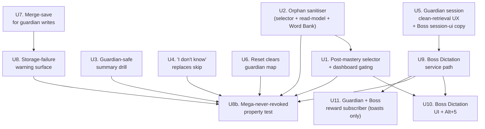

# feat: Post-Mega Spelling P1.5 — Guardian Hardening + Boss Dictation MVP

## Overview

Post-Mega Spelling Guardian MVP shipped 2026-04-25 (eight PRs, 195/195 spelling tests green — see `docs/plans/james/post-mega-spelling/2026-04-25-completion-report.md`). The scheduler path itself honours the **Mega is never revoked** invariant, but a set of legacy-shaped surrounding paths can still silently undermine that promise:

- The **dashboard Begin button** is gated on `guardianDueCount > 0`, so a freshly graduated learner with an empty `guardianMap` sees "All rested" and cannot start their first patrol — even though the selector can lazy-create a round from Mega words.
- The **Guardian summary** still exposes legacy "Drill all" which routes to `mode: 'trouble'`; that path runs through `applyLearningOutcome` and demotes `progress.stage`. A child can complete a Guardian Mission, miss a word in the follow-up drill, and drop below Mega — the scheduler path is safe but the summary is not.
- The **skip button** in Guardian sessions routes through `engine.skipCurrent` → legacy `enqueueLater`, re-queueing the slug within the same round and bypassing `advanceGuardianCard` and the `spelling.guardian.wobbled` event.
- The **cloze hint** renders for Guardian sessions, weakening the clean-retrieval frame.
- The **selector's orphan sanitiser** only runs for lazy-creation (bucket 3); wobbling-due, non-wobbling-due, and top-up buckets all leak orphan slugs after a content hot-swap, and `getSpellingPostMasteryState` counts orphans toward `guardianDueCount` / `wobblingCount` / `nextGuardianDueDay`.
- The **reset-learner path** relies on the canonical persistence adapter zeroing the whole subject-state; hosts wiring a persistence without `resetLearner` leave `ks2-spell-guardian-*` in storage.
- **Storage failures** (QuotaExceededError, private-browsing denial, serialisation edge cases) are silently swallowed by `saveJson`; progress and guardian writes can diverge with no UI surface.
- **Word Bank chip copy** is parent-grade rather than child-grade ("Renewed (7d)" → "Guarded this week") and the `guardianDue`/`wobbling` filters have an invariant gap for legacy-demoted records that Mega-hardening removes.
- **Event idempotency** at the client layer depends on `awaitingAdvance` and dispatch-layer debouncing; rapid double-click on Continue or a refresh mid-finalise can theoretically double-emit `mission-completed`.

This plan lands **P1.5 hardening (U1–U8 + U8b composite test)** on top of the shipped Guardian MVP, ships **Boss Dictation MVP (U9–U10)** as the first additive post-Mega surface, and ships **a minimal Guardian + Boss reward subscriber (U11)** so completing a round produces a visible celebration. Boss is scoped tight: single-attempt 8–12 Mega words, demotion-safe (post-Mega-safe single-attempt grading, **not** legacy `applyTestOutcome`), one new event (`spelling.boss.completed`), one new mode in `SPELLING_MODES`, one new shortcut (Alt+5). U11 is scoped even tighter: toasts only, no monster evolution, no streak badges, no persistent state.

The plan preserves every Guardian MVP invariant verbatim: sibling `data.guardian` map, integer-day arithmetic, lazy-create on first selection, shared `shared/spelling/service.js` across client and Worker, kebab-case events, core-pool-only `allWordsMega` gate.

---

## Problem Frame

The MVP proved the Guardian scheduler is safe. P1.5's problem is different: every path **around** the Guardian scheduler that a real child can hit — dashboard gating, summary drill, session skip, cloze, content hot-swap, reset, storage failure, Word Bank chips, event idempotency — must obey the same Mega-never-revoked contract. Each individual gap is small; together they turn the Guardian feature from "demo-correct" to "actually trustworthy for a child using the app every day."

Boss Dictation extends the post-Mega surface from one mode (Guardian) to two. The P1 completion report flagged Boss + Guardian reward subscriber as the "low-risk pair" for the next increment. We ship Boss in this plan (reward subscriber stays deferred to P2 proper) because Boss is a tight, bounded addition that shares enough infrastructure with Guardian (single-attempt session type, post-Mega dashboard card promotion, Alt-N shortcut convention) that shipping it alongside hardening consolidates the post-Mega surface story into a single coherent release.

The brief (`docs/plans/james/post-mega-spelling/post-mega-spelling-p2.md`) explicitly rejects jumping straight to Pattern Quests and frames the next work as "P1.5 hardening first, then new surfaces." This plan follows that framing literally: U1–U8 + U8b are hardening, U9–U10 are one new surface (Boss Dictation MVP), U11 honours the MVP completion report's "Boss + reward subscriber = low-risk pair" with a minimal toast-only addition, and Pattern Quests / Word Detective / Story Missions stay deferred to later plans.

---

## Requirements Trace

**Hardening (U1–U8 + U8b composite test):**

- R1. **Fresh-graduate first-patrol is enabled.** `getSpellingPostMasteryState` exposes `unguardedMegaCount`, `guardianAvailableCount`, `guardianMissionAvailable`, and `guardianMissionState ∈ { 'locked', 'first-patrol', 'due', 'wobbling', 'optional-patrol', 'rested' }`. Dashboard Begin gates on `guardianMissionAvailable`, not on `guardianDueCount > 0`. (See origin: priority 1; brief lines 17–66)
- R2. **Daily-patrol semantics are honest.** When no word is due but top-up is available, dashboard says "N patrol words available" (optional patrol), not "All rested". When both due and top-up mix, dashboard decomposes into "N urgent checks + M patrol words". `nextGuardianDueDay` remains accurate for the true-rested case. (See origin: priority 5; brief lines 148–182)
- R3. **Guardian summary cannot demote Mega.** `SpellingSummaryScene` hides the legacy "Drill all" / per-word "Drill" buttons when `summary.mode === 'guardian'` and renders instead a "Practice wobbling words" button that dispatches a `mode: 'trouble'` session with `practiceOnly: true`, plus the copy "Official recovery check returns tomorrow. Mega and Guardian schedule will not change." (See origin: priority 2; brief lines 68–101; user decision "Both: practice-only button + 'come back tomorrow' copy")
- R4. **"I don't know" replaces Skip in Guardian.** In Guardian sessions the "Skip for now" button is labelled "I don't know". Click routes to `advanceGuardianOnWrong` + `advanceGuardianCard` (not `engine.skipCurrent` + `engine.advanceCard`), emits `spelling.guardian.wobbled`, and never mutates `progress.stage`. Non-Guardian sessions keep legacy skip semantics byte-for-byte. (See origin: priority 3; brief lines 103–122; user decision "Rename to 'I don't know' = wobble")
- R5. **Guardian retrieval is cleaner.** `showCloze` is false when `session.mode === 'guardian'` regardless of preference. `spellingSessionInfoChips` adds a "Guardian" chip. `spellingSessionContextNote` picks a Guardian-specific string. (See origin: priority 4; brief lines 124–146)
- R6. **Content hot-swap does not leak orphan slugs.** `selectGuardianWords` filters all four priority buckets (wobbling-due, non-wobbling-due, lazy-create, top-up) through `isGuardianEligibleSlug(slug, progressMap, wordBySlug)`. `getSpellingPostMasteryState` applies the same filter before counting `guardianDueCount`, `wobblingCount`, `nextGuardianDueDay`, and `recommendedWords`. Word Bank `wordBankFilterMatchesStatus` filters through the same helper. (See origin: priority 6; brief lines 184–214; completion-report deferred item #2)
- R7. **Reset clears Guardian state with or without a canonical persistence adapter.** `service.resetLearner` explicitly calls `saveGuardianMap(learnerId, {})` as its last step so the `ks2-spell-guardian-*` storage key is zeroed even when `persistence.resetLearner` is not wired. Worker parity via `worker/src/subjects/spelling/engine.js::resetLearner` unchanged (already zeros via `normaliseServerSpellingData({})`). (See origin: priority 7; brief lines 216–235; completion-report deferred item rationale)
- R8. **Storage failures surface as warnings without demoting Mega.** `saveJson` returns a boolean success signal; `saveProgressToStorage` and `saveGuardianMap` propagate it; `submitGuardianAnswer` / `submitAnswer` include a `persistenceWarning` field in `feedback` on a failed local write. UI renders a subtle banner ("Progress could not be saved on this device. Export or free storage."). No `progress.stage` write ever occurs on failure. (See origin: priority 8; brief lines 237–264; completion-report deferred item #5)
- R9. **Guardian-record writes reduce the local race window.** `submitGuardianAnswer` writes via `saveGuardianRecord(learnerId, slug, record)` which does `load → merge single slug → save`, shrinking the client-local last-writer-wins window versus the current whole-map write. Worker CAS + `requestId` mutation receipts continue to protect the server path. (See origin: priority 9; brief lines 242–290; completion-report deferred item #1)
- R10. **Word Bank chip copy is child-friendly and the filter invariant is tight.** Chip labels become "Due for check" / "Wobbling words" / "Guarded this week" / "Not guarded yet". `guardianDue` keeps its `status === 'secure'` guard; `wobbling` gains a `status === 'secure'` guard too (post-hardening this combination is an invariant — no hardened path can leave `wobbling: true` + `stage < 4`). (See origin: priority 10; brief lines 292–303)
- R11. **Mega-never-revoked becomes a composite property assertion.** A top-level assertion proves that across every code path touching `progress.stage` (Guardian submit, practice-only drill from Guardian summary, "I don't know" skip, content-hot-swap cleanup, Boss submit, storage failure, event-idempotency refresh), `stage(after) >= stage(before)` **unless** the action is `reset`. (See flow analysis F12)

**Boss Dictation MVP (U9–U10) + Reward Subscriber (U11):**

- R12. **Boss Dictation is a demotion-safe single-attempt mode.** `SPELLING_MODES` gains `'boss'`. `createSession({ mode: 'boss', length })` selects 8–12 random core-pool Mega words. Session type is single-attempt (no retry, no correction phase, no cloze, no skip). Submit path is a new `submitBossAnswer` that mirrors Guardian's invariants: increments `attempts/correct/wrong` on progress, **never** writes `stage/dueDay/lastDay/lastResult`. Emits `spelling.boss.completed` on round end. (See origin: "P1.5 Hardening + Boss Dictation MVP" scope decision; MVP completion report "Boss Dictation MVP" recommendation)
- R13. **Boss surfaces in UI as an active card.** `POST_MEGA_MODE_CARDS` entry for `boss-dictation` flips `disabled: false`. `SpellingSetupScene` PostMegaSetupContent wires the card's Begin button to dispatch `spelling-shortcut-start` with `mode: 'boss'`. Alt+5 shortcut gated on `allWordsMega`. Summary for `summary.mode === 'boss'` shows "Boss score: N/M Mega words landed" + miss list; no "Drill all" (test-mode convention). No Word Bank filter additions in MVP. (See origin: same as R12)

**Reward subscriber (U11 — preserves MVP "low-risk pair"):**

- R14. **Minimal Guardian + Boss reward subscriber.** `src/subjects/spelling/event-hooks.js` (or a sibling file) adds a subscriber that reacts to `spelling.guardian.mission-completed`, `spelling.guardian.renewed`, `spelling.guardian.recovered`, and `spelling.boss.completed` events by emitting short celebration toasts via the existing reward overlay pipeline. No new monster evolution, no Mega-tier, no persistent badge — MVP-tight. Rationale: the MVP completion report paired Boss with a reward subscriber as the "low-risk pair" precisely because shipping either one alone leaves the child with post-Mega surfaces that feel like homework. U11 honours that pairing with the smallest possible addition. (See MVP completion report line 222; product-lens finding `product-lens-reward-subscriber-still-deferred`)

**Origin actors** (implied, brief has no A-IDs): `Learner` (post-Mega KS2 child, the primary user of every flow); `Parent/Teacher` (reads Word Bank chips and summary counts); `Content Operator` (triggers content hot-swap in R6); `Reward Subscriber` (downstream consumer of `spelling.boss.completed` — no action in MVP).

**Origin flows** (mapped to flow analysis): F1 first patrol (R1); F2 daily patrol (R2); F3 Guardian summary drill (R3); F4 "I don't know" (R4); F5 orphan (R6); F6 reset (R7); F7 storage failure (R8); F8 concurrent tab race (R9); F9 event idempotency (existing Worker CAS + awaitingAdvance covers server path; client UI guard is a small polish covered inside U1's dashboard refactor); F10 Boss round (R12, R13); F11 Word Bank chips (R10); F12 composite invariant (R11).

**Origin acceptance examples** (inline in requirements, no AE-IDs in origin):

- *AE-R1:* Fresh graduate (all core Mega, empty guardianMap) opens Spelling hub. Dashboard says "First Guardian patrol ready — 8 words from your Word Vault." Begin is enabled. Click starts a round with 5–8 lazy-created guardian records.
- *AE-R2a:* Learner with 2 wobbling-due words and 3 within-schedule Mega words. Dashboard says "2 urgent checks + 3 patrol words." Begin starts a 5-word round.
- *AE-R2b:* Learner with 0 due words, top-up allowed. Dashboard says "No urgent duties. Optional patrol available."
- *AE-R2c:* Learner with 0 due and top-up exhausted (all within-schedule, `minimum round length` reached). Dashboard says "All guardians rested. Next check in N days." Begin is disabled.
- *AE-R3:* Learner finishes a Guardian round with one wobbled word. Summary shows "Words that need another go" area with a "Practice wobbling words" button + copy about returning tomorrow. Click starts a practice-only drill. Wrong answer in the drill leaves `progress.stage === 4`, `guardian.wobbling === true`, `nextDueDay = today + 1`, and emits zero guardian events.
- *AE-R4:* Learner clicks "I don't know" on a Guardian word. Service emits `spelling.guardian.wobbled`, word advances via `advanceGuardianCard` (FIFO, no re-queue), round moves on, `progress.stage === 4`.
- *AE-R6:* `guardianMap` contains a slug that no longer exists in `wordBySlug` (content hot-swap removed it). `getSpellingPostMasteryState` counts 0 orphans. `selectGuardianWords` in all four buckets skips the orphan. Word Bank `guardianDue` and `wobbling` filters do not surface the orphan.
- *AE-R7:* Host wires a persistence without `resetLearner`. `service.resetLearner` completes. `loadGuardianMap(learnerId)` returns `{}`.
- *AE-R8:* `storage.setItem` on the guardian key throws `QuotaExceededError`. `submitGuardianAnswer` returns `ok: true` with `feedback.persistenceWarning` set. UI shows the warning banner. `progress.stage === 4`.
- *AE-R11 (property):* For a random sequence of `{ guardian-correct, guardian-wrong, dontknow, practiceonly-correct, practiceonly-wrong, boss-correct, boss-wrong, content-hotswap, storage-quota-failure }` actions starting from `stage === 4`, `progress.stage` remains `>= 4` at every step.
- *AE-R12:* Learner starts Boss with Alt+5. Session has 8–12 core-pool words. Wrong answer on a Mega word leaves `progress.stage === 4`. Round end emits exactly one `spelling.boss.completed` event with `correct + wrong === length`.

---

## Scope Boundaries

- **Not shipping Pattern Quests.** Word-pattern metadata (`patternIds`), pattern registry, and Pattern Mastery badges remain deferred to a future plan.
- **Not shipping Word Detective ("what went wrong?" misspelling analysis).** Deferred to a later plan.
- **Not shipping Story Missions / Use-It / Teach-the-Monster / Seasonal expedition cosmetics.** Deferred.
- **Minimal Guardian + Boss reward subscriber ships (U11).** Short celebration toasts react to `mission-completed`, `renewed`, `recovered`, `boss-completed`. **Not shipping:** monster evolution driven by Guardian/Boss events, a new Mega-tier, persistent streak badges (30-day Guardian streak), per-skill Pattern-Mastery celebration — all stay deferred.
- **Not shipping Extra-pool graduation.** `allWordsMega` stays defined against core-pool only (same as MVP).
- **Not touching `REPO_SCHEMA_VERSION`.** The selector additions are read-side; `guardianMissionState` is a derived field, not a persisted one. `SPELLING_SERVICE_STATE_VERSION` stays at **2** (no persisted-state shape changes; Boss does not need a persisted state bump because `session` and `summary` shapes are unchanged — only `mode` string is new).
- **Not refactoring the shared-storage writer.** Per-slug CAS, cross-tab broadcast via `storage` events, and a `saveGuardianRecord` / `saveProgressRecord` / `saveJsonRecord` universal wrapper are explicitly deferred. U7 delivers a Guardian-specific merge-save (`saveGuardianRecord`) only.
- **Not adding a Word Bank filter for Boss score history.** Boss MVP shows score and miss list on the summary scene only. Chip addition deferred.
- **Not adding a `persistenceWarning` for non-spelling subjects.** U8's warning surface is scoped to Spelling. A cross-subject persistence error pattern is deferred.
- **Not changing Alt+1/2/3/4 behaviour.** Alt+5 is strictly additive. Alt+1 (smart), Alt+2 (trouble), Alt+3 (test), Alt+4 (guardian) unchanged. Alt+5 (boss) gated on `allWordsMega === true`.

### Deferred to Follow-Up Work

- Client concurrent-tab `guardianMap` last-writer-wins **full fix** (storage-layer refactor with per-slug CAS + storage-event listener): named follow-up `post-mega-spelling-storage-cas` plan — completion-report deferred item #1. Bundles four mitigations reviewed out of U7: (a) `navigator.locks.request('ks2-spell-guardian-<learnerId>', { mode: 'exclusive' }, ...)` with full async cascade, (b) monotonic `writeVersion` on `normaliseGuardianRecord` + persisted-state version bump, (c) `BroadcastChannel('ks2-spell-guardian')` invalidation publisher + subscriber, (d) soft second-tab Guardian lock-out banner with dismiss / auto-clear behaviour defined, (e) online-first Worker command routing so Worker CAS is authoritative on every write. U7 in this plan narrows the window via merge-save only.
- Cross-subject `persistenceWarning` surface for progress writes outside spelling: future hardening plan once more subjects grow sibling-map state.
- Durable cross-session persistence-warning surface so a child who closes the tab after a failed write still sees the warning on next open (write a small "last-write-failed" flag into a sibling storage key or prefs): deferred. U8 MVP's warning is session-scoped by design; this gap is documented in U8 Approach.
- Shared constants module for `WORD_BANK_FILTER_IDS` platform-sanitiser Set vs subject-layer `WORD_BANK_FILTER_IDS` Set: completion-report deferred item #6; unchanged by this plan.
- Monster-evolution / streak-badge / Mega-tier reward extensions: `post-mega-spelling-p2` — U11 ships only the minimal toast subscriber; richer reward mechanics layer on top later once telemetry is in hand.
- `currentDay` recomputed twice inside `buildSpellingLearnerReadModel`: completion-report deferred item #7; unchanged by this plan.
- Sticky-bit `allWordsMega` so a learner who reached post-Mega once does not silently lose the dashboard when content rollback removes a word they had at `stage < 4`: deferred. U1's `'locked'` copy must cover both "never-reached" and "rollback-paused" cases without a sticky bit.

---

## Context & Research

### Relevant Code and Patterns

**Core service layer (client + Worker share):**

- `shared/spelling/service.js:86-141` — `advanceGuardianOnCorrect` / `advanceGuardianOnWrong` / `ensureGuardianRecord`. Pure; P1.5 does not modify these.
- `shared/spelling/service.js:193-272` — `selectGuardianWords`. Four priority buckets: wobbling-due (208–210), non-wobbling-due (211–213), lazy-create (232–249), top-up (256–269). U2 extends bucket filtering to buckets 1, 2, and 4 using a new `isGuardianEligibleSlug` helper; U1 extracts per-slug `reason` metadata for the dashboard.
- `shared/spelling/service.js:284-290` — `saveJson`. Swallows throws. U8 rewrites to return a boolean so callers can propagate a warning.
- `shared/spelling/service.js:740-766` — `getPostMasteryState`. U1 extends the return shape.
- `shared/spelling/service.js:1189-1257` — `submitGuardianAnswer`. Correct-path / wrong-path already honour the Mega invariant. U3 / U4 / U7 / U8 extend around this function without changing its core logic.
- `shared/spelling/service.js:1479-1536` — `skipWord`. U3 adds a Guardian branch that invokes `advanceGuardianOnWrong` + `advanceGuardianCard` + emits `spelling.guardian.wobbled`.
- `shared/spelling/service.js:1550-1559` — `resetLearner`. U6 appends `saveGuardianMap(learnerId, {})` as the last step.

**Legacy engine (must not be touched):**

- `shared/spelling/legacy-engine.js:620-649` — `applyLearningOutcome`. Wrong path decrements `stage`. P1.5 prevents this from ever touching a Mega word by routing Guardian summary drills through `practiceOnly: true` (which short-circuits at `legacy-engine.js:763`).
- `shared/spelling/legacy-engine.js:651-674` — `applyTestOutcome`. Demotes on wrong. **Boss Dictation does NOT route through `submitTest`** (see U9 Approach).
- `shared/spelling/legacy-engine.js:836-845` — `skipCurrent`. Uses `enqueueLater(session, slug, 5)`. U3's Guardian branch bypasses this path entirely.

**Read model:**

- `src/subjects/spelling/read-model.js:108-180` — `getSpellingPostMasteryState`. U1 extends shape; U2 feeds through orphan sanitiser.

**Contracts / normalisers:**

- `src/subjects/spelling/service-contract.js` — `SPELLING_MODES`. U9 adds `'boss'`. `SPELLING_SERVICE_STATE_VERSION` unchanged at 2. `GUARDIAN_INTERVALS` and `GUARDIAN_SECURE_STAGE` unchanged (U2 imports `GUARDIAN_SECURE_STAGE` from here instead of the duplicate at `service.js:50`).

**Events:**

- `src/subjects/spelling/events.js:33-35` — `eventId(type, parts)` helper. U9 adds `createSpellingBossCompletedEvent` mirroring the shape of `createSpellingGuardianMissionCompletedEvent` at events.js:214.
- `src/subjects/spelling/events.js:117-222` — four existing Guardian event factories. U3 reuses `createSpellingGuardianWobbledEvent` for "I don't know".

**UI scenes (React):**

- `src/subjects/spelling/components/SpellingSetupScene.jsx:278-380` — top-level scene. U1 rewrites `PostMegaSetupContent` to consume new selector fields.
- `src/subjects/spelling/components/SpellingSetupScene.jsx:482-572` — `PostMegaSetupContent`. U1 target; U10 wires Boss Begin button.
- `src/subjects/spelling/components/SpellingSummaryScene.jsx:101-134` — mistakes area + "Drill all" button. U3 target.
- `src/subjects/spelling/components/SpellingSessionScene.jsx:60, 189-199` — `showCloze` and skip button rendering. U4 and U5 targets.
- `src/subjects/spelling/session-ui.js:5-52` — helpers for session-info chips, submit label, context note. U5 extends.

**Module handler routing:**

- `src/subjects/spelling/module.js:279-300` — `spelling-drill-all` + `spelling-drill-single` handlers. U3 adds a branch that routes Guardian-origin drills through `practiceOnly: true`. (Or adds a new action id; see U3 Approach for the chosen path.)
- `src/subjects/spelling/module.js` Alt+4 gate. U10 adds Alt+5 gated on `allWordsMega`.

**Word Bank view model:**

- `src/subjects/spelling/components/spelling-view-model.js:77-345` — `WORD_BANK_FILTER_IDS`, `wordBankFilterMatchesStatus`, chip label map. U2 touches filter-matcher for orphan sanitiser; U5 touches chip label strings (R10).

**Persistence:**

- `src/subjects/spelling/repository.js:211-214` — client `resetLearner`. Already zeros guardian via `{}` subject-state. No change needed.
- `worker/src/subjects/spelling/engine.js:198-202` — Worker `resetLearner`. Already zeros guardian. No change needed.
- `src/subjects/spelling/repository.js:6-7`, `worker/src/subjects/spelling/engine.js:16-18` — `ks2-spell-guardian-` / `ks2-spell-progress-` prefix constants. No change needed; U6's `saveGuardianMap(learnerId, {})` uses the existing `GUARDIAN_PROGRESS_KEY_PREFIX` constant at `service.js:48`.

**Tests (to follow):**

- `tests/spelling-guardian.test.js` — primary Guardian suite (1100+ lines); every new invariant adds tests here.
- `tests/spelling-view-model.test.js` — Word Bank filter and `POST_MEGA_MODE_CARDS` coverage; U2 and U5 extend.
- `tests/spelling-parity.test.js` — legacy-vs-rebuild parity. U3, U4, U5 must not regress any existing assertion; U4 adds Alt+1/2/3 vs Alt+4/5 gating coverage.
- `tests/spelling.test.js` — canonical service-test harness with `continueUntilSummary`, `makeSeededRandom`, `makeSequenceRandom`, `installMemoryStorage`. U9 and U10 reuse these.
- `tests/server-spelling-engine-parity.test.js` — Worker engine parity. Boss mode must pass parity (same selector deterministic under `makeSeededRandom(42)`).

### Institutional Learnings

- `docs/mutation-policy.md` — Worker-path CAS + `requestId` mutation receipts already prevent duplicate `guardian.mission-completed` emission on the server path. U8's `persistenceWarning` work is strictly client-local; replayed Worker commands hit receipt dedup before reaching the service layer. **How this constrains the plan:** client-side event idempotency polish (F9) stays out of U1–U10; it is already a non-issue for the authoritative path. The plan's "rapid double-click" concern is handled by `awaitingAdvance` at the service layer and a pending-flag at the UI dispatch layer. No new event-id scheme needed.
- `docs/state-integrity.md` — "Prefer replacing malformed state with a smaller valid shape over trying to preserve every broken field." U2's `isGuardianEligibleSlug` sanitiser directly applies this rule: an orphan slug is malformed for the current content snapshot; the selector replaces `{orphan: record}` with `{}` at read-time without deleting the underlying storage. Persisted cleanup (optional sweep-on-load) is not required by this rule.
- `docs/events.md` — "Subject decides, reward reacts." U9's `spelling.boss.completed` event follows the same shape as the four Guardian events: emitted by the spelling service, consumed by nobody in MVP, available to a future reward subscriber. The event-log runtime is authoritative for dedup; per-event receipt IDs are not added.
- `docs/spelling-service.md` — "SATs test mode is single-attempt per word." Boss Dictation inherits this invariant. The doc's "test-mode results are de-duplicated by slug during restore" rule constrains U9: Boss must use the same `session.results` shape as test mode, so restore dedup works for free. Boss does **not** inherit `applyTestOutcome`'s stage demotion.
- `docs/spelling-parity.md` — Alt+1/2/3 shortcut loop scoped to active Spelling surface. U4 adds Guardian skip handling but must not interfere with Alt+1/2/3 resolution. U10 Alt+5 is additive, must not interfere. `tests/spelling-parity.test.js` gains two small cases: Alt+5 routes when `allWordsMega === true`; Alt+5 no-ops when `allWordsMega === false`.
- `docs/plans/james/post-mega-spelling/2026-04-25-completion-report.md` (Observation 6) — "For units that touch a persistence boundary, the plan's 'Files' section should enumerate the storage-contract changes explicitly." Applied throughout this plan: U7's merge-save explicitly names `shared/spelling/service.js::saveGuardianMap` (rewrite) and `saveGuardianRecord` (new export); U8's warning surface names `feedback.persistenceWarning` field on the session transition.
- `docs/plans/james/post-mega-spelling/2026-04-25-completion-report.md` (Observation 2) — "Adversarial reviewers pay disproportionately well on any state-machine logic." Every unit in U1–U10 touches state-machine or selector logic. The plan's execution posture (per-unit PR with parallel `ce-adversarial-reviewer` + `ce-correctness-reviewer` + `ce-testing-reviewer`) is non-negotiable.
- `docs/plans/james/post-mega-spelling/2026-04-25-completion-report.md` (Observation 7) — "Bump the version in a PR where the breakage is visible and obviously scoped." This plan does **not** bump `SPELLING_SERVICE_STATE_VERSION`. If implementation reveals a persisted-state shape change is needed (e.g., `guardian[slug].persistenceWarningSeen` flag), that bump goes in its own PR.

### External References

No external research needed. All decisions flow from the brief, the shipped MVP plan, the MVP completion report, and the existing documentation set. The product decisions (practice-only drill, "I don't know" wobble, daily-patrol gating, Boss Dictation MVP) are user-confirmed. The technical constraints (Mega-never-revoked invariant, sibling-map architecture, core-pool `allWordsMega`) are fixed by the MVP and documented.

---

## Key Technical Decisions

- **Hardening ships before Boss.** U1–U8 land first; U9–U10 build on top. Rationale: the hardening makes the post-Mega surface trustworthy before we add a second surface to it. If Boss shipped first and a child hit the Guardian summary demotion bug via a Boss round that happened to surface a Mega mistake, the fix would need a follow-up. Landing U3's drill fix first prevents that class of escape.
- **Guardian-safe summary drill routes via `practiceOnly: true` on a `mode: 'trouble'` session, not a new dedicated mode.** Rationale: `practiceOnly` is the existing legacy-safe flag (`legacy-engine.js:763` checks it before `applyOutcome`, `legacy-engine.js:813` checks it for test mode). A new `practice` mode would duplicate the entire session/summary/Word Bank scaffolding. Using the existing `practiceOnly: true + mode: 'trouble'` also keeps the summary rendering unchanged (single-mode summary code path). The only new wiring is that `spelling-drill-all` reads `summary.mode === 'guardian'` and conditionally sets `practiceOnly: true`.
- **Practice-button identity trade-off (accepted with eyes open).** The hybrid "practice-only button + 'come back tomorrow' copy" protects Mega technically but softens Guardian's "one clean attempt" identity — a child who misses a word in Guardian now sees an immediate practice path rather than being held to the spaced-return contract. Product-lens review surfaced this as a dilution of the MVP architectural decision #5 ("single-attempt Guardian grading matches the origin spec 'one clean attempt'"). User-confirmed this trade-off: children-want-to-fix-it-now is a real need, and the separation is held by the copy rather than the UI structure. The copy must therefore do work: "Optional practice. Mega and Guardian schedule will not change. Official recovery check returns tomorrow." Every deviation from this copy weakens the identity separation. If telemetry later shows children over-relying on practice drills, the "hide drill entirely" alternative from the origin brief (lines 88–93) is the follow-up move.
- **"I don't know" adds a Guardian branch to `service.skipWord`, not a new top-level service method.** Rationale: the UI already dispatches `spelling-skip`; reusing the same dispatch keeps the React surface minimal (one button, two labels via `session.mode`-aware label). The branch is ~20 lines inside `skipWord`: if `session.mode === 'guardian'`, compute next record via `advanceGuardianOnWrong`, call `advanceGuardianCard`, emit `spelling.guardian.wobbled` with `spellingPool + wordFields` enrichment, return the transition. Non-Guardian branch untouched.
- **Orphan sanitiser lives in `shared/spelling/service.js`, not in the repository layer.** Rationale: `docs/state-integrity.md` places subject-level `data` contract inside the subject service. `isGuardianEligibleSlug(slug, progressMap, wordBySlug)` is a pure helper exported from `service.js`; it is imported by `read-model.js` (`getSpellingPostMasteryState`) and by `spelling-view-model.js::wordBankFilterMatchesStatus`. This keeps a single source of truth for "is this slug a valid Guardian candidate?" across selector, read-model, and Word Bank.
- **`GUARDIAN_SECURE_STAGE` is re-exported from `service-contract.js`.** Rationale: it currently lives twice (`shared/spelling/service.js:50` and `src/subjects/spelling/read-model.js:7` as `SECURE_STAGE`). The sanitiser needs it in three places (service, read-model, view-model). Consolidating the constant export avoids drift.
- **Merge-save (`saveGuardianRecord`) only reduces the window, does not close the race — and stays synchronous.** Rationale: the completion-report deferred item #1 is explicit that full cross-tab CAS is a storage-layer refactor deferred to a later plan. U7 writes a merge-then-save: `load → mutate one slug → save full map`. The race window shrinks from "whole-submit duration" to "load-to-save microseconds within a single call" — imperfect but useful. Adversarial review surfaced that adding `navigator.locks` here (the obvious next step) would cascade `async`/`await` up through every dispatch handler since `navigator.locks.request` is Promise-only. That refactor lives in the dedicated storage-layer plan; this unit keeps the existing sync contract.
- **Storage failures surface as `feedback.persistenceWarning`, not as an exception or failed return.** Rationale: the session UI already reads `feedback` to render retry / correction prompts. Adding a `persistenceWarning` field keeps the UI-data flow unchanged (no new error state, no new dispatch shape). The banner is a subtle one-line message near the session progress; it does not block the round. This honours the brief's "do not crash the UI on storage failure" and the MVP's "self-heal on next correct answer".
- **Boss Dictation session type is `'test'` (borrowed from SATs) but submit path is new (`submitBossAnswer`).** Rationale: `session.type === 'test'` gives us single-attempt, no-retry, no-skip, no-cloze for free at the UI layer (`SpellingSessionScene.jsx:60` checks `type !== 'test'` for cloze; line 189 checks for skip). BUT legacy `submitTest` calls `applyTestOutcome` which demotes `stage`. Boss needs a fresh submit function that honours the Mega-never-revoked invariant — analogous to `submitGuardianAnswer` for Guardian. Alternative (rejected): add a new `session.type === 'boss'`. Cost: every session-UI helper (`SpellingSessionScene.jsx`, `session-ui.js`) and every session-parity test grows a new branch. Not worth it for a MVP surface that behaves visually identical to SATs Test minus demotion.
- **Boss Dictation sets `practiceOnly: false` but still does not demote.** Rationale: Boss is a *real* round (not practice rehearsal), so `practiceOnly` is semantically wrong. The demotion-safety lives in `submitBossAnswer` directly: increment `attempts/correct/wrong` on progress, leave `stage/dueDay/lastDay/lastResult` alone. This mirrors exactly what `submitGuardianAnswer` already does.
- **Alt+5 for Boss.** Rationale: matches the existing Alt+N convention (Alt+1/2/3/4 already taken for smart/trouble/test/guardian). Gated on `allWordsMega === true` at the module handler level, same gate as Alt+4. No conflict with platform-level shortcuts (Alt+S = session pause, Alt+K = shortcut help are in the reserved list; Alt+5 is not used).
- **Composite invariant is a property test, not a per-unit assertion.** Rationale: each unit adds its own focused tests (e.g., U3 asserts drill-all summary branch demotes-or-not under specific inputs). U8b (a small final unit) adds a single randomised `fast-check`-style sequence test over the set of actions: `{ guardian-correct, guardian-wrong, dontknow, practiceonly-correct, practiceonly-wrong, boss-correct, boss-wrong, content-hotswap, quota-failure }` → `stage >= 4` holds. Single top-level assertion catches regressions that per-unit tests miss.

---

## Open Questions

### Resolved During Planning

- **Is Boss Dictation in this plan or a separate plan?** Resolved: in this plan (U9–U10) per user choice "P1.5 Hardening + Boss Dictation MVP".
- **Practice-only drill from Guardian summary or hide drill entirely?** Resolved: hybrid — show practice-only button + "Official recovery check returns tomorrow" copy.
- **"Skip for now" in Guardian: rename + wobble, hide, or keep legacy?** Resolved: rename to "I don't know" and treat as wobble via `advanceGuardianOnWrong`.
- **Daily-patrol vs due-only Guardian gating?** Resolved: daily patrol with honest copy ("N urgent + M patrol"), not "All rested" when optional top-up is available.
- **Does Boss need its own session type or reuse `type: 'test'`?** Resolved: reuse `type: 'test'` to inherit no-cloze/no-skip UI behaviour, with a new `submitBossAnswer` that does not demote. (See Key Technical Decisions.)
- **Does Boss use `practiceOnly: true` for demotion safety?** Resolved: no. Boss is a real round; demotion-safety lives in the new submit path (mirrors Guardian).
- **Word Bank Boss score history chip?** Resolved: deferred. MVP does not add a new Word Bank filter for Boss.
- **Should U7 solve the concurrent-tab race fully?** Resolved: no — U7 narrows the local-write window via merge-save and stays synchronous. Full per-slug CAS, `navigator.locks` wrap, `BroadcastChannel` invalidation, `writeVersion` stale detection, and second-tab lock-out banner are bundled into a named follow-up storage-layer plan (`post-mega-spelling-storage-cas`). Adversarial review confirmed that folding `navigator.locks` into U7 would cascade `await` through every dispatch handler because the API is Promise-only.
- **Is `SPELLING_SERVICE_STATE_VERSION` bumped?** Resolved: no. Boss adds a new `mode` string, not a persisted shape. The selector adds derived fields, not persisted ones. If implementation uncovers a shape change requirement, it ships in its own PR.

### Deferred to Implementation

- **Exact copy strings for the three rested / first-patrol / optional-patrol states.** Decided during U1 implementation after `/frontend-design` review; the plan fixes the branching logic, not the final child-voice text.
- **Exact Boss round length distribution.** Plan says 8–12 core-pool words; implementation picks either a fixed 10 or a preference-scalar. Decided during U9 with a `makeSeededRandom` smoke covering 8–10–12.
- **The `persistenceWarning` banner's CSS surface.** U8 Approach names the React prop; placement / motion / ARIA announcement are decided during implementation with `/frontend-design`.
- **Whether the orphan sweep is read-only (U2) or also writes the cleaned map back to storage.** Leaning read-only (no write needed; orphan records are harmless once filtered). Confirmed during U2 implementation.

---

## High-Level Technical Design

> *This illustrates the intended data-flow and state transitions and is directional guidance for review, not implementation specification. The implementing agent should treat it as context, not code to reproduce.*

**Dashboard state machine (U1) — derived from `getSpellingPostMasteryState`:**

```
                      ┌─ guardianMissionState ─┐
                      │                         │
  allWordsMega?──no──►│       'locked'          │──► Legacy setup (Smart/Trouble/Test)
                      │                         │
           yes        │                         │
            ▼         │                         │
  guardianMap empty?──►│      'first-patrol'    │──► Begin enabled, copy: "First Guardian patrol ready"
            │         │                         │
            no        │                         │
            ▼         │                         │
  wobbling-due > 0?───►│      'wobbling'        │──► Begin enabled, copy: "N wobbling + M due"
            │         │                         │
            no        │                         │
            ▼         │                         │
  due > 0?────────────►│      'due'             │──► Begin enabled, copy: "N urgent checks + M patrol"
            │         │                         │
            no        │                         │
            ▼         │                         │
  topup avail?────────►│      'optional-patrol' │──► Begin enabled, copy: "No urgent duties. Optional patrol available"
            │         │                         │
            no        │                         │
            ▼         │                         │
  everything stable──►│      'rested'           │──► Begin disabled, copy: "All guardians rested. Next check in N days"
                      └─────────────────────────┘
```

**Mega-never-revoked composite invariant (U8b property test):**

```
forAll( sequence : Array<Action>, seed : ProgressAtMega ) {
  let state = seed                     // { stage: 4, dueDay, lastDay, lastResult, attempts, correct, wrong }

  for (action in sequence) {
    state = apply(action, state)       // action ∈ {
                                       //   'guardian-correct', 'guardian-wrong', 'guardian-dontknow',
                                       //   'practiceonly-correct', 'practiceonly-wrong',
                                       //   'boss-correct', 'boss-wrong',
                                       //   'content-hotswap', 'storage-quota-failure'
                                       // }
    assert state.stage >= 4            // the invariant
    assert state.dueDay === seed.dueDay            // Guardian/Boss paths don't touch dueDay
    assert state.lastDay === seed.lastDay
    assert state.lastResult === seed.lastResult
  }
}
// Note: 'reset' is NOT in the action set. Reset is the sanctioned escape hatch.
```

---

## Implementation Units



U1 and U2 are the hardening foundation: U2's sanitiser flows into U1's selector. U3 / U4 / U6 are independent. U5 now covers both Guardian session-info chip/cloze-gating AND Boss-specific `session-ui.js` helper branches (so the session-ui file is edited once, not twice). U7 + U8 are a persistence-warning pair. U8b is the composite-invariant test gate that sits downstream of every state-mutation unit. U9 (Boss service) + U10 (Boss UI) land after U5 (because Boss copy lives in the same session-ui helpers). U11 (reward subscriber) is additive on top of existing event factories and depends on U9 for the Boss-completed event.

**Execution order and scope-cut policy.** Default order: U2 → U1 → (parallel: U3, U4, U5, U6) → U7 → U8 → U9 → U10 → U11 → U8b. Per-unit PRs for U1–U8 (brief priorities 1–10 are independent); U9 + U10 as one Boss Dictation branch (single surface with U9→U10 dependency); U11 as its own small additive PR; U8b as its own test-only PR last.

**Cut-line commitment (product-lens finding `product-lens-boss-last-creates-cut-risk`):** the plan scope is deliberate — Boss is in, not deferred. If mid-sprint pressure forces a scope cut, the documented cut-order is **U11 first, then U10, then U9**. Cutting any of U1–U8 is explicitly not an option (hardening is load-bearing). Cutting U8b is not an option (composite invariant is the durable artefact). This means in the worst case the sprint lands "hardening only + Boss partial" — not "hardening only silently". Any cut decision is surfaced explicitly with rationale, not absorbed into the scrum-master path.

---

- U1. **Post-mastery selector + dashboard gating**

**Goal:** Give the dashboard a single scalar (`guardianMissionAvailable`) and a labelled state (`guardianMissionState`) to gate Begin and choose copy, derived from a complete selector return shape.

**Requirements:** R1, R2

**Dependencies:** U2 (selector consumes `isGuardianEligibleSlug` for orphan-aware counts)

**Files:**
- Modify: `src/subjects/spelling/read-model.js` (extend `getSpellingPostMasteryState` return shape with `unguardedMegaCount`, `guardianAvailableCount`, `guardianMissionAvailable`, `guardianMissionState`, `wobblingDueCount`, `nonWobblingDueCount`)
- Modify: `shared/spelling/service.js` (mirror new fields in `getPostMasteryState` at lines 740–766; add per-slug `reason` metadata in `selectGuardianWords` return if a UI label is needed)
- Modify: `src/subjects/spelling/client-read-models.js` (remote-sync fallback `getPostMasteryState` stub at lines 114–133 must expose the same new fields with safe defaults; otherwise the remote-sync dashboard reads `undefined` for the gating scalars and Begin stays permanently disabled until the first command round-trip)
- Modify: `src/subjects/spelling/components/SpellingSetupScene.jsx` (`PostMegaSetupContent` at 482–572: `beginDisabled` reads `!guardianMissionAvailable` instead of `!guardianActive`; `guardianDescription` branches on `guardianMissionState`; stat ribbon honours new decomposed counts)
- Test: `tests/spelling-view-model.test.js` (new cases for every `guardianMissionState` value)
- Test: `tests/spelling-guardian.test.js` (selector return-shape assertions, first-patrol count logic)
- Test: `tests/spelling.test.js` (service `getPostMasteryState` mirror)

**Approach:**
- Add `GUARDIAN_MISSION_STATES = Object.freeze(['locked', 'first-patrol', 'due', 'wobbling', 'optional-patrol', 'rested'])` to `service-contract.js`.
- Compute `guardianMissionState` in a pure helper `computeGuardianMissionState({ allWordsMega, eligibleGuardianEntries, unguardedMegaCount, todayDay, policy: { allowOptionalPatrol: true } })`. Export from `shared/spelling/service.js`.
- `guardianMissionAvailable = guardianMissionState !== 'locked' && guardianMissionState !== 'rested'`.
- `unguardedMegaCount = coreMegaSlugs.filter(slug => !guardianMap[slug]).length`.
- `guardianAvailableCount = unguardedMegaCount + eligibleGuardianCount`.
- Dashboard copy branches on `guardianMissionState`. Stat ribbon stays but grows two decomposed counts (`wobblingDueCount` + `nonWobblingDueCount`) for the "N urgent + M patrol" string.

**Execution note:** Test-first on the selector contract. Write the `guardianMissionState` truth table in `tests/spelling-guardian.test.js` before changing any source.

**Technical design:** *(directional, not prescriptive)*

```
computeGuardianMissionState(ctx) =
  if !ctx.allWordsMega                    → 'locked'
  if ctx.eligibleGuardianEntries.length === 0 && ctx.unguardedMegaCount > 0  → 'first-patrol'
  if any(eligibleEntries, e => e.wobbling && e.nextDueDay <= ctx.todayDay)   → 'wobbling'
  if any(eligibleEntries, e => e.nextDueDay <= ctx.todayDay)                  → 'due'
  if ctx.policy.allowOptionalPatrol && canProduceTopUpRound(ctx)             → 'optional-patrol'
  else                                                                        → 'rested'
```

**Patterns to follow:**
- `getSpellingPostMasteryState` (`read-model.js:108-180`) — current selector shape.
- `SpellingSetupScene.jsx:482-572` — React branching pattern for `PostMegaSetupContent`.
- `POST_MEGA_MODE_CARDS` (`spelling-view-model.js:36-69`) — frozen-array pattern for new `GUARDIAN_MISSION_STATES`.

**Test scenarios:**
- *Happy path* — Fresh graduate (all core Mega, empty guardianMap): `guardianMissionState === 'first-patrol'`, `guardianMissionAvailable === true`, `beginDisabled === false`, copy includes "First Guardian patrol ready".
- *Happy path* — 2 wobbling-due + 3 within-schedule: `guardianMissionState === 'wobbling'`, decomposed counts correct, copy "2 urgent checks + 3 patrol words".
- *Happy path* — No due, top-up available (3 Mega never guarded): `guardianMissionState === 'optional-patrol'`, copy "No urgent duties. Optional patrol available".
- *Happy path* — All guardians rested (all within-schedule, no unguarded Mega): `guardianMissionState === 'rested'`, `beginDisabled === true`, copy includes relative-day next-check.
- *Edge case* — Mega progress for 168/170 core words with 2 unknown slugs in progress: `allWordsMega === false`, `guardianMissionState === 'locked'`, dashboard renders legacy setup.
- *Edge case* — Exactly `GUARDIAN_MIN_ROUND_LENGTH (5)` unguarded Mega words and zero due: `guardianMissionState === 'first-patrol'` (matches AE-R1); if fewer than 5 unguarded and zero due, `guardianMissionState === 'optional-patrol'` only when `allowOptionalPatrol === true`, else `'rested'`.
- *Edge case (content rollback)* — Content release removes one core word that the learner had `stage === 3`: `publishedCoreCount` drops from 170 to 169, `secureCoreCount` stays at 169 → `allWordsMega` flips **false** → dashboard renders legacy setup. **Accepted MVP behaviour** — Mega-never-revoked invariant protects per-word stage (U8b asserts this), but the aggregate `allWordsMega` is computed each read and is allowed to flip when published content shrinks. Dashboard copy for the `'locked'` state must be generic enough to cover both "never-reached Mega" and "content rollback paused post-Mega" without confusing the learner. A sticky-bit `allWordsMega` that latches once achieved is deferred to a future plan.
- *Integration* — Selector output matches service-side mirror on the **shared subset** of fields (`allWordsMega`, `guardianDueCount`, `wobblingCount`, `nextGuardianDueDay`, and all new U1 fields) across `getSpellingPostMasteryState` (read-model) and `getPostMasteryState` (service). The service keeps its extras (`todayDay`, `guardianMap`); the read-model keeps its extras (`recommendedWords`). New U1 fields land in both shapes.
- Covers AE-R1, AE-R2a, AE-R2b, AE-R2c.

**Verification:**
- `getSpellingPostMasteryState` returns all new fields for every listed `guardianMissionState` value.
- Dashboard `PostMegaSetupContent` renders the four `guardianMissionState` copies without regression on the legacy fall-through.
- `buildSpellingLearnerReadModel` `postMastery` field exposes the new scalars for downstream consumers.

---

- U2. **Orphan sanitiser for selector, read-model, and Word Bank**

**Goal:** Eliminate content-hot-swap orphan leakage across all four `selectGuardianWords` buckets, the post-Mastery selector counts, and Word Bank filters.

**Requirements:** R6

**Dependencies:** None (feeds U1)

**Files:**
- Modify: `shared/spelling/service.js` (export `isGuardianEligibleSlug(slug, progressMap, wordBySlug)`; apply in `selectGuardianWords` buckets 1, 2, 4; apply in `getPostMasteryState` counts)
- Modify: `src/subjects/spelling/service-contract.js` (re-export `GUARDIAN_SECURE_STAGE = 4` so service, read-model, and view-model share the constant)
- Modify: `src/subjects/spelling/read-model.js` (`getSpellingPostMasteryState` filters `guardianMap` entries through `isGuardianEligibleSlug` before counting `guardianDueCount`, `wobblingCount`, `nextGuardianDueDay`)
- Modify: `src/subjects/spelling/components/spelling-view-model.js` (`wordBankFilterMatchesStatus` consumes `isGuardianEligibleSlug` for `guardianDue` and `wobbling`)
- Test: `tests/spelling-guardian.test.js` (orphan injection at every bucket + every count)
- Test: `tests/spelling-view-model.test.js` (orphan row does not match Word Bank chips)

**Approach:**
- `isGuardianEligibleSlug(slug, progressMap, wordBySlug) = Boolean(wordBySlug?.[slug]) && (Number(progressMap?.[slug]?.stage) >= GUARDIAN_SECURE_STAGE) && (wordBySlug[slug].spellingPool !== 'extra')`.
- Read-side only — does not delete the persisted record. Orphan records stay in storage (harmless after filter), so no write is needed.
- Consolidate `SECURE_STAGE` / `GUARDIAN_SECURE_STAGE` duplicates: re-export the single constant from `service-contract.js`, update `read-model.js:7` and `shared/spelling/service.js:50` imports.

**Execution note:** Write orphan-injection tests first for every bucket and every count. Landing `isGuardianEligibleSlug` second.

**Patterns to follow:**
- Existing bucket-3 guard at `shared/spelling/service.js:236` (`if (!wordBySlug || !wordBySlug[slug]) continue`) — the new helper generalises this check.
- `normaliseGuardianMap` (`service-contract.js`) — invoked at state-read; preserves records even if orphaned (no write-side change).
- `wordBankFilterMatchesStatus` existing `status === 'secure'` guard (`spelling-view-model.js:319`) — the `isGuardianEligibleSlug` check layers on top.

**Test scenarios:**
- *Happy path* — `guardianMap` has 10 known + 2 orphan entries, all due: selector picks 8 known, zero orphan, across buckets 1+2+4.
- *Happy path* — `getSpellingPostMasteryState` with same mixed map: `guardianDueCount: 10`, `wobblingCount` reflects only known wobbling, `nextGuardianDueDay` ignores orphan due dates.
- *Edge case* — Orphan slug has `wobbling: true` and `nextDueDay <= today`: selector bucket 1 skips it; Word Bank `wobbling` filter does not match.
- *Edge case* — Content bundle release demotes a word from core to extra (`spellingPool === 'extra'`): `isGuardianEligibleSlug` returns false; counts and selector drop the slug.
- *Edge case* — `progress[slug].stage === 3` (legacy demoted): `isGuardianEligibleSlug` returns false (matches R10 invariant strengthening).
- *Integration* — Consolidated `GUARDIAN_SECURE_STAGE` constant: tests in service, read-model, and view-model all reference the same export; changing the constant in the contract propagates.
- Covers AE-R6.

**Verification:**
- Every `selectGuardianWords` bucket rejects orphans in dedicated tests (4 separate assertions).
- `getSpellingPostMasteryState` counts match the known-eligible subset under orphan injection.
- Word Bank `wobbling` and `guardianDue` filters surface zero orphan rows.

---

- U3. **Guardian-safe summary drill**

**Goal:** Close the Mega-demotion loophole: Guardian summary shows "Practice wobbling words" (practice-only, no schedule change) instead of legacy "Drill all".

**Requirements:** R3, R11 (contributes to composite invariant)

**Dependencies:** None

**Files:**
- Modify: `src/subjects/spelling/components/SpellingSummaryScene.jsx:101-134` (mistakes area: branch on `summary.mode === 'guardian'` to render "Practice wobbling words" + scheduling copy; hide "Drill all" and per-word "Drill" buttons for Guardian summaries)
- Modify: `src/subjects/spelling/module.js:279-300` (`spelling-drill-all` + `spelling-drill-single` handlers: when origin summary was `mode: 'guardian'`, force `practiceOnly: true` in the dispatched `service.startSession` call; non-Guardian origin summary unchanged)
- Modify: `src/subjects/spelling/components/spelling-view-model.js` (summary helper exposes `guardianPracticeActionLabel` / `guardianSummaryCopy` so the scene reads strings from a single place)
- Test: `tests/spelling-guardian.test.js` (practice-only drill from Guardian summary: wrong answer on wobbling word leaves `progress.stage` and `guardian.wobbling` / `nextDueDay` unchanged)
- Test: `tests/spelling-view-model.test.js` (Guardian summary renders practice-only button + copy; "Drill all" absent)
- Test: `tests/spelling-parity.test.js` (legacy Smart Review summary drill path unchanged byte-for-byte)

**Approach:**
- Summary scene reads `summary.mode` (already populated by `finaliseSession`). For `'guardian'`, swap the action-button cluster.
- Module handler receives `{ action: 'spelling-drill-all', payload: { originMode } }` or similar — the dispatch origin is already known at `SpellingSummaryScene.jsx` from the summary object; pass `originMode` through the action payload.
- **Source of truth for `originMode` is `ui.summary.mode`, not the payload.** The payload field is defensive-only. The module handler reads `ui.summary?.mode` in its own closure so that if a future refactor persists summary state across refresh, the `practiceOnly` gating still works. A comment at the handler site flags: "summary-phase persistence across refresh is out of scope today; refactors that change this must re-validate the practiceOnly path." Adversarial review surfaced this as a dormant footgun — the current cold-start lands on dashboard (no summary), so the payload path works, but a reader hoisting summary across refresh could accidentally revert Guardian summaries to legacy demote-on-wrong.
- Handler: `service.startSession(learnerId, { mode: 'trouble', words: mistakes, yearFilter: 'all', length: mistakes.length, practiceOnly: originMode === 'guardian' })`.
- Scene copy: "Practice wobbling words" as button label; "Optional practice. Mega and Guardian schedule will not change. Official recovery check returns tomorrow." as help text.

**Execution note:** Characterisation-first on the legacy non-Guardian summary path — add a baseline test that asserts today's `mode: 'trouble'` routing with `practiceOnly: undefined` survives the change, before adding the Guardian branch.

**Patterns to follow:**
- `legacy-engine.js:763` `practiceOnly` short-circuit in `submitLearning` — the existing safety path; no change needed there.
- `SpellingSummaryScene` existing "Guardian-specific cards" branching (summary.mode === 'guardian' already shows Guardian-specific cards at the top of the scene). The drill-action branching mirrors that pattern.
- `spelling-view-model.js` summary-card helpers — single-place string origin.

**Test scenarios:**
- *Happy path* — Guardian summary with 2 mistakes: Practice button renders, "Drill all" / per-word "Drill" absent.
- *Happy path* — Click Practice button: service starts `mode: 'trouble', practiceOnly: true` session with the 2 mistakes.
- *Error path* — Wrong answer in the practice-only session: `progress.stage` unchanged; `guardian[slug].wobbling` unchanged; `guardian[slug].nextDueDay` unchanged; zero guardian events emitted.
- *Edge case* — Practice-only session finalises: summary renders without guardian-specific cards (because practice-only mode is 'trouble', not 'guardian'); no `mission-completed` event.
- *Integration* — Legacy Smart Review summary (summary.mode === 'smart') renders legacy "Drill all" exactly as before; `practiceOnly` is `undefined` in the dispatched `startSession` call.
- *Integration* — `SpellingSummaryScene` for `summary.mode === 'test'` unchanged (test mode already hides drill-all).
- Covers AE-R3.

**Verification:**
- After a wrong answer on a Mega wobbling word via Practice button, full progress + guardian snapshot is byte-identical to the pre-click snapshot except for `attempts/correct/wrong` on progress.
- `tests/spelling-parity.test.js` legacy drill-all path assertions pass unchanged.

---

- U4. **"I don't know" replaces skip in Guardian**

**Goal:** Replace legacy `engine.skipCurrent` path for Guardian sessions with a Guardian-native wobble, matching the single-attempt Guardian contract.

**Requirements:** R4, R11

**Dependencies:** None

**Files:**
- Modify: `shared/spelling/service.js:1479-1536` (`skipWord`: branch on `session.mode === 'guardian'`; Guardian branch computes `advanceGuardianOnWrong(nextRecord)`, calls `advanceGuardianCard`, emits `createSpellingGuardianWobbledEvent`)
- Modify: `src/subjects/spelling/components/SpellingSessionScene.jsx:189-199` (skip button label reads from a helper; Guardian mode yields "I don't know", non-Guardian yields "Skip for now")
- Modify: `src/subjects/spelling/session-ui.js` (new helper `spellingSessionSkipLabel(session)` — returns `'I don\'t know'` for Guardian, `'Skip for now'` otherwise)
- Test: `tests/spelling-guardian.test.js` ("I don't know" round-trip: wobble emitted, FIFO preserved, progress unchanged)
- Test: `tests/spelling-parity.test.js` (legacy skip behaviour in non-Guardian sessions byte-identical)
- Test: `tests/spelling-view-model.test.js` (skip label helper branches correctly)

**Approach:**
- In `skipWord`, add an early branch: `if (session.mode === 'guardian') { /* Guardian wobble path */ return buildTransition(..., { events: [wobbledEvent] }); }`. Non-Guardian path unchanged.
- Guardian branch: load `guardianMap`, locate current slug's record (lazy-create if absent), compute `wobbled = advanceGuardianOnWrong(record, todayDay)`, persist via `saveGuardianRecord` (U7 will upgrade this; in U4 use `saveGuardianMap` if U7 not yet merged), emit `createSpellingGuardianWobbledEvent({ learnerId, session, slug, record: wobbled })`, call `advanceGuardianCard(session, learnerId)` to advance the Guardian FIFO queue.
- **Record the wobble in `session.guardianResults`.** Set `session.guardianResults[slug] = 'wobbled'` before advancing. Without this, `guardianMissionEventsForSession` (`service.js:1400-1428`) under-reports `wobbledCount` on the final `spelling.guardian.mission-completed` event — the per-word `wobbled` event fires, but the aggregate count ignores "I don't know" skips. Matches the existing `submitGuardianAnswer` pattern at `service.js:1222-1223`.
- `summary.mistakes` must include the "I don't know" slug so the practice-only button from U3 picks it up.
- Session-UI helper centralises the label; no string branching in JSX.

**Execution note:** Test-first on the Guardian branch: assert event emission, FIFO queue after, and stage/dueDay/lastDay/lastResult preservation.

**Patterns to follow:**
- `submitGuardianAnswer` wrong-path branching (`service.js:1189-1257`) — the "I don't know" branch calls the same `advanceGuardianOnWrong` helper.
- `advanceGuardianCard` (`service.js:654-669`) — Guardian FIFO advance, different from `engine.advanceCard`.
- Event factory pattern: `createSpellingGuardianWobbledEvent` at `events.js:160` — reused without modification.
- `spellingSessionSubmitLabel` / `spellingSessionContextNote` (`session-ui.js:5-26`) — existing helper pattern for session-UI branching.

**Test scenarios:**
- *Happy path* — Guardian session, current word is non-wobbling: "I don't know" clicks → one `spelling.guardian.wobbled` event emitted, `guardian[slug].wobbling === true`, `guardian[slug].nextDueDay === today + 1`, `progress.stage === 4`, `progress.dueDay` unchanged.
- *Happy path* — Guardian session, current word is already wobbling: "I don't know" → `guardian.lapses` +1, `wobbling` stays true, `nextDueDay` resets to today+1, `progress.stage === 4`.
- *Happy path* — Skipped word added to `summary.mistakes` on round end; U3's Practice button picks it up.
- *Edge case* — "I don't know" when `session.awaitingAdvance === true`: no-op (same as legacy skip behaviour at `service.js:1492`).
- *Edge case* — "I don't know" emits FIFO-consistent queue: `session.queue` after does not contain the skipped slug (not re-queued, unlike legacy `enqueueLater`).
- *Error path* — Double-click "I don't know": first fires wobble + advance; second sees `awaitingAdvance` or phase change and no-ops (no duplicate event).
- *Integration* — Non-Guardian learning session: skip still calls `engine.skipCurrent` → `enqueueLater`; slug re-appears in queue; no guardian event. Parity test passes.
- *Integration* — Session-UI skip label helper returns 'I don\'t know' for `session.mode === 'guardian'`, 'Skip for now' otherwise.
- *Integration (wobbledCount correctness)* — Round with 2 wrong answers + 1 "I don't know": final `spelling.guardian.mission-completed` event has `wobbledCount === 3`, AND the count equals `Object.values(session.guardianResults).filter(r => r === 'wobbled').length` (invariant: aggregate equals per-word record).
- Covers AE-R4.

**Verification:**
- `tests/spelling-parity.test.js` legacy skip behaviour byte-identical in non-Guardian sessions.
- `tests/spelling-guardian.test.js` "I don't know" scenario: emits exactly one wobbled event, queue is FIFO-clean, no progress mutation.

---

- U5. **Guardian session clean-retrieval UX**

**Goal:** Remove cloze hints in Guardian sessions, add a "Guardian" session-info chip, and land the Word Bank chip copy polish (R10 merged here).

**Requirements:** R5, R10

**Dependencies:** None

**Files:**
- Modify: `src/subjects/spelling/components/SpellingSessionScene.jsx:60` (`showCloze = prefs.showCloze && session.type !== 'test' && session.mode !== 'guardian'`)
- Modify: `src/subjects/spelling/session-ui.js:5-52` (extend `spellingSessionInfoChips` to include a "Guardian" chip when `session.mode === 'guardian'`; extend `spellingSessionContextNote` to return Guardian-specific copy)
- Modify: `src/subjects/spelling/components/spelling-view-model.js` (Word Bank chip labels: `guardianDue` → "Due for check", `wobbling` → "Wobbling words", `renewedRecently` → "Guarded this week", `neverRenewed` → "Not guarded yet"; `wobbling` filter gains `status === 'secure'` guard to tighten R10 invariant)
- Test: `tests/spelling-parity.test.js` (cloze off for Guardian; chips present for Guardian; Guardian copy appears)
- Test: `tests/spelling-view-model.test.js` (new chip labels + wobbling-filter status guard)

**Approach:**
- `showCloze` becomes mode-aware, not just type-aware.
- `spellingSessionInfoChips` builds `[yearLabel, 'Practice only'?, 'Guardian'?]`. Guardian chip appears when `session.mode === 'guardian'`.
- `spellingSessionContextNote` extends current logic: `session.type === 'test' → 'test-mode copy'; session.mode === 'guardian' → "Spell the word from memory. One clean attempt."; else → default`.
- Word Bank labels swap at the single source (`WORD_BANK_FILTER_DEFINITIONS` or equivalent in `spelling-view-model.js`). ARIA labels mirror display labels.
- `wobbling` filter in `wordBankFilterMatchesStatus` gains `status === 'secure'` guard; post-hardening, wobbling + stage<4 is an invariant impossibility (U8b proves it).

**Execution note:** Characterisation-first for the chip-label rename and cloze-mode branching — baseline assertions before the change, then flip and re-test.

**Patterns to follow:**
- Existing `spellingSessionInfoChips` (`session-ui.js:46-52`) — append `'Guardian'` to the array.
- Existing `showCloze` at `SpellingSessionScene.jsx:60` — append `&& session.mode !== 'guardian'`.
- Word Bank `guardianDue` `status === 'secure'` guard (`spelling-view-model.js:312-322`) — extend identically to `wobbling`.

**Test scenarios:**
- *Happy path* — Guardian session with `prefs.showCloze === true`: cloze not rendered.
- *Happy path* — Guardian session: info chip array includes "Guardian".
- *Happy path* — Guardian session context note reads "Spell the word from memory. One clean attempt."
- *Happy path* — Word Bank chips display: "Due for check", "Wobbling words", "Guarded this week", "Not guarded yet".
- *Edge case* — `wobbling` filter: synthesised guardian record with `wobbling: true` + `progress[slug].stage === 3` (legacy pre-fix state): filter returns false after R10 tightening.
- *Integration* — Smart Review / Trouble Drill / SATs Test session-UI unchanged byte-for-byte.
- *Integration* — Practice-only trouble session (from U3) context note unchanged (practice-only ≠ Guardian mode).

**Verification:**
- `tests/spelling-parity.test.js` smart/trouble/test modes cloze behaviour unchanged.
- New parity assertion: Guardian mode cloze is always off.
- `wordBankFilterMatchesStatus('wobbling', ...)` tightened assertion set covers the status-guarded case.

---

- U6. **Reset clears guardian map**

**Goal:** Guarantee `resetLearner` zeroes `ks2-spell-guardian-*` storage even when the host persistence does not wire `resetLearner`.

**Requirements:** R7

**Dependencies:** None

**Files:**
- Modify: `shared/spelling/service.js:1550-1559` (`resetLearner` appends `saveGuardianMap(learnerId, {})` as its last step after `engine.resetProgress` + `persistence.resetLearner?.` + prefs rewrite)
- Test: `tests/spelling-guardian.test.js` (reset without a `persistence.resetLearner` wired: guardian key cleared)
- Test: `tests/spelling.test.js` (existing reset coverage still passes)

**Approach:**
- Add `saveGuardianMap(learnerId, {})` call inside `resetLearner`. The existing `saveJson` (U8-upgraded in a later unit) handles the no-op case gracefully. Idempotent on an already-empty map.
- No change to Worker `resetLearner` (already zeros via `normaliseServerSpellingData({})`).
- No change to client `repository.js::resetLearner` (already zeros via `{}` subject-state write).
- Test both paths: with and without a canonical `persistence.resetLearner` wired.

**Execution note:** Test-first: write the "no persistence adapter wired" scenario before the code change.

**Patterns to follow:**
- Existing prefs fallback inside `resetLearner`: `saveJson(storage, prefsKey(learnerId), prefs)` at `service.js:1554-1558` — explicitly rewrites the prefs key; U6 mirrors this pattern for the guardian key.
- `GUARDIAN_PROGRESS_KEY_PREFIX` constant at `service.js:48` — reused.

**Test scenarios:**
- *Happy path* — Reset with canonical `persistence.resetLearner` wired: guardian key is `{}` in storage; subject-state wipe already zeroed it (redundant but safe).
- *Happy path* — Reset without `persistence.resetLearner` (host uses raw storage proxy with no reset): after reset, `loadGuardianMap(learnerId) === {}` and storage key present with empty object.
- *Edge case* — Reset on a learner with no existing guardian key: no-op write succeeds, no crash.
- *Integration* — Post-reset: `getPostMasteryState` returns `{ allWordsMega: false, guardianDueCount: 0, wobblingCount: 0, nextGuardianDueDay: null }`.
- *Integration* — Worker-side `resetLearner` behaviour unchanged.
- Covers AE-R7.

**Verification:**
- A minimal service built with `installMemoryStorage()` and no `persistence.resetLearner` hook, after `service.resetLearner('learner-1')`, shows `loadGuardianMap('learner-1') === {}`.

---

- U7. **Merge-save for guardian writes**

**Goal:** Shrink the client-local last-writer-wins race window on `guardianMap` writes via a per-slug merge-then-save, without committing to full cross-tab CAS.

**Requirements:** R9

**Dependencies:** None

**Files:**
- Modify: `shared/spelling/service.js` (export new `saveGuardianRecord(learnerId, slug, record)` that does `latest = loadGuardianMap(learnerId); latest[slug] = record; saveGuardianMap(learnerId, latest)`; `submitGuardianAnswer` and the U4 "I don't know" branch use `saveGuardianRecord` instead of loading + mutating + saving the whole map)
- Test: `tests/spelling-guardian.test.js` (two-instance race simulation using shared `storage` proxy: both instances advance different slugs; final map contains both advances)

**Approach:**
- `saveGuardianRecord` is additive: `saveGuardianMap` stays exported because U6's `resetLearner` clears the whole map at once.
- Callers inside the service (there are two: `submitGuardianAnswer` and U4's "I don't know" branch) switch to the per-slug writer. External callers (none today outside service) unaffected.
- Function stays **synchronous** — no `navigator.locks`, no `await` anywhere. The only change to the existing write sequence is that the load-mutate-save is now scoped to one slug instead of the whole map.
- **Scope discipline.** Plan explicitly **does not** add `navigator.locks`, `BroadcastChannel`, `writeVersion`, or a second-tab lock-out banner in this unit. The completion-report deferred item #1 is clear that full cross-tab CAS belongs in a named storage-layer plan, and the Scope Boundaries section says "U7 delivers a Guardian-specific merge-save (`saveGuardianRecord`) only". Adversarial review (see Risks table) confirmed those four mitigations would (a) change the sync contract of `submitGuardianAnswer` (`navigator.locks.request` is Promise-only, cascades `await` up through every dispatch handler), (b) introduce a persisted-state shape change (`writeVersion` on each record) that the plan's no-version-bump posture does not accommodate, (c) add UX scope (lock-out banner) that no R-ID requires. All four are deferred in a coherent follow-up plan.
- Race window is narrowed from "whole-submit duration" to "load-to-save microseconds within one synchronous call". Same-slug concurrent writes still last-writer-wins locally; Worker CAS + `requestId` mutation receipts remain the authoritative protection for any writes that cross the server boundary.

**Execution note:** Test-first: simulate two-tab race where tab A loads, tab B loads, tab B advances slug X, tab A advances slug Y, tab A writes → assert slug X advance survives.

**Patterns to follow:**
- Current `submitGuardianAnswer` write sequence at `service.js:1206-1213` — `loadGuardianMap` → mutate → `saveGuardianMap`. U7 extracts the merge into a helper.
- Progress-write pattern at `service.js:1191-1200` — stays whole-map for now; U7 does not touch progress.

**Test scenarios:**
- *Happy path* — Single-instance submit: `saveGuardianRecord` produces the same final map as the pre-U7 whole-map write.
- *Edge case* — Two-instance concurrent writes on different slugs: both advances present after both instances flush. (Deterministic under sequential test execution; shared `storage` proxy simulates race.)
- *Edge case* — Two-instance concurrent writes on the SAME slug: last-writer-wins on that slug (not closed by U7; test documents this as accepted current behaviour).
- *Integration* — `submitGuardianAnswer` and the U4 "I don't know" branch both use `saveGuardianRecord`; `resetLearner` keeps using `saveGuardianMap` (whole-map zero).
- *Integration* — `saveGuardianRecord` stays synchronous — calling it does not change the return type of `submitGuardianAnswer` or `skipWord` (no Promise leak).
- *Integration* — No change to Worker persistence path.

**Verification:**
- `tests/spelling-guardian.test.js` two-instance race test passes: final map is a merge, not a tab-A overwrite.
- `tests/spelling.test.js` legacy guardian flow tests unchanged.

---

- U8. **Storage-failure warning surface**

**Goal:** Surface local-storage write failures to the UI as a quiet warning, without demoting Mega or crashing the session. `saveJson` returns a boolean; callers propagate it.

**Requirements:** R8, R11

**Dependencies:** U7 (new `saveGuardianRecord` threads through the warning channel)

**Files:**
- Modify: `shared/spelling/service.js:284-290` (`saveJson` returns `{ ok: boolean, reason?: string }`; current swallow-throw becomes `{ ok: false, reason: 'setItem-threw' }`)
- Modify: `shared/spelling/service.js` (`saveProgressToStorage`, `saveGuardianMap`, `saveGuardianRecord`, prefs writes propagate the boolean; `submitGuardianAnswer` and `submitAnswer` inspect the result and set `feedback.persistenceWarning = { reason: 'storage-save-failed' }` on failure)
- Modify: `src/subjects/spelling/components/SpellingSessionScene.jsx` (render a subtle banner above the card when `feedback.persistenceWarning` present: "Progress could not be saved on this device. Export or free storage.")
- Modify: `src/subjects/spelling/service-contract.js` (extend `normaliseFeedback` to accept `persistenceWarning` shape)
- Test: `tests/spelling-guardian.test.js` (throwing `storage` on Guardian submit: `ok: true`, `feedback.persistenceWarning` set, `progress.stage === 4`)
- Test: `tests/spelling.test.js` (throwing `storage` on Smart Review submit: same pattern)

**Approach:**
- `saveJson(storage, key, value) → { ok, reason? }`. All existing callers ignore the return for now; only the two submit paths (Guardian + learning) consume it.
- Feedback shape: add optional `persistenceWarning: { reason } | undefined`. Default `undefined`. UI banner conditionally renders.
- No retry logic in MVP — just the warning surface. On next correct answer, the submit path re-attempts the write; if it succeeds, the warning is cleared (new submit clears the feedback).
- Progress + guardian writes happen sequentially in `submitGuardianAnswer`; if either fails, set the warning. Downstream tests assert both cases.
- **Known non-self-heal case (accepted MVP gap).** If the child closes the tab before the next submit, the warning dies with the session (`feedback` is session-scoped; it does not persist in prefs or a sibling key). On next open the learner sees no warning because the in-memory state rehydrates from storage, which reflects the pre-failure state (the failed write left it there). This is surfaced explicitly so neither the implementer nor a later reader treats "self-heals on next correct answer" as unconditional. A durable cross-session warning surface is deferred to a later plan (see Deferred to Follow-Up Work).

**Execution note:** Test-first for the storage-throws scenario using `MemoryStorage` extended with a `throwOnNextSet` hook.

**Patterns to follow:**
- Existing `feedback` shape in `service-contract.js` normalisers — additive field.
- Existing `SpellingSessionScene` feedback rendering (retry prompt, correction prompt) — banner follows the same prop-drilling path.

**Test scenarios:**
- *Happy path* — Normal submit: `feedback.persistenceWarning === undefined`.
- *Error path* — `storage.setItem` throws on guardian key: submit returns `ok: true`, `feedback.persistenceWarning` set, `progress.stage === 4`, no crash.
- *Error path* — `storage.setItem` throws on progress key: submit returns `ok: true`, warning set, session continues.
- *Error path* — Both progress + guardian writes throw: single warning surfaces (deduped by flag, not summed).
- *Edge case* — Next correct answer after warning: new submit succeeds, new `feedback` has no warning; banner unmounts.
- *Integration* — `SpellingSessionScene` renders banner when `feedback.persistenceWarning` present; ARIA-live polite region announces the warning once.
- Covers AE-R8.

**Verification:**
- `tests/spelling-guardian.test.js` and `tests/spelling.test.js` storage-throw scenarios pass: no stage mutation, warning present, session continues.
- Property test in U8b includes "storage-quota-failure" action.

---

- U8b. **Mega-never-revoked multi-shape regression suite + nightly variable-seed probe**

> *Naming note: U8b is a full peer unit (own Goal, Requirements, Dependencies, Files, Verification) — not a sub-deliverable of U8. The suffix reflects its origin (added late in planning as a composite invariant test across U1–U9) and the U-ID stability rule forbids renumbering once assigned. Execution order, PR cadence, and review surface treat U8b exactly like a peer unit; its dependency edges (U1, U2, U3, U4, U6, U7, U8, U9) span the whole hardening + Boss surface.*

**Goal:** A single top-level assertion that no code path touching `progress.stage` demotes a Mega word — across every surface the plan touches.

**Requirements:** R11

**Dependencies:** U1, U2, U3, U4, U6, U7, U8, U9 (must exist and be stage-safe before the property test can meaningfully cover them)

**Files:**
- Create: `tests/spelling-mega-invariant.test.js` (property-style test using existing seeded-random harness; action set = `['guardian-correct', 'guardian-wrong', 'guardian-dontknow', 'practiceonly-correct', 'practiceonly-wrong', 'boss-correct', 'boss-wrong', 'content-hotswap', 'storage-quota-failure']`; seed = learner with all core Mega and empty guardianMap)

**Approach:**
- Install a `MemoryStorage` instance with optional `throwOnNextSet`. Build a service with `makeService`. Install content for a 20-word core bundle. Graduate the learner to Mega (pre-seed `progressMap`).
- Action executor: given `(state, action)`, invoke the corresponding service entry point and capture `state.subjectUi.spelling`.
- Two-layer test structure:
  1. **Canonical CI suite (deterministic).** Seed 42, 200 random sequences (length 5–15), plus the six named regression shapes below. Runs on every PR. After every action assert: `Object.values(progressMap).every(p => p.stage >= 4)` AND `progressMap[slug].dueDay === seedDueDay` AND `...lastDay unchanged` AND `...lastResult unchanged`.
  2. **Nightly variable-seed probe.** A separate nightly job sets `FC_SEED = process.env.FC_SEED || randomInt()` and runs 1000 sequences. On failure, the offending seed is captured and promoted into the canonical suite as a new named shape. This is the honest "property test" layer; the canonical suite is a characterisation trace kept fast for CI.
- "reset" is **not** in the action set. If added in future plans, it requires an explicit exclusion in the assertion.
- Adversarial review surfaced that "property test at fixed seed 42" is a deterministic tripwire, not a property-level proof. The canonical + nightly structure honours both ends: CI stays fast and reproducible, novel regressions get caught by seed-varied probing before they ship beyond a nightly cycle.

**Execution note:** Implemented strictly last, after every contributing unit is merged. The test exists to catch cross-unit regressions, not drive unit development.

**Patterns to follow:**
- `makeSeededRandom(seed)` + `continueUntilSummary` + `installMemoryStorage()` pattern at `tests/spelling.test.js:16-90`.
- `throwOnNextSet` test extension (to be added as a helper in `tests/helpers/memory-storage.js`).
- Existing Guardian invariant at `tests/spelling-guardian.test.js:822` — the property test subsumes this in breadth.

**Test scenarios:**
- *Happy path (property form)* — 200 seeded sequences over the action set under `makeSeededRandom(42)` → `stage >= 4` + `dueDay/lastDay/lastResult` unchanged every step.
- *All-wrong saturation shape* — Sequence of length 10 drawn exclusively from `['guardian-wrong', 'guardian-dontknow', 'boss-wrong']`: after every action assert `progress[slug].stage === 4`, `dueDay === seedDueDay`, `lastDay === seedLastDay`, `lastResult === seedLastResult`. **Regression class:** catches Boss routing through `applyTestOutcome` and catches the U4 "I don't know" branch accidentally calling `engine.skipCurrent` — either would demote on the first wrong action.
- *Practice-only wrong-burst shape* — Sequence of length 8 alternating `practiceonly-wrong` and `practiceonly-correct`, seeded from a Guardian summary with two wobbling mistakes: assert `progress.stage >= 4` every step, assert `guardian[slug].wobbling` and `nextDueDay` byte-identical to the pre-practice snapshot, assert zero `spelling.guardian.*` events emitted. **Regression class:** catches U3's `practiceOnly: true` flag being dropped by a downstream dispatch mutation — legacy `applyLearningOutcome` would demote on the first wrong practice answer.
- *Hot-swap interleave shape* — Sequence of length 12 alternating `content-hotswap` with each live-submit action (`guardian-correct`, `guardian-wrong`, `guardian-dontknow`, `boss-correct`, `boss-wrong`): for every surviving slug assert `stage >= 4`, assert `getSpellingPostMasteryState` counts never include orphans, assert no `spelling.guardian.wobbled` emitted for a hot-swapped slug. **Regression class:** catches U2's `isGuardianEligibleSlug` applied to one bucket but missed on another, and catches lazy-create resurrecting a hot-swapped slug.
- *Storage-quota-failure under wrong-answer shape* — Sequence of length 6 pairing `storage-quota-failure` with `guardian-wrong` or `boss-wrong`: assert `stage >= 4` after every pair, assert `feedback.persistenceWarning` surfaces on the throwing submit, assert `progress.attempts/wrong` still increments in-memory even though the write fails. **Regression class:** catches U8's `saveJson` boolean misinterpreted as "submit failed → skip in-memory update", and catches an atomic-write regression rolling back an in-memory progress mutation.
- *"I don't know" double-press shape* — Sequence of length 5 where each action is `guardian-dontknow` fired twice in succession against the same `currentCard.slug`: assert exactly one `spelling.guardian.wobbled` event per distinct slug, `guardian[slug].lapses` increments once per slug (not twice), `session.queue` never contains a re-queued copy. **Regression class:** catches the U4 branch reusing `engine.skipCurrent` → `enqueueLater` under an `awaitingAdvance`-race.
- *Mission-completed idempotency shape* — Sequence of length 7 ending in full Guardian-round completion followed by a `storage-quota-failure` (refresh-mid-finalise): assert exactly one `spelling.guardian.mission-completed` event with the deterministic id `['spelling.guardian.mission-completed', learnerId, sessionId].join(':')`, `stage >= 4` through the failure step, `feedback.persistenceWarning` surfaces without re-emitting the mission event. **Regression class:** catches F9 double-emit regressions and catches U8's warning surface accidentally clearing `awaitingAdvance`.
- *Regression probe* — If an action is accidentally mapped to a legacy-demoting path (e.g., Boss reuses `submitTest`), the property fails on the first `boss-wrong` action under seed 42 within ≤10 actions. Acts as a tripwire for future plan changes.
- Covers AE-R11.

**Verification:**
- Canonical suite passes deterministically under `makeSeededRandom(42)` on local + CI.
- Nightly variable-seed probe runs 1000 sequences per night; on failure the seed is captured, the failing shape is added to the canonical suite, and the regression is triaged next morning.
- Adding a deliberate demotion bug (e.g., Boss routed through `applyTestOutcome`) fails the canonical suite within seed 42's first sequence of ≤10 actions.

---

- U9. **Boss Dictation service path**

**Goal:** Add `'boss'` to `SPELLING_MODES`; `service.startSession({ mode: 'boss' })` creates a `type: 'test'`-shaped session; new `submitBossAnswer` is single-attempt and demotion-safe; `spelling.boss.completed` event emitted on round end.

**Requirements:** R12, R11 (via U8b)

**Dependencies:** U1 (selector may need to gate Boss on `allWordsMega`; shares `computeGuardianMissionState` pattern extended for Boss availability)

**Files:**
- Modify: `src/subjects/spelling/service-contract.js` (append `'boss'` to `SPELLING_MODES`; add `BOSS_MIN_ROUND_LENGTH = 8`, `BOSS_MAX_ROUND_LENGTH = 12`, `BOSS_DEFAULT_ROUND_LENGTH = 10`)
- Modify: `src/subjects/spelling/events.js` (add `SPELLING_EVENT_TYPES.BOSS_COMPLETED = 'spelling.boss.completed'`; factory `createSpellingBossCompletedEvent({ learnerId, session, summary })` mirroring `createSpellingGuardianMissionCompletedEvent`)
- Modify: `shared/spelling/service.js` (new `selectBossWords({ progressMap, wordBySlug, random, length })` returns N random core-pool Mega slugs. `startSession` branch `mode === 'boss'` requires `allWordsMega === true`, calls `engine.createSession({ mode: 'boss', words: preSelectedWordObjects, length })` — `words` is the load-bearing bridge (Guardian precedent at `service.js:1021-1029`; without it the engine falls through to `chooseSmartWords` at `legacy-engine.js:461`). Override `session.type = 'test'` + `session.label = 'Boss Dictation'` post-creation (mirrors Guardian's override at `service.js:1040-1042`). Add sibling branch to `submitAnswer` at `service.js:1314`: `if (current.session.mode === 'boss') return submitBossAnswer(...);` — routes **before** the `session.type === 'test'` check that would otherwise demote via `engine.submitTest`. New `submitBossAnswer(learnerId, rawState, typed)` mirrors `submitGuardianAnswer` but without guardian-map writes — increments `progress.attempts/correct/wrong` only, never `stage/dueDay/lastDay/lastResult`; round-end emits `spelling.boss.completed`)
- Modify: `src/subjects/spelling/session-ui.js` (every helper currently keyed on `session.type === 'test'` gains a sibling branch on `session.mode === 'boss'`. Specifically: `spellingSessionSubmitLabel`, `spellingSessionPlaceholder`, `spellingSessionContextNote`, `spellingSessionProgressLabel`, and the info-chip builder must return Boss-specific strings rather than leaking SATs copy like "SATs one-shot" or "SATs mode uses audio only". Boss chip label added alongside Guardian chip in U5 — unit boundary: the helper edits live in U5 but the Boss strings themselves are defined here so U9 tests can assert against them.)
- Modify: `src/subjects/spelling/remote-actions.js` (mirror `module.js:221-226` Alt+4/Alt+5 `allWordsMega` gate at `remote-actions.js:872-908`; without this the remote-sync path fires a Boss-start command to the server for non-graduated learners, bypassing the local gate)
- Modify: `shared/spelling/legacy-engine.js` — **no changes**. Boss bypasses `submitTest` entirely.
- Test: `tests/spelling-boss.test.js` (new file) — complete Boss round scenarios, `submitAnswer` routing to `submitBossAnswer` for `mode === 'boss'`, session-ui helpers return Boss-specific copy (no "SATs" leaks)
- Test: `tests/spelling-parity.test.js` (Worker engine matches service for Boss under `makeSeededRandom(42)`; Alt+5 gate parity across `module.js` and `remote-actions.js`)

**Approach:**
- Boss session: `type: 'test'` (no cloze, no skip, no retry, no correction — free from existing session-UI **visibility** branching at `SpellingSessionScene.jsx:60,189`). `mode: 'boss'` (distinguishes from SATs Test). `practiceOnly: false` (Boss is a real round).
- **Type override is mandatory, not implicit.** `legacy-engine.js:490` forces `type: 'learning'` for any non-TEST mode. Boss must explicitly overwrite `session.type = 'test'` after `engine.createSession` returns, mirroring how Guardian overwrites `session.mode = 'guardian'` + `session.label = 'Guardian Mission'` at `service.js:1040-1042`.
- **Dispatcher branch is mandatory.** `service.submitAnswer` at line 1314 currently routes Guardian via `if (session.mode === 'guardian') return submitGuardianAnswer(...);`. Boss needs a sibling `if (session.mode === 'boss') return submitBossAnswer(...);` **before** the `session.type === 'test'` path, otherwise wrong answers route through `engine.submitTest → applyTestOutcome` and demote Mega.
- **Word selection is load-bearing.** Pass the pre-selected words array (`words: selectedBossSlugs.map(slug => wordBySlug[slug])`) into `engine.createSession`. Without it the engine ignores the mode and falls through to `chooseSmartWords`, selecting due/weak words — the opposite of Boss's Mega-only contract.
- `selectBossWords`: uniform random sample from `coreMegaSlugs`, length clamped to `[8, 12]`, default 10. Shuffle via injected `random`.
- `submitBossAnswer`: accept `typed`, compute `isCorrect = compareAnswer(typed, word)`, bump `attempts += 1` and `correct/wrong` appropriately, emit standard `SPELLING_ANSWER_SUBMITTED` event (reuses existing factory), persist via `saveProgressToStorage` (honours U8 warning).
- `advanceBossCard`: inlined FIFO advance in `submitBossAnswer` (reuses `engine.advanceCard` which already does FIFO for test-typed sessions at `legacy-engine.js:586-591`). No new named helper — scope-guardian review confirmed a separate `advanceBossCard` wrapper adds no behaviour the existing path lacks.
- Round-end: `finaliseSession` detects `mode === 'boss'`, builds summary with `score: '{correct}/{length}'`, emits `spelling.boss.completed` with `{ length, correct, wrong, seedSlugs }` metadata.
- Dispatcher wiring: `module.js` handles `spelling-shortcut-start` with `mode: 'boss'`, gated on `postMastery.allWordsMega === true`. `remote-actions.js` mirrors the same gate (see Files).

**Execution note:** Test-first on `submitBossAnswer` — the demotion-safety invariant (U8b contribution) is the hardest to re-acquire if regressed.

**Technical design:** *(directional, not prescriptive)*

```
// Inside service.startSession('boss', {...}):
const selected = selectBossWords({ progressMap, wordBySlug, random, length });
const words    = selected.map(slug => wordBySlug[slug]);           // load-bearing
const created  = engine.createSession({ mode: 'boss', words, length });
created.session.type  = 'test';                                    // override — engine forces 'learning' otherwise
created.session.mode  = 'boss';
created.session.label = 'Boss Dictation';

// Inside service.submitAnswer(learnerId, rawState, typed):
if (current.session.mode === 'guardian') return submitGuardianAnswer(...);
if (current.session.mode === 'boss')     return submitBossAnswer(...);   // MUST come before session.type === 'test' check
if (current.session.type === 'test')     return engine.submitTest(...);  // legacy demotes stage — Boss would regress Mega if it reached here

submitBossAnswer(learnerId, rawState, typed) {
  // 1. Validate session, phase, awaitingAdvance
  // 2. Compare answer → isCorrect
  // 3. nextProgress = {
  //      ...progress,
  //      attempts: progress.attempts + 1,
  //      correct: isCorrect ? progress.correct + 1 : progress.correct,
  //      wrong:   isCorrect ? progress.wrong   : progress.wrong + 1,
  //      // NOT touching stage, dueDay, lastDay, lastResult
  //    }
  // 4. Persist progress (honour U8 warning)
  // 5. Build answer event; advance FIFO via engine.advanceCard (test-typed session → FIFO for free)
  // 6. Return transition
}
```

**Patterns to follow:**
- `submitGuardianAnswer` at `shared/spelling/service.js:1189-1257` — same shape, minus guardian-map writes, plus Boss-specific event.
- Event factory pattern at `events.js:117-222` — kebab-case type, consistent metadata fields.
- `selectGuardianWords` lazy-candidate filter (`service.js:232-249`) — same `wordBySlug` + `spellingPool` guard for Boss candidate selection.

**Test scenarios:**
- *Happy path* — `service.startSession('learner', { mode: 'boss', length: 10 })` with `allWordsMega === true`: returns `ok: true`, session has 10 core-pool words, `session.type === 'test'`, `session.mode === 'boss'`, `session.label === 'Boss Dictation'`.
- *Happy path* — Boss round complete all correct: emits 10 `spelling.answer.submitted` + 1 `spelling.boss.completed` + 1 `SESSION_COMPLETED`; `progress.attempts` +10, `correct` +10, `wrong` unchanged; `stage === 4` unchanged.
- *Happy path* — Boss round with 3 misses: `progress.wrong` +3, `stage === 4` unchanged, `dueDay/lastDay/lastResult` unchanged (matches AE-R12).
- *Happy path (dispatcher routing)* — `service.submitAnswer` with `session.mode === 'boss'` routes to `submitBossAnswer`, **not** to `engine.submitTest`. Assert by injecting a wrong answer on a Mega slug and checking `progress.stage === 4` (would be 3 if routed through legacy).
- *Happy path (word selection)* — `engine.createSession` receives `words` array; assert `session.queue` exactly equals `selectBossWords` output in seeded order (catches regression where `words` is dropped and `chooseSmartWords` fallback selects due/weak words instead).
- *Happy path (session-ui copy)* — Boss session: `spellingSessionContextNote` returns Boss-specific copy (not "SATs mode uses audio only"). `spellingSessionProgressLabel` does not include "SATs one-shot". `spellingSessionSubmitLabel` returns Boss-appropriate string. (U5 helper edits, U9 assertion.)
- *Happy path (Alt+5 gate parity)* — Alt+5 via `module.js` path: `allWordsMega === false` → no dispatch. Alt+5 via `remote-actions.js` path: `allWordsMega === false` → no command sent to server. Both paths honour the gate.
- *Error path* — `startSession` with `mode: 'boss'` when `allWordsMega === false`: returns `ok: false`.
- *Error path* — `startSession` with `mode: 'boss'` on a session already in flight: existing confirm-before-end behaviour preserved.
- *Edge case* — Round length outside [8, 12]: service clamps to range.
- *Edge case* — `session.awaitingAdvance === true`: submit is idempotent (no double-bump of attempts).
- *Integration* — Worker `server-spelling-engine-parity.test.js` Boss parity under `makeSeededRandom(42)`: same 10 slugs in same order.
- Covers AE-R12.

**Verification:**
- `submitBossAnswer` tests prove stage/dueDay/lastDay/lastResult preservation on wrong answers.
- `spelling.boss.completed` event ID is deterministic: `['spelling.boss.completed', learnerId, session.id].join(':')`.

---

- U10. **Boss Dictation UI + Alt+5**

**Goal:** Flip the Boss Dictation card to active in `POST_MEGA_MODE_CARDS`, wire its Begin button, add Alt+5 shortcut, render a Boss-specific summary.

**Requirements:** R13

**Dependencies:** U9, U1

**Files:**
- Modify: `src/subjects/spelling/components/spelling-view-model.js` (`POST_MEGA_MODE_CARDS` Boss entry: `disabled: false`, add glyph / copy / `ariaLabel`; extend `summaryModeLabel` for `'boss'`)
- Modify: `src/subjects/spelling/components/SpellingSetupScene.jsx` (`PostMegaSetupContent` Boss card dispatches `spelling-shortcut-start` with `mode: 'boss', length: BOSS_DEFAULT_ROUND_LENGTH`; card availability gated on `postMastery.allWordsMega === true`)
- Modify: `src/subjects/spelling/components/SpellingSummaryScene.jsx` (new branch for `summary.mode === 'boss'`: render "Boss score: {correct}/{length} Mega words landed" + miss list read-only; no drill-all button)
- Modify: `src/subjects/spelling/module.js` (Alt+5 handler: `allWordsMega === true` → `spelling-shortcut-start` with `mode: 'boss'`; otherwise no-op)
- Test: `tests/spelling-view-model.test.js` (`POST_MEGA_MODE_CARDS` Boss entry active; Boss summary render; Alt+5 gated)
- Test: `tests/spelling-parity.test.js` (Alt+1/2/3/4 behaviour unchanged; Alt+5 added)
- Test: `tests/spelling-boss.test.js` (or shared with U9) — end-to-end Boss round UI wiring

**Approach:**
- Boss card copy lands via `/frontend-design` invocation during implementation, matching the design tone established by Guardian card (three-state variant system, flat-bottom pill, child-friendly microcopy).
- Summary scene Boss branch borrows shape from Guardian summary (score card + miss list) but uses test-mode conventions: no drill-all, no retry prompts.
- Alt+5 follows Alt+4's exact gating at module level: `if (!postMastery?.allWordsMega) return null;`.

**Execution note:** Invoke `/frontend-design` before writing JSX for the Boss card and summary scene.

**Patterns to follow:**
- `POST_MEGA_MODE_CARDS` frozen-array pattern.
- Alt+4 handler in `module.js` — mirror for Alt+5.
- Guardian summary branching in `SpellingSummaryScene` — mirror for Boss.

**Test scenarios:**
- *Happy path* — Post-Mega dashboard with `allWordsMega === true`: Boss card renders with active variant (not placeholder).
- *Happy path* — Alt+5 press when `allWordsMega === true`: starts Boss round with `length: 10`.
- *Happy path* — Boss round complete: summary scene renders "Boss score: 7/10 Mega words landed" and miss list.
- *Edge case* — Alt+5 press when `allWordsMega === false`: no-op, no error thrown.
- *Edge case* — Boss round round-trip: `session.mode === 'boss'` persists through summary; reopening summary re-renders Boss branch.
- *Integration* — Alt+1/2/3/4 still resolve to smart/trouble/test/guardian; Alt+5 resolves to boss. Parity tests cover.
- *Integration* — Boss summary does not render drill-all or per-word drill buttons.
- Covers AE-R12 and AE-R13.

**Verification:**
- `/frontend-design` review shows three distinct card variants on the Post-Mega dashboard: Guardian active, Boss active, placeholder (Word Detective, Story).
- `tests/spelling-parity.test.js` shortcut-resolution suite passes with Alt+5 addition.

---

- U11. **Guardian + Boss reward subscriber (toasts only)**

**Goal:** Add a minimal reward subscriber so completing a Guardian Mission or Boss Dictation produces a visible celebration, honouring the MVP completion report's "Boss + reward subscriber = low-risk pair" framing without committing to monster-evolution or persistent-badge mechanics.

**Requirements:** R14

**Dependencies:** U9 (provides `spelling.boss.completed` event factory); U1 (post-Mega dashboard is where the toast originates contextually). Does NOT depend on U3/U4/U5/U6/U7/U8 — the subscriber is purely additive on top of the existing event runtime.

**Files:**
- Modify: `src/subjects/spelling/event-hooks.js` (extend the existing `rewardEventsFromSpellingEvents` filter — currently reacts only to `WORD_SECURED` per the MVP — to also react to `spelling.guardian.mission-completed`, `spelling.guardian.renewed`, `spelling.guardian.recovered`, `spelling.boss.completed`; emit short celebration toasts via the existing reward-overlay pipeline)
- Test: `tests/spelling-guardian.test.js` or `tests/spelling-reward-subscriber.test.js` (a completed Guardian mission with 2 renewed / 1 wobbled emits one `renewed` toast + one `mission-completed` toast; a completed Boss round with 7/10 emits one `boss-completed` toast)

**Approach:**
- Single event → single toast mapping. No aggregation, no streak tracking, no monster projection. Toasts use the existing platform toast surface (no new UI primitive).
- Copy lands via `/frontend-design` invocation during implementation — keep tone consistent with existing spelling rewards (celebration without slop).
- Explicit non-goals (preserve P2 scope): no monster evolution, no 30-day streak tracking, no Word Bank "boss-score-history" chip, no persistent badge.

**Execution note:** Test-first on event→toast mapping. The subscriber is simple enough that /frontend-design's role is limited to copy review.

**Patterns to follow:**
- `src/subjects/spelling/event-hooks.js` existing `rewardEventsFromSpellingEvents` filter for `WORD_SECURED` — the new branches mirror this exactly.
- MVP decision #5 ("subject decides, reward reacts"): the subscriber reads events, never calls back into the spelling service.

**Test scenarios:**
- *Happy path* — Guardian mission with all correct answers: one `spelling.guardian.mission-completed` event → one celebration toast emitted.
- *Happy path* — Guardian mission with 2 renewed + 1 wobbled: two toasts total — one per renewed + one mission-completed (wobbled does NOT emit its own toast in MVP; spec keeps it to positive events only).
- *Happy path* — Guardian mission with one recovered word: one `recovered` toast + one `mission-completed` toast.
- *Happy path* — Boss round complete: one `spelling.boss.completed` toast.
- *Integration* — Legacy `WORD_SECURED` reward projection unchanged; new branches are additive.
- *Integration* — Event log records toasts via the existing platform pipeline (no new persistence surface).
- Covers AE-R14 (implicit: "Guardian mission completion produces a visible celebration").

**Verification:**
- After a Guardian mission finalises, the event log contains both the domain event and the corresponding reward toast event.
- Completing a Boss round produces a single `boss-completed` toast; no duplicate on continue-click (inherits idempotency via existing `awaitingAdvance` guards).

---

## System-Wide Impact

- **Interaction graph:** 
  - `SpellingSetupScene` → `getSpellingPostMasteryState` (U1); gating scalar `guardianMissionAvailable` replaces ad-hoc `guardianDueCount > 0`.
  - `SpellingSummaryScene` → `module.js` dispatch (U3); Guardian-origin drill forces `practiceOnly: true`.
  - `SpellingSessionScene` → `service.submitAnswer` / `service.skipWord` (U4, U5, U8); skip branches on `session.mode`; cloze branches on `session.mode`; feedback banner reads `persistenceWarning`.
  - `shared/spelling/service.js` → `normaliseGuardianMap` (U2); selector / read-model / Word Bank share `isGuardianEligibleSlug`.
  - Worker `engine.js` → inherits all service-level changes via `createSpellingService` wrapping.
  - `module.js` → `postMastery.allWordsMega` (U10); Alt+5 new gate mirrors Alt+4.

- **Error propagation:**
  - Storage failures surface as non-blocking `feedback.persistenceWarning` (U8). Session round continues. No silent swallow. No stage mutation.
  - Orphan slugs are filtered at read-time (U2). Selector drops them from `session.uniqueWords`; if the round would be empty, `startGuardianSession` already returns `ok: false` (existing behaviour at `service.js:1002`).
  - "I don't know" on Guardian (U4) always emits exactly one wobbled event per press; double-press guarded by `awaitingAdvance`.

- **State lifecycle risks:**
  - Reset learner (U6) zeros guardian map synchronously after `engine.resetProgress` + `persistence.resetLearner?.`. If a Guardian session is mid-flight during reset, next `submitGuardianAnswer` call sees empty guardian map; `ensureGuardianRecord` lazy-creates. No crash; session state is zeroed by the reset regardless.
  - Merge-save (U7) narrows but does not close the cross-tab race. Same-slug concurrent writes still last-writer-wins locally. Worker CAS protects server path.
  - Storage quota mid-write (U8) is non-atomic: if progress save succeeds but guardian save fails, the learner sees a warning; in-memory session state continues. On next correct answer, the submit re-attempts both writes; if successful, state self-heals. If not, warning re-surfaces. The invariant `stage >= 4` holds through every branch (U8b).

- **API surface parity:**
  - `getPostMasteryState` service method (used by external consumers like `buildSpellingContext`) adds fields but does not remove any. Backward-compatible.
  - `SPELLING_MODES` grows by one string. Any consumer that enumerates modes (e.g., parity tests) must add the Boss case.
  - `SPELLING_EVENT_TYPES` grows by one. Event-log consumers must accept the new type (no reward subscriber exists yet, so no runtime breakage).
  - `feedback` object gains optional `persistenceWarning` field. Consumers that spread `feedback` into UI props are unaffected; consumers that `Object.keys(feedback)` grow by one key.

- **Integration coverage:**
  - `server-spelling-engine-parity.test.js` — Boss mode under `makeSeededRandom(42)` produces identical slug ordering between service and Worker engine.
  - `tests/spelling-parity.test.js` — Alt+5 gating added; Alt+1/2/3/4 unchanged.
  - `tests/spelling-mega-invariant.test.js` (U8b) — composite property across all state-mutating paths.
  - Practice-only drill (U3) and Boss session (U9) both exercise `submitLearning` / `submitBossAnswer` without stage demotion; integration tests must cover the drill-then-fail-then-drill cycle.

- **Unchanged invariants:**
  - `SECURE_STAGE === 4` and `STAGE_INTERVALS = [0,1,3,7,14,30,60]` in `legacy-engine.js` unchanged. Legacy SRS behaviour byte-identical.
  - Codex monster projection (`src/subjects/spelling/event-hooks.js`) continues to react to `WORD_SECURED` only for monster evolution. U11 adds a **separate** reward-subscriber branch that emits toasts for Guardian + Boss events; no toast triggers monster evolution, Mega-tier change, or persistent badge. Monster state remains `WORD_SECURED`-driven.
  - Alt+1 (smart), Alt+2 (trouble), Alt+3 (test), Alt+4 (guardian) shortcut behaviour byte-identical.
  - SATs Test mode stays core-only and single-attempt-per-word.
  - `allWordsMega = coreSecureCount === corePublishedCount` unchanged. Extra pool stays excluded.
  - `spelling.guardian.{renewed,wobbled,recovered,mission-completed}` event factories unchanged.
  - `REPO_SCHEMA_VERSION` unchanged. `SPELLING_SERVICE_STATE_VERSION` stays at 2.

---

## Risks & Dependencies

| Risk | Mitigation |
|------|------------|
| U3's `practiceOnly: true` flag is dropped by a downstream dispatch mutation (React state hydration, re-entry on refresh) | U3 test covers resume-from-practice-only-summary; U8b property test adds `practiceonly-correct` + `practiceonly-wrong` actions and asserts `stage >= 4` across random sequences including these actions |
| U4's Guardian skip branch inadvertently calls `engine.skipCurrent` under some re-entry path | U4 test asserts `session.queue` after "I don't know" does not contain the slug (negative assertion; would fail if `enqueueLater` leaked); parity test covers non-Guardian skip unchanged |
| U2's `isGuardianEligibleSlug` over-filters a valid slug (e.g., mis-identifies a stage-4 word as extra) | Test matrix covers pool = core + stage = 4 → true; pool = extra + stage = 4 → false; pool = core + stage = 3 → false; unknown slug → false; each case tested against selector, read-model, Word Bank |
| U6's explicit `saveGuardianMap(learnerId, {})` trips on U8's new `saveJson` return shape | U6 implementation uses `saveGuardianMap` which wraps `saveJson`; U8's boolean propagation is additive, not breaking; reset path ignores the warning (expected: warning on an empty-to-empty write is benign) |
| U8's `feedback.persistenceWarning` UI banner regresses accessibility (live region flood) | ARIA live region uses `polite` with a dedupe flag: warning announces once per submit, not per re-render |
| U9's `submitBossAnswer` accidentally routes through `applyTestOutcome` via a reused helper | U9 tests assert `stage === 4` on wrong answer explicitly; U8b includes `boss-wrong` action; U9 reviewers include adversarial + correctness |
| U10's Alt+5 handler conflicts with a platform-level shortcut | Spelling parity doc lists reserved shortcuts (`Esc`, `Shift+Esc`, `Alt+1/2/3`, `Alt+S`, `Alt+K`). Alt+4 already extended this set; Alt+5 follows. Parity test covers no-conflict |
| Boss Dictation's shared `type: 'test'` session-UI branch introduces subtle skip/cloze regression for SATs Test | U4/U5 helpers branch on `session.mode === 'guardian'` or `session.mode === 'boss'` specifically; SATs Test continues to match `session.type === 'test' && session.mode !== 'boss'`. Parity test covers SATs Test unchanged |
| U8b "property test" is deterministic at seed 42 — novel regressions outside the seeded trace would ship | Canonical CI suite keeps seed 42 (deterministic, fast, named shapes). Nightly variable-seed probe runs 1000 sequences under a random seed and promotes any failing shape into the canonical suite. Adversarial review confirmed this two-layer structure captures regressions the single-seed approach would miss while keeping CI fast |
| Per-unit PR cadence creates merge-order risk (U1 depends on U2; U10 depends on U1 and U9) | Execution order explicit: U2 → U1 → (U3, U4, U5, U6 parallel) → U7 → U8 → U9 → U10 → U8b. `ce-work` scrum-master mode coordinates; never merge U1 before U2 or U10 before U1 |
| U7 cross-tab race is narrowed but not closed: same-learner concurrent tabs can still interleave same-slug writes | Accepted residual risk for MVP. The merge-save already narrows the window from "whole-submit duration" to microseconds within one synchronous call. Worker CAS + `requestId` mutation receipts protect every write that crosses the server boundary. Full cross-tab CAS (`navigator.locks`, `BroadcastChannel` invalidation, `writeVersion` stale-detection, second-tab lock-out banner) explicitly deferred to a storage-layer plan so the sync contract of `submitGuardianAnswer` stays intact and no persisted-state shape bumps leak into this sprint |
| Windows-on-Node test-fixture drift (CRLF, spawn .cmd) during P1.5 runs | Memory entry `project_windows_nodejs_pitfalls.md` is the oracle; new snapshot fixtures normalise `\r\n → \n`; `scripts/preflight-test.mjs` runs on fresh worktree; any new `.mjs` entrypoint script uses `pathToFileURL` guard |

---

## Documentation / Operational Notes

- **`docs/spelling-service.md`** — append documentation for:
  - `guardianMissionState` enum and `computeGuardianMissionState` (U1)
  - `isGuardianEligibleSlug` helper (U2)
  - Guardian-safe summary drill (`practiceOnly: true` routing for Guardian origin) (U3)
  - "I don't know" Guardian branch in `skipWord` (U4)
  - Guardian-specific cloze suppression and session-info chip (U5)
  - `resetLearner` explicit guardian-map zero (U6)
  - `saveGuardianRecord` merge-save helper (U7)
  - `feedback.persistenceWarning` surface (U8)
  - `submitBossAnswer` and `selectBossWords` (U9)
  - Alt+5 shortcut gate (U10)
  - Guardian + Boss reward-subscriber toasts (U11)

- **`docs/events.md`** — append `spelling.boss.completed` event type + factory + metadata fields (U9). Note that the four Guardian events + the new Boss event now have a **minimal reward subscriber** (U11) that emits toasts; richer reward mechanics (monster evolution, streak badges, Mega-tier) stay deferred to post-P2 plans per the completion-report recommendation and the preserved "low-risk pair" framing.

- **`docs/spelling-parity.md`** — append R5 chip copy rename and R10 `wobbling` filter status-guard tightening to the "intentionally different from legacy" list. Append Alt+5 to the shortcut parity matrix. Include an old→new label mapping table for Word Bank chips (`Renewed (7d)` → `Guarded this week`, `Guardian due` → `Due for check`, `Wobbling` → `Wobbling words`, `Untouched` → `Not guarded yet`) so parents / teachers reading the dashboard do not experience an unexplained copy change between sessions.

- **`docs/state-integrity.md`** — no change (orphan sanitiser is a subject-internal read-side filter, not a state-shape change).

- **Rollout / monitoring:** No migration, no feature flag, no background job. Every unit is strictly additive at the service contract level. If any unit uncovers a persisted-state shape change (none anticipated), that unit ships its own PR with the `SPELLING_SERVICE_STATE_VERSION` bump following the MVP pattern (Observation 7).

- **CI parity:** All unit PRs must pass `tests/spelling-guardian.test.js` + `tests/spelling-view-model.test.js` + `tests/spelling-parity.test.js` + `tests/spelling.test.js`. U9 adds `tests/spelling-boss.test.js`. U11 adds `tests/spelling-reward-subscriber.test.js` (or extends `tests/spelling-guardian.test.js`). U8b adds `tests/spelling-mega-invariant.test.js` (canonical seed-42 suite) + a separate nightly workflow with variable seed. `npm run check` passes on Linux CI; `spawn npx.cmd EINVAL` on Windows is a known non-blocker per memory.

- **Post-ship completion report:** Mirror the MVP completion report structure under `docs/plans/james/post-mega-spelling/2026-04-26-p15-completion-report.md` (or next available date) with a Shipped-Scope table, Invariants-Held table, Final-Verify section, and Observations. The composite property test (U8b) is the durable artefact of this plan.

---

## Sources & References

- **Origin document:** [docs/plans/james/post-mega-spelling/post-mega-spelling-p2.md](docs/plans/james/post-mega-spelling/post-mega-spelling-p2.md) (hardening brief; 10 priority issues + Boss Dictation recommendation)
- **Upstream brainstorm:** [docs/plans/james/post-mega-spelling/post-mega-spelling-p1.md](docs/plans/james/post-mega-spelling/post-mega-spelling-p1.md) (original product frame; Guardian + Boss + Pattern + Story vision)
- **Shipped MVP plan:** [docs/plans/james/post-mega-spelling/2026-04-25-003-feat-post-mega-spelling-mvp-plan.md](docs/plans/james/post-mega-spelling/2026-04-25-003-feat-post-mega-spelling-mvp-plan.md) (the foundation this plan harderns and extends)
- **MVP completion report:** [docs/plans/james/post-mega-spelling/2026-04-25-completion-report.md](docs/plans/james/post-mega-spelling/2026-04-25-completion-report.md) (shipped scope, invariants, deferred items, observations)
- **Platform docs:**
  - [docs/spelling-service.md](docs/spelling-service.md) — public service contract
  - [docs/spelling-parity.md](docs/spelling-parity.md) — parity matrix vs legacy
  - [docs/events.md](docs/events.md) — event runtime + subject-reward boundary
  - [docs/state-integrity.md](docs/state-integrity.md) — normalisation + fail-cleanly rule
  - [docs/mutation-policy.md](docs/mutation-policy.md) — Worker CAS + `requestId` + mutation receipts
  - [docs/spelling-content-model.md](docs/spelling-content-model.md) — published-snapshot pinning + fail-cleanly on unknown slug
- **Related code anchors:**
  - `shared/spelling/service.js` (canonical service, both runtimes)
  - `shared/spelling/legacy-engine.js` (legacy SRS, must stay untouched)
  - `src/subjects/spelling/service-contract.js` (normalisers + mode enum)
  - `src/subjects/spelling/read-model.js` (post-mastery selector)
  - `src/subjects/spelling/events.js` (event-factory registry)
  - `src/subjects/spelling/components/SpellingSetupScene.jsx` (post-Mega dashboard)
  - `src/subjects/spelling/components/SpellingSummaryScene.jsx` (summary scene)
  - `src/subjects/spelling/components/SpellingSessionScene.jsx` (session scene)
  - `src/subjects/spelling/components/spelling-view-model.js` (Word Bank + mode cards)
  - `src/subjects/spelling/module.js` (dispatch handlers + shortcut routing)
  - `src/subjects/spelling/session-ui.js` (session-UI helpers)
  - `src/subjects/spelling/repository.js` + `worker/src/subjects/spelling/engine.js` (persistence parity)
- **Memory entries (session context):**
  - `project_post_mega_spelling_guardian.md` — MVP architecture decisions
  - `feedback_autonomous_sdlc_cycle.md` — per-unit PR + adversarial-reviewer ROI rule
  - `project_windows_nodejs_pitfalls.md` — test-fixture normalisation + preflight
  - `feedback_git_fetch_before_branch_work.md` — always fetch before branching
