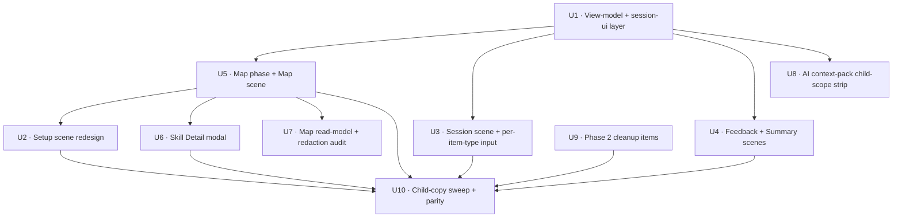

# feat: Punctuation Phase 3 UX/UI rebuild (child dashboard, Punctuation Map, scene split, per-item-type input, AI context-pack gating)

## Overview

Phase 2 shipped ten PRs that hardened the Punctuation Worker engine, redaction, monster roster, and reward projection. The subject is now production-safe: `hasEvidence` no longer inflates for fresh learners, read-model branches are fail-closed against forbidden server-only fields via a recursive scan, the monster roster matches the 3 direct + 1 grand + 3 reserved shape, and the smoke matrix behaviourally proves every shipped mode. The learner-facing UI has not caught up. `src/subjects/punctuation/components/PunctuationPracticeSurface.jsx` is a single 350-line file that exposes **ten** session-start buttons on the setup screen (Start, Guided learn + skill `<select>`, Weak spots, GPS test, and six cluster focus modes — Endmarks / Apostrophe / Speech / Comma / Boundary / Structure), renders an adult-style guided teach-box inline, uses `item.stem` as the typed prefill for every item mode (which is wrong for `combine` and `transfer`), shows raw misconception facet chips as technical diagnostics, and has no child-facing equivalent of Spelling's Word Bank for browsing the 14 skills.

Phase 3 rebuilds that surface around a single child-facing flow — **Setup (3 primary journeys + Map link) → Session (one question at a time, input shape varies by item type) → Feedback (short nudge + optional model) → Summary (score + monster progress + next action) → Punctuation Map (14 skills grouped by monster, filter, tap to open detail → Practise this)**. The six cluster focus modes stop being primary setup buttons and become "Practise this skill" affordances inside the Map's skill detail modal. The learner surface stops exposing the worker-projected `contextPack` field entirely. Scope boundaries and engine contracts from Phase 2 stay frozen — no `shared/punctuation/*` engine change, no `worker/src/subjects/punctuation/*` scoring change, no `contentReleaseId` bump.

---

## Problem Frame

Phase 2's completion report (`docs/plans/james/punctuation/punctuation-p2-completion-report.md`) closes with five "likely Phase 3 attention points": AI context-pack learner-surface decision, the one skipped U5 roster test, the stale "First Release Scope" doc framing, telemetry thresholds without a dashboard, and the `CODEX_POWER_RANK` reserved tombstones. Those are genuine loose ends, but the deeper issue is structural: **Spelling was built as a learner experience; Punctuation was built as a single technical practice surface.**

Spelling has separate scene files for setup, session, summary, word-bank, and per-word detail, plus a shared view-model layer (`src/subjects/spelling/components/spelling-view-model.js`) and session-label selectors (`src/subjects/spelling/session-ui.js`) that make every scene a thin render of pure-function output. A Spelling learner sees a hero + three mode cards + "Where you stand", picks a mode, answers one question at a time, gets a short child-friendly feedback line with optional reveal, and lands on a summary that routes them into "words that need another go" or the Word Bank — where they can search, filter by status (Due / Trouble / Learning / Secure / Unseen), tap a word, see a definition + example sentence, and press "Practise this".

Punctuation exposes every internal session mode as an equal-weight primary button, shows adult facet chips (`speech.quote_missing`, `speech.punctuation_outside_quote`), renders a three-box guided teach panel before the learner has even read the question, and asks a child to choose between "Start practice", "Guided learn", "Weak spots", "GPS test", "Endmarks focus", "Apostrophe focus", "Speech focus", "Comma focus", "Boundary focus", and "Structure focus" on the same screen. The scheduler, weak-spot routing, GPS rules, reward projection, and redaction from Phase 2 are doing their job; the UI is not. A Year 3–6 learner should open Punctuation and immediately understand "what should I do now?", "how am I doing?", "what punctuation skills are wobbly?", and "what monster progress did I make?" — without ever reading adult terminology or being handed a mode matrix.

Grammar Phase 3 is solving the same problem in parallel (`docs/plans/2026-04-25-004-feat-grammar-phase3-ux-reset-plan.md`); as of commit `8335203` that plan has shipped U0 (roster flip + codex landmines), U8 (view-model layer), U6a (transferLane plumbing), and U1 (child dashboard). Grammar U1 + U8 + Punctuation Phase 2's redaction discipline give Punctuation Phase 3 a proven template to copy. Spelling remains the gold standard for what "done" looks like.

---

## Requirements Trace

- R1. A learner opens Punctuation and sees three primary journey cards (Smart Review / Wobbly Spots / GPS Check) plus one secondary Punctuation Map link — no mode matrix, no adult copy.
- R2. A learner can browse all 14 published punctuation skills in a new Punctuation Map scene, grouped by the 4 active monsters (Pealark / Claspin / Curlune / Quoral), filter by status (Due / Wobbly / Learning / Secure / New) and by monster, and tap a skill to open a detail modal that shows rule + worked-good example + common-mix-up + "Practise this".
- R3. When a learner taps "Practise this" in the Map's skill detail modal, the session starts as Guided with the correct `guidedSkillId` and routes through the existing Worker `start-session` command — no new command shape, no new engine path, no service-layer change.
- R4. The six cluster focus modes (`endmarks`, `apostrophe`, `speech`, `comma_flow`, `boundary`, `structure`) remain dispatchable via `punctuation-start` with the same `data.mode` values. They are no longer primary-setup affordances; the Modal's "Practise this" is Guided, not cluster. Behavioural coverage for the 6 cluster modes is preserved via `tests/punctuation-legacy-parity.test.js` (Phase 2 U9 matrix). The `PUNCTUATION_MODES` enum stays at 10 entries.
- R5. The session scene renders one question at a time: Question `N of M` + Skill + Mode in a short header, a single prompt card, a single input area, and two or three buttons (Check / Skip / End round; or Save answer / Skip / End round in GPS). The guided teach-box collapses to a short "Rule reminder" with a "Show example" toggle.
- R6. Text input prefill shape depends on item mode:
  - `insert`, `fix`, `paragraph` — prefill the editable sentence / passage with `item.stem` (today's behaviour, preserved).
  - `combine`, `transfer` — render the source sentences or instruction as a non-editable block above, leave the answer textarea blank.
  - `choose` — unchanged (radio choice list).
- R7. Feedback defaults to one short line ("Nice!" / "Almost — the question mark belongs inside the speech marks." / "Try another") with a "Show model answer" reveal. Raw facet chips with ids like `speech.quote_missing` are converted to child labels via a view-model helper or hidden.
- R8. Summary shows score + monster progress (active roster only) + wobbly-skill list (as short chips, not a diagnostic report) + clear next actions ("Practise wobbly spots" / "Open Punctuation Map" / "Start again" / "Back to dashboard"). GPS summary keeps its delayed-feedback review cards but drops the long adult diagnostic framing.
- R9. The learner client read-model no longer carries the `contextPack` field. The Worker allowlist stops passing it to the child surface; any future Parent/Admin context-pack surface reads it via a separate adult-scope path (out of scope for this phase, but the write-side change must leave that door open).
- R10. The reserved monsters (Colisk, Hyphang, Carillon) never appear in the learner-facing Map, skill detail modal, Summary monster strip, or dashboard monster progress. The Codex power-rank order (Quoral at top; reserved ranked below directs) and `pickFeaturedCodexEntry` reserved-subject filter both stay intact.
- R11. `composeIsDisabled(ui)` threads through every new scene's mutation controls (Setup mode cards / round-length select, Session input + Check + Skip + End, Feedback Continue + Finish, Map filter chips + "Practise" buttons, Skill detail Practise + Close). Availability normaliser continues to accept `'ready' | 'degraded' | 'unavailable'`.
- R12. No `contentReleaseId` bump. Every PR body explicitly states `release-id impact: none`. Oracle replay (`tests/punctuation-legacy-parity.test.js`) stays byte-for-byte equivalent across the Phase 3 chain.
- R13. The bidirectional forbidden-key alignment between `worker/src/subjects/punctuation/read-models.js`, `scripts/punctuation-production-smoke.mjs`, and `tests/helpers/forbidden-keys.mjs` stays green. Any new Map / skill-detail read-model projection passes `assertNoForbiddenReadModelKeys` at payload assembly.
- R14. No regression of English Spelling parity (`AGENTS.md:14`). Shared primitive extraction is forbidden unless Spelling stays byte-for-byte identical. Safe default: subject-scoped helpers inside `src/subjects/punctuation/`.
- R15. Frozen `PUNCTUATION_CHILD_FORBIDDEN_TERMS` fixture in `punctuation-view-model.js` enumerates every adult / internal term that must not appear in child-facing scene output (Setup, Session, Feedback, Summary, Map, Skill Detail). A fixture-driven test sweeps every rendered child phase against this list. New forbidden terms land here once.
- R16. Cluster focus actions (`endmarks` / `apostrophe` / `speech` / `comma_flow` / `boundary` / `structure`) stay dispatchable through `punctuation-start` and keep behavioural coverage via the Phase 2 U9 parity matrix. Learner-visible affordance is scheduler-driven (e.g. `weak` routing picks cluster items) rather than a dedicated UI button — that is the intentional demotion.
- R17. Phase 3 ships Phase 2's deferred cleanup items from the completion report §"What will probably need attention": (a) delete or port the skipped U5 roster test, (b) rename or update `docs/punctuation-production.md` "First Release Scope" framing, (c) remove the dead `CODEX_POWER_RANK` reserved tombstones from the active map (or clearly comment they are reserved-only).
- R18. Telemetry thresholds (Phase 2 operational notes) get a concrete decision: either wired to a query or explicitly marked as aspirational in-doc. Phase 3 does not build a dashboard.

**Origin actors:** A1 (KS2 learner), A2 (parent/adult evaluator — Parent Hub out of scope here), A3 (React client), A4 (Worker runtime — unchanged), A5 (Punctuation engine — unchanged), A6 (Monster Codex projection — unchanged), A7 (Deployment verifier — the existing smoke path still applies).

**Origin flows:** F1 (Scientific practice loop — unchanged engine), F2 (Monster reward projection — unchanged projection; UI surface updated), F3 (Bellstorm Coast presentation — preserved, extended to Map scene), F4 (Production release gate — no release-id bump, smoke kept green).

**Origin acceptance examples:** AE1–AE9 from the brainstorm carry forward unchanged — this phase does not alter marking, mastery rules, or reward projection. The Phase 3-specific acceptance examples below trace to R1–R18.

---

## Scope Boundaries

### Deferred for later

- Parent / Admin context-pack surface. Phase 3 strips `contextPack` from the child surface; a Parent / Admin-only rendering is a separate plan.
- Live telemetry dashboard for Phase 2's operational thresholds.
- Broadening the published skill set beyond the current 14. Phase 3 is UX only.
- Playwright / real-browser smoke tests. Repo convention is `node:test` + SSR harness (AGENTS.md + Phase 2 R38 + Grammar P3 U4 decision).

### Outside this product's identity

- Monetising Punctuation as a separate product. It remains one of the KS2 Mastery subjects, with the same accent (`#B8873F` Bellstorm gold) and shared dashboard posture.
- A Punctuation-specific admin console for learners. Adult views stay in Parent Hub and Admin Hub.
- Collapsing Bellstorm Coast into another region. Punctuation keeps its distinct visual identity.

### Deferred to Follow-Up Work

- None. Phase 3 ships as a coherent UX rebuild: U1 (view-model + session-ui) → U2 (Setup redesign) → U3 (Session per-item-type) → U4 (Feedback + Summary) → U5 (Map phase + scene) → U6 (Skill Detail modal) → U7 (Map read-model + redaction) → U8 (AI context-pack gate) → U9 (Phase-2 cleanup) → U10 (styling + forbidden-term sweep + behavioural parity). U2–U6 must land together to avoid a dashboard that references Map while the Map scene doesn't exist.

---

## Context & Research

### Relevant Code and Patterns

**Spelling mirrors (the pattern to copy)**
- `src/subjects/spelling/components/SpellingPracticeSurface.jsx` — thin router (~160 lines). Routes on `spelling.ui.phase`: `summary` → `SpellingSummaryScene`, `session` → `SpellingSessionScene`, `word-bank` → `SpellingWordBankScene`, default → `SpellingSetupScene`. Handles hero-bg preload, setup-tone persistence via `sessionStorage`, scroll-to-top on phase change.
- `src/subjects/spelling/components/SpellingSetupScene.jsx` — hero + mode cards + round length + "Where you stand" layout.
- `src/subjects/spelling/components/SpellingSessionScene.jsx` — dispatch-driven active-item + feedback in one scene.
- `src/subjects/spelling/components/SpellingSummaryScene.jsx` — round summary with "words that need another go" chips; routes into drill.
- `src/subjects/spelling/components/SpellingWordBankScene.jsx` — the Word Bank template: `FilterChips` with `role="group"` + `aria-pressed`, year chips, search, counts, detail modal trigger.
- `src/subjects/spelling/components/SpellingWordDetailModal.jsx` — per-word explain/drill split with "Practise this".
- `src/subjects/spelling/components/spelling-view-model.js` — pure helpers: frozen option lists (`MODE_CARDS`, `ROUND_LENGTH_OPTIONS`, `WORD_BANK_FILTER_IDS`, `WORD_BANK_YEAR_FILTER_IDS`), hero-background selectors, word-bank aggregate helpers, display-time formatters. **No React imports.**
- `src/subjects/spelling/session-ui.js` — pure session label/visibility selectors (`spellingSessionSubmitLabel`, `spellingSessionInputPlaceholder`, `spellingSessionFooterNote`, `spellingSessionProgressLabel`, `spellingSessionInfoChips`). Lives at subject root, not under `components/`.

**Grammar mirrors (the in-flight template — only U1 + U8 + U6a + U0 shipped as of commit `8335203`)**
- `src/subjects/grammar/session-ui.js` — post-U8 pure selector shape to copy exactly: helper takes `(session, grammarPhase)` and returns a flag bundle; test assertions are pure-function, not SSR.
- `src/subjects/grammar/components/grammar-view-model.js` — frozen `GRAMMAR_PRIMARY_MODE_CARDS`, `GRAMMAR_MORE_PRACTICE_MODES`, `GRAMMAR_BANK_STATUS_FILTER_IDS`, `GRAMMAR_BANK_CLUSTER_FILTER_IDS`, `GRAMMAR_DASHBOARD_HERO`, `ACTIVE_GRAMMAR_MONSTER_IDS`, `buildGrammarDashboardModel(...)`. Also the pattern for `GRAMMAR_CHILD_FORBIDDEN_TERMS` (to be mirrored in Punctuation).
- `src/subjects/grammar/components/GrammarSetupScene.jsx` — the child dashboard shape to mirror (hero + Today cards + Concordium progress + 4 primary mode cards + More practice `<details>` + quiet round controls). `data-action="grammar-set-mode"` + aria-pressed button pattern.
- `src/subjects/grammar/components/GrammarPracticeSurface.jsx` — phase-driven router with placeholder routes for future phases (bank / transfer) so the dashboard never dead-ends while the scene lands.

**Current Punctuation surfaces to split**
- `src/subjects/punctuation/components/PunctuationPracticeSurface.jsx` (350 lines) — the monolith. Contains `composeIsDisabled(ui)` (lines 22–30, **load-bearing, must be preserved and exported into view-model**), `SetupView` (lines 32–107 — the 10-button mode grid), `WeakFocusChips`, `GuidedTeachBox` (heavy pre-answer teach box), `ChoiceItem`, `TextItem` (lines 180–207, hard-codes `useState(item.stem || '')` for every text mode — the U3 behaviour bug), `ActiveItemView`, `FeedbackView`, `SummaryView`, plus the default export router.
- `src/subjects/punctuation/components/punctuation-view-model.js` (59 lines) — currently holds only `bellstormSceneForPhase`, `punctuationMonsterAsset`, `punctuationPhaseLabel`, `currentItemInstruction`. Phase 3 expands this substantially.
- `src/subjects/punctuation/service-contract.js` — `PUNCTUATION_PHASES` frozen at `['setup', 'active-item', 'feedback', 'summary', 'unavailable', 'error']`. Phase 3 adds `'map'` (and a normaliser for the new Map UI state). `PUNCTUATION_MODES` frozen with ten entries including the six cluster focus modes — **unchanged by Phase 3**.
- `src/subjects/punctuation/module.js` — adds `punctuation-open-map` and `punctuation-close-map` handlers (pure UI state transitions; no Worker command).
- `src/subjects/punctuation/command-actions.js` — no changes required for Map / skill focus (both go through the existing `punctuation-start` with `mode` + `skillId`).
- `src/subjects/punctuation/read-model.js` — already exposes `PUNCTUATION_CLIENT_SKILLS` (id, name, clusterId for all 14) and `PUNCTUATION_CLIENT_REWARD_UNITS` (clusterId → rewardUnitId mapping). Map scene can reuse these directly.
- `src/subjects/punctuation/client-read-models.js` — wraps `initState`, `getPrefs`, `getStats`, `getAnalyticsSnapshot`. The Map per-skill row data comes from `getAnalyticsSnapshot(learnerId).skillRows`.

**Worker-side contracts to honour**
- `worker/src/subjects/punctuation/read-models.js` — `safeCurrentItem` (allowlist: `id, mode, skillIds, clusterId, prompt, stem, inputKind, source, options`), `safeFeedback` (allowlist: `kind, headline, body, attemptedAnswer, displayCorrection, explanation, misconceptionTags, facets`), `safeContextPackSummary`, `safeSummary` (permissive clone + recursive scan backstop), `assertNoForbiddenReadModelKeys`. Any new Map read-model projection extends this file with explicit allowlists (e.g. `safeSkillRow`, `safeMapEntry`).
- `worker/src/subjects/punctuation/commands.js` — 8 commands, unchanged for Phase 3. U8 may add an `adultOnly` envelope for the context-pack route (the minimal safe move is UI-side strip; the designed scope per origin R34 is to remove from child read-model).
- `worker/src/subjects/punctuation/ai-enrichment.js` — `punctuationContextPackProviderConfigured(env)`, `requestPunctuationContextPack(...)`. Phase 3 U8 does **not** touch this file; it only changes what `buildPunctuationReadModel` emits to the child.

**Forbidden-key infrastructure (load-bearing)**
- `tests/helpers/forbidden-keys.mjs` — single source of truth. `FORBIDDEN_PUNCTUATION_READ_MODEL_KEYS` (12 entries: `accepted`, `answers`, `correctIndex`, `rubric`, `validator`, `seed`, `generator`, `rawGenerator`, `hiddenQueue`, `queueItemIds`, `responses`, `unpublished`). Extension rule (file-level comment): "When a new forbidden key is introduced, add it here first; downstream consumers import, so they cannot drift."

**Monster integration (silent-regression landmines from Phase 2 U5)**
- `src/platform/game/monsters.js:186-203` — `MONSTERS_BY_SUBJECT.punctuation = ['pealark', 'curlune', 'claspin', 'quoral']`; `punctuationReserve = ['colisk', 'hyphang', 'carillon']`.
- `src/platform/game/mastery/punctuation.js` — `normalisePunctuationMonsterState`, `reservedPunctuationMonsterEntries`, `activePunctuationMonsterSummaryFromState`, `progressForPunctuationMonster`.
- `src/surfaces/home/data.js:704-713` — `pickFeaturedCodexEntry` filters reserved subjects; `CODEX_POWER_RANK` places Quoral=11 above all directs. **Phase 3 must not regress either.**

### Institutional Learnings

- **Spelling scene split + view-model layer is the proven shape (learning #1).** Spelling's `SpellingPracticeSurface` → scene file per phase + `spelling-view-model.js` + `session-ui.js` delivers child-friendliness with minimal JSX surface per scene. Grammar Phase 3 U8 + U1 confirm the pattern translates. Punctuation Phase 3 copies this structure exactly — no new architecture.
- **View-model / session-ui must land first (learning #1 + #2).** Grammar Phase 3 U8 was intentionally front-loaded so every subsequent scene imports from one source of truth. Skipping it forces copy drift across 5+ JSX files. Punctuation U1 lands `punctuation-view-model.js` expansion + new `session-ui.js` before any scene rewrite.
- **`composeIsDisabled(ui)` must thread through every new scene (learning #3).** Phase 2 U4's reviewer caught that `SetupView` and `FeedbackView` had been silently dropped from the composite-disabled wiring on the first pass. Include every new scene at scene-creation time — do not ship a "we'll thread it after" PR.
- **Forbidden-key redaction is allowlist + recursive scan (learning #4).** Per-phase allowlist strips first (`safeCurrentItem`, `safeFeedback`, etc.); the recursive `assertNoForbiddenReadModelKeys` walk is belt-and-braces for clone-passthrough paths. Map and Skill Detail payloads are new branches requiring both.
- **Roster migration shipped — do not re-open it (learning #5).** Phase 3 inherits Punctuation's 3+1 shape. The five landmines the U5 reviewer caught (reserved-subject filter, power-rank order, explicit subject-priority list, shallow-spread array aliasing, unnecessary writer seam) stay as invariants — new scene code touching monster state goes through `normalisePunctuationMonsterState` + `activePunctuationMonsterSummaryFromState`.
- **SSR harness blind spots (learning #6).** `node:test` + SSR cannot observe pointer-capture, focus, scroll-into-view, or IME. Top-of-file comment block per new scene test documents this (`tests/react-grammar-surface.test.js` U4 sets the pattern). Mitigation: behaviour-level state assertions rather than DOM-event simulations.
- **Silent no-op risk (learning #7).** HTML-regex absence tests pass whether a command genuinely fails closed or silently does nothing. New UI-local actions (`punctuation-open-map`, `punctuation-close-map`, `punctuation-map-status-filter`, `punctuation-skill-detail-open`, `punctuation-skill-detail-close`) must pair with positive state-delta assertions. Phase 2 U9's `weakFocus` literal-equal catch is the template.
- **`contentReleaseId` bump policy (learning #8).** Phase 3 is pure client UX — no bump expected. Every PR body states `release-id impact: none` as Phase 3 discipline (mirrors Grammar Perfection Pass's discipline across 8 PRs).
- **Per-item-type text input split is a UI-only bug (learning #9).** Current `TextItem` starts `useState(item.stem || '')` for every mode. For `combine` and `transfer`, stem is source material not the answer. Split: `insert`/`fix`/`paragraph` prefill; `combine`/`transfer` blank with source shown above. No Worker-layer symptom.
- **GPS delayed-feedback contract (learning #10).** In GPS mode the session scene shows "Save answer" (not "Check"), renders "Test mode: answers at the end.", passes no feedback payload until `phase === 'summary'`. Phase 2 U9 shipped the proof; scene-level absence test (no correct-answer text in HTML before finish) adds UI coverage.
- **Windows CLI ESM entrypoint guard (learning #11 — `project_windows_nodejs_pitfalls` memory).** Any new CLI script in Phase 3 uses ``if (process.argv[1] && import.meta.url === pathToFileURL(process.argv[1]).href)``, never ``file://${process.argv[1]}``. Reference siblings: `scripts/audit-client-bundle.mjs` (post-Phase 2 U10 fix), `scripts/backfill-learner-read-models.mjs`.
- **Bellstorm Coast scene selection must be server-read-model-driven (learning #12).** New Map scene hero selection derives from Worker-projected learner state, not client random. Daily scenes sets A–C, boss / final sets D–E — convention preserved.
- **Parent/Admin vs learner read-model split (learning #13).** Adult metrics (attempt counts, release IDs, mastery keys, facet weights, raw misconception codes, strength percentages, sample sizes) stay out of child scenes. AI context pack is the canonical split example: "Worker plumbing stays; child learner surface ignores; Parent/Admin surface renders." Phase 3 U8 strips it from the child read-model; Parent/Admin delivery is deferred.

### External References

None required. Spelling + Grammar in-repo patterns, Phase 2 completion-report lessons, and the forbidden-key alignment contract supply the entire playbook.

---

## Key Technical Decisions

- **View-model + session-ui split lands first (U1).** Expand `src/subjects/punctuation/components/punctuation-view-model.js` with frozen option lists (`PUNCTUATION_PRIMARY_MODE_CARDS`, `PUNCTUATION_MORE_PRACTICE_MODES`, `PUNCTUATION_MAP_STATUS_FILTER_IDS`, `PUNCTUATION_MAP_MONSTER_FILTER_IDS`, `PUNCTUATION_DASHBOARD_HERO`, `ACTIVE_PUNCTUATION_MONSTER_IDS`, `PUNCTUATION_CHILD_FORBIDDEN_TERMS`), dashboard-model builder, status-label helpers (`punctuationChildStatusLabel`), Bellstorm scene selectors. Create new `src/subjects/punctuation/session-ui.js` with submit-button label, input placeholder, progress label, help-visibility, prefill-rule selectors (pure functions of `session` + `phase`). Move `composeIsDisabled(ui)` out of `PunctuationPracticeSurface.jsx` into the view-model so every scene imports the same helper. Every subsequent JSX unit (U2–U6) imports from this single source of truth. **Rationale:** Grammar Phase 3 U8 proved the front-loaded view-model eliminates copy drift; skipping it forces every scene rewrite to restate copy, filter ids, status-mapping inline.

- **Add a `map` phase to `PUNCTUATION_PHASES`.** Extend the frozen list from `['setup','active-item','feedback','summary','unavailable','error']` to `['setup','active-item','feedback','summary','unavailable','error','map']`. Add `normalisePunctuationMapUi` for Map-scene local state (status filter, monster filter, detail open/closed, detail tab). Handler: `punctuation-open-map` → `{ phase: 'map' }`; `punctuation-back` already resets to `setup`. Mirrors Spelling's `word-bank` phase shape. **Not a mode**, a phase. Does not extend `PUNCTUATION_MODES`. **Rationale:** Map is a browsing view, not a practice session; it shares no state with `session.mode`. A new phase matches Spelling's precedent exactly and keeps the Worker contract untouched (no new command).

- **Skill focus dispatches `{ mode: 'guided', guidedSkillId: <skillId>, roundLength: '4' }`, not cluster mode.** Verified against `shared/punctuation/service.js:1281-1283`: `guidedSkillId` is only populated when `prefs.mode === 'guided'` (`prefs.mode === 'guided' ? chooseGuidedSkill(...) : null`). Dispatching a cluster mode like `{ mode: 'speech', skillId: 'speech' }` silently drops the skill-pin; the scheduler falls back to cluster-wide routing. For single-skill clusters (`speech`, `endmarks`) this accidentally works; for multi-skill clusters (`apostrophe`=2, `comma_flow`=3, `boundary`=3, `structure`=4) it produces wrong items. Phase 3 dispatches through Guided mode — the affordance label stays "Practise this", but the internal session starts with `session.mode === 'guided'` and `guidedSkillId === <tapped-skill>`. **This supersedes the "six cluster focus modes reached via modal" framing in earlier R4 phrasings.** Cluster focus modes remain dispatchable via the enum (R16 behavioural coverage), but **the Modal's "Practise this" path is Guided, not cluster.** **Rationale:** Keeps Phase 2 engine frozen; Guided already honours skill pinning; avoids extending `startSession` to accept `skillId` for all modes (which would be an engine change, violating Phase 3's frozen-engine premise).

- **Six cluster focus modes stay reachable, but their primary affordance is removed.** `PUNCTUATION_MODES` enum stays at 10 entries. The old "Endmarks focus" / "Apostrophe focus" / etc. primary setup buttons disappear; the Modal's "Practise this" is Guided (preceding decision), not cluster. R16's behavioural coverage for the 6 cluster modes is preserved via the existing `punctuation-legacy-parity.test.js` matrix (Phase 2 U9) plus any test that starts a session with `mode: <clusterId>` directly. The Modal is not the surface for cluster-mode reachability — Phase 3 intentionally demotes cluster-focus from learner-driven to scheduler-derived. **Rationale:** Direct cluster selection as a primary setup affordance confuses KS2 learners; Smart Review routes them to cluster items anyway when their weak-bucket warrants it.

- **Stale `prefs.mode` migration for returning learners.** A pre-Phase-3 learner who pressed "Endmarks focus" last week has `prefs.mode: 'endmarks'` written to their subject state. Post-Phase-3 the Setup scene renders 3 primary cards mapped to `'smart'|'weak'|'gps'`. The plan's display normaliser in `punctuation-view-model.js` exposes `punctuationPrimaryModeFromPrefs(prefs)` which returns `'smart'` for any of the 6 cluster values, leaving the stored `prefs.mode` untouched (no silent data mutation). **However**, `punctuation-start-again` (called from Summary) reads raw `prefs.mode` and would start a cluster-focus session silently; to close that gap, Setup dispatches `punctuation-set-mode` with `value: 'smart'` on first render **if and only if** stored `prefs.mode` is one of the 6 cluster values — migrating the stored value once, explicitly, at the first Setup visit post-deploy. Test locks both: display treats cluster as smart; first-render dispatch migrates storage; subsequent visits do not re-dispatch. **Rationale:** Silent data mutation is the lesser evil here — the alternative is a "Start again" button that silently starts a session the learner can no longer configure.

- **Per-item-type text input shape (U3).** `session-ui.js` exports `punctuationSessionInputShape(itemMode)` returning one of `{ prefill: 'stem' }` for `insert|fix|paragraph` or `{ prefill: 'blank', showSource: true }` for `combine|transfer`. `PunctuationSessionScene.jsx`'s text-input branch consumes it. The current React test asserts `combine` and `paragraph` both render textarea with stem — that test is rewritten to assert stem-prefilled for `paragraph`, blank for `combine` with source visible above. **Rationale:** Current behaviour confuses learners; Worker marking is mode-agnostic about prefill, so this is UI-only (release-id impact: none).

- **Feedback chips target `misconceptionTags`, not `facets`.** Critical correction — `shared/punctuation/marking.js:5-23` defines `FACET_LABELS` with short friendly keys (`quote_variant: 'Matched inverted commas'`, `speech_punctuation: 'Speech punctuation inside the closing inverted comma'`); existing `FeedbackView` already renders `facet.label` (the friendly string) via `feedback.facets`. The dotted-ID leak (`speech.quote_missing`, `comma.clarity_missing`, etc.) is on the separate `misconceptionTags` field emitted at `marking.js:142` onward. Current `SummaryView` at `PunctuationPracticeSurface.jsx:322` renders these dotted tags directly as chips in the GPS review card — **this is a live child-surface leak today**, not a new Phase 3 risk. U1 ships `punctuationChildMisconceptionLabel(tag)` (deterministic map from the ~30 tags in `marking.js` to child labels). U4's Summary/GPS-review rewrite pipes `misconceptionTags` through this mapper and **hides chips when no child label exists**, never falling back to the raw dotted ID. Facet chips (already friendly-labelled) keep their existing behaviour, just moved behind a "Show more" toggle. `PUNCTUATION_CHILD_FORBIDDEN_TERMS` is extended with the 5 dotted-tag prefixes (`speech.`, `comma.`, `boundary.`, `apostrophe.`, `structure.`, `endmarks.`) so U10's sweep catches any future regression. **Rationale:** The live leak is a Phase 3 cleanup item, not a prevention target — U10's sweep has to treat the existing behaviour as a bug to fix, not a state to preserve.

- **Map data sources are read-model + monster state + skill manifest.** Per-skill row: `client-read-models.js`'s analytics snapshot provides `skillRows` with `{ skillId, status, attempts, accuracy, mastery, dueAt }`. Monster grouping: `PUNCTUATION_CLUSTERS` (from `shared/punctuation/content.js`, already imported by client read-model) maps cluster → monsterId. Monster progress: `progressForPunctuationMonster(state, monsterId)` from `src/platform/game/mastery/punctuation.js`. **Reserved monsters are never iterated** — the Map iterates `ACTIVE_PUNCTUATION_MONSTER_IDS = ['pealark','curlune','claspin','quoral']` only. **Rationale:** All data already exists; the work is filtering, grouping, and styling.

- **Skill Detail Modal pedagogy content excludes items that verbatim-match acceptance fixtures.** Audit against `shared/punctuation/content.js` found at least one byte-for-byte match: `comma_clarity` skill's `contrastGood` string `'Most of the time, travellers worry about delays.'` is identical to item `cc_insert_time_travellers.accepted[0]`. Rendering all five pedagogy strings (`rule`, `workedGood`, `workedBad`, `contrastGood`, `contrastBad`) in the Modal with "Practise this" as the next action trains memorisation over generalisation. U6 Modal content therefore renders **only three fields per skill**: `rule` (always), `contrastBad` (always — shows common mix-up), and one of `workedGood` OR `contrastGood` — chosen per-skill by a per-skill lookup (`PUNCTUATION_SKILL_MODAL_PREFERRED_EXAMPLE` in view-model) that defaults to `workedGood` and explicitly uses `workedGood` for `comma_clarity`, `list_commas`, `speech`, and any other skill whose `contrastGood` was flagged during the U6 authoring audit. **Rationale:** `workedGood` generally has less exact overlap with transfer/insert `accepted` strings than `contrastGood` does; default to the less leak-prone field and override only when the skill's `workedGood` is itself verbatim.

- **Multi-skill paragraph items get an explicit Modal caveat.** `PUNCTUATION_ITEMS`' paragraph items (e.g. `pg_fronted_speech` at `content.js:1487`) list `skillIds: ['fronted_adverbial', 'speech']`. If a learner taps a skill that only appears as a secondary entry on a paragraph item, the resulting Guided session may serve paragraph items that also exercise another skill. The Modal does not hide this: it shows a footnote "Some practice questions may also include other punctuation skills." on skills whose cluster has `paragraph`-mode items spanning multiple `skillIds`. This preserves learner trust without changing the scheduler. **Rationale:** Filtering multi-skill items out of skill-focus sessions would require a service change (violates frozen-engine premise); a Modal-level caveat is the honest UX move.

- **New read-model projection for Map + skill detail is optional in Phase 3.** Default plan: reuse existing analytics snapshot + client-held content manifest references, render entirely from already-redacted data. If any new derived field needs to be added (e.g. a pre-computed `recentMistakesForSkill` blob), it lands in `worker/src/subjects/punctuation/read-models.js` under an explicit allowlist (`safeSkillRow`, `safeMapEntry`) and passes through the recursive forbidden-key scan. The plan-level default is **zero new Worker read-model surface area**; keep the door open in U7 if U5/U6 implementation finds a real derived-data need.

- **U8 strips `contextPack` from the child learner read-model (designed scope).** Two layers: (a) `worker/src/subjects/punctuation/read-models.js` stops attaching `contextPack` to the learner read-model payload for the default child-scope call path; (b) `src/subjects/punctuation/read-model.js` / `client-read-models.js` stops including `contextPack` even if the worker accidentally sends it (belt-and-braces). `punctuation-context-pack` client action stays defined for a future Parent / Admin surface but the child UI never dispatches it. **Rationale:** Phase 2 R34 explicitly deferred this; hiding in the UI while still sending over the wire is not the designed scope. Worker-side removal is one-line; a feature flag is unnecessary because no child UI consumes `contextPack` today (grep confirmed zero renders in `PunctuationPracticeSurface.jsx`).

- **Frozen `PUNCTUATION_CHILD_FORBIDDEN_TERMS` fixture in view-model (U10) — single source of truth.** Initial list: `['Worker', 'Worker-held', 'Worker-marked', 'accepted', 'correctIndex', 'rubric', 'validator', 'generator', 'rawGenerator', 'mastery key', 'mastery-key', 'release id', 'releaseId', 'facet weight', 'publishedTotal', 'denominator', 'projection', 'reward route', 'read model', 'misconception tag', 'supportLevel', 'contextPack', 'Context pack', 'skill-bank', 'weakFocus', 'hasEvidence', 'subjectUi']` plus the dotted-tag prefixes `'speech.'`, `'comma.'`, `'boundary.'`, `'apostrophe.'`, `'structure.'`, `'endmarks.'` (from Key Technical Decisions §Feedback chips) plus whole-word catch-all `/\bWorker\b/i`. **This fixture in `src/subjects/punctuation/components/punctuation-view-model.js` is the implementation source of truth.** U10's sweep and all child scene tests import from this export; no copy-paste. Any new forbidden term lands here once and propagates to every scene's U10 sweep automatically.

- **Adult analytics surface stays reachable but not default.** The existing analytics view (whatever consumes `getAnalyticsSnapshot`'s `facetRows`, `recentMistakes`, `misconceptionPatterns`) does not live in the learner flow today. Summary scene adds a secondary "Grown-up view" button (mirrors Grammar P3) that opens the existing adult view — not rendered on the default dashboard or Map. **Rationale:** Keeps the adult data accessible without breaking R7/R15.

- **No shared primitive extraction.** `PunctuationSetupScene.jsx` may visually mirror `SpellingSetupScene.jsx` but keeps copies of any helper it needs scoped under `src/subjects/punctuation/`. AGENTS.md line 14 forbids Spelling regression; the safe default is subject-scoped duplication. **Rationale:** Grammar Phase 3 made the same decision; the cost of duplication is tiny next to the risk of a Spelling parity regression slipping in during cross-subject refactor.

- **Phase 3 is client-only with one Worker-side micro-change.** Only U8's `contextPack`-strip touches `worker/src/subjects/punctuation/read-models.js`. Every other unit stays in `src/subjects/punctuation/`, `src/subjects/punctuation/components/`, or `docs/`. `shared/punctuation/*` is untouched. Bundle-audit guard stays green automatically.

---

## Open Questions

### Resolved During Planning

- **Q: Does Phase 3 add a new `map` phase or a new `mode`?** A: Phase. It is a browsing scene, not a practice session. Mirrors Spelling's `word-bank` precedent.
- **Q: Should skill focus from the Map become a new `mode` value?** A: No. Map "Practise this" maps skill→cluster and dispatches `punctuation-start` with the existing cluster `mode` + `skillId`. No new Worker surface.
- **Q: Is any new Worker read-model projection required for Map?** A: Not by default. Existing analytics snapshot + client-held `PUNCTUATION_CLIENT_SKILLS` + `PUNCTUATION_CLUSTERS` + monster state cover the Map scene. U7 is guard-railed so that if implementation finds a real derived-data need, it lands behind an explicit allowlist with recursive scan — but the expected state at U7 completion is "no new Worker read-model fields shipped".
- **Q: Does U8 require a feature flag?** A: No. No child UI consumes `contextPack` today; the Worker sends it but the client drops it. Stripping at Worker read-model assembly is zero-risk; belt-and-braces client-side drop is a one-line normaliser change.
- **Q: Do the six cluster focus modes disappear from the mode enum?** A: No. `PUNCTUATION_MODES` stays frozen at ten entries. The primary-setup-button affordance is removed; the Modal's "Practise this" dispatches Guided, not cluster. Direct cluster-mode dispatch is still valid (Phase 2 U9 parity matrix keeps them green).
- **Q: Can the Modal's "Practise this" dispatch a cluster mode with `skillId`?** A: **No** — verified against `shared/punctuation/service.js:1281`, `guidedSkillId` is only honoured when `prefs.mode === 'guided'`. Dispatching `{ mode: 'speech', skillId: 'speech' }` silently drops the skill-pin. The Modal dispatches `{ mode: 'guided', guidedSkillId: <skillId>, roundLength: '4' }`.
- **Q: What happens to a returning learner's stored `prefs.mode === 'endmarks'`?** A: Setup's display treats it as `'smart'` (via `punctuationPrimaryModeFromPrefs`), and first Setup render post-deploy dispatches `punctuation-set-mode` with `value: 'smart'` to migrate stored state once. Subsequent renders do not re-dispatch. Locks both behaviours in U2 tests.
- **Q: Are `contrastGood` / `workedGood` strings always safe to render in the Modal?** A: No — byte-for-byte match found for `comma_clarity.contrastGood` vs `cc_insert_time_travellers.accepted[0]` in `shared/punctuation/content.js`. U6 Modal content renders only 3 of 5 pedagogy fields per skill (rule + contrastBad + preferred `workedGood` OR `contrastGood`), with per-skill preference in `PUNCTUATION_SKILL_MODAL_PREFERRED_EXAMPLE`.
- **Q: Is `mapUi` persisted across refresh?** A: No. `subjectUi` is in-memory store state (verified: zero grep hits for `subjectUi` in `worker/src/repository.js` or D1 schema). On page refresh the learner returns to `phase: 'setup'`; filter selections and `detailOpenSkillId` do not survive. Mirrors Spelling's `word-bank` phase behaviour.
- **Q: Do child scenes currently leak `misconceptionTags` (dotted IDs)?** A: **Yes** — `PunctuationPracticeSurface.jsx:322` (current monolith's `SummaryView`) renders `entry.misconceptionTags.map((tag) => <span className="chip warn">{tag}</span>)` directly. U4's Summary rewrite pipes these through `punctuationChildMisconceptionLabel(tag)` and hides any chip with no mapped child label.
- **Q: Is Playwright in scope?** A: No. `node:test` + SSR per AGENTS.md + Phase 2 + Grammar P3 conventions.
- **Q: Does any `contentReleaseId` bump apply?** A: No. Pure client UX. Oracle fixtures stay byte-for-byte.
- **Q: Does the Map scene need to render reserved monsters?** A: No. `ACTIVE_PUNCTUATION_MONSTER_IDS` (4 entries) is the render list. `reservedPunctuationMonsterEntries` is for Admin tooling only.
- **Q: Does `FORBIDDEN_PUNCTUATION_READ_MODEL_KEYS` need a new entry for `contextPack`?** A: No — `contextPack` is valid adult-scope data, just not child-scope. The fix is payload shape (don't send it), not denylist (treat it as forbidden). Over-denylisting would break a future Parent/Admin route.
- **Q: Which subject accent and hero art applies to the new scenes?** A: Bellstorm gold `#B8873F` (already `module.js:24`). Bellstorm Coast sets A–C for daily / Map scenes, D–E for summary / boss moments. `bellstormSceneForPhase` extended to handle `'map'` phase (sets A–C).
- **Q: Summary "Grown-up view" — what does it open?** A: The existing adult analytics surface (whatever consumes `getAnalyticsSnapshot`). No new analytics view built in Phase 3. If that surface doesn't render anywhere in the learner flow today, U4 adds a Summary-only secondary button that dispatches `punctuation-open-adult-view` (or similar) — the action may be a no-op placeholder dispatch that the existing Parent Hub picks up later. Decision deferred to U4 implementation if the consumer surface is unclear.

### Deferred to Implementation

- Exact child-copy strings for setup hero headline / subheadline / mode card descriptions / feedback templates — U2 lands initial versions, James reviews before merge.
- Exact child-copy for `punctuationChildMisconceptionLabel(tag)` — the deterministic map from the ~30 dotted misconception-tag IDs in `shared/punctuation/marking.js` (`speech.quote_missing`, `comma.clarity_missing`, `boundary.semicolon_missing`, etc.) to child labels ("Speech punctuation", "Comma placement", etc.) lands in U4 with an initial translation table; James refines during U4 review. Tags with no child label render as no chip (never as raw dotted ID).
- Per-skill `PUNCTUATION_SKILL_MODAL_PREFERRED_EXAMPLE` map that decides whether to render `workedGood` or `contrastGood` in the Modal — defaults to `workedGood`; U6 authoring sweep audits all 14 skills against `PUNCTUATION_ITEMS.accepted` lists and overrides for any skill whose default has a verbatim match. Decision table lives in view-model; James reviews before merge.
- Whether Summary shows the "Grown-up view" button only when `stats.securedRewardUnits > 0` (i.e. there's something to report) or always — decide at U4 implementation based on SSR render review.
- Whether Skill Detail modal's "Practise this" also lets the learner pick round length, or always uses `'4'` — decide at U6 implementation; default to `'4'` to keep the child path minimal.
- Whether the Map status filter `'wobbly'` includes both `weak` and `due`, or only `weak` — decide at U5 implementation after SSR review; the child-facing interpretation of "needs another go" covers both.
- Whether U9's cleanup includes a rewrite of `docs/punctuation-production.md`'s "First Release Scope" section title in a separate doc-only PR or inside the U9 PR — default to inside U9 unless doc review makes it a larger rewrite.
- Whether telemetry threshold text gets a concrete `console.warn`→Grafana query wire-up, or just a doc-level "aspirational" marker — decide at U9 based on whether the logging pipeline exists; default to doc-level marker given Phase 3's client-only posture.
- Whether the `punctuation-context-pack` client action is retained as a stub for future Parent/Admin use or removed — default to retention (dead code is low cost; removing it preempts a future Parent/Admin pass that would have to re-add it).

---

## High-Level Technical Design

> *This illustrates the intended approach and is directional guidance for review, not implementation specification. The implementing agent should treat it as context, not code to reproduce.*

### Phase 3 dependency graph



U1 is the structural prerequisite. **U5 lands before U2** (revised from initial draft): U2 adds a setup button that dispatches `punctuation-open-map`, whose handler exists only after U5. Landing U2 alone would leave the button as a silent no-op — exactly the failure mode learning #7 guards against. U3 + U4 are disjoint from U5 and can land in parallel with it after U1. U6 is sequential after U5 (modal depends on Map phase). U7 is a narrow audit PR after U5/U6. U8 is independent of U1–U7 (the monolith `PunctuationPracticeSurface.jsx` never renders `contextPack`, so stripping it from the child read-model is behaviourally silent until U2+ land — confirmed safe). U9 is cleanup-only. U10 is the final sweep: every child scene hits the forbidden-term fixture, the Phase 2 smoke stays green, and the existing `PUNCTUATION_MODES` six cluster focus modes keep behavioural coverage via the Phase 2 U9 parity matrix.

### Session scene input-shape decision matrix

| `item.inputKind` | `item.mode` | Prefill | Source block | Submit label (non-GPS) |
|---|---|---|---|---|
| `choice` | any | n/a (radio group) | n/a | Submit answer |
| `text` | `insert` | `item.stem` | none | Check |
| `text` | `fix` | `item.stem` | none | Check |
| `text` | `paragraph` | `item.stem` | none | Check |
| `text` | `combine` | **blank** | **source sentences visible above, non-editable** | Check |
| `text` | `transfer` | **blank** | **instruction visible above, non-editable** | Check |

GPS overrides the submit label to "Save answer" in every row. Feedback is suppressed until `phase === 'summary'` in GPS.

### Punctuation Map data shape (client-side, no new worker surface)

```
MapModel = {
  learnerId: string,
  monsters: [
    {
      monsterId: 'pealark'|'claspin'|'curlune'|'quoral',
      name: string,                    // view-model resolved
      progress: { mastered: number, publishedTotal: number, stage: 0..4 },
      skills: [
        {
          skillId: string,              // one of the 14 ids
          name: string,                 // from PUNCTUATION_CLIENT_SKILLS
          clusterId: string,
          status: 'new'|'learning'|'due'|'weak'|'secure',
          statusLabel: 'New'|'Learning'|'Due today'|'Wobbly'|'Secure',
          rule: string,                 // safe — pedagogy
          workedGood: string,           // safe
          contrastBad: string,          // safe — shows common mix-up
          contrastGood: string,         // safe
        }
      ]
    }
  ],
  filters: {
    status: 'all'|'new'|'learning'|'due'|'weak'|'secure',
    monster: 'all'|'pealark'|'claspin'|'curlune'|'quoral',
  },
}
```

No `accepted`, `correctIndex`, `rubric`, `validator`, `seed`, `generator`, `rawGenerator`, `hiddenQueue`, `queueItemIds`, `responses`, `unpublished`, `contextPack`. The whole object is a client-side projection over data already safely redacted by the worker read-model + the static skill manifest imported from `shared/punctuation/content.js` (rule and worked/contrast examples are pedagogy fields that are safe to ship — they are already the source of the guided teach box).

### Phase 3 surfaces, by scene

```
PunctuationPracticeSurface (router, ~50 lines)
├── phase === 'map'         → PunctuationMapScene
│                              └── PunctuationSkillDetailModal (on tap)
├── phase === 'summary'     → PunctuationSummaryScene
├── phase === 'feedback'    → PunctuationSessionScene (feedback branch)
├── phase === 'active-item' → PunctuationSessionScene (active branch)
└── default / 'setup'       → PunctuationSetupScene
```

Both `active-item` and `feedback` route into the same `PunctuationSessionScene` (mirrors Grammar `GrammarSessionScene` consolidation). Unavailable / error phases reuse the existing fallback paths from the router — Phase 3 does not rebuild those.

---

## Implementation Units

- U1. **View-model layer + session-ui + composeIsDisabled extraction**

**Goal:** Establish the pure-function surface every subsequent scene imports from, so JSX rewrites stay thin and tests become pure-function assertions.

**Requirements:** R11 (composeIsDisabled must thread across scenes), R14 (no Spelling regression), R15 (forbidden-term fixture lives in view-model), R17 (no cluster-mode enum change).

**Dependencies:** None.

**Files:**
- Modify: `src/subjects/punctuation/components/punctuation-view-model.js`
- Create: `src/subjects/punctuation/session-ui.js`
- Modify: `src/subjects/punctuation/components/PunctuationPracticeSurface.jsx` (only to import from the new view-model / session-ui rather than hold helpers inline — do not yet split scenes)
- Test: `tests/punctuation-view-model.test.js` (new — pure-function assertions)
- Test: `tests/punctuation-session-ui.test.js` (new — pure-function assertions)

**Approach:**
- Expand `punctuation-view-model.js` with: frozen `PUNCTUATION_PRIMARY_MODE_CARDS` (3 cards — Smart Review / Wobbly Spots / GPS Check), `PUNCTUATION_PRIMARY_MODE_IDS = ['smart','weak','gps']`, `PUNCTUATION_MAP_STATUS_FILTER_IDS` (`all/new/learning/due/weak/secure`), `PUNCTUATION_MAP_MONSTER_FILTER_IDS` (`all/pealark/claspin/curlune/quoral`), `ACTIVE_PUNCTUATION_MONSTER_IDS`, `ACTIVE_PUNCTUATION_MONSTER_DISPLAY_NAMES`, `PUNCTUATION_DASHBOARD_HERO`, `PUNCTUATION_CHILD_FORBIDDEN_TERMS` (single source of truth; includes dotted-tag prefixes), `PUNCTUATION_SKILL_MODAL_PREFERRED_EXAMPLE` (per-skill table choosing `workedGood` vs `contrastGood`), `punctuationChildStatusLabel(status)`, `punctuationChildMisconceptionLabel(tag)` (deterministic map over ~30 dotted tags from `shared/punctuation/marking.js`), `punctuationFeedbackChips(facets)` (uses existing friendly `facet.label`, not the mis-targeted dotted IDs), `punctuationPrimaryModeFromPrefs(prefs)` (returns `'smart'` for any of the 6 cluster values — the display-only normaliser), `buildPunctuationDashboardModel(stats, learner, rewardState)`, `buildPunctuationMapModel(skillRows, monsterState, clusterToMonster)`, `bellstormSceneForPhase(phase)` extended to accept `'map'`, `composeIsDisabled(ui)` moved here as a named export.
- Create `session-ui.js` (subject root, not `components/`): `punctuationSessionSubmitLabel(session)`, `punctuationSessionInputShape(itemMode)` (returns `{ prefill: 'stem'|'blank', showSource: boolean }`), `punctuationSessionProgressLabel(session)`, `punctuationSessionHelpVisibility(session, phase)` (GPS hides feedback until summary; guided teach collapses to short reminder). Mirror Grammar `session-ui.js` shape exactly.
- `PunctuationPracticeSurface.jsx` replaces its local `composeIsDisabled` with an import from view-model; no other behaviour change in this unit.
- **Parity guard:** `composeIsDisabled` deliberately lives in `src/subjects/punctuation/components/punctuation-view-model.js`. Do not refactor into a shared primitive; Grammar and Spelling each keep their own copy. Any shared extraction must show Spelling byte-for-byte parity in the PR (AGENTS.md:14).

**Execution note:** Pure-function selectors land test-first. Every helper has at least three assertions (happy path + boundary + edge case) before the JSX layer calls it.

**Technical design:** *(optional — directional)*

```js
// punctuation-view-model.js — top-of-file fixture, single source of truth
export const PUNCTUATION_CHILD_FORBIDDEN_TERMS = Object.freeze([
  'Worker', 'Worker-held', 'Worker-marked', 'accepted', 'correctIndex',
  'rubric', 'validator', 'generator', 'rawGenerator', 'mastery key',
  'release id', 'facet weight', 'publishedTotal', 'denominator',
  'projection', 'reward route', 'read model', 'supportLevel',
  'contextPack', 'Context pack', 'weakFocus', 'hasEvidence', 'subjectUi',
  // Dotted misconception-tag prefixes — catches raw IDs like `speech.quote_missing`
  // that currently leak via PunctuationPracticeSurface.jsx:322 (pre-Phase-3).
  'speech.', 'comma.', 'boundary.', 'apostrophe.', 'structure.', 'endmarks.',
  /\bWorker\b/i, // whole-word catch-all
]);
```

**Patterns to follow:**
- `src/subjects/grammar/components/grammar-view-model.js` (frozen option lists, builder functions).
- `src/subjects/grammar/session-ui.js` (pure session selectors, no React).

**Test scenarios:**
- Covers R11. Happy path: `composeIsDisabled({ availability: { status: 'ready' } })` returns `false`.
- Covers R11. Edge case: `composeIsDisabled({ availability: { status: 'degraded' } })` returns `true` (preserves Phase 2 R15).
- Covers R11. Edge case: `composeIsDisabled({ pendingCommand: true })` returns `true`.
- Covers R11. Edge case: `composeIsDisabled({ runtime: { readOnly: true } })` returns `true`.
- Covers R6. Happy path: `punctuationSessionInputShape('insert')` returns `{ prefill: 'stem' }`.
- Covers R6. Happy path: `punctuationSessionInputShape('combine')` returns `{ prefill: 'blank', showSource: true }`.
- Covers R6. Happy path: `punctuationSessionInputShape('transfer')` returns `{ prefill: 'blank', showSource: true }`.
- Covers R6. Edge case: `punctuationSessionInputShape('choose')` returns `{ prefill: 'none' }`.
- Covers R5. Happy path: `punctuationSessionSubmitLabel({ mode: 'gps' })` returns `'Save answer'`.
- Covers R5. Happy path: `punctuationSessionSubmitLabel({ mode: 'smart' })` returns `'Check'`.
- Happy path: `bellstormSceneForPhase('map')` returns a sets-A–C scene URL (daily, not boss).
- Happy path: `buildPunctuationDashboardModel(stats, learner, rewardState)` returns `{ todayCards: [{ id: 'secure', value, detail }, ...], activeMonsters: [...], primaryMode: 'smart', isEmpty: false }`.
- Edge case: Empty stats → `isEmpty: true`.
- Covers R2, R10. Happy path: `buildPunctuationMapModel(skillRows, monsterState, PUNCTUATION_CLUSTERS)` returns 4 monster groups with exactly 14 skills total distributed across them.
- Covers R10. Edge case: Reserved monster state in input → not present in output.
- Happy path: `punctuationChildStatusLabel('weak')` returns `'Wobbly'`; `'secure'` → `'Secure'`; `'due'` → `'Due today'`; `'new'` → `'New'`; `'learning'` → `'Learning'`.
- Covers R15. Happy path: `punctuationChildMisconceptionLabel('speech.quote_missing')` returns a child-friendly string (e.g. `'Speech punctuation'`), not the raw dotted ID. `punctuationChildMisconceptionLabel('comma.clarity_missing')` → `'Comma placement'`. `punctuationChildMisconceptionLabel('boundary.semicolon_missing')` → `'Boundary punctuation'`.
- Covers R15. Edge case: `punctuationChildMisconceptionLabel('unknown.tag')` returns `null` (caller hides chip; never renders raw ID).
- Edge case: `punctuationFeedbackChips([])` returns `[]`.
- Edge case: `punctuationFeedbackChips([...3 facets with friendly labels...])` returns at most 2 child-friendly chips using `facet.label` (existing behaviour, not the dotted-ID leak — that's `misconceptionTags`).
- Covers R15. Edge case: `PUNCTUATION_CHILD_FORBIDDEN_TERMS` contains `'Worker'`, the `/\bWorker\b/i` regex, AND the 6 dotted-tag prefixes (`'speech.'`, `'comma.'`, `'boundary.'`, `'apostrophe.'`, `'structure.'`, `'endmarks.'`).
- Happy path: `punctuationPrimaryModeFromPrefs({ mode: 'endmarks' })` returns `'smart'`. Same for `'speech'`, `'apostrophe'`, `'comma_flow'`, `'boundary'`, `'structure'`, `'guided'`. For `'smart'|'weak'|'gps'`, returns the input unchanged.
- Happy path: `PUNCTUATION_SKILL_MODAL_PREFERRED_EXAMPLE['comma_clarity']` returns `'workedGood'` (override for the byte-for-byte-matching `contrastGood`). Default for unlisted skills is `'workedGood'`.

**Verification:**
- `tests/punctuation-view-model.test.js` and `tests/punctuation-session-ui.test.js` both pass with no SSR render.
- Importing `composeIsDisabled` from view-model in `PunctuationPracticeSurface.jsx` leaves the existing scene HTML byte-for-byte identical (snapshot-equivalence of existing `tests/react-punctuation-scene.test.js`).
- No new forbidden key introduced (Phase 3 forbidden fixture is a UI-level term list; `tests/helpers/forbidden-keys.mjs` stays unchanged).

---

- U2. **Setup scene redesign (child dashboard) + stale-prefs migration**

**Goal:** Replace `SetupView` in the monolith with a standalone `PunctuationSetupScene.jsx` that shows a hero, three primary journey cards, one Map secondary card, a Today-style stats row, and an Active Monsters strip — no ten-button mode grid. Migrate stored `prefs.mode` to `'smart'` once for returning learners whose mode is one of the 6 demoted cluster values.

**Requirements:** R1 (3 primary cards + Map link), R11 (composeIsDisabled threads), R15 (no forbidden child terms).

**Dependencies:** U1, U5 (the "Open Punctuation Map" button dispatches `punctuation-open-map` — U5's handler must exist first; see revised dependency graph).

**Files:**
- Create: `src/subjects/punctuation/components/PunctuationSetupScene.jsx`
- Modify: `src/subjects/punctuation/components/PunctuationPracticeSurface.jsx` (router delegates `setup` phase to the new scene)
- Modify: `tests/react-punctuation-scene.test.js` (asserts the new dashboard shape; removes the "6 cluster focus buttons on setup" assertion block; adds the stale-prefs migration tests)
- Test: reuses existing SSR harness; adds new describe blocks for dashboard state matrix.

**Approach:**
- Hero: Bellstorm Coast daily scene, headline + subtitle from `PUNCTUATION_DASHBOARD_HERO`, optional welcome line ("Hi {learnerName} — ready for a short round?").
- Today cards row: Secure / Due / Wobbly / Monster progress (dashboard-model output).
- Three primary mode cards: Smart Review / Wobbly Spots / GPS Check. `data-action="punctuation-set-mode"` + `value="<modeId>"`, `aria-pressed` determined by `punctuationPrimaryModeFromPrefs(prefs)` (view-model helper; any of the 6 cluster values collapses to `'smart'` for display). Featured/recommended badge on Smart Review.
- One secondary card: "Open Punctuation Map" dispatching `punctuation-open-map`.
- Round length controls: compact three-option toggle (4 / 8 / 12), default 4.
- Active monsters strip: Pealark, Claspin, Curlune, Quoral progress from `progressForPunctuationMonster`. Reserved trio NEVER rendered.
- Every button threads `composeIsDisabled(ui)`.
- **Stale-prefs migration (one-shot).** On first render, if `prefs.mode` ∈ {`endmarks`, `apostrophe`, `speech`, `comma_flow`, `boundary`, `structure`, `guided`} AND there is no in-session marker saying the migration already ran, dispatch `punctuation-set-mode` with `value: 'smart'` to migrate stored state. Add a session-memory flag (plain `useRef` in the scene, or a store-level `prefsMigrated: true` to suppress re-dispatch). Subsequent renders with `prefs.mode === 'smart'` do not re-dispatch. This prevents `punctuation-start-again` from Summary silently starting a cluster-focus session the learner can no longer reach.

**Execution note:** Test-first on child-visible copy. Write the "dashboard shows 3 primary cards + Map link" + "dashboard does not contain forbidden terms" tests before the JSX.

**Patterns to follow:**
- `src/subjects/grammar/components/GrammarSetupScene.jsx` (hero + today cards + primary grid + quiet controls + disclosure pattern).
- `src/subjects/spelling/components/SpellingSetupScene.jsx` (mode card shape, `renderAction` dispatch pattern).

**Test scenarios:**
- Covers R1. Happy path: Setup phase renders exactly 3 primary journey cards and one "Open Punctuation Map" secondary link.
- Covers R15. Edge case: Setup-phase SSR HTML contains none of `PUNCTUATION_CHILD_FORBIDDEN_TERMS` (including the dotted-tag prefixes).
- Happy path: Clicking Smart Review dispatches `punctuation-set-mode` with `value: 'smart'`.
- Happy path: Clicking Wobbly Spots dispatches `punctuation-set-mode` with `value: 'weak'` (maps to existing cluster mode).
- Happy path: Clicking GPS Check dispatches `punctuation-set-mode` with `value: 'gps'`.
- Happy path: Clicking "Open Punctuation Map" dispatches `punctuation-open-map`.
- Integration: After "Open Punctuation Map" dispatch, the React state transitions (`phase: 'setup'` → `phase: 'map'`) — paired state-level assertion (`assert.strictEqual(state.subjectUi.punctuation.phase, 'map')`), not HTML absence alone. **This test fails loudly if U5's handler is missing — catching the U2-before-U5 ordering gap.**
- Edge case: When `availability.status === 'degraded'`, every mode button is disabled (`aria-disabled="true"`).
- Edge case: When `pendingCommand === true`, every mode button is disabled.
- Edge case: When stats are empty (fresh learner), Today cards show zero-state copy and no "1 skill due" inflation (guards Phase 2 U1 `hasEvidence` fix).
- Edge case: Reserved monster ids (`colisk`, `hyphang`, `carillon`) never appear in the active monster strip.
- Covers R1, R16. Integration: the 6 cluster focus modes (`endmarks`/`apostrophe`/`speech`/`comma_flow`/`boundary`/`structure`) are NOT rendered as primary-setup buttons after U2 (the rewritten test replaces the Phase 2 U8 assertion).
- **Covers R1 (stale-prefs migration).** Edge case: Pre-Phase-3 stored `prefs.mode === 'endmarks'` → Setup renders with Smart Review `aria-pressed='true'` (display normaliser) AND first render dispatches `punctuation-set-mode` with `value: 'smart'` (one-shot migration). Post-dispatch: `state.subjectUi.punctuation.prefs.mode === 'smart'`. Re-render does not re-dispatch.
- Edge case: Stored `prefs.mode === 'smart'` → no migration dispatch on render.
- Edge case: Stored `prefs.mode === 'guided'` → same migration path as cluster modes (Guided is no longer a primary affordance either).
- Edge case: Learner whose stored `prefs.mode` migrated last week (session memory says migration ran) does not re-dispatch on today's render — even if state somehow reverted.

**Verification:**
- `react-punctuation-scene.test.js` `describe('Punctuation setup scene', ...)` passes.
- Setup-phase SSR HTML contains zero forbidden terms.
- No regression: dashboard stats still match Phase 2's `punctuation-read-model.test.js` assertions for fresh-learner and one-secured fixtures.
- Bundle-audit still passes (`tests/bundle-audit.test.js`).

---

- U3. **Session scene + per-item-type input shape**

**Goal:** Replace `ActiveItemView` + `FeedbackView` with a standalone `PunctuationSessionScene.jsx` that handles both `active-item` and `feedback` phases, collapses the guided teach box to a short rule + "Show example" toggle, and routes text input prefill by item mode (fix learning #9).

**Requirements:** R5 (one question one job), R6 (per-item-type input), R7 (short feedback), R11 (composeIsDisabled), R15 (no forbidden terms).

**Dependencies:** U1.

**Files:**
- Create: `src/subjects/punctuation/components/PunctuationSessionScene.jsx`
- Modify: `src/subjects/punctuation/components/PunctuationPracticeSurface.jsx` (router delegates `active-item` + `feedback` phases)
- Modify: `tests/react-punctuation-scene.test.js` (adds per-item-type input shape assertions)
- Test: existing SSR harness covers the new scene.

**Approach:**
- Header: `Question {N of M} · Skill · Mode`. Uses `punctuationSessionProgressLabel` from session-ui.
- Prompt card: single large `item.prompt` + `currentItemInstruction(item)` subtitle.
- Input area branches on `item.inputKind` and `item.mode` via `punctuationSessionInputShape(item.mode)`:
  - `choice` → existing `ChoiceItem` radio list.
  - `text` + `prefill: 'stem'` → textarea with `item.stem` prefilled, rows based on mode (4 for insert/fix, 6 for paragraph).
  - `text` + `prefill: 'blank'` → source block above (non-editable `<blockquote>` or similar), empty textarea.
- Guided teach box collapses: renders one short rule line + a `<details>` / button toggle revealing worked example + contrast.
- GPS branch: submit label "Save answer", renders "Test mode: answers at the end." chip row, no feedback rendered in active-item phase.
- Feedback branch: one-line nudge (view-model `punctuationFeedbackShortLine(feedback)`), optional "Show model answer" reveal, optional child-labelled facet chips via `punctuationFeedbackChips`. Continue + Finish buttons with `composeIsDisabled`.
- Buttons: Check / Skip / End round (or Save answer / Skip / End round in GPS).

**Execution note:** Write per-item-type input tests before the input logic. Each mode gets its own test asserting the exact input shape.

**Patterns to follow:**
- Existing `ChoiceItem` / `TextItem` internal structure (preserved).
- `src/subjects/grammar/components/GrammarSessionScene.jsx` (active + feedback consolidation).
- `src/subjects/spelling/components/SpellingSessionScene.jsx` (single-scene pattern).

**Test scenarios:**
- Covers R6. Happy path: `insert` mode renders textarea with `item.stem` as initial value, no source block above.
- Covers R6. Happy path: `fix` mode renders textarea with `item.stem`, no source block.
- Covers R6. Happy path: `paragraph` mode renders textarea with `item.stem`, rows=6.
- Covers R6. Happy path: `combine` mode renders textarea with **empty initial value** AND source sentences visible in a non-editable block above.
- Covers R6. Happy path: `transfer` mode renders textarea with **empty initial value** AND instruction visible above.
- Happy path: `choose` mode renders a radio group (existing behaviour preserved).
- Integration: Submit in non-GPS mode dispatches `punctuation-submit-form` with the typed answer.
- Integration: Submit in GPS mode dispatches `punctuation-submit-form`, feedback payload is not rendered in active-item HTML (learning #10 absence + state-level no-op check paired per learning #7).
- Covers R5. Happy path: Session header shows `Question {N of M} · {skillName} · {modeLabel}`.
- Covers R7. Happy path: Feedback phase shows one-line nudge + Continue button by default; model answer is behind a "Show model answer" reveal.
- Covers R7. Edge case: Feedback facets with raw IDs (`speech.quote_missing`) are not rendered as chips by default; if chips render via Show more, they use child labels.
- Covers R5. Happy path: Guided teach box collapses — rule reminder visible, worked example hidden until toggle pressed.
- Covers R11. Edge case: `availability.status === 'unavailable'` disables Check / Skip / End buttons.
- Edge case: `pendingCommand === true` disables all mutation controls including the textarea.
- Covers R10. Integration: Starting a session from the Map's skill detail (U6) lands the learner in the Session scene with the chosen `skillId` — paired state-level assertion on `session.currentItem.skillIds` or similar.
- Covers R15. Edge case: Session-phase SSR HTML contains none of `PUNCTUATION_CHILD_FORBIDDEN_TERMS`.

**Verification:**
- `react-punctuation-scene.test.js` `describe('Punctuation session scene', ...)` passes.
- `punctuation-legacy-parity.test.js` remains byte-for-byte equivalent (engine untouched, release-id impact: none).
- No forbidden child term in SSR output.
- Every cluster focus mode still starts a session when dispatched (covers R4, R16 — behavioural golden test added alongside the existing U9 matrix).

---

- U4. **Feedback + Summary scene redesign**

**Goal:** Ship `PunctuationSummaryScene.jsx` as a standalone component. Consolidate feedback in `PunctuationSessionScene.jsx` (feedback branch done in U3). Summary shows score + wobbly chips + monster-progress strip + next-action buttons, plus a secondary "Grown-up view" link.

**Requirements:** R7 (child feedback), R8 (Summary shape), R10 (no reserved monsters), R11 (composeIsDisabled).

**Dependencies:** U1, U3.

**Files:**
- Create: `src/subjects/punctuation/components/PunctuationSummaryScene.jsx`
- Modify: `src/subjects/punctuation/components/PunctuationPracticeSurface.jsx` (router delegates `summary` phase)
- Modify: `tests/react-punctuation-scene.test.js` (summary assertions)

**Approach:**
- Score chip row: Answered / Correct / Accuracy (simplified from current grid).
- Wobbly chips: `summary.focus` mapped through view-model `punctuationChildStatusLabel` and `PUNCTUATION_CLIENT_SKILLS` names → "Speech punctuation needs another go", not raw IDs.
- Monster progress strip: iterate `ACTIVE_PUNCTUATION_MONSTER_IDS` only. Shows stage 0–4 dots or bar. Reserved trio NEVER rendered.
- GPS summary: existing `summary.gps.reviewItems` rendered as short review cards (keep Phase 2 behaviour), but the long "Next: Smart review" diagnostic framing is simplified to "Next up: Smart review".
- Next actions: "Practise wobbly spots" (dispatches `punctuation-start` with `mode: 'weak'`), "Open Punctuation Map" (dispatches `punctuation-open-map`), "Start again" (dispatches `punctuation-start-again`), "Back to dashboard" (dispatches `punctuation-back`).
- Secondary link: "Grown-up view" dispatches `punctuation-open-adult-view` (or whatever the existing adult analytics action is — resolved at implementation).

**Patterns to follow:**
- `src/subjects/spelling/components/SpellingSummaryScene.jsx` ("Words that need another go" chip pattern).
- `src/subjects/grammar/components/GrammarSummaryScene.jsx` (post-U5 shape once Grammar P3 lands).

**Test scenarios:**
- Covers R8. Happy path: Summary renders 4 next-action buttons (Practise wobbly / Open Map / Start again / Back to dashboard).
- Covers R8. Happy path: Summary shows accuracy + secure-ratio chips, not a long diagnostic report.
- Covers R8. Happy path: Wobbly chips use child labels ("Speech punctuation needs another go"), not raw skill IDs.
- Covers R10. Edge case: Reserved monsters never appear in the monster-progress strip even if state contains them.
- Happy path: GPS summary still shows `summary.gps.reviewItems` cards (Phase 2 contract preserved).
- Covers R7. Happy path: Feedback phase (handled in U3) shows one-line nudge + Continue, model answer behind reveal (re-asserted here for Summary's feedback echo in GPS review).
- Covers R11. Edge case: "Start again" button disabled when `pendingCommand === true`.
- Covers R15. Edge case: Summary SSR HTML contains none of `PUNCTUATION_CHILD_FORBIDDEN_TERMS`.
- Integration: "Practise wobbly spots" → dispatches `punctuation-start` with `mode: 'weak'` → session scene opens with session.mode === 'weak' (paired state assertion per learning #7).

**Verification:**
- Summary renders expected child shape.
- Reserved monsters absent.
- GPS delayed-feedback behaviour preserved (smoke + parity tests stay green).

---

- U5. **Map phase + PunctuationMapScene**

**Goal:** Add `'map'` phase to `PUNCTUATION_PHASES`, build the learner-facing Map scene showing 14 skills grouped under 4 active monsters with filters, and wire the router.

**Requirements:** R2 (Map shape), R10 (no reserved monsters), R11 (composeIsDisabled), R15 (no forbidden terms), R17 (no mode enum change — Map is a phase).

**Dependencies:** U1.

**Files:**
- Modify: `src/subjects/punctuation/service-contract.js` (extend `PUNCTUATION_PHASES` frozen list; add `normalisePunctuationMapUi` for filter/detail state)
- Modify: `src/subjects/punctuation/module.js` (handlers: `punctuation-open-map`, `punctuation-close-map`, `punctuation-map-status-filter`, `punctuation-map-monster-filter`)
- Create: `src/subjects/punctuation/components/PunctuationMapScene.jsx`
- Modify: `src/subjects/punctuation/components/PunctuationPracticeSurface.jsx` (router delegates `map` phase)
- Modify: `tests/react-punctuation-scene.test.js` (Map scene assertions)
- Create: `tests/punctuation-map-phase.test.js` (new — service-contract phase + module action tests)

**Approach:**
- Service-contract: extend `PUNCTUATION_PHASES` to include `'map'`; add local UI shape in state `{ phase: 'map', mapUi: { statusFilter, monsterFilter, detailOpenSkillId, detailTab } }` normalised via `normalisePunctuationMapUi`. `detailTab ∈ {'learn','practise'}`, default `'learn'`. Initial `mapUi` when phase first becomes `'map'`: `{ statusFilter: 'all', monsterFilter: 'all', detailOpenSkillId: null, detailTab: 'learn' }`. Invalid values fall back to the default.
- Module handlers: all local UI state mutations (no Worker command). `punctuation-open-map` / `punctuation-close-map` / `punctuation-map-status-filter` (validates against `PUNCTUATION_MAP_STATUS_FILTER_IDS`) / `punctuation-map-monster-filter` (validates against `PUNCTUATION_MAP_MONSTER_FILTER_IDS`).
- Scene: Hero (Bellstorm daily scene for `map` phase), status chip row (All/New/Learning/Due/Wobbly/Secure), monster chip row (All/Pealark/Claspin/Curlune/Quoral), 4 monster groups with each group listing its filtered skill cards. Each skill card: name + status pill + rule one-liner + "Practise this" button + "Open details" button.
- Card tap opens the Skill Detail Modal (U6).
- **mapUi is session-ephemeral.** `subjectUi` is in-memory store state only — there is no D1 persistence path for filter selections or `detailOpenSkillId`. On page refresh the learner returns to `phase: 'setup'`; filter state does not survive. This mirrors Spelling's `word-bank` phase behaviour and is intentional.

**Patterns to follow:**
- `src/subjects/spelling/components/SpellingWordBankScene.jsx` (filter chips, `role="group"`, `aria-pressed`, search optional).
- `src/subjects/grammar/components/grammar-view-model.js` cluster-filter shape.

**Test scenarios:**
- Covers R2. Happy path: Map scene renders 14 skills grouped under 4 monsters (Pealark/Claspin/Curlune/Quoral).
- Covers R10. Edge case: Reserved monsters (Colisk/Hyphang/Carillon) are never rendered as monster groups.
- Covers R2. Happy path: Status filter chips render `['All','New','Learning','Due','Wobbly','Secure']`.
- Covers R2. Happy path: Clicking "Wobbly" filter dispatches `punctuation-map-status-filter` with `value: 'weak'` AND `assert.strictEqual(state.subjectUi.punctuation.mapUi.statusFilter, 'weak')` post-dispatch (paired state-level assertion, not HTML narrowing alone — closes silent-no-op gap per learning #7).
- Covers R2. Happy path: Clicking "Pealark" monster filter dispatches `punctuation-map-monster-filter` with `value: 'pealark'` AND `assert.strictEqual(state.subjectUi.punctuation.mapUi.monsterFilter, 'pealark')` post-dispatch.
- Edge case: Clicking "Invalid" (simulated payload) dispatches `punctuation-map-status-filter` with `value: 'garbage'`, handler returns `false`, state unchanged (`mapUi.statusFilter` retains prior value).
- Covers R17. Edge case: `PUNCTUATION_MODES` still has exactly 10 entries — Map doesn't extend it.
- Covers R11. Edge case: `availability.status === 'degraded'` disables "Practise this" and filter chips (Map renders but mutations fail visually).
- Covers R15. Edge case: Map-phase SSR HTML contains none of `PUNCTUATION_CHILD_FORBIDDEN_TERMS`.
- Integration: `punctuation-open-map` from Setup phase transitions `state.subjectUi.punctuation.phase` from `'setup'` to `'map'` (paired state-level assertion). `punctuation-back` returns `phase` to `'setup'` and resets `mapUi.detailOpenSkillId` to `null`.
- Edge case: `normalisePunctuationMapUi` with invalid `statusFilter` falls back to `'all'`. Invalid `monsterFilter` falls back to `'all'`. Invalid `detailTab` falls back to `'learn'`.
- Edge case: Fresh page → `state.subjectUi.punctuation.mapUi` is undefined or default-shaped (no serialisation path; session-ephemeral).

**Verification:**
- New phase integrates without breaking existing phase transition tests.
- No reserved monster appears in Map HTML even when state is crafted to include them.
- `PUNCTUATION_MODES` enum unchanged; no Worker command shape change.

---

- U6. **Skill Detail Modal + Guided-focus start path**

**Goal:** Add `PunctuationSkillDetailModal.jsx` rendering rule + one carefully chosen example + common mix-up + "Practise this". Wire the button to dispatch `punctuation-start` with `mode: 'guided'` + `guidedSkillId` (not cluster mode).

**Requirements:** R2 (detail modal), R3 (skill focus reuses `punctuation-start`), R11, R15.

**Dependencies:** U5.

**Files:**
- Create: `src/subjects/punctuation/components/PunctuationSkillDetailModal.jsx`
- Modify: `src/subjects/punctuation/module.js` (handlers: `punctuation-skill-detail-open`, `punctuation-skill-detail-close`, `punctuation-skill-detail-tab`)
- Modify: `src/subjects/punctuation/components/PunctuationMapScene.jsx` (renders the modal when `mapUi.detailOpenSkillId` is set)
- Modify: `tests/react-punctuation-scene.test.js` (modal + practise-this assertions)

**Approach:**
- Modal shape: `role="dialog"` + `aria-modal="true"` + `aria-labelledby` + focus-trap + Esc close (mirrors repo-wide a11y contract in `tests/react-accessibility-contract.test.js`). Two tabs: Learn (rule + 1 preferred example + 1 common mix-up) and Practise (short paragraph + button).
- **Content selection per skill (redaction-aware).** Render exactly 3 pedagogy fields per skill: `rule` (always), `contrastBad` (always — shows common mix-up), and ONE of `workedGood` OR `contrastGood` determined by `PUNCTUATION_SKILL_MODAL_PREFERRED_EXAMPLE[skillId]` from the view-model. Default is `workedGood`. Explicit override for `comma_clarity` (whose `contrastGood` is byte-for-byte identical to `cc_insert_time_travellers.accepted[0]`) and any additional skills flagged during the U6 authoring audit against `PUNCTUATION_ITEMS.accepted` lists.
- **"Practise this" dispatch uses Guided mode.** Verified against `shared/punctuation/service.js:1281-1283`: `guidedSkillId` is only honoured when `prefs.mode === 'guided'`. So the Modal dispatches `punctuation-start` with `{ mode: 'guided', guidedSkillId: <skillId>, roundLength: '4' }`. Closes modal before dispatch (Map → Session transition). The affordance label stays "Practise this"; internal session starts with `session.mode === 'guided'` and `session.guidedSkillId === <tapped skillId>`.
- **Multi-skill caveat for paragraph items.** View-model `punctuationSkillHasMultiSkillItems(skillId)` returns true if the skill appears in any `PUNCTUATION_ITEMS` entry whose `skillIds.length > 1`. When true, Modal's Practise tab renders a footnote: "Some practice questions may also include other punctuation skills." This preserves learner trust without changing the scheduler.
- Does NOT leak accepted answers, validators, correctIndex, generators, rubrics, or queue IDs (R13 — modal payload is entirely `PUNCTUATION_SKILLS` manifest fields, filtered to the 3 safe fields per skill).

**Patterns to follow:**
- `src/subjects/spelling/components/SpellingWordDetailModal.jsx` (two-tab Explain/Drill shape).
- Repo a11y contract: `role="dialog"`, `aria-modal`, focus trap, Esc close.

**Test scenarios:**
- Covers R2. Happy path: Modal renders exactly 3 pedagogy fields per skill: `rule`, `contrastBad`, and the preferred-example field (per `PUNCTUATION_SKILL_MODAL_PREFERRED_EXAMPLE`).
- Covers R2. Edge case: For `comma_clarity`, Modal renders `workedGood`, NOT `contrastGood` (override verified against per-skill table).
- Covers R3. Happy path: "Practise this" on the Speech skill dispatches `punctuation-start` with `{ mode: 'guided', guidedSkillId: 'speech', roundLength: '4' }` — **NOT** `mode: 'speech'`.
- Covers R3. Integration: Post-dispatch, `assert.strictEqual(state.subjectUi.punctuation.session.mode, 'guided')` AND `assert.strictEqual(state.subjectUi.punctuation.session.guidedSkillId, 'speech')` (paired state-level assertion — catches the cluster-mode bug).
- Covers R3. Integration: For a multi-skill cluster like `apostrophe`, tapping the `apostrophe_contractions` skill dispatches `{ mode: 'guided', guidedSkillId: 'apostrophe_contractions', roundLength: '4' }` and the resulting session has `guidedSkillId === 'apostrophe_contractions'` (not `apostrophe_possession`). This test would FAIL if the old cluster-mode dispatch were used (scheduler would pick either skill from the cluster).
- Happy path: `punctuation-skill-detail-open` with `{ skillId: 'speech' }` results in `assert.strictEqual(state.subjectUi.punctuation.mapUi.detailOpenSkillId, 'speech')` (paired state-level assertion).
- Happy path: `punctuation-skill-detail-close` results in `assert.strictEqual(state.subjectUi.punctuation.mapUi.detailOpenSkillId, null)`.
- Happy path: `punctuation-skill-detail-tab` with `{ value: 'practise' }` results in `state.subjectUi.punctuation.mapUi.detailTab === 'practise'`.
- Edge case: `punctuation-skill-detail-tab` with invalid value falls back to `'learn'` (no state mutation OR mutation to default).
- Covers R13. Edge case: Modal SSR HTML contains none of the 12 `FORBIDDEN_PUNCTUATION_READ_MODEL_KEYS` — asserted by iterating the rendered HTML against the imported list.
- Happy path: Modal close button + Esc key both dispatch `punctuation-skill-detail-close`; state returns to `mapUi.detailOpenSkillId === null`.
- Accessibility: Modal has `role="dialog"`, `aria-modal="true"`, and focusable "Close" button.
- Covers R15. Edge case: Modal SSR HTML contains none of `PUNCTUATION_CHILD_FORBIDDEN_TERMS` (including the dotted-tag prefixes).
- Covers R11. Edge case: `composeIsDisabled === true` disables "Practise this" button.
- Happy path: For a skill that appears in multi-skill paragraph items (e.g. `fronted_adverbial` via `pg_fronted_speech`), Modal's Practise tab renders the "Some practice questions may also include other punctuation skills." footnote.

**Verification:**
- Modal renders pedagogy content only.
- Each cluster mode is exercised by at least one skill's "Practise this".
- No forbidden keys in modal HTML.

---

- U7. **Map read-model audit + redaction alignment**

**Goal:** Audit what U5/U6 actually ship against Phase 2's redaction contract. If no new Worker read-model field was introduced, confirm alignment and close the unit. If U5/U6 implementation found a real derived-data need (e.g. a pre-computed `recentMistakesForSkill` for the Skill Detail modal), land the worker-side `safeSkillRow` / `safeMapEntry` allowlist here.

**Requirements:** R13 (forbidden-key alignment stays green), R9 (no contextPack in child surface — handled separately in U8).

**Dependencies:** U5, U6.

**Files:**
- Possibly modify: `worker/src/subjects/punctuation/read-models.js` (only if U5/U6 needed a new projection)
- Possibly modify: `scripts/punctuation-production-smoke.mjs` (mirror any new allowlist)
- Modify: `tests/punctuation-read-models.test.js` (new redaction matrix rows if new projections landed)
- Test: `tests/helpers/forbidden-keys.mjs` (no-op if no new forbidden key; extend if one surfaces)

**Approach:**
- **Default expected state: zero new Worker read-model surface area.** The Map scene projection is client-side only, built from analytics snapshot + static skill manifest + active monster state. This is the target outcome for U7.
- If implementation in U5/U6 did introduce a derived field (e.g. `skillHistorySummary`), add an explicit allowlist (`safeSkillHistorySummary`) to `worker/src/subjects/punctuation/read-models.js`, ensure it passes through `assertNoForbiddenReadModelKeys`, and add redaction-matrix rows in `tests/punctuation-read-models.test.js`.
- Run the bundle-audit test (`tests/bundle-audit.test.js`) to confirm no `shared/punctuation/*` module leaked into the client bundle during scene rewrites.
- Grep the rendered Map / Modal SSR HTML for every entry in `FORBIDDEN_PUNCTUATION_READ_MODEL_KEYS` as a regression check (fixture-driven, zero hits expected).

**Execution note:** Characterization-first. Run the existing redaction matrix before any U7 change to see what baseline looks like; only add allowlists after U5/U6 tell you what new data shape (if any) exists.

**Patterns to follow:**
- `worker/src/subjects/punctuation/read-models.js:safeCurrentItem` / `safeFeedback` / `safeContextPackSummary` (explicit allowlist shape).
- `tests/helpers/forbidden-keys.mjs` extension rule (add to the single source of truth first).

**Test scenarios:**
- Covers R13. Happy path: Every rendered Map scene (all filter combinations) has zero forbidden-key hits.
- Covers R13. Happy path: Every rendered Skill Detail modal has zero forbidden-key hits.
- Edge case: If U5/U6 introduced a new projection, its allowlist passes the redaction matrix (one row per new field × forbidden-keys-that-could-appear).
- Regression: `tests/bundle-audit.test.js` still passes.
- Regression: `tests/punctuation-read-models.test.js` existing matrix unchanged (safe-currentItem, safe-feedback, safe-context-pack, safe-summary) — Phase 3 does not weaken Phase 2 redaction.

**Verification:**
- No forbidden keys in any new surface.
- Bundle audit green.
- Phase 2 redaction matrix unchanged.

---

- U8. **AI context-pack stripped from child learner read-model**

**Goal:** Remove `contextPack` from the child-scope Punctuation read-model at the Worker read-model assembler (and belt-and-braces at the client normaliser). Leave the `punctuation-context-pack` client action defined for a future Parent/Admin surface, but it is not dispatched from any child scene after Phase 3.

**Requirements:** R9 (contextPack out of child surface — origin R34).

**Dependencies:** U1 (fixture) — but independent of U2–U7. Can land in parallel.

**Files:**
- Modify: `worker/src/subjects/punctuation/read-models.js` (stop attaching `contextPack` to the default child-scope payload)
- Modify: `src/subjects/punctuation/read-model.js` OR `src/subjects/punctuation/client-read-models.js` (belt-and-braces drop if the field sneaks in)
- Modify: `tests/punctuation-read-models.test.js` (asserts child-scope payload does not contain `contextPack`)
- Modify: `tests/punctuation-ai-context-pack.test.js` (asserts context-pack compiler still works for a hypothetical adult-scope caller — update existing assertions that expected child-scope payload to carry the field)

**Approach:**
- Locate the single place in `worker/src/subjects/punctuation/read-models.js` that adds `contextPack: safeContextPackSummary(contextPack)` to the returned read model. Remove the field from the child-scope build path. If the read-model builder accepts a `scope` parameter, gate on it; if not, strip unconditionally (child-scope is the only caller today, so unconditional is safe).
- Client-side: update `normaliseClientPunctuationReadModel` (or whichever normaliser sits on the client side of the Worker response) to explicitly drop `contextPack` if it appears — this catches any future regression at the Worker that sneaks the field back in.
- Update any test that asserted `contextPack: {...}` in the child payload — flip to `contextPack: undefined` / key absent.
- Add a new test that asserts `contextPack` is absent from the default read-model payload.

**Execution note:** Test-first. Write the "child read-model has no contextPack key" test, watch it fail against current state, then make the Worker change.

**Patterns to follow:**
- Phase 2 U2's allowlist-then-scan pattern — this is the inverse: remove from allowlist / stop attaching, then verify via SSR that nothing renders it.

**Test scenarios:**
- Covers R9. Happy path: `buildPunctuationReadModel(...)` default call path returns an object where `'contextPack' in result === false`.
- Covers R9. Happy path: Client `normalisePunctuationReadModel(...)` strips `contextPack` if the worker ever re-adds it (belt-and-braces).
- Regression: `tests/punctuation-ai-context-pack.test.js` passes — the context-pack compiler and safe-summary functions still work; just no longer attached by default.
- Regression: Phase 2 redaction matrix unchanged.
- Integration: `punctuation-context-pack` client action is still defined in `command-actions.js` with an explicit comment block pointing future Parent/Admin wiring at `worker/src/subjects/punctuation/commands.js:76` and noting "NOT dispatched by any child scene post-Phase-3". Retention-as-stub earns its keep only with this signpost.
- Edge case: If the Worker returns a payload with `contextPack` (future adult-scope), the child normaliser drops it — assertion via a fixture payload.
- Covers R15. Edge case: `'contextPack'` string appears in `PUNCTUATION_CHILD_FORBIDDEN_TERMS`.

**Verification:**
- `contextPack` is absent from every child learner response.
- `request-context-pack` Worker command still executes successfully (not removed).
- Phase 2 AI context-pack tests still pass.

---

- U9. **Phase 2 cleanup tombstones**

**Goal:** Close four loose ends flagged in the Phase 2 completion report: (a) the skipped U5 roster test, (b) the stale "First Release Scope" doc framing, (c) the `CODEX_POWER_RANK` reserved tombstones, and (d) an explicit decision on the telemetry-threshold doc ambiguity — default to "aspirational marker + Phase 4 candidate issue" unless wiring happens.

**Requirements:** R17 (ship cleanup items a/b/c), R18 (telemetry decision — default to doc marker, log as Phase 4 candidate if no dashboard materialises).

**Dependencies:** None. Can land in parallel with U1–U8.

**Files:**
- Modify: `tests/punctuation-rewards.test.js` OR wherever the skipped U5 roster test lives (delete or port)
- Modify: `docs/punctuation-production.md` (rename / update "First Release Scope" framing; update telemetry-threshold text)
- Modify: `src/surfaces/home/data.js` (comment or remove reserved `CODEX_POWER_RANK` tombstones — Colisk=8, Hyphang=9, Carillon=10 — since the `pickFeaturedCodexEntry` reserved-subject filter short-circuits before ranking)
- Optional: `docs/plans/james/punctuation/punctuation-p2-completion-report.md` (note: closed items now in Phase 3 U9)

**Approach:**
- **Skipped roster test:** Locate the skip (comment in Phase 2 completion report points to the old Comma/Flow cluster reach-stage-4 assertion). Decide: port the assertion into the new Pealark/Curlune coverage tests (preferred) or delete it with a one-line rationale in the PR body. No dead `.skip()` left behind.
- **"First Release Scope" doc:** Update `docs/punctuation-production.md` line ~8 heading from "First Release Scope" to "Current Release Scope" (or similar — ongoing-nature wording). The published skill list and release ID underneath are already current; just the framing needs refreshing.
- **Telemetry thresholds:** Phase 2 emits `logMutation('warn', ...)` without a consuming dashboard. Default decision: rewrite the doc block as "aspirational thresholds — pipeline TBD" AND create a tracked Phase 4 candidate issue with acceptance criteria (what a "real" wiring would look like: metric name, consumer, threshold). Do not leave the decision open-ended — "aspirational" is accepted only alongside a follow-up issue.
- **`CODEX_POWER_RANK` tombstones:** Colisk=8, Hyphang=9, Carillon=10 are dead weight since the reserved filter runs first. Either add an explicit comment block documenting "reserved-only; below all active directs per the Phase 2 U5 invariant" or move them out of the active map into a separate `RESERVED_CODEX_POWER_RANK` constant. Preserve the numerical order (reserved below directs) to match Phase 2's invariant even if the map is restructured.

**Execution note:** Verification-before-completion. Each cleanup change is a small, reviewable diff; batch them into one PR or 2–3 small PRs per reviewer preference.

**Patterns to follow:**
- Phase 2 completion report §"What will probably need attention" — this unit directly addresses items 2, 3, 4, 5 in that list (item 1 is U8).

**Test scenarios:**
- Happy path: No `.skip()` remains in punctuation-related tests.
- Happy path: `docs/punctuation-production.md` heading reflects ongoing release framing.
- Happy path: `CODEX_POWER_RANK` still places Quoral=11 above every direct (Phase 2 U5 invariant preserved).
- Regression: `pickFeaturedCodexEntry` still filters reserved subjects; `SUBJECT_PRIORITY_ORDER = ['spelling','punctuation','grammar']` still explicit; the three silent-regression landmines from Phase 2 U5 remain green.
- Edge case: If reserved tombstones are relocated to a separate constant, no production surface reads from the old location — grep confirms.

**Verification:**
- Phase 2 completion-report loose ends closed.
- No regression on the three U5-reviewer silent-regression landmines.

---

- U10. **Child-copy sweep + behavioural parity + styling polish**

**Goal:** Final sweep. Every child-facing scene renders zero `PUNCTUATION_CHILD_FORBIDDEN_TERMS`. All 6 cluster focus modes keep a behavioural golden path (paired state-level assertion, not HTML-regex-only). Dedicated Punctuation styling block added to `styles/app.css` for the new scenes (hero, mode cards, map cards, modal, session layout, summary). Mobile-first layout confirmed on typical viewports via SSR-rendered class-based checks (actual responsive behaviour verified manually by James).

**Requirements:** R15 (fixture-driven child-copy sweep), R16 (cluster-mode behavioural coverage), R7 (styling supports readability).

**Dependencies:** U1, U2, U3, U4, U5, U6.

**Files:**
- Modify: `styles/app.css` (new Punctuation-specific block — hero, mode cards, map, modal, session, summary)
- Create: `tests/react-punctuation-child-copy.test.js` (new — fixture-driven sweep)
- Modify: `tests/punctuation-legacy-parity.test.js` OR `tests/react-punctuation-scene.test.js` (add behavioural golden for each of the 6 cluster modes reached via the Modal path)

**Approach:**
- **Child-copy sweep:** For each of `'setup'`, `'active-item'`, `'feedback'`, `'summary'`, `'map'`, render a representative SSR HTML. For each entry in `PUNCTUATION_CHILD_FORBIDDEN_TERMS`, assert zero case-insensitive matches in the rendered HTML. Fixture-driven: the forbidden list is imported, not inline.
- **Cluster-mode behavioural coverage:** For each of the 6 cluster modes, stage a fixture where a specific skill card opens its Modal, "Practise this" dispatches, and the resulting session's `mode` equals the expected cluster mode. 6 tests total, or one parameterised test.
- **Styling:** Dedicated `/* Punctuation — Phase 3 */` block in `styles/app.css` mirroring Spelling's `.spelling-*` / Grammar's `.grammar-*` class namespacing. Mobile-first stacking, large hit areas, focus-visible states, reduced-motion support, no hover-only affordances.
- **Manual smoke:** James opens Punctuation on the preview deployment and walks the flow (Setup → Smart Review → answer → Summary → Map → Skill Detail → Practise this → Session). The plan does not prescribe a Playwright test for this per Scope Boundaries; manual verification is acceptable per AGENTS.md + Phase 2 convention.

**Patterns to follow:**
- Grammar P3 U10 shape (pending Grammar P3 completion).
- Spelling's `.spelling-*` CSS namespacing.
- Phase 2 U9's behavioural golden-path pattern (`weakFocus` literal-equal assertion).

**Test scenarios:**
- Covers R15. Happy path: For every child phase, SSR HTML contains zero `PUNCTUATION_CHILD_FORBIDDEN_TERMS` matches.
- Covers R15. Edge case: Whole-word `/\bWorker\b/i` catches any compound ("Worker-marked", "Worker authority") that phrase matching would miss.
- Covers R16. Happy path: Each of the 6 cluster modes (`endmarks`/`apostrophe`/`speech`/`comma_flow`/`boundary`/`structure`) has a test that: opens a skill in the Map Modal → dispatches "Practise this" → asserts session state has `mode === <clusterMode>` AND `skillIds` contains the selected skill.
- Covers R16. Paired state-level assertion: HTML absence of "Start practice" adult-style setup button + state-level `ui.phase === 'active-item'` post-dispatch.
- Integration: Bellstorm Coast daily scene assets resolve for `map` phase (`tests/react-punctuation-assets.test.js` extended).
- Regression: All Phase 2 smoke, parity, and redaction tests stay green.
- Edge case: Responsive class-based check — new scene classes include mobile-first patterns (no `min-width` media queries without matching `max-width` fallbacks).

**Verification:**
- Child-copy sweep is green on all 5 child phases.
- Every cluster mode has a live behavioural path.
- Manual smoke on preview deployment shows the intended UX flow.
- No Phase 2 test regresses.

---

## System-Wide Impact

- **Interaction graph:** Phase 3 is almost entirely within `src/subjects/punctuation/`. The only Worker-side touch is U8's `contextPack` removal from `worker/src/subjects/punctuation/read-models.js`. New local UI actions (`punctuation-open-map`, `punctuation-close-map`, `punctuation-map-status-filter`, `punctuation-map-monster-filter`, `punctuation-skill-detail-open`, `punctuation-skill-detail-close`, `punctuation-skill-detail-tab`) add to `module.js`'s `handleAction` switch but do not extend `command-actions.js` or introduce new Worker commands.
- **Error propagation:** New scenes must render sensibly under `availability.status === 'degraded'` and `'unavailable'` (composeIsDisabled handles). Map and Modal show read-only content in degraded state — they do not crash or fall back to Setup.
- **State lifecycle risks:** `mapUi` is session-ephemeral — `subjectUi` has no D1 persistence path (verified: zero grep hits for `subjectUi` in `worker/src/repository.js` or schema). On page refresh, the learner returns to `phase: 'setup'`; filter state vanishes. This mirrors Spelling's `word-bank` phase. `normalisePunctuationMapUi` handles invalid-value fallback to defaults so a hand-crafted state doesn't wedge the Map render.
- **API surface parity:** `PUNCTUATION_MODES` (the worker-aware mode enum) stays at 10 entries. `PUNCTUATION_PHASES` extends from 6 → 7 (adds `'map'`). No Worker command shape changes. No new subject-expansion contract introduced.
- **Integration coverage:** Phase 2 U9's behavioural golden-path matrix remains the load-bearing cross-layer proof. U10 extends it for the 6 cluster modes reached via the Modal path. `punctuation-production-smoke.mjs` stays as-is (Worker-side smoke) — Phase 3 doesn't change Worker behaviour.
- **Unchanged invariants:**
  - `PUNCTUATION_MODES` frozen enum (10 entries).
  - `PUNCTUATION_CURRENT_RELEASE_ID = 'punctuation-r4-full-14-skill-structure'`.
  - `FORBIDDEN_PUNCTUATION_READ_MODEL_KEYS` (12 entries). No new forbidden keys.
  - Phase 2 U5 reviewer landmines: `pickFeaturedCodexEntry` reserved-subject filter, `CODEX_POWER_RANK` Quoral-above-directs ordering, `SUBJECT_PRIORITY_ORDER` explicit list, `terminalRewardToken` projection-layer dedupe, writer-idempotency in `recordPunctuationRewardUnitMastery`.
  - `shared/punctuation/service.js` engine — untouched.
  - `shared/punctuation/content.js` manifest — untouched (U9's doc-framing cleanup touches `docs/punctuation-production.md`, not `content.js`).
  - Oracle replay byte-for-byte (`tests/punctuation-legacy-parity.test.js`).
  - Bundle-audit: `shared/punctuation/*` never leaks into the client bundle.

---

## Risks & Dependencies

| Risk | Mitigation |
|------|------------|
| Scene split drops `composeIsDisabled` from one scene silently (Phase 2 U4 pattern repeats) | U1 exports a single `composeIsDisabled` from view-model; every new scene imports it at scene-creation time; per-scene test asserts button disabled states. |
| Child-copy sweep misses a new forbidden term introduced mid-implementation | Forbidden-term fixture is a single frozen array; any new term added to it once propagates to every scene's U10 sweep. Grammar P3 U10 precedent confirms the pattern works. |
| Skill focus path silently fails because `startSession` drops `skillId` outside guided mode | Verified against `shared/punctuation/service.js:1281`. Modal dispatches `{ mode: 'guided', guidedSkillId }` — not cluster mode. U6 test asserts `session.mode === 'guided'` AND `session.guidedSkillId === <selected>` post-dispatch (paired state-level assertion, learning #7). |
| Returning learner with `prefs.mode === 'endmarks'` lands on a Setup that doesn't show their last choice | U2 display normaliser `punctuationPrimaryModeFromPrefs` collapses the 6 cluster values (and `guided`) to `'smart'`; first render also dispatches `punctuation-set-mode` with `value: 'smart'` to migrate stored state once (prevents `punctuation-start-again` from re-entering a cluster session). Session-memory flag prevents re-dispatch. |
| `misconceptionTags` dotted IDs (`speech.quote_missing`, etc.) already leak in current production Summary | Live leak acknowledged; U4 rewrites `SummaryView` / GPS review to pipe tags through `punctuationChildMisconceptionLabel(tag)` and hide chips with no mapped child label. U10 sweep catches the dotted prefixes via `PUNCTUATION_CHILD_FORBIDDEN_TERMS`. |
| Modal `contrastGood`/`workedGood` rendering leaks transfer/insert accepted answers (proven byte-for-byte match for `comma_clarity`) | Modal renders exactly 3 pedagogy fields per skill (`rule` + `contrastBad` + ONE of `workedGood`/`contrastGood`). `PUNCTUATION_SKILL_MODAL_PREFERRED_EXAMPLE` overrides per-skill after U6 authoring audit against `PUNCTUATION_ITEMS.accepted`. Default is `workedGood`. |
| New `map` phase breaks existing phase normaliser | U5 extends `PUNCTUATION_PHASES` frozen list; `normalisePunctuationMapUi` has a zero-state fallback for corrupt inputs. `mapUi` is not persisted — fresh-render test covers the default-shape path. |
| Worker-side `contextPack` removal in U8 breaks an existing adult-facing consumer we didn't know about | Search confirmed no Parent / Admin surface today consumes `contextPack` (grep `contextPack` in `src/surfaces/` = 0 hits). Retention of `request-context-pack` client action and `ai-enrichment.js` Worker code leaves the data path available for a future adult surface; U8 only stops attaching it to the default child read-model. |
| Reserved monsters (Colisk / Hyphang / Carillon) slip into Map or Summary via a shallow-iteration bug | U2 + U4 + U5 each iterate `ACTIVE_PUNCTUATION_MONSTER_IDS` frozen list only; per-scene test asserts the reserved trio is absent from rendered HTML with `role="img"` or monster-card class scope. |
| Manual smoke not catching a responsive layout bug since SSR tests can't observe CSS | Acknowledged per learning #6 (SSR harness blind spots). Top-of-file comment in new scene tests documents this. Manual James smoke is the final gate per AGENTS.md convention. |
| `tests/react-punctuation-scene.test.js` becomes brittle across 10 scenes | U2 onward add `describe(phase, ...)` blocks; U1 adds pure-function tests in separate files. SSR renders are kept to happy-path + 1–2 edge cases per scene; deeper behaviour is asserted via pure selectors in U1's tests. |
| Phase 3 lands halfway (e.g., U5 ships but U6 doesn't) and Map has no modal to open | U5 and U6 are sequential and should ship in one PR chain. If they must split, U5's "Open details" button stays as a no-op placeholder until U6 lands — mirrors Grammar P3's placeholder-phase pattern. |
| U2 lands before U5 leaves the Setup "Open Punctuation Map" button as a silent no-op | Revised dependency graph enforces **U5 before U2**. U2's test asserts paired state-level transition `phase: 'setup'` → `'map'` on dispatch, which fails loudly if U5's handler is missing — catches the gap at PR-review time. |

---

## Documentation / Operational Notes

- **No `contentReleaseId` bump.** Every PR body explicitly states `release-id impact: none`. Oracle fixtures at `tests/fixtures/punctuation-legacy-parity/` are untouched.
- **Doc updates in U9:** `docs/punctuation-production.md` "First Release Scope" → "Current Release Scope"; telemetry-threshold block gets an "aspirational" marker; section references to Codex reserved tombstones clarified.
- **Phase 3 completion report:** On U10 merge, write `docs/plans/james/punctuation/punctuation-p3-completion-report.md` following the Phase 2 format (summary, per-unit notes, observations, files touched). Mirrors Grammar P3's expected final doc.
- **No deployment changes.** Phase 3 is front-end + one narrow Worker read-model strip; normal `npm run check` + `npm run deploy` through the OAuth pivot script. No new secrets, no D1 migrations, no WAF / cache changes.
- **Manual smoke on `https://ks2.eugnel.uk`:** James walks Setup → Smart Review → answer → Summary → Map → Skill Detail → Practise this flow post-deploy for each landing PR (or at least on U5 + U10).
- **Plan supersedes `docs/plans/james/punctuation/punctuation-p3.md`.** The origin doc is retained for context; this plan is the implementation-ready structure.

---

## Sources & References

- **Origin document:** [`docs/plans/james/punctuation/punctuation-p3.md`](james/punctuation/punctuation-p3.md) — James's Phase 3 UX recommendations, analysis, and unit sketches.
- **Phase 2 completion report:** [`docs/plans/james/punctuation/punctuation-p2-completion-report.md`](james/punctuation/punctuation-p2-completion-report.md) — the 10-PR SDLC loop, loose ends, institutional lessons.
- **Phase 2 hardening plan:** [`docs/plans/2026-04-25-002-feat-punctuation-phase2-hardening-plan.md`](2026-04-25-002-feat-punctuation-phase2-hardening-plan.md).
- **Phase 2 brainstorm:** [`docs/brainstorms/2026-04-24-punctuation-subject-engine-reward-blend-requirements.md`](../brainstorms/2026-04-24-punctuation-subject-engine-reward-blend-requirements.md) — R1–R30, AE1–AE9.
- **Grammar Phase 3 plan (parallel precedent):** [`docs/plans/2026-04-25-004-feat-grammar-phase3-ux-reset-plan.md`](2026-04-25-004-feat-grammar-phase3-ux-reset-plan.md).
- **Grammar Phase 2 implementation report (learnings #6, #7, #8):** [`docs/plans/james/grammar/grammar-phase2-implementation-report.md`](james/grammar/grammar-phase2-implementation-report.md).
- **Punctuation production doc (scope copy, redaction, measurement model):** [`docs/punctuation-production.md`](../punctuation-production.md).
- **Subject expansion pattern:** [`docs/subject-expansion.md`](../subject-expansion.md).
- **Spelling reference (scene split template):** `src/subjects/spelling/components/*`, `src/subjects/spelling/session-ui.js`.
- **Grammar reference (in-flight parallel):** `src/subjects/grammar/components/GrammarSetupScene.jsx`, `src/subjects/grammar/components/grammar-view-model.js`, `src/subjects/grammar/session-ui.js`.
- **Redaction infrastructure:** `worker/src/subjects/punctuation/read-models.js`, `tests/helpers/forbidden-keys.mjs`, `scripts/punctuation-production-smoke.mjs`.
- **Monster integration:** `src/platform/game/mastery/punctuation.js`, `src/platform/game/mastery/shared.js`, `src/platform/game/monsters.js`, `src/surfaces/home/data.js`.
- **AGENTS.md line 14:** "Do not regress English Spelling parity unless James explicitly accepts the trade-off." — constrains shared primitive extraction.
- **Related PRs (Phase 2 SDLC loop):** #149, #152, #154, #159, #163, #164, #166, #168, #171, #173.
- **Related commits (Grammar P3 in-flight reference):** `8335203` (U1), `046d103` (U6a), `ad72b8c` (U8), `4216c11` (U0).

### Origin vs. plan scope delta

Origin `docs/plans/james/punctuation/punctuation-p3.md` has 9 units (P3-U1 through P3-U9). This plan has 10 (U1 through U10). Three deliberate deltas:

1. **Origin P3-U1 "Split into scenes" is expanded into U1 (view-model) + U2 (Setup) + U3 (Session) + U4 (Feedback+Summary)** — one PR per scene for SDLC traceability; Grammar P3 precedent confirms the shape.
2. **U6 (Skill Detail Modal) is a new explicit unit** — the origin describes the modal's content in §3 prose but does not call it out as its own unit; this plan promotes it to U6 with its own test scenarios and a11y contract.
3. **U10 (child-copy sweep + parity) is a new explicit unit** — adapted from Grammar P3 U10 precedent. The origin did not include a fixture-driven child-copy sweep, but the Grammar pattern proved its value for guarding regressions.
4. **U8's scope is re-scoped from origin's "ignore context-pack in child UI" to "strip `contextPack` from child Worker read-model"** — origin R34 was deferred specifically for Phase 3 to productise or strip; hiding in UI while still sending over the wire is not the designed resolution. Worker-side strip is the proper close.
5. **U6's skill-focus dispatch path changed from origin's "cluster mode + skillId" to "Guided mode + guidedSkillId"** — verified against `shared/punctuation/service.js:1281` during Phase 5.3 deepening. The cluster-mode dispatch would silently drop `skillId` for multi-skill clusters; Guided is the only mode that honours skill pinning. This is a material correction to the origin's implicit routing assumption.

All other origin P3-U2 through P3-U9 units map 1:1 (or slightly merged) into this plan. No origin scope is missing; the deltas either add explicit discipline or correct a routing bug the origin didn't catch.
