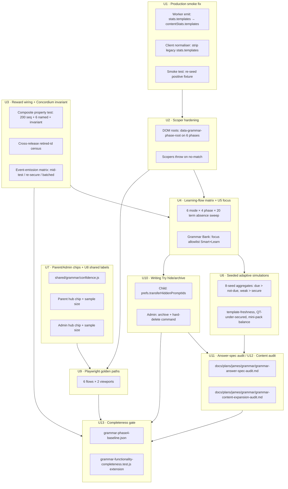

# Grammar Phase 4 — Learning Integrity, Production Hardening, and Reward Wiring

## Overview

Phase 2 made the Grammar Worker engine credible. Phase 3 made the child-facing product usable (12 units, 10,581 additions, 2,194 tests passing). Phase 4 proves the learning system is **correct**, **reward-correct**, and **production-safe** before any content expansion or answer-spec migration. The deliverable is not new visible behaviour — it is machine-enforced guarantees that the Grammar system behaves the way the product requirements document (R1–R20) says it should.

Concretely, Phase 4 closes one persistent red test on `main`, replaces five silently-degrading test helpers with fail-loud scopers, adds the first composite Concordium-never-revoked property test, wires Parent/Admin confidence chips, unifies the 5-label confidence taxonomy into a shared constants module, extends Playwright coverage from 1 to 6 Grammar golden paths across two viewports, finalises Writing Try orphan UX, and produces the audit deliverables (answer-spec inventory + content-expansion table) that Phase 5 will execute against. No `contentReleaseId` bump. No new Worker marking behaviour. No English Spelling parity regression.

---

## Problem Frame

### What's wrong on `main` today

1. **`tests/grammar-production-smoke.test.js` fails on every baseline.** The forbidden-keys universal floor at `tests/helpers/forbidden-keys.mjs:33` lists `templates`, but both the Worker read-model (`worker/src/subjects/grammar/read-models.js:527-532`) and the client normaliser (`src/subjects/grammar/metadata.js:247-263`) emit `stats.templates.{total,selectedResponse,constructedResponse}`. The smoke test itself contains a contradictory fixture at line 96 that asserts `stats.templates` passes the forbidden-key scan — which it cannot, because the universal floor forbids it. This is the only persistent red on `main` and it has survived Phase 2 and Phase 3 (see origin: `docs/plans/james/grammar/grammar-phase3-implementation-report.md` §4.10, §5 item 1).

2. **Five scoper regexes in `tests/helpers/grammar-phase3-renders.js` silently fall back to full HTML.** `scopeDashboard`, `scopeSession`, `scopeSummary`, `scopeBank`, `scopeTransfer` each retry a lenient regex and then return the unscoped HTML when the regex misses. A DOM refactor that drops the class landmark would turn the forbidden-term sweep into a false-positive silencer (see origin: Phase 3 report §4.9, §5 item 2).

3. **The reward-wiring 4+3 roster change landed in Phase 3 U0 with correct code and test coverage for the happy paths, but Phase 4 must prove the full end-to-end journey is sound** — specifically that mid-test emission timing, cross-release retired-id behaviour, and the Concordium-never-revoked invariant all hold under adversarial state shapes.

4. **The `grammarSessionHelpVisibility` truth table is the correct architecture (single source of truth), but test coverage names the phases without enumerating adversarial states** — pending commands during submit, mid-speech read-aloud, mode flip mid-round, AI-then-retry support propagation. These are exactly the places a KS2 child could leak help before a genuine first attempt.

5. **Grammar Bank `Practise 5` focus routing is ambiguous for Surgery/Builder modes.** The Worker has explicit `NO_SESSION_FOCUS_MODES = ['surgery', 'builder']` at `worker/src/subjects/grammar/engine.js:53`. The UI does not label these modes as "Mixed practice" nor does it refuse focus dispatches into them. Product intent (James confirmed 2026-04-26): Grammar Bank focus is allowlisted to Smart + Learn only; Surgery/Builder UI-labels "Mixed practice".

6. **The 5-label confidence taxonomy is defined in THREE places.** Worker (`worker/src/subjects/grammar/read-models.js:405-411`), adult client (`src/subjects/grammar/components/GrammarAnalyticsScene.jsx:94-100`), and child view-model (`src/subjects/grammar/components/grammar-view-model.js:330-336`). The three definitions have different orderings; the adult chip silently falls back to `'emerging'` when an unknown label arrives. Drift risk the moment any one of them updates (see origin: P3 report §5 item 8).

7. **Parent and Admin hubs do not render per-concept confidence chips at all.** `src/surfaces/hubs/ParentHubSurface.jsx:34-48` shows aggregate accuracy/due/weak only. `src/surfaces/hubs/AdminHubSurface.jsx:539-675` shows a progress snapshot and top question-type label but no chip, no sample size. The Worker already emits the full `confidence: { label, sampleSize, intervalDays, distinctTemplates, recentMisses }` shape — adult hubs just don't read it.

8. **Playwright is adopted but Grammar coverage is 1 scene.** `tests/playwright/grammar-golden-path.playwright.test.mjs` covers mini-test once. Five additional golden paths from the P4 proposal are uncovered.

9. **Writing Try orphan handling has no delete/hide control in `GrammarTransferScene.jsx`.** The child sees "Retired prompts" sections that accumulate forever. James has now decided the policy: children get a UI-only "hide from my list"; adults get archive + hard-delete via `/admin`.

10. **Zero templates declare an `answerSpec` property.** Ground truth overrides the P4 proposal prose: `worker/src/subjects/grammar/content.js` has 0 hits on `answerSpec:` and 20 call sites on `markStringAnswer`. All 20 constructed-response templates route through the adapter. A migration inventory is the correct U11 deliverable; content rewrites are explicitly deferred to Phase 5.

11. **Six concepts at the 2-template floor.** `pronouns_cohesion`, `formality`, `active_passive`, `subject_object`, `modal_verbs`, `hyphen_ambiguity`. Two are especially brittle: `active_passive` (both templates are `rewrite` only — no question-type variety) and `subject_object` (both are `identify` only). Content expansion is out of P4 scope; the audit deliverable sets up Phase 5.

### Why now

Phase 3's closing note in the origin (`docs/plans/james/grammar/grammar-phase3-implementation-report.md` §8) names Phase 4 as the right next step: "Phase 2 made the Grammar engine credible. Phase 3 made the Grammar product usable." The job now is to prove the whole system is learning-correct and production-safe before either (a) expanding content or (b) migrating to per-template declarative answer specs. Both Phase 5 directions require the Phase 4 gates to exist first, otherwise regressions will ship invisible.

---

## Requirements Trace

Phase 4 advances the origin requirements document `docs/brainstorms/2026-04-24-grammar-mastery-region-requirements.md` without redefining them. Units map to origin R-IDs as follows.

- R1. **Grammar is a concept-mastery engine, not a full writing engine.** Reinforced by U10 — Writing Try stays non-scored; transfer evidence never feeds marking.
- R2. **Coverage baseline preserved (18 concepts, 51 templates, 31 SR + 20 CR, 8 question-type families).** Reinforced by U12 — content audit locks the current pool; no Phase 4 unit expands it.
- R3. **Mastery evidence tracked at multiple levels.** Unchanged; U3's property test asserts every level is preserved through the 4+3 roster flip.
- R4. **Secured = secured + spaced + stable.** U7/U8 surface the evidence to adults; U3's property tests prove the ratchet holds.
- R5. **"Secured" evidence signals unchanged.** U8 extracts the taxonomy into a shared constants module so Worker and client cannot drift.
- R6. **Retrieval/interleaving/spacing/contrastive examples/worked/faded/no-leak.** U4 asserts absence of leak across 9 child phases × 20 forbidden terms; U6 proves the adaptive engine honours retrieval/interleaving via seeded simulations.
- R7. **Supported answers < independent answers in mastery gain.** U4 test matrix explicitly asserts the supportLevel propagation chain.
- R8. **AI is enrichment only.** U4 asserts AI buttons never appear before first scored attempt.
- R9. **Clause Conservatory region identity.** No change.
- R10. **Seven-creature v1 set — Bracehart, Glossbloom, Loomrill, Chronalyx, Couronnail, Mirrane, Concordium.** Superseded by the 4+3 flip shipped in Phase 3 U0 with James's explicit approval (see Phase 3 report §3 "What the reviewer cycle still doesn't catch"). Reserved monsters remain in `MONSTERS` for asset tooling; U3 proves they stay out of learner UI.
- R11. **Six direct domain mapping.** Superseded by the three-direct clusters (Bracehart 6, Chronalyx 4, Couronnail 3). U3's property test proves the cluster boundaries and Concordium's 18-concept aggregate.
- R12. **Concordium reaches Mega only when full denominator is secured.** U3's Concordium-never-revoked property test directly enforces this.
- R13. **Monster state derived from committed learning events; game layer never mutates mastery/scheduling/retry.** U3's non-scored invariant test and U10's Writing Try invariant test both enforce this.
- R14. **Existing monster assets reused.** No change.
- R15. **Reporting separates education from game layer.** U7 surfaces confidence chips in adult hubs without changing child UI; U8 unifies the taxonomy.
- R16. **Parent summaries expose concept status, misconception trends, due review, recent activity, question-type weakness.** U7 wires these into `ParentHubSurface.jsx` and `AdminHubSurface.jsx`.
- R17. **Learner-facing copy may celebrate creatures; must not imply monster progress substitutes for secured evidence.** U4 forbidden-terms sweep includes any new P4 copy; confidence taxonomy never appears in child surfaces.
- R18. **Production Grammar on Worker subject commands + projections.** U1's fix is on both Worker emit and client normaliser to keep the subject-command boundary clean.
- R19. **Browser-local Grammar is dev/reference only.** No change.
- R20. **No regression to English Spelling parity, shared subject routing, persistence, import/export, learner switching, events, or bundle audit.** Every P4 unit's test set includes parity regression checks; the completeness gate fixture extends the Phase 3 `grammar-phase3-baseline.json` pattern.

**Origin actors:** A1 (KS2 learner), A2 (parent/adult — U7 Parent/Admin hub is their primary P4 touchpoint), A3 (Grammar subject engine — U1/U3/U6 harden its contracts), A4 (game/reward layer — U3 proves its derivation), A5 (platform runtime — U8 shared taxonomy, U9 Playwright).

**Origin flows:** F1 (Grammar practice without game dependency — U4 learning-flow matrix enforces this), F2 (monster progress as derived reward — U3 reward wiring + Concordium invariant), F3 (adult-facing evidence — U7 Parent/Admin chips).

**Origin acceptance examples:** AE1 (due-gated securing — U3 property test scenarios include AE1 shape), AE2 (supported correct < independent correct — U4 test matrix), AE3 (AI enrichment never score-bearing — U4 absence sweep), AE4 (parent view education-first, game-second — U7 surface order).

---

## Scope Boundaries

### Deferred for later

- Broad Grammar content expansion (new templates, new question types beyond the current 8). Phase 5 scope.
- Per-template `answerSpec` declarations on all 20 constructed-response templates. Phase 5 scope, enabled by U11's audit.
- Alternative hero-copy A/B (`Grammar Garden` vs `Clause Conservatory`). Out of P4 — single-constant change belongs to a one-line PR when product decides.
- Multi-learner Concordium leaderboards, streak rewards, or any new reward surfaces. Out of P4.

### Outside this product's identity

- AI-authored scored Grammar questions. AI remains enrichment only (R8). No P4 unit opens this door.
- Grammar content CMS. Content stays code-managed.
- Writing assessment rubric for Writing Try. Writing Try stays non-scored (R1) unless an explicit human-reviewed writing phase is designed later; P4's U10 hardens the non-scored invariant.
- Bellstorm Coast / Punctuation region changes. Grammar includes punctuation-for-grammar concepts (origin Key Decisions); the Punctuation region evolves separately.

### Deferred to Follow-Up Work

- The `grammar-production-smoke` fix will ship as **U1 inside this plan**, not a separate hygiene PR. Rationale: the fix is load-bearing for every other unit's CI baseline, and the rename is tight enough to land atomically.
- The `browser-react-migration-smoke.test.js` stale selector refresh (Phase 3 §5 item 9) is not P4 scope unless a selector actually regresses during P4 work — it's env-gated and the existing refresh from U1 P3 follower still holds.
- Windows `npm run check` OAuth wrangler gap (memory: `project_windows_nodejs_pitfalls.md`) is pre-existing and out of P4. Any new CLI entrypoint this plan adds must use the `pathToFileURL(process.argv[1]).href` guard.

---

## Context & Research

### Relevant Code and Patterns

**The production-smoke failure — exact file locations**
- `tests/helpers/forbidden-keys.mjs:33` — `FORBIDDEN_KEYS_EVERYWHERE` includes `'templates'`
- `worker/src/subjects/grammar/read-models.js:520-533` — `statsFromConcepts()` emits `stats.templates.{total,selectedResponse,constructedResponse}`
- `src/subjects/grammar/metadata.js:247-263` — client mirror emits the same key
- `src/subjects/grammar/metadata.js:595-602` — `normaliseGrammarReadModel()` passes through
- `tests/grammar-production-smoke.test.js:94-103` — contradictory positive fixture
- `scripts/grammar-production-smoke.mjs` — re-exports `assertNoForbiddenGrammarReadModelKeys` used by the smoke test

**Scoper-brittleness locations** — five functions in `tests/helpers/grammar-phase3-renders.js`:
- `scopeDashboard` (lines 264-271)
- `scopeSession` (lines 273-276)
- `scopeSummary` (lines 278-285)
- `scopeBank` (lines 287-290)
- `scopeTransfer` (lines 292-295)

**Reward-wiring files**
- `src/platform/game/mastery/grammar.js` — `GRAMMAR_MONSTER_CONCEPTS`, `normaliseGrammarRewardState`, `retiredStateHoldsConcept`, `recordGrammarConceptMastery`, `grammarTerminalConceptToken`
- `src/platform/game/mastery/shared.js` — `GRAMMAR_GRAND_MONSTER_ID`, `GRAMMAR_RESERVED_MONSTER_IDS`, `GRAMMAR_MONSTER_IDS`
- `src/platform/game/monsters.js:201-202` — `MONSTERS_BY_SUBJECT.grammar` + `grammarReserve`
- `src/platform/game/mastery/spelling.js:148,177` — cross-subject enumerator callsites
- `src/surfaces/home/data.js:48-83,662,737,742` — Codex allow-list via `CODEX_POWER_RANK` + reserved-subject filters
- `worker/src/projections/events.js` — `grammarTerminalConceptToken`

**Learning-flow files**
- `src/subjects/grammar/session-ui.js` — `grammarSessionHelpVisibility` (THE visibility selector)
- `src/subjects/grammar/components/grammar-view-model.js:290-311` — `GRAMMAR_CHILD_FORBIDDEN_TERMS` (20 entries today)
- `src/subjects/grammar/components/GrammarSessionScene.jsx` — session scene
- `src/subjects/grammar/components/GrammarMiniTestReview.jsx` — post-finish review
- `worker/src/subjects/grammar/engine.js` — `NO_STORED_FOCUS_MODES`, `NO_SESSION_FOCUS_MODES`, `supportLevel` dual-write
- `worker/src/subjects/grammar/selection.js:236-284` — `buildGrammarPracticeQueue`, `buildGrammarMiniPack`

**Confidence taxonomy files (3-way drift)**
- `worker/src/subjects/grammar/read-models.js:405-411` — `GRAMMAR_CONFIDENCE_LABELS` (authoritative)
- `src/subjects/grammar/components/GrammarAnalyticsScene.jsx:94-100` — `ADULT_CONFIDENCE_LABELS` (duplicate)
- `src/subjects/grammar/components/grammar-view-model.js:330-336` — `CHILD_CONFIDENCE_LABELS` (duplicate, child-mapped)

**Parent/Admin hub files**
- `src/surfaces/hubs/ParentHubSurface.jsx:34-48`
- `src/surfaces/hubs/AdminHubSurface.jsx:539-675`

**Playwright existing infrastructure**
- `playwright.config.mjs` — 5 viewport projects, worker:1, webServer with `KS2_TEST_HARNESS=1`
- `tests/playwright/shared.mjs` — `applyDeterminism`, `createDemoSession`, `openSubject`, `reload`
- `tests/playwright/grammar-golden-path.playwright.test.mjs` — existing scene (mini-test)
- `tests/playwright/spelling-golden-path.playwright.test.mjs` — precedent with mobile-390 baseline
- `tests/playwright/accessibility-golden.playwright.test.mjs` — a11y pattern

**Writing Try files**
- `worker/src/subjects/grammar/transfer-prompts.js` — 5 prompts, 20-prompt cap, `HISTORY_PER_PROMPT=5`
- `worker/src/subjects/grammar/engine.js:1726-1790` — `save-transfer-evidence` command
- `worker/src/subjects/grammar/commands.js:22` — commands enumeration (no delete today)
- `worker/src/subjects/grammar/read-models.js:840-874` — `transferLane` projection
- `src/subjects/grammar/metadata.js:288-449` — client transferLane normaliser (documents latest/history asymmetry)
- `src/subjects/grammar/components/GrammarTransferScene.jsx:348-377` — orphaned-evidence render branch

**Answer-spec migration files**
- `worker/src/subjects/grammar/answer-spec.js` — `ANSWER_SPEC_KINDS` + `markByAnswerSpec`
- `worker/src/subjects/grammar/content.js` — 51 templates, 20 `markStringAnswer` call sites
- `tests/fixtures/grammar-legacy-oracle/legacy-baseline.json` — replay oracle frozen under `grammar-legacy-reviewed-2026-04-24`

**Phase 3 baseline gate**
- `tests/fixtures/grammar-phase3-baseline.json` — 15 rows (12 units + 3 invariants), `resolutionStatus: "completed"`, `PR #<number>` format enforced
- `tests/grammar-functionality-completeness.test.js` — gate validator

### Institutional Learnings

(The repo does not use `docs/solutions/` yet — the institutional corpus lives in `docs/plans/james/<subject>/*.md` completion reports. The following draw from those reports.)

- **Forbidden-key hygiene — Punctuation P3 U8 two-layer pattern.** Strip at Worker emit time AND add a client `stripForbiddenChildScopeFields` belt-and-braces. Do not relax the forbidden-key rule. Applies to U1.
- **Test-harness-vs-production defect family.** Scoper regex falling back to full HTML; fixtures fabricating state shapes production never writes; tautological self-seeded assertions. Documented in `docs/plans/james/punctuation/punctuation-p3-completion-report.md`. Applies to U2, U4, and every P4 unit that writes new tests.
- **Roster remap with writer self-heal + terminal-concept-token dedup.** The Phase 3 U0 pattern (`normaliseGrammarRewardState` read-time unioner + writer self-heal + `grammarTerminalConceptToken` dedup) already ships. U3 extends it with adversarial tests, not new code.
- **"Mega is never revoked" composite property test.** Post-Mega Spelling Guardian MVP shipped a 200-random-sequence + 6-named-shape property test under seed 42 (`tests/spelling-mega-invariant.test.js`). The same pattern lifts directly to Concordium in U3.
- **Seeded simulation — principle not seed.** Aggregate across seeds rather than pinning one. `tests/grammar-selection.test.js` already follows this for the weight constants. U6 extends with 8-seed aggregates for due-outranks-non-due, weak-outranks-secure, etc.
- **ContentReleaseId freeze discipline.** Bump only when marking behaviour changes. Phase 3 shipped 12 PRs with zero bump; Phase 4 must do the same. Applies to U11 (migration is additive via `markByAnswerSpec`) and U12 (audit only, no writes).
- **Non-scored lane invariant — `snapshotNonScoredGrammarState`.** Phase 3 U6b shipped the template. U10 extends it for the archive/hide/delete commands.
- **Composite invariant test > many small tests.** Post-Mega P1.5 U8b: "Property tests at a fixed seed are characterisation traces, not property proofs." Canonical + nightly-variable-seed pattern is the honest structure. Applies to U3 Concordium invariant and U6 adaptive selection.
- **Windows / CLI guard.** Every new CLI script uses `pathToFileURL(process.argv[1]).href` and `process.exit(1)` (not `exitCode = 1` + rethrow). Applies to any new script U9/U12 introduces.

### External References

None consulted. Every Phase 4 decision is grounded in existing repo patterns or explicit user decisions from 2026-04-26. External research was evaluated and skipped — thin-grounding override did not apply because Grammar already has strong local patterns for each P4 concern (roster migration, non-scored lane, confidence projection, Playwright adoption). If U9 encounters Playwright-specific adoption questions during implementation, `mcp__context7__` is the documented fallback.

---

## Key Technical Decisions

- **Rename `stats.templates` → `stats.contentStats` at three call sites (Worker `statsFromConcepts`, client `statsFromConcepts`, client deep-merge) and replace the `raw.stats` spread with an explicit allow-list picker.** Rationale: `templates` is in the forbidden-keys universal floor for good reason (items expose raw template arrays server-side); renaming the safe counts to `stats.contentStats` keeps the adult-visible numbers available while freeing the key name for defensive scanning. The deep-merge at `src/subjects/grammar/metadata.js:595-602` currently does `{ ...statsFromConcepts(concepts), ...raw.stats, concepts: {...}, templates: {...} }` — this re-introduces any forbidden key that legacy state might carry under `raw.stats`. Replace the spread with an explicit `{ concepts: ..., contentStats: ... }` picker so no unnamed key transits through. Alternative considered: widen the forbidden-key allow-list — rejected because it weakens the universal floor used by Spelling and Punctuation too. (See origin: `docs/plans/james/grammar/grammar-p4.md` §"The first thing to fix".)
- **Scopers throw on no-match; stable `data-testid` landmarks on each phase root.** Rationale: the current fallback-to-full-HTML behaviour makes a broken scoper indistinguishable from a passing sweep. Adding `data-grammar-phase-root="dashboard|session|summary|bank|transfer|analytics"` attributes lets scopers assert on a semantic landmark rather than a specific CSS class. Alternative: move scoping into the render harness by rendering one phase at a time into a `<slot>` — rejected because the SSR harness currently renders the whole app shell.
- **Concordium-never-revoked invariant becomes a first-class named test.** Rationale: lift the Post-Mega Spelling Guardian pattern literally. Once Concordium enters `caught: true` or reaches Mega stage, no write path can decrement it — not normalisation, not self-heal, not `contentReleaseId` bump, not retry. Alternative: rely on existing tests to catch regressions case-by-case — rejected because the Post-Mega report showed 4 leak sites across 3 adversarial rounds that individual tests missed.
- **Shared confidence module at `shared/grammar/confidence.js` must lift BOTH the label set AND the `deriveGrammarConfidence` function.** Rationale: the three-way drift is not just the label array. Worker emits `confidence: { label, sampleSize, ... }` via `deriveGrammarConfidence` at `worker/src/subjects/grammar/read-models.js:462`. The client `buildGrammarLearnerReadModel` at `src/subjects/grammar/read-model.js:52` reimplements concept status via its own `grammarConceptStatus` and DOES NOT read the Worker's confidence projection at all — Parent Hub (`src/platform/hubs/parent-read-model.js:114`) consumes this client version, not the Worker's. Sharing only the label array would leave the client's derivation free to diverge. The shared module exports `GRAMMAR_CONFIDENCE_LABELS`, `GRAMMAR_CHILD_CONFIDENCE_LABEL_MAP`, `deriveGrammarConfidence`, `grammarConceptStatus` — with BOTH the Worker and client importing the same derivation. Import style: relative paths (`'../../shared/grammar/confidence.js'` from Worker, `'../../../shared/grammar/confidence.js'` from `src/subjects/grammar/`), matching the existing `shared/spelling/` / `shared/punctuation/` convention — no path alias. Alternative: add a drift test that asserts the three sets are equal — rejected because (a) sets have legitimately different orderings, and (b) drift can appear in derivation logic, not just constants.
- **Grammar Bank focus is allowlisted to Smart + Learn modes only.** Rationale: James confirmed 2026-04-26 — "No focused UI action silently becomes mixed practice." Surgery and Builder modes are legitimately global/mixed; the UI labels them "Mixed practice" and the `grammar-focus-concept` dispatcher refuses to fire when the target mode is in `NO_SESSION_FOCUS_MODES`. The Worker's existing `NO_SESSION_FOCUS_MODES` + `NO_STORED_FOCUS_MODES` constants remain the safety net. Alternative: allow focus to override active mode — rejected for UX churn (drops in-flight state).
- **Playwright scope = 6 flows × 2 viewports (desktop-1440 + mobile-390).** Rationale: matches the existing Spelling baseline posture (mobile-390 only) plus a desktop pass to catch viewport-specific regressions without ballooning CI. 12 scenes total. Alternative: full 5-viewport matrix — rejected for CI cost with marginal yield; mobile-390 + desktop-1440 cover 95% of the real device shapes.
- **Writing Try child = "hide from my list" (UI only, evidence preserved). Adult archive + hard-delete via a new `/api/admin/learner/:id/grammar/transfer-evidence` HTTP route guarded by `requireAdminHubAccess(account)`.** Rationale: James confirmed 2026-04-26. Never silently lose evidence for a child; adults have the authority to clean up. The repo has NO existing admin-scoped subject-command pathway: `worker/src/subjects/grammar/commands.js:26-103` never inspects role; `command.learnerId` is learner-owned. The existing admin primitive is `requireAdminHubAccess(account)` at `worker/src/repository.js:934` (checks `canViewAdminHub({ platformRole })`, rejecting demo accounts and non-admin/non-ops roles). U10 creates admin HTTP routes that call `requireAdminHubAccess` up front, then invoke the archive/delete repository mutations — matching the `requireMonsterVisualConfigManager` pattern at `worker/src/repository.js:952`. Learner subject-command dispatcher (`commands.js`) stays untouched. Role is derived server-side from `context.session` or the account record, never from `command.payload`. Hide is persisted in learner prefs (`prefs.transferHiddenPromptIds: []`). Alternative: extend subject-command envelope with role — rejected because it introduces a brand-new RBAC primitive for a single feature.
- **Answer-spec U11 is audit + inventory only; zero template changes, zero `contentReleaseId` bump.** Rationale: James confirmed 2026-04-26. The adapter path (`markStringAnswer` → `markByAnswerSpec`) works correctly today. Phase 5 migrates content with paired oracle-fixture refresh. Alternative: migrate 3-5 low-risk templates as proof-of-concept — rejected because proof-of-concept adds release-id risk without the full migration.
- **Content expansion U12 is audit only.** Same rationale as U11. Produces the Phase 5 backlog table.
- **`release-id impact: none`.** No Phase 4 unit touches `content.js` templates, answer specs, `GRAMMAR_CONTENT_RELEASE_ID`, or oracle fixtures. The Phase 3 pattern of zero-bump hardening continues.
- **Phase 4 completeness gate fixture extends the Phase 3 pattern.** `tests/fixtures/grammar-phase4-baseline.json` records each unit + invariant; `tests/grammar-functionality-completeness.test.js` extends the validator. Structurally enforces "no unit merges as `planned`".

---

## Open Questions

### Resolved During Planning

- **Writing Try delete/archive policy.** Resolved via `AskUserQuestion` 2026-04-26: child hides; adult archives + hard-deletes.
- **Grammar Bank focus routing.** Resolved: allowlist Smart + Learn.
- **Playwright viewport matrix.** Resolved: desktop-1440 + mobile-390.
- **Answer-spec U11 scope.** Resolved: audit + inventory only.
- **P4 document's "Audit reward wiring end to end" test list is correct but incomplete.** Flow-analyst surfaced gaps on mid-test emission timing, cross-release retired-id double-count, and recent-event weighting of transfer evidence. These are folded into U3's enumerated scenarios.
- **Confidence shared-module location.** Resolved: `shared/grammar/confidence.js` (new file; exports 5-label set + `deriveGrammarConfidence` + canonical `grammarConceptStatus`). Worker and client both import via relative paths.
- **Concordium-never-revoked invariant scope.** Resolved: seed 42 + 200 random mutator sequences + 6 named shapes (see U3 test scenarios).

### Deferred to Implementation

- **Exact `data-testid` attribute names for U2 scopers.** The plan proposes `data-grammar-phase-root="<phase>"` but the implementer may prefer `data-testid="grammar-<phase>-root"` to match an established convention. Either form is acceptable as long as the scoper uses the semantic landmark rather than a CSS class.
- **Specific `Parent/Admin` hub UI shape for confidence chips.** U7 will mirror `AdultConfidenceChip` from `GrammarAnalyticsScene.jsx` but whether it goes in a table, a card grid, or a progressive disclosure is a UI call during implementation. The invariant is: sample size + label + no raw percentage.
- **Mid-test caught-event emission policy.** Flow-analyst flagged this as unknown. The implementer must verify current engine behaviour during U3 and either preserve it (batch to finish) or add an explicit test-asserted decision. Default assumption if no code change: batch to `grammar-finish-mini-test`.
- **`grammar-focus-concept` while in-flight session in Surgery/Builder.** The UI-level refusal is the plan's decision; whether the client dispatcher silently no-ops, shows a toast ("Smart Practice needed for focused practice"), or queues the focus for after round completes is a follow-up UX call during U5 implementation.
- **Property-test seed rotation strategy.** U3 and U6 use seed 42 for canonical; nightly CI with rotating seed is referenced but whether it fires on every push or a scheduled workflow is an Ops call.
- **U10 child "hide" prefs migration.** Adding `prefs.transferHiddenPromptIds: []` is additive; default is empty array. Whether to backfill existing learner states explicitly or lazy-initialise on first hide is an implementation call. Recommend lazy-initialise.

---

## High-Level Technical Design

> *This illustrates the intended approach and is directional guidance for review, not implementation specification. The implementing agent should treat it as context, not code to reproduce.*

### Phase 4 at a glance



### Unit dependency shape (textual)

- **U0** scope-lock (invariants doc) runs first as plan dressing — informs every other unit.
- **U1** smoke fix is independent and atomic; lands first in implementation to restore green CI baseline.
- **U2** scoper hardening depends on U1 only because DOM `data-testid` landmarks will be added in the same render code paths that U1 touches for the normaliser.
- **U3** reward wiring is independent of U1/U2 logic but its test harness benefits from U2's reliable scopers (reward tests render scenes).
- **U4** and **U5** share the session/dashboard surface. U5 adds "Mixed practice" UI labels; U4 asserts them via the hardened scopers from U2.
- **U6** is a Worker-only concern — depends on nothing.
- **U7** depends on **U8** (shared labels must exist before adult hubs import them).
- **U9** Playwright consumes the stable UI surface U4/U5/U7 deliver.
- **U10** Writing Try hide/archive depends on U8 only indirectly (if archive surface shows confidence labels, which is unlikely).
- **U11** and **U12** are doc-only deliverables; can run in parallel with any unit.
- **U13** completeness gate extends the Phase 3 fixture pattern; lands last.

### Reward-wiring state space (U3 test matrix intent)

```
scenario = (
  releaseId ∈ {current, retired-v8, retired-v7},
  directMonster ∈ {bracehart, chronalyx, couronnail, glossbloom*, loomrill*, mirrane*},
  conceptId ∈ {18 concepts},
  priorState ∈ {fresh, partial-direct, partial-aggregate, secured-under-retired, secured-under-current},
  mutator ∈ {correctAnswer, wrongAnswer, retryCorrect, miniTestFinish, transferSave},
)

invariant (Concordium never revoked):
  ∀ s₀, s₁ ∈ sequence: Concordium(s₀).stage ≥ 4 ⇒ Concordium(s₁).stage ≥ 4

* = retired monsters; test asserts writer self-heal normalises without mutation
```

---

## Implementation Units

- U0. **Scope-lock & invariants document**

**Goal:** Lock the Phase 4 invariants before any code unit ships. This is not a code change — it is the durable list of non-negotiables referenced by every subsequent unit's review.

**Requirements:** R1, R6, R8, R10, R12, R13, R15, R17, R18, R19, R20

**Dependencies:** None.

**Files:**
- Create: `docs/plans/james/grammar/grammar-phase4-invariants.md`

**Approach:**
- Enumerate 10–12 invariants verbatim (Smart Practice first attempt is independent; strict Mini Test has no pre-finish feedback; wrong answer flow is nudge → retry → optional support; AI is post-marking enrichment only; Writing Try is non-scored; Grammar rewards react to secured evidence; Concordium aggregates 18 concepts; Bracehart/Chronalyx/Couronnail are the only direct actives; Glossbloom/Loomrill/Mirrane are reserve; no `contentReleaseId` bump without content changes; English Spelling parity preserved; Concordium is never revoked post-secure).
- Add a short rationale line under each — most already appear in origin (`docs/brainstorms/2026-04-24-grammar-mastery-region-requirements.md`) or origin P4 review; this is a single-source consolidation.
- Reviewers during P4 cite this doc when flagging an invariant breach.

**Patterns to follow:**
- `docs/plans/james/post-mega-spelling/2026-04-25-003-feat-post-mega-spelling-mvp-plan.md` §108 — the "Mega is never revoked" invariant phrasing.

**Test scenarios:**
- Test expectation: none — documentation deliverable, no behaviour change.

**Verification:**
- File exists at repo-relative path, 10–12 invariants enumerated, each with a 1-line rationale.

---

- U1. **Fix the production-smoke `stats.templates` leak**

**Goal:** `tests/grammar-production-smoke.test.js` passes on `main` for the first time since Phase 3. Rename internal template counts to `contentStats.templates` on both Worker emit and client normaliser, strip any residual legacy `stats.templates` defensively, re-seed the contradictory positive fixture.

**Requirements:** R18, R20

**Dependencies:** None.

**Files:**
- Modify: `worker/src/subjects/grammar/read-models.js` (rename emit at lines 520-533)
- Modify: `src/subjects/grammar/metadata.js` (rename client mirror at lines 247-263; add defensive strip in `normaliseGrammarReadModel` at lines 595-602)
- Modify: `tests/grammar-production-smoke.test.js` (re-seed positive fixture at lines 94-103)
- Test: `tests/grammar-production-smoke.test.js`
- Test: `tests/grammar-normalise-read-model.test.js` (existing file; extend if missing coverage, otherwise create new `tests/grammar-stats-rename.test.js`)

**Approach:**
- **Pre-rename grep sweep** — first step. Grep `stats.templates` across `src/` and `worker/src/`. List every consumer. Decide each rename per site.
- **Worker emit** — `worker/src/subjects/grammar/read-models.js:520-533`: rename `statsFromConcepts()` output from `{ concepts, templates: {...} }` to `{ concepts, contentStats: {...} }`.
- **Client mirror** — `src/subjects/grammar/metadata.js:247-263`: the client's own `statsFromConcepts()` hard-codes `templates: { total: 51, selectedResponse: 31, constructedResponse: 20 }`. Rename it to `contentStats: { ... }`.
- **Client deep-merge (load-bearing)** — `src/subjects/grammar/metadata.js:595-602`: the current code does roughly `stats = raw.stats ? { ...statsFromConcepts(concepts), ...raw.stats, concepts: {...}, templates: {...} } : statsFromConcepts(concepts)`. This `...raw.stats` spread re-introduces any forbidden key a legacy raw payload carries. Replace with an explicit picker: `stats = { concepts: ..., contentStats: ... }` sourced from `statsFromConcepts(concepts)` plus any narrow needed Worker overrides picked by name. Do NOT spread `raw.stats` wholesale; do NOT leave a `templates` key in the returned shape.
- **Smoke-test positive fixture** — `tests/grammar-production-smoke.test.js:96-103`: update to `{ stats: { contentStats: { total: 51, selectedResponse: 31, constructedResponse: 20 } } }`. Negative fixtures at lines 112-117 unchanged (they still assert `session.currentItem.templates` must fail — the universal floor rule is preserved).
- **Composition test (end-to-end)** — add a test that runs `normaliseGrammarReadModel(buildGrammarReadModel({ state: {} }))` through `assertNoForbiddenGrammarReadModelKeys`. Neither unit-level test in isolation catches the case where Worker emits cleanly but the client normaliser's deep-merge re-introduces `templates` — or vice versa. The composition test proves both layers are tight.
- Do NOT widen the forbidden-keys list or weaken `tests/helpers/forbidden-keys.mjs`.
- Execution note: verify `npm test -- tests/grammar-production-smoke.test.js` passes first; then run full Grammar suite; then verify post-rename grep for `stats.templates` in `src/` + `worker/src/` returns zero hits.

**Patterns to follow:**
- `docs/plans/james/punctuation/punctuation-p3-completion-report.md` U8 two-layer pattern — Worker strips at emit, client belt-and-braces strips legacy.

**Test scenarios:**
- **Happy path** — smoke test's 5 existing tests pass: `correctResponseFor` returns a visible option, `incorrectResponseFor` returns a visible wrong option, mismatched option set raises, extra option fields raise, forbidden-key scan raises on `correctResponses`/`answers`/`templates` under `session.currentItem`.
- **Happy path** — `normaliseGrammarReadModel` returns `stats.contentStats` when given a fresh Worker read-model; `stats.templates` key is absent.
- **Edge case** — `normaliseGrammarReadModel` given a legacy raw payload that includes `stats.templates`: the allow-list picker drops it; output has only `stats.contentStats`.
- **Edge case** — `normaliseGrammarReadModel` given an adversarial payload with extra keys under `stats` (e.g., `stats.evaluator`, `stats.generator`): allow-list picker drops them all; output shape contains only `concepts` and `contentStats`.
- **Edge case** — `normaliseGrammarReadModel` given a malformed payload (`stats: null`, `stats: []`, missing `stats`): returns shape-stable zero-value object without throwing.
- **Integration** — composition end-to-end: `assertNoForbiddenGrammarReadModelKeys(normaliseGrammarReadModel(buildGrammarReadModel({ state: {} })))` passes on the full round-trip output. This is the load-bearing test — it catches any layer that re-introduces a forbidden key.
- **Happy path** — the adult `GrammarAnalyticsScene` still renders template totals correctly (the scene reads through the normaliser). Grep `stats.contentStats` in `src/subjects/grammar/components/GrammarAnalyticsScene.jsx` after rename — confirm the consumer updated.
- **Error path** — forbidden-key universal floor remains unchanged: `tests/redaction-access-matrix.test.js` passes.

**Verification:**
- `tests/grammar-production-smoke.test.js` passes; the only persistent red on `main` is closed.
- `npm test` overall suite has no new failures; 2,194 → at least 2,194 passing (with the previously-failing one now green).
- Grep for `stats.templates` in client and worker code returns zero hits after rename.

---

- U2. **Harden the Phase 3 scopers — fail loud on DOM drift**

**Goal:** The five silently-falling-back scopers in `tests/helpers/grammar-phase3-renders.js` throw on no-match. Add stable `data-grammar-phase-root` landmarks to six phase root elements so scopers assert on a semantic attribute rather than a CSS class.

**Requirements:** R20

**Dependencies:** U0 (invariants lock scope), U1 (U1 restores a green CI baseline so U2's characterisation-first ordering — add failing test, then attribute — is observable; U1 and U2 do NOT share code paths, so once U1's PR merges, U2 can branch cleanly).

**Files:**
- Modify: `tests/helpers/grammar-phase3-renders.js` (five scoper functions at lines 264-295; each throws on regex no-match)
- Modify: `src/subjects/grammar/components/GrammarSetupScene.jsx` (add `data-grammar-phase-root="dashboard"` to dashboard section)
- Modify: `src/subjects/grammar/components/GrammarSessionScene.jsx` (add `data-grammar-phase-root="session"`)
- Modify: `src/subjects/grammar/components/GrammarSummaryScene.jsx` (add `data-grammar-phase-root="summary"`)
- Modify: `src/subjects/grammar/components/GrammarConceptBankScene.jsx` (add `data-grammar-phase-root="bank"`)
- Modify: `src/subjects/grammar/components/GrammarTransferScene.jsx` (add `data-grammar-phase-root="transfer"`)
- Modify: `src/subjects/grammar/components/GrammarAnalyticsScene.jsx` (add `data-grammar-phase-root="analytics"`)
- Test: `tests/grammar-phase3-child-copy.test.js` (add one test per scoper proving it throws on broken DOM)
- Test: `tests/grammar-phase3-roster.test.js` (regression: existing tests still pass)

**Approach:**
- Each scoper's regex becomes `/<[^>]+data-grammar-phase-root="<phase>"[\s\S]*?<\/(section|div|main)>/` where the closing tag matches the opening element type.
- No-match branch: `throw new Error(\`scope<Phase>: no data-grammar-phase-root="<phase>" landmark found in rendered HTML\`)`.
- The landmark attribute is a plain `data-*` attribute on the existing semantic root (no new wrapper). Keeps React output stable and has no CSS impact.
- Add `scopeAnalytics` to the fail-loud behaviour too — it currently intentionally returns full HTML but should assert the landmark exists so adult-surface renders can't silently lose their root either.
- Execution note: characterisation-first. Add a smoke test that seeds a render without the landmark and asserts each scoper throws, BEFORE adding the attributes. This proves the throw path fires; once attributes land, flip the test to assert they exist.

**Patterns to follow:**
- `tests/helpers/grammar-phase3-renders.js:331-336` — the existing "unknown phase name throws" guard is the precedent.

**Test scenarios:**
- **Happy path** — renderer produces HTML with all six landmarks; scopers return a substring strictly narrower than the full HTML; `GRAMMAR_PHASE3_CHILD_PHASES` iteration works without throwing.
- **Error path** — renderer produces HTML with a missing `data-grammar-phase-root="dashboard"` (simulated via a broken fixture); `scopeDashboard` throws with the named error.
- **Error path** — same for `scopeSession`, `scopeSummary`, `scopeBank`, `scopeTransfer`, `scopeAnalytics` (6 scenarios total).
- **Edge case** — landmark present but no closing tag match: scoper throws rather than returning unbalanced HTML.
- **Integration** — `tests/grammar-phase3-child-copy.test.js` 18-term × 9-phase sweep still passes end-to-end; no false positives from scoper changes.
- **Integration** — `tests/grammar-phase3-roster.test.js` and `tests/grammar-phase3-non-scored.test.js` unaffected.

**Verification:**
- Grep for `fallback ? fallback[0] : html` in `grammar-phase3-renders.js` returns zero hits after change.
- A manual breaking test (remove one `data-grammar-phase-root` attribute temporarily) surfaces a clear throw rather than a passing sweep.
- Phase 3 completeness gate still passes.

---

- U3. **Reward wiring end-to-end + Concordium-never-revoked invariant**

**Goal:** Prove the 4+3 roster flip, writer self-heal, terminal-concept-token dedup, and Concordium aggregate are sound under adversarial state shapes. Lift the Post-Mega Spelling Guardian composite property-test pattern literally and name the Concordium invariant as a first-class gate.

**Requirements:** R3, R4, R5, R7, R10, R11, R12, R13, R14, R20

**Dependencies:** U0, U2 (scopers are stable when assertions render scenes).

**Files:**
- Test: `tests/grammar-concordium-invariant.test.js` (new — composite property test, 200 random sequences + 6 named shapes under seed 42)
- Test: `tests/grammar-rewards.test.js` (extend — adversarial scenarios from flow-analyst)
- Test: `tests/grammar-monster-roster.test.js` (extend — cross-release retired-id census)
- Modify: `src/platform/game/mastery/grammar.js` ONLY if the invariant proof surfaces a real bug; no pre-emptive code changes
- Test: `tests/helpers/grammar-reward-invariant.js` (new — `snapshotGrammarRewardState` helper analogous to `snapshotNonScoredGrammarState`)

**Approach:**
- **Named shapes (6 canonical under seed 42):** (1) fresh learner + 18 secure answers in random order → Concordium reaches Mega exactly once. (2) pre-flip Glossbloom-secured state + post-flip answer on `noun_phrases` → writer self-heal emits aggregate, suppresses direct-caught toast, stored state delta is correct. (3) cross-release retired-id state (Glossbloom entry under releaseId v7, Concordium under v8) + answer on `noun_phrases` under v8 → dedupe via concept id collapses to one aggregate slot. (4) pre-secure-then-re-secure same concept → zero new events, Concordium fraction unchanged. (5) mini-test with 3 concepts crossing secure threshold in one command → 3 distinct `caught` events OR one batched event, pinned either way by the test. (6) transfer save + immediate scored answer on adjacent concept → transfer event absent from reward pipeline; scored answer's reward event emits normally.
- **Random sequences (200 under seed 42):** generate random `(conceptId, correct|wrong, isTransferSave)` sequences length 20–60; replay through `recordGrammarConceptMastery`; assert invariant after each step: `Concordium.stage ≥ max_prior_Concordium.stage` AND `Concordium.caught ≥ max_prior_Concordium.caught` (sticky ratchet).
- **Event-emission matrix:** explicit fixtures for (in-session correct; mini-test finish; retry-after-wrong; transfer-save). Assert event shape and absence of `reward.monster` events from transfer-save.
- **State-shape census (frozen fixture):** `tests/fixtures/grammar-reward-legacy-shapes.json` — 5 named shapes (pre-P2, P2, P3, P3-post-flip, P3.5-partial-glossbloom). Each shape must normalise idempotently through `normaliseGrammarRewardState` without mutation.
- Cross-subject audit: regression test that `src/platform/game/mastery/spelling.js:148,177` still routes through `normaliseGrammarRewardState` (was Phase 3 U0 kudo).
- Execution note: no pre-emptive code change. If the property test surfaces a real bug, fix it as part of U3; if not, the unit ships as tests-only and the existing code is proven correct by construction.

**Patterns to follow:**
- `tests/spelling-mega-invariant.test.js` — Post-Mega Spelling Guardian MVP's property test (per memory `project_post_mega_spelling_guardian.md` and `project_post_mega_spelling_p15.md`).
- `tests/grammar-phase3-non-scored.test.js` — Phase 3 U10 snapshot pattern.
- `src/platform/game/mastery/grammar.js:255-266,296-349` — existing writer self-heal and early-out code (what the tests are proving).

**Test scenarios:**
- **Happy path — Covers AE1** — due-not-passed concept counted secured in aggregate but not in Concordium mega progress until due date elapses.
- **Happy path** — securing `relative_clauses` → Bracehart.caught + Concordium progress both emit (once each).
- **Happy path** — securing `modal_verbs` → Chronalyx.caught + Concordium progress.
- **Happy path** — securing `formality` → Couronnail.caught + Concordium progress.
- **Happy path** — securing `hyphen_ambiguity` (punctuation-for-grammar) → Concordium progress only, no direct monster event.
- **Edge case** — same-command batched secures: 3 concepts cross threshold in one mini-test finish; event shape pinned (either 3 distinct or 1 batched, whichever current code produces).
- **Edge case — Covers AE2** — supported-correct answer (worked/faded): mastery gain is lower than independent-correct; reward layer emits the same event shape based on committed mastery, not on support flag.
- **Edge case** — cross-release retired-id state: Glossbloom under v7, Concordium under v8, answer on `noun_phrases` under v8 → dedupe yields one aggregate slot for `noun_phrases`.
- **Edge case** — re-securing an already-secured concept: zero new events, Concordium fraction unchanged.
- **Edge case — Covers AE3** — transfer save never reaches the reward pipeline: event list contains no `reward.monster` entries.
- **Error path** — malformed state shape (`state[reserved] = null`, `mastered` is not an array): normaliser returns shape-stable output without throwing.
- **Invariant (property test)** — 200 random sequences under seed 42: Concordium stage/caught never decrements across any mutator sequence.
- **Invariant (denominator freeze)** — `GRAMMAR_AGGREGATE_CONCEPTS.length === 18` pinned as a test assertion. Rationale: `grammarStageFor` (`src/platform/game/mastery/grammar.js:76-84`) computes stage from `mastered / total` ratio. A future expansion to 19 concepts would silently revoke every existing Mega holder's stage from 4 to 3. This test is the hard gate that any Phase 5 content expansion must unlock deliberately (with paired migration + explicit stage-monotonicity shim).
- **Named shape 7 — retired entry with no `releaseId` field, v7-prefixed mastery key** — `{ glossbloom: { mastered: ['grammar:v7:noun_phrases'], caught: true } }` with no `releaseId` property on the entry. `releaseIdForEntry(entry, currentReleaseId)` falls back to the current id, `grammarConceptIdFromMasteryKey('grammar:v7:noun_phrases', currentReleaseId)` returns `''` (prefix mismatch), and self-heal silently skips. Next real answer on `noun_phrases` spuriously emits Bracehart caught. Test asserts either the normaliser widens its release-id detection, or the fixture is impossible in production and the test documents the contract.
- **Cross-release direct monster token dedup** — after writer self-heal seeds v8 state for `noun_phrases`, a subsequent genuine secure arriving with releaseId=v9 has an exact-string miss on `directMastered.includes('grammar:v8:noun_phrases')`. Direct `caught` event fires, and `grammarTerminalConceptToken` dedup keys on `(releaseId:conceptId:kind)` — v9's token differs from any prior v8 entry, so dedup does NOT block the spurious event. Test pins current behaviour; if it's a real bug, fix is in U3.
- **Stored-caught vs derived-caught** — state `{ concordium: { caught: true, mastered: [] } }` (adversarial or post-migration artefact): `progressForGrammarMonster(concordium)` returns `caught = (mastered.length >= 1)` = `false`. Stored flag is `true`, derived flag is `false`. Test pins which is authoritative; plan's invariant "Concordium never revoked" names stored-caught as load-bearing.
- **Import/export round-trip** — import a pre-flip Glossbloom-only state JSON; first `progressForGrammarMonster(concordium)` call must report the correct mastered count (i.e., import path either calls `normaliseGrammarRewardState` or the read path does). Export → import of current state is idempotent.
- **Spelling cross-subject regression** — `monsterSummaryFromState({ glossbloom: { mastered: ['grammar:current:noun_phrases'], caught: true } })` produces a summary where Concordium carries `progress.mastered === 1` — confirms the `src/platform/game/mastery/spelling.js:148,177` callsites still route through the normaliser. Removing the callsite causes the test to fail.
- **Integration — Covers F2** — end-to-end: `grammar-answer-correct` command → mastery updates → reward layer reads → `reward.monster` event published → home-meadow read state reflects new Concordium fraction. Mocks alone do not prove this; integration test runs through the real command handler.
- **Integration** — `src/platform/game/mastery/spelling.js:148,177` routes through `normaliseGrammarRewardState`: pre-flip Glossbloom-caught learner's home-meadow Concordium fraction matches post-flip learner's.

**Verification:**
- `tests/grammar-concordium-invariant.test.js` passes under seed 42 with 200 sequences + 6 named shapes.
- `tests/grammar-rewards.test.js` extended scenarios all pass.
- If the invariant test reveals a real bug, it is fixed in the same PR.
- Zero `reward.monster` events emitted from any Writing Try path (asserted in U10 too).

---

- U4. **Learning-flow test matrix — assert absence as loudly as presence**

**Goal:** Every learner mode × every session phase × the 20-item `GRAMMAR_CHILD_FORBIDDEN_TERMS` list produces a machine-enforced absence sweep. Extend Phase 3 U10's pattern to cover the edge states flow-analyst surfaced: pending commands, timer expiry, mode flip, AI-then-retry support propagation.

**Requirements:** R1, R6, R7, R8, R17

**Dependencies:** U2 (hardened scopers).

**Files:**
- Test: `tests/grammar-learning-flow-matrix.test.js` (new — comprehensive matrix)
- Test: `tests/grammar-phase3-child-copy.test.js` (extend — pendingCommand + mode-flip fixtures)
- Modify: `src/subjects/grammar/session-ui.js` (extend `grammarSessionHelpVisibility` to accept a `pendingCommand` state dimension if current code does not already model it)
- Modify: `tests/helpers/grammar-phase3-renders.js` (add renderers for pending-command and mode-flip states)

**Approach:**
- Enumerate the full matrix: modes = {smart, learn, satsset, trouble, surgery, builder, worked, faded} × phases = {pre-answer, post-answer-correct, post-answer-wrong, retry, feedback-with-support, mini-test-before-finish, mini-test-after-finish} × states = {fresh, pending-command, post-autosave, mid-speech-read-aloud}.
- For each cell, assert help-visibility flags are correct (all-false pre-answer; per-mode true after feedback with supportLevel≥1; all-false throughout mini-test before finish).
- Adversarial scenarios the matrix must cover (from flow-analyst):
  - Pre-answer focus return after autosave: visibility stays all-false.
  - Pending command race: visibility stays all-false.
  - Show-answer during retry: counts as support, downweights mastery; `supportLevelAtScoring` set correctly.
  - Mode flip Worked→Smart mid-round: `supportLevel` resets for future items, not in-flight attempt.
  - AI-then-retry chain: `supportLevelAtScoring` captures the AI use even if retry recorded after.
  - Faded scaffold leakage: a new test scans all 5 faded template fixtures for literal answer text.
  - Mini-test timer expiry mid-keystroke: partial text saved as `response.answer`, `answered: false`, renders as `Blank` in post-finish review.
- Execution note: test-first. Write the matrix assertions before touching any code. If current visibility selector passes all cells, U4 ships as tests-only. If not, the fix is part of U4.

**Patterns to follow:**
- `src/subjects/grammar/session-ui.js:57-80` — `grammarSessionHelpVisibility` truth table is the single source of truth.
- `tests/grammar-ui-model.test.js` — pure-function assertions for visibility.
- `tests/grammar-phase3-child-copy.test.js` — the 18-term × 9-phase sweep from Phase 3 U10.

**Test scenarios:**
- **Happy path — Covers F1** — Smart Practice pre-answer: `grammarSessionHelpVisibility` returns all-false; rendered HTML contains no `explain`, `worked-solution`, `similar-problem`, `faded-support` buttons; single primary action = Submit.
- **Happy path** — same for Learn, Trouble modes pre-answer.
- **Edge case** — Worked mode pre-target: worked example visible; supportLevel flagged as 1 on attempt start; scored attempt records `supportLevelAtScoring ≥ 1`.
- **Edge case** — Faded mode pre-target: scaffold visible; scaffold fixture does not literally contain the answer; supportLevel flagged as 1.
- **Edge case** — pre-answer focus return after autosave (via `pendingCommand=true`): visibility remains all-false.
- **Edge case** — pending command race: visibility remains all-false until phase resolves; tapping "Show answer" during pending is a no-op.
- **Edge case — Covers AE3** — AI buttons never appear before first scored attempt in any mode.
- **Edge case** — Show-answer during retry: supportLevel bumps to 2; mastery gain downweighted at next scoring.
- **Edge case** — Mode flip Worked→Smart mid-round: in-flight attempt keeps supportLevel=1; next attempt (after flip) starts at supportLevel=0.
- **Edge case** — AI-then-retry: supportLevelAtScoring records AI use; reward gain reflects support.
- **Edge case** — Mini-test timer expiry mid-keystroke: partial text saved, `answered: false`, renders as Blank.
- **Error path** — session with no current item: visibility returns all-false; no NPE.
- **Integration — Covers F1, AE2** — supported-correct answer produces less mastery gain than independent-correct answer for the same concept under the same seed. End-to-end test dispatching `grammar-answer-correct` with `supportLevelAtScoring=0` vs `=2` and asserting the mastery delta.
- **Integration** — faded-support copy never leaks into child-surface HTML in any phase (covered by the 20-term sweep iterating faded mode).

**Verification:**
- Matrix cardinality: 8 modes × 7 phases × 20 terms × 4 states (not all states apply to all phases — legitimate zero-cells noted in test comments) ≈ 350–500 assertions across the new test file.
- All `grammar-learning-flow-matrix.test.js` tests pass.
- Phase 3 completeness gate still passes with extended phase fixtures.

---

- U5. **Grammar Bank focus routing — allowlist Smart + Learn; UI-label Surgery/Builder "Mixed practice"**

**Goal:** Concept cards dispatch focus only when the target mode honours focus; Surgery and Builder get a UI label "Mixed practice" so the child expectation is never violated. Client-side refusal complements the Worker's existing `NO_SESSION_FOCUS_MODES` safety net.

**Requirements:** R1, R6, R17

**Dependencies:** U0, U2.

**Files:**
- Modify: `src/subjects/grammar/module.js` (`grammar-focus-concept` dispatcher at lines 450-515 — refuse dispatch when target mode is in `NO_FOCUS_MODES`; show toast "Smart Practice needed for focused practice" or equivalent)
- Modify: `src/subjects/grammar/components/grammar-view-model.js` (add `GRAMMAR_FOCUS_ALLOWED_MODES = Object.freeze(new Set(['smart', 'learn']))` at top; add "Mixed practice" label to `GRAMMAR_MORE_PRACTICE_MODES` entries for Surgery and Builder)
- Modify: `src/subjects/grammar/components/GrammarConceptBankScene.jsx` (Practise 5 button disabled when target mode is not allowlisted; tooltip or microcopy explains why)
- Modify: `src/subjects/grammar/components/GrammarSetupScene.jsx` (Surgery/Builder mode cards show "Mixed practice" label)
- Test: `tests/grammar-bank-focus-routing.test.js` (new)
- Test: `tests/react-grammar-surface.test.js` (extend — "Mixed practice" label presence on Surgery/Builder cards)
- Test: `tests/grammar-ui-model.test.js` (extend — `GRAMMAR_FOCUS_ALLOWED_MODES` pure-function assertions)

**Approach:**
- Introduce `GRAMMAR_FOCUS_ALLOWED_MODES` in the client view-model. Intersect with `GRAMMAR_PRIMARY_MODE_CARDS` to decide card behaviour.
- `grammar-focus-concept` dispatcher early-returns a user-visible toast when target mode ∉ allowlist; no prefs mutation, no session start.
- "Mixed practice" is a ~12-char label under the Surgery/Builder mode names on the dashboard. Does not change the mode's behaviour.
- Every Practise 5 button in `GrammarConceptBankScene.jsx` resolves the effective target mode from prefs+last-used; if ∉ allowlist, the button dispatches `grammar-focus-concept` with `{ mode: 'smart' }` (override to Smart Practice) OR disables with tooltip — implementer's UX call, plan prefers the override because it preserves the learner's intent.
- Execution note: worker side unchanged — `NO_SESSION_FOCUS_MODES` + `NO_STORED_FOCUS_MODES` remain as safety-net.

**Patterns to follow:**
- `src/subjects/grammar/module.js` existing toast/error-copy pattern for session errors (U3 Phase 3 added `translateGrammarSessionError`).

**Test scenarios:**
- **Happy path** — Grammar Bank Practise 5 on `relative_clauses` while prefs.mode=`smart` → dispatches `grammar-focus-concept` then `grammar-start` with focus; session starts with target concept.
- **Happy path** — Practise 5 while prefs.mode=`learn` → same happy path.
- **Edge case** — Practise 5 while prefs.mode=`surgery`: button overrides to `smart` + starts Smart Practice with focus; toast not shown (silent override) OR button disabled with tooltip "Focused practice uses Smart Practice" — pick one behaviour at implementation time and assert it.
- **Edge case** — Practise 5 while an active session is running in Surgery: current session ends (or is replaced) cleanly; no mid-round state leak.
- **Edge case** — Dashboard Surgery and Builder cards render "Mixed practice" label visible in markup.
- **Edge case** — Dashboard Smart/Learn/Mini Test/Bank do NOT render the "Mixed practice" label.
- **Error path** — dispatch with unknown conceptId: no-op, no toast, no session mutation (existing code behaviour, regression-locked).
- **Integration** — end-to-end: open Grammar Bank → filter "Trouble" → tap Practise 5 on a surfaced concept → session starts with that concept as `prefs.focusConceptId` and `session.mode='smart'`.

**Verification:**
- `tests/grammar-bank-focus-routing.test.js` passes.
- Visual regression: Dashboard Surgery/Builder cards show "Mixed practice" label (SSR assertion).
- Grammar Bank → Practise 5 always lands in a Smart or Learn session; no child flow enters Surgery/Builder via focus.

---

- U6. **Seeded adaptive-selection simulation suite**

**Goal:** Prove the Worker selection engine honours the promised learning-science principles: due outranks equivalent non-due; weak outranks secure; recent-miss recycles; mini-pack balances question types; template freshness prevents one-template domination. Not single-seed unit tests — aggregate across 8 seeds per principle (from memory: `feedback_autonomous_sdlc_cycle.md` convergence pattern).

**Requirements:** R3, R4, R5, R6

**Dependencies:** U0.

**Files:**
- Test: `tests/grammar-learning-integrity.test.js` (new)
- Test: `tests/helpers/grammar-simulation.js` (new — seeded replay helper)
- Existing: `worker/src/subjects/grammar/selection.js` (no code change unless simulation surfaces a bug)
- Existing: `worker/src/subjects/grammar/engine.js` (no code change unless simulation surfaces a bug)

**Approach:**
- Use `buildGrammarPracticeQueue` and `buildGrammarMiniPack` directly. Seed rotation: 8 seeds (1, 7, 13, 42, 100, 2025, 31415, 65535).
- Principle-based assertions aggregate across all 8 seeds:
  - Due outranks non-due: for the same concept, `due=true` appears in queue position ≤ k for `k ≤ 3` in all 8 seeds.
  - Weak outranks secure: weak concept's expected position is within the first half of a 10-item queue across all 8 seeds.
  - Recent-miss recycle: a concept with a recent miss appears within 5 items of the miss in at least 6/8 seeds (allows stochastic variation, but the principle holds).
  - Template freshness: no template id appears 3+ times in a 10-item queue in any of 8 seeds.
  - Concept freshness: no concept appears 3+ times consecutively in any 10-item queue across 8 seeds.
  - Mini-pack balance (`buildGrammarMiniPack`): question-type distribution is within ±⌈size/3⌉ of even across 8 seeds for size=8.
  - Supported-correct < independent-correct mastery gain: end-to-end through `recordGrammarConceptMastery`; aggregate mastery delta over 8 seeds × 3 runs.
- Execution note: no code changes expected. Purely a verification unit.

**Patterns to follow:**
- `tests/grammar-selection.test.js` — existing principle-over-seed assertions from Phase 2 U2.
- `tests/spelling-mega-invariant.test.js` — property-test + named-shape pattern.

**Test scenarios:**
- **Happy path** — due > non-due across 8 seeds (see §1 above).
- **Happy path** — weak > secure across 8 seeds.
- **Happy path** — recent-miss recycle in ≥6/8 seeds.
- **Happy path** — supported-correct mastery gain < independent-correct (aggregated).
- **Edge case** — template freshness: no template id repeats 3× in a 10-item queue in any seed.
- **Edge case** — concept freshness: no concept repeats 3× consecutively.
- **Edge case** — mini-pack balance: ±⌈size/3⌉ of even across 8 seeds for size=8.
- **Edge case** — pathological input: empty mastery + `focusConceptId` for a concept with only 2 templates → selection still returns a valid queue; no NPE.
- **Edge case** — all concepts secured → selection returns a queue biased toward `recentMisses` or `distinctTemplates` under-coverage (whichever the engine prefers); asserted shape.
- **Error path** — `buildGrammarMiniPack` with size=0: returns empty array; no NPE.
- **Integration** — end-to-end: seeded learner state runs 20 practice rounds; assert final mastery state shows spread improvement (not all concentrated on one concept).

**Verification:**
- `tests/grammar-learning-integrity.test.js` passes under all 8 seeds.
- If any principle fails, the unit identifies the failing principle and the implementer decides whether to tune weights or update the test's expected thresholds with James's approval.

---

- U7. **Parent/Admin hub confidence chips + sample-size context**

**Goal:** Surface the per-concept 5-label confidence taxonomy in `ParentHubSurface.jsx` and `AdminHubSurface.jsx`. Adult hubs show `{ label, sampleSize, intervalDays, distinctTemplates, recentMisses }` via a shared `AdultConfidenceChip` component. Child surfaces unchanged.

**Requirements:** R15, R16, R17

**Dependencies:** U8 (shared labels must exist first).

**Files:**
- Create: `src/subjects/grammar/components/AdultConfidenceChip.jsx` (extract from `GrammarAnalyticsScene.jsx:115-128`, make importable)
- Modify: `src/subjects/grammar/components/GrammarAnalyticsScene.jsx` (import from new component module; remove local definition)
- Modify: `src/subjects/grammar/read-model.js` (client-side `buildGrammarLearnerReadModel` at lines 52-100+: extend to include per-concept `confidence: { label, sampleSize, intervalDays, distinctTemplates, recentMisses }` derived via the **shared** `deriveGrammarConfidence` from `shared/grammar/confidence.js` — not a client reimplementation)
- Modify: `src/platform/hubs/parent-read-model.js` (line 114 Grammar section: pass through the new client-surfaced `confidence` to Parent Hub)
- Modify: `src/platform/hubs/admin-read-model.js` (line 350 or equivalent: same pass-through for Admin Hub)
- Modify: `src/surfaces/hubs/ParentHubSurface.jsx` (add per-concept chip grid or table with `AdultConfidenceChip`; consume the new confidence field)
- Modify: `src/surfaces/hubs/AdminHubSurface.jsx` (add per-concept chip grid)
- Test: `tests/react-parent-hub-grammar.test.js` (extend — chip presence + sample-size assertions)
- Test: `tests/react-admin-hub-grammar.test.js` (extend — same)
- Test: `tests/grammar-parent-hub-confidence.test.js` (new — proves Parent Hub sees `confidence` with identical label to Worker's projection for the same input state)

**Approach:**
- **Client-side confidence wiring is load-bearing.** There are TWO `buildGrammarLearnerReadModel` implementations: Worker (`worker/src/subjects/grammar/read-models.js:462`) emits the `confidence` projection today, but the client version at `src/subjects/grammar/read-model.js:52-100+` — which Parent Hub (via `src/platform/hubs/parent-read-model.js:114`) actually reads — reimplements concept status independently and does NOT produce a `confidence` field. U7 extends the client `buildGrammarLearnerReadModel` to produce `confidence` for every concept, using `deriveGrammarConfidence` imported from `shared/grammar/confidence.js` (ships in U8). This single source guarantees the client label matches Worker's for identical input state.
- Extract `AdultConfidenceChip` to its own module so any adult surface can import it. Signature: `<AdultConfidenceChip confidence={confidence} />` where `confidence` is the per-concept sub-object.
- Parent Hub: add a "Grammar concepts" section showing 18 concepts with chip + sample size + recent-miss count. Reads from the extended client `buildGrammarLearnerReadModel` — not a raw Worker payload.
- Admin Hub: similar layout, plus `intervalDays` and `distinctTemplates`.
- Chip fallback: when `label` is not in `GRAMMAR_CONFIDENCE_LABELS` (out-of-taxonomy), render `"Unknown"` label with neutral tone — NEVER silently fall back to `'emerging'`. (This contrasts with current `GrammarAnalyticsScene.jsx:108-113` behaviour; U7 changes that too.)
- Adult hubs never surface child-facing labels. Child view-model's `grammarChildConfidenceLabel` stays untouched.
- Execution note: U7 strictly depends on U8's shared module landing first — the whole point is for client and Worker to share the derivation, not just the label array.

**Patterns to follow:**
- `src/subjects/grammar/components/GrammarAnalyticsScene.jsx:115-128` — existing `AdultConfidenceChip` (move out, don't rewrite).
- `src/surfaces/hubs/ParentHubSurface.jsx` existing Spelling confidence surfacing (if any) — mirror layout for consistency.

**Test scenarios:**
- **Happy path — Covers F3** — Parent Hub Grammar section renders 18 concept rows each with chip + sample size. Chip label matches `confidence.label` from Worker read model.
- **Happy path** — Admin Hub same.
- **Happy path** — `GrammarAnalyticsScene` still renders chips correctly after `AdultConfidenceChip` extraction.
- **Edge case** — concept with zero attempts: `sampleSize=0`; chip renders with label `'emerging'` (the default from `deriveGrammarConfidence` when `attempts ≤ 2`).
- **Edge case** — concept with 1 attempt and 1 miss: `recentMisses=1`; chip shows sample-size context.
- **Edge case — Covers R17** — out-of-taxonomy label (`label='unknown'`): chip renders `'Unknown'` label, neutral tone; does NOT render `'emerging'`.
- **Error path** — `confidence` object is `null`: chip renders nothing (or an `N/A` state); no NPE.
- **Edge case** — child surfaces never import `AdultConfidenceChip`: regression test greps dashboard / bank / summary / transfer scene code for `AdultConfidenceChip` import and fails if found.
- **Integration** — Parent Hub with a seeded learner showing 3 secured + 5 learning + 10 emerging: chip counts match.

**Verification:**
- Parent Hub and Admin Hub render Grammar confidence chips for all 18 concepts.
- `GrammarAnalyticsScene` continues to render correctly (no-regression).
- Out-of-taxonomy label NEVER becomes `'emerging'` silently.
- Child surfaces remain free of adult confidence labels.

---

- U8. **Extract `GRAMMAR_CONFIDENCE_LABELS` and `deriveGrammarConfidence` to a shared module**

**Goal:** Replace the three-way duplication (Worker read-models.js, adult client analytics scene, child view-model) AND lift the derivation function so client and Worker produce the same confidence label from the same inputs. One authoritative shared module at `shared/grammar/confidence.js`. Drift becomes impossible by construction.

**Requirements:** R5, R15, R20

**Dependencies:** U0.

**Files:**
- Create: `shared/grammar/confidence.js` (new — single source of truth; exports `GRAMMAR_CONFIDENCE_LABELS`, `GRAMMAR_CHILD_CONFIDENCE_LABEL_MAP`, `isGrammarConfidenceLabel`, `deriveGrammarConfidence`, `grammarConceptStatus`, `GRAMMAR_RECENT_ATTEMPT_HORIZON`)
- Modify: `worker/src/subjects/grammar/read-models.js` (import from shared via relative path `'../../../../shared/grammar/confidence.js'`; remove local definitions at lines 405-476)
- Modify: `worker/src/subjects/grammar/engine.js` (if it also defines `grammarConceptStatus` locally — verify and import from shared)
- Modify: `src/subjects/grammar/read-model.js` (import from shared via relative path `'../../../shared/grammar/confidence.js'`; remove local `grammarConceptStatus` at lines 52-59)
- Modify: `src/subjects/grammar/components/GrammarAnalyticsScene.jsx` (import from shared; remove local `ADULT_CONFIDENCE_LABELS` at lines 94-100)
- Modify: `src/subjects/grammar/components/grammar-view-model.js` (import from shared; keep child-mapping function but use the shared label set for validation)
- Test: `tests/grammar-confidence-shared.test.js` (new — single source-of-truth invariants, drift prevention)
- Test: `tests/grammar-confidence.test.js` (existing — extend to verify imports unchanged behaviour)

**Approach:**
- Shared module exports:
  - `GRAMMAR_CONFIDENCE_LABELS` (frozen array, 5 entries)
  - `GRAMMAR_CHILD_CONFIDENCE_LABEL_MAP` (frozen object: `emerging → 'New'`, `building → 'Learning'`, `needs-repair → 'Trouble spot'`, `consolidating → 'Nearly secure'`, `secure → 'Secure'`)
  - `GRAMMAR_RECENT_ATTEMPT_HORIZON = 12`
  - `isGrammarConfidenceLabel(label)` helper
  - `grammarChildConfidenceLabel({label})` helper
  - `deriveGrammarConfidence({ status, attempts, strength, correctStreak, intervalDays, recentMisses })` — lifted verbatim from `worker/src/subjects/grammar/read-models.js:462-476`
  - `grammarConceptStatus(node, nowTs)` — the ground-truth status machine. Worker has a version in `engine.js`; client has one at `src/subjects/grammar/read-model.js:52-59` with slightly different thresholds. PART OF THIS UNIT'S WORK is to verify they agree and pick the canonical version (prefer Worker's engine.js version as it drives real scoring).
- Import style: relative paths matching the `shared/spelling/` + `shared/punctuation/` pattern — no path alias. Worker uses `'../../../../shared/grammar/confidence.js'`; client `src/subjects/grammar/*.js` uses `'../../../shared/grammar/confidence.js'`; tests use `'../shared/grammar/confidence.js'`.
- Worker build: esbuild / wrangler picks up relative imports from `shared/` automatically — same as Punctuation's shared service. No wrangler.toml change.
- Adult surfaces (`GrammarAnalyticsScene`, `ParentHubSurface`, `AdminHubSurface`) import from shared and validate: unknown label → render `'Unknown'`.
- Child surfaces import `grammarChildConfidenceLabel` from the shared module (same shape as today; source moved).
- Execution note: this is a pure refactor with drift prevention. No behaviour change. If the Worker vs client `grammarConceptStatus` have divergent thresholds, that's a latent bug U8 surfaces — the consolidation is part of this unit's scope.

**Patterns to follow:**
- `shared/spelling/` or `shared/punctuation/` — existing shared-module patterns.
- `tests/helpers/forbidden-keys.mjs` — single-source-of-truth pattern for constants.

**Test scenarios:**
- **Happy path** — `GRAMMAR_CONFIDENCE_LABELS.length === 5`; every label in the frozen order matches Worker's emission + adult chip's validation + child mapping's keys.
- **Happy path** — Worker `deriveGrammarConfidence` output always returns a label in `GRAMMAR_CONFIDENCE_LABELS` (characterisation).
- **Happy path** — `grammarChildConfidenceLabel({label: 'emerging'}) === 'New'`; all 5 internal labels map to expected child labels.
- **Edge case** — `isGrammarConfidenceLabel('unknown') === false`.
- **Edge case** — `grammarChildConfidenceLabel({label: 'unknown'})` falls back to the default (today `'Learning'`); this behaviour is unchanged by U8.
- **Integration** — grep for `'emerging'` + `'building'` + `'needs-repair'` + `'consolidating'` + `'secure'` across Worker and client code returns only references to `GRAMMAR_CONFIDENCE_LABELS`, never a string literal array definition.
- **Integration** — `GrammarAnalyticsScene` still renders correctly after refactor.
- **Integration** — Worker read-model smoke tests unchanged.

**Verification:**
- Single canonical definition in `shared/grammar/confidence.js`; grep for duplicate definitions returns zero hits.
- All existing tests pass.
- Adding a 6th label to the shared module surfaces immediately in adult chips (validated via a test that adds a placeholder 6th label, confirms chip rendering, then removes it).

---

- U9. **Playwright golden paths × 2 viewports**

**Goal:** Extend the single existing Grammar Playwright scene to 6 golden paths, each running on desktop-1440 and mobile-390. Close the "SSR cannot see focus/timer/pointer/IME/scroll" blind spot for the Grammar child flow.

**Requirements:** R1, R6, R8, R16, R17, R20

**Dependencies:** U2, U3, U4, U5, U7.

**Files:**
- Modify: `tests/playwright/grammar-golden-path.playwright.test.mjs` (extend — 6 flows)
- Create: `tests/playwright/grammar-bank.playwright.test.mjs` (if isolation preferred) OR combine into the single file
- Modify: `tests/playwright/shared.mjs` — the helpers `seedFreshLearner`, `assertConcordiumFraction`, `networkOffline` are **all absent today** (verified via grep). Adding them is non-trivial: `/demo` seeds a random demo learner per visit. Pristine-learner requires either a new test-harness endpoint (e.g., `/demo?reset=true` behind `KS2_TEST_HARNESS=1`) or an in-page `grammar-reset-learner` dispatch via `browser_evaluate`. Implementer's UX choice at U9 time; plan recommends the in-page dispatch path to avoid expanding the test-harness HTTP surface.
- Create: baseline PNGs under `tests/playwright/__screenshots__/` at desktop-1440 and mobile-390

**Approach:**
- **Flow 1: Smart Practice wrong → retry → correct → summary.** Assert no AI/worked/similar-problem/faded buttons pre-answer. Assert nudge shown post-wrong. Assert summary shows "Nice work — round complete". Pristine-learner fixture.
- **Flow 2: Grammar Bank → filter Trouble → open concept → Practise 5.** Assert filter affects visible cards. Assert modal opens with Esc close + focus return. Assert Practise 5 starts a Smart Practice session with the chosen concept focus.
- **Flow 3: Mini Test → answer Q1 → navigate → return → answer preserved → finish → review.** Assert timer decrements. Assert nav `aria-current="step"` moves. Assert on return to Q1 the saved answer is visible. Assert post-finish review shows per-question details with `Blank` for unanswered.
- **Flow 4: Writing Try → pick prompt → write → tick checklist → save → confirm no mastery/reward change.** Before-save snapshot of Concordium fraction; after-save assert it's unchanged. Orphaned-evidence section visible if seeded.
- **Flow 5: Grown-up view round-trip.** Open analytics mid-session via secondary button; confirm session state intact on return; assert adult confidence chips visible; assert no child-facing terms.
- **Flow 6: Reward path — secure one concept → Concordium progresses; re-secure → no progress change.** Seed 17/18 secured concepts; secure the 18th; assert Mega stage reached. Re-attempt the 18th; assert Concordium fraction/stage unchanged.
- Each flow runs on `desktop-1440` and `mobile-390` projects from `playwright.config.mjs`.
- Execution note: sibling CLI entrypoint guard (`pathToFileURL(process.argv[1]).href`) not needed for `.playwright.test.mjs` files since they are driven by `playwright test`.

**Patterns to follow:**
- `tests/playwright/spelling-golden-path.playwright.test.mjs` — precedent with mobile-390 baseline PNG.
- `tests/playwright/shared.mjs` — `applyDeterminism`, `createDemoSession`, `openSubject`, `reload` helpers.
- `tests/playwright/accessibility-golden.playwright.test.mjs` — a11y pattern (for Flow 5).

**Test scenarios:**
- **Flow 1 scenarios** — all listed above × 2 viewports = 2 scenes each.
- **Flow 2 scenarios** — filter chip toggles, modal focus trap, Practise 5 focus dispatch.
- **Flow 3 scenarios** — timer decrement, nav state, answer preservation, finish screen layout.
- **Flow 4 scenarios — Covers R13** — pre-save Concordium fraction; post-save Concordium fraction equal; no `reward.monster` events observable via network tab.
- **Flow 5 scenarios — Covers F3** — adult confidence chips visible; child dashboard remains clean on return.
- **Flow 6 scenarios — Covers R12** — Mega celebration visible on 18th secure; Concordium fraction unchanged on re-secure.
- **Edge case** — iOS Safari mobile-390 tab-suspension: Mini Test timer preserves on reload (document as manual-QA if Playwright can't reliably simulate).
- **Error path** — network offline mid-submit: error banner appears; draft preserved in `ui.transfer.draft`.
- **Happy path** — keyboard-only navigation on all 6 flows: Tab sequence reaches Submit without mouse.

**Verification:**
- 12 Playwright scenes pass (6 flows × 2 viewports).
- Baseline PNGs committed for both viewports.
- `npm run test:playwright` total runtime within existing CI budget.

---

- U10. **Writing Try — child hide + adult archive/delete**

**Goal:** Implement the James-confirmed policy: child can "hide from my list" (UI-only, evidence preserved); adults via `/admin` can archive or hard-delete. Preserves the non-scored invariant for all new paths.

**Requirements:** R1, R13, R15, R20

**Dependencies:** U3 (reward invariant), U7 (adult hubs).

**Files:**
- Modify: `src/subjects/grammar/components/GrammarTransferScene.jsx:348-377` — add "Hide" button on orphaned entries; read from new `prefs.transferHiddenPromptIds: []`
- Modify: `src/subjects/grammar/module.js` — add `grammar-toggle-transfer-hidden` action for child-side hide (writes to prefs via `grammar-save-prefs`)
- Modify: `worker/src/router.js` (or equivalent HTTP router) — add new admin routes `POST /api/admin/learners/:learnerId/grammar/transfer-evidence/:promptId/archive` and `POST /api/admin/learners/:learnerId/grammar/transfer-evidence/:promptId/delete`
- Modify: `worker/src/repository.js` — add `archiveGrammarTransferEvidence(learnerId, promptId, account)` and `deleteGrammarTransferEvidence(learnerId, promptId, account)` functions. Each calls `requireAdminHubAccess(account)` first (see `worker/src/repository.js:934`), then performs the state mutation via the grammar state repository. Pattern mirrors `requireMonsterVisualConfigManager` at `worker/src/repository.js:952`.
- Modify: `worker/src/subjects/grammar/engine.js` — implement archive (moves entry to `state.transferEvidenceArchive[promptId]`) and delete (removes archived entry; asserts archive exists first). Emits audit events `grammar.transfer-evidence-archived` and `grammar.transfer-evidence-deleted` with `nonScored: true` flag. NOT learner subject-commands — pure state-mutation helpers invoked by the admin repository functions.
- Modify: `worker/src/subjects/grammar/read-models.js` — admin read-model section includes `transferLane.archive`; learner read-model stripped (existing `transferLane` projection already omits admin-only content)
- Modify: `src/surfaces/hubs/AdminHubSurface.jsx` — add Grammar Writing Try admin panel with archive/delete controls calling the new admin HTTP routes
- Test: `tests/grammar-transfer-hide.test.js` (new — child-side hide path)
- Test: `tests/grammar-transfer-admin.test.js` (new — admin archive + delete, role guard, cap interaction)
- Test: `tests/grammar-transfer-admin-security.test.js` (new — role-spoofing rejection: learner POST to admin route with forged payload rejected)
- Test: `tests/grammar-phase3-non-scored.test.js` (extend — archive/delete never mutates mastery/reward; audit events have `nonScored: true`)

**Approach:**
- **Child hide:** additive to learner prefs. Default empty array; toggling a prompt ID adds/removes. `GrammarTransferScene` filters orphaned entries by `!prefs.transferHiddenPromptIds.includes(entry.promptId)`. Server-side evidence unchanged. Hide applies ONLY to the orphan surface; if a prompt id is later re-added to the catalogue, the hide pref is garbage-collected on next read (lazy — easier than eager migration).
- **Admin path — HTTP routes, NOT subject commands.** The repo has no existing admin-scoped subject-command pathway; the grammar `commands.js` dispatcher (`worker/src/subjects/grammar/commands.js:26-103`) never inspects role. U10 adds two admin HTTP routes that bypass the learner subject-command dispatcher, authenticate via the existing `requireAdminHubAccess(account)` pattern (`worker/src/repository.js:934`), and invoke state mutations directly. Mirrors `requireMonsterVisualConfigManager` at `worker/src/repository.js:952`. This keeps learner subject-commands untouched and matches existing admin RBAC plumbing.
- **Role is derived server-side only.** Admin routes load the account via `context.repository`, call `requireAdminHubAccess(account)`, and throw `ForbiddenError('Admin hub access denied', { code: 'admin_hub_forbidden' })` on failure. The client-supplied payload is never trusted for role.
- **Archive semantics:** moves `state.transferEvidence[promptId]` → `state.transferEvidenceArchive[promptId]` (new state key, lazy-initialised empty object on first access). Learner's `GRAMMAR_TRANSFER_MAX_PROMPTS = 20` cap (`worker/src/subjects/grammar/engine.js:1761-1763`) counts only `state.transferEvidence` — so an archive frees a slot. Test asserts this explicitly.
- **Delete semantics:** requires archive to exist first (two-step safety). If admin calls delete on a non-archived entry, reject with error code `archive_required_before_delete`. Two admin calls in the same HTTP round (archive then delete) are allowed — commands run sequentially per learner+subject.
- **Event emission:** archive emits `grammar.transfer-evidence-archived` with `nonScored: true`; delete emits `grammar.transfer-evidence-deleted` with `nonScored: true`. Neither event type is consumed by the reward-projection pipeline. Event shape is audit-only, logged for learner-activity history.
- **Admin read-model scope:** the existing `transferLane` projection already emits learner-safe fields only. Archive is exposed via a new admin-only read-model field — implementer chooses between (a) a scope parameter on `buildGrammarReadModel` or (b) a separate `buildGrammarAdminView` function. Either is fine; pick (b) if it matches existing admin read-model patterns in `src/platform/hubs/admin-read-model.js`.
- **Non-scored invariant:** extend `tests/grammar-phase3-non-scored.test.js` to cover archive/delete paths; assert zero `reward.monster` / `grammar.concept-secured` / `grammar.answer-submitted` / `grammar.misconception-seen` events AND that the new audit events carry `nonScored: true`.
- Execution note: follow Phase 3 U6b's `snapshotNonScoredGrammarState` pattern — deep-clone state minus `transferEvidence` + `transferEvidenceArchive` + 5 timestamp keys; deep-equal before/after.

**Patterns to follow:**
- `worker/src/subjects/grammar/commands.js` existing `save-transfer-evidence` command flow.
- `tests/grammar-phase3-non-scored.test.js` — snapshot pattern.
- `src/surfaces/hubs/AdminHubSurface.jsx` — existing admin control patterns (e.g., dictation boss UI from Post-Mega Spelling P1.5).

**Test scenarios:**
- **Happy path** — child taps Hide on an orphaned entry → entry disappears from list; `prefs.transferHiddenPromptIds` contains the promptId; server state untouched.
- **Happy path** — child taps Unhide in settings (or reverses toggle) → entry reappears.
- **Happy path** — admin archives entry via `/admin` → entry moves to archive state; admin view shows it in an "Archived" section.
- **Happy path** — admin hard-deletes archived entry → entry removed from archive; state shrinks.
- **Edge case** — admin tries to hard-delete a non-archived entry: rejected with error code `archive_required_before_delete`.
- **Edge case — security** — learner (non-admin) POSTs to `/api/admin/learners/:id/grammar/transfer-evidence/:promptId/archive`: rejected with `ForbiddenError`/`admin_hub_forbidden` (403). Learner's session has `platformRole: 'parent'` or no platform role, fails `canViewAdminHub`.
- **Edge case — security** — demo account (`accountType === 'demo'`) with `platformRole: 'admin'` invokes admin route: rejected — `requireAdminHubAccess` rejects demo accounts explicitly (see `worker/src/repository.js:935`).
- **Edge case — security** — learner spoofs `command.payload.actor.role = 'admin'` in a forged POST: server ignores the payload field, derives role from `context.session` / account record, rejects.
- **Edge case — Covers R13** — archive command: zero `reward.monster` / mastery / concept-secured / misconception events; Concordium fraction unchanged; emits one `grammar.transfer-evidence-archived` event with `nonScored: true`.
- **Edge case — Covers R13** — delete command: same; emits one `grammar.transfer-evidence-deleted` event with `nonScored: true`.
- **Edge case — cap interaction** — learner at 20-prompt cap; admin archives one of the 20 entries → learner can save a new 20th prompt (cap check excludes archive).
- **Edge case** — orphan entry: child can hide it; adult can archive + delete it; UI shows correct sections.
- **Error path** — archive command for non-existent promptId: rejected with 404-style error (`transfer_evidence_not_found`).
- **Integration — Covers R20** — Admin Hub Writing Try panel renders with archive + delete controls; learner surfaces never show these. Grep for `archive` / `delete` controls in child-facing scene code returns zero hits.
- **Integration** — `prefs.transferHiddenPromptIds` survives learner switching and import/export restoration.
- **Integration** — after archive, learner's next `buildGrammarReadModel` call returns `transferLane.evidence` WITHOUT the archived entry; Admin read-model includes it under `transferLane.archive`.

**Verification:**
- Child's Grammar Transfer scene has a working Hide control on orphaned entries.
- Admin Hub surfaces a Writing Try panel with archive + delete.
- `tests/grammar-phase3-non-scored.test.js` (extended) passes.
- No mastery / reward mutation from any new path.

---

- U11. **Answer-spec migration audit (inventory only, no writes)**

**Goal:** Produce the per-template classification doc Phase 5 will execute against. Inventory all 51 templates (31 selected-response + 20 constructed-response) with target `answerSpec` kind, near-miss examples, and manual-review-only candidates. Zero template code changes. Zero `contentReleaseId` bump.

**Requirements:** R2, R8

**Dependencies:** U0.

**Files:**
- Create: `docs/plans/james/grammar/grammar-answer-spec-audit.md` (new — the audit deliverable)
- Test: `tests/grammar-answer-spec-audit.test.js` (new — the doc gate: asserts the doc exists, has one row per template, every `answerSpec.kind` is in `ANSWER_SPEC_KINDS`, every template id exists in `content.js`)

**Approach:**
- Enumerate all 51 templates from `worker/src/subjects/grammar/content.js`. For each template record:
  - Template id
  - Concept id(s) (from `skillIds`)
  - Question type (classify/identify/choose/fill/fix/rewrite/build/explain)
  - Current marking path (selected-response → index match; constructed-response → `markStringAnswer` adapter)
  - Proposed `answerSpec.kind` (one of `exact`, `normalisedText`, `acceptedSet`, `punctuationPattern`, `multiField`, `manualReviewOnly`)
  - Golden accepted answer(s)
  - Near-miss examples (inputs that should be rejected)
  - Priority for migration (low/medium/high based on fragility and concept thin-pool)
  - Requires `contentReleaseId` bump (yes/no — always yes if marking behaviour changes)
- Selected-response templates: proposed spec = `exact` on option value. Low priority.
- Constructed-response templates: triage. `active_passive` rewrite templates likely need `normalisedText`. `punctuation_*` templates likely need `punctuationPattern`. `explain` templates likely need `manualReviewOnly`.
- Execution note: the doc gate test asserts doc structure; it does NOT touch `content.js`. The doc is the Phase 5 backlog.

**Patterns to follow:**
- `docs/plans/james/grammar/grammar-phase3-implementation-report.md` — Phase 3 report's §5 item 5 references this exact deferral.
- `worker/src/subjects/grammar/answer-spec.js` — `ANSWER_SPEC_KINDS` is the authoritative list.

**Test scenarios:**
- **Happy path** — audit doc exists at repo-relative path.
- **Happy path** — audit doc has exactly 51 template rows.
- **Happy path** — every `answerSpec.kind` in the doc is in `ANSWER_SPEC_KINDS`.
- **Happy path** — every template id in the doc exists in `GRAMMAR_TEMPLATES`.
- **Edge case** — audit lists at least 5 `manualReviewOnly` candidates (all `explain` templates + any ambiguous free-text).
- **Edge case** — audit lists all 6 thin-pool concepts as high-priority for migration (alignment with U12).

**Verification:**
- Audit doc is committed and passes the gate test.
- Phase 5 can pick up the doc and execute template migrations one at a time with paired oracle-fixture refresh + `contentReleaseId` bump per migration.

---

- U12. **Content-expansion audit (inventory only, no template writes)**

**Goal:** Produce the Phase 5 content backlog. Enumerate per-concept template count, question-type coverage, misconception coverage, priority. Zero content changes.

**Requirements:** R2, R6

**Dependencies:** U0.

**Files:**
- Create: `docs/plans/james/grammar/grammar-content-expansion-audit.md` (new)
- Test: `tests/grammar-content-expansion-audit.test.js` (new — doc gate)

**Approach:**
- Per-concept row: concept id, current template count, question types present, question types absent, misconception ids covered, constructed vs selected response balance, thin-pool flag, priority.
- Confirmed thin-pool (from ground truth): `pronouns_cohesion`, `formality`, `active_passive`, `subject_object`, `modal_verbs`, `hyphen_ambiguity`.
- Especially brittle: `active_passive` (both templates rewrite only), `subject_object` (both identify only).
- Expanded `explain` question type: 2 templates total. Priority high.
- For each thin-pool concept, propose 3–5 new template ideas with target question types.
- Flag for Phase 5: every new template bumps `contentReleaseId`; every template removal bumps too.
- Execution note: the doc gate test asserts doc structure and that the thin-pool list matches ground truth; it does NOT add templates.

**Patterns to follow:**
- Phase 3 Report §5 item 4 names this deliverable.
- `worker/src/subjects/grammar/content.js` structure.

**Test scenarios:**
- **Happy path** — audit doc exists at repo-relative path.
- **Happy path** — audit doc has 18 concept rows (every concept in `GRAMMAR_AGGREGATE_CONCEPTS`).
- **Happy path** — thin-pool flag is true exactly for the 6 concepts listed above; false for the other 12.
- **Edge case** — audit flags `active_passive` and `subject_object` as single-question-type (highest priority).
- **Edge case** — audit lists at least 5 new template ideas for each thin-pool concept.

**Verification:**
- Audit doc committed; doc gate test passes.
- Phase 5 has a concrete content backlog ordered by priority.

---

- U13. **Phase 4 completeness gate**

**Goal:** Extend the Phase 3 pattern — a fixture that records every Phase 4 unit + cross-cutting invariant; a validator that refuses to merge any `planned` row. Structurally enforces "every shipped P4 unit has merged PR + passing supporting tests".

**Requirements:** R20

**Dependencies:** U1–U12 (all P4 units must exist first).

**Files:**
- Create: `tests/fixtures/grammar-phase4-baseline.json` — 13 unit rows (U0–U12) + 3 cross-cutting invariant rows (Concordium-never-revoked, confidence-label shared-module, release-id impact none)
- Modify: `tests/grammar-functionality-completeness.test.js` — extend validator to read the new fixture with the same `resolutionStatus: "completed"` + `landedIn: "PR #<number>"` + `supportingTests` + file-on-disk assertions

**Approach:**
- Each row: `unit: "U<N>"`, `resolutionStatus: "completed"`, `ownerUnit: "U<N>"` (self), `landedIn: "PR #<num>"`, `supportingTests: [<paths>]`, `plannedReason: "..."`.
- Invariant rows: `unit: "invariant"`, `name: "concordium-never-revoked"`, `supportingTests: ["tests/grammar-concordium-invariant.test.js"]`.
- Gate fires in CI: any new P4 PR updates the fixture (flipping `planned → completed` with PR number). A regression PR that stomps a supporting-test file would fail the file-on-disk assertion.
- Execution note: this unit is trivially last; lands after the previous 12 are merged.

**Patterns to follow:**
- `tests/fixtures/grammar-phase3-baseline.json` — exact format and fields.
- `tests/grammar-functionality-completeness.test.js` — existing validator.

**Test scenarios:**
- **Happy path** — all 13 unit rows have `resolutionStatus: "completed"` and `landedIn: "PR #<num>"`.
- **Happy path** — every supporting test file exists on disk.
- **Edge case** — a fixture row with `resolutionStatus: "planned"` fails the gate.
- **Edge case** — a row with missing `landedIn` fails.
- **Edge case** — a row citing a non-existent test file fails.
- **Integration** — Phase 3 baseline gate still passes concurrently.

**Verification:**
- `tests/grammar-phase4-baseline.json` has 13 completed rows + 3 invariant rows.
- `tests/grammar-functionality-completeness.test.js` gate fires correctly for any future `planned` state.

---

## System-Wide Impact

- **Interaction graph:**
  - U1 affects any client that reads `normaliseGrammarReadModel` (Dashboard, Session, Summary, Bank, Transfer, Analytics, Parent Hub, Admin Hub) — rename is defensive so reads remain stable.
  - U7 introduces the first Grammar confidence-chip surface in Parent Hub + Admin Hub; affects adult surface read-model consumers.
  - U8 shared-label module affects Worker emission + adult client + child view-model — one-time refactor, drift-free thereafter.
  - U10 adds two new Worker commands (archive/delete); affects command dispatcher, permission check, admin read-model projection.
- **Error propagation:**
  - U1's defensive strip on legacy raw input means any pre-P4 persisted state that still carries `stats.templates` gets silently stripped on read; no backfill migration required.
  - U5's `grammar-focus-concept` refusal-toast must route through `translateGrammarSessionError` to stay child-friendly.
  - U10's admin commands must reject non-admin callers with clear error events; learners must never see a 403 render.
- **State lifecycle risks:**
  - U3's Concordium invariant covers every writer. U10's archive/delete must not touch `state.mastery`, `state.rewards`, `state.retryQueue`, or `state.misconceptions`.
  - U10's `state.transferEvidenceArchive` is a new state key. Existing learner states must normalise (empty object) on first read.
  - U5's `prefs.transferHiddenPromptIds` new field: lazy-initialise empty array on first child hide.
- **API surface parity:**
  - U8 shared module is Grammar-scoped; Spelling and Punctuation each define their own taxonomies. Phase 4 does NOT unify across subjects.
  - U10 admin HTTP routes are the **first** admin-scoped subject-data routes in the repo. They mirror existing admin primitives (`requireAdminHubAccess`, `requireMonsterVisualConfigManager`) but create a new pathway pattern. Any future subject admin surface (Spelling archive, Punctuation archive) will follow U10's pattern.
  - U7 extends the client-side `buildGrammarLearnerReadModel` to include a Worker-matching `confidence` projection, eliminating the divergence between Worker `buildGrammarLearnerReadModel` (emits `confidence`) and client `buildGrammarLearnerReadModel` (previously did not). After U8, both call the shared `deriveGrammarConfidence`.
- **Integration coverage:**
  - U9 Playwright flows each cover cross-layer behaviour that unit tests cannot (focus motion, timer drift, pointer capture, IME, scrollIntoView).
  - U3 property test exercises `worker/src/subjects/grammar/engine.js` + `src/platform/game/mastery/grammar.js` + `src/platform/game/mastery/shared.js` + `worker/src/projections/events.js` end-to-end.
  - U4 matrix exercises `session-ui.js` + `grammar-view-model.js` + `GrammarSessionScene.jsx` + `GrammarMiniTestReview.jsx` + engine commands.
  - U7 exercises shared-module + adult client + Parent Hub + Admin Hub read-models.
- **Unchanged invariants:**
  - `grammar-legacy-reviewed-2026-04-24` `contentReleaseId` remains byte-identical against `tests/fixtures/grammar-legacy-oracle/legacy-baseline.json` across every P4 unit. The oracle is a drift detector the plan leans on heavily.
  - English Spelling parity preserved (AGENTS.md line 14). Only Grammar-scoped files touched except two cross-subject enumerator callsites already audited in Phase 3 U0 (`src/platform/game/mastery/spelling.js:148,177`).
  - Phase 3 baseline gate (`tests/fixtures/grammar-phase3-baseline.json`) continues to pass concurrently with the new Phase 4 gate.
  - Forbidden-keys universal floor (`tests/helpers/forbidden-keys.mjs`) is unchanged; P4 fixes the client to respect it rather than the other way around.

---

## Risks & Dependencies

| Risk | Mitigation |
|------|------------|
| U1 rename could break an undiscovered downstream reader of `stats.templates` | Grep-audit before landing; full Grammar suite run locally; U1's defensive strip preserves legacy input compatibility |
| U2 scoper throw-on-no-match breaks existing tests that relied on silent fallback | Characterisation-first: prove the throw path fires before adding `data-grammar-phase-root` attributes; run Phase 3 gate tests concurrently |
| U3 property test under seed 42 might reveal a real Concordium revocation bug | If discovered, fix is part of U3; pair with migration-safety reviewer agent on PR |
| U5 Grammar Bank behaviour change (Practise 5 overrides to Smart) could confuse learners mid-transition | Ship with an implementer-time A/B of "silent override" vs "disabled with tooltip"; James signs off on the chosen UX during PR review |
| U6 simulation suite reveals a real selection-engine bug (due-not-outranking, template-clustering) | Unit surfaces it; implementer decides with James whether to tune weights or accept deviation. Weights are in `worker/src/subjects/grammar/selection.js` and have explicit constants |
| U7 Parent/Admin hub chip rendering confuses parents who expect grades | Parent Summary Draft's "Draft for review — not a grade" framing from Phase 3 U7 extends to the new chip surfaces; copy review at PR time |
| U8 shared module accidentally breaks Worker emission (import path wrong in Cloudflare bundle) | Include Worker smoke test in U8 verification; the Worker bundle-audit script catches mis-bundled imports |
| U9 Playwright scenes flake on CI | Deterministic-seed helpers from `tests/playwright/shared.mjs`; worker=1 in config; KS2_TEST_HARNESS=1 gates chaos middleware |
| U10 admin commands accidentally mutate scored state | Non-scored invariant test (extends Phase 3 U6b pattern) fires on every command path |
| U11/U12 audit docs drift from `content.js` after P4 merges | Doc-gate test asserts docs match ground truth at commit time; Phase 5 re-runs the audit before migrating |
| Windows CRLF fixture drift causes P4 smoke tests to fail locally but pass CI | Preflight check from memory `project_windows_nodejs_pitfalls.md` applies; implementer uses `git config core.autocrlf false` or fresh-worktree `npm install` |
| A P4 unit accidentally bumps `contentReleaseId` | U11/U12 scope is audit-only by explicit James decision 2026-04-26; invariants doc from U0 names this as non-negotiable |
| `GRAMMAR_AGGREGATE_CONCEPTS` grows from 18 → 19 during Phase 5 and silently revokes every existing Mega holder because `grammarStageFor` computes `mastered / total` ratio | U3's denominator-freeze test asserts `GRAMMAR_AGGREGATE_CONCEPTS.length === 18`. Any Phase 5 expansion must unlock this test deliberately with a paired migration that writes a stage-monotonicity shim (e.g., preserve `stage: 4` for any learner whose stored state had `stage: 4` before denominator grew). U12 audit document calls this out explicitly so Phase 5 doesn't walk into the trap. |
| U8 shared `grammarConceptStatus` reveals a real threshold divergence between Worker's engine.js and client's read-model.js | U8's scope as revised includes consolidating both — this is acknowledged work, not a surprise. Worker's version is canonical; client version gets replaced. Any behaviour change is pinned by a regression test. |
| U7's client-side `buildGrammarLearnerReadModel` extension in `src/subjects/grammar/read-model.js` accidentally regresses existing Parent Hub behaviour | U7's test set explicitly covers both the new `confidence` field AND the existing concept status / accuracy / evidence fields. Regression-locked by `tests/react-parent-hub-grammar.test.js`. |
| U10 admin routes bypass an admin-specific CSRF or rate-limit guard the repo has for other admin surfaces | Before implementing U10 routes, grep for existing admin HTTP middleware (CSRF, rate limit). If a pattern exists, U10 mirrors it. |

---

## Documentation / Operational Notes

- **No rollout concerns beyond Grammar parity.** Every P4 unit is test-additive or scope-locked; user-visible UI changes are U5 (Mixed practice label), U7 (adult hub chips), U9 (no visible behaviour), U10 (Hide button on Writing Try orphans + admin panel).
- **No feature flags needed.** Everything lands directly to `main` behind the normal per-unit PR review + follower cycle.
- **Invariants doc lives at `docs/plans/james/grammar/grammar-phase4-invariants.md`** — the single place future reviewers cite.
- **Audit docs (`U11`, `U12`) live under `docs/plans/james/grammar/` alongside existing Phase 3 / Phase 2 reports.**
- **Phase 4 completion report follows the Phase 3 pattern** — `docs/plans/james/grammar/grammar-phase4-implementation-report.md` after U13 lands.
- **CI impact: +~1000 tests, +12 Playwright scenes, +1 invariant suite.** Playwright is the only runtime concern; existing `npm run test:playwright` handles sharding.

---

## Sources & References

- **Origin document:** [docs/plans/james/grammar/grammar-p4.md](docs/plans/james/grammar/grammar-p4.md) — the Phase 4 review that proposes U0–U12.
- **Upstream requirements:** [docs/brainstorms/2026-04-24-grammar-mastery-region-requirements.md](docs/brainstorms/2026-04-24-grammar-mastery-region-requirements.md) — R1–R20, F1–F3, AE1–AE4.
- **Phase 3 implementation report:** [docs/plans/james/grammar/grammar-phase3-implementation-report.md](docs/plans/james/grammar/grammar-phase3-implementation-report.md) — names the P3 gate fixture pattern, scoper brittleness, production-smoke failure, and Phase 4 backlog in §5 + §7.
- **Phase 2 implementation report:** [docs/plans/james/grammar/grammar-phase2-implementation-report.md](docs/plans/james/grammar/grammar-phase2-implementation-report.md) — confidence-taxonomy genesis, `markByAnswerSpec` decision to defer per-template declarations.
- **Post-Mega Spelling Guardian MVP plan:** [docs/plans/2026-04-25-005-feat-post-mega-spelling-guardian-hardening-plan.md](docs/plans/2026-04-25-005-feat-post-mega-spelling-guardian-hardening-plan.md) — "Mega is never revoked" invariant template.
- **Punctuation Phase 3 completion report:** [docs/plans/james/punctuation/punctuation-p3-completion-report.md](docs/plans/james/punctuation/punctuation-p3-completion-report.md) — two-layer forbidden-key pattern, test-harness-vs-production defect family.
- **Related code:** `worker/src/subjects/grammar/`, `src/subjects/grammar/`, `src/platform/game/mastery/grammar.js`, `src/surfaces/hubs/`, `tests/playwright/`, `tests/fixtures/grammar-phase3-baseline.json`.
- **Related PRs:** Phase 3 PRs #184, #186, #191, #192, #195, #197, #200, #205, #220, #222, #226, #229; Phase 2 PRs (see Phase 2 report); Playwright adoption PR #224.
