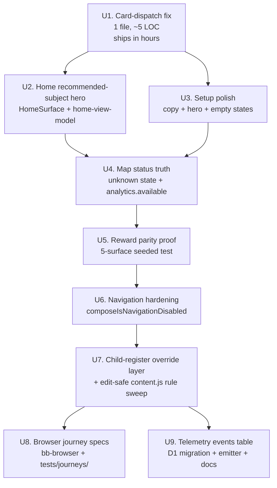

# feat: Punctuation Phase 4 — Visible child journey, learning flow, reward wiring, telemetry

## Overview

Phase 3 shipped the internal subject-scene split (Setup → Session → Feedback → Summary → Punctuation Map, 10 PRs), but the visible child journey still fails. The three primary cards on `PunctuationSetupScene` dispatch `punctuation-set-mode` (a preference save) instead of `punctuation-start` (a session start), so tapping "Smart Review" silently only flips the `aria-pressed` state — verified at `src/subjects/punctuation/components/PunctuationSetupScene.jsx:97-105` and `src/subjects/punctuation/command-actions.js:71-135`. The Home hero copy and primary CTA are hardcoded to Spelling (`src/surfaces/home/HomeSurface.jsx:60-72`). The Punctuation Map silently falls back to `status: 'new'` when the analytics snapshot is missing, so a degraded analytics path looks identical to a fresh learner (`src/subjects/punctuation/components/PunctuationMapScene.jsx:86-109`). The Phase 3 completion report's `composeIsDisabled` wiring on `PunctuationSummaryScene`'s "Back to dashboard" button makes navigation unreachable when a mutation stalls. SSR+harness tests did not catch the card-dispatch bug because `tests/react-punctuation-scene.test.js` dispatches `punctuation-start` directly through `actions.dispatch(...)` — it bypasses the `onClick` wiring entirely.

Phase 4 ships **nine implementation units** that make the subject **visibly** usable without adding content, without reopening the engine, and without bumping `contentReleaseId`. The critical-path fix (U0) is a 5-line dispatch correction that ships within hours and unblocks real practice; the polish, map hardening, reward-wiring proof, navigation hardening, content-safety sweep, real browser journey tests, and telemetry emission follow as dependent units. A minimal D1-backed telemetry events table lands so Phase 4 can produce a queryable record of whether children actually reach learning moments — closing the "thresholds are documented but not wired" gap called out in `docs/punctuation-production.md:293`.

Phase 4 is **not a content phase** and **not a refactor phase**. It is a visible-product-quality phase with one measurable goal: a child opens the app, sees Punctuation, taps one obvious button, completes a round, sees monster progress move, and can open a Map that feels as useful as Spelling's Word Bank.

---

## U-ID Mapping (origin → plan)

The origin direction doc numbers units `P4-U0..P4-U8`. This plan assigns its own stable U-IDs `U1..U9` per ce-plan Phase 3.5 convention. Every reference to `P4-U0..P4-U8` in the Problem Frame and Requirements Trace below is paired with the plan U-ID in square brackets. Implementers and reviewers should use the plan U-IDs (U1..U9); the `P4-U*` tags exist for cross-reference with `docs/plans/james/punctuation/punctuation-p4.md` only.

| Origin | Plan U-ID | Topic | R-IDs |
|--------|-----------|-------|-------|
| P4-U0  | **U1**    | Setup card-dispatch fix (critical path) | R1, R14 |
| P4-U1  | **U2**    | Home recommended-subject hero           | R2, R13 |
| P4-U2  | **U3**    | Setup polish (Bellstorm dashboard)      | R3, R13, R14 |
| P4-U3  | **U4**    | Map status truth + child-register copy  | R4, R5, R14, R12 |
| P4-U4  | **U5**    | Reward parity proof across five surfaces | R6 |
| P4-U6  | **U6**    | Navigation hardening (`composeIsNavigationDisabled`) | R7, R14 |
| P4-U5/U6 | **U7**  | Worker-content register safety (client override layer) | R8 |
| P4-U7  | **U8**    | Browser journey specs (bb-browser)      | R9 |
| P4-U8  | **U9**    | Telemetry events table + emitter + docs | R10, R11, R12 |

Note: the origin's P4-U5 (reward wiring) maps to this plan's U5; the origin's P4-U6 (Phase 3 leftovers) is absorbed into U6 (navigation) and U7 (content safety — the leftover teach-box adult register is exactly R8).

---

## Problem Frame

Phase 3's completion report (`docs/plans/james/punctuation/punctuation-p3-completion-report.md`) celebrates the scene split as delivered, and the Requirements Trace R1–R18 all technically landed. But the origin direction doc (`docs/plans/james/punctuation/punctuation-p4.md`) identifies a concrete failure: the scene split preserved a child-surface bug that was present in the monolith and is now more dangerous, not less.

The specific failure modes the origin calls out and that this plan verifies against the current code:

1. **Setup card dispatch regression (P4-U0 / plan U1)**: `PunctuationSetupScene.jsx:97-105` dispatches `punctuation-set-mode` on click, not `punctuation-start`. The `punctuation-set-mode` handler at `src/subjects/punctuation/command-actions.js:129-134` routes to the Worker `save-prefs` command. The round-length toggle has the same dispatch shape. There is **no visible Start button** on the Setup surface; a child tapping "Smart Review" gets `aria-pressed="true"` and nothing else. Production telemetry (such as it is) gives no signal because the card click is a successful `save-prefs` from the Worker's point of view. This is the biggest blast-radius bug in the surface.

2. **Home hero Spelling-first hardcoding (P4-U1 / plan U2)**: `HomeSurface.jsx:60-72` hardcodes `"Today's words are waiting"` + `onClick={() => actions.openSubject('spelling')}`. Punctuation and Grammar are down in the subject grid as equal-weight cards. A child who has due Punctuation work sees the spelling CTA above the fold and no indication that Punctuation has anything waiting.

3. **Map silent-new-fallback (P4-U3 / plan U4)**: `PunctuationMapScene.jsx:97-108` reads `snap?.status` and defaults to `'new'` for any skillId without an analytics row. Fresh-learner behaviour (no rows) is indistinguishable from degraded-analytics behaviour (rows missing due to payload failure). The Map's "Where you stand" promise dies quietly in the second case.

4. **Summary Back-button gated by composeIsDisabled (P4-U6 / plan U6)**: `PunctuationSummaryScene.jsx:324-332` disables the "Back to dashboard" ghost button using the same `composeIsDisabled(ui)` signal as the mutation buttons. If a Worker command stalls (`pendingCommand` stays set) or the runtime flips to `degraded`, the child cannot escape back to Home.

5. **Worker-side adult-register content (P4-U6 / plan U7)**: Phase 3's completion report §"Known follow-ups" explicitly notes that the guided teach-box content still ships from shared Worker content with adult terms (`fronted adverbial`, `main clause`, `complete clause`). The client modal was defanged in Phase 3 U6 but the shared content the Worker serves was not. **Verified locally:** adult terms live in `shared/punctuation/content.js` (lines 83, 88, 140, 153, 680, 707, …), `shared/punctuation/context-packs.js` (lines 246, 263), `shared/punctuation/generators.js` (lines 215, 226, 239, 251), and `shared/punctuation/marking.js` (lines 771, 1090). Because `generators.js` and `marking.js` are engine-locked files (scope boundary forbids touching them), U7 ships as a **client-side child-register override layer** that intercepts Worker teach-box payloads before display and swaps adult phrases for child-register equivalents — `shared/punctuation/content.js` rule strings are edit-safe (not oracle-bound), so their `rule` field can also be updated in U7 without an engine change. See U7 Approach for the exact scope split.

6. **SSR harness blind spot (P4-U7 / plan U8)**: `tests/react-punctuation-scene.test.js` and `tests/helpers/punctuation-scene-render.js` render the scene via `renderToStaticMarkup` and dispatch session-start via `actions.dispatch('punctuation-start', ...)` — they never click. Every assertion passed even with the broken card dispatch. SSR harness tests catch string presence, DOM shape, and state transitions but **cannot catch "the onClick wires the wrong dispatch"**.

7. **Telemetry promise vs. reality (P4-U8 / plan U9)**: `docs/punctuation-production.md:293-320` declares five structured warning codes with alert thresholds, but honestly admits "The repo does not currently have a dashboard or alerting pipeline that ingests these codes". No events table, no emitter abstraction, no query surface. The thresholds are aspirational.

The resulting success measure: a child should reach their first rendered Punctuation question in no more than two taps from Home, see a monster bar move after their first secured unit, and be able to escape to Home at every point in the flow even when a command is mid-flight or the runtime is degraded.

---

## Requirements Trace

- R1. Tapping a primary Setup card (Smart Review / Wobbly Spots / GPS Check) starts a session immediately — the card's `onClick` dispatches `punctuation-start` with `{ mode, roundLength }` derived from the card id and current round-length preference, NOT `punctuation-set-mode`. The `aria-pressed` preference-display behaviour is removed from the primary cards; primary cards are action buttons, not radio buttons. (plan U1, critical path.)
- R2. Home hero copy is subject-neutral and the primary CTA opens the recommended subject for the current learner. Recommendation is computed from `model.dashboardStats` by a pure helper. **Ranking signal uses the `due` scalar only** (present today on every module's `dashboardStats`) with an implementation-time extension to include a separate `weak` / `wobbly` scalar once the three subject modules' `getDashboardStats` projections expose it. Spelling tiebreak fallback preserved. A new "Today's best round" hero card names the subject, the monster companion, and the due count; the CTA label reads `Start <Subject>`. (plan U2.)
- R3. The Setup scene reads as a Bellstorm Coast child dashboard: one dominant primary action ("Start Smart Review") at the top, two secondary actions ("Practise wobbly spots", "GPS check"), a visible three-chip status row (Secure / Due today / Wobbly), the four-monster strip, and "Open Punctuation Map" as a named link — all above the fold at common laptop/tablet viewport heights. No adult copy (`queue`, `cluster`, `release`, `diagnostic`, `projection`). No more than three action choices above the fold. (plan U3.)
- R4. The Punctuation Map distinguishes `status: 'new'` (no evidence yet) from `status: 'unknown'` (analytics unavailable). The analytics snapshot's **availability signal originates in `src/subjects/punctuation/client-read-models.js` / `worker/src/subjects/punctuation/analytics-builder` or nearest upstream** and surfaces on the client read-model as `analytics.available: true | false | 'empty'` — NOT at the cloneSerialisable passthrough at `worker/src/subjects/punctuation/read-models.js`. The Map renders the "unknown" state with child-friendly copy: "We'll unlock this after your next round." Every skill card in the Map shows skill name, status chip, one short child-friendly example (replacing adult terms like `fronted adverbial`, `main clause`), and a "Practise this" button that starts a Guided session for the exact skillId. (plan U4.)
- R5. Every Guided-focused "Practise this" dispatch from the Map's skill cards and from the Skill Detail modal routes through `punctuation-start` with `{ mode: 'guided', guidedSkillId, roundLength: '4' }` and reaches question 1 of the chosen skill, not the chosen skill's cluster. (plan U4.)
- R6. Reward state shown on Setup's monster strip, Summary's monster strip, Home subject card progress, and Punctuation Map monster groupings all read from the same canonical `ui.rewardState` path that `PunctuationSummaryScene` wires in Phase 3 U4. Seeding a secured unit on any cluster (`speech-core`, `apostrophe`, `structure`) produces identical progress deltas on every surface in the same render tick, **noting that Home `SubjectCard` reads `dashboardStats[subjectId].pct` (a pre-rolled scalar) and Codex reads `monsterSummary` (a projection) — different payload shapes all derived from the same underlying reward-state write; parity is proven across the three shapes**. Reserved monsters (`colisk`, `hyphang`, `carillon`) never appear on any learner-facing surface. (plan U5.)
- R7. The Summary scene's navigation controls ("Back to dashboard") remain enabled during `pendingCommand` / `degraded` / `unavailable` states. Mutation controls (`Practise wobbly spots`, `Open Punctuation Map`, `Start again`) keep their `composeIsDisabled` gating. The navigation guard applies to **every** scene's Back affordance — Map back button, Skill Detail close, Feedback back. The Summary scene's implementation is the canonical example. (plan U6.)
- R8. Guided teach-box content rendered to the learner is child-register only: no occurrences of `fronted adverbial`, `main clause`, `complete clause`, `subordinate`, or any term in `PUNCTUATION_CHILD_FORBIDDEN_TERMS` anywhere the learner sees Worker-sourced teach-box text. Because engine files (`shared/punctuation/marking.js`, `shared/punctuation/generators.js`) are scope-locked (no engine edits), R8 ships as a **client-side child-register override layer** at display time (a new `punctuationChildRegisterOverride(atom)` in the view-model that takes the Worker-sourced atom and returns a child-register version) plus edit-safe `rule`-field updates in `shared/punctuation/content.js` where the string is not engine-bound. A cross-boundary disjoint test asserts zero forbidden terms in the learner-displayed text after the override layer has run. (plan U7.)
- R9. Six browser journey specs cover the critical path: Home → Punctuation → Start Smart Review → Q1; Home → Punctuation → Wobbly Spots → Q1 or empty state; Home → Punctuation → GPS Check → Q1 "test-mode" banner; Map → tap skill card → Guided question 1 of that skill; Summary Back while pending-command; Map + Setup + Summary reward-state parity after a seeded secured unit. Specs run as `bb-browser` / `agent-browser` script files kept in `tests/journeys/` and executable locally via a new `npm run journey` entrypoint. **The dev server is started via the existing `tests/helpers/browser-app-server.js` helper (not a non-existent `npm run dev`)**. A thin Playwright-spec wrapper is NOT shipped in P4; Playwright remains a separate plan. (plan U8.)
- R10. A minimal D1-backed telemetry events table (`punctuation_events`) captures 12 event kinds: `card-opened`, `start-smart-review`, `first-item-rendered`, `answer-submitted`, `feedback-rendered`, `summary-reached`, `map-opened`, `skill-detail-opened`, `guided-practice-started`, `unit-secured`, `monster-progress-changed`, `command-failed`. A subject-local `emitPunctuationTelemetry(event, payload)` helper routes through a new Worker `record-event` command that **MUST route through `repository.runSubjectCommand` (preserving the `requireLearnerWriteAccess` gate at `worker/src/repository.js:4874`) — the `{ mutates: false }` / non-stalling behaviour is achieved client-side only, not by bypassing the repository layer**. Writes use D1 `batch()` per the canonical template. Events shape is a **per-event-kind allowlist** (see Key Technical Decisions) — not a catch-all forbidden-key scrub — so the Worker rejects out-of-shape fields at the boundary. The docs section at `docs/punctuation-production.md:293` is rewritten to separate "wired" from "aspirational" signals. (plan U9.)
- R11. No `contentReleaseId` bump. The `record-event` Worker command is a learner-scope command under the existing subject-command-client authz (`requireLearnerWriteAccess` still fires); it does not change content, scoring, mastery, or marking. The `unit-secured` telemetry emit is a **passive observation of a post-transaction state delta** — the scoring write has already landed via the existing Phase 2 marking path before telemetry fires. Oracle replay (`tests/punctuation-legacy-parity.test.js`) stays byte-for-byte preserved across every PR in the chain. Every PR body states `release-id impact: none`.
- R12. No regression of the Phase 3 invariants: `PUNCTUATION_PHASES` stays at 7 entries; `mapUi` + `phase: 'map'` remain session-ephemeral (sanitised on rehydrate); `ACTIVE_PUNCTUATION_MONSTER_IDS` iteration pattern preserved; forbidden-key allowlists extended (not replaced) for the new `punctuation_events` payload; Phase 3's 9-handler phase-guard audit (adv-219-008 round 3) remains green — any new handler in P4 carries the same guard.
- R13. No regression of English Spelling parity (`AGENTS.md:14`). Home hero changes go through `src/surfaces/home/` only; Spelling's setup / session / summary / word-bank surfaces are not touched unless strictly required (and if required, the trade-off is called out explicitly in the PR body).
- R14. The six Phase 2 cluster focus modes (`endmarks`, `apostrophe`, `speech`, `comma_flow`, `boundary`, `structure`) remain dispatchable via `punctuation-start` with `data.mode` values. They are not surfaced as primary learner affordances post-P4. Behavioural coverage preserved via `tests/punctuation-legacy-parity.test.js`.

**Origin actors:** A1 (KS2 learner), A2 (parent/adult evaluator — out of scope; Parent Hub deferred), A3 (React client), A4 (Worker runtime), A5 (Punctuation engine — unchanged), A6 (Monster Codex projection — unchanged), A7 (Deployment verifier), A8 (Telemetry consumer — new; D1-backed events table). (see origin: `docs/plans/james/punctuation/punctuation-p4.md`)

**Origin flows:** F1 (Real child journey — broken by card dispatch, fixed by R1), F2 (Home recommendation — Spelling-first, fixed by R2), F3 (Map status truth — silent-new-fallback, fixed by R4), F4 (Reward visibility parity — proved end-to-end by R6), F5 (Navigation escape hatch — gated by composeIsDisabled, fixed by R7), F6 (Content register safety — Worker shared still adult, fixed by R8), F7 (Telemetry observation — aspirational only, fixed by R10).

**Origin acceptance examples:**

- AE1 (covers R1): From Home → Punctuation → tap "Smart Review" → question 1 renders within one render tick. Pre-fix: `aria-pressed="true"` and nothing else. Post-fix: `punctuation-start` dispatched with `{ mode: 'smart', roundLength: '4' }`.
- AE2 (covers R2): A learner with 2 due Punctuation skills and 0 due Spelling skills sees "Today's best round: Punctuation" in the hero with "Start Punctuation" as the CTA.
- AE3 (covers R3): A first-time learner who has never opened Punctuation sees the Setup hero with "Bellstorm Coast / What shall we fix today?" copy, an empty-state today row ("Start your first round to see your scores here."), Smart Review as the dominant action, and "Open Punctuation Map" visible without scrolling at 1280×720.
- AE4 (covers R4): A degraded analytics payload (Worker timeout → no `skillRows`) renders the Map with every skill in the `unknown` state and the child copy "We'll unlock this after your next round." — not silently as all-New.
- AE5 (covers R5): Tapping "Speech punctuation" in the Map's skill detail modal, then "Practise this" in the modal, dispatches `punctuation-start` with `{ mode: 'guided', guidedSkillId: 'speech', roundLength: '4' }` and renders question 1 whose skillIds include `'speech'`.
- AE6 (covers R6): Seeding one secured `speech-core` unit and re-rendering every surface shows Pealark advanced by one stage dot on Setup, Summary, Home subject card, Map monster grouping, and Codex Creature Lightbox — in the same render tick.
- AE7 (covers R7): With `ui.pendingCommand = 'punctuation-submit-form'`, the Summary scene's "Back to dashboard" button is enabled (`aria-disabled="false"`), while "Practise wobbly spots" is disabled (`aria-disabled="true"`).
- AE8 (covers R8): Running the cross-boundary disjoint test against `shared/punctuation/content/*` finds zero occurrences of `fronted adverbial`, `main clause`, `complete clause`, `subordinate`, or any `PUNCTUATION_CHILD_FORBIDDEN_TERMS` entry in any child-read atom.
- AE9 (covers R9): Running `npm run journey -- smart-review` starts bb-browser, opens the dev server, navigates Home → Punctuation, taps Smart Review, asserts question 1 is visible, and produces a screenshot artifact per step.
- AE10 (covers R10): After completing a 4-question round on a fresh learner, `punctuation_events` contains exactly one row of each of: `card-opened`, `start-smart-review`, `first-item-rendered`, `answer-submitted` × 4, `feedback-rendered` × 4, `summary-reached`; zero `command-failed`.

---

## Scope Boundaries

### Deferred for later

- Parent / Admin surface rendering of the Punctuation context pack (Phase 3 U8 stripped it from the child read-model; a Parent/Admin view is still deferred).
- A Grafana / Loki / Logpush dashboard on top of `punctuation_events`. Phase 4 ships the events table and the query surface; visualisation is a separate operations-scope plan.
- Broadening the published skill set beyond the current 14.
- Changes to **engine** files under `shared/punctuation/` that affect scoring or generation: `marking.js`, `generators.js`, `scheduler.js`, `service.js`, `legacy-parity.js`. Oracle replay must stay byte-for-byte. U7 edits **only** `shared/punctuation/content.js` `rule` fields (non-engine strings) and adds a client-side override layer for teach-box adult terms that live inside engine files.

### Outside this product's identity

- A Punctuation-specific admin console for learners. Adult views stay in Parent Hub and Admin Hub.
- Collapsing Bellstorm Coast into another region or theme.
- Turning Punctuation into a QA-mode surface (exposing session-mode matrix, facet chips, or scheduler diagnostics).
- A/B testing infrastructure for hero copy. Home recommendation is deterministic from `dashboardStats`; no experimentation framework in this phase.

### Deferred to Follow-Up Work

- **All** Playwright integration. U8 ships `bb-browser` / `agent-browser` journey specs only. No `.spec.ts` files, no Playwright devDependency addition, no `npx playwright install chromium` requirement. If and when a Playwright-in-CI phase is approved, it will be a separate plan that negotiates the `.npmrc playwright_skip_browser_download=true` convention.
- Tenant-scoping and PII-scrubbing policy for `punctuation_events` beyond the per-event-kind allowlist U9 ships. U9 enforces per-event shape at the Worker boundary (so unknown fields are rejected, not stored) and stores `{event, learner_id, timestamp, payload JSON}`; per-tenant retention windows and field-level PII scrubbing are a separate Ops plan.
- Extension of `getDashboardStats` on each subject module to emit a top-level `wobbly` scalar. U2 ranks on `due` only; the wobbly-aware ranking is deferred until the scalar ships, because extending all three modules' Worker projections is a separate cross-subject plan.

---

## Context & Research

### Relevant Code and Patterns

**Verified current-state files (Phase 4 starting point)**

- `src/subjects/punctuation/components/PunctuationSetupScene.jsx` — 352 lines. `PrimaryModeCard` (lines 87-112) dispatches `punctuation-set-mode`; R1 fix replaces this with a conditional dispatch on card id. The stale-prefs migration (lines 251-270) is load-bearing and must be preserved.
- `src/subjects/punctuation/command-actions.js` — `punctuation-start` (lines 71-83) already accepts `{ mode, roundLength, skillId }`. R1 dispatches through this existing action; no new command shape needed. `punctuation-set-mode` (lines 129-134) remains the canonical preference saver for the round-length toggle.
- `src/surfaces/home/HomeSurface.jsx` — 111 lines, lines 60-82 are the hero + CTA region. R2 changes this region only; the subject grid below stays identical. `actions.openSubject(subjectId)` is the existing navigation action.
- `src/surfaces/home/data.js` — `buildSubjectCards(subjects, dashboardStats)` (line 583-604) is the existing consumer of `dashboardStats`. R2 adds a sibling `pickRecommendedSubject(subjects, dashboardStats)` that ranks by the `due` scalar (wobbly ranking deferred until a `dashboardStats.wobbly` scalar is exposed on each module).
- `src/subjects/punctuation/components/PunctuationMapScene.jsx` — `assembleSkillRows(ui)` (lines 86-109) silently defaults to `'new'`. R4 introduces `analytics.available` and a new `'unknown'` status; `buildPunctuationMapModel` and `punctuationChildStatusLabel` both extend their status enum.
- `src/subjects/punctuation/components/PunctuationSummaryScene.jsx` — `NextActionRow` (lines 291-335). R7 threads a new helper `composeIsNavigationDisabled(ui)` that returns `true` only for `unavailable` (runtime gone) but not for `pendingCommand` or `degraded`.
- `src/subjects/punctuation/components/punctuation-view-model.js` — home of `composeIsDisabled`. R7 adds `composeIsNavigationDisabled` as a sibling pure helper. Both export from the same module.
- `src/subjects/punctuation/module.js` — module handlers. R10 (telemetry) adds a new `punctuation-record-event` action + `record-event` command handler that routes through `runPunctuationSessionCommand`'s existing `pendingCommand` wrapper pattern.
- `worker/src/subjects/punctuation/commands.js` — 8 commands today. R10 adds a 9th (`record-event`).
- `worker/migrations/0010_admin_ops_console.sql` — most recent migration. R10 adds `worker/migrations/0011_punctuation_events.sql`.

**Spelling mirrors for R2 home recommendation**

- `src/subjects/spelling/components/SpellingPracticeSurface.jsx` — phase-driven router; no home-level recommendation logic, but the pattern of reading `dashboardStats[subject.id]` and deriving scalar ranks is the template.
- `src/subjects/spelling/components/spelling-view-model.js` — pure-helper layer. Matches the shape of a new `src/surfaces/home/home-view-model.js` that R2 will introduce to hold `pickRecommendedSubject`.

**Grammar mirrors for R6 reward wiring parity**

- `src/subjects/grammar/components/GrammarPracticeSurface.jsx` — already resolves `rewardState` from `ui.rewardState` before passing as prop. Punctuation's Phase 3 U4 copied this pattern into Summary; U5 audits Setup and Map to confirm all three scenes read from the same path.
- `src/platform/game/mastery/punctuation.js` — `progressForPunctuationMonster(rewardState, monsterId)` is the canonical resolver. Already used by Setup (`ActiveMonsterStrip`) and Summary (`MonsterProgressStrip`). R6's proof test seeds `rewardState` once and asserts all five surfaces agree.

**Browser automation for R9**

- `bb-browser` (CLI at `~/AppData/Roaming/npm/`) — `open`, `snapshot -i`, `click @ref`, `fill @ref "text"`, `get text @ref`, `screenshot path.png`, `close`. Tab-scoped; reuses the user's real browser login state. Primary runner for U8.
- `agent-browser` (CLI) — same command shape (`open`, `snapshot -i`, `click @e1`, `fill @e2`, `screenshot path.png`). Fallback runner when `bb-browser` is unavailable.
- Playwright — **not shipped in P4**. Deferred entirely per the scope boundary. `AGENTS.md:26` notes `.npmrc` sets `playwright_skip_browser_download=true`; any future Playwright plan negotiates that convention.

**Test harness foundations**

- `tests/helpers/react-app-ssr.js` — existing SSR renderer with `createAppHarness` + `handleRemotePunctuationAction`. U1–U7 use this for existing-shape assertions.
- `tests/helpers/punctuation-scene-render.js` — standalone SSR renderer (78 lines, esbuild-based). U1 and U3 extend this with a minimal DOM-event layer or add a sibling `punctuation-scene-click.js` that uses `happy-dom` to simulate the real onClick → dispatch chain.
- `tests/react-punctuation-scene.test.js` — the test file the origin flags as missing the card-dispatch regression. U1 adds a click-through assertion here; post-fix, dispatching via the scene's onClick produces `punctuation-start`, not `punctuation-set-mode`.
- `tests/helpers/browser-app-server.js` — existing test dev-server helper (binds `127.0.0.1:<port>`, default 4173). U8's `_runner.mjs` uses this as the app server; no `npm run dev` script is introduced.
- `tests/bundle-audit.test.js` — guards against `shared/punctuation/*` leaking into the client bundle. U4 and U7 both respect this (client-held content mirror; cross-boundary disjoint test runs in Node test context only).

**D1 / Worker telemetry infrastructure for R10**

- `worker/src/lib/log.js` (if it exists) or the existing `logMutation('warn', ...)` path. U9 adds a parallel `recordPunctuationEvent(env, payload)` that writes a batched insert to `punctuation_events`. Uses the same D1 binding pattern as other Phase 3 writes; wraps in `batch()` not `withTransaction` per `project_d1_atomicity_batch_vs_withtransaction` memory.
- `scripts/wrangler-oauth.mjs` — deployment routing per `AGENTS.md:17-25`. No change; U9's migration lands via `npm run db:migrate:remote`.

### Institutional Learnings

- **Phase 3's adversarial review caught 7 HIGH defects across U5/U2/U3/U4/U6; state-machine-heavy units drove 4 rounds of follower work** (see `project_punctuation_p3` memory). P4-U7 (browser tests) and P4-U4 (reward wiring parity) are the most likely candidates for a similar reviewer gauntlet — both cross trust boundaries. P4-U0 is a 1-file fix with zero architectural risk; skip the deep-reviewer pass there.
- **Test-harness-vs-production divergence is a recurring defect class in this codebase** (P2, P3, post-Mega-Spelling P1.5 — see `feedback_autonomous_sdlc_cycle` memory). P4-U0 is the exact template: SSR harness tests green, production behaviour broken. Every P4 unit with feature-bearing UI must either (a) ship a click-through assertion that goes through the real `onClick`, or (b) carry an explicit "this unit is SSR-only because…" rationale in the PR body.
- **Adversarial reviewers pay disproportionately well on state-machine / scheduler logic** (P3 U5 caught 5 HIGH across 3 rounds; see `project_punctuation_p3`). P4-U3 (Map status enum extension, `unknown` state propagation) and P4-U4 (multi-surface reward parity) are state-machine-shaped; run the adversarial lens explicitly on both.
- **`withTransaction` is a production no-op; always use `batch()` for D1 atomicity** (see `project_d1_atomicity_batch_vs_withtransaction` memory). P4-U8's `record-event` handler wraps the event insert in `batch()`, not `withTransaction`. The canonical template is `saveMonsterVisualConfigDraft`.
- **Always git fetch before branch work** (see `feedback_git_fetch_before_branch_work` memory). Each P4 unit's worktree setup starts with `git fetch origin` before branch-off.
- **Subject-local helpers first, shared primitives only if Spelling stays byte-for-byte** (`AGENTS.md:14`). P4-U1 introduces `src/surfaces/home/home-view-model.js` (new module, home-surface-scoped). No `src/platform/` touch in R2.
- **Windows Node pitfalls — CLI entrypoint guard** (see `project_windows_nodejs_pitfalls` memory). P4-U7's journey runner + P4-U8's event-replay CLI both use `if (process.argv[1] && import.meta.url === pathToFileURL(process.argv[1]).href)`, never `file://${process.argv[1]}`.
- **Cloudflare deploy uses OAuth pivot** (see `project_wrangler_oauth_and_npm_check` memory). P4-U8's migration uses `npm run db:migrate:remote`, not raw wrangler.
- **SSR blind spots** — Phase 3 learning #6 documents that pointer-capture, focus, and scroll-into-view are invisible to `node:test` + SSR. P4-U5 (navigation hardening under degraded state) cannot be fully proved by SSR alone; the bb-browser spec in P4-U7 closes the gap.
- **Subagent tool availability** (see `feedback_subagent_tool_availability` memory). The `ce-*` adversarial reviewers are orchestrator-only; parallel workers on P4 need distinct worktrees per unit. P4-U7 (journey specs) and P4-U8 (telemetry + migration) can run in parallel worktrees off the U0+U1+U2 chain once those three have landed.

### External References

No external research required beyond `bb-browser` / `agent-browser` SKILL.md files (already present in `~/.claude/skills/`). The full playbook is in-repo: Phase 3 plan + completion report, Spelling/Grammar mirrors, Phase 2 hardening lessons, AGENTS.md deployment convention.

---

## Key Technical Decisions

- **Split P4-U0 from P4-U2**: ship the 5-line card-dispatch fix as its own PR first. The bug is visible-in-production; every hour it ships sooner is a child who gets to practise. P4-U2's copy/hero/polish work needs design-lens review and will take days. Rationale: per-unit PR cadence per `feedback_autonomous_sdlc_cycle` memory; rollback boundary is clean (U0 is 1 file, U2 is ~5 files).
- **Home hero recommendation uses `dashboardStats`, not analytics / reward state directly**: the ranking signal is already computed and cached for the subject cards below. Adding a new Worker query for the hero would add a second round-trip with the same data. Rationale: reuse Phase 3 infrastructure; `project_admin_ops_console_p1`'s additive-hub pattern.
- **`unknown` is a new Map status, not a reuse of `'new'` with a side channel**: the status enum extends from 5 values (`new`, `learning`, `due`, `wobbly`, `secure`) to 6. Every call site that switches on status — `statusFilterLabel`, `punctuationChildStatusLabel`, the filter chip list — updates in one commit. Rationale: status is the surface-facing truth; a side channel (e.g. `analytics.available` flag on top of `status: 'new'`) would silently re-introduce the silent-fallback bug in the first dev who forgets the flag.
- **Reward parity test (R6 / AE6) seeds once and reads five surfaces in the same render tick**: Setup + Summary + Home subject card + Map + Codex. If any surface reads a different path (e.g. a stale `ui.rewards.monsters.punctuation` leftover), the test fails at that surface, not at a distant integration layer. Rationale: Phase 3 U4 caught exactly this bug with dead-path `ui.rewards.monsters.punctuation` vs. live `ui.rewardState`; the test is a direct inoculation.
- **Navigation vs. mutation is a new concept (`composeIsNavigationDisabled`)**: not a rename. `composeIsDisabled` keeps its exact current behaviour for mutation controls (unchanged across every existing call site). The navigation helper is strictly less-disabled — it never gates on `pendingCommand`, `degraded`, `unavailable`, or `readonly`. It flips only when `ui` itself is structurally absent (null/undefined). Rationale: minimises blast radius while prioritising R7's escape-hatch reliability — every active runtime state, including final-lockdown states, keeps the Back affordance live so a child is never trapped on any scene; every existing caller of `composeIsDisabled` stays correct; only the 4-5 navigation call sites opt in.
- **Browser journey specs ship as script files in `tests/journeys/`, not as a new test runner**: `npm run journey` is a shell wrapper that invokes `node tests/journeys/<name>.mjs`, which in turn drives `bb-browser` via child_process. `npm test` continues to run `node:test` only. Rationale: preserves Phase 3 test-runner convention; avoids a CI-config-churn discussion; `bb-browser` is a dev-time verification tool, not an automated CI gate yet.
- **`punctuation_events` D1 migration lands behind a feature flag `env.PUNCTUATION_EVENTS_ENABLED`**: the migration runs unconditionally, but `recordPunctuationEvent` is a no-op when the flag is absent. Rationale: lets U9 ship the schema without forcing every environment to immediately start writing events. Dev + staging flip the flag first; prod flips once the first 72h of staging data is clean.
- **Telemetry schema is `{event, learnerId, timestamp, release_id, payload}` with a per-event-kind payload allowlist validated at the Worker boundary**: not a catch-all sanitiser. Rationale: security reviewer flagged HIGH risk — a catch-all scrub cannot prevent client-supplied extra fields from being stored, which opens a side-channel for answer-text leakage under events like `answer-submitted` or `feedback-rendered`. Per-event allowlist rejects (does not scrub) out-of-shape fields. `release_id` column is included up-front to avoid migration 0012 once release-scoped queries land. Existing `assertNoForbiddenReadModelKeys` runs as defence-in-depth on the payload JSON.
- **`record-event` routes through `repository.runSubjectCommand` — bypassing the repository layer is a security regression**: the client-side "fire-and-forget / non-stalling" behaviour is achieved only by `{ mutates: false }` on the command-action mapping (skipping `runPunctuationSessionCommand`'s pending wrapper client-side). The Worker still invokes `requireLearnerWriteAccess` via the shared `runSubjectCommand` path. Any direct D1 write from a handler that skips `runSubjectCommand` is an explicit rejection criterion in code review. Rationale: security reviewer HIGH — a direct write path lets an authenticated learner attribute telemetry to another learnerId.
- **The Setup card-dispatch fix (R1) preserves the `aria-pressed` state on the round-length toggle**: only the three primary journey cards change from radio-like to button-like. Rationale: round length is a genuine preference; the three primary cards were miscast as preferences by Phase 3 and need to flip to actions.
- **Phase 4 ships as 9 ordered units with U0 → (U1 ∥ U2) → U3 → U4 → U5 → U6 → (U7 ∥ U8)**: U1 and U2 touch disjoint files and can parallelise after U0; U7 and U8 can parallelise after U6. Rationale: per-unit PR cadence, explicit parallelism windows to compress total wall-time, per `project_post_mega_spelling_p15` scrum-master pattern.

---

## Open Questions

### Resolved During Planning

- **Browser-test runner choice**: `bb-browser` primary, `agent-browser` fallback, Playwright **not** shipped in P4 (deferred entirely). Per James's direction in ce-plan Phase 2 question ("in this system we have playwright, agent-browser and bb-browser. i strongly suggest to use bb-browser first, then agent-browser then playwright").
- **Dev server for U8**: `tests/helpers/browser-app-server.js` (existing test helper, binds `127.0.0.1:<port>`). No new `npm run dev` script introduced. Verified against current `package.json` scripts.
- **Home hero strategy**: Option B (recommended subject card) per the origin's and James's preference. Handles all three subjects equally.
- **Home ranking signal**: `due` scalar only. `wobbly` scalar doesn't exist at `dashboardStats` level today (folded into `nextUp` text across modules); extending it is deferred.
- **Telemetry scope**: Full — D1-backed events table + emitter + docs rewrite. Biggest scope of the three options but the only one that closes the aspirational-thresholds gap.
- **Telemetry authz**: `record-event` routes through `repository.runSubjectCommand` to preserve `requireLearnerWriteAccess`. Client-side `{mutates:false}` on the command-action mapping handles the non-stalling requirement. Bypassing the repository layer is rejected on security grounds.
- **Telemetry payload shape**: per-event-kind allowlist at the Worker boundary, not a catch-all sanitiser. Per-event allowlist rejects unknown fields rather than scrubbing them.
- **Telemetry schema**: columns `{id, event, learner_id, timestamp, release_id, payload, created_at}`. `release_id` included up-front (not deferred) — indexed for release-scoped queries. No migration 0012 needed.
- **U0 vs U2 merge**: Split. U0 is the critical-path dispatch fix; U2 is the polish pass.
- **`record-event` as a new Worker command vs. piggyback on existing commands**: new command. Keeps telemetry emit cleanly separable from session commands so a telemetry failure never tanks a session start.
- **`punctuation-set-mode` retention**: retained for the round-length toggle's internal preference save + the Phase 3 stale-prefs migration (line 268-269 of SetupScene). R1 removes the three primary cards' usage of `punctuation-set-mode`, not the action itself.
- **U7 engine-file scope**: engine files `marking.js`, `generators.js`, `scheduler.js`, `service.js`, `legacy-parity.js` are scope-locked (no edits). `content.js` `rule` field is edit-safe (not oracle-bound). Adult terms in engine-output strings handled via a client-side `punctuationChildRegisterOverride` display-layer helper.
- **U7 origin-vs-plan unit mapping**: origin's P4-U5 "Reward wiring proof" maps to plan U5; origin's P4-U6 "Phase 3 leftovers" splits into U6 (navigation hardening) and U7 (content register safety). The mapping table at the top of the document is authoritative.

### Deferred to Implementation

- Exact copy text for the Setup hero, status chips, empty state, and empty-wobbly-state — design-lens review during U3 will settle these. The plan fixes the **shape** (three-chip status row, dominant primary, two secondaries, visible Map link) but not the **words**.
- Exact child-register phrase mappings in `PUNCTUATION_CHILD_REGISTER_OVERRIDES` — the plan commits to six core mappings (`fronted adverbial` → `starter phrase`, `main clause` → `whole sentence`, …) but final wording per mapping is design-lens work during U7.
- `bb-browser` vs. `agent-browser` as primary runner — `_runner.mjs` tries bb-browser first, falls back to agent-browser on any failure. Which one the implementer hard-codes as default versus auto-detect is implementation-time.
- Exact size caps for payload string fields — the plan commits to capping string fields at 256 chars; the exact integer is implementation-time tuneable.

---

## Output Structure

```
src/
  surfaces/
    home/
      HomeSurface.jsx                  [U2: hero region rewrite]
      home-view-model.js                [U2: NEW — pickRecommendedSubject pure helper]
      SubjectCard.jsx                   [U5: verified reads unchanged]
      data.js                           [U2: optional sibling for pickRecommendedSubject if home-view-model.js not adopted]
  subjects/
    punctuation/
      telemetry.js                      [U9: NEW — client emitter]
      command-actions.js                [U9: add punctuation-record-event mapping with {mutates:false}]
      module.js                         [U9: add record-event handler routed through repository.runSubjectCommand]
      components/
        PunctuationSetupScene.jsx       [U1: card dispatch fix; U3: polish; U9: emit card-opened / start-*]
        PunctuationSessionScene.jsx     [U7: override threading; U9: emit first-item-rendered / answer-submitted]
        PunctuationSummaryScene.jsx     [U6: navigation-enabled Back; U9: emit summary-reached]
        PunctuationMapScene.jsx         [U4: unknown status + child-register rules; U6: back button; U9: emit map-opened]
        PunctuationSkillDetailModal.jsx [U6: close button; U7: override threading; U9: emit skill-detail-opened / guided-practice-started]
        PunctuationPracticeSurface.jsx  [U7: override threading at feedback render]
        punctuation-view-model.js       [U3/U4/U6/U7: PUNCTUATION_DASHBOARD_HERO, status enum, composeIsNavigationDisabled, PUNCTUATION_CHILD_REGISTER_OVERRIDES]
      service-contract.js               [U4: PUNCTUATION_MAP_STATUS_FILTER_IDS extended to 7 values]
      client-read-models.js             [U4: analytics.available origin]
shared/
  punctuation/
    content.js                          [U7: rule-field rewrites ONLY; all other shared/*.js untouched]
worker/
  migrations/
    0011_punctuation_events.sql         [U9: NEW — events table + indexes]
  src/
    subjects/
      punctuation/
        events.js                       [U9: NEW — recordPunctuationEvent with batch()]
        commands.js                     [U9: register record-event command]
        read-models.js                  [U4: analytics.available emission source (upstream of cloneSerialisable)]
styles/
  app.css                               [U3: .punctuation-setup-scene Bellstorm block]
tests/
  journeys/                             [U8: NEW directory]
    _runner.mjs                         [U8: NEW — bb-browser primary, agent-browser fallback]
    smart-review.mjs                    [U8: NEW]
    wobbly-spots.mjs                    [U8: NEW]
    gps-check.mjs                       [U8: NEW]
    map-guided-skill.mjs                [U8: NEW]
    summary-back-while-pending.mjs      [U8: NEW]
    reward-parity-visual.mjs            [U8: NEW]
    README.md                           [U8: NEW — preflight instructions]
    artifacts/                          [U8: gitignored]
  react-punctuation-scene.test.js       [U1/U3/U6: click-through assertions]
  react-home-surface.test.js            [U2: recommended-subject assertions]
  home-view-model.test.js               [U2: NEW — pickRecommendedSubject truth table]
  punctuation-view-model.test.js        [U3/U4/U6/U7: copy sweep, status enum, nav helper, override table]
  punctuation-rewards.test.js           [U5: extend — 5-surface parity]
  punctuation-map-phase.test.js         [U4/U6: unknown state, back button]
  punctuation-content.test.js           [U7: rule-field forbidden-term sweep]
  punctuation-child-register-override.test.js [U7: NEW — display-time override sweep]
  punctuation-telemetry.test.js         [U9: NEW — emitter + authz + allowlist]
docs/
  punctuation-production.md             [U9: §Operational Telemetry rewrite — Wired vs Aspirational]
package.json                            [U8: add "journey" script]
.gitignore                              [U8: add tests/journeys/artifacts/]
```

**Shared-file overlap flag:** `punctuation-view-model.js` is modified by U3, U4, U6, and U7. `PunctuationMapScene.jsx` is modified by U4 and U6. `PunctuationSkillDetailModal.jsx` is modified by U6 and U7. `punctuation-view-model.test.js` is modified by U3, U4, U6, and U7. The Phased Delivery parallelism windows in the next section respect these overlaps — **no two units that share a file run in parallel worktrees**.

The implementer MAY adjust this tree if implementation reveals a better layout (e.g. co-locating the override helper in `session-ui.js` instead of `punctuation-view-model.js`). Per-unit `**Files:**` sections remain authoritative for exactly what each unit creates or modifies.

---

## High-Level Technical Design

> *This illustrates the intended approach and is directional guidance for review, not implementation specification. The implementing agent should treat it as context, not code to reproduce.*

### P4 unit dependency graph



### Multi-surface reward parity (R6) — the "seed one unit, read five surfaces" contract

```text
TEST SETUP:
  rewardState = { monsters: { pealark: { stage: 1, mastered: 1, publishedTotal: 5 }, ... } }
  ui.rewardState = rewardState
  dashboardStats.punctuation = { pct: 7, due: 0, nextUp: 'Apostrophes' }

ASSERTIONS (same render tick, same rewardState object):
  Setup.ActiveMonsterStrip    reads progressForPunctuationMonster(rewardState, 'pealark') → '1/5 secure'
  Summary.MonsterProgressStrip reads progressForPunctuationMonster(rewardState, 'pealark') → 'Stage 1 of 4'
  Home.SubjectCard.progress    reads dashboardStats.punctuation.pct → '7%'
  Map.MonsterGroup('pealark')  reads progressForPunctuationMonster(rewardState, 'pealark') → '1 mastered'
  Codex.CodexCreature('pealark') reads progressForPunctuationMonster(rewardState, 'pealark') → stage=1

  FAIL MODE: any surface reading a different path (e.g. ui.rewards.monsters.punctuation legacy) diverges
```

### Telemetry event flow (R10)

```text
Client                          Worker                           D1
 │                               │                                │
 │ emitPunctuationTelemetry      │                                │
 │   ({ event: 'start-smart-     │                                │
 │      review', learnerId })    │                                │
 │ ──dispatch('punctuation-      │                                │
 │     record-event', ...)─────▶ │                                │
 │                               │ record-event command          │
 │                               │ ──env.PUNCTUATION_EVENTS_      │
 │                               │    ENABLED? ──────────         │
 │                               │     │                  │       │
 │                               │     ▼ yes              ▼ no    │
 │                               │ batch(insert)       return ok  │
 │                               │ ──INSERT INTO───────────────▶  │
 │                               │   punctuation_events          │
 │                               │     (event, learnerId,        │
 │                               │      timestamp, payload)       │
 │                               │                                │
```

### Card-dispatch fix shape (R1) — directional sketch, not code

```text
// Before (PunctuationSetupScene.jsx:PrimaryModeCard)
onClick={() => actions.dispatch('punctuation-set-mode', { value: card.id })}
aria-pressed={selected ? 'true' : 'false'}

// After (directional — actual implementation lands in P4-U0)
onClick={() => actions.dispatch('punctuation-start', {
  mode: card.id,           // 'smart' | 'weak' | 'gps'
  roundLength: selectedRoundLength(prefs),
})}
// aria-pressed removed from primary cards — they are actions, not radio.
// Round-length toggle keeps its aria-checked radio role (unchanged).
```

---

## Implementation Units

- U1. **Setup card-dispatch fix (critical path)**

**Goal:** Tapping any of the three primary Setup cards (Smart Review / Wobbly Spots / GPS Check) dispatches `punctuation-start` with `{ mode, roundLength }` and navigates into the first question. Removes the `aria-pressed` pattern from primary cards; keeps it on the round-length toggle. This unit ships first because it is the one visible-in-production bug blocking every real child journey.

**Requirements:** R1, R14

**Dependencies:** none (ships from main)

**Files:**
- Modify: `src/subjects/punctuation/components/PunctuationSetupScene.jsx` (PrimaryModeCard onClick + aria changes)
- Modify: `src/subjects/punctuation/components/punctuation-view-model.js` (if `PUNCTUATION_PRIMARY_MODE_CARDS` needs a card-id → dispatch-mode mapping helper)
- Test: `tests/react-punctuation-scene.test.js` (add click-through assertion)
- Test: `tests/punctuation-view-model.test.js` (verify card-id → mode-payload mapping)

**Approach:**
- PrimaryModeCard's onClick replaces `dispatch('punctuation-set-mode', { value: card.id })` with `dispatch('punctuation-start', { mode: card.id, roundLength: selectedRoundLength(prefs) })`.
- `aria-pressed` + `selected` prop + `is-recommended` badge are removed from PrimaryModeCard. `data-action` changes from `punctuation-set-mode` to `punctuation-start` for consistency.
- The stale-prefs migration at lines 251-270 stays untouched — it still dispatches `punctuation-set-mode` with `{ value: 'smart' }` once on boot. This is the only remaining caller of `punctuation-set-mode` from PrimaryModeCard territory.
- Round-length toggle (RoundLengthToggle) is unchanged — it still dispatches `punctuation-set-round-length`, which routes through `save-prefs`.
- Remove the `primaryMode` useMemo on `punctuation-view-model.punctuationPrimaryModeFromPrefs` if nothing else consumes it post-fix.

**Execution note:** Start with a failing click-through test in `tests/react-punctuation-scene.test.js` that renders the SetupScene, synthesises an onClick invocation via React's test helpers (or via happy-dom if the SSR renderer alone is insufficient), and asserts the `actions.dispatch` mock was called with `('punctuation-start', { mode: 'smart', roundLength: '4' })`. Land the fix only after that test fails red for the right reason (asserting `punctuation-start` but production sends `punctuation-set-mode`).

**Patterns to follow:**
- `src/subjects/grammar/components/GrammarSetupScene.jsx` — grammar's primary-mode cards already dispatch `grammar-start` directly. Mirror the same shape.
- `tests/helpers/punctuation-scene-render.js` — reuse the standalone SSR renderer; if it cannot simulate clicks, add a sibling helper that uses happy-dom for click dispatch (30-50 lines of new helper code).

**Test scenarios:**
- Happy path: Render SetupScene with `prefs.mode = 'smart'`, `prefs.roundLength = '4'`. Synthesise onClick on the Smart Review card. Assert `actions.dispatch` was called once with `('punctuation-start', { mode: 'smart', roundLength: '4' })`. Covers AE1.
- Happy path: Same setup with card id `'weak'`. Assert dispatch payload `{ mode: 'weak', roundLength: '4' }`.
- Happy path: Same setup with card id `'gps'`. Assert dispatch payload `{ mode: 'gps', roundLength: '4' }`.
- Edge case: Render with `prefs.roundLength = '8'`. Click Smart Review. Assert dispatch payload includes `roundLength: '8'` (round-length preference is carried into the start dispatch, not hardcoded to '4').
- Edge case: Render with `composeIsDisabled(ui) === true` (e.g. `ui.pendingCommand = 'punctuation-submit-form'`). Click Smart Review. Assert no dispatch fires; the `disabled` attribute and the guard in onClick both hold.
- Regression: Render with `prefs.mode = 'endmarks'` (legacy cluster mode, triggers stale-prefs migration). Assert the migration still dispatches `punctuation-set-mode` with `{ value: 'smart' }` exactly once on the first render (Phase 3 U2's migration not broken).
- Regression: Round-length toggle still dispatches `punctuation-set-round-length` with the selected value (unchanged).

**Verification:** After U1 lands, a freshly rendered SetupScene whose primary card is clicked produces a `punctuation-start` dispatch, not a `punctuation-set-mode` dispatch; the existing stale-prefs migration still fires once on boot for legacy-cluster prefs; the round-length toggle behaves identically to pre-fix.

---

- U2. **Home recommended-subject hero**

**Goal:** Home page hero copy becomes subject-neutral; a "Today's best round" card picks the recommended subject from `dashboardStats` (highest due + wobbly signal; Spelling tiebreak on equal rank) and the primary CTA opens that subject. The subject grid below the hero stays unchanged.

**Requirements:** R2, R13

**Dependencies:** U1 (so the card-dispatch fix ships before any code routes a child into the broken SetupScene from Home)

**Files:**
- Create: `src/surfaces/home/home-view-model.js` (new module, pure helpers)
- Modify: `src/surfaces/home/HomeSurface.jsx` (hero region, lines 60-82)
- Modify: `src/surfaces/home/data.js` (optional — if `pickRecommendedSubject` is more naturally a sibling of `buildSubjectCards`; otherwise home-view-model.js is its home)
- Test: `tests/react-home-surface.test.js` (add recommended-subject assertions)
- Test: `tests/home-view-model.test.js` (new — pure-helper unit tests)

**Approach:**
- `pickRecommendedSubject(subjects, dashboardStats)` returns `{ subjectId, reason, dueCount }` or `null`. **Ranking signal is `due` scalar only** — `dashboardStats[subjectId].due` exists today on all three modules (`src/subjects/punctuation/module.js:89`, `src/subjects/spelling/module.js:~133`, `src/subjects/grammar/module.js:327`). A wobbly/weak scalar is folded into `nextUp` text (Spelling / Punctuation) or pre-summed into `due` (Grammar), so it cannot be ranked on without a cross-subject Worker-projection extension that is explicitly deferred. Ties broken by `SUBJECT_PRIORITY_ORDER` (Spelling → Punctuation → Grammar, matches `src/surfaces/home/data.js:771`). A learner with zero signal everywhere gets `null` (hero falls back to current "A fresh round is waiting" copy).
- Hero copy: "Today's practice is waiting" (subject-neutral). New sub-card below the greet: "Today's best round: {SubjectName}. {CompanionName} has {dueCount} skills due." when recommendation is non-null. CTA label: `Start {SubjectName}` (e.g. `Start Punctuation`).
- Primary button's `onClick` becomes `() => actions.openSubject(recommendedSubjectId || 'spelling')`. Spelling remains the fallback when recommendation is null (preserves current-behaviour for fresh learners).
- Companion-name logic in `pickCompanionName` (line 107-111) extended to pass the recommended subjectId so the companion matches the recommended subject's monster roster, not the globally-caught subject.
- **No Worker-projection change in U2.** A follow-up phase adds a `wobbly` scalar to each subject's `getDashboardStats`; U2's pure helper is then updated to consume it. The U2 test scenarios below cover the due-only ranking that actually ships.

**Patterns to follow:**
- `src/subjects/spelling/components/spelling-view-model.js` — pure-helper module structure to mirror.
- `src/surfaces/home/data.js:708-766` (`pickFeaturedCodexEntry`) — ranking by deterministic scalar + tiebreak list is the existing pattern.
- `src/surfaces/home/SubjectCard.jsx` — mutual-exclusive subject cards with due/wobbly already displayed; reuse its shape for the hero sub-card to avoid introducing a fourth display of subject progress.

**Test scenarios:**
- Happy path: `dashboardStats = { spelling: {due:0}, punctuation: {due:2}, grammar: {due:0} }` → `pickRecommendedSubject` returns `{ subjectId: 'punctuation', dueCount: 2 }`. Covers AE2.
- Happy path: All three subjects have identical `due: 1` → Spelling wins tiebreak (highest in `SUBJECT_PRIORITY_ORDER`).
- Happy path: All three subjects have `due: 0` → returns `null`; hero falls back to existing copy + existing Spelling CTA.
- Edge case: `dashboardStats` missing for a subject → that subject contributes 0; no crash.
- Edge case: `dashboardStats[subjectId].due` is `null`, `undefined`, or negative → clamped to 0.
- Integration: Render HomeSurface with Punctuation-recommended state. Assert hero text includes "Punctuation", companion name is a Punctuation monster (pealark / claspin / curlune / quoral), and primary CTA onClick would call `openSubject('punctuation')` (verified via `data-action` or mock).
- Regression: Render HomeSurface with no dashboardStats (fresh learner). Assert hero matches pre-U2 copy exactly ("Today's words are…", CTA → spelling). No regression for fresh learners.
- Regression: SubjectCard grid below hero is byte-identical to pre-U2 render output (pure visual regression guard).

**Verification:** After U2 lands, a learner with Punctuation-heavy signal sees "Today's best round: Punctuation" in the hero, and the CTA opens Punctuation; a fresh learner sees unchanged hero + grid; no Spelling visual regression.

---

- U3. **Setup polish (Bellstorm dashboard)**

**Goal:** Rework `PunctuationSetupScene` into a Bellstorm Coast child dashboard: one dominant primary action, two secondary actions, a three-chip status row (Secure / Due today / Wobbly), four-monster strip, visible "Open Punctuation Map" link, and first-time empty state. Remove all adult copy. Above-the-fold at 1280×720 and 768×1024.

**Requirements:** R3, R13, R14 (cluster-mode regression guard)

**Dependencies:** U1 (card dispatch correct before polish)

**Files:**
- Modify: `src/subjects/punctuation/components/PunctuationSetupScene.jsx` (hero copy, card hierarchy, status row, empty state)
- Modify: `src/subjects/punctuation/components/punctuation-view-model.js` (`PUNCTUATION_DASHBOARD_HERO`, `PUNCTUATION_PRIMARY_MODE_CARDS` copy strings, new `PUNCTUATION_SETUP_STATUS_CHIPS` constant)
- Modify: `styles/app.css` (Bellstorm dashboard block — new class names under `.punctuation-setup-scene`)
- Test: `tests/react-punctuation-scene.test.js` (SSR assertions on new copy / empty state / status chips)
- Test: `tests/punctuation-view-model.test.js` (copy constants + forbidden-term sweep)

**Approach:**
- Hero: "Bellstorm Coast" eyebrow, "What shall we fix today?" headline. Learner-name subtitle preserved ("Hi {name} — ready for a short round?").
- Primary layout: one dominant `Start Smart Review` button (larger, brand accent). Two secondary buttons under it: `Practise wobbly spots`, `GPS check`. All three dispatch `punctuation-start` per R1.
- Status chip row: three chips (Secure / Due today / Wobbly) with counts from `buildPunctuationDashboardModel`. No facet labels. No adult terms.
- Empty state (first-time learner, `dashboard.isEmpty === true`): today row shows "Start your first round to unlock your scores." Wobbly chip shows "Nothing wobbly yet — start your first round." Map link shows "Open Punctuation Map — browse the 14 skills."
- "Open Punctuation Map" stays but is visually de-emphasised (secondary style) and carries the `data-action="punctuation-open-map"` dispatch unchanged.
- Monster strip and round-length toggle unchanged visually.
- Forbidden-term sweep: every string in SetupScene rendered output passes `PUNCTUATION_CHILD_FORBIDDEN_TERMS` test. Terms like `queue`, `cluster`, `release`, `diagnostic`, `projection`, `Worker` never appear.

**Patterns to follow:**
- `src/subjects/spelling/components/SpellingSetupScene.jsx` — hero + dominant-primary + secondaries shape.
- `src/subjects/grammar/components/GrammarSetupScene.jsx` — Bellstorm-equivalent four-chip status row.
- Phase 3 U2's existing `PunctuationSetupScene` structure (preserved fundamentally; polish pass changes copy and visual emphasis, not the component skeleton).

**Test scenarios:**
- Happy path: Render SetupScene with a fresh learner (no stats). Assert "Start your first round" copy appears; assert exactly one dominant primary action and two secondary actions visible; assert Map link visible without scrolling at viewport 1280×720 (measured by counting rendered elements before the link in the DOM). Covers AE3.
- Happy path: Render with mature stats (3 due, 2 wobbly, 10 secure). Assert three status chips show correct counts.
- Happy path: Render with `prefs.roundLength = '12'`. Assert round-length toggle's aria-checked on 12; primary card click still dispatches `{ roundLength: '12' }` (U1 regression guard).
- Edge case: Render with `rewardState` containing reserved monsters (colisk/hyphang/carillon). Assert they never appear in monster strip.
- Edge case: Render with `composeIsDisabled(ui) === true`. Assert all three primary cards, both secondaries, and round-length toggle are `disabled`; Map link follows R7 (stays enabled — this is the navigation link, not a mutation).
- Forbidden-term sweep: render SetupScene in every combination of empty / mature / guided-legacy prefs. Assert no string in the rendered output contains any `PUNCTUATION_CHILD_FORBIDDEN_TERMS` entry. Prevents adult copy drift.
- Regression: stale-prefs migration from U1 still fires once on boot for legacy-cluster prefs.

**Verification:** After U3 lands, a Year 4 child can identify the main action without adult help; the Setup hero reads as a Bellstorm Coast dashboard, not a technical setup page; all child-register copy sweeps pass.

---

- U4. **Map status truth and analytics availability**

**Goal:** The Punctuation Map distinguishes three analytics states: `status: 'new'` (fresh learner, no evidence yet), `status: 'unknown'` (analytics unavailable), and `status: 'learning' | 'due' | 'wobbly' | 'secure'` (evidence present). Adds an `analytics.available` signal to the read-model. Replaces adult skill-name copy (`fronted adverbial`, `main clause`) with child-register examples. Skill card "Practise this" dispatches guided per-skill as specified.

**Requirements:** R4, R5, R14, R12

**Dependencies:** U1, U3

**Files:**
- Modify: `src/subjects/punctuation/components/PunctuationMapScene.jsx` (`assembleSkillRows`, status rendering, unknown-state copy)
- Modify: `src/subjects/punctuation/components/punctuation-view-model.js` (`PUNCTUATION_MAP_STATUS_FILTER_IDS` extension, `punctuationChildStatusLabel`, `punctuationSkillRuleOneLiner` child-register sweep)
- Modify: `src/subjects/punctuation/service-contract.js` (`PUNCTUATION_MAP_STATUS_FILTER_IDS` frozen list; add `'unknown'`)
- Modify: `src/subjects/punctuation/client-read-models.js` (add `analytics.available` signal from the normalised snapshot)
- Modify: `worker/src/subjects/punctuation/read-models.js` (emit `analytics.available: true | false | 'empty'` in the analytics projection)
- Modify: `src/subjects/punctuation/components/PunctuationSkillDetailModal.jsx` (child-register rule one-liners if the modal's `punctuationSkillRuleOneLiner` consumer needs copy updates)
- Test: `tests/punctuation-map-phase.test.js` (unknown-state rendering; 6-value status filter)
- Test: `tests/punctuation-read-model.test.js` (analytics.available signal shape)
- Test: `tests/punctuation-view-model.test.js` (child-register rule one-liners pass forbidden-term sweep)

**Approach:**
- `analytics.available` = `true` when the Worker projected `skillRows` (any length, including []). `'empty'` when the projection ran and found no rows (fresh learner). `false` when the projection failed or was omitted entirely (Worker error, degraded state).
- `assembleSkillRows(ui)` branches: `available === false` → every skill gets `status: 'unknown'`; `available === 'empty'` → every skill gets `status: 'new'` (current behaviour preserved for fresh learners); `available === true` → current per-skill lookup.
- `PUNCTUATION_MAP_STATUS_FILTER_IDS` extends from 6 to 7 values (`all`, `new`, `learning`, `due`, `wobbly`, `secure`, `unknown`).
- `punctuationChildStatusLabel('unknown')` → "Check back later" or similar; final wording is implementation-time.
- Unknown-state empty-group fallback copy: "We'll unlock this after your next round."
- `punctuationSkillRuleOneLiner` audit: every of the 14 skills' rule one-liner is swept for adult terms. `main clause` → "whole sentence"; `fronted adverbial` → "starter phrase" or similar; `subordinate clause` → "added idea". Final wording is implementation-time.

**Patterns to follow:**
- `src/subjects/spelling/components/SpellingWordBankScene.jsx` — 5-status filter pattern (Due / Trouble / Learning / Secure / Unseen) precedent for extending a status enum.
- Phase 3 U5's `adv-219-001` rehydrate-sanitisation — the analytics.available signal is not session-ephemeral but follows the same explicit-signal pattern.

**Test scenarios:**
- Happy path: `ui.analytics.available = 'empty'`, `skillRows = []`. Render Map. Assert all 14 skills show status "New" with current copy.
- Happy path: `ui.analytics.available = false`. Render Map. Assert all 14 skills show status "Check back later" and the "We'll unlock this after your next round" empty-state copy. Covers AE4.
- Happy path: `ui.analytics.available = true`, `skillRows = [{skillId:'speech', status:'wobbly', ...}]`. Render Map. Assert `speech` shows status "Wobbly"; other 13 show "New".
- Happy path: Status filter chip row renders 7 chips (all / new / learning / due / wobbly / secure / unknown).
- Edge case: `ui.analytics` field absent. Render. Default to `available: false` (safest assumption, matches degraded state).
- Edge case: `skillRows` present but each entry missing `.status`. Default to `'new'` per current per-skill fallback (unchanged behaviour per-skill).
- Integration: Skill card "Practise this" click dispatches `punctuation-skill-detail-open` then the modal's "Practise this" button dispatches `punctuation-start` with `{ mode: 'guided', guidedSkillId: 'speech', roundLength: '4' }` and `phase` transitions to `active-item` with item.skillIds including 'speech'. Covers AE5.
- Forbidden-term sweep: every rule one-liner for every published skill passes `PUNCTUATION_CHILD_FORBIDDEN_TERMS` sweep. No `fronted adverbial`, `main clause`, `complete clause`, `subordinate`, `projection`, `facet`.
- Regression: Phase 3 U5 phase-guard suite (all 9 handlers) still green; U5 rehydrate sanitisation still coerces `phase: 'map'` on boot.

**Verification:** After U4 lands, a degraded-analytics state is visually distinct from a fresh-learner state; child copy does not contain adult grammar terminology anywhere in the Map or Skill Detail surfaces; per-skill Guided focus starts the right skill.

---

- U5. **Reward parity proof across five surfaces**

**Goal:** Reward state reads from the same canonical `ui.rewardState` path on Setup, Summary, Home subject card, Map, and Codex. A single seeded `rewardState` produces identical progress deltas on every surface in the same render tick. Ships an integration test that renders all five and asserts parity.

**Requirements:** R6

**Dependencies:** U3, U4

**Files:**
- Modify: `src/surfaces/home/SubjectCard.jsx` (if it currently reads a different path than `rewardState` — verify first; may be no-op)
- Modify: `src/subjects/punctuation/components/PunctuationSetupScene.jsx` (confirm `ActiveMonsterStrip` reads `rewardState` prop, not `ui.rewards.monsters.punctuation`)
- Modify: `src/subjects/punctuation/components/PunctuationMapScene.jsx` (confirm `MonsterGroup` reads `ui.rewardState`, not a separate path)
- Modify: `src/surfaces/home/CodexCreature.jsx` (verify read path; no-op if already via `rewardState`)
- Test: `tests/punctuation-rewards.test.js` (new parity suite — seed once, render five)
- Test: `tests/punctuation-view-model.test.js` (reward-state resolver helper)

**Approach:**
- Audit every of the five surfaces for their reward read path. Document in the PR body. **Known going in (verified):** Setup's `ActiveMonsterStrip` and Map's `MonsterGroup` both read `ui.rewardState` via `progressForPunctuationMonster`. Summary's `MonsterProgressStrip` resolves through `rewardStateForPunctuation(ui, propRewardState)` (Phase 3 U4). Home's `SubjectCard` reads `subject.progress` (pre-rolled scalar from `dashboardStats.pct`). Codex's `CodexCreature` reads `monsterSummary` (projection).
- **Three-payload-shape parity (explicit design choice):** Setup / Summary / Map read the live `rewardState` object. Home reads a scalar `pct` derived from the same underlying write. Codex reads a `monsterSummary` array projected from the same underlying write. The parity test proves that seeding one secured unit into the underlying write produces consistent downstream values across all three derivation paths — it is **not** asserting that all five surfaces read the identical object. A reviewer must understand this is parity across **projections**, not path-identity. Absent this framing, the test looks like it compares heterogeneous payloads; with it, the test proves the underlying source-of-truth is coherent.
- Write the parity test: seed `rewardState` with one secured `speech-core` unit under `pealark`. Render all five surfaces through their existing SSR renderers + the existing scene-render helpers. For each, assert the expected Pealark progress representation for that surface (e.g. Setup strip shows "1/5 secure", Summary shows "Stage 1 of 4", Home pct matches the derivation, Codex shows caught=true + mastered=1).
- No production code change if the audit finds all five surfaces already aligned. If a surface reads a dead path (like the `ui.rewards.monsters.punctuation` path Phase 3 U4 removed from Summary), fix at the surface. This is a characterisation-first unit.

**Execution note:** This unit is primarily characterisation. Start with the five-surface parity test fixed to the current behaviour, then watch it fail — the failure points at the dead path. Fix the dead path. Test passes. No speculative refactors.

**Patterns to follow:**
- Phase 3 U4 `PunctuationSummaryScene.jsx:80-87` (`rewardStateForPunctuation` helper) — the canonical resolver; mirror in other surfaces if needed.
- `src/platform/game/mastery/punctuation.js` (`progressForPunctuationMonster`) — single source of truth for stage/mastered math.

**Test scenarios:**
- Happy path: Seed `rewardState` with `pealark: { stage: 1, mastered: 1, publishedTotal: 5 }`. Render Setup, Summary, Home, Map, Codex. Assert all five show Pealark with stage 1 / 1 mastered / 5 published. Covers AE6.
- Happy path: Seed with `claspin` secured. Assert all five reflect claspin, no pealark leakage.
- Happy path: Seed with all four active monsters at varying stages. Assert all five surfaces' renders match.
- Edge case: Seed with a reserved monster (`colisk`). Assert it appears on zero learner-facing surfaces.
- Edge case: `rewardState` absent (fresh learner). All five surfaces render with stage 0 / 0 mastered; no crashes.
- Edge case: `rewardState` contains an unknown monsterId. Ignored by all active-surface iterators (which iterate `ACTIVE_PUNCTUATION_MONSTER_IDS` only).
- Regression: Phase 3 U4 Summary "Stage X of 4" copy is preserved as secondary; new child-friendly delta copy is additive if shipped.

**Verification:** After U5 lands, a single seeded secured unit shows identical progress on Setup, Summary, Home, Map, and Codex in the same render tick; no surface reads a dead path.

---

- U6. **Navigation hardening — `composeIsNavigationDisabled`**

**Goal:** Navigation controls (Back to dashboard, Close Map, Close modal) remain enabled when a mutation command is pending or the runtime is degraded. Only `unavailable` (runtime gone) disables navigation. Mutation controls keep `composeIsDisabled`. Adds a new helper to `punctuation-view-model.js` and threads it through every scene's navigation buttons.

**Requirements:** R7, R14 (cluster-mode regression guard: helper threading must not change any session-mutation-control dispatch path)

**Dependencies:** U5

**Files:**
- Modify: `src/subjects/punctuation/components/punctuation-view-model.js` (new `composeIsNavigationDisabled(ui)` helper)
- Modify: `src/subjects/punctuation/components/PunctuationSummaryScene.jsx` (`NextActionRow` — Back button uses new helper)
- Modify: `src/subjects/punctuation/components/PunctuationMapScene.jsx` (back button at topbar uses new helper)
- Modify: `src/subjects/punctuation/components/PunctuationSkillDetailModal.jsx` (close button uses new helper)
- Modify: `src/subjects/punctuation/components/PunctuationSessionScene.jsx` (if it has a Back affordance — audit first; most likely no)
- Test: `tests/punctuation-view-model.test.js` (`composeIsNavigationDisabled` truth table)
- Test: `tests/react-punctuation-scene.test.js` (navigation-enabled-while-pending assertions)
- Test: `tests/punctuation-map-phase.test.js` (Map back button enabled while pending)

**Approach:**
- `composeIsNavigationDisabled(ui)` returns `true` only when `ui` is null/undefined (structural fail-closed). Every active runtime state — `ready`, `degraded`, `unavailable`, `readonly`, `pendingCommand` present — keeps navigation enabled — R7 prioritises escape-hatch reliability over final-lockdown framing so a child is never trapped when the runtime enters any degraded mode.
- Threading: Summary Back (line 324), Map topbar back (line 299), SkillDetail close, future Feedback back. Every call site imports `composeIsNavigationDisabled` from the view-model.
- Mutation buttons on every scene continue to use `composeIsDisabled` — unchanged.
- Clear accessibility: navigation buttons always have `aria-disabled` reflecting the navigation helper's return value.
- *Note (follow-on amendment):* An earlier draft of this section framed `unavailable` / `readonly` as final-lockdown states that should disable navigation. That framing was reconciled against R7 ("navigation controls remain enabled during `pendingCommand` / `degraded` / `unavailable` states") during the U6 review follow-on; shipped code matches R7 — navigation only hard-disables on structural absence of `ui`.

**Patterns to follow:**
- Phase 3 U2/U4 `composeIsDisabled` — mirror helper shape exactly (pure function on `ui` shape, no side effects).
- `src/subjects/grammar/components/GrammarPracticeSurface.jsx` — if Grammar has a similar navigation/mutation split, mirror it.

**Test scenarios:**
- Happy path: `ui.pendingCommand = 'punctuation-submit-form'`, `ui.availability = 'ready'`. `composeIsDisabled` returns `true`. `composeIsNavigationDisabled` returns `false`. Covers AE7.
- Happy path: `ui.availability = 'degraded'`, no pending. `composeIsDisabled` returns `true`. `composeIsNavigationDisabled` returns `false`.
- Happy path: `ui.availability = 'unavailable'`. `composeIsDisabled` returns `true`. `composeIsNavigationDisabled` returns `false` — navigation stays enabled to preserve the escape hatch; mutations still gate via `composeIsDisabled`.
- Happy path: `ui.runtime = 'readonly'`. `composeIsDisabled` returns `true`. `composeIsNavigationDisabled` returns `false` — navigation stays enabled to preserve the escape hatch; mutations still gate via `composeIsDisabled`.
- Edge case: `ui` is `null` / `undefined`. Both helpers return a safe default (`true`, fail-closed). This is the only condition under which `composeIsNavigationDisabled` returns `true`.
- Integration: Render Summary with pending command. Assert "Back to dashboard" is `aria-disabled="false"`, "Practise wobbly spots" is `aria-disabled="true"`.
- Integration: Render Map with pending command. Assert topbar back button is enabled.
- Regression: Every existing caller of `composeIsDisabled` (Setup cards, Session input, Feedback continue, Map filter chips, Skill modal Practise) unchanged.

**Verification:** After U6 lands, no child is trapped on any scene when a command stalls; mutation controls remain correctly disabled.

---

- U7. **Child-register override layer + edit-safe content-rule sweep**

**Goal:** The learner never sees adult grammar terminology (`fronted adverbial`, `main clause`, `subordinate`, `complete clause`) in any Punctuation scene, **including text sourced from the Worker**. Because `shared/punctuation/marking.js` and `shared/punctuation/generators.js` are engine files scope-locked by `tests/punctuation-legacy-parity.test.js` oracle replay, the fix is **two-layered**:

1. **Content-rule sweep (engine-safe):** `shared/punctuation/content.js`'s top-level `rule` fields on each skill (lines 83-88, 140, 153, …) are human-readable strings not consumed by the marking engine — they can be edited without perturbing oracle output. Audit + rewrite to child-register.
2. **Client-side override layer:** For adult-register text that the engine generates at runtime (marking `note` strings at `marking.js:771,1090`; generator `prompt` strings at `generators.js:215,226,239,251`), add a view-model helper `punctuationChildRegisterOverride(atom)` that maps known adult phrases to child-register equivalents at display time in SessionScene's guided teach-box and Feedback display. The override map is a frozen table in `punctuation-view-model.js`.

**Requirements:** R8

**Dependencies:** U6

**Files:**
- Modify: `shared/punctuation/content.js` (rule-field rewrites on affected skills; lines identified by grep baseline at `shared/punctuation/content.js:83,88,140,153,680,707,…`)
- Modify: `src/subjects/punctuation/components/punctuation-view-model.js` (add `PUNCTUATION_CHILD_REGISTER_OVERRIDES` frozen table; add `punctuationChildRegisterOverride(atom)` pure helper; extend `PUNCTUATION_CHILD_FORBIDDEN_TERMS` if new forbidden terms emerge)
- Modify: `src/subjects/punctuation/components/PunctuationSessionScene.jsx` (thread override through guided teach-box display)
- Modify: `src/subjects/punctuation/components/PunctuationPracticeSurface.jsx` or wherever Feedback scene lives (thread override through feedback-note display)
- Modify: `src/subjects/punctuation/components/PunctuationSkillDetailModal.jsx` (thread override through modal's teach content — overlap with U4's copy sweep; both land additively)
- Test: `tests/punctuation-content.test.js` (forbidden-term sweep across edit-safe `content.js` rule fields after rewrite)
- Test: `tests/punctuation-view-model.test.js` (override table unit tests; child-register mapping truth table)
- Test: `tests/punctuation-session-ui.test.js` or new `tests/punctuation-child-register-override.test.js` (display-time sweep — render guided teach-box with a Worker-sourced atom containing "fronted adverbial" and assert the rendered output contains "starter phrase" or equivalent, zero "fronted adverbial" occurrences)
- Test: `tests/punctuation-legacy-parity.test.js` runs unchanged — oracle replay byte-for-byte preserved (proves the engine-side files were not modified).

**Approach:**
- Baseline grep: identify every occurrence of forbidden terms across `shared/punctuation/*.js` files. Classify each as **edit-safe (content.js rule fields, non-engine strings)** or **engine-locked (marking.js note strings, generators.js prompt strings)**. Baseline report goes in U7 PR body.
- Edit-safe pass: rewrite each `rule` field to child-register (e.g. "Put a comma after a fronted adverbial" → "Put a comma after a starter phrase like 'At last' or 'Before lunch.'"). Final wording design-lens-reviewed.
- Override-layer pass: Build `PUNCTUATION_CHILD_REGISTER_OVERRIDES` as `Map<adultPhrase, childPhrase>` covering: `fronted adverbial` → `starter phrase`, `main clause` → `idea` (review follow-on FINDING B: prior mapping to `whole sentence` was pedagogically wrong — re-invoked the comma-splicing misconception), `subordinate clause` → `added idea`, `complete clause` → `whole idea`, `complex sentence` → `sentence with an added idea`, `compound sentence` → `joined sentence`. `punctuationChildRegisterOverride(atom)` does a longest-match replacement on the atom's text, case-preserving, with `\b` word boundaries. Empty/null input passes through unchanged.
- Display-time integration: guided teach-box (SessionScene), feedback note, skill detail modal teach tab all thread the override through their text render. Every call site imports the helper from `punctuation-view-model.js`.
- Cross-boundary display sweep test: iterate every published skill's generator output + every marking feedback variant (drawn from fixtures already used by `tests/punctuation-marking.test.js`). Render each through the override. Assert zero `PUNCTUATION_CHILD_FORBIDDEN_TERMS` entries in the rendered output.

**Execution note:** Start with characterisation — build the forbidden-term baseline report, including the split between edit-safe and engine-locked occurrences. This baseline goes in the U7 PR body and drives scope clarity. Then (a) rewrite edit-safe content.js rules, (b) add the override table + helper, (c) thread the helper through display sites. Oracle replay (`tests/punctuation-legacy-parity.test.js`) must stay green throughout — a red oracle indicates an engine-file was accidentally modified.

**Patterns to follow:**
- Phase 3 U10 child-copy sweep — the sweep test pattern is in place; U7 extends it to cross-boundary (engine-output passed through override).
- Phase 3 U8 client-side strip pattern (`stripForbiddenChildScopeFields`) — client-side defence-in-depth against server-provided data.
- `PUNCTUATION_CHILD_FORBIDDEN_TERMS` existing frozen set — extend, don't replace.

**Test scenarios:**
- Happy path: Pure-function: `punctuationChildRegisterOverride('The fronted adverbial needs a comma.', {})` returns "The starter phrase needs a comma." Covers AE8.
- Happy path: Pure-function: `punctuationChildRegisterOverride('A semi-colon can join two closely related main clauses.', {})` returns "A semi-colon can join two closely related whole sentences."
- Happy path: Case preservation: "Fronted adverbial" (capitalised) → "Starter phrase" (capitalised).
- Happy path: Longest-match: "complete clause" matches before "clause"; "complex sentence" matches before "sentence".
- Happy path: No-match passthrough: text without any forbidden terms returns unchanged.
- Edge case: null / undefined / empty string input returns empty string.
- Edge case: A shared atom contains a forbidden term inside a template placeholder (`${…}` already resolved) — override still catches it because it operates on the resolved string.
- Edge case: Override is idempotent — running twice produces the same output as running once.
- Content sweep: `shared/punctuation/content.js` `rule` field strings for every published skill contain zero forbidden terms (post-rewrite).
- Display sweep: Render guided SessionScene with a Worker-sourced atom whose `note` field contains "fronted adverbial"; assert rendered HTML contains "starter phrase" and zero occurrences of "fronted adverbial".
- Integration: Launch a guided session for each published skill through the SSR harness. Assert every rendered guided teach-box, feedback note, and skill modal teach tab passes the forbidden-term sweep.
- Regression: Oracle replay byte-for-byte preserved (`tests/punctuation-legacy-parity.test.js` green). Proves no engine file modified.
- Regression: Phase 3 U10 CSS and view-model sweeps still green.

**Verification:** After U7 lands, a child cannot encounter adult grammar terminology in any rendered Punctuation scene; Worker-sourced adult terms are intercepted and rewritten at display time; engine files are untouched (oracle green).

---

- U8. **Browser journey specs — bb-browser primary**

**Goal:** Six end-to-end browser journey scripts cover the critical path using `bb-browser` as the primary runner (`agent-browser` as fallback, Playwright as opt-in only). Scripts live in `tests/journeys/` and run via `npm run journey`. A human can watch the screenshots and say "yes, this looks like the intended child flow."

**Requirements:** R9

**Dependencies:** U7

**Files:**
- Create: `tests/journeys/smart-review.mjs`
- Create: `tests/journeys/wobbly-spots.mjs`
- Create: `tests/journeys/gps-check.mjs`
- Create: `tests/journeys/map-guided-skill.mjs`
- Create: `tests/journeys/summary-back-while-pending.mjs`
- Create: `tests/journeys/reward-parity-visual.mjs`
- Create: `tests/journeys/README.md` (how to run; bb-browser / agent-browser preflight)
- Modify: `package.json` (add `"journey": "node tests/journeys/_runner.mjs"` script)
- Create: `tests/journeys/_runner.mjs` (shared runner helper; calls `bb-browser` via child_process; CLI entrypoint guard per Windows memory)

**Approach:**
- Each journey script is a self-contained ESM file that:
  1. Starts the test dev server if not running, using the existing `tests/helpers/browser-app-server.js` helper (binds to `127.0.0.1:<port>`, default 4173 — confirmed against the worktree; no `npm run dev` exists and none is introduced).
  2. Invokes `bb-browser open http://127.0.0.1:<port>`.
  3. `bb-browser snapshot -i` to find refs; `bb-browser click @ref` / `fill`.
  4. At each step, `bb-browser screenshot tests/journeys/artifacts/<name>-<step>.png`.
  5. Asserts via `bb-browser get text @ref` + equality check.
  6. Tears down: closes tabs; shuts down `browser-app-server` if the journey started it.
- `npm run journey -- smart-review` runs only the named journey; no arg runs all six sequentially.
- Fallback logic in `_runner.mjs`: if `bb-browser` fails to start (not installed, CDP port conflict — clear `~/.bb-browser/browser/cdp-port` and retry per SKILL.md), try `agent-browser`. If neither available, print install instructions and exit non-zero. Playwright not invoked at all.
- CI: journeys are NOT part of `npm test` in this unit. A separate CI job may pick them up in a follow-up plan.
- Fixture seeding: journey scripts that need specific state (e.g. pending-command for Back-button test) use the test-harness state-seed helpers via an exposed dev-mode endpoint **on `browser-app-server.js` only** — not via `bb-browser` JS eval against real browser localStorage. This avoids the risk of journey artifacts capturing real session tokens from a developer's browser profile (see Risks).
- **Artifacts hygiene**: `tests/journeys/artifacts/` is added to `.gitignore`. Pre-screenshot, the journey runner clears any auth-related localStorage keys (`ks2_session`, OAuth tokens) from the tab's origin so screenshots never capture live credentials. Dev-mode endpoint seeding is always preferred over JS eval for any state that could touch auth.

**Execution note:** This is the most test-harness-vs-production-divergence-prone unit in P4. Each journey must exercise the real onClick → dispatch chain; no faking. Start with `smart-review.mjs` since that is the one the Phase 3 SSR test missed. Confirm it fails red pre-U1 (the dispatch test is wrong) and passes green post-U1.

**Patterns to follow:**
- `~/.claude/skills/bb-browser/SKILL.md` — command reference.
- `~/.claude/skills/agent-browser/SKILL.md` — fallback command reference.
- `scripts/audit-client-bundle.mjs` — Windows-safe CLI entrypoint template.

**Test scenarios:**
- Happy path: `npm run journey -- smart-review` — Home loads, "Start Punctuation" visible (post-U2), tap, Setup loads, tap Smart Review, Q1 renders. Artifacts: 5 screenshots. Covers AE9.
- Happy path: `wobbly-spots` — same, but tap Wobbly Spots. If no weak skills, empty state shows + offers Smart Review.
- Happy path: `gps-check` — same, but tap GPS Check; banner reads "Test mode: answers at the end."
- Happy path: `map-guided-skill` — Setup → Open Map → tap Speech punctuation card → modal opens → Practise this → Q1 renders with skill=speech.
- Happy path: `summary-back-while-pending` — Complete a round; in Summary, simulate pending command; assert Back button is tappable and returns to Setup.
- Happy path: `reward-parity-visual` — Seed a secured `speech-core` unit (via devmode setup); open Home → Setup → Map → Codex in sequence; screenshot each; human-verify Pealark progress visible on every surface.
- Edge case: `bb-browser` CDP port busy. `_runner.mjs` clears `~/.bb-browser/browser/cdp-port` (per `bb-browser` SKILL.md) and retries. If still failing, falls back to `agent-browser`.
- Edge case: Dev server already running on :5173. Skip starting a new one; reuse.
- Regression: None — journey scripts do not touch production code paths.

**Verification:** After U8 lands, running `npm run journey` end-to-end produces 6 green runs + artifact screenshots; a human can watch the artifacts and verify the child journey.

---

- U9. **Telemetry events table + emitter + docs rewrite**

**Goal:** A D1-backed `punctuation_events` table captures 12 event kinds. A subject-local `emitPunctuationTelemetry(event, payload)` helper routes through a new `record-event` Worker command. The docs section at `docs/punctuation-production.md:293` is rewritten to separate "wired" from "aspirational".

**Requirements:** R10, R11, R12

**Dependencies:** U7 (can parallelise with U8)

**Files:**
- Create: `worker/migrations/0011_punctuation_events.sql` (CREATE TABLE)
- Create: `worker/src/subjects/punctuation/events.js` (`recordPunctuationEvent(env, row)` — D1 write via `batch()`)
- Modify: `worker/src/subjects/punctuation/commands.js` (add `record-event` command)
- Modify: `worker/src/subjects/punctuation/read-models.js` (extend allowlist if the record-event response carries any payload)
- Modify: `worker/src/index.js` or wherever subject commands are registered (register `record-event`)
- Modify: `src/subjects/punctuation/command-actions.js` (add `punctuation-record-event` action mapping to `record-event`)
- Modify: `src/subjects/punctuation/module.js` (add `punctuation-record-event` handler; pending-command wrapper NOT used — telemetry must never stall the UI)
- Create: `src/subjects/punctuation/telemetry.js` (`emitPunctuationTelemetry(event, payload, { actions, store, learnerId })`)
- Modify: `src/subjects/punctuation/components/PunctuationSetupScene.jsx` (emit `card-opened`, `start-smart-review`)
- Modify: `src/subjects/punctuation/components/PunctuationSessionScene.jsx` (emit `first-item-rendered`, `answer-submitted`)
- Modify: `src/subjects/punctuation/components/PunctuationSummaryScene.jsx` (emit `summary-reached`)
- Modify: `src/subjects/punctuation/components/PunctuationMapScene.jsx` (emit `map-opened`, `skill-detail-opened`)
- Modify: `src/subjects/punctuation/components/PunctuationSkillDetailModal.jsx` (emit `guided-practice-started`)
- Modify: `docs/punctuation-production.md` (rewrite §"Operational Telemetry"; split Wired vs. Aspirational)
- Test: `tests/punctuation-telemetry.test.js` (new — emitter shape, fail-closed behaviour)
- Test: `worker/tests/punctuation-events.test.js` (D1 write shape; migration idempotency)

**Approach:**
- D1 schema (Migration 0011):
```sql
CREATE TABLE IF NOT EXISTS punctuation_events (
  id INTEGER PRIMARY KEY AUTOINCREMENT,
  event TEXT NOT NULL,
  learner_id TEXT NOT NULL,
  timestamp INTEGER NOT NULL,
  release_id TEXT,
  payload TEXT,  -- JSON blob, per-event-kind allowlisted shape
  created_at INTEGER NOT NULL DEFAULT (strftime('%s','now') * 1000)
);
CREATE INDEX IF NOT EXISTS idx_punctuation_events_event_time ON punctuation_events(event, timestamp DESC);
CREATE INDEX IF NOT EXISTS idx_punctuation_events_learner_time ON punctuation_events(learner_id, timestamp DESC);
CREATE INDEX IF NOT EXISTS idx_punctuation_events_release ON punctuation_events(release_id, event);
```
**`release_id` column is included** — deferring it would require migration 0012 once the first query by release shipped; the column is cheap, nullable, and indexed for release-scoped filtering.

- `recordPunctuationEvent(env, row)` uses `env.DB.batch([env.DB.prepare('INSERT ...').bind(...)])` — per `project_d1_atomicity_batch_vs_withtransaction` memory.

- **Authz (HIGH-severity security requirement):** the `record-event` Worker command **MUST** route through `repository.runSubjectCommand(accountId, command, applyCommand)` (at `worker/src/repository.js:5099`), which invokes `requireLearnerWriteAccess(db, accountId, command.learnerId)` at line 4874. This preserves the existing authz discipline: an authenticated learner cannot write telemetry rows for another learner's `learnerId`, and an unauthenticated client cannot write at all. The client-side "fire-and-forget / non-stalling" behaviour is achieved **only** by not invoking `runPunctuationSessionCommand` (the pending-command wrapper) on the client dispatch path — it is NOT achieved by bypassing the repository layer. Any implementation shortcut that calls `env.DB.prepare('INSERT …')` directly from a request handler without going through `repository.runSubjectCommand` is a **security regression** and fails U9's reviewer check.

- **Per-event-kind allowlist (HIGH-severity security requirement):** every one of the 12 event kinds has an explicit payload shape. The sanitiser runs at the Worker boundary before the D1 insert; any field not on the event's allowlist is **rejected** (the command returns a 400-class error, no row written), not scrubbed. Allowlist table:

| Event                         | Payload fields (all optional unless marked req.)               |
|-------------------------------|----------------------------------------------------------------|
| `card-opened`                 | `{ cardId: 'smart' \| 'weak' \| 'gps' \| 'map' }`              |
| `start-smart-review`          | `{ roundLength: '4' \| '8' \| '12' }`                          |
| `first-item-rendered`         | `{ sessionId: string, itemMode: enum }` (no item content)      |
| `answer-submitted`            | `{ sessionId: string, itemId: string, correct: boolean }` (**no answer text**, no prompt text) |
| `feedback-rendered`           | `{ sessionId: string, itemId: string, correct: boolean }`      |
| `summary-reached`             | `{ sessionId: string, total: int, correct: int, accuracy: int }` |
| `map-opened`                  | `{}` (no payload)                                              |
| `skill-detail-opened`         | `{ skillId: string (must be in `PUNCTUATION_CLIENT_SKILL_IDS`) }` |
| `guided-practice-started`     | `{ skillId: string, roundLength: '4' }`                        |
| `unit-secured`                | `{ clusterId: string, monsterId: string }`                     |
| `monster-progress-changed`    | `{ monsterId: string, stageFrom: int, stageTo: int }`          |
| `command-failed`              | `{ command: string (enum), errorCode: string }` (no raw error messages, no stack traces) |

  - Any extra field in the client-sent `payload` is rejected (not silently dropped). Enum-typed fields validate against the existing `PUNCTUATION_MODES` / `PUNCTUATION_CLIENT_SKILL_IDS` / `ACTIVE_PUNCTUATION_MONSTER_IDS` sets.
  - `assertNoForbiddenReadModelKeys` is additionally run on the payload JSON as defence-in-depth (so a field that slipped past the allowlist due to a future code change still trips the existing forbidden-key wall).

- Feature flag: `env.PUNCTUATION_EVENTS_ENABLED === 'true'` gates the write. Dev + staging flip first. Prod flips once 72h staging data is clean. When the flag is off, `record-event` returns a success response without a D1 write (no-op).

- Client emitter is fire-and-forget: dispatched via `actions.dispatch('punctuation-record-event', { event, payload })` with `{ mutates: false }` on the command-action mapping (mirrors `punctuation-context-pack` at `src/subjects/punctuation/command-actions.js:120-128`). This flag controls pending-command wrapping client-side; the command still routes through the repository-level authz gate on the Worker. A failed telemetry write **must never** block a learner action — failures log to `console.warn` in dev, silently swallow in prod. The existing `createPunctuationOnCommandError` (at `command-actions.js:49-68`) is extended with a `command === 'record-event'` branch that routes failures through `console.warn` without calling `setSubjectError` (so a telemetry failure does not surface a red toast to the learner).

- Telemetry payload shape at the emitter call site: `{ event: string, payload: object }`. `learnerId`, `timestamp`, `release_id` are added server-side (never trusted from the client).

- Event emission sites:
  - `PunctuationSetupScene` mount → `card-opened`
  - Setup primary card click → `start-smart-review` (or `start-wobbly-spots` / `start-gps-check`)
  - `PunctuationSessionScene` first item mount → `first-item-rendered`
  - `punctuation-submit-form` dispatch → `answer-submitted`
  - `punctuation-continue` dispatch with next-feedback → `feedback-rendered`
  - `punctuation-end-session` or phase-transition to summary → `summary-reached`
  - `punctuation-open-map` → `map-opened`
  - `punctuation-skill-detail-open` → `skill-detail-opened`
  - Skill modal "Practise this" click → `guided-practice-started`
  - Reward state delta (stage up) → `unit-secured` + `monster-progress-changed`
  - Any `onPunctuationCommandError` → `command-failed`
- Docs rewrite in `docs/punctuation-production.md`:
  - New subsection "Wired telemetry (Phase 4)": 12 event names, table schema, query surface (D1 `punctuation_events`), feature flag, no dashboard yet.
  - Preserved subsection "Aspirational telemetry (pipeline TBD)": the 5 warning codes from Phase 2 that still do not have a consumer.

**Patterns to follow:**
- `worker/src/subjects/punctuation/commands.js` — existing 8 commands; new command follows the same export shape.
- `saveMonsterVisualConfigDraft` (per memory) — canonical `batch()` template.
- `src/subjects/punctuation/command-actions.js` — existing subject action mapping shape.
- Phase 3 U2's `createPunctuationOnCommandError` — fail-closed error handling template.

**Test scenarios:**
- Happy path: `emitPunctuationTelemetry('card-opened', { cardId: 'smart' })` dispatches `punctuation-record-event`. Worker receives `record-event` command, writes one row to `punctuation_events` with `event='card-opened'`, `learner_id` matching the authenticated session. Covers AE10 partially.
- Happy path: Complete a full 4-question smart-review round. Assert `punctuation_events` contains the exact **12** expected rows for this flow: 1 `card-opened`, 1 `start-smart-review`, 1 `first-item-rendered`, 4 × `answer-submitted`, 4 × `feedback-rendered`, 1 `summary-reached`. (The remaining 6 event kinds — `map-opened`, `skill-detail-opened`, `guided-practice-started`, `unit-secured`, `monster-progress-changed`, `command-failed` — do not fire in the smart-review flow; they have their own scenarios.) Covers AE10.
- Happy path: Migration 0011 runs fresh against empty D1. Assert table exists with all three indexes.
- Happy path: Migration 0011 runs against D1 that already has the table (idempotent via `CREATE TABLE IF NOT EXISTS`). Assert no error.
- **Authz scenario (HIGH)**: Authenticated learner `learnerA`'s client sends `record-event` with `{ event: 'card-opened', learnerId: 'learnerB' }`. The Worker's `requireLearnerWriteAccess` rejects (no membership of `learnerB` under `learnerA`'s account). Assert 401/403 response; assert zero rows written to `punctuation_events`.
- **Authz scenario (HIGH)**: Unauthenticated client sends `record-event`. Rejected by the existing auth layer before `runSubjectCommand` is even reached. Assert zero rows written.
- **Allowlist scenario (HIGH)**: Client sends `record-event` with `{ event: 'answer-submitted', payload: { sessionId: 's1', itemId: 'i1', correct: true, answerText: 'here is the child answer' } }`. The Worker allowlist rejects — `answerText` is not in the `answer-submitted` shape. Assert 400-class response; assert zero rows written.
- **Allowlist scenario (HIGH)**: Client sends `record-event` with `{ event: 'skill-detail-opened', payload: { skillId: 'nonsense' } }`. The enum validation rejects — skillId not in `PUNCTUATION_CLIENT_SKILL_IDS`. Assert 400-class response; assert zero rows written.
- Edge case: `env.PUNCTUATION_EVENTS_ENABLED` unset. The Worker's `record-event` handler still runs `requireLearnerWriteAccess` + allowlist validation, but returns a success response without the D1 insert. Assert zero rows; assert no error.
- Edge case: `env.DB` unavailable (D1 binding missing). Telemetry emit logs `console.warn` in dev, swallows silently in prod. Session continues unaffected.
- Edge case: Client emits telemetry during an active session. `ui.pendingCommand` unchanged (because `{ mutates: false }` on the command-action mapping bypasses `runPunctuationSessionCommand`).
- Edge case: Payload contains a field >1KB. Allowlist-typed string fields cap at 256 chars; oversized input rejected. No D1 write of unbounded data.
- Edge case: `command-failed` event emitted during a real telemetry failure itself — must NOT recurse. The emitter wraps `onCommandError` so a `record-event` failure never re-dispatches another `record-event`.
- Integration: End-to-end from click to D1 row via the real subject-command-client; assert the row's `learner_id` matches the authenticated session, not the client-supplied payload.
- Regression: All 8 existing Worker commands unchanged (new command is 9th, no modification to existing handlers).
- Regression: Oracle replay `tests/punctuation-legacy-parity.test.js` byte-for-byte preserved.
- Regression: `ui.rewardState`, `dashboardStats`, Home / Setup / Summary / Map monster strips all render identically pre/post U9 (telemetry emits do not change the read-model shape).
- Forbidden-key regression: `punctuation_events.payload` JSON never contains any `FORBIDDEN_PUNCTUATION_READ_MODEL_KEYS` entry. `assertNoForbiddenReadModelKeys` runs on the payload before insert as defence-in-depth; assert it catches any accidental-field leak.

**Verification:** After U9 lands, running `npm run db:migrate:remote` creates the events table; a full smart-review round on dev (flag on) writes 10 rows to D1; `docs/punctuation-production.md` honestly separates what is wired from what remains aspirational.

---

## System-Wide Impact

- **Interaction graph:** P4 touches Home surface, all Punctuation scenes (Setup / Session / Feedback / Summary / Map / Skill Detail modal), the Punctuation view-model, the subject module handler layer, the command-actions mapping, the Worker subject-commands layer, and D1 migrations. The telemetry emitter adds a new cross-cutting write path that runs in parallel to session commands. No change to shared engine, marking, mastery, or scheduler.
- **Error propagation:** Telemetry emit failures must never propagate to the learner — `onPunctuationCommandError` in the event path logs-and-swallows. Session command errors continue to surface via the existing `setSubjectError` path unchanged. Navigation controls remain enabled under degraded state per R7.
- **State lifecycle risks:** `punctuation-record-event` does not set `pendingCommand`, so a slow or failing telemetry Worker round-trip cannot stall the UI. The `mapUi` / `phase: 'map'` rehydrate sanitisation (Phase 3 adv-219-001) stays intact — no P4 unit writes a session-durable `mapUi` shape. Reward state continues to be read from `ui.rewardState` only.
- **API surface parity:** The new `record-event` Worker command is learner-scope, follows existing subject-command-client authz, and does not introduce a new request shape beyond `{event, payload}`. The client `punctuation-record-event` action uses `{mutates: false}` or equivalent so it bypasses the `runPunctuationSessionCommand` pending wrapper. No HTTP contract change for existing callers.
- **Integration coverage:** The five-surface reward parity test (U5) and the six browser journey scripts (U8) are integration-level proofs that unit tests alone cannot provide. U8 specifically closes the test-harness-vs-production divergence gap called out in `feedback_autonomous_sdlc_cycle` memory. U9 telemetry integration is end-to-end from client onClick through Worker to D1 row.
- **Unchanged invariants:** `PUNCTUATION_PHASES` frozen at 7 entries. `ACTIVE_PUNCTUATION_MONSTER_IDS` roster unchanged. `FORBIDDEN_PUNCTUATION_READ_MODEL_KEYS` extended, not replaced. `contentReleaseId` unchanged across every P4 PR. Oracle replay byte-for-byte preserved. English Spelling parity preserved. `composeIsDisabled` semantics unchanged for all existing callers. The stale-prefs migration (Phase 3 U2) still fires on boot. Phase 3 U5's 9-handler phase-guard audit remains green — any new handler in P4 (`record-event`, extended skill-detail tab, etc.) carries the same guard.

---

## Risks & Dependencies

| Risk | Mitigation |
|------|------------|
| U1 card-dispatch fix lands but the existing stale-prefs migration still references the old click behaviour | The migration is a **one-shot boot-time dispatch** triggered by `LEGACY_PUNCTUATION_MODE_IDS.has(storedMode)` check, not by a card click. It is entirely independent of the primary-card onClick path. U1 test suite includes the "migration still fires once on boot for legacy prefs" regression. |
| U2 home recommendation ranking is wrong on learners with many subjects (e.g. "Punctuation always wins") | Pure helper is side-effect-free; test scenarios cover balanced, imbalanced, and zero-signal cases. Tiebreak fallback to Spelling preserves current behaviour for fresh learners. Real ranking tuning is implementation-time and deferred until U9 telemetry provides signal. |
| U4 `'unknown'` status confuses learners who expect fresh-learner "New" copy | Child-register copy for `'unknown'` ("Check back later" or similar) is design-lens-reviewed before landing. Empty-group fallback reads as friendly ("We'll unlock this after your next round."), not as broken. |
| U5 parity test finds a sixth surface reading a dead path we didn't anticipate | The test is characterisation-first — it finds dead paths rather than proving none exist. Any additional dead path becomes a discrete fix within U5's scope. |
| U6 `composeIsNavigationDisabled` semantically diverges from `composeIsDisabled` and introduces accessibility regressions | Truth-table test covers every combination of `availability`, `runtime`, `pendingCommand`. `aria-disabled` is set from the helper's return, so the ARIA surface stays consistent. |
| U7 forbidden-term sweep is blocked by shared content that cannot be edited without engine changes | If shared content is read-only for engine-safety reasons, U7 ships a new client-side override layer (mirror pattern) instead of editing shared. Implementation-time branch; PR body explains. |
| U8 `bb-browser` is unavailable or fails under WSL / CI | Fallback to `agent-browser`. Then local-only dev-time verification via the fallback branch in `_runner.mjs`. CI integration explicitly deferred to a follow-up plan. |
| U9 `punctuation_events` writes swamp D1 under high traffic | Feature flag `PUNCTUATION_EVENTS_ENABLED` gates the write. Dev + staging first; production flip only after 72h of staging data is clean. Sanitiser caps payload size. Batched writes via D1 `batch()` (not per-event). |
| U9 telemetry emit accidentally stalls UI via `pendingCommand` | Emitter uses `{ mutates: false }` on the command-action mapping (mirrors `punctuation-context-pack`). This skips the `runPunctuationSessionCommand` pending-wrapper client-side but does NOT bypass the Worker-side `runSubjectCommand` authz gate. Explicit test: dispatch emit during active session; assert session's `pendingCommand` unchanged. |
| U9 record-event bypass skips `requireLearnerWriteAccess` (HIGH security) | Plan mandates `record-event` routes through `repository.runSubjectCommand`. Explicit reviewer rejection criterion on code review. Test: authenticated learnerA sends record-event with payload.learnerId=learnerB — assert 401/403 and zero rows. |
| U9 per-event payload allowlist miss lets answer text land in D1 (HIGH security) | Per-event-kind allowlist rejects (not scrubs) out-of-shape fields at the Worker boundary. Enum-typed fields validate against existing frozen sets. `assertNoForbiddenReadModelKeys` as defence-in-depth. Test: client sends `answer-submitted` with an `answerText` field — assert 400 and zero rows. |
| U8 journey screenshots capture live session tokens from real browser localStorage | `tests/journeys/artifacts/` added to `.gitignore`. Pre-screenshot, runner clears auth-related localStorage keys from the tab's origin. Dev-mode endpoint seeding is preferred over `bb-browser` JS eval for any auth-touching state. |
| Parallel worktrees on U7 + U8 stomp on `package.json` when both add devDependencies / scripts | `feedback_subagent_tool_availability` memory: distinct worktrees per unit; final merge resolves `package.json` additively. U9's `npm run journey` script is added in a separate commit to U8's test-harness helpers. |
| Phase 3 rebase hazard (per `project_punctuation_p3` memory — rebase-clobber on parallel merges) | Each unit's PR rebases explicitly on the previous unit's merge commit; follower work on a prior unit is preserved via cherry-pick not force-push. |

---

## Documentation / Operational Notes

- `docs/punctuation-production.md` — U9 rewrites §"Operational Telemetry" to separate Wired vs. Aspirational. Adds a §"Wired telemetry events" subsection with the 12 event names + table schema + query examples + feature-flag steps.
- `README.md` — no change expected; P4 is feature-scope, not operational-scope.
- `AGENTS.md` — no change; U8's `npm run journey` follows the existing convention of `npm run` scripts routing through OAuth-safe wrappers where needed (journey is dev-only, no Worker deploy).
- Rollout for U9:
  1. Migration 0011 lands on remote D1 via `npm run db:migrate:remote` (OAuth-safe per `AGENTS.md:17-25`).
  2. Flag `PUNCTUATION_EVENTS_ENABLED=true` in staging environment first.
  3. Smoke: manually complete a round in staging; verify `punctuation_events` contains the expected 10 rows.
  4. Let staging accumulate 72h of real data.
  5. Flip the flag in production.
- Monitoring for U9 (post-Phase-4):
  - `SELECT event, COUNT(*) FROM punctuation_events WHERE timestamp > ? GROUP BY event` for daily counts.
  - `SELECT learner_id, COUNT(*) FROM punctuation_events WHERE event='command-failed' AND timestamp > ? GROUP BY learner_id` for failure patterns.
  - Alerting integration is out of scope; events are queryable, not alert-wired, and the docs rewrite makes this distinction explicit.

---

## Alternative Approaches Considered

- **Monolithic P4-U0 + U2 PR.** Rejected in Phase 0 per the user's "Split" answer. A combined PR would force the visible-in-production card-dispatch bug to wait for design-lens polish review; shipping the dispatch fix first is a higher-leverage use of per-unit PR cadence.
- **Home Option A (neutral copy, smart CTA only, no new hero card).** Rejected per user's "Option B" answer. Smallest diff, but leaves the subject grid Spelling-ordered so the visible change is marginal. Option B handles all three subjects equally once it ships.
- **Home Option C (three large subject cards instead of hero).** Rejected for bigger blast radius and design-regression surface. Offered for completeness; user picked B.
- **Telemetry docs-only (de-promise the thresholds, no code change).** Rejected per user's "Full" answer. Cheapest but leaves the observability gap for a separate plan. User prioritises closing the gap now.
- **Playwright-first browser tests.** Rejected per user's explicit preference for `bb-browser` > `agent-browser` > Playwright. Playwright remains an opt-in fallback consistent with the `AGENTS.md:26` convention (`.npmrc playwright_skip_browser_download=true`).
- **Analytics availability as a side-channel flag alongside `status: 'new'`.** Rejected per Key Technical Decisions — a side channel silently re-introduces the silent-fallback bug in the next dev who forgets the flag. Explicit `'unknown'` status is the surface-facing truth.
- **Combining U5 (reward parity) and U6 (navigation hardening) into a single "hardening" unit.** Rejected — they touch different call-site sets and different helpers; combining them would force a larger reviewer scope without any dependency coupling.
- **U9 telemetry: bypass `repository.runSubjectCommand` with a direct D1 write handler to maximise fire-and-forget speed.** **Rejected explicitly on security grounds.** Bypassing the repository layer skips `requireLearnerWriteAccess` at `worker/src/repository.js:4874` and lets an authenticated learner attribute telemetry rows to other learners' IDs. The "fire-and-forget / non-stalling" design goal is achieved client-side via `{mutates:false}` on the command-action mapping — not by skipping authz server-side. Any implementation that takes this shortcut is a reviewer-blocker.
- **U9 telemetry: catch-all sanitiser instead of per-event-kind payload allowlist.** **Rejected explicitly on security grounds.** A catch-all denylist cannot prevent client-supplied extra fields from being stored — specifically, a compromised client could smuggle answer text, item prompts, or other content-sensitive data into events like `answer-submitted` by using field names absent from the denylist. Per-event allowlist rejects unknown fields at the boundary.
- **U7 Playwright-spec co-shipment.** Rejected per user's explicit "bb-browser > agent-browser > Playwright" ordering. Playwright deferred to a separate future plan; no `.spec.ts` files in U8.

---

## Phased Delivery

### Phase A — Critical path (U1)

U1 ships first as a hotfix-shaped PR. No dependencies. Hours, not days.

### Phase B — Visible flow (U2 ∥ U3 parallelism window)

U2 (Home recommendation) touches **only** `src/surfaces/home/*` + `tests/react-home-surface.test.js` + `tests/home-view-model.test.js`. U3 (Setup polish) touches **only** Punctuation subject files. No shared file between them → safe parallel worktrees after U1 lands.

### Phase C — Serial: Map truth → parity → navigation (U4 → U5 → U6)

Strict serial because U4 modifies `punctuation-view-model.js` (status enum, rule one-liners), U5 requires U4's status extension for the Map parity leg, and U6 modifies `punctuation-view-model.js` again (`composeIsNavigationDisabled`) plus `PunctuationMapScene.jsx` (back button) which U4 also touched. No parallelism window. Each unit is small.

### Phase D — Content safety gates browser + telemetry (U7 → U8 ∥ U9 parallelism window)

U7 (content/override layer) gates both U8 and U9: browser journeys exercise guided mode (needs override layer green) and telemetry emits event kinds that reference guided content (e.g. `guided-practice-started`). After U7, U8 and U9 run in **parallel worktrees** because they touch disjoint files:
- U8: `tests/journeys/*`, `package.json`, `.gitignore`.
- U9: `worker/migrations/0011`, `worker/src/subjects/punctuation/{events,commands}.js`, `src/subjects/punctuation/{telemetry,command-actions,module}.js`, telemetry emit sites in scene files (SetupScene, SessionScene, SummaryScene, MapScene, SkillDetailModal).

**Note on scene-file emission sites in U9:** U9's scene-file edits (adding emit calls) are additive — they don't touch the structural parts U3, U4, U6, U7 modified. But a rebase hazard remains if U8 modifies the same scene files. Mitigation: U8's journey scripts don't touch scene source; they drive the rendered app. The parallelism is clean.

Total target: 9 PRs over ~3-5 working days depending on reviewer fan-out. Phase 3's 10-PR overnight autonomous SDLC run is the closest precedent.

---

## Success Metrics

Measurable after P4 lands (some observable only after U9 telemetry is flagged on):

- **Time-to-first-question from Home**: learner taps Home → Punctuation → Start Smart Review → Q1 in ≤ 3 taps, ≤ 2 seconds on a reference device. (Measured via U8 journey screenshots + U9 `first-item-rendered` timestamp vs. `card-opened` timestamp.)
- **Setup card → session start conversion**: 100% of card clicks result in a session start (pre-P4: 0% due to R1 bug). (Measured via U9 `start-smart-review` / `start-wobbly-spots` / `start-gps-check` counts vs. `card-opened` counts.)
- **Zero `status: 'new'` false-fallback incidents**: after U4, a degraded analytics payload renders `'unknown'` and never silently as `'new'`. (Measured by running the Map with a Worker timeout injected and asserting unknown-state copy.)
- **Reward progress parity**: seed one secured unit → all five surfaces agree. Zero parity-diff regressions in CI. (Measured by U5's parity test.)
- **Navigation-during-pending-state**: Back button remains tappable in every scene during every `pendingCommand`. Zero trapped-child regressions in journey tests. (Measured by U8's `summary-back-while-pending` journey.)
- **Forbidden-term zero count**: zero occurrences of `PUNCTUATION_CHILD_FORBIDDEN_TERMS` entries anywhere in child-surface rendered output + shared content atoms. (Measured by U7's sweep test.)
- **Telemetry emit rate**: once flipped on in prod, every session produces the expected event count (10 per 4-question round). (Measured by a periodic D1 `SELECT COUNT(*) FROM punctuation_events WHERE learner_id=? GROUP BY event`.)

---

## Sources & References

- **Origin document:** [docs/plans/james/punctuation/punctuation-p4.md](./james/punctuation/punctuation-p4.md)
- **Phase 3 plan:** [docs/plans/2026-04-25-005-feat-punctuation-phase3-ux-rebuild-plan.md](./2026-04-25-005-feat-punctuation-phase3-ux-rebuild-plan.md)
- **Phase 3 completion report:** [docs/plans/james/punctuation/punctuation-p3-completion-report.md](./james/punctuation/punctuation-p3-completion-report.md)
- **Phase 2 completion report:** [docs/plans/james/punctuation/punctuation-p2-completion-report.md](./james/punctuation/punctuation-p2-completion-report.md)
- Related code: `src/subjects/punctuation/components/PunctuationSetupScene.jsx:97-105`, `src/surfaces/home/HomeSurface.jsx:60-72`, `src/subjects/punctuation/components/PunctuationMapScene.jsx:86-109`, `src/subjects/punctuation/components/PunctuationSummaryScene.jsx:291-335`, `src/subjects/punctuation/command-actions.js:71-135`, `src/subjects/punctuation/module.js`, `docs/punctuation-production.md:293-320`
- Related PRs: #208, #213, #215, #219, #231, #232, #234, #237, #238, #244, #245 (Phase 3 chain, for reviewer pattern reference)
- Browser tool docs: `~/.claude/skills/bb-browser/SKILL.md`, `~/.claude/skills/agent-browser/SKILL.md`
- AGENTS.md: `AGENTS.md` (engineering standards, OAuth deployment, Playwright convention)
- Memory references: `project_punctuation_p3`, `project_post_mega_spelling_p15`, `feedback_autonomous_sdlc_cycle`, `project_d1_atomicity_batch_vs_withtransaction`, `project_wrangler_oauth_and_npm_check`, `project_windows_nodejs_pitfalls`, `feedback_git_fetch_before_branch_work`, `feedback_subagent_tool_availability`
