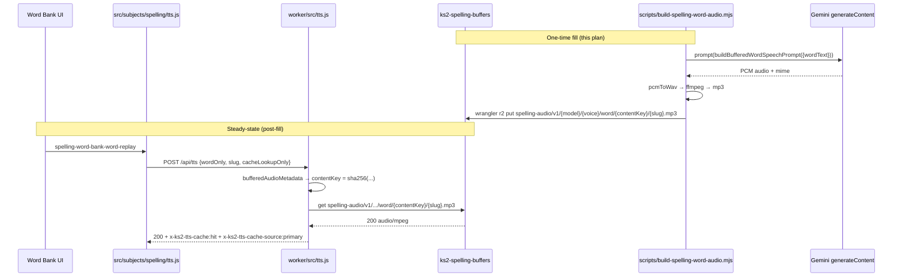

# Spelling Word Bank Audio Cache Generation

## Overview

PR 252 (merged 2026-04-26) shipped a word-only audio cache contract on the Worker
side: `tts.speak({ wordOnly: true })` from the Word Bank UI now performs a
cache-keyed lookup against R2 at
`spelling-audio/v1/{model}/{voice}/word/{contentKey}/{slug}.{mp3|wav}`, with
content-addressed
`contentKey = sha256('spelling-audio-word-v1' | cleanText(slug).toLowerCase() | cleanText(word))`
(slug is lowercased and `cleanText`-normalised by Worker
`bufferedAudioMetadata` at `worker/src/tts.js:284-303`; both inputs use
`cleanText` collapse-then-trim — see Key Technical Decisions for the full
normalisation rule).
Today every Word Bank `spelling-word-bank-word-replay` action misses cache and
falls through to a live Gemini call.

This plan generates and uploads pre-rendered word audio for the entire Word Bank
(236 unique words × 2 buffered Gemini voices = 472 R2 objects) and adds
production smoke verification so the cache-hit guarantee is demonstrable on
`ks2.eugnel.uk`. It also live-verifies PR 252's legacy fallback path against the
existing 8 612 sentence audio files generated under the pre-PR-71 R2 key shape.

---

## Problem Frame

Word Bank vocabulary practice currently routes every `wordOnly` replay through
live Gemini TTS:

* Cost: 472 unnecessary live calls per cold cohort and re-warm cycles per
  redeploy that invalidates the in-process Worker cache.
* Latency: ~1.5–2.5 s per word vs. <300 ms on a cached R2 hit.
* Reliability: live calls depend on Gemini API availability and quota; learners
  hit silent failures during outages (the cache-only warmup returns 204, then
  the live fetch fails).

PR 252 added the Worker contract, helpers, headers, and a legacy sentence-audio
fallback, but no audio bytes have been produced for the new word-only key path.
The existing `scripts/build-spelling-audio.mjs` lives only on the stale
`codex/batch-tts` worktree (`/Users/jamesto/.codex/worktrees/161a/ks2-mastery`)
and imports a removed helper (`buildSpeechPrompt` → now
`buildBufferedSpeechPrompt`) plus the pre-PR-71 4-arg `buildAudioAssetKey`
signature, so it cannot be reused as-is for the new contract.

This plan ships a focused, main-repo-resident generator + smoke harness, runs
the production fill, and captures durable runbook + learning.

---

## Requirements Trace

* R1. Generate 472 (236 words × 2 voices: `Iapetus`, `Sulafat`) word-only audio
  files into the production R2 bucket `ks2-spelling-buffers`, keyed at
  `spelling-audio/v1/{SPELLING_AUDIO_MODEL}/{voice}/word/{contentKey}/{slug}.mp3`,
  with `contentKey` computed identically to `worker/src/tts.js`
  `bufferedAudioMetadata({ wordOnly: true })`.
* R2. Provide an idempotent, resumable generator script in the main repo that
  reads `WORDS` from `src/subjects/spelling/data/word-data.js`, prompts Gemini
  via the direct `generateContent` API (with key-rotation pool), converts to
  MP3, and uploads via `wrangler r2 object put`.
* R3. Provide a production smoke probe that:
  * Confirms a sampled word-only request returns `200` with
    `x-ks2-tts-cache: hit` + `x-ks2-tts-cache-source: primary`.
  * Confirms a sampled sentence dictation request returns `200` with
    `x-ks2-tts-cache: hit` + `x-ks2-tts-cache-source: legacy` (live-validates
    PR 252's stale-key fallback against real R2 inventory).
* R4. Maintain symmetry with PR 252's contract — no Worker behaviour change,
  no client behaviour change, no breakage of the existing OpenAI / browser TTS
  fallbacks.
* R5. Capture an operator runbook + a `docs/solutions/` learning so the next
  spelling-audio regeneration can be performed without rederiving the contract.

---

## Scope Boundaries

* No regeneration of the 8 612 sentence audio files; PR 252's
  `legacyBufferedAudioKey` fallback already serves them. This plan only
  *verifies* that fallback works in production (R3).
* No changes to the `spelling-word-bank-word-replay` UI action,
  `tts.speak()` client, or the Worker's `resolveSpellingAudioRequest` /
  `bufferedAudioMetadata` logic. The contract is taken as-shipped.
* No migration of the `codex/batch-tts` worktree script. That script remains
  a historical artifact; this plan ports the minimum necessary helpers into a
  fresh, focused main-repo script.
* No batch-API path. 472 files fit comfortably under a single direct-API daily
  quota with key rotation; batch-API complexity is unwarranted at this volume.
* No new R2 bucket or binding — reuses `SPELLING_AUDIO_BUCKET` →
  `ks2-spelling-buffers`.

### Deferred to Follow-Up Work

* Future word-list expansion (KS2 Y5–6 spelling list extension) will reuse U2's
  generator with the same flags — captured in the U5 runbook, not this PR.
* Slow-pace word audio variant. Word-only currently has no `speed` axis in the
  R2 key (worker contract decision); if pedagogy later requests a slow variant,
  contract evolves first.
* Multi-account word-only sharing telemetry (the `cross-account reuse`
  Worker test in PR 252 covers correctness; a metrics dashboard for actual
  cross-account hits is a separate observability plan).

---

## Context & Research

### Relevant Code and Patterns

* `shared/spelling-audio.js` — `buildWordAudioAssetKey()` (lines 171–189) is
  the canonical key builder; `buildBufferedSpeechPrompt()` (line 92) is the
  sentence prompt template. **Add** a sibling `buildBufferedWordSpeechPrompt()`
  here so Worker and batch share one prompt source.
* `worker/src/tts.js` — `bufferedAudioMetadata()` (lines 282–324) defines the
  word-only contentKey hash; `geminiPrompt()` (lines 554–570) currently inlines
  the word-only prompt; `readBufferedGeminiAudio()` (lines 384–448) shows the
  mp3-then-wav extension precedence and the legacy-fallback semantics.
* `worker/src/subjects/spelling/audio.js` — `wordBankPromptToken()` (lines
  38–46) defines the prompt token contract; `resolveSpellingAudioRequest()`
  (lines 109–205) is the only resolver path; do not modify.
* `src/subjects/spelling/data/word-data.js` — exports `WORDS` (236 entries)
  and `WORD_BY_SLUG`. Same data the Worker pulls into its snapshot via
  `SEEDED_SPELLING_PUBLISHED_SNAPSHOT`. Verified `WORDS.length === 236` and
  `new Set(WORDS.map(w=>w.slug)).size === 236`.
* `src/subjects/spelling/tts.js` — `remotePromptRequest()` (lines 80–97) sends
  `wordOnly: true` + `scope: 'word-bank'` for word-bank replay. Confirms the
  client contract this cache must serve.
* `tests/worker-tts.test.js` (PR 252) — 49/49 passing; covers word-only lookup
  hits, cold stores, cache-only warmups, cross-account reuse, no-legacy
  probes, store failures. Patterns to follow for U1/U2/U3 tests.
* `/Users/jamesto/.codex/worktrees/161a/ks2-mastery/scripts/build-spelling-audio.mjs`
  — historical reference for direct-API key-rotation pool, `pcmToWavBuffer`,
  `ffmpeg` mp3 conversion, `wrangler r2 object put` upload helper, state-file
  shape under `.spelling-audio/runs/<runId>/`. Use as design reference; do not
  branch from it.

### Institutional Learnings

* `ce-learnings-researcher` reports `docs/solutions/` is **not yet
  established** in this repo — no prior distilled learnings on spelling
  TTS / R2 / cache-key migrations exist. Treat this work as net-new ground
  and capture a learning entry as part of U5 (recommended candidate
  topics: content-addressed cache key contract, legacy fallback strategy
  for stale R2 objects, Gemini direct-API rotation + ffmpeg pipeline,
  production smoke contract for audio assets).
* Auto-memory `feedback_ai_enrichment_safe_lane.md` — TTS is server-side
  only, non-scored. No conflict; this work strictly serves an existing
  audio path.
* Auto-memory `project_tts_openai.md` — OpenAI is the runtime default,
  Gemini is fallback; the buffered cache being filled here is the Gemini
  pre-cached lane, selectable by the learner profile, disclosed as AI voice.
* Auto-memory `feedback_verification_v2.md` — `npm run verify` pre-deploy
  and `smoke:production:*` per subject are mandated; U3 is the smoke entry
  for this work.

### External References

* PR #252 contract: `gh pr view 252` body and merged diff
  (`shared/spelling-audio.js +48`, `worker/src/tts.js +117/-44`,
  `tests/worker-tts.test.js +346`).
* Recent commits `66bb61c` and `d9c0145` on `main` — the merge + the
  follow-up review fix; both are baseline for this plan.

---

## Key Technical Decisions

* **Generator location: main repo, fresh focused script.** Keeps audio
  generation as first-class infrastructure under normal review/CI; avoids
  rebasing the stale `codex/batch-tts` worktree (broken imports). Trade-off:
  some helper logic is duplicated from the historical worktree script, but
  duplication is bounded to ~150 LOC of glue (key rotation, retry, ffmpeg,
  `wrangler` upload).
* **Direct API only, no batch API.** 472 files (≤500) fits inside a single
  daily quota with one key; sequential or low-concurrency execution
  (≤4 parallel) keeps QPS well under per-key limits. Batch-API state
  machinery is unjustified at this volume.
* **MP3 default output.** Worker tries `mp3` before `wav`
  (`BUFFERED_AUDIO_EXTENSIONS` precedence); MP3 is ~10× smaller; ffmpeg via
  `libmp3lame` already used in historical batch script.
* **`contentKey` digest format is base64url, not hex.** Worker's `sha256()`
  in `worker/src/auth.js:156-185` returns `bytesToBase64Url(...)` (URL-safe
  alphabet, no padding: `+`→`-`, `/`→`_`, trailing `=` stripped). Generator
  MUST produce the byte-equal base64url string. Generator imports the same
  `sha256` from `worker/src/auth.js` rather than re-implementing via Node's
  `node:crypto` `createHash('sha256').digest('hex')` — eliminates an entire
  class of digest-encoding drift. U1's parity test pins both the raw digest
  bytes and the encoded string against a hand-computed fixture so any
  future encoding change in `auth.js` fails CI immediately.
* **`cleanText` normalisation parity.** Worker hashes `cleanText(payload.word)`
  where `cleanText = String(value || '').replace(/\s+/g, ' ').trim()`
  (`worker/src/tts.js:38-40`) — collapses internal whitespace including
  NBSP, double-space, tabs, before trimming. Generator MUST apply the same
  normalisation to `WORDS[i].word` before hashing. U1 fixture includes
  `'  accident with  nbsp  '` to prove collapse parity.
* **Two-source assertion for `(slug, word)` equality.** Worker validates
  Word Bank tokens against `snapshot.wordBySlug[slug].word`
  (`worker/src/subjects/spelling/audio.js:96-103`); generator hashes
  `WORDS[i].word`. The seed pipeline produces both from one source today,
  but no contract guarantees they remain equal. Generator preflight asserts
  `cleanText(WORDS[i].word) === cleanText(SEEDED_SPELLING_PUBLISHED_SNAPSHOT.wordBySlug[WORDS[i].slug].word)`
  for all 236 slugs. Mismatch aborts the run before any Gemini spend.
* **Shared `buildBufferedWordSpeechPrompt()` helper.** Worker's current
  `geminiPrompt()` inlines the word-only template
  (`worker/src/tts.js:554–558`). Extracting to `shared/spelling-audio.js`
  guarantees batch generator and live regen produce audio from a single
  prompt source — eliminates a future drift class. Only the wordOnly
  branch is in scope; the third `transcript`-only fallback branch
  (`worker/src/tts.js:566-569`) is dead code in current production paths
  and is deferred to a separate cleanup. OpenAI's `ttsInstructions`
  wordOnly variant (`worker/src/tts.js:154`) is unaffected — this plan
  only fills the buffered Gemini cache lane.
* **R2 upload via `wrangler-oauth.mjs` wrapper, not raw `npx wrangler`.**
  Existing scripts (`db:migrate:remote`, `deploy`, `audit:production`) all
  shell out through `node ./scripts/wrangler-oauth.mjs ...` to benefit
  from OAuth handling and the `WORKERS_CI` / `CLOUDFLARE_API_TOKEN`
  cleanup logic. Generator follows the same pattern. The `--remote` flag
  MUST be passed explicitly to every `r2 object put` invocation —
  verified against installed wrangler 4.x: `--remote` and `--local` are
  separate opt-in flags with no documented default; omitting both can
  silently target Miniflare local persistence. Matches the historical
  batch script (`worktrees/161a/.../build-spelling-audio.mjs:617`) and
  the `db:migrate:remote` precedent (`package.json:29`), which also pass
  `--remote` explicitly.
* **Generator-written `customMetadata` shape.** Worker's
  `storeBufferedGeminiAudio` writes
  `customMetadata = { model, voice, contentKey, slug, kind, source: 'worker-gemini-tts' }`
  (`worker/src/tts.js:507-518`). Generator passes the same shape with
  `source: 'batch-fill-2026-04-26'` (or `${runId}`) so the two writer
  lanes are distinguishable in R2 audits. All other fields match
  Worker's. Worker reads tolerate missing customMetadata
  (`worker/src/tts.js:365-371`), so omitting is functionally equivalent
  but loses forensic signal — match the shape.
* **Hash + key parity guarded by test, not convention.** U1 ships a unit
  test that:
  1. Computes the R2 key via the new shared helper.
  2. Asserts byte equality against `buildWordAudioAssetKey({ ... })` for
     the same `(slug, word, voice)`.
  3. Asserts byte equality against the key Worker's
     `bufferedAudioMetadata({ wordOnly: true, slug, word, bufferedGeminiVoice: voice })`
     would produce, for a fixture covering both voices, a NBSP-containing
     word, and a word with mixed case.
  Prevents silent contract drift if either side is touched later.
* **Operational gating via small-sample first.** U4 explicitly runs 4 files
  (2 words × 2 voices) and verifies cache hit locally + on production before
  unlocking the full 472-file run. The cost of one wasted hour of operator
  time vastly outweighs 472 wasted Gemini calls + corrupt R2 objects.
* **Live-regen race mitigation during U4 full run.** R2 PUT is
  last-writer-wins — Worker's `storeBufferedGeminiAudio` (line 520) calls
  `bucket.put(key, bytes, ...)` with no `onlyIf` precondition. If a learner
  triggers `tts.speak({ wordOnly: true })` (non-`cacheLookupOnly`) during
  the 60–90 min full run, Worker's live regen could overwrite a
  just-uploaded batch object with a slightly different live take —
  silently. Mitigation: U4 step 4 runs during a low-traffic window
  (early morning UTC) AND uses the cache-only client path
  (`cacheLookupOnly: true`) for any verification probes, so smoke probes
  cannot trigger a competing store. If overlap is unavoidable,
  alternative is a temporary Worker-side guard
  (`onlyIf: { etagDoesNotMatch: '*' }` on store) gated behind a feature
  flag — costs an extra small PR; chosen mitigation recorded in U4
  Preflight.
* **Idempotency via state file + R2 inventory reconciliation.** Generator
  state file under `.spelling-audio/word-runs/<runId>/state.json` records
  per-entry status; re-invocation skips already-uploaded entries.
  Additionally, a `--from-r2-inventory` preflight option lists existing
  objects under `spelling-audio/v1/{model}/{voice}/word/` (via
  `wrangler r2 object list --remote`) and seeds the state file with
  `status: uploaded` for every key already present. Operators MUST run
  reconcile after any state-file loss (codified in U5 runbook). Survives
  transient 502s on R2 upload (the failure mode that bit the 8 612-sentence
  run) and survives `rm -rf .spelling-audio/` accidents without burning
  Gemini quota a second time.

---

## Open Questions

### Resolved During Planning

* Where does the script live? — Main repo (`scripts/build-spelling-word-audio.mjs`).
* Direct API vs. batch API? — Direct (volume justifies it).
* Should sentence regeneration be in scope? — No, PR 252 fallback handles it;
  this plan only live-verifies via U3.
* Should we live-probe sentence legacy fallback as part of this work? — Yes
  (operator confirmation); included in U3.
* Smoke probe naming and composition? — `smoke:production:spelling-audio`
  as a peer of the existing per-subject smokes
  (`smoke:production:grammar`, `:punctuation`, `:spelling-dense`,
  `:bootstrap`, `:effect`); no parent `smoke:production:spelling`
  exists today and inventing one would diverge from convention.
* Argv convention for the smoke probe? — `--origin` / `--url`
  (with env override `KS2_SMOKE_ORIGIN`), per
  `scripts/lib/production-smoke.mjs:argValue + configuredOrigin`;
  default `https://ks2.eugnel.uk`. Do not introduce `--base-url`.
* Hash digest format and helper? — base64url via the canonical
  `sha256` exported from `worker/src/auth.js`; generator imports it
  directly rather than re-implementing.
* Generator's wrangler invocation? — Through
  `node ./scripts/wrangler-oauth.mjs r2 object put ...`, matching
  `db:migrate:remote` + `deploy` precedent. No `--remote` flag (default
  in wrangler v4).
* Production R2 bucket binding and physical name? — Confirmed: binding
  `SPELLING_AUDIO_BUCKET`, physical `ks2-spelling-buffers`
  (`wrangler.jsonc` `r2_buckets[0]`). Plan references match.
* Should U1 also extract the third inlined branch of `geminiPrompt`
  (`worker/src/tts.js:566-569`)? — No, that branch is dead in current
  production paths (resolver always populates both `word` and `sentence`
  for sentence requests). Deferred as a separate cleanup.
* Should U1 extract OpenAI `ttsInstructions` wordOnly variant
  (`worker/src/tts.js:154`) for symmetry? — No, this plan only fills the
  buffered Gemini cache lane; OpenAI provider is unaffected.

### Deferred to Implementation

* Exact retry/backoff curves for Gemini 429 and R2 502 — tune empirically
  during U4 small-sample run; codify in U5 runbook.
* Default direct concurrency (`--concurrency`) — start at `4`, validate during
  U4 small-sample run; codify in runbook.
* Whether to update `spelling-audio/v1/manifest.json` with a word-only
  inventory section — defer to U4; if Worker reads it for any reason
  (currently no), update; otherwise leave manifest alone (Worker derives
  expected keys from contentKey hash; manifest is informational only).
* Voice selection acceptance criterion (sound test) — operator listens to all
  4 sample files in U4; if either voice sounds wrong, escalate before full run.
* State-file location: `.spelling-audio/word-runs/` (hidden, gitignored —
  matches historical script convention but no main-repo precedent) vs
  `reports/spelling-audio/runs/` (matches main-repo precedent of
  `reports/capacity/`). Default to `.spelling-audio/word-runs/` + add
  `.gitignore` entry; revisit if maintainer prefers `reports/` convention.
* Whether U4's live-regen race mitigation needs a Worker-side
  `onlyIf` precondition or whether the low-traffic-window approach is
  sufficient — decide during U4 Preflight based on observed Word Bank
  traffic in the chosen window.

---

## High-Level Technical Design

> *This illustrates the intended approach and is directional guidance for review,
> not implementation specification. The implementing agent should treat it as
> context, not code to reproduce.*

The cache slot is keyed by `{model, voice, contentKey, slug}`; the batch
generator and Worker both compute `contentKey` from the same
`(slug, word)` pair via the same `sha256` over the same delimited string,
so a byte-equal R2 key is the only correctness invariant the generator must
preserve. A unit test guards that invariant in U1/U2.

---

## Implementation Units

### U1. Shared word-only prompt helper + Worker refactor

**Goal:** Extract the inline word-only prompt template from
`worker/src/tts.js` into a shared helper so Worker (live regen) and batch
generator (cache pre-fill) produce audio from one source of truth, and add
unit-level guarantees that the batch-side R2 key matches the Worker-side R2
key for the same `(slug, word)` input.

**Requirements:** R1, R4, R5

**Dependencies:** None

**Files:**
* Modify: `shared/spelling-audio.js`
* Modify: `worker/src/tts.js`
* Test: `tests/spelling-word-prompt.test.js`

**Approach:**
* Add `buildBufferedWordSpeechPrompt({ wordText })` to
  `shared/spelling-audio.js` returning the exact string Worker currently
  inlines (`Read exactly this KS2 spelling word once in natural British
  English. Do not add any extra words:\n\n${wordText}`). Apply Worker's
  `cleanText` semantics verbatim: `String(wordText || '').replace(/\s+/g,
  ' ').trim()` — collapses NBSP, double-space, tabs to single space, then
  trims. Bare `.trim()` is insufficient; it would diverge from Worker's
  `bufferedAudioMetadata` normalisation and break hash parity.
* In `worker/src/tts.js` `geminiPrompt()`, replace the inline word-only
  branch (lines 555–558) with a call to the new helper, passing
  `payload.transcript` (which `resolveSpellingAudioRequest` already
  computed as `parts.word`). Verify the byte-equal pre/post snapshot.
* Export `buildBufferedWordSpeechPrompt` alongside the existing audio key
  builders so the batch script can import it.
* No behavioural change to live wordOnly generation — the prompt string is
  byte-equal pre/post refactor (verified by snapshot test).
* Out of scope (deferred): the third inlined branch of `geminiPrompt`
  (`worker/src/tts.js:566-569` — `transcript`-only fallback) is dead code
  in current production paths; OpenAI's `ttsInstructions` wordOnly variant
  (line 154) is the OpenAI lane and is unaffected.

**Patterns to follow:**
* `buildBufferedSpeechPrompt()` (`shared/spelling-audio.js:92`) — same
  function shape, instructional preamble + transcript.
* PR 252's worker-tts test additions for word-only behaviour
  (`tests/worker-tts.test.js`).
* `cleanText` shape used by `worker/src/tts.js:38-40` and
  `worker/src/subjects/spelling/audio.js:7-9` (same definition repeated
  in both files — copy verbatim into the shared helper, do not invent).

**Test scenarios:**
* Happy path: `buildBufferedWordSpeechPrompt({ wordText: 'accident' })`
  returns the exact string Worker inlined pre-refactor (snapshot-matched
  against the literal in `worker/src/tts.js:557` as it stood at HEAD
  before this PR).
* Edge case: leading/trailing whitespace in `wordText` is trimmed (`'  accident  '`
  → same prompt as `'accident'`).
* Edge case: internal NBSP (`'accident word'`) is collapsed to
  single space (`'accident word'`) — proves `cleanText` parity, not just
  `.trim()`.
* Edge case: internal double-space (`'two  spaces'`) is collapsed to
  single space.
* Edge case: empty `wordText` is rejected or returns prompt with empty
  transcript line (decide in implementation; assert chosen behaviour
  matches Worker's behaviour for the same input).
* Integration: hash parity — for a fixture
  `{ slug: 'accident', word: 'accident' }`, `await sha256('spelling-audio-word-v1|accident|accident')`
  imported from `worker/src/auth.js` returns a base64url string
  (matches `/^[A-Za-z0-9_-]+$/`, no `=` padding); the digest is
  byte-equal to the value `bufferedAudioMetadata({ wordOnly: true, ... })`
  computes for the same input. Pin the digest as a hard-coded fixture so
  any future change to `auth.js` `bytesToBase64Url` fails CI.
* Integration: round-trip key parity — for the same fixture, the R2 key
  produced by `buildWordAudioAssetKey({ model, voice, contentKey, slug })`
  is byte-equal to the key Worker's `bufferedAudioMetadata` →
  `bufferedAudioKey` would produce. Assert for both voices `Iapetus` and
  `Sulafat`.
* Integration: round-trip key parity with `cleanText`-bearing input —
  fixture `{ slug: 'accident', word: '  accident demo  ' }`
  produces the same key as `{ slug: 'accident', word: 'accident demo' }`
  through the helper, and both produce the same key as the Worker would
  for `payload.word = '  accident demo  '`.
* Integration: Worker `geminiPrompt({ wordOnly: true, transcript: 'accident' })`
  returns the same string as `buildBufferedWordSpeechPrompt({ wordText: 'accident' })`
  (single-source guarantee post-refactor).

**Verification:**
* `npm test -- spelling-word-prompt.test.js` passes.
* `npm test -- worker-tts.test.js` still passes (no regression of PR 252's
  49 tests).
* `node --check` passes for both modified files.

---

### U2. Word-only batch generator script + npm wiring

**Goal:** Ship a production-ready, idempotent generator that turns the
`WORDS` list into 472 R2 objects under the new word-only key contract,
gated by per-entry state + R2 inventory reconciliation, with key-rotation
pool, ffmpeg conversion, OAuth-wrapped wrangler upload, and a fixture-pinned
parity test against the Worker hash output.

**Requirements:** R1, R2, R5

**Dependencies:** U1 (uses `buildBufferedWordSpeechPrompt` and exported
`buildWordAudioAssetKey`).

**Files:**
* Create: `scripts/build-spelling-word-audio.mjs`
* Modify: `package.json` (add `spelling:word-audio` npm script)
* Modify: `.gitignore` (add `.spelling-audio/`)
* Test: `tests/build-spelling-word-audio.test.js`

**Approach:**
* **CLI commands** (mirror existing `enrich-spelling-vocabulary.mjs`
  positional-command style for consistency with main-repo conventions):
  * `list` — print the 236 words and the 472 expected R2 keys (no API calls).
  * `reconcile [--run-id <id>]` — Cloudflare REST API
    `GET /accounts/{CLOUDFLARE_ACCOUNT_ID}/r2/buckets/ks2-spelling-buffers/objects?prefix=spelling-audio/v1/{model}/{voice}/word/&cursor=...`
    for each voice, paginated until `truncated: false`. Auth via
    `Authorization: Bearer ${CLOUDFLARE_API_TOKEN}`. Seed state file
    with `status: uploaded` for every present key. MUST be invoked
    after any state-file loss.
  * `dry-run` — same as `generate` but stops before Gemini call; writes
    fixture state file showing what would be done.
  * `generate [--slug <csv>] [--limit N] [--offset N] [--voice <id>]
    [--concurrency 4] [--max-retries 3] [--dry-run] [--skip-upload]
    [--from-r2-inventory]` — runs the pipeline.
  * `status [--run-id <id>]` — reads state file, prints
    planned/succeeded/failed/uploaded counts and any `lastError` per entry.
* **Argv style:** custom positional + flag parser; do not depend on
  `node:util parseArgs` or third-party libs (matches existing
  `scripts/spelling-dense-history-smoke.mjs:178-252` precedent).
* **State file:** `.spelling-audio/word-runs/<runId>/state.json`. Per entry:
  `{ slug, word, voice, key, contentKey, status: 'pending'|'generated'|'uploaded'|'failed', attempts, lastError, hashSource: 'WORDS'|'snapshot' }`.
  Add `.spelling-audio/` to `.gitignore` (no main-repo precedent for the
  hidden dir; explicitly ignore so the local-only run state never accidentally
  commits).
* **Resumability:** re-running `generate` with the same `--run-id` skips
  entries with status `uploaded`. Without `--run-id`, creates a new run.
  `--from-r2-inventory` runs `reconcile` first.
* **Pipeline per entry:**
  1. Read `WORDS` from `src/subjects/spelling/data/word-data.js` and
     `SEEDED_SPELLING_PUBLISHED_SNAPSHOT.wordBySlug` (or via
     `resolveRuntimeSnapshot`) from the same module.
  2. **Preflight assertion** (run once, before any per-entry work):
     for every `WORDS[i]`, assert
     `cleanText(WORDS[i].word) === cleanText(wordBySlug[WORDS[i].slug].word)`.
     Mismatch aborts the run with a clear error naming the divergent slug.
  3. For each `(word, voice)` pair, compute `contentKey` via an inline
     4-line shim (`crypto.subtle.digest('SHA-256', encoder.encode(input))`
     + `bytesToBase64Url` URL-safe alphabet rewrite) duplicating Worker's
     `worker/src/auth.js:156-185 sha256`. Hash input is
     `['spelling-audio-word-v1', cleanText(word.slug).toLowerCase(), cleanText(word.word)].join('|')`.
     Output is base64url (no `=` padding, `+`→`-`, `/`→`_`). Inline
     duplication is preferred over importing from `worker/src/auth.js` —
     the worker module pulls Worker-runtime dependencies that may not
     resolve cleanly from `scripts/`, and the U1 fixture-pinned parity
     test is the actual drift defence (not the import path). Do **not**
     re-implement via `node:crypto` `createHash('sha256').digest('hex')`
     — the encoding will not match.
  4. Build R2 key via `buildWordAudioAssetKey({ model, voice, contentKey, slug })`
     (imported from shared). Same model constant
     `SPELLING_AUDIO_MODEL = 'gemini-3.1-flash-tts-preview'`.
  5. Build prompt via `buildBufferedWordSpeechPrompt({ wordText: word.word })`
     (imported from shared — applies cleanText internally per U1).
  6. POST to Gemini `${model}:generateContent` with same body shape as Worker
     (`worker/src/tts.js:666-693`), using next API key in rotation pool.
  7. Decode base64 PCM → WAV (port `pcmToWavBuffer` from historical script
     OR re-use Worker's `pcmToWav` semantics from
     `worker/src/tts.js:583-607` — pick whichever fits cleaner Node-side).
  8. ffmpeg `libmp3lame` → mp3 (port from historical script).
  9. Upload via `node ./scripts/wrangler-oauth.mjs r2 object put
     SPELLING_AUDIO_BUCKET/{key} --file <mp3-path>
     --content-type audio/mpeg --remote`
     — `--remote` flag MUST be passed explicitly (verified against
     wrangler 4.x: no documented default for `r2 object put`; omitting
     both `--remote` and `--local` may target Miniflare local
     persistence). No `customMetadata` is stamped (wrangler 4.x has no
     `--custom-metadata` flag and the resolved-decision section
     intentionally drops the feature; Worker reads tolerate missing
     customMetadata).
  10. Mark entry `uploaded`, persist state.
* **Preflight checks** (fail-fast at script start):
  * `WORDS.length === 236` (fixture-size sanity).
  * Per-slug `cleanText(WORDS[i].word) === cleanText(wordBySlug[slug].word)`
    (per step 2 above).
  * `ffmpeg -version` exits 0.
  * `node ./scripts/wrangler-oauth.mjs whoami` exits 0 (OAuth alive).
  * At least one of `GEMINI_API_KEY`, `GEMINI_API_KEY_2`,
    `GEMINI_API_KEY_3`, or non-empty `GEMINI_API_KEYS` present.
  * For `reconcile` / `--from-r2-inventory` paths: both
    `CLOUDFLARE_ACCOUNT_ID` and `CLOUDFLARE_API_TOKEN` (R2 read scope)
    present in env. Not required for plain `generate` runs that don't
    touch reconcile.
* **Retry:** per-entry exponential backoff on Gemini 429 (rotate to next
  key) and R2 upload 502/503 (retry up to `--max-retries`).
* **Concurrency:** `--concurrency N` runs N entries in parallel; default 4.
* **Audit blocklist coverage (no edit needed):** verified that
  `scripts/audit-client-bundle.mjs:145` and
  `scripts/production-bundle-audit.mjs:135` both use
  `text.includes(token)` substring matching, and the existing
  `'GEMINI_API_KEY'` token already catches `GEMINI_API_KEY_2`,
  `GEMINI_API_KEY_20`, and `GEMINI_API_KEYS`. No new blocklist entries
  required. Add a unit test under `tests/audit-client-bundle.test.js`
  (or new file) pinning this substring behaviour as a defence against
  future matcher tightening that would silently drop coverage.
* No interactive prompts; runs unattended.

**Patterns to follow:**
* Historical batch script's `directApiKeyPool()`, `pcmToWavBuffer()`,
  ffmpeg invocation. Port functions inline, do not import from worktree.
* `scripts/wrangler-oauth.mjs` for the wrangler invocation wrapper —
  same pattern as `db:migrate:remote` and `deploy` npm scripts.
* `scripts/spelling-dense-history-smoke.mjs:178-252` for argv parser style.
* `scripts/enrich-spelling-vocabulary.mjs:13-18` for positional-command
  dispatch.
* `tests/worker-tts.test.js` (PR 252) for R2 + Gemini fixture patterns.
* `tests/grammar-production-smoke.test.js:1-50` for the export-pure-helpers
  test pattern (export `pcmToWavBuffer`, `buildR2Key`,
  `parseStateFile`, `assertWordsSnapshotParity` so they are unit-testable).

**Test scenarios:**
* Happy path: `list` emits 472 lines, each with a valid R2 key shape and
  voice in `{Iapetus, Sulafat}`; planned count = 472; planned slugs are
  exactly the 236 unique slugs in `WORDS`.
* Happy path: `dry-run --slug accident,beginning` plans 4 entries (2 words
  × 2 voices), state file written, no Gemini call made; each entry's
  `key` and `contentKey` byte-match a hand-computed fixture.
* Edge case: unknown `--slug typo` exits non-zero with explicit error
  naming the unknown slug.
* Edge case: `--limit 1 --offset 0` plans the first word's 2 voice
  variants; `--offset 235 --limit 1` plans the last word's variants.
* Edge case: `WORDS` snapshot-mismatch fixture (mocked) → preflight
  aborts before Gemini call; error message names the divergent slug.
* Error path: missing all `GEMINI_API_KEY*` → preflight fails before any work.
* Error path: stub-failed Gemini call → entry marked `failed` with
  `attempts` incremented; rerun with same `--run-id` retries only failed
  entries.
* Error path: stub-failed `wrangler r2 object put` → entry marked
  `generated` (mp3 on disk) but not `uploaded`; rerun retries upload only.
* Error path: state file deleted between runs → `--from-r2-inventory`
  successfully reconstructs `uploaded` status from R2 listing; subsequent
  `generate` skips already-uploaded entries.
* Integration: hash byte-equality — for fixture
  `{ slug: 'accident', word: 'accident' }`, the script computes the same
  base64url digest as Worker's `bufferedAudioMetadata({ wordOnly: true,
  slug: 'accident', word: 'accident', bufferedGeminiVoice: 'Iapetus' })`.
  Assert against a hard-coded expected base64url value (computed once via
  Worker's `sha256` and pinned).
* Integration: cleanText parity — fixture
  `{ slug: 'accident', word: '  accident demo  ' }` produces the
  same key as `{ slug: 'accident', word: 'accident demo' }`. NBSP fixture
  is critical: catches any drift between bare `.trim()` and full
  `cleanText`.
* Integration: R2 key byte-equality — script produces the same key string
  as `buildWordAudioAssetKey()` invoked with the same inputs (catches
  any encoding drift in path-segment escaping).
* Integration: customMetadata flag string — assert the constructed
  `--custom-metadata model=...,voice=...,contentKey=...,slug=...,kind=word,source=batch-fill-...`
  argument string for a fixture entry; verify `source` differs from
  Worker's `'worker-gemini-tts'` literal.
* Integration: audit-blocklist substring coverage — fixture text
  containing `GEMINI_API_KEY_2=foo` and `GEMINI_API_KEYS=foo,bar` is
  detected by both `audit-client-bundle.mjs` and
  `production-bundle-audit.mjs` via the existing `'GEMINI_API_KEY'`
  substring rule. Pins the matcher behaviour against future tightening.
* Covers R1: planned → uploaded count parity test asserts that after a
  simulated full run, exactly 472 entries reach status `uploaded`.

**Verification:**
* `npm test -- build-spelling-word-audio.test.js` passes.
* `npm run spelling:word-audio -- list | wc -l` reports 472.
* `npm run spelling:word-audio -- dry-run --slug accident` writes a state
  file with 2 entries, both with mp3 content type and the correct R2 key
  shape, and base64url contentKey (no `=` padding, no `+` or `/`).
* `npm run audit:production` still passes (no regression from added
  audit-coverage test).
* `npm run check` (lint/format) passes for new files.

---

### U3. Production spelling-audio smoke probe

**Goal:** Provide a repeatable production probe that asserts the new
word-only primary cache hit (post-U4), PR 252's legacy sentence fallback
hit (pre- and post-U4), and the cross-account R2 key invariant on
`ks2.eugnel.uk`. Wired as a peer of the existing per-subject
`smoke:production:*` family.

**Requirements:** R3, R5

**Dependencies:** U1 (uses shared key/hash helpers + canonical `sha256`
from `worker/src/auth.js` to construct expected R2 keys and prompt
tokens); independent of U2 — can be developed in parallel with U2.

**Files:**
* Create: `scripts/spelling-audio-production-smoke.mjs`
* Modify: `package.json` (add `smoke:production:spelling-audio` npm
  script — peer of `smoke:production:grammar`,
  `:punctuation`, `:spelling-dense`, `:bootstrap`, `:effect`; do **not**
  invent a parent `smoke:production:spelling`)
* Test: `tests/spelling-audio-production-smoke.test.js`

**Approach:**
* **CLI** (mirror `scripts/punctuation-production-smoke.mjs` and
  `grammar-production-smoke.mjs`): `npm run smoke:production:spelling-audio
  -- [--origin <url> | --url <url>] [--word-sample <csv>]
  [--sentence-sample <csv>] [--require-word-hit] [--require-legacy-hit]
  [--json] [--timeout-ms 15000]`. Origin defaults via
  `configuredOrigin({ envName: 'KS2_SMOKE_ORIGIN' })` from
  `scripts/lib/production-smoke.mjs` → `https://ks2.eugnel.uk`. Do NOT
  introduce `--base-url` (would diverge from existing convention).
* **Imports from `scripts/lib/production-smoke.mjs`:** `argValue`,
  `configuredOrigin`, `DEFAULT_PRODUCTION_ORIGIN`, plus the existing
  helpers used by the per-subject smokes (`createDemoSession`,
  `loadBootstrap`, `subjectCommand`, `assertOkResponse`, `getJson` —
  whichever apply).
* **Exit-code taxonomy** (mirror
  `scripts/spelling-dense-history-smoke.mjs:134-176`):
  `EXIT_OK = 0`, `EXIT_VALIDATION = 1`, `EXIT_USAGE = 2`,
  `EXIT_TRANSPORT = 3`. Tag thrown errors with `error.kind = 'validation'`
  or `'transport'` so transport-vs-contract failures classify
  deterministically. Export `runCli`, `parseArgs`, and the `EXIT_*`
  constants for tests.
* **Probes:**
  * **Word-only primary probe** — for each word in `--word-sample`
    (default: 4 deterministic samples, e.g.,
    `accident,beginning,knowledge,thought`) × 2 voices: build wordBank
    prompt token via the **canonical** `sha256` from
    `worker/src/auth.js` (do not duplicate the algorithm), POST `/api/tts`
    with `{ wordOnly: true, scope: 'word-bank', slug,
    bufferedGeminiVoice, cacheLookupOnly: true }`, expect `200` + headers
    `x-ks2-tts-cache: hit` + `x-ks2-tts-cache-source: primary` +
    `x-ks2-tts-model: gemini-3.1-flash-tts-preview` +
    `x-ks2-tts-voice: <voice>`. Reports miss without failing if
    `--require-word-hit` is absent (so the probe can run pre-U4 and
    produce a baseline report).
  * **Sentence legacy probe** — for each sentence in `--sentence-sample`
    (default: 2 known cards from the seeded snapshot): POST `/api/tts`
    with the session-style payload (`promptToken` matching
    `sessionPromptToken` in `worker/src/subjects/spelling/audio.js:27-36`,
    `cacheLookupOnly: true`), expect `200` + headers
    `x-ks2-tts-cache: hit` + `x-ks2-tts-cache-source: legacy`. Live-validates
    the PR 252 fallback path on real R2 inventory.
  * **Cross-account invariant probe** — for the same fixture word, build
    two distinct wordBank prompt tokens for two distinct learner ids
    (two demo sessions via `createDemoSession`; do NOT fake learnerIds —
    Worker validates `learnerId` against session at
    `worker/src/subjects/spelling/audio.js:114-118`), assert the tokens
    are different (per-learner salt) but resolve to the same R2 key path
    (Worker hash deliberately omits `accountId` for cross-account cache
    reuse, per PR 252 design). Both requests cache-hit AND **assert
    response body bytes are byte-identical** (catches a regression that
    breaks per-learner token but accidentally maps both to the same
    WRONG R2 key). Then run a third probe for a different word and assert
    its body bytes differ from the first two — proves key resolution is
    actually distinct, not collapsed. Stays within "no Worker behaviour
    change" boundary (no new headers needed).
* **Report:** human-readable summary + machine-readable JSON when
  `--json` (`{ ok, origin, accountId, learnerId, probes: [...], ... }`,
  matching the existing per-subject smoke shape). Exit code per the
  EXIT_* taxonomy.
* **Auth:** smoke runs against an existing pre-provisioned smoke learner
  (per prior `smoke:production:*` pattern via
  `lib/production-smoke.mjs` `createDemoSession` / `loadBootstrap`);
  reuse env vars and credentials from existing smoke scripts. If no
  smoke learner is configured, fail preflight with `EXIT_USAGE` and an
  explicit setup hint.
* **Entry guard:** `if (process.argv[1] && import.meta.url ===
  pathToFileURL(process.argv[1]).href) main()...` — same shape as
  `punctuation-production-smoke.mjs:337`.
* **Error reporter:** `main().catch((error) => { console.error('[spelling-audio-production-smoke] '
  + (error?.stack || error?.message || error)); process.exit(error?.kind === 'transport' ? EXIT_TRANSPORT : EXIT_VALIDATION); })`.

**Patterns to follow:**
* `scripts/punctuation-production-smoke.mjs` — overall structure, JSON
  output shape, entry guard, error reporter.
* `scripts/grammar-production-smoke.mjs` — peer reference for
  per-subject probe organisation.
* `scripts/spelling-dense-history-smoke.mjs:134-252` — argv parser style
  + `EXIT_*` taxonomy + tagged error kinds.
* `scripts/lib/production-smoke.mjs` — origin/argv/auth helpers.
* `tests/spelling-dense-history-smoke.test.js:1-50` — `runCli` + mocked
  `jsonResponse(payload, init)` fetch seam pattern for unit tests.
* `worker/src/subjects/spelling/audio.js:27-46` — `sessionPromptToken` +
  `wordBankPromptToken` salt prefixes (port verbatim for assertion
  correctness).

**Test scenarios:**
* Happy path: against a stubbed `jsonResponse` returning headers
  `{cache: 'hit', source: 'primary', model, voice}` for word probes and
  `{cache: 'hit', source: 'legacy'}` for sentence probes, `runCli`
  returns `EXIT_OK` and JSON report shows all probes succeeded.
* Edge case: word probe receives `cache: 'miss'` without `--require-word-hit`
  → reports `WARN`, returns `EXIT_OK`; with `--require-word-hit` →
  returns `EXIT_VALIDATION`.
* Edge case: legacy sentence probe receives `cache-source: primary`
  (i.e., post-eventual-sentence-regeneration) → reports `INFO: legacy
  fallback no longer required` and passes.
* Edge case: cross-account probe — fixture two learner ids produce
  distinct prompt tokens (`token_A !== token_B`) but the smoke runner
  computes the same expected R2 key for both; both probes cache-hit
  AND `await response_A.arrayBuffer() === await response_B.arrayBuffer()`
  byte-identical. A third probe for a different word produces distinct
  body bytes (rules out collapse-to-wrong-key regression).
* Error path: 5xx from `/api/tts` → returns `EXIT_TRANSPORT` with body
  excerpt in report.
* Error path: missing smoke learner credentials → preflight returns
  `EXIT_USAGE` with setup hint.
* Error path: response missing `x-ks2-tts-cache-source` header
  (regression of PR 252) → returns `EXIT_VALIDATION` with explicit
  diagnostic.
* Integration: prompt token computed by smoke script for a fixture word
  byte-matches the token Worker would compute for the same inputs
  (verified by importing the same `sha256` from `worker/src/auth.js`).
* Integration: expected R2 key built by smoke script byte-matches the
  output of `bufferedAudioKey` for the same fixture (catches encoding
  drift).
* Covers R3.

**Verification:**
* `npm test -- spelling-audio-production-smoke.test.js` passes.
* `npm run smoke:production:spelling-audio -- --json` against production
  emits structured report; pre-U4 sentence-legacy probes succeed and
  word-only probes report miss; post-U4 both succeed.
* Exit code matches `EXIT_*` taxonomy under each failure scenario.
* `npm run check` passes for new files.

---

### U4. Operational generation runs + post-run completion report

**Goal:** Execute the generator, validate sound + cache hits, and capture a
durable completion report committed to `docs/reports/` so the work has an
auditable receipt (matching the pattern of recent docs(spelling) /
docs(punctuation) completion reports on `main`).

**Requirements:** R1, R3

**Dependencies:** U1, U2, U3 — all merged to `main` first.

**Files:**
* Create: `docs/reports/2026-04-26-spelling-word-audio-generation-report.md`
* (No code changes.)

**Approach:**

Operator runs the following sequence, capturing outputs into the report:

1. **Preflight (10 min):**
   * Confirm `node ./scripts/wrangler-oauth.mjs whoami` shows the
     production Cloudflare account.
   * Confirm `GEMINI_API_KEY` (and `_2`, `_3` if used) present in `.env`.
   * Confirm `WORDS.length === 236` (preflight in U2 generator does this
     too; eyeball-confirm before running).
   * **Capture `SPELLING_AUDIO_MODEL` value** into the run state file at
     start (read from `shared/spelling-audio.js` export). The constant is
     part of the R2 key path; if it changes mid-run or before U4 step 5,
     all uploaded keys become invisible to the Worker. Recorded value is
     the source of truth for U4 step 5 verification.
   * Run `npm run smoke:production:spelling-audio -- --json` to capture
     baseline (pre-fill word probes will report `miss`; sentence-legacy
     probes should already pass — if not, **stop and investigate**; legacy
     fallback being broken in production is a higher-priority incident
     than this fill).
   * **Live-regen race mitigation:** schedule step 4 in the agreed
     low-traffic window (e.g., 04:00–05:30 UTC). Note: this window is
     UK-night but mid-day in Asia-Pacific — KS2 is publicly accessible
     globally; window minimises but does not structurally eliminate the
     race. Document chosen window in the report. (Appendix B in U5
     runbook describes the optional `WORD_ONLY_BATCH_FILL_GUARD`
     Worker env-flag escalation for cases where window genuinely will
     not work; default policy is window-only.)
   * **State-loss recovery option:** if any prior run state was lost,
     run `npm run spelling:word-audio -- reconcile --run-id <newId>`
     first to seed state from R2 inventory before generation. (Note:
     reconcile mechanism depends on Open Question resolution — see
     deferred questions for `wrangler r2 object list` mechanism choice.)

2. **Small sample (15 min):**
   * `npm run spelling:word-audio -- generate --slug accident,beginning`
     → produces 4 entries.
   * Listen to each of the 4 mp3s in `.spelling-audio/word-runs/<runId>/`
     (file paths printed by the runner). Voice quality acceptable for
     classroom use? If no, escalate before continuing.
   * Verify R2 inventory:
     `node ./scripts/wrangler-oauth.mjs r2 object get
     SPELLING_AUDIO_BUCKET/<one-of-the-keys> --remote --file /tmp/probe.mp3`
     succeeds and returns mp3 bytes (visually inspect file size or play
     locally). `wrangler r2 object get` in 4.x does not expose a flag
     for printing customMetadata — inspect via Cloudflare dashboard if
     forensic metadata is needed.
   * Local-Worker smoke: in a `wrangler dev` session against the
     production R2 binding (read-only path is safe), hit `/api/tts` with
     a hand-crafted word-bank payload for `accident` and `Iapetus`
     using `cacheLookupOnly: true`; confirm headers
     `x-ks2-tts-cache: hit`, `x-ks2-tts-cache-source: primary`.

3. **Production small-sample smoke (5 min):**
   * `npm run smoke:production:spelling-audio -- --word-sample accident,beginning --require-word-hit`
     → all 4 word probes hit; sentence-legacy probes still pass;
     cross-account invariant probe passes.

4. **Full word-bank run (60–90 min, depending on concurrency / quota):**
   * Confirm chosen mitigation from step 1 is in effect (window or guard
     flag).
   * `npm run spelling:word-audio -- generate --concurrency 4` (no
     `--slug` filter → all 236 words; auto-skips the 4 already-uploaded
     from step 2).
   * Operator monitors logs; on transient 429/502, the script auto-retries.
   * On terminal failure, capture failed entries from state file, retry
     with `--run-id <id>` after addressing root cause.

5. **Post-run verification (15 min):**
   * `npm run spelling:word-audio -- status --run-id <id>` reports 472
     uploaded / 0 failed.
   * **`SPELLING_AUDIO_MODEL` freeze check:** assert the value in run
     state file matches the current `shared/spelling-audio.js` export
     AND matches the Worker's deployed value (probe via cache-miss
     `/api/tts` response `x-ks2-tts-model` header). Mismatch = full
     cache invalidation; investigate before declaring complete.
   * `npm run smoke:production:spelling-audio -- --require-word-hit` →
     exit `EXIT_OK`, all sample word probes hit (same body bytes across
     learners; distinct words produce distinct bytes), sentence-legacy
     probes still pass, cross-account invariant holds.
   * Optional sanity (depends on Open Question resolution for
     R2 inventory mechanism): list objects under
     `spelling-audio/v1/gemini-3.1-flash-tts-preview/Iapetus/word/`
     → expect 236 objects; same for `Sulafat`.
   * If the `WORD_ONLY_BATCH_FILL_GUARD` flag was used per Appendix B
     escalation, **toggle it off now** and confirm Worker live-regen
     path resumes normal store behaviour.

6. **Report (30 min):**
   * Write `docs/reports/2026-04-26-spelling-word-audio-generation-report.md`
     with: run-id, start/end timestamps + chosen low-traffic window,
     total entries, success counts, retry counts, total Gemini quota
     consumed, total R2 bytes uploaded, baseline + post-run smoke JSON
     snapshots, voice/quality notes, race-mitigation actually used.

**Execution note:** This unit deliberately encodes a *gating* sequence:
preflight → small sample → small-sample smoke → full run → post-run smoke
→ report. Do not skip the small-sample step even if confidence is high;
the cost of a wrong-prompt full run (472 wasted Gemini calls, 472 corrupt
R2 objects requiring batch deletion + regen) far exceeds the 30-minute
small-sample loop.

**Test scenarios:**
* Test expectation: none — operational unit, all behavioural validation
  is done by U1/U2/U3 unit tests + the U3 smoke probe at runtime.

**Verification:**
* Completion report committed to `main` with all six sections populated.
* `npm run smoke:production:spelling-audio -- --require-word-hit` exits 0.
* Plan status flipped to `completed` in U5.

---

### U5. Operator runbook + docs/solutions learning + plan close-out

**Goal:** Make the next person who needs to regenerate spelling word audio
(or extend the word list) productive without rederiving the contract from
git history.

**Requirements:** R5

**Dependencies:** U4 (runbook references the actual runtime numbers from the
completion report)

**Files:**
* Create: `docs/spelling-word-audio.md` (operator runbook)
* Create: `docs/solutions/learning-spelling-audio-cache-contract.md`
  (institutional learning — first entry in `docs/solutions/`, establishes
  the directory and frontmatter convention per `ce-learnings-researcher`
  recommendation)
* Modify: `docs/plans/2026-04-26-001-feat-spelling-word-audio-cache-plan.md`
  (this file — flip frontmatter `status: active` → `status: completed`)

**Approach:**
* **Runbook (`docs/spelling-word-audio.md`)** sections:
  * When to regenerate (word list change, contract version bump, R2 bucket
    migration, published snapshot version bump).
  * Preflight checklist (env vars including the `GEMINI_API_KEY_N` /
    `GEMINI_API_KEYS` fan-out, `node ./scripts/wrangler-oauth.mjs whoami`,
    `ffmpeg -version`).
  * Standard run: small-sample → smoke → full → smoke recipe with exact
    `npm run` commands.
  * Resume on failure: `--run-id` reuse, state file inspection, mandatory
    `reconcile` step after any state-file loss.
  * Live-regen race mitigation: low-traffic window is the default
    policy. Appendix B describes the `WORD_ONLY_BATCH_FILL_GUARD`
    Worker env-flag as a fallback for cases where the window genuinely
    cannot be honoured; do not introduce the flag unless escalation
    requires it (escalation procedure + toggle-off lifecycle in
    Appendix B).
  * Quota/cost reference (filled in from U4 actual numbers).
  * Where the audio plays (UI surfaces touching `tts.speak({ wordOnly })`).
  * Where the contract lives (file paths to `shared/spelling-audio.js`,
    `worker/src/tts.js bufferedAudioMetadata`,
    `worker/src/subjects/spelling/audio.js`,
    `worker/src/auth.js` (for the canonical `sha256` digest helper)).
  * Why we use `wrangler-oauth.mjs` not raw `npx wrangler`.
  * Note on `contentKey` digest format (base64url, not hex) and the
    `cleanText` normalisation rule.
* **Learning (`docs/solutions/learning-spelling-audio-cache-contract.md`)**
  with Compound Engineering frontmatter (`type: learning`, `domain: audio,
  caching, r2`, `created: 2026-04-26`):
  * The cache key contract evolution: pre-PR-71 4-segment key → PR 71
    content-addressed key → PR 252 word-only key + legacy fallback.
  * Why content-addressed: change-detection without manual versioning.
  * Why a separate word-only key shape (no `speed` axis): word-only is
    single-pace by pedagogic intent.
  * Why batch generator + Worker share helpers (and the canonical
    `sha256` algorithm — duplicated as a 4-line shim in the generator
    for cross-package import-graph independence, parity guaranteed
    via fixture-pinned test): avoid hash + encoding drift. Specific
    gotcha: `bytesToBase64Url` not hex.
  * Why batch + Worker share `customMetadata` shape with distinguishing
    `source` field.
  * The `WORDS` / `snapshot.wordBySlug` two-source-of-truth assertion
    pattern as a defence against silent drift.
  * The legacy-fallback escape hatch and when it can be removed (when all
    sentence files have been regenerated under the new key shape).
  * The smoke contract (cache + cache-source + cross-account invariant
    probes) as the verification primitive for any future audio cache
    change.
  * Live-regen race mitigation pattern — `onlyIf: { etagDoesNotMatch:
    '*' }` as a generic write-side guard for batch-fill operations
    against R2; documented in Appendix B as escalation only, not as
    default policy.
* **Appendix B: `WORD_ONLY_BATCH_FILL_GUARD` env-flag escalation
  procedure** — included only as a fallback for cases where the
  default low-traffic window cannot be honoured. Documents: (1) the
  one-line Worker change to wrap `storeBufferedGeminiAudio` PUT in
  `onlyIf: { etagDoesNotMatch: '*' }` when the env var is set,
  (2) deploy + toggle-on procedure, (3) U4 step 4 execution under the
  flag, (4) toggle-off + redeploy procedure, (5) follow-up TODO to
  remove the flag entirely once a future audit confirms steady-state
  word-bank cache stability. Default policy in U4 Preflight does NOT
  introduce this flag — escalation only.
* Plan close-out: change frontmatter `status: active` → `status: completed`;
  this matches the `docs(plans)` precedent on `main`.

**Patterns to follow:**
* Recent docs commits (`56ac639`, `a6c0491`, `5910d1d`) for completion-report
  + plan-close-out style.
* Existing `docs/spelling-service.md` for runbook tone/structure.
* `ce-learnings-researcher` output for the
  `docs/solutions/learning-spelling-audio-cache-contract.md` frontmatter
  shape (since the directory is being established by this entry, the
  frontmatter sets the precedent).

**Test scenarios:**
* Test expectation: none — pure documentation; verification is
  human-readable correctness against U4's actual numbers.

**Verification:**
* `npm run check` (or whatever lint runs on `docs/`) passes.
* Plan frontmatter shows `status: completed`.
* New runbook + learning visible under `git diff` on `main`.

---

## System-Wide Impact

* **Interaction graph:** Adds 472 new R2 objects; serves a code path
  (`tts.speak({ wordOnly: true })`) that already exists post-PR-252 but
  currently always misses cache. No new entry points; no new middleware.
* **Error propagation:** Generator surfaces Gemini and R2 errors via the
  state file (per-entry `lastError`) and operator-visible summary. Worker
  read-side error logging (`[ks2-tts] R2 audio read failed` /
  `R2 audio write failed`) is unchanged. Smoke probe surfaces transport
  vs validation errors via distinct exit codes (`EXIT_TRANSPORT` vs
  `EXIT_VALIDATION`) so CI/runbook can branch correctly.
* **State lifecycle risks:**
  * Adding 472 immutable R2 objects under a content-addressed key. If a
    `WORDS` entry's `word` text later changes, the new `contentKey`
    produces a different R2 path → cache miss until regen. Old (orphaned)
    object remains in R2 until manually cleaned. Acceptable for the
    planned word-list stability cadence (effectively static); document
    in U5 runbook.
  * **Snapshot lifecycle interplay:** Worker pins the published spelling
    snapshot per `project_spelling_content_model.md`. Word Bank prompt
    tokens are validated against `snapshot.wordBySlug[slug].word`
    (`worker/src/subjects/spelling/audio.js:96-103`) which then becomes
    the input to the contentKey hash. The generator reads `WORDS` from
    `src/subjects/spelling/data/word-data.js` directly. Today both come
    from the same seed pipeline, but no contract guarantees parity. U2's
    preflight `cleanText(WORDS[i].word) === cleanText(wordBySlug[slug].word)`
    assertion hard-stops divergence; U5 runbook documents
    "regenerate audio whenever the published spelling snapshot version
    bumps."
  * **Live-regen race:** during U4 step 4, learner Word Bank traffic
    can hit the same slug + voice and trigger Worker
    `storeBufferedGeminiAudio` (`worker/src/tts.js:484-552`) which calls
    `bucket.put(key, bytes, ...)` with no precondition — last-writer-wins.
    Mitigated by low-traffic window and/or temporary
    `onlyIf: { etagDoesNotMatch: '*' }` guard flag (operator chooses in
    U4 Preflight).
  * **State-file loss:** generator state under `.spelling-audio/word-runs/`
    is local-only; if lost mid-run without R2 inventory reconcile, a
    naive resume would re-call Gemini for every word, burning quota.
    Mitigated by `--from-r2-inventory` reconcile mode + `reconcile`
    CLI subcommand.
* **API surface parity:** Symmetrical with the sentence audio cache —
  same headers, same lookup precedence (mp3 → wav), same legacy fallback
  semantics (legacy fallback for `kind: 'word'` returns `null` by design
  — no pre-existing word cache to fall back to).
* **Integration coverage:** PR 252 covers the Worker side with 49 unit
  tests including word-only lookup hit, cold store, cache-only warmup,
  cross-account reuse, no-legacy probes, and store failures. This plan
  adds (U1) end-to-end key + hash equality assertion between Worker and
  batch, (U2) generator pipeline behaviour + `WORDS`/snapshot parity
  preflight, (U3) live production probe + cross-account invariant probe.
* **Writer-lane distinguishability:** Worker write path stamps
  `customMetadata.source = 'worker-gemini-tts'`; batch write path stamps
  `customMetadata.source = 'batch-fill-<runId>'`. Both write paths
  populate `model`, `voice`, `contentKey`, `slug`, `kind` identically.
  Worker reads tolerate missing customMetadata, so absence is
  functionally equivalent — but stamping it makes future R2 audits and
  forensic inspection (e.g., which lane uploaded a corrupt object?)
  tractable.
* **Audit blocklist coverage:** New env-var pattern names
  (`GEMINI_API_KEY_2`..`GEMINI_API_KEY_20`, `GEMINI_API_KEYS`) consumed
  by U2's generator are already covered by the existing
  `text.includes('GEMINI_API_KEY')` substring matcher in
  `scripts/audit-client-bundle.mjs:145` and
  `scripts/production-bundle-audit.mjs:135`. No blocklist changes
  needed; U2 adds a unit test pinning the substring behaviour as a
  defence against future matcher tightening.
* **`customMetadata` parity not deliverable via wrangler CLI:**
  `wrangler r2 object put` in 4.x exposes no `--custom-metadata` flag
  (verified). Worker-written objects continue to carry
  `source: 'worker-gemini-tts'` etc., but generator-written objects
  carry no application-level metadata until the implementer chooses an
  alternative upload path (Cloudflare REST API, S3-compatible API, or
  Worker-side admin route — see Open Questions). Worker reads tolerate
  missing customMetadata (`worker/src/tts.js:365-371`) so behaviour is
  identical; only forensic distinguishability is lost.
* **Unchanged invariants:**
  * Sentence audio cache (8 612 files generated under the pre-PR-71 key)
    continues to serve via PR 252's `legacyBufferedAudioKey` fallback —
    U3 smoke proves this on real production.
  * OpenAI provider path (`requestOpenAiSpeech`) untouched.
  * OpenAI `ttsInstructions` wordOnly variant
    (`worker/src/tts.js:154`) untouched.
  * Browser TTS fallback (`speakWithBrowser`) untouched.
  * `resolveSpellingAudioRequest` resolver logic untouched.
  * Word-bank prompt token shape (`wordBankPromptToken` salt prefix
    `'spelling-word-bank-prompt-v1'`) untouched.
  * Cross-account R2 reuse (wordOnly hash deliberately omits
    `accountId`) preserved by U3's cross-account invariant probe.
  * R2 binding name (`SPELLING_AUDIO_BUCKET`) and physical bucket
    (`ks2-spelling-buffers`, confirmed via `wrangler.jsonc` at repo root)
    untouched.
  * `geminiPrompt`'s third inlined branch
    (`worker/src/tts.js:566-569`, `transcript`-only fallback) untouched
    by U1 (deferred — dead in current production paths).

---

## Risks & Dependencies

| Risk | Mitigation |
|------|-----------|
| **Hash digest format drift (base64url vs hex) → 100% word-bank cache miss** — Worker's `sha256` (`worker/src/auth.js:182-184`) returns `bytesToBase64Url(...)`; a generator using Node's `createHash('sha256').digest('hex')` would write to a hex path the Worker would never read. | U2 imports the canonical `sha256` directly from `worker/src/auth.js`; U1 + U2 unit tests pin the base64url digest as a hand-computed fixture so any future encoding change in `auth.js` fails CI. |
| **`cleanText` normalisation drift → cache miss for any word with NBSP / double-space / tabs** — Worker hashes `cleanText(word) = String(...).replace(/\s+/g, ' ').trim()` (`worker/src/tts.js:38-40`); bare `.trim()` would diverge silently. | U1 helper applies full `cleanText` semantics; U1 + U2 fixture explicitly include a NBSP-bearing word to assert collapse parity. |
| **`WORDS` / `snapshot.wordBySlug` text divergence → contentKey mismatch for affected slug(s)** | U2 preflight asserts `cleanText(WORDS[i].word) === cleanText(SEEDED_SPELLING_PUBLISHED_SNAPSHOT.wordBySlug[WORDS[i].slug].word)` for all 236 slugs; mismatch hard-stops the run before any Gemini spend. U3 smoke samples real production words. |
| **Live-regen race during U4 full run** — Worker's `bucket.put(key, bytes)` (`worker/src/tts.js:520`) has no `onlyIf` precondition; concurrent learner traffic could overwrite a just-uploaded batch object with a worse live take, silently. The proposed mitigation (low-traffic UTC window) is statistical, not structural — KS2 is publicly accessible globally, and a single foreign-timezone learner request is invisible at runtime. | Default policy: schedule U4 step 4 in agreed low-traffic window (04:00–05:30 UTC); document in run report. Escalation (Appendix B in U5 runbook): `WORD_ONLY_BATCH_FILL_GUARD` Worker env-flag wrapping `storeBufferedGeminiAudio` PUTs in `onlyIf: { etagDoesNotMatch: '*' }` for the duration of step 4, toggled off after. Open Question: post-run audit step verifying every uploaded key's `customMetadata.source === 'batch-fill-<runId>'` depends on customMetadata mechanism choice (see deferred questions). |
| **State-file loss → wasted Gemini quota on naive resume** — `.spelling-audio/word-runs/<runId>/state.json` is local-only; an accidental `rm -rf .spelling-audio/`, OS sync failure, or new `--run-id` would re-call Gemini for every word. | `reconcile` CLI subcommand + `--from-r2-inventory` preflight option list existing R2 objects under the target prefix and seed state with `status: uploaded`. U5 runbook codifies "always reconcile after any state-file loss." |
| **`customMetadata` parity not deliverable via wrangler CLI** — `wrangler r2 object put` in 4.x has no `--custom-metadata` flag, so generator-written objects carry no application-level metadata. | **Resolved 2026-04-26**: feature DROPPED. Worker reads tolerate missing customMetadata; trade is forensic distinguishability (Worker writes still stamp `source: 'worker-gemini-tts'`, batch lane stays anonymous). Accepted as cheapest path. |
| **R2 list mechanism for reconcile** — `wrangler r2 object` has no `list` subcommand. | **Resolved 2026-04-26**: Cloudflare REST API path adopted. Generator uses `GET /accounts/{id}/r2/buckets/{bucket}/objects?prefix=...&cursor=...` with `CLOUDFLARE_ACCOUNT_ID` + `CLOUDFLARE_API_TOKEN` env vars; pagination via `cursor`/`truncated`. `wrangler-oauth.mjs` continues to handle the upload path; REST is added only for list. |
| **`GEMINI_API_KEY_N` / `GEMINI_API_KEYS` env vars leaking into client bundle** | Already covered by existing `text.includes('GEMINI_API_KEY')` substring matcher (`scripts/audit-client-bundle.mjs:145`, `scripts/production-bundle-audit.mjs:135`); U2 adds a unit test pinning the substring behaviour. |
| **Cross-account R2 reuse regression** — a future change to `bufferedAudioMetadata` could re-introduce `accountId` into the wordOnly hash, breaking PR 252's deliberate cross-account cache reuse. | U3 cross-account invariant probe asserts two distinct learners produce distinct prompt tokens but resolve to the same R2 key; regression fails fast in production smoke. |
| **Smoke probe naming divergence from existing convention** — inventing a parent `smoke:production:spelling` would diverge from per-subject pattern (`grammar`, `punctuation`, `spelling-dense`, `bootstrap`, `effect`). | Plan resolves to peer name `smoke:production:spelling-audio`; explicit Resolved-During-Planning entry. |
| **Smoke probe argv divergence (`--base-url` invented)** — would diverge from `argValue('--origin', '--url')` precedent in `scripts/lib/production-smoke.mjs`. | U3 imports `configuredOrigin` from the shared lib; explicit Resolved-During-Planning entry. |
| **Wrangler invocation bypassing OAuth wrapper** — raw `npx wrangler r2 object put` skips the `WORKERS_CI` / `CLOUDFLARE_API_TOKEN` cleanup logic in `wrangler-oauth.mjs`. | U2 invokes `node ./scripts/wrangler-oauth.mjs r2 object put ...` matching `db:migrate:remote` + `deploy` precedent. |
| Gemini quota exhaustion mid-run | 472 calls fit under one direct-API daily quota; key-rotation pool (`GEMINI_API_KEY`, `_2`, `_3`, `GEMINI_API_KEYS`) provides headroom; per-entry retry with backoff on 429 and rotation to next key. |
| R2 upload 502 (intermittent — bit the 8 612-sentence run mid-flight) | Per-entry retry with exponential backoff (default `--max-retries 3`); idempotent state file; resumable runs via `--run-id`. |
| Generated audio voice/quality unacceptable (e.g., wrong accent, mispronunciation) | U4's small-sample step gates the full run on operator listen-test of 4 files; failure here escalates before 472 wasted calls. |
| `ffmpeg` missing on operator machine | U2 preflight check `ffmpeg -version`; explicit error message in runbook. |
| Wrangler OAuth expired on operator machine | U2 preflight check `node ./scripts/wrangler-oauth.mjs whoami`; explicit error message; runbook references re-auth flow. |
| Sentence legacy fallback silently broken in production (would also explain why nobody noticed pre-PR-252 stale-key sentence audio failing) | U3 sentence probe runs as part of preflight in U4; failure stops the word-fill plan and triggers a separate incident. |
| Smoke probe authenticates as a real learner; running it floods that learner's audio prompt log | Use a dedicated smoke learner (per `feedback_verification_v2.md` precedent and existing `scripts/lib/production-smoke.mjs createDemoSession`); document in runbook; do not use a real child account. |
| `docs/solutions/` directory does not exist yet (per learnings researcher) — first entry sets convention | U5 explicitly establishes the directory + frontmatter shape; convention is documented inline in the entry so subsequent entries follow it. |

---

## Documentation / Operational Notes

* **Pre-deploy gate:** `npm run verify` (per `feedback_verification_v2.md`).
  No new gate required; U2 + U3 tests run under existing test suite.
  Audit-blocklist additions (U2) become part of `npm run audit:production`.
* **Post-deploy:** `npm run smoke:production:spelling-audio -- --require-word-hit`
  is the canonical post-fill validator; document in runbook as part of any
  spelling-audio change.
* **Hash format note:** `contentKey` is **base64url** (no `=` padding,
  `+`→`-`, `/`→`_`) per `worker/src/auth.js bytesToBase64Url`. Anyone
  hand-constructing or grepping R2 keys must NOT expect hex digests.
  Example shape: `Vj1Hk7-...AbC` not `563d4793b7...`.
* **Wrangler wrapper:** All `wrangler` invocations against production
  must go through `node ./scripts/wrangler-oauth.mjs <subcommand>`
  (OAuth + CI-token cleanup); raw `npx wrangler` only acceptable for
  `--local` / read-only operations against Miniflare.
* **Cost reference:** Gemini direct generateContent at ~$0.0X per word audio
  (estimate, fill in actual after U4) × 472 = $X total one-time spend.
  Steady-state cost goes from ~$X/month live calls to ~$0 (R2 storage
  + Worker egress only).
* **Rollback:** Generated R2 objects can be deleted via
  `node ./scripts/wrangler-oauth.mjs r2 object delete SPELLING_AUDIO_BUCKET/<key>`
  per key, or batch-deleted via
  `node ./scripts/wrangler-oauth.mjs r2 object list SPELLING_AUDIO_BUCKET --prefix .../word/`
  piped to a delete loop. Worker cache-miss path (live Gemini regen)
  handles the missing-object case gracefully, so deletion is
  non-disruptive (just reverts to today's always-miss behaviour).
* **Live-regen race mitigation lifecycle:** if U4 introduces the
  `WORD_ONLY_BATCH_FILL_GUARD` env-flag for the duration of step 4,
  U5 runbook documents the toggle-off procedure and adds a follow-up
  TODO to remove the flag entirely once a future audit confirms the
  full word-bank cache is stable (no further need for batch fills).

---

## Sources & References

* PR 252 — `gh pr view 252` (merged 2026-04-26 08:45 UTC)
* Recent commits: `66bb61c` (PR 252 squash), `d9c0145` (review fix)
* Cache contract: `shared/spelling-audio.js`, `worker/src/tts.js:282–448`,
  `worker/src/subjects/spelling/audio.js`
* Hash digest helper: `worker/src/auth.js:156-185`
  (`bytesToBase64Url`, `sha256`)
* Word source: `src/subjects/spelling/data/word-data.js` (236 entries)
* Snapshot lookup: `src/subjects/spelling/content/model.js`
  (`resolveRuntimeSnapshot`),
  `src/subjects/spelling/data/content-data.js`
  (`SEEDED_SPELLING_PUBLISHED_SNAPSHOT.wordBySlug`)
* Smoke probe library: `scripts/lib/production-smoke.mjs`
  (`argValue`, `configuredOrigin`, `DEFAULT_PRODUCTION_ORIGIN`,
  `createDemoSession`, `loadBootstrap`, `subjectCommand`,
  `assertOkResponse`, `getJson`)
* Smoke probe peers: `scripts/punctuation-production-smoke.mjs`,
  `scripts/grammar-production-smoke.mjs`,
  `scripts/spelling-dense-history-smoke.mjs`,
  `scripts/probe-production-bootstrap.mjs`,
  `scripts/effect-config-production-smoke.mjs`
* Smoke probe tests: `tests/grammar-production-smoke.test.js`,
  `tests/spelling-dense-history-smoke.test.js`
* Wrangler wrapper: `scripts/wrangler-oauth.mjs` (canonical entry for
  OAuth + production R2/D1 commands)
* Audit blocklists: `scripts/audit-client-bundle.mjs`,
  `scripts/production-bundle-audit.mjs`
* R2 binding: `wrangler.jsonc` (root) `r2_buckets[0]` —
  `binding: SPELLING_AUDIO_BUCKET`, `bucket_name: ks2-spelling-buffers`
* Historical batch script (design reference only — do NOT branch from):
  `/Users/jamesto/.codex/worktrees/161a/ks2-mastery/scripts/build-spelling-audio.mjs`
  on branch `codex/batch-tts`
* Auto-memories consulted: `project_tts_openai.md`,
  `feedback_verification_v2.md`, `feedback_ai_enrichment_safe_lane.md`,
  `project_deploy_oauth.md`, `project_spelling_content_model.md`,
  `project_full_lockdown_runtime.md`
* Deepening pass agents (2026-04-26): `ce-data-integrity-guardian`
  (caught base64url, cleanText, live-regen race, customMetadata,
  state-loss reconcile),
  `ce-architecture-strategist` (snapshot lifecycle, smoke naming,
  cross-account invariant), `ce-repo-research-analyst:patterns`
  (argv style, EXIT_* taxonomy, smoke peers, wrangler-oauth, audit
  blocklists)
* Document-review pass agents (2026-04-26): `ce-coherence`,
  `ce-feasibility` (verified `wrangler r2 object {put,list}` flag/sub
  surface vs. plan claims), `ce-product-lens`, `ce-security-lens`,
  `ce-adversarial`. Findings synthesised + 4 silent fixes + 5 LFG-Apply
  + 7 deferrals captured in the section below.

---

## Deferred / Open Questions / From 2026-04-26 review

### Architectural decisions resolved during 2026-04-26 ce-work session

* **F-01 customMetadata feature: DROPPED.** `wrangler r2 object put` in
  4.x has no `--custom-metadata` flag. Worker reads tolerate missing
  customMetadata (`worker/src/tts.js:365-371`), so behaviour is
  identical. Trade: R2 audits cannot distinguish batch-fill vs
  live-regen writers — accepted. U2 Approach updated: no
  `--custom-metadata` flag in upload, no `customMetadata` shape work.
  Worker continues to stamp `source: 'worker-gemini-tts'` on its own
  writes; batch lane stays anonymous.
* **F-02 + F-06 R2 list / reconcile mechanism: Cloudflare REST API.**
  Use `GET https://api.cloudflare.com/client/v4/accounts/{accountId}/r2/buckets/{bucket}/objects?prefix=...&cursor=...`
  with `Authorization: Bearer ${CLOUDFLARE_API_TOKEN}`. Generator
  requires two new env vars in addition to `GEMINI_API_KEY*`:
  `CLOUDFLARE_ACCOUNT_ID` and `CLOUDFLARE_API_TOKEN` (R2 read scope
  only). Pagination handled via `cursor` field; `truncated` boolean
  drives loop. U5 runbook documents env-var setup. U2 generator
  preflight asserts both env vars are present when `reconcile` /
  `--from-r2-inventory` paths are invoked. The `wrangler-oauth.mjs`
  wrapper continues to be used for `r2 object put` (the upload path);
  REST API is added only for the list path. Trade: introduces
  `CLOUDFLARE_API_TOKEN` env-var surface (covered by existing
  audit-blocklist substring matcher per ADV-5).

### Plan edits from review (judgment calls deferred for implementer)

* **`docs/solutions/` frontmatter convention (C2).** Plan claims
  "Compound Engineering frontmatter" without exemplar. U5 must confirm
  the convention before writing the entry. Options: (a) seed directory
  with a brief `README.md` defining entry shape (`type`, `domain`,
  `created` keys + entry-shape guidance) independent of this learning;
  (b) inherit a convention from a sister repo; (c) accept the spelling
  audio entry as the implicit anchor. Decide as part of U5.
* **Premise lacks measurement evidence (PL-1).** Problem Frame asserts
  cost / latency / reliability claims without quantifying current
  `/api/tts wordOnly` request volume or recent Gemini error rate. The
  investment is small enough to likely pencil regardless, but the
  document should know what it is betting on. Suggested addition: one
  paragraph in Problem Frame quantifying current state (e.g., from
  `query_worker_observability` for the past 7 days — wordOnly request
  count, Gemini 5xx rate, p95 cache-miss latency). Defer to operator
  before scheduling U4.
* **First `docs/solutions/` entry too narrow (PL-3).** Anchor entry is
  hyper-specific operational artifact. Considered alongside C2 above:
  either (a) split U5 deliverable into a generalisable pattern
  (`content-addressed R2 cache contract`) + a feature-specific note,
  or (b) seed directory with a README defining entry-shape independent
  of this learning. Decide alongside C2.

### FYI observations (advisory; no decision required)

* **PL-4 — Mid-runbook architectural choice friction.** U4 step 1 puts
  the operator in front of architectural choices (race-mitigation
  policy). For the captive operator audience this is acceptable; for
  future-engineer handoff, the runbook should pick one default and
  demote alternatives to an appendix. Already partially addressed by
  the LFG default-to-window edit + Appendix B promotion. Re-assess if
  future operator feedback indicates the choice is still confusing.
* **PL-5 — State-file location.** `.spelling-audio/word-runs/`
  (gitignored hidden dir; matches historical script convention) was
  chosen over `reports/spelling-audio/runs/` (matches main-repo
  precedent of `reports/capacity/`). Hidden location forecloses
  inspection via git log; `reports/` would let future engineers see
  prior runs. Defensible either way; revisit if maintainer prefers
  `reports/`.
* **SEC-002 — No automated MP3 byte-integrity check.** U4's only
  integrity gate is the human listen-test of 4 sample files; if Gemini
  returns garbage or ffmpeg produces zero-byte output for any of the
  remaining 468 entries, the upload would proceed silently. Suggested
  ~2-line guard: in U2 generator, before upload, assert MP3 file size
  > 0 and first bytes match MP3 frame-sync (`0xFF 0xFB`/`0xFA`/`0xF3`)
  or ID3 tag (`0x49 0x44 0x33`). Mark as `failed` with
  `lastError: 'invalid-mp3-output'` if not. Optional but cheap.
* **ADV-6 — `WORDS.length === 236` hard-coded preflight.** Brittle
  against legitimate word-list edits (the deferred-work scenario
  explicitly anticipates Y5–Y6 expansion). Better invariant:
  `WORDS.length > 0 && new Set(WORDS.map(w=>w.slug)).size === WORDS.length`.
  Or make `--expected-word-count N` operator-overridable.
* **ADV-7 — Concurrent generator runs from two terminals can race.**
  State file is per-run-id but write-races on per-entry status;
  parallel runs with different `--run-id`s burn 2× Gemini quota for
  the same R2 keys (last-writer wins). Mitigation: PID lock file
  under `.spelling-audio/word-runs/<runId>/.lock` + clear error if
  another process holds it. Document in U5 runbook: "do not run two
  generators concurrently against the same bucket." Optional.
* **ADV-8 — Pipe-character collision in contentKey delimiter.** Both
  `contentKey` and `wordBankPromptToken` use `|` as a delimiter with
  no escaping. Empirically zero pipe characters in current `WORDS`
  data, so no impact today. Document in U5 learning entry as a contract
  gotcha; consider adding a U2 preflight assertion that
  `WORDS[i].slug` and `WORDS[i].word` contain no `|`.
* **ADV-9 — Cost placeholder `~$0.0X` may never be backfilled in
  runbook.** U5 deliverables include `docs/spelling-word-audio.md` with
  `~$0.0X per word audio (estimate, fill in actual after U4) × 472 = $X`
  placeholders. Past `docs/reports/` precedent suggests these survive
  unbackfilled. Suggested guard: U5 verification adds
  `grep -n '\$0\.0X\|fill in actual\|filled in from U4'` returns zero
  matches before plan status flips to `completed`.

### Resolved this round (silent fixes already applied)

* `WORDOnLY_BATCH_FILL_GUARD` casing typo → `WORD_ONLY_BATCH_FILL_GUARD`
  (5 occurrences corrected).
* Overview line 17 contentKey formula → now includes
  `cleanText(slug).toLowerCase()` to match Worker behaviour.
* `wrangler r2 object put` `--remote` flag → corrected from "default in
  v4" to "explicit `--remote` MUST be passed" (verified against
  installed wrangler 4.x; matches `db:migrate:remote` precedent).
* `wrangler r2 object get --info` flag claim → removed (does not exist
  in wrangler 4.x; recommend Cloudflare dashboard inspection for
  customMetadata forensics).
