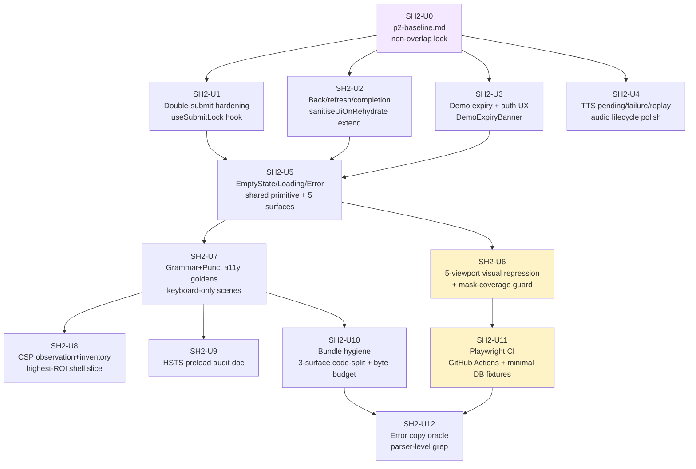

# Sys-Hardening Phase 2 — UX-flow reliability, visual/a11y polish, and security finalisation

## Overview

Phase 2 takes over where the `sys-hardening-p1` sprint ended (2026-04-26, PR #248 completion report): the platform now ships bounded bootstrap, Playwright golden paths, security headers (CSP Report-Only, HSTS without preload, cache-split), a chaos suite, multi-tab bootstrap validation, reduced-motion / keyboard-only accessibility scenes, dense-history spelling smoke, and polish regression locks.

P2 is **not** a server-CPU phase and **not** a rate-limit phase. Those lanes are owned respectively by `docs/plans/james/cpuload/cpuload-p2.md` and by active `PR #227 (feat/admin-p1-5-phase-b)`. P2 is the *browser-feels-trustworthy* lane: remove the residual UX defects (double-submit glitches, stale post-session UI, demo-expiry blank errors, TTS silent failures, blank empty states), expand visual + a11y regression coverage, finish the CSP story through inventory + highest-ROI migration, and stand up a first-party CI so every future change runs against the Playwright matrix.

The sprint ships twelve implementation units plus a baseline (thirteen PRs). It follows the P1 discipline: every PR cites a `docs/hardening/p2-baseline.md` entry, adversarial review is treated as the proof-of-readiness (not worker-subagent self-reports), and items that require operator credentials or multi-week commitments (CSP enforcement flip, HSTS preload submission, full 224-site `style={}` migration) are framed as gated follow-ups rather than sprint deliverables.

---

## Problem Frame

The `ks2-mastery` stack after P1 is **structurally sound but feels fragile at the edges**:

- **Double-submit on non-destructive buttons** still lets fast clicks / Enter-key repeats spawn duplicate pending states even when the subject-command adapter already dedupes at the dispatch layer (`src/platform/runtime/subject-command-actions.js::pendingKeys`). The defect is UI-layer, not backend-layer.
- **Back-button and refresh after session completion** can echo stale summary / feedback / awaiting-advance state back into a freshly rehydrated practice surface because `sanitiseUiOnRehydrate()` only strips Punctuation's `mapUi` today — the pattern is not applied to `summary`, `feedback`, or `awaitingAdvance` across subjects.
- **Demo expiry surfaces as a generic error toast / auth fail page**, even though the Worker already returns a structured `code: 'demo_session_expired'` from `worker/src/demo/sessions.js:364`. The client just doesn't read it.
- **TTS failures degrade silently** — slow fetch has no pending affordance, 500/timeout has no "Audio unavailable" banner, replay spam overlaps playback.
- **Empty / loading / error state copy drifts** across WordBank, ParentHub recent sessions, MonsterMeadow + CodexSurface. No shared primitive.
- **Visual regression baselines** cover mobile-390 for spelling only; the four other viewports and the grammar / punctuation / hub / completion surfaces are still unwatched — a layout regression at 360px could ship silently.
- **Grammar and punctuation keyboard-only flows** are deferred from P1 U10 (which covered spelling only).
- **CSP Report-Only** needs a ≥7-day observation window and an honest decision about when (or whether) to flip, plus an inventory of the 224 `style={}` sites the charter acknowledged as a multi-week concession.
- **HSTS preload** needs a `eugnel.uk` subdomain audit; a two-year one-way commitment is too serious to make without one.
- **Client bundle is monolithic** (`src/bundles/app.bundle.js`, no code-splitting, no byte budget). Adult-only surfaces (Admin, Parent Hub, Monster Visual Config) inflate the learner practice cold start.
- **Playwright runs locally only** (no `.github/workflows/` in the repo); `workers: 1` is set because the in-memory SQLite + demo rate limit cannot handle parallel runs. Every PR currently relies on the developer remembering to run the suite.
- **Error copy is inconsistent** — no single test asserts that a user-facing 5xx / 409 / network-error path renders human language instead of raw JSON / status codes / stack traces.

Phase 2 fixes those things. It does not redesign the product, it does not expand learner scope, it does not alter the backend command boundary.

---

## Requirements Trace

- R1. **Double-submit hardening is UI-layer only**: every non-destructive command button (Continue/Start/Retry/Finish/Skip/Save/Submit on Auth/Admin/Parent) produces exactly one visible transition, one toast, and one final state under double-click, Enter-key repeat, and mobile-tap pressure. Covered by SH2-U1.
- R2. **Back-button / refresh / completed-session state is sanitised on rehydrate**: after a learner completes a session, a Back or Refresh MUST NOT resurrect a resubmittable answer form. Covered by SH2-U2.
- R3. **Demo-expired and auth-failure states carry calm, informative copy** (no generic stack / raw JSON / 401 leak). Covered by SH2-U3.
- R4. **TTS failure / slow-audio / replay is user-visible and bounded**: slow shows a pending chip, 500/timeout shows a human banner, replay cannot spam overlapping playback, route change stops audio. Covered by SH2-U4.
- R5. **Empty / loading / error state parity across the product**: every visible panel has a loading / empty / error / read-only state using the same copy pattern (what happened → is progress safe → what action is available). Covered by SH2-U5.
- R6. **Five-viewport visual regression baselines exist for every user-visible surface** — auth, dashboard, each subject's practice + summary, Parent Hub, Admin/Ops (outside PR #227's zone), Word Bank, reward surfaces (MonsterMeadow / Codex), toasts, persistence banner. Covered by SH2-U6.
- R7. **Grammar + punctuation keyboard-only flows** have accessibility-golden scenes on top of the U10 spelling scene. Covered by SH2-U7.
- R8. **CSP enforcement is materially closer** via a fresh inline-style inventory + highest-ROI shell-surface migration + a documented observation/flip decision. The actual enforcement flip is a gated follow-up. Covered by SH2-U8.
- R9. **HSTS preload is evaluated honestly** via a signed subdomain audit deliverable; submission is a gated follow-up. Covered by SH2-U9.
- R10. **Client bundle is hygienic**: adult-only surfaces (Admin, Parent Hub, Monster Visual Config) are deferred off the learner-first bundle via code-splitting; a bundle-byte budget gate exists; static assets have stable dimensions. Covered by SH2-U10.
- R11. **Playwright runs in CI on every PR** via GitHub Actions; tests are isolated enough that critical scenes can run with `workers > 1`; nightly full 5-viewport matrix; screenshot / trace artifacts on failure. Covered by SH2-U11.
- R12. **Error copy is humanised at the boundary**: a single parser-level oracle blocks raw 5xx / 409 / stack / JSON / internal route names from reaching user-facing text. Covered by SH2-U12.
- R13. **Every P2 PR cites a `docs/hardening/p2-baseline.md` entry** — mechanical scope-guard. Covered by SH2-U0.

---

## Scope Boundaries

This Phase 2 stream owns user-facing UX reliability, visual / a11y polish, security-header finalisation planning, and CI/test-isolation. It does **not** own:

### Deferred to Follow-Up Work

- **Full 224-site `style={}` → stylesheet migration** — multi-week refactor; SH2-U8 only inventories + slices the highest-ROI shell surfaces. Remainder deferred to a future `style-migration-p1` plan.
- **CSP Report-Only → Enforced flip** — gated on ≥7-day clean observation; SH2-U8 produces the decision record. The flip itself is a separate PR once the observation window closes.
- **HSTS `preload` submission** — gated on signed `eugnel.uk` subdomain audit; SH2-U9 produces the audit artefact. Submission is a separate operator-run PR.
- **Playwright workers > 1 per-Worker D1 fixture refactor** — SH2-U11 designs the isolation shape and lands a minimum-viable per-test DB fixture; deep rework (e.g. per-test Cloudflare Worker binding) stays as a deferred deep refactor if scope expands beyond one unit.
- **Full-route lazy-loading architecture** — SH2-U10 only splits three adult hub surfaces (Admin, Parent Hub, Monster Visual Config) + adds a byte budget. Broader route-chunking (subject-level splits, per-scene chunks) deferred.

### Out of scope (owned elsewhere)

- **Bounded bootstrap v2 / selected-learner bootstrap shape** — `docs/plans/james/cpuload/cpuload-p2.md` owns the CPU/capacity lane.
- **`command.projection.v1` direct consumption** — same plan, H7 in the cpuload backlog.
- **ETag / If-None-Match bootstrap** — cpuload-p2 P2.
- **D1 query budget enforcement** — cpuload-p2 P2.
- **Production-safe backfill infrastructure** — cpuload-p2 P2.
- **Classroom capacity certification** — operator-gated capacity-evidence row work, owned by `docs/operations/capacity.md`.
- **Backend circuit breakers / degrade rules** — cpuload-p2 P3.
- **IPv6 /64 rate-limit subject normalisation, unified `consumeRateLimit`, ops-error buckets, admin-ops production smoke** — PR #227 (feat/admin-p1-5-phase-b) active until merged.
- **Admin-ops row_version CAS / reconciliation cron, ops_status enforcement, error-centre drawer** — Phases C–E of the `refactor-admin-ops-console-p1-5-hardening-plan.md` sequence.

Any Phase 2 work that surfaces bugs in the above areas must convert the finding to a test that *proves* the bug exists, attach it to the baseline, and hand off the backend fix to the owning stream. No backend paths on PR #227's file list (see System-Wide Impact) may be directly modified by this sprint.

---

## Context & Research

### Relevant Code and Patterns

**Subject command pipeline (read, don't modify):**
- `src/platform/runtime/subject-command-client.js` — `createSubjectCommandClient`: per-learner command queue, exponential backoff + jitter, stale-write `onStaleWrite` hook (one retry), `x-ks2-request-id` / `x-ks2-correlation-id` headers.
- `src/platform/runtime/subject-command-actions.js` — `createSubjectCommandActionHandler`: `dedupeKey` + `pendingKeys` Set (line 59). **This is the existing idempotency idiom; SH2-U1 extends coverage to the JSX layer, does not replace it.**
- `src/subjects/grammar/module.js` — `ui.pendingCommand: string` guard pattern.
- `src/subjects/spelling/remote-actions.js` — `pendingCommandKeys = new Set()` + `transientUi.spellingPendingCommand`.
- `src/subjects/punctuation/components/punctuation-view-model.js` — `composeIsDisabled(ui)` helper.

**Route state (no history API today):**
- `src/platform/core/store.js` — `DEFAULT_ROUTE = { screen, subjectId, tab }`; `VALID_ROUTE_SCREENS` = dashboard / subject / codex / profile-settings / parent-hub / admin-hub. **No `completion` screen — summary is a phase inside the subject UI.**
- `src/platform/core/store.js:55-64` — `sanitiseUiOnRehydrate()` pattern (Punctuation `mapUi` today). **SH2-U2 extends the same pattern to `summary`/`feedback`/`awaitingAdvance` across subjects.**
- `src/app/App.jsx` — shell router (switch on `appState.route.screen`). `subjectExitPhase` animation guard.

**Shell anchors (already locked, extend not redesign):**
- `src/surfaces/shell/ToastShelf.jsx` — `data-testid="toast-shelf"`, `role="status"`, `aria-live="polite"` (U10).
- `src/surfaces/shell/PersistenceBanner.jsx` — `data-testid="persistence-banner"` + `data-persistence-mode` + `data-testid="persistence-banner-label"` + `data-testid="persistence-banner-pending"` (U9).
- `src/surfaces/shell/MonsterCelebrationOverlay.jsx` — `data-testid="monster-celebration"` + `role="dialog"` (U10).
- `src/surfaces/auth/AuthSurface.jsx` — already has `busy`/`setBusy` local pattern (lines 12-52). **SH2-U1 elevates this pattern into a shared `useSubmitLock()` hook.**

**Subject command audio side-effect boundary:**
- `src/platform/app/create-app-controller.js::handleGlobalAction` — calls `tts.stop()` on 14 route/learner transitions (locked by `tests/route-change-audio-cleanup.test.js`). **SH2-U4 extends with `abort()` of pending TTS fetch on route change, not just `.stop()`.**
- `src/subjects/spelling/tts.js` — central TTS client: `playbackId`, `currentAbort` (AbortController), emits `loading` / `start` / `end`. **Replay-spam guard uses `playbackId` bump; SH2-U4 makes that visible in the UI.**

**Empty/loading/error state drift locations:**
- `src/surfaces/hubs/ParentHubSurface.jsx` — hand-rolled `parent-hub-empty`, `parent-hub-focus is-empty`, `No due work is surfaced yet.` / `No completed or active sessions are stored yet.`
- `src/subjects/grammar/components/GrammarSetupScene.jsx:144` — `dashboard.isEmpty` branch.
- `src/subjects/punctuation/components/PunctuationSummaryScene.jsx` — "Everything was secure this round!" chip for empty summary.
- `src/subjects/spelling/components/SpellingWordBankScene.jsx` — subject-internal WordBank empty state.
- `src/surfaces/home/MonsterMeadow.jsx` + `src/surfaces/home/CodexSurface.jsx` + `src/surfaces/home/CodexCreatureLightbox.jsx` — reward-surface empty states ("nothing caught yet", codex-hero fresh-learner card).
- No shared `EmptyState` / `LoadingSkeleton` / `ErrorCard` primitive in `src/platform/ui/`.

**Security / CSP / cache state:**
- `_headers` — 7 path blocks (root, `/assets/bundles/*`, `/assets/app-icons/*`, `/styles/*`, `/favicon.ico`, `/manifest.webmanifest`, `/`, `/index.html`). Each carries `Content-Security-Policy-Report-Only` + `Report-To` + `Reporting-Endpoints`.
- `worker/src/security-headers.js` — single-source-of-truth wrapper (F-01 single-site). `SECURITY_HEADERS` frozen map; `CSP_DIRECTIVES` array; `applySecurityHeaders(response, { path })`. **Exports `serialiseHeadersBlock()` used by `scripts/lib/headers-drift.mjs`.**
- `worker/src/generated-csp-hash.js` — inline-script sha256 hash, overwritten by `scripts/compute-inline-script-hash.mjs` at build.

**Test scaffolding to extend (already-shipped patterns):**
- `tests/playwright/shared.mjs` — `createDemoSession` / `openSubject` / `navigateHome` / `waitForFontsReady` / `applyDeterminism` (injects determinism CSS + `emulateMedia({ reducedMotion: 'reduce' })` + `dialog.accept()` handler) / `defaultMasks()`.
- `tests/helpers/fault-injection.mjs` — `__ks2_injectFault_TESTS_ONLY__`, `FAULT_KINDS` (10 kinds), `faultInjection.createFaultRegistry()`, per-request opt-in header.
- `tests/helpers/browser-app-server.js` — `--with-worker-api` backed by `tests/helpers/sqlite-d1.js` in-memory SQLite D1 wrapper.
- `tests/helpers/forbidden-keys.mjs` — single-source `FORBIDDEN_KEYS_EVERYWHERE` oracle used by matrix + bundle audit + subject smoke scripts.
- Parser-level contract tests: `tests/toast-positioning-contract.test.js`, `tests/button-label-consistency.test.js`, `tests/route-change-audio-cleanup.test.js`, `tests/destructive-action-confirm-contract.test.js`, `tests/redaction-access-matrix.test.js`, `tests/security-headers.test.js`, `tests/csp-policy.test.js`, `tests/csp-report-endpoint.test.js`.

### Institutional Learnings

Full `docs/solutions/` tree does NOT exist in this repo. The functional-equivalent institutional memory lives in:

- **`docs/plans/james/sys-hardening/sys-hardening-p1-completion-report.md`** — direct parent; 19 reviewer-found blockers, the 6 "what the sprint taught us" rules (worker-claims-vs-reviewer-proofs, review-follower budgeting, upstream concurrency, feasibility-first deepening, charter discipline, silent-green attack prevention), and the exact residuals we inherit here. Section 7.1 names U5's 90%-magenta `spelling-hero-backdrop` mask defect — SH2-U6 must not repeat it.
- **`docs/hardening/charter.md`** — stabilisation rule, 93+ `style={}` residual acknowledgement, HSTS preload deferral rationale. Cite-baseline-or-out-of-scope rule was invoked 3 times during P1.
- **`docs/hardening/p1-baseline.md`** — 5-bucket signed snapshot (visual / runtime / server / access-privacy / test-gap). P2 baseline (SH2-U0) mirrors this shape + adds a "copy & UX parity" bucket.
- **Memory: `~/.claude/projects/.../memory/project_sys_hardening_p1.md`** — 19-blocker ledger distilled; U5 magenta-mask, U7 gitignored `generated-csp-hash.js`, U11 evidence-shape drift are the ergonomic patterns P2 must not reintroduce.
- **Memory: `~/.claude/projects/.../memory/feedback_autonomous_sdlc_cycle.md`** — scrum-master pattern, rebase-clobber hazard, merge-resolver `git stash` destruction of `MERGE_HEAD`. Parallel worker prompts must say "implement + verify + push + open PR — STOP and report, orchestrator dispatches reviewers".
- **Memory: `~/.claude/projects/.../memory/feedback_subagent_tool_availability.md`** — `ce-*` reviewers are orchestrator-only; parallel workers must use distinct worktree paths (U1+U9 shared-path incident). Pre-create per-SH2-unit worktrees before parallel dispatch.
- **Memory: `~/.claude/projects/.../memory/project_punctuation_p3.md`** — "Test harness fixture ≠ production shape" recurring defect. Directly applies to SH2-U1 (submit state machine), SH2-U2 (back-button sanitise), SH2-U4 (TTS pending state must be writable from real provider failures).
- **Memory: `~/.claude/projects/.../memory/feedback_git_fetch_before_branch_work.md`** — always `git fetch` before branch work; session-start snapshots go stale quickly under high upstream concurrency (seen on Grammar Phase 3 fairness logic 2026-04-25).

### External References

Local patterns + charter + web references from the P2 origin brief are sufficient; no additional external research needed. Key references to keep beside the plan:

- `developers.cloudflare.com/workers/static-assets/headers/` — Worker static-asset default headers + cache override precedence (already used by P1 U8).
- `web.dev/articles/vitals` — LCP ≤ 2.5s / INP ≤ 200ms / CLS ≤ 0.1 thresholds for SH2-U10 bundle-budget rationale.
- `cheatsheetseries.owasp.org/cheatsheets/Content_Security_Policy_Cheat_Sheet.html` — CSP hardening reference for SH2-U8 observation-to-flip sequencing.
- `https://hstspreload.org/` — HSTS preload requirements for SH2-U9 audit checklist.

---

## Key Technical Decisions

- **Decision: Retain `SH2-U0…SH2-U12` plan-local identifiers from the origin brief** (rather than renumbering to U1…U13). Rationale: origin-brief authors intentionally domain-prefixed to separate P1 (U1…U13) from P2. Preserving the prefix makes cross-plan references (e.g. "P1 U10 → SH2-U7 extends keyboard-only") unambiguous. Plan-local U-ID stability rule still applies: once assigned, SH2-U-IDs are never renumbered within this plan.
- **Decision: SH2-U0 is the non-overlap lock; every other PR must cite a baseline row.** Mirrors P1 charter's "cite or out of scope" rule. This is load-bearing — it was invoked 3× during P1 to kill scope creep.
- **Decision: SH2-U1 elevates `AuthSurface.jsx`'s `busy`/`setBusy` local pattern to a shared `useSubmitLock()` hook** at `src/platform/react/use-submit-lock.js`. Rationale: (a) AGENTS.md says "prefer existing platform patterns", (b) subject command path already has adapter-layer dedup (`pendingKeys`) — the hook is a UI-layer belt-and-braces companion, not a replacement, (c) the hook applies naturally to Auth / Admin save / Parent Hub save buttons that do NOT flow through the subject-command adapter.
- **Decision: SH2-U2 extends `sanitiseUiOnRehydrate()` across subjects rather than introducing browser History API integration**. Rationale: (a) React shell has zero `pushState` / `popstate` today, (b) `sanitiseUiOnRehydrate()` is already shipping for Punctuation's `mapUi` — extending it is lower-risk than inventing routing, (c) browser Back on a completion screen should land on subject dashboard with a fresh session state, which is what sanitising `summary`/`feedback`/`awaitingAdvance` on rehydrate achieves. History API integration is explicitly out of scope.
- **Decision: SH2-U3 reads `code: 'demo_session_expired'` from the 401 body on the client side, does not touch `worker/src/demo/sessions.js`**. Rationale: PR #227 owns the demo-sessions Worker file zone; Phase 2 can deliver the UX improvement without any backend edit by reading the already-shipped error code in `bootstrap.js::onAuthRequired` and wiring a new `DemoExpiryBanner` component.
- **Decision: SH2-U4 TTS hardening is client-only (`src/subjects/spelling/tts.js` + session scene)**. Rationale: PR #227 owns `worker/src/tts.js` rate-limit buckets; Phase 2 client-only changes can cover pending chip / failure banner / replay-spam guard / route-change abort without touching the Worker.
- **Decision: SH2-U5 maps the origin brief's "RewardShelf" to the existing `MonsterMeadow.jsx` + `CodexSurface.jsx` + `CodexCreatureLightbox.jsx` reward surfaces**. Rationale: no `RewardShelf` component exists; the baseline intent is empty/loading/error parity across reward-visible surfaces, which MonsterMeadow + Codex provide. A net-new RewardShelf would violate charter.
- **Decision: SH2-U5 ships a single shared `EmptyState`/`LoadingSkeleton`/`ErrorCard` primitive at `src/platform/ui/`** and re-skins the current bespoke sites (Parent Hub `is-empty`, Grammar `dashboard.isEmpty`, Punctuation chip, Monster Meadow "nothing caught", Codex fresh-learner). Rationale: parity test needs one oracle; a shared primitive is the oracle.
- **Decision: SH2-U6 lands a 5-viewport baseline + a mask-coverage invariant (≤30% viewport) BEFORE regenerating any baselines**. Rationale: U5 P1 blocker was a 90%-magenta baseline; a structural guard prevents silent-green at 5× the scale.
- **Decision: SH2-U8 ships inventory + highest-ROI shell-surface slice, NOT a full migration**. Rationale: 224 sites across 42 files, charter already frames it as multi-week. Inventory doc + migrating `PersistenceBanner`/`ErrorBoundary`/`UnknownRoute`/`ProfileSettings`/`SpellingHeroBackdrop`-adjacent surfaces (≈30–50 sites) is the highest-ROI slice that materially reduces the `unsafe-inline` concession. Rest deferred.
- **Decision: SH2-U8 does NOT automatically flip CSP to enforced**. Rationale: 7-day observation window is charter-mandatory; flip PR is a follow-up once observation closes with zero unexpected violations.
- **Decision: SH2-U9 produces the subdomain-audit deliverable only — no preload submission**. Rationale: two-year one-way commitment; operator gate.
- **Decision: SH2-U10 splits three adult hub surfaces (Admin, Parent Hub, Monster Visual Config) out of the learner-cold-start bundle + adds a bundle-byte budget to `scripts/audit-client-bundle.mjs`**. Rationale: adult surfaces are the largest accidental dependencies in the monolithic bundle; three named extractions are scoped; byte-budget gate prevents regression. Deeper per-scene chunking is deferred.
- **Decision: SH2-U10 code-splitting REQUIRES upstream changes to the Worker source-path allowlist + both bundle-audit scripts before splitting can land** (deepening F-01 + S-01). `worker/src/app.js::publicSourceAssetResponse` currently uses `url.pathname === '/src/bundles/app.bundle.js'` (exact-equality at line 424) — split chunks return 404 in production without a prefix check. `scripts/audit-client-bundle.mjs` line 164 has the mirror `file !== 'src/bundles/app.bundle.js'` exception, and its `auditText()` call at line 188-190 only runs against the explicit `bundlePath` arg — split chunks bypass forbidden-token scanning (correctResponse, OPENAI_API_KEY, __ks2_injectFault_TESTS_ONLY__). All three fixes (Worker prefix + audit walk-all-chunks + text scan of every chunk) must ship in the SAME PR as `splitting: true`, not follow-up PRs. Non-negotiable.
- **Decision: SH2-U4 TTS watchdog starts at 15s, not 8s** (deepening F-02). Rationale: zero real-world p95 TTS latency data exists in the repo (`tests/helpers/fault-injection.mjs` slow-tts injects only 1.5s; no tts.latency telemetry grep hits). UK mobile 4G TTS fetch + audio blob decode at low signal can legitimately exceed 8s. 15s is a conservative starting threshold; SH2-U4 also ships lightweight TTS-latency telemetry that a follow-up can use to tighten.
- **Decision: SH2-U8 migration success threshold is "≥20 CSS-var-ready + static-value sites migrated", not a 30-50 tight range** (deepening F-03). Rationale: manual classification of the named candidate files shows that SpellingSessionScene / SpellingHeroBackdrop / SpellingWordBankScene / SpellingSummaryScene all use `...heroBgStyle(runtimeUrl)` dynamic-content patterns that resist simple class migration. Trivially-migratable count is closer to 15-25. The ≥20 threshold captures realistic ROI without setting a miss-by-default goal.
- **Decision: SH2-U11 PR-time Playwright job allows per-project tolerance override via `playwright.config.mjs`** (deepening F-04). Rationale: Linux-CI font-hinting drift at mobile-360 small-text glyph edges can exceed `maxDiffPixelRatio: 0.02` even with `waitForFontsReady`. Plan allows `mobile-360` + `mobile-390` at `maxDiffPixelRatio: 0.035` while `tablet`/`desktop-1024`/`desktop-1440` stay at 0.02. Single baseline-regen PR is explicitly NOT guaranteed; budget 2-3 regen PRs as an sequenced follow-up.
- **Decision: SH2-U11 workflows declare minimum permissions + no Cloudflare secrets** (deepening S-02). Rationale: `permissions: contents: read` on every workflow; explicit ban on `CLOUDFLARE_API_TOKEN`/`CF_*` secrets in the repository's Actions secrets scope. The only build-time Worker interaction is `scripts/wrangler-oauth.mjs` which intentionally fails without OAuth — CI cannot accidentally deploy. Deploy remains operator-only via `npm run deploy`.
- **Decision: SH2-U11 nightly / CI workflows NEVER auto-commit baselines** (deepening S-03). Rationale: a compromised dependency or overly-broad workflow permission could push malicious PNG fixtures that silence visual regression. Baseline changes are always a human-reviewed PR; nightly job uploads artifacts for review, does not write back to the repo.
- **Decision: SH2-U3 DemoExpiryBanner copy is neutral** (deepening S-04). Rationale: "Your progress is saved for a week" tells an attacker probing with fabricated cookies whether an account exists. Copy must be permission-symmetric between `demo_session_expired` and `unauthenticated` paths. Plan also asserts the Worker returns structurally identical 401 (same status, same headers, same body shape minus the `code` field) so the distinction is only client-readable, never externally measurable beyond the code string.
- **Decision: SH2-U3 ReadOnlyLearnerNotice describes capability classes, not feature names** (deepening S-05). Rationale: enumerating "You cannot change admin settings, TTS configuration, word-bank configuration" tells a viewer-role user the exact list of privileged features. Copy uses neutral "Some settings are managed by account administrators" language. Adversarial reviewer must verify final copy does not name admin-only routes or feature identifiers.
- **Decision: SH2-U8 inventory classifies dynamic-content-driven sites separately + server-supplied CSS values must be sanitised** (deepening S-06). Rationale: existing `src/platform/game/render/MonsterRender.jsx:73` pipes computed CSS-variable key-value pairs directly into `style[key] = value` without key sanitisation. Any Phase 2 migration that introduces new CSS-variable-driven sites must validate computed values are numeric-clamped / allowlisted-string / `CSS.escape`-wrapped when values flow from server data. Inventory doc maintains this classification.
- **Decision: SH2-U2 rehydrate contract test seeds UI via live `setState` AND via bootstrap path** (deepening F-05). Rationale: `setState` dispatches pass `rehydrate: false` by design; test must prove `summary: {...}` + `awaitingAdvance: true` survive a live dispatch (not over-stripping) while still being stripped on bootstrap. Two-path coverage prevents hidden over-strip regressions.
- **Decision: SH2-U11 uses GitHub Actions (creates `.github/workflows/`)** + keeps Cloudflare Workers Builds as the deploy-time `audit:build-public + audit:client` safety net. Rationale: Workers Builds doesn't support Playwright's Chromium download (`.npmrc playwright_skip_browser_download=true`); GitHub Actions Linux runners are the natural Playwright host. Expect a one-PR Linux-CI-baseline regeneration because Windows-baselined screenshots won't match Linux font metrics.
- **Decision: SH2-U11 keeps `workers: 1` as the default, with a named `tests/playwright/isolated/` subfolder allowed to run multi-worker**. Rationale: in-memory SQLite + demo rate limit need a per-test fixture before multi-worker is safe; minimum-viable DB-fixture design ships here, deep rework stays deferred.
- **Decision: SH2-U12 error-copy oracle is a parser-level grep (no raw `500` / `409` / `TypeError` / JSON blob / internal route name) rather than a Playwright scene**. Rationale: faster in CI, covers every component file, adversarial-reviewer-proof (a scene that asserts `body is visible` passes when the defect exists).
- **Decision: Follow P1 SDLC pattern — per-unit PR, 2-4 parallel `ce-*` reviewers per PR, adversarial mandatory for state-machine-adjacent units (U1 / U2 / U4 / U8 / U11), budget one review-follower cycle per unit by default.** Rationale: P1 shipped 19 reviewer-found blockers across 13 units; the median review-follower cycle was 60-90 min. Planning the overhead is cheaper than discovering it.
- **Decision: Pre-create per-unit worktrees before parallel dispatch.** Rationale: P1 U1+U9 shared-worktree corruption; `feedback_subagent_tool_availability.md` names it. First batch (U1-U4 + U0 baseline) is five parallel workers × five distinct worktree paths.

---

## Open Questions

### Resolved During Planning

- **How to interpret "RewardShelf" from the origin brief?** Resolved: map to existing MonsterMeadow + CodexSurface + CodexCreatureLightbox (see Key Technical Decisions).
- **How many `style={}` sites actually exist?** Resolved: 224 sites across 42 files (vs charter's "93+"). Informs SH2-U8 inventory-first sequencing.
- **Does the React shell use the browser History API?** Resolved: no `pushState`/`replaceState`/`popstate` anywhere in `src/`. Informs SH2-U2 scope: extend `sanitiseUiOnRehydrate()` rather than introduce routing.
- **Does a shared `useSubmitLock` / `EmptyState` / `LoadingSkeleton` primitive exist?** Resolved: no. SH2-U1 creates `useSubmitLock`; SH2-U5 creates the state-primitive trio.
- **Which CI platform?** Resolved: GitHub Actions primary, Cloudflare Workers Builds retains deploy-time audit.
- **Which sprint sequencing?** Resolved: 3-batch per origin brief (UX-reliability → visual/a11y parity → security/tooling).
- **PR #227 current state?** Resolved: OPEN (`feat/admin-p1-5-phase-b`, last updated 2026-04-26T00:40:20Z). Touches `worker/src/{rate-limit,auth,demo/sessions,tts}.js` + `scripts/admin-ops-production-smoke.mjs` + `tests/worker-{rate-limit,ops-error}-*.test.js` + `tests/admin-ops-production-smoke.test.js`. Phase 2 does not touch these files.

### Deferred to Implementation

- **Exact allowlist shape for the SH2-U12 error-copy oracle**: whether `LABELS_NOT_BLOCKING` pattern (P1 U12) or a fresh allowlist; implementer picks based on false-positive rate on first run.
- **Specific bundle-byte budget value for SH2-U10**: implementer measures current gzip-size baseline after first extraction lands, then sets budget at baseline × 1.05 to allow bounded growth.
- **Whether SH2-U7 grammar-keyboard scene needs a separate subject-start helper** or can reuse `tests/playwright/shared.mjs::openSubject` plus `Tab`/`Enter` — implementer tests reuse first, splits only if keyboard contract diverges.
- **Whether SH2-U11 CI `npm test` needs a matrix over Node versions** — implementer defaults to the version in `.nvmrc` (if present) or the one in README, revisits if Wrangler/Chromium require a floor.
- **Whether SH2-U8 CSP observation produces any allowlist PR before enforcement** — depends on what `[ks2-csp-report]` logs show in the 7-day window; cannot be decided at plan time.

---

## High-Level Technical Design

> *This illustrates the intended approach and is directional guidance for review, not implementation specification. The implementing agent should treat it as context, not code to reproduce.*

The sprint is organised as three delivery batches, each one independently shippable, each one preserving a charter "non-overlap with PR #227 / cpuload-p2" envelope. SH2-U0 lands first as the baseline doc (mechanical scope-guard oracle), then the rest of batch 1 runs in parallel, then batch 2, then batch 3.

Edge annotations: the `U0 → U1..U4` fan-out means every batch-1 PR cites a U0 baseline row as its scope oracle. The `U5 → U6` dependency is deliberate — U5's shared `EmptyState`/`LoadingSkeleton`/`ErrorCard` primitives become part of U6's 5-viewport baseline surfaces. U6 blocks U11 because the mask-coverage invariant (U6 KTD) is the guard that prevents CI from silent-greening broken baselines at Linux-CI baseline-regeneration time. U10 blocks U12 because bundle-splitting introduces new route-load error paths whose copy U12 must cover.

---

## Implementation Units

- SH2-U0. **Phase 2 baseline and non-overlap lock**

**Goal:** Seed `docs/hardening/p2-baseline.md` (signed snapshot) mirroring P1's 5-bucket shape plus a new "copy & UX parity" bucket. Every subsequent Phase 2 PR cites a row or is out of scope.

**Requirements:** R13.

**Dependencies:** None.

**Files:**
- Create: `docs/hardening/p2-baseline.md`
- Modify: `docs/hardening/charter.md` — append "Phase 2 baseline reference: `docs/hardening/p2-baseline.md`" under the Sign-off section.
- Test: none — this is a documentation unit. Invariant enforced by subsequent PRs citing baseline rows.

**Approach:**
- Seed the baseline from P1 Section 7 residuals + origin brief SH2-U1…U12 gap descriptions. Five buckets: Visual faults, Runtime faults, UX/Copy parity (new bucket), Access/privacy, Test gaps.
- Each row carries: description, subject surface, acceptance-test pointer (e.g. `tests/playwright/*` or `tests/*.test.js`), owning unit (`SH2-U1` etc), status (`open` / `tracked in SH2-U?`).
- Explicit "Not owned by Phase 2" subsection lists the hard-no-touch items (bootstrap v2, `command.projection.v1`, D1 budgets, circuit breakers, PR #227 files).
- Signature: "Signed at sprint start by James To — 2026-04-26" mirroring P1.

**Patterns to follow:**
- `docs/hardening/p1-baseline.md` 5-bucket shape with one-line entries + `(tracked in U?)` suffix.
- P1 charter sign-off pattern.

**Test scenarios:**
- Test expectation: none — documentation unit; invariant enforced by other PRs citing baseline rows in commit messages / PR descriptions.

**Verification:**
- `docs/hardening/p2-baseline.md` exists and has at least 6 entries per SH2-U1…U12 (not every unit needs exactly one row; some units close 2–3 rows).
- Explicit "Not owned by Phase 2" subsection lists every PR #227 + cpuload-p2 overlap item verbatim.
- Charter update appended without disturbing P1 wording.

---

- SH2-U1. **Double-submit hardening for non-destructive command buttons**

**Goal:** A fast double-click, Enter-key repeat, or mobile double-tap on any non-destructive button (Submit / Continue / Start / Retry / Finish / Skip on Auth / Admin save / Parent Hub save) produces exactly one visible transition, one toast, and one final state. Covers UI-layer gap on top of existing `pendingKeys` adapter-layer dedup.

**Requirements:** R1.

**Dependencies:** SH2-U0.

**Execution note:** State-machine-adjacent — auto-dispatch adversarial reviewer in addition to correctness / maintainability.

**Files:**
- Create: `src/platform/react/use-submit-lock.js` — shared `useSubmitLock()` hook.
- Modify: `src/surfaces/auth/AuthSurface.jsx` — replace local `busy`/`setBusy` with hook.
- Modify: `src/surfaces/hubs/AdminHubSurface.jsx` — non-destructive save buttons (avoid zones touched by PR #227).
- Modify: `src/surfaces/hubs/ParentHubSurface.jsx` — save/retry buttons.
- Modify: `src/subjects/spelling/components/SpellingSessionScene.jsx`, `src/subjects/grammar/components/GrammarSessionScene.jsx`, `src/subjects/punctuation/components/PunctuationSessionScene.jsx` — Continue / Retry / Skip / End-round-early buttons (Submit already guarded by `pendingCommand` / `pendingCommandKeys`; add hook as belt-and-braces on the JSX node).
- Modify: `src/subjects/{spelling,grammar,punctuation}/components/*SummaryScene.jsx` — next-action buttons.
- Test: `tests/react-use-submit-lock.test.js` (hook unit), `tests/playwright/double-submit-guard.playwright.test.mjs` (pointer + keyboard + mobile viewport 390).

**Approach:**
- `useSubmitLock()` returns `{ locked, run: async (fn) => { ... }, lockedLabel? }`. `run()` sets `locked=true`, awaits `fn`, sets `locked=false` in `finally`. Idempotent on repeated `run()` calls while locked.
- Subject session scenes wire the hook next to existing `pending` guard: `disabled={runtimeReadOnly || pending || submitLock.locked}`. The hook is belt-and-braces for the JSX node; adapter-layer dedup remains the canonical source of truth.
- Auth / Admin non-destructive save / Parent Hub save: full hook adoption (no adapter dedup exists today).
- Do NOT touch destructive actions — those route through `ports.confirm()` (locked by P1 U12 `tests/destructive-action-confirm-contract.test.js`).

**Patterns to follow:**
- Existing `busy`/`setBusy` in `src/surfaces/auth/AuthSurface.jsx:12-52` → promote to hook.
- `awaitingAdvance`-based pattern in spelling / guardian flows → hook complements it.
- P1 `tests/button-label-consistency.test.js` canonical-labels pattern.

**Test scenarios:**
- Happy path (hook): calling `run(fn)` once resolves and returns `fn`'s result; `locked` transitions `false → true → false`.
- Happy path (hook): concurrent `run(fn)` calls while locked return a resolved `undefined` sentinel without invoking `fn` a second time.
- Edge case (hook): `run(fn)` where `fn` throws — `locked` still returns to `false`; error is re-thrown.
- Edge case (hook): `run(fn)` where `fn` returns synchronously non-promise — hook still locks for at least one microtask; subsequent call is blocked.
- Integration (Playwright): spelling Continue button — rapid double-click (two `page.click()` back-to-back within 50ms) produces exactly one session-advance (asserts one `/api/subjects/spelling/command` call via `page.waitForRequest`). Covers F1 (if listed in origin) / SH2-U1.
- Integration (Playwright): Enter-key repeat on spelling form — `page.keyboard.press('Enter'); page.keyboard.press('Enter')` produces exactly one submit.
- Integration (Playwright): mobile-390 tap — `page.tap('[data-action="spelling-continue"]'); page.tap('[data-action="spelling-continue"]')` within 100ms produces one transition.
- Integration (Playwright): Auth login submit double-click — exactly one `/api/auth/login` call.
- Integration (Playwright): Parent Hub save double-click on a non-destructive row — exactly one save call (target a row that does NOT touch PR #227's admin-ops file list).
- Error path: a submit that rejects with 500 — after re-enable, subsequent click works; no "stuck locked" state.
- Error path: network error during submit — `locked` returns to `false`; error banner surfaces (via caller's error path, not the hook).

**Verification:**
- `useSubmitLock()` is the single canonical import path for new JSX double-submit guards (`src/platform/react/use-submit-lock.js`).
- Every submit/continue/save button covered by this unit imports the hook (grep `import.*use-submit-lock` shows ≥ 8 sites).
- No existing `busy`/`setBusy`/`isSaving` local state left in scenes touched by this unit (unless intentionally preserved with an explanatory comment).
- Playwright scene proves no double-network-call across three subjects + Auth + Parent Hub.

---

- SH2-U2. **Back-button, refresh, and completed-session flow cleanup**

**Goal:** After a learner completes a session, browser Back / Refresh on a summary screen MUST NOT resurrect a resubmittable answer form or an `awaitingAdvance` state. Switching learner or subject clears transient practice state. Changing route stops audio, closes transient overlays, and prevents stale toasts.

**Requirements:** R2.

**Dependencies:** SH2-U0.

**Execution note:** State-machine-adjacent — auto-dispatch adversarial reviewer.

**Files:**
- Modify: `src/subjects/spelling/module.js` — implement `sanitiseUiOnRehydrate()` on the subject manifest (currently only Punctuation ships it).
- Modify: `src/subjects/grammar/module.js` — implement `sanitiseUiOnRehydrate()`.
- Modify: `src/subjects/punctuation/module.js` — extend existing `sanitiseUiOnRehydrate()` to also strip `summary`, `feedback`, `awaitingAdvance` (currently strips `phase: 'map'` + `mapUi` only).
- Modify: `src/platform/core/store.js` — ensure `buildSubjectUiState(..., { rehydrate: true })` is called on all rehydrate paths (bootstrap, learner-switch, subject-switch).
- Modify: `src/platform/app/create-app-controller.js::handleGlobalAction` — confirm `learner-select`, `open-subject`, `navigate-home` all call `rehydrate: true` into state rebuilds.
- Test: `tests/subject-rehydrate-contract.test.js` (parser-level across three subjects), extend `tests/playwright/spelling-golden-path.playwright.test.mjs` + `grammar-golden-path.playwright.test.mjs` + `punctuation-golden-path.playwright.test.mjs` with a "reload-on-summary" scene.

**Approach:**
- `sanitiseUiOnRehydrate(persisted)` drops session-ephemeral fields so they cannot echo across a reload: `session`, `feedback`, `summary`, `awaitingAdvance`, `pendingCommand`, `transientUi`. Returns the sanitised object.
- Live dispatches (in-memory `updateSubjectUi`) still pass `rehydrate: false`, so sessions mid-flight are unaffected.
- Test the contract at the store layer, not just per-subject, so no future subject can forget to implement it.
- Route-change audio cleanup: already covered by `tests/route-change-audio-cleanup.test.js` (P1 U12) — U2 adds a test asserting that route change also clears transient celebration overlays (`transientUi.celebrationQueue` if set).

**Patterns to follow:**
- Existing `src/platform/core/store.js:55-64` `sanitiseUiOnRehydrate()` shape — method on subject manifest, receives persisted entry, returns sanitised entry, called on `rehydrate: true` paths.
- `tests/route-change-audio-cleanup.test.js` parser-level contract pattern.

**Test scenarios:**
- Happy path: spelling summary-phase UI → rehydrate → sanitised UI has `phase: 'setup'` / `summary: null` / `feedback: null` / `awaitingAdvance: false`.
- Happy path (all three subjects): fixture with `awaitingAdvance: true` + `summary: {...}` passes through rehydrate with both stripped.
- Happy path (live-setState preservation, deepening F-05): seed `summary: {...}` + `awaitingAdvance: true` via a live `setState` (`rehydrate: false`) → values MUST survive unchanged. Proves sanitiser is NOT over-stripping active-session state.
- Edge case: rehydrate on a *live* session (`phase: 'session'`, `session: { id, cards, progress }`) does NOT strip the session — only summary / feedback / awaitingAdvance.
- Edge case: subject manifest without `sanitiseUiOnRehydrate` method → rehydrate falls back to generic `{ ...DEFAULT_SUBJECT_UI, ...initState, ...persisted }` (preserves backwards compatibility for future subjects).
- Integration (Playwright): complete a spelling round → land on summary → `page.reload()` → dashboard renders `phase: 'setup'`, no "Start another round" button visible (because summary was sanitised).
- Integration (Playwright): complete a punctuation round → `page.reload()` → same contract.
- Integration (Playwright): complete a grammar round → `page.reload()` → same contract.
- Integration (Playwright): switch learner mid-session → transient UI cleared, audio stopped, no celebration overlay.

**Verification:**
- `tests/subject-rehydrate-contract.test.js` asserts the invariant across three subjects with named fixtures.
- Playwright "reload-on-summary" scene passes for all three subjects.
- No regression on Punctuation's existing `mapUi` strip.

---

- SH2-U3. **Demo expiry and auth-failure UX polish**

**Goal:** Expired demo gives a clear "demo expired" state (not raw API error). Signed-out state gives one clear action. Forbidden / read-only learner access says what is unavailable and hides writable controls. Auth failure during a practice command does not lose the visible answer immediately.

**Requirements:** R3.

**Dependencies:** SH2-U0.

**Files:**
- Create: `src/surfaces/auth/DemoExpiryBanner.jsx` — bespoke banner with "Convert to real account" CTA.
- Modify: `src/platform/app/bootstrap.js::createRepositoriesForBrowserRuntime` — read `code: 'demo_session_expired'` + `code: 'unauthenticated'` from 401 body; route to `onAuthRequired({ code, error, response, payload })`.
- Modify: `src/surfaces/auth/AuthSurface.jsx` — branch on `initialError.code`: `demo_session_expired` → render `DemoExpiryBanner`; generic auth failure → existing copy.
- Modify: `src/subjects/{spelling,grammar,punctuation}/components/*SessionScene.jsx` — wrap the "current answer" area with a sticky hint so 401 / 403 does not wipe the typed answer from the DOM; Worker command path already preserves it through `onStaleWrite`, but the 401 auth-required path (handled in bootstrap) must not unmount the form mid-type.
- Test: `tests/demo-expiry-banner.test.js` (parser-level React render + copy assertions), extend `tests/redaction-access-matrix.test.js` with demo-expired + read-only-learner combinations if not already covered, `tests/playwright/demo-expiry.playwright.test.mjs`.

**Approach:**
- Read `sessionPayload?.code` on the 401 branch in `bootstrap.js` (line ≈106-120). Pass it into the `onAuthRequired` callback. AuthSurface reads `initialError.code` and branches.
- `DemoExpiryBanner.jsx` composition: empty-state illustration pattern from SH2-U5 (if U5 lands first) OR inline, sticky "Demo session finished" headline. **Copy must be account-existence-neutral (deepening S-04):** e.g. "Your demo round has ended. Sign in or start a new demo to keep practising." — NOT "Your progress is saved for a week" (that confirms to an attacker probing fabricated cookies that an account exists + has measurable retention). + "Sign in" CTA + "Start new demo" CTA. Copy goes through adversarial reviewer before merge.
- **Worker 401 response structural contract (deepening S-04):** both `code: 'demo_session_expired'` and `code: 'unauthenticated'` paths MUST return identical HTTP 401 status, identical header set, and body shapes that differ only in the `code` string. No timing difference. This is a contract test (new `tests/worker-auth-401-contract.test.js` — parser-level, NO edit to `worker/src/demo/sessions.js` since that's PR #227's zone; test reads the shipping Worker via fixture). If the contract fails, flag as handoff to PR #227 rather than patching Worker code.
- Read-only learner notice already lives at `src/surfaces/hubs/ReadOnlyLearnerNotice.jsx` — extend with a capability-class explainer rather than a feature enumeration (deepening S-05). Use neutral language like "Some settings are managed by account administrators." NOT "You cannot change admin settings, TTS configuration, word-bank configuration" (that tells a viewer-role user the complete list of privileged features). Adversarial reviewer verifies copy does not name admin-only routes.
- 401 during practice command: `subject-command-client.js` throws `SubjectCommandClientError`; caller in subject module surfaces error — SH2-U3 ensures the subject session scene does not unmount `<input>` when `pendingCommand` is cleared on auth-required. Pattern: preserve input node via React key stability during the re-bootstrap.

**Patterns to follow:**
- P1 F-10 demo-guard pattern: fail-closed on server side, polish-only on client.
- `src/surfaces/shell/PersistenceBanner.jsx` as the visual template for the banner (sticky card, data-testid, data-mode attribute, retry button).
- `tests/redaction-access-matrix.test.js` for demo-expired cross-account probe.

**Test scenarios:**
- Happy path (demo active): `/api/bootstrap` returns 200 → no banner.
- Happy path (demo expired, valid cookie): 401 with `code: demo_session_expired` → `DemoExpiryBanner` renders with "Sign in" + "Start new demo" CTAs; no raw "401" or "unauthorized" in visible text.
- Happy path (signed out): 401 with `code: unauthenticated` → generic AuthSurface login.
- Happy path (401 structural parity, deepening S-04): `tests/worker-auth-401-contract.test.js` asserts both codes produce identical status + headers + body-shape (minus `code` string). Any divergence flags a handoff to PR #227 rather than patching Worker in this PR.
- Happy path (copy neutrality, deepening S-04): `DemoExpiryBanner` copy does NOT contain "week", "saved", "account exists", or any language that confirms retention semantics to an observer without credentials.
- Happy path (ReadOnlyLearnerNotice copy neutrality, deepening S-05): notice copy does NOT enumerate feature names (no "admin", "TTS", "word-bank", "monster config" tokens). Parser-level grep asserts.
- Edge case: read-only learner selected → `ReadOnlyLearnerNotice` shown; writable subject controls hidden.
- Edge case: 403 on a specific route (e.g. Admin Hub) → friendly "You don't have access to this area" card, not raw 403.
- Error path: 401 during practice command — typed answer in `<input>` remains present after auth flow completes (bootstrap re-runs, session re-mounts, input re-rendered with same value from store).
- Integration (Playwright): `expectDemoExpired()` helper seeds an expired demo cookie via `/demo?force_expire=1` fault-injection path, loads the app, asserts banner copy + CTA hrefs.
- Error path: 500 on an auth endpoint — human banner ("Something went wrong signing you in. Try again."), not raw status code.

**Verification:**
- `DemoExpiryBanner` mounts only when code matches; not on generic 401.
- Playwright scene proves end-to-end: expired demo cookie → banner copy visible → CTA click navigates to sign-in.
- No raw "401" / "unauthorized" / JSON blob visible in any auth-failure render.

---

- SH2-U4. **TTS failure, slow-audio, and replay hardening**

**Goal:** Slow TTS shows a pending chip (not a frozen replay button). TTS 500 / timeout shows "Audio unavailable. You can keep practising." banner. Replay cannot be spammed into overlapping playback. Route / learner / subject change stops audio and clears pending fetch. Reduced-motion and keyboard-only users can still use (or ignore) audio affordances.

**Requirements:** R4.

**Dependencies:** SH2-U0.

**Execution note:** State-machine-adjacent (audio lifecycle) — auto-dispatch adversarial reviewer.

**Files:**
- Modify: `src/subjects/spelling/tts.js` — surface `loading` event to consumers as UI-pending state via a subscribable "status" channel; preserve existing `stop()` / `playbackId` bump semantics; bound pending-state to `max-pending-ms` (8s) so silent 90s hangs surface as "Audio unavailable".
- Modify: `src/subjects/spelling/components/SpellingSessionScene.jsx` — render "…loading audio" affordance on replay / replay-slow buttons when `ttsStatus === 'loading'`; render "Audio unavailable" banner when `ttsStatus === 'failed'`; clear on next successful playback.
- Modify: `src/platform/app/create-app-controller.js::handleGlobalAction` — existing `tts.stop()` calls must also call `tts.abortPending()` (new method) to cancel outstanding fetch; locked by extended `tests/route-change-audio-cleanup.test.js`.
- Test: `tests/tts-status-contract.test.js` (parser-level for status-channel invariants), extend `tests/route-change-audio-cleanup.test.js` with `abortPending` assertion, `tests/playwright/tts-failure.playwright.test.mjs` using existing `slow-tts` + new `500-tts` fault kinds.

**Approach:**
- TTS client gains `getStatus()` → `'idle' | 'loading' | 'playing' | 'failed'` and a `subscribe(listener)` channel. Listener fires on transitions.
- `abortPending()` = `currentAbort?.abort?.()` + `status = 'idle'`. Separate from `stop()` (which kills playing audio).
- `max-pending-ms` watchdog starts at **15s** (conservative; see KTD deepening F-02). If `loading` state persists beyond the threshold, emit `failed` and surface banner; existing abort logic tears down fetch.
- Ship lightweight TTS-latency telemetry (emit `[ks2-tts-latency]` structured log line with `wallMs` + `status` on every completed or failed fetch) so a follow-up can tighten the threshold based on real-world p95 data.
- Replay-spam: already guarded by `playbackId` bump in `stop()`; SH2-U4 makes the intent *visible* by disabling replay button while `status === 'loading'`.
- `tests/helpers/fault-injection.mjs` already has `slow-tts`; extend `FAULT_KINDS` with `500-tts` (+ optional `401-tts`) if not present.

**Patterns to follow:**
- Existing emitter pattern in `src/subjects/spelling/tts.js:99+` for event emission.
- `tests/playwright/chaos-http-boundary.playwright.test.mjs` slow-tts scene.
- `src/surfaces/shell/PersistenceBanner.jsx` visual language for status banner (reuse tone class).

**Test scenarios:**
- Happy path: fetch completes < 15s → status transitions `idle → loading → playing → idle`; no banner.
- Edge case: fetch completes at exactly 15s → no watchdog trigger (strictly >).
- Edge case: replay while already playing → no second fetch; existing playback continues OR immediately restarts (choose one; document in test).
- Error path (Playwright + fault-injection): `slow-tts` fault kind (current 1.5s injection) → pending chip renders > 300ms. New synthetic fault kind `slow-tts-16s` (or test-harness-level mock that holds longer than 15s watchdog) → after 15s without response, banner "Audio unavailable. You can keep practising." shows; practice continues.
- Error path: `500-tts` fault kind → failure banner visible; practice surface still reachable; replay button re-enables.
- Error path: fetch aborts during route change (`navigate-home` during `loading`) → status back to `idle`; no banner; no pending resolve of resolveFn in dangling promise.
- Edge case: reduced-motion on → banner / pending chip still visible but no animation; asserts `getAnimations()` length ≤ 1ms for banner.
- Integration (Playwright): keyboard-only user tabs to replay button → replay-button `aria-busy="true"` during loading; announced to AT.

**Verification:**
- `tests/tts-status-contract.test.js` asserts all transitions.
- Playwright scene pins slow + failure + abort-on-route.
- No regression on existing `tests/route-change-audio-cleanup.test.js` (now includes `abortPending` check).
- No new Worker `worker/src/tts.js` edit (PR #227 zone).
- TTS-latency telemetry emits on at least one completed fetch (log line observable via test capture).

---

- SH2-U5. **Empty, loading, and error state parity**

**Goal:** Every visible panel has loading / empty / error / read-only states using the same copy pattern (what happened → is progress safe → what action is available). Shared `EmptyState` / `LoadingSkeleton` / `ErrorCard` primitives exist at `src/platform/ui/`. Re-skinning covers WordBank, Parent Hub recent sessions, MonsterMeadow, Codex fresh-learner, Grammar `dashboard.isEmpty`, Punctuation summary-empty chip.

**Requirements:** R5.

**Dependencies:** SH2-U0, SH2-U1, SH2-U2, SH2-U3.

**Files:**
- Create: `src/platform/ui/EmptyState.jsx`, `src/platform/ui/LoadingSkeleton.jsx`, `src/platform/ui/ErrorCard.jsx` (three small primitive components).
- Modify: `styles/app.css` (or split to `styles/ui-states.css`) — shared class rules: `.empty-state`, `.loading-skeleton`, `.error-card`, reduced-motion + mobile-360 responsive.
- Modify: `src/surfaces/hubs/ParentHubSurface.jsx` — re-skin `RecentSessionList` empty branch + `CurrentFocus` empty branch using `EmptyState`.
- Modify: `src/surfaces/home/MonsterMeadow.jsx` + `src/surfaces/home/CodexSurface.jsx` + `src/surfaces/home/CodexCreatureLightbox.jsx` — "nothing caught yet" empty branch using `EmptyState`.
- Modify: `src/subjects/spelling/components/SpellingWordBankScene.jsx` — empty word bank branch using `EmptyState`.
- Modify: `src/subjects/grammar/components/GrammarSetupScene.jsx` — `dashboard.isEmpty` branch using `EmptyState`.
- Modify: `src/subjects/punctuation/components/PunctuationSummaryScene.jsx` — "Everything was secure" chip remains (it's positive feedback, not empty); but any genuinely-empty branches (e.g. no wobbly items yet) use `EmptyState`.
- Test: `tests/empty-state-primitive.test.js` (parser-level for the three primitives), `tests/empty-state-parity.test.js` (asserts every panel surface that has an empty branch imports the primitive).

**Approach:**
- `EmptyState({ title, body, action })` — one `<section className="empty-state">` with `role="status"`, icon slot, headline, body, optional CTA button.
- `LoadingSkeleton({ rows })` — CSS-only shimmer (or respects reduced-motion and becomes a static placeholder card).
- `ErrorCard({ title, body, onRetry, code })` — never renders `code` in visible copy (that's SH2-U12's oracle); `code` is for data-attribute only.
- Parity test asserts: every file that Grep finds with `className.*empty|is-empty` imports the `EmptyState` primitive (allowlist for surfaces that intentionally don't use it, like subject-internal chips).

**Patterns to follow:**
- P1 `tests/toast-positioning-contract.test.js` parser-level contract pattern for the parity test.
- `src/surfaces/shell/PersistenceBanner.jsx` structural template for `ErrorCard`.
- Existing copy language "No completed or active sessions are stored yet." (Parent Hub) as the canonical voice.

**Test scenarios:**
- Happy path (primitive): `<EmptyState title="No words yet" body="..." action={...} />` renders with `role="status"` + headline + body + CTA.
- Happy path (primitive): `<LoadingSkeleton rows={3} />` renders 3 placeholder rows + respects `prefers-reduced-motion`.
- Happy path (primitive): `<ErrorCard title="Couldn't load" body="..." onRetry={fn} />` — retry fires `onRetry`; visible copy never contains `code`.
- Edge case (primitive): no action prop → CTA not rendered; empty-state still announces.
- Edge case (primitive): mobile-360 width → no horizontal overflow (assert `scrollWidth <= clientWidth` via rendered snapshot).
- Integration (parity): `tests/empty-state-parity.test.js` asserts 6 surfaces import `EmptyState` (Parent Hub Recent, Parent Hub Focus, MonsterMeadow, Codex fresh, WordBank, Grammar dashboard-empty).
- Integration (parity): ErrorCard is used by at least 2 surfaces (e.g. SubjectRenderBoundary fallback, AdminHub load failure).
- Edge case (copy): empty WordBank renders "No words yet. Play a spelling round to add your first word." — asserts canonical structure.

**Verification:**
- Three primitives exist and are imported by ≥ 6 production sites.
- Parity test fails if a new bespoke empty-state div is introduced in any `src/surfaces` or `src/subjects` file without updating the allowlist.
- Mobile-360 renders of all six surfaces have no horizontal overflow.

---

- SH2-U6. **Full five-viewport visual regression pass**

**Goal:** Every user-visible surface has `toHaveScreenshot` baselines across the five Playwright projects (`mobile-360`, `mobile-390`, `tablet`, `desktop-1024`, `desktop-1440`). A mask-coverage invariant (≤30% viewport) prevents the P1 U5 90%-magenta silent-green defect from re-appearing at 5× scale.

**Requirements:** R6.

**Dependencies:** SH2-U0, SH2-U5.

**Files:**
- Create: `tests/playwright/visual-baselines.playwright.test.mjs` — 5-viewport baseline scenes per surface.
- Create: `tests/playwright/shared-mask-coverage.mjs` — reusable `assertMaskCoverage(masks, viewport, maxRatio)` helper.
- Modify: `tests/playwright/shared.mjs` — export mask-coverage helper; tighten `defaultMasks()` to pass coverage check.
- Modify: `playwright.config.mjs` — if needed, add `updateSnapshots: 'none'` default to prevent accidental baseline bloat in CI.
- Test: baseline PNGs under `tests/playwright/__screenshots__/` for each scene × project combination; committed so CI can compare.

**Approach:**
- Target surfaces: Auth, Dashboard, each subject's Setup / Session / Summary, Parent Hub, Admin Hub (non-PR-#227 zones), Word Bank modal, MonsterMeadow, CodexSurface, Toast Shelf (populated), Persistence Banner (degraded mode).
- Mask-coverage invariant: compute pixel area of all masks; assert `total mask area / (viewport width × height) ≤ 0.30`. Fails if any surface's mask eats too much of the baseline.
- Reuse `shared.mjs::applyDeterminism` + `createDemoSession` + `waitForFontsReady` to keep scenes reproducible.
- Viewport matrix: 5 projects × 12 surfaces = 60 baselines. Expected first-run on Linux CI will NOT match Windows-baselined dev screenshots; schedule a one-PR regenerate on CI after SH2-U11 lands.

**Patterns to follow:**
- `tests/playwright/shared.mjs::SCREENSHOT_DETERMINISM_CSS` + `applyDeterminism` pattern.
- P1 U5 blocker rule: never mask > 30% of the viewport.
- `toHaveScreenshot: { maxDiffPixelRatio: 0.02 }` from `playwright.config.mjs`.

**Test scenarios:**
- Happy path: each surface × each viewport renders; `toHaveScreenshot` matches within `maxDiffPixelRatio: 0.02`.
- Integration: mask-coverage invariant fails if a developer adds a mask that covers > 30% of viewport (introduce a synthetic test case that confirms the guard trips).
- Edge case: toast shelf populated baseline (force a reward toast via fault-injection or fixture) — toast renders at correct z-index over session without overlapping submit at mobile-390.
- Edge case: degraded-mode persistence banner baseline — `data-persistence-mode="degraded"` variant captured.
- Edge case: subject-exit animation — ensure `subjectExitPhase` does not mid-transition-capture (use `waitForTimeout` or `animations: 'disabled'`).
- Error path: intentionally corrupt a masked element → baseline should still match (proving the mask works); reverse-case test.

**Verification:**
- `tests/playwright/__screenshots__/` contains ≥ 60 baseline PNGs organised as `<scene>-<name>.<project>.png`.
- Mask-coverage invariant is a first-class assertion in every scene.
- Running full matrix locally on mobile-390 (default project) passes; full-matrix run requires CI.

---

- SH2-U7. **Accessibility golden expansion for grammar and punctuation**

**Goal:** Grammar and Punctuation ship keyboard-only accessibility-golden scenes, complementing P1 U10's spelling-only scene. Minimum coverage: keyboard-only start / answer / submit / retry / continue; focus moves to feedback after submit without trapping; modal open/close restores focus; toast announcements do not spam screen readers; read-only learner notices are announced; error messages tied to controls via `aria-describedby`; reduced-motion disables non-essential celebration.

**Requirements:** R7.

**Dependencies:** SH2-U0, SH2-U5.

**Files:**
- Create: `tests/playwright/grammar-accessibility-golden.playwright.test.mjs`.
- Create: `tests/playwright/punctuation-accessibility-golden.playwright.test.mjs`.
- Modify: `src/subjects/grammar/components/GrammarSessionScene.jsx` + `src/subjects/punctuation/components/PunctuationSessionScene.jsx` — add `data-autofocus="true"` on the primary input (matching spelling's pattern); add `aria-describedby` linking error messages to inputs; ensure `role="alert"` / `aria-live="polite"` on feedback slots.
- Modify: `src/subjects/grammar/components/GrammarSessionScene.jsx` — modal focus trap check (if modal is present); verify Escape returns focus to trigger.
- Test: extend `tests/react-accessibility-contract.test.js` if needed with grammar/punctuation selector assertions.

**Approach:**
- Mirror P1 U10's `tests/playwright/accessibility-golden.playwright.test.mjs` pattern: focus subject card programmatically, `Enter` to open, `Tab` to start, `Enter` to start, auto-focused input, `Enter` to submit, feedback visible, `Enter`/Continue to advance.
- Toast shelf `role="status"` + `aria-live="polite"` contract already locked (P1 U10); re-assert.
- Reduced-motion scene: `emulateMedia({ reducedMotion: 'reduce' })` + assert no animation > 1ms on subject-grid cards and session feedback ribbon.

**Patterns to follow:**
- `tests/playwright/accessibility-golden.playwright.test.mjs` structure.
- Existing `data-autofocus` / `autofocus` pattern in spelling session input.
- `src/surfaces/shell/ToastShelf.jsx:85` toast-shelf anchor.

**Test scenarios:**
- Happy path (grammar keyboard): subject card `focus()` + Enter → start button `focus()` + Enter → input auto-focused → `page.keyboard.type(...)` + Enter → feedback visible (Covers R7).
- Happy path (punctuation keyboard): subject card + Enter → choice item `focus()` + Space (select) + Tab + Enter submit → feedback visible.
- Happy path (punctuation text-item keyboard): textarea auto-focused → type + Enter submit → feedback.
- Edge case: modal open (grammar concept detail, punctuation skill detail) — Tab cycles within modal; Escape closes; focus returns to trigger.
- Edge case: toast anchor `data-testid="toast-shelf"` + `aria-live="polite"` + `role="status"` — same contract locked as P1 U10.
- Edge case: reduced-motion — session feedback ribbon has no animation > 1ms.
- Integration (Playwright): grammar + punctuation keyboard round-trip asserts `<form>` default submit on Enter.
- Error path: submit with empty answer — error message tied to input via `aria-describedby`; focus remains on input (not lost to page).

**Verification:**
- Two new Playwright scenes pass on `mobile-390` (default project).
- `tests/react-accessibility-contract.test.js` extended with grammar + punctuation selectors if needed.
- No regression on P1 U10 spelling scene.

---

- SH2-U8. **CSP enforcement readiness and inline-style inventory + highest-ROI slice**

**Goal:** (1) Produce a committed inventory of all 224 `style={...}` sites classified by migration complexity. (2) Migrate the highest-ROI shell surfaces (~30–50 sites) off `style={}` to stylesheet classes or CSS-variable-driven inline styles that satisfy CSP `style-src 'self'` without `'unsafe-inline'`. (3) Produce a 7-day Report-Only observation decision record — flip to enforced if zero unexpected violations, or a written deferral with reasoning. Does NOT flip CSP automatically.

**Requirements:** R8.

**Dependencies:** SH2-U0, SH2-U7.

**Execution note:** Charter-concession-adjacent — auto-dispatch adversarial reviewer.

**Files:**
- Create: `docs/hardening/csp-inline-style-inventory.md` — table of 224 sites × file × classification (`css-var-ready` / `shared-pattern-available` / `dynamic-content-driven` / `third-party-boundary`).
- Create: `docs/hardening/csp-enforcement-decision.md` — 7-day observation snapshot + decision (flip / defer).
- Modify: `src/surfaces/shell/PersistenceBanner.jsx` + `src/platform/react/ErrorBoundary.jsx` + `src/app/App.jsx::UnknownRouteSurface` + `src/surfaces/shell/MonsterCelebrationOverlay.jsx` + `src/surfaces/shell/SubjectBreadcrumb.jsx` — replace `style={...}` with classes or CSS-variable-driven values.
- Modify: `src/subjects/spelling/components/SpellingHeroBackdrop.jsx` + `src/subjects/spelling/components/SpellingCommon.jsx` + `src/subjects/spelling/components/SpellingSetupScene.jsx` + `src/subjects/spelling/components/SpellingSessionScene.jsx` + `src/subjects/spelling/components/SpellingSummaryScene.jsx` + `src/subjects/spelling/components/SpellingWordBankScene.jsx` — subject-shell sites (~20 total).
- Modify: `styles/app.css` — new classes for migrated sites.
- Test: `tests/csp-inline-style-budget.test.js` — counts `style={...}` sites, fails if the count regresses (budget guard).

**Approach:**
- Inventory pass first: one grep-based script (`scripts/inventory-inline-styles.mjs`) + commit the markdown table. No migration yet.
- Inventory classifies each site into FOUR categories (deepening S-06): `css-var-ready` (static values substitutable with class), `shared-pattern-available` (repeating inline value is already in stylesheet), `dynamic-content-driven` (runtime string interpolation — `${heroBg}`, `${learner.name}` — MUST sanitise if value flows from server), `third-party-boundary` (integration constraint, e.g. React-portal styling).
- Migration pass: pick the `css-var-ready` + `shared-pattern-available` subset. **Success threshold = ≥20 sites migrated** (deepening F-03; the original 30-50 was an overestimate given how many named candidates are dynamic-content-driven). Visual baselines from SH2-U6 must still pass (no redesign; only inline-to-class refactor).
- CSS-variable security contract (deepening S-06): any new CSS-variable inline style whose value flows from server data (monster config, learner display name, read-model fields) MUST be numeric-clamped / allowlisted-string / `CSS.escape`-wrapped before entering the style bag. Inventory doc maintains the contract; adversarial reviewer verifies compliance.
- Observation: reuse `worker/src/app.js::handleCspReportRequest` + `[ks2-csp-report]` log token pattern. Operator grep after 7 days.
- Decision record: if zero unexpected violations, ship the enforcement flip as a follow-up PR; if violations appear, triage + allowlist (narrow, not wildcard) as allowlist PR, reset 7-day window.

**Patterns to follow:**
- P1 `docs/operations/capacity.md#dense-history-spelling-smoke-u11` decision-record shape.
- `scripts/compute-inline-script-hash.mjs` sha256 pattern for any inline style hashes introduced.
- Existing `_headers` + `worker/src/security-headers.js` single-source-of-truth pattern (F-01).

**Test scenarios:**
- Happy path (budget): `style={...}` count at commit time is exactly X (inventory baseline count after migration); budget guard fails if count > X + 0 (strict).
- Happy path (inventory): inventory script output matches committed markdown table when re-run against HEAD.
- Edge case: inline-style classification categories are valid (no unclassified sites).
- Edge case (visual regression): migrated surfaces still pass their SH2-U6 baselines (no pixel drift > 0.02).
- Integration: a synthetic new `style={...}` in a test fixture → budget test trips.
- Integration (CSP): inline-style observation decision record exists with dated observation start / end + sign-off line.

**Verification:**
- `docs/hardening/csp-inline-style-inventory.md` exists with all sites enumerated (plan-estimate ~220; reviewer-measured ~206; exact count committed) → migration post-count committed. Every site classified into one of four categories.
- `docs/hardening/csp-enforcement-decision.md` exists with decision.
- `tests/csp-inline-style-budget.test.js` passes and fails mechanically when a new `style={...}` is added.
- At least 20 sites migrated to class or sanitised CSS-variable (deepening F-03).
- Any `dynamic-content-driven` site introduced during migration carries server-value sanitisation (test proof).
- SH2-U6 visual baselines remain green on migrated surfaces.
- No flip of `Content-Security-Policy-Report-Only` to `Content-Security-Policy` in this PR — flip is a follow-up.

---

- SH2-U9. **HSTS preload audit, not automatic preload submission**

**Goal:** Produce a committed `docs/hardening/hsts-preload-audit.md` audit artefact that enumerates all `eugnel.uk` subdomains, flags any HTTP-only surfaces, documents legacy/dev host conflicts, captures the `includeSubDomains` impact assessment, and signs off readiness (or defers). Submission to `hstspreload.org` is a separate operator-gated PR.

**Requirements:** R9.

**Dependencies:** SH2-U0, SH2-U7.

**Files:**
- Create: `docs/hardening/hsts-preload-audit.md` — subdomain enumeration + HTTPS verification + rollback impact + sign-off.
- Modify: `docs/hardening/charter.md` — cross-link audit under HSTS section.
- Test: none — documentation unit with operator gate.

**Approach:**
- Enumerate subdomains via DNS lookup (operator-provided, since DNS is operator knowledge not in-repo): `ks2.eugnel.uk`, any staging / preview hosts, any legacy / dev hosts.
- For each subdomain: HTTPS verified, TLS version, current HSTS header value, `includeSubDomains` impact (does anything use HTTP-only?), `preload` safe?
- Rollback implications: once preloaded, 2-year HTTPS-only commitment propagates to browser built-ins; removal is best-effort.
- Sign-off: operator signs after audit; plan explicitly documents that agent cannot close this unit alone.

**Patterns to follow:**
- P1 `docs/hardening/charter.md` HSTS preload deferral section shape.
- P1 operator-gated deliverable pattern (see `docs/operations/capacity.md#capacity-evidence` for operator-signed dated-row shape).

**Test scenarios:**
- Test expectation: none — documentation + operator-gated verification. Invariant proved by the signed audit artefact + any follow-up preload-submission PR citing this audit.

**Verification:**
- `docs/hardening/hsts-preload-audit.md` exists, complete with subdomain list + per-subdomain status + sign-off line.
- No `preload` directive added to `HSTS_VALUE` in `worker/src/security-headers.js` — that flip is a separate gated PR.

---

- SH2-U10. **Client-bundle and route-load hygiene**

**Goal:** Reduce first-paint cost for learner-first practice. Three adult-only surfaces (Admin Hub, Parent Hub, Monster Visual Config panel) are code-split out of the main bundle via dynamic `import()` + `React.lazy()`. A bundle-byte budget gate exists in `scripts/audit-client-bundle.mjs`. Static monster assets have stable dimensions (no layout shift).

**Requirements:** R10.

**Dependencies:** SH2-U0, SH2-U7.

**Files:**
- Modify: `scripts/build-client.mjs` — enable esbuild code-splitting (`splitting: true`, `format: 'esm'`, `outdir: 'src/bundles'`).
- Modify: `worker/src/app.js::publicSourceAssetResponse` (line 424) — replace `url.pathname === '/src/bundles/app.bundle.js'` exact-equality with `url.pathname.startsWith('/src/bundles/') && url.pathname.endsWith('.js')` prefix + extension match. **REQUIRED in same PR as `splitting: true`** — otherwise every split chunk returns 404 in production (F-01). The existing `/src/*` `run_worker_first` routing remains; only the allowlist gate changes.
- Modify: `src/app/App.jsx` — `const AdminHubSurface = React.lazy(() => import('../surfaces/hubs/AdminHubSurface.jsx'))`; wrap in `<Suspense fallback={<LoadingSkeleton rows={6} />}>`; same for ParentHubSurface + MonsterVisualConfigPanel.
- Modify: `scripts/audit-client-bundle.mjs` — (a) widen the `file !== 'src/bundles/app.bundle.js'` exception at line 164 to `file.startsWith('src/bundles/') && file.endsWith('.js')` (prefix + extension); (b) change `auditText` caller to walk every `.js` chunk under `src/bundles/` from the esbuild metafile, not just the explicit `bundlePath` argument; (c) add byte-budget check on main bundle (`src/bundles/app.bundle.js` gzip ≤ threshold); emit `bundle-budget-exceeded` signal on failure. **All three changes ship in the same PR as `splitting: true`** (F-01 + S-01).
- Modify: `scripts/production-bundle-audit.mjs` — same pattern: forbidden-token scan walks every `.js` chunk served under `/src/bundles/`, not just `/src/bundles/app.bundle.js`. Post-deploy HTML scan already walks referenced bundles; confirm every chunk referenced by `<script type="module" src="...">` or via `import()` is covered.
- Modify: monster asset `` tags in `src/surfaces/home/MonsterMeadow.jsx` / `CodexCreature.jsx` / `CodexCreatureLightbox.jsx` / `ToastShelf.jsx` — ensure `width` + `height` attributes are set (CLS prevention).
- Test: `tests/bundle-byte-budget.test.js` (parser-level reading esbuild metafile), extend `tests/bundle-audit.test.js` with (a) byte-budget scenarios + (b) multi-chunk forbidden-token scan + (c) synthetic split-chunk fixture proving each chunk is independently scanned, `tests/playwright/adult-surface-lazy-load.playwright.test.mjs` asserts adult surfaces are NOT in the initial bundle request list.

**Approach:**
- Measure current gzip baseline after first extraction pass → set budget at baseline × 1.05 (5% headroom) as the initial threshold. Document in the test.
- Lazy load via `React.lazy()` + `<Suspense>` fallback = `LoadingSkeleton` from SH2-U5.
- Esbuild `splitting: true` produces chunks; verify production-bundle-audit rules still work on split output (tokens must be denied across all chunks).
- Static asset dimensions: grep `` standard React pattern.

**Test scenarios:**
- Happy path (budget): baseline gzip size measured; gate passes at baseline × 1.05 threshold.
- Happy path (split): production bundle audit still denies forbidden tokens across all split chunks (not just `app.bundle.js`).
- Edge case: bundle budget regresses (intentionally import a big adult-only module into the critical path) → test fails with actionable message.
- Edge case (lazy): opening Admin Hub route → new network request for `admin-hub.bundle.js` (or equivalent chunk name).
- Edge case (lazy): `<Suspense>` fallback renders during chunk load; no layout shift.
- Edge case (CLS): MonsterMeadow images all have `width` + `height` attrs (grep-backed test).
- Integration (Playwright): `adult-surface-lazy-load` scene navigates learner-only flow → inspects `page.on('request')` to confirm no admin-hub chunk loaded; then opens Parent Hub → admin chunk loads.
- Error path: chunk fetch fails (fault-injection 500) → `<Suspense>` fallback + ErrorCard with retry.

**Verification:**
- Main bundle gzip size is measurably smaller than pre-unit baseline (committed as measured numbers in test).
- Three adult surfaces are separate chunks (verify via esbuild metafile).
- CLS ≤ 0.1 locked by static-dimension assertion on reward / monster images.
- `tests/bundle-byte-budget.test.js` passes; new unexpected byte growth trips the gate.

---

- SH2-U11. **Playwright CI hardening and test isolation**

**Goal:** Playwright runs on every PR via GitHub Actions. Screenshot + trace artifacts uploaded on failure. Minimum viable per-test DB-fixture isolation lands so a named `tests/playwright/isolated/` subfolder can run with `workers > 1`. Nightly full 5-viewport matrix scheduled.

**Requirements:** R11.

**Dependencies:** SH2-U0, SH2-U6.

**Execution note:** Infrastructure-adjacent — CI platform choice is the entry decision; Linux-CI screenshot-baseline regeneration is expected.

**Files:**
- Create: `.github/workflows/playwright.yml` — PR-time job: `@playwright/test` on Chromium + `mobile-390` only; matrix upload artifacts on failure. **Workflow declares `permissions: contents: read` only** (deepening S-02).
- Create: `.github/workflows/playwright-nightly.yml` — full 5-viewport matrix on schedule. **Same `permissions: contents: read` ceiling. Uploads baselines as artifacts; MUST NOT commit baselines back to the repo** (deepening S-03). Write-back is always a human-reviewed PR.
- Create: `.github/workflows/node-test.yml` — `npm test` + `npm run check` on PR. `permissions: contents: read`. **No `CLOUDFLARE_API_TOKEN` / `CF_*` secrets configured** in the repo Actions secrets scope; `npm run check` intentionally fails in CI without OAuth, so deploy-capable credentials are impossible to accidentally expose (deepening S-02).
- Create: `.github/workflows/audit.yml` — `npm run audit:client` on PR. `permissions: contents: read`.
- Create: `.github/workflows/README.md` — short doc stating (a) minimum permissions policy, (b) no Cloudflare secrets, (c) no baseline auto-commit. Visible to future maintainers.
- Create: `tests/playwright/isolated/README.md` — convention + rules for the `workers > 1` subset.
- Create: `tests/helpers/playwright-isolated-db.js` — per-test SQLite instance helper + cleanup.
- Modify: `playwright.config.mjs` — (a) optional `projects` split: main-serial (`workers: 1`, `testMatch: .../**/*.playwright.test.mjs`, `testIgnore: .../isolated/**`) vs isolated-parallel (`workers: 4`, `testMatch: .../isolated/**`); (b) per-project `expect.toHaveScreenshot.maxDiffPixelRatio` override: `mobile-360` + `mobile-390` at 0.035, others at 0.02 (deepening F-04 — Linux-CI font-hinting drift at narrow viewports can exceed the 2% default).
- Modify: `tests/helpers/browser-app-server.js` — accept per-test DB handle via env var, enabling the isolated subset.
- Modify: `docs/operations/capacity.md` — reference nightly matrix schedule.
- Test: `.github/workflows/playwright.yml` syntax-check via `actionlint` (local) + first-run green on a throwaway CI run.

**Approach:**
- PR-time Playwright: Chromium only + `mobile-390` (the existing default baseline surface). Full matrix = nightly.
- Per-test DB isolation: spawn a per-test `:memory:` SQLite via `tests/helpers/playwright-isolated-db.js`; `browser-app-server` picks up via `KS2_TEST_DB_HANDLE` env var passed via Playwright fixture.
- Trace artifact: `trace: 'retain-on-failure'` already set; upload via `actions/upload-artifact@v4` on failure step.
- Linux-CI font drift: expect 2-3 baseline-regeneration PRs as a sequenced follow-up, NOT a single one-shot regen (deepening F-04). Ship as `docs(sys-hardening): regenerate Playwright baselines on Linux CI — <viewport>` per PR so each baseline change is reviewable per-surface. The per-project `maxDiffPixelRatio: 0.035` override on narrow viewports reduces regen frequency.
- Security posture (deepening S-02 + S-03): every workflow declares `permissions: contents: read` minimum; no Cloudflare secrets; baselines never auto-commit; `.github/workflows/README.md` captures the policy so a future maintainer does not silently grow permissions.
- Isolated DB fixtures: per-test `:memory:` handle is scope-isolated by process — no cross-test state leak. Helper asserts handle cleanup (`close()` in `afterEach`) to prevent FD leak.
- Preserve Cloudflare Workers Builds as deploy-time `audit:build-public` + `audit:client` safety net (existing `wrangler.jsonc:19-21` unchanged).

**Patterns to follow:**
- GitHub Actions standard: `ubuntu-latest`, Node 22 (matching local), `actions/checkout@v4`, `actions/setup-node@v4`, `actions/upload-artifact@v4`.
- P1 `scripts/preflight-test.mjs` pattern for pre-run env assertions.
- `.npmrc playwright_skip_browser_download=true` works in Cloudflare; for GitHub Actions, explicitly run `npx playwright install chromium` in the workflow step.

**Test scenarios:**
- Happy path (CI): PR push → playwright.yml runs → Chromium + mobile-390 golden paths pass; node-test.yml runs `npm test` + `npm run check`.
- Happy path (isolated): one test under `tests/playwright/isolated/` runs with `workers: 4` successfully (control test).
- Happy path (nightly): 5-viewport matrix job completes; baselines from all projects match.
- Edge case: PR fails playwright → trace artifact downloadable; failure is actionable.
- Edge case: concurrent isolated tests do not share DB state (synthetic test: two isolated scenes write different learner IDs, read back expected value only).
- Edge case: isolated-test fixture teardown closes DB handle (no leaked file descriptors).
- Integration: main serial suite (`workers: 1`) continues to pass.
- Error path: missing env var → `browser-app-server` falls back to shared DB with warning.

**Verification:**
- `.github/workflows/*.yml` all pass `actionlint`.
- First-run green on a throwaway PR.
- Isolated subset can run `workers: 4`; main suite stays `workers: 1`.
- Trace artifacts upload on failure.
- Nightly job schedule configured.

---

- SH2-U12. **Error copy and toast discipline**

**Goal:** A parser-level grep oracle prevents raw `500`, `409`, `TypeError`, stack trace, JSON blob, or internal route name from appearing in user-facing text. Save failures explicitly say whether progress is safe. Stale-write messages use human terms. One toast per user action (enforced via `tests/toast-positioning-contract.test.js` extension).

**Requirements:** R12.

**Dependencies:** SH2-U0, SH2-U10, SH2-U11.

**Files:**
- Create: `tests/error-copy-oracle.test.js` — parser-level grep across `src/**/*.{js,jsx}` + `src/**/*.css`; fails if user-facing copy contains forbidden tokens (`500`, `409`, `TypeError`, `Error:`, `undefined`, `null`, `{...}`, `/api/` as visible text, etc).
- Modify: any surface that surfaces raw status codes or JSON (discovered by first failing test run):
  - `src/platform/app/bootstrap.js` — humanise auth error paths.
  - `src/subjects/{spelling,grammar,punctuation}/module.js` — error copy for command failures.
  - `src/surfaces/auth/AuthSurface.jsx` — non-code-leaking error paths.
  - `src/surfaces/hubs/AdminHubSurface.jsx` + `ParentHubSurface.jsx` — save-failure copy.
- Modify: `tests/toast-positioning-contract.test.js` — extend with "one toast per user action" invariant (grep for `dispatch('toast-*', ...)` call sites).
- Modify: `src/surfaces/shell/PersistenceBanner.jsx` — long-lived issues use banner, not repeated toasts (if regression found).
- Test: `tests/error-copy-oracle.test.js` + extended `tests/toast-positioning-contract.test.js`.

**Approach:**
- Why U10+U11 are real dependencies: bundle splitting introduces chunk-load error paths and CI introduces workflow output strings; both surfaces must be visible to the oracle before it locks the final copy.
- Build the oracle as a Node-based grep that walks JSX + JS for string-literal tokens in user-facing props (`children`, `title`, `body`, `message`, `label`, `aria-label`, `placeholder`, `data-toast-body`, etc).
- Allowlist pattern (like P1 U12 `LABELS_NOT_BLOCKING`): any intentional status-code reference (like `data-status="500"` attributes for testing) must be allowlisted with reason.
- R29-style redaction (from admin-ops memory): `\b[A-Z]{4,}\b` is not safe with underscores; use `(?<![A-Za-z_])[A-Z]{4,}(?![A-Za-z_])` for internal-identifier scrubbing if needed.
- "One toast per user action": parse subject-command-actions and store.pushToasts call sites; assert deduplication.

**Patterns to follow:**
- P1 `tests/button-label-consistency.test.js` canonical-labels + allowlist pattern.
- P1 `tests/toast-positioning-contract.test.js` parser-level z-index contract.
- `tests/redaction-access-matrix.test.js` forbidden-key oracle pattern.
- Admin/Ops P1 R29 word-boundary regex fix learning.

**Test scenarios:**
- Happy path: canonical humanised copy ("We couldn't save that answer. Your progress is safe; try again.") passes oracle.
- Edge case (allowlist): `data-status="500"` attribute value is allowlisted.
- Error path: a synthetic test fixture with raw `500` in a visible `
` child → oracle fails with actionable error.
- Error path: a synthetic `JSON.stringify(error)` in a visible prop → fails.
- Error path: a synthetic `/api/subjects/spelling/command` in visible copy → fails.
- Integration: one toast per user action — a synthetic action that pushes two toasts → fails.
- Integration (Playwright, regression): a forced 500 error on submit renders human banner + one toast (not two), no raw code.

**Verification:**
- `tests/error-copy-oracle.test.js` passes with the final humanised state of all surfaces.
- Allowlist has bounded size (< 20 entries); each entry documents why.
- Toast shelf never shows > 1 toast per dispatch user-action.
- No user-facing regression on any existing surface.

---

## System-Wide Impact

- **Interaction graph:**
  - SH2-U1 `useSubmitLock` hook interacts with existing `pendingKeys` / `pendingCommand` adapter-layer dedup (belt-and-braces; JSX hook ≠ adapter lock).
  - SH2-U2 `sanitiseUiOnRehydrate()` extensions interact with `buildSubjectUiState(..., { rehydrate: true })` — every rehydrate path (bootstrap, learner-select, subject-select) must pass `rehydrate: true` or the sanitiser is a silent no-op.
  - SH2-U3 `DemoExpiryBanner` depends on `bootstrap.js::onAuthRequired` receiving `code` — every 401 response body-shape must carry the `code` field from the Worker.
  - SH2-U4 `abortPending()` new method on the TTS client interacts with `create-app-controller.js::handleGlobalAction`'s 14 route-transition sites (all 14 must call the new method, not just `stop()`).
  - SH2-U5 shared primitives (`EmptyState`, `LoadingSkeleton`, `ErrorCard`) interact with every surface that has an empty branch — 6 immediate re-skin sites, more discovered during parity test.
  - SH2-U6 mask-coverage invariant interacts with `tests/playwright/shared.mjs::defaultMasks()` — the default masks must pass the invariant at every project × surface combination.
  - SH2-U8 migration interacts with SH2-U6 baselines — migrated surfaces must still pass pixel-diff.
  - SH2-U10 code-splitting interacts with `scripts/production-bundle-audit.mjs` — forbidden-token scan must walk all chunks, not just the main bundle.
  - SH2-U11 GitHub Actions interacts with Cloudflare Workers Builds — both paths must assert the same invariants; deploy-time audit remains safety net.
  - SH2-U12 error-copy oracle is a cross-cutting concern touching every surface; allowlist growth governance applies.

- **Error propagation:** All auth errors route through `bootstrap.js::onAuthRequired` carrying `{ code, error, response, payload }`. SH2-U3's AuthSurface reads `initialError.code`. No current caller synthesises `code` — each call site must preserve the Worker's `code` field end-to-end.

- **State lifecycle risks:**
  - **Rehydrate-drift (SH2-U2):** if a subject adds a new session-ephemeral field without extending `sanitiseUiOnRehydrate`, the field echoes on refresh. Parity test (`tests/subject-rehydrate-contract.test.js`) mitigates via shape-level assertion.
  - **TTS pending-watchdog edge (SH2-U4):** the 8s watchdog must not trigger during a slow-but-valid fetch in low-bandwidth conditions; this is a tuning risk. Monitor post-deploy.
  - **Bundle-chunk staleness (SH2-U10):** chunk content hash should invalidate correctly across deploys; the existing cache-policy split (`/assets/bundles/* immutable`) must also apply to split chunks. Verify in CI via HEAD probe.

- **API surface parity:** None of SH2 changes a Worker API surface. Client-side schema additions (U3 `code` reading, U4 TTS status channel) are backward-compatible (fall-through to existing behaviour if fields absent).

- **Integration coverage:**
  - Playwright scenes for U1/U2/U3/U4/U6/U7/U10 lock the behaviour end-to-end across subjects + viewports.
  - Parser-level contracts for U1 (hook unit), U2 (rehydrate contract), U5 (parity), U8 (budget + inventory), U10 (byte budget), U12 (error copy).
  - CI (U11) runs both every PR.

- **Unchanged invariants:**
  - **Mutation policy:** expectedRevision + idempotency `requestId` + 409 stale-write recovery + per-learner command queue (`subject-command-client.js`). SH2-U1 adds JSX-layer guard; does not change the policy.
  - **Worker boundary:** all production scoring, queue selection, progress mutation, reward projection remain Worker-authoritative. SH2 is client-only except CI config.
  - **CSP `style-src 'unsafe-inline'` concession:** SH2-U8 inventories + slices but does NOT flip; the concession remains intact until follow-up flip PR.
  - **HSTS without `preload`:** SH2-U9 audits but does NOT submit.
  - **Worker rate-limit zone:** no file under `worker/src/{rate-limit,auth,demo/sessions,tts}.js` modified by SH2 (PR #227 ownership).
  - **Spelling parity:** AGENTS.md hard rule — no spelling regression; visual baselines for spelling locked by SH2-U6.

- **PR #227 file exclusion list (hard no-touch during this sprint):**
  - `worker/src/rate-limit.js`
  - `worker/src/auth.js`
  - `worker/src/demo/sessions.js`
  - `worker/src/tts.js`
  - `scripts/admin-ops-production-smoke.mjs`
  - `tests/worker-rate-limit-*.test.js`
  - `tests/worker-ops-error-*.test.js`
  - `tests/admin-ops-production-smoke.test.js`

---

## Risks & Dependencies

| Risk | Mitigation |
|------|------------|
| Linux-CI font-metric drift breaks SH2-U6 baselines after SH2-U11 lands | Schedule a one-PR baseline regeneration on first green CI run; document in SH2-U11's completion notes. |
| PR #227 merges during SH2 — merge conflict on any overlapping file | File exclusion list enforced mechanically; pre-sync `git fetch && git reset --hard origin/main` before every unit dispatch. |
| Upstream concurrency (other feature streams) clobbers Phase 2 PRs | P1 pattern: sync early/often; per-unit worktree; force `git pull` before follower dispatch; ban `--force-with-lease` from follower prompts. |
| SH2-U1 `useSubmitLock` interacts subtly with existing `pendingKeys` dedup — double-guard creates UX confusion (e.g. button stuck locked) | Unit test covers `run()` returning without invoking `fn` on concurrent call; Playwright scene proves no stuck-locked state after 500 error. |
| SH2-U2 `sanitiseUiOnRehydrate` drops a non-ephemeral field due to shape drift | Parser-level contract test (`tests/subject-rehydrate-contract.test.js`) asserts expected shape across three subjects with named fixtures; adversarial reviewer mandatory. |
| SH2-U3 bootstrap `onAuthRequired` re-read of 401 body risks double-parsing network response | Read body once into a variable; pass to callback; test via fault-injection. |
| SH2-U4 `abortPending()` fires during an active route transition, racing with `stop()` | Single internal mutex; both paths are idempotent; test asserts status always returns to `idle` after transition. |
| SH2-U5 shared primitives land without covering every existing empty state — parity test flakes | First-run test discovers actual surfaces; allowlist only intentional non-primitive usage; CI fails on new bespoke empty state. |
| SH2-U6 mask-coverage invariant false-positive on a legitimate full-card mask (e.g. privacy-redacted region) | Per-scene override (`assertMaskCoverage(masks, { allowHighCoverage: true, reason: '...' })`); allowlist with reason. |
| SH2-U7 grammar/punctuation keyboard scene discovers missing `data-autofocus` or `aria-describedby` attribute | Implementer adds the missing attribute in the same PR; charter scope allows a11y fixes. |
| SH2-U8 CSP observation window catches unexpected third-party origin (e.g. Google Fonts request-path) | Decision record captures it; allowlist PR adds explicit origin; observation window resets. No `'*'` wildcard. |
| SH2-U9 subdomain audit uncovers a non-HTTPS legacy host | Defer HSTS preload with explicit deferral in decision record; charter already accepts this path. |
| SH2-U10 esbuild `splitting: true` changes output shape, breaks `scripts/production-bundle-audit.mjs` forbidden-token scan | Bundle audit walks every `.js` under `src/bundles/` (or `dist/public/src/bundles/`), not just `app.bundle.js`; new test covers chunk count > 1. |
| SH2-U10 bundle-byte budget tightens too aggressively, blocks feature PRs | Initial threshold = measured baseline × 1.05; revisit in post-sprint retro if threshold is wrong. |
| SH2-U11 GitHub Actions runs cost overhead | PR-time = Chromium + mobile-390 only (fast); nightly = full matrix. Standard open-source free-tier acceptable. |
| SH2-U12 error-copy oracle generates high false-positive rate on first run | Start with permissive allowlist; tighten iteratively; adversarial reviewer validates final allowlist size. |
| Sprint scope creeps — 12 units + baseline is a lot | Mechanical scope-guard via SH2-U0 baseline citation; explicit "out of scope" list in this plan. |
| Single-calendar-day compression unrealistic for batch 1's 5-parallel + adversarial-on-state-machine-units load (deepening F-06) | Budget 2-3 calendar days for the sprint: day 1 = SH2-U0 + batch 1 (U1-U4); day 2 = batch 2 (U5-U7); day 3 = batch 3 (U8-U12) + Linux-CI baseline regen. P1's single-day compression is aspirational, not the contract. |
| SH2-U10 `splitting: true` without Worker allowlist update returns 404 for every split chunk in production (deepening F-01) | Unit file list makes the Worker `publicSourceAssetResponse` change required in the SAME PR; verification step confirms every chunk is reachable via production HEAD probe before merge. |
| SH2-U10 split chunks bypass forbidden-token scan in `audit-client-bundle.mjs` + `production-bundle-audit.mjs` (deepening S-01) | Unit file list requires both scripts updated in the SAME PR; synthetic test fixture proves each chunk is independently scanned. |
| SH2-U11 workflow secrets drift — a future contributor adds `CLOUDFLARE_API_TOKEN` to Actions secrets thinking it's needed for deploy (deepening S-02) | `.github/workflows/README.md` explicitly states no Cloudflare secrets policy; every workflow declares `permissions: contents: read` minimum at creation so the ceiling is obvious. |
| SH2-U11 baseline auto-commit via a nightly workflow silently accepts compromised baselines (deepening S-03) | Nightly workflow uploads artifacts only (no write-back). `.github/workflows/README.md` documents the rule. Adversarial reviewer asserts no `git commit` / `git push` step in nightly job. |
| SH2-U3 `code: demo_session_expired` vs `code: unauthenticated` is an account-existence oracle (deepening S-04) | Worker returns structurally identical 401 (asserted by `tests/worker-auth-401-contract.test.js`); `DemoExpiryBanner` copy is neutral; adversarial reviewer verifies. |
| SH2-U3 `ReadOnlyLearnerNotice` "What you cannot change" enumerates admin features (deepening S-05) | Copy describes capability classes ("Some settings are managed by account administrators") not specific features; parser-level grep asserts. |
| SH2-U8 CSS-variable-driven migration re-introduces CSS injection vector through server-supplied values (deepening S-06) | Inventory classifies `dynamic-content-driven` sites separately; security contract requires numeric-clamp / allowlisted-string / `CSS.escape` for server-flowing values; adversarial reviewer mandatory on U8. |
| SH2-U11 Linux-CI font-hinting drift exceeds `maxDiffPixelRatio: 0.02` at narrow viewports (deepening F-04) | Per-project override to 0.035 on `mobile-360` + `mobile-390`; budget 2-3 sequenced baseline-regen PRs, not a one-shot. |

### Key Dependencies

- Active PR #227 must not be merged concurrently with Phase 2 Admin/Parent Hub work — coordinate via release-note comment on PR #227 before SH2-U1 touches Admin save buttons.
- GitHub repo settings must allow workflow creation under `.github/workflows/` (SH2-U11).
- Operator access to `eugnel.uk` DNS + Cloudflare dashboard for SH2-U9 audit fields.
- Operator access to `npm run ops:tail` for SH2-U8 CSP observation.

---

## Documentation / Operational Notes

- **Baseline creation (SH2-U0)** — `docs/hardening/p2-baseline.md` is the single oracle for Phase 2 scope. Update in-place with new discovered defects during the sprint; do not regenerate.
- **Charter update** — append cross-link to `p2-baseline.md` under charter Sign-off section. Keep P1 section intact.
- **CSP decision record (SH2-U8)** — `docs/hardening/csp-enforcement-decision.md` signed by operator at end of observation window; cite in the (separate) enforcement-flip PR.
- **HSTS audit (SH2-U9)** — `docs/hardening/hsts-preload-audit.md` signed by operator; cite in the (separate) preload-submission PR.
- **Monitoring (SH2-U8)** — `npm run ops:tail | grep ks2-csp-report` during observation week; surface in daily CSP triage.
- **Monitoring (SH2-U11)** — nightly workflow output; track flake rate; revisit `workers: 1` → `workers: 2+` split on isolated-test shape.
- **Rollback (SH2-U10)** — if a split chunk breaks production, revert `splitting: true` in `build-client.mjs`; bundle returns to monolithic.
- **Sprint close-out** — capture learnings via `/ce-compound`. P1 Section 8.4 item 15 flagged this as unfinished; seed `docs/solutions/` tree for future plans.

---

## Sources & References

- **Origin document:** [docs/plans/james/sys-hardening/sys-hardening-p2.md](docs/plans/james/sys-hardening/sys-hardening-p2.md)
- **Phase 1 plan:** [docs/plans/2026-04-25-003-fix-sys-hardening-p1-plan.md](docs/plans/2026-04-25-003-fix-sys-hardening-p1-plan.md) (status: completed)
- **Phase 1 completion report:** [docs/plans/james/sys-hardening/sys-hardening-p1-completion-report.md](docs/plans/james/sys-hardening/sys-hardening-p1-completion-report.md)
- **Charter:** [docs/hardening/charter.md](docs/hardening/charter.md)
- **P1 baseline:** [docs/hardening/p1-baseline.md](docs/hardening/p1-baseline.md)
- **CPU load lane (not owned here):** [docs/plans/james/cpuload/cpuload-p2.md](docs/plans/james/cpuload/cpuload-p2.md)
- **Active PR #227 (not owned here):** [feat/admin-p1-5-phase-b — Phase B public endpoint hardening](https://github.com/fol2/ks2-mastery/pull/227)
- **Mutation policy:** [docs/mutation-policy.md](docs/mutation-policy.md)
- **Full-lockdown runtime / demo contract:** [docs/full-lockdown-runtime.md](docs/full-lockdown-runtime.md)
- **Capacity runbook:** [docs/operations/capacity.md](docs/operations/capacity.md)
- **Engineering standards:** [AGENTS.md](AGENTS.md)
- **External (CSP):** [OWASP CSP Cheat Sheet](https://cheatsheetseries.owasp.org/cheatsheets/Content_Security_Policy_Cheat_Sheet.html)
- **External (HSTS preload):** [hstspreload.org](https://hstspreload.org/)
- **External (Web Vitals):** [web.dev/articles/vitals](https://web.dev/articles/vitals)
- **External (Cloudflare Workers static-asset headers):** [developers.cloudflare.com/workers/static-assets/headers/](https://developers.cloudflare.com/workers/static-assets/headers/)
