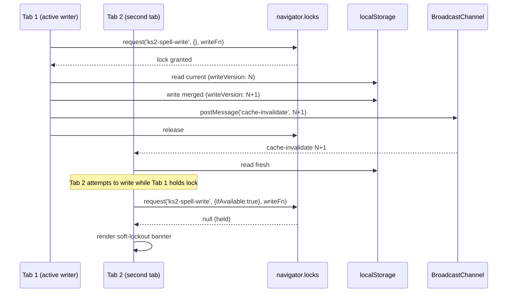

# feat: Post-Mega Spelling P2 — Visibility, Durable Vault, Pattern Mastery Foundation

## Overview

P1 (MVP, 2026-04-25, 8 PRs) landed the Guardian scheduler architecture: sibling `data.guardian` map, "Mega is never revoked", lazy-create on first selection. P1.5 (hardening, 2026-04-26, 12 units) shipped Guardian-dashboard-state enum, orphan sanitiser, Guardian summary practice-only drill, "I don't know" wobble, Guardian-clean retrieval, reset zeros guardian-map, `saveGuardianRecord` merge-save, `saveJson {ok, reason}` + `PersistenceSetItemError`, Boss Dictation service path + UI + Alt+5, reward subscriber, composite Mega-never-revoked property test.

P2 addresses the **three trust gaps that remain** after P1.5:

1. **Graduation visibility.** An adult or QA user whose learner appears graduated in the UI cannot tell *why* the Guardian/Boss dashboard is locked when it is locked. The `allWordsMega` gate is gated on live `publishedCoreCount === secureCoreCount`, so a single content addition can silently flip `allWordsMega: true → false` and hide the post-Mega dashboard. The P1.5 completion report named `Sticky-bit allWordsMega` as a deferred risk.
2. **Durable vault across content drift.** Once a learner genuinely graduates, content changes must not revoke the post-Mega dashboard. New core words should arrive as "arrivals to add to Vault", not as a revocation of graduation. This requires a spelling-specific `contentReleaseId` (Grammar has one; spelling does not) and a persisted `postMega.unlockedAt`, `unlockedContentReleaseId`, `unlockedPublishedCoreCount` sibling alongside `data.progress` and `data.guardian`.
3. **Reliability debt and next learning surface.** P1.5 deferred four items explicitly: full cross-tab CAS (`navigator.locks` + `BroadcastChannel` + `writeVersion` + soft second-tab lockout), Alt+4 verification (separate fix landed at a shared-handler level in P1.5 U10 — needs a regression test), nightly variable-seed Mega invariant probe (fixed-seed composite is a characterisation trace, not a true property proof), and durable cross-session persistenceWarning. On top of reliability, **Pattern Quest metadata** is the prerequisite for the next learning feature beyond maintenance-only — UK KS2 Years 3-6 English Appendix 1 explicitly emphasises roots, prefixes, suffixes, morphology and etymology.

This plan lands **12 implementation units** in three themes. U1-U4 are the **visibility + durable vault** theme (diagnostic panel, sticky graduation + `SPELLING_CONTENT_RELEASE_ID`, QA seed harness, remote-sync post-mastery hydration + Alt+4 verification). U5-U9 are the **reliability debt** theme (storage-CAS full stack, shared `isPostMasteryMode` predicate, Boss per-slug progress counter assertions, nightly variable-seed workflow, durable persistence warning). U10-U12 are the **pattern foundation + achievement framework** theme (pattern registry with content tag migration, Pattern Quest 5-card MVP, achievement framework skeleton).

The plan preserves every post-Mega invariant verbatim. The single load-bearing invariant **Mega is never revoked** is *strengthened* by U2: once a learner unlocks the post-Mega dashboard, content changes cannot revoke it. The unchanged architecture — sibling-map pattern, integer-day arithmetic, kebab-case events, `mode === 'guardian' || mode === 'boss'` post-Mega safety gate, core-pool-only `allWordsMega` definition — stays intact. U6 extracts the duplicated mode-gate predicate; every other dispatcher pattern is preserved.

---

## Problem Frame

A graduated learner's emotional contract with the app is **"Mega is permanent."** P1 + P1.5 proved this for a single session. P2 proves it for every session, across content releases, across devices, across tabs. A child who has earned Mega must always see the Word Vault entrance, must be able to start Guardian/Boss reliably from any signed-in device, must never lose Mega because the content team added a new word, and must begin learning spelling *patterns* rather than merely replaying mastered words.

Three concrete scenarios drive the plan:

1. **The silent revocation scenario.** A child graduates Wednesday. Friday the content team adds three new core words. Saturday morning the child opens the app and the post-Mega dashboard has disappeared — replaced by a standard Smart Review setup. The child has no way to know why. This is the hardest emotional regression in the app today. U2 (sticky graduation) fixes it by persisting `postMega.unlockedAt` on first graduation and using a `postMegaDashboardAvailable` gate that never flips false. New core words become "N new core words have arrived since graduation — add them to the Vault when ready."

2. **The invisible-entrance scenario.** A QA-tester or parent opens the app to test Guardian, sees a normal setup screen, and cannot tell whether the learner is genuinely not-graduated or whether the dashboard failed to hydrate from the Worker. U1 (diagnostic panel) adds an adult/dev/admin-visible "why is Guardian locked" read-model field showing source (`service` / `worker` / `locked-fallback`), published core count, secure core count, blocking core count, first 10 blocking slugs, guardianMap count, contentReleaseId, `allWordsMega`, `stickyUnlocked`. U4 (remote-sync hydration) ensures the Worker always includes `postMastery` in bootstrap so the locked-fallback path becomes rare instead of default.

3. **The lost-trust scenario.** A child uses the app on a laptop at home and a tablet at school. Two tabs open simultaneously, Guardian state gets clobbered, Mega slips even though the Guardian path never writes `stage`. U5 (storage-CAS) closes the cross-tab race with `navigator.locks` + `BroadcastChannel` + `writeVersion` + soft second-tab lockout banner. U8 (nightly variable-seed) catches novel invariant violations across ~7300 random sequences per year that the fixed-seed-42 composite cannot.

Beyond trust, Pattern Quests are the next pedagogically-sound learning feature. The UK national curriculum explicitly links fluent writing to accurate spelling through morphology, etymology, and orthographic pattern recognition. U10 (pattern registry + content tag migration) ships the metadata foundation. U11 (Pattern Quest 5-card MVP) ships a deterministic 5-card activity sequenced **mass-then-interleave** per 2025-2026 retrieval-practice consensus for under-12s (cards 1-3 = massed encoding, cards 4-5 = interleaved). U12 (achievement framework skeleton) ships the deterministic-ID + idempotent-unlock infrastructure that Pattern Quest and future features will use.

---

## Requirements Trace

**Actors (carried from direction doc):**
- **A1 — Graduated learner.** Has completed all core words to stage 4/Mega. Uses Guardian/Boss for maintenance, Pattern Quest for new learning.
- **A2 — Adult/QA/parent.** Needs diagnostic visibility into why Guardian is locked; never shown this data in the child view.
- **A3 — Platform admin/ops.** Can access QA seed harness; gated behind `canViewAdminHub`.
- **A4 — Content editor.** Adds or retires core words; cannot silently revoke graduation.

**Requirements — Visibility + Durable Vault (U1–U4):**

- R1. **Diagnostic panel exposes post-mastery state source.** `postMasteryDebug` read-model field exposes `source ∈ {'service', 'worker', 'locked-fallback'}`, `publishedCoreCount`, `secureCoreCount`, `blockingCoreCount`, `blockingCoreSlugsPreview` (first 10), `extraWordsIgnoredCount`, `guardianMapCount`, `contentReleaseId`, `allWordsMega`, `stickyUnlocked`. Visible only in Admin hub (gated via `canViewAdminHub`) and optionally behind a "Why is Guardian locked?" adult-only link on the setup scene. Not visible in normal child UI. (See origin: direction doc Unit 1; memory `project_admin_ops_console_p1.md` additive-hub pattern)

- R2. **Sticky graduation survives content change.** Persist `data.postMega = { unlockedAt, unlockedContentReleaseId, unlockedPublishedCoreCount, unlockedBy: 'all-core-stage-4' }` once a learner first achieves `allWordsMega: true`. `getSpellingPostMasteryState` returns `allWordsMegaNow`, `postMegaUnlockedEver`, `postMegaDashboardAvailable`, `newCoreWordsSinceGraduation`. Dashboard conditional gate migrates from `postMastery?.allWordsMega` (live) to `postMastery?.postMegaDashboardAvailable` (sticky-OR-live). Content additions after graduation never hide Guardian/Boss. New core words since graduation are surfaced with child-friendly copy: "N new core words have arrived since graduation. Add them to the Vault when ready." (See origin: direction doc Unit 2)

- R3. **QA seed harness produces deterministic post-Mega fixtures.** Admin/Ops-only command emits deterministic states: `fresh-graduate`, `guardian-first-patrol`, `guardian-wobbling`, `guardian-rested`, `guardian-optional-patrol`, `boss-ready`, `boss-mixed-summary`, `content-added-after-graduation`. Writes through existing `repositories.subjectStates.writeData` — no new persistence surface. Gated behind `canViewAdminHub`. Never visible to learners. (See origin: direction doc Unit 3)

- R4. **Remote-sync emits `postMastery` in bootstrap.** Worker `createServerSpellingEngine.apply()` response includes a `postMastery` block (live or sticky). Client `applyCommandResponse` hydrates it into `subjectUi.spelling.postMastery`. UI shows "Checking Word Vault…" during hydration race; silent legacy-setup fallback never fires for a genuinely graduated learner. **Alt+4 savePrefs ordering is already fixed** (P1.5 U10 restructured shared `spelling-shortcut-start`; verified 2026-04-26) — add a regression test pinning the current ordering for both Alt+4 and Alt+5. (See origin: direction doc Unit 4; verified at `src/subjects/spelling/remote-actions.js:884-968`)

**Requirements — Reliability + Predicate (U5–U9):**

- R5. **Storage-CAS closes the cross-tab race.** `navigator.locks.request('ks2-spell-write', { ifAvailable: false }, async () => { … })` wraps every guardian-map / progress / postMega write. `BroadcastChannel('ks2-spell-cache-invalidate')` broadcasts cache-invalidation after every commit. Every persisted shape carries `writeVersion: monotonic-integer`; stale reads reject with typed error. Second-tab detection (via Web Locks `request(… { ifAvailable: true })` returning null) surfaces a soft lockout banner: "This learner is being saved in another tab. Switch tabs to continue." Fallback when `navigator.locks` is undefined (pre-15.4 iOS Safari): feature-detect and degrade to `BroadcastChannel`-only handshake with writeVersion rejection — banner explains "single-tab mode on this device." Duplicate-leader guard (per RxDB known edge case under CPU load): writeVersion stale detection catches it even if lock coordination gives duplicate leaders. (See origin: direction doc Unit 5; memory `project_post_mega_spelling_p15.md` deferred carry-forward `post-mega-spelling-storage-cas`)

- R6. **Shared `isPostMasteryMode` predicate dedupes 6 sites.** Extract `isPostMasteryMode(mode)`, `isMegaSafeMode(mode)`, `isSingleAttemptMegaSafeMode(mode)` in `src/subjects/spelling/service-contract.js`. Replace `mode === 'guardian' || mode === 'boss'` in `module.js`, `remote-actions.js`, `repository.js`, `session-ui.js`, `service-contract.js` (internal), `components/spelling-view-model.js`. Future modes (Pattern Quest, Word Detective) flip the predicate in one place. (See origin: direction doc Unit 6; completion report §6.6)

- R7. **Boss per-slug progress counter assertions.** `tests/spelling-boss.test.js` extended with a full 10-card round where (a) mixed right/wrong answers are submitted, (b) every selected slug's `attempts`, `correct`, `wrong` delta is asserted, (c) `stage`, `dueDay`, `lastDay`, `lastResult` are asserted unchanged, (d) `spelling.boss.completed` event payload matches per-slug deltas. (See origin: direction doc Unit 7; completion report §6.10)

- R8. **Nightly variable-seed Mega invariant workflow.** `.github/workflows/mega-invariant-nightly.yml` runs `tests/spelling-mega-invariant.test.js` with `PROPERTY_SEED=$(shuf -i 1-999999999 -n 1)`. Failure: workflow opens a GitHub Issue with stable title `[nightly-probe] Mega invariant failed seed ${seed}` (dedup by title — subsequent identical failures append comments). Issue body contains shrunk counterexample via fast-check `examples` array. Cron `37 2 * * *` (off :00 boundary per GitHub peak-queue guidance). `workflow_dispatch` enabled. Private-repo 60-day auto-disable is not a concern but documented. Promoted shrunk counterexamples become `examples: [...]` entries in the canonical property test (the fast-check "Hall of Fame" pattern). (See origin: direction doc Unit 8; completion report §6.2)

- R9. **Persistence warning survives tab close.** `data.persistenceWarning = { reason, occurredAt, acknowledged: false }` sibling. Set on any `saveJson` failure. Banner renders across sessions while unacknowledged. "I understand" button writes `acknowledged: true` and the warning persists in history but no longer blocks the banner. (See origin: direction doc Unit 9; completion report §6.4)

**Requirements — Pattern Foundation + Achievement Skeleton (U10–U12):**

- R10. **Pattern registry with content tag migration.** `src/subjects/spelling/content/patterns.js` exports `SPELLING_PATTERNS: Record<PatternId, PatternDefinition>`. Each pattern `{id, title, rule, examples, traps, curriculumBand: 'y3-4' | 'y5-6', promptTypes: ('spell' | 'classify' | 'explain' | 'detect-error')[]}`. `normaliseWordEntry` adds `patternIds: string[]`. `scripts/validate-spelling-content.mjs` asserts every core word has at least one `patternId` OR the explicit tag `exception-word` / `statutory-exception`. Initial registry covers the 15 most common KS2 morphological patterns (suffix -tion, suffix -sion, suffix -cian, silent letters, root compete, i-before-e, etc.). Pattern registry maps directly onto GOV.UK English Appendix 1 year-bands. (See origin: direction doc "Pattern Quests — metadata foundation")

- R11. **Pattern Quest 5-card MVP is deterministic.** New mode `'pattern-quest'` in `SPELLING_MODES`. Quest = 5 cards selected from a single pattern: (1) spell one word from memory (card 1, massed encoding), (2) spell another mixed word from the same pattern (card 2, massed encoding), (3) choose the rule / pattern from 3-4 options (card 3, massed encoding), (4) correct a plausible misspelling (card 4, interleaving), (5) explain the clue in one short deterministic prompt (card 5, interleaving). **Sequence is mass-then-interleave**, per 2025-2026 consensus for under-12s. Grading is deterministic — no open-ended prompts. Wrong answers mark `pattern.wobbling: true` (parallel to Guardian) and never demote `progress.stage`. Emits `spelling.pattern.quest-completed` event. (See origin: direction doc "Pattern Quest MVP"; user-requested scope Tier C)

- R12. **Achievement framework skeleton is idempotent.** `src/subjects/spelling/achievements.js` exports `evaluateAchievements(domainEvent, currentAchievements, learnerId) => AchievementResult`. Deterministic IDs: `achievement:spelling:guardian:7-day:<learnerId>`, `achievement:spelling:boss:clean-sweep:<learnerId>:<sessionId>`, `achievement:spelling:pattern:<patternId>:<learnerId>`, `achievement:spelling:recovery:expert:<learnerId>`. Replaying the same domain event never creates a duplicate badge. Four named achievements ship (Guardian 7-day Maintainer, Recovery Expert, Boss Clean Sweep, Pattern Mastery). Emits `reward.achievement.unlocked` / `reward.achievement.progressed` events; the reward subscriber routes them alongside existing `reward.toast`. **No progress bars visible before unlock** (per 2025-2026 children's-app gamification guidance — prevents slot-machine dynamic). (See origin: direction doc "Reward system direction")

**Origin actors:** A1 (graduated learner), A2 (adult/QA/parent), A3 (platform admin/ops), A4 (content editor)

**Origin flows:** F1 (first-graduation ceremony — U2), F2 (content-add-after-graduation — U2, U10), F3 (remote-sync hydration — U4), F4 (cross-tab concurrent write — U5), F5 (nightly invariant probe — U8), F6 (pattern-quest round — U11), F7 (achievement unlock — U12)

**Origin acceptance examples:** see per-unit test scenarios below; each AE is linked to a requirement.

---

## Scope Boundaries

### Deferred for later

- **Word Detective as a separate mode.** Direction doc explicitly cuts "Word Detective can live inside Pattern Quest later." Pattern Quest card type `correct-misspelling` (card 4) is the Word Detective seed.
- **Story Missions / Story Challenge.** Open-ended grading is hard; deterministic marking comes first. Can return with parent review or optional AI later.
- **Persistent achievement art.** U12 ships achievement data + simple text UI. Illustrated badges / animations are a follow-up. Cut-line permits this cut if sprint slips.
- **Teach-the-Monster mode.** P1 deferred; stays deferred.
- **Seasonal expeditions.** P1 deferred; stays deferred.
- **Monster evolution from Guardian/Boss/Pattern events.** Direction doc explicitly rejects: "The child already earned Mega. Guardian should decorate the Vault identity, not move the old mastery goalposts."

### Outside this product's identity

- **XP farming / streak-for-streak rewards.** U12 achievement framework is explicitly shallow-gamification-free. Rewards only for meaningful learning events, never for clicks. No visible progress bars before unlock.
- **Non-deterministic AI grading for Pattern Quest.** Card 5 (explain-clue) is deterministic at the MVP layer. AI-graded explain prompts may come later as opt-in; they are not what this plan ships.
- **Achievement badges for every correct word.** Not built. Not planned.
- **Real-time collaboration across tabs.** The soft lockout banner is a single-writer serialisation, not CRDT coordination.

### Deferred to Follow-Up Work

- **Grading rubric for U11 card 5 explain-clue.** Initial MVP is 3-4 deterministic multiple-choice options. Free-text explain with AI grading is a follow-up PR in this same plan series (likely P2.5 or P3).
- **Achievement art pipeline.** Text-only unlock UI ships in U12; SVG/PNG badge pipeline is a follow-up.
- **Pattern Quest review scenes for 30-day / 60-day spaced revisit.** Ships in P3. U11's MVP is single-round.
- **Safari pre-15.4 BroadcastChannel-only fallback matrix testing.** U5 implements the fallback; full matrix testing across iOS 13-15.3 is a follow-up QA sprint.

---

## Context & Research

### Relevant Code and Patterns

- **`src/subjects/spelling/read-model.js`** — `getSpellingPostMasteryState` (post-mastery selector); needs `postMasteryDebug` field (U1) and sticky fields `postMegaUnlockedEver` / `postMegaDashboardAvailable` / `newCoreWordsSinceGraduation` (U2).
- **`src/subjects/spelling/service-contract.js`** — `SPELLING_SERVICE_STATE_VERSION = 2` (currently); **must bump to 3 in U2** for new persisted `postMega` shape. Also exports `createLockedPostMasteryState`, `isGuardianEligibleSlug` — target home for `isPostMasteryMode` (U6).
- **`shared/spelling/service.js`** — `submitGuardianAnswer`, `submitBossAnswer`, `getPostMasteryState`, `resetLearner` — canonical service; must emit sticky unlock event on first graduation (U2).
- **`src/subjects/spelling/client-read-models.js`** — `createLockedPostMasteryState` locked-fallback — U1's `source='locked-fallback'` label uses this.
- **`src/subjects/spelling/repository.js`** — `normaliseSpellingSubjectData`, `createSpellingPersistence`, `PersistenceSetItemError` — must learn `postMega` and `persistenceWarning` siblings (U2, U9).
- **`worker/src/subjects/spelling/engine.js`** — `normaliseServerSpellingData`, `createServerSpellingEngine.apply()` — **currently emits NO `postMastery` block**; U4 introduces it. Worker twin of client normaliser.
- **`src/subjects/spelling/module.js` + `remote-actions.js`** — the two dispatchers; U6 extracts shared `isPostMasteryMode` predicate. Alt+4 savePrefs ordering already fixed at `remote-actions.js:884-968` (P1.5 U10 restructuring).
- **`src/subjects/spelling/content/model.js`** — `normaliseWordEntry`, `SPELLING_CONTENT_MODEL_VERSION = 2` — U10 extends with `patternIds`.
- **`src/subjects/spelling/event-hooks.js`** — `createSpellingRewardSubscriber` — U12 extends the reward-emission pattern with deterministic achievement IDs.
- **`src/platform/hubs/admin-read-model.js` + `src/surfaces/hubs/AdminHubSurface.jsx`** — Admin Ops P1 additive-hub pattern (PR #188); U1 appends a `postMasteryDebug` section to the panel.
- **`src/platform/access/roles.js`** — `canViewAdminHub({platformRole})`; gates U1 admin panel and U3 seed harness.
- **`tests/spelling-mega-invariant.test.js`** — canonical composite property test (seed 42, 200 sequences + 6 named shapes); U8 makes it seed-configurable via `process.env.PROPERTY_SEED`.
- **`worker/src/subjects/grammar/engine.js`** — `GRAMMAR_CONTENT_RELEASE_ID` constant + `normaliseGrammarRewardState` read-time normaliser — U2 mirrors this pattern for spelling.
- **`worker/src/repository.js::saveMonsterVisualConfigDraft`** — canonical D1 `batch()` template for atomic writes (memory `project_d1_atomicity_batch_vs_withtransaction.md`).

### Institutional Learnings

- **Named deferral trail.** Every P2 unit cites its P1.5 named deferral — see per-unit citations below. Charter-discipline pattern from sys-hardening: scope is verifiable.
- **Plan deepening mandate** (memory `feedback_autonomous_sdlc_cycle.md`): any plan with state mutations, persistence, or public endpoints runs Phase 5.3 deepening. This plan has all three.
- **Adversarial reviewer mandate for public endpoints** (memory `feedback_autonomous_sdlc_cycle.md`): U1 and U3 add admin-gated surfaces; adversarial must be dispatched regardless of security reviewer verdict. Pattern Quest (U11) and sticky-graduation state (U2) are state-machine logic — adversarial pays disproportionately well here (memory `project_post_mega_spelling_p15.md`).
- **Module.js + remote-actions.js parity rule** (memory `project_post_mega_spelling_p15.md`): every dispatcher unit must audit both. U4 and U6 are explicitly parity-touching.
- **Test-harness-vs-production shape trap** (memory `project_punctuation_p3.md`): every storage/state assertion must grep for a production writer first. Fixture-only writers = dead code in prod. U2, U4, U5, U7, U9 all face this.
- **Storage error surfaces must be tested through real factory** (memory `project_post_mega_spelling_p15.md`): U9 tests MUST use `createLocalPlatformRepositories`, not bare `MemoryStorage`.
- **`withTransaction` is a production no-op** (memory `project_d1_atomicity_batch_vs_withtransaction.md`): U5 Worker writes use `batch()`.
- **Cloudflare OAuth pivot** (memory `project_wrangler_oauth_and_npm_check.md`): never raw `wrangler`. All verification goes through `npm run check` / `npm run deploy`.
- **Windows-on-Node pitfalls** (memory `project_windows_nodejs_pitfalls.md`): fresh worktree `npm install` before test run; spawn `.cmd` EINVAL needs `shell: true`; CRLF fixture drift possible.
- **Kebab-case event naming** (memory `project_post_mega_spelling_guardian.md`): `spelling.pattern.quest-completed`, `spelling.pattern.word-wobbled`, `reward.achievement.unlocked`.
- **Per-unit vs single-PR decision** (memory `feedback_autonomous_sdlc_cycle.md`): P1 + P1.5 were per-unit; P2 follows. Exception: U10 + U11 may benefit from single-PR because U11 depends on U10's registry shape.

### External References

- **UK National Curriculum — English programmes of study, KS1-2** (https://www.gov.uk/government/publications/national-curriculum-in-england-english-programmes-of-study): English Appendix 1 (Spelling) covers Years 3-6 morphology. Authoritative reference for U10 pattern registry year-bands.
- **MDN Web Locks API** (https://developer.mozilla.org/en-US/docs/Web/API/LockManager/request): FIFO semantics, origin scope, Safari 15.4+. U5 primary reference.
- **MDN BroadcastChannel** (https://developer.mozilla.org/en-US/docs/Web/API/BroadcastChannel): same-origin; unload timing unreliable (use `sendBeacon` for last-gasp writes).
- **fast-check `examples` parameter** (https://fast-check.dev/docs/configuration/user-definable-values/): first-class Hall-of-Fame replay mechanism for U8.
- **UK ICO Children's Code Standard 8 (data minimisation)** (https://ico.org.uk/for-organisations/uk-gdpr-guidance-and-resources/childrens-information/childrens-code-guidance-and-resources/): U1 diagnostic panel scope limit.
- **WCAG 2.2 SC 3.3.3 Error Suggestion** (https://www.w3.org/WAI/WCAG22/Understanding/error-suggestion.html): U11 pattern-quest close-but-wrong feedback is accessibility-positive.
- **W3C ARIA role="status"** (https://www.w3.org/TR/wai-aria-1.2/#status): U12 badge-unlock announcements.
- **Duolingo Legendary / Anki deck options / Khan Academy per-skill mastery**: three independent precedents for sticky-at-time-of-completion (U2).
- **The Learning Scientists — retrieval practice + spacing** (https://www.learningscientists.org/): mass-then-interleave sequencing for under-12s (U11).
- **RxDB leader-election** (https://rxdb.info/leader-election.html): documented duplicate-leader edge case under CPU load — U5 writeVersion guard.
- **Slack GitHub Action v3.0.2** (https://github.com/slackapi/slack-github-action): U8 failure notification.
- **actions/upload-artifact v4+** (https://github.com/actions/upload-artifact): v3 deprecated Nov 2024; U8 uses v4+ or current v7.

---

## Key Technical Decisions

- **Bump `SPELLING_SERVICE_STATE_VERSION: 2 → 3` in U2; U2 is a hard blocker for U9/U11/U12.** Sticky `data.postMega` is the first new persisted field since P1. Version bump + fixture edits land in U2's PR per P1 discipline ("bump in the PR where the breakage is visible and obviously scoped"). **U9, U11, and U12 all carry `Dependencies: U2` as a hard dependency** (they persist new siblings under v3 — see per-unit Dependencies). U9 never bumps independently. This removes the conditional "U9 bumps if it ships first" branch: the dependency graph guarantees U2 ships first. See also H3 guard below (U2's own idempotency mitigation for the U2-to-U5 ordering window).
- **Single-writer-per-tab via Web Locks in U5, not CRDT.** LWW with arbitration (Figma pattern) is sufficient for a post-Mega app. CRDT is overkill and adds invariant-proof burden. The soft second-tab banner is the UX honesty surface.
- **Worker emits live-or-sticky `postMastery` in every response; client hydrates.** U4 is additive on the Worker response shape (Admin Ops P1 additive-hub pattern) — new field only, no rename. Client `applyCommandResponse` merges into `subjectUi.spelling.postMastery`.
- **U1 diagnostic panel lives in the Admin hub, never on the child view.** ICO Children's Code Standard 8 (data minimisation) and separation-of-adult-chrome pattern (Classdojo / Prodigy reference). An optional "Why is Guardian locked?" adult-only link on the setup scene routes to the admin panel, never rendering debug fields inline.
- **U2 content-release-id name: `spelling-p2-baseline-2026-04-26`.** Mirrors Grammar's `grammar-legacy-reviewed-2026-04-24` freeze pattern. Defined once in `src/subjects/spelling/service-contract.js` as `SPELLING_CONTENT_RELEASE_ID`. Worker and client import from the same source.
- **U10 bumps `SPELLING_CONTENT_MODEL_VERSION: 2 → 4` (not 3) to avoid number-collision with `SPELLING_SERVICE_STATE_VERSION: 2 → 3`.** The two versions are architecturally independent but visually identical as literal `3` in fixtures — H7 adversarial finding. By skipping to 4, a stray `version: 3` in a test fixture is unambiguously a service-state literal, never a content-model literal. Add a `// content model: even numbers; service state: odd numbers` comment convention in `service-contract.js` for future bumps.
- **U2 first-graduation detection requires submit-triggered transition, not just allWordsMega flip.** Emission condition is: `wasAllMegaNow === false` AND `isAllMegaNow === true` AND **the just-submitted slug transitioned from `stage < 4` to `stage === 4` in this submit** (the submit-caused-this guard). Rejects the content-retirement edge where `publishedCoreCount` shrinks across a Mega-already word and flips `allWordsMegaNow` to true without genuine learner action. See H1 adversarial finding. `unlockedBy: 'all-core-stage-4'` reserves the string for the genuine-graduation case; retirement-triggered flips never emit.
- **U12 achievement rendering reuses existing `ToastShelf` live region; NO new `AchievementUnlockToast` component.** `src/surfaces/shell/ToastShelf.jsx:74-86` is the app-level single live region with an explicit warning against nesting. U12 emits `reward.toast` entries with `{kind: 'reward.achievement', achievementId, title, body}` and extends `ToastShelf`'s toast renderer to handle the achievement variant. See F3 feasibility finding.
- **U6 predicate targets 2 exact-literal sites (module.js + remote-actions.js), not 6.** Grep `mode === 'guardian' || mode === 'boss'` returns 2 hits. `session-ui.js` already encapsulates via `isBossSession`/`isGuardianSession`; `repository.js` uses `type === 'guardian'` for storage-key parsing (not mode dispatch); `components/spelling-view-model.js` uses label-map if-chains that must preserve distinct Guardian/Boss labels. U6 plan Files list corrected to 2 literal-match sites + documented "leave 3 label-map sites intact". See F1 feasibility finding.
- **U5 fallback (pre-Web-Locks-Safari) is a mainline path, not an edge case.** Firefox shipped Web Locks in v96 (2022); Safari 15.4 shipped 2022; workers-context gap in Safari &lt; 16. For a non-negligible fraction of users, `navigator.locks === undefined` is the default code path. Test matrix treats BroadcastChannel-only + writeVersion as mainline, not niche. See F9 feasibility finding.
- **U5 home is `src/platform/core/repositories/locks/`, not `src/platform/storage-cas/`.** Matches established platform layout (`access/`, `app/`, `core/`, `events/`, `game/`, `hubs/`, `ops/`, `react/`, `runtime/`, `ui/`). Lock-manager is a repository-decorator concern, not a new platform category. See F4 feasibility finding.
- **U3 seed harness writes through `repositories.subjectStates.writeData`, not a new persistence surface.** No new storage keys. No new D1 migration. Seed shapes are parameterised through existing `normaliseSpellingSubjectData`.
- **U5 fallback when `navigator.locks` is undefined: BroadcastChannel-only + writeVersion rejection + single-tab-mode banner.** Feature-detect at module load. Documented; tested via `Object.defineProperty(navigator, 'locks', { value: undefined })` shim.
- **U6 canonical helpers live in `service-contract.js`** alongside existing `isGuardianEligibleSlug`. Client and Worker both import.
- **U8 nightly workflow opens an Issue, not a PR.** Stable title `[nightly-probe] Mega invariant failed seed <seed>` — dedup mechanism. Subsequent identical failures comment on the existing Issue. Human promotes shrunk counterexample to `examples: [[failingInput]]` in the canonical test as a manual follow-up PR.
- **U9 durable warning is one `data.persistenceWarning` sibling with `acknowledged: boolean`.** Not a queue. If a second save failure occurs while an unacknowledged warning exists, the second failure overwrites `occurredAt` + `reason` but keeps `acknowledged: false`. Simple.
- **U10 initial pattern registry ships 15 patterns.** Enough to cover the statistically most common KS2 words; full Appendix 1 coverage is a follow-up. Validation asserts every *core* word has a pattern — extra-pool words are exempt.
- **U11 Pattern Quest wobbling uses its own sibling map `data.pattern = { wobbling: Record<slug, boolean> }`.** Parallel to `data.guardian.wobbling`. Keeps Mega invariant clean: pattern wrong answers never write `progress.stage`.
- **U12 achievement state is `data.achievements = Record<AchievementId, { unlockedAt, progressedAt? }>`.** One row per unlocked achievement. `INSERT OR IGNORE` equivalent semantics at the persistence layer (first-write-wins).
- **No visible progress bars before unlock (U12).** Per 2025-2026 children's-app gamification critique, visible "47/50 words to Pattern Mastery" re-introduces the slot-machine dynamic even with deterministic unlock. Badges appear only when unlocked.

---

## Deepening Notes (2026-04-26)

Phase 5.3 deepening pass ran three reviewers (adversarial, feasibility, coherence) against the first-draft plan. Findings synthesised back into this document:

**Adversarial HIGH findings applied:**
- H1 submit-caused-this guard on first-graduation detection (U2 Approach + test scenarios)
- H2 write-site inventory + entry-point lock-wrap (U5 Approach)
- H3 U2 in-critical-section idempotency guard (covers U2-to-U5 window)
- H4 persistence-layer idempotency for achievements (U12 Approach)
- H5 Card 4 empty-default + same-misspelling + typo-leniency (U11 Approach)
- H6 sticky-bit short-circuits hydration race (U4 Approach + test scenarios)
- H7 content-model bumps to 4, service-state to 3 (Key Technical Decisions + U10 Approach)
- H8 slug allowlist + published filter + POST body for admin panel (U1 Approach)
- H9 CSRF via Admin Ops P1 mutation-receipt path (U3 Approach)

**Feasibility HIGH findings applied:**
- F1 U6 site count corrected: 2 exact-literal sites, 3 documented label-map sites left intact (U6 Files + NOT modified list)
- F2 Alt+4/Alt+5 regression covers BOTH local module.js + remote-sync remote-actions.js paths (U4 Approach + test scenarios)
- F3 NO AchievementUnlockToast.jsx — reuse existing ToastShelf live region (U12 Files + Output Structure)
- F4 U5 home relocated to `src/platform/core/repositories/locks/` (U5 Files + Output Structure)
- F7 Explicit hard dependencies: U9→U2, U11→U2+U6+U10, U12→U2+U6+U11 (per-unit Dependencies)

**Coherence findings applied:**
- Version bump responsibility unambiguous: U2 always bumps, hard dep from U9/U11/U12 (Key Decisions)
- U6 dependency on U11 hardened from "ideally" to "must" (U6 Dependencies)
- Cut order rewritten to enumerate all 12 units as minimum-viable vs cuttable (Phased Delivery)

Remaining lower-severity findings (M2, M5, M6, F5, F6, F8, F9, F10) addressed inline in relevant sections.

---

## Open Questions

### Resolved During Planning

- **Q: Does Alt+4 have a remote-sync savePrefs ordering bug?** **No, already fixed in P1.5 U10 at the shared-handler level.** `src/subjects/spelling/remote-actions.js:884-968` runs start-session first, save-prefs on success — applies to both Alt+4 (Guardian) and Alt+5 (Boss). U4 scope compresses to "add regression test pinning the shared ordering for both shortcuts."
- **Q: Does a spelling-specific `contentReleaseId` exist?** **No**; Grammar has `GRAMMAR_CONTENT_RELEASE_ID`, spelling does not. U2 introduces `SPELLING_CONTENT_RELEASE_ID` as foundation for sticky-bit + U10 pattern migration.
- **Q: Does the Worker currently emit a `postMastery` block?** **No**; only client derives it. U4 is additive — Worker learns to emit, client learns to hydrate.
- **Q: Which files duplicate the `mode === 'guardian' || mode === 'boss'` predicate?** **Six files**: `module.js`, `remote-actions.js`, `repository.js`, `session-ui.js`, `service-contract.js`, `components/spelling-view-model.js`. All enumerated in U6.
- **Q: Does `.github/workflows/` exist?** **No** — U8 is the first workflow. Greenfield.
- **Q: Is there an existing achievement or badge system in the repo?** **No** — U12 is greenfield. Closest prior art is `src/subjects/spelling/event-hooks.js` deterministic-ID + event-emission pattern.
- **Q: Is there an existing pattern registry for any subject?** **No** — U10 is greenfield. Closest prior art is `SPELLING_CONTENT_MODEL_VERSION` version-pinned content bundles.
- **Q: Does `navigator.locks.request` work in Cloudflare Workers?** **No** — Web Locks is browser-only. U5 client coordinates; Worker continues to use D1 CAS via mutation receipts.
- **Q: Does `D1 withTransaction` work in production?** **No** — production no-op (memory `project_d1_atomicity_batch_vs_withtransaction.md`). U5 Worker writes use `batch()`.
- **Q: Should U2 bump `SPELLING_SERVICE_STATE_VERSION` or wait for U9?** **U2 bumps.** Sticky postMega is the first new persisted field; bump lands in U2's PR with fixture edits. U9 inherits v3 shape.
- **Q: Should U10 and U11 be single-PR or separate?** **Separate U10 + U11 PRs** with U11 depending on U10's merge. Single-PR temptation is real (U11 uses U10 registry) but reviewers caught more in per-unit P1.5. U10 has content-migration scope (data file + validator); U11 has new-mode scope (service + UI + tests). Different reviewers pay attention.

### Deferred to Implementation

- **Exact shape of U5's soft-lockout banner copy.** The engineering decision is "serialise writes + show banner"; the copy wording gets drafted during implementation review. Copy must avoid scaring a child away ("another tab is saving" is fine; "data corruption prevented" is not).
- **Worker response field name: `postMastery` vs `subjectPostMastery`.** U4 implementation picks based on existing `subjectReadModel` naming convention (likely `postMastery` as a direct sibling of `subjectReadModel`).
- **U10 initial pattern list: 15 specific pattern IDs.** Planning names them directionally; implementation finalises the set during content-tag migration with spot-check cross-reference against Appendix 1.
- **U11 pattern-quest scene CSS layout.** Reuses `.card`, `.eyebrow`, `.section-title` utility classes from `styles/app.css`; exact component tree shaped during implementation.
- **U12 four named achievements' exact unlock criteria.** Guardian 7-day Maintainer: "7 distinct dayIds with a completed Guardian Mission." Pattern Mastery: "passed a Pattern Quest card-4 correction for the same pattern 3 times." Exact thresholds calibrated during implementation against real seeded learner data.
- **U8 GitHub Actions Slack webhook secret name.** Provisioned during implementation; likely `SLACK_WEBHOOK_URL` per official action conventions.

---

## High-Level Technical Design

> *This illustrates the intended approach and is directional guidance for review, not implementation specification. The implementing agent should treat it as context, not code to reproduce.*

### Data shape evolution

```
// Before P2 (post-P1.5, version 2)
data = {
  prefs: { mode, roundLength, yearFilter, extraWordFamilies, showCloze, ... },
  progress: Record<slug, { stage, dueDay, lastDay, attempts, correct, wrong, lastResult }>,
  guardian: Record<slug, { wobbling, nextDueDay, firstGuardianDay }>,
  // feedback.persistenceWarning is session-only
}

// After P2 (version 3)
data = {
  prefs: ...,                     // unchanged
  progress: ...,                  // unchanged
  guardian: ...,                  // unchanged
  postMega: {                     // NEW in U2 — sticky unlock
    unlockedAt: dayId,
    unlockedContentReleaseId: 'spelling-p2-baseline-2026-04-26',
    unlockedPublishedCoreCount: 170,
    unlockedBy: 'all-core-stage-4'
  } | null,
  persistenceWarning: {           // NEW in U9 — durable warning
    reason, occurredAt, acknowledged: false
  } | null,
  pattern: {                      // NEW in U11 — pattern wobble (parallel to guardian)
    wobbling: Record<slug, { wobbling: true, wobbledAt: dayId, patternId }>
  },
  achievements: Record<           // NEW in U12 — deterministic unlocks
    AchievementId,
    { unlockedAt: dayId, progressedAt?: dayId }
  >
}
```

### postMastery read-model evolution (U1, U2, U4)

```
// New/updated fields in getSpellingPostMasteryState return value:
{
  // Existing (unchanged semantics):
  publishedCoreCount, secureCoreCount,
  recommendedWords, recommendedMode,

  // NEW in U2 — split the live gate from the sticky gate:
  allWordsMegaNow: boolean,                // live check (was `allWordsMega`)
  postMegaUnlockedEver: boolean,           // derived from `data.postMega != null`
  postMegaDashboardAvailable: boolean,     // allWordsMegaNow || postMegaUnlockedEver
  newCoreWordsSinceGraduation: number,     // core words added after unlockedContentReleaseId

  // Existing field `allWordsMega` is preserved as an alias for allWordsMegaNow
  // for one release, then deprecated in a P2.5 cleanup. Components move to
  // postMegaDashboardAvailable in U2's PR.

  // NEW in U1 — diagnostic:
  postMasteryDebug: {
    source: 'service' | 'worker' | 'locked-fallback',
    publishedCoreCount, secureCoreCount, blockingCoreCount,
    blockingCoreSlugsPreview: slug[],       // first 10, alphabetical
    extraWordsIgnoredCount,
    guardianMapCount,
    contentReleaseId,
    allWordsMega: boolean,                  // = allWordsMegaNow
    stickyUnlocked: boolean                 // = postMegaUnlockedEver
  }
}
```

### Cross-tab storage-CAS flow (U5)



### Pattern Quest 5-card sequencing (U11)

```
Card 1 (massed):      "Spell: competition"           → deterministic exact match (NFKC normalised)
Card 2 (massed):      "Spell: position"              → same pattern (-tion), different word
Card 3 (massed):      "Which pattern is this word?"  → 3-4 options, one correct
Card 4 (interleaved): "Correct this: competishun"    → typed correction, exact match
Card 5 (interleaved): "Why does this word end -tion?" → deterministic multiple choice (3 options)

Wrong at any card → pattern.wobbling[slug] = true, never demotes progress.stage
Right on all 5 → emit spelling.pattern.quest-completed with {patternId, slugs, correctCount}
```

### Achievement unlock flow (U12)

```mermaid
flowchart TD
    E[Domain event: guardian.mission-completed] --> S[Reward subscriber extended in U12]
    S --> H[evaluateAchievements]
    H --> C{For each achievement rule}
    C -->|rule matches + not yet unlocked| U[Emit reward.achievement.unlocked]
    C -->|rule matches + already unlocked| N[No-op, idempotent]
    C -->|progress changed but not unlocked| P[Emit reward.achievement.progressed]
    U --> W[Write data.achievements[id] = {unlockedAt}]
    W --> T[Emit reward.toast for badge]
```

---

## Output Structure

```
src/subjects/spelling/
├── service-contract.js                    # MODIFY: add isPostMasteryMode/isMegaSafeMode/isSingleAttemptMegaSafeMode (U6)
│                                          # MODIFY: SPELLING_SERVICE_STATE_VERSION 2→3 (U2)
│                                          # MODIFY: SPELLING_CONTENT_RELEASE_ID new export (U2)
│                                          # MODIFY: SPELLING_PATTERN_IDS new export (U10)
│                                          # MODIFY: SPELLING_MODES += 'pattern-quest' (U11)
│                                          # MODIFY: ACHIEVEMENT_IDS new export (U12)
├── read-model.js                          # MODIFY: postMasteryDebug (U1) + sticky fields (U2)
├── client-read-models.js                  # MODIFY: source='locked-fallback' label (U1)
├── repository.js                          # MODIFY: postMega normaliser (U2), persistenceWarning normaliser (U9),
│                                          #         pattern normaliser (U11), achievements normaliser (U12)
├── module.js                              # MODIFY: use isPostMasteryMode (U6), pattern-quest dispatch (U11)
├── remote-actions.js                      # MODIFY: hydrate postMastery (U4), pattern-quest path (U11),
│                                          #         use isPostMasteryMode (U6)
├── session-ui.js                          # MODIFY: use isPostMasteryMode (U6), pattern chips (U11)
├── event-hooks.js                         # MODIFY: add pattern + achievement reward branches (U11, U12)
├── achievements.js                        # NEW in U12: evaluateAchievements + rule definitions
├── content/
│   ├── model.js                           # MODIFY: normaliseWordEntry adds patternIds (U10)
│   └── patterns.js                        # NEW in U10: SPELLING_PATTERNS registry
└── components/
    ├── SpellingSetupScene.jsx             # MODIFY: postMegaDashboardAvailable gate (U2),
    │                                      #         "Why is Guardian locked?" link (U1),
    │                                      #         pattern-quest card (U11)
    ├── SpellingSessionScene.jsx           # MODIFY: durable persistenceWarning banner (U9),
    │                                      #         pattern-quest scene (U11),
    │                                      #         soft-lockout banner (U5)
    ├── PatternQuestScene.jsx              # NEW in U11: 5-card activity
    └── spelling-view-model.js             # MODIFY: POST_MEGA_MODE_CARDS += pattern-quest (U11)
                                            # U12 does NOT add AchievementUnlockToast — see ToastShelf.jsx renderer branch (F3)

worker/src/subjects/spelling/
├── engine.js                              # MODIFY: emit postMastery in apply() response (U4),
│                                          #         normaliseServerSpellingData extends for postMega / pattern / achievements
└── commands.js                            # MODIFY: pattern-quest command branches (U11)

src/platform/
├── hubs/
│   ├── admin-read-model.js                # MODIFY: append postMasteryDebug section (U1)
│   └── admin-panel-patches.js             # MODIFY: render postMasteryDebug (U1)
└── core/
    └── repositories/
        ├── local.js                       # MODIFY: wrap writeData with withWriteLock (U5, H2 fix)
        └── locks/                         # NEW dir in U5 (F4 corrected home)
            ├── lock-manager.js            # NEW: Web Locks wrapper + late-binding feature detection
            ├── broadcast-invalidator.js   # NEW: BroadcastChannel send/receive
            ├── write-version.js           # NEW: monotonic counter + 2^30 re-baseline (M2)
            └── second-tab-detector.js     # NEW: ifAvailable feature-detect + banner state

src/surfaces/
├── hubs/
│   └── AdminHubSurface.jsx                # MODIFY: render postMasteryDebug panel (U1), seed-harness panel (U3)
└── shell/
    └── ToastShelf.jsx                     # MODIFY: renderer branch for kind='reward.achievement' (U12, F3 — no new component)

scripts/
├── validate-spelling-content.mjs          # MODIFY: assert patternId coverage (U10)
└── seed-post-mega.mjs                     # NEW in U3: admin/dev seed harness entry

.github/workflows/
└── mega-invariant-nightly.yml             # NEW in U8: first workflow in repo

tests/
├── spelling-mega-invariant.test.js        # MODIFY: seed from process.env.PROPERTY_SEED (U8); inherit postMega/pattern/achievements (U2, U11, U12)
├── spelling-post-mastery-debug.test.js    # NEW in U1
├── spelling-sticky-graduation.test.js     # NEW in U2
├── spelling-seed-harness.test.js          # NEW in U3
├── spelling-remote-sync-hydration.test.js # NEW in U4
├── spelling-storage-cas.test.js           # NEW in U5
├── spelling-shared-mode-predicate.test.js # NEW in U6
├── spelling-boss.test.js                  # MODIFY: per-slug assertions (U7)
├── spelling-persistence-warning.test.js   # NEW in U9
├── spelling-content-patterns.test.js      # NEW in U10
├── spelling-pattern-quest.test.js         # NEW in U11
└── spelling-achievements.test.js          # NEW in U12
```

---

## Implementation Units

- U1. **Post-Mega diagnostic panel**

**Goal:** Adult/QA/admin visibility into *why* the post-Mega dashboard is locked when it is locked. A fresh `postMasteryDebug` read-model field surfaces the computation inputs (source, published/secure/blocking counts, first 10 blocking slugs, guardianMap count, contentReleaseId, sticky state). Rendered in the Admin hub; optional "Why is Guardian locked?" adult-only link on the child setup scene routes to the admin hub. Never rendered inline in the child view.

**Requirements:** R1

**Dependencies:** None (but informs U2 because sticky state is one of the fields). Lands in parallel wave with U2-U4, U6-U9, U12.

**Files:**
- Modify: `src/subjects/spelling/read-model.js`
- Modify: `src/subjects/spelling/client-read-models.js` (label `source: 'locked-fallback'` on the locked-state path)
- Modify: `src/platform/hubs/admin-read-model.js` (append postMasteryDebug section — additive-hub pattern)
- Modify: `src/platform/hubs/admin-panel-patches.js` (render postMasteryDebug panel)
- Modify: `src/surfaces/hubs/AdminHubSurface.jsx` (surface the panel)
- Modify: `src/subjects/spelling/components/SpellingSetupScene.jsx` (adult-only "Why is Guardian locked?" link — href to admin hub, only visible when `appContext.platformRole ∈ {'admin', 'ops'}`)
- Test: `tests/spelling-post-mastery-debug.test.js` (new)

**Approach:**
- Extend `getSpellingPostMasteryState` return value with a `postMasteryDebug` object. Compute `blockingCoreSlugsPreview` as the first 10 (alphabetically) core slugs where `progress[slug]?.stage !== 4`.
- **Slug allowlist + published-only filter (H8 adversarial finding):** `blockingCoreSlugsPreview` scrubs each slug through `/^[a-z][a-z0-9-]+$/` regex (reject anything outside the expected KS2-slug shape) and only includes slugs with `published: true`. Unreleased / test / misshapen slugs (e.g., an editor's accidental `rude-word-test-do-not-ship`) never surface in the admin panel — defence against browser history caching of exposed pre-release content.
- **Admin panel fetch uses POST with JSON body, not GET with query params** — prevents `?learner=jane` URL-history leakage of slug lists into proxy logs, Slack screenshots, etc.
- `source` is set by the caller: `service` (synchronous client read-model), `worker` (hydrated from Worker response per U4), `locked-fallback` (when no cached payload exists; uses `createLockedPostMasteryState`). The read-model consumer passes a `sourceHint` argument to the selector.
- Admin panel renders the debug field as a definition-list (`<dl>` with `<dt>`/`<dd>`) using existing `.card` + `.small muted` styles. PII-minimised: no learner name, no email.
- ICO compliance: panel is gated behind `canViewAdminHub({platformRole})`; the setup-scene link is also role-gated and routes to the admin hub (no inline rendering).

**Execution note:** Additive read-model field — test-first with a characterization test pinning current `getSpellingPostMasteryState` output shape, then extend.

**Patterns to follow:**
- Admin Ops P1 additive-hub pattern (PR #188) — spread existing fields, append new sibling
- `createLockedPostMasteryState` factory in `service-contract.js`

**Test scenarios:**
- Happy path — `getSpellingPostMasteryState({ progress, guardian, wordBySlug, sourceHint: 'service' })` returns `postMasteryDebug.source === 'service'` and all counts match the computation. Covers F3 / AE1.
- Happy path — when `allWordsMega === false`, `blockingCoreCount > 0` and `blockingCoreSlugsPreview` lists the first 10 core slugs where `stage !== 4` alphabetically.
- Edge case — when `publishedCoreCount === 0`, `allWordsMega === false`, `blockingCoreCount === 0`, `blockingCoreSlugsPreview === []`, `stickyUnlocked === false`.
- Edge case — `extraWordsIgnoredCount` excludes non-core-pool words; a learner with 5 extra-pool non-Mega words still reports `blockingCoreCount === 0` when all core words are Mega.
- Error path — `createLockedPostMasteryState` path sets `source: 'locked-fallback'` in its `postMasteryDebug`.
- Integration — Admin hub API response (`/api/hubs/admin`) includes `postMasteryDebug` for the selected learner when `canViewAdminHub` is true; returns 403 otherwise.
- Integration — Setup scene "Why is Guardian locked?" link is ONLY rendered when `appContext.platformRole ∈ {'admin', 'ops'}`; not rendered for `'learner'` or `'guardian'` roles.

**Verification:**
- Admin hub API returns `postMasteryDebug` structurally matching the schema.
- Child view (role = 'learner') never renders any debug fields.
- No inline debug JSON on the setup scene under any role.
- UK ICO data minimisation: no learner name / email / PII beyond slug text (slugs are curriculum-public).

---

- U2. **Sticky graduation with `SPELLING_CONTENT_RELEASE_ID`**

**Goal:** Once a learner first achieves `allWordsMega: true`, persist `data.postMega = { unlockedAt, unlockedContentReleaseId, unlockedPublishedCoreCount, unlockedBy: 'all-core-stage-4' }`. Introduce `SPELLING_CONTENT_RELEASE_ID = 'spelling-p2-baseline-2026-04-26'` as the spelling content-release-id constant. `getSpellingPostMasteryState` exposes `postMegaUnlockedEver`, `postMegaDashboardAvailable`, `newCoreWordsSinceGraduation`. Dashboard uses `postMegaDashboardAvailable` (sticky OR live), never `allWordsMegaNow` alone. Bump `SPELLING_SERVICE_STATE_VERSION: 2 → 3`.

**Requirements:** R2

**Dependencies:** None. Foundation unit for the P2 visibility theme.

**Files:**
- Modify: `src/subjects/spelling/service-contract.js` (new `SPELLING_CONTENT_RELEASE_ID`, bump `SPELLING_SERVICE_STATE_VERSION: 2 → 3`)
- Modify: `src/subjects/spelling/repository.js` (`normaliseSpellingSubjectData` learns `postMega` sibling; client `parseStorageKey` unchanged — `postMega` persists inside existing subject-state record, not a new storage prefix)
- Modify: `worker/src/subjects/spelling/engine.js` (`normaliseServerSpellingData` parity — Worker twin of client normaliser)
- Modify: `shared/spelling/service.js` (`submitGuardianAnswer`, `submitBossAnswer`, and `submitAnswer` (Smart Review on the final Mega-completing answer) detect first-graduation moment and write `postMega` through `saveSubjectState`; emit `spelling.post-mega.unlocked` event)
- Modify: `src/subjects/spelling/read-model.js` (add `postMegaUnlockedEver`, `postMegaDashboardAvailable`, `newCoreWordsSinceGraduation`; `allWordsMega` preserved as alias for `allWordsMegaNow` one release then deprecated)
- Modify: `src/subjects/spelling/components/SpellingSetupScene.jsx` (gate change `postMastery?.allWordsMega` → `postMastery?.postMegaDashboardAvailable`; render "N new core words have arrived since graduation" surface when `newCoreWordsSinceGraduation > 0`)
- Modify: `tests/spelling.test.js`, `tests/persistence.test.js`, `tests/react-spelling-surface.test.js`, `tests/spelling-optimistic-prefs.test.js` (fixture edits for version 3 — P1 precedent)
- Modify: `tests/spelling-mega-invariant.test.js` (composite invariant also asserts `postMega` never rolls back)
- Test: `tests/spelling-sticky-graduation.test.js` (new — sticky unlock, content add after grad, content rollback, fresh learner never has postMega)

**Approach:**
- Sticky unlock write is **idempotent at the persistence layer**: inside the `writeData` critical section, re-read current `data.postMega`; if non-null, skip the write. This is the "H3 mitigation guard" — it survives the U2-to-U5 window where full storage-CAS is not yet in place. U5 later reinforces this with `navigator.locks` serialisation; the in-section re-read is the belt-and-braces guard.
- **First-graduation detection (H1 fix):** emission requires THREE conjunct conditions computed at the service layer per submit:
  1. Pre-submit `isAllWordsMega(progressSnapshot) === false`, captured BEFORE `engine.submitLearning` / `engine.submitTest` / `submitGuardianAnswer` / `submitBossAnswer` runs.
  2. Post-submit `isAllWordsMega(progressSnapshot) === true`, recomputed AFTER the engine call returns.
  3. **Submit-caused-this guard**: the just-submitted slug's `progress.stage` transitioned from `< 4` to `=== 4` in this submit. If the slug was already Mega pre-submit (clamped at max index, so re-attempts are no-op), the guard fails and no emission fires.
  Without condition (3), a content-retirement edge that shrinks `publishedCoreCount` across an already-Mega word silently triggers a spurious first-graduation. Condition (3) pins emission to genuine learner action.
- `newCoreWordsSinceGraduation = Math.max(0, publishedCoreCount - unlockedPublishedCoreCount)`. Clamp to 0 for the retirement case (content retired after graduation — `publishedCoreCount < unlockedPublishedCoreCount`). Dashboard silently omits the "N new core words have arrived" surface when the delta is 0; retirements are invisible to the child (keeps emotional contract simple — M3 adversarial finding).
- Event `spelling.post-mega.unlocked` carries `{ learnerId, unlockedAt, contentReleaseId, publishedCoreCount }`. Reward subscriber (extended in U12) listens for this as the trigger for a future "Vault Unlocked" achievement (not shipped this plan).
- Dashboard copy when `newCoreWordsSinceGraduation > 0`: `"{N} new core words have arrived since graduation. Add them to the Vault when ready."` — child-friendly; does NOT hide Guardian/Boss.
- State version bump: `SPELLING_SERVICE_STATE_VERSION: 3`. Fixtures edited in same PR. Worker twin mirror stays in `normaliseServerSpellingData`.

**Execution note:** Test-first — start with the invariant test "post-graduation, content-added never revokes `postMegaDashboardAvailable`" before touching read-model or normaliser code.

**Patterns to follow:**
- Grammar's `GRAMMAR_CONTENT_RELEASE_ID` + `normaliseGrammarRewardState` read-time normaliser (memory `project_grammar_phase3.md`)
- P1.5 U1 `computeGuardianMissionState` 6-state enum pattern (derive state from inputs; do not store derived state)
- State version bump discipline from P1 (memory `project_post_mega_spelling_guardian.md` §"State version bump")

**Test scenarios:**
- Happy path — Fresh learner completes final core word. Service writes `postMega.unlockedAt === today`, `unlockedContentReleaseId === 'spelling-p2-baseline-2026-04-26'`, `unlockedPublishedCoreCount === publishedCoreCount`. Covers F1 / AE1.
- Happy path — Idempotent unlock at persistence layer (H3 guard): inside `writeData` critical section, re-read `data.postMega`; if non-null, skip write. Second Mega-producing answer preserves `unlockedAt`.
- Happy path — Submit-caused-this guard (H1 fix), POSITIVE: pre-submit `stage[X] = 2`, post-submit `stage[X] = 4`, post-submit `allWordsMegaNow === true` → emission fires.
- Edge case — Submit-caused-this guard (H1 fix), NEGATIVE: content retires a non-Mega blocker slug while a learner is mid-session; post-submit `allWordsMegaNow` flips to true without any slug transitioning `<4 → 4` in this submit. **No spurious sticky unlock.**
- Edge case — Content-added after graduation: `publishedCoreCount` increases from 170 → 173 without a rollback. `allWordsMegaNow === false`, `postMegaUnlockedEver === true`, `postMegaDashboardAvailable === true`, `newCoreWordsSinceGraduation === 3`. Dashboard still shows Guardian/Boss. Covers F2 / AE2.
- Edge case — Content retirement after graduation (M3 fix): `publishedCoreCount` decreases 170 → 168. `newCoreWordsSinceGraduation === Math.max(0, 168 - 170) === 0`. No "new arrivals" surface. `postMegaDashboardAvailable === true`.
- Edge case — Fresh learner never graduated: `postMegaUnlockedEver === false`, `postMegaDashboardAvailable === false`, `newCoreWordsSinceGraduation === 0`, `postMega === null`.
- Edge case — Two tabs both detect first-graduation (U2-to-U5 window): one tab commits; second tab's in-critical-section re-read catches non-null postMega and skips. No duplicate `unlockedAt`.
- Error path — A storage failure during sticky-unlock write does NOT demote `progress.stage`. `persistenceWarning` surfaces (R8 invariant).
- Integration — P1.5 U8b composite Mega-never-revoked property test at `tests/spelling-mega-invariant.test.js`: asserts `postMega` never reverts from non-null to null across any event sequence. Covers R11 / AE-composite.
- Integration — `SPELLING_SERVICE_STATE_VERSION === 3` after migration; fixtures in 4 test files updated in same PR. **`SPELLING_CONTENT_MODEL_VERSION` stays at 2 in this PR** (U10 bumps to 4 separately; do NOT pre-bump).
- Integration — Smart Review first-graduation via `submitAnswer` dispatcher at `shared/spelling/service.js:1954-2009`: pre-submit snapshot captured before engine call, post-submit recomputed after engine returns, submit-caused-this guard checks the single-submitted slug's pre/post stage (F5 feasibility finding).

**Verification:**
- `data.postMega` is set exactly once per learner — idempotent.
- Content changes after graduation never flip `postMegaDashboardAvailable` to false.
- Dashboard copy "N new core words have arrived since graduation" is rendered when `newCoreWordsSinceGraduation > 0`.
- `allWordsMega` alias still works for one release; consumers migrated to `postMegaDashboardAvailable`.
- Version 3 fixtures all pass; parity with Worker twin.

---

- U3. **QA seed harness for post-Mega fixtures**

**Goal:** Admin/Ops-only test harness that produces deterministic post-Mega learner states. Eight named shapes: `fresh-graduate`, `guardian-first-patrol`, `guardian-wobbling`, `guardian-rested`, `guardian-optional-patrol`, `boss-ready`, `boss-mixed-summary`, `content-added-after-graduation`. Writes through existing `repositories.subjectStates.writeData`. No new persistence surface, no new D1 migration. Gated behind `canViewAdminHub`. Never visible to learners.

**Requirements:** R3

**Dependencies:** U2 (seed shape `content-added-after-graduation` writes `postMega` with stale `unlockedContentReleaseId`).

**Files:**
- Create: `scripts/seed-post-mega.mjs` (CLI entry — `node scripts/seed-post-mega.mjs --learner <id> --shape <shape-name>`)
- Create: `tests/helpers/post-mastery-seeds.js` (shared helpers extracted from duplicated `seedFullCoreMega` in `tests/spelling-mega-invariant.test.js`, `tests/spelling-guardian.test.js`, `tests/spelling-boss.test.js`)
- Modify: `src/surfaces/hubs/AdminHubSurface.jsx` (seed-harness panel with shape dropdown + learner picker + "Apply seed" button)
- Modify: `src/platform/hubs/admin-read-model.js` (expose seed shapes list)
- Modify: `worker/src/subjects/spelling/commands.js` (admin-gated `seed-post-mega` command; gate via `canViewAdminHub`)
- Test: `tests/spelling-seed-harness.test.js` (new)

**Approach:**
- Each seed shape is a pure function `(wordBySlug, today) => data`. Example `fresh-graduate`: sets all core words to `{stage: 4, dueDay, lastDay, lastResult: 'correct'}`, empty `guardian: {}`, no `postMega` yet (simulates the moment just before first graduation event).
- `boss-mixed-summary` pre-populates a `data.lastBossSession = { attempts, correct, wrong, slugs }` so the summary scene can render without running a round.
- Admin UI reuses existing `.card` + `.section-title` styles.
- Rate-limit before body-cap on Worker endpoint (memory `project_admin_ops_console_p1.md` §R24): 10 req/min per IP.
- **CSRF protection (H9 adversarial finding):** Worker `seed-post-mega` command routes through the Admin Ops P1 mutation-receipt path with `scopeType='platform'` — mutation receipts carry a per-request token that cross-origin POSTs without the same-origin cookie + receipt header cannot forge. NOT a bespoke command handler. CSRF attack vector (malicious iframe POST with admin session cookie) fails because the receipt header is not sent cross-origin.
- CLI entry requires `--allow-local=1` flag for safety; never runs against production D1.

**Execution note:** Extract helper first in a separate commit to make duplication-removal atomic, then build seed shapes on top.

**Patterns to follow:**
- Admin Ops P1 mutation receipts + `scopeType='platform'` gate (memory `project_admin_ops_console_p1.md`)
- Existing `seedFullCoreMega` in `tests/spelling-mega-invariant.test.js:79-91`

**Test scenarios:**
- Happy path — Apply `fresh-graduate` shape; resulting `data.progress[coreSlug].stage === 4` for every core slug; `data.guardian === {}`.
- Happy path — Apply `guardian-first-patrol`; Guardian map has 8 entries with `nextDueDay === today + 3`.
- Happy path — Apply `content-added-after-graduation`; `data.postMega.unlockedContentReleaseId === 'spelling-p1.5-legacy'` (synthetic pre-P2 placeholder); `newCoreWordsSinceGraduation > 0`; `postMegaDashboardAvailable === true`. Use the explicit placeholder string — do not leave undefined.
- Edge case — Apply any shape to a learner who does not exist yet: creates the learner record.
- Error path — Non-admin role attempts Worker `seed-post-mega` command: returns 403 with `canViewAdminHub: false`. Covers R1 security.
- Error path — Invalid shape name: returns 400 with shape-list error message.
- Integration — CLI `node scripts/seed-post-mega.mjs --learner jane --shape guardian-wobbling` writes through `repositories.subjectStates.writeData` and is readable by subsequent `getSpellingPostMasteryState` call.
- Integration — Seed harness is NOT visible in the child UI under any role.

**Verification:**
- All 8 shapes produce Mega-invariant-compliant states (can be fed into U8b composite test as a sanity check).
- Non-admin cannot invoke.
- CLI is offline-safe (no remote production writes).
- Helper extraction removes 3 duplicated copies of `seedFullCoreMega`.

---

- U4. **Remote-sync post-mastery hydration + Alt+4 regression test**

**Goal:** Worker bootstrap always emits `postMastery` in its response; client hydrates into `subjectUi.spelling.postMastery`. Silent legacy-setup fallback never fires for a genuinely graduated learner. Add an explicit "Checking Word Vault…" state for the brief hydration window. **Alt+4 savePrefs ordering is already fixed in P1.5 U10** at the shared `spelling-shortcut-start` handler level — this unit verifies with a pinning regression test for both Alt+4 and Alt+5, and updates the direction document claim.

**Requirements:** R4

**Dependencies:** U2 (Worker emits sticky `postMegaDashboardAvailable`).

**Files:**
- Modify: `worker/src/subjects/spelling/engine.js` (`createServerSpellingEngine.apply()` response includes `postMastery` block — additive; uses `getSpellingPostMasteryState(…, { sourceHint: 'worker' })`)
- Modify: `src/subjects/spelling/remote-actions.js` (`applyCommandResponse` merges `response.postMastery` into `subjectUi.spelling.postMastery`)
- Modify: `src/subjects/spelling/client-read-models.js` (new state label `'checking'` while hydration is pending; UI falls through to `'locked-fallback'` only after a 500ms timeout)
- Modify: `src/subjects/spelling/components/SpellingSetupScene.jsx` ("Checking Word Vault…" scene for the brief hydration window; not a loading spinner — a skeleton post-Mega card)
- Test: `tests/spelling-remote-sync-hydration.test.js` (new)
- Test: `tests/spelling-remote-actions.test.js` (modify — add Alt+4 + Alt+5 savePrefs ordering pinning tests)

**Approach:**
- Worker response schema additive: every `createServerSpellingEngine.apply()` and every bootstrap response carries `{ subjectReadModel, postMastery, … }`. Old clients continue to work (they ignore the new field).
- Client hydration: on first bootstrap response, `subjectUi.spelling.postMastery` is populated; subsequent commands re-hydrate. If the response is missing `postMastery` (shouldn't happen, but defend), client falls back to the existing `getSpellingPostMasteryState` path.
- **Sticky-bit short-circuits hydration race (H6 fix):** if `data.postMega != null` in local persistence, client bootstrap reads it SYNCHRONOUSLY before any Worker round-trip and renders the post-Mega dashboard from the local sticky-bit. Worker response is a *confirmation*, not a source. Graduated learners see the dashboard with zero flicker. Only learners WITHOUT a local sticky-bit (fresh device, first load) go through the hydration path.
- **"Checking Word Vault…" state** applies only to the no-sticky-bit case: new `postMastery.source: 'checking'` transient value, returned by `createLockedPostMasteryState` during the hydration race. After 500ms, falls through to `locked-fallback` (avoids infinite loading). **The flicker-prone `locked-fallback → postMegaDashboardAvailable=true` transition is never visible to a graduated learner** because sticky-bit short-circuit fires before the 500ms timeout can.
- **Alt+4/Alt+5 regression tests cover BOTH dispatchers (F2 fix):**
  - `src/subjects/spelling/module.js:256-267` local-path (SYNCHRONOUS): assert `service.startSession(...)` fires before `service.savePrefs(...)`; assert `savePrefs` only fires when `transition?.ok !== false`.
  - `src/subjects/spelling/remote-actions.js:884-968` remote-sync path (ASYNC with rollback): assert `sendCommand('start-session', ...)` fires before `sendCommand('save-prefs', ...)`; assert optimistic prefs patch is rolled back when start-session fails or returns `ok: false`.
  - Both dispatchers tested for both Alt+4 (Guardian, no explicit length) and Alt+5 (Boss, `length: BOSS_DEFAULT_ROUND_LENGTH`).

**Execution note:** Test-first on the regression pinning side — write the failing test that asserts Worker emits `postMastery`, then make Worker emit it.

**Patterns to follow:**
- Admin Ops P1 additive read-model response (memory `project_admin_ops_console_p1.md`)
- `src/subjects/spelling/remote-actions.js:872-975` shared shortcut-start handler (U10 P1.5 restructuring)

**Test scenarios:**
- Happy path — Worker `apply()` response contains `postMastery.source === 'worker'` and all canonical fields. Covers F3 / AE1.
- Happy path — Client `applyCommandResponse` merges Worker-emitted `postMastery` into `subjectUi.spelling.postMastery`; subsequent `getSpellingPostMasteryState()` client read returns the Worker values.
- Edge case — Worker response missing `postMastery` (old Worker version): client falls back to `getSpellingPostMasteryState(..., { sourceHint: 'service' })`.
- Edge case — During hydration race for FRESH learner (no sticky-bit), UI renders "Checking Word Vault…" for ≤500ms; falls through to `locked-fallback` after timeout.
- Edge case — Graduated learner with LOCAL `data.postMega` non-null: client bootstrap reads sticky-bit synchronously; post-Mega dashboard renders immediately with `source: 'service'`. No hydration race visible. No flicker. Covers H6.
- Edge case — Graduated learner on FRESH DEVICE (no local `data.postMega`, but Worker has `postMega` persisted server-side): client bootstrap shows "Checking Word Vault…"; Worker response within 500ms populates sticky state; dashboard renders. **Only acceptable flicker window: fresh device bootstrap.**
- Edge case — Worker emits `postMegaDashboardAvailable: true` but local `data.postMega` is null (first-graduation race lost to Worker): Worker response populates local `data.postMega`; sticky-bit now set for future bootstraps.
- Integration — Alt+4 (Guardian) on LOCAL module.js path (F2 fix): synchronous `service.startSession → savePrefs`; `savePrefs` gated on `transition?.ok !== false`. Covers F3 / AE3-local.
- Integration — Alt+4 (Guardian) on REMOTE-SYNC remote-actions.js path (F2 fix): async `sendCommand('start-session')` fires first; optimistic prefs patch rolled back on start-session failure; `sendCommand('save-prefs')` only on start success. Covers F3 / AE3-remote.
- Integration — Alt+5 (Boss) on BOTH paths: same ordering on each; `length: BOSS_DEFAULT_ROUND_LENGTH` (10) pinned.
- Integration — `spelling-shortcut-start` gate `!postMastery?.allWordsMega` uses hydrated `postMastery`, not stale cache.

**Verification:**
- Worker always emits `postMastery` in bootstrap and command responses.
- "Checking Word Vault…" renders only during the ≤500ms hydration window.
- Alt+4 and Alt+5 savePrefs ordering pinned.
- Graduated learners see post-Mega dashboard immediately on first load of a new device.

---

- U5. **Full storage-CAS hardening (navigator.locks + BroadcastChannel + writeVersion + soft lockout)**

**Goal:** Close the cross-tab concurrent-write race for client spelling state. Every write to progress, guardian, postMega, persistenceWarning, pattern, or achievements flows through `navigator.locks.request('ks2-spell-write', { ifAvailable: false }, async () => { … })`. Every persisted record carries `writeVersion: monotonic-integer`; stale reads reject with typed error. `BroadcastChannel('ks2-spell-cache-invalidate')` broadcasts cache-invalidation. Second-tab detection (via `ifAvailable: true` returning null) surfaces a soft lockout banner. Pre-15.4 Safari fallback: BroadcastChannel-only + writeVersion rejection + single-tab-mode banner. Duplicate-leader edge case (RxDB-documented) caught by writeVersion stale detection.

**Requirements:** R5

**Dependencies:** U2 (writeVersion annotates postMega shape), U6 (shared `isPostMasteryMode` predicate lands first so storage-CAS handlers can use it in tests).

**Files (relocated per F4 feasibility finding — established platform layout convention):**
- Create: `src/platform/core/repositories/locks/lock-manager.js` (Web Locks wrapper + feature detection + fallback)
- Create: `src/platform/core/repositories/locks/broadcast-invalidator.js` (BroadcastChannel send/receive; NOT for writes — invalidation only)
- Create: `src/platform/core/repositories/locks/write-version.js` (monotonic-integer write version + stale-read rejection; `WriteVersionStaleError` typed error)
- Create: `src/platform/core/repositories/locks/second-tab-detector.js` (feature-detect + banner state machine)
- Modify: `src/subjects/spelling/repository.js` (wrap all persistence through `withWriteLock`)
- Modify: `src/platform/core/repositories/local.js` (writeData entry-point level wrapping — H2 fix: lock-wrap at the single authoritative entry point, not per-save-call)
- Modify: `src/subjects/spelling/components/SpellingSessionScene.jsx` (render soft lockout banner)
- Modify: `src/subjects/spelling/components/SpellingSetupScene.jsx` (render soft lockout banner)
- Modify: `shared/spelling/service.js` (commands receive `writeVersion` from caller; refuse to commit if stale)
- Modify: `worker/src/subjects/spelling/engine.js` (server-authoritative path unchanged — D1 CAS via mutation receipts remains the source of truth; client writeVersion is purely client-side optimistic)
- Test: `tests/spelling-storage-cas.test.js` (new — single-tab, simulated cross-tab, fallback, duplicate-leader, writeVersion-stale)
- Modify: `tests/spelling-guardian.test.js` (update "acceptance of limitation" test — P1.5 U7's documented-gap test becomes a passing test of the now-closed gap)

**Approach:**
- **Write-site inventory (H2 fix) — landed BEFORE lock wrapping:** grep-backed enumeration of every storage-write site. Known sites: `repositories.subjectStates.writeData` (main), `savePrefs` (direct prefs path), `saveGuardianRecord` (P1.5 U7 merge-save), `acknowledgePersistenceWarning` (U9 path — may bypass writeData if U9's retry fallback activates). Landing check: `rg -n "storage\.setItem|saveJson|localStorage\.setItem" src/platform src/subjects/spelling` must return ONLY sites inside `withWriteLock` callers after U5 merges. Add a lint rule (ESLint custom rule or `rg`-based CI check) that fails build if a new `storage.setItem` / `saveJson` / `localStorage.setItem` appears outside the lock-wrapped entry points.
- **Lock-wrap at the entry point, not per-save:** wrap `local.js:writeData` (the single authoritative entry) with `withWriteLock`. Every subject-scoped save routes through `writeData`. This closes the cascade question: no dispatcher-level audit needed, because `writeData` is the only path.
- `withWriteLock(fn)` wraps `navigator.locks.request('ks2-spell-write', {}, async (lock) => { const current = readStorage(); const next = await fn(current); next.writeVersion = (current.writeVersion || 0) + 1; writeStorage(next); broadcastInvalidate(next.writeVersion); return next; })`.
- Second-tab detection: on mount, tab requests the lock via `{ ifAvailable: true }`. If returned null, another tab holds it — render soft lockout banner and poll every 2s until lock is free.
- Banner copy (draft; final in implementation): `"This learner is open in another tab. Switch tabs to continue — Guardian progress is being saved there."` Single "Use this tab anyway" button that calls `navigator.locks.request('ks2-spell-write', { steal: true }, …)` to force ownership (use sparingly; has UX consequences).
- **Fallback is the mainline path, not niche (F9 elevation):** Firefox shipped Web Locks in v96 (2022); Safari 15.4 shipped 2022; Safari workers context gap in &lt; 16. Treat BroadcastChannel-only + writeVersion + single-tab-mode banner as the default test matrix. When `navigator.locks === undefined`, feature-detect sets `LOCKS_AVAILABLE = false`. Wrapper degrades to `broadcastInvalidate` + `writeVersion` rejection only; banner text adjusts to "Single-tab mode — use only one tab on this device."
- **Feature detection must be late-binding (M6 adversarial finding):** `LOCKS_AVAILABLE` is a getter, not a cached constant. Production path re-checks `navigator.locks` on each `withWriteLock` call, not once at module load. Test can mutate `navigator.locks` via `Object.defineProperty` mid-test and the production path sees the change.
- **writeVersion counter ceiling (M2 adversarial finding, revised per B5 final-review finding):** JavaScript safe-integer to 2^53; JSON round-trip safe for 2^30 in 32-bit-bounded storage contexts. At realistic ~1k writes/day, reaching 2^30 takes ~3000 years — effectively theoretical. Approach: log to telemetry when `writeVersion > 2^30`; counter wraps to 1; writeVersion stale detection catches any resulting `N > M` comparison that was meant to indicate "fresher". Do NOT define a Worker-authoritative rebaseline (Worker does not participate in client CAS per Resolved Question at line ~234; adding `serverWriteVersion` to U4 would be scope creep for a theoretical case). Add a test at the 2^30 boundary that confirms wraparound + stale detection cooperate.
- Duplicate-leader RxDB edge: two tabs briefly both think they hold the lock. Both write: writeVersion monotonic means one write's `writeVersion === N+1` and the second sees `current.writeVersion === N+1` at pre-write read, computes `next.writeVersion === N+2`, succeeds. The earlier write is correctly overwritten with merge semantics (not silent data loss) because both tabs read latest-on-lock-acquire.

**Execution note:** Characterization test-first for the legacy concurrent-write behaviour (P1.5 U7 documented-gap test is the baseline), then introduce CAS and flip the test to an invariant proof.

**Patterns to follow:**
- Figma LWW with server arbitration (no CRDT) — discard incoming server changes that conflict with unacknowledged local changes (external ref)
- P1.5 U7 merge-save pattern at `shared/spelling/service.js:1046` — reload + merge single field + save
- D1 `batch()` template at `worker/src/repository.js::saveMonsterVisualConfigDraft` (memory `project_d1_atomicity_batch_vs_withtransaction.md`)

**Test scenarios:**
- Happy path — Single-tab sequential writes: writeVersion monotonically increases; no errors.
- Happy path — Soft lockout banner renders when `ifAvailable: true` returns null (second tab detected).
- Happy path — Tab 1 closes; Tab 2 banner auto-dismisses within 2s poll interval.
- Edge case — `navigator.locks === undefined`: fallback activates; writeVersion rejection still catches stale writes; single-tab-mode banner renders.
- Edge case — Two tabs racing on Guardian submit: both compute from current state; one commits first (writeVersion N+1), second detects stale `writeVersion === N` → N+1, re-reads, re-computes, commits N+2. No data loss; no `progress.stage` demotion.
- Edge case — `navigator.locks.request({ steal: true })` from second tab: first tab's held promise rejects with `AbortError`; first tab's in-flight write is discarded; second tab takes over.
- Error path — `WriteVersionStaleError` propagates to UI as a subtle banner; no `persistenceWarning` because data is not lost, just refused.
- Error path — `navigator.locks.request` throws on older iOS: feature-detect catches; fallback activates.
- Integration — P1.5 U7's documented-gap test (two-tab concurrent guardian writes) flips from "accept limitation, verify guardian-map gets clobbered" to "invariant: guardianMap preserves both tabs' writes via re-read-and-merge."
- Integration — Mega-never-revoked composite (U8b) passes under simulated cross-tab race.
- Integration — Duplicate-leader (RxDB edge case): forcibly hold the lock on two virtual tabs; writeVersion stale detection catches the conflict.

**Verification:**
- No cross-tab data loss under normal operation.
- Second-tab banner renders reliably.
- Fallback path activates correctly when `navigator.locks` undefined.
- Mega-never-revoked invariant holds under cross-tab simulation.

---

- U6. **Shared `isPostMasteryMode` predicate**

**Goal:** Extract three helpers — `isPostMasteryMode(mode)`, `isMegaSafeMode(mode)`, `isSingleAttemptMegaSafeMode(mode)` — into `src/subjects/spelling/service-contract.js`. Replace the duplicated `mode === 'guardian' || mode === 'boss'` literal at the **2 exact-match sites** (module.js + remote-actions.js) per F1 feasibility finding. Other sites use different shapes and are left unchanged. Adding a future post-Mega mode (Pattern Quest in U11, Word Detective in a later plan) flips one predicate in one place.

**Requirements:** R6

**Dependencies:** None for this unit. **U6 MUST land before U11** to avoid `isPostMasteryMode` undefined-reference error when U11 extends it with `'pattern-quest'`. Phase A delivers this; U11 is Phase C. (Coherence finding: hard dependency, not soft preference.)

**Files (corrected per F1 feasibility finding — grep returns only 2 exact-literal sites):**
- Modify: `src/subjects/spelling/service-contract.js` (add `isPostMasteryMode`, `isMegaSafeMode`, `isSingleAttemptMegaSafeMode`)
- Modify: `src/subjects/spelling/module.js` (replace literal at line 225 — exact match for `mode === 'guardian' || mode === 'boss'`)
- Modify: `src/subjects/spelling/remote-actions.js` (replace literal at line 884 — exact match)
- Test: `tests/spelling-shared-mode-predicate.test.js` (new)
- Modify: `tests/spelling-parity.test.js` (tighten parity assertion to use the new helper)

**NOT modified (F1 — these are NOT duplicates of the exact literal):**
- `src/subjects/spelling/repository.js:43` uses `type === 'guardian'` for storage-key parsing (storage layer, not mode dispatch — different semantic)
- `src/subjects/spelling/session-ui.js:12-16` already encapsulates via `isBossSession`/`isGuardianSession` helpers (label distinction must be preserved for distinct Guardian/Boss chip copy)
- `src/subjects/spelling/components/spelling-view-model.js:643-648` uses label-map if-chains for `'Guardian Mission'` vs `'Boss Dictation'` display strings (replacing with `isPostMasteryMode` would discard the label distinction)
- `worker/src/subjects/spelling/engine.js` sessionKind override for `session.mode === 'boss' || session.mode === 'guardian'` uses similar shape but serves different purpose (session-kind for Resume routing, not post-Mega gating); evaluate during implementation whether the new helper fits or the pattern is better kept local

**Approach:**
- **U6 ships the predicate with `'guardian' || 'boss'` only** (M1 adversarial finding). U11 later extends to include `'pattern-quest'`. Between U6 merge and U11 merge, no code path receives `mode === 'pattern-quest'` because U11 also adds that string to `SPELLING_MODES`.
- `isPostMasteryMode(mode)` returns `mode === 'guardian' || mode === 'boss'` (U11 extends).
- `isMegaSafeMode(mode, options = {})` returns `mode === 'guardian' || mode === 'boss' || (mode === 'trouble' && options.practiceOnly === true)` — the "this mode cannot demote `progress.stage`" predicate.
- `isSingleAttemptMegaSafeMode(mode)` returns `mode === 'guardian' || mode === 'boss'` — the "single-attempt no-retry" predicate.
- Pure refactor: no behaviour change in this unit. Two literal-match sites replaced.
- In U11 when Pattern Quest ships, the helper gains `|| mode === 'pattern-quest'` in one place; the two call-sites automatically include `'pattern-quest'`.

**Execution note:** Characterization test-first — before refactor, write a test that enumerates every current call-site's gating behaviour on the current `'guardian' || 'boss'` literal. After refactor, same test passes unchanged.

**Patterns to follow:**
- Existing `isGuardianEligibleSlug` helper in `service-contract.js` — same module home
- P1.5 pattern: extract to `service-contract.js` when a gate predicate is duplicated in ≥2 dispatchers

**Test scenarios:**
- Happy path — `isPostMasteryMode('guardian') === true`, `isPostMasteryMode('boss') === true`, `isPostMasteryMode('pattern-quest')` reserved for U11 (returns false pre-U11, true post-U11).
- Happy path — `isPostMasteryMode('smart-review') === false`, `isPostMasteryMode('trouble') === false`, `isPostMasteryMode('single') === false`.
- Edge case — `isMegaSafeMode('trouble')` depends on second arg `practiceOnly`: `isMegaSafeMode('trouble', { practiceOnly: true }) === true`, `isMegaSafeMode('trouble', { practiceOnly: false }) === false`.
- Edge case — `isPostMasteryMode(undefined) === false`, `isPostMasteryMode(null) === false`.
- Integration — Module.js `spelling-shortcut-start` gate behaves identically pre- and post-refactor (characterization test).
- Integration — Remote-actions.js `spelling-shortcut-start` gate behaves identically (parity).
- Integration — Session-UI, repository, view-model: all behaviour-identical post-refactor.
- Integration — Worker engine.js (if literal exists): parity preserved.

**Verification:**
- 2 exact-literal sites (module.js + remote-actions.js) + Worker parity (if literal exists at engine.js:80-82) reference the helper.
- 3 label-map sites (repository.js, session-ui.js, components/spelling-view-model.js) documented as intentionally untouched per F1.
- Literal `mode === 'guardian' || mode === 'boss'` is grep-absent from src/subjects/spelling/module.js and src/subjects/spelling/remote-actions.js.
- All existing spelling tests pass unchanged.
- Helper's JSDoc names the "add a new post-Mega mode here and it applies everywhere" contract.

---

- U7. **Boss per-slug progress counter assertions**

**Goal:** Extend `tests/spelling-boss.test.js` with a full-round test that asserts per-slug `attempts`, `correct`, `wrong` deltas across a 10-card Boss round with mixed right/wrong answers. Current Boss tests assert aggregate event payloads and stage/dueDay/lastDay/lastResult unchanged; per-slug persistence gaps are the P1.5 §6.10 named deferral.

**Requirements:** R7

**Dependencies:** None. Pure test-extension unit; can land any time.

**Files:**
- Modify: `tests/spelling-boss.test.js` (add full-round per-slug assertion block)

**Approach:**
- Set up 10-card Boss round with 10 seeded Mega slugs. Submit answers: 7 correct, 3 wrong (deterministic per-slug pattern).
- After `spelling.boss.completed`, read `data.progress` for each of the 10 slugs. Assert:
  - `attempts[slug]` incremented by exactly 1
  - `correct[slug]` incremented by 1 if answer was right, 0 otherwise
  - `wrong[slug]` incremented by 1 if answer was wrong, 0 otherwise
  - `stage[slug]` unchanged (Mega = stage 4, stays 4)
  - `dueDay[slug]` unchanged
  - `lastDay[slug]` unchanged
  - `lastResult[slug]` unchanged
- Also assert the `spelling.boss.completed` event payload's `perSlug` map matches the computed deltas (event-to-state parity).
- **Check for test-harness-vs-production shape trap**: grep to confirm the production writer for `attempts`/`correct`/`wrong` at the `submitBossAnswer` path, not a test helper.

**Execution note:** Characterization test — observes current shipped behaviour.

**Patterns to follow:**
- Existing Boss test helpers in `tests/spelling-boss.test.js`
- Punctuation P3 test-harness-vs-production rule (memory `project_punctuation_p3.md`)

**Test scenarios:**
- Happy path — 10-card Boss round, all correct. Each slug's `attempts += 1`, `correct += 1`, `wrong += 0`. Stage/due/last unchanged. Covers F4 / AE1.
- Happy path — 10-card Boss round, all wrong. Each slug's `attempts += 1`, `correct += 0`, `wrong += 1`. Stage/due/last unchanged. **Mega invariant held**: no slug demotes.
- Edge case — Mixed round (7 correct, 3 wrong): per-slug deltas match exactly the submitted pattern.
- Edge case — Duplicate slug in a round (shouldn't happen but defend): test confirms FIFO-unique selection prevents this.
- Integration — `spelling.boss.completed` event's `perSlug` payload matches the persisted deltas.
- Integration — Production writer verification: `submitBossAnswer` in `shared/spelling/service.js:1886` writes the counters — grep confirms no test-only writer.

**Verification:**
- Per-slug assertions cover all 10 slugs in mixed-round test.
- Mega invariant holds: no stage demotion on any wrong answer.
- Event-to-state parity proven.
- Production writer verified (not fixture-fabricated).

---

- U8. **Nightly variable-seed Mega invariant workflow**

**Goal:** `.github/workflows/mega-invariant-nightly.yml` runs `tests/spelling-mega-invariant.test.js` with a random `PROPERTY_SEED` every night. On failure: shrunk counterexample captured via fast-check's `examples`; GitHub Issue opened with stable title (dedup); maintainer assigned. Existing fixed-seed canonical test (U8b from P1.5) stays in CI for fast regression coverage. Promoted counterexamples manually added to `examples: [...]` array in canonical test.

**Requirements:** R8

**Dependencies:** U2 (invariant extends to cover `postMega`), U11 (invariant extends to cover `pattern.wobbling`), U12 (invariant extends to cover `achievements`). U8 workflow lands early; canonical property test keeps growing as later units merge.

**Files:**
- Create: `.github/workflows/mega-invariant-nightly.yml`
- Modify: `tests/spelling-mega-invariant.test.js` (seed from `process.env.PROPERTY_SEED || Date.now()`; log seed on failure explicitly; growing `examples` array for promoted counterexamples)
- Modify: `package.json` (optional `scripts.test:mega-invariant:nightly` for local repro with a specific seed)

**Approach:**
- Workflow triggers on `schedule: - cron: '37 2 * * *'` (off :00 boundary per GitHub peak-queue guidance) and `workflow_dispatch`.
- Run: `PROPERTY_SEED=$(shuf -i 1-999999999 -n 1) node --test tests/spelling-mega-invariant.test.js`.
- On failure: fast-check emits `Property failed after N tests (seed: <seed>, path: <path>)`; workflow extracts seed via regex from output.
- Issue creation: `gh issue list --search "nightly-probe Mega invariant failed seed <seed> in:title state:open"` — if exists, `gh issue comment` with the new run URL; else `gh issue create --title "[nightly-probe] Mega invariant failed seed <seed>" --body "<shrunk counterexample + run URL>" --assignee @me --label nightly-probe`.
- Use `actions/upload-artifact@v7` to upload the full test output as an artifact (retention 14 days).
- Optional Slack: `slackapi/slack-github-action@v3.0.2` via `SLACK_WEBHOOK_URL` secret — only if maintainer adds the secret; workflow succeeds silently without.
- **Workflow permissions stanza (F8 feasibility finding):** declare `permissions: { contents: read, issues: write }` explicitly at workflow or job level. Since GitHub's 2023 default-permissions tightening, `GITHUB_TOKEN` does not automatically grant `issues: write`; `gh issue create/list/comment` silently fails on fresh repos without the explicit grant.
- Human-promotion path: maintainer copies the shrunk counterexample from the Issue body into `examples: [[{…}]]` at the top of `tests/spelling-mega-invariant.test.js`. Fast-check always runs `examples` first; canonical suite permanently covers the regression.
- Private-repo 60-day auto-disable does NOT apply (only public repos); documented in workflow comment.

**Execution note:** Test the workflow locally first with `act` or equivalent before merging; ensure the `gh issue list/create/comment` logic dedups correctly with a forced duplicate seed.

**Patterns to follow:**
- fast-check `examples` array (external ref)
- GitHub Actions Issue-as-inbox with stable-title dedup (external ref — Astral/uv, Rust libs-team)

**Test scenarios:**
- Happy path — Workflow runs nightly, finds no counterexample, exits 0; no Issue created.
- Happy path — Workflow runs on `workflow_dispatch`, completes in &lt;3 minutes.
- Failure path — Seeded counterexample: workflow extracts seed from test output, opens Issue with stable title, attaches shrunk input in body.
- Failure path — Same seed fails twice: second run detects existing Issue via `gh issue list`, appends comment instead of creating duplicate.
- Integration — `examples` array in canonical test with promoted counterexample: fast-check runs `examples` FIRST; regression caught in &lt;1s of fast CI.
- Integration — Local repro: `PROPERTY_SEED=1527422598337 npm run test:mega-invariant:nightly` reproduces exact failing sequence and shrunk path.
- Integration — Private-repo 60-day inactivity note in workflow comment (documentation-only; not executed).

**Verification:**
- Nightly runs green for 7 consecutive days before counting as "stable."
- At least one seeded failure test exercises the Issue-creation path (set a deliberately bad seed in a branch).
- `examples` array growth documented in canonical test's top-of-file comment.

---

- U9. **Durable persistence warning**

**Goal:** `data.persistenceWarning = { reason, occurredAt, acknowledged: false }` sibling; survives tab close. Banner renders across sessions until user acknowledges. P1.5 U8 shipped session-scoped `feedback.persistenceWarning` — this unit persists it.

**Requirements:** R9

**Dependencies:** **U2 (HARD — do not merge before U2 completes).** U9 adds a `data.persistenceWarning` sibling under service-state v3; U2 owns the 2→3 bump. Per F7 feasibility finding, this is a hard dependency, not soft.

**Files:**
- Modify: `src/subjects/spelling/service-contract.js` (extend `SPELLING_PERSISTENCE_WARNING_REASONS`; no new reason in this unit, but structure supports acknowledgement)
- Modify: `src/subjects/spelling/repository.js` (`normaliseSpellingSubjectData` learns `persistenceWarning` sibling; parity with Worker twin)
- Modify: `worker/src/subjects/spelling/engine.js` (Worker twin normaliser extension)
- Modify: `shared/spelling/service.js` (write `data.persistenceWarning` on any `saveJson` failure via `PersistenceSetItemError`; clear on acknowledge dispatch)
- Modify: `src/subjects/spelling/module.js` (`acknowledge-persistence-warning` dispatcher)
- Modify: `src/subjects/spelling/remote-actions.js` (remote-sync parity for acknowledge)
- Modify: `src/subjects/spelling/components/SpellingSessionScene.jsx` (banner reads from `data.persistenceWarning`, not `feedback.persistenceWarning`; renders across sessions; "I understand" button dispatches acknowledge)
- Modify: `src/subjects/spelling/components/SpellingSetupScene.jsx` (banner on setup scene too so the warning surfaces when a learner re-opens the app)
- Test: `tests/spelling-persistence-warning.test.js` (new)

**Approach:**
- On any `saveJson` failure in the spelling proxy, `service.persistenceWarning = { reason: 'storage-save-failed', occurredAt: todayDay(), acknowledged: false }`. Write via `writeData` — but if `writeData` itself is the failing call, a **second** write attempt is made without triggering infinite recursion (bounded to 1 retry; log telemetry-only fallback to `console.warn` if both fail).
- Banner copy: `"Your progress could not be saved on this device. Export your data or free up storage. — I understand"`. "I understand" button dispatches `acknowledge-persistence-warning` → sets `acknowledged: true`.
- After acknowledgement, banner no longer renders, but `persistenceWarning` remains in the data (for future audit). A subsequent new failure overwrites `reason` + `occurredAt` and resets `acknowledged: false`.
- Banner renders on both setup and session scenes.
- Storage-error tests use `createLocalPlatformRepositories`, NOT bare `MemoryStorage` (P1.5 U8 dead-code learning).

**Execution note:** Production-path verification — grep for the `PersistenceSetItemError` throw site first; confirm the write-warning path is called from production, not just tests.

**Patterns to follow:**
- P1.5 U8 `PersistenceSetItemError` + `saveJson {ok, reason}` pattern
- `createLockedPostMasteryState` factory pattern for default-state shape
- Memory `project_post_mega_spelling_p15.md` §5.2 — storage error must flow through real factory

**Test scenarios:**
- Happy path — `saveJson` succeeds: no persistenceWarning set; banner not rendered.
- Happy path — `saveJson` fails once: `data.persistenceWarning.reason === 'storage-save-failed'`, `acknowledged: false`; banner renders on setup + session scenes.
- Happy path — User clicks "I understand": `data.persistenceWarning.acknowledged: true`; banner disappears; data retained.
- Edge case — Tab close before "I understand": next session loads `data.persistenceWarning` with `acknowledged: false`; banner re-renders.
- Edge case — Second `saveJson` failure while unacknowledged: `occurredAt` updates, `acknowledged` stays false, banner stays visible.
- Edge case — `writeData` itself fails while trying to persist warning: bounded retry; fall through to `console.warn` with no crash.
- Error path — Storage quota exceeded: `reason: 'quota-exceeded'` specifically (if detectable); banner copy varies per reason.
- Integration — Test uses `createLocalPlatformRepositories`, NOT `MemoryStorage` — confirms production code path.
- Integration — Remote-sync acknowledge: Worker command `acknowledge-persistence-warning` parity with client module.js path.

**Verification:**
- Banner survives tab close.
- Acknowledgement removes the banner but retains audit record.
- Test uses real storage factory (not fixture-fabricated success).
- No `progress.stage` demotion on any failure path.

---

- U10. **Pattern registry with content tag migration**

**Goal:** `src/subjects/spelling/content/patterns.js` exports `SPELLING_PATTERNS: Record<PatternId, PatternDefinition>`. Each word in content gains `patternIds: string[]`. Validation asserts every core word has at least one `patternId` OR explicit `exception-word` / `statutory-exception` tag. Initial registry covers 15 most common KS2 morphological patterns mapped to GOV.UK English Appendix 1 year-bands.

**Requirements:** R10

**Dependencies:** None — standalone content foundation. U11 (Pattern Quest) depends on U10.

**Files:**
- Create: `src/subjects/spelling/content/patterns.js` (registry)
- Modify: `src/subjects/spelling/content/model.js` (`normaliseWordEntry` adds `patternIds`; `SPELLING_CONTENT_MODEL_VERSION: 2 → 4` — content-model bump skips 3 to avoid collision with `SPELLING_SERVICE_STATE_VERSION: 3` per H7 synthesis; convention: content-model even, service-state odd)
- Modify: `content/spelling.seed.json` (tag every core word with `patternIds`)
- Modify: `scripts/validate-spelling-content.mjs` (assert coverage)
- Modify: `src/subjects/spelling/service-contract.js` (re-export `SPELLING_PATTERN_IDS` for consumer convenience)
- Test: `tests/spelling-content-patterns.test.js` (new)
- Modify: `tests/spelling-content.test.js` (extend to assert patternIds coverage)

**Approach:**
- 15 initial patterns, directionally:
  - `suffix-tion` (nation, position, competition — Y3-4 progression)
  - `suffix-sion` (division, decision, television — Y3-4)
  - `suffix-cian` (magician, electrician, politician — Y5-6)
  - `suffix-ous` (famous, dangerous, mysterious — Y3-4)
  - `suffix-ly` (quickly, happily, clearly — Y3-4)
  - `suffix-able-ible` (adorable, sensible, terrible — Y5-6)
  - `silent-letter` (know, knight, lamb, gnome — Y3-4)
  - `i-before-e` (believe, piece, achieve — Y5-6)
  - `double-consonant` (running, beginning, stopped — Y3-4)
  - `prefix-un-in-im` (unhappy, invisible, impossible — Y3-4)
  - `prefix-pre-re-de` (prepare, return, deform — Y3-4)
  - `homophone` (their-there-they're, to-too-two — Y3-6)
  - `root-graph-scribe` (photograph, scribble — Y5-6)
  - `root-port-spect` (transport, spectator — Y5-6)
  - `exception-word` (catch-all for words that genuinely do not fit any pattern)
- Each pattern carries `{id, title, rule, examples, traps, curriculumBand, promptTypes}`. `curriculumBand: 'y3-4' | 'y5-6'`; `promptTypes: ('spell' | 'classify' | 'explain' | 'detect-error')[]` (pre-U11 all patterns ship with all four types).
- Validation: `scripts/validate-spelling-content.mjs` asserts (a) every word with `isCore: true` has `patternIds.length >= 1` OR carries `tags` including one of `'exception-word'`, `'statutory-exception'`, AND (b) **every launched pattern has ≥4 tagged core words** (F10 feasibility finding — U11 Card-4 selection requires ≥4 distinct core words per pattern). Patterns that fail the ≥4 check are excluded from `SPELLING_PATTERNS_LAUNCHED` (a runtime subset of the full registry used by U11); they remain defined in the registry for future expansion but U11 will refuse to launch quests for them. Validator emits a warning (not failure) listing patterns below the threshold.
- Content release freeze: `SPELLING_CONTENT_MODEL_VERSION: 2 → 4` (H7 adversarial finding — skip 3 to avoid collision with `SPELLING_SERVICE_STATE_VERSION: 2 → 3` in U2). Convention: content-model uses even numbers; service-state uses odd. Document in `service-contract.js` comment.
- Validation failure mode: `npm run validate-content` exits non-zero; CI enforces.
- Orphan sanitiser parity: reuse `isGuardianEligibleSlug` pattern — if content hot-swap removes a pattern, `pattern.wobbling[slug]` entries pointing at the missing pattern are treated as eligible-for-cleanup on next load.

**Execution note:** Content-first with validator — run `npm run validate-content` iteratively until every core word has a pattern or explicit exception tag; do not ship with validator failures.

**Patterns to follow:**
- GOV.UK English Appendix 1 year-band mapping (external ref)
- Grammar's content-release-pinned normaliser `normaliseGrammarRewardState` (memory `project_grammar_phase3.md`)
- `isGuardianEligibleSlug` orphan sanitiser pattern (memory `project_post_mega_spelling_p15.md`)

**Test scenarios:**
- Happy path — `SPELLING_PATTERNS` exports 15 patterns; each has valid `{id, title, rule, examples, traps, curriculumBand, promptTypes}`.
- Happy path — Every core word in `spelling.seed.json` has at least one `patternId`.
- Edge case — Word `catch` tagged as `'exception-word'` (no regular KS2 pattern fits); validator passes.
- Edge case — Word with multiple `patternIds` (e.g., `competition` → `['suffix-tion', 'root-compete']`): all retained; both surface in Pattern Quest.
- Error path — Validator fails if a core word has empty `patternIds` AND no `exception-word` / `statutory-exception` tag.
- Integration — `SPELLING_CONTENT_MODEL_VERSION === 4` (skips 3 per H7 synthesis); content cache invalidates old bundle.
- Integration — `npm run validate-content` exits 0 after migration.

**Verification:**
- 15 patterns shipped, covering common KS2 morphology.
- Every core word tagged.
- Validator enforces coverage in CI.
- GOV.UK Appendix 1 year-bands represented.

---

- U11. **Pattern Quest 5-card MVP**

**Goal:** New mode `'pattern-quest'` in `SPELLING_MODES`. 5-card quest per pattern: (1) spell from memory, (2) spell another mixed word from same pattern, (3) choose the rule, (4) correct a plausible misspelling, (5) explain the clue via deterministic multiple choice. **Mass-then-interleave** sequencing (cards 1-3 massed, 4-5 interleaved per 2025-2026 retrieval-practice consensus for under-12s). Wrong answers wobble `data.pattern.wobbling[slug]` in parallel to `data.guardian.wobbling`; **never** write `progress.stage`. Emits `spelling.pattern.quest-completed` event.

**Requirements:** R11

**Dependencies:** **U10 (HARD — pattern registry must exist), U6 (HARD — `isPostMasteryMode` must exist for U11 to extend), U2 (HARD — `data.pattern` sibling under service-state v3, `postMegaDashboardAvailable` gate).** Per F7 feasibility finding, all three are hard dependencies.

**Files:**
- Modify: `src/subjects/spelling/service-contract.js` (`SPELLING_MODES += 'pattern-quest'`; update `isPostMasteryMode`/`isMegaSafeMode`/`isSingleAttemptMegaSafeMode` to include it; new event constant `SPELLING_PATTERN_QUEST_COMPLETED_EVENT`)
- Modify: `src/subjects/spelling/repository.js` (`data.pattern` sibling normaliser)
- Modify: `worker/src/subjects/spelling/engine.js` (Worker twin parity)
- Modify: `shared/spelling/service.js` (`submitPatternAnswer`, `selectPatternQuestCards`, `finalisePatternQuest`; branch in `submitAnswer` dispatcher BEFORE `type === 'test'` check — mirrors Boss pattern from P1.5 U9)
- Modify: `src/subjects/spelling/module.js` (dispatch branch for `mode: 'pattern-quest'`)
- Modify: `src/subjects/spelling/remote-actions.js` (parity dispatch branch)
- Modify: `src/subjects/spelling/session-ui.js` (Pattern Quest chips; deterministic multiple-choice scene for card 5)
- Modify: `src/subjects/spelling/components/spelling-view-model.js` (`POST_MEGA_MODE_CARDS` adds pattern-quest entry; no longer a roadmap placeholder)
- Create: `src/subjects/spelling/components/PatternQuestScene.jsx` (5-card scene)
- Modify: `src/subjects/spelling/components/SpellingSetupScene.jsx` (Pattern Quest begin card on post-Mega dashboard)
- Test: `tests/spelling-pattern-quest.test.js` (new — full 5-card round, wobble, Mega invariant, event emission)
- Modify: `tests/spelling-mega-invariant.test.js` (U8b composite extended to include pattern-quest sequences)

**Approach:**
- 5-card selection: pick a pattern (e.g., `suffix-tion`) with &gt;= 4 words in core pool. Card 1 picks word A (massed spell). Card 2 picks word B (massed spell, same pattern). Card 3 picks word C (massed classify — show word, pick pattern from 3-4 options). Card 4 picks word D (interleaved correct — show misspelling `competishun`, expect correct typed `competition`). Card 5 picks one of A/B/C/D (interleaved explain — "Why does this word end `-tion`?" with 3 deterministic options).
- Wrong answer at any card: set `data.pattern.wobbling[slug] = {wobbling: true, wobbledAt: todayDay(), patternId}`. NOT guardian-wobbling; parallel map.
- Right at all 5: emit `spelling.pattern.quest-completed` with `{patternId, slugs, correctCount, wobbledSlugs}`. No stage demotion on any slug.
- Deterministic multiple choice for card 5: 3 options per pattern, curated in the registry (e.g., for `suffix-tion`: "makes a noun from a verb", "just a random ending", "sounds like shun — always -tion"). The correct answer is the first; options shuffled per round.
- Grading: NFKC-normalise user input for cards 1, 2, 4. Apply typographic leniency map (smart quotes → straight, en-dash → hyphen). Exact case-insensitive match for the target word.
- **Card 4 UX hardening (H5 adversarial finding):**
  - Input field defaults to EMPTY, not pre-filled with the misspelling. The child must actively type the correction.
  - If the submitted value NFKC-normalises to the same misspelling shown in the prompt (no edit attempted), response is NOT a wobble — it's an explicit gentle re-prompt: "Looks like the misspelled version. Try typing the correct spelling." Child can retry within the same card.
  - If the submitted value is within Levenshtein distance 1 of the correct answer (typo of correct word, e.g., `competiton` when target is `competition`), accept as correct with gentle feedback — reuse Guardian close-miss pattern. No wobble.
  - Empty submit is a no-op — does not advance, does not wobble.
- **Content hot-swap mid-session (U10 orphan sanitiser reuse):** if a pattern or slug is retired mid-session, `isPatternEligibleSlug` filter prevents selection for future cards in the SAME round; the current round completes with whatever slugs were already selected.
- Sequence: implementation MUST respect mass-then-interleave (cards 1-3 same pattern first, 4-5 same pattern with interleaving variety). Do NOT randomise to "pure interleaving from card 1" — regressed learning curves in under-12s (external ref).
- UI: reuses `.card`, `.section-title`, `.feedback good/bad` styles. Card-type-specific rendering inside a shared `PatternQuestScene.jsx`.

**Execution note:** Test-first on the Mega-invariant side — write the test "Pattern Quest round with all 5 wrong never demotes any slug's stage" FIRST, then implement the service.

**Patterns to follow:**
- P1.5 U9 Boss service path: `session.mode = 'pattern-quest'` override + dedicated `submitPatternAnswer` dispatcher branch BEFORE `type === 'test'` check
- Parallel sibling-map pattern (Guardian wobble → Pattern wobble — distinct maps, same shape)
- NFKC normalisation + typographic leniency for U11 grading (external ref WCAG 2.2)

**Test scenarios:**
- Happy path — Pattern Quest round for `suffix-tion`: select 4 `-tion` words, sequence as mass-then-interleave. All 5 answered correctly. `spelling.pattern.quest-completed` emits with `correctCount: 5`, no wobble entries. Covers F6 / AE1.
- Happy path — Sequence enforcement: cards 1, 2, 3 all `suffix-tion` massed; cards 4, 5 interleaved variety within the pattern.
- Happy path — Case-insensitive + NFKC-normalised match: user types `Competition` → accepted. User types `fi`-ligature → normalised.
- Happy path — Typographic leniency: user types `it's` with smart apostrophe → accepted as `it's`.
- Edge case — All 5 wrong: every involved slug has `data.pattern.wobbling[slug] === {wobbling: true, ...}`. `progress.stage[slug]` unchanged. **Mega invariant holds.** Covers R11 / AE2.
- Edge case — Mixed: 3 right, 2 wrong. Only 2 slugs wobble; stage unchanged for all.
- Edge case — Pattern with fewer than 4 core words: Pattern Quest refuses to start for that pattern; UI explains "Not enough words in this pattern yet."
- Error path — Invalid pattern ID: returns 400 error.
- Error path — Content hot-swap removes a pattern mid-session: `isPatternEligibleSlug` filter prevents selection; already-in-progress round completes.
- Integration — `spelling.pattern.quest-completed` event triggers reward subscriber's pattern-mastery achievement evaluation (U12).
- Integration — Mega-never-revoked composite property test passes with pattern-quest sequences interleaved with guardian/boss sequences. Covers R11 / AE-composite.
- Integration — Alt-shortcut for pattern-quest (future: Alt+6): NOT shipped in this plan — documented as deferred.

**Verification:**
- 5-card sequence respects mass-then-interleave.
- Wrong answers never demote `progress.stage` (Mega invariant).
- Pattern wobble is in `data.pattern.wobbling`, never in `data.progress`.
- Deterministic grading — no AI calls.
- Composite invariant test extends to cover pattern-quest.

---

- U12. **Achievement framework skeleton**

**Goal:** `src/subjects/spelling/achievements.js` exports `evaluateAchievements(domainEvent, currentAchievements, learnerId)`. Deterministic IDs; idempotent unlock; `reward.achievement.unlocked` / `reward.achievement.progressed` events; `data.achievements` persistence sibling. Four named achievements ship: Guardian 7-day Maintainer, Recovery Expert, Boss Clean Sweep, Pattern Mastery. No visible progress bars before unlock (children's-app gamification critique).

**Requirements:** R12

**Dependencies:** **U2 (HARD — `data.achievements` under v3); U11 (HARD — Pattern Mastery listens for `spelling.pattern.quest-completed`); U6 (HARD — uses `isPostMasteryMode`).** Per F7 feasibility finding, all three are hard dependencies. U12 is the last unit in Phase C.

**Files (F3 feasibility finding — NO new toast component; reuse existing ToastShelf live region):**
- Create: `src/subjects/spelling/achievements.js` (`evaluateAchievements`, `ACHIEVEMENT_IDS`, `ACHIEVEMENT_DEFINITIONS`, `deriveAchievementId`)
- Modify: `src/subjects/spelling/event-hooks.js` (`rewardEventsFromSpellingEvents` extended with achievement branches — emits `reward.toast` entries shaped `{kind: 'reward.achievement', achievementId, title, body}`)
- Modify: `src/surfaces/shell/ToastShelf.jsx` (renderer branch for `kind: 'reward.achievement'` — styled distinctly but SAME `role="status"` parent live region; no nesting)
- Modify: `src/subjects/spelling/service-contract.js` (re-export `ACHIEVEMENT_IDS`, `ACHIEVEMENT_DEFINITIONS`)
- Modify: `src/subjects/spelling/repository.js` (`data.achievements` normaliser)
- Modify: `worker/src/subjects/spelling/engine.js` (Worker twin parity)
- Modify: `shared/spelling/service.js` (every event-emitting path invokes `evaluateAchievements` after emit; writes any new unlocks to `data.achievements` through `writeData` within U5's locked path)
- Test: `tests/spelling-achievements.test.js` (new — 4 achievements, idempotency, replay safety, no progress bar)

**NOT created (F3):** No `AchievementUnlockToast.jsx`. `ToastShelf.jsx:74-86` is the single app-level `role="status" aria-live="polite"` live region; nesting another `role="status"` inside it has undefined AT behaviour (NVDA/VoiceOver double-announce or skip). U10 sys-hardening's flattening was deliberate; U12 must not regress it.

**Approach:**
- Deterministic ID derivation:
  - Guardian 7-day Maintainer: `achievement:spelling:guardian:7-day:<learnerId>` — unlock when `data.guardian.completedDays.size >= 7` (set of unique `dayId`s with a completed Guardian Mission).
  - Recovery Expert: `achievement:spelling:recovery:expert:<learnerId>` — unlock when 10 distinct slugs have transitioned from `wobbling: true` back to `wobbling: false` over any time window.
  - Boss Clean Sweep: `achievement:spelling:boss:clean-sweep:<learnerId>:<sessionId>` — unlock when a Boss session ends with 10/10 correct. **Non-unique per learner** (multiple sessions can unlock, each with distinct sessionId in the ID).
  - Pattern Mastery: `achievement:spelling:pattern:<patternId>:<learnerId>` — unlock when the last 3 emitted `spelling.pattern.quest-completed` events WITH THIS `patternId` were all completed correctly (5/5), regardless of intervening other-pattern events, with at least 7 days between the first and last of those three (M5 adversarial finding clarification).
- `evaluateAchievements(domainEvent, currentAchievements, learnerId)` returns `{unlocks: Achievement[], progressUpdates: Progress[]}`. No side effects; pure function.
- **Idempotency enforced at PERSISTENCE layer, not caller (H4 adversarial finding):** `data.achievements[id] = {unlockedAt}` uses INSERT-OR-IGNORE semantics inside the `writeData` critical section — re-read existing value, skip write if already set. The reward subscriber additionally de-dups `reward.toast` emission on `(achievementId)` — not on `(achievementId, unlockedAt)` — so that local-dispatch + remote-sync echo of the same domain event within the 500ms U4 hydration race emits exactly ONE toast. Without this, concurrent calls to `evaluateAchievements` with stale `currentAchievements` would double-emit.
- Toast rendering: emit `reward.toast` with `{kind: 'reward.achievement', achievementId, title, body}`; extend `ToastShelf.jsx` renderer to handle the kind. No new live region; no new component. Text-only for MVP: "Achievement unlocked: Guardian 7-day Maintainer". No SVG badge art.
- **No visible progress bars before unlock** — progress is internal state; UI only shows unlocked achievements. Prevents slot-machine dynamic.

**Execution note:** Test-first on idempotency — write the test "replaying the same `spelling.guardian.mission-completed` event 5 times produces exactly one unlock" FIRST.

**Patterns to follow:**
- P1 `createSpellingRewardSubscriber` deterministic-ID pattern at `src/subjects/spelling/event-hooks.js:20-27`
- Kebab-case event naming `reward.achievement.unlocked` (memory `project_post_mega_spelling_guardian.md`)
- W3C ARIA `role="status"` for polite live-region announcements (external ref)

**Test scenarios:**
- Happy path — Guardian 7-day Maintainer unlocks after 7 distinct dayIds with completed Guardian Missions. Covers F7 / AE1.
- Happy path — Replaying `spelling.guardian.mission-completed` event after unlock: no duplicate unlock; `evaluateAchievements` returns empty `unlocks: []`.
- Happy path — Boss Clean Sweep unlocks after 10/10 Boss round; subsequent Clean Sweep in same learner but different session unlocks a second achievement row with a distinct sessionId.
- Happy path — Pattern Mastery unlocks after 3 consecutive Pattern Quests for `suffix-tion`, at least 7 days apart from first to last.
- Edge case — 6 Guardian Missions on the same dayId: `completedDays.size === 1`, Guardian 7-day Maintainer not unlocked.
- Edge case — Recovery Expert at 9 slugs recovered: not unlocked; progress internally tracked but no progress bar.
- Error path — Unknown event type passed to `evaluateAchievements`: returns `{unlocks: [], progressUpdates: []}` (no crash).
- Error path — `currentAchievements` is `null` or `{}`: treated as empty; first unlock fires normally.
- Integration — `reward.achievement.unlocked` event causes `ToastShelf.jsx` to render a toast with `kind: 'reward.achievement'` inside the existing single `role="status"` live region. **No nested live region created** (F3 fix).
- Integration — No progress bar DOM element rendered before unlock (verify via component test — querySelector returns null for any progress-indicator).
- Integration — `data.achievements[id] = {unlockedAt}` persists through U5 locked write path.
- Integration — Mega-never-revoked composite extends to assert `data.achievements` never reverts across event sequence.

**Verification:**
- 4 named achievements ship with deterministic IDs.
- Idempotency holds — replaying events produces no duplicates.
- No progress bars visible pre-unlock.
- `role="status"` announcements accessible.
- Composite invariant covers achievements.

---

## System-Wide Impact

- **Interaction graph:** U5 storage-CAS wraps every persisted-state write in the client. Every dispatcher handler (module.js + remote-actions.js) that eventually calls `repositories.subjectStates.writeData` gains async-cascade behaviour through `navigator.locks.request`. U2 sticky unlock writes happen inside the Guardian/Boss/Smart-Review submit paths. U12 achievement evaluation runs after every domain event emission. All three units interact — U2 writes postMega through U5's locked path, and U12 writes achievements through U5's locked path. Orchestrate by landing U5 after U2 so U5 inherits the v3 shape.
- **Error propagation:** `WriteVersionStaleError` from U5 propagates as a subtle banner (no data loss, just refused); `PersistenceSetItemError` from P1.5 U8 propagates through U9's durable warning. Both are distinct surfaces — storage-stale does not demote progress; storage-save-failed surfaces the durable banner. Pattern Quest wrong answers never propagate to `progress.stage` (parallel `pattern.wobbling` map). Achievement evaluation errors (unexpected event shape) return empty unlock set — never crash the reward pipeline.
- **State lifecycle risks:** (1) **Sticky unlock race** — if two tabs both detect "first graduation", both attempt write; U5 serialises so only one commits. (2) **Pattern wobble cleanup after content hot-swap** — if content removes a pattern mid-session, `pattern.wobbling` entries keyed on a deleted pattern need orphan filtering (reuse `isGuardianEligibleSlug` pattern). (3) **Achievement replay on remote sync** — if the same `spelling.guardian.mission-completed` event arrives twice via remote sync, idempotency in `evaluateAchievements` prevents duplicate unlock. (4) **Cross-release postMega** — if `SPELLING_CONTENT_RELEASE_ID` changes in a future release, existing `data.postMega.unlockedContentReleaseId` should NOT be rewritten; `newCoreWordsSinceGraduation` computes the delta at read-time.
- **API surface parity:** Worker `createServerSpellingEngine.apply()` response gains `postMastery` field (U4). Every client `applyCommandResponse` must hydrate. Worker `normaliseServerSpellingData` mirrors client `normaliseSpellingSubjectData` for postMega, pattern, achievements, persistenceWarning siblings (all P2 units touching persistence).
- **Integration coverage:** Composite Mega-never-revoked property test (U8b existing) extends in U2 to assert `postMega` never reverts to null, in U11 to include pattern-quest sequences, in U12 to assert `data.achievements` never reverts. U8 nightly variable-seed workflow catches novel violations of any of these.
- **Unchanged invariants:**
  - `progress.stage` never demotes across any Guardian / Boss / Pattern Quest path — explicit in U11's wobble-writes-to-separate-map design.
  - `data.guardian` sibling-map pattern unchanged; `data.pattern`, `data.postMega`, `data.achievements`, `data.persistenceWarning` all follow the same sibling-map rule (never inside `data.progress`).
  - Kebab-case event naming preserved: `spelling.pattern.quest-completed`, `spelling.post-mega.unlocked`, `reward.achievement.unlocked`, `reward.achievement.progressed`.
  - Integer-day arithmetic preserved: `unlockedAt`, `wobbledAt`, `occurredAt`, `unlockedAt` achievements all use `todayDay()`.
  - Module.js + remote-actions.js parity rule preserved — U6 formalises via predicate, every new dispatcher unit still audits both.
  - `SPELLING_MODES` is the single source of truth; U11 adds `'pattern-quest'` through the enum.
  - `canViewAdminHub` gates every admin-visible surface (U1, U3) — never a separate auth primitive.

---

## Risks & Dependencies

| Risk | Likelihood | Impact | Mitigation |
|------|------------|--------|------------|
| U5 async cascade through every dispatcher introduces regression | Med | High | Characterization test baseline in U6 first (shared predicate refactor); land U5 after U6 so the predicate is in place; adversarial reviewer mandated; cross-tab simulation tests before merge |
| U2 `SPELLING_SERVICE_STATE_VERSION 2 → 3` breaks fixtures in unrelated tests | Med | Med | Scan `tests/` for all version-2 hard-coded fixture values in the U2 PR; update 4 known files (spelling.test.js, persistence.test.js, react-spelling-surface.test.js, spelling-optimistic-prefs.test.js) in the same PR (P1 precedent) |
| U4 Worker schema change deploys before clients update | Low | Med | Additive field only — old clients ignore `postMastery` in response; no breaking change |
| U10 content migration leaves some core words without `patternId` | Med | Med | Validator fails CI; the migration PR cannot merge until every core word is tagged; direct risk is a reviewer pushing through despite validator failure — reviewer must not bypass |
| U11 Pattern Quest wrong answer accidentally demotes `progress.stage` | Low | Critical | Test-first on Mega invariant before implementation; adversarial reviewer mandated; pattern-wobble writes to `data.pattern.wobbling`, never `data.progress` — wiring checked in adversarial review |
| U12 replayed events create duplicate achievement unlocks | Med | Med | Idempotency test is a gate; `evaluateAchievements` is pure + deterministic; `data.achievements` uses first-write-wins; replay covered by U8 composite invariant test |
| U5 `navigator.locks.request({ steal: true })` causes data loss on forced tab takeover | Low | High | Steal is only invoked by the "Use this tab anyway" button in the soft lockout banner; single explicit user action; pre-write always re-reads latest state; writeVersion stale detection catches any mid-flight write |
| U1 Admin panel surfaces data to a non-admin user | Low | High | `canViewAdminHub` check enforced at both read-model layer and route layer; automated test asserts 403 for non-admin; UI renders nothing on the setup scene for non-admin roles |
| U8 nightly workflow opens duplicate Issues for same seed | Med | Low | `gh issue list --search` dedup by stable title; manually tested with a forced duplicate seed before merging |
| U9 storage-warning write itself fails (recursive quota exceeded) | Low | Low | Bounded retry (1); fallback to `console.warn`; never crash the app |
| Plan underspecification causes follow-up rework (P1 3-layer fallback incident) | Med | High | Output Structure tree enumerates every file; per-unit Files lists match; U5 + U6 explicitly name all 6-7 dispatcher sites for mode-predicate dedup |
| Rebase-clobber hazard on parallel waves | Med | Med | Serialise U2 (version bump) before U9 to avoid duplicate bumps; serialise U10 before U11 (registry-before-quest); forbid `git stash` during mid-merge (memory `feedback_autonomous_sdlc_cycle.md`) |
| Worker OAuth deploy path regresses with U4/U8 | Low | High | All verification goes through `npm run check` / `npm run deploy`; never raw `wrangler`; U8 workflow uses GitHub-side tooling, not wrangler |

---

## Documentation / Operational Notes

- **Admin handbook entry for diagnostic panel (U1).** One page in internal ops docs: what each field means, how to read "why is Guardian locked", when to escalate.
- **Content editor runbook for U10.** Document: how to add a new core word, how to assign patternIds, how to run `npm run validate-content`, how to bump `SPELLING_CONTENT_MODEL_VERSION` for a content release.
- **Release-note snippet for U2 sticky graduation.** Child-safe copy: "Once you graduate, your Vault is yours forever. Even if new words arrive, your post-Mega dashboard stays unlocked."
- **Monitoring for U8 nightly probe.** No paging during business hours; Issue label `nightly-probe` filters into a weekly triage.
- **U12 achievement unlock audit.** `data.achievements` is auditable per learner — supports future "when did Jane unlock Guardian 7-day Maintainer?" queries via admin panel (deferred panel UI to P2.5).
- **U5 known-limitation communication.** Document that pre-iOS-15.4 Safari runs in single-tab-mode-only; banner explains.
- **U11 pedagogy note for parents (optional).** Why "mass then interleave" — short paragraph explaining the learning-science basis.

---

## Sources & References

- **Origin document:** [docs/plans/james/post-mega-spelling/post-mega-spelling.p2.md](docs/plans/james/post-mega-spelling/post-mega-spelling.p2.md)
- **Direct predecessors:**
  - [docs/plans/james/post-mega-spelling/2026-04-25-completion-report.md](docs/plans/james/post-mega-spelling/2026-04-25-completion-report.md) (P1 MVP — 8 PRs)
  - [docs/plans/james/post-mega-spelling/2026-04-26-p15-completion-report.md](docs/plans/james/post-mega-spelling/2026-04-26-p15-completion-report.md) (P1.5 hardening — 12 units)
  - [docs/plans/2026-04-25-005-feat-post-mega-spelling-guardian-hardening-plan.md](docs/plans/2026-04-25-005-feat-post-mega-spelling-guardian-hardening-plan.md) (P1.5 plan)
- **Related code anchors:**
  - `src/subjects/spelling/read-model.js` — `getSpellingPostMasteryState`
  - `src/subjects/spelling/service-contract.js` — `SPELLING_SERVICE_STATE_VERSION`, `isGuardianEligibleSlug`
  - `shared/spelling/service.js` — `submitGuardianAnswer:1678`, `submitBossAnswer:1886`, `getPostMasteryState:1135`, `resetLearner:2497`
  - `src/subjects/spelling/client-read-models.js` — `createLockedPostMasteryState`
  - `src/subjects/spelling/repository.js` — `normaliseSpellingSubjectData`, `PersistenceSetItemError`
  - `worker/src/subjects/spelling/engine.js` — `normaliseServerSpellingData`, `createServerSpellingEngine`
  - `src/subjects/spelling/event-hooks.js` — `createSpellingRewardSubscriber`
  - `src/subjects/spelling/content/model.js` — `normaliseWordEntry`, `SPELLING_CONTENT_MODEL_VERSION`
  - `src/platform/hubs/admin-read-model.js` + `src/surfaces/hubs/AdminHubSurface.jsx` — admin hub additive pattern
  - `tests/spelling-mega-invariant.test.js` — canonical composite property test
  - `worker/src/repository.js::saveMonsterVisualConfigDraft` — canonical D1 batch template
- **Admin Ops P1 reference:** PR #188 shipped 2026-04-25; mutation receipts + scopeType='platform' + snake_case redaction fix (memory `project_admin_ops_console_p1.md`)
- **External references:**
  - UK GOV.UK English programmes of study: https://www.gov.uk/government/publications/national-curriculum-in-england-english-programmes-of-study
  - MDN Web Locks API: https://developer.mozilla.org/en-US/docs/Web/API/LockManager/request
  - MDN BroadcastChannel: https://developer.mozilla.org/en-US/docs/Web/API/BroadcastChannel
  - fast-check configuration: https://fast-check.dev/docs/configuration/user-definable-values/
  - UK ICO Children's Code: https://ico.org.uk/for-organisations/uk-gdpr-guidance-and-resources/childrens-information/childrens-code-guidance-and-resources/
  - WCAG 2.2 SC 3.3.3: https://www.w3.org/WAI/WCAG22/Understanding/error-suggestion.html
  - W3C ARIA role="status": https://www.w3.org/TR/wai-aria-1.2/#status
  - RxDB leader-election: https://rxdb.info/leader-election.html
  - Slack GitHub Action: https://github.com/slackapi/slack-github-action
  - actions/upload-artifact: https://github.com/actions/upload-artifact
  - Duolingo Legendary / Anki deck options / Khan Academy per-skill mastery — consumer research (no single authoritative URL)

---

## Alternative Approaches Considered

- **Alternative to sticky graduation (U2): Re-derive "post-Mega unlocked" from a published content-release mapping rather than persisting on the learner.** Rejected — requires a content-team workflow to maintain a historical map of every release's core-pool size; inverts the model (content team owns learner state instead of learner owning own state); still susceptible to the silent-revocation failure if the content map is re-issued. Persisting on the learner is simpler and trust-safer.
- **Alternative to full storage-CAS (U5): Skip `navigator.locks` and do writeVersion-only rejection with client-side retry.** Rejected — no signal to the user that another tab is active; silent data loss possible if both tabs write and the retry cascades; no UX for "one tab is authoritative". Full CAS with banner is materially more trustworthy.
- **Alternative to pattern registry (U10): Hard-code pattern IDs as string literals on each word, no registry file.** Rejected — no central home for pattern metadata (rule, examples, traps, curriculumBand); adding a new pattern requires scattered edits; validation cannot be centralised. A registry file is the correct abstraction.
- **Alternative to Pattern Quest 5-card deterministic (U11): Ship AI-graded explain-the-rule immediately.** Rejected — non-deterministic marking is hard at MVP; failure mode is "child gets a random grade" which destroys trust. Deterministic multiple-choice ships first; AI-graded explain comes later with parent review or opt-in.
- **Alternative to achievement framework skeleton (U12): Ship 1-2 achievements, no framework.** Rejected — future additions (Pattern Mastery variants, seasonal achievements, milestone combinations) will re-introduce idempotency bugs if each ship ad-hoc. Skeleton + 4 named achievements lands the contract once and reuses it.
- **Alternative to U3 QA seed harness: Use raw D1 SQL inserts for QA.** Rejected — bypasses normaliser; produces fixtures that pass `SELECT` but fail `normaliseSpellingSubjectData`. The seed harness routes through the real persistence path for production-shape guarantees.
- **Alternative to per-unit PRs: Single large PR covering all 12 units.** Rejected — P1.5 telemetry showed per-unit adversarial reviewers found state-machine bugs in every state-machine unit; losing that signal to a single diffs-are-too-big-to-review PR would lose the ROI. U10+U11 may single-PR due to registry-quest coupling; all others per-unit.

---

## Success Metrics

- **Graduation trust restored** — zero user reports of "Guardian disappeared after content change" post-deploy.
- **Diagnostic panel usage** — at least one support scenario resolved in &lt;10 seconds using the debug field (measured via ops feedback during first month).
- **Cross-tab safety** — zero data-loss bug reports post-U5; at least one "I opened the app in two tabs and it told me to pick one" user-facing proof.
- **Nightly probe ROI** — within 60 days, at least one novel counterexample caught by U8 that the fixed-seed canonical didn't catch; promoted to `examples`.
- **Boss per-slug assertions** — zero "Boss answer stage demotion" incidents post-deploy (would be a Mega invariant break).
- **Pattern Quest pedagogical fit** — parent/educator qualitative feedback that Pattern Quests feel "educational, not gamified."
- **Achievement framework idempotency** — zero "I unlocked the same badge twice" reports; measured via data audit of `data.achievements`.

---

## Dependencies / Prerequisites

- **Cloudflare Worker OAuth session** — all verification/deploy via `npm run check` / `npm run deploy`; developer must have a valid `wrangler login` session.
- **Fresh worktree `npm install`** — Windows-on-Node preflight (memory `project_windows_nodejs_pitfalls.md`); `pretest` hook wires this.
- **`canViewAdminHub` role plumbing** — already shipped in Admin Ops P1; U1 + U3 gate behind it without new auth work.
- **GitHub Actions secrets** (U8) — `SLACK_WEBHOOK_URL` optional; `GITHUB_TOKEN` is auto-provisioned for issue creation.
- **Node &gt;= 18** — ESM + `node:test`; fast-check v4 requires Node &gt;= 12.17.
- **Safari 15.4+ for full CAS** (U5) — pre-15.4 falls back; documented.
- **GOV.UK English Appendix 1 PDF** (U10) — read once; not a runtime dependency.

---

## Phased Delivery

### Phase A — Foundation (parallel wave of 6, with U3 rebasing on U2's merge)

U1, U2, U6, U7, U8, U9 land in parallel. U3 starts in parallel (shares seed-harness scaffolding work) but merges only after U2 completes (U3 hard-depends on U2 for `content-added-after-graduation` shape). U9 hard-depends on U2 (v3 bump) but is otherwise independent — starts work in parallel, merges after U2.

**Parallel-launchable immediately:** U1, U2, U6, U7, U8.
**Parallel-launchable but merge-after-U2:** U3, U9.

**Phase A outcome:** diagnostic visibility, durable vault, shared predicate, Boss hardening, nightly probe, durable persistence warning, QA seed harness — the full "reliability + observability + durable state" theme.

### Phase B — Async cascade (depends on Phase A)

U4 (remote-sync hydration + Alt+4 regression) and U5 (full storage-CAS with navigator.locks + BroadcastChannel + writeVersion + soft lockout) ship after Phase A. U4 is low risk (additive Worker response). U5 is high risk — full async cascade — and depends on U6's predicate having landed in Phase A for clean tests.

**Phase B outcome:** remote-sync hydration (graduated learners see dashboard on first device load), cross-tab safety (no clobbering between tabs).

### Phase C — Pattern foundation (depends on Phase A + B)

U10 ships pattern registry + content migration. U11 ships Pattern Quest on top (mass-then-interleave). U12 ships achievement skeleton.

**Phase C outcome:** first post-Mega learning feature + durable reward infrastructure.

**Cut order if sprint slips** (direction-doc-mandated; addresses Coherence structural finding that 3 of 12 units were ambiguous):

**Minimum viable (DO NOT CUT):** U1, U2, U4, U5, U6, U7, U8, U9, U11. These are the trust layer + pattern quest itself + Mega-invariant extension.

**Cuttable if sprint slips, in this order:**
1. **U12 full rendering polish** first (keep `evaluateAchievements` + event emission + `data.achievements` persistence; cut achievement-variant ToastShelf renderer — unlocks become silent events for audit only).
2. **U10 full 15-pattern depth** second (keep registry scaffold + ≥4 patterns to unblock U11; cut the remaining 11 patterns to a follow-up PR).
3. **U3 QA seed harness** third (keep the extracted `tests/helpers/post-mastery-seeds.js` for test-only use; cut the admin-hub UI + Worker command).

**NEVER CUT:** U11's composite Mega-invariant test extension — property test must cover pattern-quest sequences or the invariant has a hole.

---

## Operational / Rollout Notes

- **Deploy cadence:** Phase A units land throughout one week; Phase B over 3-5 days; Phase C over 1-2 weeks. Total plan: ~3-4 weeks.
- **Feature flags:** Not used. Every unit is additive (U2 postMega nullable; U10 patternIds optional until validator trips; U11 mode new; U12 achievements empty until unlock). No runtime flag needed — shape is backward-compatible through `normaliseSpellingSubjectData` defaults.
- **D1 migration:** None required. `data.postMega`, `data.persistenceWarning`, `data.pattern`, `data.achievements` all persist inside the existing JSON-blob `subject_states.data` column.
- **Monitoring:** U8 nightly probe becomes the primary signal. Admin panel (U1) provides per-learner debug. No new paging.
- **Rollback:** Each PR is revertable. U2 + U9's `SPELLING_SERVICE_STATE_VERSION: 3` is the only non-trivially-revertable change; if revert is needed, keep v3 and hot-patch the consuming code.
- **First-graduation celebration:** U2 emits `spelling.post-mega.unlocked`; U12 does NOT ship a celebration achievement in this plan (deferred to P2.5 along with badge art). Current reward subscriber (P1.5 U11) already emits a `reward.toast` for `spelling.guardian.mission-completed`; the sticky-unlock moment is implicit via the first Guardian Mission.
- **Content-release coordination:** Every content-team release must bump `SPELLING_CONTENT_RELEASE_ID`. Validator (U10) runs in CI and blocks a release if any core word is missing `patternIds`.

