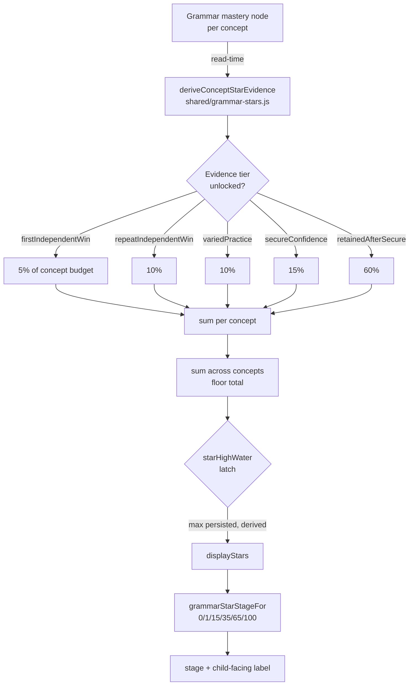
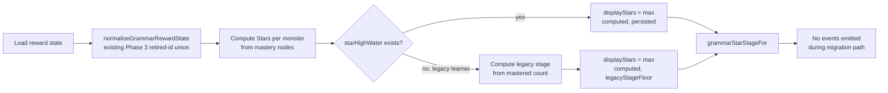

# Grammar Phase 5 — 100-Star Monster Curve & Landing Simplification

## Overview

Replace Grammar's ratio-based monster staging (secure concepts / total concepts = stage) with a 100-Star evidence-based display curve for all four active Grammar monsters. Simplify the Grammar Garden landing page to a single primary CTA with compact monster progress strip. No new content, no new learning modes, no answer-spec migration, no `contentReleaseId` bump.

**Guiding principle:** *Egg is encouragement. Mega is mastery.*

---

## Problem Frame

### What's wrong today

1. **Small-denominator monsters reach Mega too easily.** Couronnail (3 concepts) hits Mega at 3/3 secure concepts — achievable in days. Concordium (18 concepts) needs 18/18 — months of work. Same "Mega" label, wildly different effort. Children and adults lose trust in the reward label when it means different things for different monsters.

2. **Ratio-based staging hides the progression shape.** `grammarStageFor(mastered, total)` at `src/platform/game/mastery/grammar.js:76-84` maps `0/0.5/0.75/1.0 → stages 0/2/3/4`. A child sees stage jumps at unpredictable moments — Couronnail jumps from "not caught" to stage 2 after securing 2/3 concepts. There is no "nearly there" curve.

3. **Secure ≠ Mega, but the system conflates them.** Current staging only measures binary "secure or not." A concept that reaches secure status (strength ≥ 0.82, streak ≥ 3, interval ≥ 7 days) is already demanding — but it does not prove retention under mixed review or time pressure. Mega should require a higher evidence bar than secure.

4. **The landing page exposes 8+ modes before the child starts.** The dashboard shows 4 primary mode cards + Writing Try + 5-6 collapsed secondary modes + today cards + Concordium progress. Children (ages 7-11) should not choose among modes before practising. Spelling works because there is one obvious action.

5. **Monster progress uses raw concept counts visible to children.** The view model shows `concordiumProgress: {mastered}/{total}` where `total = 18`. Children should see `X / 100 Stars`, a universal scale they already understand from other games.

### Why now

Phase 4 proved the learning system is correct and production-safe (14 PRs, 12 invariants, composite Concordium-never-revoked property test). The Grammar engine, confidence system, and reward pipeline are stable foundations. Phase 5 changes only the display/progression layer and landing page information architecture — no marking, scheduling, or mastery-evidence mutation.

(see origin: `docs/plans/james/grammar/grammar-p5.md`)

---

## Requirements Trace

- R1. **100-Star scale for all active Grammar monsters.** Every active Grammar monster (Bracehart, Chronalyx, Couronnail, Concordium) displays progress on a 0–100 Star scale. `starMax: 100` is universal.
- R2. **Stars are learning-evidence milestones, not per-question XP.** Stars accrue from five evidence tiers (first independent win, repeat independent win, varied practice, secure confidence, retained after secure). Answering more questions at the same difficulty does not accelerate Stars.
- R3. **Non-linear stage thresholds.** 0 = Not found, 1 = Egg found, 15 = Hatched, 35 = Growing, 65 = Nearly Mega, 100 = Mega.
- R4. **1 Star catches the Egg.** The first valid learning evidence on any Grammar monster triggers Egg found. No concept-secured requirement for Egg.
- R5. **Mega requires retention evidence.** 100 Stars is only reachable when every assigned concept has earned the `retainedAfterSecure` tier (60% of each concept's budget). Secure alone caps at approximately 40% of the budget.
- R6. **Stars are monotonically non-decreasing.** Once a Star is earned it is never lost. Evidence tiers are latched per concept — once unlocked, permanently counted.
- R7. **No stage downgrade.** No existing learner ever sees a lower stage than they previously achieved. Read-time normalisation computes `max(legacyStage, newStarDerivedStage)`.
- R8. **Writing Try, AI explanation, and view-only actions yield 0 Stars.** Only independent first-attempt correct, repeat independent correct, varied practice correct, concept-secured events, and retention-check correct answers produce Stars.
- R9. **Supported (worked/faded) answers cannot unlock independent-win or retention tiers.** Support answers may contribute to overall mastery confidence but do not earn full Star credit in the `firstIndependentWin`, `repeatIndependentWin`, or `retainedAfterSecure` tiers.
- R10. **Landing page: one primary CTA.** Smart Practice becomes the sole primary button. Grammar Bank, Mini Test, and Fix Trouble Spots become secondary links.
- R11. **Compact monster strip on dashboard.** All four active monsters shown with `name — stage label — X/100 Stars` format.
- R12. **Adult/child display separation preserved.** Adult confidence labels (emerging/building/consolidating/secure/needs-repair) remain live-state. Child Stars are latched. "Needs repair" in adult view coexists with non-decreasing Stars in child view.
- R13. **Concordium follows 1-Star Egg like direct monsters (origin revision).** The origin document proposed a broad-coverage gate (6+ secure concepts across 2+ clusters) for Concordium Egg. James subsequently revised this in the same conversation (origin line 734): "Concordium 也可以 1 Star = Egg found." The simpler rule was adopted because (a) Concordium's 18-concept denominator naturally slows it, (b) consistency across all monsters reduces cognitive load, and (c) a broad-coverage gate adds complexity without proportional value given the slow aggregate curve. Multi-concept Concordium Egg gate deferred to future phase if simulation (U3) reveals early Concordium progression is too fast. Concordium Mega still requires all 18 concepts fully evidenced.
- R14. **No contentReleaseId bump.** Phase 5 changes reward display, not marking behaviour.
- R15. **Phase 4 invariants 1–12 preserved.** All Phase 4 invariants (`docs/plans/james/grammar/grammar-phase4-invariants.md`) remain enforced. Phase 5 extends but never weakens them.

**Origin actors:** A1 (KS2 learner), A2 (parent/adult), A3 (Grammar engine), A4 (game/reward layer), A5 (platform runtime).

**Origin flows:** F1 (Grammar practice without game dependency — Stars derived post-hoc, never influence marking), F2 (monster progress as derived reward — Stars replace ratio staging), F3 (adult-facing evidence — confidence labels unchanged, Stars added to adult view).

**Origin acceptance examples:** AE1 (R4, R5 — concept due-today does not count as secured for Star tiers until the review passes), AE2 (R7, R13 — worked-example correct receives lower evidence-tier credit; monster layer reflects committed evidence), AE4 (R15, R16 — adult report shows confidence labels separately from child Stars).

---

## Scope Boundaries

- No new Grammar content or templates
- No new learning modes or game mechanics
- No answer-spec migration (deferred to Phase 6)
- No `contentReleaseId` bump
- No change to `shared/grammar/confidence.js` derivation logic
- No change to `grammarConceptStatus` thresholds or `deriveGrammarConfidence` precedence
- No change to the `grammar.concept-secured` event semantics or the Worker marking pipeline
- No English Spelling parity regression
- No Punctuation subject changes

### Deferred to Follow-Up Work

- Content expansion (6 thin-pool concepts at 2-template floor) — Phase 6 after answer-spec audit
- Answer-spec declarative migration for 20 constructed-response templates — Phase 6
- Post-Mega Grammar layer (guardian/review challenges analogous to Spelling Guardian) — future phase
- Concordium broad-coverage gate as a staging constraint (removed from P5; Concordium naturally stages slowly via 18-concept denominator)
- Parent/admin hub Star progress display — adult hubs already show confidence chips and accuracy; adding Star counts is an enhancement, not required by the reward-curve change itself
- `concordiumProgress` shape migration — existing `{ mastered, total }` shape preserved for backward compatibility; migration to Star-only format deferred

---

## Context & Research

### Relevant Code and Patterns

- `src/platform/game/mastery/grammar.js` — current ratio-based staging (`grammarStageFor`), concept-to-monster mapping, reward recording, read-time normalisation, writer self-heal
- `src/platform/game/monsters.js` — monster registry, `DIRECT_STAGE_THRESHOLDS = [1, 10, 30, 60, 100]` (Spelling pattern), `stageFor()` absolute-count staging
- `shared/grammar/confidence.js` — five-label taxonomy, `grammarConceptStatus`, `deriveGrammarConfidence` (untouched by P5)
- `src/subjects/grammar/event-hooks.js` — `grammar.concept-secured` subscriber bridge, sole entry point from engine to reward layer
- `src/subjects/grammar/components/grammar-view-model.js` — dashboard model builder, monster cluster resolver, forbidden-terms fixture
- `src/subjects/grammar/components/GrammarSetupScene.jsx` — current landing page layout (hero + today cards + 4 mode cards + Writing Try + collapsed more practice)
- `tests/grammar-concordium-invariant.test.js` — denominator-freeze gate (=== 18), 200-random + 7-named ratchet sequences
- `tests/helpers/grammar-simulation.js` — seeded simulation helper (needs multi-day extension for P5)

### Institutional Learnings

- **Concordium-never-revoked invariant** (`grammar-phase4-invariants.md` §7, §11): Stage and caught are sticky ratchets. The denominator-freeze test at line 62 explicitly warns about Phase 5. P5 must pass the existing ratchet test with the new staging function.
- **View-model front-loading** (Phase 3 report §4.1): Front-loading the view-model was the highest-leverage architectural call. P5 must front-load `grammar-stars.js` before any JSX unit touches dashboard code.
- **Writer self-heal pattern** (Phase 3 U0): Read-time normalisation unions retired-id evidence into active views without mutating stored state. P5's no-downgrade normaliser follows this pattern: read-time computation of `max(legacyStage, starDerivedStage)`.
- **"Mega is never revoked" cross-subject precedent** (Post-Mega Spelling Guardian): Stars once earned are permanent, exactly like Spelling's stage. The evidence tier `retainedAfterSecure` is additive-only — a failed retention check does not subtract earned Stars.
- **Shared confidence module pattern** (Phase 4 U8): Lift functions, not just constants. P5's Star derivation functions belong in a shared module with a drift-guard grep test.
- **Test-harness-vs-production defect class** (Phase 4 §4.3): P5 tests must assert both presence (computed Stars match expected) AND absence (no legacy ratio-based staging leaks through).

---

## Key Technical Decisions

- **Stars are derived at read time on the client from the Grammar engine's mastery state, with a persisted high-water-mark per monster.** This avoids new domain events for sub-secured evidence. The existing `grammar.concept-secured` event and `recordGrammarConceptMastery` pipeline remain untouched. Stars are computed from `state.mastery.concepts` node data (attempts, correct, strength, streak, interval) and `state.recentAttempts` (support-level history, template diversity) by a pure function. The client read-model at `src/subjects/grammar/read-model.js` already has access to the full Grammar engine state — the derivation function runs there, not in the reward layer. A per-monster `starHighWater` field on the reward state persists the monotonicity floor; it is updated via a new write-through in `recordGrammarConceptMastery` when the client reports a higher Star count through the existing command response. **Rationale:** Adding new event types for every evidence tier would couple the reward layer to the mastery engine's internal state transitions, violating Phase 4 invariant 6 ("rewards react to committed evidence only"). Read-time derivation on the client keeps the boundary clean. The `starHighWater` latch on the reward state is the only cross-boundary field, and it is a simple monotonic integer written alongside the existing `mastered[]` array. **Data availability note:** The reward layer (`grammar.js`) has no visibility into `state.mastery.concepts` or `state.recentAttempts`. Evidence-tier detection (support-level, template diversity) runs on the client read path which does have this access. The Worker latch-write path receives `starHighWater` updates from the client's computed Stars, not from its own derivation.

- **Per-concept per-tier latch via `starHighWater`.** Each monster's `starHighWater: number` is the maximum Star count ever computed for that monster. On every read, `computedStars = max(derivedStars, starHighWater)`. When Stars increase, `starHighWater` is updated on the next write opportunity (any `recordGrammarConceptMastery` call or a dedicated latch-write on session end). **Rationale:** Per-concept per-tier bitmap would bloat the reward state shape and complicate the normaliser. A single number per monster captures the monotonicity invariant with minimal storage.

- **`variedPractice` and support-level detection use `recentAttempts` (80-entry cap) with lifetime-max tracking.** The existing `distinctTemplatesForConceptId` in the client read-model uses a 12-attempt window, which is too narrow for a latched tier. The derivation function scans the full `state.recentAttempts` (80-entry cap in the engine at `engine.js:1580`) for each concept to find the lifetime-max distinct template count and the lifetime-max independent-correct count. Since tiers are latched (once unlocked, permanent), the 80-entry window is sufficient as long as the varied-practice tier is detected before the window rolls past the evidence. For thin-pool concepts (1-2 templates), the `recentAttempts` window is more than adequate since every attempt on those concepts is within the cap. **Rationale:** Adding new per-concept counters to the mastery node would require Worker engine changes, which are out of P5 scope. The 80-entry `recentAttempts` window combined with the `starHighWater` monotonicity latch provides the required durability: once the derivation detects varied practice and the latch captures the resulting Stars, the evidence does not need to be re-detectable from `recentAttempts` later.

- **`retainedAfterSecure` definition: concept was previously secured (strength ≥ 0.82, interval ≥ 7d, streak ≥ 3) at any historical point, AND the learner later answers independently correct (support level 0) on that concept in a different session.** The "previously secured" fact is detected from the concept node's `intervalDays ≥ 7` (which is only reachable after the spaced-review cycle that secures a concept). A single correct independent answer after this point unlocks the tier. Once latched, permanent. **Rationale:** 60% of the concept budget must require real retention evidence but must also be achievable. Requiring mixed-review-only would gate retention on mode choice, which is unfair if the child uses Smart Practice (which already mixes concepts).

- **Floor guarantee is per-monster, not per-concept.** The first evidence event on any concept for a monster guarantees `stars >= 1` for that monster. Subsequent concepts accrue via normal budget math (which may round to 0 individually for Concordium's 5.56/concept). **Rationale:** Per-concept floor with Concordium's 18 concepts would award 18 Stars from just first-wins, overshooting the Hatch threshold.

- **Event double-fire prevention uses "fire lowest, defer higher" via threshold re-check.** When a single evidence update crosses both the Egg (1 Star) and Hatch (15 Stars) thresholds simultaneously, emit only the `caught` event. The `hatch` event fires on the next transition where Stars still exceed the threshold. Since Stars are monotonic, the next evidence event will re-check and emit the deferred event. No queuing mechanism needed. **Rationale:** The current `grammarEventFromTransition` already picks one event per transition via priority cascade. P5 extends this: caught always wins when both caught and evolve/hatch are new.

- **Star computation lives in `shared/grammar/grammar-stars.js`.** Constants (`GRAMMAR_MONSTER_STAR_MAX`, `GRAMMAR_STAR_STAGE_THRESHOLDS`, `GRAMMAR_CONCEPT_STAR_WEIGHTS`), evidence-tier derivation, and staging functions all in one file. Both Worker and client import from here via relative paths, matching the `shared/grammar/confidence.js` pattern. A thin re-export from `src/platform/game/mastery/grammar-stars.js` provides backward-compatible imports for the existing mastery module tree. Drift-guard grep test pins that no other file defines duplicate Star constants. **Rationale:** Mirrors the `shared/grammar/confidence.js` pattern from Phase 4 U8 — shared modules live in `shared/`, free of Worker- or client-specific dependencies.

- **Rounding: per-concept contributions are NOT floored before summing.** `monsterStars = floor(sum(conceptBudget * sum(unlockedWeights)))` where `conceptBudget = 100 / conceptCount`. The floor applies only to the final total. **Rationale:** Flooring per-concept before summing causes Concordium (18 concepts × floor(5.56 × 0.05) = 18 × 0 = 0 Stars) to show 0 Stars when it should show 5.

- **Simulation (U9) runs after U2-U3 but before U4 finalises weights.** If the simulation reveals the 5/10/10/15/60 split produces unreasonable timelines, weights adjust before any JSX unit ships. **Rationale:** Implementing 8 units then discovering the curve is wrong means rework.

---

## Open Questions

### Resolved During Planning

- **How do Stars accrue from sub-secured evidence when the current pipeline only fires on `grammar.concept-secured`?** Resolution: Stars are derived at read time from mastery node data, not from events. No new event types needed.
- **What happens when a concept loses secure status?** Resolution: Stars use a per-monster `starHighWater` latch. Adult confidence labels are live-state (can show `needs-repair`). The two systems intentionally diverge after confidence regression.
- **Does Concordium need a broad-coverage gate for Egg?** Resolution: No — revised from origin's initial proposal of 6+ secure concepts across 2+ clusters. James revised this in the same origin conversation (line 734) to 1-Star Egg for consistency. The 18-concept denominator naturally throttles Concordium progression. If U3 simulation reveals Concordium Egg arrives too quickly, the broad-coverage gate can be reintroduced as a future-phase constraint.
- **How do punctuation-for-grammar concepts earn Stars?** Resolution: These 5 concepts contribute to Concordium only. They earn Stars through whichever engine secures them first (Grammar or Punctuation), via the existing cross-subject `grammar.concept-secured` event pipeline.
- **Stage names: generic or monster-specific?** Resolution: Generic child-facing labels ("Not found yet", "Egg found", "Hatched", "Growing", "Nearly Mega", "Mega") for the dashboard strip. Monster-specific `nameByStage` values in `MONSTERS` remain for asset-facing contexts.

### Deferred to Implementation

- Exact CSS layout of the simplified landing page — responsive breakpoints, mobile touch targets
- Whether the "Today cards" row (Due/Trouble spots/Secure/Streak) survives or collapses into the monster strip
- `starHighWater` write timing — whether latch updates piggyback on existing `recordGrammarConceptMastery` writes or use a dedicated latch path

---

## High-Level Technical Design

> *This illustrates the intended approach and is directional guidance for review, not implementation specification. The implementing agent should treat it as context, not code to reproduce.*

### Star computation data flow

### Evidence tier detection (pure function inputs)

| Tier | Input signals from mastery node |
|---|---|
| firstIndependentWin | attempts ≥ 1, correct ≥ 1, first correct answer had supportLevel = 0 |
| repeatIndependentWin | correct ≥ 2, at least 2 distinct independent correct attempts |
| variedPractice | distinctTemplates ≥ 2 (or distinctGeneratedItems ≥ 2 for thin-pool concepts) |
| secureConfidence | status === 'secured' OR (intervalDays ≥ 7 AND strength ≥ 0.82 AND streak ≥ 3) — historical peak |
| retainedAfterSecure | secureConfidence was previously true AND a later independent correct exists |

### No-downgrade migration

---

## Implementation Units

- U1. **Scope-lock: Phase 5 invariants and contract freeze**

**Goal:** Establish the non-negotiable rules for Phase 5 before any code unit ships. Mirrors the Phase 4 invariants pattern.

**Requirements:** R1–R15

**Dependencies:** None

**Files:**
- Create: `docs/plans/james/grammar/grammar-phase5-invariants.md`
- Test: `tests/grammar-phase5-invariants.test.js`

**Approach:**
- Write the invariants document listing all 15 requirements as numbered non-negotiables (following the style of `grammar-phase4-invariants.md`)
- Create a module-load test that pins: `GRAMMAR_STAR_MAX === 100`, `GRAMMAR_STAR_STAGE_THRESHOLDS` shape, denominator freeze (=== 18), and the monotonicity contract
- Existing Phase 4 invariant tests must continue passing unchanged

**Patterns to follow:**
- `docs/plans/james/grammar/grammar-phase4-invariants.md` — invariant document style
- `tests/grammar-concordium-invariant.test.js` — module-load hard gate pattern

**Test scenarios:**
- Happy path: invariants document exists and is parseable; module-load test pins Star constants
- Happy path: Phase 4 denominator-freeze test (=== 18) still passes
- Edge case: invariant test fails if someone changes `GRAMMAR_STAR_MAX` to anything other than 100

**Verification:**
- Invariants document is committed and reviewable before any U2+ code merges

---

- U2. **Star display model and evidence-tier derivation**

**Goal:** Create the pure-function helpers that compute Stars from mastery state. This is the core data model that every subsequent unit imports.

**Requirements:** R1, R2, R4, R5, R6, R8, R9

**Dependencies:** U1

**Files:**
- Create: `shared/grammar/grammar-stars.js`
- Create: `src/platform/game/mastery/grammar-stars.js` (thin re-export for mastery module tree)
- Test: `tests/grammar-stars.test.js`
- Test: `tests/grammar-stars-drift-guard.test.js`

**Approach:**
- Export constants: `GRAMMAR_MONSTER_STAR_MAX = 100`, `GRAMMAR_STAR_STAGE_THRESHOLDS`, `GRAMMAR_CONCEPT_STAR_WEIGHTS`
- Export pure function `deriveGrammarConceptStarEvidence({ conceptNode, recentAttempts })` returning `{ firstIndependentWin, repeatIndependentWin, variedPractice, secureConfidence, retainedAfterSecure }`
- Export `computeGrammarMonsterStars(monsterId, conceptNodesMap, recentAttempts)` returning `{ stars, starMax, stageName, displayStage, nextMilestoneStars, nextMilestoneLabel }`
- Export `grammarStarStageFor(stars)` returning stage 0–4 from the fixed thresholds
- The per-monster floor guarantee: `stars = max(1, computed)` when any concept has any evidence; `stars = 0` when no concept has any evidence
- Evidence tier detection uses the mastery concept node (attempts, correct, strength, streak, interval) AND `state.recentAttempts` entries for support-level and template-diversity signals. The derivation runs on the client read path at `src/subjects/grammar/read-model.js`, which has access to the full Grammar engine state. No new Worker engine fields are needed — the 80-entry `recentAttempts` array plus the concept node provide all required signals
- `firstIndependentWin` and `repeatIndependentWin` detection: scan `recentAttempts` for entries matching the concept with `firstAttemptIndependent === true` or `supportLevelAtScoring === 0`
- `variedPractice` detection: scan `recentAttempts` for distinct `templateId` values matching the concept. Use the full 80-entry window, not the 12-entry read-model window
- `retainedAfterSecure` detection: `intervalDays ≥ 7` (proving prior secured status) AND a later independent correct exists in `recentAttempts`

**Execution note:** Start with failing tests for all evidence tiers before implementing the derivation function.

**Patterns to follow:**
- `shared/grammar/confidence.js` — pure derivation function pattern, no side effects, importable by both Worker and client
- `src/platform/game/mastery/grammar.js` — existing monster progress computation pattern

**Test scenarios:**
- Happy path: concept with 1 independent correct → firstIndependentWin = true, all others false → Stars = floor(conceptBudget × 0.05), at least 1 via floor guarantee
- Happy path: concept with secure status + all evidence → all 5 tiers true → Stars = floor(conceptBudget × 1.0) = full budget
- Happy path: Bracehart 6 concepts, all fully evidenced → Stars = 100
- Happy path: Couronnail 3 concepts, all fully evidenced → Stars = 100
- Happy path: Concordium 18 concepts, all fully evidenced → Stars = 100
- Edge case: concept with only worked/faded support answers → firstIndependentWin = false → 0 Stars
- Edge case: concept with 1 template only → variedPractice uses distinct-items fallback → still achievable
- Edge case: Concordium 1 concept with firstIndependentWin → floor(5.56 × 0.05) = 0, but per-monster floor guarantee → 1 Star
- Edge case: Concordium 18 concepts each at firstIndependentWin only → floor(18 × 5.56 × 0.05) = floor(5.0) = 5 Stars (no per-concept floor inflation)
- Error path: null/undefined concept node → 0 evidence, 0 Stars
- Error path: concept node with NaN strength/attempts → defensive normalisation, 0 evidence
- Integration: `grammarStarStageFor(0)` = 0, `grammarStarStageFor(1)` = 1, `grammarStarStageFor(14)` = 1, `grammarStarStageFor(15)` = 2, `grammarStarStageFor(99)` = 3, `grammarStarStageFor(100)` = 4
- Drift guard: grep test asserting no other file defines `GRAMMAR_MONSTER_STAR_MAX` or `GRAMMAR_STAR_STAGE_THRESHOLDS` literals

**Verification:**
- All evidence tier combinations produce expected Star totals
- Per-monster floor guarantee verified for every active monster
- Drift-guard test passes

---

- U3. **Simulation spike — validate thresholds before committing**

**Goal:** Run deterministic multi-day simulations to validate that the 5/10/10/15/60 evidence-tier weights produce sensible progression timelines before any downstream unit hardcodes them.

**Requirements:** R2, R3, R5

**Dependencies:** U2

**Files:**
- Modify: `tests/helpers/grammar-simulation.js` (extend with multi-day time advancement)
- Create: `tests/grammar-star-curve-simulation.test.js`
- Create: `docs/plans/james/grammar/grammar-star-curve-simulation.md` (results report)

**Approach:**
- Extend the existing simulation helper to support multi-day progression: advance `nowTs` by 86400000 per simulated day, model due dates, re-due timing, and concept revisit scheduling
- Simulate three learner profiles across 8 seeds each:
  - Ideal learner: 90% independent correct, varied templates, fast secure
  - Typical learner: 75% correct, occasional support, moderate pace
  - Struggling learner: 55% correct, frequent support, slow secure
- Each profile runs at both 5-question and 10-question daily rounds
- Report: days to first direct Egg, first Hatch, first direct Mega, Concordium Egg, Grand Concordium
- Target feel (from origin): first Egg 1–2 weeks, first Hatch 2–3 weeks, first Mega 5–8 weeks, Grand Concordium 10–14+ weeks
- If simulation shows Mega in < 3 weeks or Egg after > 4 weeks, weights must be adjusted before U4

**Execution note:** This is a design spike. If the simulation reveals the weights are wrong, update `GRAMMAR_CONCEPT_STAR_WEIGHTS` in U2 before proceeding.

**Patterns to follow:**
- `tests/helpers/grammar-simulation.js` — existing seeded simulation framework
- `tests/grammar-concordium-invariant.test.js` — seeded PRNG pattern (`makeSeededRandom(42)`)

**Test scenarios:**
- Happy path: ideal learner at 10 questions/day reaches first direct Egg within 1–2 simulated weeks
- Happy path: typical learner at 5 questions/day reaches first Hatch within 3–4 simulated weeks
- Happy path: ideal learner reaches first direct Mega within 5–8 simulated weeks
- Happy path: Grand Concordium requires 10+ weeks for all profiles
- Edge case: struggling learner never reaches Mega via support-only answers (support ≠ independent win)
- Edge case: learner who practises only one cluster → only that cluster's monster progresses; Concordium stages slowly

**Verification:**
- Simulation results written to `grammar-star-curve-simulation.md` with concrete day counts
- All target timelines met or weights adjusted with documented rationale

---

- U4. **Stage gates, `starHighWater` latch, and no-downgrade migration**

**Goal:** Wire Star-based staging into the reward state, replacing `grammarStageFor` with `grammarStarStageFor`. Implement the `starHighWater` monotonicity latch and legacy migration normaliser as a single read-time pipeline. (U5 merged here — the migration normaliser is not a separately deployable concern; it is the read-time guard for the latch introduced in this unit.)

**Requirements:** R3, R6, R7

**Dependencies:** U2, U3

**Files:**
- Modify: `src/platform/game/mastery/grammar.js` (`progressForGrammarMonster`, `recordGrammarConceptMastery`)
- Modify: `shared/grammar/grammar-stars.js` (add `applyStarHighWaterLatch`)
- Test: `tests/grammar-star-staging.test.js`

**Approach:**
- `progressForGrammarMonster` gains a new field `{ ...existing, stars, starMax, displayStage, stageName }` derived from the Star module
- The existing `stage` field is computed as `max(legacyStage, starDerivedStage)` for backward compatibility during migration
- `recordGrammarConceptMastery` updates `starHighWater` on each monster entry alongside the existing `mastered[]` write
- `starHighWater` is a simple integer field on the monster state entry: `{ mastered: [...], caught: true, starHighWater: 42, ... }`
- The latch logic: `displayStars = max(computedFromMasteryNodes, persisted.starHighWater || 0)`
- **Legacy migration (merged from former U5):** For legacy learners with no `starHighWater` field, compute a legacy floor Star count from the existing `mastered.length / conceptTotal` ratio × the old stage thresholds mapped to the nearest Star threshold: stage 0 → 0, stage 1 → 1, stage 2 → 15, stage 3 → 35, stage 4 → 100. Set `displayStars = max(computedStars, legacyFloor)`. This runs at read time inside `progressForGrammarMonster`, after `normaliseGrammarRewardState` (retired-id union). Never emit catch/evolve/mega events during migration path — silent normalisation only. The first subsequent `recordGrammarConceptMastery` call persists the `starHighWater` value.

**Patterns to follow:**
- `normaliseGrammarRewardState` at `grammar.js:114` — read-time normalisation pattern (never mutate on read, derive maximum)
- `DIRECT_STAGE_THRESHOLDS` at `monsters.js:206` — Spelling's absolute-count staging
- Writer self-heal at `grammar.js:255-299` — state delta persisted, events gated separately

**Test scenarios:**
- Happy path: fresh learner, 0 Stars → stage 0 ("Not found yet")
- Happy path: 1 Star → stage 1 ("Egg found"), `caught = true`
- Happy path: 15 Stars → stage 2 ("Hatched")
- Happy path: 35 Stars → stage 2 ("Growing") [display stage 2 maps to evolve2]
- Happy path: 65 Stars → stage 3 ("Nearly Mega")
- Happy path: 100 Stars → stage 4 ("Mega")
- Edge case: `starHighWater` = 42, new derived Stars = 38 → display Stars = 42 (latch holds)
- Edge case: `starHighWater` = 42, new derived Stars = 50 → display Stars = 50, latch updated to 50
- Error path: corrupted `starHighWater` (NaN, negative) → treated as 0, derived Stars win
- Integration: `recordGrammarConceptMastery` persists updated `starHighWater` on the written state
- **Legacy migration scenarios:**
- Happy path: pre-P5 learner with Bracehart caught (1/6 mastered) → legacy stage 1 → floor Stars = 1 → Egg found preserved
- Happy path: pre-P5 learner with Couronnail Mega (3/3 mastered) → legacy stage 4 → floor Stars = 100 → Mega preserved
- Happy path: pre-P5 Concordium stage 3 (14/18 mastered) → legacy stage 3 → floor Stars = 35 → Growing preserved
- Edge case: pre-P5 learner with no Grammar state → 0 Stars, no migration needed
- Edge case: post-P5 learner with `starHighWater` present → migration path skipped
- Edge case: migration path never emits events (asserted by event subscriber returning empty array)
- Integration: `normaliseGrammarRewardState` → legacy floor → Star display is a clean pipeline

**Verification:**
- Existing `tests/grammar-concordium-invariant.test.js` 200-random ratchet sequences pass with new staging function
- New test covers legacy-to-P5 migration for all four active monsters
- No learner ever sees a stage decrease

---

- U6. **Reward event semantics — caught-wins-over-hatch**

**Goal:** Extend `grammarEventFromTransition` to handle the new Star-based stage thresholds, including the "fire lowest, defer higher" rule when multiple thresholds are crossed simultaneously.

**Requirements:** R3, R4

**Dependencies:** U4

**Files:**
- Modify: `src/platform/game/mastery/grammar.js` (`grammarEventFromTransition`)
- Test: `tests/grammar-star-events.test.js`

**Approach:**
- The existing cascade at `grammar.js:231-242` already picks one event: caught > stage increase (mega/evolve) > levelup
- P5 extends: when `previous.caught === false && next.caught === true` AND `next.stage > 1`, fire only `caught`. The `evolve`/`mega` event fires on the next transition where the stage threshold is still exceeded
- Since Stars are monotonic, the next `recordGrammarConceptMastery` call will re-check thresholds and emit the deferred event naturally
- No explicit queuing mechanism needed — the existing event emission surface handles it
- Add a `levelup` event for Star milestones within a stage (every +10 Stars within a stage, analogous to Spelling's `levelFor`)

**Patterns to follow:**
- `grammarEventFromTransition` at `grammar.js:231-242` — existing priority cascade
- Spelling `stageFor` + `levelFor` — absolute threshold staging

**Test scenarios:**
- Happy path: first evidence on Bracehart (Stars 0 → 1) → `caught` event fires, no `evolve`
- Happy path: evidence on Bracehart (Stars 1 → 15) → `evolve` event fires (hatch)
- Happy path: evidence on Bracehart (Stars 14 → 15) → `evolve` event fires (hatch)
- Happy path: evidence on Bracehart (Stars 99 → 100) → `mega` event fires
- Edge case: single evidence event crosses Egg (1) + Hatch (15) simultaneously → only `caught` fires
- Edge case: next evidence after above → Stars still ≥ 15 → `evolve` fires for hatch
- Edge case: single evidence event crosses Egg (1) + Hatch (15) + Evolve2 (35) → only `caught` fires; subsequent events emit evolve for each crossed threshold one at a time
- Edge case: Concordium caught at 1 Star → caught event fires with Concordium monster
- Integration: full 0→100 Star progression emits events in order: caught, evolve (hatch), evolve (evolve2), evolve (evolve3), mega — never double in one call

**Verification:**
- No test shows two events for the same monster in a single `recordGrammarConceptMastery` call except caught + Concordium caught (different monsters)
- Existing `grammar-rewards.test.js` tests continue passing

---

- U7. **Dashboard monster strip**

**Goal:** Add a compact monster progress strip to the Grammar landing page showing all four active monsters with `/100 Stars` progress.

**Requirements:** R1, R11, R12

**Dependencies:** U2, U4

**Files:**
- Modify: `src/subjects/grammar/components/grammar-view-model.js` (add `buildGrammarMonsterStripModel`)
- Modify: `src/subjects/grammar/components/GrammarSetupScene.jsx` (add monster strip section)
- Test: `tests/grammar-ui-model.test.js` (extend)

**Approach:**
- `buildGrammarMonsterStripModel(rewardState, masteryConceptNodes)` returns an array of `{ monsterId, name, stageName, stars, starMax: 100, stageIndex }` for the 4 active monsters
- Stage names: "Not found yet" / "Egg found" / "Hatched" / "Growing" / "Nearly Mega" / "Mega"
- Child-facing copy: `"Get 1 Star to find the Egg. Reach 100 Stars for Mega."`
- No raw evidence labels, no confidence taxonomy, no denominator, no concept counts in child view
- Monster strip renders below the hero, above the mode selection area
- Each monster entry shows: monster image (stage-appropriate via `monsterAsset`), name, stage label, `X/100 Stars` progress bar

**Patterns to follow:**
- `buildGrammarDashboardModel` at `grammar-view-model.js` — existing dashboard builder pattern
- `grammarMonsterSummaryFromState` at `grammar.js:379` — existing monster summary builder
- Spelling's monster display pattern in `SpellingSetupScene.jsx`

**Test scenarios:**
- Happy path: 4 active monsters returned in order (Bracehart, Chronalyx, Couronnail, Concordium)
- Happy path: monster with 0 Stars → "Not found yet", Stars = 0
- Happy path: monster with 42 Stars → "Growing", Stars = 42
- Happy path: monster with 100 Stars → "Mega", Stars = 100
- Edge case: reserved monsters (Glossbloom, Loomrill, Mirrane) never appear in strip
- Edge case: child-facing copy contains no forbidden terms (`isGrammarChildCopy` passes)
- Integration: `buildGrammarMonsterStripModel` + `buildGrammarDashboardModel` compose without conflict

**Verification:**
- Monster strip renders all 4 active monsters with correct Star counts
- No forbidden terms in any child-facing label

---

- U8. **Landing page simplification**

**Goal:** Simplify GrammarSetupScene to a single primary CTA ("Start Smart Practice") with secondary links and collapsed more-practice modes.

**Requirements:** R10

**Dependencies:** U7

**Files:**
- Modify: `src/subjects/grammar/components/grammar-view-model.js` (restructure `GRAMMAR_PRIMARY_MODE_CARDS`)
- Modify: `src/subjects/grammar/components/GrammarSetupScene.jsx` (layout simplification)
- Test: `tests/grammar-ui-model.test.js` (extend)
- Test: `tests/grammar-phase3-child-copy.test.js` (extend)

**Approach:**
- Smart Practice becomes the sole primary button/CTA — prominent, above the fold
- Grammar Bank, Mini Test, Fix Trouble Spots become a secondary links row below the monster strip
- Writing Try moves from the primary area to the collapsed "More practice" disclosure
- More practice disclosure contains: Learn, Sentence Surgery, Sentence Builder, Worked Examples, Faded Guidance, Writing Try
- Today cards row (Due / Trouble spots / Secure / Streak) remains but is repositioned below the primary CTA, above secondary links
- Acceptance: a child can start practising in one tap; the first screen does not require choosing among 8 modes

**Patterns to follow:**
- `SpellingSetupScene.jsx` — single obvious CTA pattern
- Existing `GrammarSetupScene.jsx` structure (hero + today + modes) — simplify, don't rewrite

**Test scenarios:**
- Happy path: Smart Practice is the only element with `data-featured="true"`
- Happy path: Grammar Bank, Mini Test, Fix Trouble Spots appear as secondary links (not primary cards)
- Happy path: Writing Try appears inside the collapsed More practice disclosure
- Happy path: More practice disclosure contains all 6 secondary modes
- Edge case: fresh learner (no progress) → empty state displayed, Smart Practice still accessible
- Edge case: all forbidden terms absent from simplified layout
- Integration: landing page renders without error; all action dispatches route correctly

**Verification:**
- Only one `data-featured="true"` element in the child dashboard
- Writing Try is not in the primary mode area
- All 6+ modes remain accessible (nothing removed, only reorganised)

---

- U9. **Concordium-never-revoked invariant extension**

**Goal:** Extend the existing Concordium ratchet property test to cover Star-based staging, including legacy migration shapes.

**Requirements:** R6, R7, R13, R15

**Dependencies:** U4

**Files:**
- Modify: `tests/grammar-concordium-invariant.test.js` (extend with Star-based ratchet shapes)
- Modify: `tests/helpers/grammar-reward-invariant.js` (extend snapshot to include Stars)

**Approach:**
- Add at least two new named regression shapes:
  - Pre-P5 Couronnail at Mega (3/3 secure, no retention evidence) → under new curve, derived Stars < 100 → legacy floor must hold at Mega
  - Pre-P5 Concordium at stage 3 (14/18 secure) → under new curve, derived Stars may be lower → legacy floor must hold at stage 3
- Extend the 200-random ratchet assertion to check `stars >= maxPriorStars` (not just `stage >= maxPriorStage`)
- Denominator-freeze gate (=== 18) remains unchanged
- The `caught` sticky ratchet assertion remains unchanged
- Add `starHighWater` to the snapshot helper for tracing

**Patterns to follow:**
- Existing `tests/grammar-concordium-invariant.test.js` — 200 random + 7 named shapes + denominator pin
- `tests/spelling-mega-invariant.test.js` — cross-subject ratchet pattern

**Test scenarios:**
- Covers R6: Stars ratchet — `stars >= maxPriorStars` after every step in 200 random sequences
- Covers R7: pre-P5 Couronnail Mega shape → Stars display ≥ 100, stage = 4
- Covers R7: pre-P5 Concordium stage 3 shape → Stars display ≥ 35, stage ≥ 3
- Edge case: pre-P5 learner with reserved monster evidence → normaliser unions into Concordium → Stars ratchet holds
- Integration: full F2 end-to-end flow (concept-secured event → reward recording → Star check → ratchet assertion)

**Verification:**
- All existing named + random shapes pass
- Two new legacy-migration shapes pass
- Star ratchet holds across 200 random sequences

---

- U10. **View-model integration — additive Star fields**

**Goal:** Wire Star progress into the existing dashboard model as additive fields. Existing `concordiumProgress` shape is preserved (no breaking rename) — new Star data is surfaced through the `monsterStrip` field added in U7.

**Requirements:** R11, R12

**Dependencies:** U2, U7

**Files:**
- Modify: `src/subjects/grammar/components/grammar-view-model.js` (`buildGrammarDashboardModel` → include `monsterStrip` in return)
- Test: `tests/grammar-ui-model.test.js` (extend)

**Approach:**
- `buildGrammarDashboardModel` returns `monsterStrip` (from U7's `buildGrammarMonsterStripModel`) alongside the existing `concordiumProgress: { mastered, total }` — the legacy shape is preserved so existing JSX consumers do not break
- The monster strip carries per-monster `{ stars, starMax, stageName }` — this is the new display surface for Star progress
- `concordiumProgress` remains for backward compatibility; once all JSX consumers migrate to the monster strip, it can be deprecated in a future phase
- No confidence label changes — adult taxonomy is live-state, child Stars are latched
- Parent/admin hub wiring is deferred: those surfaces already show confidence chips and accuracy; Star progress display in adult hubs is a follow-up enhancement, not required by R11 (which specifies "dashboard" monster strip) or R12 (which is a preservation constraint)

**Patterns to follow:**
- `buildGrammarDashboardModel` — existing dashboard builder (additive field pattern)
- Phase 4 U7 — confidence chip wiring approach

**Test scenarios:**
- Happy path: dashboard model includes `monsterStrip` with 4 entries alongside existing `concordiumProgress`
- Happy path: `concordiumProgress` shape is unchanged (`{ mastered, total }`) — no breaking rename
- Edge case: concept is `needs-repair` in adult view but Stars did not decrease in child view → R12 preserved
- Edge case: fresh learner with no Grammar data → `monsterStrip` shows 0 Stars for all 4 monsters
- Integration: dashboard model + monster strip compose without conflict; existing JSX consumers of `concordiumProgress` unaffected

**Verification:**
- `concordiumProgress` shape unchanged (backward compatibility)
- `monsterStrip` present and correct in dashboard model
- No child/adult view conflicts

---

- U11. **End-to-end integration tests and Playwright coverage**

**Goal:** Prove the full Star progression journey works end-to-end, from first attempt through Egg through Mega, across all four active monsters.

**Requirements:** R1, R3, R4, R5, R6, R7, R8, R14, R15

**Dependencies:** U4, U6, U7, U8

**Files:**
- Create: `tests/grammar-star-e2e.test.js`
- Modify: `tests/playwright/grammar-golden-path.playwright.test.mjs` (extend)
- Test: `tests/grammar-star-e2e.test.js`

**Approach:**
- End-to-end test drives a full learner journey through the Star pipeline: first correct → Egg → gradual evidence → Hatch → Evolve2 → Evolve3 → Mega
- Verify event emission at each stage transition
- Verify no event double-fire
- Verify Writing Try path produces 0 Stars
- Verify AI explanation path produces 0 Stars
- Verify supported (worked/faded) answers do not unlock independent-win tiers
- Playwright test covers: landing page renders monster strip with Star counts, Smart Practice is the primary CTA, Concordium progress shows Stars not raw counts
- Parity regression check: Spelling monster system unaffected

**Execution note:** Start with a characterisation test that replays a full learner journey, then assert each stage transition.

**Patterns to follow:**
- `tests/grammar-rewards.test.js` — existing reward end-to-end pattern with `makeRepository`
- `tests/playwright/grammar-golden-path.playwright.test.mjs` — existing Playwright Grammar test

**Test scenarios:**
- Happy path: full 0→100 Star journey for Bracehart (6 concepts, all evidence tiers)
- Happy path: full 0→100 Star journey for Couronnail (3 concepts — previously jumped to Mega, now gradual)
- Happy path: Concordium accumulates Stars from cross-cluster evidence
- Happy path: landing page shows "Start Smart Practice" as primary CTA
- Happy path: monster strip shows "X/100 Stars" for all 4 active monsters
- Edge case: Couronnail no longer jumps from 0 to Mega in 3 concept-secured events
- Edge case: Writing Try → 0 Stars (invariant 5)
- Edge case: AI explanation → 0 Stars (invariant 4)
- Edge case: worked/faded support → does not unlock firstIndependentWin tier
- Edge case: legacy learner migration → no stage downgrade
- Integration: Spelling monster state unaffected by Grammar Star changes
- Playwright: Grammar landing page at 1280×800 and 375×667 viewports

**Verification:**
- Full Star journey produces expected events in expected order
- No regressions in existing Grammar or Spelling test suites
- Playwright screenshots confirm visual layout

---

## System-Wide Impact

- **Interaction graph:** `shared/grammar/grammar-stars.js` is consumed by `grammar.js` (reward state latch), `grammar-view-model.js` (dashboard), `read-model.js` (Star derivation from engine state). No callback chains — pure function derivation.
- **Error propagation:** Malformed mastery nodes → evidence derivation returns all-false → 0 Stars → safe fallback. `starHighWater` corruption → treated as 0 → derived Stars win.
- **State lifecycle risks:** The `starHighWater` field is additive-only (monotonic latch). No partial-write risk because it piggybacks on existing `saveMonsterState` calls. Legacy state without `starHighWater` is handled by the migration normaliser.
- **API surface parity:** Grammar reward events retain the existing `{ type, kind, monsterId, previous, next }` shape. New fields (`stars`, `starMax`) are added to `next` but do not change the event type or kind vocabulary.
- **Integration coverage:** End-to-end test (U11) drives the full pipeline: mastery node → Star derivation → event emission → state persistence → read-time display. Unit tests alone cannot prove this chain.
- **Unchanged invariants:** `grammar.concept-secured` event semantics, `recordGrammarConceptMastery` core pipeline, `shared/grammar/confidence.js` derivation, `grammarConceptStatus` thresholds, Writing Try non-scored contract, Phase 4 invariants 1–12, `contentReleaseId`, English Spelling parity.

---

## Risks & Dependencies

| Risk | Mitigation |
|------|------------|
| Simulation (U3) reveals the 5/10/10/15/60 weights produce bad timelines | U3 runs before U4 locks thresholds. Weights are constants in `grammar-stars.js`, easily adjusted. |
| Legacy learners see stage regression after deployment | U5 migration normaliser + U9 invariant extension + 2 named legacy shapes. Ratchet property test covers 200 random sequences. |
| `starHighWater` latch drifts from actual Star computation | Read-time re-derivation always computes fresh Stars from mastery nodes. The latch is a floor, never a ceiling. Worst case: latch is stale-high (learner sees higher Stars than currently evidenced) which is acceptable under the monotonicity invariant. |
| `retainedAfterSecure` detection relies on `intervalDays ≥ 7` as proxy for "was previously secured" | This is a conservative proxy — `intervalDays ≥ 7` is only reachable after the spaced-review cycle that secures a concept. If a future engine change allows `intervalDays ≥ 7` without prior secure status, the tier would be over-awarded. Acceptable risk given no engine changes in scope. |
| Landing page simplification reduces Grammar Bank discoverability | Grammar Bank remains accessible as a secondary link. Today cards still show "Trouble spots: N" which provides a visual nudge. |
| Punctuation-for-grammar concepts (5) may not be practised through the Grammar engine | These concepts earn Concordium Stars through whichever engine secures them first via the existing cross-subject event pipeline. No P5 change needed. |

---

## Documentation / Operational Notes

- `docs/plans/james/grammar/grammar-phase5-invariants.md` committed as U1 deliverable — reviewers cite invariants by number
- `docs/plans/james/grammar/grammar-star-curve-simulation.md` committed as U3 deliverable — records simulation results and threshold rationale
- No monitoring changes — Star computation is read-time pure-function derivation, no new Worker endpoints
- No migration script needed — the `normaliseGrammarStarMigration` normaliser handles legacy state transparently at read time

---

## Sources & References

- **Origin document:** [docs/plans/james/grammar/grammar-p5.md](docs/plans/james/grammar/grammar-p5.md)
- Phase 4 plan: [docs/plans/2026-04-26-001-feat-grammar-phase4-learning-hardening-plan.md](docs/plans/2026-04-26-001-feat-grammar-phase4-learning-hardening-plan.md)
- Phase 4 invariants: [docs/plans/james/grammar/grammar-phase4-invariants.md](docs/plans/james/grammar/grammar-phase4-invariants.md)
- Phase 3 report: [docs/plans/james/grammar/grammar-phase3-implementation-report.md](docs/plans/james/grammar/grammar-phase3-implementation-report.md)
- Current staging: `src/platform/game/mastery/grammar.js:76-84` (`grammarStageFor`)
- Confidence system: `shared/grammar/confidence.js`
- Monster registry: `src/platform/game/monsters.js`
- Event hooks: `src/subjects/grammar/event-hooks.js`
- Concordium invariant test: `tests/grammar-concordium-invariant.test.js`
- Reward tests: `tests/grammar-rewards.test.js`
- Simulation helper: `tests/helpers/grammar-simulation.js`
- Requirements doc: [docs/brainstorms/2026-04-24-grammar-mastery-region-requirements.md](docs/brainstorms/2026-04-24-grammar-mastery-region-requirements.md)
