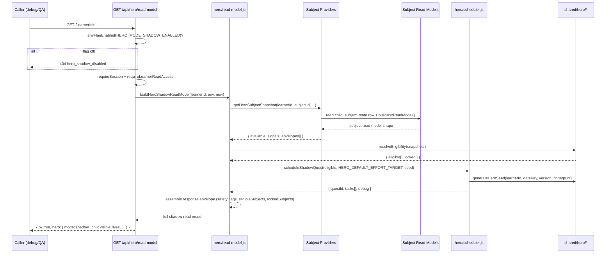

# feat: Hero Mode P0 — Shadow Scheduler and Read-Model Foundation

## Overview

Hero Mode gives each child one daily mission across their ready subjects. Phase 0 builds the foundation: a shared pure layer of constants, contracts, and deterministic scheduling logic; Worker-side subject providers that translate existing read-model signals into Hero task envelopes; and a feature-flagged read-only GET route that returns a shadow daily quest. Zero writes, zero child UI, zero reward mutations.

By the end of P0 the platform can answer: "For this learner, on this date, across the subjects that are actually ready, what would today's Hero mission be, and why?"

---

## Problem Frame

Once a child secures or fully Megafies a subject, the product needs a healthy reason for them to return — one that is not "keep grinding the same subject." Hero Mode becomes the daily platform-level route into low-frequency, high-value maintenance: spaced checks, mixed review, retention-after-secure, lapse repair, and cross-subject breadth.

P0 proves the hardest boundary first: Hero Mode can recommend a daily learning mission without becoming the learning engine, the reward engine, or the child-facing game economy. It does this by being entirely read-only and invisible to children. (see origin: `docs/plans/james/hero-mode/hero-mode-p0.md` §3, §25)

---

## Requirements Trace

- R1. Hero Mode is a platform-level orchestrator, not a seventh subject — no subject-internal item selection, no marking, no mastery mutation (origin §7.1, §10)
- R2. Hero Mode grows with ready subjects — Spelling/Grammar/Punctuation eligible; Arithmetic/Reasoning/Reading locked with clear reasons (origin §7.2)
- R3. Hero Mode protects Mega; it does not farm Mega — fully secured subjects receive only maintenance-style envelopes (origin §7.3)
- R4. Daily learning contract uses effort budget, not raw item count (origin §9)
- R5. Scheduler is deterministic, explainable, testable, and read-only under fixed inputs (origin §11.1)
- R6. Task envelopes are subject-level instructions, not item-level selections (origin §10)
- R7. Subject providers are read-only adapters — no command dispatch, no state mutation, no session creation (origin §12)
- R8. Worker read-model route is behind `HERO_MODE_SHADOW_ENABLED` feature flag, read-only, auth-gated (origin §13)
- R9. No writes to any persistent state: child_game_state, child_subject_state, practice_sessions, event_log, account_subject_content, platform_monster_visual_config, mutation_receipts (origin §15.1)
- R10. No reward writes: no Coins, no Hero ledger, no monster ownership, no Stars mutation (origin §15.2)
- R11. No child exposure: no dashboard card, no Hero Camp UI, no Coins copy (origin §15.4)
- R12. Explicit disabled flags in read model: `childVisible: false`, `coinsEnabled: false`, `writesEnabled: false` (origin §15.5)
- R13. No regression of existing Spelling, Grammar, Punctuation, Worker, or subject-expansion tests (origin §18.5)

---

## Scope Boundaries

- No child-facing Hero dashboard card or Hero Camp UI
- No Hero Coins ledger, Hero monster ownership, unlock/evolve commands
- No `POST /api/hero/command`
- No D1 migration
- No content release bump
- No change to subject Star calculation, marking, scheduling, mastery, or reward projection
- No production child exposure by default
- Any accidental child-facing UI, currency field, mutation command, or reward projection is scope creep

### Deferred to Follow-Up Work

- P1: launchable task envelopes — `heroContext` wired to subject commands, ID cross-reference generation
- P2: child-facing Today's Hero Quest dashboard card
- P3: Coins ledger and idempotent completion claim
- P4: Hero Camp and Hero Monster Pool
- P5: Post-Mega hardening and retention lapse detector

---

## Context & Research

### Relevant Code and Patterns

- **Route pattern:** `worker/src/app.js` authenticated zone (after session/account/repository preamble). New GET route slots here following `/api/hubs/parent/summary` pattern
- **Feature flag:** `envFlagEnabled()` at `worker/src/app.js`. Precedent: `PUNCTUATION_SUBJECT_ENABLED` in `wrangler.jsonc`
- **Shared pure layer:** `shared/grammar/confidence.js` is the canonical exemplar — zero Worker/React deps, deterministic, imported by both environments
- **Subject read models:** `worker/src/subjects/{grammar,punctuation,spelling}/read-models.js` — each builds a safe public shape with forbidden-field stripping
- **Content release IDs:** `GRAMMAR_CONTENT_RELEASE_ID` in `worker/src/subjects/grammar/content.js`; `PUNCTUATION_RELEASE_ID` re-exported from `shared/punctuation/content.js`
- **Test harness:** `tests/helpers/worker-server.js` — `createWorkerRepositoryServer()` with SQLite D1 shim, dev-stub auth, `fetch`/`fetchAs`/`fetchRaw` helpers
- **Access control:** `repository.requireLearnerReadAccess(db, accountId, learnerId)` checks learner_memberships
- **Subject registry:** `src/platform/core/subject-registry.js` — six subject identities with `validateSubjectModule()` contract
- **Worker subject runtime:** `worker/src/subjects/runtime.js` — `createWorkerSubjectRuntime()` wires handlers for grammar/punctuation/spelling only

### Institutional Learnings

- **Shared builders prevent silent drift** (from `docs/solutions/learning-spelling-audio-cache-contract.md`): `shared/hero/` must be the single source of truth for constants and normalisers consumed by both Worker and tests. Pin deterministic scheduler output with a fixture test.
- **Adversarial review for state-machine / boundary units** (from `docs/solutions/workflow-issues/sys-hardening-p2-13-unit-autonomous-sprint-learnings-2026-04-26.md`): Hero scheduler and no-write boundary qualify for adversarial review. Construct failure scenarios first.
- **D1 batch() not withTransaction** (from project memory): `withTransaction` is a production no-op. P0 has zero writes so not directly relevant, but no-write boundary tests should verify Hero modules never call `batch()` or repository write methods.

---

## Key Technical Decisions

- **Naming convention: `hero`** — `shared/hero/` and `worker/src/hero/` following `shared/grammar/` and `shared/punctuation/` subject-scoped precedent. Not `hero-mode` or `daily-hero`.
- **Feature flag env var: `HERO_MODE_SHADOW_ENABLED`** — defaults to `"false"` in `wrangler.jsonc` production vars and `wrangler.example.jsonc`. Uses existing `envFlagEnabled()` helper.
- **Disabled route response: 404 with structured code** — `throw new NotFoundError('Hero shadow read model is not available.', { code: 'hero_shadow_disabled' })`. Follows `requireSubjectCommandAvailable()` pattern.
- **Timezone: `Europe/London`** — no learner/account timezone field exists today. Hardcode with a named constant `HERO_DEFAULT_TIMEZONE = 'Europe/London'` in `shared/hero/constants.js` so P1+ can swap to a per-learner value.
- **Default effort target: 18** — exported as `HERO_DEFAULT_EFFORT_TARGET = 18` from `shared/hero/constants.js`. The route reads this constant and passes it to the scheduler. Configurable per-learner in future phases.
- **Content release fingerprint: concatenation of per-subject release IDs** — `${GRAMMAR_CONTENT_RELEASE_ID}:${PUNCTUATION_RELEASE_ID}:${spellingContentReleaseId}`. Spelling's content release ID is per-account (`account_subject_content`), so the Worker provider passes it. If unavailable, the fingerprint degrades gracefully with `null` segment and a debug reason.
- **Route placement:** In the authenticated zone of `worker/src/app.js` after the `/api/hubs/parent/summary` block, before the `/api/demo/reset` block. Reuses existing `session`, `account`, `repository` from the shared preamble.
- **Provider stubs read existing read-model signals** — Providers tolerate missing fields by falling back to generic envelopes or returning `available: false` with a reason. Test only against current read-model shapes (not speculative P5 shapes).
- **Learner ID from query param** — `?learnerId=...` with fallback to `account.selected_learner_id`, following the `/api/hubs/parent/summary` pattern. Access validated via `repository.requireLearnerReadAccess()`.
- **Demo sessions: allowed** — if the existing learner access checks pass, demo sessions may read the Hero shadow model. Purely read-only, no special demo protection needed.
- **Simulation script: non-gating QA aid** — `scripts/hero-shadow-simulate.mjs` is included but not integrated into `npm test`. Test suite green is the P0 acceptance gate.
- **Capacity telemetry: deferred** — Hero read-model route is NOT added to `CAPACITY_RELEVANT_PATH_PATTERNS` in P0. Required before child-facing P2.
- **heroContext is an optional passthrough in P0** — the task envelope shape includes an optional `heroContext` field for read-model display, but P0 does not generate cross-reference IDs or wire it to subject commands. ID generation and command wiring are P1 scope (origin §6 item 8).
- **Normaliser scope:** `normaliseQuestShape()` validates quest-level fields only (`questId`, `status`, `effortTarget`, `effortPlanned`, `tasks[]`). Response-level wrapping (adding `mode`, `childVisible`, `coinsEnabled`, `writesEnabled`, `eligibleSubjects`, `lockedSubjects`, `debug`) happens in the Worker read-model builder (U5), not in the shared normaliser.

---

## Open Questions

### Resolved During Planning

- **Q1 (flag-off response):** 404 with `code: 'hero_shadow_disabled'` — follows `requireSubjectCommandAvailable()` precedent
- **Q2 (timezone):** `Europe/London` hardcoded via named constant, swappable in P1+
- **Q3 (repository helpers for subject snapshots):** Providers call the existing per-subject `buildXxxReadModel()` functions directly, passing raw state from `child_subject_state` rows. No new repository method needed.
- **Q4 (content release fingerprint):** Concatenation of per-subject release IDs. Grammar and Punctuation release IDs are static constants. Spelling's is per-account from `account_subject_content` — passed as an optional parameter by the Worker read-model builder, degrades to `null` with debug reason if unavailable.
- **Q5 (pre-P5 vs post-P5 provider tests):** Test only against current read-model shapes. Verify providers tolerate absent P5 fields by falling back to generic envelopes (test the absence case). Post-P5 presence testing is deferred until P5 lands.
- **Q6 (demo sessions):** Allowed — read-only route, standard access checks apply
- **Q7 (capacity telemetry):** Deferred to P2
- **Q8 (simulation script as acceptance gate):** Not gating — the script is a QA aid. Test suite green is the P0 gate.
- **Q10 (naming convention):** `hero` — matches existing subject-scoped convention

### Deferred to Implementation

- **Q9 (completeness-gate pattern):** Implementation should inspect the existing pattern from prior phase closeouts (e.g., Grammar P4, Punctuation P4) and replicate.

---

## Output Structure

```
shared/hero/
  constants.js          — intents, launchers, effort range + default target, safety flags, version, timezone
  contracts.js          — quest-level normaliser (questId, status, effort, tasks)
  eligibility.js        — eligible/locked subject resolver
  task-envelope.js      — task envelope builder, validator, heroContext as optional passthrough
  scheduler.js          — deterministic shadow scheduler
  seed.js               — deterministic seed generator (learnerId + dateKey + version + fingerprint)

worker/src/hero/
  read-model.js         — assembles full shadow response from providers + scheduler
  routes.js             — GET /api/hero/read-model handler
  providers/
    index.js            — provider registry and dispatch
    spelling.js         — Spelling Hero provider stub
    grammar.js          — Grammar Hero provider stub
    punctuation.js      — Punctuation Hero provider stub

scripts/
  hero-shadow-simulate.mjs  — fixture-driven simulation harness (non-gating QA aid)

tests/
  hero-contracts.test.js        — shared pure layer: constants, contracts, seed, envelope
  hero-eligibility.test.js      — eligible/locked subject resolution
  hero-providers.test.js        — provider stub behaviour + fixture-driven tests
  hero-scheduler.test.js        — deterministic scheduling, effort caps, subject mix
  worker-hero-read-model.test.js — Worker route integration (auth, flag, access, shape)
  hero-no-write-boundary.test.js — structural no-write invariant tests
  fixtures/hero/
    fresh-three-subjects.json
    spelling-mega-grammar-weak.json
    all-ready-balanced.json
    punctuation-disabled.json
    zero-eligible-subjects.json
```

---

## High-Level Technical Design

> *This illustrates the intended approach and is directional guidance for review, not implementation specification. The implementing agent should treat it as context, not code to reproduce.*



---

## Implementation Units

- U1. **Shared Hero pure layer**

**Goal:** Establish the canonical vocabulary (intents, launchers, effort, safety flags), the deterministic seed generator, the task envelope builder/validator, and the quest-level normaliser. One cohesive shared pure layer that everything else builds on.

**Requirements:** R1, R4, R5, R6, R12

**Dependencies:** None

**Files:**
- Create: `shared/hero/constants.js`
- Create: `shared/hero/contracts.js`
- Create: `shared/hero/seed.js`
- Create: `shared/hero/task-envelope.js`
- Test: `tests/hero-contracts.test.js`

**Approach:**
- `constants.js` exports frozen arrays/objects: `HERO_INTENTS`, `HERO_LAUNCHERS`, `HERO_EFFORT_RANGE`, `HERO_DEFAULT_EFFORT_TARGET`, `HERO_SAFETY_FLAGS`, `HERO_SCHEDULER_VERSION`, `HERO_DEFAULT_TIMEZONE`
- `contracts.js` exports `normaliseQuestShape(raw)` — defensive coercion of quest-level fields only: `questId`, `status`, `effortTarget`, `effortPlanned`, `tasks[]`. Does NOT wrap with response-level safety flags (that is U5's job).
- `seed.js` exports `generateHeroSeed({ learnerId, dateKey, timezone, schedulerVersion, contentReleaseFingerprint })` — concatenates components, produces a numeric seed via a deterministic hash (FNV-1a or DJB2 variant). Also exports `deriveDateKey(now, timezone)` — converts timestamp to `YYYY-MM-DD` using `Intl.DateTimeFormat`.
- `task-envelope.js` exports `buildTaskEnvelope({ subjectId, intent, launcher, effortTarget, reasonTags, debugReason, heroContext })` and `validateTaskEnvelope(envelope)`. `heroContext` is an optional passthrough field — P0 does not generate cross-reference IDs. The builder validates intent/launcher against constants, clamps effort.
- Pure functions only. No Worker, React, or D1 imports. Deterministic under fixed inputs.

**Patterns to follow:**
- `shared/grammar/confidence.js` — purity contract, `isPlainObject` pattern, frozen exports
- `shared/punctuation/scheduler.js` — `normaliseMemoryState()` defensive coercion, deterministic scheduling

**Test scenarios:**
- Happy path: valid intent string passes normalisation
- Happy path: valid launcher string passes normalisation
- Happy path: effort target within range normalises to number
- Edge case: unknown intent string rejects (throws or returns error indicator)
- Edge case: unknown launcher string rejects
- Edge case: effort target below minimum clamps to minimum; above maximum clamps to maximum
- Edge case: missing/undefined fields produce safe defaults
- Happy path: task envelope normaliser strips unexpected fields from future child-facing shape
- Happy path: envelope with `heroContext: null` or `heroContext: undefined` passes validation (optional passthrough)
- Happy path: quest normaliser validates quest-level fields without requiring response-level safety flags
- Edge case: locked subjects can be represented in quest shape with reason string
- Happy path: same seed inputs produce same seed output (pinned fixture)
- Happy path: different dateKey changes the seed; different learnerId changes the seed
- Edge case: null `contentReleaseFingerprint` still produces a valid seed
- Happy path: `deriveDateKey` returns correct date string for Europe/London across BST/GMT boundary
- Edge case: `deriveDateKey` handles midnight-adjacent timestamps correctly

**Verification:**
- All contract tests pass
- All four `shared/hero/` files contain zero Worker/React/D1 imports
- Normalisers and seed are deterministic: same input always produces same output
- Pinned fixture test guards against accidental hash algorithm changes

---

- U2. **Eligibility resolver**

**Goal:** Given the set of six subject identities and a map of provider snapshots, classify each subject as eligible or locked with a clear reason.

**Requirements:** R2, R3

**Dependencies:** U1

**Files:**
- Create: `shared/hero/eligibility.js`
- Test: `tests/hero-eligibility.test.js`

**Approach:**
- `resolveEligibility(subjectSnapshots, options)` — takes an object keyed by subjectId, each value being a provider snapshot `{ available, unavailableReason, signals, envelopes }` or null for absent subjects
- Returns `{ eligible: [...], locked: [...] }` where each entry has `{ subjectId, reason }`
- Subjects with `available: true` and at least one envelope are eligible. Subjects with `available: false` are locked with the provider's reason. Subjects with no snapshot at all are locked with `'no-provider-registered'`.
- The three placeholder subjects (arithmetic, reasoning, reading) should always resolve to locked with `'placeholder-engine-not-ready'` unless a provider snapshot says otherwise. Future subjects join by adding a provider.

**Patterns to follow:**
- `src/platform/core/subject-availability.js` — gate checking logic

**Test scenarios:**
- Happy path: Spelling/Grammar/Punctuation with available providers resolve as eligible
- Happy path: Arithmetic/Reasoning/Reading resolve as locked with `'placeholder-engine-not-ready'`
- Edge case: Punctuation provider returns `available: false` with reason — Punctuation moves to locked list
- Edge case: zero eligible subjects returns `{ eligible: [], locked: [...] }` without throwing
- Edge case: provider snapshot is null/undefined for a subject — locked with `'no-provider-registered'`
- Happy path: future subject addition requires provider snapshot, not eligibility code change (verified structurally)
- Edge case: provider returns `available: true` but zero envelopes — locked with `'no-envelopes-available'`

**Verification:**
- Eligibility resolver correctly classifies all six subjects given various provider snapshot combinations
- No imports from Worker or subject command handlers
- Pure function — deterministic under fixed inputs

---

- U3. **Subject provider stubs and test fixtures**

**Goal:** Three read-only adapters that translate existing subject read-model signals into Hero task envelopes. Plus a provider registry, and the canonical test fixtures for representative learner states.

**Requirements:** R7, R3, R6

**Dependencies:** U1

**Files:**
- Create: `worker/src/hero/providers/index.js`
- Create: `worker/src/hero/providers/spelling.js`
- Create: `worker/src/hero/providers/grammar.js`
- Create: `worker/src/hero/providers/punctuation.js`
- Create: `tests/fixtures/hero/fresh-three-subjects.json`
- Create: `tests/fixtures/hero/spelling-mega-grammar-weak.json`
- Create: `tests/fixtures/hero/all-ready-balanced.json`
- Create: `tests/fixtures/hero/punctuation-disabled.json`
- Create: `tests/fixtures/hero/zero-eligible-subjects.json`
- Test: `tests/hero-providers.test.js`

**Execution note:** Inventory actual read-model field shapes from `worker/src/subjects/{grammar,punctuation,spelling}/read-models.js` before writing provider logic. Derive test scenarios and fixture shapes from what the read models actually expose today, not from speculative future fields.

**Approach:**
- Each provider exports `getHeroSubjectSnapshot({ learnerId, subjectReadModel, now, dateKey, timezone, schedulerVersion })` returning `{ subjectId, available, unavailableReason, signals, envelopes[] }`
- **Grammar provider** reads confidence labels from `deriveGrammarConfidence()`, due/weak/secure counts from `grammarConceptStatus()`. Emits envelopes for `weak-repair` (trouble-practice), `due-review` (smart-practice), `retention-after-secure` (smart-practice), `breadth-maintenance` (mini-test). Falls back to generic smart-practice envelope if expected signals are absent. Returns `available: false` with `'missing-hero-readable-signals'` if no usable signals exist.
- **Punctuation provider** reads availability signals and unit memory states from the Punctuation read model. Emits envelopes for `due-review`, `weak-repair`, `breadth-maintenance` (gps-check), `retention-after-secure`. If punctuation is disabled (no read model available), returns `available: false` with `'punctuation-not-available'`.
- **Spelling provider** reads stats (due words, weak words, post-mega signals) from the Spelling read model. Emits envelopes for `due-review` (smart-practice), `post-mega-maintenance` (guardian-check), `weak-repair` (trouble-practice). If Post-Mega signals are absent, emits only generic Smart Review envelopes.
- **Provider registry** (`index.js`) maps subjectId to provider function. Only Spelling/Grammar/Punctuation have providers. Arithmetic/Reasoning/Reading return null (no provider registered), which the eligibility resolver (U2) maps to locked.
- **Fixtures** represent learner subject state snapshots derived from actual read-model shapes. Each covers a distinct learner archetype from origin doc §17.
- Providers MUST NOT import command handlers, mutate read-model input objects, or call subject runtime dispatch.

**Patterns to follow:**
- `worker/src/subjects/grammar/read-models.js` — `buildGrammarReadModel()` shape
- `worker/src/subjects/punctuation/read-models.js` — `buildPunctuationReadModel()` shape
- `tests/fixtures/` JSON convention

**Test scenarios:**
- Happy path: Grammar provider with weak concepts emits `weak-repair` envelope
- Happy path: Grammar provider with due concepts emits `due-review` envelope
- Happy path: Grammar provider with secure concepts and retention due emits `retention-after-secure` envelope
- Happy path: Punctuation provider with due units emits `due-review` envelope
- Happy path: Punctuation provider with weak units emits `weak-repair` envelope
- Happy path: Spelling provider with due words emits `due-review` envelope
- Happy path: Spelling provider with post-mega signals emits `post-mega-maintenance` / `guardian-check` envelope
- Edge case: Grammar provider with absent expected signals falls back to generic smart-practice envelope
- Edge case: Punctuation provider with absent expected signals falls back to generic envelope
- Edge case: Spelling provider with absent Post-Mega signals emits only generic Smart Review envelopes
- Error path: provider returns `available: false` with reason instead of throwing on missing read-model fields
- Integration: providers do not mutate input read-model objects (deep-equal before/after check)
- Integration: provider module does not import from `worker/src/subjects/runtime.js` or any command handler (structural grep test)
- Happy path: each fixture produces valid provider output when fed to its respective provider
- Happy path: Spelling-Mega fixture produces only maintenance envelopes for Spelling
- Happy path: zero-eligible fixture produces `available: false` from all providers

**Verification:**
- All provider tests pass against current read-model shapes
- Providers produce valid envelopes (pass U1 validator)
- Zero imports from subject command handlers or runtime dispatch
- Fixtures are derived from actual read-model field inventories, not speculative shapes

---

- U4. **Deterministic shadow scheduler**

**Goal:** Given eligible subject snapshots with their envelopes, an effort target, and a seed, select and order tasks to fill the daily quest. Deterministic, explainable, respects subject mix caps and Mega maintenance rules.

**Requirements:** R4, R5, R3

**Dependencies:** U1, U2

**Files:**
- Create: `shared/hero/scheduler.js`
- Test: `tests/hero-scheduler.test.js`

**Approach:**
- `scheduleShadowQuest({ eligibleSnapshots, effortTarget, seed, schedulerVersion, dateKey })` returns `{ questId, status:'shadow', effortTarget, effortPlanned, tasks[], debug }`
- `effortTarget` is passed by the caller (U5's read-model builder reads `HERO_DEFAULT_EFFORT_TARGET` from constants and passes it here). The scheduler does not import or choose the default.
- **Weighting:** ~60% due/spaced/retention, ~25% weak/recent-miss repair, ~15% breadth/neglected subject. Weights guide candidate scoring, not hard partitions.
- **Subject mix cap:** 3+ subjects → no subject exceeds 45% of planned effort. 2 subjects → no subject exceeds 60%. 1 subject → all effort from that subject with debug explanation.
- **Mega treatment:** fully secured subjects provide only maintenance-style envelopes (`retention-after-secure`, `post-mega-maintenance`, `guardian-check`). High-volume ordinary practice envelopes from Mega subjects are filtered out.
- **Deterministic selection:** use the seed to create a seeded PRNG. Score candidate envelopes by intent priority × weight. Select greedily by score until effort target is reached or exceeded. If effort would overshoot by more than the smallest available envelope, stop.
- **Debug output:** `{ candidateCount, rejectedCandidates, subjectMix, safety: { noWrites:true, noCoins:true, noChildUi:true, noSubjectMutation:true } }`
- **Zero eligible subjects:** return a safe empty quest with `tasks: []` and debug reason `'zero-eligible-subjects'`.
- Pure function. No Worker/D1/React imports.

**Patterns to follow:**
- `shared/punctuation/scheduler.js` — deterministic scheduling with memory state

**Test scenarios:**
- Happy path: same learner + same date + same version + same fingerprint returns same quest (pinned fixture)
- Happy path: different date usually changes quest
- Happy path: due/retention tasks outrank random breadth in scoring
- Happy path: weak/recent-miss tasks outrank secure maintenance
- Happy path: subject effort caps respected when 3 subjects eligible (none exceeds 45%)
- Happy path: subject effort caps respected when 2 subjects eligible (none exceeds 60%)
- Happy path: single eligible subject fills quest with debug explanation
- Happy path: fully secured/Mega subjects receive only maintenance-style envelopes
- Happy path: every task includes reasonTags and debugReason
- Happy path: scheduler output contains no coin reward fields except `coinsEnabled:false` in safety metadata
- Edge case: zero eligible subjects returns safe empty quest
- Edge case: total available effort from all envelopes is less than effort target — scheduler takes what's available with debug reason
- Edge case: all subjects are Mega-like — scheduler still produces a valid low-effort maintenance quest
- Integration: scheduler output passes quest-level normaliser from U1

**Verification:**
- Determinism proved by pinned fixture test
- Subject mix caps hold across varied input distributions
- Zero imports from Worker/React/D1
- Scheduler output quest fields match the origin doc §2 representative response

---

- U5. **Worker read-model route, response assembly, and simulation script**

**Goal:** Expose `GET /api/hero/read-model?learnerId=...` as a feature-flagged, authenticated, read-only route. Orchestrates providers → eligibility → scheduler → response assembly including response-level safety flags. Also includes the non-gating simulation script.

**Requirements:** R8, R9, R12, R13

**Dependencies:** U1, U2, U3, U4

**Files:**
- Create: `worker/src/hero/read-model.js`
- Create: `worker/src/hero/routes.js`
- Create: `scripts/hero-shadow-simulate.mjs`
- Modify: `worker/src/app.js`
- Modify: `wrangler.jsonc`
- Modify: `worker/wrangler.example.jsonc`
- Test: `tests/worker-hero-read-model.test.js`

**Approach:**
- `routes.js` exports `handleHeroReadModel({ request, url, session, account, repository, env, now, capacity })` — the route handler.
- Route added to `worker/src/app.js` in the authenticated zone after `/api/hubs/parent/summary`. Pattern: `if (url.pathname === '/api/hero/read-model' && request.method === 'GET') { ... }`
- Flag check first: `if (!envFlagEnabled(env.HERO_MODE_SHADOW_ENABLED)) throw new NotFoundError(...)` with code `'hero_shadow_disabled'`.
- Learner resolution: `learnerId` from query param, fallback to `account.selected_learner_id`. Validate via `repository.requireLearnerReadAccess()`.
- Read subject state: query `child_subject_state` rows for the learner, build per-subject read models using existing builders.
- Call providers → resolve eligibility → run scheduler with `HERO_DEFAULT_EFFORT_TARGET` → assemble full response.
- **Response assembly** (in `read-model.js`): wraps the scheduler's quest-level output with response-level fields: `version`, `mode: 'shadow'`, `childVisible: false`, `coinsEnabled: false`, `writesEnabled: false`, `dateKey`, `timezone`, `schedulerVersion`, `eligibleSubjects` (renamed from eligibility resolver's `eligible`), `lockedSubjects` (renamed from `locked`), `dailyQuest`, `debug`. This is where the full origin doc §2 response shape is assembled.
- `read-model.js` exports `buildHeroShadowReadModel()` — the pure orchestration that routes.js calls. Separation allows unit-testing the orchestration without the HTTP boundary.
- Add `"HERO_MODE_SHADOW_ENABLED": "false"` to `wrangler.jsonc` production vars and `wrangler.example.jsonc`.
- **Simulation script** (`scripts/hero-shadow-simulate.mjs`): runs the full pipeline across the U3 fixtures, reporting effort distribution, subject mix percentages, reason tag breakdown, invalid task count, Mega maintenance count. Runnable via `node scripts/hero-shadow-simulate.mjs`. Not integrated into `npm test`.

**Patterns to follow:**
- `worker/src/app.js` `/api/hubs/parent/summary` route — GET, authenticated, learnerId from query param, `requireLearnerReadAccess`
- `worker/src/subjects/grammar/read-models.js` `buildGrammarReadModel()` — defensive assembly
- `scripts/punctuation-production-smoke.mjs` — script pattern

**Test scenarios:**
- Happy path: flag on, authenticated, returns shadow read model with `mode:'shadow'`, `childVisible:false`, `coinsEnabled:false`, `writesEnabled:false`
- Happy path: flag on, returns `eligibleSubjects` and `lockedSubjects` arrays with subjectId and reason
- Happy path: flag on, returns `dailyQuest` with tasks, effort, debug
- Error path: flag off, returns 404 with `code:'hero_shadow_disabled'`
- Error path: unauthenticated request returns 401
- Error path: cross-account learner access returns 403
- Error path: expired demo session returns appropriate auth error (existing demo policy)
- Happy path: repeated calls do not change learner/account revisions (query repo_revision before and after)
- Happy path: repeated calls do not create mutation receipts (count mutation_receipts before and after)
- Happy path: concurrent calls do not write state (run 3 parallel calls, verify no state change)
- Integration: returned shape matches the origin doc §2 representative response structure
- Integration: existing subject tests remain green after app.js modification
- Happy path: simulation script completes without errors for all fixture archetypes

**Verification:**
- Route is accessible when flag is on, returns 404 when flag is off
- Response shape matches origin doc §2 contract exactly
- No writes to any persistent table verified by before/after row counts
- `npm test` passes with no regressions
- Simulation script runs cleanly

---

- U6. **No-write boundary tests**

**Goal:** Structural and behavioural tests proving P0 Hero code cannot write reward or subject state. Guards against accidental future drift.

**Requirements:** R9, R10, R11

**Dependencies:** U1, U3, U5

**Files:**
- Create: `tests/hero-no-write-boundary.test.js`

**Approach:**
- **Structural grep tests** (import-graph assertions):
  - No `shared/hero/` module imports from `worker/src/repository.js` write methods
  - No `shared/hero/` module imports from `worker/src/subjects/runtime.js`
  - No `worker/src/hero/` module imports `dispatch` from subject runtime
  - No `worker/src/hero/` module calls `run()`, `batch()`, or `bindStatement()` from d1.js
  - No child dashboard component imports from `shared/hero/` or `worker/src/hero/`
  - No P0 source file in `shared/hero/` or `worker/src/hero/` contains strings: `'coin'`, `'shop'`, `'deal'`, `'loot'`, `'streak loss'` (case-insensitive)
- **Behavioural tests** (via Worker test server):
  - Call `GET /api/hero/read-model` with flag on, then verify row counts in `child_game_state`, `child_subject_state`, `practice_sessions`, `event_log`, `mutation_receipts`, `account_subject_content`, `platform_monster_visual_config` are unchanged
  - Verify no `POST /api/hero/command` route exists (returns 404)

**Patterns to follow:**
- `tests/bundle-audit.test.js` — structural import-graph constraint pattern
- `tests/worker-mutation-capability-scanner-negative.test.js` — negative capability tests

**Test scenarios:**
- Happy path: all structural grep assertions hold for current `shared/hero/` and `worker/src/hero/` files
- Happy path: calling the route produces zero row-count changes across all protected tables
- Happy path: `POST /api/hero/command` returns 404
- Edge case: no Hero module file contains reward/economy vocabulary in code (not comments)
- Integration: no child dashboard route or component imports Hero P0 modules

**Verification:**
- All no-write boundary tests pass
- Tests are robust enough to catch accidental future drift (e.g., if someone adds a write import to a provider)

---

- U7. **Completeness gate and no-regression verification**

**Goal:** Final closeout — verify all acceptance criteria, run the full test suite, confirm no regressions in existing subject tests.

**Requirements:** R13

**Dependencies:** U1–U6

**Files:**
- No new files — verification only

**Approach:**
- Run `npm test` — all tests must pass including existing Spelling, Grammar, Punctuation, Worker, and subject-expansion tests
- Run `npm run check` — lint and type checks pass
- Verify acceptance criteria from origin doc §18: product, architecture, scheduler, safety, testing
- Spot-check the Worker route with flag on and flag off using the test server

**Test expectation: none** — this unit produces no new test files. It verifies the aggregate.

**Verification:**
- `npm test` passes with zero failures
- `npm run check` passes
- All P0 acceptance criteria from origin doc §18 are met
- Origin doc §22 open questions are all resolved or explicitly deferred

---

## System-Wide Impact

- **Interaction graph:** Hero route handler calls existing `buildGrammarReadModel()`, `buildPunctuationReadModel()`, `buildSpellingReadModel()` read-model builders as data sources. Providers read from these builders but never call command handlers, runtime dispatch, or mutation methods. The only new entry point is `GET /api/hero/read-model` in `worker/src/app.js`.
- **Error propagation:** Provider errors should be caught per-subject and surfaced as `available: false` with a reason — never as a 500 from the Hero route. Route-level errors (auth, flag, bad request) follow existing `errorResponse()` convention.
- **State lifecycle risks:** None in P0 — zero writes by design. The no-write boundary tests (U6) structurally enforce this.
- **API surface parity:** No client-side consumer in P0. The route is debug/QA only.
- **Integration coverage:** U5 tests must prove that calling the route does not produce side effects on any persistent table. U6 boundary tests add structural insurance.
- **Unchanged invariants:** All existing subject APIs, marking, scheduling, mastery mutation, reward projection, Star calculation, and monster state remain completely untouched. Hero P0 is purely additive — one new GET route, two new directories (`shared/hero/`, `worker/src/hero/`), no modifications to any existing subject module.

---

## Risks & Dependencies

| Risk | Mitigation |
|------|------------|
| Provider reads subject read-model fields that don't exist yet | Providers tolerate missing fields by falling back to generic envelopes or `available: false`. U3 execution note mandates read-model inventory before writing providers. |
| Scheduler determinism broken by floating-point or platform differences | Use integer arithmetic for scoring and effort. Pin a fixture test with exact expected output. |
| Worker test server does not support the new route without setup | Hero route uses the same auth/session/repository preamble as existing routes — no new test infrastructure needed. |
| app.js modification causes merge conflict with concurrent PRs | Place the Hero route in a clearly delineated block with comments. Keep the diff minimal: one `if` block plus one import. |
| Accidental write introduced in a future Hero unit | U6 structural grep tests catch new write imports at test time. CI prevents merge. |
| Content release fingerprint depends on Spelling's per-account content release ID which requires a DB read | Provider passes what's available; fingerprint degrades gracefully to null segment with debug reason. |

---

## Sources & References

- **Origin document:** [docs/plans/james/hero-mode/hero-mode-p0.md](docs/plans/james/hero-mode/hero-mode-p0.md)
- Related code: `worker/src/app.js` (route dispatch), `shared/grammar/confidence.js` (shared pure layer exemplar), `shared/punctuation/scheduler.js` (deterministic scheduling precedent)
- Institutional learnings: `docs/solutions/learning-spelling-audio-cache-contract.md`, `docs/solutions/workflow-issues/sys-hardening-p2-13-unit-autonomous-sprint-learnings-2026-04-26.md`
- Subject read models: `worker/src/subjects/{grammar,punctuation,spelling}/read-models.js`
- Feature flag precedent: `PUNCTUATION_SUBJECT_ENABLED` in `wrangler.jsonc`
