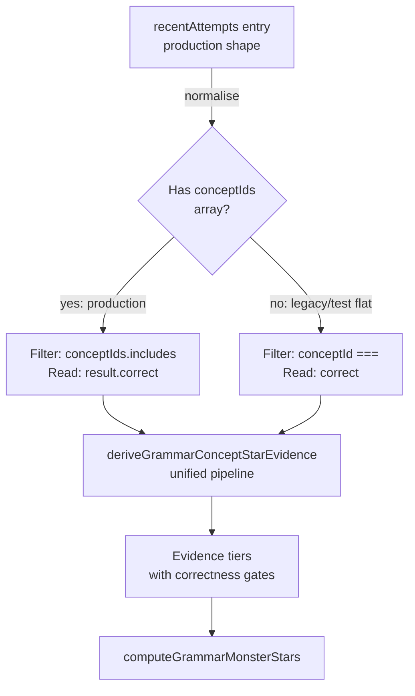
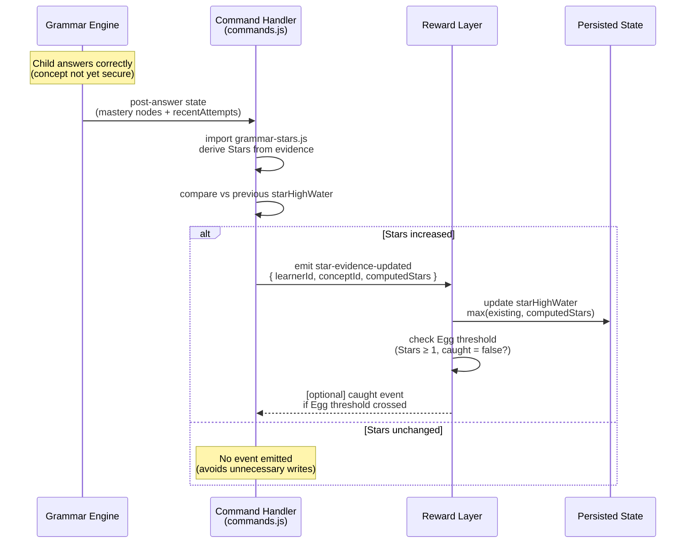
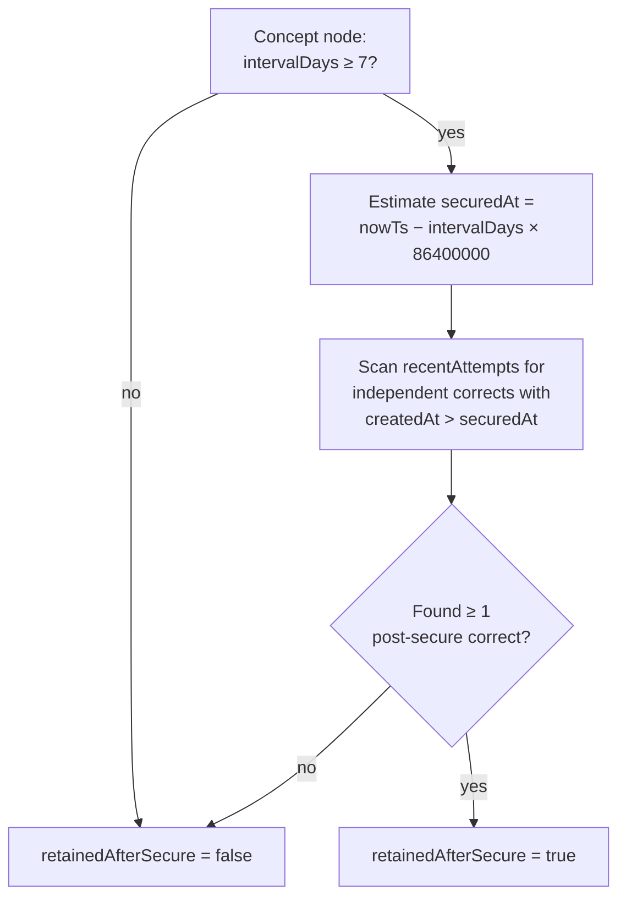

# Grammar Phase 6 — Star Evidence Authority, Content Reliability & Production Trust Contract

## Overview

Phase 5 made Stars the child-facing truth for Grammar progression. Phase 6 makes that truth trustworthy by closing six confirmed defects in the Star derivation pipeline, establishing server-owned Star authority, and — only after trust is proven — introducing disciplined content and answer-spec expansion for thin-pool concepts. No new Grammar modes, no new active monsters, no Hero Mode integration, no cross-subject reward economy.

**Central Phase 6 question (from origin §1):**

> When a child sees "Bracehart — 17 / 100 Stars", can we prove those Stars came from real learning evidence, will never disappear, are not inflated by support, AI, Writing Try, wrong answers, or client-only read-model artefacts, and are consistent with what the adult view says?

---

## Problem Frame

Phase 5 successfully deployed a 100-Star evidence curve and simplified the Grammar landing page. However, the origin contract (`docs/plans/james/grammar/grammar-p6.md`) identifies six trust gaps in the shipped P5 pipeline, all of which the codebase research confirms:

1. **Production attempt shape mismatch (origin §5.1 — CONFIRMED).** `deriveGrammarConceptStarEvidence` at `shared/grammar/grammar-stars.js:137` filters `a.conceptId === conceptId` (singular) and reads `a.correct` (top-level). Production `recentAttempts` entries use `a.conceptIds` (plural array) and `a.result.correct` (nested). The read-model helpers at `src/subjects/grammar/read-model.js:106` correctly use `conceptIds.includes(conceptId)`, but the Star derivation does not. **Evidence tiers may never unlock from real Worker attempts even though all test fixtures pass.**

2. **Dashboard reads null evidence (origin §5.2 — CONFIRMED).** `buildGrammarDashboardModel` at `grammar-view-model.js:558` calls `buildGrammarMonsterStripModel(rewardState, null, null)`. The `GrammarSetupScene.jsx:182` rendering path does pass live evidence, but the dashboard model consumed by other surfaces (admin hub, parent hub) does not. Dashboard Stars reflect only `starHighWater`, not live evidence.

3. **1-Star Egg is display-only, not reward-authoritative (origin §5.3 — CONFIRMED).** The reward subscriber at `event-hooks.js:18` reacts exclusively to `grammar.concept-secured` events. Sub-secure evidence (a single independent correct → 1 Star → Egg found) never triggers `recordGrammarConceptMastery`. The Egg reward (`caught: true`) is written at line `grammar.js:420-421` only when the secured event fires, not when the first Star evidence appears.

4. **`starHighWater` lags behind displayed sub-secure Stars (origin §5.4 — CONFIRMED).** `starHighWater` is updated only inside `recordGrammarConceptMastery` (on concept-secured events, `grammar.js:414,431`). Between a child's first independent correct (1 Star displayed via read-time derivation) and their first concept-secured event, `starHighWater` remains 0 or legacy-seeded. If the session ends and `recentAttempts` rolls past the evidence before a secured event, Stars regress.

5. **`retainedAfterSecure` lacks temporal proof (origin §5.5 — CONFIRMED).** The current check at `grammar-stars.js:190` is `secureConfidence === true && independentCorrects.length >= 2`. This permits two pre-secure independent corrects to unlock the tier the moment the concept becomes secure — no proof that the second correct happened *after* secure status was reached.

6. **`variedPractice` counts wrong-answer templates (origin §5.6 — CONFIRMED).** The template-diversity check at `grammar-stars.js:161-169` scans all `conceptAttempts` for distinct `templateId` values, regardless of correctness. A child who answers two templates incorrectly would unlock `variedPractice` despite having no correct evidence across varied forms.

Phase 6 fixes all six before touching content.

(see origin: `docs/plans/james/grammar/grammar-p6.md`)

---

## Requirements Trace

- R1. **Production-shape alignment.** Star evidence derivation must use the canonical production attempt shape (`conceptIds` array, `result.correct` nested) as the primary contract, not a test-only flattened shape.
- R2. **Server-owned Star authority.** Every displayed Star must be reproducible from Worker-owned state. The browser can display Stars but must not be the authority that grants them. Star high-water must persist when sub-secure evidence earns early Stars.
- R3. **1-Star Egg is a persisted reward state with an event/toast.** The Egg transition (`caught: true`) must fire when the first Star evidence appears, not only on concept-secured.
- R4. **`starHighWater` persists at evidence time, not only at concept-secured time.** Sub-secure Stars must survive session end and `recentAttempts` rolling truncation.
- R5. **`retainedAfterSecure` requires post-secure temporal proof.** The retention tier must verify that the later independent correct happened after the concept was secure — not just that two independent corrects exist alongside secure status.
- R6. **`variedPractice` requires correct evidence across varied forms.** Wrong-only answers on a template do not contribute to the varied-practice tier.
- R7. **Dashboard consumes canonical Star projection.** All surfaces displaying monster Stars must consume the same evidence-derived projection, not just the persisted latch.
- R8. **Reward events from server-side transitions only.** No event from client rendering, refresh, Writing Try, AI explanation, or view-only actions. Events are idempotent across refresh, two tabs, and retry requests.
- R9. **No `contentReleaseId` bump for pure reward/projection fixes.** A bump is required only for content or marking-behaviour changes.
- R10. **Content expansion: thin-pool concepts first, answer-spec from day one.** If Phase 6 includes content, it must follow the Phase 4 U12 content audit: `active_passive` and `subject_object` receive highest priority; new templates include declarative answerSpec at creation; behaviour-changing work bumps `contentReleaseId` and refreshes oracle fixtures.
- R11. **Answer-spec migration: exact-match batches, constructed per-template.** Selected-response exact migrations may be batched if byte-identical; constructed-response must be per-template with golden accepted answers and near-miss rejections.
- R12. **Phase 5 invariants 1–15 preserved.** No Phase 6 unit weakens a P5 invariant.
- R13. **Landing page simplification preserved.** Phase 6 may polish visual clarity but must not re-expand the landing to an 8-mode decision screen.
- R14. **Grand Concordium kept hard.** Grand Concordium requiring 5+ months is an accepted design decision. Do not weaken the timeline without a separate product decision.
- R15. **Visual/browser QA before declaring production-trustworthy.** Landing page, monster strip, mobile layout, and post-session Star updates must be verified in a real browser.

---

## Scope Boundaries

- No new Grammar modes
- No new active Grammar monsters
- No Hero Mode integration, Hero Coins, or cross-subject reward economy
- No new AI scoring or automatic scoring for Writing Try
- No new child analytics dashboard
- No broad app-shell redesign
- No change to `shared/grammar/confidence.js` derivation logic or `grammarConceptStatus` thresholds
- No change to the Grammar engine's scheduling, marking, or spaced-review mechanics
- Content expansion and answer-spec migration are included as optional later units (U10–U11) only after trust units (U1–U9) are merged and verified

### Deferred to Follow-Up Work

- Post-Mega Grammar layer (guardian/review challenges analogous to Spelling Guardian) — future phase
- `concordiumProgress` shape migration from `{ mastered, total }` to Star-only — future phase after all JSX consumers migrate
- Parent/admin hub enriched Star display beyond the projected monster strip — separate PR
- Grand Concordium timeline adjustment — only if a separate product decision changes the target

---

## Context & Research

### Relevant Code and Patterns

- `shared/grammar/grammar-stars.js` — Star constants, evidence-tier derivation (`deriveGrammarConceptStarEvidence`), per-monster computation, stage functions, high-water latch
- `src/platform/game/mastery/grammar.js` — `progressForGrammarMonster` (Star derivation from concept nodes + recent attempts), `recordGrammarConceptMastery` (reward-state writer, event emitter), `grammarEventFromTransition` (event cascade), `seedStarHighWater` (legacy migration), `normaliseGrammarRewardState`
- `src/subjects/grammar/event-hooks.js` — reward subscriber (only reacts to `grammar.concept-secured`)
- `src/subjects/grammar/read-model.js` — client read-model, production attempt shape (`conceptIds` array, `result.correct` nested), `recentMissCountForConceptId`, `distinctTemplatesForConceptId`
- `src/subjects/grammar/components/grammar-view-model.js` — `buildGrammarDashboardModel` (passes `null, null` evidence), `buildGrammarMonsterStripModel`
- `src/subjects/grammar/components/GrammarSetupScene.jsx` — JSX monster strip rendering (line 182 passes live evidence)
- `tests/grammar-stars.test.js` — evidence-tier derivation tests (synthetic shape)
- `tests/grammar-concordium-invariant.test.js` — ratchet + denominator freeze
- `tests/grammar-star-e2e.test.js` — end-to-end journey tests

### Institutional Learnings

- **`firstAttemptIndependent` is the sole authoritative gate** for independent tiers (ADV-001 from P5). Using `supportLevelAtScoring === 0` as a proxy lets nudge retries leak through.
- **`seedStarHighWater` must seed from legacy derivation, not 0** — seeding from 0 permanently erases the legacy floor (highest-severity P5 bug caught by review).
- **IEEE 754 epsilon guard**: `Math.floor(totalStars + 1e-9)` — only one boundary affected across all weight subsets, but omitting it causes silent off-by-one regressions.
- **"Mega is never revoked" cross-subject pattern**: Spelling's Guardian sibling-map architecture. Grammar's `starHighWater` follows the same "parallel data that never mutates the core learning state" pattern.
- **Test-harness-vs-production scaffold defect class** (P4 §4.3, Punctuation P4 U5): P5's Star derivation uses a test-only attempt shape that diverges from production. Phase 6 U1 is the exact instance of this defect class.
- **Content release ID freeze**: `contentReleaseId` has been byte-identical across 26+ PRs (Phases 3–5). Accidental bumps trigger cache invalidation and migration paths.

---

## Key Technical Decisions

- **Production attempt shape becomes the primary derivation contract.** `deriveGrammarConceptStarEvidence` will be refactored to accept `conceptIds` (array) and `result.correct` (nested object) as its primary attempt filtering shape. The test-only flat shape (`conceptId` singular, `correct` top-level) is accepted defensively during migration with a normaliser, but the production shape is what test fixtures must exercise. **Rationale:** This is the origin's §5.1 fix — aligning the shape the system tests with the shape the system ships.

- **New event type `grammar.star-evidence-updated` for sub-secure persistence.** The **command response handler** (not the engine itself) emits this event after processing a Grammar answer. The command handler at `worker/src/subjects/grammar/commands.js` already has access to both the engine's post-answer state (`state.mastery.concepts`, `state.recentAttempts`) and can import `grammar-stars.js` (a shared pure-function module with no Worker/client-specific deps). After the engine processes an answer, the command handler derives Stars via `computeGrammarMonsterStars`, compares against the previous `starHighWater`, and emits `star-evidence-updated` with `{ learnerId, conceptId, computedStars }` only when Stars increased. The reward subscriber reacts to both `concept-secured` (existing) and `star-evidence-updated` (new). **Rationale:** The current architecture (read-time derivation + latch-write only on concept-secured) creates a persistence gap for sub-secure Stars. P5 explicitly rejected adding events from the engine to avoid coupling the engine to Star derivation (documented in `docs/solutions/architecture-patterns/grammar-p5-100-star-evidence-curve-and-autonomous-sdlc-2026-04-27.md` lines 30, 50, 106). Phase 6 places the event emission in the command handler — a layer above the engine that already couples to both engine state and the reward pipeline — preserving the engine's isolation. The engine remains Star-unaware; the command handler bridges the gap. The event does NOT replace `concept-secured`; it supplements it for the specific case where evidence earns Stars below the secure threshold.

- **`retainedAfterSecure` adds temporal ordering proof.** The tier detection will require that the later independent correct has a `createdAt` timestamp strictly after the concept's estimated first-secure timestamp. The estimate is `nowTs - intervalDays * 86400000`. **Caveat:** `intervalDays` can decrease on regression (engine applies `× 0.45` on wrong answers, `× 0.9` on quality 3). This makes the estimate *permissive* (more recent than reality), not conservative — it enlarges the temporal window, potentially accepting a correct answer as "post-secure" that occurred during a recovery period. The exposure is bounded: once `intervalDays` drops below 7, `secureConfidence` becomes false and `retainedAfterSecure` is blocked regardless. In practice, a concept at `intervalDays: 14` that gets one wrong answer drops to 6.3 (below threshold, tier blocked). From `intervalDays: 16`, one wrong drops to 7.2 (narrow band where the estimate is permissive but the concept is barely above threshold). This bounded permissiveness is acceptable vs the current defect of awarding with no temporal proof at all. **Rationale:** Origin §5.5 — the ADV-003 "2 independent corrects" heuristic is necessary but not sufficient. The temporal proof prevents pre-secure corrects from retroactively satisfying the retention tier the moment the concept becomes secure.

- **`variedPractice` requires correct-only distinct templates.** The template-diversity scan will filter to `result.correct === true` (or `correct === true` for flat shape) before collecting distinct `templateId` values. **Rationale:** Origin §5.6 — wrong-answer exposure across templates does not prove varied practice.

- **Dashboard model passes evidence to the monster strip.** `buildGrammarDashboardModel` will receive mastery concept nodes and recent attempts as parameters and pass them through to `buildGrammarMonsterStripModel`, matching the `GrammarSetupScene.jsx` rendering path. **Rationale:** Origin §5.2 — all consumer surfaces must show the same evidence-derived Stars, not just the persisted latch.

- **Content expansion is Phase 6B, gated on trust units.** Implementation units U1–U9 (trust/evidence fixes) must be merged and passing before U10–U11 (content/answer-spec) begin. If Phase 6 becomes too large, U10–U11 split into a separate phase. **Rationale:** Origin §4.7 — content work must not hide Star-authority bugs.

---

## Open Questions

### Resolved During Planning

- **Should the new event type be `grammar.star-evidence-updated` or should the subscriber widen to `grammar.answer-submitted`?** Resolution: A dedicated `star-evidence-updated` event. Widening to `answer-submitted` would fire on every answer (including wrong, supported, Writing Try) and require the reward layer to re-derive evidence itself — violating the architecture boundary. The new event fires only when valid evidence changes the Star count, keeping the reward layer reactive to meaningful transitions only.

- **Should `starHighWater` be updated by the Worker or reported from the client?** Resolution: Worker. The origin §4.1 contract is unambiguous: "the browser must not be the authority that grants Stars." The `star-evidence-updated` event flows through the Worker, which updates `starHighWater` via `recordGrammarConceptMastery` (or a new lightweight latch-write).

- **Should temporal ordering for `retainedAfterSecure` use exact `securedAt` timestamp or an estimate?** Resolution: Estimate from concept node. The Grammar engine does not persist a `securedAt` timestamp. Backfilling one would require engine changes beyond P6 scope. The estimate `nowTs - intervalDays * 86400000` is permissive (not conservative) when `intervalDays` decreases after regression — see Key Technical Decisions for the bounded-permissiveness analysis. The `intervalDays ≥ 7` gate limits exposure: once `intervalDays` drops below 7, `secureConfidence` becomes false and blocks the tier regardless.

- **How does the system detect whether a concept was previously secured if it has since regressed?** Resolution: The derivation checks `node.intervalDays ≥ 7` as the proxy for "was previously secured" (matching P5 design at `grammar-stars.js:177`). This proxy is conservative — `intervalDays ≥ 7` is only reachable after the spaced-review cycle that secures a concept. If a future engine change allows `intervalDays ≥ 7` without prior secure status, the tier would be over-awarded. Acceptable risk given no engine changes in scope.

### Deferred to Implementation

- Exact `star-evidence-updated` event payload beyond the minimum `{ learnerId, conceptId }` — may include computed Stars if the reward layer needs them
- Whether `recordGrammarConceptMastery` gains a second code path for star-evidence-only updates or a separate function
- Whether the temporal estimate for `retainedAfterSecure` uses the concept node's `intervalDays` as a floor or a ceiling for the secured-at estimate
- Exact CSS polish for visual improvements to landing page (Phase 6 may polish but not restructure)
- Content template text and answer-spec details for U10–U11

---

## High-Level Technical Design

> *This illustrates the intended approach and is directional guidance for review, not implementation specification. The implementing agent should treat it as context, not code to reproduce.*

### Star derivation fix — production attempt shape alignment

### Sub-secure Star persistence — new event flow

### `retainedAfterSecure` temporal proof

---

## Implementation Units

- U1. **Production attempt shape alignment — fix `deriveGrammarConceptStarEvidence`**

**Goal:** Make the Star derivation function accept and correctly filter the canonical production attempt shape (`conceptIds` array, `result.correct` nested), while defensively accepting the legacy flat test shape.

**Requirements:** R1, R12

**Dependencies:** None

**Files:**
- Modify: `shared/grammar/grammar-stars.js` (`deriveGrammarConceptStarEvidence`)
- Modify: `tests/grammar-stars.test.js` (add production-shape fixtures, convert existing tests)
- Test: `tests/grammar-stars.test.js`

**Approach:**
- Add a normaliser at the top of the attempt filter: if `attempt.conceptIds` is an array, match via `conceptIds.includes(conceptId)` and read `attempt.result?.correct`; else fall back to `attempt.conceptId === conceptId` and `attempt.correct`
- Convert at least half the existing test fixtures to use the production shape (conceptIds array, nested result.correct) as the PRIMARY test path
- Add a contract test: production-shape attempt unlocks the same tiers as the equivalent flat-shape attempt
- Pin: `firstAttemptIndependent` remains the sole independent-gate (no regression from ADV-001)

**Execution note:** Start with a characterisation test that proves the current code FAILS with production-shape attempts, then fix the derivation function.

**Patterns to follow:**
- `src/subjects/grammar/read-model.js:106` — `Array.isArray(attempt?.conceptIds) && conceptIds.includes(conceptId)` pattern
- `shared/grammar/grammar-stars.js` ADV-001 comment — preserve `firstAttemptIndependent` as sole gate

**Test scenarios:**
- Happy path: production-shape attempt `{ conceptIds: ['clauses'], result: { correct: true }, firstAttemptIndependent: true }` → `firstIndependentWin = true`
- Happy path: production-shape with multi-concept `{ conceptIds: ['clauses', 'phrases'] }` → both concepts get evidence from the same attempt
- Happy path: flat-shape attempt `{ conceptId: 'clauses', correct: true }` → still works (defensive migration)
- Edge case: attempt with empty `conceptIds: []` → matches nothing → no evidence
- Edge case: attempt with `conceptIds` not an array (string, null) → falls back to flat-shape matching
- Edge case: attempt with `result: { correct: false }` → no evidence even with `firstAttemptIndependent: true`
- Error path: malformed attempt (missing both `conceptId` and `conceptIds`) → 0 evidence, no crash
- Integration: existing `tests/grammar-stars.test.js` suite passes with minimal fixture changes
- Contract: identical learner state with production-shape vs flat-shape fixtures → identical Star counts

**Verification:**
- Production-shape fixtures are the primary test path (at least 50% of fixtures use `conceptIds` array + `result.correct`)
- All existing evidence-tier edge cases pass with both shapes
- Drift-guard test still passes

---

- U2. **`variedPractice` correctness gate — filter to correct-only distinct templates**

**Goal:** Ensure the `variedPractice` tier only unlocks when a concept has correct answer evidence across at least two distinct templates. Wrong-answer-only exposure must not contribute.

**Requirements:** R6, R12

**Dependencies:** U1

**Files:**
- Modify: `shared/grammar/grammar-stars.js` (`deriveGrammarConceptStarEvidence`, varied-practice section)
- Modify: `tests/grammar-stars.test.js` (add wrong-answer-only fixtures)
- Test: `tests/grammar-stars.test.js`

**Approach:**
- Change the template-diversity scan at `grammar-stars.js:161-169` to filter concept attempts to correct-only before collecting distinct `templateId` values
- Use `(a.result?.correct === true || a.correct === true)` to support both production and flat shapes (after U1 normaliser)

**Patterns to follow:**
- `grammar-stars.js:148-153` — existing `independentCorrects` filter pattern (correct + independent gate)

**Test scenarios:**
- Happy path: 2 correct attempts on distinct templates → `variedPractice = true`
- Happy path: 3 correct on 2 templates + 1 wrong on a 3rd template → `variedPractice = true` (correct evidence on 2 templates is sufficient)
- Edge case: 2 wrong-only attempts on distinct templates → `variedPractice = false` (wrong answers alone cannot unlock)
- Edge case: 1 correct on template A + 1 wrong on template B → `variedPractice = false` (only 1 correct-distinct template)
- Edge case: 2 correct on the SAME template → `variedPractice = false` (not varied)
- Integration: Concordium concept with thin pool (1 template only) → `variedPractice` unreachable from that concept, confirming the thin-pool ceiling

**Verification:**
- Wrong-answer-only template exposure never unlocks variedPractice
- Existing tier interactions (firstIndependentWin + variedPractice) unaffected

---

- U3. **`retainedAfterSecure` temporal proof — post-secure ordering**

**Goal:** Strengthen the `retainedAfterSecure` tier to verify that the later independent correct happened after the concept reached secure status, not just that two independent corrects exist alongside secure status.

**Requirements:** R5, R12

**Dependencies:** U1

**Files:**
- Modify: `shared/grammar/grammar-stars.js` (`deriveGrammarConceptStarEvidence`, retained-after-secure section)
- Modify: `tests/grammar-stars.test.js` (add temporal ordering fixtures)
- Test: `tests/grammar-stars.test.js`

**Approach:**
- When `secureConfidence === true`, estimate `securedAtTs = nowTs - (node.intervalDays * 86400000)` as a conservative lower bound for when the concept first reached secure status
- Scan `recentAttempts` for independent correct attempts with `createdAt > securedAtTs`
- If at least 1 post-secure independent correct exists, `retainedAfterSecure = true`
- The function must accept a `nowTs` parameter (defaulting to `Date.now()`) so tests can control time
- Preserve the existing `secureConfidence === true` prerequisite — temporal ordering is an additional constraint, not a replacement

**Patterns to follow:**
- `grammar-stars.js:177-180` — existing `secureConfidence` detection from concept node
- `src/subjects/grammar/read-model.js` — `createdAt` field on `recentAttempts` entries

**Test scenarios:**
- Happy path: concept secured (`intervalDays: 14`), independent correct 3 days ago → `retainedAfterSecure = true`
- Happy path: concept secured (`intervalDays: 7`), independent correct 1 day ago → `retainedAfterSecure = true`
- Edge case: concept secured (`intervalDays: 14`), all independent corrects have `createdAt` BEFORE the estimated secure date → `retainedAfterSecure = false` (pre-secure corrects retroactively satisfying the tier was the original defect)
- Edge case: concept just became secure (`intervalDays: 7`), only 2 independent corrects from the initial learning burst → both corrects predate secure → `retainedAfterSecure = false`
- Edge case: concept with `intervalDays: 6` (not yet secure) → `secureConfidence = false` → `retainedAfterSecure = false` regardless of corrects
- Edge case: `recentAttempts` entry missing `createdAt` → entry excluded from temporal scan
- Integration: full Mega journey requires temporal gap between secure and retention evidence

**Verification:**
- Pre-secure corrects alone never unlock `retainedAfterSecure`
- Mega (100 Stars) is provably unreachable without post-secure temporal evidence on every concept

---

- U4. **Sub-secure Star persistence — `grammar.star-evidence-updated` event**

**Goal:** Ensure that Stars earned from sub-secure evidence (firstIndependentWin, repeatIndependentWin, variedPractice) are persisted to `starHighWater` at evidence time, not deferred to concept-secured time. Close the gap where session-end + `recentAttempts` truncation could erase earned Stars.

**Requirements:** R2, R4, R8

**Dependencies:** U1

**Files:**
- Modify: `worker/src/subjects/grammar/commands.js` (emit `star-evidence-updated` after answer processing)
- Modify: `src/subjects/grammar/event-hooks.js` (subscribe to new event type)
- Modify: `src/platform/game/mastery/grammar.js` (new latch-write path for star-evidence updates)
- Test: `tests/grammar-star-persistence.test.js`

**Approach:**
- Define new event type `GRAMMAR_EVENT_TYPES.STAR_EVIDENCE_UPDATED = 'grammar.star-evidence-updated'`
- The **command response handler** at `worker/src/subjects/grammar/commands.js` emits this event. After the engine processes an answer, the command handler imports `grammar-stars.js` (shared pure module, no Worker/client-specific deps), derives Stars from the post-answer `state.mastery.concepts` + `state.recentAttempts`, and emits the event only when computed Stars exceed the previous `starHighWater`. This preserves the engine's isolation — the engine remains Star-unaware. The P5 decision to avoid engine-level Star events (`docs/solutions/architecture-patterns/grammar-p5-100-star-evidence-curve-and-autonomous-sdlc-2026-04-27.md` lines 30, 50, 106) is honoured: the command handler is the bridge layer, not the engine.
- Event payload: `{ learnerId, conceptId, contentReleaseId, computedStars }` — the reward subscriber uses `computedStars` to update `starHighWater`
- The reward subscriber handles both `concept-secured` (existing) and `star-evidence-updated` (new) events
- For `star-evidence-updated`: update `starHighWater` on both the direct monster and Concordium entries as `max(existing, computedStars)`, check Egg threshold, emit `caught` event if threshold newly crossed
- The `star-evidence-updated` event does NOT trigger the full `mastered[]` array update — that remains exclusive to `concept-secured`

**Patterns to follow:**
- `event-hooks.js:11-36` — existing reward subscriber pattern
- `grammar.js:362-478` — existing `recordGrammarConceptMastery` (model the latch-write as a subset of this)
- `grammar.js:414,431` — existing `seedStarHighWater` call pattern

**Test scenarios:**
- Happy path: first independent correct on Bracehart concept → `star-evidence-updated` fires → `starHighWater` updated from 0 to 1 → Egg `caught` event emitted
- Happy path: subsequent independent correct → `starHighWater` updated to new computed Stars → no duplicate `caught` event
- Happy path: `concept-secured` fires later → full `recordGrammarConceptMastery` runs → `starHighWater` updated further → `caught` is already true, no duplicate
- Edge case: `star-evidence-updated` fires but computed Stars ≤ existing `starHighWater` → no-op (latch holds)
- Edge case: `star-evidence-updated` for Concordium concept → both direct monster AND Concordium `starHighWater` updated
- Edge case: wrong answer, Writing Try, AI explanation → no `star-evidence-updated` event emitted → 0 Stars, 0 persistence
- Error path: `star-evidence-updated` with invalid `conceptId` → rejected, no state change
- Integration: session ends after 1 Star earned → `recentAttempts` truncation later → `starHighWater` persists → Stars do not regress on next load

**Verification:**
- Sub-secure Stars survive across sessions without depending on `recentAttempts` window
- Egg `caught` event fires from sub-secure evidence, not only from concept-secured
- No change to `concept-secured` event handling

---

- U5. **1-Star Egg as persisted reward state**

**Goal:** Make the Egg transition (`caught: true`) fire as a persisted reward event when the first Star evidence appears, regardless of whether a concept has reached secure status.

**Requirements:** R3, R8

**Dependencies:** U4

**Files:**
- Modify: `src/platform/game/mastery/grammar.js` (Egg transition in the star-evidence latch path)
- Modify: `tests/grammar-star-events.test.js` (add sub-secure Egg tests)
- Test: `tests/grammar-star-events.test.js`

**Approach:**
- In the new star-evidence latch-write path (U4), after updating `starHighWater`, check: if `previous.caught === false && next.stars >= 1`, emit `caught` event
- The `caught` event must fire exactly once per monster — not on refresh, not on client recomputation
- The persisted `caught: true` field is written alongside `starHighWater` on the monster state entry
- The existing `concept-secured` path at `grammar.js:420-421` already sets `caught: true` — it remains as a redundant safety net (idempotent on an already-caught monster)

**Patterns to follow:**
- `grammarEventFromTransition` at `grammar.js:325-336` — existing priority cascade (caught wins over evolve)
- `grammar.js:279` — existing caught logic `caught: mastered >= 1 || displayStars >= 1`

**Test scenarios:**
- Happy path: fresh Bracehart, first independent correct → Stars = 1 → `caught` event fires → `caught: true` persisted
- Happy path: fresh Concordium, first independent correct on any cluster concept → Stars = 1 → Concordium `caught` fires
- Edge case: `caught` already true from prior evidence → no duplicate event on subsequent Star increases
- Edge case: refresh after Egg caught → no re-fire (`caught: true` already persisted)
- Edge case: legacy learner with `caught: true` from concept-secured path → new star-evidence path is no-op for `caught`
- Integration: Egg toast appears exactly once after the first independent correct, persists after navigation and refresh

**Verification:**
- `caught: true` is persisted from sub-secure evidence, not only from concept-secured
- No duplicate `caught` events across any code path
- Existing `concept-secured`-driven caught path still works (redundant but safe)

---

- U6. **Dashboard model — pass evidence to monster strip**

**Goal:** Make `buildGrammarDashboardModel` consume mastery concept nodes and recent attempts so that all surfaces showing Stars reflect live evidence, not just the persisted latch.

**Requirements:** R7

**Dependencies:** U1

**Files:**
- Modify: `src/subjects/grammar/components/grammar-view-model.js` (`buildGrammarDashboardModel` signature and call to `buildGrammarMonsterStripModel`)
- Modify: `src/subjects/grammar/components/GrammarSetupScene.jsx` (sole production caller — thread `conceptNodesMap` + `recentAttempts` through `buildGrammarDashboardModel` instead of calling `buildGrammarMonsterStripModel` separately)
- Modify: `tests/grammar-ui-model.test.js` (update ~15 test call sites to pass evidence fixtures)
- Test: `tests/grammar-ui-model.test.js`

**Approach:**
- Add `masteryConceptNodes` and `recentAttempts` parameters to `buildGrammarDashboardModel`
- Pass them through to `buildGrammarMonsterStripModel(rewardState, masteryConceptNodes, recentAttempts)` at line 558, replacing the current `null, null`
- Update all call sites to provide concept nodes and recent attempts from the Grammar read-model
- This aligns the dashboard model with the `GrammarSetupScene.jsx:182` rendering path, which already passes live evidence

**Patterns to follow:**
- `GrammarSetupScene.jsx:170-182` — existing pattern for extracting `conceptNodesMap` and `recentAttempts` from Grammar read-model
- `buildGrammarMonsterStripModel` — already handles null evidence gracefully (falls back to latch)

**Test scenarios:**
- Happy path: dashboard model with evidence → `monsterStrip` Stars match live evidence derivation
- Happy path: dashboard model without evidence (null, null) → graceful fallback to `starHighWater` (backward compat)
- Edge case: concept has live evidence > persisted `starHighWater` → dashboard shows higher Stars (live derivation wins)
- Edge case: concept has live evidence < persisted `starHighWater` → dashboard shows `starHighWater` (latch holds)
- Integration: dashboard model Stars match `GrammarSetupScene` monster strip Stars for the same learner state

**Verification:**
- No surface shows Stars from `null, null` evidence when live data is available
- `concordiumProgress` shape unchanged (backward compat)

---

- U7. **Phase 6 invariants extension and ratchet tests**

**Goal:** Extend the P5 invariants document (15 invariants at `docs/plans/james/grammar/grammar-phase5-invariants.md`) and test suite to cover the six trust fixes in Phase 6. Add Grand Concordium timeline preservation assertion (R14). Extend the Concordium ratchet property test to verify Star monotonicity under the new persistence model.

**Requirements:** R12, R14

**Dependencies:** U1, U2, U3, U4, U5

**Files:**
- Modify: `docs/plans/james/grammar/grammar-phase5-invariants.md` (add P6 addendum or create `grammar-phase6-invariants.md`)
- Modify: `tests/grammar-phase5-invariants.test.js` (extend with P6 pins)
- Modify: `tests/grammar-concordium-invariant.test.js` (extend ratchet with sub-secure persistence shapes)
- Test: `tests/grammar-concordium-invariant.test.js`

**Approach:**
- Read `docs/plans/james/grammar/grammar-phase5-invariants.md` (15 existing invariants) as the baseline. Add P6 invariants as an addendum (or create `grammar-phase6-invariants.md`)
- Add invariant pins for: production-shape alignment (conceptIds array is primary), variedPractice correctness gate, retainedAfterSecure temporal proof, sub-secure `starHighWater` persistence
- Add R14 assertion: Grand Concordium 5+ month timeline preserved — run U3 simulation helper with P6 weights and assert Grand Concordium is unreachable within 150 simulated days for all profiles (matching origin §5.8 contract)
- Extend the 200-random ratchet to include sequences where: (a) sub-secure evidence fires star-evidence-updated, (b) recentAttempts truncation occurs mid-sequence, (c) concept regresses from secure to needs-repair — Stars must not decrease in any scenario
- Add at least 2 new named regression shapes:
  - Sub-secure Stars earned → session ends → recentAttempts rolls → starHighWater holds
  - Pre-secure corrects + concept becomes secure → retainedAfterSecure must NOT retroactively unlock without temporal proof

**Patterns to follow:**
- `tests/grammar-concordium-invariant.test.js` — existing 200-random + 7-named shapes
- `docs/plans/james/grammar/grammar-phase5-invariants.md` — invariant document style

**Test scenarios:**
- Happy path: all P5 invariant pins still pass
- Happy path: 200-random ratchet with sub-secure persistence → `stars >= maxPriorStars` after every step
- Happy path: Grand Concordium simulation confirms timeline ≥ 150 days for all learner profiles (R14)
- Edge case: recentAttempts truncation mid-ratchet → starHighWater holds → no Star regression
- Edge case: pre-secure corrects + secure → retainedAfterSecure is false until post-secure correct
- Integration: full P6 invariant suite runs alongside P5 and P4 invariant suites without conflict

**Verification:**
- All existing named + random shapes pass
- New sub-secure persistence shapes pass
- Star ratchet holds across 200 random sequences including truncation events

---

- U8. **End-to-end trust contract tests**

**Goal:** Prove the full trust contract from the origin's §6 product acceptance criteria: production-shape attempts unlock evidence, sub-secure Stars persist, Egg fires at 1 Star, temporal retention is enforced, and no inflation paths exist.

**Requirements:** R1, R2, R3, R4, R5, R6, R8, R12

**Dependencies:** U1, U2, U3, U4, U5, U6, U7

**Files:**
- Modify: `tests/grammar-star-e2e.test.js` (extend with production-shape journeys)
- Create: `tests/grammar-star-trust-contract.test.js` (dedicated trust contract suite)
- Test: both files above

**Approach:**
- Drive full learner journeys using production-shape attempts (conceptIds array, result.correct nested)
- Verify: first independent correct → 1 Star → Egg persisted → starHighWater = 1
- Verify: session boundary → recentAttempts truncation → Stars preserved via starHighWater
- Verify: concept-secured → no retroactive retainedAfterSecure without temporal proof
- Verify: post-secure independent correct with later timestamp → retainedAfterSecure unlocks
- Verify: full 0→100 Star journey with production shapes
- Verify: Writing Try path → 0 Stars, 0 events
- Verify: AI explanation path → 0 Stars, 0 events
- Verify: supported (worked/faded) answers → no independent-tier credit
- Verify: wrong-only template exposure → no variedPractice credit
- Parity check: Spelling monster system unaffected

**Execution note:** Start with a characterisation test that replays a full learner journey using production attempt shapes.

**Patterns to follow:**
- `tests/grammar-star-e2e.test.js` — existing e2e journey pattern
- `tests/grammar-rewards.test.js` — existing reward e2e with `makeRepository`

**Test scenarios:**
- Happy path: full 0→100 Star journey for Bracehart with production-shape attempts
- Happy path: Concordium accumulates Stars from cross-cluster production-shape evidence
- Happy path: 1-Star Egg persists after session boundary and recentAttempts truncation
- Happy path: Mega requires post-secure temporal evidence on every concept
- Edge case: all 6 trust defects have dedicated regression tests proving the fix
- Edge case: pre-P5 legacy learner migration path still works
- Edge case: dual-tab / refresh does not duplicate events
- Integration: Spelling system unaffected

**Verification:**
- Every origin §6 acceptance criterion has at least one dedicated test
- All tests use production-shape attempts as the primary fixture

---

- U9. **Visual/browser QA — Playwright landing and monster strip coverage**

**Goal:** Verify Grammar landing page, monster strip, mobile layout, and post-session Star updates in a real browser. Close the P5 deferred visual validation gap (origin §5.7).

**Requirements:** R13, R15

**Dependencies:** U6, U8

**Files:**
- Modify: `tests/playwright/grammar-golden-path.playwright.test.mjs` (extend)
- Test: `tests/playwright/grammar-golden-path.playwright.test.mjs`

**Approach:**
- Desktop viewport (1280×800): landing page renders, Smart Practice is primary CTA, monster strip shows 4 active monsters with Star counts, no forbidden terms
- Mobile viewport (375×667): responsive layout, touch targets adequate, monster strip readable
- Post-session flow: after a Grammar practice session, monster strip Star count increases; Egg state persists after navigation away and back
- Concordium: shows Stars not raw concept counts
- No visual regression in other Grammar surfaces (Grammar Bank, Mini Test)

**Test scenarios:**
- Happy path: landing page at 1280×800 — Smart Practice CTA visible, monster strip with 4 monsters
- Happy path: landing page at 375×667 — responsive layout, no overflow, readable Star counts
- Happy path: post-session Star increase reflected in monster strip
- Edge case: fresh learner (0 Stars) → empty state accessible, Smart Practice still reachable
- Edge case: monster at Mega (100 Stars) → "Mega" label displayed
- Integration: navigation between Grammar Bank and landing does not corrupt monster strip state

**Verification:**
- Playwright screenshots at both viewports archived
- No forbidden terms in any child-facing surface

---

- U10. **Content expansion — thin-pool concept templates (Phase 6B, gated on U1–U9)**

**Goal:** Expand the template pool for thin-pool concepts, prioritising `active_passive` and `subject_object` which have only one question-type family each. Every new template includes a declarative `answerSpec` at creation.

**Requirements:** R9, R10

**Dependencies:** U1–U9 must be merged and passing

**Files:**
- Modify: Grammar content template files (exact paths deferred to implementation)
- Modify: `contentReleaseId` (bump required for content changes)
- Create: oracle fixtures for the new release
- Preserve: old oracle baseline
- Test: oracle comparison tests

**Approach:**
- Follow the Phase 4 U12 content audit: 6 thin-pool concepts, 2-template floor per concept
- `active_passive` and `subject_object` receive highest priority (1 question-type family each → most constrained)
- Pair every new template with a declarative answerSpec from day one
- Bump `contentReleaseId` once for the content batch
- Refresh oracle fixtures for the new release
- Preserve the old baseline so existing evidence is not invalidated
- If `explain` question-type coverage is thin, increase it within the same batch

**Patterns to follow:**
- Phase 4 U12 content audit (`docs/plans/james/grammar/grammar-content-audit.md` if it exists)
- Existing Grammar template patterns in the content directory

**Test scenarios:**
- Happy path: thin-pool concepts now have ≥ 2 templates each
- Happy path: `active_passive` and `subject_object` have ≥ 2 distinct question-type families
- Happy path: every new template has a declarative `answerSpec`
- Happy path: oracle fixtures pass for the new `contentReleaseId`
- Edge case: old oracle baseline still reproduces with the previous `contentReleaseId`
- Integration: new templates work with Star derivation (variedPractice tier is now achievable for previously thin-pool concepts)

**Verification:**
- `contentReleaseId` bumped exactly once
- Oracle fixtures refreshed and passing
- Old baseline preserved

---

- U11. **Answer-spec migration — selected-response batch + constructed per-template (Phase 6B)**

**Goal:** Migrate existing Grammar templates to declarative `answerSpec` where not yet done. Selected-response exact migrations are batched; constructed-response migrations are per-template with golden accepted answers and near-miss rejections.

**Requirements:** R11

**Dependencies:** U10

**Files:**
- Modify: Grammar template answerSpec declarations (exact paths deferred)
- Modify: `contentReleaseId` (bump only if marking behaviour changes)
- Test: golden answer tests per template

**Approach:**
- Follow the Phase 4 U11 answer-spec audit
- Selected-response templates with byte-identical behaviour: batch migrate in one PR
- Constructed-response templates: migrate one or small-batch at a time, with golden accepted answers and deliberate near-miss rejections
- `manualReviewOnly` templates remain non-scored unless a human-review phase is explicitly designed
- Behaviour-changing migrations require `contentReleaseId` bump and oracle refresh
- Non-behaviour-changing migrations (pure annotation) do NOT bump `contentReleaseId`

**Patterns to follow:**
- Phase 4 U11 answer-spec audit
- Existing declarative answerSpec templates

**Test scenarios:**
- Happy path: selected-response exact migration → behaviour byte-identical → no `contentReleaseId` bump
- Happy path: constructed-response migration → golden accepted answers pass → near-miss rejections rejected
- Edge case: behaviour-changing migration → `contentReleaseId` bumped → oracle refreshed
- Edge case: `manualReviewOnly` template → remains non-scored

**Verification:**
- All migrated templates have declarative answerSpec
- Oracle fixtures pass
- No accidental behaviour changes in exact migrations

---

## System-Wide Impact

- **Interaction graph:** `deriveGrammarConceptStarEvidence` is consumed by `progressForGrammarMonster` (client read path), which feeds `buildGrammarMonsterStripModel` (dashboard + JSX), `grammarEventFromTransition` (reward events), and `recordGrammarConceptMastery` (state persistence). The new `star-evidence-updated` event adds a second entry point from engine to reward layer alongside `concept-secured`. No callback chains — the event flow is linear.
- **Error propagation:** Malformed production-shape attempts → normaliser falls back to flat-shape matching → if both fail, 0 evidence → safe fallback. Corrupted `starHighWater` → treated as 0 → derived Stars win. Missing `createdAt` on recentAttempts → entry excluded from temporal scan → tier not awarded (conservative).
- **State lifecycle risks:** `starHighWater` remains additive-only (monotonic latch). The new `star-evidence-updated` event adds a write opportunity before concept-secured. Race condition risk: two concurrent star-evidence-updated events for the same monster → both compute `max(existing, new)` → monotonic latch ensures last-writer-wins is still correct (both values are ≥ existing).
- **API surface parity:** Grammar reward events retain the existing `{ type, kind, monsterId, previous, next }` shape. The new `star-evidence-updated` event type is internal to the Grammar→Reward pipeline and does not affect external consumers.
- **Integration coverage:** Trust contract tests (U8) drive the full pipeline with production-shape attempts. Unit tests alone cannot prove production-shape alignment, sub-secure persistence, or temporal ordering.
- **Unchanged invariants:** `shared/grammar/confidence.js` derivation, `grammarConceptStatus` thresholds, Grammar engine scheduling/marking, Writing Try non-scored contract, AI enrichment post-marking contract, Phase 4 invariants 1–12, Phase 5 invariants 1–15 (extended, never weakened), English Spelling parity.

---

## Risks & Dependencies

| Risk | Mitigation |
|------|------------|
| Production-shape normaliser introduces parsing overhead on every Star derivation call | The normaliser is O(1) per attempt (array check + field read). recentAttempts is capped at 80 entries. No measurable perf impact. |
| `star-evidence-updated` event fires too frequently (every valid answer) | The event fires only when evidence changes the Star count — not on every answer. Duplicate corrects at the same tier are no-ops. |
| Temporal `retainedAfterSecure` estimate is inaccurate for rapidly-decaying concepts | The `intervalDays ≥ 7` prerequisite means the concept was stable for at least a week. The estimate is conservative (awards slightly early at worst). Over-awarding by a few days is acceptable vs the current defect of awarding with no temporal proof at all. |
| Content expansion (U10–U11) may introduce marking regressions | Gated behind trust units U1–U9. Oracle fixtures provide regression coverage. contentReleaseId bump triggers full replay validation. |
| Dashboard callers may not have access to mastery concept nodes in all contexts | `buildGrammarDashboardModel` accepts null evidence and falls back to `starHighWater` (backward compat). Surfaces that cannot provide live evidence degrade gracefully. |
| Concurrent `star-evidence-updated` + `concept-secured` events for the same concept | Both paths write `starHighWater = max(existing, new)`. Monotonic latch ensures no regression regardless of ordering. The `mastered[]` array is only updated by `concept-secured` — no duplication risk. |

---

## Documentation / Operational Notes

- `docs/plans/james/grammar/grammar-phase6-invariants.md` (or addendum to P5 invariants) committed as U7 deliverable
- No monitoring changes — Star computation remains read-time pure-function derivation
- New `star-evidence-updated` event is internal to the Grammar→Reward pipeline; no external monitoring surface needed
- `contentReleaseId` bumps only in U10/U11 (content changes), not in U1–U9 (trust fixes)
- Old oracle baseline must be preserved when U10 bumps content release

---

## Sources & References

- **Origin document:** [docs/plans/james/grammar/grammar-p6.md](docs/plans/james/grammar/grammar-p6.md)
- Phase 5 plan: [docs/plans/2026-04-27-001-feat-grammar-phase5-star-curve-landing-plan.md](docs/plans/2026-04-27-001-feat-grammar-phase5-star-curve-landing-plan.md)
- Phase 5 invariants: [docs/plans/james/grammar/grammar-phase5-invariants.md](docs/plans/james/grammar/grammar-phase5-invariants.md)
- Phase 4 invariants: [docs/plans/james/grammar/grammar-phase4-invariants.md](docs/plans/james/grammar/grammar-phase4-invariants.md)
- Star derivation: `shared/grammar/grammar-stars.js`
- Reward layer: `src/platform/game/mastery/grammar.js`
- Event hooks: `src/subjects/grammar/event-hooks.js`
- Client read-model: `src/subjects/grammar/read-model.js`
- Dashboard view-model: `src/subjects/grammar/components/grammar-view-model.js`
- Concordium invariant test: `tests/grammar-concordium-invariant.test.js`
- Star tests: `tests/grammar-stars.test.js`, `tests/grammar-star-staging.test.js`, `tests/grammar-star-events.test.js`, `tests/grammar-star-e2e.test.js`
- P5 compound learning: `docs/solutions/architecture-patterns/grammar-p5-100-star-evidence-curve-and-autonomous-sdlc-2026-04-27.md`
