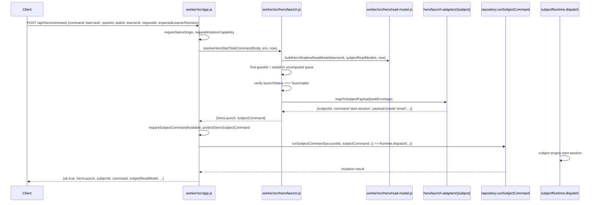

# feat: Hero Mode P1 — Launchable Task Envelopes and Subject Command Bridge

## Overview

P1 turns P0's read-only shadow quest into a safe launch bridge: a selected Hero task envelope can start the correct subject session through the existing Worker subject command boundary, carrying an opaque `heroContext`, without showing child-facing Hero UI, awarding Coins, claiming progress, or creating Hero-owned persistent state.

P1 is not the public launch of Hero Mode. It is the engineering proof that a Hero task can become a real subject session without Hero Mode becoming a subject engine, a reward engine, or a parallel command system.

---

## Problem Frame

P0 proved the platform can compute a safe, deterministic, daily Hero mission. But a shadow quest that never starts a real session is inert. P2 (child-facing UI) needs a proven launch path — without it, the UI would drive the architecture instead of the learning contract driving the UI.

The core engineering challenge: Hero must delegate session creation to the existing subject command pipeline (`repository.runSubjectCommand → subjectRuntime.dispatch`) without becoming a parallel command system. The `POST /api/hero/command` route must reuse every security gate, idempotency check, CAS guard, and demo protection that `POST /api/subjects/:subjectId/command` already enforces.

(see origin: `docs/plans/james/hero-mode/hero-mode-p1.md` §3, §7, §13)

---

## Requirements Trace

- R1. Hero task envelopes carry stable, deterministic `taskId`s derived from quest composition — not from copy, UI order, or client input
- R2. `heroContext` is built server-side, opaque to subject engines, attached to active sessions, and excluded from mastery/reward paths
- R3. Launch adapters map Hero envelopes to subject `start-session` payloads without importing subject runtime or mutating state
- R4. `POST /api/hero/command` (command: `start-task`) routes through the existing subject command mutation path — same security chain, same CAS, same idempotency, same demo protection
- R5. Server recomputes the quest on every launch request; client-supplied `questId`/`taskId` are validated against the recomputed quest, never trusted
- R6. Unlaunchable tasks are marked with explicit `launchStatus` and `reason` — never hidden or silently skipped
- R7. P1 writes only through the existing subject command path; zero Hero-owned persistent state (no Coins, no ledger, no monster state, no quest progress, no task completion)
- R8. `GET /api/hero/read-model` remains read-only; P0 fields are preserved; new fields are additive
- R9. Feature flags: `HERO_MODE_LAUNCH_ENABLED` (new, default false) independent of `HERO_MODE_SHADOW_ENABLED`
- R10. At minimum Spelling launches end-to-end; Grammar and Punctuation either launch or are marked `not-launchable` with precise reasons
- R11. Existing subject start-session behaviour works without `heroContext` (no regressions)
- R12. Punctuation feature gate is respected by Hero launch — no bypass via `/api/hero/command`
- R13. No child-facing Hero UI, no dashboard card, no Hero Camp, no Coins copy

**Origin acceptance examples:**
- AE1 (§28 Product): Hero remains platform orchestrator, not seventh subject → R7, R13
- AE2 (§28 Architecture): Launch route behind flag, through existing mutation path → R4, R9
- AE3 (§28 Subject): At least Spelling launches E2E; heroContext on active session → R2, R10
- AE4 (§28 Safety): No Hero Coins/ledger/monster; no child UI; Punctuation gate respected → R7, R12, R13
- AE5 (§28 Testing): All test categories pass; existing tests stay green → R11

---

## Scope Boundaries

- No child-facing Hero dashboard card, CTA, or navigation
- No Hero Coins, Hero ledger, Hero Camp, monster ownership, or unlock/evolve commands
- No task completion claims or daily progress persistence
- No Hero commands beyond `start-task`
- No new D1 tables or Hero-specific migrations
- No changes to subject mastery algorithms, Star calculations, or reward projections
- No subject session continuation, answer submission, or session ending through Hero routes
- No Arithmetic, Reasoning, or Reading providers or launch adapters
- No streaks, "Daily Deal" copy, or parent-facing Hero analytics page (origin §4 items 9-11)
- No capacity telemetry for `GET /api/hero/read-model` (deferred to P2)
- Error code `hero_active_session_conflict` (origin §12) is not returned in P1 — P2 client code must not depend on it

### Deferred to Follow-Up Work

- Child-facing Today's Hero Quest UI: P2
- Task completion claim and capped Coins ledger: P3
- Hero Camp and Hero Monster Pool: P4
- Active-session conflict detection for Hero tasks (same `heroContext.taskId` already active): P2/P3 — P1 relies on existing subject stale-session handling
- Content release fingerprint implementation: P2 — P1 compensates with scheduler version + quest recomputation as stale-launch defence

---

## Context & Research

### Relevant Code and Patterns

**Subject command pipeline** (`worker/src/app.js:1113-1170`): POST route enforces `requireSameOrigin → requireMutationCapability → readJson → normaliseSubjectCommandRequest → requireSubjectCommandAvailable → protectDemoSubjectCommand → repository.runSubjectCommand(... subjectRuntime.dispatch(...))`. This is the mutation path P1 must route through.

**Command contract** (`worker/src/subjects/command-contract.js`): Normalises `{ subjectId, command, learnerId, requestId, correlationId, expectedLearnerRevision, payload }`. The `payload` field is a plain object passed directly to the subject engine.

**Subject start-session payloads:**
- Spelling (`worker/src/subjects/spelling/engine.js:371`): `{ mode, yearFilter, length, words, practiceOnly, extraWordFamilies, patternId }`. Modes: smart, trouble, test, guardian, boss, pattern-quest, single.
- Grammar (`worker/src/subjects/grammar/engine.js:927`): `{ mode, templateId, focusConceptId, skillId, roundLength, seed, goalType }`. Modes: learn, smart, satsset, trouble, surgery, builder, worked, faded.
- Punctuation (`worker/src/subjects/punctuation/engine.js:149`): `{ mode, skillId, guidedSkillId, length, roundLength }`. Modes: smart, guided, weak, gps, endmarks, apostrophe, speech, comma_flow, boundary, structure.

**P0 codebase** (`shared/hero/`, `worker/src/hero/`): 6 shared modules + 6 Worker modules. Pure layer with zero Worker/D1 imports. Providers read-only. Route at `app.js:1323`.

**No-write boundary tests** (`tests/hero-no-write-boundary.test.js`): S1-S6 structural (source scan for forbidden tokens), B7-B8 behavioural (table row count before/after, POST 404 assertion).

**Idempotency** (`worker/src/repository.js:7818-8063`): `requestId → mutationPayloadHash → receipt lookup → CAS retry (3 attempts)`. Same `requestId` + same hash = replay. Same `requestId` + different hash = `idempotency_reuse_error`.

**Feature flags**: `wrangler.jsonc` vars + local `envFlagEnabled()` helper (truthy string comparison). Pattern: `HERO_MODE_SHADOW_ENABLED`, `PUNCTUATION_SUBJECT_ENABLED`.

### Institutional Learnings

- **Hero P0 read-only shadow subsystem** (`docs/solutions/architecture-patterns/hero-p0-read-only-shadow-subsystem-2026-04-27.md`): Three-layer architecture, provider pattern for cross-subject orchestration, no-write boundary proof (structural + behavioural). P1 must preserve P0's structural boundary tests for the GET path.
- **D1 atomicity** (memory): `withTransaction` is production no-op; `batch()` is canonical. P1 does not introduce new multi-statement writes (routes through existing `runSubjectCommandMutation`), but this remains a standing constraint.
- **Adversarial review catches highest-severity issues** (`docs/solutions/workflow-issues/sys-hardening-p2-13-unit-autonomous-sprint-learnings-2026-04-26.md`): Pattern-match review missed all four highest-severity blockers in sys-hardening. Hero P1 touches security boundaries and state-machine lifecycle — adversarial review warranted.

---

## Key Technical Decisions

- **Structure A (app owns dispatch)**: `worker/src/hero/launch.js` resolves the Hero command into a subject command shape; `worker/src/app.js` calls `repository.runSubjectCommand(... subjectRuntime.dispatch(...))` directly. This keeps `worker/src/hero/` free of subject runtime imports. (see origin §13, Preferred Structure A)

- **Scheduler version bump**: `hero-p0-shadow-v1` → `hero-p1-launch-v1`. Task IDs depend on scheduler version; P1 changes task identity semantics (tasks now carry stable IDs and launch status). Stale launch requests from cached P0 quests will fail cleanly. (see origin §17)

- **Read model version bump**: `hero.version` 1 → 2. Response shape adds `taskId`, `launchStatus`, `heroContext` per task, and `launch` capability block. Additive but structurally significant. (see origin §16, Option B)

- **Task ID derivation**: `djb2Hash(questId + '|' + ordinal + '|' + subjectId + '|' + intent + '|' + launcher + '|' + effortTarget + '|' + sortedReasonTags)`. Deterministic, copy-independent, order-dependent. (see origin §8)

- **Launch status vocabulary**: `launchable`, `not-launchable`, `subject-unavailable`, `stale`, `blocked`. Returned per-task in the read model. (see origin §9)

- **Content fingerprint remains null in P1**: Compensated by scheduler version bump + server-side quest recomputation on every launch request. Real fingerprint deferred to P2. (see origin §2 fingerprint discussion)

- **All three subjects targeted for launch**: Spelling, Grammar, and Punctuation all have clear `start-session` mode mappings. If any mapping proves unsafe during implementation, that subject's tasks are marked `not-launchable` rather than faked. (see origin §25)

- **Capacity telemetry for launch route**: Add `/api/hero/command` to `CAPACITY_RELEVANT_PATH_PATTERNS` because it executes subject commands on the same hot path. (see origin §23)

- **heroContext requires active session-state injection, not contamination prevention**: All three subject normalisers are whitelist-based — Punctuation's `normalisePunctuationPrefs` outputs only `{mode, roundLength}`, Grammar's `startSession` constructs session state from explicit named fields, and Spelling's `startOptionsFromPayload` extracts only 7 named fields. Unknown payload keys (including `heroContext`) are silently discarded by all three paths. The real U5 work is actively *adding* a `heroContext` field to each engine's session-state construction, not preventing leaks. Each engine must: (a) extract `heroContext` from `command.payload`, (b) add it as a named field on the session state object, and (c) verify it persists through `session_state_json`. (feasibility review correction)

- **subjectCommand shape must match normaliseSubjectCommandRequest output**: `resolveHeroStartTaskCommand` must return a `subjectCommand` with the exact same shape as `normaliseSubjectCommandRequest` output: `{ subjectId, command: 'start-session', learnerId, requestId, correlationId, expectedLearnerRevision, payload }`. The `command` field is `'start-session'` (the subject command), not `'start-task'` (the Hero command). `correlationId` defaults to `requestId` if absent in the Hero request body, replicating `normaliseSubjectCommandRequest`'s fallback logic. This is critical because `protectDemoSubjectCommand` buckets rate-limiting on `command.subjectId + command.command`, and `runSubjectCommand` validates required fields. (flow analysis finding C2)

- **Flag interaction rule**: `HERO_MODE_LAUNCH_ENABLED=true` requires `HERO_MODE_SHADOW_ENABLED=true`. If launch is enabled without shadow, the route returns 409 `hero_launch_misconfigured`. Rationale: the launch route internally calls `buildHeroShadowReadModel`, which works regardless, but the API surface becomes inconsistent (can launch but cannot read). Requiring both flags prevents staging confusion. (see origin §21)

- **ProjectionUnavailableError handling on launch route**: The Hero command route must replicate the same `ProjectionUnavailableError` catch block from the subject command route (`app.js:1156-1167`). Without it, projection exhaustion returns a generic 500, and the client's `isCommandBackendExhausted` classifier cannot parse it. (flow analysis finding I1)

---

## Open Questions

### Resolved During Planning

- **Quest fingerprint strategy**: Null in P1; stale-launch defence is scheduler version + server-side recomputation. This is safe because P1 has no public UI that could cache stale quests for extended periods.
- **All three subjects or Spelling-first**: All three. Spelling `smart`/`trouble`/`guardian`, Grammar `smart`/`trouble`, Punctuation `smart`/`weak`/`gps` all map directly to existing engine modes. No new modes need inventing.
- **heroContext on completed sessions**: P1 only needs heroContext on the active session. If it naturally persists through the subject session lifecycle (it will, via `session_state_json`), that is acceptable but not a P1 requirement.
- **Double-click behaviour**: P1 relies on existing `requestId` idempotency + subject-level stale-session handling. Full Hero-aware active-session detection is P2/P3 scope.

### Deferred to Implementation

- **Exact heroContext field list in session_state_json**: Depends on where each subject engine stores session metadata. Implementation should verify the passthrough at write time.
- **Grammar mode name**: Resolved during research — Grammar's `ENABLED_MODES` includes both `trouble` and `surgery` as distinct modes. The adapter should map `trouble-practice → {mode:'trouble'}`. No ambiguity remains.
- **heroContext on subject read model vs session_state_json only**: Origin §11 prefers both. Each subject's read-model builder is a separate code path from the session state writer. If surfacing heroContext on the returned read model requires touching read-model builders, defer to implementation — `session_state_json` passthrough is the minimum P1 requirement. P2 UI can read from session state if the read-model surface proves too invasive.
- **Double-submit side effect**: Two rapid launches with different `requestId`s for the same Hero task will both succeed. The second `start-session` abandons the first session (existing subject behaviour). This creates an abandoned `practice_sessions` row per double-click. Acceptable in P1 (no public UI); P2/P3 should add Hero-aware active-session detection. U7 tests must use a single `requestId` per task to avoid this.

---

## High-Level Technical Design

> *This illustrates the intended approach and is directional guidance for review, not implementation specification. The implementing agent should treat it as context, not code to reproduce.*



Key architectural constraints:
- `worker/src/hero/launch.js` never imports `subjects/runtime.js`
- `worker/src/app.js` owns the dispatch call, just as it does for direct subject commands
- Launch adapters are pure mappers: envelope → `{subjectId, payload}`, no side effects

---

## Implementation Units

- U1. **Stable task IDs and heroContext builders**

**Goal:** Add deterministic task ID generation and heroContext builder/validator to the shared pure layer.

**Requirements:** R1, R2

**Dependencies:** None

**Files:**
- Modify: `shared/hero/constants.js`
- Modify: `shared/hero/task-envelope.js`
- Create: `shared/hero/launch-context.js`
- Create: `shared/hero/launch-status.js`
- Test: `tests/hero-launch-contract.test.js`

**Approach:**
- Add to `constants.js`: `HERO_P1_SCHEDULER_VERSION = 'hero-p1-launch-v1'`, `HERO_LAUNCH_CONTRACT_VERSION = 1`, `HERO_LAUNCH_STATUSES` array, new safety flag shape for launch mode
- In `task-envelope.js`: add `deriveTaskId(questId, ordinal, envelope)`. The ordinal is the task's position in the selected task array (0-based). Inputs: `questId + '|' + ordinal + '|' + subjectId + '|' + intent + '|' + launcher + '|' + effortTarget + '|' + sortedReasonTags`. Uses DJB2 hash — note: `djb2Hash` in `seed.js` is currently module-private (not exported). Either export it from `seed.js` or copy the implementation into `task-envelope.js` (matching the existing codebase pattern of `isPlainObject` being duplicated across shared/hero/ files for purity — see L6 in P0 completion report)
- Create `launch-context.js`: `buildHeroContext({quest, task, taskId, requestId, now, schedulerVersion})`, `validateHeroContext(ctx)`, `sanitiseHeroContext(ctx)`. The builder produces the full origin §10 shape: `{ version, source:'hero-mode', phase:'p1-launch', questId, taskId, dateKey, timezone, schedulerVersion, questFingerprint: null, subjectId, intent, launcher, effortTarget, launchRequestId, launchedAt }`. `questFingerprint` is null in P1 (compensated by scheduler version) but present as a named field so P3 can check for it. `source` and `phase` are the audit fields P3 completion-claim verification will require. The sanitiser strips any field not on the allowlist. No Coins, no rewards, no monster IDs, no debug reasons. Note: origin §10 names the sanitiser `normaliseHeroContext` — this plan uses `sanitiseHeroContext` to distinguish it from the builder; both names are acceptable
- Create `launch-status.js`: `determineLaunchStatus(subjectId, launcher, capabilityRegistry)` — pure function that classifies a task as launchable or not-launchable with a reason

**Patterns to follow:**
- `shared/hero/seed.js` — `djb2Hash` function reuse
- `shared/hero/task-envelope.js` — existing builder/validator pattern
- `shared/hero/contracts.js` — normaliser pattern

**Test scenarios:**
- Happy path: same inputs produce same taskId across calls
- Happy path: different ordinal produces different taskId
- Happy path: different launcher produces different taskId
- Happy path: `buildHeroContext` produces valid context with all origin §10 fields: `version`, `source`, `phase`, `questId`, `taskId`, `dateKey`, `timezone`, `schedulerVersion`, `questFingerprint`, `subjectId`, `intent`, `launcher`, `effortTarget`, `launchRequestId`, `launchedAt`
- Happy path: `sanitiseHeroContext` retains only allowlisted fields
- Happy path: `questFingerprint` is null in P1 but present as a named field
- Happy path: `source` is `'hero-mode'` and `phase` is `'p1-launch'`
- Edge case: heroContext strips Coin/reward/monster fields if present in raw input
- Edge case: heroContext strips debugReason and adult-only diagnostics
- Edge case: taskId is deterministic regardless of reasonTag array order (sorted internally)
- Error path: `validateHeroContext` rejects context missing version or questId
- Error path: `determineLaunchStatus` returns `not-launchable` for unknown launcher/subject pair

**Verification:**
- All task ID and heroContext tests pass
- No shared/hero/ file imports from Worker, D1, or React

---

- U2. **Launch adapters — envelope to subject start-session payload**

**Goal:** Create per-subject launch adapters that map Hero task envelopes to subject start-session command payloads.

**Requirements:** R3, R6, R10

**Dependencies:** U1

**Files:**
- Create: `worker/src/hero/launch-adapters/index.js`
- Create: `worker/src/hero/launch-adapters/spelling.js`
- Create: `worker/src/hero/launch-adapters/grammar.js`
- Create: `worker/src/hero/launch-adapters/punctuation.js`
- Test: `tests/hero-launch-adapters.test.js`

**Approach:**
- Each adapter exports `mapToSubjectPayload(taskEnvelope)` returning `{ subjectId, payload }` or `{ launchable: false, reason }`.
- Spelling mappings: `smart-practice → {mode:'smart'}`, `trouble-practice → {mode:'trouble'}`, `guardian-check → {mode:'guardian'}`. Remaining launchers (`mini-test`, `gps-check`) → `not-launchable`.
- Grammar mappings: `smart-practice → {mode:'smart'}`, `trouble-practice → {mode:'trouble'}`. Remaining → `not-launchable`. Implementation should verify the exact mode name for trouble/repair via the Grammar engine's `ENABLED_MODES`.
- Punctuation mappings: `smart-practice → {mode:'smart'}`, `trouble-practice → {mode:'weak'}`, `gps-check → {mode:'gps'}`. Remaining → `not-launchable`.
- Registry in `index.js`: maps `subjectId → adapter`, returns `not-launchable` for unmapped subjects.
- Adapters must not import from `worker/src/subjects/runtime.js` or any subject engine. They are pure mappers.

**Patterns to follow:**
- `worker/src/hero/providers/index.js` — provider registry pattern

**Test scenarios:**
- Happy path: Spelling `smart-practice` maps to `{mode:'smart'}`
- Happy path: Spelling `trouble-practice` maps to `{mode:'trouble'}`
- Happy path: Spelling `guardian-check` maps to `{mode:'guardian'}`
- Happy path: Grammar `smart-practice` maps to `{mode:'smart'}`
- Happy path: Grammar `trouble-practice` maps to correct Grammar repair mode
- Happy path: Punctuation `smart-practice` maps to `{mode:'smart'}`
- Happy path: Punctuation `trouble-practice` maps to `{mode:'weak'}`
- Happy path: Punctuation `gps-check` maps to `{mode:'gps'}`
- Edge case: unsupported launcher returns `{ launchable: false, reason: 'launcher-not-supported-for-subject' }`
- Edge case: unknown subjectId returns `{ launchable: false, reason: 'subject-adapter-not-found' }`
- Edge case: adapters do not mutate the input task envelope (frozen-input test)
- Integration: no launch adapter file imports `subjects/runtime` or subject engine modules (structural scan)

**Verification:**
- All supported subject/launcher pairs produce valid start-session payloads
- All unsupported pairs return explicit not-launchable reasons
- No adapter file imports subject runtime

---

- U3. **Read-model evolution — task IDs, launch status, and launch capability block**

**Goal:** Update `GET /api/hero/read-model` to return task IDs, launch status, and a launch capability block while preserving all P0 fields.

**Requirements:** R1, R6, R8, R9

**Dependencies:** U1, U2

**Files:**
- Modify: `shared/hero/constants.js`
- Modify: `shared/hero/scheduler.js`
- Modify: `worker/src/hero/read-model.js`
- Test: `tests/hero-task-ids.test.js`

**Approach:**
- Bump scheduler version: `HERO_P1_SCHEDULER_VERSION` replaces `HERO_SCHEDULER_VERSION` as the active version used in `buildHeroShadowReadModel`
- After `scheduleShadowQuest` returns tasks, assign `taskId` and `launchStatus` to each task using `deriveTaskId` and `determineLaunchStatus` from U1
- Build `heroContext` per task using `buildHeroContext`
- Add `launch` capability block to the response:
  ```
  launch: {
    enabled: envFlagEnabled(env.HERO_MODE_LAUNCH_ENABLED),
    commandRoute: '/api/hero/command',
    command: 'start-task',
    claimEnabled: false,
    heroStatePersistenceEnabled: false
  }
  ```
- Bump `version: 2` in response
- Keep `mode: 'shadow'` unchanged for the GET route (P1 GET is still read-only)
- `HERO_SAFETY_FLAGS` remain unchanged for the GET route — `childVisible:false`, `coinsEnabled:false`, `writesEnabled:false`
- The `read-model.js` needs `env` passed in to check the launch flag. Add it as an optional parameter — P0 tests that don't pass `env` continue to work with `launch.enabled: false`

**Patterns to follow:**
- `worker/src/hero/read-model.js` — existing assembler pattern
- `shared/hero/task-envelope.js` — existing builder pattern

**Test scenarios:**
- Happy path: every selected task has a stable `taskId` string matching `hero-task-{hex}` pattern
- Happy path: every selected task has a `launchStatus` field
- Happy path: launchable tasks have `launchStatus:'launchable'`; unsupported pairs have `not-launchable` with reason
- Happy path: every selected task has a `heroContext` object with version, questId, taskId, dateKey, subjectId, intent
- Happy path: response `version` is 2
- Happy path: `launch` block present with correct structure
- Happy path: all P0 fields (`mode:'shadow'`, safety flags, eligibleSubjects, lockedSubjects, dailyQuest, debug`) still present
- Edge case: launch flag off → `launch.enabled: false`
- Edge case: zero eligible subjects → safe empty quest, no taskIds to assign
- Edge case: task with `not-launchable` status still appears in quest (visible for debug)

**Verification:**
- P0 read-model tests still pass (with minor updates for additive fields)
- New task ID determinism tests pass
- GET route remains read-only (table row counts unchanged)

---

- U4. **Hero command contract and route — POST /api/hero/command**

**Goal:** Add `POST /api/hero/command` behind `HERO_MODE_LAUNCH_ENABLED`, supporting only `start-task`, with full security chain.

**Requirements:** R4, R5, R9, R12

**Dependencies:** U1, U2, U3

**Files:**
- Modify: `worker/src/app.js`
- Modify: `worker/src/hero/routes.js`
- Create: `worker/src/hero/launch.js`
- Modify: `wrangler.jsonc`
- Modify: `worker/wrangler.example.jsonc`
- Test: `tests/worker-hero-command.test.js`

**Approach:**
- Add `HERO_MODE_LAUNCH_ENABLED: "false"` to `wrangler.jsonc` and example
- In `worker/src/hero/routes.js`: add `handleHeroCommand` handler that validates the Hero-specific request shape: `{ command, learnerId, questId, taskId, requestId, correlationId, expectedLearnerRevision }`. Reject if command is not `start-task`. Reject client-supplied `subjectId` or `payload`.
- In `worker/src/hero/launch.js`: `resolveHeroStartTaskCommand({ body, repository, env, now })`:
  1. Resolve learnerId, load subject read models
  2. Recompute Hero read model (calls `buildHeroShadowReadModel`)
  3. Find `questId` in recomputed quest → 409 `hero_quest_stale` if missing
  4. Find `taskId` in quest tasks → 404 `hero_task_not_found` if missing
  5. Verify `launchStatus === 'launchable'` → 409 `hero_task_not_launchable`
  6. Call launch adapter to get subject payload → 409 `hero_subject_unavailable` if adapter says no
  7. Build normalised `heroContext` and **full `subjectCommand` shape matching `normaliseSubjectCommandRequest` output**: `{ subjectId, command: 'start-session', learnerId, requestId, correlationId: correlationId || requestId, expectedLearnerRevision, payload: { ...adapterPayload, heroContext } }`. The `command` field is `'start-session'` (subject command), not `'start-task'` (Hero command).
  8. Return `{ heroLaunch, subjectCommand }` to the app route handler
- In `worker/src/app.js`: new route block for `POST /api/hero/command`:
  1. **Flag interaction guard**: if `HERO_MODE_LAUNCH_ENABLED` is false → 404 `hero_launch_disabled`. If `HERO_MODE_LAUNCH_ENABLED` is true but `HERO_MODE_SHADOW_ENABLED` is false → 409 `hero_launch_misconfigured`.
  2. `requireSameOrigin(request, env)`
  3. `requireMutationCapability(session)`
  4. `readJson(request)`
  5. Call `resolveHeroStartTaskCommand` → returns `{ heroLaunch, subjectCommand }`
  6. `requireSubjectCommandAvailable(subjectCommand, env)` — catches Punctuation gate (uses `subjectCommand.subjectId` which is `'punctuation'`, `'grammar'`, etc.)
  7. `protectDemoSubjectCommand(...)` — reuses existing demo protection (buckets on `subjectCommand.subjectId + subjectCommand.command` which is e.g. `'spelling' + 'start-session'`)
  8. `repository.runSubjectCommand(session.accountId, subjectCommand, () => subjectRuntime.dispatch(subjectCommand, context))`
  9. **`ProjectionUnavailableError` catch block**: replicate the same handler from the subject command route (`app.js:1156-1167`), returning structured 503 with `requestId`
  10. Return `{ ok: true, heroLaunch, ...result }`
- Add `/api/hero/command` to `CAPACITY_RELEVANT_PATH_PATTERNS`
- `launch.js` must not import `subjects/runtime.js` — that import stays in `app.js`
- Learner write access is verified by `requireLearnerWriteAccess` inside `runSubjectCommandMutation` (repository.js:7853), not duplicated in the Hero layer

**Patterns to follow:**
- `worker/src/app.js:1113-1170` — existing subject command route pattern
- `worker/src/hero/routes.js` — existing Hero route handler pattern

**Test scenarios:**
- Happy path: flag on, valid request → 200 with `heroLaunch` block and `subjectReadModel`
- Happy path: `heroLaunch.coinsEnabled` is false, `heroLaunch.claimEnabled` is false, `heroLaunch.childVisible` is false
- Error path: flag off → 404 `hero_launch_disabled`
- Error path: unauthenticated → 401
- Error path: cross-account learner → 403
- Error path: viewer/read-only membership cannot launch (no write access)
- Error path: missing `command` → 400 `hero_command_required`
- Error path: unsupported command (e.g., `claim-task`) → 400 `hero_command_unsupported`
- Error path: missing `taskId` → 400 `hero_task_id_required`
- Error path: missing `questId` → 400 `hero_quest_id_required`
- Error path: missing `requestId` → 400 `command_request_id_required`
- Error path: missing `expectedLearnerRevision` → 400 `command_revision_required`
- Error path: stale quest → 409 `hero_quest_stale`
- Error path: task not in quest → 404 `hero_task_not_found`
- Error path: task marked not-launchable → 409 `hero_task_not_launchable`
- Error path: Punctuation disabled → 409 `hero_subject_unavailable`
- Error path: client-supplied `subjectId` or `payload` in body is ignored/rejected
- Error path: `HERO_MODE_LAUNCH_ENABLED=true` with `HERO_MODE_SHADOW_ENABLED=false` → 409 `hero_launch_misconfigured`
- Error path: `ProjectionUnavailableError` during subject dispatch → 503 with structured `requestId` (not generic 500)
- Integration: demo session rate-limiting applies to Hero launch route (buckets on `subjectId + 'start-session'`)
- Integration: `subjectCommand` shape passes the same validation that `normaliseSubjectCommandRequest` output would

**Verification:**
- All error codes return structured JSON responses, not generic 500s
- Route registers after auth zone, follows same security chain as subject commands
- `worker/src/hero/launch.js` does not import `subjects/runtime.js`
- Flag interaction guard prevents inconsistent API surface

---

- U5. **heroContext session passthrough**

**Goal:** Ensure that when a Hero task starts a subject session, the active session carries sanitised `heroContext` in its persisted state and returned read model.

**Requirements:** R2, R11

**Dependencies:** U4

**Files:**
- Modify: `worker/src/subjects/spelling/engine.js`
- Modify: `worker/src/subjects/grammar/engine.js`
- Modify: `worker/src/subjects/punctuation/engine.js`
- Test: `tests/hero-context-passthrough.test.js`

**Approach:**
- The subject command `payload` will include `heroContext` as an optional field (set by `resolveHeroStartTaskCommand`, absent for direct subject commands)
- **Active injection pattern.** All three subject normalisers are whitelist-based — unknown payload keys including `heroContext` are silently discarded. The work is therefore to *actively add* `heroContext` to each engine's session-state construction:
  - Spelling (`engine.js:371,461`): In `startOptionsFromPayload`, extract `heroContext` from payload and include it in the returned options. In `service.startSession`, store `heroContext` on the session state object alongside existing fields (e.g., `session.heroContext = options.heroContext || null`).
  - Grammar (`engine.js:927,1052-1075`): In the `start-session` handler, extract `heroContext` from payload. In the session-state construction (where explicit named fields like `mode`, `templateId`, `round`, etc. are set), add `heroContext` as a new named field on `state.session`.
  - Punctuation (`engine.js:149`, `shared/punctuation/service.js:1402`): Extract `heroContext` from payload before passing to `service.startSession`. In the service's session-state construction, add `heroContext` as a named field. Note: `normalisePunctuationPrefs` outputs only `{mode, roundLength}` — no contamination risk exists regardless.
- The heroContext must NOT be read by marking, scoring, support, feedback, mastery, Stars, or reward projection logic. It is metadata only.
- Existing start-session calls (without heroContext) continue to work unchanged — heroContext is optional and defaults to null/undefined.

**Execution note:** Characterisation tests first — verify current start-session behaviour is unchanged before adding heroContext passthrough.

**Patterns to follow:**
- Existing session state shape per subject — add heroContext as an optional field at the session level

**Test scenarios:**
- Happy path: Spelling start-session with heroContext → active session state contains heroContext
- Happy path: Grammar start-session with heroContext → active session state contains heroContext
- Happy path: Punctuation start-session with heroContext → active session state contains heroContext
- Happy path: Spelling start-session without heroContext → session works normally, heroContext absent
- Happy path: Grammar start-session without heroContext → session works normally
- Happy path: Punctuation start-session without heroContext → session works normally
- Covers AE3: heroContext attached to active subject session for launched tasks
- Edge case: heroContext is not included in mastery state or learner profile
- Edge case: submit-answer command does not read or use heroContext for correctness
- Edge case: continue-session preserves heroContext on the active session
- Edge case: Punctuation session prefs do not contain heroContext (whitelist normaliser discards it — but verify heroContext is on the session state, not the prefs)
- Edge case: Grammar session mode and templateId are unaffected by heroContext presence in payload
- Edge case: Spelling word selection and scoring path do not reference heroContext
- Integration: full E2E — Hero launch → active session `session_state_json` contains heroContext field

**Verification:**
- Existing subject start-session tests pass without modification
- Active session persisted state includes heroContext when launched from Hero
- No subject mastery/reward code references heroContext

---

- U6. **Boundary and regression tests — P1 write boundary redefinition**

**Goal:** Update P0 boundary tests to reflect P1's intentional write boundary: Hero launch may write only through the existing subject command path, and must not write Hero-owned state.

**Requirements:** R7, R11, R13

**Dependencies:** U4, U5

**Files:**
- Modify: `tests/hero-no-write-boundary.test.js`
- Create: `tests/hero-launch-boundary.test.js`
- Test: self-verifying

**Approach:**
- In `hero-no-write-boundary.test.js`:
  - S1-S6 structural tests: extend the file scan to include new files in `worker/src/hero/launch-adapters/` and `shared/hero/launch-context.js`, `shared/hero/launch-status.js`. The forbidden-token patterns remain the same for `shared/hero/` and `worker/src/hero/providers/`. For `worker/src/hero/launch.js` and `launch-adapters/`, the structural constraint is: no imports from `subjects/runtime`, no D1 write primitives, no `.run()`, no `.batch()`.
  - B7: GET read-model no-write test unchanged — still must prove zero table writes
  - B8: Update — `POST /api/hero/command` with `HERO_MODE_LAUNCH_ENABLED: 'false'` returns 404 (gate works); with flag on, it returns a valid response (no longer 404)
- In `hero-launch-boundary.test.js`:
  - **Expected writes**: After a successful Hero launch, `mutation_receipts` has +1 row, `child_subject_state` may change, `practice_sessions` may have +1 row — these are normal subject command writes
  - **Forbidden writes**: After a successful Hero launch, verify zero changes in: any `hero_*` prefixed columns/tables (should not exist), `child_game_state` Hero-specific fields, reward event log entries with `hero.*` event types
  - **Structural**: `worker/src/hero/launch.js` does not import `createWorkerSubjectRuntime` or `subjects/runtime`
  - **Structural**: no file in `shared/hero/` or `worker/src/hero/launch-adapters/` imports `subjects/runtime`
  - **Structural**: no Hero source file contains economy tokens (coin, shop, deal, loot, streak loss)
  - **No child dashboard imports**: extend S5 to scan for `launch-adapters`, `launch-context`, `launch-status` imports from `src/`

**Patterns to follow:**
- `tests/hero-no-write-boundary.test.js` — existing structural + behavioural pattern

**Test scenarios:**
- Happy path: Covers AE4 — GET read-model still writes zero rows to all guarded tables
- Happy path: POST hero/command with flag off returns 404
- Happy path: POST hero/command with flag on returns success for a launchable task
- Happy path: after successful launch, mutation_receipts has expected rows (subject command path used)
- Edge case: after successful launch, no `hero_*` event types in event_log
- Edge case: after successful launch, no Hero-owned game state changes
- Integration: `worker/src/hero/launch.js` structural scan — no runtime dispatch import
- Integration: all `launch-adapters/*.js` structural scan — no runtime import, no D1 import
- Integration: no economy vocabulary in any P1 Hero source file
- Integration: no client `src/` file imports from `shared/hero/launch-*` or `worker/src/hero/launch-*`

**Verification:**
- All structural boundary tests pass
- All behavioural boundary tests pass
- P0 boundary tests (GET path) still pass
- Existing subject tests remain green

---

- U7. **Staging QA flow test**

**Goal:** Add an integration test that exercises the full launch flow: read Hero model → choose first launchable task → start task → inspect response → verify heroContext.

**Requirements:** R10, R2

**Dependencies:** U4, U5, U6

**Files:**
- Create: `tests/hero-launch-flow.test.js`
- Test: self-verifying

**Approach:**
- Use `createWorkerRepositoryServer` with both flags enabled
- Seed account + learner with subject state that produces at least one launchable task
- Call `GET /api/hero/read-model` → extract first task with `launchStatus: 'launchable'`
- Call `POST /api/hero/command` with `{ command: 'start-task', questId, taskId, learnerId, requestId, expectedLearnerRevision }`
- Assert: response `ok: true`, `heroLaunch.status: 'started'`, `subjectReadModel` present
- Assert: `heroLaunch.coinsEnabled: false`, `heroLaunch.claimEnabled: false`, `heroLaunch.childVisible: false`
- Assert: active session in the subject read model contains `heroContext` with matching `questId` and `taskId`
- Repeat for each of the three subjects if their tasks are launchable

**Patterns to follow:**
- `tests/worker-hero-read-model.test.js` — existing test server setup
- `tests/hero-no-write-boundary.test.js` — B7 pattern for table verification

**Test scenarios:**
- Happy path: Spelling launch E2E — read model → start-task → active session with heroContext
- Happy path: Grammar launch E2E (if launchable)
- Happy path: Punctuation launch E2E (if launchable)
- Happy path: response includes both heroLaunch block and standard subject response fields
- Edge case: idempotent replay — same requestId returns same response
- Error path: second launch with same requestId but different taskId → idempotency_reuse_error

**Verification:**
- Full launch flow completes for at least Spelling
- heroContext survives through to the active session state
- No Hero-owned state written

---

## System-Wide Impact

- **Interaction graph:** `POST /api/hero/command` → `resolveHeroStartTaskCommand` → `buildHeroShadowReadModel` (recomputes quest) → launch adapter → `repository.runSubjectCommand` → `subjectRuntime.dispatch`. The existing subject command's event pipeline (domain events, projections, toast events) fires normally.
- **Error propagation:** Hero-specific errors (`hero_quest_stale`, `hero_task_not_found`, `hero_task_not_launchable`) are returned as structured JSON with appropriate HTTP status codes. Subject command errors propagate unchanged. `ProjectionUnavailableError` handling follows the same 503 pattern as existing subject commands.
- **State lifecycle risks:** No new persistent state created. `heroContext` is stored within the subject session's existing `session_state_json` — no schema migration. Double-click risk mitigated by `requestId` idempotency at the mutation receipt layer.
- **API surface parity:** `POST /api/hero/command` is the only new endpoint. It follows the same authentication, authorisation, and mutation security chain as `POST /api/subjects/:subjectId/command`. Demo sessions are protected by the same rate-limiter.
- **Integration coverage:** The full launch flow crosses Hero → subject command contract → subject engine → D1 persistence. Unit tests alone will not prove the bridge works; U7's integration test is essential.
- **Unchanged invariants:** `POST /api/subjects/:subjectId/command` behaviour is completely unchanged. Clients that call subject commands directly (without Hero) continue to work. Subject mastery algorithms, Star calculations, reward projections, and monster progression are not modified. P0's `GET /api/hero/read-model` remains read-only.

---

## Risks & Dependencies

| Risk | Mitigation |
|------|------------|
| Hero launch becomes a parallel command system — `launch.js` imports subject runtime directly | Structural boundary test (S3 extension) scans every file in `worker/src/hero/` for `subjects/runtime` imports. Architecture Structure A ensures only `app.js` owns the dispatch call |
| heroContext not stored on session state — subject normalisers are whitelist-based and silently discard unknown fields | Active injection: each engine explicitly extracts `heroContext` from payload and stores it as a named field on the session state object. U5 test scenarios verify heroContext is present in `session_state_json` |
| subjectCommand shape mismatch breaks demo protection or mutation path — `protectDemoSubjectCommand` buckets on `command.subjectId + command.command` | `resolveHeroStartTaskCommand` builds exact `normaliseSubjectCommandRequest` output shape. Contract test in U4 verifies shape equivalence |
| Quest recomputation on every launch adds latency (two D1 reads before mutation) | Quest recomputation reuses existing provider + scheduler path (proven fast in P0). Known cost: ~2x read vs direct subject command. If latency becomes an issue in P2, consider short-lived cache keyed on `(learnerId, dateKey, schedulerVersion)` |
| `ProjectionUnavailableError` returns generic 500 from Hero route | Replicate the same catch block from subject command route (`app.js:1156-1167`). U4 test scenario covers this |
| Flag misconfiguration: launch enabled without shadow enabled | Guard in route: `HERO_MODE_LAUNCH_ENABLED=true` requires `HERO_MODE_SHADOW_ENABLED=true`, returns 409 `hero_launch_misconfigured` otherwise |
| Double-submit with different requestIds creates abandoned practice_sessions row | Accepted in P1 (no public UI). Documented as known limitation. U7 tests use single requestId per task. P2/P3 adds Hero-aware active-session detection |
| Content drift between read-model call and launch call (different subject state) | Server recomputes quest at launch time — if the task no longer exists in the recomputed quest, the launch is rejected with `hero_quest_stale`. This is correct behaviour, not a bug |

---

## Sources & References

- **Origin document:** [docs/plans/james/hero-mode/hero-mode-p1.md](docs/plans/james/hero-mode/hero-mode-p1.md)
- **P0 origin:** [docs/plans/james/hero-mode/hero-mode-p0.md](docs/plans/james/hero-mode/hero-mode-p0.md)
- **P0 completion report:** [docs/plans/james/hero-mode/hero-mode-p0-completion-report.md](docs/plans/james/hero-mode/hero-mode-p0-completion-report.md)
- **P0 plan:** [docs/plans/2026-04-27-001-feat-hero-mode-p0-shadow-scheduler-plan.md](docs/plans/2026-04-27-001-feat-hero-mode-p0-shadow-scheduler-plan.md)
- **P0 learning:** [docs/solutions/architecture-patterns/hero-p0-read-only-shadow-subsystem-2026-04-27.md](docs/solutions/architecture-patterns/hero-p0-read-only-shadow-subsystem-2026-04-27.md)
- Related code: `worker/src/app.js` (route registration, security chain), `worker/src/subjects/command-contract.js` (command normaliser), `worker/src/repository.js:7818` (mutation path)
