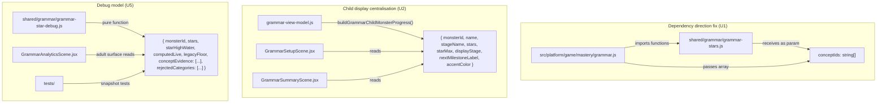

# Grammar Phase 7 — QoL, Debuggability, Logic Correction & Refactor Hardening

## Overview

Phase 7 is a **quality and trust consolidation phase** — no new content, no new modes, no new child economies. It answers one question: can a developer, adult reviewer, or future agent understand exactly why Grammar showed a child a given status, Star count, dashboard action, repair path, or reward event — and can the repo prove those flows remain correct under refresh, concurrency, seeded browser state, legacy migration, and UI copy drift?

All 33 inherited invariants (P4:12, P5:15, P6:6) remain enforced. The user's explicit constraint is **no regression**.

---

## Problem Frame

Phase 5 simplified the child's Grammar dashboard to one CTA and a universal 100-Star evidence curve. Phase 6 made Stars trustworthy by closing six confirmed Star pipeline defects (production shape, variedPractice, temporal retention, sub-secure persistence, Egg persistence, dashboard data path).

But eight verified gaps remain in the current codebase:

1. The child summary still shows raw `mastered/total` concept counts, not Stars.
2. Writing Try availability is gated on `aiEnrichment.enabled`, hiding a non-AI feature when AI is off.
3. The Grammar Bank "Due" filter matches `needs-repair || building`, not schedule-true due status.
4. The adult analytics panel labels active creature routes as "Reserved reward routes".
5. The shared Star module (`shared/grammar/grammar-stars.js`) imports concept data from `src/platform/game/mastery/grammar.js` — a shared→platform dependency violation.
6. Star evidence is persisted as a high-water integer with no tier-level explanation.
7. No Playwright state-seeding infrastructure exists for post-session Star transition tests.
8. No concurrency test exists for simultaneous/replayed answer submissions.

These eight gaps are confirmed by direct code inspection (see Context & Research). Phase 7 closes all of them.

---

## Requirements Trace

- R1. Child summary monster progress uses Stars, not raw concept counts (origin §5.1, §3.6)
- R2. Writing Try availability decoupled from AI capability (origin §3.4, §5.2)
- R3. Grammar Bank "Due" filter is schedule-true or renamed to child-safe label (origin §3.3, §5.3)
- R4. Adult analytics route panel copy corrected from "Reserved reward routes" (origin §5.4, §4.1)
- R5. Confidence label fallback is honest — unknown labels do not silently display as "Learning" (origin §3.5)
- R6. Shared Grammar Star module dependency direction corrected (origin §5.5, §7.1)
- R7. Centralised child-facing monster progress display model (origin §7.2)
- R8. Star Debug Model — adult/admin/debug surface explaining any monster's Star count (origin §4.2, §6.1)
- R9. Command/reward trace model for developer tracing (origin §4.3, §6.2)
- R10. Event id determinism and correlation improved (origin §6.3)
- R11. Playwright state-seeding infrastructure for browser tests (origin §6.4)
- R12. Concurrency and replay test contract (origin §6.5)
- R13. Centralised status/filter semantics (origin §7.3)
- R14. Stage/displayStage divergence controlled — child UI consumes Star fields only (origin §5.8)
- R15. No Phase 4/5/6 invariant weakened (origin §1.2, §8)
- R16. No contentReleaseId bump (origin §1.2)
- R17. Debug surfaces are adult/admin/test-only — no debug terms on child surfaces (origin §4.4, §1.2)

---

## Scope Boundaries

- No new Grammar templates, modes, monsters, or child economies
- No `GRAMMAR_CONTENT_RELEASE_ID` bump
- No answer-spec migration (deferred to P8/P7B per origin §11)
- No Hero writes — Hero remains read-only relative to Grammar Stars (origin §7.5)
- No expansion of the 18-concept denominator
- No debug panel visible to children by default

### Deferred to Follow-Up Work

- Content expansion for thin-pool concepts (`active_passive`, `subject_object`): separate content/release-id phase (P8/P7B)
- Answer-spec migration: separate content/release-id phase (P8/P7B)
- Centralised `mergeMonotonicDisplay` helper across subjects: cross-subject refactor (future)
- Persistent tier-level Star evidence ledger beyond `starHighWater` and rolling window (origin §5.6): U5 addresses debug display and explanation; persisting a durable tier ledger to survive unbounded `recentAttempts` rollover is deferred to P8. The debug model will report when evidence is no longer explainable from the bounded read model.
- Recording the exact timestamp when a concept first becomes secure (origin §5.7): U5 exposes the current `securedAtTs` estimate and its confidence in debug output; recording the actual first-secure timestamp requires an engine-level change deferred to P8

---

## Context & Research

### Relevant Code and Patterns

**Confirmed logic gaps (code evidence):**

| Gap | File | Line(s) | Evidence |
|-----|------|---------|----------|
| Summary uses `mastered/total` | `src/subjects/grammar/components/GrammarSummaryScene.jsx` | 39 | `{monster.mastered}/{monster.total}` |
| Summary model builds raw counts | `src/subjects/grammar/components/grammar-view-model.js` | 723–738 | `masteredSummaryFromReward()` returns `{ mastered, total }` |
| Writing Try gated on AI | `src/subjects/grammar/components/grammar-view-model.js` | 561 | `writingTryAvailable: aiEnabled` |
| Due filter is confidence-based | `src/subjects/grammar/components/grammar-view-model.js` | 443 | `return label === 'needs-repair' \|\| label === 'building'` |
| "Reserved reward routes" | `src/subjects/grammar/components/GrammarAnalyticsScene.jsx` | 218 | `<div className="eyebrow">Reserved reward routes</div>` |
| Confidence fallback to 'Learning' | `src/subjects/grammar/components/grammar-view-model.js` | 395 | `if (!isGrammarConfidenceLabel(label)) return 'Learning'` |
| Shared→platform import | `shared/grammar/grammar-stars.js` | 19–22 | Imports `GRAMMAR_MONSTER_CONCEPTS`, `GRAMMAR_AGGREGATE_CONCEPTS` from `src/platform/game/mastery/grammar.js` |
| No state-seeding infra | N/A | N/A | `seedLearnerState` / `seedState` grep returns 0 matches in test infrastructure |

**Architecture layers involved:**

| Layer | Key files |
|-------|-----------|
| Shared pure module | `shared/grammar/grammar-stars.js`, `shared/grammar/confidence.js` |
| Platform mastery | `src/platform/game/mastery/grammar.js`, `src/platform/game/mastery/shared.js`, `src/platform/game/mastery/grammar-stars.js` (re-export) |
| Client view-model | `src/subjects/grammar/components/grammar-view-model.js` |
| Client components | `GrammarSetupScene.jsx`, `GrammarSummaryScene.jsx`, `GrammarAnalyticsScene.jsx` |
| Worker commands | `worker/src/subjects/grammar/commands.js` |
| Event hooks | `src/subjects/grammar/event-hooks.js` |
| Test invariants | `tests/grammar-phase5-invariants.test.js`, `tests/grammar-concordium-invariant.test.js` |
| Playwright | `tests/playwright/grammar-golden-path.playwright.test.mjs` |

### Institutional Learnings

- **Characterisation-first, always** (P3 convergent sprint patterns): lock current behaviour as test fixtures before writing production code. P7 must characterise all Grammar display paths before touching shared modules.
- **Vacuous-truth guard** (P3 patterns): any test using `.every()`, `.some()`, `.filter().length` must assert `array.length > 0` first.
- **Monster-targeted latch** (P6): never broadcast `computedStars` to multiple monsters — Concordium inflation bug was HIGH severity.
- **Dashboard data paths must match production shape** (P6): test with production-faithful snapshots, not hand-flattened fixtures.
- **D1 atomicity** (institutional memory): `withTransaction` is a production no-op. Any new multi-statement mutation must use `batch(db, [stmts])`.
- **Client bundle audit** (institutional memory): the audit checks esbuild `inputs` graph. Restructured shared modules must not accidentally pull heavy datasets into client bundles.
- **`firstAttemptIndependent` is the sole independent-evidence gate** (P5): do not use `supportLevelAtScoring === 0` as proxy.

### External References

Not gathered — local patterns are well-established across 6 prior Grammar phases. No new external dependencies or unfamiliar technology layers.

---

## Key Technical Decisions

- **Concept-to-monster data stays in `src/platform/game/mastery/grammar.js`; Star computation receives it as a plain array parameter**: rather than moving the concept arrays to `shared/`, `computeGrammarMonsterStars` receives a `conceptIds: string[]` array parameter instead of calling the internal `conceptIdsForMonster` closure. Both real call sites (`progressForGrammarMonster` and `deriveStarEvidenceEvents`) already construct the concept ID array inline — they pass it through. `buildGrammarMonsterStripModel` delegates to `progressForGrammarMonster` so needs no change. This breaks the shared→platform dependency while keeping the concept mapping in its canonical location. The re-export at `src/platform/game/mastery/grammar-stars.js` remains for backward compat.
- **Summary monster progress switches to Star-based display model**: `grammarSummaryCards` will use `buildGrammarMonsterStripModel` (or the new centralised helper) instead of `masteredSummaryFromReward`.
- **"Due" filter renamed to "Practise next"**: the filter semantics remain `needs-repair || building` but the child-facing label changes to be honest per origin §3.3 ("Practise next" is one of the two origin-approved alternatives). Schedule-true due requires Worker scheduling data that the Grammar Bank currently lacks; renaming is less risky than wiring new scheduling signals.
- **Star Debug Model is a pure function returning a serialisable object**: lives in `shared/grammar/grammar-star-debug.js`, importable by tests and adult/admin surfaces. Never exposes answer content.
- **Command trace model is a test helper / debug payload, not a production API**: lives in test helpers or behind a debug flag. No new HTTP endpoint.
- **Playwright state seeding via a test-only Worker command**: a `seed-grammar-state` command, only available when `process.env.NODE_ENV === 'test'` or a test flag is active, that writes a deterministic Grammar state for browser tests.

---

## Open Questions

### Resolved During Planning

- **Should "Due" filter become schedule-true or be renamed?** Resolved: rename to "Practise next" (one of two origin-approved alternatives per §3.3). Schedule-true requires Worker scheduling signals not currently exposed to the Grammar Bank view model. Renaming is the safer and more honest path.
- **Where should concept-to-monster data live after the dependency fix?** Resolved: it stays in `src/platform/game/mastery/grammar.js`. The shared Star module receives the mapping as a parameter instead of importing it directly.
- **Should the Star Debug Model be a new file or extend `grammar-stars.js`?** Resolved: new file `shared/grammar/grammar-star-debug.js`. The debug model is substantially more complex than the derivation functions and would bloat the production-critical module.

### Deferred to Implementation

- Whether `seed-grammar-state` uses D1 batch or direct state writes — depends on the state seeding approach chosen at implementation time
- Exact structure of the command trace model — depends on what data is cheaply available at the command handler boundary without production overhead

---

## High-Level Technical Design

> *This illustrates the intended approach and is directional guidance for review, not implementation specification. The implementing agent should treat it as context, not code to reproduce.*



---

## Implementation Units

- U1. **Extract concept-to-monster data dependency from shared Star module**

**Goal:** Break the `shared/grammar/grammar-stars.js` → `src/platform/game/mastery/grammar.js` import. The shared Star module becomes a genuinely pure module with zero platform imports.

**Requirements:** R6, R15

**Dependencies:** None

**Files:**
- Modify: `shared/grammar/grammar-stars.js`
- Modify: `src/platform/game/mastery/grammar.js`
- Modify: `src/platform/game/mastery/grammar-stars.js`
- Modify: `worker/src/subjects/grammar/commands.js`
- Modify: `src/subjects/grammar/components/grammar-view-model.js`
- Test: `tests/grammar-stars.test.js`
- Test: `tests/grammar-phase5-invariants.test.js`

**Approach:**
- Remove the `import { GRAMMAR_MONSTER_CONCEPTS, GRAMMAR_AGGREGATE_CONCEPTS }` from `shared/grammar/grammar-stars.js`
- `computeGrammarMonsterStars(monsterId, conceptEvidenceMap, conceptIds)` receives the concept IDs as a plain `string[]` array (third parameter) instead of calling the internal `conceptIdsForMonster` closure. The internal closure and its `GRAMMAR_MONSTER_CONCEPTS` / `GRAMMAR_AGGREGATE_CONCEPTS` imports are removed.
- The two real call sites already construct the array inline: `progressForGrammarMonster` (line 232–234 of `grammar.js` — ternary on Concordium vs direct) and `deriveStarEvidenceEvents` (line 95–97 of `commands.js` — same pattern). They pass it through. `buildGrammarMonsterStripModel` delegates to `progressForGrammarMonster` and needs no change.
- `deriveGrammarConceptStarEvidence` does not need the concept mapping (it receives `conceptId` directly) — no change needed there

**Execution note:** Start with a characterisation test that locks the current output of all callers before changing any production code.

**Patterns to follow:**
- The existing `nowTs` parameter injection pattern on `deriveGrammarConceptStarEvidence` (P6 U3)

**Test scenarios:**
- Happy path: `computeGrammarMonsterStars('bracehart', evidenceMap, conceptIdsForBracehart)` produces identical output to pre-refactor
- Happy path: `computeGrammarMonsterStars('concordium', evidenceMap, conceptIdsForConcordium)` produces identical output
- Edge case: missing or empty conceptIds function returns 0 Stars gracefully
- Edge case: all existing tests in `grammar-stars.test.js`, `grammar-star-e2e.test.js`, `grammar-star-trust-contract.test.js` continue passing unchanged
- Integration: `npm run audit:client` passes — no new platform imports leak into shared module's input graph

**Verification:**
- `shared/grammar/grammar-stars.js` has zero imports from `src/`
- All 246+ Grammar Star tests pass
- `npm run audit:client` passes

---

- U2. **Centralise child-facing monster progress display model**

**Goal:** One helper builds the Grammar monster display shape for child surfaces. Dashboard strip and summary both consume it. No raw `mastered/total` concept counts appear on child surfaces.

**Requirements:** R1, R7, R14, R15

**Dependencies:** U1

**Files:**
- Modify: `src/subjects/grammar/components/grammar-view-model.js`
- Modify: `src/subjects/grammar/components/GrammarSummaryScene.jsx`
- Test: `tests/grammar-ui-model.test.js`

**Approach:**
- Replace `masteredSummaryFromReward()` with a call to `buildGrammarMonsterStripModel()` (or a new thin wrapper if summary needs a slightly different shape)
- `grammarSummaryCards` monster-progress card value becomes the Star-based monster strip entries
- `GrammarSummaryScene.jsx` renders `{monster.stars} / {monster.starMax} Stars` instead of `{monster.mastered}/{monster.total}`
- `concordiumProgress` legacy shape preserved for backward compat but gated away from child-facing render paths
- Adult analytics route panel continues to use `progressForGrammarMonster` with its richer shape — no change there

**Patterns to follow:**
- The existing `buildGrammarMonsterStripModel` pattern in the dashboard view model (P5 U7/U10)

**Test scenarios:**
- Happy path: summary monster-progress card shows `stageName` and `X / 100 Stars` for each active monster
- Happy path: fresh learner summary shows `0 / 100 Stars` with `Not found yet` stage
- Happy path: 42-Star Bracehart summary shows `Hatched — 42 / 100 Stars`
- Edge case: null/missing rewardState produces safe empty entries (0 Stars, Not found yet)
- Edge case: Concordium at 100 Stars shows `Mega — 100 / 100 Stars`
- Integration: no raw `mastered/total` renders on child summary (absence assertion)
- Covers origin §3.6. Summary matches dashboard semantics

**Verification:**
- Summary monster progress card uses Stars for all 4 active monsters
- No raw concept-count display on child summary surface
- Existing summary tests updated and passing

---

- U3. **Fix Writing Try availability, Due filter, adult route copy, and confidence fallback**

**Goal:** Four small logic corrections in the view model and analytics scene. Each is a 1–5 line change, but they share the same test surface and deployment risk profile.

**Requirements:** R2, R3, R4, R5, R15

**Dependencies:** None (can run parallel with U1)

**Files:**
- Modify: `src/subjects/grammar/components/grammar-view-model.js`
- Modify: `src/subjects/grammar/components/GrammarAnalyticsScene.jsx`
- Test: `tests/grammar-ui-model.test.js`
- Test: `tests/grammar-phase3-child-copy.test.js`

**Approach:**
- **Writing Try**: `writingTryAvailable` derives from transfer-lane readiness instead of `aiEnrichment.enabled`. The simplest honest implementation: `writingTryAvailable: true` (Writing Try is always structurally available — the transfer scene handles empty prompts gracefully without crashing). **UX note for implementer:** on a pristine learner before any command round-trip, the transfer lane has zero prompts. Tapping Writing Try shows an empty prompt selector. This is pre-existing behaviour unrelated to the AI decoupling — the prompt catalogue populates after the first `primeGrammarReadModel` call. If the implementer wants to improve this, a `hasTransferPrompts` check could gate visibility, but that is a polish item beyond R2's scope.
- **Due filter**: rename `GRAMMAR_BANK_STATUS_CHIPS` entry from `{ id: 'due', label: 'Due' }` to `{ id: 'due', label: 'Practise next' }`. The filter logic in `grammarBankFilterMatchesStatus` stays as `needs-repair || building` — the semantics are correct for "concepts worth reviewing", just not for the word "Due"
- **Adult route copy**: change `"Reserved reward routes"` eyebrow in `GrammarAnalyticsScene.jsx` to `"Grammar creature routes"` (reflects the 3+1 active model)
- **Confidence fallback**: change `grammarChildConfidenceLabel` fallback from `'Learning'` to `'Check status'` for unknown labels; add a console.warn in test/dev mode

**Patterns to follow:**
- Frozen option list mutation pattern: update the frozen object literal in `GRAMMAR_BANK_STATUS_CHIPS`
- `isGrammarChildCopy` forbidden-term check already covers "Reserved reward routes"

**Test scenarios:**
- Happy path: `buildGrammarDashboardModel` with `aiEnrichment.enabled: false` returns `writingTryAvailable: true`
- Happy path: `buildGrammarDashboardModel` with `aiEnrichment.enabled: true` returns `writingTryAvailable: true`
- Happy path: `buildGrammarDashboardModel` with no capabilities at all returns `writingTryAvailable: true`
- Happy path: `GRAMMAR_BANK_STATUS_CHIPS` "due" entry has label `'Practise next'`
- Happy path: `grammarBankFilterMatchesStatus('due', 'building')` still returns true
- Happy path: `grammarChildConfidenceLabel({ label: 'not-a-label' })` returns `'Check status'`
- Happy path: `grammarChildConfidenceLabel({ label: 'building' })` returns `'Learning'` (unchanged)
- Edge case: `grammarChildConfidenceLabel({})` returns `'Check status'`
- Edge case: `grammarChildConfidenceLabel(undefined)` returns `'Check status'`
- Integration: `GrammarAnalyticsScene` renders `"Grammar creature routes"`, not `"Reserved reward routes"`
- Integration: child-copy forbidden-term sweep passes (no new forbidden terms)
- Covers origin §3.3. Due means due (or is renamed)
- Covers origin §3.4. Writing Try availability does not depend on AI
- Covers origin §5.4. Adult route copy reflects active model

**Verification:**
- Writing Try visible on dashboard when AI is disabled
- "Due" chip reads "Practise next" in Grammar Bank
- Adult analytics says "Grammar creature routes"
- Unknown confidence label returns honest fallback
- All existing child-copy tests pass

---

- U4. **Phase 7 invariants and ratchet pins**

**Goal:** Extend the invariant framework with P7-specific pins that can be cited by reviewers and enforced by CI.

**Requirements:** R15, R16, R17

**Dependencies:** U2, U3

**Files:**
- Create: `docs/plans/james/grammar/grammar-phase7-invariants.md`
- Modify: `tests/grammar-phase5-invariants.test.js`
- Test: `tests/grammar-phase5-invariants.test.js`

**Approach:**
- Add P7 invariants as addendum to the chain (P4→P5→P6→P7)
- Required pins per origin §9.1:
  - child summary monster progress is Star-based (U2 output)
  - Writing Try availability does not depend on AI (U3 output)
  - Due filter is renamed or schedule-true (U3 output)
  - debug surfaces are adult/admin/test-only
  - shared dependency direction is acyclic (U1 output)
  - no child surface uses legacy `stage` for Grammar monster display
- The "Star debug model redacts answer content" pin is deferred to U5's own verification — U4 cannot enforce it before U5 lands

**Patterns to follow:**
- `grammar-phase6-invariants.md` format (YAML frontmatter, per-invariant §, enforcing test refs)
- `grammar-phase5-invariants.test.js` pin assertion pattern

**Test scenarios:**
- Happy path: each pin passes against current main + U1–U3 changes
- Edge case: pin assertions fail if the protected invariant is violated (negative test via fixture)
- Happy path: no contentReleaseId bump across all P7 files (grep assertion)

**Verification:**
- `grammar-phase7-invariants.md` locked with enforcing test references
- All P4+P5+P6+P7 invariant tests pass

---

- U5. **Star Debug Model — redacted tier-level explanation**

**Goal:** A pure, serialisable model that answers "why does this monster show 42 Stars?" without exposing answer content.

**Requirements:** R8, R17

**Dependencies:** U1

**Files:**
- Create: `shared/grammar/grammar-star-debug.js`
- Create: `tests/grammar-star-debug.test.js`

**Approach:**
- `buildGrammarStarDebugModel({ monsterId, conceptNodes, recentAttempts, rewardEntry, nowTs })` returns:
  ```
  {
    monsterId, name, displayStars, starHighWater, computedLiveStars,
    legacyFloor, stageName, nextMilestone,
    source: 'live' | 'highWater' | 'legacyFloor',
    conceptEvidence: [{ conceptId, tiers: { firstIndependentWin, ... }, starsContributed }],
    rejectedCategories: ['wrong_answer', 'supported_attempt', 'pre_secure_correct', ...],
    warnings: ['rolling window may have truncated older evidence', ...]
  }
  ```
- Redaction contract: the model never includes `correctAnswer`, `acceptedAnswers`, `templateClosure`, `aiPrompt`, `aiOutput`, or `reviewCopy`
- The function calls `deriveGrammarConceptStarEvidence` per concept (the existing function) and wraps the results with display metadata
- When `computedLiveStars < starHighWater`, add a warning explaining the high-water was earned earlier
- For concepts with `retainedAfterSecure`, include the `securedAtTs` estimate and a note that it is an approximation derived from `nowTs - intervalDays * dayMs` (origin §5.7). This makes the estimate visible to debuggers without changing the engine.

**Patterns to follow:**
- Hero P0 three-layer architecture: pure layer (zero Worker/React imports) → Worker integration → boundary proof tests

**Test scenarios:**
- Happy path: fresh learner returns 0 Stars, source 'live', empty conceptEvidence
- Happy path: 42-Star Bracehart returns correct per-concept tier breakdown
- Happy path: Concordium at Mega returns all 18 concepts with all 5 tiers true
- Happy path: legacy learner with starHighWater=35 but computedStars=12 returns source 'highWater' with warning
- Edge case: missing conceptNodes returns source 'highWater' (no live derivation available)
- Edge case: missing rewardEntry returns displayStars=0 from live derivation only
- Absence: output never contains `correctAnswer`, `acceptedAnswers`, `templateClosure`, `aiPrompt`, `aiOutput`
- Absence: output never contains raw attempt objects (only aggregated tier booleans)
- Happy path: concept with `retainedAfterSecure` includes `securedAtEstimate` timestamp and `estimateMethod: 'intervalDays'` annotation

**Verification:**
- Redaction contract holds under snapshot test
- All existing Star tests unaffected
- No `src/` imports in `shared/grammar/grammar-star-debug.js`

---

- U6. **Command trace model for developer debugging**

**Goal:** A structured trace that shows how a Grammar command changed state, events, and projections. Test helper and debug payload — not a production API.

**Requirements:** R9, R10, R17

**Dependencies:** U1

**Files:**
- Create: `tests/helpers/grammar-command-trace.js`
- Create: `tests/grammar-command-trace.test.js`
- Modify: `worker/src/subjects/grammar/commands.js`

**Approach:**
- The trace model wraps the command handler's existing data flow:
  ```
  {
    commandName, requestId, learnerId, subjectId: 'grammar',
    beforeRevision, afterRevision,
    domainEvents: [{ type, conceptId, ... }],
    starEvidenceEvents: [{ type, monsterId, computedStars, previousStarHighWater }],
    rewardEvents: [{ type, monsterId, transition }],
    readModelChanged: boolean,
    projectionStateChanged: boolean,
    isNoOp: boolean
  }
  ```
- **Event id determinism** (R10): change the `star-evidence-updated` event id from `grammar.star-evidence.${learnerId}.${monsterId}.${Date.now()}` to incorporate stable data: `grammar.star-evidence.${learnerId}.${monsterId}.${requestId}.${computedStars}`. This makes the same command replay produce the same event id.
- The trace model is built inside a test helper wrapper that calls the command handler and captures before/after snapshots. No production overhead — the trace is only constructed when the helper is used.

**Patterns to follow:**
- Hero P0 structural boundary tests (import-graph scanning for forbidden dependencies)

**Test scenarios:**
- Happy path: `submit-answer` command trace shows domainEvents including `answer-submitted` and `star-evidence-updated`
- Happy path: `start-session` command trace shows `isNoOp: false` and session-related domain events
- Happy path: `save-prefs` command trace shows `isNoOp: false` with no star events
- Edge case: no-op command (e.g. duplicate `save-prefs`) returns `isNoOp: true`
- Edge case: command with no star events (no concept affected) returns empty `starEvidenceEvents`
- Integration: event id for `star-evidence-updated` is deterministic given the same requestId
- Integration: duplicate submission with same requestId produces identical event id (idempotent)
- Absence: trace model never exposes answer content, template closures, or AI internals

**Verification:**
- Trace helper usable in any Grammar command test
- Event ids are deterministic and replay-safe
- No production performance overhead (trace only constructed in test paths)

---

- U7. **Playwright state-seeding infrastructure**

**Goal:** A test-only mechanism to create deterministic Grammar states for browser tests, enabling post-session Star transition visual testing.

**Requirements:** R11, R17

**Dependencies:** U1, U4

**Files:**
- Create: `tests/helpers/grammar-state-seed.js`
- Create: `tests/playwright/grammar-state-seed.playwright.test.mjs`
- Modify: `tests/playwright/grammar-golden-path.playwright.test.mjs`

**Approach:**
- **No existing state-injection mechanism exists** — the Playwright `shared.mjs` helper only mints fresh demo accounts via `/demo` cookie navigation. P7 must build the entire seeding pipeline from scratch.
- The seeding mechanism builds a complete Grammar read-model + reward state for a given scenario. Injection approach (to be determined at implementation): either a test-only Worker command (`seed-grammar-state`, environment-guarded) or client-side state injection via `page.evaluate()` against the app store after the demo session mounts.
- Seed scenarios per origin §6.4:
  - fresh learner (0 Stars everywhere)
  - 1-Star Egg (Bracehart has 1 Star from a single firstIndependentWin)
  - 14 Stars, one before Hatch
  - 34 Stars, one before Growing
  - 64 Stars, one before Nearly Mega
  - 99 Stars, one before Mega
  - 17/18 Concordium secured (Concordium regression testing)
  - Writing Try evidence state
  - weak/due concept state
- Each seed is a frozen fixture object that includes the minimal state needed: `rewardState` (monster entries with `starHighWater`, `mastered`, `caught`), `analytics` (concept nodes, recentAttempts), and `progressSnapshot`
- The seed function validates its own output shape against the existing `normaliseGrammarReadModel` contract
- **Environment guard**: seed fixtures are only importable from test paths. The `npm run audit:client` input-graph check ensures they cannot leak into production bundles.

**Execution note:** Start with the seed fixture helper and one basic Playwright test (fresh learner renders correctly with seeded state). Expand to threshold transitions after the mechanism is proven.

**Patterns to follow:**
- Existing `tests/fixtures/grammar-phase4-baseline.json` frozen fixture pattern
- Existing Playwright demo session pattern in `tests/playwright/shared.mjs`

**Test scenarios:**
- Happy path: seeded fresh-learner state renders 4 monsters at 0 Stars
- Happy path: seeded 1-Star Egg state shows Egg stage for Bracehart
- Happy path: seeded 14→15 Star state transitions to Hatched after one more answer
- Happy path: seeded 99→100 Star state transitions to Mega
- Happy path: seeded 17/18 Concordium state shows correct aggregate progress
- Edge case: seed fixtures pass `normaliseGrammarReadModel` validation
- Absence: seed fixtures do not appear in `npm run audit:client` input graph

**Verification:**
- At least 5 seeded Playwright scenarios pass
- Seed fixtures are environment-guarded
- `npm run audit:client` passes

---

- U8. **Concurrency and replay test contract**

**Goal:** Prove that concurrent or replayed answer submissions cannot double-award, regress, corrupt, or show contradictory child state.

**Requirements:** R12, R15

**Dependencies:** U1, U6

**Files:**
- Create: `tests/grammar-concurrency-contract.test.js`

**Approach:**
- Test scenarios exercised at the command handler level (not HTTP — the concurrency contract is about the command pipeline's idempotency, not the network layer):
  - Two answer submissions with the same requestId → same result, no duplicate star events
  - Two different answers for the same item arriving in sequence → second is rejected or reconciled per Worker command contracts
  - `star-evidence-updated` and `concept-secured` events arriving in either order → reward projection produces same final state
  - Reward projection seeing duplicate events → no double-award
  - Command replay returns the same result without extra reward toasts
  - Stale learner revision → rejection per existing Worker revision checks
- Use the command trace helper (U6) to inspect event streams
- **Hard prerequisite:** U6 makes event ids deterministic (incorporating `requestId` instead of `Date.now()`). Without this, the current grammar pipeline produces different event ids for the same logical submission on each call, so idempotency assertions are impossible. U6 must land before U8 can test replay idempotency.
- The contract is: **the system cannot double-award, regress, corrupt, or show contradictory child state** — not that every concurrent request succeeds

**Patterns to follow:**
- `grammar-star-trust-contract.test.js` production-shape test pattern
- `grammar-concordium-invariant.test.js` 200-random-sequence ratchet pattern

**Test scenarios:**
- Happy path: single answer → correct star-evidence-updated event with deterministic id
- Concurrency: same requestId submitted twice → identical output, single star event set
- Concurrency: `star-evidence-updated` before `concept-secured` → same final reward state as reverse order
- Concurrency: reward projection receives duplicate `star-evidence-updated` → starHighWater does not double-increment
- Concurrency: stale revision answer → rejected by Worker revision check
- Edge case: rapid sequential answers on different concepts for same monster → Stars increase monotonically
- Ratchet: 100 random command sequences with varying interleaving → Stars never decrease, caught never reverts

**Verification:**
- All concurrency scenarios pass
- No double-award detected in any test
- Monotonicity preserved under random interleaving

---

- U9. **Centralise status/filter semantics**

**Goal:** Grammar Bank filters, dashboard today cards, adult diagnostics, and Hero provider reasoning share a single status/filter contract.

**Requirements:** R13

**Dependencies:** U3

**Files:**
- Create: `shared/grammar/grammar-status.js`
- Modify: `src/subjects/grammar/components/grammar-view-model.js`
- Test: `tests/grammar-status-semantics.test.js`

**Approach:**
- `shared/grammar/grammar-status.js` defines the canonical status taxonomy (5 active labels):
  - `needs-repair` / trouble: confidence has regressed
  - `building` / learning: actively growing
  - `consolidating` / nearly-secure: approaching secure
  - `secure`: secured
  - `emerging` / new: not yet introduced
- A future `schedule-due` label is reserved in comments but not wired (requires Worker scheduling signals not yet exposed to the client)
- Each status entry carries: `internalLabel`, `childLabel`, `childTone`, `isChildCopy: boolean`
- `grammarBankFilterMatchesStatus` and `grammarChildConfidenceLabel` both delegate to this shared contract
- Adult surfaces continue to show the internal label directly

**Patterns to follow:**
- `shared/grammar/confidence.js` pattern (pure shared module, no platform imports)

**Test scenarios:**
- Happy path: every internal label maps to exactly one child label
- Happy path: `grammarBankFilterMatchesStatus` produces identical results to pre-refactor for all label × filter combinations
- Edge case: unknown internal label maps to honest fallback ('Check status')
- Edge case: `isChildCopy` is false for 'needs-repair' (the internal label is not child-safe)
- Integration: Grammar Bank filter behaviour unchanged after refactor
- Drift guard: status taxonomy array length is pinned (currently 5 labels)

**Verification:**
- All Grammar Bank tests pass unchanged
- Status taxonomy is a single source of truth
- No child surface renders an internal label directly

---

- U10. **Adult Star explanation surface + analytics copy cleanup**

**Goal:** Wire the Star Debug Model (U5) into the adult analytics scene. Clean up remaining analytics copy issues ("Evidence snapshot" eyebrow, "Stage 1" chip, "Bellstorm bridge" heading).

**Requirements:** R8, R4, R17

**Dependencies:** U4, U5

**Files:**
- Modify: `src/subjects/grammar/components/GrammarAnalyticsScene.jsx`
- Test: `tests/react-grammar-surface.test.js`

**Approach:**
- Add a collapsible "Star explanation" section to the analytics scene that renders `buildGrammarStarDebugModel` output for each active monster
- Clean up analytics copy:
  - "Evidence snapshot" → "Grammar progress" (the eyebrow is seen by adults but not children; still, "Evidence snapshot" is in the forbidden-terms list)
  - "Stage 1" chip → remove or replace with current release label
  - "Bellstorm bridge" heading is informational and not in the forbidden-terms list — keep as-is (it's adult-only and accurately describes the cross-subject relationship)
- The Star explanation section is collapsed by default (details/summary element) so it doesn't overwhelm parents who just want the simple view

**Patterns to follow:**
- Existing `AdultConfidenceChip` componentisation pattern
- `GrammarAnalyticsScene.jsx` section layout (eyebrow → heading → content)

**Test scenarios:**
- Happy path: Star explanation section renders per-monster entries with Stars, stageName, source
- Happy path: collapsed by default — summary text visible, details hidden
- Happy path: expanding shows per-concept tier breakdown
- Absence: Star explanation never renders `correctAnswer`, `acceptedAnswers`, `templateClosure`
- Integration: "Evidence snapshot" eyebrow replaced
- Integration: "Stage 1" chip replaced
- Integration: forbidden-term sweep passes

**Verification:**
- Adult can explain any Grammar monster's Star count from the analytics scene
- No forbidden terms on any surface
- Analytics scene renders cleanly on desktop and mobile viewports

---

- U11. **Seeded Playwright browser tests for Star threshold transitions**

**Goal:** Visual regression tests for 0→1, 14→15, 34→35, 64→65, 99→100 Star transitions, plus summary Star display and Writing Try availability.

**Requirements:** R11, R2

**Dependencies:** U2, U3, U7

**Files:**
- Modify: `tests/playwright/grammar-state-seed.playwright.test.mjs`
- Modify: `tests/playwright/grammar-golden-path.playwright.test.mjs`

**Approach:**
- Each threshold test:
  1. Seeds a state at threshold−1 Stars
  2. Renders the dashboard, asserts pre-transition stage
  3. Simulates one answer submission that crosses the threshold
  4. Asserts the new stage label and Star count on the dashboard
- Additional Playwright tests:
  - Summary displays Star-based monster progress (not raw counts)
  - Writing Try visible when AI is disabled
  - Fresh learner dashboard is calm and one-CTA

**Patterns to follow:**
- `grammar-golden-path.playwright.test.mjs` existing test structure

**Test scenarios:**
- Happy path: 0→1 Star Egg visual transition (monster image changes, Egg label appears)
- Happy path: 14→15 Star Hatch visual transition
- Happy path: 34→35 Star Growing visual transition
- Happy path: 64→65 Star Nearly Mega visual transition
- Happy path: 99→100 Star Mega visual transition and celebration
- Happy path: summary renders Star-based monster progress
- Happy path: Writing Try visible with AI disabled
- Happy path: fresh learner dashboard shows one CTA, calm layout

**Verification:**
- All 8 Playwright scenarios pass
- Visual stage transitions are correct at each threshold

---

- U12. **Drift guards and release validation**

**Goal:** Add or strengthen drift guards per origin §9.5, and run the full release validation gate per origin §10.

**Requirements:** R15, R16

**Dependencies:** U1–U11

**Files:**
- Modify: `tests/grammar-phase5-invariants.test.js`
- Modify: `tests/grammar-stars-drift-guard.test.js`

**Approach:**
- Add/strengthen drift guards for:
  - Active Grammar monster roster (still 4: 3 direct + Concordium)
  - Concept-to-monster mapping (still 18 concepts across 3 clusters + 5 punctuation-for-grammar)
  - Star thresholds and weights (unchanged)
  - Child forbidden terms (no new terms leaked)
  - Debug-only imports not leaking into production child bundles (`npm run audit:client`)
  - Shared/platform dependency direction (`shared/grammar/grammar-stars.js` has zero `src/` imports)
- Run the full release gate:
  - `npm test`
  - `npm run check`
  - `npm run audit:client`
  - `npm run audit:production`
  - Grammar Playwright passing
  - No `GRAMMAR_CONTENT_RELEASE_ID` bump (grep assertion)

**Patterns to follow:**
- Existing `grammar-stars-drift-guard.test.js` pin pattern
- `grammar-phase5-invariants.test.js` grep-based assertions

**Test scenarios:**
- Happy path: all drift guard pins hold
- Happy path: `npm run audit:client` passes
- Happy path: no `GRAMMAR_CONTENT_RELEASE_ID` change across P7 files
- Happy path: shared Star module has zero `src/` imports
- Edge case: drift guard fails if roster changes (deliberate negative assertion)

**Verification:**
- Full `npm test` passing
- Full audit suite passing
- Grammar Playwright passing
- No contentReleaseId bump
- No new child-facing forbidden terms
- No Hero write boundary regression
- No Writing Try scoring/reward mutation

---

## System-Wide Impact

- **Interaction graph:** The dependency direction fix (U1) changes import paths for `commands.js`, `grammar-view-model.js`, and `mastery/grammar.js`. All three already import from `grammar-stars.js` — the change is parameter injection, not new imports.
- **Error propagation:** No new error paths. The Star Debug Model returns safe empty shapes on missing data rather than throwing.
- **State lifecycle risks:** The Playwright state-seeding (U7) creates test-only state — environment-guarded to prevent production use. No production state mutation changes.
- **API surface parity:** Punctuation uses a parallel Star system. Grammar P7 does not change the shared patterns — Punctuation adoption of any P7 patterns would be a separate future effort.
- **Integration coverage:** U8 (concurrency contract) tests the cross-layer interaction between command handler → star-evidence events → reward projection → read model. Unit tests alone cannot prove this pipeline is idempotent.
- **Unchanged invariants:** All 33 P4+P5+P6 invariants preserved. The 100-Star scale, evidence tiers, starHighWater latch, monotonicity guarantee, Concordium-never-revoked, Grand Concordium timeline, and contentReleaseId freeze all remain enforced with zero weakening.

---

## Risks & Dependencies

| Risk | Mitigation |
|------|------------|
| U1 dependency refactor breaks an import path not covered by tests | Characterisation-first: lock all caller outputs before changing production code. Run `npm run audit:client` and `npm run audit:production` after every change. |
| U2 summary Star display shows incorrect values for legacy learners | The `starHighWater` latch already handles legacy learners at the read path. Summary now consumes the same `progressForGrammarMonster` output as the dashboard — which already handles legacy migration. |
| U3 "Practise next" rename confuses existing users | The label is more honest than "Due" for a confidence-based filter, and is one of the two origin-approved alternatives (origin §3.3). The filter behaviour is unchanged — only the child-facing copy changes. |
| U7 Playwright state-seeding leaks into production | Environment guard + `npm run audit:client` input-graph check. Seeds are only importable from test paths. |
| U8 concurrency tests are flaky due to timing | Tests exercise the command pipeline synchronously, not via HTTP. No real concurrency — the contract is about idempotency of the pipeline given interleaved inputs. |
| U10 analytics copy changes break existing Playwright tests | Existing Playwright tests check for "Grammar Bank" round-trip and "Smart Practice" CTA, not for the adult analytics eyebrow text. Low risk. |

---

## Sources & References

- **Origin document:** [docs/plans/james/grammar/grammar-p7.md](docs/plans/james/grammar/grammar-p7.md)
- **Phase 4 invariants:** [docs/plans/james/grammar/grammar-phase4-invariants.md](docs/plans/james/grammar/grammar-phase4-invariants.md)
- **Phase 5 invariants:** [docs/plans/james/grammar/grammar-phase5-invariants.md](docs/plans/james/grammar/grammar-phase5-invariants.md)
- **Phase 6 invariants:** [docs/plans/james/grammar/grammar-phase6-invariants.md](docs/plans/james/grammar/grammar-phase6-invariants.md)
- **Phase 6 implementation report:** [docs/plans/james/grammar/grammar-phase6-implementation-report.md](docs/plans/james/grammar/grammar-phase6-implementation-report.md)
- **P5 architecture pattern:** [docs/solutions/architecture-patterns/grammar-p5-100-star-evidence-curve-and-autonomous-sdlc-2026-04-27.md](docs/solutions/architecture-patterns/grammar-p5-100-star-evidence-curve-and-autonomous-sdlc-2026-04-27.md)
- **P6 trust pattern:** [docs/solutions/architecture-patterns/grammar-p6-star-derivation-trust-and-server-owned-persistence-2026-04-27.md](docs/solutions/architecture-patterns/grammar-p6-star-derivation-trust-and-server-owned-persistence-2026-04-27.md)
- Related code: `shared/grammar/grammar-stars.js`, `src/platform/game/mastery/grammar.js`, `src/subjects/grammar/components/grammar-view-model.js`
