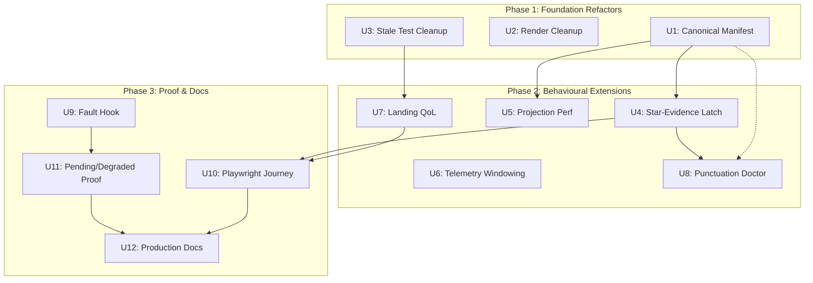

# feat: Punctuation Phase 7 — QoL, debuggability, logic correction, and hardening

## Overview

Phase 7 stabilises Punctuation before any new curriculum or Hero-mode-facing expansion. It makes the reward system debuggable, closes the star-evidence latch gap, bounds projection performance, replaces lifetime telemetry caps with time-windowed policies, proves the full Worker-backed journey, and eliminates constants drift. Every unit is behaviour-preserving unless explicitly correcting a documented bug.

The headline constraint is **no regression** — each unit must prove it does not break existing child-facing behaviour before landing.

---

## Problem Frame

Punctuation shipped a 100-Star evidence model (P5) and monotonic hardening (P6) across 19 PRs. The reward system works, but it is hard to trust, hard to debug, and carries maintenance risks:

1. `starHighWater` only advances on reward-unit mastery events, not on every live Star-evidence increase — a child practising without securing new units sees correct display (via live `max()` merge) but stale toast events.
2. Star projection recomputes O(n) from all attempts on every Worker command — unbounded for long-history learners.
3. Sessionless telemetry kinds (e.g. `card-opened`) hit a lifetime per-learner cap, causing permanent rate-limiting after normal long-term use.
4. `PunctuationSetupScene` emits telemetry and dispatches prefs migration during React render — a concurrent-mode footgun.
5. Client-safe constants are mirrored across 4+ modules with "must stay in lock-step" comments.
6. No dedicated diagnostic surface exists — debugging requires reading raw codex state.
7. The `summary-back-while-pending` journey is skipped because no dev-only fault hook exists.
8. Production docs still contain stale reward-key text.

Phase 7 closes these gaps without adding new skills, modes, monsters, or reward currencies. (see origin: `docs/plans/james/punctuation/punctuation-p7.md`)

---

## Requirements Trace

- R1. Safe Punctuation Doctor diagnostic read model (§5.1)
- R2. Star-evidence latch advances on evidence change, not only unit-secured events (§5.2)
- R3. Projection performance measured and bounded (§5.3)
- R4. Sessionless telemetry caps become time-windowed; event reads auditable (§5.4)
- R5. Full Worker-backed browser journey proof with D1 persistence (§5.5)
- R6. Pending/degraded navigation proven through real fault path (§5.6)
- R7. Landing QoL metric clarified without adding noise (§5.7)
- R8. Stale tests and comments cleaned to current UI semantics (§5.8)
- R9. Client-safe Punctuation manifest has one canonical source with drift tests (§5.9)
- R10. Production docs match current behaviour (§5.10)
- R11. Redaction contract: every new debug/telemetry output passes forbidden-key scan (§6.1)
- R12. Idempotency contract: all new writes safe under retry, two tabs, duplicate replay (§6.2)
- R13. Cache correctness contract: if caching lands, cache = optimisation not second source of truth (§6.3)
- R14. Fault-injection contract: dev-only, impossible to trigger in production (§6.4)
- R15. Refactor safety contract: small, test-backed, behaviour-preserving (§6.5)

**Engineering contract → unit mapping:** R11 (redaction) → U8, U12; R12 (idempotency) → U4, U6; R13 (cache correctness) → U5; R14 (fault-injection) → U9; R15 (refactor safety) → U1, U2, U3. R6 (pending/degraded proof) is satisfied jointly by U9 + U11.

---

## Scope Boundaries

- No new Punctuation skills, practice modes, monsters, or content release id
- No changes to deterministic marking behaviour unless a blocker proves current logic wrong
- No Hero Mode ownership of Punctuation Stars
- No child-facing landing redesign — only QoL clarification
- No Grammar/Punctuation premature unification
- No rewriting the Punctuation engine

### Deferred to Follow-Up Work

- GPS/transfer context integration into Star evidence — future phase
- Pattern-based Star boosts — future phase
- Star economy balancing against Spelling 100-word thresholds — future phase
- Quoral Grand Star backend implementation (shadow display only) — future phase
- Full desktop/tablet Playwright baseline matrix — separate PR after golden path lands

---

## Context & Research

### Relevant Code and Patterns

- `src/subjects/punctuation/star-projection.js` — pure `projectPunctuationStars` with 4 evidence categories (Try/Practice/Secure/Mastery), inlined `SKILL_TO_CLUSTER` and `RU_TO_CLUSTERS` mirrors
- `src/subjects/punctuation/read-model.js` — `buildPunctuationLearnerReadModel`, exports `PUNCTUATION_CLIENT_SKILLS` (14 skills)
- `src/subjects/punctuation/components/punctuation-view-model.js` — `mergeMonotonicDisplay`, dashboard model builder, re-exports cluster/monster constants
- `src/subjects/punctuation/service-contract.js` — `PUNCTUATION_CLIENT_SKILL_IDS`, phases, map filters, `sanitisePunctuationUiOnRehydrate`
- `src/platform/game/mastery/punctuation.js` — `progressForPunctuationMonster`, `recordPunctuationRewardUnitMastery`, starHighWater latch, maxStageEver
- `worker/src/subjects/punctuation/events.js` — telemetry command handler, `countExistingEventsForRateLimit` (per-session when sessionId present, LIFETIME when null)
- `worker/src/subjects/punctuation/read-models.js` — Worker read model, forbidden-key scan, starView wiring
- `src/subjects/grammar/event-hooks.js` — Grammar `star-evidence-updated` event subscriber pattern (template for U4)
- `src/platform/hubs/admin-debug-bundle-panel.js` — admin normaliser pattern (template for U8)
- `tests/helpers/fault-injection.mjs` — dev-only fault hook pattern with `__ks2_injectFault_TESTS_ONLY__` forbidden-text token (template for U9)
- `src/subjects/punctuation/components/PunctuationSetupScene.jsx` — render-time telemetry at mount (useRef guard), render-time prefs migration dispatch (migratedRef guard)

### Institutional Learnings

- `docs/solutions/architecture-patterns/punctuation-p6-star-truth-monotonic-hardening-2026-04-27.md` — 7 patterns: Worker starView delegation, starHighWater latch seeding, grand-threshold dispatch, shared monotonic merge, derived Mega gates, near-retry daily cap, adversarial review discipline
- `docs/solutions/architecture-patterns/grammar-p5-100-star-evidence-curve-and-autonomous-sdlc-2026-04-27.md` — read-time derivation, starHighWater latch, seedStarHighWater from legacy floor (not 0), temporal gates require timestamp proof
- `docs/solutions/architecture-patterns/grammar-p6-star-derivation-trust-and-server-owned-persistence-2026-04-27.md` — `updateGrammarStarHighWater` command-handler subscriber, monster-targeted writes, normalise production data shapes at derivation boundary
- D1 atomicity uses `db.batch()`, not `withTransaction` (production no-op)
- Bundle audit uses seeded-default + path-anchored regex pin pattern; fault-injection token denial proven via forbidden-text list

---

## Key Technical Decisions

- **Canonical manifest as leaf module**: New `src/subjects/punctuation/punctuation-manifest.js` holds all client-safe metadata (skills, clusters, monsters, map filters). Zero imports from read-model, star-projection, or service-contract — breaks the circular dependency that forced inlined mirrors.
- **Star-evidence latch follows Grammar event-hooks pattern**: Punctuation command handler emits `punctuation.star-evidence-updated` domain events; mastery layer subscribes and ratchets `starHighWater`. This is the exact pattern Grammar P6 established.
- **Doctor is a server-side diagnostic function, not a UI panel**: `worker/src/subjects/punctuation/diagnostic.js` computes the diagnostic. Admin consumption via normaliser in the hub layer. No child-facing Doctor surface.
- **Projection performance measured first, caching conditional**: Add a benchmark test with realistic long-history data. Only add caching if measurement proves it necessary. The contract requires "measured and bounded", not "cached".
- **Telemetry windowing via SQL WHERE clause**: Replace lifetime count with `COUNT(*) WHERE learner_id = ? AND event_kind = ? AND occurred_at_ms > ?` using epoch-millisecond arithmetic (`Date.now() - 7 * 86400000`). The `occurred_at_ms` column (not `recorded_at`) is already indexed as the third component of `idx_punctuation_events_learner_kind_time`. Rolling 7-day window prevents permanent rate-limiting.
- **Fault hook reuses existing fault-injection transport**: Extends `tests/helpers/fault-injection.mjs` with a new `stall-punctuation-command` kind. Forbidden-text token denial already covers this module.
- **Render-time cleanup moves side effects to useEffect**: Telemetry emission and prefs migration both move from render body to `useEffect` with appropriate dependency arrays. Existing useRef guards remain as double-fire protection.

---

## Open Questions

### Resolved During Planning

- **Q: Where does the canonical manifest live?** → `src/subjects/punctuation/punctuation-manifest.js`. Must be a leaf module with zero imports from other punctuation modules (except shared platform constants like `MONSTERS_BY_SUBJECT`). This breaks the circular dependency that forced inlined mirrors.
- **Q: Should the Doctor be a child-facing surface?** → No. Server-side computation with admin normaliser. Contract §5.1 says "developers/operators". Child surfaces stay simple per §4.3.
- **Q: Which Grammar pattern does the latch writer follow?** → `src/subjects/grammar/event-hooks.js` lines 41-56: command-handler emits event, mastery layer subscribes, calls `updateGrammarStarHighWater` with explicit `monsterId`. Punctuation will mirror this exactly.
- **Q: Is lifetime telemetry cap real?** → Yes. `worker/src/subjects/punctuation/events.js` `countExistingEventsForRateLimit`: when `sessionId` is null, counts ALL events for `(learner_id, event_kind)` — lifetime cap. After 50 cumulative `card-opened` events across all sessions, permanently rate-limited.

### Deferred to Implementation

- **Exact telemetry window duration**: 7-day rolling window is the default. Implementation may adjust based on typical learner visit frequency. The contract requires time-windowed, not a specific duration.
- **Projection caching strategy**: Depends on benchmark results. If sub-5ms for 3000-attempt learners, caching may not land in P7. The measurement is the required deliverable.
- **Doctor output format details**: The diagnostic function returns a structured object. Exact field names emerge during implementation. The contract requires the questions in §5.1 to be answerable.

---

## High-Level Technical Design

> *This illustrates the intended approach and is directional guidance for review, not implementation specification. The implementing agent should treat it as context, not code to reproduce.*



*Phase 1 units (U1, U2, U3) have no code-level dependencies on each other and can merge independently. Arrows show strict code dependencies only.*

**Data flow for star-evidence latch (U4):**
```
Worker command handler
  → compute starView via projectPunctuationStars
  → compare against persisted starHighWater per monster
  → if liveStars > starHighWater: emit punctuation.star-evidence-updated event
  → mastery layer subscriber receives event
  → ratchets starHighWater = max(existing, liveStars)
  → ratchets maxStageEver = max(existing, liveStage)
  → returns updated codex entry (no toast — toast stays on reward-unit events)
```

---

## Implementation Units

### Phase 1: Foundation Refactors (zero behavioural change)

- U1. **Extract canonical client-safe Punctuation manifest**

**Goal:** Eliminate constants drift by extracting all client-safe Punctuation metadata into one leaf module. All consumers import from this single source.

**Requirements:** R9, R15

**Dependencies:** None

**Files:**
- Create: `src/subjects/punctuation/punctuation-manifest.js`
- Modify: `src/subjects/punctuation/star-projection.js` (remove inlined `SKILL_TO_CLUSTER`, `RU_TO_CLUSTERS`, `PUNCTUATION_CLIENT_CLUSTER_TO_MONSTER`, `ACTIVE_PUNCTUATION_MONSTER_IDS` — import from manifest)
- Modify: `src/subjects/punctuation/read-model.js` (remove `PUNCTUATION_CLIENT_SKILLS` definition — import from manifest)
- Modify: `src/subjects/punctuation/service-contract.js` (remove `PUNCTUATION_CLIENT_SKILL_IDS` — derive from manifest or import)
- Modify: `src/subjects/punctuation/components/punctuation-view-model.js` (re-export from manifest instead of star-projection)
- Create: `tests/punctuation-manifest-drift.test.js`
- Modify: `tests/punctuation-star-projection.test.js` (adjust imports)

**Approach:**
- The manifest module is a pure leaf: it imports only from `src/platform/game/monsters.js` (for `MONSTERS_BY_SUBJECT`) and platform constants. Zero imports from other punctuation modules.
- All existing exports remain at their current locations as re-exports for backward compatibility during P7. Stale direct definitions are replaced with re-exports from the manifest.
- Drift test imports from both the manifest and the Worker-side content manifest (where safely accessible) and asserts set equality on skill IDs, cluster IDs, and monster IDs.
- Bundle audit continues to gate: the manifest must not import server-only content.

**Execution note:** Start with a characterization test that snapshots current constant values from all 4 source modules, then extract and verify identical output.

**Patterns to follow:**
- `src/subjects/punctuation/service-contract.js` for frozen constant style
- Bundle audit `FORBIDDEN_MODULES` pattern in `tests/bundle-audit.test.js`

**Test scenarios:**
- Happy path: manifest exports all 14 skill IDs, 3 cluster IDs, 4 active monster IDs, cluster-to-monster mapping, map filter IDs
- Happy path: `projectPunctuationStars` produces identical output before/after refactor for seeded progress
- Happy path: `buildPunctuationLearnerReadModel` produces identical starView before/after refactor
- Edge case: manifest is importable from client bundle context (no server-only transitive deps)
- Integration: drift test detects intentional desync when a skill ID is added to manifest but not to content source

**Verification:**
- All existing punctuation tests pass with zero changes to assertions
- New drift test green
- Bundle audit passes
- `git diff` on test output confirms byte-for-byte identical projection results

---

- U2. **Move render-time side effects to useEffect in PunctuationSetupScene**

**Goal:** Eliminate React concurrent-mode footgun by moving telemetry emission and prefs migration dispatch from render body to useEffect hooks.

**Requirements:** R15 (refactor safety — §6.5 priority 2)

**Dependencies:** None (can run in parallel with U1)

**Files:**
- Modify: `src/subjects/punctuation/components/PunctuationSetupScene.jsx`
- Modify: `tests/react-punctuation-scene.test.js`
- Modify: `tests/react-punctuation-telemetry.test.js`

**Approach:**
- `emitPunctuationEvent('card-opened', ...)` (currently at mount in render body with useRef guard) → move into `useEffect(() => { ... }, [])`. Keep the `cardOpenedRef.current` latch as double-fire protection.
- Prefs migration dispatch `actions.dispatch('punctuation-set-mode', ...)` (currently in render body with migratedRef guard) → move into `useEffect(() => { ... }, [])`. Keep the `migratedRef.current` latch.
- Both effects fire once on mount — identical observable behaviour, but safe under React StrictMode double-render.

**Patterns to follow:**
- Standard React `useEffect` with empty dependency array for mount-time side effects

**Test scenarios:**
- Happy path: `card-opened` telemetry still fires exactly once on mount
- Happy path: prefs migration dispatch still fires exactly once for legacy mode
- Edge case: React StrictMode double-render does NOT produce duplicate telemetry
- Edge case: component unmount before effect fires does not throw

**Verification:**
- Existing scene and telemetry tests pass
- Manual verification: no duplicate `card-opened` events in telemetry after component mount

---

- U3. **Clean stale tests, comments, and exports to current UI semantics**

**Goal:** Remove or rewrite tests and comments that describe the old "primary mode card" UI when the landing is now a mission-dashboard with one CTA.

**Requirements:** R8, R15

**Dependencies:** None (can run in parallel with U1, U2)

**Files:**
- Modify: `tests/react-punctuation-scene.test.js` (update assertions to mission-dashboard CTA, not old card selectors)
- Modify: `tests/playwright/punctuation-accessibility-golden.playwright.test.mjs` (update keyboard journey to use `[data-punctuation-start]` mission CTA, not old card-based selectors if stale)
- Modify: `tests/journeys/README.md` (align language to current UI)
- Modify: `tests/punctuation-view-model.test.js` (update any "primary mode card" comments)
- Audit and modify: any backward-compatibility exports kept only to avoid test churn — either delete the export or rename tests to make legacy status explicit

**Approach:**
- Audit every test file from the test landscape (37 .js + 2 .mjs) for references to old UI semantics: "primary mode card", "Smart Review card", "three equal-weight cards", "mode selection grid"
- For each stale reference: if the test exercises real production behaviour, update the description and selectors. If the test exercises a component no longer rendered in the learner tree, either delete or rename with `[legacy]` prefix.
- Journey README: replace "primary mode cards" language with "mission-dashboard CTA"
- Accessibility golden path: verify `data-action="punctuation-start"` is the tested CTA. Update if tests target old card-based entry.

**Execution note:** Start with a grep sweep for stale terminology, then update in dependency order (helpers → unit tests → integration tests → Playwright).

**Patterns to follow:**
- Contract §5.8: "No production test should assert behaviour on a component that is exported only for backwards compatibility and is not rendered in the real learner tree, unless the test name states that explicitly"

**Test scenarios:**
- Happy path: all updated tests still pass against the current PunctuationSetupScene
- Happy path: accessibility tests target the actual mission-dashboard CTA element
- Edge case: no test references "primary mode card" or "three equal-weight cards" without a `[legacy]` prefix
- Integration: grep for `Stage X of 4`, `XP`, reserved monster names in test output — must return zero matches

**Verification:**
- Full `npm test` passes
- `grep -r "primary mode card" tests/` returns zero matches (or only `[legacy]`-prefixed)
- Accessibility golden path exercises the real mission CTA

---

### Phase 2: Behavioural Extensions

- U4. **Star-evidence latch writer — advance starHighWater on evidence change**

**Goal:** Close the gap where `starHighWater` only advances on reward-unit mastery events. After U4, the persisted latch advances whenever live Star evidence increases, even without a new unit-secured event.

**Requirements:** R2, R12

**Dependencies:** U1 (manifest imports)

**Files:**
- Modify: `worker/src/subjects/punctuation/commands.js` (derive star-evidence events in command handler, before read-model assembly — follows Grammar's `deriveStarEvidenceEvents()` pattern)
- Modify: `shared/punctuation/events.js` (add `STAR_EVIDENCE_UPDATED` to `PUNCTUATION_EVENT_TYPES`)
- Modify: `src/subjects/punctuation/event-hooks.js` (add `STAR_EVIDENCE_UPDATED` branch to existing `createPunctuationRewardSubscriber`)
- Modify: `src/platform/game/mastery/punctuation.js` (add `updatePunctuationStarHighWater` function, analogous to Grammar's)
- Modify: `tests/punctuation-mastery.test.js` (add latch-advance-without-unit-secured tests)
- Modify: `tests/punctuation-star-parity-worker-backed.test.js` (extend parity proof)

**Approach:**
- Follow Grammar `commands.js` + `event-hooks.js` pattern: the command handler in `worker/src/subjects/punctuation/commands.js` calls a standalone `deriveStarEvidenceEvents()` function after computing starView but before assembling the read-model response. This function compares each monster's `total` against persisted `starHighWater`. If `liveStars > starHighWater`, it produces a `punctuation.star-evidence-updated` event with `{ learnerId, monsterId, computedStars }`. Events are injected into the domain event stream (same pattern as Grammar: `[...result.events, ...starEvidenceEvents]`). The read-model builder in `read-models.js` stays pure — no event emission there.
- Mastery layer subscriber calls `updatePunctuationStarHighWater`: reads current entry, ratchets `starHighWater = max(existing, computedStars)`, ratchets `maxStageEver = max(existing, derivedStage)`, writes back via `db.batch()`.
- Monster-targeted writes: each monster latch updates independently. No broadcast.
- IEEE 754 epsilon guard: `Math.floor(n + 1e-9)` before comparison (inherited from P6 U1 pattern).
- Idempotency: same `computedStars` value on retry produces no change (max is idempotent). Duplicate domain event replay is safe.
- Toast events remain on reward-unit mastery only — the latch writer does NOT emit new toasts. Child-facing celebration timing is unchanged.

**Patterns to follow:**
- `src/subjects/grammar/event-hooks.js` lines 41-56 (subscriber structure)
- `src/platform/game/mastery/punctuation.js` `recordPunctuationRewardUnitMastery` (latch seeding, epsilon guard)
- Grammar P6 learning: "implementation wrote same computedStars to both direct and grand monster — must be monster-targeted"

**Test scenarios:**
- Happy path: learner completes 5 practice items (no new unit secured) → `starHighWater` advances from 3 to 8
- Happy path: learner completes a session where a unit IS secured → latch advances from both the mastery event AND the evidence event (no conflict, max is idempotent)
- Edge case: `computedStars` exactly equals `starHighWater` → no write, no event
- Edge case: `computedStars` is fractional (e.g. 7.9999) → epsilon guard floors correctly before comparison
- Edge case: Quoral grand stars use `PUNCTUATION_GRAND_STAR_THRESHOLDS` (not direct thresholds) for `maxStageEver`
- Error path: stale learner revision during write → batch fails atomically, no partial latch update
- Error path: duplicate `requestId` replay → idempotent, `starHighWater` unchanged
- Integration: Worker command → evidence event → mastery subscriber → updated codex → next command response reflects new starHighWater

**Verification:**
- Parity tests still pass (Worker and client paths agree)
- New test: 10 practice items without unit-secured → starHighWater reflects accumulated evidence
- Existing toast/celebration tests unaffected (toast timing unchanged)

---

- U5. **Projection performance measurement and bounding**

**Goal:** Establish an explicit performance contract for Star projection. Measure current cost for realistic long-history learners. Add caching only if measurement proves it necessary.

**Requirements:** R3, R13

**Dependencies:** U1 (manifest imports)

**Files:**
- Create: `tests/punctuation-projection-benchmark.test.js`
- Modify: `src/subjects/punctuation/star-projection.js` (add timing instrumentation for debug output; add cache layer only if benchmark warrants it)
- Modify: `src/subjects/punctuation/read-model.js` (thread cache-hit flag into debug output if caching lands)

**Approach:**
- Create a benchmark test that generates realistic progress data: 500, 1500, 3000, and 5000 attempts across 14 skills with varied evidence depth.
- Measure `projectPunctuationStars` wall-clock time for each tier. Assert upper bounds: e.g. 3000 attempts < 10ms, 5000 attempts < 20ms.
- If benchmarks show acceptable performance (< 10ms for typical learner), document the measurement and skip caching. The contract requires "measured and bounded", not "cached".
- If benchmarks reveal regression risk, implement a simple memo cache keyed on `(attemptsLength, rewardUnitsHash, facetsHash, releaseId)`. Cache invalidation: any change to key inputs clears the cache. Stale cache fails safe by recomputing.
- Add debug-mode flag to projection output: `{ source: 'fresh' | 'cached' }` so Doctor (U8) can report whether a Star view came from fresh projection or cache.

**Patterns to follow:**
- Existing `tests/punctuation-performance.test.js` for benchmark test structure
- Contract §6.3: cache is optimisation, not second source of truth

**Test scenarios:**
- Happy path: benchmark for 500-attempt learner completes under 5ms
- Happy path: benchmark for 3000-attempt learner completes under 10ms
- Happy path: benchmark for 5000-attempt learner completes under 20ms
- If caching lands — Happy path: cached and fresh projection produce identical starView for same progress
- If caching lands — Edge case: cache invalidates on attempt append
- If caching lands — Edge case: cache invalidates on rewardUnit write
- If caching lands — Edge case: cache invalidates on release or projection version change
- If caching lands — Edge case: corrupted cache returns fresh computation (fail-safe)

**Verification:**
- Benchmark test green with documented timing
- If caching lands: cache-parity test proves `cached === fresh` for 100 randomised progress shapes
- Existing projection tests pass without changes

---

- U6. **Replace lifetime telemetry caps with time-windowed policy**

**Goal:** A learner is never permanently rate-limited for sessionless telemetry kinds. Replace the lifetime per-learner cap with a rolling 7-day window. Make event reads auditable.

**Requirements:** R4, R12

**Dependencies:** None

**Files:**
- Modify: `worker/src/subjects/punctuation/events.js` (`countExistingEventsForRateLimit` — add `AND occurred_at_ms > ?` clause with epoch-millisecond bound when `sessionId` is null)
- Modify: `worker/src/subjects/punctuation/read-models.js` (add audit trail on event timeline reads if not already present)
- Modify: `tests/worker-punctuation-telemetry.test.js` (add windowed-cap tests)
- Create: `tests/punctuation-telemetry-audit.test.js` (audit trail assertion)

**Approach:**
- In `countExistingEventsForRateLimit`: when `sessionId` is null, change the query from `SELECT COUNT(*) FROM punctuation_events WHERE learner_id = ? AND event_kind = ?` to `SELECT COUNT(*) FROM punctuation_events WHERE learner_id = ? AND event_kind = ? AND occurred_at_ms > ?` with bound parameter `Date.now() - 7 * 86400000` (7 days in epoch milliseconds). The table stores `occurred_at_ms INTEGER NOT NULL` (not ISO-8601 strings), and `idx_punctuation_events_learner_kind_time` covers `(learner_id, event_kind, occurred_at_ms DESC)`. Per-session caps (when `sessionId` is present) remain unchanged.
- 7-day rolling window: a learner can emit up to 50 `card-opened` events per 7-day window. After 7 days, old events fall out of the window. No permanent rate-limiting.
- Audit trail: any read of a learner's Punctuation event timeline (query path) must record the read in the existing ops audit surface. The contract says "authorised, bounded, and audited".
- Bounded reads: event timeline queries must limit results (e.g. `LIMIT 500`) and require a learner ID — no unbounded scans.
- Rate-limited and deduped events remain distinguishable in the response: `{ recorded: false, rateLimited: true }` vs `{ recorded: false, deduped: true }`.

**Patterns to follow:**
- Existing `countExistingEventsForRateLimit` function structure
- Admin ops audit patterns in `src/platform/hubs/admin-read-model.js`

**Test scenarios:**
- Happy path: sessionless event accepted when window count < 50
- Happy path: sessionless event rate-limited when window count >= 50
- Happy path: after 7 days, old events fall out of window — learner can emit again
- Happy path: per-session cap behaviour unchanged (sessionId present path)
- Edge case: learner with exactly 50 events from 8 days ago — all expired, next event accepted
- Edge case: learner with 49 events from 6 days ago + 1 from today — next event rate-limited (total 50 in window)
- Error path: rate-limited response still returns `{ ok: true, recorded: false, rateLimited: true }` — no learner disruption
- Integration: audit trail fires on event timeline read with correct learnerId and reader identity

**Verification:**
- Existing telemetry tests pass (per-session path unchanged)
- New windowed-cap test green
- Audit trail assertion green

---

- U7. **Landing QoL metric clarification**

**Goal:** The landing dashboard no longer displays an ambiguous aggregate Star number. Direct monster Stars and Quoral Grand Stars are clearly distinguished.

**Requirements:** R7

**Dependencies:** U3 (stale UI cleanup done first so landing tests target current selectors)

**Files:**
- Modify: `src/subjects/punctuation/components/punctuation-view-model.js` (adjust aggregate metric computation in dashboard model)
- Modify: `src/subjects/punctuation/components/PunctuationSetupScene.jsx` (update metric display)
- Modify: `tests/react-punctuation-scene.test.js` (update metric assertions)
- Modify: `tests/punctuation-view-model.test.js` (update dashboard model tests)

**Approach:**
- The contract lists acceptable approaches: rename the aggregate, replace with "Grand Stars", show "Today's progress" when session delta exists, or drop aggregate and let monster meters carry the story.
- **This is a meaningful design decision with trade-offs — the implementing agent should confirm the chosen approach before coding.** The contract does not mandate a specific solution.
- Whichever approach lands: fresh learner, post-session, refresh, and return-from-map must preserve the same page skeleton. Only numbers update, not layout structure.
- Quoral Grand Stars must be visually distinct from direct monster Stars in the monster meter row.

**Patterns to follow:**
- Contract §5.7: "Secondary actions must remain secondary. They should not re-create the old button wall."
- P5 landing constraint: "layout skeleton is identical before and after session"

**Test scenarios:**
- Happy path: fresh learner sees zero/empty metric without confusion (no "0 / 100 Stars" that implies a single monster)
- Happy path: post-session learner sees updated metric consistent with monster meters
- Happy path: Quoral meter visually distinguishable from direct monster meters
- Edge case: learner with Stars on Pealark only — aggregate does not imply Quoral progress
- Edge case: refresh after summary preserves same metric value (no stale-cache flash)
- Edge case: return from Map preserves same metric value

**Verification:**
- Landing page skeleton identical before/after session (no layout shift)
- No test references ambiguous "Stars earned" aggregate without clarification

---

- U8. **Punctuation Doctor diagnostic read model**

**Goal:** Developers and operators can explain Punctuation state from a safe diagnostic output without reading raw codex.

**Requirements:** R1, R11

**Dependencies:** U1 (manifest), U4 (latch writer — Doctor reports latch vs live delta)

**Files:**
- Create: `worker/src/subjects/punctuation/diagnostic.js` (diagnostic computation function)
- Modify: `worker/src/subjects/punctuation/commands.js` (add `punctuation-diagnostic` command type, gated behind admin auth — branches early like `record-event`, bypasses engine/projection pipeline)
- Create: `src/platform/hubs/admin-punctuation-diagnostic-panel.js` (normaliser for admin consumption)
- Create: `tests/punctuation-diagnostic.test.js`
- Modify: `tests/bundle-audit.test.js` (ensure diagnostic server module does not leak to client)

**Approach:**
- **Admin routing:** Add `'punctuation-diagnostic'` to `PUNCTUATION_COMMANDS` in the subject command handler (`worker/src/subjects/punctuation/commands.js`). Gate behind admin auth. Branch early (same pattern as `record-event` at line 68) to bypass the engine/projection pipeline — the diagnostic reads state but does not mutate it. This reuses existing subject command routing and avoids adding a new top-level admin API route.
- `buildPunctuationDiagnostic(subjectState, codexEntries, telemetryStats)` returns a structured object answering all §5.1 questions:
  - Per-monster: `{ monsterId, liveStars, starHighWater, delta, stage, maxStageEver, tryStars, practiceStars, secureStars, masteryStars, megaBlocked: [reason], rewardUnitsTracked, rewardUnitsSecured, rewardUnitsDeepSecured }`
  - Grand monster (Quoral): `{ grandStars, grandStage, monstersWithSecured, totalSecured, totalDeepSecured }`
  - Latch state: `{ latchLeadsLive, liveLeadsLatch }` per monster
  - Telemetry: `{ eventsAccepted, eventsDropped, eventsDeduped, eventsRateLimited, lastEventAt }` per kind
  - Session context: `{ sessionId, commandCount, lastCommandAt }`
- Safe-by-default: only IDs, counts, booleans, timestamps, safe labels. Recursive forbidden-key scan covers entire diagnostic payload.
- Admin normaliser follows `admin-debug-bundle-panel.js` pattern: `normalisePunctuationDiagnostic(raw)` with defensive type coercion and fallbacks.
- Server-side diagnostic module lives in `worker/src/subjects/punctuation/` — forbidden to client bundle via existing `FORBIDDEN_MODULES` audit.

**Patterns to follow:**
- `src/platform/hubs/admin-debug-bundle-panel.js` (normaliser structure)
- `worker/src/subjects/punctuation/read-models.js` `assertNoForbiddenReadModelKeys` (redaction scan)
- Contract §6.1: forbidden-key discipline

**Test scenarios:**
- Happy path: diagnostic correctly reports Pealark at 45 Stars, starHighWater 42, delta +3
- Happy path: diagnostic correctly identifies "Mega blocked: insufficient breadth" for Curlune with 4/7 deep-secured
- Happy path: diagnostic correctly reports Quoral grand stage from cross-monster evidence
- Happy path: telemetry stats show correct accepted/dropped/deduped/rateLimited counts
- Edge case: fresh learner (zero progress) returns valid diagnostic with all-zero counts
- Edge case: learner with latch-leads-live (post-lapse) shows `latchLeadsLive: true` for affected monster
- Error path: diagnostic output passes forbidden-key scan — no `acceptedAnswers`, `answerBanks`, `correctIndex`, `validators`, `generatorSeeds`
- Integration: diagnostic computed from same progress data as starView — totals must agree

**Verification:**
- Forbidden-key scan passes on diagnostic payload
- Bundle audit confirms diagnostic module not in client bundle
- Doctor answers all 8 questions from §5.1 for a seeded learner

---

### Phase 3: Proof & Documentation

- U9. **Fault-injection dev-only hook for pending/degraded state**

**Goal:** Enable honest testing of pending/stalled command navigation by providing a dev-only mechanism to simulate command stalls.

**Requirements:** R6, R14

**Dependencies:** None

**Files:**
- Modify: `tests/helpers/fault-injection.mjs` (add `stall-punctuation-command` fault kind + new `stall` action type in `applyFault`)
- Modify: `tests/helpers/browser-app-server.js` (add `stall` action branch to middleware — returns a Promise that resolves after configurable duration, never forwarding to real handler)
- Modify: `tests/bundle-audit.test.js` (verify new fault kind covered by existing forbidden-text token denial)
- Create: `tests/punctuation-fault-injection.test.js` (fault hook unit tests)

**Approach:**
- Add `'stall-punctuation-command'` to the existing `FAULT_KINDS` enum in `fault-injection.mjs`. The existing `timeout` kind returns a `408` response immediately — it does NOT hang. The new kind must produce a true stall where the response promise never resolves (or resolves after a configurable long duration, e.g. 30s).
- Add a new `action: 'stall'` type to `applyFault` (existing actions are `respond`, `delay`, `forward`). The `stall` action returns a Promise that resolves only after a configurable timeout — the middleware in `browser-app-server.js` needs a new branch that neither responds nor forwards.
- Transport: reuses existing base64-encoded query param / header mechanism. No new transport needed.
- Production safety: the `__ks2_injectFault_TESTS_ONLY__` forbidden-text token already covers this module. Any accidental import into client bundle fails the bundle audit. Per-request opt-in header (`x-ks2-fault-opt-in: 1`) prevents default-on exposure.
- The hook exists solely to prove pending/degraded UI contracts in U11. It must not become a hidden admin feature.

**Patterns to follow:**
- `tests/helpers/fault-injection.mjs` existing fault kinds and transport
- Contract §6.4: "must require explicit test/dev opt-in and must not be reachable from normal learner traffic"

**Test scenarios:**
- Happy path: fault hook stalls a punctuation command response for configurable duration
- Happy path: fault hook is activatable via existing base64 query param transport
- Edge case: fault hook without opt-in header is ignored (no stall)
- Edge case: malformed fault plan returns null (no crash)
- Error path: bundle audit fails if fault-injection module accidentally imported in client bundle (existing guarantee, verified)

**Verification:**
- Bundle audit still passes (existing forbidden-text token covers new fault kind)
- Fault hook unit test green
- `summary-back-while-pending` journey can now be unblocked (U11)

---

- U10. **Full Worker-backed Playwright journey proof**

**Goal:** Prove the complete Punctuation journey through the real Worker/D1 path end-to-end in a browser.

**Requirements:** R5

**Dependencies:** U4 (latch writer works), U7 (landing metric is correct)

**Files:**
- Modify: `tests/playwright/punctuation-golden-path.playwright.test.mjs` (extend with full journey steps)
- Modify: `tests/journeys/README.md` (document new journey coverage)

**Approach:**
- Extend the golden-path Playwright test to cover the full journey from contract §5.5:
  1. Home/dashboard → Punctuation landing
  2. Start today's round (mission CTA)
  3. First item render
  4. Submit answer
  5. Feedback (or GPS delayed path)
  6. Summary
  7. Return to landing
  8. Refresh/bootstrap
  9. Open Punctuation Map
  10. Star meter consistency: landing, summary, map, and home/dashboard show same Star counts
  11. Telemetry write path fires when enabled; learner not disrupted when telemetry disabled
- This must exercise the real Worker command path — not SSR or direct dispatch harnesses.
- Star consistency check: after completing a round, read Star counts from landing meter, summary meter, map meter, and dashboard progress. All must agree (within display rounding).
- Mobile-390 baseline (consistent with existing tests). Desktop/tablet matrix deferred to follow-up.

**Patterns to follow:**
- Existing `punctuation-golden-path.playwright.test.mjs` structure and helpers
- `tests/journeys/README.md` specification format

**Test scenarios:**
- Happy path: full journey completes without errors on mobile-390
- Happy path: Star meters on landing, summary, map, and home agree after a session
- Happy path: refresh after summary returns to clean setup state (SH2-U2 regression covered)
- Happy path: map opens from landing, closes back to landing
- Edge case: telemetry disabled — journey completes without telemetry errors
- Integration: Worker command responses produce correct starView at each step

**Verification:**
- Playwright test green end-to-end on mobile-390
- Star consistency assertion passes across all 4 surfaces
- Journey README updated with new coverage

---

- U11. **Pending/degraded navigation proof**

**Goal:** Prove a child cannot get trapped on Summary, Map, or modal when a command is pending, stalled, or degraded. Uses U9's fault hook for honest simulation.

**Requirements:** R6

**Dependencies:** U9 (fault hook exists)

**Files:**
- Modify: `tests/journeys/punctuation-summary-back-while-pending.mjs` (un-skip the journey — was blocked on fault hook)
- Modify: `tests/playwright/punctuation-golden-path.playwright.test.mjs` (add pending-state navigation test case)
- Modify: `tests/journeys/README.md` (mark journey as active)

**Approach:**
- Activate the `stall-punctuation-command` fault kind from U9 mid-session.
- While the command is stalled:
  - Mutation buttons (submit, continue, skip) must be disabled.
  - Navigation/escape buttons (Summary Back, Map Back/Close, modal close, dashboard escape) must remain available.
  - Pressing Summary Back navigates away without waiting for the stalled command.
- Un-skip `summary-back-while-pending.mjs` journey spec (currently emits `status: 'SKIPPED'` per P4 U8 fix B).
- Test each escape path: Summary → Back, Map → Close, Skill Detail modal → Escape, Dashboard → escape.

**Patterns to follow:**
- `tests/helpers/fault-injection.mjs` transport for activating fault mid-journey
- Contract §5.6: "Mutation buttons disable while pending/degraded/read-only. Navigation/escape buttons remain available."

**Test scenarios:**
- Happy path: Summary Back navigates to landing during stalled command
- Happy path: Map Close returns to prior surface during stalled command
- Happy path: Skill Detail Escape closes modal during stalled command
- Happy path: mutation buttons (Submit, Continue) are disabled during stalled command
- Edge case: command resolves while user is navigating away — no crash, no duplicate state
- Edge case: two-tab scenario — one tab stalled, other tab navigates — no cross-tab interference

**Verification:**
- `summary-back-while-pending.mjs` journey runs to completion (no longer SKIPPED)
- All 4 escape paths tested under real pending state
- No test fakes this by asserting on a clean, non-pending render

---

- U12. **Production docs update**

**Goal:** Production documentation matches the current Punctuation behaviour after P7.

**Requirements:** R10

**Dependencies:** U4 (latch writer), U6 (telemetry windowing), U8 (Doctor), U10 (journey proof), U11 (pending proof)

**Files:**
- Modify: `docs/punctuation-production.md`
- Create: `tests/punctuation-doc-static-checks.test.js` (static checks for stale patterns)

**Approach:**
- Update mastery key examples to real format: `punctuation:<releaseId>:<clusterId>:<rewardUnitId>`.
- Describe the 100-Star evidence model as the child-facing reward display.
- Clarify: secured reward units vs deep-secured vs direct Stars vs Grand Stars vs codex high-water.
- Document the star-evidence latch writer (U4) and when `starHighWater` advances.
- Document the telemetry time-windowed cap (U6) and query-audit behaviour.
- Document the Punctuation Doctor (U8) and how to use it.
- Label any aspirational warning-code/dashboard sections as aspirational.
- Remove stale reward-key text.
- Static check test: grep production docs for known stale patterns — `punctuation:::` (missing releaseId), `Stage X of 4`, `XP`, reserved monster names in learner-facing context.

**Patterns to follow:**
- Existing `docs/punctuation-production.md` structure and voice
- Contract §5.10: required doc truths

**Test scenarios:**
- Happy path: static check finds zero stale patterns in production docs
- Happy path: mastery key example matches real format
- Edge case: no `punctuation:::` (triple colon, missing components) in any production doc
- Edge case: no `Stage X of 4` or `XP` wording in any child-facing doc
- Edge case: no reserved monster names (colisk, hyphang, carillon) in learner-facing doc sections

**Verification:**
- Static check test green
- Manual review: production doc accurately describes post-P7 behaviour

---

## System-Wide Impact

- **Interaction graph:** Star-evidence latch writer (U4) adds a new domain event subscriber in the mastery layer. This is the same subscriber pattern Grammar P6 uses — no new infrastructure. The subscriber only writes to the learner's own codex entry, no cross-learner side effects.
- **Error propagation:** Latch writer failures are non-fatal — if the batch fails, the live projection + `mergeMonotonicDisplay` still produces correct child-facing output. The latch simply doesn't advance, which is safe (conservative). Next successful command will catch up.
- **State lifecycle risks:** `starHighWater` writes are idempotent (max is idempotent). Duplicate event replay, two-tab scenarios, and stale revision conflicts all produce correct final state because the latch only ratchets upward.
- **API surface parity:** No external API changes. All changes are internal to the Punctuation subject slice.
- **Integration coverage:** U10 (Playwright journey) is the integration coverage layer. U4 + U8 have Worker-backed parity tests.
- **Unchanged invariants:** Punctuation marking behaviour is unchanged. Star thresholds are unchanged. Monster roster is unchanged. Phase gating is unchanged. Content release ID is unchanged. Hero Mode boundary is unchanged (Stars remain subject-owned).

---

## Risks & Dependencies

| Risk | Mitigation |
|------|------------|
| Manifest extraction (U1) breaks an import chain in an untested module | Characterisation test snapshots all constant values before extraction; identical output verified after |
| Star-evidence latch writer (U4) emits events on every command, increasing D1 writes | Event only emitted when `liveStars > starHighWater` — typically once per practice session, not per command. Max write: once per monster per session. |
| Projection benchmark (U5) reveals unacceptable performance requiring caching | Caching approach designed but conditional on measurement. If needed, memo cache with deterministic key is low-risk. |
| Telemetry windowing (U6) changes SQL query shape, affecting D1 query plan | `occurred_at_ms` is the third component of `idx_punctuation_events_learner_kind_time`. Adding a range clause narrows the scan, likely improving performance. |
| Fault-injection extension (U9) accidentally reaches production | Covered by existing `__ks2_injectFault_TESTS_ONLY__` forbidden-text audit. Per-request opt-in header. Bundle audit verifies. |
| Playwright journey (U10) flaky on CI | Use deterministic seeding (`applyDeterminism()`), existing demo session helpers, and configurable timeouts. Mobile-390 only — no multi-viewport flake surface. |

---

## Phased Delivery

### Phase 1: Foundation Refactors
U1, U2, U3 — can be developed in parallel. Zero behavioural change. Each is independently mergeable.

### Phase 2: Behavioural Extensions
U4, U5, U6, U7, U8 — U4 and U6 are independent of each other. U5 is independent. U7 depends on U3 only (can start as soon as U3 merges). U8 depends on U1 and U4. Can parallelise: (U4 + U5 + U6 + U7) in parallel once their respective Phase 1 deps land, then U8 after U4.

### Phase 3: Proof & Documentation
U9 is independent. U10 depends on U4, U7. U11 depends on U9. U12 depends on all behavioural units. Sequence: U9 → U11, and (U10 in parallel with U9/U11) → U12 last.

---

## Sources & References

- **Origin document:** [docs/plans/james/punctuation/punctuation-p7.md](docs/plans/james/punctuation/punctuation-p7.md)
- **P6 completion report:** [docs/plans/james/punctuation/punctuation-p6-completion-report.md](docs/plans/james/punctuation/punctuation-p6-completion-report.md)
- **P6 plan:** [docs/plans/james/punctuation/punctuation-p6.md](docs/plans/james/punctuation/punctuation-p6.md)
- **Compound learnings:** [docs/solutions/architecture-patterns/punctuation-p6-star-truth-monotonic-hardening-2026-04-27.md](docs/solutions/architecture-patterns/punctuation-p6-star-truth-monotonic-hardening-2026-04-27.md)
- **Grammar star-evidence pattern:** [docs/solutions/architecture-patterns/grammar-p6-star-derivation-trust-and-server-owned-persistence-2026-04-27.md](docs/solutions/architecture-patterns/grammar-p6-star-derivation-trust-and-server-owned-persistence-2026-04-27.md)
- **Key code:** `src/subjects/punctuation/star-projection.js`, `src/platform/game/mastery/punctuation.js`, `worker/src/subjects/punctuation/events.js`, `src/subjects/grammar/event-hooks.js`
- **Test landscape (pre-P7 baseline):** 47 punctuation test files, 11 Worker-backed parity tests, 2 Playwright specs, 6 journey specs. P7 adds ~4 new test files (manifest drift, diagnostic, telemetry audit, doc static checks).
