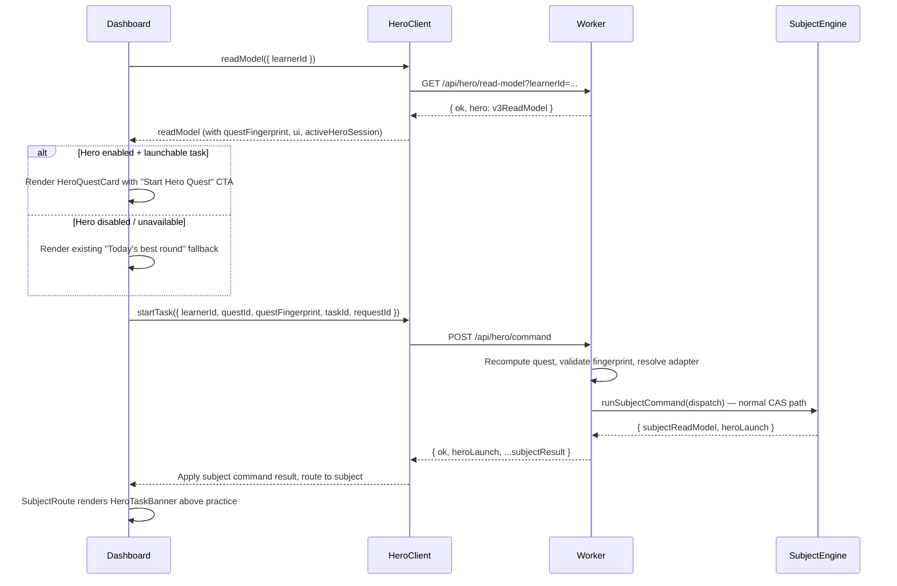

# feat: Hero Mode P2 — child-facing daily quest shell

## Overview

Hero Mode P2 makes the daily Hero Quest visible to the child for the first time. A launchable Hero task can be started from the dashboard, routing the learner into the correct subject session with lightweight Hero context — all without Coins, completion claims, Hero-owned persistent state, or economy vocabulary.

P2 answers: "Can a learner see today's Hero Quest, understand why it exists, start the next launchable task safely, and keep their sense of place when the subject session opens — without Coins, Hero Camp, completion claims, or Hero-owned state?"

---

## Problem Frame

P0 proved the shadow quest scheduling model. P1 proved safe subject session launching through the normal command pipeline. Both phases are invisible to children (`childVisible: false`). P2 bridges the gap: it surfaces the Hero read model as a child-facing dashboard card, adds a client API layer and UI state, introduces quest fingerprint integrity, active Hero session detection, and a subject-surface Hero context banner — while preserving every P0/P1 safety boundary.

The critical constraint: P2 must not introduce Hero-owned writes, completion claims, reward vocabulary, or economy semantics. Those belong to P3+. P2 is a reward-free orchestrator shell.

(see origin: `docs/plans/james/hero-mode/hero-mode-p2.md`)

---

## Requirements Trace

- R1. Dashboard shows `Today's Hero Quest` card when all feature gates are enabled and launchable tasks exist
- R2. Primary CTA launches the first launchable Hero task through `POST /api/hero/command` → normal subject command path
- R3. Subject surface shows lightweight Hero context banner when session has `heroContext`
- R4. Dashboard falls back to existing "Today's best round" + subject CTA when Hero is disabled, unavailable, or errored
- R5. Quest fingerprint is non-null in child-visible mode; stale fingerprint is rejected at launch
- R6. Active Hero session detection prevents double-submit and allows "Continue Hero task" CTA
- R7. Zero Hero-owned persistent state, zero `hero.*` events, zero economy vocabulary
- R8. `HERO_MODE_CHILD_UI_ENABLED` gate introduced; child UI requires all three flags (shadow + launch + child-ui)
- R9. Client never sends `subjectId` or `payload` to Hero command route
- R10. Child model excludes raw debug data; security/privacy rules from P0/P1 preserved
- R11. No regression in existing dashboard, subject, Spelling, Grammar, or Punctuation behaviour

---

## Scope Boundaries

- No Hero Coins, ledger, monster ownership, Hero Camp, unlock/evolve
- No persistent Hero daily progress, completion claims, `claim-task` / `claim-daily-reward` commands
- No `hero.*` events, no D1 Hero tables, no writes to `child_game_state` for Hero
- No streaks, "Daily Deal", shop, loot, limited-time copy, random rewards
- No subject Stars awarded by Hero; no Grammar/Punctuation Star semantics changes
- No answer submission through Hero; no item-level Hero scheduler
- No new route in `App.jsx` — Hero card lives on the existing dashboard screen

### Deferred to Follow-Up Work

- Authoritative task completion, effort credit, honest attempt quality → P3
- Hero Coins ledger and capped daily reward → P4
- Hero Pool and Hero Camp (monster ownership) → P5
- Timezone field from learner/account (currently hardcoded `Europe/London`) → deferred unless field already exists at implementation time

---

## Context & Research

### Relevant Code and Patterns

**Shared pure layer** (`shared/hero/` — 8 files): `constants.js`, `scheduler.js`, `seed.js`, `eligibility.js`, `task-envelope.js`, `launch-context.js`, `launch-status.js`, `contracts.js`. Zero Worker/React/D1 imports. P2 extends this with `quest-fingerprint.js` and `hero-copy.js`.

**Worker Hero layer** (`worker/src/hero/` — 11 files): `read-model.js` (v2 assembler), `routes.js` (GET handler), `launch.js` (start-task resolver), `providers/{spelling,grammar,punctuation}.js`, `launch-adapters/{spelling,grammar,punctuation}.js`. P2 evolves read-model to v3 and hardens launch.js.

**Dashboard surface** (`src/surfaces/home/HomeSurface.jsx`): Receives `model` from `runtime.buildHomeModel(appState, context)`. Renders greeting, MonsterMeadow, "Today's best round" recommendation from `selectTodaysBestRound()`, primary CTA opening a subject, and subject card grid. P2 inserts `HeroQuestCard` above the recommendation when Hero is enabled.

**App shell** (`src/app/App.jsx` line 218): `HomeSurface` rendered when `screen === 'dashboard'`, passed `runtime.buildHomeModel(appState, context)` as model.

**Subject route** (`src/surfaces/subject/SubjectRoute.jsx`): Renders `SubjectBreadcrumb` then practice node. P2 adds `HeroTaskBanner` between breadcrumb and practice node.

**Critical data path note:** All three subjects' `safeSession()` normalisers (Spelling at `read-models.js:17-33`, Grammar at `read-models.js:360-383`, Punctuation at `read-models.js:121-148`) use fixed whitelists that strip `heroContext` before the client receives the subject read model. This means `appState.subjectUi[subject.id]?.session?.heroContext` will always be `null`. The `HeroTaskBanner` must source its data from `heroUi.lastLaunch` (set during `applyHeroLaunchResponse` in U4), not from the subject session state.

**Active session detection note:** `readHeroSubjectReadModels()` at `worker/src/repository.js:9266` reads only the `data_json` column from `child_subject_state`. The `heroContext` lives in `ui_json` (session state, persisted via `buildSubjectRuntimePersistencePlan` at `repository.js:7489-7490`). Active Hero session detection (U2) requires expanding the query to also read `ui_json`, or querying `practice_sessions` for active Hero sessions.

**Client API patterns**: `createReadModelClient` (simple GET wrapper), `createSubjectCommandClient` (per-learner queue, stale-write retry, typed errors). Hero client follows `createReadModelClient` simplicity — no per-learner queue needed for read-model, no automatic retry for stale quest.

**Action dispatch**: `dispatchAction(action, data)` in `src/main.js` line 3261. `handleGlobalAction` (line 2590) handles routing actions. Hero actions (`hero-start-task`, `hero-read-model-refresh`) will be handled here.

**Worker dispatch**: `worker/src/app.js` — Hero routes at lines 1374-1439. `CAPACITY_RELEVANT_PATH_PATTERNS` at line 588 — currently includes `/api/hero/command` but not `/api/hero/read-model`.

### Institutional Learnings

- **Hero P0 read-only shadow pattern** (`docs/solutions/architecture-patterns/hero-p0-read-only-shadow-subsystem-2026-04-27.md`): Three-layer architecture (pure shared → Worker integration → tests). No-write boundary proof at structural + behavioural levels. P2 must preserve and extend.

- **Hero P1 launch bridge pattern** (`docs/solutions/architecture-patterns/hero-p1-launch-bridge-subject-command-delegation-2026-04-27.md`): Structure A (app owns dispatch), launch adapter reverse-of-provider symmetry, server-side quest recomputation (CAS semantics), heroContext active injection, flag hierarchy, economy vocabulary scan.

- **Grammar P6 star derivation trust** (`docs/solutions/architecture-patterns/grammar-p6-star-derivation-trust-and-server-owned-persistence-2026-04-27.md`): Production-faithful read-model shapes in test fixtures — six defects survived when tests used idealised shapes.

- **P3 convergent sprint patterns** (`docs/solutions/best-practices/p3-stability-capacity-multi-learner-patterns-2026-04-27.md`): Guard against vacuous-truth assertions (`.every()` on empty arrays). Characterisation-first testing. Client-vs-server boundary clarity.

- **D1 atomicity** (`project_d1_atomicity_batch_vs_withtransaction.md`): `batch()` not `withTransaction()` — the latter is a production no-op on Cloudflare D1.

---

## Key Technical Decisions

- **Read-model v2 → v3**: Additive evolution. v3 adds `questFingerprint`, `ui` block, `activeHeroSession`, `childLabel`/`childReason` on tasks, `copyVersion`. All P0/P1 fields preserved.

- **Quest fingerprint is DJB2-based, matching existing `seed.js` pattern**: Inputs are `learnerId|accountId|dateKey|timezone|schedulerVersion|eligibleSubjectIds|lockedSubjectIds|per-subject-provider-snapshot-fingerprints|selected-task-digests`. Output: `hero-qf-{hex12}`. Lives in `shared/hero/quest-fingerprint.js` (pure, no Worker imports).

- **Three-flag gate hierarchy**: `HERO_MODE_CHILD_UI_ENABLED` requires `HERO_MODE_LAUNCH_ENABLED` requires `HERO_MODE_SHADOW_ENABLED`. Child UI with mismatched flags returns clear `ui.reason` codes, never silently fails.

- **Active session detection requires expanding `readHeroSubjectReadModels` to include `ui_json`**: The existing function reads only `data_json`, but `heroContext` lives in `ui_json` (session state). U2 must expand the query to `SELECT subject_id, data_json, ui_json FROM child_subject_state` and inspect the parsed `ui_json` for `session.heroContext.source === 'hero-mode'`. This adds one column to an existing query, not a new query. The detection remains best-effort, not authoritative.

- **Client Hero state is non-persistent UI state**: `heroUi` block in appState with `status`, `readModel`, `error`, `pendingTaskKey`, `requestToken`. Never writes to repositories, gameState, or D1.

- **Hero client is a new wrapper, not reuse of `createSubjectCommandClient`**: Hero commands reject `subjectId` and `payload`; subject command client always sends those. Clean separation prevents accidental cross-contamination.

- **`applyHeroLaunchResponse` reuses the existing subject command application path**: Calls `repositories.runtime?.applySubjectCommandResult` with the response, then routes to the launched subject. No new mutation path.

- **Copy lives in a shared pure module** (`shared/hero/hero-copy.js`): Enables vocabulary scanning in boundary tests. All child-facing labels, reason labels, and CTA text sourced from this module.

---

## Open Questions

### Resolved During Planning

- **Where does Hero UI state live?** Non-persistent `heroUi` block on `appState`, managed by `store.patch()`. No persistence to `child_game_state` or D1. Reset on learner switch or hydrate.

- **How does the client apply a Hero launch response?** The `POST /api/hero/command` response already includes the subject command result (spread via `...result` in `app.js` line 1423). The client calls `repositories.runtime?.applySubjectCommandResult` with the response to update local read models, then routes to the launched subject. Same path as direct subject commands.

- **Should `HeroTaskBanner` be subject-specific or shell-level?** Shell-level. Rendered in `SubjectRoute.jsx` between `SubjectBreadcrumb` and the practice node. Data sourced from `heroUi.lastLaunch` (not from subject session state — all three `safeSession()` normalisers strip `heroContext` from the subject read model before it reaches the client). No subject-specific Hero banners needed.

- **Should active session detection add a new D1 query?** No new query, but the existing `readHeroSubjectReadModels` must be expanded to also read `ui_json` (one extra column). `heroContext` is persisted in `ui_json` (session state), not `data_json` (subject stats). The expanded query reads both columns; active session detection inspects parsed `ui_json` for `session.heroContext.source === 'hero-mode'`.

- **Why can't the banner read from `appState.subjectUi[subject.id]?.session?.heroContext`?** All three subjects' `safeSession()` normalisers use fixed whitelists. Spelling emits 12 fields, Grammar emits its named set, Punctuation emits its named set — none include `heroContext`. P1 injected heroContext on the *server-side* session state, but the read-model normalisers strip it before the client receives the subject read model. The banner must use `heroUi.lastLaunch` instead, which carries the same information from the Hero command response.

- **Client rendering gate — why dual check?** Per origin §6: "Only render the child-facing Hero card when `hero.ui.enabled === true` and `hero.childVisible === true`." `buildHeroHomeModel` must derive `enabled` from `readModel.ui.enabled === true && readModel.childVisible === true`. Both fields must be true — not just `ui.enabled`.

- **`heroLaunch.childVisible` — should it flip dynamically?** Yes. Current `launch.js` line 150 hardcodes `childVisible: false`. P2 must make this conditional on `envFlagEnabled(env.HERO_MODE_CHILD_UI_ENABLED)`. When child UI is enabled, the heroLaunch response and heroContext carry `childVisible: true`. `coinsEnabled` and `writesEnabled` remain `false`.

- **How does the dashboard trigger Hero read-model loading?** The `navigate-home` handler in `handleGlobalAction` (line 2595) fires `loadHeroReadModel` after `store.goHome()`. For initial app load (dashboard is first screen), fire during bootstrap after hydration when `boot.session.signedIn === true`. The `learner-select` handler (line 2884) resets `heroUi` and triggers fresh load. This mirrors the Parent Hub / Admin Hub pattern where `loadParentHub`/`loadAdminHub` are called from the `open-parent-hub`/`open-admin-hub` handlers.

- **Should `applyHeroLaunchResponse` handle Punctuation differently?** For P2, the generic `applySubjectCommandResult` path is sufficient because Hero `start-session` commands produce no reward projections (toast/celebration events). Punctuation's specialised `applyPunctuationCommandResponse` primarily handles `projections.rewards.toastEvents` and `store.reloadFromRepositories()` — neither applies to a no-reward launch. P3 must revisit when completion claims produce reward projections. Add a defensive test: Punctuation Hero launch through generic path does not crash when reward projections are absent.

### Deferred to Implementation

- Exact `heroContext.phase` value for P2 (`'p2-child-launch'` recommended, but implementer confirms after reading current heroContext builder).
- Whether `applyHeroLaunchResponse` can fully reuse the generic path or needs a small Punctuation-specific adapter (Punctuation has a specialised `applyPunctuationCommandResponse` in `src/main.js`).
- Exact requestToken / in-flight deduplication mechanism — follow the pattern used by Parent Hub / Admin Hub loaders in `src/main.js`.

---

## High-Level Technical Design

> *This illustrates the intended approach and is directional guidance for review, not implementation specification. The implementing agent should treat it as context, not code to reproduce.*



```
Flag hierarchy:

  HERO_MODE_SHADOW_ENABLED ── GET /api/hero/read-model
       │
       └── HERO_MODE_LAUNCH_ENABLED ── POST /api/hero/command
                │
                └── HERO_MODE_CHILD_UI_ENABLED ── child-facing Hero card
                         │
                         └── ui.enabled === true AND childVisible === true
```

---

## Implementation Units

- U1. **Quest fingerprint and read-model v3 shape**

**Goal:** Add deterministic quest fingerprint derivation and evolve the read model from v2 to v3 with `questFingerprint`, `ui` block, `activeHeroSession`, child labels, and the new `HERO_MODE_CHILD_UI_ENABLED` gate. This is the foundation all other P2 units depend on.

**Requirements:** R5, R8, R10

**Dependencies:** None

**Files:**
- Create: `shared/hero/quest-fingerprint.js`
- Create: `shared/hero/hero-copy.js`
- Modify: `shared/hero/constants.js`
- Modify: `shared/hero/launch-context.js`
- Modify: `worker/src/hero/read-model.js`
- Modify: `worker/src/hero/routes.js`
- Modify: `wrangler.jsonc`
- Modify: `worker/wrangler.example.jsonc`
- Test: `tests/hero-quest-fingerprint.test.js`
- Test: `tests/hero-child-read-model.test.js`
- Test: `tests/hero-copy-contract.test.js`

**Approach:**
- `quest-fingerprint.js` exports `buildHeroQuestFingerprintInput(input)` and `deriveHeroQuestFingerprint(input)`. Uses DJB2 hash (same pattern as `seed.js`). Inputs: `learnerId`, `accountId` (available server-side via `session.accountId` — thread through routes.js → read-model builder), `dateKey`, `timezone`, `schedulerVersion`, eligible subject IDs (sorted), locked subject IDs (sorted), per-subject provider snapshot fingerprints (extract from provider snapshots when available; use `subject:{subjectId}:content-release:missing` marker when no provider supplies one), selected task digests (taskId + intent + launcher + subjectId for each task). Output: `hero-qf-{hex12}`.
- `hero-copy.js` exports child-facing labels, reason labels, CTA text, and forbidden-vocabulary list. Pure module, no framework imports.
- `constants.js` adds `HERO_P2_SCHEDULER_VERSION = 'hero-p2-child-ui-v1'`, `HERO_P2_COPY_VERSION = 'hero-p2-copy-v1'`, and updates `HERO_SAFETY_FLAGS` to support conditional `childVisible: true`.
- `launch-context.js` updates `phase` to `'p2-child-launch'` when P2 version is active.
- `read-model.js` evolves to v3: version bump, add `questFingerprint` (non-null), `ui` block (`{ enabled, surface, reason, copyVersion }`), per-task `childLabel` and `childReason` from `hero-copy.js`, `activeHeroSession` (null initially — detection wired in U2). The `ui.enabled` flag is true only when all three env flags are on AND at least one task is launchable.
- `routes.js` reads `HERO_MODE_CHILD_UI_ENABLED` and passes to `buildHeroShadowReadModel`.
- `wrangler.jsonc` + example: add `"HERO_MODE_CHILD_UI_ENABLED": "false"`.

**Patterns to follow:**
- `shared/hero/seed.js` — DJB2 hash, `Object.freeze` on constants
- `worker/src/hero/read-model.js` — current v2 additive evolution pattern
- `shared/hero/constants.js` — frozen constant export style

**Test scenarios:**
- Happy path: `deriveHeroQuestFingerprint` with fixed inputs returns deterministic `hero-qf-{hex12}` — pin expected hex value
- Happy path: Same inputs on consecutive calls produce identical fingerprint
- Edge case: Fingerprint changes when `schedulerVersion` changes
- Edge case: Fingerprint changes when selected tasks change (different task added)
- Edge case: Fingerprint changes when eligible subjects change
- Edge case: Missing content release ID uses stable marker, does not produce null fingerprint
- Edge case: `buildHeroQuestFingerprintInput` with empty task list returns valid (non-null) fingerprint
- Edge case: Fingerprint changes when `accountId` changes (different account, same learner)
- Edge case: Fingerprint changes when content release fingerprint changes for a subject that provides one
- Happy path: v3 read model has `version: 3`, `questFingerprint` is non-null string matching `hero-qf-` prefix
- Happy path: `ui.enabled: true` when all three flags on AND launchable tasks exist
- Happy path: `ui.reason: 'enabled'` in the enabled case
- Edge case: `ui.enabled: false, ui.reason: 'child-ui-disabled'` when `HERO_MODE_CHILD_UI_ENABLED` off
- Edge case: `ui.enabled: false, ui.reason: 'launch-disabled'` when launch flag off
- Edge case: `ui.enabled: false, ui.reason: 'shadow-disabled'` when shadow flag off
- Edge case: `ui.enabled: false, ui.reason: 'no-launchable-tasks'` when all tasks not launchable
- Edge case: `ui.enabled: false, ui.reason: 'no-eligible-subjects'` when zero eligible subjects
- Happy path: `questFingerprint` propagated into each task's `heroContext`
- Happy path: Per-task `childLabel` and `childReason` are non-empty strings from `hero-copy.js`
- Edge case: Debug fields absent from `ui` block — no raw provider internals
- Happy path: All P0/P1 fields preserved (mode, safety flags, eligibleSubjects, lockedSubjects, dailyQuest, launch, debug)
- Happy path: `hero-copy.js` exports contain zero economy vocabulary (coin, shop, deal, loot, streak, claim, reward, treasure, buy)
- Edge case: `hero-copy.js` labels for all 6 intents return non-empty strings
- Edge case: `hero-copy.js` labels for all 3 ready subjects return non-empty strings

**Verification:**
- `deriveHeroQuestFingerprint` is pure and deterministic with pinned test values
- v3 read model satisfies the shape contract from origin §7
- `HERO_MODE_CHILD_UI_ENABLED` defaults to `"false"` in both wrangler files
- All P0/P1 tests updated for v3 shape and still passing
- No economy vocabulary in `hero-copy.js`

---

- U2. **Active Hero session detection and launch conflict hardening**

**Goal:** Detect active Hero sessions in the GET read-model path and harden the POST launch path with conflict handling — reducing double-submit risk and enabling "Continue Hero task" CTA in U5.

**Requirements:** R6, R9, R11

**Dependencies:** U1

**Files:**
- Modify: `worker/src/repository.js` (`readHeroSubjectReadModels` — expand to include `ui_json`)
- Modify: `worker/src/hero/read-model.js`
- Modify: `worker/src/hero/launch.js`
- Test: `tests/hero-active-session.test.js`

**Approach:**
- Expand `readHeroSubjectReadModels` (repository.js line 9266) to `SELECT subject_id, data_json, ui_json FROM child_subject_state WHERE learner_id = ?`. Return shape becomes `{ [subjectId]: { data, ui } }` where `data` is parsed `data_json` and `ui` is parsed `ui_json`. Existing providers consume `data` unchanged. The new `ui` field provides session state for active session detection.
- In `buildHeroShadowReadModel`, accept the expanded shape. After assembling enriched tasks, inspect each subject's `ui?.session?.heroContext` for `source === 'hero-mode'`. If found, populate `activeHeroSession: { subjectId, questId, questFingerprint, taskId, intent, launcher, status: 'in-progress' }`. All three subjects persist `heroContext` on `session` in `ui_json` (verified in P1: Spelling at `engine.js:466`, Grammar at `engine.js:1075`, Punctuation at `engine.js:152`). Use production-faithful fixture shapes per Grammar P6 learning. If no active Hero session found, `activeHeroSession: null`.
- Add `questFingerprint` validation to `resolveHeroStartTaskCommand`: when child UI is enabled (`envFlagEnabled(env.HERO_MODE_CHILD_UI_ENABLED)`), require `body.questFingerprint` to be non-null and match the recomputed quest's fingerprint. Mismatch returns 409 `hero_quest_fingerprint_mismatch`. When child UI is off, `questFingerprint` validation is skipped (P1 backwards compatibility — P1 sends `null`).
- Make `heroLaunch.childVisible` dynamic: `envFlagEnabled(env.HERO_MODE_CHILD_UI_ENABLED)` instead of hardcoded `false`.
- In `resolveHeroStartTaskCommand`, before proceeding with launch:
  - If active Hero session exists for the **same `taskId`**: return a safe response (idempotent-style) or structured conflict with the active session details, allowing the client to navigate to the already-started subject. Prefer returning the existing session info rather than erroring.
  - If active Hero session exists for a **different Hero task**: throw `ConflictError` with code `hero_active_session_conflict`, including the active session's `subjectId` and `taskId`.
  - If active **non-Hero** subject session exists: throw `ConflictError` with code `subject_active_session_conflict` (generic active session, not Hero-specific).
- Client-side dedupe (pending key, disabled CTA) is wired in U4/U5 — this unit handles server-side detection only.

**Patterns to follow:**
- `worker/src/hero/launch.js` — existing validation pattern with typed `ConflictError`
- `worker/src/hero/read-model.js` — existing in-memory data inspection pattern

**Test scenarios:**
- Happy path: No active session → `activeHeroSession: null` in read model
- Happy path: Active Spelling Hero session detected → `activeHeroSession` populated with correct fields
- Happy path: Active Grammar Hero session detected → correct fields
- Edge case: Active session with heroContext but `source !== 'hero-mode'` → not treated as Hero session
- Edge case: Active session in subject that is not in `HERO_READY_SUBJECT_IDS` → ignored
- Happy path: POST same `taskId` with active session → safe idempotent-style response (not error)
- Happy path: POST different Hero `taskId` with active session → 409 `hero_active_session_conflict`
- Happy path: POST with active non-Hero session → 409 `subject_active_session_conflict`
- Edge case: POST with no active session → proceeds to launch normally (existing path)
- Happy path: Conflict response includes `activeSession.subjectId` and `activeSession.taskId` in error body
- Happy path: Active Punctuation Hero session detected — correct fields extracted from Punctuation's `ui_json` session shape
- Happy path: POST with correct `questId` but mismatched `questFingerprint` in child-visible mode → 409 `hero_quest_fingerprint_mismatch`
- Happy path: POST with null `questFingerprint` in child-visible mode → 400 (fingerprint required)
- Edge case: POST with null `questFingerprint` when child UI flag is off → proceeds normally (P1 backward compat)
- Happy path: POST with all three flags enabled → `heroLaunch.childVisible === true` in response
- Edge case: POST with `HERO_MODE_CHILD_UI_ENABLED=false` → `heroLaunch.childVisible === false`
- Happy path: After successful P2 launch with all flags enabled, `heroContext.phase === 'p2-child-launch'` on the session
- Edge case: POST non-Hero active session — fixture seeds a normal subject `start-session` first, then Hero `start-task` → 409 `subject_active_session_conflict` with `activeSession.subjectId` in response
- Integration: Full GET → detect active → POST different task → 409 flow
- Edge case: `readHeroSubjectReadModels` expanded query returns both `data` and `ui` — providers still receive correct data shape

**Verification:**
- `activeHeroSession` correctly populated when a Hero-launched session is active
- Server rejects double-launch of different Hero tasks with clear error code
- Same-task re-launch is handled gracefully (not 500)
- Non-Hero active sessions do not block Hero launch silently — they return a clear conflict code

---

- U3. **Client Hero API wrapper**

**Goal:** Add a focused client-side Hero Mode API wrapper that calls `GET /api/hero/read-model` and `POST /api/hero/command` with the correct shape — explicitly not reusing `createSubjectCommandClient`.

**Requirements:** R2, R9

**Dependencies:** U1

**Files:**
- Create: `src/platform/hero/hero-client.js`
- Test: `tests/hero-client.test.js`

**Approach:**
- `createHeroModeClient({ fetch, getLearnerRevision, onLaunchApplied, onStaleWrite })` factory returning `{ readModel({ learnerId }), startTask({ learnerId, questId, questFingerprint, taskId, requestId }) }`. The `onLaunchApplied` and `onStaleWrite` callbacks decouple the client from the action handler, matching the origin doc §10 API. `onLaunchApplied(response)` is called after a successful launch; `onStaleWrite({ error, learnerId })` is called on stale-quest or fingerprint-mismatch errors.
- `readModel()` calls `GET /api/hero/read-model?learnerId={learnerId}` with `accept: application/json`. Parses JSON response. Throws `HeroModeClientError` on non-2xx with typed `code` field from server response body.
- `startTask()` calls `POST /api/hero/command` with `{ command: 'start-task', learnerId, questId, questFingerprint, taskId, requestId, correlationId: requestId, expectedLearnerRevision }`. Uses `getLearnerRevision(learnerId)` for the revision. Parses response. Throws typed `HeroModeClientError` for known codes (`hero_quest_stale`, `hero_active_session_conflict`, `hero_task_not_launchable`, `hero_task_not_found`, `projection_unavailable`) and generic error for unknown failures.
- Must use the existing `credentialFetch` (same-origin, credentials included).
- Must NOT send `subjectId` or `payload` fields.
- Must NOT auto-retry on `hero_quest_stale` — caller must refetch read model first.
- Must NOT retry on `projection_unavailable` when `retryable: false`.

**Patterns to follow:**
- `src/platform/runtime/read-model-client.js` — simple GET wrapper pattern
- `src/platform/runtime/subject-command-client.js` — typed error class pattern

**Test scenarios:**
- Happy path: `readModel({ learnerId: 'abc' })` calls `GET /api/hero/read-model?learnerId=abc` with correct headers
- Happy path: `startTask()` posts correct Hero command shape (not subject command shape)
- Happy path: `startTask()` includes `expectedLearnerRevision` from `getLearnerRevision`
- Happy path: `startTask()` sets `correlationId` equal to `requestId`
- Edge case: `startTask()` body does not include `subjectId` or `payload` fields
- Error path: Server returns `hero_quest_stale` → `HeroModeClientError` with `.code === 'hero_quest_stale'`
- Error path: Server returns `hero_quest_fingerprint_mismatch` → `HeroModeClientError` with `.code === 'hero_quest_fingerprint_mismatch'`
- Error path: Server returns `hero_active_session_conflict` → correct typed error
- Error path: Server returns `hero_task_not_launchable` → correct typed error
- Error path: Server returns `projection_unavailable` with `retryable: false` → error propagated, no retry
- Error path: Network failure → `HeroModeClientError` with `.code === 'network_error'`
- Edge case: No automatic retry on stale quest — error thrown to caller

**Verification:**
- Client sends Hero command shape, never subject command shape
- `subjectId` and `payload` never appear in request body
- All known error codes mapped to typed errors
- No automatic retry for stale quest

---

- U4. **Client Hero UI state and action handlers**

**Goal:** Thread Hero state through `src/main.js` as non-persistent UI state, wiring the Hero client, read-model loading, launch dispatching, and subject command result application.

**Requirements:** R1, R2, R4, R6

**Dependencies:** U1, U3

**Files:**
- Modify: `src/main.js`
- Test: `tests/hero-ui-flow.test.js`

**Approach:**
- Near the existing `readModels` / `subjectCommands` client creation (line ~471), create `heroClient = createHeroModeClient({ fetch: credentialFetch, getLearnerRevision })`.
- Add `heroUi` block to `appState` via `store.patch()`: `{ status: 'idle', learnerId: '', requestToken: 0, readModel: null, error: '', pendingTaskKey: '', lastLaunch: null }`.
- `loadHeroReadModel({ learnerId, force })`: increments requestToken, sets `status: 'loading'`, calls `heroClient.readModel({ learnerId })`. On success: if requestToken still matches, sets `status: 'ready'`, `readModel: response.hero`. On failure: sets `status: 'error'`, `error: safeErrorMessage`. On stale token (learner changed during flight): discards response silently.
- `startHeroTask({ questId, questFingerprint, taskId })`: checks `pendingTaskKey` to prevent double-dispatch. Checks `persistence.mode !== 'degraded'` — if degraded, set `heroUi.error` with "Practice is temporarily read-only" and do not dispatch. Sets `pendingTaskKey` to `${learnerId}|${questId}|${taskId}` (pipe separator — IDs are guaranteed pipe-free). Sets `status: 'launching'`. Generates `requestId` via `uid('hero-start-task')`. Calls `heroClient.startTask(...)`. On success: calls `applyHeroLaunchResponse(response)`, sets `status: 'ready'`, then dispatches `open-subject` with `response.heroLaunch.subjectId`. Clears `pendingTaskKey`, triggers deferred `loadHeroReadModel` (non-blocking). On `hero_quest_stale` / `hero_quest_fingerprint_mismatch` / `hero_active_session_conflict`: sets `status: 'ready'`, clears `pendingTaskKey`, triggers `loadHeroReadModel({ force: true })`. On other error: sets `status: 'error'`, clears `pendingTaskKey`, patches `error`.
- `applyHeroLaunchResponse(response)`: extracts `{ heroLaunch, subjectReadModel, learnerId, subjectId }` from response. Calls `repositories.runtime?.applySubjectCommandResult?.({ learnerId, subjectId: heroLaunch.subjectId, response })`. Updates `heroUi.lastLaunch`.
- In `handleGlobalAction`:
  - `'hero-read-model-refresh'`: calls `loadHeroReadModel({ learnerId, force: true })`.
  - `'hero-start-task'`: calls `startHeroTask(data)`.
  - `'hero-open-active-session'`: dispatches `open-subject` with `data.subjectId` (no POST, just navigation).
- In `buildHomeModel()` (line 2246): add `hero` block sourced from `appState.heroUi`:
  ```
  hero: buildHeroHomeModel(appState.heroUi)
  ```
  where `buildHeroHomeModel` normalises the raw heroUi into a child-safe view model: `{ status, enabled, readModel, nextTask, activeHeroSession, canStart, canContinue, error, effortPlanned, eligibleSubjects }`. The `enabled` field is derived as `readModel.ui.enabled === true && readModel.childVisible === true` (dual check per origin §6).
- In `buildSurfaceActions()` (line 2273): add `startHeroQuestTask(taskId)`, `continueHeroTask(subjectId)`, `refreshHeroQuest()`.
- Hero read model loading trigger points:
  1. `navigate-home` handler in `handleGlobalAction` — call `loadHeroReadModel({ learnerId })` after `store.goHome()`.
  2. Initial bootstrap — fire after hydration when `boot.session.signedIn === true` and initial screen is `dashboard`.
  3. `learner-select` handler (line 2884) — reset `heroUi` and trigger fresh load.
  This mirrors the Parent Hub / Admin Hub pattern where loads fire from explicit action handlers.

**Execution note:** Characterise the existing `handleGlobalAction` and `buildHomeModel` return shapes as test fixtures before modifying them, to catch any regression from P2 additions.

**Patterns to follow:**
- `src/main.js` lines 504-538 — `subjectCommands` client creation and `onCommandApplied` wiring
- `src/main.js` lines 2246-2261 — `buildHomeModel` additive extension pattern
- `src/main.js` lines 2273-2305 — `buildSurfaceActions` action exposure pattern
- Parent Hub / Admin Hub loader pattern (requestToken, in-flight deduplication)

**Test scenarios:**
- Happy path: Hero read model loads on dashboard render when signed in with Worker session
- Happy path: `buildHomeModel` returns `hero.enabled: true` when `heroUi.readModel.ui.enabled === true`
- Happy path: `buildHomeModel` returns `hero.nextTask` as first task with `launchStatus === 'launchable'`
- Happy path: `buildHomeModel` returns `hero.activeHeroSession` from read model
- Happy path: `startHeroQuestTask` dispatches `hero-start-task` which calls `heroClient.startTask`
- Happy path: Successful launch applies subject command result and routes to subject
- Edge case: `hero.enabled: false` when `heroUi.readModel` is null or `ui.enabled === false`
- Edge case: Learner change resets `heroUi` and triggers fresh read model load
- Edge case: Stale requestToken — response from old learner discarded silently
- Edge case: `pendingTaskKey` prevents double dispatch while launch is in-flight
- Error path: `hero_quest_stale` triggers read model refetch, clears pending state
- Error path: `hero_active_session_conflict` triggers read model refetch
- Error path: GET read-model failure sets `hero.status: 'error'`, dashboard falls back to existing CTA
- Integration: Full flow — load read model → render → start task → apply → route to subject
- Happy path: `hero.canContinue: true` when `activeHeroSession` present; `hero.canStart: true` when launchable task exists and no active session
- Happy path: `hero.status === 'launching'` while `startHeroTask` is in-flight; CTA disableable from this status
- Edge case: `hero.enabled: false` when `readModel.childVisible === false` even if `readModel.ui.enabled === true` (dual check)
- Edge case: Hero read model NOT fetched when `boot.session.signedIn === false`
- Edge case: Persistence degraded → `startHeroTask` sets error, does not dispatch POST
- Edge case: `hero-open-active-session` action with `subjectId` routes to subject without POST — verify no `heroClient.startTask` call
- Edge case: Concurrent read-model loads (dashboard render + learner-select) — stale token from first load discarded when second completes
- Edge case: `buildHeroHomeModel` with unexpected read-model shape (missing `ui` block) → `hero.enabled: false`, no crash
- Edge case: Client receives 404 `hero_shadow_disabled` from GET → `hero.status: 'error'`, fallback renders cleanly

**Verification:**
- Hero UI state is non-persistent — not written to repositories, gameState, or D1
- Successful launch routes to the correct subject
- Stale/conflict errors trigger refetch without crashing
- Double-dispatch is prevented by pending key
- Existing dashboard behaviour unchanged when Hero is disabled

---

- U5. **Dashboard HeroQuestCard component**

**Goal:** Add the child-facing `HeroQuestCard` React component to the dashboard, rendering the daily quest with a single primary CTA, graceful fallback, and all P2 UI behaviour states.

**Requirements:** R1, R2, R4, R6, R7

**Dependencies:** U1, U4

**Files:**
- Create: `src/surfaces/home/HeroQuestCard.jsx`
- Modify: `src/surfaces/home/HomeSurface.jsx`
- Test: `tests/hero-dashboard-card.test.js`

**Approach:**
- `HeroQuestCard` receives `{ hero, actions }` where `hero` is the normalised model from `buildHeroHomeModel` and `actions` includes `startHeroQuestTask`, `continueHeroTask`, `refreshHeroQuest`.
- States (origin §15):
  - **Disabled/unavailable** (`hero.enabled === false`): Do not render. HomeSurface falls back to existing recommendation.
  - **Loading** (`hero.status === 'loading'`): Render no card or minimal skeleton. Existing dashboard usable.
  - **Ready with launchable task** (`hero.canStart`): Card with "Today's Hero Quest" title, effort planned, next task (subject + childLabel + childReason), "Start Hero Quest" primary CTA.
  - **Active Hero session** (`hero.canContinue`): "Continue Hero task" primary CTA. Clicking dispatches `continueHeroTask(activeSession.subjectId)` — no POST, just navigation.
  - **No launchable tasks** (`hero.enabled` but `!hero.canStart && !hero.canContinue`): Gentle message "No Hero task is ready yet — your subjects are still available below."
  - **Launch pending** (`hero.status === 'launching'`): CTA disabled, `aria-busy="true"`, label "Starting…".
  - **Stale quest** (after `hero_quest_stale`): Gentle message "Your Hero Quest refreshed. Try the next task now." Read model auto-refetches.
  - **Active session conflict** (after `hero_active_session_conflict`): Refetches, shows "Continue Hero task" if active session found, otherwise generic retry.
- HomeSurface integration: In `HomeSurface.jsx`, when `model.hero?.enabled === true`, render `<HeroQuestCard>` in the `.hero-mission` area above/replacing the "Today's best round" block. When `model.hero?.enabled !== true`, render existing recommendation code unchanged.
- Copy sourced from `hero-copy.js` labels. No Coins, rewards, streaks, shop, deal, claim, treasure, loot, or pressure copy.
- Eligible subjects shown as context. Locked subjects shown as quiet "coming later" only if list is non-empty and short.
- Secondary CTA: "Open subjects" as a scroll-to-grid or a `navigateHome` no-op (subjects are below on the same page). Optional based on layout.

**Patterns to follow:**
- `src/surfaces/home/HomeSurface.jsx` — existing card rendering pattern, `useMemo` for derived data
- `src/surfaces/home/SubjectCard.jsx` — component API style

**Test scenarios:**
- Happy path: Card renders when `hero.enabled === true` and `hero.canStart === true`
- Happy path: Primary CTA shows "Start Hero Quest" and dispatches `startHeroQuestTask(nextTask.taskId)` on click
- Happy path: Card shows effort planned, next task subject label, and child reason
- Happy path: Active session shows "Continue Hero task" CTA that dispatches `continueHeroTask(subjectId)` — no POST
- Happy path: Existing "Today's best round" and subject grid still render when Hero disabled
- Edge case: Card not rendered when `hero.enabled === false`
- Edge case: Card not rendered / skeleton when `hero.status === 'loading'`
- Edge case: "No Hero task is ready yet" message when no launchable tasks and no active session
- Edge case: CTA disabled while `hero.status === 'launching'`; `aria-busy` present
- Edge case: Stale quest message rendered after error; refetch action fires
- Edge case: Eligible subjects list shown; locked subjects shown only if non-empty
- Boundary: No economy vocabulary appears anywhere in rendered output (Coins, Deal, Shop, Loot, Streak, Claim, Reward, Treasure, Buy)
- Happy path: Subject card grid still renders below Hero card
- Edge case: Model with zero eligible subjects — card not rendered, fallback works
- Edge case: Fresh learner (zero monsters, zero dashboard stats) — Hero card and "Today's best round" fallback do not both render simultaneously; one or the other is active

**Verification:**
- Child-facing card renders correctly in all 8 UI states
- Existing dashboard fallback works when Hero is disabled
- Zero economy vocabulary in rendered output
- Subject grid always renders regardless of Hero state

---

- U6. **Subject-surface HeroTaskBanner**

**Goal:** Render a lightweight Hero context banner above the subject practice node when the active session was launched from Hero Mode.

**Requirements:** R3, R7

**Dependencies:** U1, U4

**Files:**
- Create: `src/surfaces/subject/HeroTaskBanner.jsx`
- Modify: `src/surfaces/subject/SubjectRoute.jsx`
- Modify: `src/app/App.jsx` (pass `heroUi.lastLaunch` to SubjectRoute)
- Test: `tests/hero-subject-banner.test.js`

**Approach:**
- `HeroTaskBanner` receives `{ lastLaunch, subjectName }` where `lastLaunch` is `heroUi.lastLaunch` (set during `applyHeroLaunchResponse` in U4). Renders a quiet banner: "Hero Quest task: {subjectName} — {intent label}" and "This round is part of today's Hero Quest."
- **Data source rationale:** All three subjects' `safeSession()` normalisers strip `heroContext` from the subject read model before it reaches the client. `appState.subjectUi[subject.id]?.session?.heroContext` is always `null`. Instead, `heroUi.lastLaunch` carries `{ questId, questFingerprint, taskId, subjectId, intent, launcher, launchedAt }` — set during `applyHeroLaunchResponse` in U4 and reset on navigate-home or learner switch. The banner checks `lastLaunch?.subjectId === currentSubjectId` to confirm relevance.
- Intent labels sourced from `hero-copy.js` (imported at the client level from `shared/hero/hero-copy.js`). This is allowed because `hero-copy.js` is in `shared/hero/` (pure, no Worker imports) and P2 explicitly permits client-side consumption of shared pure Hero modules for copy/labels.
- In `App.jsx`, pass `heroLastLaunch={appState.heroUi?.lastLaunch}` to `SubjectRoute` when `screen === 'subject'`. In `SubjectRoute.jsx`, if `heroLastLaunch?.subjectId === subject.id` and the session is for the current subject, render `<HeroTaskBanner>` between `SubjectBreadcrumb` and the error card / practice node.
- Banner does NOT alter subject feedback, scoring, hints, support policy, Stars, or monster rewards. It is context-only.
- Banner does NOT show Coins, completion progress, "reward waiting", task checkboxes, or pressure copy.
- Optional "Back to Hero Quest" link (dispatching `navigate-home`) can appear only if it does not disrupt an in-progress subject session. If the session is active (not at summary), omit the link.

**Patterns to follow:**
- `src/surfaces/subject/SubjectBreadcrumb.jsx` — existing shell-level component above practice
- `src/surfaces/subject/SubjectRoute.jsx` — conditional rendering between breadcrumb and practice

**Test scenarios:**
- Happy path: Banner renders when `lastLaunch.subjectId === currentSubjectId`
- Happy path: Banner shows subject name and intent label
- Happy path: Banner shows "This round is part of today's Hero Quest."
- Edge case: Banner does not render when `lastLaunch` is null
- Edge case: Banner does not render when `lastLaunch.subjectId !== currentSubjectId` (user navigated to a different subject)
- Boundary: No economy vocabulary in banner output
- Edge case: Banner does not interfere with subject practice rendering (practice node renders normally below)
- Happy path: Intent label maps correctly for all 6 Hero intents

**Verification:**
- Banner renders at shell level, not duplicated per subject
- Zero economy vocabulary in banner
- Existing subject practice unchanged — banner is additive only

---

- U7. **Launch flow wiring, stale/conflict handling, and pending dedupe**

**Goal:** Wire the end-to-end launch flow: Hero card CTA → client dispatch → Worker command → subject command application → route to subject. Handle stale quest refetch, conflict refetch, pending dedupe, and selected-learner race conditions.

**Requirements:** R2, R4, R5, R6, R9, R11

**Dependencies:** U2, U3, U4, U5

**Files:**
- Modify: `src/main.js`
- Modify: `src/surfaces/home/HeroQuestCard.jsx`
- Test: `tests/hero-launch-flow-e2e.test.js`

**Approach:**
- Wire the full happy path: `startHeroQuestTask(taskId)` → extract `questId`, `questFingerprint`, `taskId` from current `heroUi.readModel` → call `startHeroTask()` → success → `applyHeroLaunchResponse()` → `dispatch('open-subject', { subjectId: heroLaunch.subjectId })` → subject route renders with `heroContext` on session → `HeroTaskBanner` visible.
- Stale quest handling: On `hero_quest_stale` or `hero_quest_fingerprint_mismatch` from Worker → clear pending → `loadHeroReadModel({ force: true })` → show gentle message "Your Hero Quest refreshed. Try the next task now." via `heroUi.error` with a specific code → HeroQuestCard renders the message inline with a polite `aria-live="polite"` region.
- Active session conflict: On `hero_active_session_conflict` → clear pending → refetch → if `activeHeroSession` now present, card switches to "Continue Hero task" CTA. Otherwise, generic "Quest updated. Try again."
- Pending dedupe: `heroUi.pendingTaskKey` set before fetch, checked before dispatch. If key is non-empty, CTA is disabled (from U5). Cleared on success, error, or timeout.
- Selected-learner race: `heroUi.requestToken` incremented on every `loadHeroReadModel`. Responses with stale tokens discarded. Learner-change handler (`learner-select` in `handleGlobalAction`) resets `heroUi` and triggers fresh load.
- Non-Hero subject session conflict: On `subject_active_session_conflict` → show message "A subject session is already active. Finish it first, then try your Hero Quest." Keep existing dashboard usable.

**Patterns to follow:**
- `src/main.js` stale-write handling in `createSubjectCommandClient.onStaleWrite` — requestToken / discard pattern
- `src/main.js` `handleGlobalAction` — action routing pattern

**Test scenarios:**
- Integration: Full E2E: GET read-model → render card → click Start → POST command → apply result → route to subject → HeroTaskBanner visible → no Hero-owned writes
- Happy path: Successful launch routes to correct subject ID
- Happy path: After launch, `heroUi.lastLaunch` contains quest/task metadata
- Error path: Stale quest → refetch → gentle message → card re-renders with updated quest
- Error path: Active session conflict → refetch → "Continue Hero task" CTA appears
- Error path: Subject active session conflict → informative message → dashboard usable
- Edge case: Rapid double-click → second click ignored (pendingTaskKey check)
- Edge case: Learner changed while launch in-flight → response discarded, new learner's read model loaded
- Edge case: Network error during launch → error message → CTA re-enabled
- Happy path: After stale quest refetch, fingerprint is updated and next launch attempt uses new fingerprint
- Integration: Run for at least Spelling subject (most mature fixture). Grammar and Punctuation as feasible or as not-launchable fallback tests.
- Happy path: Punctuation Hero launch through generic `applySubjectCommandResult` path does not crash when reward projections are absent
- Error path: `hero_quest_fingerprint_mismatch` → refetch → gentle message → next launch uses updated fingerprint

**Verification:**
- End-to-end launch works for at least one subject
- Stale quest and conflict recovery work without crashing
- Double-click prevention works
- Learner-change race condition is handled
- No Hero-owned writes or events during any flow

---

- U8. **Boundary, accessibility, and no-economy hardening**

**Goal:** Extend structural boundary tests to cover new P2 files, verify accessibility requirements for the Hero card and banner, and extend economy vocabulary scanning to client-side Hero UI files.

**Requirements:** R7, R10, R11

**Dependencies:** U1, U5, U6

**Files:**
- Modify: `tests/hero-no-write-boundary.test.js`
- Modify: `tests/hero-launch-boundary.test.js`
- Create: `tests/hero-p2-boundary.test.js`
- Test: `tests/hero-p2-boundary.test.js`

**Approach:**
- **Structural scans** (extend existing):
  - S1-S6 (P0): `shared/hero/` scans automatically pick up new `quest-fingerprint.js` and `hero-copy.js` — verify no Worker, D1, React, repository, or subject runtime imports.
  - S-L1 through S-L5 (P1): Automatically cover new Worker files. Verify launch adapters still import no subject runtime.
  - New S-P2-1: Client Hero files (`src/platform/hero/`, `src/surfaces/home/HeroQuestCard.jsx`, `src/surfaces/subject/HeroTaskBanner.jsx`) do not import from `worker/src/hero/` or `worker/src/`. They may import from `shared/hero/hero-copy.js` only (not `scheduler.js`, `eligibility.js`, `seed.js`, or other pure Hero modules). Update existing S5 test to use an allowlist: `shared/hero/hero-copy` is permitted, all other `shared/hero/` imports are forbidden. This preserves the broader architectural boundary while enabling copy access.
  - New S-P2-2: Economy vocabulary scan uses the canonical forbidden-vocabulary list exported from `hero-copy.js` (single source of truth). All scans — S6, S-L4, S-P2-2 — import from this list. Tokens: `coin`, `shop`, `deal`, `loot`, `streak`, `claim`, `reward`, `treasure`, `buy`, `limited time`, `daily deal`, `don't miss out`, `earn`. Extends to all files in `src/platform/hero/`, `src/surfaces/home/HeroQuestCard.jsx`, `src/surfaces/subject/HeroTaskBanner.jsx`, and `shared/hero/hero-copy.js`.
  - New S-P2-3: No Hero module writes D1 directly — scan `src/platform/hero/` for repository write primitives.
  - New S-P2-4: No Hero module creates `hero.*` events.
  - New S-P2-5: No Hero persistent state table exists — scan migration files for `hero` table names.
- **Behavioural boundary tests** (extend existing):
  - B7 (P0 GET no-write): now tests v3 response shape; still zero protected table row changes.
  - B-L1/B-L2 (P1 POST): still verify `mutation_receipts` increase and zero `hero.*` events. **Fix vacuous-truth risk:** Replace any `if (!launchable) return` early-exit pattern in existing P1 boundary and E2E tests with `assert.ok(launchable, 'Fixture must produce at least one launchable task')`. Apply this fix in existing tests and mandate it in all new P2 behavioural/E2E tests.
  - New B-P2-1: Child dashboard fetch failure does not break subject access — verify `open-subject` still works after GET read-model returns error.
  - New B-P2-2: Repeated read-model refreshes do not mutate learner revision.
- **Accessibility checks**:
  - Primary CTA has accessible name.
  - Disabled/pending state uses `aria-busy` or clear disabled text.
  - Stale/error message uses `aria-live="polite"`.
  - Keyboard navigation to CTA works (button is focusable).
  - Focus does not jump unexpectedly after read-model refresh.
  - After successful Hero launch and route to subject, focus follows existing route focus behaviour.
  - HeroTaskBanner has appropriate landmark or role.
  - HeroQuestCard respects `prefers-reduced-motion` — no CSS transitions/animations when media query matches.

**Patterns to follow:**
- `tests/hero-no-write-boundary.test.js` — `collectJsFiles` + `stripComments` + forbidden token scan
- `tests/hero-launch-boundary.test.js` — structural + behavioural boundary pattern

**Test scenarios:**
- Structural: `shared/hero/quest-fingerprint.js` has zero Worker/React/D1 imports
- Structural: `shared/hero/hero-copy.js` has zero Worker/React/D1 imports
- Structural: `src/platform/hero/hero-client.js` has zero `worker/src/` imports
- Structural: `src/surfaces/home/HeroQuestCard.jsx` has zero `worker/src/` imports
- Structural: `src/surfaces/subject/HeroTaskBanner.jsx` has zero `worker/src/` imports
- Structural: All P2 Hero client files have zero economy vocabulary
- Structural: All P2 shared Hero files have zero economy vocabulary
- Structural: No Hero D1 migration files exist
- Structural: No `hero.*` event emission in any Hero file
- Behavioural: GET read-model v3 still writes zero protected tables
- Behavioural: POST start-task still writes only through subject command path
- Behavioural: POST start-task still creates zero `hero.*` events
- Behavioural: Failed GET does not prevent subject access
- Accessibility: HeroQuestCard primary CTA has accessible name
- Accessibility: Pending state has `aria-busy`
- Accessibility: Error message region has `aria-live="polite"`

**Verification:**
- All P0/P1/P2 structural boundary tests pass
- All P0/P1/P2 behavioural boundary tests pass
- Economy vocabulary scan covers all new Hero files
- Accessibility audit passes for card and banner

---

- U9. **Capacity instrumentation and deployment gates**

**Goal:** Add `/api/hero/read-model` to capacity-relevant path patterns, verify deployment flag defaults, and document the rollout sequence.

**Requirements:** R8, R11

**Dependencies:** U1, U7

**Files:**
- Modify: `worker/src/app.js`
- Test: `tests/hero-capacity-deployment.test.js`

**Approach:**
- Add `/^\/api\/hero\/read-model$/` to `CAPACITY_RELEVANT_PATH_PATTERNS` in `worker/src/app.js` (line 588). The dashboard will now call this endpoint on normal child entry, making it capacity-relevant.
- Verify deployment flag defaults: `HERO_MODE_SHADOW_ENABLED: "false"`, `HERO_MODE_LAUNCH_ENABLED: "false"`, `HERO_MODE_CHILD_UI_ENABLED: "false"` in both `wrangler.jsonc` and `worker/wrangler.example.jsonc`.
- Test that with all flags off, the dashboard behaves exactly like the current production dashboard — no Hero card, no Hero API calls, no regressions.
- Test that `HERO_MODE_CHILD_UI_ENABLED` without `HERO_MODE_LAUNCH_ENABLED` returns `ui.reason: 'launch-disabled'`.
- Test that `HERO_MODE_CHILD_UI_ENABLED` without `HERO_MODE_SHADOW_ENABLED` returns `ui.reason: 'shadow-disabled'`.

**Patterns to follow:**
- `worker/src/app.js` lines 588-594 — `CAPACITY_RELEVANT_PATH_PATTERNS` array

**Test scenarios:**
- Happy path: `/api/hero/read-model` is matched by `isCapacityRelevantPath`
- Happy path: `/api/hero/command` is still matched (existing)
- Edge case: All flags off → GET returns 404 `hero_shadow_disabled` → dashboard renders without Hero card
- Edge case: Shadow on, launch off, child-ui on → GET succeeds but `ui.reason: 'launch-disabled'`
- Edge case: Shadow on, launch on, child-ui off → GET succeeds but `ui.reason: 'child-ui-disabled'`
- Happy path: All three flags on → GET returns `ui.enabled: true`

**Test expectation:** Deployment flag verification overlaps with U1 v3 shape tests; this unit focuses on the capacity pattern and flag interaction matrix.

**Verification:**
- `/api/hero/read-model` tracked in capacity metrics
- All deployment flag defaults are `"false"`
- Flag interaction matrix produces correct `ui.reason` codes
- Zero regressions when all flags off

---

- U10. **Observability instrumentation**

**Goal:** Add minimal structured logging for Hero Mode operational metrics, enabling operators to monitor feature health before enabling `HERO_MODE_CHILD_UI_ENABLED` in production. (Origin §21.)

**Requirements:** R8, R11

**Dependencies:** U4, U7

**Files:**
- Modify: `src/main.js`
- Modify: `worker/src/hero/routes.js`
- Modify: `worker/src/app.js`

**Approach:**
- Use the repo's existing telemetry pattern (Worker structured logs). Add structured log entries at key points:
  - **Worker-side** (in `routes.js` and `app.js` hero route block):
    - `hero_read_model_loaded` — on successful GET, log `{ learnerId, version, ui_enabled, task_count, active_session: boolean }`. No raw task payload.
    - `hero_task_launch_succeeded` — on successful POST, log `{ learnerId, questId, taskId, subjectId, intent, launcher }`.
    - `hero_task_launch_failed` — on POST error, log `{ learnerId, code, retryable }`. Safe error code only.
    - `hero_quest_stale_rejected` — on 409, log `{ learnerId, clientQuestId, serverQuestId }`.
    - `hero_active_session_conflict` — on 409, log `{ learnerId, activeSubjectId, requestedTaskId }`.
  - **Client-side** (in `src/main.js` action handlers):
    - `hero_card_rendered` — on card render with `childVisible: true`, log once per dashboard visit.
    - `hero_card_hidden_reason` — when card not rendered, log reason code.
    - `hero_task_launch_clicked` — on CTA click, before POST.
  - If the repo uses Worker structured logs exclusively (no client event pipeline), client events are implemented as best-effort `console.info` with a structured JSON prefix that can be grep'd in browser dev tools during QA. No persistent client analytics tables in P2.

**Patterns to follow:**
- Existing Worker structured log pattern in `worker/src/app.js`

**Test scenarios:**
- Test expectation: none — observability instrumentation is log-only with no behavioural impact. Verify during QA that structured logs appear in Worker output for all 5 server-side events.

**Verification:**
- Structured logs emitted for read-model-loaded, launch-succeeded, launch-failed, stale-rejected, and active-session-conflict
- No raw task payloads or sensitive learner data in logs
- No persistent Hero analytics tables created

---

## System-Wide Impact

- **Interaction graph:** `HomeSurface` → `HeroQuestCard` → `actions.dispatch('hero-start-task')` → `handleGlobalAction` → `heroClient.startTask` → `POST /api/hero/command` → `resolveHeroStartTaskCommand` → `repository.runSubjectCommand(subjectRuntime.dispatch)` → subject engine. Return path: response → `applyHeroLaunchResponse` → `applySubjectCommandResult` → `store.openSubject` → `SubjectRoute` → `HeroTaskBanner`.

- **Error propagation:** Hero client errors bubble as `HeroModeClientError` to `handleGlobalAction`, which patches `heroUi.error` and lets the dashboard render appropriate messages. Subject command errors from the launch path follow the existing `ProjectionUnavailableError` → 503 path in `app.js`. Client-side errors never crash the app — they fail to the existing dashboard.

- **State lifecycle risks:** `heroUi` is non-persistent — lost on reload, which is correct (quest is recomputed fresh). Learner switch resets `heroUi` and triggers fresh load, preventing cross-learner data leakage. The `pendingTaskKey` prevents double-dispatch but is cleared on any terminal state (success, error, timeout).

- **API surface parity:** Hero command route parity with subject command route is maintained — same security chain, same CAS, same demo rate-limit bucketing. The new read-model capacity tracking brings parity with the command route's existing capacity tracking.

- **Integration coverage:** The E2E flow test (U7) covers the full path from GET → render → POST → apply → route → banner. Boundary tests (U8) cover structural and behavioural contracts. Individual unit tests cover each layer independently.

- **Unchanged invariants:** Subject engines, subject Stars, subject monster rewards, subject scoring, subject feedback, and subject persistence are completely unchanged by P2. Hero Mode reads subject state and launches subject commands but never modifies subject logic. The `heroContext` injection on session state (P1) is metadata only — it does not affect any subject computation.

---

## Risks & Dependencies

| Risk | Mitigation |
|------|------------|
| Active session detection requires `ui_json` column not currently read by `readHeroSubjectReadModels` | U2 expands the query to `SELECT subject_id, data_json, ui_json`; existing providers consume `data` unchanged. One extra column, not a new query. Test with production-faithful fixtures per Grammar P6 learning for all 3 subjects |
| `safeSession()` normalisers strip `heroContext` — banner can't read from `subjectUi` | U6 uses `heroUi.lastLaunch` as data source instead; set during `applyHeroLaunchResponse` in U4. Carries same information from Hero command response |
| `applyHeroLaunchResponse` may need Punctuation-specific adapter | Resolved: generic `applySubjectCommandResult` is sufficient for P2 because Hero `start-session` produces no reward projections. P3 must revisit when completion claims exist. Defensive test added to U7 |
| Quest recomputation ~2× D1 read cost on public dashboard entry | `/api/hero/read-model` is read-only; client-side requestToken deduplication prevents redundant fetches |
| Economy vocabulary could slip into new files via copy-paste | S-P2-2 uses canonical forbidden-vocabulary list from `hero-copy.js` (single source); all scans import from it |
| Three `now()` calls in hero command route produce different timestamps | Documented in P1 completion report as known behaviour; P2 does not worsen this |
| Vacuous-truth risk in existing P1 boundary tests (`if (!launchable) return`) | U8 mandates replacing early-return with `assert.ok(launchable, ...)` in existing and new tests |
| Post-session `activeHeroSession` detection after subject clears session state | If a completed session clears `heroContext` from `ui_json`, `activeHeroSession` returns to null and card shows "Start" for next task. If session is not cleared, card shows "Continue" pointing at a completed session. Acceptable UX confusion — P3 completion claims will make this authoritative |

---

## Sources & References

- **Origin document:** [docs/plans/james/hero-mode/hero-mode-p2.md](docs/plans/james/hero-mode/hero-mode-p2.md)
- **P1 completion report:** [docs/plans/james/hero-mode/hero-mode-p1-completion-report.md](docs/plans/james/hero-mode/hero-mode-p1-completion-report.md)
- **P0 shadow pattern:** [docs/solutions/architecture-patterns/hero-p0-read-only-shadow-subsystem-2026-04-27.md](docs/solutions/architecture-patterns/hero-p0-read-only-shadow-subsystem-2026-04-27.md)
- **P1 launch bridge pattern:** [docs/solutions/architecture-patterns/hero-p1-launch-bridge-subject-command-delegation-2026-04-27.md](docs/solutions/architecture-patterns/hero-p1-launch-bridge-subject-command-delegation-2026-04-27.md)
- **Grammar P6 trust learning:** [docs/solutions/architecture-patterns/grammar-p6-star-derivation-trust-and-server-owned-persistence-2026-04-27.md](docs/solutions/architecture-patterns/grammar-p6-star-derivation-trust-and-server-owned-persistence-2026-04-27.md)
- **P3 convergent sprint patterns:** [docs/solutions/best-practices/p3-stability-capacity-multi-learner-patterns-2026-04-27.md](docs/solutions/best-practices/p3-stability-capacity-multi-learner-patterns-2026-04-27.md)
- Related PRs: #357 (P0), #397 (P1)
