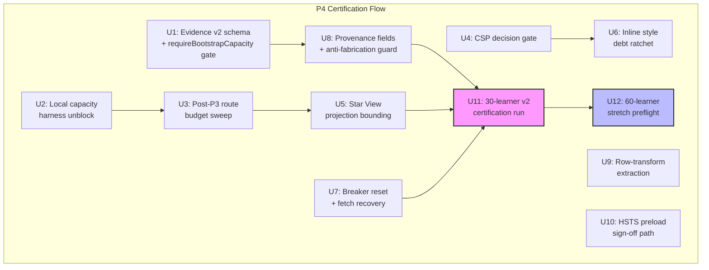

# P4 — Production Certification & Post-P3 Surface Revalidation

## Overview

P3 proved the multi-learner bootstrap contract, landed first dated capacity evidence (30 learners, `small-pilot-provisional`), pinned D1 query budgets, and started the CSP observation window. P4 converts that provisional stability into enforceable production certification, then revalidates every route added after P3 before the project claims larger classroom readiness.

P4 is a **certification phase, not a feature phase.** No new learner-visible features, economy mechanics, or dashboard product surfaces. Every unit must demonstrate zero regression against the existing multi-learner bootstrap contract, query budgets, and security headers.

---

## Problem Frame

P3's 30-learner production run passed all thresholds (bootstrap P95 878.5 ms, command P95 310.5 ms, 0 5xx, 0 signals) but the capacity decision remains `small-pilot-provisional` because:

1. Evidence schema is v1 — 30-learner-beta certification requires schema v2 with per-endpoint `meta.capacity` metrics and provenance fields (see origin: `docs/plans/james/sys-hardening/sys-hardening-p4.md`).
2. `requireBootstrapCapacity` gate in `evaluateThresholds` is hardcoded to `passed: true, observed: 'deferred-to-U3'` — the gate has no teeth.
3. Post-P3 commits added Hero routes (`/api/hero/read-model`, `/api/hero/command`), Punctuation Star View projection, and 10+ Admin Ops endpoints — none have query budget tests.
4. CSP remains `Content-Security-Policy-Report-Only` with `'unsafe-inline'` in `style-src`. Observation window ends 2026-05-04.
5. HSTS ships without `preload`; DNS subdomain audit is incomplete (DRAFT status with `TBD-operator` cells).
6. Inline style count is 280 (not 232 as the P3 report estimated — the live budget constant `POST_MIGRATION_TOTAL = 280` in `scripts/inventory-inline-styles.mjs` is authoritative).
7. `bootstrapCapacityMetadata` breaker has `cooldownMaxMs: Infinity` with no auto-recovery; `attemptedLearnerFetches` Set has no clearing mechanism after breaker reset.
8. `repository.js` remains at 9,322 lines after P3's 7.7% extraction.

---

## Requirements Trace

- R1. 30-learner capacity claim promoted from `small-pilot-provisional` to `30-learner-beta-certified` under evidence schema v2 with provenance
- R2. Every post-P3 route (Hero, Punctuation Star View, Admin Ops) has measured query budgets locked in `worker-query-budget.test.js`
- R3. Punctuation Star View command-response projection bounded or documented with failing performance budget
- R4. CSP enforcement decision recorded by 2026-05-04 — no indefinite `Report-Only`
- R5. HSTS preload either signed off and enabled, or explicitly deferred by operator sign-off
- R6. Inline style debt has a ratchet preventing regression; count lower than P3 baseline of 280
- R7. Circuit breaker reset and transient learner-fetch recovery have operator and UX paths
- R8. Repository row-transform extraction reduces `repository.js` without changing bootstrap/command semantics
- R9. 60-learner stretch preflight produces schema v2 evidence with `candidate` or `fail-with-root-cause` decision
- R10. Zero regression: multi-learner bootstrap contract locked, query budgets only tighten, 4-learner fixture passes, `npm test && npm run check && npm run capacity:verify-evidence` green throughout

---

## Scope Boundaries

- No new learner-visible features, economy mechanics, or dashboard product surfaces
- No new subject engines or subject routes
- No Hero economy vocabulary, persistent Hero state writes, or Hero-owned events
- No monster visual config redesign
- No D1 migration schema changes (row-transform extraction is code-only)
- No Playwright E2E additions beyond existing infrastructure
- CSP enforcement flip is conditional on observation window outcome — may ship or defer
- HSTS preload flip is conditional on operator DNS audit — may ship or defer
- 60-learner stretch is preflight only — cannot claim school-ready from one pass

### Deferred to Follow-Up Work

- 100+ school-ready certification: separate phase after 60-learner stretch validates
- `repository.js` further decomposition beyond row transforms: requires pipeline refactor (see origin)
- Admin Ops load testing at classroom scale: separate capacity work
- Multi-tab cooldown desync: accepted residual from P3

---

## Context & Research

### Relevant Code and Patterns

| File | Lines | Role in P4 |
|------|-------|------------|
| `scripts/lib/capacity-evidence.mjs` | ~200 | `EVIDENCE_SCHEMA_VERSION = 1`; `requireBootstrapCapacity` stub |
| `scripts/verify-capacity-evidence.mjs` | 1,087 | Anti-fabrication checks; v2 gate needed |
| `worker/src/repository.js` | 9,322 | Row-transform extraction target |
| `worker/src/security-headers.js` | 204 | CSP Report-Only + HSTS without preload |
| `worker/src/app.js` | 2,496 | Route definitions; `CAPACITY_RELEVANT_PATH_PATTERNS` |
| `src/platform/core/circuit-breaker.js` | 417 | Breaker reset; `bootstrapCapacityMetadata` |
| `src/platform/core/store.js` | ~600 | `attemptedLearnerFetches` Set; no clear API |
| `tests/worker-query-budget.test.js` | ~300 | Budget constants; post-P3 routes missing |
| `tests/csp-inline-style-budget.test.js` | ~100 | `POST_MIGRATION_TOTAL` gate; Report-Only assertion |
| `scripts/inventory-inline-styles.mjs` | ~250 | `PRE=305, MIGRATED=25, POST=280` |
| `reports/capacity/configs/30-learner-beta.json` | ~20 | `minEvidenceSchemaVersion: 2`, `requireBootstrapCapacity: true` |
| `reports/capacity/configs/60-learner-stretch.json` | ~20 | Same v2 requirement |
| `docs/hardening/csp-enforcement-decision.md` | ~100 | Observation window 2026-04-27 to 2026-05-04 |
| `docs/hardening/hsts-preload-audit.md` | ~50 | DRAFT; `TBD-operator` cells |
| `docs/hardening/csp-inline-style-inventory.md` | ~300 | Classification baseline |
| `worker/src/hero/routes.js` | ~50 | Hero read-model route |
| `worker/src/hero/launch.js` | ~100 | Hero command resolver |
| `worker/src/logger.js` | ~300 | `CapacityCollector` with queryCount/d1RowsRead |

### Institutional Learnings

- **Measure-first-then-lock budgets** (`docs/solutions/best-practices/p3-stability-capacity-multi-learner-patterns-2026-04-27.md`): Never write a ceiling from estimates. Run hot path, observe N, lock N+1.
- **Client-vs-server breaker boundary** (same doc): `bootstrapCapacityMetadata` lives in browser + localStorage. Server cannot directly reset. Piggyback on `meta.capacity.forceBreakerReset`.
- **`Object.freeze` does not protect Set/Map** (same doc): Role sets must use private reference + exported predicate, not frozen Sets.
- **Production shape normalisation** (`docs/solutions/architecture-patterns/grammar-p6-star-derivation-trust-and-server-owned-persistence-2026-04-27.md`): Tests used idealised fixtures; 6 defects survived. P4 verification must use production-faithful shapes.
- **Single canonical Star projection function** (`docs/solutions/architecture-patterns/punctuation-p6-star-truth-monotonic-hardening-2026-04-27.md`): Worker delegates to `buildPunctuationLearnerReadModel`. Two call sites. No duplication.
- **Hero no-write boundary proof at two levels** (`docs/solutions/architecture-patterns/hero-p1-launch-bridge-subject-command-delegation-2026-04-27.md`): Structural (import scan) + behavioural (row count unchanged). Both necessary.
- **Hero 2x D1 cost for server-side quest recomputation** (same doc): Every `POST /api/hero/command` re-runs all providers + scheduler + validates questId/taskId.
- **CAS-guard-omission as systematic pattern** (`docs/solutions/architecture-patterns/admin-console-p3-command-centre-architecture-2026-04-27.md`): Same bug class found at 2 sites in one review. P4 should sweep all mutation endpoints.
- **Inventory-first thresholds** (`docs/solutions/workflow-issues/sys-hardening-p2-13-unit-autonomous-sprint-learnings-2026-04-26.md`): Scope estimates drifted 1.26–3.03× across all measured dimensions. Concrete inventory before locking.
- **Generator preflight hard-stops** (`docs/solutions/learning-spelling-audio-cache-contract.md`): Every preflight check aborts, not warns. P4 CI gates should follow the same discipline.

---

## Key Technical Decisions

- **Re-run 30-learner production gate rather than enriching v1 evidence:** The existing v1 JSON lacks per-endpoint `meta.capacity` fields. Enriching from logs would be fragile and unprovable. A fresh v2 run is cleaner and produces committed evidence with full provenance. The v1 `small-pilot-provisional` row stays in `capacity.md` as historical; the v2 row supersedes it.
- **`requireBootstrapCapacity` real check, not stub:** The gate asserts that evidence `summary.endpoints['/api/bootstrap']` includes non-null `queryCount` and `d1RowsRead` fields (matching `CapacityCollector.toPublicJSON()` shape from `logger.js`). Without this, schema v2 is a version bump with no verification capability.
- **Breaker recovery via `store.clearStaleFetchGuards()` method:** Minimal API surface extension triggered by breaker transition from `open` → `closed`. Acceptable because the alternative (page reload) is user-hostile in a classroom setting.
- **Row-transform extraction follows P3 barrel re-export pattern:** New modules import from `repository-helpers.js` and shared content modules. Barrel re-exports at the bottom of `repository.js` preserve all consumer import paths.
- **CSP inline-style baseline is 280 (not 232):** The P3 report's 232 figure appears to be from a different measurement. The authoritative constant is `POST_MIGRATION_TOTAL = 280` in `scripts/inventory-inline-styles.mjs`. P4 target: 280 → ≤ 230 (at least 50 sites).
- **`/api/hero/read-model` must join `CAPACITY_RELEVANT_PATH_PATTERNS`:** Without this, Hero read-model has no `meta.capacity` telemetry and is invisible to certification runs.

---

## Open Questions

### Resolved During Planning

- **Q: Can v1 evidence be enriched to v2?** Resolution: No. The raw v1 JSON lacks per-endpoint `meta.capacity`. Fresh v2 run required. v1 row stays as historical.
- **Q: Does `forceBreakerReset` have a circular dependency with bootstrap?** Resolution: No. `bootstrapCapacityMetadata` is a separate breaker from the bootstrap call gate. The bootstrap endpoint is always reachable; the reset signal is delivered via `meta.capacity` in the response.
- **Q: What is the CSP decision owner?** Resolution: Operator sign-off procedure is already documented in `csp-enforcement-decision.md`. P4 adds the review cadence and decision date, not a new owner.

### Deferred to Implementation

- **Exact `requireBootstrapCapacity` assertion shape:** The check must assert non-null `queryCount` + `d1RowsRead` on bootstrap endpoints. Exact field names depend on what `CapacityCollector` already emits (confirmed: `queryCount`, `d1RowsRead` in `logger.js`).
- **Star View bounding strategy (read-model cache vs compact delta):** Both options are valid. Implementation should measure actual projection cost on a 2,000-attempt fixture, then choose the approach that brings command P95 within budget.
- **Admin Ops query budget values:** Must be measured on the test harness, not estimated. Budget constants set after measurement.

---

## High-Level Technical Design

> *This illustrates the intended approach and is directional guidance for review, not implementation specification. The implementing agent should treat it as context, not code to reproduce.*

**Dependency summary:** U1 + U8 (evidence schema) and U2 + U3 + U5 (route budgets) are the critical path to U11 (30-learner certification). U7 (breakers) is a hard dependency of U11. U4/U6 (CSP), U9 (refactor), and U10 (HSTS) are parallel validation tracks completed during the same sprint but do not gate U11 — the CSP enforcement flip is post-P4, U9 is a pure refactor with no certification output, and HSTS preload is operator-gated. U12 (60-learner preflight) depends on U11 and is exploratory — not certification.

---

## Implementation Units

- U1. **Evidence schema v2 + requireBootstrapCapacity gate**

**Goal:** Bump `EVIDENCE_SCHEMA_VERSION` from 1 to 2. Replace the `requireBootstrapCapacity` stub with a real gate that asserts per-endpoint `meta.capacity` metrics exist in evidence.

**Requirements:** R1, R10

**Dependencies:** None

**Files:**
- Modify: `scripts/lib/capacity-evidence.mjs`
- Modify: `scripts/verify-capacity-evidence.mjs`
- Modify: `worker/src/logger.js` (if `CapacityCollector` needs to expose additional fields to evidence capture)
- Test: `tests/capacity-evidence-schema.test.js` (new or extend existing)

**Approach:**
- Bump `EVIDENCE_SCHEMA_VERSION` to 2
- In `evaluateThresholds`, replace the `'deferred-to-U3'` stub for `requireBootstrapCapacity` with an assertion that `summary.endpoints['/api/bootstrap']` per-endpoint aggregated fields (e.g., `queryCount`, `d1RowsRead` — matching `CapacityCollector.toPublicJSON()` shape) contains non-null `queryCount` and `d1RowsRead`
- In `buildReportMeta`, add `evidenceSchemaVersion: EVIDENCE_SCHEMA_VERSION` field so evidence JSON self-identifies
- `verify-capacity-evidence.mjs` must reject any claim above `small-pilot-provisional` if `evidenceSchemaVersion < 2`
- Guard against vacuous-truth: assert evidence has at least one endpoint entry before checking per-endpoint fields

**Patterns to follow:**
- Measure-first-then-lock from P3 (do not invent threshold values; observe from real runs)
- Existing `validateThresholdConfigKeys` reject-unknown-keys pattern in `capacity-evidence.mjs`
- `CapacityCollector` in `logger.js` already tracks `queryCount` and `d1RowsRead`

**Test scenarios:**
- Happy path: v2 evidence with complete `meta.capacity` per-endpoint passes `requireBootstrapCapacity` gate
- Happy path: `EVIDENCE_SCHEMA_VERSION` export equals 2
- Edge case: evidence with `endpoints: {}` (empty) fails `requireBootstrapCapacity` — vacuous-truth guard
- Edge case: evidence with `queryCount: 0` (valid zero) passes — must not treat 0 as missing
- Error path: v1 evidence attempting `30-learner-beta` certification fails with clear message citing schema version
- Error path: v2 evidence missing `d1RowsRead` on bootstrap endpoint fails gate
- Integration: `evaluateThresholds` returns `passed: false` when `requireBootstrapCapacity: true` and per-endpoint metrics are absent

**Verification:**
- `npm test` passes with new schema version
- `npm run capacity:verify-evidence` still accepts existing `small-pilot-provisional` v1 evidence (historical rows remain valid)
- `30-learner-beta.json` config's `minEvidenceSchemaVersion: 2` requirement can now be satisfied

---

- U2. **Unblock local capacity harness**

**Goal:** Fix the `workerd` export rejection that blocks local 10-learner smoke runs, enabling cheap pre-deploy capacity regression checks.

**Requirements:** R10

**Dependencies:** None (parallel with U1)

**Files:**
- Modify: `worker/src/index.js` (non-handler exported constants causing workerd rejection)
- Test: `tests/worker-local-harness.test.js` (new — asserts no non-handler exports)

**Approach:**
- Identify which exported constants in `index.js` cause `workerd` to reject the module (likely `LearnerLock` Durable Object export or other non-handler constants)
- Move non-handler exports to separate modules or restructure so `workerd` only sees the `default` fetch handler and Durable Object bindings
- Do not change any route behaviour — this is a module-export refactor only

**Patterns to follow:**
- `worker/src/index.js` is 262 lines; changes should be surgical
- P3's `bootstrap-repository.js` extraction pattern (move code, barrel re-export if needed)

**Test scenarios:**
- Happy path: `npm run capacity:local-worker -- --learners=10 --burst=10 --rounds=1` completes without workerd export rejection
- Happy path: local run outputs schema v2 evidence marked `environment: local`
- Edge case: local evidence cannot be used for production certification (`verify-capacity-evidence` rejects `environment: local` for tiers above `local-smoke`)
- Error path: if `workerd` still rejects, error message is surfaced clearly (not swallowed)

**Verification:**
- Local capacity harness runs end-to-end without workerd rejection
- All existing `npm test` passes (no route behaviour change)
- `worker/src/index.js` default export unchanged

---

- U3. **Post-P3 route and query budget sweep**

**Goal:** Add measured query budget tests for every post-P3 route: Hero read-model, Hero command, Punctuation events, and Admin Ops endpoints. Add `/api/hero/read-model` to `CAPACITY_RELEVANT_PATH_PATTERNS`.

**Requirements:** R2, R10

**Dependencies:** U2 (local harness makes measurement easier, but not strictly required — budgets can be measured via test harness)

**Files:**
- Modify: `tests/worker-query-budget.test.js`
- Modify: `worker/src/app.js` (add `/api/hero/read-model` to `CAPACITY_RELEVANT_PATH_PATTERNS`)
- Test: `tests/worker-query-budget.test.js`

**Execution note:** Measure-first: run each route on the test harness, observe actual D1 query count, lock measured + 1 as named constant with rationale comment.

**Approach:**
- Add `/api/hero/read-model` to `CAPACITY_RELEVANT_PATH_PATTERNS` in `app.js` so `CapacityCollector` instruments it
- Measure query counts for: Hero read-model GET, Hero command POST, Punctuation events GET, Admin Ops KPI, Admin accounts search, Admin debug-bundle, Admin error events
- Lock each as `BUDGET_HERO_READ_MODEL`, `BUDGET_HERO_COMMAND`, `BUDGET_PUNCTUATION_EVENTS`, `BUDGET_ADMIN_*` constants
- Hero command POST budget must account for 2× D1 reads from server-side quest recomputation (per Hero P1 learning)
- Admin routes: verify Parent and Demo roles cannot reach admin endpoints (role matrix tests)

**Patterns to follow:**
- Existing budget constants in `worker-query-budget.test.js`: `BUDGET_BOOTSTRAP_MULTI_LEARNER = 13`, etc.
- Rationale comments explaining what each query does

**Test scenarios:**
- Happy path: Hero read-model GET stays within budget for 3-learner account
- Happy path: Hero command POST stays within budget (including quest recomputation cost)
- Happy path: Punctuation events GET stays within budget for single learner
- Happy path: Admin KPI endpoint stays within budget
- Happy path: Admin accounts search stays within budget (paginated)
- Edge case: Hero read-model for learner with all-subject active state stays within budget
- Error path: Parent role cannot reach admin ops routes (403)
- Error path: Demo role cannot reach admin ops routes (403)
- Integration: Admin debug-bundle with partial D1 state (some tables empty) stays within budget and does not 500

**Verification:**
- All new budget tests pass
- All existing budget tests unchanged
- `npm test` green
- `/api/hero/read-model` appears in `CAPACITY_RELEVANT_PATH_PATTERNS`

---

- U4. **CSP enforcement decision gate**

**Goal:** Formalise the CSP enforcement decision procedure. Do not flip CSP to enforced — this unit prepares the gate and review cadence so the flip can happen on or after 2026-05-04.

**Requirements:** R4

**Dependencies:** None (parallel track)

**Files:**
- Modify: `docs/hardening/csp-enforcement-decision.md` (add review procedure, violation classification, flip prerequisites)
- Modify: `worker/src/security-headers.js` (add `CSP_ENFORCEMENT_MODE` constant for test assertion clarity)
- Modify: `tests/csp-inline-style-budget.test.js` (assert enforcement mode matches expected state)
- Test: `tests/security-headers.test.js` (extend — test both enforced and report-only modes)

**Approach:**
- Read the existing `docs/hardening/csp-enforcement-decision.md` first — it already contains a 7-day observation procedure with daily log, 4 flip preconditions, and deferral criteria. Do NOT duplicate this content. Instead, extend with: violation volume thresholds (≤5 unique third-party pairs → ALLOWLIST, any first-party → defer), and explicit inline style count prerequisite reference
- The existing flip prerequisites (7-day clean log, operator sign-off, budget test pass) are already documented — verify they are complete, do not rewrite
- Add `CSP_ENFORCEMENT_MODE = 'report-only'` constant to `security-headers.js` so the mode is testable as a named value
- Test that header name matches mode: `Content-Security-Policy-Report-Only` when `report-only`, `Content-Security-Policy` when `enforced`
- Do NOT flip to enforced in this unit — that is a follow-up PR gated on the observation window outcome

**Patterns to follow:**
- Existing `SECURITY_HEADERS` frozen object pattern in `security-headers.js`
- Existing CSP report endpoint wiring in `app.js`

**Test scenarios:**
- Happy path: `SECURITY_HEADERS` contains `Content-Security-Policy-Report-Only` key (not `Content-Security-Policy`)
- Happy path: `CSP_ENFORCEMENT_MODE` export equals `'report-only'`
- Edge case: `upgrade-insecure-requests` is NOT present in CSP directives while in report-only mode (per existing comment)
- Integration: `applySecurityHeaders` response contains the Report-Only header, not the enforced header

**Verification:**
- CSP decision doc has concrete review procedure and flip prerequisites
- Tests assert current mode is `report-only`
- `npm test` green

---

- U5. **Punctuation Star View projection bounding**

**Goal:** Bound the Punctuation Star View command-response projection so it does not become a CPU hotspot for dense-history learners (2,000+ attempts).

**Requirements:** R3, R10

**Dependencies:** U3 (budget sweep establishes measurement baseline)

**Files:**
- Modify: `worker/src/subjects/punctuation/read-models.js` or `worker/src/projections/star-projection.js`
- Modify: `shared/punctuation/` if read-model derivation moves to shared layer
- Test: `tests/worker-punctuation-star-projection-perf.test.js` (new)

**Execution note:** Measure first on a 2,000-attempt fixture. Choose bounding strategy based on measured cost — if projection is already fast enough (< 50ms), document and add a failing performance budget test. If slow, apply read-model caching or compact delta.

**Approach:**
- Create a 2,000-attempt Punctuation fixture
- Measure Star View projection wall time and D1 reads on the fixture
- If projection is O(n) and > 50ms: evaluate two strategies — (a) cache projected stars in read-model on write, return cached result on read; or (b) return compact star delta in command response instead of full projection
- If projection is already fast enough: add a performance budget test that fails if projection exceeds threshold
- The single canonical projection function (`buildPunctuationLearnerReadModel`) must remain the sole projection path — no duplication
- Verify `starHighWater` guard uses `!== undefined && !== null` (not `!entry.starHighWater`) — 0 is valid

**Patterns to follow:**
- Single canonical Star projection pattern from Punctuation P6
- Read-model projection pattern from `worker/src/read-models/learner-read-models.js`
- `COMMAND_PROJECTION_MODEL_KEY` read-model cache pattern

**Test scenarios:**
- Happy path: command response for 2,000-attempt learner returns correct stars within performance budget
- Happy path: command response for 10-attempt learner returns correct stars (baseline)
- Edge case: learner with 0 Punctuation attempts returns empty star projection
- Edge case: `starHighWater` with value 0 is NOT treated as falsy (regression guard)
- Integration: multi-learner bootstrap with one dense-history and one fresh learner returns correct star projections for both

**Verification:**
- 2,000-attempt fixture command response P95 within documented budget
- All existing Punctuation tests pass (zero regression)
- `npm test` green

---

- U6. **Inline style debt ratchet**

**Goal:** Reduce inline style count from 280 to ≤ 230 (at least 50 sites) and establish a ratchet preventing regression.

**Requirements:** R6

**Dependencies:** U4 (CSP decision gate must be established so inline style work feeds into enforcement readiness)

**Files:**
- Modify: `scripts/inventory-inline-styles.mjs` (update `PRE_MIGRATION_TOTAL`, `SITES_MIGRATED_THIS_PR`, `POST_MIGRATION_TOTAL`)
- Modify: `docs/hardening/csp-inline-style-inventory.md` (regenerated by `--write`)
- Modify: Multiple `src/` component files (high-traffic surfaces first)
- Test: `tests/csp-inline-style-budget.test.js` (budget constant updates to new lower target)

**Approach:**
- Run `node scripts/inventory-inline-styles.mjs` to get current live count (should be 280)
- Prioritise migration of high-traffic surfaces: auth shell, main app shell, practice controls, Parent Hub, Admin Ops, Hero card, error/loading/empty state primitives
- Prefer `css-var-ready` and `shared-pattern-available` classifications first (lower per-site effort)
- For `dynamic-content-driven` sites: apply CSS variable security contract (numeric clamp, allowlist, or CSS.escape)
- After migration, run `node scripts/inventory-inline-styles.mjs --write` to regenerate inventory
- Update budget constants: `PRE_MIGRATION_TOTAL = 280`, `SITES_MIGRATED_THIS_PR = [actual count]`, `POST_MIGRATION_TOTAL = 280 - [actual count]`
- The budget test already prevents regression (live count must be ≤ `POST_MIGRATION_TOTAL`)

**Patterns to follow:**
- Existing CSP inline-style inventory classification categories
- Existing `tests/csp-inline-style-budget.test.js` budget gate pattern

**Test scenarios:**
- Happy path: `POST_MIGRATION_TOTAL` ≤ 230 after migration
- Happy path: `SITES_MIGRATED_THIS_PR` ≥ 50
- Edge case: inventory markdown matches live grep count (no stale doc)
- Error path: adding a new `style={}` site causes budget test to fail (ratchet)
- Integration: no visual regression in auth shell, practice controls, Parent Hub

**Verification:**
- `node scripts/inventory-inline-styles.mjs --check` exits 0
- `npm test` green (budget test passes with new lower target)
- No visual regression in core surfaces (manual spot-check or existing Playwright if available)

---

- U7. **Breaker reset and sticky learner-fetch recovery**

**Goal:** Complete the circuit breaker recovery story: operator can reset breakers, and `attemptedLearnerFetches` clears when breaker transitions from open to closed.

**Requirements:** R7, R10

**Dependencies:** U1 (schema v2 required for `meta.capacity.forceBreakerReset` to carry provenance; but the reset mechanism itself works on current code — U1 is a soft dependency)

**Files:**
- Modify: `src/platform/core/store.js` (add `clearStaleFetchGuards` method on returned store object)
- Modify: `src/platform/core/repositories/api.js` (wire `clearStaleFetchGuards` call in the composition root that already handles `forceBreakerReset`)
- Create: `docs/operations/breaker-reset-runbook.md`
- Test: `tests/circuit-breaker-recovery.test.js` (new)

**Approach:**
- Add `store.clearStaleFetchGuards()` — calls `attemptedLearnerFetches.clear()` on the closure-scoped Set. This is the only way to clear it since the Set is inaccessible from outside `createStore`
- Wire the call in `src/platform/core/repositories/api.js` (the composition root that already handles `forceBreakerReset` at lines ~2148–2159), NOT in the breaker primitive's `onTransition`. The composition root already connects store and breakers — this is the correct wiring point
- **Important:** `bootstrapCapacityMetadata` breaker has `cooldownMaxMs: Infinity`, which means it NEVER auto-transitions to `half-open`. The only recovery path is `reset()` (operator-forced via `forceBreakerReset`). Therefore `clearStaleFetchGuards` must fire on any transition to `closed`, regardless of source state (`open → closed` via `reset()` is the only realistic path for this breaker)
- Document the operator reset procedure: send bootstrap request with `x-ks2-admin-force-breaker-reset` header → Worker returns `meta.capacity.forceBreakerReset: true` → client resets breaker → `attemptedLearnerFetches` clears → sibling learner stats refetch
- Add multi-tab telemetry: when breaker opens, emit a counter that the operator can grep in logs
- Verify: bootstrap call is NOT gated by `bootstrapCapacityMetadata` breaker (the bootstrap endpoint must always be reachable for the reset signal to be delivered)

**Patterns to follow:**
- Existing `forceBreakerReset` delivery in `app.js` (piggybacked on `meta.capacity`)
- P3 breaker pattern: named breakers, localStorage hint, transition callback
- `store-select-learner-refetch.test.js` infinite-refetch guard must survive

**Test scenarios:**
- Happy path: breaker opens → `attemptedLearnerFetches` blocks refetch → operator sends reset → breaker closes → `clearStaleFetchGuards` fires → sibling stats refetch succeeds
- Happy path: operator reset procedure documented with exact headers and expected response
- Edge case: `clearStaleFetchGuards` fires on any transition to `closed` (for `bootstrapCapacityMetadata` with `cooldownMaxMs: Infinity`, only `open → closed` via `reset()` is reachable — `half-open → closed` never fires because cooldown never expires)
- Edge case: 4-learner account with transient sibling fetch failure → breaker opens → reset → all 4 learners' stats available
- Error path: `clearStaleFetchGuards` called when `attemptedLearnerFetches` is empty — no-op, no error
- Error path: multi-tab scenario — one tab has breaker open, other closed — localStorage broadcast does not cause oscillation
- Integration: existing `store-select-learner-refetch.test.js` infinite-refetch guard still prevents fetch storms after recovery

**Verification:**
- 4-learner account regression test covers transient failure → recovery path
- Existing multi-learner tests unchanged
- `npm test` green
- Operator runbook merged

---

- U8. **Evidence provenance and anti-fabrication guard**

**Goal:** Add provenance fields to schema v2 evidence so certification claims are traceable to a specific CI run, not hand-writeable.

**Requirements:** R1

**Dependencies:** U1 (schema v2 must exist before provenance fields are added)

**Files:**
- Modify: `scripts/lib/capacity-evidence.mjs` (`buildReportMeta` adds provenance fields)
- Modify: `scripts/verify-capacity-evidence.mjs` (require provenance for beta/certified tiers)
- Test: `tests/capacity-evidence-provenance.test.js` (new)

**Approach:**
- Extend `buildReportMeta` with provenance fields: `workflowRunUrl`, `workflowName`, `gitSha`, `dirtyTreeFlag`, `thresholdConfigHash`, `loadDriverVersion`, `environment`, `operator`, `rawLogArtifactPath`
- `verify-capacity-evidence.mjs` requires provenance for any tier above `small-pilot`: missing provenance = cannot certify
- Manual evidence allowed only for `local-smoke` / `diagnostic` tiers
- Provenance fields degrade gracefully to `'unknown'` (existing `buildReportMeta` pattern) but `verify-capacity-evidence` rejects `'unknown'` for certifiable tiers
- Add `thresholdConfigHash`: sha256 of the threshold JSON file content, so config drift between run and verify is detectable
- Existing anti-fabrication checks in `verify-capacity-evidence.mjs` (structural coherence, recomputed failures, numeric drift) remain — provenance is additive

**Patterns to follow:**
- Existing `buildReportMeta` degrade-to-unknown pattern
- `validateThresholdConfigKeys` reject-unknown-keys pattern
- Generator preflight hard-stops (from spelling audio cache learning)

**Test scenarios:**
- Happy path: evidence with complete provenance passes verification for `30-learner-beta-certified`
- Edge case: evidence with `gitSha: 'unknown'` fails certification for beta tier
- Edge case: evidence with `dirtyTreeFlag: true` fails certification (dirty tree = uncommitted changes)
- Error path: `thresholdConfigHash` mismatch between evidence and current config file fails verification with clear diff message
- Error path: manual evidence (no `workflowRunUrl`) attempting certification tier fails
- Integration: `local-smoke` tier accepts evidence without provenance (diagnostic use)

**Verification:**
- `npm run capacity:verify-evidence` rejects fabricated evidence for beta tiers
- `npm test` green
- Existing `small-pilot-provisional` v1 evidence remains valid (provenance not required for historical rows)

---

- U9. **Repository row-transform extraction**

**Goal:** Extract pure row-transform functions from `repository.js` to reduce its size without changing any bootstrap/command semantics.

**Requirements:** R8, R10

**Dependencies:** None (parallel track; but run after U3 budget sweep is stable to avoid merge conflicts in test constants)

**Files:**
- Create: `worker/src/row-transforms.js` (or split into `learner-row-transforms.js`, `event-row-transforms.js`, `session-row-transforms.js` if cohesive clusters emerge)
- Modify: `worker/src/repository.js` (remove extracted functions, add barrel re-exports)
- Test: existing tests exercising row transforms via repository calls

**Execution note:** Characterization-first: run the full multi-learner bootstrap + dense-history command test suite before and after extraction. Diff test output to prove zero regression.

**Approach:**
- **Extraction boundary is narrower than the origin document assumed.** Feasibility review confirmed several functions in lines 218–680 are NOT pure:
  - `redactPunctuationUiForClient` instantiates `createPunctuationService()` — service construction, not a pure transform
  - `publicSubjectStateRowToRecord` is `async` and builds audio cues — not extractable as pure
  - `mergePublicSpellingCodexState` takes `db` as parameter and performs D1 queries — a database accessor
- **Target only genuinely pure transforms:** `subjectStateRowToRecord`, `gameStateRowToRecord`, `publicMonsterCodexEntry`, `publicMonsterCodexState`, `practiceSessionRowToRecord`, `eventRowToRecord`, `publicEventRowToRecord`, `contentRowToBundle`, and the `safe*` helper functions
- **Module-level constants** (lines 162–208: `PUBLIC_SPELLING_YEAR_LABELS`, `PUBLIC_PRACTICE_CARD_LABELS`, `PUBLIC_EVENT_TYPES`, `PUBLIC_MONSTER_IDS`, etc.) must move with the functions that reference them
- Leave impure functions (`redactPunctuationUiForClient`, `publicSubjectStateRowToRecord`, `mergePublicSpellingCodexState`) in `repository.js` — they require service construction or `db` access and belong with the repository
- Barrel re-exports at bottom of `repository.js` (following P3 pattern from `membership-repository.js`, etc.)
- No widening of public API — only existing consumers receive re-exports
- No circular imports — extracted modules import only from `repository-helpers.js` and `shared/` content modules

**Patterns to follow:**
- P3 extraction pattern: `bootstrap-repository.js`, `membership-repository.js`, `mutation-repository.js`
- Barrel re-exports at lines 9284–9322 of `repository.js`
- No import surface into core mutations or `db` binding

**Test scenarios:**
- Happy path: multi-learner bootstrap returns identical payload before and after extraction
- Happy path: dense-history command response returns identical payload before and after extraction
- Happy path: `repository.js` line count drops measurably (target ~200–300 lines given narrower pure-function boundary; exact count depends on which constants co-migrate)
- Edge case: barrel re-exports preserve all existing import paths (no `import ... from 'repository.js'` breaks)
- Error path: if an extracted function accidentally captured a closure variable, the test harness catches it at import time (undefined reference)
- Integration: 4-learner fixture passes with identical assertions after extraction

**Verification:**
- `npm test` green
- Multi-learner bootstrap and dense-history command tests produce identical results
- `repository.js` line count reduced; exact count documented in PR
- No new exports added to repository's public surface

---

- U10. **HSTS preload operator sign-off path**

**Goal:** Formalise the HSTS preload decision as an operator-gated process. Either complete the DNS audit and enable preload, or explicitly defer with signed reason.

**Requirements:** R5

**Dependencies:** None (parallel track)

**Files:**
- Modify: `docs/hardening/hsts-preload-audit.md` (fill in TBD cells, add operator checklist, sign-off section)
- Modify: `worker/src/security-headers.js` (add `HSTS_PRELOAD_ENABLED` constant, conditional preload suffix)
- Test: `tests/security-headers.test.js` (extend — assert preload absent when sign-off incomplete)

**Approach:**
- Fill in the `TBD-operator` cells in `hsts-preload-audit.md`: production domain, subdomains, Cloudflare zone settings, dev/staging domains, rollback impact
- Add operator sign-off section: checkbox, date, approver name
- In `security-headers.js`: add `HSTS_PRELOAD_ENABLED = false` constant. When `true`, `HSTS_VALUE` becomes `max-age=63072000; includeSubDomains; preload`
- Test that when `HSTS_PRELOAD_ENABLED = false`, the header does NOT contain `preload`
- Test that Worker `Strict-Transport-Security` and static `_headers` do not drift

**Patterns to follow:**
- Existing `HSTS_VALUE` constant in `security-headers.js`
- Existing security header drift tests

**Test scenarios:**
- Happy path: `HSTS_PRELOAD_ENABLED = false` → header is `max-age=63072000; includeSubDomains` (no `preload`)
- Happy path: `HSTS_PRELOAD_ENABLED = true` → header is `max-age=63072000; includeSubDomains; preload`
- Edge case: Worker header and `_headers` file contain identical HSTS value (no drift)
- Error path: accidental `preload` in header without `HSTS_PRELOAD_ENABLED = true` is caught by test

**Verification:**
- HSTS preload is either explicitly deferred (with signed operator reason) or enabled (with completed DNS audit)
- No half-state: either fully deferred or fully enabled
- `npm test` green

---

- U11. **30-learner v2 certification run**

**Goal:** Run a 30-learner production or preview capacity gate under evidence schema v2 and promote the capacity claim to `30-learner-beta-certified`.

**Requirements:** R1, R10

**Dependencies:** U1, U2, U3, U5, U7, U8 (hard dependencies — all must pass before certification). U4, U6, U9, U10 are parallel tracks that should complete during the same sprint but do not gate certification execution (U9 is a pure refactor with no output consumed by evidence or budgets; U4/U6 serve the post-P4 CSP flip; U10 is operator-gated).

**Files:**
- Modify: `docs/operations/capacity.md` (add new evidence table row)
- Create: `reports/capacity/evidence/30-learner-beta-v2-*.json` (committed evidence artefact)
- Test: `npm run capacity:verify-evidence` must pass after new evidence is committed

**Approach:**
- Ensure U1–U9 are merged and `npm test && npm run check` is green
- Run `npm run capacity:classroom -- --production --origin https://ks2.eugnel.uk --confirm-production-load --demo-sessions --learners 30 --bootstrap-burst 20 --rounds 1 --include-request-samples --output reports/capacity/evidence/30-learner-beta-v2-$(date +%Y%m%d).json`
- Evidence must be schema v2 with provenance fields
- Thresholds: 0 5xx, 0 signals, bootstrap P95 ≤ 1,000 ms, command P95 ≤ 750 ms, payload under cap
- `requireBootstrapCapacity` gate must pass (non-stub)
- Multi-learner bootstrap regression matrix must simultaneously pass
- Add row to `capacity.md` evidence table: `30-learner-beta-certified`, date, commit SHA, evidence path
- v1 `small-pilot-provisional` row stays as historical

**Test scenarios:**
- Happy path: 30-learner run produces schema v2 evidence with provenance, all thresholds pass
- Error path: if any threshold fails, capacity claim remains `small-pilot-provisional` with documented root cause
- Integration: `npm run capacity:verify-evidence` passes with both v1 (historical) and v2 (new) evidence rows

**Verification:**
- `capacity.md` shows `30-learner-beta-certified` row with committed evidence JSON
- `npm run capacity:verify-evidence` green
- Evidence JSON is committed to `reports/capacity/evidence/`

---

- U12. **60-learner stretch preflight**

**Goal:** Run a 60-learner stretch preflight to identify the next capacity bottleneck. This is exploratory — not certification.

**Requirements:** R9

**Dependencies:** U11 (30-learner certification must pass first)

**Files:**
- Create: `reports/capacity/evidence/60-learner-stretch-preflight-*.json`
- Modify: `docs/operations/capacity.md` (add preflight row)

**Approach:**
- Run `npm run capacity:classroom -- --production --origin https://ks2.eugnel.uk --confirm-production-load --demo-sessions --learners 60 --bootstrap-burst 30 --rounds 1 --include-request-samples --output reports/capacity/evidence/60-learner-stretch-preflight-$(date +%Y%m%d).json`
- Evidence must be schema v2 with provenance
- Decision can be `60-learner-stretch-candidate` or `fail-with-root-cause`
- If fail: completion report must list top bottleneck (Worker CPU? D1 reads? Star View? Hero? Retry storm?) and next fix
- Cannot claim school-ready from one pass

**Test scenarios:**
- Happy path: 60-learner run completes with schema v2 evidence; all thresholds pass → `60-learner-stretch-candidate`
- Error path: one or more thresholds fail → `fail-with-root-cause`; completion report identifies specific bottleneck
- Edge case: Admin Ops endpoints are excluded from classroom load (separate testing needed)

**Verification:**
- Evidence JSON committed to `reports/capacity/evidence/`
- `capacity.md` shows preflight row with decision
- Completion report lists findings regardless of pass/fail

---

## System-Wide Impact

- **Interaction graph:** Evidence schema change touches `capacity-evidence.mjs` → `classroom-load-test.mjs` → `verify-capacity-evidence.mjs` → `capacity.md`. Breaker recovery touches `store.js` → `circuit-breaker.js` → `app.js` (bootstrap meta). Row-transform extraction touches `repository.js` → all consumers that import row transforms.
- **Error propagation:** `verify-capacity-evidence.mjs` rejects invalid evidence with clear messages (not silent pass). Breaker `onTransition` callback failure must not prevent breaker state change. `clearStaleFetchGuards` failure must not prevent breaker reset.
- **State lifecycle risks:** Breaker localStorage hint survives page reload — `clearStaleFetchGuards` must also clear localStorage hint if present. Evidence JSON commit must be atomic with `capacity.md` row update.
- **API surface parity:** No new API endpoints. Row-transform extraction changes internal module boundaries only. Barrel re-exports preserve all existing import paths.
- **Integration coverage:** Multi-learner bootstrap test with 4-learner fixture covers the full pipeline. Query budget tests cover each route independently. 30-learner certification run covers the full production stack.
- **Unchanged invariants:** D1 CAS/idempotency behaviour, multi-learner bootstrap contract, learner write access rules, sibling compact state, notModified invalidation, viewer-learner non-writability, Hero no-write boundary, existing security headers (HSTS without preload, CSP Report-Only) until explicitly flipped.

---

## Risks & Dependencies

| Risk | Mitigation |
|------|------------|
| `workerd` export rejection root cause unclear | U2 investigates before attempting fix; local harness is nice-to-have, not blocker for certification (production run still works) |
| 30-learner v2 re-run fails a threshold that v1 passed | v1 run was recent (2026-04-27); if v2 fails, root cause is likely new post-P3 surface (Hero/Stars/Admin), which is exactly what P4-U3/U5 address first |
| CSP observation window reveals unexpected violations | Decision doc has both paths (defer or allowlist). First-party violations trigger deferral. Third-party violations get allowlist with adversarial sign-off |
| HSTS preload DNS audit cannot be completed (operator unavailable) | Explicit deferral is an acceptable P4 outcome. No half-state. |
| Row-transform extraction breaks a closure-scoped dependency | Characterisation test suite before and after. Any extraction failure surfaces as undefined reference at import time |
| Star View bounding strategy unclear until measured | Measure first on 2,000-attempt fixture. Both strategies (cache, delta) are viable; implementation chooses based on data |
| Inline style migration causes visual regression | Spot-check high-traffic surfaces. Existing Playwright tests cover some flows. Budget test prevents count regression |

---

## Documentation / Operational Notes

- **Operator actions required:** CSP daily log monitoring (through 2026-05-04), HSTS preload DNS audit (when available), breaker reset procedure review
- **New runbook:** `docs/operations/breaker-reset-runbook.md` (U7)
- **Updated docs:** `docs/operations/capacity.md` (evidence table rows), `docs/hardening/csp-enforcement-decision.md` (review procedure), `docs/hardening/hsts-preload-audit.md` (TBD cells filled)
- **CI/CD:** No pipeline changes. `npm run verify` = `npm test && npm run check && npm run capacity:verify-evidence` remains the release gate

---

## Sources & References

- **Origin document:** [P4 proposal](docs/plans/james/sys-hardening/sys-hardening-p4.md)
- **P3 completion report:** `docs/plans/james/sys-hardening/sys-hardening-p3-completion-report.md`
- **P3 plan:** `docs/plans/2026-04-27-001-feat-stability-capacity-evidence-multi-learner-correctness-plan.md`
- **Capacity runbook:** `docs/operations/capacity.md`
- **CSP decision record:** `docs/hardening/csp-enforcement-decision.md`
- **HSTS audit:** `docs/hardening/hsts-preload-audit.md`
- **Inline style inventory:** `docs/hardening/csp-inline-style-inventory.md`
- **P3 convergent sprint patterns:** `docs/solutions/best-practices/p3-stability-capacity-multi-learner-patterns-2026-04-27.md`
- **Hero P1 learning:** `docs/solutions/architecture-patterns/hero-p1-launch-bridge-subject-command-delegation-2026-04-27.md`
- **Punctuation P6 learning:** `docs/solutions/architecture-patterns/punctuation-p6-star-truth-monotonic-hardening-2026-04-27.md`
- **Admin P3 learning:** `docs/solutions/architecture-patterns/admin-console-p3-command-centre-architecture-2026-04-27.md`
- Related PRs: #377 (P3)
