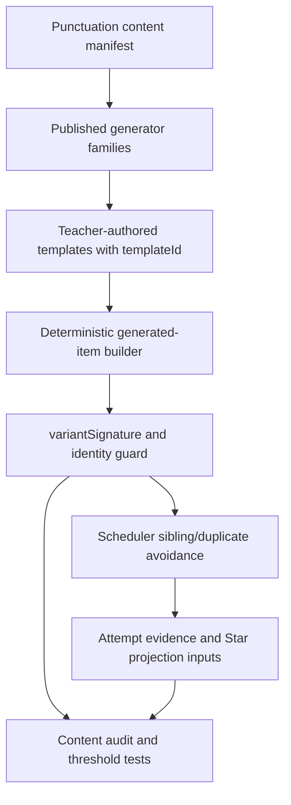
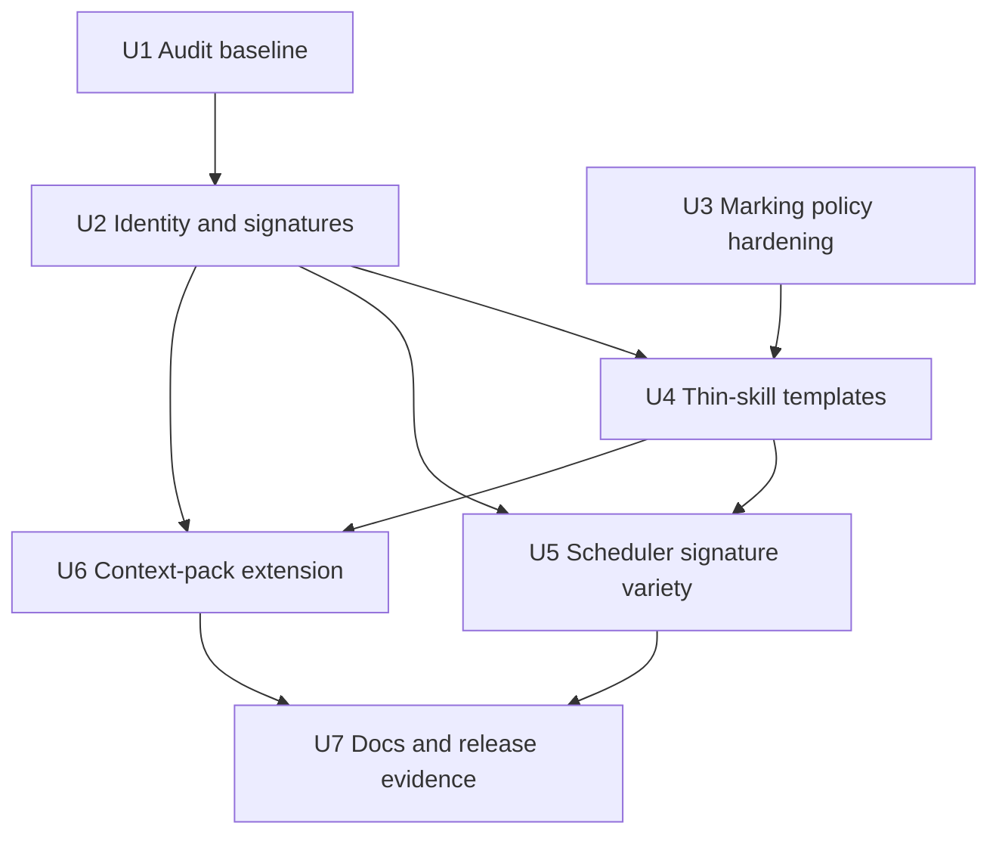

# feat: Punctuation Generator Guardrails and Thin-Skill Expansion

## Summary

This plan turns the Punctuation question-generator audit into the next implementation slice: lock the deterministic generator's identity and quality gates first, then expand the thinnest skills with teacher-authored templates and sibling retry coverage. It keeps runtime AI out of learner question generation, preserves the existing 14-skill reward contract, and treats generator expansion as content-quality work rather than another reward or landing-page hardening phase.

---

## Problem Frame

The current Punctuation subject is production-capable, Worker-backed, and heavily hardened through Phases 5-7, but the question pool is still shallow: the local manifest still has 71 fixed items, 25 published generator families, and one generated item per family at runtime, giving a practical pool of 96 items. That is enough for a first release, but too thin for long-term spaced mastery because learners can see repeated surfaces before they have proved transferable punctuation knowledge.

The risky part is not only quantity. `shared/punctuation/generators.js` currently derives generated item ids from seed, family, and variant index, while template selection depends on template-bank length. Expanding a bank without guardrails can make an existing generated item id point at a different stem/model, corrupting item-level learning evidence. The next phase therefore has to stabilise generated-item identity before adding more templates.

---

## Assumptions

*This plan was authored from the provided audit brief and current repo research without a synchronous scope-confirmation round. The items below are agent inferences that should be reviewed before implementation proceeds.*

- This is the first implementation slice for the `questions-generator` audit, so it should cover P0 guardrails and the highest-value P1 template expansion, not the entire P0-P4 roadmap in one release.
- Existing Punctuation reward, Star, telemetry, Doctor, and landing-page work from Phases 6-7 is treated as complete baseline infrastructure and is not reopened.
- The default runtime should stay at one generated item per family until generator identity, duplicate detection, and scheduler signature handling are proven.
- Runtime learner-facing AI generation remains out of scope; context packs stay deterministic, sanitised compiler input.

---

## Requirements

- R1. The Punctuation runtime must remain deterministic and must not use AI to generate learner-facing questions, model answers, validators, or marking behaviour at runtime.
- R2. Existing runtime generated items must not silently change stem/model under the same item id when template banks expand.
- R3. Every generated item must expose a stable template identity and a normalised variant signature suitable for duplicate detection, scheduler avoidance, audit output, and evidence variety checks.
- R4. A repo-native content audit must report fixed item count, generator-family count, runtime item count, per-skill/mode/readiness coverage, validator coverage, duplicate stems/models/signatures, and generated identity drift.
- R5. Audit thresholds must fail tests or CI-facing checks when a published skill lacks enough item variety, transfer/misconception/negative-test coverage, validator coverage, or signature diversity.
- R6. The first expansion must prioritise thin or repetition-prone skills: `sentence_endings`, `apostrophe_contractions`, `comma_clarity`, `semicolon_list`, `hyphen`, and `dash_clause`.
- R7. Expanded templates must be teacher-authored, deterministic, child-register safe, and backed by deterministic marking golden paths for accepted and rejected answers.
- R8. Dash and list-comma policy must be explicit in tests and audit output: valid dash variants are accepted for dash-boundary answers, and an otherwise correct Oxford-comma answer is accepted in free-text list-comma prompts unless the prompt explicitly forbids the final comma.
- R9. Scheduler and attempt evidence must prefer sibling templates with the same misconception/facet after an error, rather than simply repeating the same surface item.
- R10. Generated variant diversity must support near-term growth toward 150-200 runtime items without changing reward-unit denominators or claiming a broader curriculum release.
- R11. Context-pack support may expand only as sanitised, deterministic template input; context-pack atoms must never bypass validators, expose hidden answers, or weaken learner read-model redaction.
- R12. No Punctuation content-release id or reward-unit mastery-key format changes unless implementation proves generated identity cannot be preserved safely without an explicit release migration.

---

## Scope Boundaries

- Do not add runtime AI-authored questions, runtime AI marking, or learner-visible AI explanations.
- Do not redesign the Punctuation landing page, reward model, Doctor diagnostic, telemetry contract, or Monster Codex projection.
- Do not add new Punctuation skills, monsters, practice modes, or a new subject route.
- Do not change deterministic marking semantics beyond the explicitly scoped dash/list-comma policy hardening.
- Do not increase `generatedPerFamily` in production runtime until the audit, identity, duplicate, and scheduler-signature gates are in place.
- Do not change published reward-unit denominators; generated template expansion must not make Stars or Mega easier by adding repeated evidence under new ids.
- Do not weaken Spelling or Grammar parity, bundle-audit restrictions, or Worker-owned subject-command boundaries.

### Deferred to Follow-Up Work

- **Full slot-builder DSL rewrite:** This plan adds template identity and structured builder expectations, but a complete DSL conversion for all families can follow after the first expansion proves the contract.
- **Full context-pack coverage across every family:** This plan extends coverage where it helps the P1 expansion. Universal context-pack coverage is a later phase.
- **Production increase of generated items per family:** Keep the runtime default unchanged until P1 audit results show enough unique signatures per family.
- **Parent/Admin content-authoring UI:** The plan improves source files and audit scripts only; operator UI for authoring templates remains future work.
- **Star-economy rebalancing:** Extra generator variety should feed evidence quality, not change the P6/P7 Star thresholds in this slice.

---

## Context & Research

### Relevant Code and Patterns

- `shared/punctuation/content.js` defines the 14 published skills, six clusters, 14 reward units, 71 fixed evidence items, and 25 generator families.
- `shared/punctuation/generators.js` builds generated items with deterministic seeds and currently assigns ids from seed/family/index while selecting templates from the bank length.
- `shared/punctuation/context-packs.js` already sanitises context-pack atoms and returns deterministic templates for a subset of generator families.
- `shared/punctuation/marking.js` contains deterministic validators and rubric handling. The audit's dash/list-comma concerns belong here and in focused marking tests.
- `shared/punctuation/scheduler.js` already keeps candidate windows bounded, weights weak/due/new evidence, and avoids recent item ids; it does not yet avoid repeated variant signatures.
- `shared/punctuation/service.js` records attempts and updates item/facet/reward-unit memory. Scheduler-signature evidence should flow through this existing progress shape rather than a new table.
- `src/subjects/punctuation/punctuation-manifest.js` is the P7 canonical client-safe manifest pattern; generator audit code should avoid duplicating client-safe constants when that module already provides them.
- `tests/punctuation-generators.test.js` covers deterministic generation, model-answer marking, reward-denominator stability, and scheduler selection of generated practice.
- `tests/punctuation-content.test.js` already validates the 14-skill map, readiness matrix, reward-key stability, and child-register rule strings.
- `tests/punctuation-scheduler.test.js` already covers weak/due selection, focus modes, bounded candidate windows, and generated-item selection.
- `tests/punctuation-marking.test.js`, `tests/punctuation-combine.test.js`, and `tests/punctuation-paragraph.test.js` provide the golden-path pattern for accepted/rejected deterministic answers.
- `docs/plans/james/punctuation/punctuation-p6-completion-report.md` confirms Phase 6 added Star truth and anti-grinding but intentionally did not touch generator/content files.
- `docs/plans/james/punctuation/punctuation-p7-completion-report.md` confirms Phase 7 stabilised diagnostics, manifest drift, telemetry, and Worker-backed journeys with zero engine or marking changes.

### Institutional Learnings

- `docs/solutions/architecture-patterns/punctuation-p7-stabilisation-contract-and-autonomous-sdlc-2026-04-28.md` says client-safe metadata should have one canonical source and drift tests should pin exact values. This plan follows that by adding generator identity/audit outputs instead of scattering new constants.
- `docs/solutions/architecture-patterns/punctuation-p6-star-truth-monotonic-hardening-2026-04-27.md` warns that reward and child-visible progress code needs adversarial review because threshold and evidence mismatches become learner-trust failures. Generator expansion has the same risk profile for false mastery evidence.
- Prior Punctuation phases repeatedly found test-harness-vs-production drift. This plan therefore requires generator compatibility fixtures and scheduler integration tests, not only isolated template unit tests.

### External References

- No external framework research is required. The work is repo-native JavaScript, Node `node:test`, deterministic Worker-owned subject logic, and existing Punctuation content patterns.

---

## Key Technical Decisions

| Decision | Rationale |
|---|---|
| Stabilise generated identity before adding templates | Current ids do not include template identity. Expanding a template bank can otherwise reuse an old item id for a different learner-visible question. |
| Add `templateId` and `variantSignature` as generated-item metadata | Item ids are persistence-facing, while signatures are scheduler/evidence-facing. Keeping both avoids overloading ids and gives audit tooling a stable duplicate detector. |
| Preserve current runtime output as a compatibility fixture | The safest first gate is proving that `generatedPerFamily: 1` keeps today's generated ids, stems, models, validators, and marking results unless an explicit release migration is chosen. |
| Use audit thresholds before production runtime expansion | Counting after the fact is too late; CI-facing audit failures should stop thin skills, duplicate signatures, hidden-answer transfer gaps, and missing validators before learners see them. |
| Expand hand-authored template banks before raising `generatedPerFamily` | More generated ids are not more learning if they repeat the same shape. The plan increases template diversity first and defers runtime count changes. |
| Treat dash and Oxford-comma policy as explicit product/marking policy | The audit flagged both because ambiguity becomes unfair marking. The plan accepts valid dash variants for dash-boundary answers and accepts Oxford comma in free-text list-comma prompts unless the prompt explicitly forbids it, while allowing choice/discrimination items to keep teaching the KS2 house style when the prompt says so. |
| Keep signatures internal or opaque in read models | `variantSignature` may be derived from prompt/model shape, so it must not expose answer-bearing material to the learner. Runtime code can use the full signature internally; any client/debug output should expose only an opaque hash or safe duplicate category. |
| Add sibling retry by signature/misconception, not by item id alone | After an error, the learner needs another surface for the same misconception. Repeating the same id or same signature encourages memorisation rather than repair. |
| Keep context packs as deterministic compiler input | Context packs are useful for fresh surface contexts, but they must stay sanitised, bounded, and validator-backed. They are not a shortcut around teacher-authored templates. |

---

## Open Questions

### Resolved During Planning

- **Should this plan use external AI generation?** No. The audit explicitly recommends deterministic teacher-authored templates, and the existing Punctuation production boundary forbids runtime AI question or marking authority.
- **Are the audit's pool counts still current?** Yes. Local source inspection confirms 71 fixed items, 25 generator families, one generated item per family at runtime, and 96 runtime items.
- **Should reward denominators change with generated expansion?** No. Existing tests already assert generator-family expansion does not change published reward mastery keys.
- **Should Phases 6-7 reward hardening be reopened?** No. Completion reports show those phases shipped without generator/contentRelease changes; this plan should sit on top of that baseline.
- **Should production `generatedPerFamily` increase in the same slice?** No. First prove identity, signatures, audit thresholds, and scheduler behaviour. Runtime increase is deferred until audit data supports it.

### Deferred to Implementation

- **Exact signature normalisation fields:** The plan requires enough identity to detect repeated item shapes. Implementation should choose the smallest stable field set that catches duplicate learner-visible stems/models without leaking hidden answers.
- **Exact audit threshold numbers for each skill:** Start from the audit's target of 8-12 meaningful variants per generator family and 150-200 near-term runtime items, then tune thresholds after the first audit report shows current gaps.
- **Exact learner-facing wording for Oxford-comma feedback:** The policy is fixed for planning: accept otherwise correct Oxford-comma free-text answers unless the prompt explicitly forbids the final comma. Implementation should settle the shortest child-safe feedback wording for house-style teaching cases.
- **Exact template count per thin skill:** The expansion should prioritise diversity and validator coverage over hitting a round number.
- **Whether a content release id bump is necessary:** Default is no bump. If compatibility fixtures prove existing generated ids cannot be preserved safely, implementation must surface the migration choice before changing release ids.

---

## High-Level Technical Design

> *This illustrates the intended approach and is directional guidance for review, not implementation specification. The implementing agent should treat it as context, not code to reproduce.*



The active implementation shape is: generated templates become explicitly identifiable, generated items carry signatures, audit tooling verifies compatibility and coverage, and scheduler/service evidence starts using signatures to avoid repeated surfaces. Template-bank expansion then happens behind those gates.

---

## Implementation Units



- U1. **Add Punctuation Content Audit Baseline**

**Goal:** Create a repo-native audit that reports the current question-bank and generator health before any expansion changes are made.

**Requirements:** R4, R5, R10

**Dependencies:** None

**Files:**
- Create: `scripts/audit-punctuation-content.mjs`
- Modify: `package.json`
- Test: `tests/punctuation-content-audit.test.js`
- Reference: `shared/punctuation/content.js`
- Reference: `shared/punctuation/generators.js`

**Approach:**
- Add a read-only audit module/script that imports the manifest and generated runtime manifest, then emits both human-readable and machine-checkable summaries.
- Report counts by skill, mode, readiness row, source, validator/rubric presence, generated family, duplicate stem/model, and duplicate generated signature once U2 lands.
- Keep the first version descriptive, with thresholds represented as data so U4 can tighten them after expansion.
- Do not run the audit from production code paths. It is a development and CI-facing guard only.

**Execution note:** Add the current audit snapshot before changing generator logic, so the compatibility baseline is objective.

**Patterns to follow:**
- `tests/punctuation-content.test.js` manifest validation style.
- `tests/punctuation-generators.test.js` deterministic generated-item checks.
- Existing `scripts/*audit*.mjs` scripts for CLI shape and package-script integration.

**Test scenarios:**
- Happy path: current manifest audit reports 71 fixed items, 25 generated families, 25 generated items at `generatedPerFamily: 1`, 96 runtime items, and 14 published reward units.
- Happy path: every published skill appears in the audit with fixed, generated, readiness, and validator counts.
- Edge case: adding a duplicate fixed stem/model in a fixture produces a duplicate warning or failure in the machine-readable result.
- Edge case: adding a published generator family with no templates appears as a generator coverage failure.
- Error path: malformed manifest fixture returns a non-zero audit failure result without throwing an unstructured stack trace.
- Integration: package script output can be consumed by Node tests without depending on terminal formatting.

**Verification:**
- The audit can be run locally and produces stable counts for the current repo.
- Tests prove the audit detects duplicate and missing-template fixtures.

---

- U2. **Stabilise Generated Item Identity and Signatures**

**Goal:** Add stable template metadata and generated variant signatures without breaking the existing runtime generated-item compatibility contract.

**Requirements:** R2, R3, R5, R10, R12

**Dependencies:** U1

**Files:**
- Modify: `shared/punctuation/generators.js`
- Modify: `shared/punctuation/content.js`
- Modify: `shared/punctuation/context-packs.js`
- Modify: `scripts/audit-punctuation-content.mjs`
- Test: `tests/punctuation-generators.test.js`
- Test: `tests/punctuation-content-audit.test.js`

**Approach:**
- Add explicit template identity metadata to generated-template definitions, including context-pack templates.
- Add a normalised `variantSignature` to generated items based on stable learner-visible shape and template identity.
- Preserve the current `generatedPerFamily: 1` runtime ids/stems/models as a compatibility fixture unless implementation proves an explicit migration is needed.
- Update audit output to distinguish item id uniqueness from signature uniqueness; both are required.
- Keep full signatures internal to the generator/scheduler/audit path. If any read model or diagnostic needs to reference them, expose only an opaque hash or safe duplicate label.
- Ensure generated model answers still pass deterministic marking after metadata is attached.

**Technical design:** Directional identity model:

```text
generator family + seed + variant index -> stable item id
template id + normalised prompt/stem/model/mode/validator type -> variantSignature

item id answers "which persisted item is this?"
variantSignature answers "is this effectively the same learner surface?"
```

**Patterns to follow:**
- Existing generated-item shape in `shared/punctuation/generators.js`.
- P7 canonical manifest/drift-test pattern from `src/subjects/punctuation/punctuation-manifest.js` and `tests/punctuation-manifest-drift.test.js`.

**Test scenarios:**
- Happy path: current `generatedPerFamily: 1` generated ids, stems, models, and marking results remain unchanged after adding template metadata.
- Happy path: every generated item has `generatorFamilyId`, `templateId`, and `variantSignature`.
- Happy path: two generated items with different ids but the same learner-visible shape share the same signature and are reported by the audit.
- Edge case: adding new templates to a fixture does not change the existing first runtime generated item for each family.
- Error path: a generated template without `templateId` fails validation with a targeted message.
- Error path: a generated template whose model answer no longer passes deterministic marking fails the generator test.
- Integration: context-pack generated items receive template ids and signatures without exposing raw context-pack atoms beyond the existing safe output.

**Verification:**
- Existing runtime generated compatibility is pinned by tests.
- Audit output now includes generated identity and signature health.

---

- U3. **Make Dash and List-Comma Marking Policy Explicit**

**Goal:** Turn the audit's dash and Oxford-comma concerns into deterministic marking policy tests before expanded templates depend on them.

**Requirements:** R7, R8

**Dependencies:** None

**Files:**
- Modify: `shared/punctuation/marking.js`
- Modify: `shared/punctuation/content.js`
- Test: `tests/punctuation-marking.test.js`
- Test: `tests/punctuation-combine.test.js`
- Test: `tests/punctuation-paragraph.test.js`
- Test: `tests/punctuation-generators.test.js`

**Approach:**
- Audit current dash validators for transfer, combine, and parenthesis contexts, then align tests around the accepted dash forms: spaced hyphen, spaced en dash, and spaced em dash where the prompt asks for a dash boundary.
- Encode the Oxford-comma stance for list-comma free-text prompts: otherwise correct Oxford-comma answers are accepted unless the prompt explicitly forbids the final comma. Where the app is teaching KS2 house style, prompts and feedback should make that distinction explicit.
- Keep policy changes narrow. Do not refactor unrelated marking logic or rewrite rubrics.
- Add generator-model tests that cover the chosen policy so new templates cannot introduce inconsistent answer expectations.

**Patterns to follow:**
- `tests/punctuation-marking.test.js` accepted/rejected answer matrix.
- `tests/punctuation-combine.test.js` boundary combine tests.
- `shared/punctuation/marking.js` validator-specific misconception tag handling.

**Test scenarios:**
- Happy path: dash-clause transfer accepts a spaced hyphen, spaced en dash, and spaced em dash when all required clauses are preserved.
- Happy path: parenthesis with dashes continues to accept matched dash variants only around the intended parenthetical phrase.
- Edge case: unspaced dash or dash attached to a conjunction remains rejected when spacing is required by the validator.
- Happy path: list-comma free-text answer following the chosen KS2 policy is marked correct.
- Edge case: an otherwise correct Oxford-comma answer is accepted in a free-text prompt, while the same final comma can be rejected only when the prompt explicitly forbids it.
- Error path: list answers with missing separators or changed list items still fail with the existing misconception tags.
- Integration: generated list/dash templates inherit the same marking policy as fixed items.

**Verification:**
- Marking policy is explicit in tests and no longer depends on reader interpretation of copy.
- Existing speech, paragraph, and transfer marking tests remain green.

---

- U4. **Expand Thin-Skill Generator Template Banks**

**Goal:** Add high-quality deterministic templates for the skills most likely to repeat under the current runtime pool.

**Requirements:** R1, R6, R7, R10

**Dependencies:** U2, U3

**Files:**
- Modify: `shared/punctuation/generators.js`
- Modify: `shared/punctuation/content.js`
- Modify: `tests/punctuation-generators.test.js`
- Modify: `tests/punctuation-content.test.js`
- Modify: `tests/punctuation-marking.test.js`
- Modify: `tests/punctuation-combine.test.js`
- Modify: `tests/punctuation-paragraph.test.js`

**Approach:**
- Prioritise the audit's thin/repetition-prone skills: `sentence_endings`, `apostrophe_contractions`, `comma_clarity`, `semicolon_list`, `hyphen`, and `dash_clause`.
- Add teacher-authored templates with varied stems, modes, misconception tags, readiness rows, and validators. Favour meaningful variation over superficial noun swaps.
- Keep generated models rule-built or structurally derived where practical, so model answer and validator do not drift.
- Avoid production runtime count increase in this unit; the benefit is a richer bank ready for safe expansion.
- Update audit thresholds from descriptive to fail-capable for the newly covered families.

**Patterns to follow:**
- Existing template banks in `shared/punctuation/generators.js`.
- Existing fixed-item evidence and reward-unit mapping in `shared/punctuation/content.js`.
- Existing generator smoke test that marks every generated model answer.

**Test scenarios:**
- Happy path: each target skill has materially more unique generated signatures than before, and the audit reports no duplicate generated signatures for the newly expanded families.
- Happy path: generated model answers for all expanded templates pass deterministic marking.
- Happy path: expanded templates include misconception and negative-test coverage, not only happy-path insert items.
- Edge case: semicolon-list templates preserve complex list item words and reject comma-only separators.
- Edge case: hyphen templates reject missing hyphens without rejecting unrelated correct sentence punctuation.
- Edge case: comma-clarity templates distinguish clarity comma placement from list comma placement.
- Error path: a template with a hidden validator requirement not present in the prompt fails the existing hidden-transfer validation pattern.
- Integration: the content audit fails if any target skill remains below the agreed signature-diversity floor.

**Verification:**
- The generated bank is materially richer for the target skills.
- Runtime default remains unchanged while the expanded bank is available for future controlled `generatedPerFamily` increases.

---

- U5. **Use Variant Signatures for Scheduler Variety and Retry Repair**

**Goal:** Make scheduling and attempt evidence prefer varied generated surfaces, especially after mistakes, without changing reward denominators.

**Requirements:** R3, R5, R9, R10

**Dependencies:** U2, U4

**Files:**
- Modify: `shared/punctuation/scheduler.js`
- Modify: `shared/punctuation/service.js`
- Modify: `src/subjects/punctuation/read-model.js`
- Test: `tests/punctuation-scheduler.test.js`
- Test: `tests/punctuation-service.test.js`
- Test: `tests/punctuation-read-model.test.js`
- Test: `tests/punctuation-star-projection.test.js`

**Approach:**
- Thread generated `variantSignature` into progress attempts where an item has one, keeping old attempts valid when the field is absent.
- Penalise recent signatures in the scheduler as well as recent item ids.
- After an incorrect answer, prefer a sibling item with the same skill/misconception/facet but a different signature when one exists.
- Ensure Star and Practice evidence can recognise variety by signature without letting repeated generated variants count as independent deep evidence.
- Keep candidate-window bounds intact; signature checks must not require scanning the whole expanded manifest on every selection.

**Patterns to follow:**
- Recent-item avoidance and weak/due weighting in `shared/punctuation/scheduler.js`.
- Attempt recording and memory-state updates in `shared/punctuation/service.js`.
- P6/P7 anti-grinding and Star evidence lessons from `docs/solutions/architecture-patterns/punctuation-p6-star-truth-monotonic-hardening-2026-04-27.md`.

**Test scenarios:**
- Happy path: after a miss on a generated dash-clause item, weak mode selects a same-skill sibling with a different signature when available.
- Happy path: recent signature suppression avoids selecting two generated ids with the same signature in the same short session.
- Edge case: fixed items without `variantSignature` continue using item-id recentness and are not dropped from scheduling.
- Edge case: old progress attempts without signatures still hydrate and contribute to existing memory buckets.
- Error path: if no sibling signature exists, scheduler falls back to the best existing weak/due candidate rather than returning null.
- Integration: Practice/Star evidence rewards varied generated signatures but does not treat repeated same-signature attempts as independent deep evidence.
- Performance: expanded manifest candidate-window tests still inspect only the bounded window expected by existing scheduler tests.

**Verification:**
- Learners get repair variety after mistakes.
- Scheduler remains deterministic and bounded under expanded manifests.

---

- U6. **Extend Deterministic Context-Pack Template Coverage**

**Goal:** Expand context-pack support for the P1 generator families while preserving the teacher/admin-only, sanitised compiler-input boundary.

**Requirements:** R1, R7, R11

**Dependencies:** U2, U4

**Files:**
- Modify: `shared/punctuation/context-packs.js`
- Modify: `shared/punctuation/generators.js`
- Modify: `worker/src/subjects/punctuation/ai-enrichment.js`
- Modify: `worker/src/subjects/punctuation/read-models.js`
- Test: `tests/punctuation-ai-context-pack.test.js`
- Test: `tests/punctuation-generators.test.js`
- Test: `tests/punctuation-read-models.test.js`

**Approach:**
- Add deterministic context-pack template adapters for the same target families where safe atoms can produce genuinely fresh surfaces.
- Keep atom validation strict: bounded count, safe characters, no punctuation-bearing strings, no answer-bearing atoms, no unknown kinds accepted silently.
- Ensure context-generated templates carry `templateId`, `variantSignature`, validators, and marking golden coverage like static templates.
- Preserve learner read-model redaction; context-pack summaries may describe accepted/rejected atom counts but must not expose hidden answer banks or raw unsafe atoms.

**Patterns to follow:**
- Existing `normalisePunctuationContextPack` sanitisation.
- Existing `contextPackTemplatesForFamily` adapter style.
- P7 redaction/Doctor forbidden-key scan discipline.

**Test scenarios:**
- Happy path: a safe context pack can generate list-comma, dash, hyphen, or sentence-ending variants for a covered family with valid signatures and validators.
- Happy path: context-generated model answers pass deterministic marking.
- Edge case: duplicate, too-long, punctuation-bearing, or unsafe atoms are rejected and listed only in safe summary form.
- Edge case: an atom pack that cannot satisfy a family returns no template for that family rather than a partial unsafe template.
- Error path: unknown atom kinds do not influence generated templates.
- Integration: Worker read-model forbidden-key scan still passes when a context pack is requested.

**Verification:**
- Context packs create deterministic variety for covered families without becoming runtime AI generation.
- Redaction and sanitisation tests prove learner-safe boundaries remain intact.

---

- U7. **Document Release Evidence and Safe Runtime Expansion Criteria**

**Goal:** Make the new generator contract operationally clear and define the evidence required before increasing production generated counts.

**Requirements:** R4, R5, R10, R12

**Dependencies:** U5, U6

**Files:**
- Modify: `docs/punctuation-production.md`
- Reference: `docs/plans/james/punctuation/questions-generator/punctuation-qg-p1.md`
- Modify: `package.json`
- Test: `tests/punctuation-doc-static-checks.test.js`
- Test: `tests/punctuation-content-audit.test.js`

**Approach:**
- Document the generated item identity contract, `templateId`, `variantSignature`, audit thresholds, and runtime expansion criteria.
- State clearly that one generated item per family remains the runtime default until a later release explicitly raises it.
- Add doc/static checks that keep the production documentation aligned with the actual generator contract and audit command.
- Record release-id guidance: reward keys stay stable by default; content release id changes require explicit migration rationale if generated identity compatibility cannot be preserved.

**Patterns to follow:**
- P7 doc static checks in `tests/punctuation-doc-static-checks.test.js`.
- `docs/punctuation-production.md` as the production truth source for Punctuation behaviour.

**Test scenarios:**
- Happy path: docs mention deterministic generator templates, template identity, variant signatures, audit command, and no runtime AI question generation.
- Happy path: docs state generated template expansion does not change reward-unit denominators.
- Edge case: stale doc text claiming the pool is only 96 items after the expansion plan lands is rejected or clearly labelled as historical baseline.
- Error path: docs that mention increasing runtime generated count without audit criteria fail the static check.
- Integration: content audit output and documentation refer to the same package script name.

**Verification:**
- A future implementer knows exactly what evidence is needed before turning up `generatedPerFamily`.
- Production docs match the shipped generator contract.

---

## System-Wide Impact

- **Interaction graph:** `shared/punctuation/generators.js` feeds `shared/punctuation/service.js`, `shared/punctuation/scheduler.js`, Worker command read models, and client Star/read-model projections. The plan keeps generated metadata additive so existing consumers continue to work.
- **Error propagation:** Template validation and audit failures should fail tests/scripts with targeted messages. Runtime scheduling should degrade to existing item-id behaviour when signatures are absent.
- **State lifecycle risks:** Existing learner progress may contain generated item ids and attempts without signatures. U2/U5 must preserve hydration and avoid reassigning old item ids to different stems/models.
- **API surface parity:** Worker read models should not expose hidden generator internals. Client-facing metadata may include safe signatures only when needed for display/debug; otherwise signatures can remain internal to scheduling/evidence.
- **Integration coverage:** Unit tests alone are not enough for U5 because the risk crosses generator -> scheduler -> service -> Star evidence. Integration tests must prove attempts and scheduler variety work together.
- **Unchanged invariants:** Published reward mastery keys, Punctuation release id, 14-skill map, Star thresholds, Monster Codex routing, and Worker subject-command ownership do not change in this plan unless an explicit release migration decision is made.

---

## Risks & Dependencies

| Risk | Mitigation |
|------|------------|
| Existing generated ids silently change content after template expansion | U2 compatibility fixtures pin current runtime generated ids, stems, models, and marking results before U4 expands banks. |
| More templates create superficial variety but not learning variety | U1/U4 audit thresholds require unique signatures, readiness coverage, validators, and negative/misconception cases. |
| Scheduler repeats same generated surface under different ids | U5 uses `variantSignature` for recentness and sibling retry logic. |
| Oxford-comma policy creates unfair free-text marking | U3 fixes the policy up front: accept otherwise correct free-text Oxford-comma answers unless the prompt explicitly forbids the final comma, and test that distinction before list-comma templates expand. |
| Context packs become an unsafe quasi-AI path | U6 keeps strict atom sanitisation, deterministic builders, validators, and read-model forbidden-key scans. |
| Generated expansion inflates Stars or Mega too easily | U5 keeps signature variety as an evidence signal and does not change reward-unit denominators or Star thresholds. |
| Audit script drifts from production manifest shape | U1/U7 tests consume actual manifest exports and package-script names rather than hard-coded fixture-only data. |
| Plan is too large for one PR | Units are ordered for separate reviewable PRs; U1/U2/U3 are guardrails, U4/U5/U6 are feature-bearing, U7 is documentation/release evidence. |

---

## Documentation / Operational Notes

- Keep `npm test` and `npm run check` as the pre-deployment verification baseline per repo policy.
- In a fresh worktree, run `node scripts/worktree-setup.mjs` before tests/checks.
- Treat `scripts/audit-punctuation-content.mjs` as a release-gate input for future generator count increases.
- If implementation chooses to raise runtime `generatedPerFamily`, that should be a separate release note with before/after audit counts and compatibility evidence.
- Any PR that touches generated template banks should state whether it changes generated item identity, reward denominators, or content release id.

---

## Sources & References

- **Origin document:** [docs/plans/james/punctuation/questions-generator/punctuation-qg-p1.md](docs/plans/james/punctuation/questions-generator/punctuation-qg-p1.md)
- Related plan/report: [docs/plans/james/punctuation/punctuation-p7-completion-report.md](docs/plans/james/punctuation/punctuation-p7-completion-report.md)
- Related plan/report: [docs/plans/james/punctuation/punctuation-p6-completion-report.md](docs/plans/james/punctuation/punctuation-p6-completion-report.md)
- Related code: [shared/punctuation/content.js](shared/punctuation/content.js)
- Related code: [shared/punctuation/generators.js](shared/punctuation/generators.js)
- Related code: [shared/punctuation/context-packs.js](shared/punctuation/context-packs.js)
- Related code: [shared/punctuation/marking.js](shared/punctuation/marking.js)
- Related code: [shared/punctuation/scheduler.js](shared/punctuation/scheduler.js)
- Related tests: [tests/punctuation-generators.test.js](tests/punctuation-generators.test.js)
- Related tests: [tests/punctuation-content.test.js](tests/punctuation-content.test.js)
- Related tests: [tests/punctuation-scheduler.test.js](tests/punctuation-scheduler.test.js)
- Institutional learning: [docs/solutions/architecture-patterns/punctuation-p7-stabilisation-contract-and-autonomous-sdlc-2026-04-28.md](docs/solutions/architecture-patterns/punctuation-p7-stabilisation-contract-and-autonomous-sdlc-2026-04-28.md)
- Institutional learning: [docs/solutions/architecture-patterns/punctuation-p6-star-truth-monotonic-hardening-2026-04-27.md](docs/solutions/architecture-patterns/punctuation-p6-star-truth-monotonic-hardening-2026-04-27.md)
