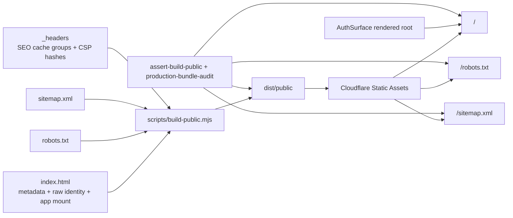

# feat: Add KS2 SEO Foundation

## Summary

Implement the V1 SEO foundation by enriching the public root experience, shipping valid crawler discovery assets through the existing public build, adding CSP-safe structured identity data, and extending build plus production audits so the live site cannot silently fall back to a sparse SPA shell.

---

## Problem Frame

The origin requirements establish that KS2 Mastery currently behaves like a production app first and a public discovery surface second. This plan keeps the existing app, demo, auth, and deployment boundaries intact while making the public root understandable to search crawlers, AI assistants, and prospective KS2 users.

---

## Requirements

- R1. Create a public, crawlable identity layer that explains KS2 Mastery in plain UK English without requiring sign-in.
- R2. Clearly state that KS2 Mastery supports KS2 spelling, grammar, and punctuation practice.
- R3. Describe the product by learner value and practice outcome, not only by internal module names.
- R4. Provide enough direct public text for humans and AI systems to understand who the product helps and when it is relevant.
- R5. Preserve a clear path into the existing app or demo experience without exposing private learner state.
- R6. Prioritise one strong public identity surface over many thin pages.
- R7. Expose valid crawler discovery files, including robots policy and sitemap discovery.
- R8. Add search-friendly metadata: title, description, canonical identity, and share-preview metadata.
- R9. Avoid accidental duplicate identities for the same content.
- R10. Account for the existing SPA shape so crawlers are not left with only a sparse shell.
- R11. Preserve security, privacy, authentication, demo, and learner-state boundaries.
- R12. Make Search Console-style discovery and indexing validation possible.
- R13. Prepare privacy-conscious aggregate visitor analytics for organic traffic review.
- R14. Treat analytics as decision support, not as a ranking mechanism.
- R15. Verify live production SEO resources and metadata, not only local build output.
- R16. Preserve future acquisition lanes: practice-tool intent, subject/problem intent, parent-support intent, and AI-readable product identity.
- R17. Leave a clear path for focused content pages later without committing to a content programme now.
- R18. Select later content pages based on organic value, product fit, and observed measurement signals.
- R19. Keep public SEO claims aligned with actual product capability and avoid recommendation guarantees.

**Origin actors:** A1 prospective KS2 learner/supporting adult; A2 search crawler; A3 AI search or assistant system; A4 James/product operator; A5 KS2 Mastery app.

**Origin flows:** F1 public discovery and product understanding; F2 search engine discovery and validation; F3 organic measurement and next-slice selection.

**Origin acceptance examples:** AE1 product identity is understandable without sign-in; AE2 app/demo entry preserves private data boundaries; AE3 discovery files and metadata work in production; AE4 public site is understandable without authenticated app flow; AE5 measurement supports decisions; AE6 later content lanes remain open.

---

## Scope Boundaries

- Do not build a blog, content farm, or broad keyword programme in this V1.
- Do not promise that Google, AI search, or assistants will recommend the site.
- Do not build paid advertising, school sales funnels, CRM flows, or conversion automation.
- Do not create separate V1 funnels for parents, tutors, and schools.
- Do not expose private learner data, authenticated read models, admin surfaces, internal analytics, or generated content stores as public SEO content.
- Do not add analytics tags as if they improve ranking directly.
- Do not weaken CSP, security headers, demo safeguards, auth boundaries, deployment controls, or privacy posture for SEO convenience.
- Do not add placeholder Google Analytics, Cloudflare Web Analytics, or Search Console verification tokens that are not backed by real external configuration.

### Deferred to Follow-Up Work

- Practice-tool landing pages: add focused pages such as KS2 spelling practice or KS2 grammar practice after the root foundation is live and measurable.
- Subject/problem landing pages: add pages for concrete needs such as apostrophes, punctuation, or Year 5 spelling words after V1 proves the publication path.
- Parent-support content: add home-support guidance only after the product identity and measurement baseline are stable.
- GA4 or Zaraz instrumentation: add only if James chooses that stack and supplies the real property/tag configuration.
- Search Console ownership verification: complete in the external account or a separate code slice when the chosen verification method is known.

---

## Context & Research

### Relevant Code and Patterns

- `index.html` is the canonical public root HTML and currently contains basic app/PWA metadata, one inline theme bootstrap script, an empty `#app`, and the React bundle entry.
- `manifest.webmanifest` already carries stronger app description than the HTML shell and should be kept consistent with the public identity copy.
- `src/surfaces/auth/AuthSurface.jsx` is the unauthenticated rendered destination at the root when no session exists; it should mirror the same product truth the raw HTML exposes.
- `tests/react-auth-boot.test.js` and `tests/helpers/react-render.js` provide an existing SSR-style fixture for AuthSurface assertions.
- `wrangler.jsonc` uses Cloudflare Workers Static Assets with SPA not-found handling. Static root files should flow through the existing assets build rather than a new Worker route.
- `scripts/build-public.mjs` controls which root files are copied into `dist/public`, versions the app bundle in HTML, and substitutes the CSP hash placeholder in `_headers`.
- `scripts/assert-build-public.mjs` is the local public-output gate and already rejects unexpected public artefacts or raw source leakage.
- `_headers` and `scripts/lib/headers-drift.mjs` define the deployed static asset security and cache contract.
- `worker/src/security-headers.js`, `worker/src/generated-csp-hash.js`, `tests/csp-policy.test.js`, and `tests/security-headers.test.js` guard the CSP Report-Only policy and inline-script hash path.
- `scripts/production-bundle-audit.mjs` and `tests/bundle-audit.test.js` are the right production gate for proving the live site returns SEO resources rather than SPA fallback HTML.

### Institutional Learnings

- `docs/solutions/architecture-patterns/admin-console-section-extraction-pattern-2026-04-27.md`: check existing platform configuration before inventing new routes; extend the established surface when the current platform already has a seam.
- `docs/solutions/workflow-issues/sys-hardening-p2-13-unit-autonomous-sprint-learnings-2026-04-26.md`: keep coupled build, public-output, audit, and runtime changes atomic so reverting one file cannot leave a silent production gap.
- `docs/plans/2026-04-23-001-feat-full-lockdown-runtime-plan.md`: public output allowlists and bundle audits are production boundaries; SEO assets must be added deliberately, not by broadening public copy rules.

### External References

- Google Search Central: [Build and submit a sitemap](https://developers.google.com/search/docs/crawling-indexing/sitemaps/build-sitemap)
- Google Search Central: [Control snippets in search results](https://developers.google.com/search/docs/appearance/snippet)
- Google Search Central: [JavaScript SEO basics](https://developers.google.com/search/docs/crawling-indexing/javascript/javascript-seo-basics)
- Google Search Central: [Use Search Console with Google Analytics](https://developers.google.com/search/docs/monitor-debug/google-analytics-search-console)
- Cloudflare Docs: [Get started with Web Analytics](https://developers.cloudflare.com/web-analytics/get-started/)
- Cloudflare Docs: [Google Analytics reference](https://developers.cloudflare.com/fundamentals/reference/google-analytics/)

---

## Key Technical Decisions

- Integrate V1 into the root public experience: The strongest first surface is `https://ks2.eugnel.uk/`, with raw HTML fallback content for non-JS readers and matching AuthSurface copy for JS-rendered users.
- Publish discovery assets as static files: `robots.txt` and `sitemap.xml` should be copied by the public build and served by Cloudflare Static Assets, avoiding unnecessary Worker routing.
- Add structured identity data only through the CSP-safe path: V1 should use inline JSON-LD for machine-readable product identity, and the inline-script hashing pipeline must support it in the same change; SEO must not introduce untracked inline script drift.
- Keep sitemap scope intentionally narrow: V1 should list the canonical root URL only, because later content pages do not exist yet and private app routes should not be advertised.
- Prefer Cloudflare Web Analytics as the first visitor-analytics option: It matches the existing hosting stack and can be documented without adding placeholder third-party IDs; GA4/Zaraz remains a later explicit choice.
- Treat production audit as the release gate: The live audit must prove `/robots.txt`, `/sitemap.xml`, and `/` return the intended SEO content and metadata, because local build success would not catch Cloudflare SPA fallback regressions.

---

## Open Questions

### Resolved During Planning

- Public route shape: Use the existing root entry rather than a separate mini-site or new Worker route.
- Discovery file delivery: Use static public assets copied by `scripts/build-public.mjs`.
- Measurement stack: Document Search Console and Cloudflare Web Analytics readiness in V1; defer real GA4/Zaraz wiring until James chooses a property/tag setup.
- First post-foundation content slice: Defer until V1 is live and there is indexing or traffic evidence to guide the next page.

### Deferred to Implementation

- Final public copy wording: Implementation should tune concise UK English copy, but it must stay within R1-R5 and R19.
- Structured data shape: Implementation should choose the smallest accurate schema vocabulary that represents the public product identity without overstating educational outcomes.
- Exact Web Analytics enablement path: Implementation should document the Cloudflare setup path, but actual dashboard activation or token insertion depends on external configuration.
- Search Console ownership method: Implementation should document options; the chosen verification method depends on James's Google account/property setup.

---

## High-Level Technical Design

> *This illustrates the intended approach and is directional guidance for review, not implementation specification. The implementing agent should treat it as context, not code to reproduce.*

---

## Implementation Units

- U1. **Public Root Identity and Metadata**

**Goal:** Make the root page understandable to raw HTML readers, rendered JS users, search crawlers, and AI assistants without requiring sign-in.

**Requirements:** R1, R2, R3, R4, R5, R6, R8, R9, R10, R11, R19; F1; AE1, AE2, AE4.

**Dependencies:** None.

**Files:**
- Modify: `index.html`
- Modify: `manifest.webmanifest`
- Modify: `src/surfaces/auth/AuthSurface.jsx`
- Modify: `tests/react-auth-boot.test.js`
- Modify: `tests/build-public.test.js`
- Modify: `scripts/assert-build-public.mjs`

**Approach:**
- Replace the generic platform title with a search-readable KS2 Mastery title and description that mention spelling, grammar, and punctuation.
- Add canonical, Open Graph, and Twitter/share metadata for the root URL.
- Add concise crawlable root fallback content inside the app mount so non-JS readers can understand the product before React replaces it.
- Update AuthSurface unauthenticated copy so the rendered root repeats the same product identity and gives a clear path into the existing demo or sign-in flow.
- Keep the visible copy factual and product-aligned: KS2 practice support, not guaranteed results or broad curriculum coverage.

**Patterns to follow:**
- Existing PWA metadata in `index.html`.
- AuthSurface copy and error-state branching in `src/surfaces/auth/AuthSurface.jsx`.
- SSR-style AuthSurface assertions in `tests/react-auth-boot.test.js`.
- Public build assertions in `scripts/assert-build-public.mjs`.

**Test scenarios:**
- Covers AE1. Happy path: reading built `dist/public/index.html` finds the KS2 Mastery product name, KS2 spelling, grammar, punctuation, and a plain-language learner value proposition.
- Covers AE2. Happy path: rendering AuthSurface without a session shows the product identity plus existing sign-in/social/demo paths, with no private learner data.
- Covers AE4. Integration: built root HTML contains enough identity text before JavaScript runs, and the rendered AuthSurface still contains matching identity after JavaScript runs.
- Edge case: metadata contains one canonical root URL and does not introduce duplicate canonical identities.
- Error path: public build assertion fails if the root HTML regresses to the old sparse app-shell title or loses the required description.

**Verification:**
- The source and built root HTML both expose accurate product identity, and the unauthenticated React surface mirrors it without changing the authenticated app destination.

---

- U2. **CSP-Safe Structured Identity Data**

**Goal:** Add JSON-LD structured product identity in a way that preserves the existing CSP and inline-script hardening contract.

**Requirements:** R4, R8, R10, R11, R15, R19; F1, F2; AE1, AE3, AE4.

**Dependencies:** U1.

**Files:**
- Modify: `index.html`
- Modify: `scripts/compute-inline-script-hash.mjs`
- Modify: `scripts/build-public.mjs`
- Modify: `worker/src/generated-csp-hash.js`
- Modify: `worker/src/security-headers.js`
- Modify: `_headers`
- Modify: `scripts/lib/headers-drift.mjs`
- Modify: `tests/csp-policy.test.js`
- Modify: `tests/security-headers.test.js`
- Modify: `tests/build-public.test.js`
- Modify: `scripts/assert-build-public.mjs`

**Approach:**
- Add the smallest accurate JSON-LD identity block for the public product, focused on name, URL, audience, practice areas, and application category.
- Generalise the CSP hash pipeline so every intentional inline script block in `index.html` is hashed or otherwise explicitly classified, instead of assuming a single theme bootstrap script forever.
- Update the generated hash module, public hash artefact, and CSP tests atomically so no runtime or audit path assumes only one inline hash.
- Keep `_headers` and `worker/src/security-headers.js` in sync so Static Assets and Worker responses report the same CSP allowance.
- Keep the pre-build placeholder behaviour that lets a fresh checkout run tests before the public build generates real hashes.

**Execution note:** Add characterization coverage for the current single-inline-script helper before generalising it, because this path is security-sensitive and already has deployment history.

**Patterns to follow:**
- Existing CSP hash generation in `scripts/build-public.mjs`.
- CSP policy exports and tests in `worker/src/security-headers.js`, `tests/csp-policy.test.js`, and `tests/security-headers.test.js`.
- Drift-contract style in `scripts/lib/headers-drift.mjs`.

**Test scenarios:**
- Happy path: the hash helper accepts the theme bootstrap plus the structured identity block and returns all CSP tokens needed by the source HTML.
- Covers AE3. Integration: the built `_headers` substitutes real CSP hash tokens and contains no build-time placeholder tokens.
- Integration: the public CSP hash artefact records every intentional inline hash needed to explain what shipped.
- Edge case: adding an unexpected third inline script without classification fails loudly rather than silently shipping an untracked CSP gap.
- Error path: a mismatched `_headers` CSP token fails the existing drift contract.
- Covers AE1. Happy path: built root HTML contains parseable structured identity data that names KS2 Mastery and does not include private learner or admin terms.

**Verification:**
- Structured identity is present in public HTML, the CSP policy accounts for it, and no test or audit path needs CSP weakening.

---

- U3. **Crawler Discovery Assets**

**Goal:** Ship valid `/robots.txt` and `/sitemap.xml` responses as first-class public assets rather than SPA fallback HTML.

**Requirements:** R7, R9, R10, R11, R12, R15; F2; AE3.

**Dependencies:** U1.

**Files:**
- Create: `robots.txt`
- Create: `sitemap.xml`
- Modify: `scripts/build-public.mjs`
- Modify: `scripts/assert-build-public.mjs`
- Modify: `_headers`
- Modify: `scripts/lib/headers-drift.mjs`
- Modify: `tests/build-public.test.js`
- Modify: `tests/security-headers.test.js`

**Approach:**
- Add a simple robots policy that allows the public root and advertises the sitemap URL.
- Add a minimal sitemap containing the canonical root URL only.
- Include both files in the public-build allowlist and top-level output assertions.
- Add explicit `_headers` cache groups for text/XML discovery resources so Cloudflare does not merge an unintended wildcard cache policy.
- Keep private, API, admin, and authenticated app routes out of the sitemap.

**Patterns to follow:**
- Static asset entry handling in `scripts/build-public.mjs`.
- Top-level allowlist checks in `scripts/assert-build-public.mjs`.
- Cache split rules in `scripts/lib/headers-drift.mjs`.

**Test scenarios:**
- Covers AE3. Happy path: `dist/public/robots.txt` exists, is plain text, references `https://ks2.eugnel.uk/sitemap.xml`, and does not contain app-shell HTML.
- Covers AE3. Happy path: `dist/public/sitemap.xml` exists, is valid XML, contains only the canonical root URL, and does not include `/api`, `/admin`, private learner routes, or local URLs.
- Edge case: public output allowlist rejects unexpected top-level files while accepting the two new SEO files.
- Integration: `_headers` drift tests require cache groups for `/robots.txt` and `/sitemap.xml` without adding `Cache-Control` to the wildcard `/*` block.

**Verification:**
- Local public output contains real discovery files and the static header contract recognises them as intentional public resources.

---

- U4. **Production SEO Audit Gate**

**Goal:** Extend live production validation so SEO regressions are caught after deployment, especially Cloudflare SPA fallback behaviour.

**Requirements:** R7, R8, R9, R10, R11, R12, R15; F2; AE3, AE4.

**Dependencies:** U1, U2, U3.

**Files:**
- Modify: `scripts/production-bundle-audit.mjs`
- Modify: `tests/bundle-audit.test.js`

**Approach:**
- Add production fetch checks for `/`, `/robots.txt`, and `/sitemap.xml`.
- Validate response bodies, content types where available, canonical URL consistency, required product identity text, metadata, structured data, and absence of SPA fallback HTML in discovery files.
- Keep audit errors specific enough for deployment triage, naming the failed URL and missing or malformed SEO contract.
- Preserve existing forbidden-token, security-header, demo bootstrap, and cache checks.

**Execution note:** Drive the new audit behaviours with stub-origin tests before touching the production audit script, because this script is a release gate and should fail loudly on realistic regressions.

**Patterns to follow:**
- Stub-origin tests already present in `tests/bundle-audit.test.js`.
- Existing live header and forbidden-token checks in `scripts/production-bundle-audit.mjs`.

**Test scenarios:**
- Covers AE3. Happy path: stub production origin with valid root metadata, robots file, and sitemap passes the SEO audit checks.
- Error path: stub origin returning `index.html` for `/robots.txt` fails with a clear SPA fallback message.
- Error path: sitemap missing the canonical root URL fails.
- Error path: root HTML missing canonical URL, meta description, or product identity text fails.
- Covers AE4. Integration: root audit checks raw HTML identity without requiring authenticated app APIs or demo session setup.

**Verification:**
- Production audit can distinguish a real SEO foundation from a deployment that only serves the generic SPA shell.

---

- U5. **SEO Operations and Measurement Readiness**

**Goal:** Give James a clear operator path for indexing, analytics selection, and next content decisions without baking unknown external tokens into the repo.

**Requirements:** R12, R13, R14, R16, R17, R18, R19; F3; AE5, AE6.

**Dependencies:** U1, U3, U4.

**Files:**
- Create: `docs/operations/seo.md`

**Approach:**
- Document the V1 production validation checklist: root metadata, robots, sitemap, Search Console submission, and production audit outcome.
- Explain the current analytics state: Worker observability is infrastructure telemetry; Cloudflare Web Analytics is the preferred visitor analytics option; GA4/Zaraz is optional and separate.
- Capture privacy and CSP considerations for any later analytics script.
- Record the four future acquisition lanes from the origin requirements and the rule for choosing the next page from evidence, not broad keyword chasing.

**Patterns to follow:**
- Operational guidance style in `docs/operations/capacity.md`.
- Origin scope boundaries and future content lanes in `docs/brainstorms/2026-04-28-ks2-seo-foundation-requirements.md`.

**Test scenarios:**
- Test expectation: none -- this unit is documentation and external-operations guidance only.

**Verification:**
- The docs give James enough information to validate indexing readiness and decide whether to enable Cloudflare Web Analytics or GA4/Zaraz as a separate configured step.

---

## System-Wide Impact

- **Interaction graph:** Root HTML, AuthSurface, public-build copy rules, Static Assets headers, Worker security headers, and production audit now jointly define the public SEO contract.
- **Error propagation:** Build assertions should catch missing local artefacts; production audit should catch Cloudflare fallback or header/content-type mismatches; documentation should handle dashboard-only setup gaps.
- **State lifecycle risks:** No learner, session, D1, R2, or generated content state should become public. SEO content is static identity copy only.
- **API surface parity:** No app API contract changes are planned. The only public surface additions are static root/discovery responses and metadata.
- **Integration coverage:** Local output tests prove assets exist; production audit proves the deployed domain returns the intended resources.
- **Unchanged invariants:** Authenticated app flows, demo session behaviour, security headers, CSP Report-Only posture, and deployment scripts remain in place.

---

## Risks & Dependencies

| Risk | Mitigation |
|------|------------|
| `/robots.txt` or `/sitemap.xml` still fall back to `index.html` in production | Add static assets through `scripts/build-public.mjs` and verify live responses in `scripts/production-bundle-audit.mjs`. |
| JSON-LD or other structured data breaks the CSP hash contract | Treat structured data and CSP hash support as one implementation unit with tests across build, Worker headers, and `_headers`. |
| Public copy overstates the product | Keep copy limited to KS2 spelling, grammar, and punctuation practice, with tests/audit checks for the core terms and documentation of R19. |
| Analytics setup creates privacy or CSP drift | Do not add placeholder tags in V1; document Cloudflare Web Analytics first and defer GA4/Zaraz wiring until real configuration is chosen. |
| Search ranking or AI recommendation expectations become overclaimed | Keep docs and public copy explicit that this improves crawlability and understandability, not guaranteed placement. |

---

## Documentation / Operational Notes

- `docs/operations/seo.md` should be the operator-facing reference for Search Console submission, analytics choices, production checks, and next content planning.
- Production verification after deployment should inspect the live domain, not only the local `dist/public` output.
- If James later chooses GA4, Zaraz, or Cloudflare Web Analytics snippet insertion, that work should include a fresh CSP/privacy review rather than editing `index.html` in isolation.

---

## Alternative Approaches Considered

- Separate landing page route: Rejected for V1 because the canonical root is the most valuable identity surface and a second page would add duplicate-identity risk before the product needs multiple public pages.
- Worker-handled SEO routes: Rejected because Static Assets and the public build already provide the correct seam for root discovery files.
- Analytics script wiring in V1: Rejected until real property or site-token configuration exists; placeholder IDs would create false confidence and possible CSP/privacy churn.
- Broad content page launch: Rejected for V1 because the origin requirements prioritise one strong AI-readable product identity surface before ranking specific queries.

---

## Success Metrics

- Live `/robots.txt` returns a robots policy, not HTML.
- Live `/sitemap.xml` returns a sitemap containing the canonical root URL, not HTML.
- Live `/` exposes title, meta description, canonical URL, share metadata, public identity text, and structured identity data.
- Search Console can submit or inspect the sitemap and root URL after release.
- James can choose the next SEO content slice from measured indexing or organic traffic signals rather than guessing.

---

## Sources & References

- Origin document: [docs/brainstorms/2026-04-28-ks2-seo-foundation-requirements.md](../brainstorms/2026-04-28-ks2-seo-foundation-requirements.md)
- Public shell: `index.html`
- Public app manifest: `manifest.webmanifest`
- Auth surface: `src/surfaces/auth/AuthSurface.jsx`
- Public build: `scripts/build-public.mjs`
- Public build assertion: `scripts/assert-build-public.mjs`
- Static headers: `_headers`
- Header drift contract: `scripts/lib/headers-drift.mjs`
- Worker security headers: `worker/src/security-headers.js`
- Production audit: `scripts/production-bundle-audit.mjs`
- Google Search Central sitemap guidance: [developers.google.com/search/docs/crawling-indexing/sitemaps/build-sitemap](https://developers.google.com/search/docs/crawling-indexing/sitemaps/build-sitemap)
- Google Search Central snippet guidance: [developers.google.com/search/docs/appearance/snippet](https://developers.google.com/search/docs/appearance/snippet)
- Google Search Central JavaScript SEO basics: [developers.google.com/search/docs/crawling-indexing/javascript/javascript-seo-basics](https://developers.google.com/search/docs/crawling-indexing/javascript/javascript-seo-basics)
- Google Search Console and Analytics guidance: [developers.google.com/search/docs/monitor-debug/google-analytics-search-console](https://developers.google.com/search/docs/monitor-debug/google-analytics-search-console)
- Cloudflare Web Analytics: [developers.cloudflare.com/web-analytics/get-started](https://developers.cloudflare.com/web-analytics/get-started/)
- Cloudflare Google Analytics reference: [developers.cloudflare.com/fundamentals/reference/google-analytics](https://developers.cloudflare.com/fundamentals/reference/google-analytics/)
