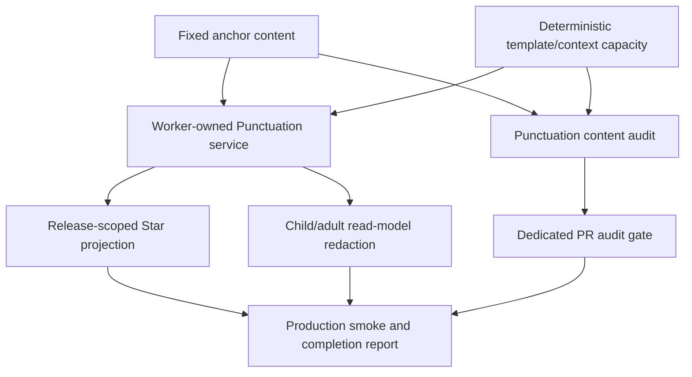
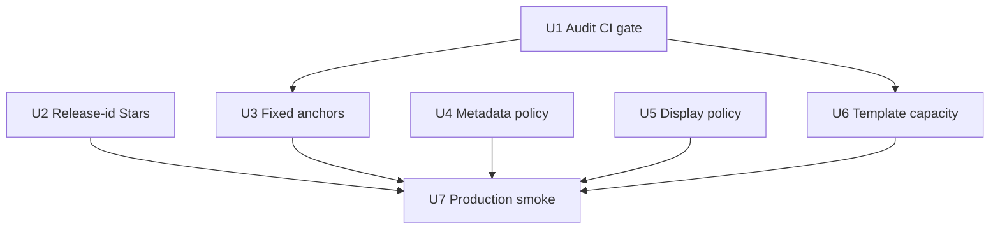
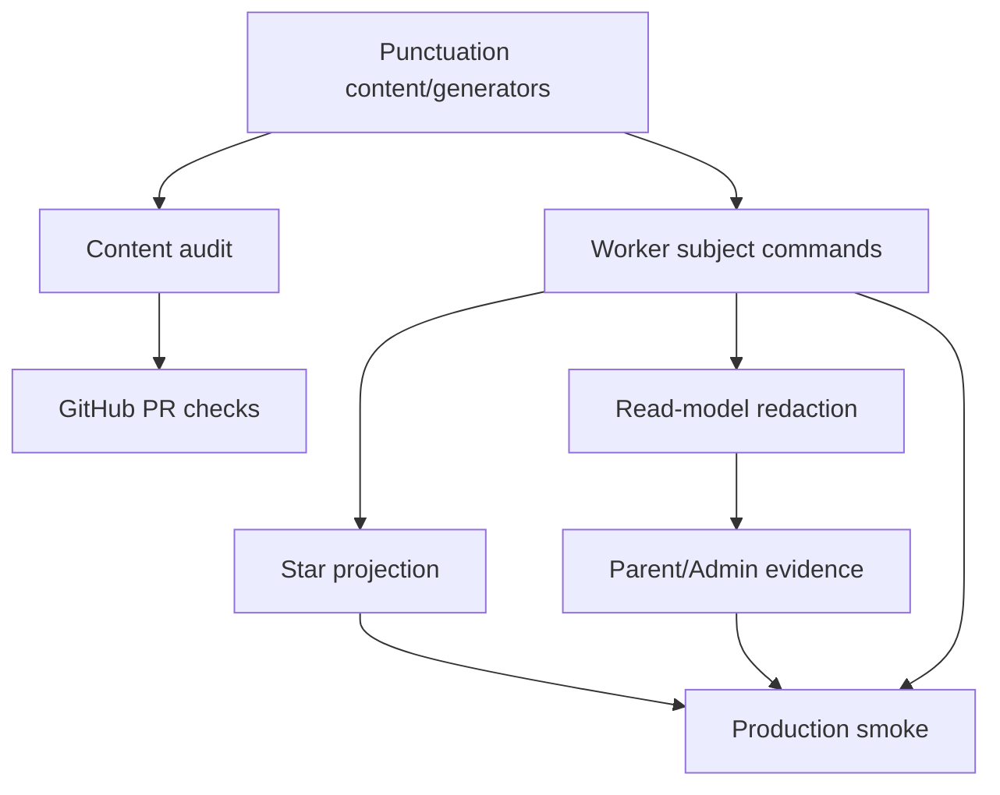

# feat: Punctuation QG P2 Depth and Release Gate

## Summary

This plan turns the P1-safe Punctuation generator bank into a deeper, release-gated P2 practice portfolio. It keeps runtime generation deterministic, holds production `generatedPerFamily` at 4, preserves the 14 published reward units, adds fixed anchor depth where the bank is thin, hardens release-id Star evidence, and makes audit, metadata, display-policy, and production-smoke gates explicit before any larger generator-volume move.

---

## Problem Frame

P1 moved Punctuation from a shallow 96-item bank to a guarded 171-item deterministic runtime with generated item metadata, duplicate-signature detection, scheduler signature avoidance, and audit coverage. That closed the first safety problem: generated items can be added without runtime AI or reward-denominator drift.

P2 exists because the mastery problem is still open. Several priority skills still have only 4-5 fixed anchors, the content audit is available but not an explicit PR workflow gate, release-scoped Star projection needs targeted old-release regression coverage, and the current browser-facing generated-metadata contract is pragmatic but not documented tightly enough for future reviewers.

---

## Assumptions

*This plan was authored from the supplied P2 source note and current repo research without a synchronous scope-confirmation round. The items below are agent inferences that should be reviewed before implementation proceeds.*

- The completed P1 plan remains historical context; P2 should create a new implementation plan rather than update `docs/plans/2026-04-28-001-feat-punctuation-generator-guardrails-expansion-plan.md`.
- P2 should be delivered as a small PR sequence, but the plan covers the whole P2 scope so reviewers can see the release gate end to end.
- The metadata policy should adopt the source note's recommended pragmatic option: `variantSignature` may appear on the active generated `currentItem` as an opaque transport value, while GPS delayed review, Parent Hub, Admin Hub, and adult evidence surfaces remain redacted.
- The production smoke gate can extend the existing Punctuation production smoke script and completion report; it does not require a Playwright redesign in this phase.

---

## Requirements

- R1. Punctuation learner questions, model answers, validators, and marking must remain deterministic and teacher-authored; no runtime AI question generation is introduced.
- R2. Production runtime `generatedPerFamily` remains 4 unless separately approved.
- R3. The runtime portfolio grows mainly through fixed anchors, targeting approximately 190-215 runtime items after P2 while preserving 14 published reward units.
- R4. Fixed anchor depth improves for `sentence_endings`, `apostrophe_contractions`, `comma_clarity`, `semicolon_list`, `hyphen`, and `dash_clause`.
- R5. New fixed items carry complete content metadata: item identity, prompt/stem/model, mode/input kind, skill and reward-unit mapping, readiness, misconception tags, and validator/rubric coverage where free-text marking needs flexibility.
- R6. Deterministic generated template capacity deepens for the priority generator families without increasing production runtime volume.
- R7. The Punctuation content audit becomes a CI-backed PR gate with explicit per-family generated count, template/signature coverage, duplicate-signature, generated-model-marking, fixed-anchor, and validator-coverage checks.
- R8. Old-release reward-unit evidence cannot inflate current-release Secure Stars, Mastery Stars, or Grand Stars; current-release evidence and legacy signed/unsigned generated attempt coalescing still work.
- R9. Browser-facing generated metadata policy is explicit and tested: active generated `currentItem` may carry opaque `variantSignature`, while review/adult evidence surfaces do not expose hidden generated metadata.
- R10. Dash display and marking policy is consistent: model display uses a deliberate dash form, while marking continues accepting spaced hyphen, en dash, and em dash where appropriate.
- R11. Oxford-comma policy remains explicit: default free-text list validators accept the final comma unless the item deliberately forbids it and explains the house-style constraint.
- R12. Context-pack expansion remains deterministic, audit-backed, and answer-safe; context packs must not introduce hidden answer drift or bypass validators.
- R13. Production smoke proves the deployed build includes the P2 changes and covers Smart Review, generated item completion, GPS delayed review, hidden metadata redaction, runtime stats, misconception tagging, dash acceptance, and Oxford-comma acceptance.

---

## Scope Boundaries

- No runtime AI-authored learner questions, explanations, validators, or marking.
- No Punctuation UI redesign, new Star model, Hero Mode coupling, new subject route, or new reward units.
- No production increase above `generatedPerFamily = 4` in this phase.
- No paragraph item added merely to inflate multi-skill evidence.
- No generated item without audit and deterministic marking coverage.
- No raw Cloudflare deployment command changes; normal deployment paths remain the package scripts described in `AGENTS.md`.
- No broad generator DSL rewrite in P2.

### Deferred to Follow-Up Work

- **P3 generator DSL and authoring tools:** Slot-builder authoring, preview tooling, and broader content-author ergonomics belong after P2 proves the current deterministic bank can be safely deepened.
- **P4 evidence and scheduler maturity:** Spaced-return requirements by skill, sibling-template retry after misconception, signature exposure limits, and generated-repeat analytics remain a later evidence-quality phase.
- **P5 mature portfolio and monitoring:** Raising runtime generated volume above 4 and reaching the larger 280-420 item portfolio should wait for proven spare capacity and monitoring.
- **Internal-only generated metadata transport:** If reviewers reject the opaque `variantSignature` transport contract, a server-side lookup or session-scoped token design should be planned separately because it changes the submission contract more deeply.

---

## Context & Research

### Relevant Code and Patterns

- `shared/punctuation/service.js` currently sets production `GENERATED_ITEMS_PER_FAMILY` to 4 and exposes 171 runtime items with 14 published reward units.
- `shared/punctuation/generators.js` already attaches generated `templateId` and `variantSignature`, preserves legacy first variants, and supports context-pack template substitution.
- `scripts/audit-punctuation-content.mjs` already reports fixed/generated/runtime counts, generated signatures, duplicate signatures, validator coverage, and generated model-answer marking.
- `tests/punctuation-content-audit.test.js` proves the current strict generated-per-family 4 audit passes and that generated-per-family 5 currently fails duplicate-signature capacity.
- `.github/workflows/node-test.yml` and `.github/workflows/audit.yml` are existing PR gates, but there is no dedicated Punctuation content-audit workflow.
- `src/subjects/punctuation/star-projection.js` accepts a current release id but needs explicit old-release reward-unit regression coverage in Secure, Mastery, and Grand Star paths.
- `tests/punctuation-service.test.js` already checks old-release reward units do not count in service stats and summaries; P2 needs the same confidence at projection/read-model level.
- `shared/punctuation/service.js` carries generated `variantSignature` into active item state and attempts; `tests/punctuation-gps.test.js` already confirms GPS delayed-review rows omit `variantSignature`.
- `tests/helpers/forbidden-keys.mjs` is the shared forbidden-key oracle for read-model and production-smoke redaction checks.
- `scripts/punctuation-production-smoke.mjs` already covers Worker-backed Smart Review, GPS delayed review, Parent Hub evidence redaction, and English Spelling startup.
- The current strict audit with generated-per-family 4 reports 71 fixed items, 100 generated items, 171 runtime items, 25 generator families, and 14 published reward units.
- Current priority fixed-anchor counts are: `sentence_endings` 4, `apostrophe_contractions` 5, `comma_clarity` 4, `semicolon_list` 4, `hyphen` 5, and `dash_clause` 5.

### Institutional Learnings

- `docs/solutions/architecture-patterns/punctuation-p6-star-truth-monotonic-hardening-2026-04-27.md` warns that reward and child-facing Star code needs adversarial treatment because threshold and evidence mismatches become learner-trust failures.
- `docs/solutions/architecture-patterns/punctuation-p7-stabilisation-contract-and-autonomous-sdlc-2026-04-28.md` says client-safe metadata should have one canonical source and exact-value drift tests should pin public contracts.
- Prior Punctuation phases repeatedly found green tests that did not prove production reality. P2 therefore needs a CI audit gate and production smoke evidence, not only source-level unit tests.

### External References

- No external framework research is required. The work is repo-native JavaScript, Node `node:test`, GitHub Actions workflow configuration, deterministic Worker-owned subject logic, and existing Punctuation content patterns.

---

## Key Technical Decisions

| Decision | Rationale |
|---|---|
| Treat P2 as a new plan after the completed P1 guardrail plan | P1 already shipped the baseline generator metadata and 171-item runtime. P2 should not reopen completed scope except where release safety needs follow-on tests. |
| Add fixed anchors before any generator-volume increase | The source note explicitly frames fixed anchors as human-authored mastery anchors. More generated volume without fixed depth would improve headline count while leaving skill boundaries thin. |
| Add a dedicated Punctuation content-audit PR gate | A separate workflow makes content regressions visible and keeps the Punctuation audit from being an optional local command or buried inside broader test output. |
| Filter release-scoped reward-unit Star evidence at projection level | Service stats already protect one path, but child-facing Star projection and grand evidence must independently reject old-release secured entries. |
| Use opaque active-item `variantSignature` transport for P2 | This matches the current implementation and the source note's recommended option while keeping delayed review and adult evidence surfaces clean. |
| Use spaced en dash for dash-clause model display, while retaining permissive marking | Learners should not be taught spaced hyphen as the canonical dash form. Spaced en dash is a clear UK English display convention for these teaching examples, while existing sensible learner input variants should remain accepted. |
| Keep template capacity separate from production runtime volume | P2 can add spare deterministic capacity and audit it at higher generated-per-family values without changing the learner-facing runtime count. |

---

## Open Questions

### Resolved During Planning

- **Should P2 raise production `generatedPerFamily` above 4?** No. The source note explicitly says not to raise it in P2.
- **Should P2 change reward denominators?** No. The published reward-unit count remains 14.
- **Should the audit gate be new or folded into existing workflows?** Use a dedicated workflow so Punctuation content regressions have a clear release-gate signal.
- **Should external best-practice research be added?** No. The plan is grounded in established repo patterns and no new external framework or service is introduced.
- **Which browser metadata policy should the plan use?** Use opaque active-item transport for `variantSignature`, with explicit redaction elsewhere.

### Deferred to Implementation

- **Exact fixed item wording and models:** The plan specifies target skills and coverage, but content wording should be authored and reviewed during implementation.
- **Exact fixed-anchor threshold activation point in CI:** U1 should add the threshold capability and current-compatible PR gate. U3 should activate the P2 target thresholds once the new fixed anchors exist, so the workflow never lands red.
- **Exact generated-capacity thresholds:** The plan requires deeper spare capacity for priority families; the implementer should decide whether the first hard gate is 8 or 12 based on the authored template set and audit readability.
- **Exact production-smoke build identity source:** Use whatever deployed-build metadata the app already exposes; if no safe source exists, the completion report should record the verified deployment URL and commit evidence from the deployment platform.

---

## High-Level Technical Design

> *This illustrates the intended approach and is directional guidance for review, not implementation specification. The implementing agent should treat it as context, not code to reproduce.*

The implementation should harden gates first, then add content depth, then prove the deployed release. Fixed anchors and template capacity both flow through the audit; release-id and redaction policy flow through service/read-model tests and production smoke.

---

## Implementation Units

- U1. **Add CI-Backed Punctuation Content Audit Gate**

**Goal:** Turn the existing Punctuation content audit into an explicit release gate with per-family and priority-skill checks.

**Requirements:** R2, R3, R6, R7, R12

**Dependencies:** None

**Files:**
- Modify: `scripts/audit-punctuation-content.mjs`
- Modify: `tests/punctuation-content-audit.test.js`
- Create: `.github/workflows/punctuation-content-audit.yml`
- Reference: `package.json`
- Reference: `.github/workflows/audit.yml`
- Reference: `shared/punctuation/content.js`
- Reference: `shared/punctuation/generators.js`

**Approach:**
- Extend the audit thresholds to distinguish per-skill coverage, per-family generated count, distinct template coverage, distinct signature coverage, duplicate signatures, generated model-answer marking, fixed-anchor depth, and validator coverage.
- Land U1 with a current-compatible workflow gate, while adding tests that prove stricter P2 fixed-anchor thresholds can fail when invoked. U3 should switch the workflow to the P2 fixed-anchor thresholds after the new anchors exist.
- Keep duplicate generated stems/models review-visible without making them hard failures by default unless the dedicated duplicate-content option is selected.
- Add a dedicated PR workflow using the repo's existing Node setup pattern and least-privilege `contents: read` permissions.
- Keep production `generatedPerFamily` unchanged; the audit gate checks the runtime setting used for P2 and can also support capacity-only checks for U6.

**Execution note:** Start with failing audit tests for the new threshold behaviours before changing the audit implementation.

**Patterns to follow:**
- `scripts/audit-punctuation-content.mjs` for current summary and machine-readable audit shape.
- `tests/punctuation-content-audit.test.js` for fixture-based positive and negative audit checks.
- `.github/workflows/audit.yml` for PR workflow shape, Node 22, dependency install, timeout, and permissions style.

**Test scenarios:**
- Happy path: current source with strict generated-per-family 4 passes the current-compatible PR gate for per-family generated count, template count, distinct signature, generated model-answer marking, and validator checks.
- Edge case: a published generator family fixture producing fewer than the required generated items fails with a machine-readable family-level failure.
- Edge case: a fixture with duplicate generated `variantSignature` values fails the duplicate-signature gate even when item ids differ.
- Edge case: a priority skill fixture below the P2 fixed-anchor threshold fails the fixed-anchor gate.
- Error path: a generated item whose model answer does not pass deterministic marking fails the generated-model-marking gate with family and template context.
- Integration: the new workflow runs the Punctuation audit as its own PR check and does not require Cloudflare credentials.

**Verification:**
- The audit has explicit threshold options for the P2 release gate.
- The dedicated GitHub Actions workflow is present, scoped to PR/manual execution, and green before U3/U6 content changes.
- Stricter P2 fixed-anchor threshold support exists but is not made a required workflow gate until U3 updates the content.

---

- U2. **Harden Release-Scoped Star Projection**

**Goal:** Ensure old-release reward-unit evidence cannot inflate current-release Secure, Mastery, or Grand Star projections.

**Requirements:** R3, R8

**Dependencies:** None

**Files:**
- Modify: `src/subjects/punctuation/star-projection.js`
- Test: `tests/punctuation-star-projection.test.js`
- Test: `tests/punctuation-read-model.test.js`
- Reference: `tests/punctuation-service.test.js`
- Reference: `shared/punctuation/content.js`

**Approach:**
- Treat `releaseId` as an active projection boundary for reward-unit evidence, not only a parameter passed through for documentation.
- Filter reward-unit entries by current release before counting direct Secure Stars, Mastery Stars, and Grand Stars. Derive the release from explicit entry metadata where present, fall back to the mastery-key prefix only when necessary, and avoid treating unknown or mismatched release evidence as current by default.
- Preserve item/facet/attempt evidence semantics so current generated signatures and legacy unsigned attempts still coalesce safely.
- Keep old learner history stored; the change is read-time evidence scoping, not a destructive migration.

**Execution note:** Add regression tests first because the risk is a false positive: old state can look valid unless the test deliberately mixes releases.

**Patterns to follow:**
- `tests/punctuation-service.test.js` old-release service stats regression.
- Existing `tests/punctuation-star-projection.test.js` generated-signature and grand-star scenarios.
- `docs/solutions/architecture-patterns/punctuation-p6-star-truth-monotonic-hardening-2026-04-27.md` for adversarial treatment of reward evidence.

**Test scenarios:**
- Happy path: current-release secured reward units still count towards direct Secure Stars and Grand Stars.
- Edge case: an old-release secured reward unit with positive `securedAt` does not increase current direct Secure Stars.
- Edge case: mixed old-release and current-release reward units count only the current-release entries for direct monsters.
- Edge case: old-release reward units alone do not satisfy Grand Star breadth or secured-unit tier gates.
- Edge case: a reward-unit entry with missing or ambiguous release metadata does not count as current release unless its mastery key clearly belongs to the current release.
- Integration: `buildPunctuationLearnerReadModel` starView reflects the release-scoped projection when subject state contains mixed-release reward units.
- Regression: generated attempts with current `variantSignature` still dedupe equivalent surfaces for Try/Secure evidence.
- Regression: legacy unsigned attempts still coalesce with signed attempts for the same generated surface.

**Verification:**
- Current-release Star behaviour remains unchanged for normal learners.
- Old-release reward-unit evidence cannot inflate direct or grand current-release Stars.

---

- U3. **Add Fixed Anchor Depth for Priority Skills**

**Goal:** Increase human-authored fixed anchor depth for the six thin priority skills before any further generated runtime expansion.

**Requirements:** R1, R3, R4, R5, R7, R11

**Dependencies:** U1

**Files:**
- Modify: `shared/punctuation/content.js`
- Modify: `.github/workflows/punctuation-content-audit.yml`
- Modify: `tests/punctuation-content.test.js`
- Modify: `tests/punctuation-content-audit.test.js`
- Test: `tests/punctuation-marking.test.js`
- Reference: `shared/punctuation/marking.js`

**Approach:**
- Add approximately 21 fixed items across the source-note priority skills: `sentence_endings` (+4), `apostrophe_contractions` (+3), `comma_clarity` (+4), `semicolon_list` (+4), `hyphen` (+3), and `dash_clause` (+3).
- Keep new anchors focused on skill boundaries, misconception coverage, transfer evidence, and validator-backed free-text paths.
- Avoid paragraph or multi-skill items unless the item genuinely tests transfer and repair rather than inflating evidence breadth.
- Update service/runtime count expectations after fixed anchors land; the expected P2 runtime should sit around 192 items if production generated volume remains 100.
- Tighten the workflow's fixed-anchor thresholds only after the new fixed content is present, using the audit support added in U1.
- Preserve the published reward-unit count at 14.

**Patterns to follow:**
- Existing fixed item objects in `shared/punctuation/content.js`.
- `tests/punctuation-content.test.js` skill/reward/readiness validation.
- `tests/punctuation-marking.test.js`, `tests/punctuation-combine.test.js`, and `tests/punctuation-paragraph.test.js` for accepted/rejected deterministic marking coverage.

**Test scenarios:**
- Happy path: each priority skill's fixed item count reaches its P2 target after new anchors are added.
- Happy path: runtime item count increases through fixed items while generated item count remains 100 at production generated-per-family 4.
- Happy path: published reward-unit count remains 14 and reward-unit ids remain stable.
- Edge case: every new free-text fixed item either has deterministic validator/rubric coverage or is intentionally exact-answer only with golden marking coverage.
- Error path: representative wrong answers for new anchors produce expected misconception tags rather than generic failure only.
- Integration: strict P2 audit passes the fixed-anchor and validator-coverage thresholds after the content update.
- Integration: the dedicated content-audit workflow now enforces the P2 fixed-anchor thresholds and remains green after the content update.

**Verification:**
- Priority skills have materially deeper fixed anchors.
- Runtime growth comes from fixed anchors, not raised generated volume.
- New content is deterministic, child-register safe, and marking-backed.

---

- U4. **Document and Test Generated Metadata Transport Policy**

**Goal:** Make the generated metadata contract explicit across active item, GPS review, Parent Hub, Admin/adult evidence, and production smoke surfaces.

**Requirements:** R7, R9, R13

**Dependencies:** None

**Files:**
- Modify: `shared/punctuation/service.js`
- Modify: `tests/punctuation-service.test.js`
- Modify: `tests/punctuation-gps.test.js`
- Modify: `tests/punctuation-read-models.test.js`
- Modify: `tests/helpers/forbidden-keys.mjs`
- Modify: `scripts/punctuation-production-smoke.mjs`
- Modify: `docs/punctuation-production.md`

**Approach:**
- Codify the P2 policy: active generated `currentItem` may carry an opaque `variantSignature` for submission/evidence binding; review rows and adult evidence must not expose hidden generated metadata.
- Keep the active-item signature answer-safe and opaque. Do not add full template, validator, accepted answer, or generator internals to child-facing state.
- Align test helpers and production smoke scans so they enforce the allowed/forbidden split instead of treating every occurrence of `variantSignature` the same way.
- Document the contract in `docs/punctuation-production.md` so future redaction changes do not depend on memory.

**Patterns to follow:**
- `tests/helpers/forbidden-keys.mjs` as the shared forbidden-key oracle.
- `scripts/punctuation-production-smoke.mjs` recursive read-model and adult-evidence scans.
- `tests/punctuation-gps.test.js` delayed-review metadata redaction assertion.

**Test scenarios:**
- Happy path: a generated active `currentItem` exposes an opaque `variantSignature` matching the expected signature shape.
- Happy path: generated attempts and emitted item-attempted events carry the same signature as the active item.
- Edge case: GPS delayed review rows omit `variantSignature`, generator internals, validators, accepted answers, and raw responses.
- Edge case: Parent Hub and Admin/adult evidence payloads omit hidden generated metadata and answer-bearing fields.
- Error path: adding `variantSignature` or generator internals to a forbidden evidence surface trips the shared redaction oracle.
- Integration: production smoke scans Smart Review, GPS summary, and Parent Hub evidence according to the explicit policy.

**Verification:**
- Reviewers can tell exactly where `variantSignature` is allowed and where it is forbidden.
- No hidden answer-bearing generated metadata leaks into review/adult evidence surfaces.

---

- U5. **Clean Up Dash Display and Oxford-Comma Policy**

**Goal:** Keep permissive marking for sensible learner input while making canonical display and list-comma house-style constraints clear.

**Requirements:** R10, R11

**Dependencies:** U1

**Files:**
- Modify: `shared/punctuation/content.js`
- Modify: `shared/punctuation/generators.js`
- Modify: `shared/punctuation/marking.js`
- Test: `tests/punctuation-marking.test.js`
- Test: `tests/punctuation-generators.test.js`
- Test: `tests/punctuation-content-audit.test.js`
- Modify: `docs/punctuation-production.md`

**Approach:**
- Update dash-clause model displays to use spaced en dash consistently where the answer is teaching a dash, while preserving acceptance for spaced hyphen, en dash, and em dash variants.
- Keep exact fixed and generated dash-clause model answers aligned with the deterministic validator path.
- Preserve default Oxford-comma acceptance for free-text list-comma answers.
- For any item that forbids the final comma, ensure the prompt/explanation makes the house-style constraint visible enough that rejection is fair.
- Add audit/readability checks where they prevent future drift without turning stylistic review into brittle string policing.

**Patterns to follow:**
- Existing dash and boundary validators in `shared/punctuation/marking.js`.
- Existing list-comma validator tests in `tests/punctuation-marking.test.js`.
- Generated model-answer marking checks in `tests/punctuation-generators.test.js` and `tests/punctuation-content-audit.test.js`.

**Test scenarios:**
- Happy path: a dash-clause item accepts spaced hyphen, en dash, and em dash variants when the clauses are otherwise correct.
- Happy path: dash-clause model display uses spaced en dash rather than teaching spaced hyphen as the model.
- Happy path: a default list-comma free-text item accepts an otherwise correct answer with an Oxford comma.
- Edge case: an item configured to disallow the final comma rejects an otherwise correct Oxford-comma answer and provides clear house-style context.
- Error path: generated dash/list-comma model answers still pass deterministic marking after display updates.
- Integration: strict P2 audit reports no generated model-answer failures after the policy changes.

**Verification:**
- Dash and Oxford-comma behaviour is deliberate, tested, and documented.
- Learner input remains fair while model display is cleaner.

---

- U6. **Expand Deterministic Template and Context-Pack Capacity**

**Goal:** Add spare deterministic generated capacity for priority families without increasing production runtime volume.

**Requirements:** R1, R2, R6, R7, R12

**Dependencies:** U1, U5

**Files:**
- Modify: `shared/punctuation/generators.js`
- Modify: `shared/punctuation/context-packs.js`
- Test: `tests/punctuation-generators.test.js`
- Test: `tests/punctuation-ai-context-pack.test.js`
- Test: `tests/punctuation-content-audit.test.js`
- Reference: `shared/punctuation/content.js`

**Approach:**
- Expand priority generator-family template banks towards 8-12 genuinely distinct visible/cognitive variants.
- Prefer real learner-task variety over noun swaps: insertion, fix, combine, transfer, and misconception-oriented variants where the family supports them.
- Preserve legacy first variants and current generated-per-family 4 runtime behaviour.
- Add context-pack atoms only where they improve variety safely and where deterministic builders/validators derive the model answer from the same slots.
- Use audit capacity checks to prove spare capacity at higher generated-per-family values without changing the production service constant.

**Patterns to follow:**
- Existing `GENERATED_TEMPLATE_BANK` family arrays in `shared/punctuation/generators.js`.
- Existing context-pack normalisation and template builders in `shared/punctuation/context-packs.js`.
- Existing generator tests that pin deterministic ids, model-answer marking, and duplicate-signature behaviour.

**Test scenarios:**
- Happy path: priority generator families can produce the target capacity with distinct `templateId` and `variantSignature` values in capacity-audit mode.
- Happy path: production service still exposes generated-per-family 4 and does not increase generated runtime volume.
- Happy path: every new generated model answer passes deterministic marking.
- Edge case: context-pack-generated variants get stable signatures and do not change answer semantics when only safe context atoms vary.
- Error path: duplicate signatures or hidden answer drift in a new template family fails the audit.
- Integration: generated items from expanded banks still work through scheduler selection, attempt persistence, and Star evidence signature coalescing.

**Verification:**
- P2 has deeper deterministic spare capacity without changing learner-facing generated volume.
- Context packs remain answer-safe and audit-backed.

---

- U7. **Extend Production Smoke and Write P2 Completion Evidence**

**Goal:** Make P2 shippable by proving the deployed Worker-backed flow, redaction, runtime stats, and marking policies on production and recording the evidence.

**Requirements:** R2, R3, R7, R8, R9, R10, R11, R13

**Dependencies:** U2, U3, U4, U5, U6

**Files:**
- Modify: `scripts/punctuation-production-smoke.mjs`
- Test: `tests/punctuation-release-smoke.test.js`
- Modify: `docs/punctuation-production.md`
- Create: `docs/plans/james/punctuation/questions-generator/punctuation-qg-p2-completion-report-2026-04-28.md`
- Reference: `tests/helpers/forbidden-keys.mjs`

**Approach:**
- Extend the existing production smoke rather than creating a separate browser test framework.
- Ensure the smoke can prove a generated item path, GPS delayed review redaction, expected runtime stats, current release id, an incorrect generated answer producing misconception evidence, dash acceptance, and Oxford-comma acceptance.
- Record deployed build evidence in the completion report using the safest available deployment/build metadata source.
- Keep English Spelling startup parity in the smoke if the existing smoke already covers it, because subject-command regressions often cross the shared Worker boundary.

**Patterns to follow:**
- Existing `scripts/punctuation-production-smoke.mjs` command-boundary flow.
- Existing `tests/punctuation-release-smoke.test.js` release-smoke helpers.
- `docs/plans/james/punctuation/questions-generator/punctuation-qg-p1-completion-report-2026-04-28.md` report style.

**Test scenarios:**
- Happy path: smoke starts a Worker-backed Smart Review Punctuation session and completes at least one generated item.
- Happy path: smoke starts a GPS delayed-review session and confirms review rows are redacted.
- Happy path: smoke confirms runtime stats match the P2 item total and 14 published reward units.
- Happy path: smoke submits an incorrect generated answer and observes expected misconception evidence without hidden answer leaks.
- Happy path: smoke proves dash-clause en dash and em dash acceptance on production-visible content.
- Happy path: smoke proves Oxford-comma acceptance for default free-text list-comma content unless the item explicitly forbids it.
- Error path: smoke fails clearly if deployed build evidence cannot be matched to the P2 release.
- Integration: completion report records the production smoke result, any skipped checks, and the reason for each skip.

**Verification:**
- Production smoke covers the P2 release gate checklist.
- Completion report links the shipped code, audit status, runtime stats, and live smoke evidence.

---

## System-Wide Impact

- **Interaction graph:** Content and generator changes affect audit output, Worker runtime manifest construction, scheduler evidence, marking, production smoke, and adult evidence redaction. Star projection changes affect child-facing monster progress and dashboard summaries.
- **Error propagation:** Audit failures should surface as explicit PR check failures. Production-smoke failures should identify the failed surface rather than returning generic command errors.
- **State lifecycle risks:** Old-release reward-unit entries remain stored but must not count toward current release projection. Generated signatures must continue to bind attempts/events without changing item ids.
- **API surface parity:** Active `currentItem` metadata policy, GPS delayed review rows, Parent Hub evidence, Admin/adult evidence, and production smoke must agree on what is allowed or forbidden.
- **Integration coverage:** Unit tests alone will not prove the release gate. CI audit and production smoke are required to cover workflow and deployed Worker behaviour.
- **Unchanged invariants:** Runtime AI remains absent; published reward units remain 14; production generated-per-family remains 4; subject commands remain Worker-owned; Spelling and Grammar parity are not changed.

---

## Risks & Dependencies

| Risk | Mitigation |
|------|------------|
| Fixed anchors increase volume but not mastery depth | Require misconception/readiness/validator coverage and avoid paragraph-only evidence inflation. |
| Audit gate becomes noisy because duplicate stems/models are sometimes intentional across modes | Keep duplicate signatures hard-fail; keep duplicate stems/models visible but configurable as hard-fail for focused review. |
| Release-id filtering accidentally drops valid current evidence | Add mixed-release tests and current-release positive controls in projection and read-model tests. |
| Active `variantSignature` transport is misunderstood as hidden-answer exposure | Document the allowed surface, keep the value opaque, and enforce redaction everywhere else. |
| Template capacity expansion changes current runtime behaviour | Preserve first variants, keep production generated-per-family 4, and use compatibility/capacity tests. |
| Production smoke cannot deterministically reach a generated or policy-specific item | Build bounded, source-backed selection into the smoke and record any unavoidable skip explicitly in the completion report. |

---

## Alternative Approaches Considered

- **Raise production generated-per-family above 4 in P2:** Rejected. The source note explicitly recommends fixed anchors, audit hardening, and release safety before another volume increase.
- **Make `variantSignature` fully internal in P2:** Deferred. It is a cleaner privacy posture but requires deeper server-side lookup/session-token work. The current opaque transport can be made explicit and tested now.
- **Fold the Punctuation audit into the existing Node test workflow:** Rejected for P2. A dedicated workflow gives content-release regressions a clearer signal and keeps the audit gate reviewable on its own.

---

## Success Metrics

- P2 runtime item count lands around 190-215, mostly from fixed anchors.
- Published reward units remain 14.
- Dedicated Punctuation content audit is green and required on PRs.
- Old-release reward-unit evidence cannot increase current direct or grand Stars.
- Metadata redaction policy is documented and enforced across active item, GPS, Parent/Admin, and smoke surfaces.
- Dash and Oxford-comma behaviours are covered by deterministic tests and production smoke.
- Production smoke result is attached to the P2 completion report.

---

## Documentation / Operational Notes

- Update `docs/punctuation-production.md` to reflect the P2 baseline, metadata policy, audit gate, runtime item count, and smoke expectations.
- The P2 completion report should record audit results, PR sequence, production smoke evidence, runtime stats, and any deliberately deferred checks.
- Deployment should continue to use the repo's package scripts and OAuth-safe Wrangler wrapper described in `AGENTS.md`.

---

## Sources & References

- **Origin document:** [docs/plans/james/punctuation/questions-generator/punctuation-qg-p2.md](/docs/plans/james/punctuation/questions-generator/punctuation-qg-p2.md)
- Related plan: [docs/plans/2026-04-28-001-feat-punctuation-generator-guardrails-expansion-plan.md](/docs/plans/2026-04-28-001-feat-punctuation-generator-guardrails-expansion-plan.md)
- Related completion report: [docs/plans/james/punctuation/questions-generator/punctuation-qg-p1-completion-report-2026-04-28.md](/docs/plans/james/punctuation/questions-generator/punctuation-qg-p1-completion-report-2026-04-28.md)
- Production docs: [docs/punctuation-production.md](/docs/punctuation-production.md)
- Content audit: [scripts/audit-punctuation-content.mjs](/scripts/audit-punctuation-content.mjs)
- Runtime service: [shared/punctuation/service.js](/shared/punctuation/service.js)
- Content source: [shared/punctuation/content.js](/shared/punctuation/content.js)
- Generator source: [shared/punctuation/generators.js](/shared/punctuation/generators.js)
- Star projection: [src/subjects/punctuation/star-projection.js](/src/subjects/punctuation/star-projection.js)
- Production smoke: [scripts/punctuation-production-smoke.mjs](/scripts/punctuation-production-smoke.mjs)
- Institutional learning: [docs/solutions/architecture-patterns/punctuation-p6-star-truth-monotonic-hardening-2026-04-27.md](/docs/solutions/architecture-patterns/punctuation-p6-star-truth-monotonic-hardening-2026-04-27.md)
- Institutional learning: [docs/solutions/architecture-patterns/punctuation-p7-stabilisation-contract-and-autonomous-sdlc-2026-04-28.md](/docs/solutions/architecture-patterns/punctuation-p7-stabilisation-contract-and-autonomous-sdlc-2026-04-28.md)
