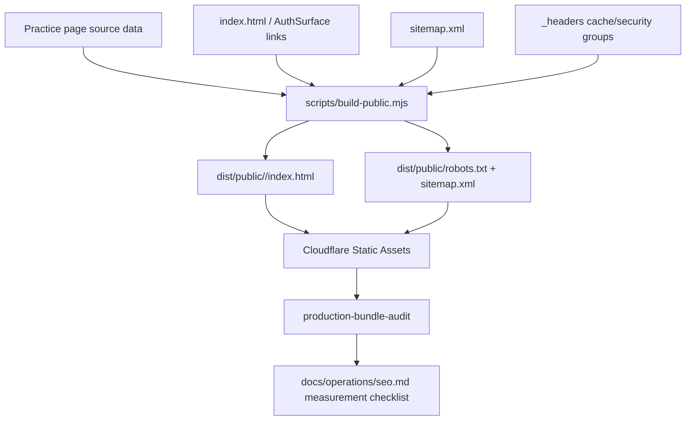

# feat: Add KS2 SEO Measurement and Practice Landing Pages

## Summary

Build the V2 SEO slice on top of the completed root foundation by adding three crawlable practice-tool landing pages, wiring them into the public discovery graph, and strengthening production validation plus operations guidance so organic and AI-assisted discovery can be measured without weakening privacy or security.

---

## Problem Frame

The V1 SEO foundation made `https://ks2.eugnel.uk/` understandable as a public product identity surface. James now wants organic users and AI/search systems to have more specific, accurate public pages to discover and recommend, while still keeping analytics, crawler access, private learner state, and app routing under control.

---

## Assumptions

*This plan makes a few implementation bets from the prior discussion and repo research. They should be reviewed before execution starts.*

- Practice-tool intent is the right V2 content slice, ahead of subject/problem pages and parent-support guidance.
- Public practice pages should be static Cloudflare Static Assets pages with canonical trailing-slash URLs, not Worker-rendered routes or `.html` URLs.
- Search Console and Cloudflare Web Analytics are the first measurement path; GA4, Zaraz, or a repo-injected analytics snippet stays deferred until real configuration exists.
- OpenAI and other AI-search visibility should be improved through crawlable public pages and robots access, not through recommendation guarantees or speculative AI-only files.

---

## Requirements

- R1. Add focused public pages for practice-tool intent: KS2 spelling practice, KS2 grammar practice, and KS2 punctuation practice.
- R2. Each page must be crawlable without sign-in or JavaScript execution and must contain direct UK English text that explains the practice value.
- R3. Page claims must stay aligned with actual KS2 Mastery capability and avoid broad curriculum, assessment, or outcome guarantees.
- R4. Each page must provide a clear path into the existing public root and demo/app experience without exposing private learner data.
- R5. The sitemap must list only canonical public URLs, using absolute `https://ks2.eugnel.uk/...` URLs.
- R6. Robots/discovery policy must keep public pages crawlable while excluding API, admin, demo, and private app surfaces from normal crawler discovery.
- R7. The production audit must prove the new landing pages are real page responses, not SPA fallback copies of the root shell.
- R8. Measurement guidance must make Search Console and privacy-conscious visitor analytics usable for choosing the next SEO slice.
- R9. No placeholder Search Console, GA4, Zaraz, or Cloudflare analytics tokens should be committed.
- R10. Security headers, CSP posture, auth/demo boundaries, D1/R2 state, and deployment scripts must remain unchanged unless a change is explicitly required for the new public pages.

**Origin actors:** A1 prospective KS2 learner/supporting adult; A2 search crawler; A3 AI search or assistant system; A4 James/product operator; A5 KS2 Mastery app.

**Origin flows:** F1 public discovery and product understanding; F2 search engine discovery and validation; F3 organic measurement and next-slice selection.

**Origin acceptance examples:** AE1 public identity is understandable without sign-in; AE2 app/demo entry preserves private data boundaries; AE3 discovery files and metadata work in production; AE4 public site is understandable without authenticated app flow; AE5 measurement supports decisions; AE6 later content lanes remain open.

---

## Scope Boundaries

- Do not build a blog, content farm, or broad keyword programme in this slice.
- Do not add subject/problem pages such as apostrophes or Year 5 spelling words yet.
- Do not add parent-support guidance pages yet.
- Do not promise that Google, ChatGPT, or any AI assistant will recommend the site.
- Do not add fake verification meta tags, fake analytics IDs, or dormant third-party snippets.
- Do not expose authenticated read models, admin content, generated content stores, internal analytics, D1 rows, R2 objects, or learner state as public SEO content.
- Do not change the app's authenticated routing, demo session semantics, or subject engines for SEO.
- Do not make Cloudflare Workers run for public landing pages unless Static Assets cannot satisfy the route contract.

### Deferred to Follow-Up Work

- Search Console ownership verification: complete when James chooses the real Google account/property and verification method.
- Cloudflare Web Analytics activation: complete in the dashboard or a separate configured code slice once the real hostname/site setup is confirmed.
- GA4 or Zaraz instrumentation: add only if James chooses that stack and accepts the CSP, consent, and privacy implications.
- Subject/problem content pages: plan after the practice-tool pages have indexing or traffic evidence.
- Parent-support content pages: plan after the product and practice-tool identity pages have enough measurement signal.

---

## Context & Research

### Relevant Code and Patterns

- `index.html` now carries the canonical root metadata, raw public identity copy, and JSON-LD product identity from V1.
- `robots.txt` and `sitemap.xml` are copied as public assets by `scripts/build-public.mjs` and asserted by `scripts/assert-build-public.mjs`.
- `wrangler.jsonc` serves `dist/public` through Cloudflare Workers Static Assets with `not_found_handling: "single-page-application"`.
- `scripts/build-public.mjs` is the public-output assembly seam; it already versions the app bundle and writes the generated CSP hash artefact.
- `scripts/assert-build-public.mjs` enforces the public-output allowlist and should be extended for any new top-level landing-page directories.
- `_headers`, `scripts/lib/headers-drift.mjs`, and `tests/security-headers.test.js` define the static asset cache/security contract.
- `scripts/production-bundle-audit.mjs` and `tests/bundle-audit.test.js` are the production-facing checks that should catch SPA fallback or sitemap drift.
- `docs/operations/seo.md` is the operator runbook for Search Console, analytics posture, production checks, and next content choices.
- `src/surfaces/auth/AuthSurface.jsx` and `tests/react-auth-boot.test.js` are the rendered unauthenticated root surface and test path if internal links to practice pages are added there.

### Institutional Learnings

- `docs/solutions/workflow-issues/sys-hardening-p2-13-unit-autonomous-sprint-learnings-2026-04-26.md`: public build, Worker allowlists, audit logic, and deployment assertions should land atomically when reverting one file could leave production silently wrong.
- `docs/solutions/architecture-patterns/admin-console-section-extraction-pattern-2026-04-27.md`: check hosting/platform routing before inventing Worker routes; this repo already uses Cloudflare SPA fallback and Static Assets.
- Prior release-gate work shows `npm test`, `npm run check`, and `scripts/production-bundle-audit.mjs` are meaningful gates for public-surface changes.

### External References

- Google Search Central sitemap guidance: [developers.google.com/search/docs/crawling-indexing/sitemaps/build-sitemap](https://developers.google.com/search/docs/crawling-indexing/sitemaps/build-sitemap)
- Google Search Central JavaScript SEO basics: [developers.google.com/search/docs/crawling-indexing/javascript/javascript-seo-basics](https://developers.google.com/search/docs/crawling-indexing/javascript/javascript-seo-basics)
- Google Search Console and Analytics guidance: [developers.google.com/search/docs/monitor-debug/google-analytics-search-console](https://developers.google.com/search/docs/monitor-debug/google-analytics-search-console)
- Cloudflare Web Analytics overview: [developers.cloudflare.com/web-analytics](https://developers.cloudflare.com/web-analytics/)
- Cloudflare Web Analytics setup: [developers.cloudflare.com/web-analytics/get-started](https://developers.cloudflare.com/web-analytics/get-started/)
- Cloudflare Web Analytics SPA tracking: [developers.cloudflare.com/web-analytics/get-started/web-analytics-spa](https://developers.cloudflare.com/web-analytics/get-started/web-analytics-spa/)
- Cloudflare Workers Static Assets SPA routing: [developers.cloudflare.com/workers/static-assets/routing/single-page-application](https://developers.cloudflare.com/workers/static-assets/routing/single-page-application/)
- Cloudflare Workers Static Assets HTML handling: [developers.cloudflare.com/workers/static-assets/routing/advanced/html-handling](https://developers.cloudflare.com/workers/static-assets/routing/advanced/html-handling/)
- OpenAI crawler guidance: [platform.openai.com/docs/bots](https://platform.openai.com/docs/bots)

---

## Key Technical Decisions

- Start V2 with practice-tool intent: These pages map directly to real product capability and to likely searches such as "KS2 spelling practice online", "KS2 grammar practice", and "KS2 punctuation practice".
- Use static folder-index pages: Generate `dist/public/ks2-spelling-practice/index.html`, `dist/public/ks2-grammar-practice/index.html`, and `dist/public/ks2-punctuation-practice/index.html`, with canonical URLs ending in `/`.
- Keep the route in Static Assets: Cloudflare's HTML handling supports folder `index.html` pages and avoids Worker execution for public content, while production audit catches fallback regressions.
- Keep landing pages JavaScript-free in this slice: Page-specific titles, descriptions, canonical links, semantic headings, and visible copy give crawlers and AI systems readable content without expanding the inline-script/CSP surface.
- Treat robots as a public/private boundary, not an AI-ranking lever: the existing `User-agent: *` model should keep public pages available to OAI-SearchBot and other compliant crawlers while private paths stay disallowed.
- Prefer Search Console plus Cloudflare Web Analytics first: Search Console answers pre-visit search discovery; Cloudflare Web Analytics answers aggregate on-site visitor behaviour. GA4/Zaraz remains an explicit later choice.
- Make production audit authoritative: The live domain must prove each new URL returns the intended page, metadata, canonical URL, and sitemap entry.

---

## Open Questions

### Resolved During Planning

- First content lane: choose practice-tool intent for V2.
- Route shape: use static folder-index pages with canonical trailing slashes.
- Analytics posture: document Search Console and Cloudflare Web Analytics first; defer GA4/Zaraz and repo-injected snippets until real configuration exists.
- AI search posture: keep public pages crawlable and avoid bot-specific robots groups that could accidentally override private-path disallows.

### Deferred to Implementation

- Final page copy: implementation should write concise UK English copy, but it must stay within R1-R4 and avoid unproven outcomes.
- Exact static page source shape: implementation may use a small registry plus renderer or checked-in source HTML, as long as it stays DRY for shared metadata and assertions.
- Final Cloudflare Web Analytics activation path: depends on the live dashboard setting for the proxied hostname.
- Search Console verification method: depends on James's Google property setup.

---

## High-Level Technical Design

> *This illustrates the intended approach and is directional guidance for review, not implementation specification. The implementing agent should treat it as context, not code to reproduce.*

---

## Implementation Units

- U1. **Static Practice Page Generation**

**Goal:** Add a maintainable source of truth for the three practice-tool pages and emit real static HTML pages into public output.

**Requirements:** R1, R2, R3, R4, R7, R10; F1, F2; AE1, AE2, AE4.

**Dependencies:** None.

**Files:**
- Create: `scripts/lib/seo-practice-pages.mjs`
- Modify: `scripts/build-public.mjs`
- Modify: `scripts/assert-build-public.mjs`
- Modify: `_headers`
- Modify: `scripts/lib/headers-drift.mjs`
- Modify: `tests/build-public.test.js`
- Modify: `tests/security-headers.test.js`

**Approach:**
- Add a small page registry for slug, title, description, canonical URL, heading, subject-specific copy, and CTA links.
- Generate three static folder-index pages under `dist/public`, one per practice-tool intent.
- Keep the generated pages JavaScript-free and app-state-free; they should link into the product rather than boot the product.
- Extend the public-output allowlist for the three page directories and assert that no raw source, worker source, private routes, or unexpected top-level files ship.
- Add explicit `_headers` cache/security blocks for the canonical practice-page HTML paths so they do not fall through to browser heuristic caching.
- Extend the cache-split drift rules for those page paths, keeping HTML `no-store` consistent with the root page.

**Patterns to follow:**
- Existing public asset assembly in `scripts/build-public.mjs`.
- Public output assertions in `scripts/assert-build-public.mjs`.
- Current SEO assertions in `tests/build-public.test.js`.

**Test scenarios:**
- Happy path: build output contains `ks2-spelling-practice/index.html`, `ks2-grammar-practice/index.html`, and `ks2-punctuation-practice/index.html`.
- Happy path: each generated page has a unique title, meta description, canonical trailing-slash URL, H1, and subject-specific KS2 practice copy.
- Integration: generated pages do not load the React app bundle, do not contain `#app` private state, and do not expose API/admin/demo payloads.
- Integration: static header drift tests require explicit no-store cache blocks for each generated HTML page.
- Edge case: a page registry entry with a mismatched slug/canonical pairing fails the public assertion.
- Error path: deleting one generated page or changing it into root app-shell HTML fails the build-public assertion.

**Verification:**
- The public build produces three standalone, crawler-readable landing pages from one maintainable source of truth.

---

- U2. **Practice Copy and Internal Discovery Links**

**Goal:** Make the new pages discoverable from the root and useful to humans, crawlers, and AI assistants without creating thin or overclaimed content.

**Requirements:** R1, R2, R3, R4, R6, R10; F1; AE1, AE2, AE4, AE6.

**Dependencies:** U1.

**Files:**
- Modify: `index.html`
- Modify: `src/surfaces/auth/AuthSurface.jsx`
- Modify: `styles/app.css`
- Modify: `tests/react-auth-boot.test.js`
- Modify: `tests/build-public.test.js`
- Modify: `scripts/assert-build-public.mjs`

**Approach:**
- Add crawlable root links to the three practice pages, so crawlers can discover them through HTML links as well as the sitemap.
- Add rendered AuthSurface links only if they fit the existing unauthenticated surface without turning it into a marketing page.
- Write page copy around the concrete practice outcome for each subject: spelling word confidence, grammar sentence accuracy, and punctuation clarity.
- Keep internal links plain `<a href>` links, not hash routes or JavaScript-only navigation.
- Keep CTAs pointed at the existing root/demo entry points and never reveal private learner state.

**Patterns to follow:**
- Existing root fallback content in `index.html`.
- Existing unauthenticated copy and action layout in `src/surfaces/auth/AuthSurface.jsx`.
- AuthSurface render tests in `tests/react-auth-boot.test.js`.

**Test scenarios:**
- Covers AE1. Happy path: root HTML exposes links to all three practice pages with crawlable `href` attributes.
- Covers AE2. Happy path: rendered AuthSurface still shows the existing sign-in/demo paths and does not require a session to see practice page links.
- Edge case: internal links use canonical trailing-slash URLs and do not advertise non-canonical `.html` variants.
- Error path: page copy or assertions fail if a page drops the subject-specific KS2 wording needed for AI-readable product understanding.

**Verification:**
- The root and unauthenticated public surface create a coherent discovery graph from product identity to practice-tool pages.

---

- U3. **Sitemap, Robots, and AI-Crawler Discovery Contract**

**Goal:** Publish the new pages through discovery files while preserving private route exclusions and avoiding crawler-specific policy mistakes.

**Requirements:** R5, R6, R7, R9, R10; F2; AE3, AE5, AE6.

**Dependencies:** U1, U2.

**Files:**
- Modify: `sitemap.xml`
- Modify: `robots.txt`
- Modify: `scripts/assert-build-public.mjs`
- Modify: `tests/build-public.test.js`

**Approach:**
- Add the three canonical practice-page URLs to the sitemap using fully-qualified absolute URLs.
- Keep the root URL in the sitemap and keep private/demo/admin/API surfaces out.
- Preserve the generic `User-agent: *` policy with private path disallows so compliant search and AI crawlers can fetch public pages.
- Avoid adding bot-specific groups for `OAI-SearchBot`, `GPTBot`, or `ChatGPT-User` unless every private-path disallow is repeated correctly in those groups.
- Keep the `Sitemap:` directive in `robots.txt`.

**Patterns to follow:**
- Current V1 robots and sitemap assertions in `scripts/assert-build-public.mjs`.
- Google Search Central sitemap rules for absolute canonical URLs.
- OpenAI crawler guidance that `OAI-SearchBot` is the search crawler and can be managed independently through robots.txt.

**Test scenarios:**
- Covers AE3. Happy path: sitemap contains exactly the canonical root plus the three practice-page URLs.
- Happy path: every sitemap URL is absolute, uses `https://ks2.eugnel.uk/`, and uses the canonical trailing-slash form for practice pages.
- Edge case: sitemap assertions fail if `/demo`, `/admin`, `/api`, `.html`, localhost, or non-canonical duplicate variants appear.
- Error path: robots assertions fail if the sitemap directive disappears or private path disallows are removed.
- Integration: robots policy does not explicitly disallow `OAI-SearchBot` or other AI-search crawlers from the public pages.

**Verification:**
- Discovery files accurately advertise only the intended public pages and keep crawler access aligned with the product privacy boundary.

---

- U4. **Production Audit for Practice Pages**

**Goal:** Extend the live production audit so deployment cannot silently serve SPA fallback HTML, duplicate root metadata, or stale sitemap data for the new pages.

**Requirements:** R2, R3, R5, R6, R7, R10; F2; AE3, AE4.

**Dependencies:** U1, U2, U3.

**Files:**
- Modify: `scripts/production-bundle-audit.mjs`
- Modify: `tests/bundle-audit.test.js`

**Approach:**
- Fetch each practice page from the configured production URL and validate status, content type where available, title, meta description, canonical URL, H1, and subject-specific content.
- Fail if a practice page returns the root page's title/canonical or a generic SPA shell.
- Validate sitemap coverage for all four public URLs and no private URL leakage.
- Validate the expected no-store cache policy for the practice-page HTML responses.
- Keep failures specific enough to name the affected URL and missing contract.
- Preserve the existing forbidden-token, cache-split, security-header, demo bootstrap, and root SEO checks.

**Execution note:** Start with stub-origin tests for valid pages and fallback failures before changing the audit script, because this is a release gate.

**Patterns to follow:**
- Existing SEO stub server and audit tests in `tests/bundle-audit.test.js`.
- Current production SEO checks in `scripts/production-bundle-audit.mjs`.

**Test scenarios:**
- Happy path: a stub origin serving valid root, robots, sitemap, and three practice pages passes the production audit.
- Error path: `/ks2-spelling-practice/` returning the root app shell fails with a page-specific SPA fallback or canonical mismatch message.
- Error path: a practice page missing its canonical URL fails.
- Error path: sitemap missing one practice page fails.
- Error path: sitemap includes `/demo`, `/api`, `/admin`, localhost, or a non-canonical `.html` variant and fails.
- Integration: practice-page audit works without authenticated app APIs or demo session setup.

**Verification:**
- The production audit distinguishes a real V2 public discovery surface from a deployment that only serves the V1 root shell everywhere.

---

- U5. **Measurement and SEO Operations Runbook**

**Goal:** Give James a concrete measurement and crawler-visibility path for the V2 pages without committing unknown analytics configuration.

**Requirements:** R8, R9, R10; F3; AE5, AE6.

**Dependencies:** U1, U3, U4.

**Files:**
- Modify: `docs/operations/seo.md`

**Approach:**
- Update the runbook with the four public URLs, Search Console sitemap submission, URL inspection steps, and the first metrics to monitor: impressions, clicks, CTR, queries, indexed status, and landing pages.
- Document Cloudflare Web Analytics as the preferred first visitor-analytics layer, including the dashboard automatic setup path for proxied sites and the manual snippet path only when a real token is available.
- Record that Cloudflare Web Analytics can track SPA interactions, but the V2 landing pages themselves are static and should be measured as page views.
- Add an AI crawler check section: keep `OAI-SearchBot` publicly allowed through robots, verify Cloudflare security/bot settings are not blocking desired AI search crawlers, and avoid interpreting crawler access as recommendation certainty.
- Keep GA4/Zaraz as a deferred explicit stack decision with consent/CSP review.

**Patterns to follow:**
- Existing `docs/operations/seo.md` tone and structure.
- Existing capacity and deployment runbooks that distinguish code checks from dashboard/operator actions.

**Test scenarios:**
- Test expectation: none -- this unit is documentation and external-operations guidance only.

**Verification:**
- The runbook tells an operator what to submit, what to inspect, what to measure, and which analytics work is intentionally not in this PR.

---

## System-Wide Impact

- **Interaction graph:** Public page source data, `scripts/build-public.mjs`, static asset output, sitemap/robots, root/AuthSurface links, `_headers`, and production audit jointly define the V2 SEO contract.
- **Error propagation:** Local build assertions catch missing artefacts and copy drift; production audit catches Cloudflare fallback, canonical, and sitemap regressions after deploy.
- **State lifecycle risks:** No learner state, D1 data, R2 objects, session cookies, generated content stores, or admin data should be read or exposed by the new pages.
- **API surface parity:** No Worker API route, subject command, database, or authenticated app contract should change.
- **Integration coverage:** Unit-level HTML assertions are not enough; the production audit must fetch the deployed URLs that crawlers and AI systems will see.
- **Unchanged invariants:** Existing root identity, demo entry, app bundle delivery, CSP Report-Only mode, security headers, and deployment scripts remain in place.

---

## Risks & Dependencies

| Risk | Mitigation |
|------|------------|
| Static practice URLs fall through to the root SPA shell | Generate real folder-index pages and add live production audit checks for page-specific canonical URLs and copy. |
| Trailing-slash and non-trailing-slash variants create duplicate identity | Use one canonical trailing-slash URL per practice page and list only that form in sitemap and links. |
| Pages become thin or overclaim product capability | Keep copy scoped to real spelling, grammar, and punctuation practice outcomes and assert subject-specific text. |
| AI crawler robots changes accidentally open or block the wrong paths | Avoid bot-specific groups unless private disallows are repeated; audit the generic policy and document external Cloudflare bot settings. |
| Analytics wiring creates false confidence or privacy/CSP drift | Do not commit placeholder tags; document Search Console and Cloudflare Web Analytics setup with real configuration as a prerequisite. |
| Public output allowlist broadens too far | Add only the three intended page directories and keep existing raw-source/private-output assertions. |

---

## Documentation / Operational Notes

- After deployment, run the production audit against `https://ks2.eugnel.uk/` and inspect all four sitemap URLs.
- Submit or resubmit `https://ks2.eugnel.uk/sitemap.xml` in Search Console after deployment.
- If Cloudflare Web Analytics is enabled through automatic dashboard setup, record that external state in `docs/operations/seo.md` during the same release handoff.
- If a manual Cloudflare or GA snippet is later required, treat it as a separate code change touching CSP `script-src`/`connect-src`, consent posture, and production audit.

---

## Alternative Approaches Considered

- Worker-rendered SEO pages: rejected for V2 because Static Assets can serve folder-index pages and avoids extra Worker invocations or auth-route blast radius.
- `.html` practice URLs: rejected because extensionless canonical landing pages are cleaner and Cloudflare HTML handling supports folder `index.html` routes.
- Subject/problem pages first: rejected because practice-tool pages map more directly to current product capability and are safer before traffic evidence exists.
- GA4 first: rejected because there is no real property configuration yet and Cloudflare Web Analytics is a lower-friction fit with the current hosting stack.
- `llms.txt` as the main AI-search mechanism: deferred because official crawler control still depends on crawlable public pages and robots policy; a text summary can be considered later but should not replace normal web discovery.

---

## Success Metrics

- Live `/ks2-spelling-practice/`, `/ks2-grammar-practice/`, and `/ks2-punctuation-practice/` return page-specific public HTML, not the root app shell.
- `sitemap.xml` lists the root plus the three practice pages and no private or duplicate URLs.
- `robots.txt` continues to advertise the sitemap and disallow private surfaces while leaving public pages crawlable.
- Search Console can inspect the four public URLs and report indexing/query data.
- James can review Cloudflare Web Analytics or the chosen visitor analytics layer to see aggregate page traffic after setup.

---

## Sources & References

- Origin document: [docs/brainstorms/2026-04-28-ks2-seo-foundation-requirements.md](../brainstorms/2026-04-28-ks2-seo-foundation-requirements.md)
- V1 SEO plan: [docs/plans/2026-04-28-002-feat-ks2-seo-foundation-plan.md](2026-04-28-002-feat-ks2-seo-foundation-plan.md)
- SEO runbook: [docs/operations/seo.md](../operations/seo.md)
- Public root shell: `index.html`
- Public discovery files: `robots.txt`, `sitemap.xml`
- Public build: `scripts/build-public.mjs`
- Public build assertion: `scripts/assert-build-public.mjs`
- Production audit: `scripts/production-bundle-audit.mjs`
- Static headers: `_headers`
- Worker deployment config: `wrangler.jsonc`
- Google sitemap guidance: [developers.google.com/search/docs/crawling-indexing/sitemaps/build-sitemap](https://developers.google.com/search/docs/crawling-indexing/sitemaps/build-sitemap)
- Google JavaScript SEO basics: [developers.google.com/search/docs/crawling-indexing/javascript/javascript-seo-basics](https://developers.google.com/search/docs/crawling-indexing/javascript/javascript-seo-basics)
- Google Search Console and Analytics guidance: [developers.google.com/search/docs/monitor-debug/google-analytics-search-console](https://developers.google.com/search/docs/monitor-debug/google-analytics-search-console)
- Cloudflare Web Analytics: [developers.cloudflare.com/web-analytics](https://developers.cloudflare.com/web-analytics/)
- Cloudflare Web Analytics setup: [developers.cloudflare.com/web-analytics/get-started](https://developers.cloudflare.com/web-analytics/get-started/)
- Cloudflare Web Analytics SPA tracking: [developers.cloudflare.com/web-analytics/get-started/web-analytics-spa](https://developers.cloudflare.com/web-analytics/get-started/web-analytics-spa/)
- Cloudflare Workers Static Assets SPA routing: [developers.cloudflare.com/workers/static-assets/routing/single-page-application](https://developers.cloudflare.com/workers/static-assets/routing/single-page-application/)
- Cloudflare Workers Static Assets HTML handling: [developers.cloudflare.com/workers/static-assets/routing/advanced/html-handling](https://developers.cloudflare.com/workers/static-assets/routing/advanced/html-handling/)
- OpenAI crawler guidance: [platform.openai.com/docs/bots](https://platform.openai.com/docs/bots)
