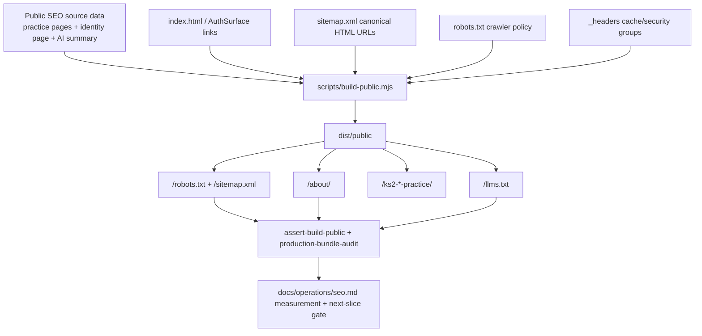

# feat: Add KS2 SEO AI Identity and Measurement Baseline

## Summary

Build the V3 SEO slice by adding a stronger crawlable product-identity page, a supplementary AI-readable site summary, crawler-policy production checks, and a measurement operating path that lets the next content page be chosen from evidence rather than guesswork.

---

## Problem Frame

V1 made the root public surface understandable, and V2 added practice-tool landing pages for spelling, grammar, and punctuation. The remaining gap is trust and measurement: search engines and AI assistants need a clearer site identity beyond short landing-page copy, and James needs a reliable way to see whether the public pages are being crawled, indexed, visited, and worth extending.

---

## Assumptions

*This plan was authored without synchronous user confirmation for the V3 shape. The items below are agent inferences that should be reviewed before implementation proceeds.*

- V3 should strengthen AI-readable product identity and measurement before adding subject/problem or parent-support pages.
- A public `llms.txt` summary is useful as a supplementary AI-readable resource, but it must not replace normal crawlable HTML, sitemap, robots policy, or Search Console validation.
- Cloudflare Web Analytics remains dashboard-first for V3; manual snippet injection is deferred unless James supplies a real token and accepts the CSP, consent, and privacy review.
- OAI-SearchBot search visibility should be protected; GPTBot training access remains a separate policy choice and should not be treated as required for ChatGPT search visibility.

---

## Requirements

- R1. Add a crawlable public identity page that explains what KS2 Mastery is, who it helps, what subjects it currently supports, and how demo/sign-in paths relate to saved progress.
- R2. Keep public copy in plain UK English, accurate to current product capability, and useful to humans, search crawlers, and AI assistants.
- R3. Add a supplementary AI-readable text resource that summarises the public product identity, canonical URLs, subject coverage, and privacy boundaries without exposing private app state.
- R4. Update the public discovery graph so the root, practice pages, and new identity page link to each other coherently and only canonical public URLs are advertised.
- R5. Strengthen local and production validation so `/about/`, `llms.txt`, `robots.txt`, `sitemap.xml`, and existing public pages cannot silently become SPA fallback HTML or leak private implementation details.
- R6. Detect production robots or Cloudflare-managed crawler-policy changes that block OAI-SearchBot from public SEO pages, while keeping private API, admin, and demo paths out of crawler discovery.
- R7. Expand the SEO runbook into a measurement baseline covering Search Console, Cloudflare Web Analytics, AI crawler checks, and the decision gate for the next content slice.
- R8. Preserve the future acquisition lanes from the origin document: practice-tool intent, subject/problem intent, parent-support intent, and AI-readable product identity.
- R9. Do not commit fake verification tags, placeholder analytics tokens, broad curriculum claims, recommendation guarantees, or code-injected third-party scripts without real configuration and privacy/security review.

**Origin actors:** A1 prospective KS2 learner/supporting adult; A2 search crawler; A3 AI search or assistant system; A4 James/product operator; A5 KS2 Mastery app.

**Origin flows:** F1 public discovery and product understanding; F2 search engine discovery and validation; F3 organic measurement and next-slice selection.

**Origin acceptance examples:** AE1 product identity is understandable without sign-in; AE2 app/demo entry preserves private data boundaries; AE3 discovery files and metadata work in production; AE4 public site is understandable without authenticated app flow; AE5 measurement supports decisions; AE6 later content lanes remain open.

---

## Scope Boundaries

- Do not add subject/problem pages such as apostrophes, relative clauses, or Year 5 spelling words in this V3 slice.
- Do not add parent-support pages in this V3 slice.
- Do not build a blog, broad content library, or keyword-volume programme.
- Do not promise that Google, ChatGPT, or any AI assistant will recommend KS2 Mastery.
- Do not treat `llms.txt` as a substitute for useful public pages, sitemap coverage, or normal crawler access.
- Do not commit GA4, Zaraz, or a manual Cloudflare Web Analytics snippet without a real configured token and a separate CSP/consent review.
- Do not expose authenticated read models, learner progress, generated content stores, D1 rows, R2 objects, admin content, internal analytics, or API responses as public SEO content.
- Do not weaken existing CSP, security headers, production audit gates, demo safeguards, auth boundaries, or deployment scripts for SEO convenience.

### Deferred to Follow-Up Work

- Search Console ownership verification: complete when James chooses the Google account/property and verification method.
- Cloudflare Web Analytics dashboard activation: complete externally and record the result in the runbook; only code manual snippet support if automatic setup is unavailable or unsuitable.
- Subject/problem pages: plan after public pages have indexing or query evidence, with likely candidates such as apostrophes, Year 5 spelling words, and sentence-level grammar topics.
- Parent-support pages: plan after product identity and practice-tool pages show enough demand to justify a home-support content slice.
- Explicit bot-specific robots groups: add only if production evidence shows generic `User-agent: *` access is insufficient, and repeat private-path disallows in every specific group.

---

## Context & Research

### Relevant Code and Patterns

- `index.html` contains the canonical root metadata, raw public fallback copy, practice-page links, and JSON-LD product identity from V1/V2.
- `scripts/lib/seo-practice-pages.mjs` is the current source of truth for generated static practice pages and canonical practice URLs.
- `scripts/build-public.mjs` copies public root assets, versions the React bundle, renders static practice pages, and writes CSP hash artefacts.
- `scripts/assert-build-public.mjs` enforces the public-output allowlist, sitemap contract, robots contract, JSON-LD expectations, and forbidden public SEO text.
- `_headers`, `scripts/lib/headers-drift.mjs`, and `tests/security-headers.test.js` define the static asset cache/security contract for generated HTML pages.
- `scripts/production-bundle-audit.mjs` and `tests/bundle-audit.test.js` are the production gate for proving live public URLs are real SEO resources rather than Cloudflare SPA fallback output.
- `src/surfaces/auth/AuthSurface.jsx` and `tests/react-auth-boot.test.js` are the rendered unauthenticated root surface and should link to any new public identity page without changing private app flows.
- `docs/operations/seo.md` already distinguishes public SEO surfaces, Search Console, Cloudflare Web Analytics, AI crawler posture, and next-content choices.

### Institutional Learnings

- `docs/solutions/workflow-issues/sys-hardening-p2-13-unit-autonomous-sprint-learnings-2026-04-26.md`: coupled build-output, public allowlist, headers, and audit changes should land atomically when reverting one file could leave production silently wrong.
- `docs/solutions/architecture-patterns/admin-console-section-extraction-pattern-2026-04-27.md`: check existing Cloudflare/static routing before inventing Worker routes; this repo already has Static Assets plus SPA fallback, so public SEO pages should remain static assets unless evidence says otherwise.

### External References

- Google Search Central helpful content guidance: [developers.google.com/search/docs/fundamentals/creating-helpful-content](https://developers.google.com/search/docs/fundamentals/creating-helpful-content)
- Google Search Central sitemap guidance: [developers.google.com/search/docs/crawling-indexing/sitemaps/build-sitemap](https://developers.google.com/search/docs/crawling-indexing/sitemaps/build-sitemap)
- Google structured data introduction: [developers.google.com/search/docs/appearance/structured-data/intro-structured-data](https://developers.google.com/search/docs/appearance/structured-data/intro-structured-data)
- Google Search Console overview: [search.google.com/search-console/about](https://search.google.com/search-console/about)
- Cloudflare Web Analytics overview: [developers.cloudflare.com/web-analytics](https://developers.cloudflare.com/web-analytics/)
- Cloudflare Web Analytics setup: [developers.cloudflare.com/web-analytics/get-started](https://developers.cloudflare.com/web-analytics/get-started/)
- Cloudflare Web Analytics SPA tracking: [developers.cloudflare.com/web-analytics/get-started/web-analytics-spa](https://developers.cloudflare.com/web-analytics/get-started/web-analytics-spa/)
- Cloudflare bot custom rules and managed bot settings: [developers.cloudflare.com/bots/additional-configurations/custom-rules](https://developers.cloudflare.com/bots/additional-configurations/custom-rules/)
- Cloudflare verified bots: [developers.cloudflare.com/bots/concepts/bot/verified-bots](https://developers.cloudflare.com/bots/concepts/bot/verified-bots/)
- OpenAI crawler guidance: [developers.openai.com/api/docs/bots](https://developers.openai.com/api/docs/bots)

---

## Key Technical Decisions

- Add one strong identity page before subject/problem pages: `/about/` gives search and AI systems the product background, audience, capability boundary, and trust context that would be too dense for the root or practice landing pages.
- Keep the new identity page static and script-free: generated folder-index HTML follows the V2 practice-page pattern, avoids extra Worker routing, and keeps CSP risk low.
- Add `llms.txt` only as a supplementary public summary: it can help AI agents quickly understand the site, but the authoritative discovery path remains HTML pages, sitemap, robots, and Search Console.
- Keep sitemap scope to canonical HTML pages: root, three practice-tool pages, and `/about/`; do not list `llms.txt` as a page intended for search results.
- Protect OAI-SearchBot without opening private paths: production audit should fail if public search visibility is blocked, but any bot-specific policy must still preserve `/api/`, `/admin`, and `/demo` exclusions.
- Keep measurement split by purpose: Search Console answers search impressions, queries, indexing, and URL inspection; Cloudflare Web Analytics answers aggregate on-site page views and visitor behaviour.
- Defer manual analytics script injection: Cloudflare's dashboard automatic setup for proxied hostnames should be tried first, and manual snippet work is a separate security/privacy slice when real configuration exists.

---

## Open Questions

### Resolved During Planning

- V3 content lane: deepen AI-readable product identity and measurement before subject/problem pages.
- Public route shape: use static folder-index `/about/` rather than a Worker-rendered route.
- AI-readable resource shape: add a small public text summary as a supplement, not a replacement for HTML.
- Analytics posture: prefer Search Console plus Cloudflare Web Analytics; do not commit placeholder GA4, Zaraz, Search Console, or Cloudflare tokens.
- OpenAI crawler posture: prioritise OAI-SearchBot access for search visibility; keep GPTBot training access a separate policy decision.

### Deferred to Implementation

- Final `/about/` copy: implementation should tune concise UK English copy within R1-R2 and avoid broad or unproven claims.
- Exact shared renderer shape: implementation may extend `scripts/lib/seo-practice-pages.mjs` or introduce a clearer shared public-page module if that reduces duplication without creating a large refactor.
- Exact `llms.txt` wording: implementation should keep it short, factual, and linked to canonical public pages.
- External dashboard state: Search Console ownership and Cloudflare Web Analytics activation depend on James's external accounts and cannot be proven by repo changes alone.

---

## High-Level Technical Design

> *This illustrates the intended approach and is directional guidance for review, not implementation specification. The implementing agent should treat it as context, not code to reproduce.*

---

## Implementation Units

- U1. **Static About Page and Public Identity Links**

**Goal:** Add a crawlable `/about/` page that explains KS2 Mastery as a KS2 spelling, grammar, and punctuation practice product, with clear audience, capability, demo, sign-in, saved-progress, and privacy boundaries.

**Requirements:** R1, R2, R4, R5, R7, R8, R9; F1, F2; AE1, AE2, AE4, AE6.

**Dependencies:** None.

**Files:**
- Create: `scripts/lib/seo-identity-pages.mjs`
- Modify: `scripts/build-public.mjs`
- Modify: `scripts/assert-build-public.mjs`
- Modify: `_headers`
- Modify: `scripts/lib/headers-drift.mjs`
- Modify: `styles/app.css`
- Modify: `index.html`
- Modify: `src/surfaces/auth/AuthSurface.jsx`
- Modify: `tests/build-public.test.js`
- Modify: `tests/security-headers.test.js`
- Modify: `tests/react-auth-boot.test.js`

**Approach:**
- Generate `dist/public/about/index.html` as a static folder-index page with a canonical `https://ks2.eugnel.uk/about/` URL.
- Keep the page JavaScript-free and app-state-free, reusing the V2 static landing-page pattern for metadata, canonical links, static styles, and no-store HTML headers.
- Cover the product identity questions AI assistants and prospective users need: what the site is, who it is for, current subjects, what the demo does, why signing in matters for saved progress, and what remains private.
- Link to `/about/` from the raw root fallback, rendered unauthenticated surface, and generated practice pages where it fits without turning the app into a marketing site.
- Avoid duplicating root JSON-LD on the about page unless implementation also updates CSP hash handling and visible-content parity; visible HTML content is sufficient for V3.

**Execution note:** Start with build-output assertions for `/about/` before wiring the generator so Cloudflare SPA fallback regressions are easy to catch.

**Patterns to follow:**
- Static page data/rendering in `scripts/lib/seo-practice-pages.mjs`.
- Public output allowlist and forbidden-text checks in `scripts/assert-build-public.mjs`.
- Existing practice-page styles in `styles/app.css`.
- AuthSurface link assertions in `tests/react-auth-boot.test.js`.

**Test scenarios:**
- Covers AE1. Happy path: built `dist/public/about/index.html` contains the product name, KS2 spelling, grammar, punctuation, intended users, demo path, sign-in/saved-progress explanation, and privacy boundary copy.
- Covers AE4. Integration: `/about/` built HTML does not include the React bundle, `id="app"`, inline scripts, private app state, or generated content stores.
- Happy path: `/about/` has a unique title, meta description, canonical trailing-slash URL, Open Graph URL, and H1.
- Integration: root fallback, AuthSurface, and generated practice pages expose crawlable links to `/about/` using canonical `href` values.
- Edge case: public-output allowlist fails if `/about/` is missing or if unexpected top-level public entries appear.
- Error path: assertions fail if the about page overclaims broad curriculum coverage, assessment outcomes, AI tutor behaviour, or guaranteed recommendations.

**Verification:**
- The public build emits a real `/about/` page, internal discovery links point to it, and the page is understandable without JavaScript or sign-in.

---

- U2. **Supplementary AI-Readable Site Summary**

**Goal:** Add a public `llms.txt` summary that gives AI agents a short, accurate map of KS2 Mastery's public pages, product identity, subject coverage, and privacy boundaries.

**Requirements:** R2, R3, R4, R5, R7, R8, R9; F1, F2; AE1, AE3, AE4, AE6.

**Dependencies:** U1.

**Files:**
- Create: `llms.txt`
- Modify: `scripts/build-public.mjs`
- Modify: `scripts/assert-build-public.mjs`
- Modify: `_headers`
- Modify: `scripts/lib/headers-drift.mjs`
- Modify: `index.html`
- Modify: `tests/build-public.test.js`
- Modify: `tests/security-headers.test.js`

**Approach:**
- Keep `llms.txt` short and factual: site name, canonical root, `/about/`, three practice pages, supported subjects, audience, and public/private boundaries.
- Do not include private/demo/admin/API URLs as recommended crawl targets; mention demo and sign-in only as product concepts when necessary.
- Add the file to the public build entries and public-output allowlist with a conservative text cache policy.
- Add an optional discoverability hint from root HTML, such as a non-blocking text alternate link, only if it does not create invalid metadata or sitemap noise.
- Keep `llms.txt` out of `sitemap.xml` because the sitemap should advertise canonical public HTML pages intended for search results.

**Patterns to follow:**
- Public asset copying in `scripts/build-public.mjs`.
- Existing robots and sitemap assertions in `scripts/assert-build-public.mjs`.
- Cache-split tests for static public resources in `scripts/lib/headers-drift.mjs`.

**Test scenarios:**
- Happy path: `dist/public/llms.txt` exists and includes `KS2 Mastery`, the canonical root URL, `/about/`, and the three canonical practice URLs.
- Happy path: `llms.txt` names spelling, grammar, and punctuation as current coverage and does not claim wider KS2 curriculum support.
- Edge case: `llms.txt` is not included as a sitemap `<loc>` entry.
- Error path: public-output assertions fail if `llms.txt` includes `/api/`, `/admin`, internal generated-content tokens, local URLs, secret names, or recommendation guarantees.
- Integration: headers/cache tests cover the `llms.txt` public resource without weakening HTML or bundle cache rules.

**Verification:**
- AI-readable summary text ships as a public resource while normal HTML pages and sitemap remain the authoritative discovery surface.

---

- U3. **Crawler Policy and Production Audit Hardening**

**Goal:** Extend production validation so the live site proves `/about/`, `llms.txt`, and crawler policy are behaving as intended, including detection of Cloudflare-managed changes that would block OAI-SearchBot from public SEO pages.

**Requirements:** R4, R5, R6, R7, R8, R9; F2, F3; AE3, AE4, AE5, AE6.

**Dependencies:** U1, U2.

**Files:**
- Create: `scripts/lib/seo-crawler-policy.mjs`
- Modify: `sitemap.xml`
- Modify: `scripts/assert-build-public.mjs`
- Modify: `scripts/production-bundle-audit.mjs`
- Modify: `tests/build-public.test.js`
- Modify: `tests/bundle-audit.test.js`

**Approach:**
- Add `/about/` to `sitemap.xml` and keep the exact sitemap set to root, three practice pages, and about.
- Keep `robots.txt` simple unless implementation evidence requires a bot-specific group; generic public access plus private disallows remains the safest default.
- Add a small crawler-policy parser/helper so local and production checks reason about user-agent groups rather than brittle substring-only checks.
- Fail production audit if the effective live robots text blocks `OAI-SearchBot` from `/`, `/about/`, or the practice pages, including Cloudflare-managed robots injections.
- Do not fail solely because `GPTBot` is disallowed; document that GPTBot is for model training and is not required for ChatGPT search visibility.
- Preserve existing forbidden-text, direct-denial, cache-split, security-header, demo bootstrap, and bundle-walk checks.

**Execution note:** Use stub-origin production-audit tests for both valid crawler policy and Cloudflare-managed blocking examples before changing the audit script.

**Patterns to follow:**
- Existing exact sitemap checks in `scripts/assert-build-public.mjs` and `scripts/production-bundle-audit.mjs`.
- Existing production SEO page assertions in `scripts/production-bundle-audit.mjs`.
- OpenAI crawler separation between `OAI-SearchBot`, `GPTBot`, and `ChatGPT-User`.

**Test scenarios:**
- Covers AE3. Happy path: a stub origin serving valid root, practice pages, `/about/`, `llms.txt`, robots, and sitemap passes production audit.
- Happy path: sitemap contains exactly five canonical HTML URLs: root, three practice pages, and `/about/`.
- Error path: `/about/` returning the root SPA shell fails with a page-specific fallback or canonical mismatch message.
- Error path: `llms.txt` returning HTML fallback or private/internal tokens fails.
- Error path: production robots that explicitly disallow `OAI-SearchBot` from `/` fail with a message pointing to robots or Cloudflare bot settings.
- Edge case: production robots that disallows `GPTBot` for training while leaving `OAI-SearchBot` available does not fail the search-visibility audit.
- Integration: if any future bot-specific group is added for an allowed crawler, the helper requires private-path disallows to remain present for that group.

**Verification:**
- Local and production gates prove the expanded public discovery surface is real, canonical, private-safe, and not accidentally blocked from OpenAI search crawling.

---

- U4. **Measurement Runbook and Next-Slice Decision Gate**

**Goal:** Turn the SEO runbook into an operating baseline James can use to submit, inspect, measure, and decide the next organic-growth slice.

**Requirements:** R7, R8, R9; F3; AE5, AE6.

**Dependencies:** U1, U2, U3.

**Files:**
- Modify: `docs/operations/seo.md`

**Approach:**
- Update the canonical public URL list to include `/about/` and `llms.txt`, clearly separating search-result HTML pages from supplementary AI-readable resources.
- Add a Search Console checklist for ownership, sitemap submission, URL inspection, indexing status, impressions, clicks, CTR, average position, query, and landing-page review.
- Add a Cloudflare Web Analytics section that records dashboard automatic setup as the preferred path for proxied hostnames and manual snippet injection as a separate code change only with a real token.
- Add a crawler visibility checklist covering live `robots.txt`, Cloudflare `Block AI bots`, managed `robots.txt`, WAF/custom rules, verified bot handling, and OAI-SearchBot versus GPTBot policy.
- Add a next-slice decision gate: choose subject/problem or parent-support pages only after the public pages have indexing data, query impressions/clicks, or an explicit no-signal review window.
- Record candidate follow-up intents without implementing them: apostrophes, Year 5 spelling words, relative clauses, punctuation problem pages, and parent home-support guidance.

**Patterns to follow:**
- Current `docs/operations/seo.md` structure and cautious wording.
- Existing operations docs that separate repo-verifiable checks from external dashboard actions.

**Test scenarios:**
- Test expectation: none -- this unit is documentation and external-operations guidance only.

**Verification:**
- The runbook tells James what is live, what to submit, what to inspect, what Cloudflare settings may matter, what to measure, and when to plan the next content page.

---

## System-Wide Impact

- **Interaction graph:** Public page source data, `scripts/build-public.mjs`, root/AuthSurface links, generated HTML pages, `llms.txt`, sitemap, robots, `_headers`, local assertions, production audit, and SEO operations docs jointly define the V3 discovery contract.
- **Error propagation:** Build-output assertions catch missing artefacts and static-output drift; production audit catches Cloudflare fallback, crawler-policy, and sitemap regressions after deploy.
- **State lifecycle risks:** No learner state, D1 data, R2 objects, session cookies, generated content stores, admin data, or API payloads should be read or exposed by V3 public resources.
- **API surface parity:** No Worker API route, subject engine, database, authentication, demo-session, or learner-state contract should change.
- **Integration coverage:** Unit-level HTML checks are not enough; live production audit must fetch the same URLs and crawler resources that search and AI systems see.
- **Unchanged invariants:** Existing root identity, practice-tool pages, app bundle delivery, CSP Report-Only path, security headers, private route disallows, and deployment scripts remain in place unless the new public resource requires an explicit allowlist/header update.

---

## Risks & Dependencies

| Risk | Mitigation |
|------|------------|
| `/about/` becomes thin marketing copy instead of useful product identity | Require concrete copy about audience, subjects, demo/sign-in, saved progress, and privacy boundaries; assert no broad claims or guarantees. |
| `llms.txt` creates false confidence about AI recommendation | Document it as supplementary only and keep HTML, sitemap, robots, and Search Console as the authoritative discovery path. |
| Cloudflare managed robots or bot settings block AI-search crawlers despite repo robots being correct | Add production audit detection for OAI-SearchBot blocking and document Cloudflare dashboard checks. |
| Bot-specific robots groups accidentally drop private disallows | Avoid specific groups by default; if added later, shared crawler-policy assertions must require private disallows per group. |
| Measurement work depends on external accounts | Keep repo changes focused on runbook, auditability, and no-placeholder-token rules; record dashboard setup separately when James completes it. |
| Manual analytics snippet weakens CSP or privacy posture | Defer until a real token exists and require same-slice CSP, consent, and production audit updates. |
| New top-level public files broaden the deployment allowlist too far | Add only `/about/` and `llms.txt` with explicit allowlist, header, forbidden-token, and production checks. |

---

## Documentation / Operational Notes

- After deployment, production verification should cover root, three practice pages, `/about/`, `llms.txt`, `robots.txt`, and `sitemap.xml`.
- Search Console should inspect all five canonical HTML URLs after the sitemap is submitted.
- Cloudflare Web Analytics activation should be recorded as external dashboard state; a code-injected snippet remains deferred until real configuration exists.
- If production audit flags OAI-SearchBot blocking, first inspect Cloudflare Security Settings for `Block AI bots`, managed `robots.txt`, AI Crawl Control, and WAF/custom rules before changing repo robots.

---

## Alternative Approaches Considered

- Add subject/problem pages immediately: deferred because V3 should first add trust/identity and measurement so the first topic page is chosen from evidence.
- Add parent-support pages immediately: deferred for the same reason, and because parent guidance needs more careful support copy than the current practice-tool pages.
- Wire GA4 first: rejected because there is no real property configuration and analytics scripts create CSP, consent, and privacy work that should not be guessed.
- Inject Cloudflare Web Analytics manually in V3: deferred because Cloudflare supports dashboard automatic setup for proxied hostnames, and manual snippets should only land with a real token.
- Add explicit `OAI-SearchBot` robots groups now: deferred because the generic group already leaves public pages crawlable, and specific groups increase the risk of forgetting private disallows.
- Make `llms.txt` the AI-search strategy: rejected because official crawler visibility still depends on crawlable pages, robots access, and search indexing.

---

## Success Metrics

- Live `/about/` returns page-specific public HTML with accurate product identity and no app-shell fallback.
- Live `llms.txt` returns a short factual AI-readable summary and no private/internal tokens.
- `sitemap.xml` lists exactly the canonical root, three practice pages, and `/about/`.
- Production audit fails clearly if OAI-SearchBot is blocked from public SEO pages.
- Search Console can inspect the five canonical HTML URLs and report indexing/query data.
- Cloudflare Web Analytics or the chosen visitor analytics layer can show aggregate public-page traffic after external setup.
- The runbook gives a concrete basis for choosing the next subject/problem or parent-support content slice.

---

## Sources & References

- Origin document: [docs/brainstorms/2026-04-28-ks2-seo-foundation-requirements.md](../brainstorms/2026-04-28-ks2-seo-foundation-requirements.md)
- V1 SEO plan: [docs/plans/2026-04-28-002-feat-ks2-seo-foundation-plan.md](2026-04-28-002-feat-ks2-seo-foundation-plan.md)
- V2 SEO plan: [docs/plans/2026-04-28-003-feat-ks2-seo-measurement-practice-pages-plan.md](2026-04-28-003-feat-ks2-seo-measurement-practice-pages-plan.md)
- SEO runbook: [docs/operations/seo.md](../operations/seo.md)
- Public root shell: `index.html`
- Practice-page source: `scripts/lib/seo-practice-pages.mjs`
- Public build: `scripts/build-public.mjs`
- Public build assertion: `scripts/assert-build-public.mjs`
- Production audit: `scripts/production-bundle-audit.mjs`
- Static headers: `_headers`
- Google helpful content guidance: [developers.google.com/search/docs/fundamentals/creating-helpful-content](https://developers.google.com/search/docs/fundamentals/creating-helpful-content)
- Google sitemap guidance: [developers.google.com/search/docs/crawling-indexing/sitemaps/build-sitemap](https://developers.google.com/search/docs/crawling-indexing/sitemaps/build-sitemap)
- Google structured data guidance: [developers.google.com/search/docs/appearance/structured-data/intro-structured-data](https://developers.google.com/search/docs/appearance/structured-data/intro-structured-data)
- Google Search Console overview: [search.google.com/search-console/about](https://search.google.com/search-console/about)
- Cloudflare Web Analytics overview: [developers.cloudflare.com/web-analytics](https://developers.cloudflare.com/web-analytics/)
- Cloudflare Web Analytics setup: [developers.cloudflare.com/web-analytics/get-started](https://developers.cloudflare.com/web-analytics/get-started/)
- Cloudflare Web Analytics SPA tracking: [developers.cloudflare.com/web-analytics/get-started/web-analytics-spa](https://developers.cloudflare.com/web-analytics/get-started/web-analytics-spa/)
- Cloudflare bot custom rules and managed settings: [developers.cloudflare.com/bots/additional-configurations/custom-rules](https://developers.cloudflare.com/bots/additional-configurations/custom-rules/)
- Cloudflare verified bots: [developers.cloudflare.com/bots/concepts/bot/verified-bots](https://developers.cloudflare.com/bots/concepts/bot/verified-bots/)
- OpenAI crawler guidance: [developers.openai.com/api/docs/bots](https://developers.openai.com/api/docs/bots)
