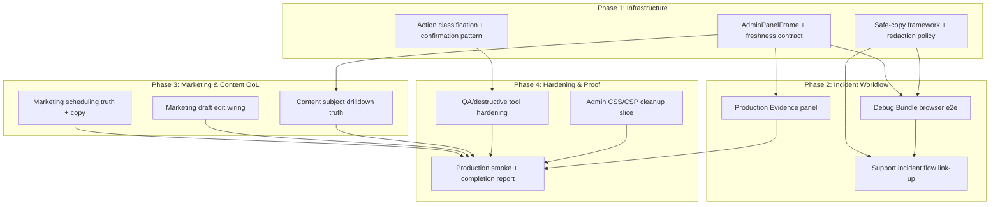

# feat: Admin Console P5 — Operator Readiness, Evidence, and QoL Contract

## Overview

Admin P5 is a hardening phase: it makes the Admin Console trustworthy under live incident pressure. The operator must be able to tell when data is stale, copy evidence safely, follow a parent-complaint debug workflow end-to-end, and never accidentally trigger a destructive mutation without explicit confirmation. No new feature categories are added — P5 strengthens existing surfaces and adds honest production-evidence visibility.

This plan sequences 12 implementation units across four phases: infrastructure patterns, incident workflow, marketing/content QoL, and cleanup/proof.

---

## Problem Frame

The Admin Console is now powerful (P1–P4 built five sections with 20+ panels), but the operator cannot yet:

1. Tell whether any panel's data is stale or freshly loaded.
2. Copy a safe evidence summary without leaking internal identifiers.
3. Follow a complete parent-complaint debugging workflow end-to-end in browser.
4. Trust that "scheduled" marketing messages will or won't auto-publish.
5. Edit a draft marketing message (backend supports it; UI doesn't wire it).
6. Distinguish real subject drilldowns from generic scroll-targets.
7. Confirm before destructive QA operations.
8. See production certification evidence in-console.

P5 resolves these operator-product risks without expanding feature scope.

---

## Requirements Trace

- R1. Unified panel freshness/failure frame (PR-1, ER-3, ER-7)
- R2. Production Evidence panel in Overview (PR-2, ER-2)
- R3. Debug Bundle browser e2e workflow (PR-3, ER-4)
- R4. Safe-copy framework with redaction policy (PR-4, ER-3, ER-8)
- R5. Support incident flow end-to-end (PR-5, ER-4)
- R6. Marketing scheduling truth (PR-6, ER-5)
- R7. Marketing draft editing QoL (PR-7, ER-9)
- R8. Content section guidance and subject drilldown truth (PR-8)
- R9. QA/destructive tool hardening (PR-9, ER-6)
- R10. Admin CSS/CSP cleanup slice (PR-10)
- R11. Characterisation-first refactor discipline (PR-11, ER-1)
- R12. Operator copy and in-product documentation (PR-12)

---

## Scope Boundaries

- No full CMS/editorial workflow.
- No marketing audience targeting beyond existing V0 audiences.
- No automated campaign/reward system.
- No billing/subscription suite.
- No organisation/team/role matrix beyond `admin`/`ops` placeholder semantics.
- No WebSocket/realtime dashboard.
- No analytics warehouse.
- No Hero Mode child UI, Coins, Hero Camp, or reward economy.
- No subject mastery mutation from Admin except existing admin-gated QA tools.
- No auto-publish scheduler (Option A chosen per PR-6 recommendation).

### Deferred to Follow-Up Work

- Marketing auto-publish (Option B): deferred to P6+ when campaign engine is justified.
- Full Content drilldown per subject: deferred to P6 (Content & Asset Operations Maturity).
- Dark-mode visual baseline for admin panels: future CSP slice.
- Remaining 150+ `shared-pattern-available` inline styles outside admin: future hardening.

---

## Context & Research

### Relevant Code and Patterns

- `src/surfaces/hubs/AdminHubSurface.jsx` — thin shell, 5 section tabs, dirty-registry guard
- `src/surfaces/hubs/admin-panel-header.jsx` — existing PanelHeader with `refreshedAt`, `refreshError`, `onRefresh`
- `src/platform/hubs/admin-refresh-error-text.js` — error code router (closed enum)
- `src/surfaces/hubs/AdminDebugBundlePanel.jsx` — current clipboard: raw `navigator.clipboard.writeText`
- `src/surfaces/hubs/AdminMarketingSection.jsx` — self-contained local state, lazy-loaded, generation counter
- `worker/src/admin-marketing.js` — lifecycle state machine, `updateMarketingMessage` exists for drafts
- `worker/src/admin-debug-bundle.js` — 7 safeSection sub-queries, role-based redaction
- `scripts/lib/capacity-evidence.mjs` — `buildReportMeta`, evidence schema v2, threshold validation
- `tests/playwright/shared.mjs` — deterministic demo fixtures, Playwright helpers
- `docs/hardening/csp-inline-style-inventory.md` — 263 total sites, admin panels ~90 sites

### Institutional Learnings

- **Characterisation-first is non-negotiable.** P4 wrote 13 characterisation tests before feature code; adversarial review caught 2 additional gaps. Cost: 8 minutes. Bugs caught: 13.
- **Standalone Worker modules.** New admin endpoints belong in their own `worker/src/admin-*.js`, never importing from `repository.js`.
- **safeSection error boundary.** Each panel query is wrapped independently — failed section returns `null`, not 500.
- **Reject before reset for CAS.** Never clear form state before async API response. On 409, auto-refresh.
- **Frozen Playwright fixtures.** Factory functions return frozen state objects matching platform interface. Unit-test the fixtures; Playwright consumes them.
- **Shape assertions first.** Assert `'entries' in payload` before checking values. P4's `row_version` vs `rowVersion` bug was invisible until the second operation.
- **D1 atomicity: `batch()` not `withTransaction`.** Production no-op. Post-batch check `meta.changes`.

---

## Key Technical Decisions

- **Option A for marketing scheduling**: No auto-publish. "Scheduled" means "staged for a future window; not auto-delivered until manually published." Copy and tests must enforce this.
- **Shared panel frame extends PanelHeader**: Rather than replacing PanelHeader, wrap it in a new `AdminPanelFrame` that adds stale-data warning, empty-state semantics, and loading skeleton. Existing PanelHeader consumers keep working.
- **Clipboard writes through one helper**: `src/platform/hubs/admin-safe-copy.js` — accepts audience enum, redacts per policy, returns `{ ok, text }` for testability without browser clipboard.
- **Production Evidence uses a build-time-generated summary**: U4 creates a new script `scripts/generate-evidence-summary.mjs` that reads from `reports/capacity/evidence/` and emits `reports/capacity/latest-evidence-summary.json`. This file is committed after each capacity run. Worker imports it at bundle time. If the file is absent (first deploy before any capacity run), a placeholder `{ "schema": 2, "metrics": {}, "generatedAt": null }` is committed alongside U4 so the build never fails.
- **Destructive operation classification**: Shared enum in `src/platform/hubs/admin-action-classification.js` with `low`/`medium`/`high`/`critical` levels driving shared confirmation UI. Asset Restore replaces the immediate `onChange` dispatch with a two-step flow: select version → confirm button.
- **Playwright admin e2e uses fixture-seeded Worker**: Extends existing `tests/playwright/shared.mjs` pattern with admin-state factories.

---

## Open Questions

### Resolved During Planning

- **Evidence source for Production Evidence panel**: U4 creates `scripts/generate-evidence-summary.mjs` (reads `reports/capacity/evidence/*.json`, emits `reports/capacity/latest-evidence-summary.json`). A placeholder JSON is committed with U4 so `wrangler deploy` never fails on missing import. Worker imports it at bundle time. Panel shows honest "stale" when `generatedAt` is >24h old or null.
- **Marketing edit scope**: Only drafts can be edited (backend already enforces this). P5 wires the existing `updateMarketingMessage` to a UI form.
- **Subject drilldown actions**: Live subjects scroll to their first subject-specific panel (existing behaviour) BUT the label now distinguishes "Open diagnostics" from "No drilldown yet".
- **Asset Restore UI pattern**: Current `<select onChange>` dispatches immediately. P5 replaces this with a two-step flow: select picks version (no dispatch), then an explicit "Restore to v{N}" confirm button dispatches. This allows the `high` classification confirmation to work naturally.

### Deferred to Implementation

- Exact CSS class names for the 20+ migrated inline styles — determined during migration.
- Whether the Playwright admin test runs against `wrangler dev --local` or fixture mocks — determined by U11 characterisation.

---

## High-Level Technical Design

> *This illustrates the intended approach and is directional guidance for review, not implementation specification. The implementing agent should treat it as context, not code to reproduce.*

---

## Implementation Units

- U1. **AdminPanelFrame — unified freshness/failure/empty contract**

**Goal:** Replace ad-hoc loading/stale/error/empty patterns across all Admin panels with a shared `AdminPanelFrame` wrapper that extends PanelHeader.

**Requirements:** R1, R11, R12

**Dependencies:** None

**Files:**
- Create: `src/platform/hubs/admin-panel-frame.js`
- Create: `src/surfaces/hubs/AdminPanelFrame.jsx`
- Modify: `src/surfaces/hubs/admin-panel-header.jsx` (extend, not replace)
- Modify: `src/surfaces/hubs/AdminOverviewSection.jsx` (adopt frame)
- Modify: `src/surfaces/hubs/AdminDebuggingSection.jsx` (adopt frame)
- Test: `tests/react-admin-panel-frame.test.js`
- Test: `tests/react-admin-panel-frame-characterisation.test.js`

**Approach:**
- `AdminPanelFrame` wraps PanelHeader + adds: stale-data warning (>5min since `refreshedAt`), loading skeleton, empty-state slot, last-successful-refresh memory, partial-failure indicator.
- Pure render logic: `decidePanelFrameState({ refreshedAt, refreshError, data, loading })` → returns which UI elements to show.
- Adopt in Overview and Debugging first (lowest risk); Marketing adopts in U7; Content section panels that load server data adopt in U9. By P5 completion, PR-1's "all Admin panels that load or refresh server data" requirement is met across all 5 sections.

**Execution note:** Characterisation-first. Snapshot existing panel header rendering across Overview + Debugging before modifying. Confirm no visual regression after adoption.

**Patterns to follow:**
- `src/surfaces/hubs/admin-panel-header.jsx` — extend, not replace
- `src/platform/hubs/admin-refresh-error-text.js` — error routing pattern

**Test scenarios:**
- Happy path: Panel with fresh data renders "Generated <ts>" chip with no warning.
- Happy path: Panel loading shows skeleton, not stale data.
- Edge case: Panel shows stale warning when `refreshedAt` >5 minutes old and `refreshError` is set.
- Edge case: Panel shows "last successful refresh at <ts>" when refresh fails but prior success exists.
- Error path: Panel with `refreshError` and no prior data shows empty state with retry CTA.
- Error path: Panel with `refreshError` + prior data shows data + stale warning + retry.
- Integration: Adopting panels in Overview/Debugging preserve existing test assertions.

**Verification:**
- All existing admin panel header tests pass unchanged.
- New frame tests cover all 6 state combinations.
- No visual regression in affected sections (run existing visual baseline).

---

- U2. **Safe-copy framework — audience-aware clipboard with redaction**

**Goal:** Implement a shared clipboard helper that enforces redaction policy before writing to clipboard. All future Admin copy operations go through this single helper.

**Requirements:** R4, R12

**Dependencies:** None

**Files:**
- Create: `src/platform/hubs/admin-safe-copy.js`
- Modify: `src/surfaces/hubs/AdminDebugBundlePanel.jsx` (adopt helper)
- Test: `tests/admin-safe-copy.test.js`
- Test: `tests/worker-admin-debug-bundle-redaction.test.js` (extend)

**Approach:**
- Audience enum: `admin_only`, `ops_safe`, `parent_safe`, `public_preview`.
- Redaction rules per audience (no cookies, no auth tokens, no raw request bodies; parent_safe additionally masks child IDs, strips internal notes, removes stack traces).
- Helper: `prepareSafeCopy(data, audience)` → `{ ok: boolean, text: string, redactedFields: string[] }`.
- Wrapper: `copyToClipboard(text)` → uses `navigator.clipboard.writeText` at the final boundary only.
- Debug Bundle panel switches from raw `navigator.clipboard.writeText` to `prepareSafeCopy(bundleData, audience) → copyToClipboard(result.text)`.

**Execution note:** Test-first for the redaction logic. The redaction policy is the critical decision; clipboard API is trivial.

**Patterns to follow:**
- `worker/src/admin-debug-bundle.js` — existing role-based redaction (server-side)
- Existing clipboard pattern in `AdminDebugBundlePanel.jsx` (migrate away from it)

**Test scenarios:**
- Happy path: `admin_only` audience passes full bundle JSON through unchanged.
- Happy path: `ops_safe` audience masks email to last 6 chars, strips internal notes.
- Happy path: `parent_safe` audience strips child IDs, stack traces, internal notes, raw request bodies.
- Edge case: Empty data returns `{ ok: false }` without clipboard write.
- Edge case: Data containing auth tokens (cookie header) is stripped regardless of audience.
- Error path: Clipboard API failure returns `{ ok: false }` gracefully.
- Integration: Debug Bundle "Copy Summary" uses `parent_safe`; "Copy JSON" uses `admin_only`.
- Integration: Ops-role user cannot trigger `admin_only` copy (button absent).

**Verification:**
- Redaction tests cover all 4 audiences × sensitive field types.
- Debug Bundle panel tests confirm copy buttons route through safe-copy helper.
- No raw `navigator.clipboard.writeText` calls remain in Admin panels after adoption.
- CI grep test asserts no direct `navigator.clipboard` usage in `src/surfaces/hubs/Admin*.jsx` (structural enforcement, not just convention).

---

- U3. **Action classification — destructive operation confirmation pattern**

**Goal:** Define a shared classification system for Admin actions and implement reusable confirmation UI for high/critical operations.

**Requirements:** R9

**Dependencies:** None

**Files:**
- Create: `src/platform/hubs/admin-action-classification.js`
- Create: `src/surfaces/hubs/AdminConfirmAction.jsx`
- Test: `tests/admin-action-classification.test.js`
- Test: `tests/react-admin-confirm-action.test.js`

**Approach:**
- Classification enum: `low` (refresh, view, copy redacted), `medium` (edit draft, save notes, search), `high` (publish all-user message, suspend account, archive evidence), `critical` (overwrite learner state, delete evidence, broad maintenance banner).
- `AdminConfirmAction` component: danger copy, target display, typed confirmation for `critical` level, environment guard for `critical` operations.
- Classification registry maps `(actionKey, context)` → level. Context includes audience scope and environment.
- High-level actions show a confirmation dialog. Critical-level actions require typing the target identifier.

**Patterns to follow:**
- `BroadPublishConfirmDialog` in `AdminMarketingSection.jsx` — same pattern, generalised.
- `useSubmitLock` for preventing double-submission during confirmation flow.

**Test scenarios:**
- Happy path: `low` action proceeds without confirmation.
- Happy path: `high` action shows confirmation dialog; user confirms → proceeds.
- Happy path: `critical` action requires typing target; correct input → proceeds.
- Edge case: `critical` action with wrong typed input → stays blocked.
- Error path: User cancels confirmation → action not dispatched.
- Integration: Classification for `post-mega-seed-apply` returns `critical`.
- Integration: Classification for `monster-visual-config-publish` returns `high`.
- Integration: Classification for `admin-ops-kpi-refresh` returns `low`.

**Verification:**
- Every existing destructive Admin action is registered in the classification.
- Confirmation UI renders correct danger copy and target display.
- Typed confirmation validates exact match before enabling submit.

---

- U4. **Production Evidence panel — honest certification visibility**

**Goal:** Add a "Production Evidence" panel to the Overview section showing current certification tier, smoke status, CSP state, and D1 migration state using a closed evidence taxonomy. Also creates the evidence summary generation script.

**Requirements:** R2

**Dependencies:** U1 (uses AdminPanelFrame for freshness semantics)

**Files:**
- Create: `scripts/generate-evidence-summary.mjs` (reads evidence files, emits summary JSON)
- Create: `reports/capacity/latest-evidence-summary.json` (placeholder committed with U4)
- Create: `src/platform/hubs/admin-production-evidence.js`
- Create: `src/surfaces/hubs/AdminProductionEvidencePanel.jsx`
- Modify: `src/surfaces/hubs/AdminOverviewSection.jsx` (add panel)
- Modify: `worker/src/app.js` (add evidence endpoint — lazy-loaded, not in main hub payload)
- Test: `tests/react-admin-production-evidence.test.js`
- Test: `tests/worker-admin-production-evidence.test.js`
- Test: `tests/admin-evidence-summary-generator.test.js`

**Approach:**
- Evidence state enum (closed): `not_available`, `stale`, `failing`, `smoke_pass`, `small_pilot_provisional`, `certified_30_learner_beta`, `certified_60_learner_stretch`, `certified_100_plus`, `unknown`.
- New script `scripts/generate-evidence-summary.mjs` reads `reports/capacity/evidence/*.json` and emits `reports/capacity/latest-evidence-summary.json`. Schema: `{ schema: 2, generatedAt, metrics: { adminSmoke, bootstrapSmoke, capacityTier, cspStatus, d1MigrationState, buildHash, kpiReconcileStatus } }`.
- A placeholder `{ "schema": 2, "metrics": {}, "generatedAt": null }` is committed with U4 so `wrangler deploy` never fails.
- Worker imports the JSON at bundle time. Returns a shaped summary with classification per metric.
- Panel uses AdminPanelFrame for loading/stale semantics. Freshness based on `generatedAt` timestamp (null = "not_available").
- Lazy-loaded (separate endpoint, not in main hub payload) to preserve ER-7.
- Distinguishes: "not measured", "smoke passed", "small-pilot provisional", "certified", "failing", "unknown".
- Both admin and ops roles can VIEW the evidence panel (read-only operational surface). Role-based test confirms both see the same data (per ER-8: evidence is not sensitive — it's operational certification state).

**Execution note:** Characterisation-first for the Overview section before adding the new panel.

**Patterns to follow:**
- `scripts/lib/capacity-evidence.mjs` — `EVIDENCE_SCHEMA_VERSION`, threshold keys, `buildReportMeta`
- `scripts/verify-capacity-evidence.mjs` — reads evidence files from `reports/capacity/evidence/`
- `docs/operations/capacity.md` — certification status table
- `DashboardKpiPanel` in AdminOverviewSection — placement and structure

**Test scenarios:**
- Happy path: Evidence file exists and is fresh (<24h) → shows certification tier with "Certified" badge.
- Happy path: All metrics present → each row shows correct state badge.
- Edge case: Evidence file >24h old → panel shows "stale" warning.
- Edge case: Evidence file has `generatedAt: null` (placeholder) → all metrics show "not_available".
- Edge case: Evidence file has `smoke_pass` but no classroom tier → shows "smoke_pass" (honest, not overclaimed).
- Error path: Worker import fails or returns malformed shape → panel shows "unknown" state with explanation.
- Integration: Panel appears after DashboardKpiPanel in Overview section.
- Integration (ER-8): Admin role sees evidence panel → all metrics visible.
- Integration (ER-8): Ops role sees evidence panel → same data (evidence is non-sensitive operational state).
- Integration: `generate-evidence-summary.mjs` reads evidence files and produces valid schema-2 JSON.
- Integration: Placeholder JSON passes Worker bundle without error.

**Verification:**
- Closed enum rejects any value not in the taxonomy (test asserts type guard).
- Panel never claims "certified" without evidence file proving it.
- Worker builds successfully with placeholder JSON (no missing-module error).
- Generator script produces valid output when evidence files exist.
- Both admin and ops roles tested (ER-8).
- Existing Overview section tests still pass.

---

- U5. **Debug Bundle browser e2e — Playwright proof of operator workflow**

**Goal:** Add a Playwright browser-level test proving the complete Debug Bundle operator workflow: open admin, search, generate bundle, verify sections, copy summary, confirm ops redaction.

**Requirements:** R3, R5

**Dependencies:** U1 (freshness frame), U2 (safe-copy adoption)

**Files:**
- Create: `tests/playwright/admin-debug-bundle-workflow.playwright.test.mjs`
- Create: `tests/playwright/admin-fixtures.mjs` (frozen state factories for admin)
- Modify: `tests/playwright/shared.mjs` (add admin demo session helper if needed)
- Test: `tests/playwright/admin-debug-bundle-workflow.playwright.test.mjs`

**Approach:**
- Create frozen admin-state fixture factory: account with learners, errors, denials, mutations.
- Admin flow: open `/admin#section=debug` → fill account ID → generate bundle → verify all 7 sections render → copy summary → verify clipboard content is redacted.
- Ops flow (separate test, separate session): seed an ops-role account in the local Worker server (extend `tests/helpers/browser-app-server.js` admin seeding), sign in as ops → open debug section → generate bundle → verify JSON export button absent → verify masked identifiers in result. This is a distinct Playwright test case, not a "role switch" within one session.
- Uses existing Playwright shared helpers for determinism (reducedMotion, synthetic IP).
- Extends `tests/helpers/browser-app-server.js` with `--seed-admin-account` and `--seed-ops-account` flags for deterministic role-based Playwright sessions.
- Does NOT test against live production — uses local fixture Worker via `browser-app-server.js`.

**Execution note:** Start with fixture factories. Unit-test fixtures before wiring Playwright. Ops-role Playwright test is a separate `test()` block with its own signed-in session.

**Patterns to follow:**
- `tests/playwright/shared.mjs` — demo session seeding, determinism helpers
- Grammar P7 frozen fixture pattern — factory functions + unit tests
- `tests/react-admin-debug-bundle-panel.test.js` — existing unit coverage to extend

**Test scenarios:**
- Happy path: Admin opens debug section → generates bundle for test account → all 7 sections render with data.
- Happy path: Copy Summary button writes redacted text to clipboard (no raw IDs).
- Happy path: Copy JSON button (admin role) writes full bundle JSON.
- Edge case: Ops role sees masked identifiers in bundle result.
- Edge case: Ops role does NOT see "Copy JSON" button.
- Edge case: Bundle generation with no matching data renders "(empty)" for each section.
- Error path: Bundle generation failure shows error message with retry CTA.
- Integration: Prefill from account detail "Debug Bundle" button populates account ID field.

**Verification:**
- Playwright test passes in CI (headless Chrome).
- Test proves the real UI flow, not just endpoint shapes.
- Fixture factories have their own unit test coverage.

---

- U6. **Support incident flow — end-to-end link-up**

**Goal:** Wire the complete parent-complaint debugging workflow: account search → detail → debug bundle (prefilled) → copy safe summary → return to account detail without context loss.

**Requirements:** R5

**Dependencies:** U2 (safe-copy), U5 (browser proof of debug bundle)

**Files:**
- Modify: `src/surfaces/hubs/AdminAccountsSection.jsx` (return stash + copy actions)
- Modify: `src/surfaces/hubs/AdminDebugBundlePanel.jsx` (accept context from account detail)
- Create: `src/platform/hubs/admin-incident-flow.js` (state machine for context preservation)
- Test: `tests/react-admin-incident-flow.test.js`
- Test: `tests/admin-incident-flow-characterisation.test.js`

**Approach:**
- Account detail "Debug Bundle" button already navigates to debug section with account ID in hash. P5 adds: return-stash (save detail panel state before navigating) + return button in debug section header when stash exists.
- Copy actions in account detail: "Copy support summary" using `parent_safe` audience.
- Context preservation: `admin-incident-flow.js` manages a small state object (`{ returnSection, returnAccountId, returnScrollY }`) persisted in sessionStorage.
- Production Evidence link: account detail shows a chip indicating whether capacity state may explain the issue (reads from U4 endpoint).

**Execution note:** Characterisation-first for AccountDetailPanel and AdminDebugBundlePanel before modifying navigation.

**Patterns to follow:**
- `debugBundleLinkForAccount` in `admin-account-search.js` — existing link builder
- `tests/admin-return-stash.test.js` — existing return stash test

**Test scenarios:**
- Happy path: Account detail → "Debug Bundle" → section changes to debug with account prefilled → "Return to account" → account detail shows same account.
- Happy path: Account detail → "Copy support summary" → clipboard has parent-safe text.
- Edge case: Return stash survives tab switch (sessionStorage).
- Edge case: Stale return stash (account deleted since) shows graceful "Account no longer found" on return.
- Error path: Debug bundle generation fails → return button still works.
- Integration: Account detail capacity chip reads from production evidence endpoint (U4).

**Verification:**
- End-to-end flow works without losing context.
- No new inline `navigator.clipboard` calls — all through safe-copy.
- Existing account search/detail tests pass unchanged.

---

- U7. **Marketing scheduling truth — copy and semantics enforcement**

**Goal:** Ensure the Marketing UI makes scheduling semantics impossible to misread: "scheduled" means "staged for manual publish," and all copy/UI reflects this honestly.

**Requirements:** R6, R12

**Dependencies:** U1 (panel frame adoption for Marketing)

**Files:**
- Modify: `src/surfaces/hubs/AdminMarketingSection.jsx` (scheduling copy, panel frame)
- Modify: `worker/src/admin-marketing.js` (add scheduling-truth assertion to transition)
- Test: `tests/admin-marketing-section.test.js` (extend)
- Test: `tests/worker-admin-marketing-mutations.test.js` (extend)
- Test: `tests/admin-marketing-scheduling-truth.test.js`

**Approach:**
- UI copy for "scheduled" status: "Staged for a future window — will NOT be shown to users until manually published."
- StatusBadge tooltip for scheduled: "This message is staged but not auto-delivered. Publish manually when ready."
- Remove any copy that implies automatic delivery.
- Worker-side: add a response field `schedulingSemantics: 'manual_publish_required'` on list/detail so the UI can assert truth without hard-coding.
- Test: assert that no UI string implies automatic delivery for `scheduled` status.

**Patterns to follow:**
- `BroadPublishConfirmDialog` — existing confirmation pattern
- `TRANSITION_LABELS` map in `AdminMarketingSection.jsx`

**Test scenarios:**
- Happy path: Scheduled message detail shows "Staged — manual publish required" copy.
- Happy path: Message list row for scheduled message shows honest status description.
- Edge case: Transitioning to "scheduled" shows confirmation that scheduling does NOT auto-deliver.
- Error path: If backend ever returns `schedulingSemantics: 'auto_publish'`, UI shows warning banner.
- Integration: Production smoke round-trip asserts scheduling copy matches truth.
- Covers AE5: Broad all-signed-in message scheduling requires confirmation + communicates manual publish semantics.

**Verification:**
- No UI string containing "scheduled" implies automatic delivery (grep assertion test).
- Worker response includes `schedulingSemantics` field on marketing list/detail.
- Worker-side test asserts that no transition action named `auto_publish` or equivalent is accepted (ER-5: "enforced by both UI and tests"). This is a negative invariant test proving the Worker has no code path that auto-delivers scheduled messages.
- Existing marketing tests pass unchanged.

---

- U8. **Marketing draft edit — wire existing backend to UI**

**Goal:** Implement draft edit form in Marketing section using the existing `updateMarketingMessage` backend function.

**Requirements:** R7

**Dependencies:** U7 (scheduling truth copy settled first)

**Files:**
- Modify: `src/surfaces/hubs/AdminMarketingSection.jsx` (add `MarketingEditForm` component)
- Modify: `src/platform/hubs/admin-marketing-api.js` (add `updateMarketingMessage` method)
- Test: `tests/admin-marketing-section.test.js` (extend)
- Test: `tests/worker-admin-marketing-mutations.test.js` (extend for edit path)
- Test: `tests/react-admin-marketing-edit.test.js`

**Approach:**
- Edit button appears only on draft messages (backend enforces; UI mirrors).
- Edit form pre-fills title/body_text/severity_token/timing from current message state.
- Form preserves data on failed save (existing pattern from MarketingCreateForm).
- CAS conflict on save shows "This message was updated by another session" with refresh/retry (existing CAS pattern).
- Inline validation errors (title required, body required, schema checks).
- Preview restricted Markdown using existing `renderRestrictedMarkdown`.
- Disabled/hidden actions for ops role with explanation tooltip.

**Patterns to follow:**
- `MarketingCreateForm` — form structure, validation, submit lock
- `executeTransition` — CAS conflict handling pattern
- `renderRestrictedMarkdown` — safe preview

**Test scenarios:**
- Happy path: Click "Edit" on draft → form pre-filled → change title → save → list updates.
- Happy path: Restricted Markdown preview renders correctly during edit.
- Edge case: Save fails with 409 CAS conflict → shows conflict message + auto-refresh.
- Edge case: Form data preserved on save failure (non-409).
- Edge case: Edit button hidden for non-draft messages.
- Edge case: Ops role cannot see edit button.
- Error path: Validation failure (empty title) shows inline error without clearing form.
- Integration: Round-trip: create draft → edit → verify updated values in detail view.

**Verification:**
- Edit form only appears for draft messages.
- CAS conflict handled gracefully (no stale overwrites).
- Ops role sees no edit controls.
- Existing marketing tests pass unchanged.

---

- U9. **Content subject drilldown truth — honest actions per subject**

**Goal:** Make each subject row in the Content Overview honest about what clicking it does: open subject diagnostics, show "no drilldown yet", or show "placeholder." Also adopt AdminPanelFrame for Content panels that load server data (PR-1 "all panels" coverage).

**Requirements:** R1, R8, R12

**Dependencies:** U1 (AdminPanelFrame)

**Files:**
- Modify: `src/surfaces/hubs/AdminContentSection.jsx` (SubjectOverviewPanel click labels)
- Modify: `src/platform/hubs/admin-content-overview.js` (add drilldown availability to overview model)
- Test: `tests/react-admin-content-overview.test.js` (extend)
- Test: `tests/react-admin-content-subject-drilldown.test.js`

**Approach:**
- Each subject in `buildSubjectContentOverview` gains a `drilldownAction` field: `'diagnostics'`, `'asset_registry'`, `'content_release'`, `'none'`, `'placeholder'`.
- SubjectOverviewPanel renders the correct action label per subject: "Open diagnostics", "Open asset registry", "No drilldown yet", "Placeholder — not live."
- Placeholder rows are visually muted (existing `data-subject-status="placeholder"` attribute already targets this).
- Click handler routes to the correct panel (scroll target) or no-ops with tooltip for "no drilldown" subjects.

**Execution note:** Characterisation-first for SubjectOverviewPanel before modifying click logic.

**Patterns to follow:**
- Existing `data-clickable` attribute pattern in SubjectOverviewPanel
- `statusBadgeClass` / `statusLabel` in `admin-content-overview.js`

**Test scenarios:**
- Happy path: Live subject with diagnostics panel → click scrolls to diagnostics.
- Happy path: Placeholder subject → row is muted, not clickable, shows "Placeholder — not live."
- Edge case: Live subject with NO matching panel below → shows "No drilldown yet" (no false promise).
- Edge case: Multiple live subjects → each routes to correct panel.
- Error path: Content overview load failure → existing error handling preserved (no drilldown labels rendered).
- Integration: Adding a new subject to overview automatically gets "No drilldown yet" until a panel exists.

**Verification:**
- No subject row implies a drilldown that doesn't exist.
- Existing content overview tests pass unchanged.
- Placeholder subjects are not clickable.

---

- U10. **QA/destructive tool hardening — confirmation for seed/delete/archive**

**Goal:** Apply the shared confirmation pattern (U3) to all existing destructive Admin tools: post-Mega seed harness, Writing Try archive/delete, asset config publish/restore.

**Requirements:** R9

**Dependencies:** U3 (action classification + confirmation component)

**Files:**
- Modify: `src/surfaces/hubs/AdminContentSection.jsx` (PostMegaSeedHarnessPanel, GrammarWritingTryAdminPanel, AssetRegistryCard)
- Modify: `worker/src/app.js` (add audit receipt for seed/delete if missing)
- Test: `tests/react-admin-destructive-tools.test.js`
- Test: `tests/grammar-transfer-admin-security.test.js` (extend)

**Approach:**
- Post-Mega seed "Apply seed": classified `critical`. Requires typing learner ID to confirm.
- Writing Try "Delete permanently": classified `critical`. Requires typing prompt ID.
- Writing Try "Archive": classified `high`. Shows confirmation dialog with target display.
- Asset Config "Publish": classified `high`. Shows confirmation with draft revision.
- Asset Config "Restore version": classified `high`. **Replace immediate `<select onChange>` dispatch with two-step flow:** select picks version (stores in local state, no dispatch), then an explicit "Restore to v{N}" button triggers confirmation dialog. This is a UX pattern change from the P3 original — characterisation tests must capture the existing behaviour before modification.
- All high/critical operations show: danger copy, explicit target, and mutation receipt feedback.
- Worker already records audit receipts for seed/archive/delete — verify and add if missing.

**Patterns to follow:**
- `AdminConfirmAction` from U3
- `BroadPublishConfirmDialog` — existing confirmation dialog structure
- `useSubmitLock` — double-submit prevention

**Test scenarios:**
- Happy path: "Apply seed" shows typed confirmation → correct input → seed dispatched.
- Happy path: "Delete permanently" shows typed confirmation → correct prompt ID → deletion dispatched.
- Happy path: "Restore version" select picks version → confirm button appears → click confirms → dispatch.
- Edge case: "Apply seed" with wrong typed text → button stays disabled.
- Edge case: Ops role cannot see "Apply seed" button at all (existing guard preserved).
- Edge case: "Restore version" select without confirm → no dispatch (regression from P3 immediate-dispatch).
- Error path: User cancels confirmation → no mutation dispatched.
- Integration: After seed apply, audit receipt is recorded (Worker test).
- Integration: Confirmation dialog shows correct learner name for target display.
- Covers AE6: Destructive QA action in production requires explicit confirmation + Worker audit receipt.

**Verification:**
- Every destructive Admin action now requires explicit confirmation.
- No destructive action hidden behind a casual secondary button.
- Existing security tests for grammar-transfer-admin pass unchanged.
- Worker audit receipts exist for all critical operations.

---

- U11. **Admin CSS/CSP cleanup slice — inline style migration**

**Goal:** Migrate ≥20 `shared-pattern-available` inline styles from Admin panels to CSS classes, with visual baseline coverage.

**Requirements:** R10

**Dependencies:** None

**Files:**
- Modify: `src/surfaces/hubs/AdminMarketingSection.jsx` (target: 22 sites)
- Modify: `src/surfaces/hubs/AdminDebugBundlePanel.jsx` (target: 14 sites, partial)
- Modify: `src/surfaces/styles/admin.css` or equivalent stylesheet
- Modify: `docs/hardening/csp-inline-style-inventory.md` (update counts)
- Test: `tests/csp-inline-style-budget.test.js` (verify count decreases)
- Test: `tests/playwright/visual-baselines.playwright.test.mjs` (add admin-marketing, admin-debug baseline scenes)

**Approach:**
- Target Marketing (22 sites) + partial Debug Bundle (14 sites) = ~30 sites migrated.
- Replace `style={{ marginBottom: 12 }}` with class `.admin-mb-12` or semantic class `.admin-card-spaced`.
- Add visual baseline Playwright snapshots for marketing list view and debug bundle panel before migration.
- Run inventory script after migration to confirm count reduction.
- Do NOT touch `dynamic-content-driven` sites (requires sanitisation helpers).
- Do NOT create new inline styles.

**Execution note:** Visual baselines FIRST (capture existing rendering), then migrate styles, then compare screenshots.

**Patterns to follow:**
- `docs/hardening/csp-inline-style-inventory.md` — SH2-U8 migration pattern
- `.admin-panel-header-title` — existing class migration example
- `.admin-card-spaced`, `.admin-meta-spaced` — existing admin CSS classes

**Test scenarios:**
- Happy path: After migration, visual baseline screenshots match within 2% pixel budget.
- Happy path: CSP inline-style budget test shows reduced count (≥20 fewer sites).
- Edge case: Dark-mode rendering uses theme variables (intentional unification per SH2 decision).
- Error path: If migration introduces visual regression >2%, revert specific site.
- Integration: Inventory script output matches manually counted reduction.

**Verification:**
- ≥20 inline style sites migrated.
- Visual baseline screenshots pass (no unintended regression).
- CSP budget test count decreases.
- No new inline styles introduced.

---

- U12. **Production smoke extension + completion report**

**Goal:** Extend the production smoke script to cover P5 additions (evidence panel, safe-copy, marketing edit, destructive confirmation) and produce the P5 completion report.

**Requirements:** R11, R12, ER-1, ER-10

**Dependencies:** U4, U5, U7, U8, U9, U10, U11

**Files:**
- Modify: `scripts/admin-ops-production-smoke.mjs` (add new steps)
- Modify: `tests/admin-ops-production-smoke.test.js` (extend)
- Create: `docs/plans/james/admin-page/admin-page-p5-completion-report.md`

**Approach:**
- New smoke steps (continue-on-failure pattern): evidence panel shape assertion, marketing edit round-trip (create draft → edit → verify), destructive action classification endpoint.
- Completion report sections per contract §9: executive summary, source-truth reconciliation, product changes by section, engineering changes by concern, evidence/tests run, browser e2e evidence, smoke evidence, redaction/copy verification, scheduling truth decision, destructive tool audit, CSP inventory impact, deferred items, recommendation for remaining phases.
- Source-truth reconciliation: diff current `main` against P4 completion report assumptions.

**Patterns to follow:**
- Existing smoke script step structure (abort-on-failure for core, continue-on-failure for panels)
- `EXIT_OK`, `EXIT_STATE_DRIFT`, `EXIT_USAGE` exit code pattern
- Request ID stamping: `smoke-<iso-date>-<sequence>-<uuid8>`

**Test scenarios:**
- Happy path: Smoke script with P5 steps passes in test environment.
- Happy path: New steps use internal audience / clean up after themselves (ER-10).
- Edge case: Evidence panel step handles "not_available" gracefully (no false failure).
- Error path: Marketing edit step with stale CAS → reports state drift exit code.
- Integration: Full smoke run covers all 5 Admin sections.

**Verification:**
- Production smoke passes with P5 additions.
- Completion report addresses all 13 required sections per contract §9.
- No customer-visible state left behind by smoke steps.
- Source-truth reconciliation confirms no P4→P5 drift.

---

## System-Wide Impact

- **Interaction graph:** PanelHeader → AdminPanelFrame (extension, not replacement). Safe-copy helper → every Admin copy button. Action classification → every destructive dispatch. Evidence panel → capacity evidence scripts.
- **Error propagation:** Narrow refresh failures continue to route through `admin-refresh-error-text.js`. New panels degrade independently (safeSection pattern). Safe-copy failures show feedback UI, never throw.
- **State lifecycle risks:** Return stash in sessionStorage may go stale (handled by "account no longer found" guard). CAS conflicts on marketing edit handled via existing pattern. No new persistent state introduced beyond sessionStorage return stash.
- **API surface parity:** Evidence endpoint is read-only (no new mutation surface). Marketing edit uses existing `updateMarketingMessage` — no new wire format.
- **Integration coverage:** Playwright e2e (U5) proves the real UI flow. Production smoke (U12) proves the live deployment. Unit tests prove redaction, classification, and state machines.
- **Unchanged invariants:** P1–P4 section structure, hash routing, dirty-row guard, broad publish confirmation, role-based access gates, rate limits, audit receipt pattern — all preserved unchanged.

---

## Risks & Dependencies

| Risk | Mitigation |
|------|------------|
| Characterisation test coverage gaps miss regressions | Adversarial review of characterisation tests themselves (P4 pattern) |
| Evidence file stale/missing in production | Panel handles gracefully with "not_available" / "stale" states — never overclaims |
| Playwright admin test flaky due to timing | Frozen fixture factories eliminate non-determinism; reducedMotion already applied |
| Marketing edit CAS conflicts during smoke | Smoke uses internal audience; CAS conflict triggers state-drift exit code (expected) |
| CSS migration visual regression | Visual baselines captured BEFORE migration; pixel-diff budget enforced |
| Safe-copy redaction misses a field | Test matrix covers all sensitive field types × all 4 audiences |

---

## Sources & References

- **Origin document:** [docs/plans/james/admin-page/admin-page-p5.md](docs/plans/james/admin-page/admin-page-p5.md)
- Related code: `src/surfaces/hubs/Admin*.jsx`, `worker/src/admin-*.js`
- Related learnings: `docs/solutions/architecture-patterns/admin-console-p4-hardening-truthfulness-adversarial-review-2026-04-27.md`
- Related learnings: `docs/solutions/architecture-patterns/admin-console-section-extraction-pattern-2026-04-27.md`
- Related docs: `docs/hardening/csp-inline-style-inventory.md`, `docs/operations/capacity.md`
- Related scripts: `scripts/admin-ops-production-smoke.mjs`, `scripts/lib/capacity-evidence.mjs`
