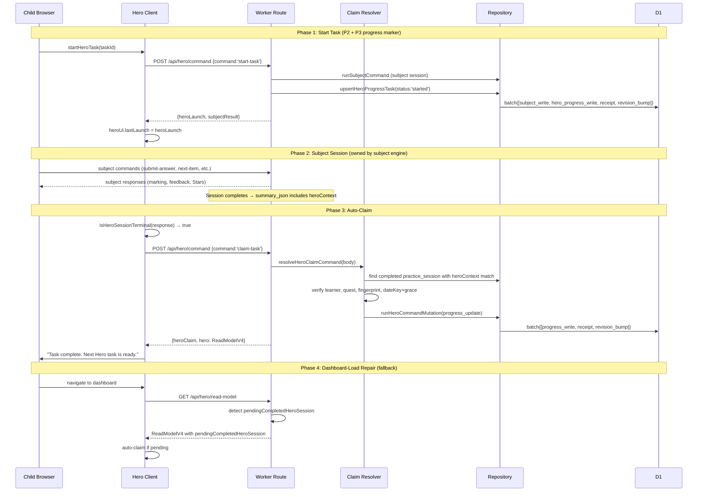

# feat: Hero Mode P3 — completion claims and daily progress

## Overview

Hero Mode P3 makes Hero Quest progress authoritative. A completed Hero-launched subject session can be verified by the Worker, claimed exactly once, persisted as daily Hero progress, and shown to the child on the dashboard — all without Coins, Hero Camp, Hero monsters, streak pressure, or subject mastery mutation.

P3 answers: "Can a learner finish a Hero-launched subject round, return to the dashboard, and see authoritative Hero progress for today's quest — with idempotent completion claims, no duplicate progress, and no reward economy?"

---

## Problem Frame

P2 (PR #451) proved that a child can see today's Hero Quest, start a safe Hero task, enter the normal subject session, and keep Hero context while working. P2 deliberately left four unresolved issues for P3: post-session active-session confusion, `lastLaunch` lifecycle, midnight/dateKey edge cases, and completion authority. P3 resolves all four by introducing Hero-owned persistent state for the first time.

The critical constraint: P3 writes only daily progress and claim records. No economy state. P4 adds Coins after P3 proves completion is reliable.

(see origin: `docs/plans/james/hero-mode/hero-mode-p3.md`)

---

## Requirements Trace

- R1. Worker verifies task completion from server-owned evidence, not client assumption
- R2. `claim-task` command is idempotent: same requestId replays; different requestId for already-completed returns safe status
- R3. Daily Hero progress persists in `child_game_state` under `system_id='hero-mode'`; no new D1 tables
- R4. Read model v4 merges scheduled quest + persisted progress + active session + pending completed evidence
- R5. Dashboard shows authoritative task completion, effort, and daily complete status
- R6. Progress survives page refresh, multi-tab, stale quest recomputation, and network drop
- R7. Cross-learner claims, fake completions, wrong fingerprint, and stale sessions are rejected
- R8. `HERO_MODE_PROGRESS_ENABLED` flag gates all P3 writes and claim UI; requires all P2 flags
- R9. Zero economy vocabulary in child UI; zero Coins/balance/monster fields in persisted state
- R10. Subject engines remain the learning authority — Hero claim never mutates subject Stars or mastery
- R11. Midnight grace window allows claims for tasks started shortly before midnight
- R12. All P0/P1/P2 tests pass or are deliberately updated to the P3 boundary

---

## Scope Boundaries

- No Hero Coins, ledger, monster ownership, Hero Camp, unlock/evolve, streak rewards
- No subject Stars awarded by Hero; no mastery changes from Hero claim
- No new D1 Hero tables; Hero progress lives in existing `child_game_state`
- Subject engines may enrich practice session summaries with trusted heroContext fields (additive metadata, not a Hero-direct write to subject state)
- No per-question currency; effort is counted at task-envelope level
- No item-level Hero scheduler or six-subject expansion
- No offline-first queueing beyond safe retry/refetch behaviour
- No confetti or heavy celebration animation

### Deferred to Follow-Up Work

- Hero Coins ledger and capped daily reward → P4
- Hero Pool and Hero Camp (monster ownership) → P5
- Hardening, metrics, retention, rollout → P6
- Six-subject expansion → optional later phase

---

## Context & Research

### Relevant Code and Patterns

**Shared pure layer** (`shared/hero/` — 10 files): `constants.js`, `contracts.js`, `eligibility.js`, `hero-copy.js`, `launch-context.js`, `launch-status.js`, `quest-fingerprint.js`, `scheduler.js`, `seed.js`, `task-envelope.js`. P3 extends with `progress-state.js`, `claim-contract.js`, `completion-status.js`.

**Worker Hero layer** (`worker/src/hero/` — 8 files): `read-model.js` (v3 assembler), `routes.js` (GET), `launch.js` (start-task resolver), `providers/{spelling,grammar,punctuation}.js`, `launch-adapters/{spelling,grammar,punctuation}.js`. P3 adds `claim.js`. Repository-level progress helpers live in `worker/src/repository.js` alongside existing game state functions.

**Client** (`src/platform/hero/hero-client.js`): Factory with `readModel()` and `startTask()`. P3 adds `claimTask()`.

**Components**: `src/surfaces/home/HeroQuestCard.jsx` (dashboard card), `src/surfaces/subject/HeroTaskBanner.jsx` (subject banner).

**Mutation safety pattern** (`worker/src/repository.js` line 7522): `runSubjectCommandMutation` — single LEFT JOIN for receipt+revision check, CAS update, batch write with `storeMutationReceiptStatement`, learner revision bump. P3 claim-task must use an equivalent Hero mutation path.

**child_game_state usage** (`system_id='monster-codex'`): Only one consumer today. Hero progress will be the second (`system_id='hero-mode'`).

**practice_sessions**: Stores `id`, `learner_id`, `subject_id`, `session_kind`, `status`, `session_state_json` (NULL on completion), `summary_json`. **Critical: heroContext is NOT preserved in summary_json today.**

### Institutional Learnings

- **D1 atomicity**: `batch(db, [...])` is the only atomic write mechanism in production; `withTransaction` is a no-op on Cloudflare D1 (see memory: `project_d1_atomicity_batch_vs_withtransaction.md`)
- **P1 launch bridge**: `app.js` owns dispatch; Hero returns `{heroLaunch, subjectCommand}`. Do not introduce a parallel command system.
- **P2 shadow-to-production**: Pattern 4 (never return server-side values in conflict errors); Pattern 5 (strip debug from child-visible); Pattern 1 (query expansion, not new queries).
- **CAS patterns** (Admin P4): `meta.changes` verification post-batch; CAS conflict triggers client refetch, not retry with stale state.

### Critical Discovery: heroContext Loss After Session Completion

All three subject engines clear `state.session = null` on completion. `practice_sessions.session_state_json` is also NULL on completion. The summary_json does NOT include heroContext fields. This means after a subject session completes, there is NO server-owned evidence linking the completed practice session to a Hero launch.

**Resolution**: U1 adds heroContext fields to practice session summaries at completion time. This is the strongest trust anchor for claim verification, following spec section 23.5 option 1.

---

## Key Technical Decisions

- **heroContext persisted in summary_json**: Subject engines copy relevant heroContext fields (`source`, `questId`, `taskId`, `questFingerprint`, `launchRequestId`) into the practice session summary at completion. Small change per engine; strong trust anchor for claims.
- **start-task writes a progress marker**: P3 extends start-task to also upsert hero progress state with `status: 'started'` for the launched task. This gives the read model a server-side "task in flight" signal needed for `pendingCompletedHeroSession` detection.
- **Hero mutation path parallels subject mutation path**: A new `runHeroCommandMutation` function (in repository) provides receipt lookup, CAS guard, batch write, and receipt storage — structurally identical to `runSubjectCommandMutation` but scoped to Hero progress state. Named `runHeroCommandMutation` (not the origin's example `runHeroCommand`) to mirror `runSubjectCommandMutation` naming convention.
- **Read model v4 query strategy**: Expand `readHeroSubjectReadModels` to also SELECT `child_game_state` for `system_id='hero-mode'` and recent completed `practice_sessions` with hero summary data. One additional LEFT JOIN or subquery, not separate round-trips.
- **Grace window is forward-only**: A task's `heroContext.dateKey` is authoritative. Claims apply to that date. Grace window (2 hours) only extends the claim deadline past midnight, never backwards.
- **Auto-claim + dashboard-load repair**: Client attempts synchronous auto-claim after observing subject completion. On failure, dashboard-load reads `pendingCompletedHeroSession` from read model v4 and retries.
- **stale_write retry**: Client auto-retries claim once with fresh revision on `stale_write`. Second failure falls through to dashboard-load repair.
- **progress.stateVersion is informational**: Not a CAS guard. The `learner_profiles.state_revision` + `mutation_receipts` combination is the concurrency mechanism. `stateVersion` is a monotonic counter inside the hero progress JSON for debugging.
- **recentClaims capped at 7 days**: Pruned on every progress write. Prevents unbounded growth.
- **daily.expired trigger**: When current `dateKey` differs from `daily.dateKey` and the grace window has passed, the daily state is replaced with a fresh day on next progress interaction (claim or read-model v4 with started task).

---

## Open Questions

### Resolved During Planning

- **Q: How does the read model detect pendingCompletedHeroSession when ui_json.session is null?** R: Hero progress state records `status: 'started'` at launch time. Read model v4 cross-references this with a completed practice_sessions row matching learner+subject+heroContext.questId in summary. One expanded query in `readHeroSubjectReadModels`.
- **Q: What per-subject signal triggers auto-claim on the client?** R: Define `isHeroSessionTerminal(subjectId, commandResponse)` in shared helper. Grammar: `phase === 'summary'` or `phase === 'dashboard'`. Spelling: phase indicating session ended + no active session. Punctuation: service terminal state. The helper checks `heroUi.lastLaunch.subjectId` matches and the response indicates terminal.
- **Q: Must start-task also write hero progress state?** R: Yes. Without a "task started" marker, there is no server-side record between launch and claim. Scope expansion is minimal: one additional batch statement in the existing start-task path.
- **Q: What is `subjectSessionId` in the claim request?** R: Removed as redundant. Only `practiceSessionId` remains (maps to `practice_sessions.id`).

### Deferred to Implementation

- Exact summary_json field names after inspecting each engine's `completionSummary()` equivalent
- Whether the expanded read model query fits within the route budget or needs refactoring
- Final copy strings after implementation (spec section 24 provides guidance)

---

## High-Level Technical Design

> *This illustrates the intended approach and is directional guidance for review, not implementation specification. The implementing agent should treat it as context, not code to reproduce.*

---

## Implementation Units

- U1. **Subject engines: persist heroContext in practice session summary**

**Goal:** Ensure completed Hero-launched practice sessions retain heroContext fields in `summary_json` so the claim resolver has a server-owned trust anchor.

**Requirements:** R1, R7

**Dependencies:** None — foundational pre-P3 change

**Files:**
- Modify: `worker/src/subjects/spelling/engine.js`
- Modify: `worker/src/subjects/grammar/engine.js`
- Modify: `worker/src/subjects/punctuation/engine.js`
- Modify: `shared/hero/launch-context.js` (add `extractHeroSummaryContext` helper)
- Test: `tests/hero-context-passthrough.test.js` (extend existing)

**Approach:**
- Add `extractHeroSummaryContext(session)` to `shared/hero/launch-context.js` — extracts `{ source, questId, taskId, questFingerprint, launchRequestId }` from session.heroContext if present, returns null otherwise
- In each engine's session completion path, if `session.heroContext` exists, include `heroContext: extractHeroSummaryContext(session)` in the summary object before `session` is nulled
- The summary field is informational metadata (like sessionId, mode, startedAt already stored) — no structural schema change to practice_sessions table

**Patterns to follow:**
- Grammar engine already stores `mode`, `startedAt`, `sessionId` in summary at completion
- Spelling/Punctuation follow similar summary patterns

**Test scenarios:**
- Happy path: Grammar session started via Hero completes → summary_json.heroContext contains source, questId, taskId, questFingerprint, launchRequestId
- Happy path: Spelling session started via Hero completes → same fields preserved
- Happy path: Punctuation session started via Hero completes → same fields preserved
- Edge case: Non-Hero session completes → summary_json.heroContext is null/absent
- Edge case: Session with malformed heroContext → extractHeroSummaryContext returns null, no crash

**Verification:**
- After completing a Hero-launched session, `practice_sessions` row has `summary_json` containing `heroContext.questId` matching the original launch

---

- U2. **Shared progress state contracts**

**Goal:** Define pure Hero progress state normalisation, claim contract validation, completion status helpers, and no-economy invariants in `shared/hero/`.

**Requirements:** R2, R3, R9

**Dependencies:** None

**Files:**
- Create: `shared/hero/progress-state.js`
- Create: `shared/hero/claim-contract.js`
- Create: `shared/hero/completion-status.js`
- Test: `tests/hero-progress-state.test.js`
- Test: `tests/hero-claim-contract.test.js`
- Test: `tests/hero-completion-status.test.js`

**Approach:**
- `progress-state.js`: `normaliseHeroProgressState(raw)` → returns valid empty state shape on null/undefined/malformed input; `initialiseDailyProgress(quest, dateKey, timezone)` → seeds tasks from scheduled quest; `applyClaimToProgress(state, claimResult)` → immutable update; `pruneRecentClaims(state, nowTs, maxAgeDays=7)` → retention; `HERO_PROGRESS_VERSION = 1`
- `claim-contract.js`: `validateClaimRequest(body)` → returns `{ valid, errors }` with field-level checks; `buildClaimResult(task, evidence, progress)` → structures claim response; `isAlreadyCompleted(progress, taskId)` → boolean; `FORBIDDEN_CLAIM_FIELDS = ['subjectId', 'payload', 'coins', 'reward']`
- `completion-status.js`: `deriveTaskCompletionStatus(progressTask, activeSession)` → `'not-started' | 'in-progress' | 'completed' | 'completed-unclaimed' | 'blocked'`; `deriveDailyCompletionStatus(progress)` → `'active' | 'completed'`; `isHeroSessionTerminal(subjectId, phase, sessionPresent)` → boolean for client auto-claim trigger

**Patterns to follow:**
- `shared/hero/launch-context.js` style: pure exports, zero imports from worker/client, JSDoc types

**Test scenarios:**
- Happy path: normalise null input → valid empty state with version 1
- Happy path: normalise valid existing state → returned unchanged
- Happy path: apply claim to progress → effortCompleted increments, completedTaskIds grows, task.status='completed'
- Happy path: daily complete when all tasks completed → status='completed'
- Edge case: normalise malformed JSON-like object → repairs safely, logs nothing (pure)
- Edge case: apply claim for already-completed task → no double-count, returns already-completed signal
- Edge case: prune claims older than 7 days → removed; recent claims kept
- Error path: validateClaimRequest with forbidden fields → returns errors listing each forbidden field
- Error path: validateClaimRequest missing required fields → returns specific error per field
- Integration: deriveTaskCompletionStatus with started task + no active session → 'completed-unclaimed'
- Boundary: no economy fields (coins, balance, monster, shop) in any state shape or output

**Verification:**
- All pure functions are importable without Worker/React/D1 dependencies
- No economy vocabulary in any export name or shape field

---

- U3. **Hero progress state repository helpers**

**Goal:** Add repository functions to read and write Hero daily progress in `child_game_state` with proper normalisation, date rollover, and atomicity.

**Requirements:** R3, R6, R11

**Dependencies:** U2

**Files:**
- Modify: `worker/src/repository.js` (add hero progress helpers near existing game state functions)
- Test: `tests/hero-progress-mutation-safety.test.js`

**Approach:**
- `readHeroProgressState(db, learnerId)` → reads `child_game_state` row for `system_id='hero-mode'`, parses JSON, normalises via U2's `normaliseHeroProgressState`
- `buildHeroProgressUpsertStatement(db, learnerId, accountId, state, nowTs, guard)` → returns a bound INSERT...ON CONFLICT DO UPDATE statement for the hero-mode game state row. Uses `guardedValueSource` pattern.
- `runHeroCommandMutation(db, { accountId, learnerId, command, applyCommand, nowTs })` → parallel structure to `runSubjectCommandMutation`: receipt lookup (LEFT JOIN with learner_profiles), idempotency check, CAS guard, batch write (progress upsert + receipt + revision bump). Uses `mutation_kind = 'hero_command.claim-task'`.
- Date rollover: if existing state's `daily.dateKey` differs from current dateKey and grace window passed, treat as expired and allow new daily state initialisation

**Patterns to follow:**
- `runSubjectCommandMutation` (repository.js line 7522): LEFT JOIN receipt check, CAS, batch, receipt storage
- `storeMutationReceiptStatement` helper for receipt generation
- `bindStatement` + `guardedParams` for batch-safe SQL

**Test scenarios:**
- Happy path: readHeroProgressState with no existing row → returns normalised empty state
- Happy path: readHeroProgressState with valid existing row → returns parsed state
- Happy path: runHeroCommandMutation first call → creates receipt, bumps revision, persists state
- Happy path: runHeroCommandMutation same requestId → replays stored response (idempotent)
- Edge case: runHeroCommandMutation same requestId different payload hash → throws idempotency_reuse
- Edge case: readHeroProgressState with corrupt JSON in state_json → normalises to empty
- Error path: runHeroCommandMutation with stale expectedLearnerRevision → throws stale_write
- Error path: runHeroCommandMutation learner not found → throws NotFoundError
- Integration: batch atomicity — progress write + receipt + revision bump in single batch()
- Boundary: hero progress write goes to child_game_state only; zero writes to child_subject_state or practice_sessions

**Verification:**
- After a hero command mutation, `child_game_state` row exists for `(learnerId, 'hero-mode')`
- `mutation_receipts` row exists with `mutation_kind = 'hero_command.claim-task'`
- Learner `state_revision` incremented by 1

---

- U4. **start-task progress write (register task started)**

**Goal:** Extend the `start-task` command path to also write a "task started" marker in Hero progress state, giving the read model a server-side "in-flight" signal.

**Requirements:** R4, R6

**Dependencies:** U2, U3

**Files:**
- Modify: `worker/src/hero/launch.js`
- Modify: `worker/src/app.js` (POST /api/hero/command handler — add hero progress write to batch)
- Modify: `worker/src/repository.js` (extend persistence plan or add hero progress statement)
- Test: `tests/hero-launch-flow-e2e.test.js` (extend existing)

**Approach:**
- After `resolveHeroStartTaskCommand` succeeds and the subject command is dispatched, add a `buildHeroProgressUpsertStatement` to the batch that writes `{ taskId, status: 'started', launchRequestId, startedAt }` into hero progress state
- This must happen in the SAME batch as the subject command persistence to maintain atomicity
- If hero progress is disabled (`HERO_MODE_PROGRESS_ENABLED=false`), skip the hero progress write; start-task continues to work as P2
- The progress state initialises `daily` if null (from U2's `initialiseDailyProgress`)
- If daily.dateKey is stale (different day), reset daily before writing the started marker

**Execution note:** Extend existing start-task tests first to verify the new progress marker without breaking P2 behaviour.

**Patterns to follow:**
- P2 start-task already appends `storeMutationReceiptStatement` to the subject batch; this adds one more statement to the same batch

**Test scenarios:**
- Happy path: start-task with PROGRESS_ENABLED=true → hero progress state shows task with status='started', launchRequestId set
- Happy path: start-task with PROGRESS_ENABLED=false → no hero progress write (P2 behaviour preserved)
- Happy path: second start-task for same task (idempotent) → progress marker unchanged
- Edge case: start-task on fresh day (no existing daily state) → initialises daily from scheduled quest, then marks task started
- Edge case: start-task when daily.dateKey is stale → resets daily state for new day before marking
- Integration: all writes (subject state + hero progress + receipt + revision) land in single batch
- Boundary: P2 tests continue to pass with PROGRESS_ENABLED=false

**Verification:**
- After start-task, `child_game_state` for hero-mode contains a task entry with `status: 'started'` and the correct `taskId`

---

- U5. **Claim evidence resolver**

**Goal:** Build the core claim verification logic that locates completed subject session evidence and validates it against trusted Hero context.

**Requirements:** R1, R7, R10, R11

**Dependencies:** U1, U2, U3

**Files:**
- Create: `worker/src/hero/claim.js`
- Test: `tests/hero-claim-resolver.test.js`

**Approach:**
- `resolveHeroClaimCommand({ body, repository, env, now, accountId, learnerId })` → validates request body via U2's `validateClaimRequest`, then:
  1. Reads hero progress state → verifies task exists with `status: 'started'` or re-claim
  2. Reads recent completed `practice_sessions` for the learner + expected subject
  3. Finds a session whose `summary_json.heroContext` matches: `source === 'hero-mode'`, `questId`, `taskId`, `questFingerprint`
  4. Verifies `dateKey` + grace window (2-hour constant from `shared/hero/constants.js`)
  5. Verifies `learnerId` ownership (session.learner_id === claimed learnerId)
  6. Returns `{ evidence, claimResult }` or rejection with typed error code
- Evidence sources checked in order: (1) practice_sessions with heroContext in summary; (2) fall back to ui_json if session still present (race window before subject clears it)
- Reject with typed codes: `hero_claim_no_evidence`, `hero_claim_evidence_not_completed`, `hero_claim_evidence_mismatch`, `hero_claim_cross_learner_rejected`, `hero_claim_stale_or_expired`, `hero_claim_task_not_in_quest`, `hero_claim_already_completed`
- `HERO_CLAIM_GRACE_HOURS = 2` constant in `shared/hero/constants.js`

**Patterns to follow:**
- `worker/src/hero/launch.js` style: pure-ish resolver that returns a result object, does not directly perform DB writes
- Error codes follow P2's `hero_quest_stale`, `hero_quest_fingerprint_mismatch` naming convention

**Test scenarios:**
- Happy path: valid Spelling Hero session claim → evidence found, claim result with status='claimed'
- Happy path: valid Grammar Hero session claim → same pattern
- Happy path: valid Punctuation Hero session claim → same pattern
- Happy path: task already completed (different requestId) → returns 'already-completed', no double effort
- Edge case: session cleared from ui_json but present in practice_sessions with heroContext → claim succeeds
- Edge case: claim at 00:30 for task started at 23:50 (dateKey yesterday) → succeeds (within grace)
- Edge case: claim 3 hours after dateKey ends → rejected as stale
- Error path: no completed session found for the task → hero_claim_no_evidence
- Error path: session found but not completed (status='active') → hero_claim_evidence_not_completed
- Error path: session found but heroContext.questId mismatches → hero_claim_evidence_mismatch
- Error path: session belongs to different learner → hero_claim_cross_learner_rejected
- Error path: wrong questFingerprint → hero_claim_evidence_mismatch (no fingerprint leak in error)
- Error path: task not in the quest's progress state → hero_claim_task_not_in_quest
- Error path: forbidden fields in request body (subjectId, payload, coins) → immediate rejection
- Boundary: claim resolver never writes to child_subject_state or practice_sessions

**Verification:**
- Claim resolver returns typed results for every rejection case documented in spec section 9.2
- No subject state mutation occurs during claim resolution

---

- U6. **Hero claim command handler and route wiring**

**Goal:** Wire `claim-task` into the `POST /api/hero/command` route with full mutation safety, progress state update, event emission, and structured logging.

**Requirements:** R1, R2, R3, R8, R11

**Dependencies:** U3, U4, U5

**Files:**
- Modify: `worker/src/app.js` (extend POST /api/hero/command to handle `claim-task`)
- Modify: `worker/src/hero/claim.js` (add `applyHeroClaim` mutation handler)
- Modify: `shared/hero/constants.js` (add `HERO_MODE_PROGRESS_ENABLED` flag name, claim grace constant)
- Test: `tests/hero-claim-flow-e2e.test.js`

**Approach:**
- In `app.js` POST handler: if `body.command === 'claim-task'`, gate on `HERO_MODE_PROGRESS_ENABLED`; call `resolveHeroClaimCommand` (U5) for validation; if valid, execute `runHeroCommandMutation` (U3) with `applyHeroClaim` callback
- `applyHeroClaim` callback: applies claim to progress state (U2's `applyClaimToProgress`), prunes old claims, builds Hero read model v4, structures response
- Emit `hero.task.completed` event (and `hero.daily.completed` if daily status transitions) via event_log INSERT in the same batch
- Structured logging: `hero_task_claim_succeeded`, `hero_task_claim_already_completed`, `hero_task_claim_rejected` with learnerId, questId, taskId, subjectId, claimStatus, dailyStatus
- Response shape matches spec section 9.2: `{ ok: true, heroClaim: {...}, hero: ReadModelV4 }`
- `HERO_MODE_PROGRESS_ENABLED=false` → `claim-task` returns `{ ok: false, error: { code: 'hero_claim_disabled' } }` with status 404

**Patterns to follow:**
- P2 start-task handler in app.js: same structure of validate → resolve → mutate → respond
- `runSubjectCommandMutation` flow: receipt, CAS, batch

**Test scenarios:**
- Happy path: full claim flow → progress updated, receipt stored, read model v4 returned, event emitted
- Happy path: same requestId replay → identical response from receipt (idempotent)
- Happy path: daily quest completes (all tasks done) → hero.daily.completed event emitted, dailyStatus='completed' in response
- Edge case: HERO_MODE_PROGRESS_ENABLED=false → 404 with hero_claim_disabled
- Edge case: claim-task when shadow/launch/child-ui flags are on but progress flag off → 404
- Error path: stale expectedLearnerRevision → stale_write rejection
- Error path: cross-account learner access denied → standard auth error
- Error path: requestId already used with different payload → idempotency_reuse error
- Integration: batch writes progress + receipt + revision in single atomic call
- Integration: event_log row with type='hero.task.completed' created in same batch
- Boundary: no writes to child_subject_state; no subject events emitted

**Verification:**
- After successful claim: mutation_receipts has `hero_command.claim-task` entry; child_game_state updated; learner revision bumped; event_log has hero.task.completed

---

- U7. **Read model v4**

**Goal:** Evolve the Hero read model to version 4, merging scheduled quest with persisted progress, active session, and pending completed evidence.

**Requirements:** R4, R5, R6

**Dependencies:** U2, U3, U4

**Files:**
- Modify: `worker/src/hero/read-model.js` (evolve to v4 assembly)
- Modify: `worker/src/repository.js` (expand `readHeroSubjectReadModels` query)
- Test: `tests/hero-progress-read-model.test.js`

**Approach:**
- Expand `readHeroSubjectReadModels` to also SELECT `child_game_state` for `system_id='hero-mode'` in the same query batch (LEFT JOIN or second statement in a batch)
- Also fetch recent completed `practice_sessions` (last 24h, status='completed') for the learner — needed for `pendingCompletedHeroSession` detection
- `buildHeroShadowReadModel` evolves to `buildHeroReadModel` with version 4:
  - Merges scheduled quest tasks with progress state by stable `taskId`
  - Completed tasks remain completed even if scheduler recomputation shifts the task list
  - Per-task `completionStatus` derived from progress state + active session detection
  - `progress` block: enabled when PROGRESS flag on, shows effort/completion counts
  - `pendingCompletedHeroSession`: detected when progress has a 'started' task AND a matching completed practice_session exists with heroContext BUT no `claimRequestId` in progress
  - `claim` block: shows claim availability and command route
  - `mode: 'progress'` when progress flag on (was `'shadow'` in v3)
  - `writesEnabled: true` when progress flag on
  - `launch.claimEnabled: true`, `launch.heroStatePersistenceEnabled: true`
- Debug data (scheduling internals, raw progress state) stripped when `HERO_MODE_CHILD_UI_ENABLED`

**Patterns to follow:**
- v3 read model assembly: providers → eligibility → scheduler → fingerprint → task enrichment → UI block → active session
- v4 adds: progress read → task merge → completion status → pending detection → claim block

**Test scenarios:**
- Happy path: v4 shape with all fields present when progress enabled
- Happy path: task marked 'completed' in progress → completionStatus='completed' in read model task
- Happy path: task marked 'started' in progress + completed practice session found → pendingCompletedHeroSession populated
- Happy path: all tasks completed → dailyQuest.status='completed', progress.status='completed'
- Edge case: progress enabled but no existing progress state → progress block shows none/zeros
- Edge case: completed task persists even after quest recomputation shifts scheduled tasks
- Edge case: progress disabled → version 3 behaviour preserved (no progress block, no claim block)
- Edge case: orphan task in progress (not in current schedule) → preserved as completed, not shown as new repeat task
- Error path: malformed progress state in child_game_state → normalised, progress shows degraded but no crash
- Boundary: debug/scheduling internals stripped from response when child UI flag on
- Boundary: no economy fields (coins, balance, monster) in v4 response shape

**Verification:**
- Read model response validates against HeroReadModelV4 type shape
- `pendingCompletedHeroSession` correctly detects the unclaimed-completed state
- Completed tasks survive quest recomputation

---

- U8. **Route extension and feature flag**

**Goal:** Add `HERO_MODE_PROGRESS_ENABLED` flag with proper hierarchy gating, config defaults, and conditional behaviour.

**Requirements:** R8, R12

**Dependencies:** U6, U7

**Files:**
- Modify: `shared/hero/constants.js` (flag name constant)
- Modify: `worker/src/hero/read-model.js` (conditional v3/v4 based on flag)
- Modify: `worker/src/hero/routes.js` (conditional progress stripping)
- Modify: `worker/wrangler.toml` (default HERO_MODE_PROGRESS_ENABLED=false)
- Modify: `worker/src/app.js` (flag check in claim-task gate)
- Test: `tests/hero-progress-read-model.test.js` (extend)
- Test: `tests/hero-claim-flow-e2e.test.js` (extend)

**Approach:**
- `HERO_MODE_PROGRESS_ENABLED` checked via existing `envFlagEnabled()` pattern
- Full claim path requires all four flags: SHADOW + LAUNCH + CHILD_UI + PROGRESS
- Read model returns v4 only when progress flag enabled; otherwise returns v3 for backwards compatibility
- Default production configuration: progress flag OFF
- Structured log when claim attempted with progress disabled

**Patterns to follow:**
- P2 `HERO_MODE_CHILD_UI_ENABLED` addition: constant in shared, checked in read-model and routes, default false in wrangler.toml

**Test scenarios:**
- Happy path: all four flags on → v4 read model, claim-task available
- Happy path: progress flag off, other three on → v3 read model, claim-task returns 404
- Edge case: progress on but child-ui off → progress/claim technically available but debug not stripped (admin/shadow testing mode)
- Edge case: progress on but launch off → claim-task still gated (launch is prerequisite)
- Boundary: default wrangler.toml has HERO_MODE_PROGRESS_ENABLED=false

**Verification:**
- With default config, no P3 behaviour is active
- Enabling all four flags activates full P3 flow

---

- U9. **Client claim API and hero-client extension**

**Goal:** Add `claimTask` method to `hero-client.js` with typed errors, stale-write retry, and forbidden-field safety.

**Requirements:** R2, R6, R9

**Dependencies:** U2, U6

**Files:**
- Modify: `src/platform/hero/hero-client.js`
- Test: `tests/hero-client-claim.test.js`

**Approach:**
- Add `claimTask({ learnerId, questId, questFingerprint, taskId, requestId, practiceSessionId })` to the client factory
- Sends `POST /api/hero/command` with `{ command: 'claim-task', learnerId, questId, questFingerprint, taskId, requestId, correlationId, expectedLearnerRevision, practiceSessionId }`
- Never includes `subjectId`, `payload`, `coins`, `reward` in the body
- On `stale_write` response: calls `onStaleWrite()` callback (triggers revision refetch), then auto-retries ONCE with fresh revision. Second failure throws.
- On `hero_claim_already_completed`: returns success-like response (not an error) — the client treats it as "task is done"
- Adds stale-claim codes to the `onStaleWrite` trigger list: `'hero_quest_stale'`, `'hero_quest_fingerprint_mismatch'`
- `HeroModeClientError` codes extended for claim rejections

**Patterns to follow:**
- Existing `startTask` method: request shape, correlationId, expectedLearnerRevision, onStaleWrite callback

**Test scenarios:**
- Happy path: claimTask sends correct request body shape (no subjectId, no payload)
- Happy path: successful claim returns parsed heroClaim + hero read model
- Happy path: already-completed response treated as success (not error)
- Edge case: stale_write → auto-retry once with refreshed revision → succeeds
- Edge case: stale_write → auto-retry → second stale_write → throws HeroModeClientError
- Error path: hero_quest_stale triggers onStaleWrite callback
- Error path: hero_claim_disabled maps to non-retryable error
- Boundary: request body never contains forbidden fields (subjectId, payload, coins, reward)

**Verification:**
- Client never sends economy or subject fields in claim request
- stale_write auto-retry is bounded to one attempt

---

- U10. **Runtime claim actions and auto-claim trigger**

**Goal:** Add client-side claim flow: auto-claim after subject completion, dashboard-load repair, and pending-claim state management.

**Requirements:** R5, R6

**Dependencies:** U2, U7, U9

**Files:**
- Modify: `src/main.js` (add hero claim actions and auto-claim trigger)
- Modify: `src/platform/hero/hero-ui-model.js` (extend for progress/claim states)
- Test: `tests/hero-ui-progress-flow.test.js`

**Approach:**
- New actions: `hero-claim-task`, `hero-auto-claim-current-task`, `hero-read-model-refresh-after-claim`
- Auto-claim trigger: after a subject command response, check `heroUi.lastLaunch` + `isHeroSessionTerminal(subjectId, response)` from U2. If both true, dispatch `hero-auto-claim-current-task`
- `hero-auto-claim-current-task`: calls `heroClient.claimTask(...)` using lastLaunch data; on success, patches `heroUi` with claim result and refreshed read model; on failure, sets `heroUi.status = 'error'` (dashboard-load repair will handle)
- Dashboard-load repair: when building hero home model, if `readModel.pendingCompletedHeroSession` is non-null and `heroUi.status !== 'claiming'`, auto-dispatch `hero-claim-task`
- `heroUi` state extended: `status` gains `'claiming'` state; adds `lastClaim`, `pendingClaimKey`
- `buildHeroHomeModel` extended: new progress states (see U11), `canClaim` from read model

**Patterns to follow:**
- P2's `applyHeroLaunchResponse` pattern: receive server response, patch heroUi, trigger downstream UI update
- P2's navigate-home clear of `lastLaunch` — keep this, but dashboard-load repair works from server read model, not lastLaunch

**Test scenarios:**
- Happy path: subject completion triggers auto-claim → heroUi shows claimed state
- Happy path: dashboard-load with pendingCompletedHeroSession → auto-claim fires → progress shows
- Happy path: auto-claim succeeds → read model refreshed → progress displayed
- Edge case: auto-claim fails (network) → heroUi.status='error' → dashboard-load repair fires later
- Edge case: lastLaunch cleared on navigate-home → dashboard-load repair still works from read model
- Edge case: two auto-claims in quick succession (double-trigger) → pendingClaimKey deduplicates
- Error path: claim returns stale_write → auto-retry via hero-client → succeeds
- Integration: Punctuation completion still uses specialised subject response handling; hero auto-claim is additive, not replacing

**Verification:**
- A completed Hero session results in progress showing on dashboard without manual user action
- Punctuation subject celebration/feedback is not disrupted by Hero auto-claim

---

- U11. **UI progress states (HeroQuestCard + HeroTaskBanner + copy)**

**Goal:** Update dashboard card and subject banner to display authoritative progress with economy-free copy.

**Requirements:** R5, R9

**Dependencies:** U7, U10

**Files:**
- Modify: `src/surfaces/home/HeroQuestCard.jsx`
- Modify: `src/surfaces/subject/HeroTaskBanner.jsx`
- Modify: `src/platform/hero/hero-ui-model.js`
- Modify: `shared/hero/hero-copy.js` (add P3 progress copy strings, extend HERO_FORBIDDEN_VOCABULARY)
- Test: `tests/hero-dashboard-progress-card.test.js`
- Test: `tests/hero-subject-banner-progress.test.js`

**Approach:**
- `HeroQuestCard` states expanded per spec section 13.4: not-started → in-progress → completed-unclaimed (claiming) → task-claimed → daily-complete → error/refresh
- Claiming state: CTA disabled with `aria-busy="true"`, text "Checking your Hero progress…"
- Task claimed: "Task complete. Nice work — your Hero Quest has moved forward. Next Hero task is ready."
- Daily complete: "Today's Hero Quest is complete. You kept your ready subjects strong today." No pressure CTA.
- `HeroTaskBanner` post-completion: "Hero task complete. Return to your Hero Quest for the next round."
- `hero-copy.js`: add P3 copy constants; extend `HERO_FORBIDDEN_VOCABULARY` with P3-relevant economy terms
- All live updates use `aria-live="polite"`; disabled buttons use `aria-busy="true"`
- Progress display: effort bar or fraction (e.g., "2 of 3 tasks complete") — no complex animation

**Patterns to follow:**
- P2 `HeroQuestCard` state machine: condition-based rendering, null return for disabled
- P2 `HeroTaskBanner`: simple props-based render from `heroUi.lastLaunch`

**Test scenarios:**
- Happy path: card renders each P3 state correctly (not-started, in-progress, claiming, claimed, daily-complete, error)
- Happy path: claiming state shows aria-busy="true" on CTA
- Happy path: daily-complete state shows completion copy with no further CTA pressure
- Happy path: banner shows post-completion text when task is complete
- Edge case: card shows progress only when `readModel.progress.enabled === true` and `readModel.childVisible === true`
- Edge case: error state shows `aria-live="polite"` region with refresh CTA
- Boundary: scan all rendered text for HERO_FORBIDDEN_VOCABULARY → zero matches
- Boundary: no Coins, reward, monster, streak, shop, deal, unlock copy in any rendered state

**Verification:**
- Child sees authoritative progress on dashboard after claim
- Zero economy vocabulary in any rendered child UI state

---

- U12. **E2E tests and boundary hardening**

**Goal:** Full integration coverage for the start→complete→claim→progress flow, plus all safety boundary assertions.

**Requirements:** R2, R6, R7, R9, R10, R11, R12

**Dependencies:** U1–U11

**Files:**
- Create: `tests/hero-completion-flow-e2e.test.js`
- Modify: `tests/hero-launch-flow-e2e.test.js` (update P2 boundary assertions for P3)
- Test: `tests/hero-completion-flow-e2e.test.js`

**Approach:**
- Full E2E flows per spec section 19.6:
  1. read model v4 → start Hero task → complete subject session → claim task → dashboard shows completed task
  2. duplicate claim same requestId → same response
  3. duplicate claim different requestId → already-completed, no double effort
  4. claim wrong learner's session → reject
  5. claim before subject completion → reject
  6. session cleared from ui_json but present in practice_sessions → claim succeeds
  7. Punctuation completion still uses specialised subject response handling
  8. all flags off → no claim endpoint
  9. progress flag off → P2 UI still safe
  10. midnight grace claim succeeds within grace and fails outside grace
- Boundary assertions:
  - `shared/hero/` stays pure (no Worker/React/D1 imports)
  - No `child_subject_state` write from Hero claim
  - No Coins/monster/economy fields in persisted progress state
  - No economy vocabulary in child UI copy
  - P2 boundary tests updated: "Hero writes only to child_game_state + mutation_receipts + event_log from hero commands"
  - All P0/P1/P2 hero tests still pass

**Patterns to follow:**
- `tests/hero-launch-flow-e2e.test.js`: server creation, learner seeding, fixture data, fetch-based assertions
- P2's structural boundary tests (import scanning, event count verification)

**Test scenarios:**
- Covers all 10 E2E scenarios listed above
- Covers all boundary assertions listed above
- Happy path: Spelling, Grammar, and Punctuation each have at least one full claim flow test
- Edge case: two tabs claiming simultaneously → one succeeds, one gets already-completed
- Edge case: midnight grace: task started 23:55, claimed 00:05 → succeeds; task from 2 days ago → rejected
- Boundary: event_log after claim contains only hero.task.completed / hero.daily.completed — no hero.coins.*, no reward.*

**Verification:**
- All 10 E2E flows pass
- Zero regressions in existing P0/P1/P2 test files
- Boundary tests explicitly verify no economy state persisted

---

## System-Wide Impact

- **Interaction graph:** `app.js` POST handler dispatches to either `resolveHeroStartTaskCommand` (existing) or `resolveHeroClaimCommand` (new). Claim path writes to `child_game_state`, `mutation_receipts`, `event_log`, and bumps `learner_profiles.state_revision`. Subject engines gain a small summary extension (heroContext in summary_json).
- **Error propagation:** Claim rejections return typed error codes (spec section 9.2). Client maps codes to UX states. `stale_write` triggers one auto-retry. All other rejections surface as gentle refresh copy.
- **State lifecycle risks:** Partial-write mitigated by D1 `batch()` atomicity. Duplicate claims handled by receipt replay + already-completed detection. Date rollover handled by grace window + daily state replacement.
- **API surface parity:** Only `POST /api/hero/command` is extended (same route, new command). `GET /api/hero/read-model` returns v4 when progress flag on. No new routes.
- **Integration coverage:** U12 E2E tests cover start→complete→claim→display for all three subjects. Multi-tab, duplicate, cross-learner, and stale scenarios tested.
- **Unchanged invariants:** Subject engines still own marking, feedback, Stars, mastery. `child_subject_state` never written by Hero claim. No new D1 tables. Grammar/Punctuation/Spelling 100-Star semantics unchanged. Existing dashboard, subject, and reward flows unaffected.

---

## Risks & Dependencies

| Risk | Mitigation |
|------|------------|
| heroContext in summary_json changes subject completion contract | U1 is additive only (new field in summary); no existing consumer reads heroContext from summary. Tested in isolation first. |
| start-task batch grows by one statement → latency | Single additional INSERT...ON CONFLICT is negligible. Measured in E2E timing. |
| Read model v4 query expansion exceeds route budget | Piggyback on existing `readHeroSubjectReadModels` batch; add LEFT JOIN, not separate query. Monitor in E2E. |
| Auto-claim fires during Punctuation specialised response path | Auto-claim is scheduled AFTER subject response handling completes, not replacing it. Explicit test in U10. |
| Multi-tab race on claim + revision bump | `runHeroCommandMutation` uses same CAS + receipt pattern as subjects. Second tab gets stale_write → auto-retry → already-completed. Tested in U12. |
| Grace window exploitation (old sessions) | 2-hour window is short. dateKey + questFingerprint + heroContext matching prevents distant-past claims. |

---

## Sources & References

- **Origin document:** [docs/plans/james/hero-mode/hero-mode-p3.md](docs/plans/james/hero-mode/hero-mode-p3.md)
- Related code: `worker/src/hero/launch.js`, `worker/src/repository.js` (line 7522), `shared/hero/launch-context.js`
- Related PRs: #451 (Hero P2)
- Learnings: `docs/solutions/architecture-patterns/hero-p1-launch-bridge-subject-command-delegation-2026-04-27.md`, `docs/solutions/architecture-patterns/hero-p2-child-facing-orchestrator-shell-shadow-to-production-2026-04-28.md`
