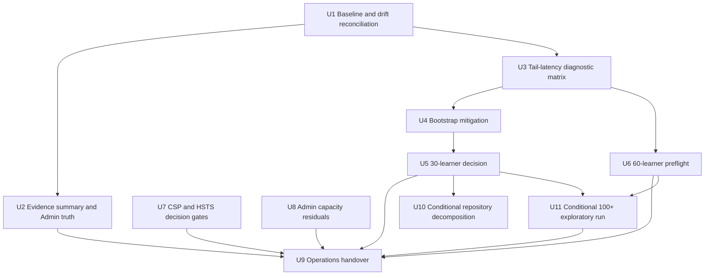
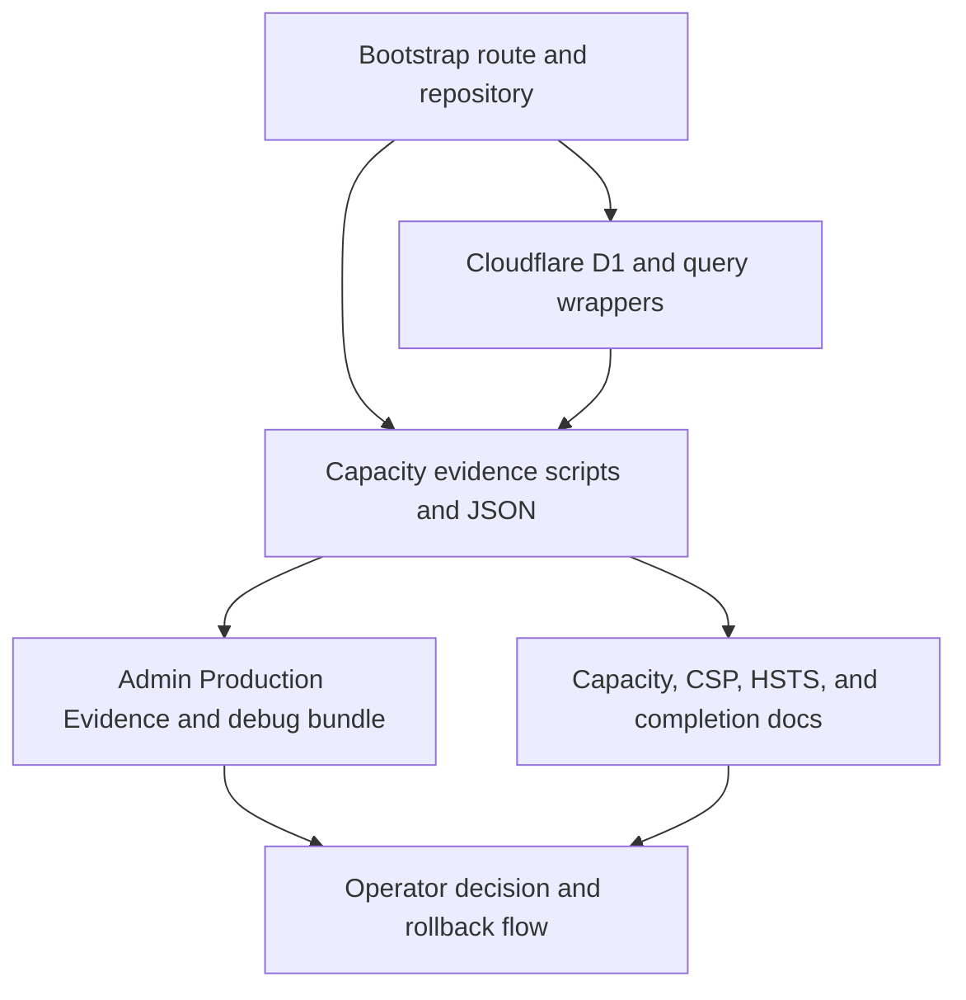

# fix: Complete P6 capacity certification and operations handover

## Summary

This plan turns the P6 hardening contract into an evidence-first implementation path: reconcile current `main`, make Admin and capacity evidence truthful, diagnose and mitigate `/api/bootstrap` burst-tail latency, then produce either a defensible 30-learner certification or an honest non-certification report. The plan also closes the 60-learner preflight, CSP/HSTS decision gates, and operator handover without widening learner-facing product scope.

---

## Problem Frame

P5 proved the capacity gate is real but did not certify the 30-learner classroom beta: the warm-cache production run failed only on `/api/bootstrap` P95, with healthy median latency, zero 5xx, zero network failures, small payloads, and minimal D1 row reads. P6 must resolve that narrow blocker without threshold theatre, stale evidence, or broader feature drift (see origin: `docs/plans/james/sys-hardening/sys-hardening-p6.md`).

---

## Requirements

- R1. Record a current-main P6 baseline before mitigation work begins, including the actual commit SHA, drift since P5's reported final commit, current certification status, CSP status, HSTS status, and relevant drift gates.
- R2. Make production evidence surfaces truthful: capacity docs, evidence JSON, generated summary, and Admin Production Evidence must classify the P5 30-learner result as failing and keep the public decision at `small-pilot-provisional` unless new passing evidence exists.
- R3. Run a D1/bootstrap tail-latency diagnostic matrix before any threshold-policy change, with enough endpoint metrics, request IDs, query counts, D1 row counts, and mode labels to distinguish application query fan-out from platform variance.
- R4. Implement the smallest safe bootstrap mitigation justified by R3, preferring reduced D1 round trips or bounded query consolidation over threshold relaxation.
- R5. Preserve multi-learner correctness: all writable learners retain compact subject/game state for switching and setup stats; heavy history remains selected-learner-bounded or lazy.
- R6. Keep capacity telemetry and tests tightening rather than loosening: if query count or route cost improves, budget tests should ratchet to preserve the improvement.
- R7. Re-run the 30-learner classroom gate after mitigation and make exactly one honest decision: promote only with passing schema-v2 evidence and repeated confidence, otherwise retain provisional language and name the next blocker.
- R8. Run a real 60-learner preflight that reaches `/api/bootstrap` and subject-command load, or fails with a new named blocker that is not demo-session setup.
- R9. Close the CSP observation-window loop after 2026-05-04 with either an enforced-mode flip or a dated deferral; keep HSTS preload gated on DNS-zone enumeration and operator sign-off.
- R10. Admin evidence, Admin capacity, and debug-bundle surfaces must fail visibly for missing, stale, or failing evidence and remain admin/ops gated.
- R11. Production rate limits, auth boundaries, source redaction, and learner-write durability must not be weakened to make capacity testing easier.
- R12. Update operations documentation and a P6 completion report so a non-implementation operator knows what can be claimed, how to run/read evidence, and how to roll back or degrade safely.
- R13. Repository decomposition and 100+ learner probes are conditional stretch work only; they must not delay the baseline, 30-learner decision, 60-learner preflight, CSP decision, or operations handover.

---

## Scope Boundaries

- No new learner-facing Hero Mode, reward economy, subject, monster progression, or public content surfaces.
- No subject-engine rewrite, mastery semantics change, Star semantics change, or learner-write authority change.
- No production rate-limit bypass through spoofed client IP headers or weakened demo/session guards.
- No relaxed 30-learner threshold inside a mitigation PR; any threshold change needs a dedicated policy record with diagnostic evidence and owner sign-off.
- No HSTS preload activation unless the DNS audit and operator sign-off are complete.
- No broad repository decomposition before the certification path is settled.

### Deferred to Follow-Up Work

- Durable Object coordination analysis: defer unless R3/R4 shows the current D1/Worker path cannot meet the gate without cross-request coordination.
- Full 100+ learner certification: defer beyond P6 unless the 30-learner gate certifies, the 60-learner preflight reaches application load, and the operator approves the run window.
- Large Admin KPI pre-aggregation: defer unless R8/R10 evidence shows current manual-refresh counts exceed budget or create tail risk.

---

## Context & Research

### Relevant Code and Patterns

- `worker/src/app.js` handles GET/POST `/api/bootstrap`, stamps public read models, and protects demo sessions before repository access.
- `worker/src/repository.js` contains `bootstrapBundle`, `bootstrapNotModifiedProbe`, and the bounded public read-model bootstrap path. It already keeps full writable-learner subject/game state while bounding heavy session/event history to the selected learner.
- `worker/src/bootstrap-repository.js` owns bootstrap capacity constants, revision hash helpers, and `bootstrapCapacityMeta`; its versioning comments are the local pattern for envelope changes.
- `tests/worker-bootstrap-v2.test.js`, `tests/worker-bootstrap-multi-learner-regression.test.js`, `tests/worker-query-budget.test.js`, and `tests/worker-bootstrap-capacity.test.js` are the lock points for multi-learner correctness, query count, not-modified behaviour, and capacity metadata.
- `scripts/classroom-load-test.mjs`, `scripts/lib/capacity-evidence.mjs`, `scripts/verify-capacity-evidence.mjs`, `scripts/generate-evidence-summary.mjs`, and `scripts/lib/session-manifest.mjs` are the capacity evidence and session-source seams to extend.
- `src/platform/hubs/admin-production-evidence.js`, `src/surfaces/hubs/AdminProductionEvidencePanel.jsx`, `tests/admin-production-evidence.test.js`, and `tests/react-admin-production-evidence.test.js` already define the closed Admin evidence taxonomy.
- `docs/operations/capacity.md`, `docs/hardening/csp-enforcement-decision.md`, `docs/hardening/hsts-preload-audit.md`, and `docs/plans/james/sys-hardening/sys-hardening-p5-completion-report.md` are the current operational truth sources.

### Institutional Learnings

- `docs/solutions/architecture-patterns/sys-hardening-p5-certification-closure-d1-latency-and-evidence-culture-2026-04-28.md` says D1 tail latency should not be treated as an application bug when P95 is far above P50 with tiny payloads, low query count, and low row count; P6 should test mitigation options without hiding honest failures.
- The same note records session-manifest mode as the correct separation between setup limits and application capacity measurement.
- `docs/solutions/workflow-issues/autonomous-certification-phase-wave-execution-2026-04-27.md` and P5's completion report reinforce that certification phases should produce dated evidence and explicit deferrals rather than optimistic wording.

### External References

- Cloudflare D1's Worker Binding API documents `D1Database::batch()` as a way to send multiple statements in one database call, reducing D1 network round trips; P6 can evaluate this only for read-only bootstrap statements where sequential semantics and failure rollback are acceptable.
- Cloudflare D1 return objects expose SQL duration, rows read/written, and backend metadata for `run()`/`batch()` results; P6 should capture what is available without leaking internal statement details to public JSON.
- `hstspreload.org` requires valid certificates, HTTPS for all subdomains, base-domain HSTS with `max-age >= 31536000`, `includeSubDomains`, and `preload`; it also warns that preload removal can take months and is hard to undo.

---

## Key Technical Decisions

- Preserve `docs/plans/james/sys-hardening/sys-hardening-p6.md` as the owner contract and create this canonical implementation plan from it. The original remains useful as a phase brief; this file is the portable implementation artifact.
- Treat the P5 D1 diagnosis as a strong working hypothesis, not a settled excuse. P6 starts with a diagnostic matrix, then implements only the mitigation the evidence supports.
- Keep threshold policy separate from performance mitigation. A threshold change can be considered only after at least three diagnostic runs and a dedicated owner-reviewed record.
- Prefer round-trip reduction, query consolidation, or safe manifest/source-mode changes over client-only smoothing. Startup jitter may improve real traffic but cannot substitute for the strict classroom gate.
- Keep Admin evidence fail-closed: empty, stale, failing, or unverifiable evidence cannot display as certification success.
- Treat session-manifest load as valid 60-learner preflight infrastructure, but treat manifest-based 30-learner certification as acceptable only if the completion report explains equivalence to the release gate.
- Preserve operator-gated security decisions. CSP can flip only after the observation log closes cleanly; HSTS preload waits for DNS-zone proof and operator sign-off.

---

## Open Questions

### Resolved During Planning

- Should this plan overwrite the P6 contract? No. The source is a contract-style brief, so the implementation plan is a new canonical plan file with `origin` pointing at the brief.
- Should P6 start by relaxing bootstrap P95? No. The contract and P5 evidence require diagnostic runs and mitigation before any threshold-policy debate.
- Should 60-learner setup failure be treated as app-capacity evidence? No. Only runs that reach bootstrap and subject-command endpoints can be app-capacity evidence.

### Deferred to Implementation

- Which bootstrap mitigation wins: depends on the R3 diagnostic matrix and local query-read evidence.
- Whether `D1Database::batch()` is the right implementation primitive: depends on existing D1 helper boundaries, capacity collector compatibility, and the exact statements that can be safely batched.
- Whether the CSP decision flips or defers: depends on the post-2026-05-04 observation log and operator sign-off.
- Whether HSTS preload can move: depends on operator DNS-zone enumeration outside repo-only evidence.

---

## High-Level Technical Design

> *This illustrates the intended approach and is directional guidance for review, not implementation specification. The implementing agent should treat it as context, not code to reproduce.*

---

## Implementation Units

### Core Certification Path

- U1. **Create P6 baseline and reconcile current main**

**Goal:** Establish the exact starting state for P6 before any mitigation, evidence, or certification claim is attempted.

**Requirements:** R1, R11, R12

**Dependencies:** None

**Files:**
- Create: `docs/plans/james/sys-hardening/sys-hardening-p6-baseline.md`
- Modify: `docs/operations/capacity.md`
- Test: `tests/worker-bootstrap-multi-learner-regression.test.js`
- Test: `tests/worker-query-budget.test.js`
- Test: `tests/worker-bootstrap-capacity.test.js`
- Test: `tests/capacity-evidence-schema.test.js`
- Test: `tests/security-headers.test.js`

**Approach:**
- Record the actual current `main` SHA and compare it with P5's reported final commit `7ea8a00`.
- Inventory post-P5 changes that touch Admin, evidence, capacity docs, security headers, bootstrap, session manifests, or production evidence.
- Record whether each changed operational surface already has tests or needs coverage in later units.
- Keep this as a baseline and drift document, not a mitigation PR.

**Execution note:** Start with characterization of the current branch and evidence state; do not change bootstrap behaviour in this unit.

**Patterns to follow:**
- `docs/plans/james/sys-hardening/sys-hardening-p5-baseline.md`
- `docs/plans/james/sys-hardening/sys-hardening-p5-completion-report.md`
- `docs/operations/capacity.md`

**Test scenarios:**
- Happy path: current-main baseline lists the current SHA, the P5 final SHA, drift surfaces, certification status, CSP status, HSTS status, and explicit P6 non-goals.
- Integration: multi-learner bootstrap regression still proves the four-learner account contract before mitigation.
- Integration: query-budget, bootstrap-capacity, evidence-schema, and security-header suites still describe the current surface without hidden failures.
- Error path: any drift gate that fails is recorded as a P6 blocker rather than silently excluded from the baseline.

**Verification:**
- The baseline can be reviewed independently and used to interpret every later P6 evidence file against the correct commit family.

---

- U2. **Make production evidence and Admin evidence truthful**

**Goal:** Ensure evidence files, generated summaries, capacity docs, and Admin Production Evidence agree on the current non-certified state.

**Requirements:** R2, R10, R11, R12

**Dependencies:** U1

**Files:**
- Modify: `scripts/generate-evidence-summary.mjs`
- Modify: `reports/capacity/latest-evidence-summary.json`
- Modify: `src/platform/hubs/admin-production-evidence.js`
- Modify: `src/surfaces/hubs/AdminProductionEvidencePanel.jsx`
- Modify: `docs/operations/capacity.md`
- Test: `tests/admin-production-evidence.test.js`
- Test: `tests/react-admin-production-evidence.test.js`
- Test: `tests/verify-capacity-evidence.test.js`
- Test: `tests/capacity-evidence-schema.test.js`

**Approach:**
- Generate or define the intended generation model for `latest-evidence-summary.json` so it is not an empty placeholder without explanation.
- Make the P5 failing 30-learner file classify as failing, not missing success and not certified.
- Preserve stale/missing/failing distinctions in the pure evidence model and React panel.
- Update capacity docs so P5's failed warm-cache result and any P6 evidence rows are represented in the same evidence language.

**Execution note:** Add tests around failing and stale evidence before changing panel behaviour.

**Patterns to follow:**
- `src/platform/hubs/admin-production-evidence.js`
- `tests/admin-production-evidence.test.js`
- `tests/react-admin-production-evidence.test.js`
- `scripts/verify-capacity-evidence.mjs`

**Test scenarios:**
- Happy path: a fresh passing 30-learner metric renders as certified only when the evidence itself is passing, non-dry-run, and in the certified tier.
- Happy path: the P5 failing 30-learner metric renders as failing with learners, finished time, commit, and file provenance visible where appropriate.
- Edge case: `{ metrics: {}, generatedAt: null }` remains not available or stale, never success.
- Edge case: a stale generated summary with a passing metric produces an overall stale state.
- Error path: a dry-run or unknown-tier evidence file does not promote certification.
- Integration: capacity docs, generated summary, and Admin panel all agree that the current decision remains provisional until new passing evidence lands.

**Verification:**
- An operator looking at docs or Admin sees the same current state and cannot mistake missing metrics for a green certification.

---

- U3. **Run and record the D1 tail-latency diagnostic matrix**

**Goal:** Separate D1/platform burst-tail variance from application query fan-out before choosing a mitigation or debating thresholds.

**Requirements:** R3, R4, R7, R11, R12

**Dependencies:** U1, U2

**Files:**
- Modify: `scripts/classroom-load-test.mjs`
- Modify: `scripts/lib/capacity-evidence.mjs`
- Modify: `reports/capacity/evidence/`
- Create: `docs/operations/capacity-tail-latency.md`
- Modify: `docs/operations/capacity.md`
- Test: `tests/capacity-scripts.test.js`
- Test: `tests/capacity-evidence.test.js`
- Test: `tests/capacity-thresholds.test.js`

**Approach:**
- Ensure evidence records the run shape, session source mode, threshold config provenance, endpoint wall-time distribution, bootstrap capacity metadata, request IDs for top-tail samples, and diagnostic-vs-certification classification.
- Run the matrix from the P6 source brief: strict 30 learners/burst 20/round 1; the same shape with a pre-flight warm-up; 30 learners/burst 10/rounds 2; 30 learners/burst 20 with session manifest; repeated strict 30-learner runs; and 10-learner local or preview smoke.
- Treat warm-up, reduced burst, and local/preview shapes as diagnostic unless the docs explicitly justify their release-gate equivalence.
- Include route-level decoration and capacity instrumentation overhead as diagnostic hypotheses if query count and D1 row counts stay minimal.
- Summarise results in a dedicated tail-latency note if the matrix is too large for the baseline or completion report.
- Use available D1 metadata such as rows read and SQL duration where the existing D1 wrapper can collect it safely.

**Execution note:** This unit may change evidence instrumentation but should not change bootstrap product behaviour.

**Patterns to follow:**
- `scripts/classroom-load-test.mjs`
- `scripts/lib/capacity-evidence.mjs`
- `reports/capacity/configs/30-learner-beta.json`
- `docs/solutions/architecture-patterns/sys-hardening-p5-certification-closure-d1-latency-and-evidence-culture-2026-04-28.md`

**Test scenarios:**
- Happy path: a diagnostic run persists evidence with the correct mode label and cannot be interpreted as certification.
- Happy path: a release-gate-shaped run retains threshold config provenance and certification eligibility metadata.
- Edge case: reduced burst or warm-up shapes are labelled diagnostic unless a policy record marks them equivalent.
- Edge case: tail request samples include request IDs without writing multi-MB evidence files.
- Error path: missing bootstrap endpoint metrics, missing capacity metadata, or missing config provenance fails certification eligibility.
- Integration: top-tail request IDs can be correlated with Worker capacity logs without exposing private response bodies or statement-level internals.

**Verification:**
- P6 has at least three dated diagnostic runs before any threshold-policy change is considered, and the results clearly say whether mitigation should target app queries, run shape, or platform variance.

---

- U4. **Implement the smallest safe bootstrap mitigation**

**Goal:** Reduce or neutralise `/api/bootstrap` tail latency when R3 shows a safe application-side mitigation exists.

**Requirements:** R4, R5, R6, R7, R11

**Dependencies:** U3

**Files:**
- Modify: `worker/src/repository.js`
- Modify: `worker/src/bootstrap-repository.js`
- Modify: `worker/src/app.js`
- Modify: `scripts/lib/capacity-evidence.mjs`
- Test: `tests/worker-bootstrap-v2.test.js`
- Test: `tests/worker-bootstrap-multi-learner-regression.test.js`
- Test: `tests/worker-query-budget.test.js`
- Test: `tests/worker-bootstrap-capacity.test.js`
- Test: `tests/capacity-evidence.test.js`

**Approach:**
- Prefer consolidating independent read-only bootstrap calls into fewer D1 round trips if local helper boundaries allow it.
- Consider D1 batching only for statements whose sequential execution, error rollback, and capacity collector semantics remain correct.
- Preserve full writable-learner compact subject/game state and selected-learner-bounded heavy session/event history.
- If no safe code mitigation is justified, write that conclusion into the tail-latency note and continue to U5 with honest non-certification language.
- If a query-count improvement lands, ratchet budget constants and rationale comments so the improvement cannot regress silently.

**Execution note:** Implement behaviour changes test-first against multi-learner and query-budget contracts.

**Patterns to follow:**
- `bootstrapBundle` and `bootstrapNotModifiedProbe` in `worker/src/repository.js`
- `bootstrapCapacityMeta` and revision hash helpers in `worker/src/bootstrap-repository.js`
- Budget rationale comments in `tests/worker-query-budget.test.js`

**Test scenarios:**
- Happy path: GET and POST public bootstrap return the same learner, subject-state, game-state, revision, and capacity metadata semantics as before.
- Happy path: all writable learners still have compact subject/game state after mitigation.
- Happy path: selected-learner heavy sessions and event log remain bounded.
- Edge case: not-modified bootstrap remains small and still stamps bootstrap capacity metadata.
- Edge case: empty-account and single-learner bootstrap continue to return valid envelopes.
- Error path: any fallback from widened or batched reads either fails safely or stamps an observable capacity fallback without hiding missing metadata.
- Integration: multi-learner regression, bootstrap-capacity, and query-budget suites prove no correctness regression; before/after evidence proves whether P95 improved.

**Verification:**
- The mitigation either lowers measurable route cost/tail behaviour or is explicitly rejected as unsafe/unhelpful with evidence, and no test budget is loosened to make it pass.

---

- U5. **Produce the 30-learner certification decision**

**Goal:** Re-run the classroom beta gate after U4 and produce either a defensible certification or a named blocker.

**Requirements:** R2, R7, R10, R11, R12

**Dependencies:** U2, U4

**Files:**
- Create: `reports/capacity/evidence/30-learner-beta-v2-<date>-p6-*.json`
- Modify: `reports/capacity/latest-evidence-summary.json`
- Modify: `docs/operations/capacity.md`
- Modify: `docs/plans/james/sys-hardening/sys-hardening-p6-completion-report.md`
- Test: `tests/verify-capacity-evidence.test.js`
- Test: `tests/capacity-evidence-schema.test.js`
- Test: `tests/capacity-scripts.test.js`

**Approach:**
- Use the same release-gate learner/burst/round shape and pinned threshold config unless a separate threshold-policy PR has already landed.
- Require either two passing runs or one passing run plus a documented reason that a second is unsafe or impossible.
- If using session manifest instead of demo-session creation, document why it is equivalent or safer for the certification claim.
- If the run fails, keep the decision provisional, preserve the failing evidence, and name the next blocker.

**Patterns to follow:**
- `reports/capacity/configs/30-learner-beta.json`
- `scripts/verify-capacity-evidence.mjs`
- `docs/operations/capacity.md`
- `docs/plans/james/sys-hardening/sys-hardening-p5-completion-report.md`

**Test scenarios:**
- Happy path: passing evidence with schema v2+, clean provenance, pinned threshold config, zero 5xx, zero network failures, zero signals, bootstrap P95 within policy, command P95 within policy, and response bytes within policy is eligible for `30-learner-beta-certified`.
- Edge case: one pass without repeat confidence requires an explicit safety/impossibility note before certification wording changes.
- Error path: bootstrap P95 failure keeps `small-pilot-provisional` language and records the threshold violation.
- Error path: missing `requireBootstrapCapacity`, dirty provenance, unknown SHA, or missing config path blocks certification.
- Integration: Admin Production Evidence and capacity docs update from the same persisted evidence source and agree on the decision.

**Verification:**
- The completion report can state the 30-learner decision in one sentence without caveat or contradiction.

---

- U6. **Run the 60-learner preflight against application load**

**Goal:** Use session-manifest infrastructure or another operator-approved source mode so the 60-learner run reaches bootstrap and subject-command endpoints.

**Requirements:** R3, R8, R11, R12

**Dependencies:** U2, U3

**Files:**
- Modify: `scripts/prepare-session-manifest.mjs`
- Modify: `scripts/lib/session-manifest.mjs`
- Modify: `scripts/classroom-load-test.mjs`
- Create: `reports/capacity/evidence/60-learner-stretch-preflight-<date>-p6*.json`
- Modify: `docs/operations/capacity.md`
- Test: `tests/capacity-session-manifest.test.js`
- Test: `tests/capacity-scripts.test.js`
- Test: `tests/capacity-evidence.test.js`

**Approach:**
- Prepare a valid 60-session manifest after rate-limit expiry, from multiple legitimate sources, or via an explicitly documented operator-approved path.
- Run preflight in a way that skips test-time session creation but still measures production `/api/bootstrap` and subject-command routes.
- Use the P5 failure taxonomy to classify any failure as setup, auth, bootstrap, command, threshold, transport, or evidence-write.
- Label the result as preflight, not certification.

**Patterns to follow:**
- `scripts/lib/session-manifest.mjs`
- `tests/capacity-session-manifest.test.js`
- P5 session-manifest evidence in `reports/capacity/evidence/60-learner-stretch-preflight-20260428-p5.json`

**Test scenarios:**
- Happy path: manifest mode maps each virtual learner to an isolated session and reaches bootstrap plus subject-command endpoints.
- Edge case: manifest count mismatch, duplicate learner IDs, invalid cookies, or missing fields fail before measurement with setup classification.
- Error path: auth failures during load are classified separately from setup failures.
- Error path: a run that never hits application endpoints remains invalid and cannot support a 60-learner capacity claim.
- Integration: evidence summary includes endpoint metrics when application load is reached and names the next bottleneck if it is not.

**Verification:**
- P6 replaces the P5 setup-blocked 60-learner status with a real preflight result or a new non-setup blocker.

---

### Security and Operations Path

- U7. **Close CSP decision and keep HSTS preload operator-gated**

**Goal:** Convert the open CSP observation window into a dated decision while preserving HSTS preload as an operator sign-off gate.

**Requirements:** R9, R11, R12

**Dependencies:** U1

**Files:**
- Modify: `docs/hardening/csp-enforcement-decision.md`
- Modify: `worker/src/security-headers.js`
- Modify: `_headers`
- Modify: `docs/hardening/hsts-preload-audit.md`
- Test: `tests/security-headers.test.js`
- Test: `tests/csp-report-endpoint.test.js`
- Test: `tests/csp-inline-style-budget.test.js`

**Approach:**
- Populate the CSP daily log for the completed observation window or document why the window must be extended.
- If criteria are met, flip mode and header key together and keep the cross-assertion test authoritative.
- If criteria are not met, keep Report-Only and create a dated deferral with next review criteria.
- Update HSTS preload status only when the DNS audit and sign-off fields are complete; otherwise preserve deferral.

**Patterns to follow:**
- `docs/hardening/csp-enforcement-decision.md`
- `docs/hardening/hsts-preload-audit.md`
- Cross-assertion pattern in `tests/security-headers.test.js`

**Test scenarios:**
- Happy path: `report-only` mode emits only the Report-Only header and keeps report endpoint coverage passing.
- Happy path: enforced mode emits only the enforced header, with mode/header key alignment mechanically asserted.
- Edge case: observation log incomplete causes dated deferral rather than silent flip.
- Error path: first-party CSP violations or inline-style budget regression block enforcement.
- Error path: HSTS preload remains disabled when any DNS/operator field is still `TBD`.
- Integration: `_headers` and Worker header constants stay aligned for deployed static and Worker responses.

**Verification:**
- P6 has a dated CSP decision and a non-ambiguous HSTS status, with no security header mode drift.

---

- U8. **Close operations-critical Admin capacity residuals**

**Goal:** Improve trust in Admin capacity and debug-bundle evidence where it affects P6 operations.

**Requirements:** R2, R10, R11, R12

**Dependencies:** U2, U3

**Files:**
- Modify: `worker/src/app.js`
- Modify: `worker/src/repository.js`
- Modify: `worker/src/admin-debug-bundle.js`
- Modify: `src/surfaces/hubs/AdminProductionEvidencePanel.jsx`
- Modify: `docs/operations/capacity.md`
- Test: `tests/worker-query-budget.test.js`
- Test: `tests/worker-admin-ops-read.test.js`
- Test: `tests/worker-admin-debug-bundle.test.js`
- Test: `tests/worker-admin-debug-bundle-redaction.test.js`
- Test: `tests/admin-debugging-section-characterisation.test.js`

**Approach:**
- Focus on Admin routes needed to understand certification evidence: Production Evidence panel, Admin ops KPI, and debug bundle.
- Make raw debug-bundle aggregation capacity limitations visible or instrumented, without exposing private statement details in public JSON.
- Preserve existing admin/ops access controls and no-access tests for parent/demo/non-admin roles.
- Keep Admin KPI manual-refresh unless evidence shows live counts exceed budget or tail risk.

**Execution note:** Characterise current Admin capacity and redaction behaviour before instrumentation changes.

**Patterns to follow:**
- Admin debug-bundle standalone module pattern from `worker/src/admin-debug-bundle.js`
- Admin query budget constants in `tests/worker-query-budget.test.js`
- Redaction patterns in `tests/worker-admin-debug-bundle-redaction.test.js`

**Test scenarios:**
- Happy path: Admin can see evidence freshness/failing state and generate debug bundle without certification overclaiming.
- Happy path: Admin ops KPI remains bounded and manual-refresh.
- Edge case: missing evidence, stale evidence, and failing evidence render differently.
- Edge case: debug-bundle raw aggregation either reports capacity metadata or labels the limitation plainly.
- Error path: parent, demo, and non-admin users cannot reach certification-relevant Admin routes.
- Error path: debug bundle does not expose private account, learner, session, answer, or prompt data outside the existing redaction contract.
- Integration: Admin evidence, capacity docs, and P6 completion report describe the same residuals.

**Verification:**
- Operations-critical Admin surfaces can be used during P6 without implying success from missing data or bypassing role boundaries.

---

- U9. **Write operations handover, rollback/degrade drill, and completion report**

**Goal:** Make P6's final state operable and auditable by someone who did not implement it.

**Requirements:** R2, R7, R8, R9, R11, R12, R13

**Dependencies:** U5, U6, U7, U8; U11 if the optional exploratory run is executed before final handover

**Files:**
- Modify: `docs/operations/capacity.md`
- Create: `docs/plans/james/sys-hardening/sys-hardening-p6-completion-report.md`
- Modify: `docs/plans/james/sys-hardening/sys-hardening-p6-baseline.md`
- Modify: `docs/hardening/csp-enforcement-decision.md`
- Modify: `docs/hardening/hsts-preload-audit.md`
- Test: `tests/capacity-evidence-schema.test.js`
- Test: `tests/verify-capacity-evidence.test.js`

**Approach:**
- Document how to run and interpret 30-learner certification, 60-learner preflight, session manifests, Admin evidence states, request-ID tail correlation, and failed evidence.
- Record a rollback/degrade drill for bootstrap P95 regression that keeps learner writes as the top priority and degrades derived/admin read surfaces first.
- Tie launch language to actual evidence state for small pilot, 30 learner, 60 learner, and 100+ readiness.
- List every deferred item plainly, including whether it is technical, operator-gated, or product-sequencing work.

**Patterns to follow:**
- `docs/operations/capacity.md`
- `docs/plans/james/sys-hardening/sys-hardening-p5-completion-report.md`
- `reports/capacity/README.md`

**Test scenarios:**
- Happy path: completion report links to the baseline, evidence files, capacity docs, CSP decision, and HSTS status.
- Happy path: launch wording matches the latest evidence decision exactly.
- Edge case: if 30 learners remain un-certified, completion report names the blocker and prevents stronger wording.
- Edge case: if the rollback drill cannot be run safely, the report documents why and records the fallback analysis.
- Integration: capacity evidence verification accepts all cited certifiable rows and ignores only explicitly labelled preflight rows.

**Verification:**
- A non-implementation operator can answer what is certified, what is provisional, what failed, how to rerun evidence, and how to respond to a regression.

---

### Conditional Stretch Work

- U10. **Decompose repository bootstrap transforms only after certification work**

**Goal:** Reduce `repository.js` complexity only in behaviour-preserving slices that support future capacity work.

**Requirements:** R5, R6, R11, R13

**Dependencies:** U5

**Files:**
- Modify: `worker/src/repository.js`
- Modify: `worker/src/bootstrap-repository.js`
- Create: `worker/src/bootstrap-read-models.js` only if implementation proves the extracted helpers need a new bootstrap-specific home; otherwise keep extracted helpers in an existing repository-adjacent module
- Test: `tests/worker-bootstrap-v2.test.js`
- Test: `tests/worker-bootstrap-multi-learner-regression.test.js`
- Test: `tests/worker-query-budget.test.js`

**Approach:**
- Extract only pure row transforms or read-model mapping helpers that can be characterised before movement.
- Prefer `worker/src/bootstrap-read-models.js` for bootstrap-specific pure read-model helpers if a new file is justified; do not create a generic catch-all module.
- Do not change bootstrap envelope semantics, learner membership semantics, CAS/idempotency, subject command authority, not-modified invalidation, or auth/demo access rules.
- Stop if the refactor starts increasing review risk or masking capacity behaviour.

**Execution note:** Characterisation-first; every moved helper needs a behaviour lock before movement.

**Patterns to follow:**
- Prior extraction pattern in `worker/src/bootstrap-repository.js`
- Admin standalone module pattern in `worker/src/admin-debug-bundle.js`

**Test scenarios:**
- Happy path: extracted transforms produce byte-equivalent bootstrap records for representative learner/account fixtures.
- Edge case: empty account, single learner, multi-learner, selected-learner change, and sibling subject-state mutation remain unchanged.
- Error path: auth, demo, and not-modified invalidation behaviours remain covered by existing route tests.
- Integration: query-budget and multi-learner suites pass after each slice.

**Verification:**
- Any decomposition PR is smaller and easier to review than the code it replaces, with no changed product behaviour.

---

- U11. **Run 100+ exploratory load only if prerequisites are met**

**Goal:** Record the first school-scale bottleneck only when the lower-tier evidence path is stable enough to make the probe meaningful.

**Requirements:** R8, R11, R12, R13

**Dependencies:** U5, U6; operator approval for the load window

**Files:**
- Create: `reports/capacity/evidence/100-plus-exploratory-<date>-p6*.json`
- Modify: `docs/operations/capacity.md`
- Modify: `docs/plans/james/sys-hardening/sys-hardening-p6-completion-report.md`
- Test: `tests/capacity-scripts.test.js`
- Test: `tests/capacity-evidence.test.js`

**Approach:**
- Execute only if the 30-learner decision is settled, 60-learner preflight reaches application load, session-manifest or multi-source infrastructure works, and the operator approves the load window.
- Label the result exploratory, not certified.
- Record the first bottleneck by route, metric, source mode, and threshold context.

**Patterns to follow:**
- Preflight evidence section in `docs/operations/capacity.md`
- Failure taxonomy in `scripts/classroom-load-test.mjs`

**Test scenarios:**
- Happy path: exploratory evidence records endpoint metrics, source mode, and first bottleneck without changing certification wording.
- Edge case: operator approval absent means the unit remains deferred rather than attempted.
- Error path: setup-only failure remains invalid exploratory evidence.
- Integration: docs make clear that a single 100+ exploratory pass does not upgrade launch language.

**Verification:**
- The 100+ result, if produced, is useful as a future planning input without becoming a launch claim.

---

## System-Wide Impact

- **Interaction graph:** `/api/bootstrap`, subject-command load driver paths, session manifest preparation, evidence verification, Admin Production Evidence, Admin debug-bundle, CSP/HSTS headers, and operations docs all consume the same certification truth.
- **Error propagation:** setup failures must stay separate from app-load failures; bootstrap failures must preserve status, request ID, capacity metadata, and failure class without leaking response bodies.
- **State lifecycle risks:** mitigation cannot mark failed writes as synced, lose sibling learner state, break revision/hash invalidation, or turn derived read-model failure into learner progress loss.
- **API surface parity:** GET and POST `/api/bootstrap`, demo sessions, manifest sessions, Admin panel, docs, and evidence verifier all need the same capacity decision semantics.
- **Integration coverage:** unit tests alone will not prove P6; persisted evidence files, capacity docs, Admin render tests, and completion report checks are part of the release gate.
- **Unchanged invariants:** public read-model redaction, auth/session gating, demo rate limits, multi-learner writable state, CAS/idempotency, CSP mode/header cross-assertion, and HSTS preload sign-off remain intact.

---

## Risks & Dependencies

| Risk | Mitigation |
|------|------------|
| D1 tail remains above threshold even after safe app-side mitigation. | Keep non-certification honest, preserve evidence, name platform/run-shape blocker, and avoid hidden threshold relaxation. |
| Diagnostic shapes get mistaken for certification evidence. | Add source-mode and diagnostic-vs-certification labels; docs and verifier must distinguish them. |
| Query consolidation breaks multi-learner state or not-modified invalidation. | Test-first against multi-learner, revision hash, not-modified, and query-budget suites. |
| Evidence summary promotes stale or failing evidence. | Fail-closed Admin model tests for missing, stale, dry-run, failing, and unknown-tier evidence. |
| Session-manifest mode hides real-world setup or auth failures. | Treat manifest as preflight unless equivalence is documented; classify auth/setup failures separately. |
| CSP flip breaks first-party pages. | Require completed observation log, inline-style budget, cross-assertion tests, and dated decision record. |
| HSTS preload becomes an irreversible domain-wide commitment without DNS proof. | Preserve `HSTS_PRELOAD_ENABLED = false` until DNS-zone enumeration and operator sign-off are complete. |
| Admin debug-bundle instrumentation leaks sensitive detail. | Keep statement-level internals out of public JSON and run redaction/access tests. |
| P6 expands into broad refactoring and delays certification. | Keep U10/U11 conditional and after the core decision path. |

---

## Documentation / Operational Notes

- P6 must update `docs/plans/james/sys-hardening/sys-hardening-p6-baseline.md`, `docs/plans/james/sys-hardening/sys-hardening-p6-completion-report.md`, and `docs/operations/capacity.md`.
- Large diagnostic matrices should live in `docs/operations/capacity-tail-latency.md` and be summarised in the completion report.
- Capacity evidence files under `reports/capacity/evidence/` must be cited from docs only when their provenance and tier semantics are valid.
- CSP status lives in `docs/hardening/csp-enforcement-decision.md`; HSTS preload status lives in `docs/hardening/hsts-preload-audit.md`.
- Public launch language must remain evidence-tied: provisional unless the certified tier's evidence and verifier gates pass.

---

## Alternative Approaches Considered

- **Threshold-first certification:** Rejected because P6's source contract and P5 evidence require diagnostic evidence before policy change.
- **Retry until a lucky green run:** Rejected because it erodes evidence trust and hides platform variance.
- **Client startup jitter as the primary fix:** Rejected for certification because it can smooth real traffic but does not prove the strict classroom gate.
- **Broad repository rewrite before mitigation:** Rejected because it creates review risk and distracts from the narrow `/api/bootstrap` blocker.
- **Production rate-limit bypass for load testing:** Rejected because it weakens a security boundary to make evidence easier.

---

## Success Metrics

- Current-main baseline exists before mitigation and names all drift.
- Production Evidence panel, generated summary, capacity docs, and evidence JSON agree on current certification status.
- Tail-latency matrix includes at least three dated diagnostic runs before any threshold-policy change.
- Bootstrap mitigation either improves evidence or is rejected with a documented rationale.
- 30-learner beta is either certified with defensible schema-v2 evidence or remains explicitly provisional with the next blocker named.
- 60-learner preflight reaches application load or records a new non-setup blocker.
- CSP has a dated flip/deferral decision and HSTS preload remains correctly gated.
- Operations handover tells a non-implementation owner how to rerun, read, and act on capacity evidence.

---

## Sources & References

- **Origin document:** [docs/plans/james/sys-hardening/sys-hardening-p6.md](docs/plans/james/sys-hardening/sys-hardening-p6.md)
- Related contract: [docs/plans/james/sys-hardening/sys-hardening-p5.md](docs/plans/james/sys-hardening/sys-hardening-p5.md)
- Related completion report: [docs/plans/james/sys-hardening/sys-hardening-p5-completion-report.md](docs/plans/james/sys-hardening/sys-hardening-p5-completion-report.md)
- Institutional learning: [docs/solutions/architecture-patterns/sys-hardening-p5-certification-closure-d1-latency-and-evidence-culture-2026-04-28.md](docs/solutions/architecture-patterns/sys-hardening-p5-certification-closure-d1-latency-and-evidence-culture-2026-04-28.md)
- Capacity runbook: [docs/operations/capacity.md](docs/operations/capacity.md)
- Bootstrap route: [worker/src/app.js](worker/src/app.js)
- Bootstrap repository path: [worker/src/repository.js](worker/src/repository.js)
- Bootstrap capacity helpers: [worker/src/bootstrap-repository.js](worker/src/bootstrap-repository.js)
- Capacity driver: [scripts/classroom-load-test.mjs](scripts/classroom-load-test.mjs)
- Evidence verifier: [scripts/verify-capacity-evidence.mjs](scripts/verify-capacity-evidence.mjs)
- Evidence summary generator: [scripts/generate-evidence-summary.mjs](scripts/generate-evidence-summary.mjs)
- Admin evidence model: [src/platform/hubs/admin-production-evidence.js](src/platform/hubs/admin-production-evidence.js)
- CSP decision record: [docs/hardening/csp-enforcement-decision.md](docs/hardening/csp-enforcement-decision.md)
- HSTS preload audit: [docs/hardening/hsts-preload-audit.md](docs/hardening/hsts-preload-audit.md)
- External docs: [Cloudflare D1 Database API](https://developers.cloudflare.com/d1/worker-api/d1-database/)
- External docs: [Cloudflare D1 return objects](https://developers.cloudflare.com/d1/worker-api/return-object/)
- External docs: [HSTS preload submission requirements](https://hstspreload.org/)
