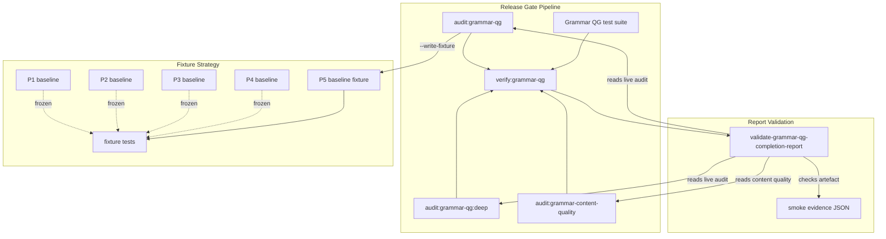

# Grammar QG P5 — Release Automation, Deep-Seed Hardening and Machine-Verifiable Governance

## Overview

Convert Grammar QG from a manually interpreted content release into a machine-verifiable release process. Expand the 12 known low-depth generated families to >= 8 unique variants over seeds 1..30, add content-quality linting, and make completion-report claims impossible to overclaim against executable audit output.

No reward, Star, Mega, monster, mastery, or learner reward semantics change. Template denominator stays at 78 unless depth expansion proves a structural gap.

---

## Problem Frame

Grammar QG P4 shipped quality improvements (mixed-transfer, depth for explanation families), but the release process still depends on human interpretation. The deep-audit identified 12 generated families with fewer than 8 unique prompts across 30 seeds — meaning learners on those families see repeats. The completion report can claim values that no script verifies. P5 closes these governance gaps.

(see origin: `docs/plans/james/grammar/questions-generator/grammar-qg-p5.md`)

---

## Requirements Trace

- R1. `npm run verify:grammar-qg` exists and passes — a single command that proves the entire release gate
- R2. All 12 deep low-depth families reach >= 8 unique visible variants over seeds 1..30 (or appear in a justified allowlist)
- R3. Content-quality linting catches unknown misconception IDs, duplicate options, reversed quotes, and related quality issues as hard gate failures
- R4. Completion-report claims are machine-validated against audit JSON — no overclaim is possible
- R5. Production-smoke evidence is captured as a JSON artefact, with explicit distinction between repository and post-deploy smoke
- R6. P5 baseline fixture is generated from audit output; P1-P4 fixtures remain frozen
- R7. Zero regressions: default-window repeats remain 0, cross-template collisions remain 0, existing test suites remain green
- R8. No runtime AI, no reward semantics, no mastery threshold changes

---

## Scope Boundaries

- No new template families unless deep-seed expansion proves a structural gap
- No runtime AI question generation
- No Star, Mega, monster, or Concordium semantics changes
- No broad UX redesign
- No learner-facing reward mechanics changes
- No expansion of template denominator for its own sake

### Deferred to Follow-Up Work

- Learner calibration using real telemetry (P6 focus)
- Mixed-transfer performance monitoring (P6 focus)
- Post-Mega maintenance outcome tracking (P6 focus)

---

## Context & Research

### Relevant Code and Patterns

- `worker/src/subjects/grammar/content.js` — single source of truth for templates, case banks, `pickBySeed()`, `GRAMMAR_CONTENT_RELEASE_ID` (line 7586), `GRAMMAR_MISCONCEPTIONS` (line 7587)
- `scripts/audit-grammar-question-generator.mjs` — existing audit with `buildGrammarQuestionGeneratorAudit({ seeds, deepSeeds })`, `--deep`, `--json`, `--write-fixture` flags
- `scripts/grammar-production-smoke.mjs` — live environment probe (normal round, mini-test, repair, answer-spec families)
- `tests/fixtures/grammar-legacy-oracle/grammar-qg-p4-baseline.json` — latest frozen fixture
- `tests/fixtures/grammar-functionality-completeness/grammar-qg-p4-baseline.json` — latest completeness fixture
- `tests/helpers/grammar-legacy-oracle.js` — fixture reader pattern: `readGrammarQuestionGeneratorP4Baseline()`
- `tests/grammar-qg-p4-depth.test.js` — P4 depth test pattern (seeds 1..13, 8+ unique signatures)
- P4 completion report: `docs/plans/james/grammar/questions-generator/grammar-qg-p4-final-completion-report-2026-04-28.md`

### Institutional Learnings

- **pickBySeed modulo pattern** (`docs/solutions/logic-errors/seeded-prng-index-collision-pickbyseed-2026-04-28.md`): Use `((seed - 1) % arr.length + arr.length) % arr.length` for bank-indexed selection. Never use `mulberry32` first-call for banks < 20 items — nearby seeds cluster to same index.
- **Composition-gap detection** (`docs/solutions/workflow-issues/autonomous-certification-phase-wave-execution-2026-04-27.md`): A gate that reads fields from a data structure produced by a different module must have an end-to-end test. The report validator (U4) reads audit JSON from U1/U3 — test the full pipeline.
- **Honest failure recording** (`docs/solutions/architecture-patterns/sys-hardening-p5-certification-closure-d1-latency-and-evidence-culture-2026-04-28.md`): If post-deploy smoke is not run, say so explicitly. Never imply passage.
- **Frozen fixture strategy** (`docs/solutions/architecture-patterns/grammar-p7-quality-trust-consolidation-and-autonomous-sdlc-2026-04-27.md`): Generate baselines from executable audit output, freeze, assert P1-P4 remain unchanged.

---

## Key Technical Decisions

- **Expand case banks, not template IDs**: Depth expansion adds items to `EXTRA_LEXICON` or inline case arrays — no new template IDs unless a genuinely new question shape is required. This preserves the 78-template denominator.
- **Content-quality audit as companion script**: New `scripts/audit-grammar-content-quality.mjs` rather than bloating the main audit. Both output JSON. `verify:grammar-qg` runs both.
- **Report validator reads live audit output**: `scripts/validate-grammar-qg-completion-report.mjs` invokes the audit programmatically and compares claims. Not a separate database of expected values.
- **P5 tags all expanded templates**: Templates that receive depth expansion get a `qg-p5` tag so the signature audit enforces strict zero-repeat on them going forward.
- **Smoke evidence is file-based**: Production smoke writes a JSON artefact to `reports/grammar/`. The report validator checks artefact existence when post-deploy smoke is claimed.
- **P5 deep-audit threshold: 8 unique / 30 seeds**: Same target as P4 explanation families. Allowlist requires written rationale + retirement date.

---

## Open Questions

### Resolved During Planning

- **Should content-quality failures be hard or soft?**: Hard gate for unknown misconception IDs, duplicate options, multi-correct answers, raw-equals-accepted. Advisory (recorded) for quote-mark style issues, with reviewed-exception allowlist.
- **Should the report validator run the audit itself or read a pre-generated JSON?**: Runs the audit itself (via programmatic import). This prevents stale JSON from masking drift.
- **Where does the P5 baseline fixture live?**: Same two directories as P1-P4: `tests/fixtures/grammar-legacy-oracle/grammar-qg-p5-baseline.json` and `tests/fixtures/grammar-functionality-completeness/grammar-qg-p5-baseline.json`.

### Deferred to Implementation

- Exact expanded case-bank items for each of the 12 families (content authoring)
- Whether any family legitimately cannot reach 8 unique variants and requires allowlisting
- Whether `possession_hyphen_transfer_confusion` should be registered as a new misconception or replaced with an existing ID

---

## High-Level Technical Design

> *This illustrates the intended approach and is directional guidance for review, not implementation specification. The implementing agent should treat it as context, not code to reproduce.*

---

## Implementation Units

- U1. **Add Grammar QG verification command**

**Goal:** Create package.json scripts that make the full release gate runnable in one command.

**Requirements:** R1, R7

**Dependencies:** None

**Files:**
- Modify: `package.json`

**Approach:**
- Add `audit:grammar-qg`, `audit:grammar-qg:deep`, and `verify:grammar-qg` scripts
- `verify:grammar-qg` chains: default audit, deep audit, content-quality audit (U3), and the full Grammar QG test suite
- Include all relevant test files: `grammar-question-generator-audit.test.js`, `grammar-functionality-completeness.test.js`, `grammar-production-smoke.test.js`, `grammar-qg-p5-depth.test.js`, `grammar-qg-p5-content-quality.test.js`, `grammar-selection.test.js`, `grammar-engine.test.js`

**Patterns to follow:**
- Existing `smoke:production:grammar` script convention
- `node --test tests/file.test.js` pattern used throughout the repo

**Test scenarios:**
- Happy path: `npm run verify:grammar-qg` exits 0 when all gates pass
- Error path: `npm run audit:grammar-qg:deep` reports low-depth families in machine-readable JSON
- Happy path: individual audit scripts still work standalone with `--json` flag

**Verification:**
- `npm run verify:grammar-qg` exists and runs successfully
- The command exercises both default and deep audit paths

---

- U2. **Expand the 12 low-depth generated families**

**Goal:** Ensure every generated family produces >= 8 unique visible variant signatures across seeds 1..30.

**Requirements:** R2, R7

**Dependencies:** None (content work, independent of tooling)

**Files:**
- Modify: `worker/src/subjects/grammar/content.js` (case banks in `EXTRA_LEXICON` and inline arrays)
- Test: `tests/grammar-qg-p5-depth.test.js`

**Approach:**
- For each of the 12 families, expand the reviewed case bank to >= 8 genuine grammar scenarios
- Use `pickBySeed(seed, cases)` for primary case selection — never `mulberry32` first-call for small banks
- Verify each expansion with `--deep` audit before moving to the next family
- Add `qg-p5` tag to templates that receive expansion so signature audit enforces strict zero-repeat
- Do not create new template IDs unless a genuinely new question shape is required
- Fix the non-registered `possession_hyphen_transfer_confusion` misconception reference

**Patterns to follow:**
- P3 explanation case-bank expansion pattern (8 cases per concept)
- P4 mixed-transfer frozen array pattern
- `pickBySeed` modulo pattern from `docs/solutions/logic-errors/seeded-prng-index-collision-pickbyseed-2026-04-28.md`

**Test scenarios:**
- Happy path: Each of 12 targeted families has >= 8 unique signatures over seeds 1..30
- Edge case: Wrapping — seed 1 and seed (caseCount + 1) produce the same signature (pickBySeed modulo is correct)
- Edge case: Option shuffling does not inflate variant signatures (seed changes options order but signature stays same for same case)
- Happy path: Expanded case banks produce valid answer specs (kind unchanged, all fields present)
- Integration: Default-window (seeds 1,2,3) repeated variants remain zero across all templates
- Integration: Cross-template signature collisions remain zero
- Error path: If any family legitimately cannot reach 8, an allowlist with rationale + retirement date exists
- Happy path: All misconception IDs used in expanded cases exist in `GRAMMAR_MISCONCEPTIONS`

**Verification:**
- `node scripts/audit-grammar-question-generator.mjs --deep --json` reports `lowDepthGeneratedTemplates: []` (or all exceptions are in the allowlist)
- Default-window repeated variants = 0
- Cross-template collisions = 0
- P1-P4 baseline fixture tests remain green

---

- U3. **Add content-quality linting**

**Goal:** Create a content-quality audit script that catches common authoring errors as a hard gate.

**Requirements:** R3, R7

**Dependencies:** None

**Files:**
- Create: `scripts/audit-grammar-content-quality.mjs`
- Test: `tests/grammar-qg-p5-content-quality.test.js`

**Approach:**
- Script produces JSON output and a human-readable summary (same pattern as the main audit)
- Hard-fail checks: unknown misconception IDs, duplicate normalised options, multiple correct answers, correct answer missing from options, raw-equals-accepted fix items
- Advisory checks (recorded, allowlist-able): reversed curly quotes, `-ly` compound hyphenation, unbalanced quotes
- Transfer templates must name both grammar ideas in feedback
- Export a `buildGrammarContentQualityAudit()` function for programmatic consumption by U4

**Patterns to follow:**
- `scripts/audit-grammar-question-generator.mjs` structure: ES module, CLI + export, `--json` flag, `formatSummary()`
- `GRAMMAR_MISCONCEPTIONS` import for registry validation
- `GRAMMAR_TEMPLATE_METADATA` iteration pattern

**Test scenarios:**
- Happy path: Clean content produces zero failures and zero advisories
- Error path: Template referencing non-existent misconception ID fails
- Error path: Selected-response template with duplicate normalised options fails
- Error path: Selected-response template with no correct answer in options fails
- Error path: Selected-response template with 2+ correct answers fails
- Error path: Fix-task where raw prompt equals accepted answer fails
- Edge case: Advisory quote-mark issue appears in output but does not fail gate (unless not allowlisted)
- Happy path: Transfer templates with both grammar ideas mentioned in feedback pass
- Error path: Transfer template missing one grammar idea in feedback is flagged

**Verification:**
- `node scripts/audit-grammar-content-quality.mjs --json` runs and produces valid JSON
- All hard-fail checks cause non-zero exit code
- Existing content passes (or issues are fixed during U2)

---

- U4. **Make completion reports machine-verifiable**

**Goal:** Create a report validator that compares completion-report claims against live audit output — impossible to overclaim.

**Requirements:** R4, R5

**Dependencies:** U1 (audit output format), U3 (content-quality output format), U5 (smoke evidence artefact)

**Files:**
- Create: `scripts/validate-grammar-qg-completion-report.mjs`
- Test: `tests/grammar-qg-p5-report-validation.test.js`

**Approach:**
- Validator reads a markdown completion report, extracts claimed values via regex/section parsing
- Invokes `buildGrammarQuestionGeneratorAudit()` and `buildGrammarContentQualityAudit()` programmatically
- Compares claimed vs actual for all fields listed in origin section 6/U4
- Validates smoke claims: "repository smoke passed" and "post-deploy smoke passed" are distinct
- Post-deploy smoke claim requires existence of a machine-readable evidence file in `reports/grammar/`
- Exits non-zero on any mismatch or contradictory claim

**Patterns to follow:**
- Programmatic import of `buildGrammarQuestionGeneratorAudit` from the audit script
- End-to-end pipeline pattern from institutional learnings (composition-gap detection)

**Test scenarios:**
- Happy path: Valid completion report with matching claims passes
- Error path: Report claims 79 templates when audit says 78 → fails
- Error path: Report claims "zero low-depth families" when deep audit finds low-depth → fails
- Error path: Report claims "production smoke passed" without evidence file → fails
- Error path: Report claims "post-deploy smoke passed" when only repository smoke evidence exists → fails
- Integration: Full pipeline test — generate audit JSON, write a draft report, validate it end-to-end
- Edge case: Report with explicit "post-deploy smoke not run" passes validation

**Verification:**
- `node scripts/validate-grammar-qg-completion-report.mjs <report-path>` runs against a draft P5 report
- Mismatched claims produce clear error messages identifying the field and expected vs actual value

---

- U5. **Add production-smoke evidence capture**

**Goal:** Make production-smoke results part of release evidence as a JSON artefact.

**Requirements:** R5

**Dependencies:** None

**Files:**
- Modify: `scripts/grammar-production-smoke.mjs`
- Create: `reports/grammar/.gitkeep` (directory creation)
- Test: `tests/grammar-production-smoke.test.js` (minor additions)

**Approach:**
- Add `--json` flag to the production smoke script
- When `--json` is passed, write artefact to `reports/grammar/grammar-production-smoke-<releaseId>.json`
- Artefact contains: `ok`, `origin` (repo or post-deploy), `contentReleaseId`, `testedTemplateIds`, `answerSpecFamiliesCovered`, `normalRoundResult`, `miniTestResult`, `repairResult`, `forbiddenKeyScanResult`, `timestamp`, `commitSha`
- For repository-only smoke, `origin: 'repository'`; for live deployment, `origin: 'post-deploy'`
- The artefact path is deterministic given the release ID — the report validator can check existence

**Patterns to follow:**
- Existing `scripts/grammar-production-smoke.mjs` structure
- Honest failure recording pattern from sys-hardening P5 learnings

**Test scenarios:**
- Happy path: Smoke script with `--json` produces a well-formed evidence artefact
- Happy path: Artefact includes all required fields with correct types
- Edge case: `origin` field correctly distinguishes repository from post-deploy
- Error path: Smoke failure still writes artefact with `ok: false` and failure details

**Verification:**
- `npm run smoke:production:grammar -- --json` writes to `reports/grammar/`
- The artefact is machine-parseable by U4's report validator

---

- U6. **Add denominator drift detection with P5 baseline**

**Goal:** Create canonical P5 baseline fixtures generated from audit output, and prove P1-P4 remain frozen.

**Requirements:** R6, R7

**Dependencies:** U2 (content expansion must be complete before snapshot)

**Files:**
- Create: `tests/fixtures/grammar-legacy-oracle/grammar-qg-p5-baseline.json`
- Create: `tests/fixtures/grammar-functionality-completeness/grammar-qg-p5-baseline.json`
- Modify: `tests/helpers/grammar-legacy-oracle.js` (add `readGrammarQuestionGeneratorP5Baseline()`)
- Modify: `tests/grammar-question-generator-audit.test.js` (add P5 denominator assertions)
- Modify: `tests/grammar-functionality-completeness.test.js` (add P5 baseline assertions)

**Approach:**
- Generate P5 baseline using `--write-fixture` from the audit script after U2 expansion is complete
- P5 fixture includes deep-audit summary fields (not only default-window)
- Add test assertions comparing live audit output to P5 baseline
- Add explicit "historical freeze" assertions for P1, P2, P3, P4 baselines (they must not change)
- The P5 fixture is the only one that includes `deepSampledSeeds` and `generatedCaseDepthByFamily`

**Patterns to follow:**
- `readGrammarQuestionGeneratorP4Baseline()` pattern in `tests/helpers/grammar-legacy-oracle.js`
- P4 fixture structure in `tests/fixtures/grammar-legacy-oracle/grammar-qg-p4-baseline.json`

**Test scenarios:**
- Happy path: Live audit output matches P5 baseline fixture values
- Happy path: P1, P2, P3, P4 baselines remain byte-identical to their committed versions
- Error path: If someone edits a P1-P4 fixture, the "frozen historical" assertion fails
- Happy path: P5 baseline includes deep-audit fields that P1-P4 lack
- Edge case: Content release ID in fixture matches `GRAMMAR_CONTENT_RELEASE_ID`

**Verification:**
- `node --test tests/grammar-question-generator-audit.test.js` passes with P5 denominator assertions
- P1-P4 fixture tests remain green (zero regression)

---

- U7. **Generate reviewer sample pack**

**Goal:** Produce a deterministic, reviewable document showing all expanded low-depth families without running the app.

**Requirements:** R2 (supports review of depth expansion quality)

**Dependencies:** U2 (families must be expanded first)

**Files:**
- Create: `scripts/generate-grammar-review-pack.mjs`
- Create: `reports/grammar/grammar-qg-p5-review-pack.md`

**Approach:**
- For each generated family, output: family ID, template ID, skill IDs, answer-spec kind, seeds sampled, unique visible prompt fingerprints, sample prompts (without hidden answer keys)
- Separate reviewer-only answer appendix (clearly labelled)
- Deterministic for the same commit and seed window (no Date.now or random)
- Not used as runtime content — lives in `reports/` directory

**Patterns to follow:**
- `buildCaseDepthAudit()` iteration pattern from the audit script
- `grammarQuestionVariantSignature()` for fingerprinting

**Test scenarios:**
- Happy path: Generated review pack is deterministic (same commit + seeds = same output)
- Happy path: No hidden answer keys appear in the prompt section
- Edge case: Review pack covers all 12 targeted families plus any other expanded families

**Verification:**
- `node scripts/generate-grammar-review-pack.mjs` produces `reports/grammar/grammar-qg-p5-review-pack.md`
- Content is human-readable and covers all targeted families

---

- U8. **Prepare P5 final completion report**

**Goal:** Create the P5 completion report template that passes the report validator.

**Requirements:** R4, R5, R7

**Dependencies:** U1, U2, U3, U4, U5, U6 (all infrastructure and content must be complete)

**Files:**
- Create: `docs/plans/james/grammar/questions-generator/grammar-qg-p5-final-completion-report-2026-04-28.md`

**Approach:**
- Follow P4 completion report structure exactly (frontmatter, sections, tables)
- Machine-generated denominator table from audit JSON
- Deep-audit table: before (P4 state) and after (P5 state)
- Content-quality audit result section
- Production-smoke status with explicit repository vs post-deploy distinction
- Fixture paths and test evidence references
- Residual risks table
- P6 recommendation section
- Must pass `scripts/validate-grammar-qg-completion-report.mjs`

**Patterns to follow:**
- `docs/plans/james/grammar/questions-generator/grammar-qg-p4-final-completion-report-2026-04-28.md` structure and frontmatter

**Test scenarios:**
- Integration: The final report passes `validate-grammar-qg-completion-report.mjs`
- Happy path: All claimed denominator values match live audit output
- Happy path: If post-deploy smoke was not run, report explicitly states this

**Verification:**
- `node scripts/validate-grammar-qg-completion-report.mjs docs/plans/james/grammar/questions-generator/grammar-qg-p5-final-completion-report-2026-04-28.md` exits 0

---

## System-Wide Impact

- **Interaction graph:** U4's report validator imports from U1 (audit) and U3 (content-quality). U5's smoke artefact is checked by U4. These producer/consumer relationships require end-to-end testing.
- **Error propagation:** Audit failures propagate through `verify:grammar-qg` to CI. Content-quality hard failures block the release gate. Advisory findings are recorded but not blocking.
- **State lifecycle risks:** P5 baseline fixture must be generated AFTER U2 content expansion. Generating too early captures the pre-expansion state. The ordering is: expand → run deep audit → snapshot fixture.
- **API surface parity:** No API surface changes. Content changes are internal to the question generator.
- **Integration coverage:** The composition between audit script → report validator must be tested end-to-end. Unit-testing the validator in isolation would miss field-name drift.
- **Unchanged invariants:** Star progression, Mega rewards, monster mechanics, Concordium state, mastery thresholds, learner session data, and all subject read-model contracts remain unchanged. The 78-template denominator is preserved. All P1-P4 fixture baselines remain frozen.

---

## Risks & Dependencies

| Risk | Mitigation |
|------|------------|
| Some families genuinely cannot reach 8 unique variants due to narrow grammar scope | Allowlist mechanism with rationale + retirement date; do not force low-quality padding |
| Content expansion introduces a subtle answer-spec regression | Run `verify:grammar-qg` after each family expansion; P4 depth and mixed-transfer tests catch regressions |
| Report validator regex breaks on edge-case markdown formatting | Test with deliberately malformed reports; keep regex patterns simple and section-header-anchored |
| `pickBySeed` modulo edge case at seed=0 | Defence already in place: `((seed - 1) % N + N) % N`; test with seed boundaries 0, 1, N, N+1 |
| Post-deploy smoke cannot be run in CI (requires live Cloudflare Workers deployment) | Report validator accepts explicit "not run" status; never silently implies passage |
| Expanding EXTRA_LEXICON grows content.js beyond IDE comfort | Acceptable — single-file-as-truth is a deliberate architectural choice; no split planned |

---

## Sources & References

- **Origin document:** [Grammar QG P5 plan](docs/plans/james/grammar/questions-generator/grammar-qg-p5.md)
- Related code: `worker/src/subjects/grammar/content.js`, `scripts/audit-grammar-question-generator.mjs`
- Learnings: `docs/solutions/logic-errors/seeded-prng-index-collision-pickbyseed-2026-04-28.md`
- Learnings: `docs/solutions/workflow-issues/autonomous-certification-phase-wave-execution-2026-04-27.md`
- Learnings: `docs/solutions/architecture-patterns/sys-hardening-p5-certification-closure-d1-latency-and-evidence-culture-2026-04-28.md`
- P4 completion report: `docs/plans/james/grammar/questions-generator/grammar-qg-p4-final-completion-report-2026-04-28.md`
