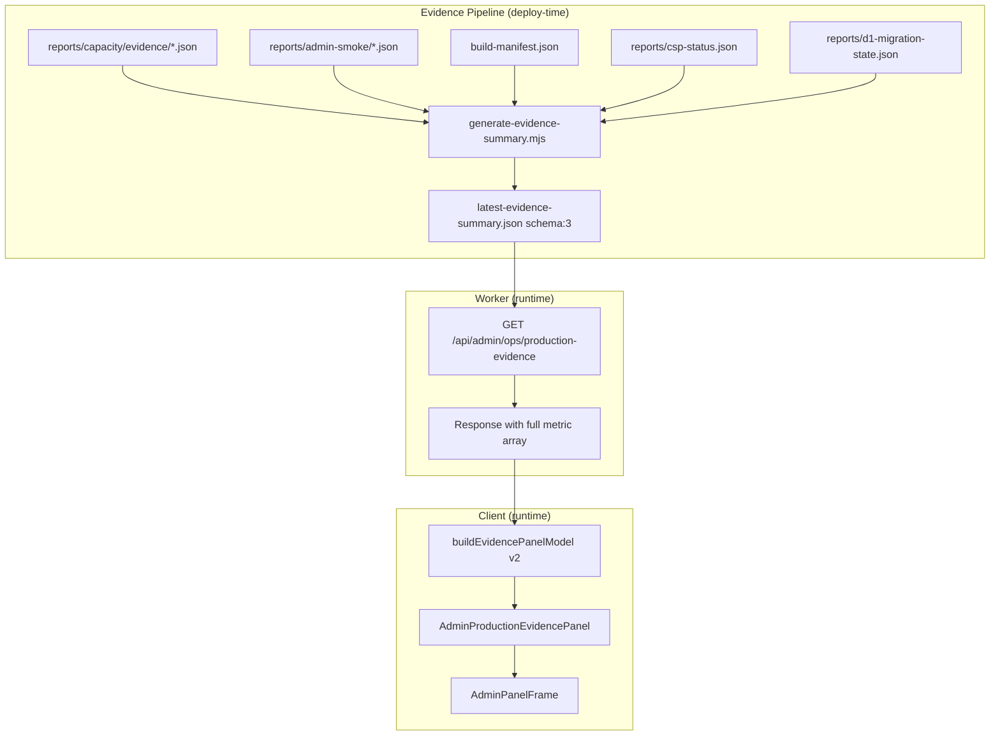
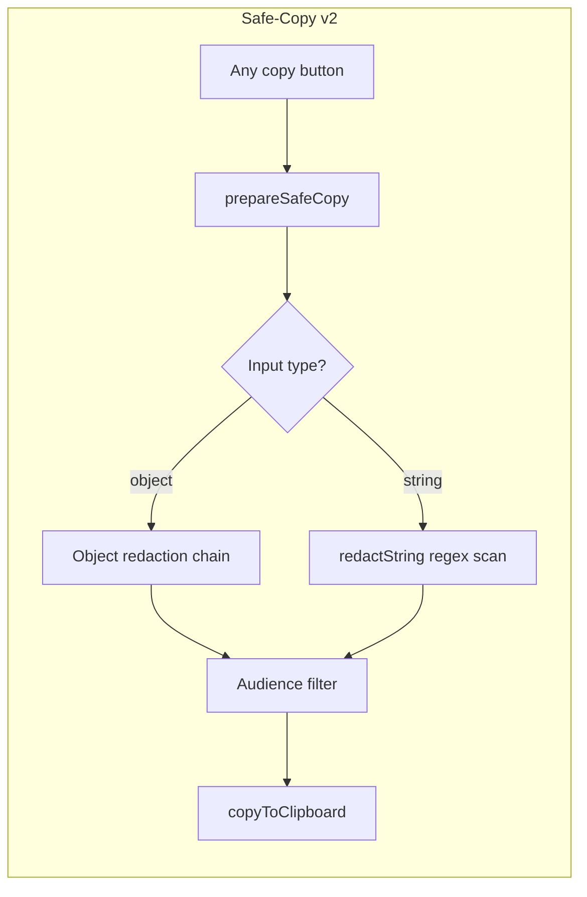

# feat: Admin Console P6 — Evidence Integrity, Content and Asset Operations Maturity

## Overview

P6 closes P5's remaining truth gaps (empty evidence, string redaction, ops-role browser proof), matures the panel freshness contract, and elevates Content Management and Asset Registry from read-only shells into reliable operator surfaces. The "no regression" constraint mandates characterisation-first execution throughout — pin behaviour before changing it.

---

## Problem Frame

The Admin Console looks more mature than its underlying machinery warrants. Production Evidence shows empty data. Safe-copy passes strings through without redaction. Panel freshness is inconsistent. Content Management groups existing panels without release-readiness or learning-quality signals. The Asset Registry has one entry and no operational publish/rollback workflow beyond monster-visual-config.

P6 makes the console honest and operationally useful without expanding into billing, complex permissions, or reward/live-ops bloat.

(see origin: `docs/plans/james/admin-page/admin-page-p6.md`)

---

## Requirements Trace

- R1. Production Evidence panel shows source-backed, honest, dated evidence — never implies green when data is absent/stale/failing
- R2. Every Admin copy/export action is redaction-gated for both objects AND strings, with hostile-seeded tests
- R3. Every server-backed panel exposes a normalised freshness/failure contract (generatedAt, stale, error, empty states)
- R4. Content Management shows live/gated/placeholder status, release readiness, validation blockers, and at least one subject drilldown useful for content-quality investigation
- R5. Asset & Effect Registry v1 is operational: stable rows, version/draft, validation, CAS publish, rollback, preview
- R6. Ops-role browser-level proof exercises redaction and button-visibility contracts
- R7. Structural refactors start with characterisation tests; no behaviour changes without pinned baseline
- R8. Worker-authoritative mutation boundary preserved — Admin never bypasses Worker for writes
- R9. Content-free client leaf invariant preserved — Admin platform helpers never import subject content datasets
- R10. Evidence overclaiming is structurally impossible — unknown/missing/stale evidence cannot classify as certified

---

## Scope Boundaries

- No billing, subscriptions, or payment integration
- No full CRM or support-ticket queue
- No complex role hierarchy beyond admin/ops
- No Marketing auto-publish scheduler
- No campaign/event engine for rewards, coins, XP, streaks
- No WebSocket or Durable Object realtime dashboard
- No analytics warehouse
- No raw CSS/HTML/JS authoring in Admin
- No subject engine merge or production implementation of placeholder subjects
- No Hero Mode controls or reward-economy controls

### Deferred to Follow-Up Work

- Full CSP enforcement (report-only → enforced): separate Sys-Hardening contract when ready
- Marketing refresh-timestamp wiring: depends on Marketing backend changes beyond P6 scope
- 60-learner and 100+ learner certification: evidence pipeline dependent, Admin just surfaces what exists
- Parent-facing campaign tools: separate contract if ever needed

---

## Context & Research

### Relevant Code and Patterns

- `src/platform/hubs/admin-production-evidence.js` — 9-state closed taxonomy, `buildEvidencePanelModel()`
- `src/platform/hubs/admin-safe-copy.js` — `COPY_AUDIENCE`, `prepareSafeCopy()`, `copyToClipboard()`
- `src/platform/hubs/admin-panel-frame.js` — `decidePanelFrameState()` pure function
- `src/surfaces/hubs/AdminPanelFrame.jsx` — React wrapper (wraps, never replaces PanelHeader)
- `src/platform/hubs/admin-asset-registry.js` — `buildAssetRegistry()`, `RegistryEntry` shape
- `src/platform/hubs/admin-content-overview.js` — `buildSubjectContentOverview()`, drilldown actions
- `src/platform/hubs/admin-action-classification.js` — `classifyAction()` registry-based gate
- `scripts/generate-evidence-summary.mjs` — reads `reports/capacity/evidence/*.json`, writes summary
- `worker/src/app.js` — `assertAdminHubActor`, `requireSameOrigin`, rate-limit, CAS patterns
- `reports/capacity/latest-evidence-summary.json` — currently `{ "schema": 2, "metrics": {}, "generatedAt": null }`
- `tests/ci-no-raw-clipboard-admin.test.js` — CI gate preventing raw clipboard use

### Institutional Learnings

- **Characterisation-first is non-negotiable** — P2/P3/P4/P5 all proved it: 8 minutes of characterisation catches 10+ regressions (see `docs/solutions/architecture-patterns/admin-console-section-extraction-pattern-2026-04-27.md`)
- **CAS uses `batch()`, never `withTransaction`** — D1's `withTransaction` is a production no-op (see `docs/solutions/architecture-patterns/admin-console-p4-hardening-truthfulness-adversarial-review-2026-04-27.md`)
- **Fetch generation counters prevent stale-response overwrites** — increment ref on each fetch, discard older responses
- **Standalone Worker modules** receive `db` as parameter, import only from leaf utilities (P3 pattern)
- **`safeSection` error boundary** — failed sub-query returns `null`, never crashes the whole panel
- **Cross-assertion tests make dead constants impossible** — if a constant like `CSP_ENFORCEMENT_MODE` exists, a test asserts the runtime consumer matches

---

## Key Technical Decisions

- **Evidence registry stays JSON-file-based** — no D1 table needed. The generator script expands to aggregate more source files (admin smoke, bootstrap smoke, CSP status, D1 migration state, build hash, KPI reconcile). Deploy-time static bundling is the correct model for infrequently-changing evidence.
- **String redaction via regex-based scanning** — `prepareSafeCopy` gains a `redactString(text, audience)` path that scans for embedded email addresses, account-ID-shaped patterns, session tokens, stack-frame patterns, and route/table names. Applied as a final pass even when input is a pre-generated human summary.
- **Panel freshness contract normalised through existing `decidePanelFrameState`** — extend its input contract rather than creating a second mechanism. Panels that remain outside AdminPanelFrame must still expose the same semantic fields.
- **Content drilldowns use `safeSection` error boundaries** — a failed grammar or spelling diagnostic sub-query degrades gracefully without crashing the parent content panel.
- **Asset Registry v1 generalises from monster-visual-config** — the existing `buildAssetRegistry()` + `AssetRegistryCard` pattern extends naturally. New assets register as additional entries. Worker routes follow the existing draft/publish/restore pattern with CAS.
- **No new Admin section tabs** — Content Operations and Asset Registry live within the existing Content tab. No 6th section needed.

---

## Open Questions

### Resolved During Planning

- **Where does evidence source data live?** — Resolved: multiple source directories already exist (`reports/capacity/evidence/`, `reports/admin-smoke/`, build manifests). The generator aggregates them.
- **Should string redaction be a separate module?** — Resolved: no, extend `admin-safe-copy.js` with a `redactString()` export. Keeps the CI gate and audience model unified.
- **Does Content need a new Worker endpoint?** — Resolved: GET `/api/admin/ops/content-overview` already exists and returns subject-level data. Extend it with release-readiness and validation-blocker fields rather than adding a new route.

### Deferred to Implementation

- Exact regex patterns for embedded email/accountId/sessionId detection in strings — will be tuned by hostile-seeded test failures
- Which specific Debugging panels will adopt AdminPanelFrame vs remain custom — depends on characterisation pass findings
- Exact evidence source file paths beyond capacity — implementation discovers what's available in `reports/`

---

## High-Level Technical Design

> *This illustrates the intended approach and is directional guidance for review, not implementation specification. The implementing agent should treat it as context, not code to reproduce.*

---

## Implementation Units

- U1. **Characterisation baseline — Evidence, Safe-Copy, Panel Frame**

**Goal:** Pin current rendering and logic output of the three modules P6 will modify. No code changes — only new test files.

**Requirements:** R7, R10

**Dependencies:** None

**Files:**
- Create: `tests/admin-production-evidence-characterisation.test.js`
- Create: `tests/admin-safe-copy-characterisation.test.js`
- Create: `tests/admin-panel-frame-characterisation-v2.test.js`
- Read: `src/platform/hubs/admin-production-evidence.js`
- Read: `src/platform/hubs/admin-safe-copy.js`
- Read: `src/platform/hubs/admin-panel-frame.js`

**Approach:**
- SSR-render `AdminProductionEvidencePanel` with empty summary, stale summary, and passing summary — snapshot the HTML output
- Call `prepareSafeCopy` with object and string inputs across all 4 audiences — assert exact output
- Call `decidePanelFrameState` with all meaningful input combinations — assert output shapes
- These tests form the regression gate for all subsequent units

**Execution note:** Characterisation-first. These tests document existing behaviour; they must pass before any production code changes.

**Patterns to follow:**
- `tests/react-admin-panel-frame-characterisation.test.js` (existing pattern)
- `tests/admin-debugging-section-characterisation.test.js`

**Test scenarios:**
- Happy path: Evidence panel renders tier badges when summary has passing metrics
- Happy path: `prepareSafeCopy` redacts object fields per audience level
- Edge case: `prepareSafeCopy` with string input returns the string unchanged (documenting current gap)
- Edge case: Empty evidence summary (`metrics: {}, generatedAt: null`) renders NOT_AVAILABLE state
- Edge case: `decidePanelFrameState` with `refreshError` + `lastSuccessfulRefreshAt` shows stale-with-data
- Error path: Malformed summary (missing schema field) does not crash

**Verification:**
- All characterisation tests pass with zero production code changes
- Tests document the exact current output shape, including known gaps

---

- U2. **Evidence Registry v2 — expand generator and schema**

**Goal:** Upgrade `generate-evidence-summary.mjs` to aggregate admin smoke, bootstrap smoke, CSP status, D1 migration state, build hash, and KPI reconcile state from their respective report files. Bump schema to 3.

**Requirements:** R1, R10

**Dependencies:** U1

**Files:**
- Modify: `scripts/generate-evidence-summary.mjs`
- Modify: `reports/capacity/latest-evidence-summary.json`
- Create: `tests/generate-evidence-summary.test.js`
- Modify: `src/platform/hubs/admin-production-evidence.js`

**Approach:**
- Add source file readers for each evidence dimension: scan `reports/admin-smoke/latest.json`, `reports/bootstrap-smoke/latest.json`, read CSP mode from source constant, read D1 migration count from `worker/migrations/` directory listing, read build hash from existing build manifest
- Each dimension either has dated evidence (with pass/fail) or is `NOT_AVAILABLE`
- Bump schema from 2 to 3; add a `sources` field documenting provenance per metric
- Update `classifyEvidenceMetric` to handle the new metric keys (they map to existing EVIDENCE_STATES — no new enum values needed)
- Update `buildEvidencePanelModel` to handle schema 3 (backward-compatible with schema 2)

**Patterns to follow:**
- Existing `generate-evidence-summary.mjs` file-scanning pattern
- Closed-enum taxonomy in `admin-production-evidence.js`
- Evidence schema v2 structure (just expand `metrics` object)

**Test scenarios:**
- Happy path: Generator reads a passing admin-smoke JSON and classifies as SMOKE_PASS
- Happy path: Generator reads a failing 30-learner evidence and classifies as FAILING
- Edge case: Source file missing — metric classified as NOT_AVAILABLE (not UNKNOWN, not error)
- Edge case: Source file present but `generatedAt` is > 24h old — classified as STALE
- Edge case: Schema 2 summary (legacy) still works through `buildEvidencePanelModel`
- Error path: Source file is malformed JSON — metric classified as NOT_AVAILABLE, generator does not crash
- Integration: Generated summary includes `sources` field mapping each metric to its source file path

**Verification:**
- Running `node scripts/generate-evidence-summary.mjs` produces a schema-3 summary with at least admin-smoke and capacity-tier metrics populated (or honestly NOT_AVAILABLE)
- `latest-evidence-summary.json` has a non-null `generatedAt` after a run
- All existing evidence tests still pass (backward compatibility)

---

- U3. **Safe-Copy v2 — string redaction boundary**

**Goal:** Close the string-passthrough gap so `prepareSafeCopy` is safe even when input is a pre-generated human summary string that accidentally contains sensitive tokens.

**Requirements:** R2

**Dependencies:** U1

**Files:**
- Modify: `src/platform/hubs/admin-safe-copy.js`
- Create: `tests/admin-safe-copy-string-redaction.test.js`

**Approach:**
- Add `redactString(text, audience)` export — applies regex-based scanning to detect and mask/strip:
  - Email addresses (RFC 5322 simplified pattern → masked to `****ple.com`)
  - UUID-shaped strings (account IDs, learner IDs, session IDs → masked or stripped per audience)
  - Auth-header-shaped tokens (`Bearer ...`, `Basic ...` → `[auth redacted]`)
  - Stack traces (lines matching `/^\s+at\s/m` → `[stack trace redacted]`)
  - Internal route patterns (e.g. `/api/admin/...` in parent-safe → stripped)
- Update `prepareSafeCopy` string path: when `typeof data === 'string'`, call `redactString(data, audience)` instead of passthrough
- Audience semantics for strings match objects: ADMIN_ONLY strips auth, OPS_SAFE masks emails/IDs, PARENT_SAFE strips all identifiers and traces

**Patterns to follow:**
- Existing `maskEmail()`, `maskId()` helpers — reuse for string scanning
- Existing closed-audience enum pattern

**Test scenarios:**
- Happy path: String containing an email address is masked at PARENT_SAFE and OPS_SAFE levels
- Happy path: String with no sensitive content passes through unchanged at all audience levels
- Edge case: String containing multiple emails — all masked
- Edge case: String containing UUID-shaped accountId — masked at OPS_SAFE, stripped at PARENT_SAFE
- Edge case: String containing `Bearer eyJ...` token — stripped at all levels including ADMIN_ONLY
- Edge case: String with stack trace fragment — redacted at PARENT_SAFE and OPS_SAFE
- Edge case: String containing internal route `/api/admin/ops/error-events` — stripped at PARENT_SAFE only
- Error path: Empty string returns `{ ok: false }` (existing behaviour preserved)
- Error path: Very long string (10KB) — does not crash, completes in reasonable time
- Integration: Debug Bundle human summary seeded with email+accountId+stackTrace → parent-safe copy returns clean text

**Verification:**
- CI gate `tests/ci-no-raw-clipboard-admin.test.js` still passes
- All characterisation tests from U1 updated to reflect new string-redaction behaviour
- Hostile-seeded test intentionally embeds `james@example.com acc_abc123def456 \n  at Worker.fetch (worker/src/app.js:42)` in a human summary string and verifies parent-safe copy contains none of those values

---

- U4. **Panel State Contract v2 — normalise freshness across all panels**

**Goal:** Every server-backed Admin panel exposes the freshness/failure contract fields. Panels already using AdminPanelFrame get proper `refreshedAt` values; panels outside it document why and still expose the same semantic fields in their own structure.

**Requirements:** R3

**Dependencies:** U1

**Files:**
- Modify: `src/platform/hubs/admin-panel-frame.js`
- Modify: `src/surfaces/hubs/AdminPanelFrame.jsx`
- Modify: `worker/src/app.js` (add `refreshedAt` to responses that lack it)
- Modify: `src/platform/hubs/admin-read-model.js`
- Create: `tests/admin-panel-freshness-contract.test.js`
- Modify: `src/surfaces/hubs/AdminOverviewSection.jsx`
- Modify: `src/surfaces/hubs/AdminMarketingSection.jsx`

**Approach:**
- Evaluate during characterisation (U1) whether a new `partialFailure` output field is needed on `decidePanelFrameState`, or whether the existing `showRetry + showLastSuccessTimestamp` combination already encodes partial-failure state. Add the field only if the characterisation proves it insufficient.
- Add `refreshedAt` to Worker responses that currently lack it (content-overview, marketing messages, accounts-metadata). Use `new Date().toISOString()` at response time.
- Marketing panel: wire `refreshedAt` from response into AdminPanelFrame props (currently missing)
- Overview panels (KPI, Activity, Evidence): verify each already has `refreshedAt` — patch any gaps
- Debugging panels (ErrorTimeline, Denials, DebugBundle): these remain custom but must expose `loading`, `error`, `stale` in their component state and render visual indicators (yellow "stale" pill, red "error" pill). Do not force AdminPanelFrame on complex panels with `headerExtras`.
- Create a freshness-contract test that asserts every Admin Worker read-endpoint response shape includes `refreshedAt` or documents why it does not

**Patterns to follow:**
- Existing `AdminPanelFrame` wrapper pattern (wraps, never replaces)
- Existing `admin-panel-header.jsx` "Generated <ts>" chip
- P4 fetch generation counter pattern for stale-response prevention

**Test scenarios:**
- Happy path: `decidePanelFrameState` returns `partialFailure: true` when `refreshError` exists but `data` is still populated from `lastSuccessfulRefreshAt`
- Happy path: Marketing panel shows "stale" warning when `refreshedAt` is > 5 minutes old
- Edge case: Panel with `refreshedAt: null` — shows "freshness unknown" rather than green
- Edge case: Panel with `loading: true` + existing stale data — shows data with loading indicator overlay, not skeleton
- Edge case: `lastSuccessfulRefreshAt` exists but `refreshError` also exists — shows data with error banner
- Error path: Worker response missing `refreshedAt` field entirely — client defaults to `null`, panel shows "freshness unknown"
- Integration: Full admin hub read includes `refreshedAt` on content-overview, marketing, and accounts-metadata sub-responses

**Verification:**
- Every major admin panel (Overview KPI, Activity, Evidence, Accounts, Marketing, Content, Asset Registry) either uses AdminPanelFrame or renders its own stale/error/loading indicators
- Worker endpoint contract test asserts `refreshedAt` field presence

---

- U5. **Ops-role browser proof — Playwright evidence**

**Goal:** Complete the ops-role interactive Playwright proof that P5 left as a fixme. Exercise the full redaction and button-visibility contract at browser level.

**Requirements:** R6

**Dependencies:** U3 (safe-copy v2 must be in place for the proof to be meaningful)

**Files:**
- Create: `tests/playwright/admin-ops-role-proof.spec.js`
- Modify: `tests/playwright/shared.mjs` (add ops-role fixture if missing)

**Approach:**
- Create a Playwright test that logs in as ops-role user
- Navigate to Admin → Debug Bundle → generate bundle → verify the "Copy (Admin-only)" button is NOT visible
- Verify "Copy (Parent-safe)" button IS visible and produces redacted output
- Navigate to Account detail → verify raw account ID is not displayed in ops view
- Navigate to Content → verify no mutation buttons visible (ops is read-only for mutations)
- This replaces the P5 fixme with real browser-level evidence

**Patterns to follow:**
- Existing `tests/playwright/shared.mjs` fixture pattern
- Existing admin-hub-denied screenshot baseline pattern

**Test scenarios:**
- Happy path: Ops user can navigate to Admin and see Overview
- Happy path: Ops user sees "Copy (Parent-safe)" button on Debug Bundle
- Edge case: Ops user does NOT see "Copy (Admin-only)" button on Debug Bundle
- Edge case: Ops user does NOT see publish/archive/delete action buttons in Content/Asset sections
- Integration: Ops user copies Debug Bundle via parent-safe button — clipboard content verified redacted (no raw emails, no full account IDs)
- Integration: Admin user DOES see admin-only copy button (contrast test)

**Verification:**
- Playwright test runs green in CI
- Screenshots captured for ops-role Admin view (visual baseline)
- The P5 fixme comment can be removed from source

---

- U6. **Content Operations v2 — release readiness and validation signals**

**Goal:** Upgrade Content overview from grouped panels to an operator-grade content-operations surface showing live/gated/placeholder status, release readiness, validation blockers, and subject-specific drilldowns.

**Requirements:** R4, R9

**Dependencies:** U4 (panel freshness contract)

**Files:**
- Modify: `src/platform/hubs/admin-content-overview.js`
- Modify: `src/surfaces/hubs/AdminContentSection.jsx`
- Modify: `worker/src/app.js` (extend GET `/api/admin/ops/content-overview` response)
- Create: `tests/admin-content-operations-v2.test.js`
- Create: `src/platform/hubs/admin-content-release-readiness.js`

**Approach:**
- Extend Worker content-overview endpoint to include per-subject: `releaseVersion`, `validationBlockers[]`, `validationWarnings[]`, `hasRealDiagnostics`, `recentErrorCount7d`, `contentCoverage` summary
- Create `admin-content-release-readiness.js` — pure logic module that classifies release readiness: `READY`, `BLOCKED`, `WARNINGS_ONLY`, `NOT_APPLICABLE` (for placeholder subjects)
- Update `buildSubjectContentOverview()` to include readiness classification
- Subjects without diagnostics: row renders as non-clickable with "No drilldown available" text (truthful, not pretend-clickable)
- Subjects with diagnostics: row click scrolls to subject-specific panel (existing pattern)
- Add validation-blocker badges to subject rows — red badge for blockers, yellow for warnings
- Preserve content-free leaf invariant: `admin-content-release-readiness.js` receives normalised data, never imports subject content datasets

**Patterns to follow:**
- Existing `admin-content-overview.js` drilldown mapping
- Existing `safeSection` error boundary for sub-queries
- Content-free leaf invariant enforced by `scripts/audit-client-bundle.mjs`

**Test scenarios:**
- Happy path: Subject with READY release status shows green "Release ready" badge
- Happy path: Subject with validation blockers shows red badge with blocker count
- Happy path: Clicking a subject with diagnostics scrolls to its drilldown panel
- Edge case: Placeholder subject row is non-clickable — does not emit scroll event
- Edge case: Subject with diagnostics but failing drilldown — row shows "drilldown unavailable" (safeSection boundary)
- Edge case: All subjects are placeholders — Content overview shows "No live subjects with diagnostics"
- Error path: Content-overview endpoint fails — panel shows AdminPanelFrame error state with last-success data if available
- Integration: Spelling subject has post-mega diagnostics → drilldown scrolls to PostMegaSpellingDebugPanel
- Integration: Grammar subject has concept confidence → drilldown scrolls to GrammarConceptConfidencePanel

**Verification:**
- At least Grammar and Spelling subjects show real drilldowns with truthful diagnostic data
- Punctuation and any placeholder subjects are visibly non-clickable
- Release readiness classification tests cover all 4 states
- `npm run audit:client` still passes (content-free leaf invariant)

---

- U7. **Content learning-quality signals**

**Goal:** Surface skill coverage, high-wrong-rate content, common misconceptions, and recently-changed-but-not-evidenced content signals where durable evidence exists.

**Requirements:** R4

**Dependencies:** U6

**Files:**
- Create: `src/platform/hubs/admin-content-quality-signals.js`
- Modify: `src/surfaces/hubs/AdminContentSection.jsx`
- Modify: `worker/src/app.js` (extend content-overview or add narrow endpoint)
- Create: `tests/admin-content-quality-signals.test.js`

**Approach:**
- Create `admin-content-quality-signals.js` — builds a summary model from Worker response: `{ skillCoverage, templateCoverage, itemCoverage, commonMisconceptions, highWrongRateItems, recentlyChangedUnevidenced }`
- For subjects where data exists (Grammar has concept confidence, Spelling has word-bank coverage), compute and return signals
- For subjects without data, return `NOT_AVAILABLE` per signal — UI shows "Not available yet" text
- Signals are read-only summary cards below the subject overview table — no editing, no drill-edit
- Worker derives signals from existing data: Grammar concept map, Spelling word lists, question generator coverage reports

**Patterns to follow:**
- Content-free leaf module pattern (receives normalised data)
- Summary card pattern from AdminOverviewSection KPI cards

**Test scenarios:**
- Happy path: Grammar subject returns skillCoverage > 0 with concept list
- Happy path: Spelling subject returns itemCoverage with word-count summary
- Edge case: Subject has partial data — shows available signals, "Not available yet" for missing ones
- Edge case: No subjects have learning data — entire section shows "Learning quality signals not yet available"
- Error path: Worker sub-query for signals fails (safeSection) — shows "Unable to load" for that section

**Verification:**
- Grammar and Spelling show at least one meaningful quality signal each
- No false signals (empty data never shows a numeric coverage value)
- `npm run audit:client` passes (content-free leaf)

---

- U8. **Asset & Effect Registry v1 — operational publish/rollback**

**Goal:** Generalise the Asset Registry from a single monster-visual-config card to a multi-asset operator surface with CAS publish, rollback, preview, and validation.

**Requirements:** R5, R8

**Dependencies:** U4 (panel freshness), U1 (characterisation)

**Files:**
- Modify: `src/platform/hubs/admin-asset-registry.js`
- Modify: `src/surfaces/hubs/AdminContentSection.jsx` (AssetRegistrySection sub-component)
- Modify: `worker/src/app.js` (generalise asset routes)
- Create: `tests/admin-asset-registry-v1.test.js`
- Modify: `src/platform/hubs/admin-action-classification.js` (register new asset actions)

**Approach:**
- Generalise existing monster-visual-config routes into a pattern: `PUT /api/admin/assets/:assetId/draft`, `POST /api/admin/assets/:assetId/publish`, `POST /api/admin/assets/:assetId/restore`
- Keep existing monster-visual-config routes as aliases (backward compat) — they delegate to the generic asset handler
- `buildAssetRegistry()` already returns an array of `RegistryEntry` — extend the entry shape with `publishBlockers[]`, `previewUrl`, `reducedMotionStatus`, `fallbackStatus`
- Register asset publish/restore in `admin-action-classification.js` at HIGH confirmation level (existing pattern)
- CAS: publish sends `expectedDraftRevision`, restore sends `expectedPublishedVersion`. Server returns 409 + `currentState` on conflict.
- Preview affordance: if asset has a preview endpoint, show "Preview" button that opens in a panel/modal
- No raw CSS/HTML/JS authoring — config editing uses existing structured fields (numeric clamps, token selectors, allowlisted classes)

**Patterns to follow:**
- Existing `saveMonsterVisualConfigDraft`, `publishMonsterVisualConfig`, `restoreMonsterVisualConfigVersion` in `api.js`
- CAS pattern from `admin-metadata-conflict-actions.js`
- `AdminConfirmAction` HIGH-level confirmation gate

**Test scenarios:**
- Happy path: Publish asset with valid draft → Worker returns success receipt with new publishedVersion
- Happy path: Rollback to previous version → Worker restores and returns receipt
- Happy path: Registry shows stable asset rows with version/draft badges
- Edge case: Publish with stale `expectedDraftRevision` → 409 conflict with "Keep mine / Use theirs" UI
- Edge case: Asset has publishBlockers → publish button disabled with tooltip listing blockers
- Edge case: Asset has no draft (clean) → "No pending changes" indicator
- Error path: Publish request fails (network) → error toast, draft preserved
- Error path: Restore request fails (409) → conflict resolution UI shown
- Integration: After successful publish, refresh cascade updates the registry row (publishedVersion bumps, draft clears)

**Verification:**
- At least monster-visual-config works through the generalised routes
- CAS conflict produces visible resolution UI, not silent overwrite
- No registry path exposes raw HTML/JS/CSS editing fields
- Action classification gate prevents accidental publish (requires confirmation dialog)

---

- U9. **Characterisation baseline — Content and Asset sections**

**Goal:** Pin the rendering output of Content and Asset sections before U6/U7/U8 modify them. Ensures no regression during the Content Operations and Asset Registry upgrades.

**Requirements:** R7

**Dependencies:** None (can run in parallel with U1)

**Files:**
- Create: `tests/react-admin-content-section-characterisation.test.js`
- Create: `tests/react-admin-asset-registry-characterisation.test.js`

**Approach:**
- SSR-render `AdminContentSection` with frozen test data (all subjects, existing drilldown panels) — snapshot output
- SSR-render `AssetRegistrySection` with current monster-visual-config state — snapshot output
- These snapshots form the regression baseline for U6, U7, U8

**Execution note:** Characterisation-first. Must pass before any Content/Asset production code changes.

**Patterns to follow:**
- `tests/react-admin-content-overview.test.js` (existing pattern)
- `tests/react-admin-asset-registry.test.js`

**Test scenarios:**
- Happy path: Content section renders subject overview table with existing column set
- Happy path: Asset registry renders monster-visual-config card with version badges
- Edge case: Content section with no data renders empty-state
- Edge case: Asset registry with no entries renders empty-state

**Verification:**
- Characterisation tests pass with zero production code changes
- Snapshots capture exact current HTML structure

---

- U10. **Refactor slice — extract panel helpers and normalise refresh envelopes**

**Goal:** One narrow, behaviour-preserving refactor slice that reduces Admin maintainability risk. Focus on unifying refresh/error envelope normalisers and extracting duplicated timestamp/status formatting.

**Requirements:** R7

**Dependencies:** U1, U9 (characterisation baselines must exist before refactoring)

**Files:**
- Create: `src/platform/hubs/admin-refresh-envelope.js`
- Modify: `src/platform/hubs/admin-panel-patches.js`
- Modify: `src/platform/hubs/admin-refresh-cascade.js`
- Modify: `src/platform/hubs/admin-refresh-error-text.js`
- Create: `tests/admin-refresh-envelope.test.js`

**Approach:**
- Extract the common refresh-error envelope shape (`{ code, message, correlationId, at }`) into a dedicated builder module
- Consolidate duplicated timestamp formatting (several panels format `refreshedAt` differently) into a shared `formatAdminTimestamp(isoString)` helper
- Move status formatting helpers (e.g. "2 min ago", "stale") into the same module
- This is a refactor: all characterisation tests must still pass after extraction
- Do NOT change any behaviour — only move code and unify duplicated logic

**Execution note:** Characterisation tests from U1/U9 are the regression gate. Run them before and after.

**Patterns to follow:**
- Existing `routeAdminRefreshError()` in `admin-refresh-error-text.js` (error-envelope routing)
- Existing envelope-building logic in `admin-panel-patches.js` (patch response shapes)
- Content-free leaf module pattern

**Test scenarios:**
- Happy path: `buildRefreshErrorEnvelope(code, message)` produces the canonical shape
- Happy path: `formatAdminTimestamp` formats ISO string to "2 min ago" / "1h ago" / "23 Apr 14:30"
- Edge case: `formatAdminTimestamp(null)` returns "Unknown"
- Edge case: `formatAdminTimestamp` with future timestamp returns the raw ISO string (no negative "ago")
- Integration: All existing panels still render identically (characterisation tests unchanged)

**Verification:**
- All characterisation tests from U1 and U9 still pass unchanged
- No new behaviour — only structural improvement
- `npm run audit:client` passes

---

- U11. **CSP/style cleanup slice — Admin-adjacent controlled cleanup**

**Goal:** One controlled inline-style cleanup pass within Admin panels that have `shared-pattern-available` or `dynamic-content-driven` inline styles, with visual coverage proving no regression.

**Requirements:** R7

**Dependencies:** U9, U10

**Files:**
- Modify: `src/surfaces/hubs/AdminOverviewSection.jsx` (inline style → class extraction)
- Modify: `src/surfaces/hubs/AdminContentSection.jsx`
- Modify: `src/surfaces/hubs/AdminMarketingSection.jsx`
- Modify: `src/surfaces/styles/admin-panels.css` (or create if needed)
- Create: `tests/admin-csp-style-cleanup-visual.test.js`

**Approach:**
- Identify the top 10-15 inline `style={}` occurrences in Admin JSX files that can be replaced with CSS classes
- Move those styles to a shared `admin-panels.css` stylesheet
- Take before/after SSR snapshots proving visual equivalence
- Do NOT attempt to clean all inline styles — just the `shared-pattern-available` category (repeated patterns like flex layouts, badge colours, spacing)
- `dynamic-content-driven` styles (computed at runtime from data) remain inline — they cannot be statically extracted

**Execution note:** Characterisation-first. SSR snapshot before extraction, then after, diff must show only class-name changes, not structural changes.

**Patterns to follow:**
- Existing `src/surfaces/styles/` CSS file convention
- CSP cross-assertion test pattern from sys-hardening-p5

**Test scenarios:**
- Happy path: Admin Overview section renders identically with classes vs inline styles (snapshot diff)
- Happy path: Admin Content section renders identically after style extraction
- Edge case: Dynamic styles (computed badge colours) remain inline — not accidentally extracted
- Integration: Playwright screenshot of Admin page matches visual baseline after cleanup

**Verification:**
- All characterisation tests still pass
- Net reduction in inline-style count (measured by grep count before/after)
- No visual regressions in Playwright baseline screenshots

---

- U12. **Documentation, smoke, and completion report**

**Goal:** Align source, docs, and reports. Run production smoke. Produce honest P6 completion report with actual evidence.

**Requirements:** R1 (evidence honesty), all acceptance criteria from origin Section 7

**Dependencies:** U2, U3, U4, U5, U6, U7, U8, U10, U11 (all feature units)

**Files:**
- Create: `docs/completion-reports/admin-console-p6-completion-report.md`
- Modify: `reports/capacity/latest-evidence-summary.json` (regenerated)
- Verify: All Admin-related documentation accuracy

**Approach:**
- Run `node scripts/generate-evidence-summary.mjs` to produce fresh evidence
- Run `npm test` and record pass/fail counts for admin-specific tests
- Run Playwright suite and record results
- Run production smoke if deployment is available
- Write completion report covering all acceptance criteria from origin Section 7
- Include validation table for P1–P5 (per origin Section 7.1)
- List any corrected/narrowed/deferred claims from P5
- Report must be honest about what was not run — do not claim evidence unless it actually ran

**Test expectation: none** — this unit produces documentation and evidence, not new code with behaviour to test.

**Verification:**
- Completion report exists and covers all Section 7 acceptance criteria
- Report includes actual command output (test counts, pass/fail, evidence generation timestamp)
- Report states known residuals honestly
- Report includes browser-level evidence for ops/admin role differences (Playwright screenshots or test output)

---

## System-Wide Impact

- **Interaction graph:** Evidence pipeline (`generate-evidence-summary.mjs`) now reads from multiple report directories. Content-overview Worker endpoint gains new response fields consumed by the updated client. Asset registry routes generalise but keep backward-compatible aliases.
- **Error propagation:** Each panel has its own error envelope. `safeSection` boundaries prevent Content drilldown failures from cascading. Asset CAS conflicts produce 409 responses handled at the action level.
- **State lifecycle risks:** Evidence is deploy-time static — no stale-while-mutating risk. Asset CAS prevents lost updates. Panel freshness relies on `refreshedAt` timestamps — if Worker response is slow, UI shows "loading" not stale-green.
- **API surface parity:** Content-overview endpoint gains fields; existing consumers unaffected (additive). Asset routes add generic pattern; existing specific routes preserved as aliases.
- **Integration coverage:** Ops-role browser proof (U5) exercises the cross-layer contract end-to-end. Safe-copy hostile-seeded tests (U3) prove the redaction boundary with real attack strings.
- **Unchanged invariants:** Section tabs remain at 5. Hash-based routing unchanged. Content-free leaf invariant preserved. CI clipboard gate preserved. `useSubmitLock` on all mutation buttons. `requireSameOrigin` CSRF protection on all mutations.

---

## Risks & Dependencies

| Risk | Mitigation |
|------|------------|
| Evidence overclaiming — pretty panel hides empty data | Closed taxonomy + NOT_AVAILABLE default + hostile tests asserting missing data never classifies as certified |
| Copy/export leakage — strings bypass object redaction | `redactString` regex scanning as final pass + hostile-seeded tests with real attack patterns |
| Content section bloat — becomes unclear instead of clearer | Group by operator intent (overview → readiness → diagnostics → registry → quality signals); non-clickable placeholder rows |
| Asset config becoming arbitrary styling | Registry enforces structured fields only; no raw CSS/HTML/JS authoring; CI test can assert no `dangerouslySetInnerHTML` in Asset section |
| Refactor without characterisation | U1 and U9 must land and pass before any structural changes; explicit dependency chain enforced |
| Panel freshness inconsistency after partial adoption | Freshness-contract test (U4) asserts every Worker read-endpoint includes `refreshedAt` or documents exemption |

---

## Phased Delivery

### Phase 1 — Pin and Harden (U1, U9, U2, U3)
Characterisation baselines + Evidence v2 + Safe-Copy v2. These are the highest-risk P6 gaps and should land first.

### Phase 2 — Platform Contracts (U4, U5, U10)
Panel freshness + ops browser proof + refactor slice. These strengthen the platform without changing feature behaviour.

### Phase 3 — Content and Asset Maturity (U6, U7, U8, U11)
Content operations + learning signals + Asset Registry v1 + CSP cleanup. These depend on Phase 1–2 infrastructure.

### Phase 4 — Documentation and Closure (U12)
Completion report with real evidence. Only after all feature units land.

---

## Documentation / Operational Notes

- Production Evidence panel accuracy depends on running `generate-evidence-summary.mjs` before deployment — add to CI/deploy pipeline or document as manual pre-deploy step
- The P5 fixme for ops-role browser proof (U5) will be resolved and the comment removed
- Completion report (U12) serves as the validation artifact required by origin Section 11

---

## Sources & References

- **Origin document:** [docs/plans/james/admin-page/admin-page-p6.md](docs/plans/james/admin-page/admin-page-p6.md)
- Institutional learnings: `docs/solutions/architecture-patterns/admin-console-p5-operator-readiness-parallel-sdlc-2026-04-28.md`
- Institutional learnings: `docs/solutions/architecture-patterns/admin-console-p4-hardening-truthfulness-adversarial-review-2026-04-27.md`
- Institutional learnings: `docs/solutions/architecture-patterns/admin-console-section-extraction-pattern-2026-04-27.md`
- Institutional learnings: `docs/solutions/architecture-patterns/sys-hardening-p5-certification-closure-d1-latency-and-evidence-culture-2026-04-28.md`
- Related code: `src/platform/hubs/admin-*.js` (15 modules)
- Related code: `src/surfaces/hubs/Admin*.jsx` (12 components)
- Related code: `worker/src/app.js` (admin route handlers)
- Related code: `scripts/generate-evidence-summary.mjs`
