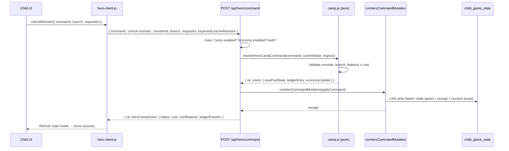

# feat: Hero Mode P5 — Hero Camp and Hero Pool Monsters

## Overview

Add Hero Camp — a calm, child-led spending surface where children use Hero Coins (earned in P4) to invite and grow Hero-owned monsters. This is the first Hero debit phase. It introduces no new earning mechanics, no random rewards, no shops, and no subject mastery mutations.

---

## Problem Frame

P4 gave children a daily Hero Coins award with zero ways to spend them. The balance accumulates with no visible purpose beyond a number. P5 turns that dormant balance into meaningful child agency: choose a monster, invite it, grow it over weeks. The product constraint is that this must feel like a calm choice layer — not a shop, not a game of chance, not a learning shortcut.

(see origin: `docs/plans/james/hero-mode/hero-mode-p5.md`)

---

## Requirements Trace

- R1. Child can open Hero Camp when `HERO_MODE_CAMP_ENABLED=true` and all prerequisite flags are active (SHADOW + LAUNCH + CHILD_UI + PROGRESS + ECONOMY + CAMP)
- R2. Hero Pool registry exposes six Hero-owned monsters with deterministic costs
- R3. `unlock-monster` command invites a monster at stage 0, debiting Hero Coins exactly once
- R4. `evolve-monster` command grows an owned monster one stage, debiting Hero Coins exactly once
- R5. Balance never goes negative; server derives all costs
- R6. Ledger entries are deterministic and idempotent — no double-charge
- R7. Already-owned/already-stage actions return success without debit
- R8. Hero-owned monster state lives in `child_game_state` (system_id='hero-mode'), not a new D1 table
- R9. No subject mastery, Stars, or subject monster mutation from Hero Camp
- R10. No shop/deal/loot/limited-time/streak-pressure language in child-facing copy
- R11. Hero Quest remains the primary dashboard action; Camp is secondary
- R12. Read model evolves to v6 with child-safe Camp block when Camp enabled
- R13. Client cannot supply cost, amount, balance, ledger entry ID, or ownership state
- R14. Rollback via flag leaves existing owned-monster state dormant and intact
- R15. All existing P0–P4 Hero tests continue to pass (no regression)

---

## Scope Boundaries

- No new earning mechanics (P5 is spending only)
- No per-question/per-task Coins
- No random draws, loot boxes, or gambling mechanics
- No paid currency or parent-controlled allowance
- No refunds or undo after confirmed spending (P6 topic)
- No branch switching after invite
- No trading, gifting, or leaderboards
- No six-subject Hero expansion
- No scheduler, subject mastery, or Stars changes
- No new D1 tables (unless state blob proves insufficient — unlikely for 6 monsters)

### Deferred to Follow-Up Work

- Production analytics dashboard and retention tuning (P6)
- Economy abuse monitoring (P6)
- Undo/refund policy (P6)
- Long-term ledger archival (P6)
- A/B testing Camp placement (P6)
- Parent-facing explanation of Hero Mode (P6)

---

## Context & Research

### Relevant Code and Patterns

- `shared/hero/economy.js` — P4 economy: balance, ledger, award logic, normaliser
- `shared/hero/constants.js` — `HERO_DAILY_COMPLETION_COINS`, `HERO_ECONOMY_VERSION`, feature flags
- `shared/hero/hero-copy.js` — `HERO_ECONOMY_ALLOWED_VOCABULARY`, `HERO_FORBIDDEN_PRESSURE_VOCABULARY`
- `shared/hero/progress-state.js` — state versioning (v1→v2), normaliser pattern
- `worker/src/app.js:1414–1630` — Hero command handler: `start-task`, `claim-task`, mutation boundary call
- `worker/src/hero/read-model.js` — v3/v4/v5 assembler
- `worker/src/hero/claim.js` — pure resolver pattern (no DB reads)
- `worker/src/repository.js` — `runHeroCommandMutation` CAS boundary
- `src/platform/hero/hero-client.js` — `createHeroModeClient()` with stale-write retry
- `src/platform/hero/hero-ui-model.js` — `buildHeroHomeModel()` view derivation
- `wrangler.jsonc` — feature flag hierarchy (SHADOW → LAUNCH → CHILD_UI → PROGRESS → ECONOMY)

### Institutional Learnings

- **D1 atomicity**: `batch()` not `withTransaction` — the latter is a production no-op on D1 (see `docs/solutions/`)
- **Triple-layer idempotency**: (a) mutation receipt replay, (b) already-completed status check pre-mutation, (c) deterministic ledger entry ID via DJB2 hash
- **State migration via normaliser**: Multi-branch version acceptance (`v1 → v3`, `v2 → v3`, `v3 → v3`), never single equality guard
- **Import direction invariant**: `shared/hero/` ← `worker/src/hero/` ← `src/platform/hero/`; never reversed
- **Flag misconfiguration guard**: Return 409 with typed code when Camp is on but Economy is off (mirrors P1's `hero_launch_misconfigured`)
- **App owns dispatch**: Hero code never writes D1 directly; all writes route through `runHeroCommandMutation` inside `app.js`

---

## Key Technical Decisions

- **State shape extension, not new table**: Hero Pool state embeds inside the existing `child_game_state` JSON blob as a new top-level key. Six monsters × 5 stages is trivially small for a JSON field.
- **State version bump to v3**: The HeroModeState type gains `heroPool` alongside existing `economy` and progress. The normaliser upgrades v1/v2 gracefully.
- **Economy normaliser stays v1**: The economy sub-object shape does not change — it already has balance, lifetimeSpent, and ledger array. P5 adds new entry types to the ledger but not new economy fields.
- **Commands reuse existing Hero command route**: `POST /api/hero/command` gains two new command names. No new endpoints.
- **Pure camp resolver in `worker/src/hero/camp.js`**: Follows the same pattern as `claim.js` — validates, derives cost/action, returns mutation intent or typed error. No DB access.
- **DJB2 deterministic ledger IDs**: `hero-monster-invite:v1:<learnerId>:<monsterId>:<branch>` and `hero-monster-grow:v1:<learnerId>:<monsterId>:<targetStage>` ensure structural deduplication.
- **Read model v6 is additive**: When Camp is enabled, the v5 fields remain; a `camp` block is appended. When Camp is disabled, v5 shape is unchanged.
- **Affordability is display-only**: The read model computes `canAffordInvite`/`canAffordGrow` for UI convenience; the command handler re-validates on every mutation.

---

## Open Questions

### Resolved During Planning

- **Where does monster ownership live?** In `state_json.heroPool.monsters` within the existing Hero state row. Not a new D1 table.
- **Does economy version need a bump?** No — the economy sub-object structure is unchanged; new entry types are additive.
- **How does rollback work?** Set `HERO_MODE_CAMP_ENABLED=false`. Camp UI disappears, Camp commands reject, but all state persists dormant.
- **Do we need branch assets for P5?** The origin allows branch choice to be cosmetic. If assets are missing, UI degrades gracefully — a single generic stage-image is acceptable.

### Deferred to Implementation

- Exact monster `displayOrder` values (trivial ordering decision during U1)
- Whether `recentActions` array needs a max-length prune policy (bounded by monster count × stages ≈ 30 max actions total; safe without pruning in P5)
- Whether the Camp panel is a route or an in-page panel (UI decision in U9; both are origin-valid)

---

## High-Level Technical Design

> *This illustrates the intended approach and is directional guidance for review, not implementation specification. The implementing agent should treat it as context, not code to reproduce.*

---

## Implementation Units

- U1. **Shared Hero Pool registry and cost contract**

**Goal:** Create the pure registry of six Hero Pool monsters with deterministic costs, branch options, and stage progression. This is the foundation all other units reference.

**Requirements:** R2, R5, R10

**Dependencies:** None

**Files:**
- Create: `shared/hero/hero-pool.js`
- Create: `tests/shared/hero/hero-pool.test.js`

**Approach:**
- Export `HERO_POOL_REGISTRY` (frozen map of 6 monster definitions)
- Export `HERO_POOL_INITIAL_MONSTER_IDS` (frozen array of 6 IDs in display order)
- Export cost constants: `HERO_MONSTER_INVITE_COST = 150`, `HERO_MONSTER_GROW_COSTS = { 1: 300, 2: 600, 3: 1000, 4: 1600 }`
- Export lookup helpers: `getHeroMonsterDefinition(id)`, `getInviteCost()`, `getGrowCost(targetStage)`, `isValidHeroMonsterId(id)`, `isValidBranch(branch)`
- File must be pure: no Worker, no React, no D1, no subject runtime imports

**Patterns to follow:**
- `shared/hero/constants.js` — frozen exports, no side effects
- `shared/hero/economy.js` — pure helpers with clear parameter contracts

**Test scenarios:**
- Happy path: registry contains exactly 6 unique IDs with complete definitions
- Happy path: all costs are positive integers; grow costs strictly increase by stage
- Happy path: max stage is 4 for all monsters; branch options are `['b1', 'b2']`
- Edge case: `getHeroMonsterDefinition('unknown')` returns `undefined`
- Edge case: `getGrowCost(5)` returns `undefined` (beyond max)
- Edge case: `isValidBranch('b3')` returns `false`
- Boundary: registry object is frozen (mutations throw in strict mode)
- Boundary: file has zero imports from worker/, src/, or subject modules

**Verification:**
- All registry tests pass
- `shared/hero/hero-pool.js` has no disallowed imports
- Exported types match origin §10 shape

---

- U2. **Economy state hardening for debit operations**

**Goal:** Strengthen the P4 economy normaliser to validate debit-related invariants before P5 introduces negative ledger entries. This is the preflight hardening from origin §3.

**Requirements:** R5, R6, R15

**Dependencies:** None (can be done in parallel with U1)

**Files:**
- Modify: `shared/hero/economy.js`
- Modify: `tests/shared/hero/economy.test.js`

**Approach:**
- Extend `normaliseHeroEconomyState()` to validate: balance finite non-negative, lifetimeEarned finite non-negative, lifetimeSpent finite non-negative, ledger entries by known type, positive amounts for earning entries only, negative amounts only for approved spending types, `balanceAfter` finite non-negative
- Add spending entry types to `HERO_ECONOMY_ENTRY_TYPES`: `'monster-invite'`, `'monster-grow'`, `'admin-adjustment'`
- Malformed ledger entries are dropped from child-safe projection (not crash)
- Extend `HERO_ECONOMY_ALLOWED_VOCABULARY` with camp/spending terms: `invite`, `grow`, `camp`, `hero camp`, `hero pool`, `monster`
- All existing P4 economy tests must continue to pass unchanged

**Execution note:** Start with characterization tests for existing normaliser behaviour before modifying.

**Patterns to follow:**
- `shared/hero/progress-state.js` — multi-version normaliser with graceful fallbacks
- P4's `normaliseHeroEconomyState()` current implementation

**Test scenarios:**
- Happy path: valid P4 earning-only state passes through unchanged
- Happy path: valid state with spending entries normalises correctly
- Edge case: `balance` is NaN → normalised to 0
- Edge case: `lifetimeSpent` is negative → normalised to 0
- Edge case: ledger entry with unknown type is dropped from projection
- Edge case: earning entry with negative amount is dropped
- Edge case: spending entry with positive amount is dropped
- Edge case: `balanceAfter` is Infinity → entry dropped
- Error path: entirely malformed economy object → returns safe empty state
- Integration: existing P4 award flow still produces valid normalised state after hardening

**Verification:**
- All existing economy tests pass (no regression)
- New hardening tests pass
- Spending entry types accepted by normaliser

---

- U3. **Hero state v3 with heroPool block and migration**

**Goal:** Extend the Hero state shape to include a `heroPool` top-level block. The normaliser upgrades v1→v3 and v2→v3 gracefully, never wiping existing data.

**Requirements:** R8, R14, R15

**Dependencies:** U1 (needs `HERO_POOL_INITIAL_MONSTER_IDS` for empty state creation)

**Files:**
- Modify: `shared/hero/progress-state.js`
- Modify: `tests/shared/hero/progress-state.test.js`

**Approach:**
- Bump `HERO_PROGRESS_VERSION` from 2 to 3
- Add `heroPool` block to state shape: `{ version: 1, rosterVersion, selectedMonsterId, monsters: {}, recentActions: [], lastUpdatedAt: null }`
- `normaliseHeroProgressState()` gains v1→v3 path (empty economy + empty heroPool), v2→v3 path (existing economy + empty heroPool), v3→v3 path (normalise heroPool)
- heroPool normaliser: drop unknown monster IDs, clamp stages 0–4, normalise invalid branch to null, preserve valid owned state
- Never delete existing economy.balance, economy.ledger, or daily progress during migration

**Patterns to follow:**
- `shared/hero/progress-state.js` existing v1→v2 migration pattern

**Test scenarios:**
- Happy path: fresh empty state creates v3 with empty economy + empty heroPool
- Happy path: v1 (progress-only) → v3 with empty economy + empty heroPool
- Happy path: v2 (economy) → v3 with preserved economy + empty heroPool
- Happy path: valid v3 normalises without data loss
- Edge case: v3 with unknown monster IDs in heroPool → IDs dropped
- Edge case: v3 with stage 7 → clamped to 4
- Edge case: v3 with branch 'b5' → normalised to null
- Edge case: v3 with malformed heroPool → safe empty heroPool, economy preserved
- Error path: completely invalid state_json → safe empty v3
- Integration: v2 state with 180 ledger entries migrates without ledger loss

**Verification:**
- All existing progress-state tests pass (no regression)
- Migration preserves balance and ledger across all version paths
- Version field is 3 after normalisation

---

- U4. **Pure spending helpers and deterministic ledger entries**

**Goal:** Create pure functions that compute the mutation intent for invite/grow actions: validate affordability, compute next state, build deterministic ledger entries.

**Requirements:** R3, R4, R5, R6, R7, R13

**Dependencies:** U1 (registry), U2 (economy entry types), U3 (state shape)

**Files:**
- Create: `shared/hero/monster-economy.js`
- Create: `tests/shared/hero/monster-economy.test.js`

**Approach:**
- Export `computeMonsterInviteIntent({ economyState, heroPoolState, monsterId, branch, learnerId, rosterVersion })` → returns `{ ok, intent }` or `{ ok: false, code, reason }`
- Export `computeMonsterGrowIntent({ economyState, heroPoolState, monsterId, targetStage, learnerId, rosterVersion })` → returns `{ ok, intent }` or `{ ok: false, code, reason }`
- Intent includes: `newBalance`, `newLifetimeSpent`, `ledgerEntry`, `newMonsterState`, `actionRecord`
- Ledger entry IDs are deterministic: `hero-ledger-<djb2(idempotencyKey)>`
- Idempotency keys follow origin §13.1 and §13.2
- Both helpers receive `learnerId` explicitly — never derive from ledger
- File must be pure: no Worker, no D1, no React imports

**Patterns to follow:**
- `shared/hero/economy.js` — `applyDailyCompletionCoinAward()` pattern (pure computation → returns new state)
- DJB2 hash from `shared/hero/seed.js`

**Test scenarios:**
- Happy path: invite with sufficient balance debits exactly `HERO_MONSTER_INVITE_COST`
- Happy path: grow from stage 0→1 debits `HERO_MONSTER_GROW_COSTS[1]`
- Happy path: lifetimeSpent increments by cost; lifetimeEarned unchanged
- Happy path: ledger entry has correct deterministic ID
- Happy path: balance after invite/grow equals `balance - cost`
- Edge case: balance exactly equals cost → succeeds with 0 remaining
- Edge case: already-owned monster → returns `{ ok: true, status: 'already-owned', cost: 0, coinsUsed: 0 }`
- Edge case: already at target stage → returns `{ ok: true, status: 'already-stage', cost: 0, coinsUsed: 0 }`
- Error path: insufficient balance → `{ ok: false, code: 'hero_insufficient_coins' }`
- Error path: unknown monsterId → `{ ok: false, code: 'hero_monster_unknown' }`
- Error path: monster not owned for grow → `{ ok: false, code: 'hero_monster_not_owned' }`
- Error path: target stage not next sequential → `{ ok: false, code: 'hero_monster_stage_not_next' }`
- Error path: target stage > maxStage → `{ ok: false, code: 'hero_monster_max_stage' }`
- Error path: invalid branch → `{ ok: false, code: 'hero_monster_branch_invalid' }`
- Error path: missing branch for invite → `{ ok: false, code: 'hero_monster_branch_required' }`
- Integration: same idempotency key produces same ledger entry ID across calls
- Boundary: helper never modifies input objects (returns new state)

**Verification:**
- All spending helper tests pass
- No imports from worker/ or src/ in `shared/hero/monster-economy.js`
- Deterministic ID generation is consistent with DJB2 pattern

---

- U5. **Worker Camp command resolver**

**Goal:** Create the pure command resolver for Hero Camp actions. It validates command bodies, rejects forbidden client fields, reads the registry, and returns a mutation intent or typed error.

**Requirements:** R3, R4, R5, R6, R7, R9, R13

**Dependencies:** U4 (spending helpers)

**Files:**
- Create: `worker/src/hero/camp.js`
- Create: `tests/worker/hero/camp.test.js`

**Approach:**
- Export `resolveHeroCampCommand({ command, body, heroState, learnerId, rosterVersion, nowTs })`
- Validates command is `unlock-monster` or `evolve-monster`
- Rejects forbidden client fields: cost, amount, balance, ledgerEntryId, stage, owned, payload, subjectId, shop, reward, coins, economy
- Delegates to `computeMonsterInviteIntent` or `computeMonsterGrowIntent` from U4
- Returns structured result: `{ ok, status, intent, response }` or `{ ok: false, code, httpStatus }`
- File does not import D1, repository, or subject runtime

**Patterns to follow:**
- `worker/src/hero/claim.js` — pure resolver that returns result objects without DB access
- Forbidden fields pattern from `shared/hero/claim-contract.js`

**Test scenarios:**
- Happy path: `unlock-monster` with valid body returns ok intent
- Happy path: `evolve-monster` with valid body returns ok intent
- Happy path: resolver returns server-derived cost (client did not supply)
- Edge case: already-owned invite returns `already-owned` with no debit intent
- Edge case: already-stage grow returns `already-stage` with no debit intent
- Error path: forbidden field `cost` in body → `hero_client_field_rejected`
- Error path: forbidden field `balance` in body → `hero_client_field_rejected`
- Error path: unknown command → appropriate error
- Error path: missing monsterId → validation error
- Error path: camp flag off → `hero_camp_disabled`
- Boundary: resolver has zero imports from subject runtime
- Boundary: resolver does not call repository or D1

**Verification:**
- All camp resolver tests pass
- No disallowed imports in `worker/src/hero/camp.js`
- Resolver output shape matches origin §14 response contracts

---

- U6. **POST /api/hero/command wiring for unlock/evolve**

**Goal:** Wire the new Camp commands into the existing Hero command route handler with full mutation boundary safety: CAS, receipt dedup, flag gates, and typed error responses.

**Requirements:** R1, R3, R4, R5, R6, R7, R13, R14, R15

**Dependencies:** U5 (camp resolver), U3 (state v3)

**Files:**
- Modify: `worker/src/app.js` (Hero command handler section)
- Modify: `wrangler.jsonc` (add `HERO_MODE_CAMP_ENABLED` flag)
- Modify: `worker/wrangler.example.jsonc` (add flag)
- Create: `tests/worker/hero/camp-commands.integration.test.js`

**Approach:**
- Add `HERO_MODE_CAMP_ENABLED` flag (default `"false"`) to wrangler configs
- In the Hero command handler, add cases for `unlock-monster` and `evolve-monster`
- Gate: require `HERO_MODE_CAMP_ENABLED=true` AND `HERO_MODE_ECONOMY_ENABLED=true`; return 409 `hero_camp_misconfigured` if Camp on but Economy off
- Call `resolveHeroCampCommand()` to get intent
- If intent ok, call `runHeroCommandMutation` with an `applyCommand` callback that: (a) normalises state to v3, (b) applies intent to heroPool, (c) adds ledger entry to economy, (d) updates balance/lifetimeSpent, (e) records action in recentActions
- If intent not ok (insufficient coins, unknown monster, etc.), return typed error without entering mutation
- Same-request replay via mutation receipts (existing pattern)
- Event mirror: optional `hero.camp.monster.invited` / `hero.camp.monster.grown` events (fire-and-forget, non-authoritative)
- Demo policy: apply same restrictions as existing Hero commands

**Execution note:** Start with a failing integration test for the happy-path invite/grow flow.

**Patterns to follow:**
- `worker/src/app.js:1552–1630` — claim-task mutation handler pattern
- `repository.runHeroCommandMutation` — CAS + batch + receipt

**Test scenarios:**
- Happy path: `unlock-monster` debits coins, creates owned monster at stage 0, returns success
- Happy path: `evolve-monster` debits coins, advances stage, returns success
- Happy path: same requestId replays receipt without re-executing
- Happy path: different requestId for already-owned → no debit, returns `already-owned`
- Happy path: different requestId for already-stage → no debit, returns `already-stage`
- Edge case: Camp off → 409 `hero_camp_disabled`
- Edge case: Camp on, Economy off → 409 `hero_camp_misconfigured`
- Edge case: stale revision → 409 `stale_write`
- Error path: insufficient coins → 409 `hero_insufficient_coins`
- Error path: client sends `cost` field → 400 `hero_client_field_rejected`
- Boundary: no `child_subject_state` write occurs
- Boundary: no `practice_sessions` write occurs
- Boundary: no subject runtime dispatch occurs
- Integration: existing `start-task` and `claim-task` commands still work after Camp wiring

**Verification:**
- All new Camp command tests pass
- All existing Hero command tests pass (no regression)
- Flag defaults to false in wrangler configs

---

- U7. **Read model v6 with child-safe Camp block**

**Goal:** Evolve the Hero read model to version 6, adding a `camp` block with monster roster, ownership, affordability, and recent actions — all child-safe.

**Requirements:** R12, R9, R10, R15

**Dependencies:** U3 (state v3 with heroPool), U1 (registry)

**Files:**
- Modify: `worker/src/hero/read-model.js`
- Modify: `tests/worker/hero/read-model.test.js`

**Approach:**
- When `HERO_MODE_CAMP_ENABLED=true`: build v6 read model with `camp` block
- When Camp disabled: keep existing v5 shape unchanged (or minimal `camp: { enabled: false }`)
- Camp block contains: `enabled`, `version`, `commandRoute`, `commands`, `rosterVersion`, `balance`, `selectedMonsterId`, `monsters[]` (merged registry + ownership), `recentActions[]`
- Each monster in read model: `monsterId`, `displayName`, `childBlurb`, `sourceAssetMonsterId`, `owned`, `stage`, `branch`, `maxStage`, `inviteCost`, `nextGrowCost`, `nextStage`, `canInvite`, `canGrow`, `canAffordInvite`, `canAffordGrow`, `fullyGrown`
- Affordability computed from current balance — display-only
- No raw ledger sources, request IDs, or debug state in Camp block
- Malformed heroPool state must not crash the read model (degrade to empty Camp)

**Patterns to follow:**
- `worker/src/hero/read-model.js` — v4→v5 additive block pattern (economy block added without breaking v4 shape)

**Test scenarios:**
- Happy path: Camp enabled + economy enabled → v6 with camp block and 6 monsters
- Happy path: owned monster shows correct stage, branch, and costs
- Happy path: `canAffordInvite` true when balance ≥ invite cost
- Happy path: `canAffordGrow` true when balance ≥ next grow cost
- Happy path: fully grown monster has `canGrow: false`, `nextGrowCost: null`
- Edge case: Camp disabled → v5 shape unchanged
- Edge case: Camp enabled but Economy disabled → `camp: { enabled: false }` or typed misconfigured
- Edge case: malformed heroPool → empty monsters array, no crash
- Edge case: unowned monster shows stage 0, branch null, canInvite true
- Boundary: no subject mastery data inside camp block
- Boundary: no raw debug fields (requestId, ledgerSource) in child-safe output
- Integration: existing v5 economy fields still present in v6 output

**Verification:**
- All existing read-model tests pass (no regression)
- New v6 tests pass
- Camp block matches origin §16 shape

---

- U8. **Client Hero Camp methods and UI model**

**Goal:** Add `unlockMonster` and `evolveMonster` to the Hero client and extend the UI model to derive Camp state for the frontend.

**Requirements:** R3, R4, R11, R13

**Dependencies:** U6 (command route exists), U7 (read model v6)

**Files:**
- Modify: `src/platform/hero/hero-client.js`
- Create: `src/platform/hero/hero-camp-model.js`
- Create: `src/platform/hero/hero-monster-assets.js`
- Modify: `tests/platform/hero/hero-client.test.js`
- Create: `tests/platform/hero/hero-camp-model.test.js`

**Approach:**
- Add `unlockMonster({ learnerId, monsterId, branch, requestId })` and `evolveMonster({ learnerId, monsterId, targetStage, requestId })` to hero-client
- Client methods include `expectedLearnerRevision` automatically; never send cost/amount/balance/ledgerEntryId
- On stale-write, apply revision hint and refetch (existing pattern)
- `hero-camp-model.js` derives: campEnabled, balance, monsterCards, selectedMonster, nextAction, confirmationCopy, affordabilityStates, lastActionAcknowledgement, safe empty states
- `hero-monster-assets.js` maps `heroMonsterId → monsterAssetSrcSet(sourceAssetMonsterId, stage, branch)` — client-only, no shared/worker imports

**Patterns to follow:**
- `src/platform/hero/hero-client.js` — existing `claimTask()` method with stale-write retry
- `src/platform/hero/hero-ui-model.js` — `buildHeroHomeModel()` derivation pattern

**Test scenarios:**
- Happy path: `unlockMonster` sends correct payload without cost/amount fields
- Happy path: `evolveMonster` sends correct payload with targetStage
- Happy path: camp model derives 6 monster cards with correct affordability
- Happy path: camp model shows balance from read model economy block
- Edge case: camp disabled → campEnabled false, no monster cards
- Edge case: stale-write → triggers onStaleWrite callback
- Error path: server returns `hero_insufficient_coins` → model produces calm message
- Boundary: client methods never include forbidden fields in request body
- Boundary: `hero-monster-assets.js` does not import from shared/ or worker/

**Verification:**
- All client tests pass including new methods
- Camp model produces expected shapes for enabled/disabled states
- Asset mapper handles missing assets gracefully (returns fallback)

---

- U9. **Hero Camp UI surface and monster cards**

**Goal:** Add the child-facing Hero Camp panel with monster cards, confirmation dialogs, and success acknowledgements. Hero Quest remains the primary dashboard action.

**Requirements:** R1, R10, R11

**Dependencies:** U8 (client + model ready)

**Files:**
- Create: `src/surfaces/home/HeroCampPanel.jsx`
- Create: `src/surfaces/home/HeroCampMonsterCard.jsx`
- Modify: `src/surfaces/home/` (dashboard file that hosts the Camp link)
- Create: `tests/surfaces/home/HeroCampPanel.test.jsx`
- Create: `tests/surfaces/home/HeroCampMonsterCard.test.jsx`

**Approach:**
- Secondary "Open Hero Camp" link from dashboard (not the primary action)
- Camp panel shows: Coin balance, 6 monster cards, owned/unowned states
- Monster card shows: name, blurb, stage visual, invite/grow CTA with cost, affordability
- Confirmation step before every debit: "Use X Hero Coins to invite/grow Y?"
- Success acknowledgement: "Y joined your Hero Camp" / "Y grew stronger"
- Insufficient balance: "Save more Hero Coins by completing Hero Quests"
- Fully grown: no grow CTA
- No shop/deal/loot/limited-time/streak copy anywhere
- Use origin §18 child copy guidance
- Camp link hidden when flag disabled
- Hero Quest (`HeroQuestCard`) remains primary action — Camp is below or beside it

**Patterns to follow:**
- Existing surface components in `src/surfaces/home/`
- `HeroQuestCard` pattern for dashboard integration

**Test scenarios:**
- Happy path: Camp link appears when enabled; absent when disabled
- Happy path: six monster cards render with names and blurbs
- Happy path: invite confirmation shows correct cost and balance-after
- Happy path: grow confirmation shows correct cost and target stage
- Happy path: success state shows acknowledgement copy
- Edge case: insufficient balance shows calm "Save more" copy (no pressure)
- Edge case: fully grown monster has no CTA
- Edge case: loading state shows non-blocking placeholder
- Boundary: no shop/deal/loot/limited-time/streak vocabulary in rendered output
- Boundary: `HeroTaskBanner` / `HeroQuestCard` unchanged (no Camp references leak)
- Integration: Hero Quest remains primary action even when Camp is open/active
- Accessibility: keyboard navigation works; screen reader labels present

**Verification:**
- Camp renders correctly in all states (enabled/disabled/loading/insufficient/success)
- No forbidden copy in any UI string
- Hero Quest card is unaffected by Camp addition
- Accessibility audit passes for Camp components

---

- U10. **Boundary, vocabulary, telemetry, and regression tests**

**Goal:** Comprehensive structural boundary tests, vocabulary guards, structured telemetry logs for Camp actions, abuse/idempotency scenarios, and confirmation that all P0–P4 tests still pass.

**Requirements:** R9, R10, R15

**Dependencies:** U6, U7, U9 (all features wired)

**Files:**
- Create: `tests/boundaries/hero-camp-boundaries.test.js`
- Modify: `tests/boundaries/` (existing boundary test files if present)
- Modify: `shared/hero/hero-copy.js` (extend vocabulary lists)

**Approach:**
- Add structured logs for Camp actions (origin §20): `hero_camp_opened`, `hero_monster_invited`, `hero_monster_grown`, `hero_monster_spend_blocked`, `hero_monster_duplicate_prevented`, `hero_monster_insufficient_coins`, `hero_camp_disabled_attempt`, `hero_camp_invariant_failed` — these are additive console.log/structured-log calls in the command handler, non-blocking
- Structural import boundary tests: `worker/src/hero/camp.js` does not import subject runtime; `shared/hero/hero-pool.js` and `shared/hero/monster-economy.js` stay pure; Worker/shared code does not import `src/platform/game/monsters.js`
- Vocabulary boundary: scan all Hero Camp files for `HERO_FORBIDDEN_PRESSURE_VOCABULARY`; confirm no shop/deal/loot/limited-time/streak words in child-facing strings
- Economy vocabulary scoped: "Hero Coins" only in Camp/economy surfaces, not in subject surfaces
- No new D1 Hero tables test: schema/migration files unchanged
- Event mirror non-authoritative: Camp events are optional, never used for ownership/balance decisions
- Full P0–P4 test suite run: confirm no regressions
- E2E scenario: complete daily quest (P4) → earn 100 coins → open Camp → invite monster → verify balance decreased → grow monster → verify stage advanced

**Patterns to follow:**
- Existing boundary tests in `tests/boundaries/`
- `HERO_FORBIDDEN_PRESSURE_VOCABULARY` scanning pattern from hero-copy.js

**Test scenarios:**
- Boundary: `worker/src/hero/` has zero imports from `worker/src/subjects/runtime.js`
- Boundary: `shared/hero/` has zero imports from worker/ or src/
- Boundary: no Hero Camp code writes `child_subject_state` or `practice_sessions`
- Boundary: subject monster state not read/written by Camp commands
- Boundary: no new D1 tables (schema unchanged)
- Vocabulary: all Camp JSX files pass forbidden-vocabulary scan
- Vocabulary: economy vocabulary scoped to Hero-owned surfaces only
- Abuse: same requestId replayed → no double-charge
- Abuse: rapid repeated requests with different requestIds → CAS rejects stale
- Integration: P0 shadow scheduler tests pass
- Integration: P1 launch tests pass
- Integration: P2 child UI tests pass
- Integration: P3 claim-task tests pass
- Integration: P4 economy award tests pass
- Integration: all existing Worker tests pass (not just Hero-specific)

**Verification:**
- All boundary tests pass
- Full test suite green including P0–P4 and general Worker tests
- No forbidden vocabulary found in Camp surfaces
- No new D1 tables or schema changes

---

## System-Wide Impact

- **Interaction graph:** Camp commands route through the same `POST /api/hero/command` → `runHeroCommandMutation` path as claim-task. Event mirror entries are fire-and-forget and non-authoritative.
- **Error propagation:** Camp errors are typed and returned inline (not thrown). Insufficient balance and validation errors return 409 with codes. Receipt replay returns 200 with stored response.
- **State lifecycle risks:** CAS + deterministic ledger IDs prevent double-spend. State normaliser handles partial/corrupt data without crash. Rollback preserves state dormant.
- **API surface parity:** No new endpoints. Two new command names on existing route. Read model gains an additive block.
- **Integration coverage:** The critical cross-layer scenario is: earn coins (P4 claim-task) → balance visible (read model v5/v6) → spend coins (Camp command) → balance decremented (read model v6). This must be tested as an integration scenario.
- **Unchanged invariants:** Hero scheduler, subject command routing, subject scoring, subject Stars, subject monster mastery, daily award rules — all unchanged. `start-task` and `claim-task` commands continue to work identically.

---

## Risks & Dependencies

| Risk | Mitigation |
|------|------------|
| Double-spend under concurrent requests | CAS on learner revision + deterministic ledger entry ID + mutation receipts (triple-layer idempotency) |
| State blob growth with many monsters | 6 monsters × 5 stages max = trivial JSON size; bounded by design |
| Hero Camp copy accidentally pressures children | Vocabulary boundary tests scan all Camp files; origin §18 copy guidance enforced in code review |
| Breaking existing P4 economy tests | U2 starts with characterization tests; state migration preserves all existing data |
| Camp enabled without economy → confusing state | Explicit misconfiguration check returns 409 before any write |
| Monster asset images missing for some stages/branches | UI degrades gracefully to generic placeholder; not a blocking risk |

---

## Sources & References

- **Origin document:** [docs/plans/james/hero-mode/hero-mode-p5.md](docs/plans/james/hero-mode/hero-mode-p5.md)
- P4 architecture pattern: `docs/solutions/architecture-patterns/hero-p4-coins-economy-capped-daily-award-2026-04-29.md`
- P3 mutation boundary: `docs/solutions/architecture-patterns/hero-p3-ephemeral-trust-anchor-claim-resolution-2026-04-28.md`
- P0 three-layer split: `docs/solutions/architecture-patterns/hero-p0-read-only-shadow-subsystem-2026-04-27.md`
- D1 atomicity: `docs/solutions/` (batch not withTransaction)
- Related code: `shared/hero/economy.js`, `worker/src/hero/read-model.js`, `worker/src/app.js`
