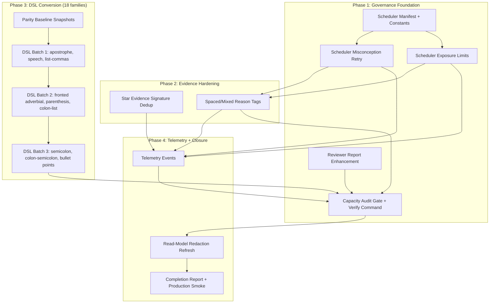

# Punctuation QG P4 — Evidence, Scheduler, Reviewer Governance and Full DSL Coverage

## Overview

Complete DSL coverage for all 25 generator families, harden scheduler behaviour (misconception retry, signature exposure limits, mixed review), strengthen Star evidence dedup so repeated generated surfaces cannot inflate mastery, deliver a production-quality reviewer report with severity classification, and add telemetry events for learning-health monitoring. Production volume remains at 192 items throughout.

---

## Problem Frame

P3 established the deterministic DSL pipeline (7 families), golden marking tests, and parity protection. However 18 families remain as hand-authored templates outside governance. The scheduler avoids immediate repeats but does not schedule misconception-aware retries or limit cross-session exposure. Star projection counts any correct attempt regardless of variant-signature dedup. The reviewer report exists but lacks severity tiers (Fail/Warning/Info) that would make it usable for non-engineer content reviewers.

P4 is a governance and maturity phase — **no production volume increase**, no runtime AI, no new reward economy.

---

## Requirements Trace

- R1. All 25 published generator families are DSL-backed with golden tests
- R2. Reviewer report supports `--reviewer-report` with Fail/Warning/Info severity classification in text and JSON
- R3. Scheduler prefers misconception-tagged sibling templates on retry
- R4. Per-signature exposure limits prevent the same generated surface repeating across sessions
- R5. Star evidence dedupes repeated variant-signature attempts for Secure/Mastery tiers
- R6. Telemetry events emitted for scheduler decisions and evidence dedup
- R7. Production runtime stays at 192 items (92 fixed + 25 families × 4)
- R8. Audit-only capacity depth 8 works across all 25 families with 0 duplicate signatures
- R9. Read-model redaction continues to block learner access to validators, rubrics, golden tests, template IDs, family IDs
- R10. Mixed/spaced review reason tags in scheduler debug output
- R11. No regression — existing passing tests, production smoke, parity baselines remain green

---

## Scope Boundaries

- Production `generatedPerFamily` stays at 4 — no volume increase
- No runtime AI generation
- No Hero Mode integration that mutates Punctuation Stars
- No cross-subject scheduler replacement
- No removal of fixed anchor items
- No large new child-facing reward economy

### Deferred to Follow-Up Work

- P5 controlled volume increase (raise to 6 or 8 per family) — based on P4 evidence
- Authenticated admin smoke test expansion — explicit limitation in completion report
- Cross-subject scheduler unification — platform phase

---

## Context & Research

### Relevant Code and Patterns

| Layer | Path |
|-------|------|
| DSL engine | `shared/punctuation/template-dsl.js` |
| DSL families (7 complete) | `shared/punctuation/dsl-families/*.js` |
| Generator/template bank | `shared/punctuation/generators.js` |
| Content manifest + families registry | `shared/punctuation/content.js` |
| Marking engine | `shared/punctuation/marking.js` |
| Scheduler | `shared/punctuation/scheduler.js` |
| Star projection | `src/subjects/punctuation/star-projection.js` |
| Worker commands (evidence derivation) | `worker/src/subjects/punctuation/commands.js` |
| Content audit script | `scripts/audit-punctuation-content.mjs` |
| Preview script | `scripts/preview-punctuation-templates.mjs` |
| Parity baseline fixture | `tests/fixtures/punctuation-qg-p3-parity-baseline.json` |

### Institutional Learnings

- **DSL-as-normaliser pattern** — characterisation-first: snapshot exact production output BEFORE conversion; the snapshot IS the regression test. `embedTemplateId: false` preserves content-hash IDs.
- **pickBySeed modulo** — for banks under 20 items, use `((seed - 1) % N + N) % N`, NOT mulberry32 first-call (which clusters for nearby seeds).
- **Star-evidence latch** — dedup must operate at the evidence-collection layer, not the persistence layer. `starHighWater` is a pure ratchet.
- **Grammar QG P5 release gate** — compose multiple audits into one `verify:` command; machine-verifiable completion report runs LIVE audits.
- **P6/P7 adversarial review** — 3+ HIGH bugs per phase caught exclusively by adversarial review on reward-algorithm code.
- **Manifest-leaf pattern** — scheduler constants belong in a leaf manifest with zero sibling imports and drift tests.

---

## Key Technical Decisions

- **Characterisation-first conversion** — each of the 18 remaining families gets a production-output fixture snapshot BEFORE DSL rewrite; the fixture IS the parity test. No batch conversion without individual snapshots.
- **Evidence dedup at projection layer, not persistence** — `projectPunctuationStars()` counts unique variant signatures; the `starHighWater` latch remains untouched.
- **Scheduler constants in leaf manifest** — exposure limits, retry windows, cooldown periods extracted to `shared/punctuation/scheduler-manifest.js` with zero sibling imports.
- **Reviewer report severity model** — Fail (blocks merge), Warning (needs reviewer decision), Info (coverage signal). Severity logic lives in the audit script, not in CI workflow YAML.
- **Reason tags on scheduler selections** — `misconception-retry`, `spaced-return`, `due-review`, `weak-skill-repair`, `mixed-review`, `retention-after-secure`, `breadth-gap`. Visible in debug/admin output only.
- **Telemetry layered, not invasive** — events emitted by the command handler after state mutation, same pattern as star-evidence events. No learner-sensitive payload.

---

## Open Questions

### Resolved During Planning

- **Is preview:punctuation-templates already wired?** Yes — package.json line 13 already has the alias. Section 3.1 is a no-op.
- **Does --reviewer-report exist?** Yes — basic implementation at line 446 of audit script. P4 enhances it with severity classification and full 11-section coverage.
- **How many families to convert?** 18 families (25 total minus 7 already DSL).
- **How many generated items at production depth?** 25 × 4 = 100 generated + 92 fixed = 192 total.

### Deferred to Implementation

- Exact slot values for each of the 18 converted families — content decisions made per-family during authoring.
- Optimal N/M values for exposure limits — initial sensible defaults (N=3 attempts, M=7 days), tunable after telemetry.
- Whether any of the 18 families produce legitimate duplicate stems that need reviewer acknowledgement annotations.

---

## High-Level Technical Design

> *This illustrates the intended approach and is directional guidance for review, not implementation specification. The implementing agent should treat it as context, not code to reproduce.*



**Evidence dedup pseudo-flow** (directional):
```
projectPunctuationStars(progress):
  for each attempt contributing to Secure/Mastery:
    if attempt.variantSignature already counted for this skill+mode:
      skip (do not count as independent evidence)
    else:
      count as independent evidence
```

---

## Implementation Units

- U1. **Reviewer Report Severity Enhancement**

**Goal:** Upgrade the existing `buildReviewerReport()` to emit Fail/Warning/Info classified findings matching the 11-section specification from the requirements.

**Requirements:** R2

**Dependencies:** None

**Files:**
- Modify: `scripts/audit-punctuation-content.mjs`
- Test: `tests/punctuation-content-audit.test.js`

**Approach:**
- Add severity tier to each finding (Fail/Warning/Info) using the classification table from requirements Section 7
- The existing `buildReviewerReport()` already covers: duplicate stems/models, per-family capacity, per-skill modes, validator coverage, template counts, signature counts, model failures, legacy families. Enhance these with severity classification
- Add NEW sections not yet implemented: runtime summary (section 1), DSL coverage ratio (section 2), golden test coverage per template (section 8), metadata/redaction risk checks (section 10), recommended reviewer actions (section 11)
- JSON output mode emits structured `{ findings: [...], summary: {...} }` with severity counts
- Text output uses emoji/colour markers per severity tier
- `--reviewer-report` does not affect exit code — keep strict audit as the CI gate

**Patterns to follow:**
- Existing `buildReviewerReport()` at line 446 of audit script
- `failureDetail()` shape for structured findings

**Test scenarios:**
- Happy path: all-green content produces Info-only report with "no actions" recommendation
- Happy path: reviewer report JSON is valid parseable JSON with expected schema
- Edge case: family with 0 DSL coverage produces Warning (early P4) or Fail (late P4 mode via `--require-all-dsl`)
- Error path: duplicate variant signature produces Fail finding
- Error path: model answer that fails marking produces Fail finding
- Error path: missing golden tests for DSL template produces Fail finding
- Edge case: duplicate stem correctly classified as Warning, not Fail
- Integration: `--reviewer-report --json` and `--reviewer-report` (text) produce consistent findings

**Verification:**
- `npm run audit:punctuation-content -- --reviewer-report` outputs 11-section report
- `npm run audit:punctuation-content -- --reviewer-report --json` outputs valid JSON with severity classification
- Existing `--strict` tests remain green

---

- U2. **Scheduler Constants Leaf Manifest**

**Goal:** Extract scheduler tuning constants (exposure limits, retry windows, cooldown periods) to a dedicated leaf manifest for drift-testing and cross-module reference.

**Requirements:** R4, R10

**Dependencies:** None

**Files:**
- Create: `shared/punctuation/scheduler-manifest.js`
- Modify: `shared/punctuation/scheduler.js`
- Test: `tests/punctuation-scheduler-manifest.test.js`

**Approach:**
- Create manifest-leaf with zero imports from sibling punctuation modules
- Export constants: `MAX_SAME_SIGNATURE_PER_SESSION`, `MAX_SAME_SIGNATURE_ACROSS_ATTEMPTS` (N=3), `MAX_SAME_SIGNATURE_DAYS` (M=7), `MISCONCEPTION_RETRY_WINDOW`, `SPACED_RETURN_MIN_DAYS`, `REASON_TAGS`
- Import into `scheduler.js` to replace inline magic numbers
- Drift test asserts constant counts and value ranges

**Patterns to follow:**
- `src/subjects/punctuation/punctuation-manifest.js` (manifest-leaf, zero sibling imports)
- P7 stabilisation contract pattern

**Test scenarios:**
- Happy path: manifest exports all expected constants with correct types
- Edge case: drift test fails if a constant is added without updating the count assertion
- Happy path: scheduler.js imports from manifest rather than inline values

**Verification:**
- `tests/punctuation-scheduler-manifest.test.js` passes
- No circular imports introduced

---

- U3. **Scheduler Misconception Retry**

**Goal:** When a child answers incorrectly and the misconception tag is known, the scheduler prefers a sibling item with the same misconception tag but different variant signature and (where possible) different template ID.

**Requirements:** R3

**Dependencies:** U2

**Files:**
- Modify: `shared/punctuation/scheduler.js`
- Test: `tests/punctuation-scheduler.test.js`

**Approach:**
- After an incorrect answer with `misconceptionTags`, build a sibling-candidate set: same skill or reward unit, same misconception tag, different `variantSignature`, prefer different `templateId`
- Rank sibling candidates by: (1) different templateId preferred, (2) different stem preferred, (3) not recently seen
- If no sibling exists, fall back to existing weak-mode selection
- Scheduler returns `reason: 'misconception-retry'` in debug output when sibling is selected

**Execution note:** Start with a failing test for the misconception-retry contract before implementing.

**Patterns to follow:**
- `weakCandidateRow()` priority/weight pattern
- `recentMissForItem()` for attempt lookback
- `recentSignatures.has()` for anti-repeat

**Test scenarios:**
- Happy path: wrong answer with known misconception schedules sibling from same skill with different signature
- Happy path: wrong fixed answer schedules generated sibling where appropriate
- Edge case: retry does not reuse same variant signature if alternatives exist
- Edge case: retry prefers different templateId over same templateId with different signature
- Error path: retry falls back gracefully when family has only 1 template (insufficient depth)
- Edge case: misconception tag not in candidate set — falls back to standard weak selection
- Integration: misconception retry respects `MAX_SAME_SIGNATURE_PER_SESSION` from manifest

**Verification:**
- `tests/punctuation-scheduler.test.js` covers all 7 scenarios above
- Debug output includes `reason: 'misconception-retry'` for qualifying selections

---

- U4. **Scheduler Per-Signature Exposure Limits**

**Goal:** Reduce repeated exposure to the same generated surface across attempts and days.

**Requirements:** R4

**Dependencies:** U2

**Files:**
- Modify: `shared/punctuation/scheduler.js`
- Test: `tests/punctuation-scheduler.test.js`

**Approach:**
- Track signature exposure from `progress.attempts` (already available)
- Enforce: same signature blocked within current session; same signature penalised if seen in last N=3 attempts; same signature avoided if seen within M=7 days AND alternatives exist
- Allow explicit repeat only in `misconception-retry` reason (short correction loop) and tag as supported/recovery evidence
- Weight reduction: multiply candidate weight by 0.01 for blocked, 0.1 for penalised, 0.3 for day-avoided

**Patterns to follow:**
- Existing `recentSignatures.has()` → `priority *= 0.18` pattern at line 285
- Expose policy constants from `scheduler-manifest.js`

**Test scenarios:**
- Happy path: same signature not selected twice in same session when alternatives exist
- Happy path: signature seen in last 3 attempts gets penalised weight
- Happy path: signature seen within 7 days gets avoided weight when alternatives exist
- Edge case: when ALL candidates are seen within 7 days, least-recently-seen is preferred (no deadlock)
- Edge case: explicit misconception-retry overrides per-session block
- Edge case: correction loop marks attempt as `recovery` evidence type
- Integration: exposure limits interact correctly with weak-mode priority weighting

**Verification:**
- Tests cover all 7 scenarios
- Existing scheduler tests remain green

---

- U5. **Star Evidence Variant-Signature Dedup**

**Goal:** Prevent the same `variantSignature` counting as multiple independent evidence events for Secure and Mastery Star tiers.

**Requirements:** R5

**Dependencies:** None

**Files:**
- Modify: `src/subjects/punctuation/star-projection.js`
- Test: `tests/punctuation-star-projection.test.js`

**Approach:**
- In the Secure and Mastery computation functions, track which `variantSignature` values have already been counted per skill+mode facet
- If an attempt's signature is already counted, skip it for independent evidence
- Two attempts from the same templateId should be treated cautiously (count at most 1 towards deep evidence per templateId per facet)
- A fixed anchor + generated transfer is stronger than two near-identical generated items — fixed items always count independently
- Dedup operates at the projection layer (`projectPunctuationStars`), NOT at the persistence layer (`starHighWater`)

**Execution note:** Add characterisation tests for current projection output before modifying, to catch unintended regressions.

**Patterns to follow:**
- `MAX_ATTEMPTS_PER_ITEM = 3` per-item cap already in star-projection
- `starHighWater` latch in `worker/src/subjects/punctuation/commands.js`

**Test scenarios:**
- Happy path: two correct attempts with same variantSignature count as 1 Secure evidence
- Happy path: two correct attempts with different signatures count as 2 Secure evidences
- Happy path: fixed item + generated item with different signatures = 2 independent evidences
- Edge case: same templateId, different signatures → counts at most 1 towards Mastery per facet
- Edge case: supported attempt does not unlock deep secure regardless of signature
- Edge case: spaced return (7+ day gap) contributes after configured interval
- Error path: release mismatch does not contribute to current release Stars
- Integration: existing star-projection-budget test still passes (no performance regression)

**Verification:**
- `tests/punctuation-star-projection.test.js` passes with new dedup assertions
- `tests/punctuation-star-projection-budget.test.js` still green
- Existing 100-star cap and epsilon guard behaviour unchanged

---

- U6. **Scheduler Spaced/Mixed Reason Tags**

**Goal:** Add reason tags to scheduler selections for debug/admin visibility and telemetry consumption.

**Requirements:** R10

**Dependencies:** U3, U4

**Files:**
- Modify: `shared/punctuation/scheduler.js`
- Modify: `shared/punctuation/scheduler-manifest.js`
- Test: `tests/punctuation-scheduler.test.js`

**Approach:**
- `selectPunctuationItem()` return shape gains `reason` field: one of `due-review`, `weak-skill-repair`, `misconception-retry`, `spaced-return`, `mixed-review`, `retention-after-secure`, `breadth-gap`, `fallback`
- Reason derived from selection path (weak_facet → weak-skill-repair, due_facet/due_item → due-review, etc.)
- Spaced-return: candidate last correct > `SPACED_RETURN_MIN_DAYS` ago and is due
- Mixed-review: candidate mode differs from last 3 selected modes in session
- Reason tags appear in scheduler debug output and in telemetry events (not in child-facing copy)

**Patterns to follow:**
- `weakCandidateRow()` source field (existing `weak_facet`, `due_item`, etc.)
- Map existing sources → public reason tags

**Test scenarios:**
- Happy path: due item returns `reason: 'due-review'`
- Happy path: weak facet returns `reason: 'weak-skill-repair'`
- Happy path: mixed mode selection returns `reason: 'mixed-review'`
- Edge case: spaced-return classified correctly when `lastCorrectAt` exceeds threshold
- Edge case: fallback reason when no specific policy matches
- Integration: reason tags do not appear in read-model (redaction test)

**Verification:**
- All scheduler selections include a `reason` field
- Existing scheduler tests updated for the new return shape

---

- U7. **DSL Conversion Parity Baseline Snapshots (18 families)**

**Goal:** Generate and commit characterisation snapshots for all 18 unconverted families at `generatedPerFamily=4` and `generatedPerFamily=8` BEFORE any conversion begins.

**Requirements:** R7, R8, R11

**Dependencies:** None

**Files:**
- Create: `tests/fixtures/punctuation-qg-p4-parity-baseline.json`
- Modify: `tests/punctuation-dsl-conversion-parity.test.js`

**Approach:**
- Run `createPunctuationGeneratedItems()` at depth 4 and depth 8 for all 18 legacy families
- Capture: item IDs, variant signatures, prompts, stems, models, validator shapes, misconception tags
- Commit as frozen fixture (same pattern as P3 baseline)
- Add parity test that asserts exact match against the baseline for unconverted families

**Execution note:** Characterisation-first — snapshot before touching implementations.

**Patterns to follow:**
- `tests/fixtures/punctuation-qg-p3-parity-baseline.json`
- P3 parity test structure in `tests/punctuation-dsl-conversion-parity.test.js`

**Test scenarios:**
- Happy path: parity test passes with current unmodified generator output at depth 4
- Happy path: parity test passes at depth 8
- Edge case: fixture includes all 18 families and no P3-already-converted families

**Verification:**
- Fixture committed and parity test green before any conversion work begins
- `npm test -- tests/punctuation-dsl-conversion-parity.test.js` passes

---

- U8. **DSL Conversion Batch 1 (6 families: apostrophe, speech, list-commas)**

**Goal:** Convert the first batch of 6 families to DSL-backed templates with full golden tests and parity proof.

**Requirements:** R1, R7, R8

**Dependencies:** U7

**Files:**
- Create: `shared/punctuation/dsl-families/apostrophe-possession-insert.js`
- Create: `shared/punctuation/dsl-families/apostrophe-mix-paragraph.js`
- Create: `shared/punctuation/dsl-families/speech-insert.js`
- Create: `shared/punctuation/dsl-families/fronted-speech-paragraph.js`
- Create: `shared/punctuation/dsl-families/list-commas-insert.js`
- Create: `shared/punctuation/dsl-families/list-commas-combine.js`
- Modify: `shared/punctuation/generators.js` (register DSL expansions)
- Modify: `tests/punctuation-golden-marking.test.js`
- Modify: `tests/punctuation-dsl-conversion-parity.test.js`

**Approach:**
- Per family: author DSL spec with slots, build function, minimum 4 golden accept/reject tests per template
- Expand with `expandDslTemplates(dsl, { embedTemplateId: false })` to preserve content-hash IDs
- Use `pickBySeed` (double-modulo) for any case-bank selection in slot values
- Provide ≥8 audit-capacity variants per family
- Parity test confirms production output at depth 4 matches committed baseline
- Golden marking test confirms all accept/reject cases pass

**Execution note:** Convert one family at a time; verify parity individually before moving to next.

**Patterns to follow:**
- `shared/punctuation/dsl-families/apostrophe-contractions-fix.js` (closest relative for apostrophe)
- Three-tier template pool: first 2 legacy, next 2 stable, remainder capacity

**Test scenarios:**
- Happy path: each converted family produces bit-exact output at depth 4 vs baseline
- Happy path: each template has ≥4 golden accept/reject cases that pass
- Happy path: depth 8 produces ≥8 unique signatures per family
- Edge case: no duplicate signatures within or across families at depth 4
- Edge case: no duplicate signatures at depth 8
- Error path: model answer for every generated item passes marking

**Verification:**
- Parity test green for all 6 families
- Golden marking test green
- `npm run audit:punctuation-content -- --strict --generated-per-family 4` passes
- `npm run audit:punctuation-content -- --strict --generated-per-family 8 --min-signatures-per-family 8` passes

---

- U9. **DSL Conversion Batch 2 (6 families: fronted adverbial, parenthesis, colon list)**

**Goal:** Convert the second batch of 6 families to DSL.

**Requirements:** R1, R7, R8

**Dependencies:** U7, U8

**Files:**
- Create: `shared/punctuation/dsl-families/fronted-adverbial-fix.js`
- Create: `shared/punctuation/dsl-families/fronted-adverbial-combine.js`
- Create: `shared/punctuation/dsl-families/parenthesis-fix.js`
- Create: `shared/punctuation/dsl-families/parenthesis-combine.js`
- Create: `shared/punctuation/dsl-families/parenthesis-speech-paragraph.js`
- Create: `shared/punctuation/dsl-families/colon-list-insert.js`
- Modify: `shared/punctuation/generators.js`
- Modify: `tests/punctuation-golden-marking.test.js`
- Modify: `tests/punctuation-dsl-conversion-parity.test.js`

**Approach:**
- Same characterisation-first, parity-proof, golden-test pattern as U8
- Slot-based composition where natural (e.g., fronted adverbials + main clauses)
- Preserve exact production output unless an intentional content change is approved and release-id updated

**Execution note:** Convert one family at a time; verify parity individually.

**Patterns to follow:**
- U8 families as immediate precedent
- Requirements Section 6 (slot-based authoring) for fronted adverbial combine

**Test scenarios:**
- Happy path: each converted family produces bit-exact output at depth 4 vs baseline
- Happy path: each template has ≥4 golden accept/reject cases
- Happy path: depth 8 produces ≥8 unique signatures per family
- Edge case: no duplicate signatures at depth 4 or 8
- Error path: all model answers pass marking

**Verification:**
- Parity and golden marking tests green for all 6 families
- Strict audit passes at both depth 4 and 8

---

- U10. **DSL Conversion Batch 3 (6 families: semicolon, colon, bullet points)**

**Goal:** Convert the final batch of 6 families to complete 25/25 DSL coverage.

**Requirements:** R1, R7, R8

**Dependencies:** U7, U9

**Files:**
- Create: `shared/punctuation/dsl-families/colon-list-combine.js`
- Create: `shared/punctuation/dsl-families/semicolon-fix.js`
- Create: `shared/punctuation/dsl-families/semicolon-combine.js`
- Create: `shared/punctuation/dsl-families/colon-semicolon-paragraph.js`
- Create: `shared/punctuation/dsl-families/bullet-points-fix.js`
- Create: `shared/punctuation/dsl-families/bullet-points-paragraph.js`
- Modify: `shared/punctuation/generators.js`
- Modify: `tests/punctuation-golden-marking.test.js`
- Modify: `tests/punctuation-dsl-conversion-parity.test.js`

**Approach:**
- Same pattern as U8/U9
- After all 18 families converted: run `--reviewer-report` and confirm `legacyFamilies: []`
- Run 30-seed deep analysis to verify minimum variety at capacity

**Execution note:** Convert one family at a time; verify parity individually.

**Patterns to follow:**
- U8/U9 as precedent
- `shared/punctuation/dsl-families/semicolon-list-fix.js` (already converted relative for semicolons)

**Test scenarios:**
- Happy path: each converted family produces bit-exact output at depth 4 vs baseline
- Happy path: each template has ≥4 golden accept/reject cases
- Happy path: depth 8 produces ≥8 unique signatures per family
- Edge case: `legacyFamilies` count in reviewer report is 0 after all conversions
- Error path: all model answers pass marking
- Integration: full 25-family audit at depth 4 and depth 8 passes

**Verification:**
- All 25 families DSL-backed
- `npm run audit:punctuation-content -- --strict --generated-per-family 4` passes (192 items)
- `npm run audit:punctuation-content -- --strict --generated-per-family 8 --min-signatures-per-family 8` passes
- Reviewer report shows `DSL coverage: 25/25`
- 0 duplicate production variant signatures

---

- U11. **Telemetry Events**

**Goal:** Emit learning-health telemetry events from the command handler for scheduler decisions and evidence dedup.

**Requirements:** R6

**Dependencies:** U3, U4, U5, U6

**Files:**
- Modify: `worker/src/subjects/punctuation/commands.js`
- Create: `shared/punctuation/telemetry-events.js`
- Test: `tests/punctuation-telemetry.test.js`

**Approach:**
- Define event names in a manifest-leaf module (`telemetry-events.js`)
- Emit after command handler mutations (same layer as `punctuation.star-evidence-updated`)
- Events: `generated_signature_exposed`, `generated_signature_repeated`, `scheduler_reason_selected`, `misconception_retry_scheduled`, `misconception_retry_passed`, `spaced_return_scheduled`, `spaced_return_passed`, `retention_after_secure_scheduled`, `retention_after_secure_passed`, `star_evidence_deduped_by_signature`, `star_evidence_deduped_by_template`
- Payloads include: familyId, skillId, reason, but NEVER raw accepted answers, validators, rubrics, or child-sensitive data

**Patterns to follow:**
- `punctuation.star-evidence-updated` event emission in commands.js
- Manifest-leaf module pattern for event name constants

**Test scenarios:**
- Happy path: scheduler selection emits `scheduler_reason_selected` with correct reason tag
- Happy path: misconception retry emits `misconception_retry_scheduled`
- Happy path: signature dedup emits `star_evidence_deduped_by_signature`
- Edge case: telemetry payload does not contain raw validators, rubrics, or accepted answers
- Edge case: repeated signature emits `generated_signature_repeated`
- Integration: event emission does not affect command handler exit behaviour

**Verification:**
- Telemetry tests pass
- Read-model redaction tests still pass (no leakage via telemetry)

---

- U12. **Capacity Audit Gate and Verify Command**

**Goal:** Compose a single `npm run verify:punctuation-qg` that proves DSL coverage, depth, collisions, answer-spec completeness, and engine behaviour in one command.

**Requirements:** R8, R11

**Dependencies:** U1, U10

**Files:**
- Create: `scripts/verify-punctuation-qg.mjs`
- Modify: `package.json`
- Test: `tests/punctuation-content-audit.test.js`

**Approach:**
- Compose: strict audit at depth 4, strict audit at depth 8, golden marking tests, parity tests, reviewer report generation, read-model redaction check
- Exit non-zero on any component failure
- Output structured summary with pass/fail per component
- Add `"verify:punctuation-qg": "node scripts/verify-punctuation-qg.mjs"` to package.json

**Patterns to follow:**
- Grammar QG P5 one-command release gate pattern
- Existing `audit:punctuation-content` composition

**Test scenarios:**
- Happy path: full verify passes with all components green
- Error path: single component failure causes overall non-zero exit
- Happy path: structured output shows pass/fail per component

**Verification:**
- `npm run verify:punctuation-qg` exits 0 on green codebase
- CI can use single command for pre-merge gate

---

- U13. **Read-Model Redaction Refresh**

**Goal:** Verify that no new P4 additions (reason tags, telemetry fields, template IDs from DSL expansion, scheduler constants) leak into the learner-facing read model.

**Requirements:** R9

**Dependencies:** U6, U10, U11

**Files:**
- Modify: `tests/punctuation-read-model-redaction.test.js`

**Approach:**
- Add assertions for new fields: `reason` tags, `templateId`, `familyId`, `variantSignature`, `misconceptionTags`, `tests`, `validator`, `rubric` in read-model output
- Verify telemetry event payloads are not mixed into learner read-model responses

**Patterns to follow:**
- Existing redaction test assertions

**Test scenarios:**
- Happy path: read-model response for learner does not contain `reason`, `templateId`, `familyId`, `misconceptionTags`, `validator`, `rubric`, `tests`
- Happy path: scheduler reason tag visible in admin/debug output
- Edge case: telemetry payload not exposed in any learner API response

**Verification:**
- `tests/punctuation-read-model-redaction.test.js` passes

---

- U14. **Completion Report and Production Smoke**

**Goal:** Produce the P4 machine-verifiable completion report and confirm production smoke passes.

**Requirements:** R7, R11

**Dependencies:** U12, U13

**Files:**
- Modify: `tests/punctuation-release-smoke.test.js` (if needed for P4 release id)
- Output: Completion report in PR description (not a committed file)

**Approach:**
- Run `npm run verify:punctuation-qg` to generate live evidence
- Completion report documents: DSL coverage (25/25), production runtime (192), capacity (292 at depth 8), 0 duplicate signatures, scheduler behaviour (misconception retry, exposure limits), evidence dedup active, telemetry events defined
- Clearly separates implemented facts from residual risks
- Notes limitation: authenticated admin smoke not available (if still true)

**Patterns to follow:**
- Grammar QG P5 machine-verifiable completion report (live audits, not saved JSON)

**Test scenarios:**
- Happy path: production smoke passes
- Happy path: verify command exits 0
- Happy path: completion report numbers match live audit output

**Verification:**
- `npm run smoke:production:punctuation` passes
- `npm run verify:punctuation-qg` exits 0
- All acceptance checklist items from requirements Section 13 confirmed

---

## System-Wide Impact

- **Interaction graph:** Star projection change (U5) affects `deriveStarEvidenceEvents()` in commands.js — evidence events may fire less often due to dedup. The `starHighWater` latch and reward display pipeline remain untouched.
- **Error propagation:** Scheduler constants manifest import failure would break `selectPunctuationItem()` — fail-fast at module load time (normal ES module behaviour).
- **State lifecycle risks:** Evidence dedup is pure-function — no persistence mutation. Scheduler exposure limits read from `progress.attempts` (already persisted by existing flow).
- **API surface parity:** Read-model response shape unchanged for learners. Admin/debug output gains `reason` field.
- **Integration coverage:** Misconception retry + exposure limits + evidence dedup interact — test combined scenarios in scheduler and star-projection tests.
- **Unchanged invariants:** `starHighWater` latch is a pure ratchet (U5 does not touch it). `GENERATED_ITEMS_PER_FAMILY = 4` in production. `createPunctuationRuntimeManifest()` output shape. All existing passing tests.

---

## Risks & Dependencies

| Risk | Mitigation |
|------|------------|
| DSL conversion changes production output silently | Characterisation baseline snapshot (U7) before any conversion; parity test catches drift |
| Evidence dedup reduces Stars for existing learners | Dedup applies to NEW attempts only; `starHighWater` latch preserves earned stars |
| Scheduler changes create item-selection deadlock | Fallback path always exists; weight reduction (0.01) not elimination (0.0); deadlock test in U4 |
| pickBySeed collision in small slot banks | Use double-modulo pattern; test 30-seed depth for each converted family |
| Reviewer report severity misclassification | Classifications from requirements table are explicit; test each severity assignment |
| 18-family conversion is large batch | Phased into 3 batches of 6; each family individually parity-tested; no big-bang |

---

## Phased Delivery

### Phase 1: Governance Foundation (U1–U4)
Reviewer report enhancement, scheduler manifest, misconception retry, exposure limits. Delivers R2, R3, R4 without touching content or projection.

### Phase 2: Evidence Hardening (U5–U6)
Star dedup and reason tags. Delivers R5, R10. Requires P1 scheduler constants.

### Phase 3: DSL Conversion (U7–U10)
Baseline snapshots then 3 batches of 6 families each. Delivers R1, R7, R8. Can proceed in parallel with P1/P2 once U7 baseline is committed.

### Phase 4: Telemetry + Closure (U11–U14)
Events, verify command, redaction refresh, completion report. Delivers R6, R9, R11. Requires all prior phases complete.

---

## Sources & References

- **Origin document:** [docs/plans/james/punctuation/questions-generator/punctuation-qg-p4.md](docs/plans/james/punctuation/questions-generator/punctuation-qg-p4.md)
- Related code: `shared/punctuation/` (core domain), `scripts/audit-punctuation-content.mjs`
- Institutional learnings: `docs/solutions/architecture-patterns/punctuation-qg-p3-dsl-authoring-time-normaliser-2026-04-28.md`, `docs/solutions/architecture-patterns/grammar-qg-p5-machine-verifiable-content-release-process-2026-04-28.md`, `docs/solutions/logic-errors/seeded-prng-index-collision-pickbyseed-2026-04-28.md`
- Related PRs: P3 = PR #552
