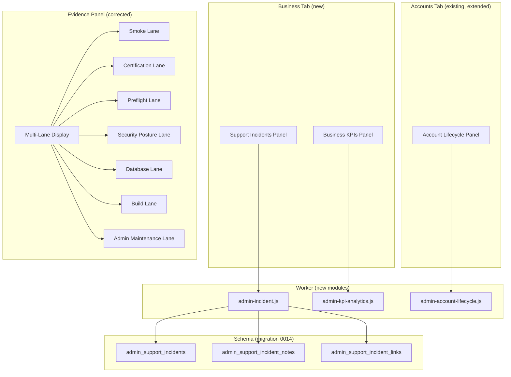

# feat: Admin Console P7 — Business Operations, Growth Analytics, and Readiness Closure

## Overview

P7 is the final numbered Admin phase. It turns the console from an operator debugging surface into a business-owner's daily operating cockpit — honest launch readiness, usage/growth analytics, support incident lifecycle, and marketing measurement — without expanding into billing, complex RBAC, or reward economy bloat.

A new **Business** tab houses KPIs, growth analytics, and support incidents. Account lifecycle extends the existing Accounts section (per origin contract Outcome D). Evidence certification is corrected to eliminate overclaiming. Documentation and security gaps from P6 are closed.

The "no regression" constraint applies throughout: every structural change starts with characterisation tests pinning current behaviour before modification.

---

## Problem Frame

P6 proved the console can display truthful evidence and manage content operations. But the business owner still cannot answer day-to-day operating questions: Is the product ready to launch? Are accounts growing or churning? Which support issues need attention? Which content areas are struggling? P7 answers these questions while preserving the safety-first, learning-first architecture.

(see origin: `docs/plans/james/admin-page/admin-page-p7.md`)

---

## Requirements Trace

- R1. Evidence lanes display certification, preflight, smoke, security, database, build, and admin-maintenance separately — no global badge that hides failures
- R2. Preflight evidence never appears in a certification lane row
- R3. Missing evidence sources render as explicit "Not available" rows, not hidden by omission
- R4. Production smoke evidence is generated in a shape the pipeline can consume
- R5. Business KPIs show real/demo split for accounts, activation, retention, conversion, and subject engagement
- R6. KPI queries are bounded (indexed windows or pre-aggregated counters) with measured query budgets
- R7. Support incidents have a small lifecycle (open → investigating → waiting_on_parent → resolved → ignored) with CAS-guarded mutations
- R8. Incidents link to account, learner, error fingerprint, error event, denial, marketing message — with safe-copy redaction
- R9. Account lifecycle panel shows commercial placeholders without implying billing automation
- R10. Marketing lifecycle analytics show tracked/not-tracked counters honestly
- R11. Content quality signals surface cross-subject summary with coverage, misconceptions, and high-wrong-rate items
- R12. Documentation matches current Admin capabilities — operating surfaces, route table, CSP inventory, evidence docs
- R13. Asset preview URLs reject unsafe protocols via allowlist; asset handler registry declares role/mutation/CAS/audit requirements
- R14. No regression: existing tests, contracts, and behaviours remain intact throughout

---

## Scope Boundaries

- No billing, subscription, or payment provider integration
- No external CRM or helpdesk integration
- No complex role hierarchy or organisation/team model
- No WebSocket/realtime dashboard or polling
- No analytics warehouse or third-party analytics migration
- No per-child marketing personalisation
- No scheduled auto-publish (manual publish semantics remain)
- No reward economy operations (Hero Coins, XP multipliers, streaks)
- No raw HTML/CSS/JS authoring in Admin
- No subject engine merge or direct Admin mutation of subject mastery
- No parent-facing incident portal

### Deferred to Follow-Up Work

- Full CSP enforcement (report-only → enforced): separate Sys-Hardening contract
- 60-learner and 100+ certification: evidence pipeline produces when ready; Admin only surfaces what exists
- External analytics export or API: future feature-by-feature work post-P7

---

## Context & Research

### Relevant Code and Patterns

- `src/platform/hubs/admin-production-evidence.js` — 9-state closed taxonomy, `EVIDENCE_STATES`, `classifyEvidenceMetric()`
- `scripts/generate-evidence-summary.mjs` — multi-source aggregator, `classifyTier()`, `TIER_KEYS`, `CERTIFICATION_TIER_KEYS`
- `src/surfaces/hubs/AdminSectionTabs.jsx` — `ADMIN_SECTION_TABS` array drives tab rendering
- `src/platform/hubs/admin-safe-copy.js` — `COPY_AUDIENCE`, `prepareSafeCopy()`, `copyToClipboard()`
- `src/platform/hubs/admin-action-classification.js` — `classifyAction()` registry-based gate
- `src/platform/hubs/admin-incident-flow.js` — sessionStorage consume-once stash for cross-section navigation
- `worker/src/app.js` — `assertAdminHubActor`, rate-limit buckets, CAS patterns, `safeSection` usage
- `worker/migrations/0010_admin_ops_console.sql` — `admin_kpi_metrics`, `account_ops_metadata`, `ops_error_events`
- `worker/migrations/0013_admin_console_p3.sql` — `ops_error_event_occurrences`, `admin_request_denials`, `admin_marketing_messages`
- `reports/capacity/latest-evidence-summary.json` — schema 3, shows preflight classified as `certified_60_learner_stretch` (Gap A)

### Institutional Learnings

- **Characterisation-first**: 8 minutes of characterisation catches 10+ regressions — non-negotiable for P7 structural changes
- **D1 CAS discipline**: `batch()` not `withTransaction` (production no-op), check `meta.changes`, include `AND row_version = ?` in every UPDATE
- **Standalone Worker modules**: new surfaces extract into `admin-<domain>.js`, accept `db` and optionally `ctx`/`actor`, no imports from `repository.js`
- **`safeSection` error boundary**: every aggregation sub-query wrapped — partial panel failure is infinitely better than 500
- **Fetch generation counter**: increment ref on each fetch, discard stale responses — critical for refresh-button analytics panels
- **Measure-first query budgets**: run actual path against fixture, observe real D1 count, pin that + 1 headroom
- **Seed test data through production code paths**: never raw SQL inserts — prevents denial-filter-class mismatches
- **`prepareSafeCopy` with correct audience**: CI gate structurally prevents bypass

### External References

- No external research needed — P7 composes entirely upon established internal patterns (6 prior Admin phases, 4 architecture-pattern learnings documents)

---

## Key Technical Decisions

- **New "Business" tab**: 6th section housing KPIs, growth analytics, and support incidents. Keeps existing tabs unchanged. Section key: `business`. Account lifecycle lives in the existing Accounts section (origin Outcome D: "Account detail should show a commercial lifecycle panel")
- **Evidence displayed in lanes, not one global badge**: Panel model returns array of lane objects (`smoke`, `capacity_certification`, `capacity_preflight`, `security_posture`, `database_posture`, `build_posture`, `admin_maintenance`). Each lane renders independently
- **Preflight detection via `evidenceKind` field, not filename**: `classifyTier()` gains an early return when `data.evidenceKind === 'preflight'` — excluded from certification lanes regardless of filename
- **Missing sources rendered from `sources` manifest**: The existing `sources` object in `latest-evidence-summary.json` already marks `found: false` entries. Panel model generates explicit `NOT_AVAILABLE` lane rows from this manifest
- **Support incident tables in migration 0014**: three new tables (`admin_support_incidents`, `admin_support_incident_notes`, `admin_support_incident_links`) with idempotent CAS mutations
- **KPI aggregation via bounded D1 queries on indexed columns**: No new pre-aggregation tables in P7 — use existing `idx_practice_sessions_updated`, `idx_event_log_created`, `idx_mutation_receipts_applied` with time-window WHERE clauses. Manual refresh only
- **Account lifecycle extends `account_ops_metadata`**: Add columns `conversion_source`, `account_age_days` (virtual/computed at read-time), `cancelled_at`, `cancellation_reason` via ALTER TABLE in migration 0014
- **No new Admin section within Content tab for content quality**: Content quality signals are already rendered by `AdminContentSection.jsx` via `admin-content-quality-signals.js` — P7 extends the existing model

---

## Open Questions

### Resolved During Planning

- **Where do Business KPIs and Incidents live?** → New "Business" tab (user decision)
- **Does P7 need a new KPI pre-aggregation table?** → No. Bounded queries on existing indexed columns suffice for P7 scale. Measure-first budgets will validate
- **How should preflight evidence be excluded from certification?** → Check `data.evidenceKind === 'preflight'` before tier classification — this field already exists and is more reliable than filename matching
- **Should incidents use mutation receipts?** → Yes. Existing `mutation_receipts` table with idempotency_key pattern. Same as account_ops_metadata CAS

### Deferred to Implementation

- Exact D1 query counts for KPI endpoints — measure after writing queries against test fixtures
- Whether `account_age_days` should be a virtual column or computed at API read-time — try read-time first
- Exact content quality signal aggregation shape per subject — depends on what each subject engine currently exposes

---

## High-Level Technical Design

> *This illustrates the intended approach and is directional guidance for review, not implementation specification. The implementing agent should treat it as context, not code to reproduce.*

---

## Implementation Units

- U1. **Evidence Generator — Preflight Exclusion and Missing-Source Rows**

**Goal:** Fix the two core evidence bugs: preflight evidence appearing in certification lanes (Gap A), and missing sources hidden by omission (Gap B).

**Requirements:** R1, R2, R3, R14

**Dependencies:** None

**Files:**
- Modify: `scripts/generate-evidence-summary.mjs`
- Modify: `src/platform/hubs/admin-production-evidence.js`
- Test: `tests/verify-capacity-evidence.test.js`
- Test: `tests/evidence-preflight-exclusion.test.js` (new)

**Approach:**
- The real bug: `classifyTier()` returns `certified_60_learner_stretch` for preflight files based on filename/data matching, so the metrics map stores the preflight result under the certification key — displacing any actual capacity-run result. Fix: add early return in `classifyTier()` for `data.evidenceKind === 'preflight'` → return new `TIER_KEYS.PREFLIGHT` value. This ensures preflight evidence gets its own metrics-map key (`preflight_only`) rather than occupying a certification slot
- Add `PREFLIGHT: 'preflight_only'` to `TIER_KEYS`
- In `buildEvidencePanelModel()`: iterate `summary.sources` manifest; for each `found: false` entry, emit a `NOT_AVAILABLE` lane row
- Add `EVIDENCE_STATES.PREFLIGHT_ONLY: 'preflight_only'` to the closed taxonomy

**Execution note:** Characterisation-first — pin current `classifyTier()` outputs for all existing evidence files before modifying behaviour.

**Patterns to follow:**
- Existing `classifyEvidenceMetric()` shape assertion pattern
- `CERTIFICATION_TIER_KEYS` set exclusion for non-certifying evidence

**Test scenarios:**
- Happy path: evidence file with `evidenceKind: 'preflight'` and `60-learner` in filename classifies as `preflight_only`, not `certified_60_learner_stretch`
- Happy path: missing source (`admin_smoke` with `found: false`) produces explicit `NOT_AVAILABLE` row in panel model
- Edge case: evidence file with `evidenceKind: 'capacity-run'` AND matching tier filename still classifies correctly as certification
- Edge case: all sources missing → all lanes show `NOT_AVAILABLE` rows (not empty panel)
- Error path: malformed evidence file (missing `evidenceKind` field) falls through to filename-based classification with existing behaviour
- Integration: regenerate evidence summary with a preflight file present → JSON output places it in `preflight_only` metric, not in certification metrics

**Verification:**
- `classifyTier('60-learner-stretch-preflight-20260428-p6.json', { evidenceKind: 'preflight' })` returns `'preflight_only'`
- Panel model built from current `latest-evidence-summary.json` shows 3 `NOT_AVAILABLE` rows for admin_smoke, bootstrap_smoke, kpi_reconcile

---

- U2. **Evidence Panel — Multi-Lane Display**

**Goal:** Replace the single-badge global evidence view with per-lane display. A failing certification and a passing smoke can appear together without the overall panel implying readiness (Gap C).

**Requirements:** R1, R3, R14

**Dependencies:** U1

**Files:**
- Modify: `src/platform/hubs/admin-production-evidence.js`
- Modify: `src/surfaces/hubs/AdminProductionEvidencePanel.jsx`
- Test: `tests/react-admin-evidence-lanes.test.js` (new)

**Approach:**
- `buildEvidencePanelModel()` returns `{ lanes: [...], generatedAt, schema }` where each lane has `{ laneId, label, rows: [...], overallState }`
- Lane IDs: `smoke`, `capacity_certification`, `capacity_preflight`, `security_posture`, `database_posture`, `build_posture`, `admin_maintenance`
- Each lane computes its own state independently — no cross-lane "best passing tier" roll-up
- Operator action copy per row: "Run admin smoke", "Run bootstrap smoke", "Rerun 30-learner certification", "CSP still report-only", "KPI reconcile evidence missing"
- React panel iterates lanes, rendering each as a collapsible section with coloured status indicator

**Execution note:** Characterisation-first — pin current `AdminProductionEvidencePanel` render output before restructuring.

**Patterns to follow:**
- `AdminPanelFrame` wrapper for each lane section
- `decidePanelFrameState()` for individual lane status derivation

**Test scenarios:**
- Happy path: failing 30-learner certification + passing admin smoke renders two independent lanes without one overriding the other
- Happy path: each lane shows correct status badge colour (red=failing, grey=not_available, amber=stale, green=passing)
- Edge case: all lanes `NOT_AVAILABLE` → no green/passing indicators anywhere; clear "Evidence collection required" message
- Edge case: single passing smoke lane + all others stale → panel does NOT show overall "ready" badge
- Integration: panel renders correctly when `latest-evidence-summary.json` has both certification failures and auxiliary passes

**Verification:**
- Visual: panel shows 7 distinct lane sections with independent status indicators
- No single global "readiness" badge exists in the rendered output

---

- U3. **Production Smoke Evidence Integration**

**Goal:** Close Gap D — make production smoke results a first-class generated/committed artefact that the evidence summary pipeline consumes.

**Requirements:** R4, R14

**Dependencies:** U1

**Files:**
- Modify: `scripts/admin-ops-production-smoke.mjs`
- Modify: `scripts/generate-evidence-summary.mjs`
- Create: `reports/admin-smoke/.gitkeep`
- Test: `tests/evidence-smoke-ingestion.test.js` (new)

**Approach:**
- Production smoke script (`admin-ops-production-smoke.mjs`) already exists. Extend output to write `reports/admin-smoke/latest.json` in a shape the evidence summary expects
- Evidence generator's `admin_smoke` source reads from `reports/admin-smoke/latest.json` (path already declared in sources manifest)
- Output shape: `{ ok: boolean, finishedAt: ISO, smokeType: 'admin'|'bootstrap', failures: [], commit: string }`
- Bootstrap smoke follows the same pattern → `reports/bootstrap-smoke/latest.json`

**Patterns to follow:**
- Existing capacity evidence file shape (`ok`, `finishedAt`, `failures`, `commit`)
- `safeReadJson` pattern in generator for graceful handling of missing files

**Test scenarios:**
- Happy path: smoke script writes `reports/admin-smoke/latest.json`; evidence generator reads it and produces a `smoke_pass` or `failing` metric row
- Edge case: smoke file missing (not yet run) → source remains `found: false`, evidence panel shows `NOT_AVAILABLE`
- Edge case: smoke file exists but is malformed JSON → generator logs warning, source remains `found: false`
- Error path: smoke script encounters network error → writes `{ ok: false, failures: ['network_error'], ... }`

**Verification:**
- After running smoke script + regenerating evidence summary, the `admin_smoke` source shows `found: true` and a metric row appears in the summary

---

- U4. **Documentation and Source-Truth Closure**

**Goal:** Close Gaps E, F, H — regenerate CSP inventory, update operating-surfaces docs, correct stale Debugging copy.

**Requirements:** R12, R14

**Dependencies:** None (can run parallel with U1-U3)

**Files:**
- Modify: `docs/operating-surfaces.md`
- Modify: `docs/operations/capacity.md`
- Modify: `src/surfaces/hubs/AdminDebuggingSection.jsx` (stale copy correction)
- Modify: `reports/csp-inline-style-inventory.json` (or equivalent)
- Test: `tests/csp-style-inventory-current.test.js` (new or modify existing)

**Approach:**
- Regenerate CSP inline-style inventory from current source and commit
- Update `docs/operating-surfaces.md` to document P6 evidence schema, content-quality-signal panel, generic asset routes, and current Admin route set
- Correct stale Debugging drawer copy that says "occurrence timeline is aggregated and per-event history is deferred" — occurrence timelines have existed since P3
- Add evidence lane semantics to capacity docs

**Patterns to follow:**
- Existing `docs/operating-surfaces.md` section structure
- Existing CSP inventory format

**Test scenarios:**
- Happy path: CSP inventory test passes — checked-in count matches source count
- Happy path: Debugging section no longer contains copy implying occurrence timelines don't exist
- Integration: `docs/operating-surfaces.md` mentions P6 evidence schema version (3) and all current Admin routes

**Verification:**
- `tests/csp-style-inventory-current.test.js` passes with regenerated inventory
- No grep hits for "aggregated" or "per-event history is deferred" in AdminDebuggingSection.jsx

---

- U5. **Business Tab — Section Shell and KPI Panel**

**Goal:** Add the new "Business" tab with KPI panel showing real/demo split, activation, retention, conversion, and subject engagement.

**Requirements:** R5, R6, R14

**Dependencies:** None (new surface, independent of evidence work)

**Files:**
- Modify: `src/surfaces/hubs/AdminSectionTabs.jsx` (add `business` tab)
- Create: `src/surfaces/hubs/AdminBusinessSection.jsx`
- Create: `src/platform/hubs/admin-business-kpi.js`
- Create: `worker/src/admin-kpi-analytics.js`
- Modify: `worker/src/app.js` (register new routes)
- Test: `tests/react-admin-business-kpi.test.js` (new)
- Test: `tests/worker-admin-kpi-analytics.test.js` (new)

**Approach:**
- `ADMIN_SECTION_TABS` gains `{ key: 'business', label: 'Business' }` entry
- `AdminBusinessSection.jsx` renders sub-panels: KPI summary and support incidents (U7 adds incident panel composition later)
- Worker route `GET /api/admin/ops/business-kpis` returns bounded analytics
- KPI shape: `{ accounts: { real, demo }, activation: { day1, day7, day30 }, retention: { newThisWeek, returnedIn7d, returnedIn30d }, conversion: { demoStarts, demoResets, demoConversions, rate7d, rate30d }, subjectEngagement: { ... }, supportFriction: { repeatedErrors, repeatedDenials, paymentHolds, suspendedAccounts, unresolvedIncidents }, generatedAt }`
- Support friction indicators: accounts with 3+ errors in 7 days, 3+ denials, payment_hold status, suspended status, and open incident count (incident count shows 0 until U6/U7 are implemented)
- All queries use time-window WHERE on indexed `updated_at`/`created_at` columns
- Demo/real split enforced at API level via `account_type` column (`COALESCE(account_type, 'real') <> 'demo'` for real, `account_type = 'demo'` for demo — matches existing `repository.js` pattern)
- Some counters may already exist in `admin_kpi_metrics` table (maintained by cron). Prefer reading existing counters where available; issue bounded time-window queries only for values not counter-tracked (activation windows, retention cohorts, subject engagement)
- Lazy-loaded on tab activation; manual refresh button with fetch-generation counter

**Execution note:** Measure-first — after writing queries, run against test fixtures to establish query budget baseline.

**Patterns to follow:**
- `AdminOverviewSection.jsx` panel rendering structure
- `safeSection` wrapping for each sub-query
- `AdminPanelFrame` for consistent freshness/error states
- `decidePanelFrameState()` for panel state derivation

**Test scenarios:**
- Happy path: API returns correctly shaped response with real/demo split when both account types exist
- Happy path: empty state (no accounts yet) returns `{ accounts: { real: 0, demo: 0 }, ... }` with "No data yet" UI text
- Edge case: demo accounts cannot inflate real conversion/retention counts (API enforces split)
- Edge case: endpoint failure → panel shows error state via `decidePanelFrameState()`
- Error path: D1 query timeout → `safeSection` returns null for that sub-query, partial data renders
- Integration: fetch-generation counter discards stale response when refresh is clicked rapidly

**Verification:**
- Query budget test passes with measured D1 query count pinned
- Real/demo split proven by test seeding both types and asserting separation

---

- U6. **Support Incident Schema and Worker Module**

**Goal:** Create the durable storage and Worker API for support incident lifecycle.

**Requirements:** R7, R8, R14

**Dependencies:** None (schema is independent; UI in U7 depends on this)

**Files:**
- Create: `worker/migrations/0014_admin_console_p7.sql`
- Create: `worker/src/admin-incident.js`
- Modify: `worker/src/app.js` (register incident routes)
- Test: `tests/worker-admin-incident-lifecycle.test.js` (new)
- Test: `tests/worker-migration-0014.test.js` (new)

**Approach:**
- Migration 0014 creates:
  - `admin_support_incidents` (id, status, title, created_by, assigned_to, account_id, learner_id, created_at, updated_at, resolved_at, row_version)
  - `admin_support_incident_notes` (id, incident_id, author_id, note_text, audience, created_at) with audience CHECK ('admin_only', 'ops_safe')
  - `admin_support_incident_links` (id, incident_id, link_type, link_target_id, created_at) with link_type CHECK ('error_event', 'error_fingerprint', 'denial', 'marketing_message', 'account', 'learner')
- Status lifecycle: `open` → `investigating` → `waiting_on_parent` → `resolved` | `ignored`
- Worker module `admin-incident.js`: standalone, accepts `db`, uses `batch()` for CAS, mutation receipt integration
- Routes: `POST /api/admin/incidents`, `PUT /api/admin/incidents/:id/status`, `POST /api/admin/incidents/:id/notes`, `POST /api/admin/incidents/:id/links`, `GET /api/admin/incidents`, `GET /api/admin/incidents/:id`
- Notes use `prepareSafeCopy` audience rules — `note_text` stored with audience classification
- Links never store full session IDs or raw tokens — only `link_target_id` references

**Patterns to follow:**
- `admin-marketing.js` standalone module shape
- `account_ops_metadata` CAS pattern with `row_version` and `batch()`
- `admin_request_denials` table shape for index design

**Test scenarios:**
- Happy path: create incident → update status to investigating → add note → link to error event → resolve
- Happy path: incident list returns paginated results filtered by status
- Edge case: status transition `open` → `resolved` is valid (skip intermediate states)
- Edge case: invalid status transition (e.g., `resolved` → `open`) returns 400
- Edge case: CAS conflict on concurrent status update returns 409
- Error path: incident creation without required fields returns 400 with field-level errors
- Error path: parent account cannot access incident endpoints (403)
- Integration: mutation receipt prevents duplicate incident creation with same idempotency key
- Integration: incident note with `ops_safe` audience does not contain raw session IDs (safe-copy test)

**Verification:**
- All status transitions tested explicitly
- Parent-role-exclusion test passes
- CAS conflict test passes with concurrent mutations

---

- U7. **Support Incident UI Panel**

**Goal:** Business tab renders incidents with create, triage, note, and link actions.

**Requirements:** R7, R8, R14

**Dependencies:** U5 (Business tab shell), U6 (incident API)

**Files:**
- Create: `src/platform/hubs/admin-incident-panel.js`
- Create: `src/surfaces/hubs/AdminIncidentPanel.jsx`
- Modify: `src/surfaces/hubs/AdminBusinessSection.jsx` (compose incident panel)
- Modify: `src/surfaces/hubs/AdminAccountsSection.jsx` (show incident count on account detail)
- Modify: `src/surfaces/hubs/AdminDebugBundlePanel.jsx` (include incident references)
- Modify: `src/platform/hubs/admin-action-classification.js` (register incident actions)
- Test: `tests/react-admin-incident-panel.test.js` (new)

**Approach:**
- Incident panel shows list with status filters, create button, detail drawer
- Create dialog: title, optional account/learner link, severity selector
- Detail view: status timeline, notes (with audience badge), linked evidence
- Account detail gains "Open incidents" count badge and recent incident list
- Debug Bundle gains admin-only `linkedIncidents` section (existing 7-section contract preserved — this is an admin-only extension, not a new section in the bundle contract)
- Actions classified: create=normal, status-change=normal, resolve=high (confirmation required)
- Cross-section navigation uses existing `admin-incident-flow.js` stash pattern

**Patterns to follow:**
- `AdminDebugBundlePanel.jsx` drawer and detail pattern
- `AdminConfirmAction.jsx` for high-severity actions
- `admin-incident-flow.js` sessionStorage consume-once stash

**Test scenarios:**
- Happy path: create incident from account detail → incident appears in Business tab list
- Happy path: add note with ops_safe audience → note visible in ops view without internal details
- Edge case: incident panel with zero incidents shows "No support incidents" empty state
- Edge case: incident linked to a now-deleted error event shows "Evidence unavailable" rather than crashing
- Error path: CAS conflict on status update shows refresh prompt (auto-refresh pattern)
- Integration: Debug Bundle includes linked incidents in admin-only section without breaking existing 7-section shape

**Verification:**
- Incident flow from account detail → create → triage → resolve works end-to-end
- Debug Bundle response shape still passes existing contract tests with new section added

---

- U8. **Account Lifecycle and Commercial Placeholders**

**Goal:** Account detail shows commercial lifecycle panel with placeholder-safe fields.

**Requirements:** R9, R14

**Dependencies:** U6 (creates migration 0014 file; U8 appends ALTER TABLE to same file)

**Files:**
- Modify: `worker/migrations/0014_admin_console_p7.sql` (append ALTER account_ops_metadata)
- Modify: `worker/src/app.js` (extend account detail response)
- Create: `src/platform/hubs/admin-account-lifecycle.js`
- Modify: `src/surfaces/hubs/AdminAccountsSection.jsx` (add lifecycle sub-panel)
- Test: `tests/react-admin-account-lifecycle.test.js` (new)

**Approach:**
- Migration 0014 adds to `account_ops_metadata`: `conversion_source TEXT`, `cancelled_at INTEGER`, `cancellation_reason TEXT`
- Account detail response extends with lifecycle fields: plan_label, trial/demo status (derived from `account_type` column), account_age (computed at read-time from `created_at`), last_active (from practice_sessions), conversion_source, payment_hold, suspension, cancellation
- UI clearly labels which fields are "operationally enforced" (payment_hold, suspended) vs "business notes only" (plan_label, conversion_source, cancellation_reason)
- `payment_hold` and `suspended` behaviour remains unchanged — existing `ops_status` CHECK constraint enforced
- No billing provider integration, no invoices

**Execution note:** Characterisation-first — pin current account detail response shape before extending.

**Patterns to follow:**
- `account_ops_metadata` CAS mutation pattern for new fields
- `AdminPanelFrame` for lifecycle sub-panel

**Test scenarios:**
- Happy path: account with all lifecycle fields populated renders correctly
- Happy path: demo account shows "Demo" status, not misleading trial/conversion labels
- Edge case: account with no ops_metadata row shows lifecycle panel with defaults (active, no notes)
- Edge case: `payment_hold` and `suspended` status display matches existing auth boundary behaviour
- Error path: last-admin protection prevents suspending the only admin account
- Integration: existing account-ops-metadata CAS tests still pass after schema extension

**Verification:**
- Existing `tests/worker-account-ops-metadata-cas.test.js` passes without modification
- Self-lockout protection test passes

---

- U9. **Marketing Lifecycle Analytics**

**Goal:** Marketing section shows lifecycle history, active message visibility, and honest tracked/not-tracked counters.

**Requirements:** R10, R14

**Dependencies:** None (extends existing Marketing section)

**Files:**
- Modify: `src/surfaces/hubs/AdminMarketingSection.jsx`
- Modify: `src/platform/hubs/admin-marketing-api.js`
- Modify: `worker/src/admin-marketing.js` (extend list response with lifecycle timestamps)
- Test: `tests/react-admin-marketing-lifecycle.test.js` (new)

**Approach:**
- Marketing list response extends with: `publishedAt`, `pausedAt`, `archivedAt`, lifecycle history array
- Active message count displayed at top: "N messages currently visible to signed-in users"
- Analytics counters section with honest labelling: "Impressions: Not tracked yet", "Dismissals: Not tracked yet"
- If future implementation adds counters, they slot into the same UI positions
- `schedulingSemantics: 'manual_publish_required'` preserved — no automation implication

**Patterns to follow:**
- Existing `admin_marketing_messages` lifecycle columns
- `AdminPanelFrame` freshness contract

**Test scenarios:**
- Happy path: marketing message with full lifecycle (draft → published → paused) shows all transition timestamps
- Happy path: "Not tracked yet" text renders for analytics counters that have no data source
- Edge case: message with only `created_at` (never published) shows "Draft" with no publish timestamp
- Edge case: broad-audience transitions remain confirmed and tested (existing tests preserved)
- Integration: existing marketing lifecycle tests pass without modification

**Verification:**
- Existing `admin_marketing_messages` contract tests pass
- "Manual publish required" semantics visible in scheduled state UI

---

- U10. **Content Quality Analytics Extension**

**Goal:** Content section surfaces cross-subject quality signals in compact summary to answer "which area needs attention first?"

**Requirements:** R11, R14

**Dependencies:** None (extends existing Content section)

**Files:**
- Modify: `src/platform/hubs/admin-content-quality-signals.js`
- Modify: `src/surfaces/hubs/AdminContentSection.jsx`
- Test: `tests/react-admin-content-quality-summary.test.js` (new)

**Approach:**
- Add a new `buildContentQualitySummary()` function (do not modify the existing `buildContentQualitySignals()` return shape — it has existing callers). The new function reduces the per-subject signal array into a cross-subject summary: coverage percentage, common misconceptions (if signal exists), high-wrong-rate items/templates, validation blockers per subject, and a "needs attention first" ranking
- Subject rows distinguish: "Good learning signal", "No data yet", "Signal unavailable", "Content validation blocked"
- Deep-links from content quality rows only when `hasRealDiagnostics` is true (existing `isClickable` pattern)
- No subject content bundles imported into admin leaf modules — platform helpers derive signals from Worker API responses
- Placeholder subjects show "Signal unavailable" not fabricated zero metrics

**Patterns to follow:**
- Existing `admin-content-quality-signals.js` signal aggregation
- `isClickable` drilldown flag derivation pattern
- `safeSection` error boundary for per-subject sub-queries

**Test scenarios:**
- Happy path: subject with quality signal data renders "Good learning signal" with correct metrics
- Happy path: subject with no data renders "No data yet" (not zero counts)
- Edge case: subject with signal endpoint failure renders "Signal unavailable" via safeSection fallback
- Edge case: placeholder subject with no signal implementation renders "Signal unavailable", not fabricated data
- Error path: no content quality signals endpoint → entire section shows graceful error state
- Integration: no subject content bundles imported (verified by existing content-free leaf test)

**Verification:**
- Tests prove unavailable signal data renders as "unavailable", not zero
- No new imports from subject content datasets in admin leaf modules

---

- U11. **Security Hardening Closure**

**Goal:** Close Gap G — asset preview URL allowlist, handler capability registry, and static checks for clipboard safety.

**Requirements:** R13, R14

**Dependencies:** None (can run parallel)

**Files:**
- Create: `src/platform/hubs/admin-asset-url-allowlist.js`
- Modify: `src/platform/hubs/admin-asset-registry.js` (integrate URL validation)
- Modify: `src/platform/hubs/admin-action-classification.js` (extend handler registry metadata)
- Test: `tests/admin-asset-preview-url-safety.test.js` (new)
- Test: `tests/ci-no-raw-clipboard-admin.test.js` (extend if needed)

**Approach:**
- `admin-asset-url-allowlist.js` exports `isAllowedPreviewUrl(url)`: rejects `javascript:`, `data:`, protocol-relative URLs (`//`), unapproved origins. Only HTTPS from allowlisted domains passes
- Asset registry integrates URL validation before rendering preview links
- Each asset handler in registry declares: role requirements, mutation class (draft/publish/restore), CAS fields, audit behaviour
- Existing CI gate `tests/ci-no-raw-clipboard-admin.test.js` remains — verify no new bypass paths introduced by P7

**Patterns to follow:**
- Existing `buildAssetRegistry()` entry shape
- Existing `classifyAction()` metadata pattern

**Test scenarios:**
- Happy path: HTTPS URL from allowlisted domain passes validation
- Edge case: `javascript:alert(1)` URL rejected
- Edge case: `data:text/html,...` URL rejected
- Edge case: protocol-relative `//evil.com/img.png` URL rejected
- Edge case: HTTP (non-HTTPS) URL from allowlisted domain rejected
- Error path: preview URL field null/undefined → no link rendered (not crash)
- Integration: asset handler registry entries all declare required metadata fields (static test)

**Verification:**
- Static/unit tests prove all unsafe protocol variants rejected
- `ci-no-raw-clipboard-admin.test.js` passes including new P7 surfaces

---

- U12. **Completion Evidence and Query Budget Pinning**

**Goal:** Produce the required P7 completion evidence: query budgets for new endpoints, evidence summary regeneration, and documentation update manifest.

**Requirements:** R6, R14

**Dependencies:** U5, U6 (endpoints must exist to measure)

**Files:**
- Modify: `tests/worker-query-budget.test.js` (add budgets for new routes)
- Modify: `scripts/generate-evidence-summary.mjs` (regenerate after all work)
- Create: `docs/plans/james/admin-page/admin-page-p7-completion-report.md`

**Approach:**
- After U5 and U6 endpoints are implemented, measure actual D1 query counts against test fixtures
- Pin measured budgets + 1 headroom into `tests/worker-query-budget.test.js`
- Regenerate `reports/capacity/latest-evidence-summary.json` with fixed preflight classification
- Produce completion report documenting: what was built, tests added, evidence state, documentation updates, any deferred items

**Patterns to follow:**
- Existing query budget test pattern (`expect(queryCount).toBeLessThanOrEqual(budget)`)
- P6 completion report format

**Test scenarios:**
- Happy path: KPI analytics route stays within pinned query budget
- Happy path: incident list route stays within pinned query budget
- Edge case: budget test fails if a new query is added without updating the budget (regression catch)

**Verification:**
- All query budget tests pass with measured values
- Evidence summary regenerated and committed

---

## System-Wide Impact

- **Interaction graph:** New Business tab integrates with existing AdminHubSurface section rendering, dirty-row guard, and tab navigation. Account lifecycle extends the existing Accounts section (not Business tab). Support incidents cross-reference error events, denials, and Debug Bundles. Evidence panel restructure changes render output shape but not data source
- **Error propagation:** All new Worker modules use `safeSection` — partial failure in one KPI sub-query or incident query does not crash the panel. Errors propagate as `null` values rendered as "unavailable"
- **State lifecycle risks:** Incident status transitions are CAS-guarded. KPI queries are read-only. Account lifecycle extensions use existing CAS pattern. No risk of partial-write corruption
- **API surface parity:** New routes follow existing rate-limit bucket pattern. No changes to parent-facing APIs. No changes to existing admin/ops routes
- **Integration coverage:** Incident→account cross-reference, incident→Debug Bundle linkage, evidence lane rendering with mixed pass/fail data — all require integration tests beyond unit tests
- **Unchanged invariants:** Existing 5 section tabs continue to render unchanged. Existing evidence data in `latest-evidence-summary.json` is not deleted — only reclassified. Existing `account_ops_metadata` CAS behaviour preserved. Marketing `manual_publish_required` semantics preserved. Debug Bundle 7-section contract preserved (incidents are admin-only extension, not a new numbered section)

---

## Risks & Dependencies

| Risk | Mitigation |
|------|------------|
| KPI queries exceed D1 performance budget at scale | Measure-first approach: pin budgets after actual measurement, not estimates. Use indexed time-window WHERE clauses exclusively |
| Migration 0014 ALTER TABLE on `account_ops_metadata` causes issues with existing data | ALTER adds nullable columns only — existing rows remain valid without backfill |
| Incident panel complexity creep toward full CRM | Scope boundary enforced: no email, no SLA, no parent portal, no external integration |
| Evidence lane refactor breaks existing panel consumers | Characterisation tests pin current output before restructuring |
| P7 scope is large (12 units) — risk of partial completion | Sequenced by dependency: evidence closure (U1-U3) and docs (U4) land first as the foundation; business features follow; completion evidence (U12) closes |

---

## Documentation / Operational Notes

- `docs/operating-surfaces.md` updated as part of U4 to document P6+P7 capabilities
- `docs/operations/capacity.md` updated to reflect lane-based evidence display and preflight exclusion
- Stale Debugging copy corrected in U4
- CSP inline-style inventory regenerated in U4
- Asset handler capability registry documented in U11
- After P7, Admin work becomes feature-by-feature maintenance — no P8 needed

---

## Sources & References

- **Origin document:** [docs/plans/james/admin-page/admin-page-p7.md](docs/plans/james/admin-page/admin-page-p7.md)
- Related plan: [docs/plans/2026-04-29-001-feat-admin-console-p6-evidence-content-ops-plan.md](docs/plans/2026-04-29-001-feat-admin-console-p6-evidence-content-ops-plan.md)
- Related learning: `docs/solutions/architecture-patterns/admin-console-p6-evidence-integrity-content-ops-maturity-2026-04-29.md`
- Related learning: `docs/solutions/architecture-patterns/admin-console-p5-operator-readiness-parallel-sdlc-2026-04-28.md`
- Related learning: `docs/solutions/architecture-patterns/admin-console-p4-hardening-truthfulness-adversarial-review-2026-04-27.md`
- Related learning: `docs/solutions/best-practices/p3-stability-capacity-multi-learner-patterns-2026-04-27.md`
