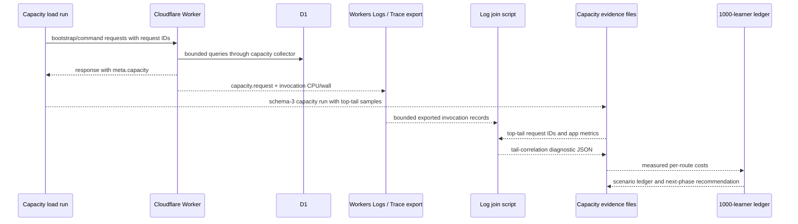

# feat: System Hardening Optimisation P1 Evidence Attribution

## Summary

Implement the P1 optimisation evidence layer by joining real Cloudflare Worker CPU/wall telemetry with the existing app capacity evidence, classifying `/api/bootstrap` tail latency, and producing a measured 1000-learner free-tier budget ledger. The plan keeps the current capacity posture honest: it may justify one narrow bootstrap query reduction, but it must not promote classroom certification unless the existing strict gate passes.

---

## Problem Frame

P6 left KS2 Mastery safer and more truthful, but still `small-pilot-provisional`: strict 30-learner evidence fails only `/api/bootstrap` P95, while command latency, payload, query count, D1 rows, 5xx, and hard capacity signals remain healthy. The next risk is a speculative optimisation that targets the wrong resource, so P1 must attribute the bootstrap tail before changing thresholds or architecture.

---

## Requirements

- R1. Preserve the post-P6 capacity truth: no 30/60/1000-learner claim without passing verifier-backed strict evidence.
- R2. Join Cloudflare Worker invocation CPU/wall telemetry to app capacity evidence by request ID without exposing CPU diagnostics in child-facing JSON.
- R3. Classify top-tail `/api/bootstrap` samples using app wall time, Cloudflare CPU/wall time, D1 duration, query count, rows read/written, response bytes, bootstrap mode, and statement breakdown.
- R4. Keep missing Cloudflare logs fail-closed as `unclassified-insufficient-logs`; absence of logs must not become a pass.
- R5. Produce a statement-level hot-path map and query-plan shortlist before any D1 index or query-shape change is proposed.
- R6. Evaluate the known duplicated `child_subject_state` active-session read as the only default code optimisation, and ship it only if evidence supports query-fanout reduction without weakening bootstrap invariants.
- R7. Produce a 30/60/100/300/1000 learner free-tier budget worksheet using measured route costs, not guesses.
- R8. Preserve bootstrap multi-learner correctness, selected learner state, sibling state, `notModified` invalidation, public redaction, and capacity metadata.
- R9. Preserve Cloudflare OAuth-safe operational scripts and the existing package-script verification/deploy path.

---

## Scope Boundaries

- No threshold relaxation inside this phase.
- No paid-tier migration argument as the solution.
- No public wording beyond `small-pilot-provisional` unless strict evidence passes.
- No learner-visible subject, Hero, reward, or dashboard expansion.
- No CSP enforcement flip or HSTS preload flip.
- No browser-owned production writes.
- No removal of sibling learner state from bootstrap to improve numbers.
- No fake CPU proxy derived from wall time.

### Deferred to Follow-Up Work

- **Bootstrap tail reduction beyond the one-statement candidate:** separate P2 plan after P1 evidence identifies the dominant resource.
- **D1 indexes or migrations:** separate PR only after query-plan notes and write-amplification cost are recorded.
- **CI-signed evidence provenance:** future hardening phase; P1 keeps verifier shape checks fail-closed but does not introduce cryptographic signing.
- **Advanced scheduling/caching/partitioning:** later optimisation phases after the 1000-learner ledger shows which quota is actually limiting.

---

## Context & Research

### Relevant Code and Patterns

- `worker/src/logger.js` contains the per-request `CapacityCollector`, closed signal allowlist, public `meta.capacity` shape, and structured `capacity.request` log emitter.
- `worker/src/d1.js` wraps D1 statements with `withCapacityCollector`, capturing query count, rows read/written, and duration without leaking SQL parameters.
- `scripts/classroom-load-test.mjs` already records request IDs, endpoint summaries, top-tail samples, D1 counts, response bytes, bootstrap modes, and threshold diagnostics.
- `scripts/lib/capacity-evidence.mjs` owns schema-3 evidence construction and certification classification.
- `scripts/verify-capacity-evidence.mjs` cross-checks committed evidence rows against `docs/operations/capacity.md` and pinned tier configs.
- `scripts/generate-evidence-summary.mjs` keeps Admin evidence certification fail-closed by requiring verified capacity-table evidence and positive `certifying: true`.
- `docs/operations/capacity-tail-latency.md` already defines the P6 diagnostic matrix and top-tail interpretation rules.
- `docs/operations/capacity.md` documents the capacity telemetry shape, sampling policy, D1 row metrics, release gates, and residual evidence risks.
- `worker/src/repository.js` owns `bootstrapBundle()`, `listPublicBootstrapActiveSessionIds()`, `listPublicBootstrapSessionRows()`, and the selected-learner-bounded bootstrap path.
- `worker/src/bootstrap-repository.js` owns bootstrap capacity constants, revision hash helpers, and `bootstrapCapacityMeta()`.
- `tests/worker-query-budget.test.js` locks hot-path query budgets, including selected-learner-bounded bootstrap and `notModified`.
- `tests/worker-bootstrap-multi-learner-regression.test.js` locks sibling subject/game state, selected learner behaviour, and `notModified` invalidation.
- `tests/capacity-evidence.test.js`, `tests/capacity-scripts.test.js`, and `tests/verify-capacity-evidence.test.js` are the natural homes for schema, script, and verifier regression coverage.

### Institutional Learnings

- The P6 contract must be treated as governing source, not a brainstorm prompt. P6 deliberately did not ship bootstrap mitigation because the immediate blocker was evidence truth and top-tail attribution.
- Capacity certification is positive proof. Filename shape, diagnostic runs, manifest evidence, stale summaries, off-origin HTTPS, alternate configs, shared-auth runs, or missing `certifying: true` must remain non-certifying.
- Existing bootstrap query and row counts are bounded; the known failure is P95 tail latency. Any optimisation must prove which resource it protects before changing the app.
- Multi-learner bootstrap is a release blocker. Optimisation must never delete writable sibling state from the first-paint envelope.

### External References

- Cloudflare Workers limits (retrieved 2026-04-29): Workers Free has 100,000 dynamic requests/day, 10 ms CPU per HTTP request, and 50 subrequests per invocation. CPU excludes time waiting on network and database calls; Workers Logs / Tail Workers / Logpush expose CPU and wall time. https://developers.cloudflare.com/workers/platform/limits/
- Cloudflare Workers pricing (retrieved 2026-04-29): Workers Free includes 100,000 requests/day and 10 ms CPU time per invocation; static asset requests are free and unlimited. https://developers.cloudflare.com/workers/platform/pricing/
- Cloudflare Workers Trace Events fields (retrieved 2026-04-29): `CPUTimeMs`, `WallTimeMs`, and `Outcome` are available in Workers Trace Events. https://developers.cloudflare.com/logs/reference/log-fields/account/workers_trace_events/
- Cloudflare Workers Logs (retrieved 2026-04-29): Workers Logs include invocation logs, custom logs, errors, retention limits, and Free-plan log-event limits. https://developers.cloudflare.com/workers/observability/logs/workers-logs/
- Cloudflare D1 limits (retrieved 2026-04-29): D1 Free has 10 databases/account, 500 MB/database, 5 GB storage/account, 50 queries per Worker invocation, 30 second max SQL query duration, and each database processes queries one at a time. https://developers.cloudflare.com/d1/platform/limits/
- Cloudflare D1 pricing (retrieved 2026-04-29): D1 Free includes 5 million rows read/day and 100,000 rows written/day. https://developers.cloudflare.com/d1/platform/pricing/
- Cloudflare D1 metrics (retrieved 2026-04-29): D1 exposes read/write query counts, rows read/written, response bytes, query latency, and per-query row counts through the binding API and analytics surfaces. https://developers.cloudflare.com/d1/observability/metrics-analytics/

---

## Key Technical Decisions

- **Plan from the P1 optimisation contract, not from a fresh product brief:** the source document already defines the product stance, non-goals, and phase route.
- **Add a diagnostic join layer outside child-facing JSON:** Cloudflare CPU/wall values belong in evidence files, operator docs, and Admin/operator-only summaries, not in bootstrap or subject command payloads.
- **Use request ID as the join key:** `scripts/classroom-load-test.mjs` already sends and captures `x-ks2-request-id`, while `capacity.request` logs carry the server request ID.
- **Keep joined CPU fields optional and non-certifying:** CPU/wall evidence strengthens diagnosis; it cannot certify a run by itself and missing logs must classify honestly.
- **Preserve schema-3 certification discipline:** any schema extension must remain backwards-compatible for existing evidence and must not bypass `verify-capacity-evidence`.
- **Prefer script-level ingestion over live dashboard coupling:** the implementation should ingest bounded Workers Logs/Tail/Logpush exports so the repo can test parsing deterministically without requiring dashboard access in CI.
- **Treat log sampling as a coverage dimension:** invocation CPU/wall records and sampled `capacity.request` statement logs may not have identical coverage. The join output must record CPU/wall coverage and statement-breakdown coverage separately rather than inferring complete attribution from partial logs.
- **Capture bootstrap phase timings only under a capacity/debug context:** phase timings are diagnostic; they should not add steady-state response weight or unbounded logging.
- **Treat the one-statement bootstrap reduction as gated:** if top-tail classification points away from query fan-out, the unit records the decision and does not ship the code change.
- **Budget model is an internal decision ledger:** 1000-learner worksheet outputs are modelling, not launch proof or marketing copy.

---

## Open Questions

### Resolved During Planning

- **Should this create a new dated plan rather than update the source draft?** Resolved by James: create a new dated plan.
- **Are Cloudflare limits current enough to plan from the draft alone?** Resolved: refreshed official Cloudflare docs on 2026-04-29 and carried the current limits into External References.
- **Should P1 introduce broad bootstrap redesign?** Resolved: no. P1 is attribution-first, with only the duplicated active-session read allowed as a gated code optimisation.
- **Should Cloudflare CPU be inferred from wall time?** Resolved: no. Worker CPU and wall time are separate platform resources and must be joined from Cloudflare telemetry.

### Deferred to Implementation

- **Exact Workers Logs/Tail/Logpush export shapes accepted by the join script:** implementation should support tested fixture variants and keep unknown fields ignored.
- **Exact bootstrap phase names:** implementation should keep the contract allowlisted and may adjust names to match existing repository helper boundaries.
- **Whether the one-statement bootstrap reduction ships:** depends on joined top-tail evidence and before/after query-budget tests.
- **Whether Admin surfaces show joined diagnostics:** optional unless operator review needs it; documentation plus evidence artefacts are sufficient for P1.

---

## High-Level Technical Design

> *This illustrates the intended approach and is directional guidance for review, not implementation specification. The implementing agent should treat it as context, not code to reproduce.*

---

## Implementation Units

- U1. **Evidence Schema and Contract**

**Goal:** Define the schema extension and operator contract for joined CPU/wall diagnostics while keeping certification fail-closed.

**Requirements:** R1, R2, R3, R4, R9

**Dependencies:** None

**Files:**
- Create: `docs/operations/capacity-cpu-d1-evidence.md`
- Modify: `scripts/lib/capacity-evidence.mjs`
- Modify: `scripts/verify-capacity-evidence.mjs`
- Modify: `docs/operations/capacity.md`
- Test: `tests/capacity-evidence.test.js`
- Test: `tests/verify-capacity-evidence.test.js`

**Approach:**
- Introduce optional diagnostic fields for Cloudflare CPU/wall, invocation outcome, join status, and tail classification under a clearly non-public diagnostics object.
- Keep all new fields optional for existing schema-3 evidence; missing fields should classify as incomplete diagnostics, not invalid legacy evidence.
- Update verification so certification still depends on existing threshold, provenance, config, and capacity-table proof, never on CPU join presence alone.
- Document accepted evidence lanes, redaction expectations, and the operator flow for collecting logs.

**Execution note:** Add schema tests before wiring producers so fail-closed behaviour is locked before any script emits the new shape.

**Patterns to follow:**
- `scripts/lib/capacity-evidence.mjs`
- `scripts/verify-capacity-evidence.mjs`
- `docs/operations/capacity.md`

**Test scenarios:**
- Happy path: schema-3 evidence with joined CPU/wall diagnostics verifies when the underlying strict gate and capacity table row already pass.
- Edge case: legacy schema-3 evidence without joined diagnostics remains readable but cannot claim CPU attribution.
- Error path: evidence with missing Cloudflare log rows records `unclassified-insufficient-logs` and cannot promote certification.
- Error path: diagnostic CPU fields under a certification-shaped filename do not bypass capacity-table verification.
- Integration: generated summary still requires positive `certifying: true` and verifier-backed capacity rows for certification-tier display.

**Verification:**
- Existing evidence still verifies.
- New diagnostics appear only in evidence/operator surfaces.
- Certification status remains unchanged unless strict evidence independently passes.

---

- U2. **Worker Log Join Tooling**

**Goal:** Add a deterministic script that joins exported Cloudflare Worker CPU/wall telemetry to capacity evidence top-tail samples by request ID.

**Requirements:** R2, R3, R4

**Dependencies:** U1

**Files:**
- Create: `scripts/join-capacity-worker-logs.mjs`
- Create: `tests/fixtures/capacity-worker-logs/`
- Test: `tests/capacity-worker-log-join.test.js`
- Modify: `docs/operations/capacity-cpu-d1-evidence.md`
- Modify: `scripts/classroom-load-test.mjs`
- Test: `tests/capacity-scripts.test.js`

**Approach:**
- Ingest a capacity evidence JSON file plus a bounded JSON/JSONL Workers Logs, Tail Workers, or Logpush export.
- Match by server request ID first, then accepted echoed client request ID only when the evidence proves the server accepted it.
- Emit `reports/capacity/evidence/<date>-p1-tail-correlation.json` style output containing only bounded route, timing, D1, and classification fields.
- Ignore unknown log fields and redact free-form messages; the script should not persist request bodies, cookies, learner names, raw SQL parameters, or child-identifying content.
- Preserve unmatched top-tail samples with explicit missing-log reasons.
- Record separate coverage fields for invocation CPU/wall join success and `capacity.request` statement-detail join success, because production statement logs may be sampled while invocation logs are still available.

**Patterns to follow:**
- `scripts/classroom-load-test.mjs`
- `scripts/production-bundle-audit.mjs`
- `scripts/lib/capacity-evidence.mjs`

**Test scenarios:**
- Happy path: top-tail bootstrap sample joins to a Workers Trace record and emits CPU/wall/outcome fields.
- Edge case: duplicate log records for the same request ID prefer the closest timestamp and record an ambiguity note.
- Edge case: unknown log fields and unrelated request IDs are ignored.
- Error path: malformed log lines are skipped with bounded warnings rather than crashing the full join.
- Error path: missing CPU or wall fields produce `unclassified-insufficient-logs`.
- Error path: CPU/wall joins but statement detail is absent due to sampling, producing a partial classification instead of pretending query-level attribution is complete.
- Integration: output can be consumed by the evidence verifier without becoming certification proof.

**Verification:**
- The join script produces a deterministic correlation file from committed fixtures.
- The output explains at least the top 10 bootstrap samples when logs are present, and names the missing-log reason when they are absent.

---

- U3. **Bootstrap Phase Timing Diagnostics**

**Goal:** Add low-overhead, allowlisted bootstrap phase timings that help distinguish Worker CPU/JSON work from D1 and platform wall-time tails.

**Requirements:** R2, R3, R8

**Dependencies:** U1

**Files:**
- Modify: `worker/src/logger.js`
- Modify: `worker/src/repository.js`
- Modify: `worker/src/bootstrap-repository.js`
- Test: `tests/worker-capacity-telemetry.test.js`
- Test: `tests/worker-bootstrap-capacity.test.js`
- Test: `tests/worker-query-budget.test.js`

**Approach:**
- Add a closed allowlist for bootstrap diagnostic phase names, with capped numeric durations only.
- Capture timings around existing bootstrap boundaries where the code already separates membership, subject state, game state, sessions, events, read model, revision hash, and response construction work.
- Keep timings disabled or omitted outside capacity/debug contexts unless the existing collector already emits structured logs for that request.
- Never include raw SQL, account IDs, learner names, answers, prompts, or payload excerpts.
- Treat `jsonSerializeMs` as optional if the current response stamping path cannot measure it without double-serialising the response.

**Patterns to follow:**
- `worker/src/logger.js` closed allowlists
- `worker/src/d1.js` low-overhead collector proxy
- `tests/worker-capacity-telemetry.test.js` redaction assertions

**Test scenarios:**
- Happy path: selected-learner-bounded bootstrap emits allowed phase names and finite durations in structured logs.
- Edge case: disabled diagnostics omit phase timings without changing public response shape.
- Error path: unrecognised phase names are rejected or dropped by the collector.
- Error path: seeded forbidden tokens in fixture data do not appear in phase timing output.
- Integration: adding phase timings does not increase bootstrap query budget beyond the existing ceiling.

**Verification:**
- Public bootstrap payload shape is unchanged except for already-approved capacity metadata.
- Structured logs provide enough phase context to classify top-tail samples without leaking private state.

---

- U4. **Statement Map and Query-Plan Shortlist**

**Goal:** Convert capacity statement telemetry into a ranked hot-path map and require query-plan notes before any index/query-shape work.

**Requirements:** R3, R5, R7

**Dependencies:** U2

**Files:**
- Create: `scripts/build-capacity-statement-map.mjs`
- Create: `tests/capacity-statement-map.test.js`
- Modify: `docs/operations/capacity-cpu-d1-evidence.md`
- Modify: `docs/operations/capacity-tail-latency.md`

**Approach:**
- Read `capacity.request` structured-log exports or joined correlation output and group bounded statement names by endpoint, phase, count, rows read/written, and duration.
- Produce a ranked JSON artefact under `reports/capacity/evidence/` for top-tail bootstrap samples.
- Add a documented shortlist format for query-plan follow-up: statement, route, observed count/duration/rows, candidate index/query-shape note, expected read reduction, and write-cost risk.
- Treat `wrangler d1 insights` and `EXPLAIN QUERY PLAN` as operator evidence sources, but keep the plan's test coverage fixture-based and deterministic.
- Mark statement-map coverage explicitly. If production `capacity.request` sampling omits top-tail statement rows, the artefact should say "insufficient statement-log coverage" and avoid query-shape recommendations from incomplete data.

**Patterns to follow:**
- `worker/src/d1.js` statement name bounding
- `docs/operations/capacity.md` D1 row metrics section
- `tests/capacity-scripts.test.js`

**Test scenarios:**
- Happy path: grouped statement map ranks statements by duration and rows read.
- Edge case: truncated statement arrays retain `statementsTruncated` and do not pretend completeness.
- Edge case: sampled-out statement logs produce a coverage warning and no index/query-shape recommendation.
- Error path: missing statement details produce a diagnostic gap instead of a query recommendation.
- Integration: query-plan shortlist entries require benefit and write-cost fields before an index recommendation is accepted.

**Verification:**
- At least the top 10 hot statements can be classified from fixture data.
- Any proposed index/query-shape work is backed by a concrete query-plan note rather than a guess.

---

- U5. **One-Statement Bootstrap Reduction Gate**

**Goal:** Evaluate and, only if justified, remove the duplicated `child_subject_state` read used for active-session ID discovery in public bootstrap.

**Requirements:** R1, R5, R6, R8

**Dependencies:** U2, U3, U4

**Files:**
- Modify: `worker/src/repository.js`
- Modify: `worker/src/bootstrap-repository.js`
- Test: `tests/worker-bootstrap-multi-learner-regression.test.js`
- Test: `tests/worker-bootstrap-capacity.test.js`
- Test: `tests/worker-query-budget.test.js`
- Test: `tests/worker-bootstrap-v2.test.js`

**Approach:**
- First record the evaluation decision from joined tail evidence and statement map output.
- If query fan-out is supported, derive active session IDs from already-loaded subject-state rows or pass a bounded digest into the session-row loader.
- Preserve public bootstrap payload shape, selected learner behaviour, sibling subject/game state, redaction, `notModified` invalidation, and active session inclusion.
- Ratchet query budget only when measured query count drops and the behavioural regression suite passes.
- If evidence points to D1/platform tail, JSON serialization, payload, or CPU rather than duplicate query fan-out, leave code unchanged and record the no-change decision in the completion report.

**Execution note:** Characterise existing active-session behaviour before refactoring the duplicated read path.

**Patterns to follow:**
- `worker/src/repository.js` selected-learner-bounded bootstrap branch
- `tests/worker-bootstrap-multi-learner-regression.test.js`
- `tests/worker-query-budget.test.js`

**Test scenarios:**
- Happy path: writable sibling learners with active sessions remain included after the active-session lookup change.
- Happy path: selected learner changes and returned session rows still match the selected learner plus bounded active/recent sessions.
- Edge case: no active sessions falls back to recent session loading without extra broad reads.
- Edge case: duplicate active session IDs across subject rows are deduplicated.
- Error path: malformed `ui_json` in one subject row does not block other valid active sessions.
- Integration: `notModified` still invalidates after sibling subject-state and game-state writes.
- Integration: bootstrap query count drops by one only if the optimisation ships; otherwise the test budget remains justified and unchanged.

**Verification:**
- No multi-learner or redaction regression.
- Strict evidence is rerun after the code change if it ships.
- Completion notes clearly separate "evaluated" from "optimisation shipped".

---

- U6. **Strict Evidence Rerun Matrix and Classification**

**Goal:** Make the P1 run matrix reproducible and ensure strict evidence, diagnostics, and manifest preflights stay separated.

**Requirements:** R1, R3, R4, R6, R9

**Dependencies:** U1, U2

**Files:**
- Modify: `docs/operations/capacity-tail-latency.md`
- Modify: `docs/operations/capacity.md`
- Modify: `scripts/classroom-load-test.mjs`
- Test: `tests/capacity-scripts.test.js`
- Test: `tests/capacity-thresholds.test.js`
- Test: `tests/verify-capacity-evidence.test.js`

**Approach:**
- Carry the source contract's T0/T1/T3/T4/T5 run matrix into repo-native operator docs without weakening the existing P6 diagnostic matrix.
- Ensure repeated strict runs use unique output paths and retain top-tail request IDs.
- Ensure manifest evidence remains diagnostic unless a separate equivalence record exists.
- Ensure joined CPU data and phase timing diagnostics enrich the run matrix but do not override threshold failures.
- Record certification eligibility reasons in evidence and summary surfaces so operators see why a run is non-certifying.

**Patterns to follow:**
- `docs/operations/capacity-tail-latency.md`
- `scripts/lib/capacity-evidence.mjs`
- `tests/capacity-thresholds.test.js`

**Test scenarios:**
- Happy path: strict 30-shaped evidence with passing thresholds remains certification-eligible only when all existing P6 gates pass.
- Edge case: repeated strict runs produce distinct evidence metadata and do not overwrite earlier failures.
- Error path: manifest preflight with passing metrics remains non-certifying without equivalence policy.
- Error path: joined CPU diagnostics do not mask bootstrap P95 threshold violations.
- Integration: Admin evidence summary continues to show failed/stale/non-certifying states accurately.

**Verification:**
- Operators can run the P1 matrix and understand which artefacts are certifying versus diagnostic.
- No public capacity wording changes unless strict evidence passes.

---

- U7. **1000-Learner Free-Tier Budget Ledger**

**Goal:** Build a measured budget worksheet for 30/60/100/300/1000 learner scenarios using route costs from evidence artefacts.

**Requirements:** R1, R3, R7

**Dependencies:** U2, U4, U6

**Files:**
- Create: `scripts/build-capacity-budget-ledger.mjs`
- Create: `docs/operations/capacity-1000-learner-free-tier-budget.md`
- Create: `reports/capacity/latest-1000-learner-budget.json`
- Test: `tests/capacity-budget-ledger.test.js`
- Modify: `docs/operations/capacity.md`
- Modify: `docs/operations/capacity-cpu-d1-evidence.md`

**Approach:**
- Read measured route summaries from evidence files and produce optimistic, expected, and pessimistic scenarios.
- Model dynamic Worker requests, D1 rows read, D1 rows written, Worker CPU where joined, response bytes, retry/backoff factor, parent/admin reads, and worst 15-minute burst shape.
- Use current Cloudflare Free limits as documented references, with explicit retrieval date.
- Keep the authoritative human-readable worksheet in `docs/operations/` so it is tracked; use `reports/capacity/latest-1000-learner-budget.json` for generated machine-readable inputs because `latest-*.json` is the tracked reports pattern.
- Keep amber/red thresholds internal to the ledger: 60% daily quota as first amber, 80% as red unless owner explicitly accepts degraded mode.
- Mark the worksheet as modelling only, not production evidence or certification.

**Patterns to follow:**
- `reports/capacity/latest-evidence-summary.json`
- `docs/operations/capacity.md`
- `scripts/verify-capacity-evidence.mjs`

**Test scenarios:**
- Happy path: ledger calculates per-scenario Worker request, D1 read, and D1 write totals from fixture route costs.
- Edge case: missing CPU join data leaves CPU judgement as unknown while preserving D1/request modelling.
- Error path: stale or diagnostic evidence is marked as modelling input and cannot become certification.
- Error path: unsupported Cloudflare limit values fail the ledger build rather than silently using zero.
- Integration: ledger output states which quota each recommended Phase 2 path protects.

**Verification:**
- The ledger names the likely free-tier bottleneck candidates with evidence-backed inputs.
- 1000-learner statements remain internal modelling language, not launch claims.

---

- U8. **Decision Record and Completion Handoff**

**Goal:** Produce the P1 completion report and next-phase recommendation from the evidence, not from optimism.

**Requirements:** R1, R3, R6, R7, R9

**Dependencies:** U1, U2, U3, U4, U5, U6, U7

**Files:**
- Create: `docs/plans/james/sys-hardening/sys-hardening-optimisation-p1-completion-report.md`
- Modify: `docs/plans/james/sys-hardening/A/sys-hardening-optimisation-p1.md`
- Modify: `docs/operations/capacity.md`
- Test: `tests/verify-capacity-evidence.test.js`

**Approach:**
- Complete the source draft by linking to the dated implementation plan, evidence artefacts, budget ledger, and decision record.
- Use the source contract's decision-record template, including certification status, bootstrap tail classification, one-statement decision, budget judgement, and recommended Phase 2 path.
- Separate "P1 complete" from "capacity promoted".
- If the one-statement optimisation does not ship, state why and preserve the future path.

**Patterns to follow:**
- `docs/plans/james/sys-hardening/sys-hardening-p6-completion-report.md`
- `docs/operations/capacity.md`
- `docs/operations/capacity-tail-latency.md`

**Test scenarios:**
- Test expectation: none -- completion report writing is documentation-only, with evidence verifier coverage handled by U1/U6/U7.

**Verification:**
- A next-session agent can tell exactly whether P2 should target bootstrap query consolidation, D1 tail variance, JSON/payload reduction, command write economics, or no code change yet.
- The report names all evidence files and keeps public wording honest.

---

## System-Wide Impact

- **Interaction graph:** Load scripts, Worker structured logs, evidence verifier, Admin evidence summary, bootstrap repository, D1 wrapper, and operator docs all touch the same capacity truth chain.
- **Error propagation:** Missing, stale, malformed, off-origin, diagnostic, manifest, or unjoined evidence must propagate as explicit non-certifying reasons rather than generic failure.
- **State lifecycle risks:** Evidence files and summary files can drift; verification must continue to cross-check docs table rows, config hashes, and evidence metadata.
- **API surface parity:** New diagnostics must not alter child-facing bootstrap, subject command, Parent Hub, or Admin API contracts unless explicitly operator-only.
- **Integration coverage:** Unit tests prove parser/verifier behaviour; fixture-based script tests prove deterministic joins; production evidence remains an operational gate, not a planning-time fact.
- **Unchanged invariants:** Worker-owned runtime authority, multi-learner bootstrap, selected learner correctness, sibling state visibility, `notModified` invalidation, redaction, OAuth-safe Wrangler scripts, and schema-3 certification discipline all remain unchanged.

---

## Risks & Dependencies

| Risk | Mitigation |
|------|------------|
| Cloudflare log export shape differs by source | Fixture adapters for Workers Logs, Tail Workers, and Logpush-style JSON; unknown fields ignored |
| Joined CPU data becomes false certification | Keep CPU fields diagnostic-only; verifier still requires strict thresholds and capacity-table proof |
| Phase timings add overhead or leak data | Closed allowlist, bounded numeric fields, capacity/debug context only, redaction tests |
| Log sampling hides statement-level detail for top-tail requests | Track CPU/wall coverage separately from statement-log coverage; no query-shape recommendation from incomplete statement samples |
| One-statement optimisation breaks active sessions | Characterisation-first tests for active sessions, sibling learners, selected learner changes, and notModified |
| D1 index recommendations become speculative | Require statement map plus query-plan/write-cost note before any migration |
| 1000-learner ledger is misread as launch claim | Label as modelling and keep certification wording separate |
| Evidence artefacts are hand-authored or self-consistent but fake | Preserve current verifier checks; defer CI-signed provenance to follow-up |

---

## Documentation / Operational Notes

- Update `docs/operations/capacity-cpu-d1-evidence.md` as the operator guide for log export, join, classification, redaction, and missing-log handling.
- Update `docs/operations/capacity-tail-latency.md` so P1 matrix language aligns with existing P6 diagnostic policy.
- Update `docs/operations/capacity.md` only with evidence rows that have real artefacts and verifier-backed interpretation.
- Keep production work routed through package scripts and `scripts/wrangler-oauth.mjs`; do not introduce raw Wrangler deployment or remote-D1 commands.
- Production evidence collection must be explicit and operator-confirmed; this plan does not authorise unbounded load tests.

---

## Sources & References

- **Origin document:** [docs/plans/james/sys-hardening/A/sys-hardening-optimisation-p1.md](docs/plans/james/sys-hardening/A/sys-hardening-optimisation-p1.md)
- **Architecture contract:** [docs/plans/james/sys-hardening/sys-hardening-A-architecture-product.md](docs/plans/james/sys-hardening/sys-hardening-A-architecture-product.md)
- **Engineering contract:** [docs/plans/james/sys-hardening/sys-hardening-B-engineering-system-code.md](docs/plans/james/sys-hardening/sys-hardening-B-engineering-system-code.md)
- **P6 completion report:** [docs/plans/james/sys-hardening/sys-hardening-p6-completion-report.md](docs/plans/james/sys-hardening/sys-hardening-p6-completion-report.md)
- Related code: [worker/src/logger.js](worker/src/logger.js)
- Related code: [worker/src/d1.js](worker/src/d1.js)
- Related code: [worker/src/repository.js](worker/src/repository.js)
- Related code: [scripts/classroom-load-test.mjs](scripts/classroom-load-test.mjs)
- Related code: [scripts/lib/capacity-evidence.mjs](scripts/lib/capacity-evidence.mjs)
- Related docs: [docs/operations/capacity.md](docs/operations/capacity.md)
- Related docs: [docs/operations/capacity-tail-latency.md](docs/operations/capacity-tail-latency.md)
- External docs: [Cloudflare Workers limits](https://developers.cloudflare.com/workers/platform/limits/)
- External docs: [Cloudflare Workers pricing](https://developers.cloudflare.com/workers/platform/pricing/)
- External docs: [Cloudflare Workers Trace Events](https://developers.cloudflare.com/logs/reference/log-fields/account/workers_trace_events/)
- External docs: [Cloudflare Workers Logs](https://developers.cloudflare.com/workers/observability/logs/workers-logs/)
- External docs: [Cloudflare D1 limits](https://developers.cloudflare.com/d1/platform/limits/)
- External docs: [Cloudflare D1 pricing](https://developers.cloudflare.com/d1/platform/pricing/)
- External docs: [Cloudflare D1 metrics and analytics](https://developers.cloudflare.com/d1/observability/metrics-analytics/)
