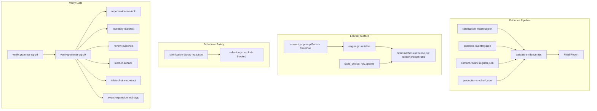

# Grammar QG P9 — Evidence-Locked Production Certification

## Overview

Turn Grammar QG from a strong automated-certification story into an evidence-locked production certification. Every claim in reports, inventories, and reviews must be reproducible from committed code and attached evidence. Zero regression: all P8 gates (2,518 oracle tests, 78 templates, 18 concepts) remain passing throughout.

---

## Problem Frame

P8 delivered substantial certification infrastructure (oracle suites, governance checks, review registers, UX audits). However, the committed evidence has gaps between claims and proof:

- P8 final report has placeholder frontmatter (`pending-branch-pr`, `pending-after-merge`)
- Inventory covers 234 items (3 seeds) while report claims 2,340 items (30 seeds)
- Review register is auto-generated with generic "adult review confirmed" notes
- Learner UI renders plain `promptText` — cues like "the underlined word" are lost
- `table_choice` uses global columns for heterogeneous mixed-transfer tables
- Explanation-event expansion doesn't check real template tags (`explain`, `questionType: explain`)
- Post-deploy smoke has no attached evidence file

P9 closes every gap so "certified" means the repo contains the proof.

---

## Requirements Trace

- R1. Report frontmatter must contain real PR/commit references (no placeholders)
- R2. Inventory item count must match the certification manifest's declared seed window
- R3. Adult review evidence must demonstrate real judgement (not generator defaults)
- R4. Learner-visible prompt cues must be structurally rendered (not lost in plain text)
- R5. Table choice must support row-specific options for heterogeneous tables
- R6. Explanation-event expansion must recognise real template tags
- R7. Oracle seed windows must be honestly reported per family
- R8. Render-level tests must cover all 6 input families
- R9. Post-deploy certification requires an attached evidence file
- R10. Blocked templates must be excluded from learner scheduling
- R11. Final report must be machine-checkable with no claim exceeding evidence
- R12. Zero regression: all P7+P8 verify gates must continue to pass

---

## Scope Boundaries

- No Grammar scoring, mastery, Stars, Mega, Hero Mode, Concordium, or reward changes
- No template count growth (denominator stays at 78 unless a blocked template is replaced)
- No raw HTML rendering from content — emphasis via safe structured prompt contract only
- No changes to Spelling, Punctuation, Arithmetic, Reading, or Reasoning subjects
- No AI-generated question content

### Deferred to Follow-Up Work

- Post-deploy production smoke execution: separate operational step after deployment
- Full assistive-technology manual testing: will gate as S2 limitation if not completed
- Mobile visual regression testing with real device farm

---

## Context & Research

### Relevant Code and Patterns

- `scripts/validate-grammar-qg-completion-report.mjs` — existing frontmatter + metric validation (validateReleaseFrontmatter, COMPOUND_PLACEHOLDER_RE)
- `scripts/generate-grammar-qg-quality-inventory.mjs` — buildInventory(seeds) → {items, redactedItems, summary}
- `scripts/generate-grammar-qg-review-register.mjs` — auto-generates "accepted" entries with generic notes
- `scripts/grammar-qg-expand-events.mjs` — expandEvent(event), checks `tags.includes('explanation')` only
- `worker/src/subjects/grammar/content.js` — GRAMMAR_TEMPLATE_METADATA (78 templates), createGrammarQuestion, serialiseGrammarQuestion
- `worker/src/subjects/grammar/engine.js` — serialisation contract, response normalisation
- `worker/src/subjects/grammar/selection.js` — buildGrammarMiniPack, buildGrammarPracticeQueue (no blocklist yet)
- `src/subjects/grammar/components/GrammarSessionScene.jsx` — 6 input-type renderers, table_choice uses global columns
- `reports/grammar/grammar-qg-p8-content-review-register.json` — all entries have `severity: null`, `notes: "Automated oracle pass - adult review confirmed"`
- `reports/grammar/grammar-qg-p8-question-inventory.json` — 264 KB, items with `reviewStatus` field

### Institutional Learnings

- P8 governance test already exports `validateReleaseFrontmatter()` — P9 extends rather than replaces
- `verify:grammar-qg-p8` chains `verify:grammar-qg-p7` first — P9 must chain P8 to maintain cumulative gate
- Content release ID bump only when learner-facing data changes (from P6 policy)
- DSL-as-normaliser pattern: authoring-time expansion to flat arrays, zero runtime change

---

## Key Technical Decisions

- **Structured prompt contract via `promptParts`**: Additive field alongside existing `promptText` for backwards compatibility. React renderer prefers `promptParts` when present. No raw HTML injection.
- **Row-specific table options**: Extend existing `rows` array with optional `options` per row; fall back to global `columns` when absent. No migration of existing global-column tables.
- **Certification manifest as single source of truth**: All evidence claims (seed windows, item counts, oracle families) validated against one committed JSON manifest.
- **Blocklist via certification status map**: Scheduler reads a committed JSON map; `blocked` status excludes from all learner schedulers. Debug/review mode can override with explicit flag.
- **Review register split**: Generator produces `draft` entries; `finalise` mode validates reviewer evidence before writing accepted/rejected decisions. Auto-generated drafts cannot pass certification.
- **Content release ID**: Bump to `grammar-qg-p9-2026-04-29` because U3 changes learner-visible question serialisation (adds `promptParts`, `focusCue`).

---

## Open Questions

### Resolved During Planning

- **Should heterogeneous tables migrate to `multi` fields?** No — extend `table_choice` with row-specific options. Simpler change, preserves existing table UX, and the 5 table_choice templates already render well in the table layout.
- **30 seeds or 60 seeds for certification window?** 30 seeds (matching P8's quality audit). The spec allows either; 30 keeps regeneration fast and matches existing oracle coverage.
- **Should blocked templates be hard-excluded or soft-deprioritised?** Hard-excluded from all learner scheduling (smart practice, mini-set, trouble drill, Hero-launched Grammar). Only visible in debug/review mode with explicit flag.

### Deferred to Implementation

- Exact screen-reader text phrasing for each cue type — depends on rendering test feedback
- Whether iOS smart-punctuation normalisation needs a shared utility or can inline in answer evaluation
- Which specific templates are blocked vs approved — determined by U9 audit results

---

## High-Level Technical Design

> *This illustrates the intended approach and is directional guidance for review, not implementation specification. The implementing agent should treat it as context, not code to reproduce.*

---

## Implementation Units

- U1. **P8 truth reconciliation and report governance**

**Goal:** Fix the P8 report so its claims match committed evidence before building new P9 work on top.

**Requirements:** R1, R12

**Dependencies:** None

**Files:**
- Modify: `docs/plans/james/grammar/questions-generator/grammar-qg-p8-final-completion-report-2026-04-29.md`
- Modify: `scripts/validate-grammar-qg-completion-report.mjs`
- Create: `tests/grammar-qg-p9-report-evidence-lock.test.js`

**Approach:**
- Amend P8 final report frontmatter: replace `pending-branch-pr` with actual PR ref(s), replace `pending-after-merge` with actual commit SHAs (from git log)
- Add a P8 validation addendum section recording the gap between claimed and actual evidence
- Update `validateReleaseFrontmatter()` to call itself in the CLI path (currently only exported, not invoked from CLI)
- Extend compound placeholder rejection to catch `*-pending`, `todo-*`, `tbd-*`, `unknown-*`
- Add test proving the old P8 placeholder-bearing report would fail validation

**Patterns to follow:**
- `tests/grammar-qg-p8-governance.test.js` — existing placeholder rejection tests
- `COMPOUND_PLACEHOLDER_RE` pattern in `validate-grammar-qg-completion-report.mjs`

**Test scenarios:**
- Happy path: A report with real PR refs and commit SHAs passes `validateReleaseFrontmatter()`
- Happy path: CLI invocation runs frontmatter validation before returning PASS
- Edge case: Report claiming `CERTIFIED_POST_DEPLOY` without smoke evidence file fails
- Error path: `pending-branch-pr` in implementation_prs → validation failure
- Error path: `pending-after-merge` in final_content_release_commit → validation failure
- Error path: `todo-report-sha` in final_report_commit → validation failure
- Integration: Running `verify:grammar-qg-p8` still passes after P8 report is corrected (R12)

**Verification:**
- `node scripts/validate-grammar-qg-completion-report.mjs <corrected-p8-report>` returns PASS
- P8 governance tests still pass unchanged
- New P9 report evidence lock tests pass

---

- U2. **Evidence-locked inventory manifest**

**Goal:** Create a single certification manifest that declares what evidence exists and validate all claims against it.

**Requirements:** R2, R7, R11

**Dependencies:** U1

**Files:**
- Create: `scripts/generate-grammar-qg-certification-manifest.mjs`
- Create: `reports/grammar/grammar-qg-p9-certification-manifest.json`
- Create: `reports/grammar/grammar-qg-p9-question-inventory.json`
- Create: `reports/grammar/grammar-qg-p9-question-inventory-redacted.md`
- Create: `tests/grammar-qg-p9-inventory-manifest.test.js`
- Modify: `scripts/generate-grammar-qg-quality-inventory.mjs`

**Approach:**
- Manifest schema: contentReleaseId, templateDenominator, seedWindowPerEvidenceType (object mapping oracle family → seed range), generatedItemCount, expectedOutputPaths, generatorScriptVersion (content hash of generator), generationCommand, generatedAt, answerInternalsIncluded
- Regenerate inventory for 78 templates × 30 seeds = 2,340 items
- Replace all `reviewStatus: pending` with `draft_only` (certification artefacts use accepted/watchlist/rejected; draft artefacts clearly excluded)
- Inventory generator emits manifest-aware summary that cross-references the manifest

**Patterns to follow:**
- `scripts/generate-grammar-qg-quality-inventory.mjs` — existing buildInventory(seeds) pattern
- `reports/grammar/grammar-qg-p8-question-inventory.json` — existing item schema

**Test scenarios:**
- Happy path: Committed inventory JSON item count equals manifest's declared count (2,340)
- Happy path: Markdown summary matches JSON summary totals
- Happy path: Redacted inventory contains no answerSpec internals (golden, nearMiss, accepted, variantSignature, generatorFamilyId, solutionLines)
- Edge case: A stale 3-seed inventory (234 items) fails validation against 30-seed manifest claim
- Error path: Manifest claims 60-seed window but inventory only has 30 seeds → test failure
- Error path: Missing expectedOutputPaths entry → manifest schema validation fails
- Integration: Each oracle family's seed window in manifest matches the seed range declared (cross-reference in U6)

**Verification:**
- `tests/grammar-qg-p9-inventory-manifest.test.js` passes with committed artefacts
- Manifest JSON is parseable and schema-valid
- No `reviewStatus: pending` in certification inventory

---

- U3. **Learner-visible prompt cue contract**

**Goal:** Ensure children can see every visual cue needed to answer questions (underlines, bold, target words) through a safe structured prompt representation.

**Requirements:** R4, R8, R12

**Dependencies:** U1

**Files:**
- Modify: `worker/src/subjects/grammar/content.js`
- Modify: `worker/src/subjects/grammar/engine.js`
- Modify: `src/subjects/grammar/components/GrammarSessionScene.jsx`
- Create: `tests/grammar-qg-p9-learner-surface.test.js`

**Approach:**
- Add `promptParts` (array of PromptPart objects) and `focusCue` to question objects where templates use visual cues
- PromptPart kinds: `text`, `emphasis`, `underline`, `lineBreak`, `sentence`
- focusCue: `{ type: 'underline'|'bold'|'quoted-word'|'target-sentence', text, occurrence? }`
- Add `screenReaderPromptText` and `readAloudText` for cue-heavy prompts
- Serialisation adds these fields to client payload (no answerSpec leak — these are prompt-level)
- React renderer checks for `promptParts` first; falls back to `promptText` for backwards compat
- Renderer uses semantic markup (`<em>`, `<mark>`, ``) — never dangerouslySetInnerHTML
- Templates to cover: `word_class_underlined_choice`, any prompt with "underlined"/"bold"/"circle"/"brackets"/"sentence below" in promptText, direct-speech punctuation templates

**Execution note:** Content release ID bumps to `grammar-qg-p9-2026-04-29` when this unit lands, because it changes learner-visible serialisation.

**Patterns to follow:**
- Existing `stemHtml` field in content.js question objects
- `serialiseGrammarQuestion()` in engine.js — add fields alongside existing contract
- React component's input-type dispatch pattern in GrammarSessionScene.jsx

**Test scenarios:**
- Happy path: `word_class_underlined_choice` template renders with target word visually underlined (DOM test)
- Happy path: Screen-reader text announces "Target word: [word]" for underline-cue templates
- Happy path: Read-aloud text includes the cue word
- Edge case: Template with `promptParts` present → renderer uses structured parts (not plain text)
- Edge case: Template without `promptParts` → falls back to `promptText` rendering (backwards compat)
- Error path: Prompt says "underlined" in promptText but has no `focusCue` or `promptParts` cue → audit fails
- Integration: Serialisation includes promptParts/focusCue in client payload without leaking answerSpec
- Integration: All existing P8 UX support tests still pass (no regression in input-type coverage)

**Verification:**
- DOM render tests prove visual cues are present for cue-heavy templates
- Accessibility audit of cue templates passes
- `verify:grammar-qg-p8` still passes (backwards-compatible serialisation)

---

- U4. **Row-specific table choices and heterogeneous transfer safety**

**Goal:** Make table_choice safe for heterogeneous mixed-transfer tables where each row needs different options.

**Requirements:** R5, R8, R12

**Dependencies:** U1

**Files:**
- Modify: `worker/src/subjects/grammar/content.js`
- Modify: `worker/src/subjects/grammar/engine.js`
- Modify: `src/subjects/grammar/components/GrammarSessionScene.jsx`
- Create: `tests/grammar-qg-p9-table-choice-contract.test.js`

**Approach:**
- Extend `rows` array items with optional `options: string[]` — when present, that row renders only those options instead of global `columns`
- React TableChoice: check `row.options`; render row-specific radio buttons when present; fall back to global columns
- Response normalisation: validate each row's answer against `row.options` when defined (reject values not in that row's allowed set)
- Add `ariaLabel` per row for accessibility
- Audit templates: `qg_p4_word_class_noun_phrase_transfer`, `qg_p4_voice_roles_transfer`, all table_choice mixed-transfer templates
- Mobile: add horizontal-overflow or stacked-row CSS for narrow viewports

**Patterns to follow:**
- Existing TableChoice component in GrammarSessionScene.jsx (radio per row × columns)
- `evaluateGrammarQuestion()` response handling in engine.js

**Test scenarios:**
- Happy path: Heterogeneous table renders only relevant options per row
- Happy path: Global-column tables still work unchanged (backwards compat)
- Happy path: Valid row-specific submission accepted during normalisation
- Edge case: Row with `options` defined but answer from global columns → rejected
- Edge case: Mixed table where some rows have `options` and others use global columns
- Error path: Invalid row-specific submission (value not in row.options) → normalisation rejects
- Integration: Mobile/narrow-width rendering doesn't overflow (CSS contract or Playwright)
- Integration: P8 oracle tests for table_choice templates still pass (R12)

**Verification:**
- Table-choice contract tests pass for all mixed-transfer templates
- Existing P8 table_choice oracle tests pass without modification
- No irrelevant options shown in heterogeneous table rows

---

- U5. **Real-template explanation analytics repair**

**Goal:** Fix explanation-event expansion to recognise real template tags, not just synthetic ones.

**Requirements:** R6, R12

**Dependencies:** U1

**Files:**
- Modify: `scripts/grammar-qg-expand-events.mjs`
- Create: `tests/grammar-qg-p9-event-expansion-real-tags.test.js`

**Approach:**
- Change `isExplanation` derivation to: `tags.includes('explain') || tags.includes('explanation') || event.questionType === 'explain'`
- Add a fixture built from a real explanation template (not synthetic)
- Confirm health-report and calibration outputs don't undercount explanation work
- Verify mixed-transfer detection remains unchanged

**Patterns to follow:**
- Existing `expandEvent()` in `scripts/grammar-qg-expand-events.mjs`
- Existing P7 event-expansion tests

**Test scenarios:**
- Happy path: Event with `tags: ['explain']` expands with `isExplanation: true`
- Happy path: Event with `questionType: 'explain'` expands with `isExplanation: true`
- Happy path: Event with `tags: ['explanation']` still works (backwards compat)
- Edge case: Event with both `tags: ['explain', 'mixed-transfer']` — both flags set correctly
- Error path: Old implementation (only checking `tags.includes('explanation')`) would miss `explain` tag → test fails on old code
- Integration: All existing P7 event-expansion tests still pass
- Integration: Mixed-transfer detection unaffected by explanation fix

**Verification:**
- New test file passes on new implementation, would fail on old
- `npm run verify:grammar-qg-p8` still passes (no P7/P8 regression)

---

- U6. **Oracle seed-window alignment**

**Goal:** Make reports describe exactly what the oracles did — no vague claims about seed coverage.

**Requirements:** R7, R11, R12

**Dependencies:** U2 (needs manifest)

**Files:**
- Modify: `scripts/validate-grammar-qg-completion-report.mjs`
- Modify: `reports/grammar/grammar-qg-p9-certification-manifest.json`
- Create: `scripts/validate-grammar-qg-certification-evidence.mjs`

**Approach:**
- Record per-oracle-family seed windows in manifest: selected-response (1–15), constructed-response (1–10), manual-review (1–5), redaction (all seeds), content-quality audit (1–30)
- Write a report validator that rejects "all 78 templates × 30 seeds pass automated oracles" unless every oracle family actually uses that window
- Keep the content-quality audit over 30 seeds (this is the broadest window)
- Decision: keep mixed windows with honest reporting (expanding all to 30 would be a P10 goal)

**Patterns to follow:**
- Existing `extractDenominatorTable()` and metric validation in `validate-grammar-qg-completion-report.mjs`
- P8 oracle seed ranges: selected 1–15, constructed 1–10, manual 1–5

**Test scenarios:**
- Happy path: Report claiming per-family windows matches manifest → passes
- Happy path: Each oracle family (selected, constructed, manual, redaction) declares its window
- Error path: Report claims "all 78 × 30 seeds pass oracles" but selected-response only uses 1–15 → rejected
- Error path: Report claims 2,518 oracle tests but test suite reproduces different count → rejected
- Edge case: Report honestly says "2,518 tests across mixed windows" with per-family breakdown → passes
- Integration: Manifest seedWindowPerEvidenceType matches actual test file seed ranges

**Verification:**
- Evidence validator catches over-claiming seed windows
- Manifest oracle windows are accurate and complete
- P8 oracle tests still pass unchanged

---

- U7. **Adult review evidence contract**

**Goal:** Make adult review evidence meaningful — not auto-filled generic sentences.

**Requirements:** R3, R11

**Dependencies:** U2 (manifest for sampling requirements)

**Files:**
- Modify: `scripts/generate-grammar-qg-review-register.mjs`
- Create: `reports/grammar/grammar-qg-p9-content-review-register.json`
- Create: `tests/grammar-qg-p9-review-evidence.test.js`

**Approach:**
- Split generator into `draft` mode (creates `pending_review` entries) and `finalise` mode (validates reviewer evidence, writes decisions)
- Extend entry schema: reviewerId/reviewerRole, reviewMethod, reviewedSeedWindow, reviewedPromptSurface, reviewedAnswerSpec, reviewedFeedback, decision, severity, notes, actionRequired, signedOffAt
- Reject certification if all entries have identical generic notes
- Reject if accepted entries were created by generator without review metadata
- Concept-level sign-off permitted only when reviewer confirms all templates sampled per manifest
- Manual-review-only templates explicitly reviewed as non-scored learner tasks

**Patterns to follow:**
- Existing `scripts/generate-grammar-qg-review-register.mjs` entry schema
- `tests/grammar-qg-p8-review-register.test.js` — existing schema validation

**Test scenarios:**
- Happy path: Final register with real reviewer metadata (reviewerId, method, seed window) passes
- Happy path: Rejected entry has severity and actionRequired fields
- Happy path: Manual-review-only templates reviewed as non-scored tasks
- Edge case: Concept-level sign-off with all templates sampled → valid
- Error path: All entries have identical `notes: "Automated oracle pass - adult review confirmed"` → fails
- Error path: Accepted entries with no reviewMethod or reviewerId → fails certification
- Error path: Generator default output (no review metadata) → fails finalise validation
- Integration: P8 review register tests still pass (they validate P8's register, not P9's)

**Verification:**
- Committed P9 register is not generator default output
- Every accepted entry has auditable reviewer metadata
- Every rejected/watchlist entry has severity and action

---

- U8. **Learner-surface UX, accessibility, and device smoke**

**Goal:** Add render-level tests for all 6 input families, proving the learner surface works correctly.

**Requirements:** R8, R4, R12

**Dependencies:** U3, U4 (needs prompt cues and row-specific options to test)

**Files:**
- Modify: `tests/grammar-qg-p9-learner-surface.test.js` (extend from U3)
- Modify: `tests/grammar-qg-p9-table-choice-contract.test.js` (extend from U4)
- Create: `reports/grammar/grammar-qg-p9-ux-render-audit.md`

**Approach:**
- Render-level tests for each input family: single_choice, checkbox_list, table_choice, textarea, multi, text
- Test: visible prompt cue retention, label association, aria-describedby error linkage, keyboard navigation, table row/column labelling, no answer leaks in rendered DOM, read-aloud text for cue-heavy prompts
- Mobile/narrow-width check for table layout (DOM class contract or CSS assertion)
- iOS smart punctuation normalisation: curly quotes → straight quotes, smart apostrophes → ASCII, en/em dash handling
- Generate UX render audit report summarising coverage

**Patterns to follow:**
- `tests/grammar-qg-p8-ux-support.test.js` — existing structural validation
- `reports/grammar/grammar-qg-p8-ux-support-audit.md` — existing audit format

**Test scenarios:**
- Happy path: Each input family has at least one render-level test proving correct DOM output
- Happy path: Cue-heavy prompts have screen-reader labels
- Happy path: Table row/column labelling present in rendered output
- Edge case: Narrow viewport → table doesn't overflow (stacked or scroll behaviour)
- Edge case: iOS smart quotes in speech-punctuation answer → normalised to straight quotes before evaluation
- Error path: Answer spec internals visible in rendered DOM → test failure
- Integration: All P8 UX support tests still pass
- Integration: Keyboard navigation reaches all interactive elements in each input family

**Verification:**
- At least one render test per input family passes
- iOS smart punctuation normalisation doesn't reject correct answers
- UX render audit report generated and committed

---

- U9. **Production smoke evidence gate**

**Goal:** Ensure post-deploy certification is backed by an evidence file, not just a claim.

**Requirements:** R9, R11

**Dependencies:** U1 (report governance), U6 (evidence validator)

**Files:**
- Create: `scripts/validate-grammar-qg-certification-evidence.mjs` (extend from U6 if not already created)
- Modify: `scripts/validate-grammar-qg-completion-report.mjs`

**Approach:**
- Pre-deploy and post-deploy certification states kept separate
- Production smoke script output writes: `reports/grammar/grammar-production-smoke-<release-id>.json`
- Evidence file schema: releaseId, deployedUrl, timestamp, command, learnerFixtureType, itemCreationResult, answerSubmissionResult, readModelUpdateResult, noAnswerLeakAssertion, failureDetails
- Report validation: `CERTIFIED_POST_DEPLOY` rejected without matching evidence file; `CERTIFIED_PRE_DEPLOY` or `CERTIFIED_WITH_LIMITATIONS` accepted without it
- Evidence file release ID must match report release ID

**Patterns to follow:**
- Existing `extractProductionSmokeStatus()` in validation script
- P8's "Not run — Awaiting deployment" handling

**Test scenarios:**
- Happy path: Report says `CERTIFIED_PRE_DEPLOY` with smoke marked "not-run" → passes
- Happy path: Report says `CERTIFIED_POST_DEPLOY` with matching smoke evidence file → passes
- Error path: Report claims `CERTIFIED_POST_DEPLOY` but no smoke evidence file exists → fails
- Error path: Smoke evidence file has different release ID than report → fails
- Edge case: Report says `CERTIFIED_WITH_LIMITATIONS` listing "post-deploy smoke not run" → passes

**Verification:**
- Validation script correctly gates post-deploy claims
- Pre-deploy certification doesn't require smoke evidence
- Release ID cross-validation works

---

- U10. **Template blocklist and scheduler safety**

**Goal:** Prevent uncertified templates from entering learner scheduling.

**Requirements:** R10, R12

**Dependencies:** U2 (manifest), U4 (table-choice audit results)

**Files:**
- Create: `reports/grammar/grammar-qg-p9-certification-status-map.json`
- Modify: `worker/src/subjects/grammar/selection.js`
- Modify: `tests/grammar-qg-p9-table-choice-contract.test.js` (extend with scheduler tests)

**Approach:**
- Certification status map: JSON object keyed by templateId → `{ status: 'approved'|'blocked'|'watchlist', evidence: string[], reason?: string }`
- `selection.js` reads the status map; `buildGrammarMiniPack()` and `buildGrammarPracticeQueue()` skip `blocked` templates
- Debug/review mode: explicit `includeBlocked: true` flag overrides exclusion
- Final report lists blocked templates and their denominator impact
- Initially all 78 templates are `approved` unless U4 audit finds a template that needs blocking (e.g., heterogeneous table without row-specific options fix)

**Patterns to follow:**
- Existing selection weights and template filtering in `selection.js`
- `GRAMMAR_TEMPLATE_METADATA` array structure for template lookup

**Test scenarios:**
- Happy path: Approved template selected by smart practice
- Happy path: Blocked template excluded from mini-set, trouble drill, and Hero-launched Grammar
- Happy path: Debug mode with `includeBlocked: true` can access blocked templates
- Edge case: All templates approved → scheduler behaves identically to P8 (no regression)
- Error path: Blocked template appearing in learner scheduling → test failure
- Integration: `buildGrammarMiniPack()` excludes blocked, `buildGrammarPracticeQueue()` excludes blocked
- Integration: P8 selection tests still pass (with all templates approved, behaviour is unchanged)

**Verification:**
- Blocked templates never appear in learner-facing question queues
- Approved templates selected normally
- P8 verify gate still passes

---

- U11. **P9 final report and verify gate**

**Goal:** Produce the machine-checkable final report and wire up the P9 verify script.

**Requirements:** R11, R12

**Dependencies:** U1–U10 (all prior units)

**Files:**
- Create: `docs/plans/james/grammar/questions-generator/grammar-qg-p9-completion-report.md`
- Modify: `package.json`
- Modify: `scripts/validate-grammar-qg-completion-report.mjs` (extend for P9 fields)

**Approach:**
- Final report with full YAML frontmatter (all fields from spec U10)
- Report sections: executive summary, certification decision, denominator, evidence manifest summary, oracle seed windows, inventory count, review evidence summary, learner-surface UX evidence, table-choice status, analytics status, production smoke status, known limitations, commands run, files changed, release ID decision, no scoring/mastery/reward-change confirmation
- `verify:grammar-qg-p9` script: chains P8 then runs all 6 P9 test files
- Validation extended to check P9-specific frontmatter (evidence_manifest, post_deploy_smoke_evidence paths)

**Patterns to follow:**
- `docs/plans/james/grammar/questions-generator/grammar-qg-p8-final-completion-report-2026-04-29.md` — report structure
- `verify:grammar-qg-p8` script pattern in package.json

**Test scenarios:**
- Happy path: `npm run verify:grammar-qg-p9` passes with all evidence committed
- Happy path: Final report has no placeholder values
- Error path: Report claims more than evidence proves → validation fails
- Error path: Missing evidence_manifest path in frontmatter → validation fails
- Integration: `npm run verify:grammar-qg-p8` still passes (cumulative chain)
- Integration: P7 verify gate still passes (cumulative chain)

**Verification:**
- `npm run verify:grammar-qg-p9` returns exit 0
- Final report accurately describes what P9 achieved
- All P7+P8+P9 gates pass in sequence

---

## System-Wide Impact

- **Interaction graph:** Grammar selection reads certification-status-map.json → affects all Grammar scheduling entry points (smart practice, mini-set, trouble drill, Hero-launched). No other subjects affected.
- **Error propagation:** Blocked template in scheduler → silently skipped (not error); missing evidence file → report validation failure (CI gate).
- **State lifecycle risks:** Content release ID bump requires D1 migration awareness — but since P9 only adds fields to serialised questions (additive), existing learner state remains valid.
- **API surface parity:** `serialiseGrammarQuestion()` adds `promptParts`/`focusCue` fields — client must handle gracefully if absent (backwards compat). Worker API unchanged.
- **Integration coverage:** Render tests (U8) cross the content→engine→React boundary; scheduler tests (U10) cross the status-map→selection boundary.
- **Unchanged invariants:** Grammar scoring, mastery tracking, Stars, Mega, Hero Mode, Concordium, reward projection — all explicitly untouched and verified by existing P7+P8 gates.

---

## Risks & Dependencies

| Risk | Mitigation |
|------|------------|
| Content release ID bump breaks existing learner sessions | Additive-only change (new fields); `promptText` preserved for backwards compat; existing sessions read `promptText` |
| Blocked template leaves a gap in concept coverage | Audit shows 78 templates cover all 18 concepts redundantly; blocking 1-2 leaves coverage intact |
| Row-specific table options break existing table_choice evaluation | Fall-back to global columns when `row.options` absent; P8 oracle tests validate unchanged behaviour |
| P8 placeholder fix reveals other report inconsistencies | U1 explicitly records what was verified vs claimed in addendum; honest about gaps |
| iOS smart punctuation normalisation too aggressive | Normalise only when the answer contains punctuation-sensitive content (speech_punctuation, apostrophes) |

---

## Sources & References

- **Origin document:** [docs/plans/james/grammar/questions-generator/grammar-qg-p9.md](docs/plans/james/grammar/questions-generator/grammar-qg-p9.md)
- Related code: `worker/src/subjects/grammar/content.js`, `engine.js`, `selection.js`
- Related code: `src/subjects/grammar/components/GrammarSessionScene.jsx`
- Related code: `scripts/validate-grammar-qg-completion-report.mjs`
- Prior phase: `docs/plans/james/grammar/questions-generator/grammar-qg-p8-final-completion-report-2026-04-29.md`
