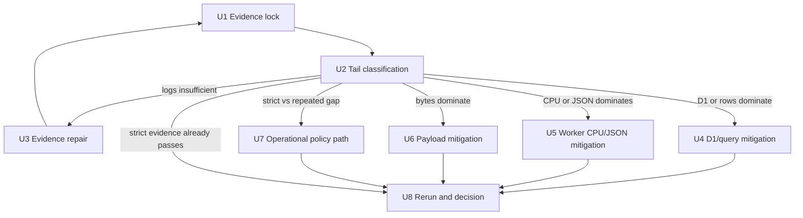
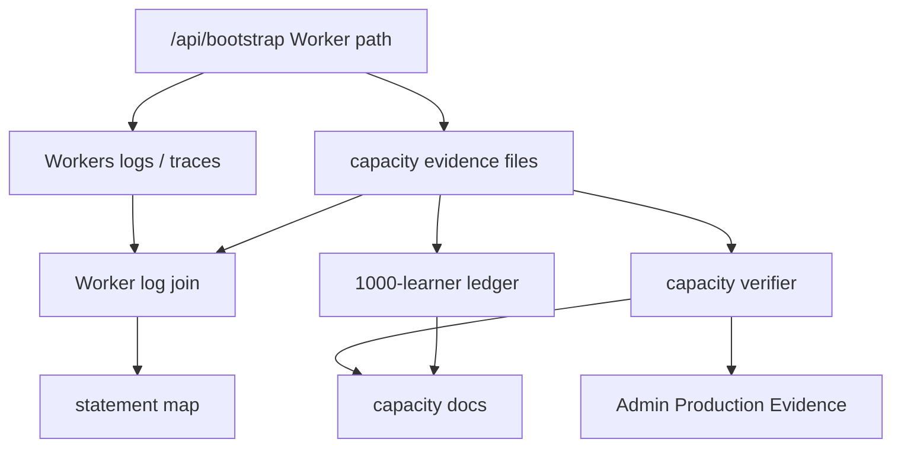

# feat: System Hardening Optimisation P2 Bootstrap Tail Reduction

## Summary

Plan P2 as an evidence-first `/api/bootstrap` tail-reduction phase: collect post-P1 strict evidence, join Cloudflare Worker CPU/wall logs, classify the slowest bootstrap samples, then choose one measured mitigation path. The plan may end with 30-learner certification only if the existing strict verifier-backed gate passes; otherwise it produces an honest blocker and next action.

---

## Problem Frame

P1 delivered the diagnostic lane, statement map, phase timings, 1000-learner budget ledger, and one narrow public-bootstrap query reduction. It did not close evidence acceptance: the latest committed strict 30 run still predates the P1 code change and fails only bootstrap P95, while Worker CPU/wall attribution remains unknown.

P2 exists to avoid a second speculative optimisation pass. It must prove whether the post-P1 system passes the strict 30 gate already, and if not, whether the remaining tail is driven by D1/query shape, Worker CPU/JSON serialisation, payload pressure, launch-tail platform variance, or insufficient logs.

---

## Requirements

- R1. Begin with post-P1-code-change production evidence, not another code change.
- R2. Preserve the current public posture: `small-pilot-provisional` until strict verifier-backed 30-learner evidence passes.
- R3. Produce strict 30 evidence and at least one repeated strict 30 run using the existing 30-learner gate shape, unique artefact paths, retained top-tail request IDs, and verifier-backed interpretation.
- R4. Join bounded Cloudflare Worker CPU/wall logs to top-tail bootstrap samples, or classify missing/incomplete logs as insufficient evidence.
- R5. Classify bootstrap tail samples using request IDs, app wall time, Worker CPU, Worker wall time, D1 duration, query count, rows read/written, response bytes, bootstrap mode, phase timings, and statement evidence where available.
- R6. Choose at most one primary mitigation path after classification: evidence-capture repair, D1/query-shape reduction, Worker CPU/JSON serialisation reduction, payload/envelope reduction, or burst/warm-up operational policy.
- R7. Preserve Worker authority, bootstrap multi-learner correctness, selected learner switching, compact sibling state, active-session inclusion, `notModified` invalidation, redaction, and public `meta.capacity` boundaries.
- R8. Re-run strict 30 evidence after any code or operational mitigation and keep diagnostic 60/1000 evidence separate from certification.
- R9. Refresh the 1000-learner modelling ledger after new route-cost evidence, keeping it non-certifying.
- R10. End with a P2 completion report that states one of: certified 30 learners, classified blocker with next mitigation, insufficient evidence with named log blocker, or platform-tail policy decision required.

---

## Scope Boundaries

- No threshold relaxation.
- No paid-tier migration as the answer.
- No new 60/100/300/1000 learner public claim.
- No public capacity wording promotion from diagnostics, manifest evidence, warm-only evidence, modelling ledgers, or filename shape.
- No Hero economy, learner-visible reward, subject-learning semantics, or dashboard expansion.
- No broad repository rewrite, command write-amplification rewrite, D1 partitioning, Durable Object actor model, or request batching research slice.
- No browser-owned production writes.
- No removal of sibling learner state, writable learner identities, selected learner switching, or revision invalidation to improve numbers.
- No D1 index migration without statement-map coverage plus query-plan and write-cost evidence.
- No public exposure of statement detail, phase timings, SQL shape, or Worker CPU diagnostics in child-facing JSON.
- No raw Wrangler deployment or remote-D1 operational path in normal docs/scripts; keep package scripts and OAuth-safe wrappers.

### Deferred to Follow-Up Work

- **60-learner certification policy:** separate owner-reviewed policy and evidence plan; P2 may collect diagnostics only.
- **100/300/1000 learner economics:** later optimisation phases after P2 names the measured route/resource bottleneck.
- **Advanced scheduling, caching, partitioning, or Durable Object research:** later research slice after strict bootstrap tail is classified.
- **CI-signed evidence provenance:** future hardening phase; P2 preserves verifier and summary fail-closed behaviour without adding cryptographic signing.
- **Command/Hero route unit economics:** later phases, because P2 is scoped to bootstrap tail evidence and the 30-learner gate.

---

## Context & Research

### Relevant Code and Patterns

- `scripts/classroom-load-test.mjs` owns capacity evidence generation, top-tail sample retention, threshold diagnostics, unique output path expectations, and run-shape metadata.
- `scripts/join-capacity-worker-logs.mjs` joins Workers Trace, Workers Logs, Tail Worker, Logpush-style, and `[ks2-worker] capacity.request` exports into diagnostic-only correlation artefacts.
- `scripts/build-capacity-statement-map.mjs` ranks statement evidence and refuses query-shape recommendations when statement coverage is incomplete.
- `scripts/build-capacity-budget-ledger.mjs` writes the non-certifying 1000-learner model to `reports/capacity/latest-1000-learner-budget.json` and `docs/operations/capacity-1000-learner-free-tier-budget.md`.
- `scripts/verify-capacity-evidence.mjs` enforces the capacity evidence table, threshold config, diagnostic-only Worker log join, and positive-proof certification boundaries.
- `scripts/generate-evidence-summary.mjs` feeds Admin Production Evidence from verified capacity rows and must remain fail-closed for stale, diagnostic, or non-certifying evidence.
- `worker/src/logger.js` contains the `CapacityCollector`, public `meta.capacity` allowlist, structured `capacity.request` log, statement recording, and bootstrap phase timings.
- `worker/src/app.js` owns response telemetry finalisation, JSON body measurement, `meta.capacity` stamping, and the current parse/rewrite path that may matter if Worker CPU is classified as the tail.
- `worker/src/repository.js` owns the public bounded bootstrap path, active-session inclusion, subject/game state reads, spelling runtime content lookup, read-model assembly, and `notModified` probe.
- `worker/src/bootstrap-repository.js` owns bootstrap capacity constants, revision hash inputs, closed phase names, capacity versioning, and sibling invalidation contracts.
- `tests/worker-query-budget.test.js` pins measured public bootstrap count at 11 with a budget of 12, plus the `notModified` query budget.
- `tests/worker-bootstrap-multi-learner-regression.test.js`, `tests/worker-bootstrap-capacity.test.js`, `tests/worker-bootstrap-v2.test.js`, and `tests/worker-capacity-telemetry.test.js` are the core bootstrap invariant tests.
- `tests/capacity-worker-log-join.test.js`, `tests/capacity-statement-map.test.js`, `tests/capacity-budget-ledger.test.js`, `tests/capacity-thresholds.test.js`, `tests/verify-capacity-evidence.test.js`, and `tests/generate-evidence-summary.test.js` cover evidence tooling and fail-closed certification.

### Institutional Learnings

- P6/P1 capacity work treats certification as positive proof: diagnostic files explain but do not certify, missing CPU/wall logs are not zeroes, and stale summaries must not become Admin success.
- P5 showed that high P95 with healthy P50, low query count, tiny payload, and clean commands can indicate platform/D1 tail variance rather than application logic; P2 still needs Worker log joins before claiming that diagnosis.
- P1 review found real false-pass risks, including matched invocations with null CPU/wall values being coerced to zero. P2 must preserve strict numeric validation and fail-closed classification.
- Bootstrap query count is now a release contract. Any query-budget change needs measured rationale and the same PR must update its rationale comment.
- Multi-learner bootstrap correctness is load-bearing: selected learner, writable siblings, active sessions, compact state, and revision invalidation are not optimisation levers.

### External References

- Cloudflare Workers limits, retrieved 2026-04-29: Workers Free has 100,000 requests/day, 10 ms CPU per HTTP request, 50 subrequests/request, and CPU time excludes time waiting on fetch, KV, or database calls. https://developers.cloudflare.com/workers/platform/limits/
- Cloudflare Workers limits also state `exceededCpu` appears in analytics/Logpush and CPU/wall time are available through Workers Logs, Tail Workers, and Logpush. https://developers.cloudflare.com/workers/platform/limits/
- Cloudflare Workers Trace Events expose `CPUTimeMs`, `WallTimeMs`, `Outcome`, and invocation logs for fetch events. https://developers.cloudflare.com/logs/logpush/logpush-job/datasets/account/workers_trace_events/
- Cloudflare Workers traces expose `cloudflare.cpu_time_ms`, `cloudflare.wall_time_ms`, and `cloudflare.outcome` attributes. https://developers.cloudflare.com/workers/observability/traces/spans-and-attributes/
- Cloudflare D1 limits, retrieved 2026-04-29: Free plans have 10 databases/account, 500 MB/database, 50 queries per Worker invocation, 100 bound parameters/query, and 30 second maximum SQL query duration. D1 databases process queries one at a time and may queue concurrent requests before returning overloaded errors. https://developers.cloudflare.com/d1/platform/limits/
- Cloudflare D1 metrics expose rows read/written per query; row counts are a precise performance and cost signal. Any dashboard/insights use stays operator-side and does not change repo package-script operations. https://developers.cloudflare.com/d1/observability/metrics-analytics/

---

## Key Technical Decisions

- **Use the P2 contract as the governing origin:** The source document already defines the phase, non-goals, evidence artefacts, and decision rules, so the implementation plan translates it into executable units rather than broadening scope.
- **Make U1/U2 evidence and classification hard gates before code changes:** This preserves P2's central promise that optimisation follows measured attribution, not intuition.
- **Treat log coverage as a first-class outcome:** Missing invocation CPU/wall or sampled-out statement logs are valid findings, but they route to evidence repair or partial classification rather than D1/CPU claims.
- **Keep P1 tooling as the default surface:** P2 should extend `scripts/join-capacity-worker-logs.mjs`, `scripts/build-capacity-statement-map.mjs`, `scripts/build-capacity-budget-ledger.mjs`, and existing docs only when live evidence proves a gap.
- **Choose one primary mitigation path:** D1/query, Worker CPU/JSON, payload, operational burst/warm-up, and evidence-capture repair are intentionally mutually exclusive first moves. A small supporting change is allowed only when it is required by the selected primary path and covered independently.
- **Do not use D1 wall-time guesses as Worker CPU evidence:** Official Workers docs distinguish CPU time from waiting on database/network calls; P2 must join Worker telemetry before CPU-specific work.
- **Do not add D1 indexes from incomplete statement logs:** D1 row counts and statement duration matter, but index/query-shape recommendations require complete statement coverage plus query-plan/write-cost notes.
- **Prefer no-code certification when evidence passes:** If post-P1 strict and repeated strict runs pass cleanly, P2 should update capacity evidence/docs and completion records without inventing a code PR.
- **Keep Admin evidence truth aligned with the verifier:** Any capacity-status update must flow through the verified capacity evidence table and generated summary, never hand-written summary success.

---

## Open Questions

### Resolved During Planning

- **Should P2 begin with a new optimisation PR?** No. The source contract and P1 completion report both require evidence collection before behaviour changes.
- **Can Worker CPU be inferred from client/app wall time?** No. Cloudflare documents CPU time as execution time excluding database/network waits, so CPU claims require Worker log or trace telemetry.
- **Can 60-learner diagnostics promote public wording?** No. P2 keeps 60 learner work diagnostic unless a separate threshold/equivalence policy is approved.
- **Can the 1000-learner ledger certify readiness?** No. The ledger is modelling-only and remains a planning input.
- **Should a passing post-P1 strict run force a code change anyway?** No. Evidence-only close-out is a valid and preferred P2 outcome if strict evidence passes.

### Deferred to Implementation

- **Actual P2 evidence outcome:** The plan cannot know whether strict post-P1 evidence passes, fails, or is blocked until production artefacts exist.
- **Exact Worker log export source and field coverage:** Implementation should use the bounded export available to the operator and classify coverage explicitly.
- **Exact statement-map coverage:** Query recommendations depend on sampled production `capacity.request` statement completeness.
- **Whether any mitigation ships:** U3-U7 are conditional; only the path selected by U2 should become active implementation.
- **Exact capacity table/update wording:** Depends on verifier output and whether the strict evidence actually passes.

---

## High-Level Technical Design

> *This illustrates the intended approach and is directional guidance for review, not implementation specification. The implementing agent should treat it as context, not code to reproduce.*

The central decision table for U2 is:

| Evidence pattern | Primary path | Hard no-go |
| --- | --- | --- |
| Missing or incomplete Worker CPU/wall on top-tail samples | U3 evidence-capture repair | Do not optimise CPU or D1 from guesswork. |
| D1 duration accounts for a material share of Worker wall time, or rows/query fan-out grows | U4 D1/query mitigation | Do not add indexes without complete statement coverage and query-plan notes. |
| Worker CPU approaches the Free limit or JSON/phase timings dominate | U5 Worker CPU/JSON mitigation | Do not remove capacity metadata or expose phase timings publicly. |
| Response bytes approach the classroom cap or bounded envelope grows unexpectedly | U6 payload mitigation | Do not drop shell-required learner/revision/sibling state. |
| Strict first run fails but repeated/warm evidence passes with stable resource costs | U7 operational policy path | Do not reclassify warm-only evidence as strict success without policy approval. |
| Strict and repeated strict runs pass cleanly | U8 evidence-only certification decision | Do not jump from 30 learners to 60/1000 learner claims. |

---

## Implementation Units

- U1. **Evidence Lock and Post-P1 Strict Rerun**

**Goal:** Produce the post-P1 strict evidence baseline before any new optimisation work starts.

**Requirements:** R1, R2, R3, R4, R8, R9

**Dependencies:** None

**Files:**
- Create: `reports/capacity/evidence/<date>-p2-t1-strict-post-p1.json`
- Create: `reports/capacity/evidence/<date>-p2-t5-strict-repeat-*.json`
- Create: `reports/capacity/evidence/<date>-p2-*-worker-logs.jsonl`
- Create: `reports/capacity/evidence/<date>-p2-*-tail-correlation.json`
- Create: `reports/capacity/evidence/<date>-p2-*-statement-map.json`
- Modify: `reports/capacity/latest-1000-learner-budget.json`
- Modify: `docs/operations/capacity-1000-learner-free-tier-budget.md`
- Test expectation: none -- this unit generates evidence artefacts and consumes existing verifier/script coverage.

**Approach:**
- Use the existing strict 30 gate shape from `reports/capacity/configs/30-learner-beta.json`.
- Preserve each failed or passing run with a unique path; do not overwrite a previous run during diagnosis.
- Export bounded Worker logs for the same windows and join by request ID through the existing P1 join script.
- Build a statement map only when sampled statement coverage is complete; otherwise create an explicit incomplete-coverage record.
- Refresh the 1000-learner ledger from new route-cost evidence while keeping it modelling-only and non-certifying.

**Patterns to follow:**
- `docs/operations/capacity-tail-latency.md`
- `docs/operations/capacity-cpu-d1-evidence.md`
- `scripts/classroom-load-test.mjs`
- `scripts/join-capacity-worker-logs.mjs`
- `scripts/build-capacity-statement-map.mjs`
- `scripts/build-capacity-budget-ledger.mjs`

**Test scenarios:**
- Test expectation: none -- production capacity evidence is validated by `scripts/verify-capacity-evidence.mjs` and the existing script test suites.

**Verification:**
- Strict 30 and repeated strict 30 artefacts exist with unique paths.
- Top-tail bootstrap request IDs are present or the evidence explains why they are unavailable.
- Worker CPU/wall join coverage is recorded, or missing logs classify as insufficient.
- The 1000-learner ledger is refreshed and still labelled non-certifying.
- No capacity status is promoted from diagnostic artefacts.

---

- U2. **Tail Classification Decision Record**

**Goal:** Convert U1 evidence into a written decision that selects exactly one primary P2 path.

**Requirements:** R1, R4, R5, R6, R10

**Dependencies:** U1

**Files:**
- Create: `reports/capacity/evidence/<date>-p2-tail-classification.md`
- Modify: `docs/plans/james/sys-hardening/A/sys-hardening-optimisation-p2.md`
- Test expectation: none -- this is a decision-record unit backed by U1 evidence artefacts.

**Approach:**
- Record strict 30 result, repeated strict result, Worker log source, statement-map coverage, and budget-ledger state.
- Classify top-tail bootstrap requests using the P2 vocabulary: `unclassified-insufficient-logs`, `partial-invocation-only`, `d1-dominated`, `worker-cpu-dominated`, `payload-size-pressure`, `client-network-or-platform-overhead`, or `mixed-no-single-dominant-resource`.
- Select one primary path among U3-U7, or route straight to U8 when strict evidence passes.
- Explicitly record non-chosen paths and no-go conditions so the implementation cannot blend speculative mitigations.

**Patterns to follow:**
- `docs/plans/james/sys-hardening/A/sys-hardening-optimisation-p1-completion-report.md`
- `docs/operations/capacity-cpu-d1-evidence.md`
- `reports/capacity/latest-1000-learner-budget.json`

**Test scenarios:**
- Test expectation: none -- the decision record is human-reviewed and evidence-backed; automated coverage belongs to the scripts that produce the artefacts.

**Verification:**
- No implementation branch begins before this record exists.
- The selected path names the metric it protects and cites the supporting artefacts.
- Every deferred path has a reason, not just an omission.

---

- U3. **Evidence-Capture Repair Path**

**Goal:** Repair request-id, log-export, or join coverage when U2 cannot classify the tail because evidence is insufficient.

**Requirements:** R4, R5, R6, R10

**Dependencies:** U2 selects this path

**Files:**
- Modify: `scripts/join-capacity-worker-logs.mjs`
- Modify: `scripts/lib/capacity-evidence.mjs`
- Modify: `scripts/verify-capacity-evidence.mjs`
- Modify: `docs/operations/capacity-cpu-d1-evidence.md`
- Modify: `docs/operations/capacity-tail-latency.md`
- Test: `tests/capacity-worker-log-join.test.js`
- Test: `tests/verify-capacity-evidence.test.js`
- Test: `tests/capacity-scripts.test.js`

**Approach:**
- Extend existing fixture-based adapters only for observed bounded log shapes; ignore unknown fields and reject unsafe/free-form content.
- Preserve separate coverage for invocation CPU/wall and sampled `capacity.request` statement logs.
- Keep matched invocation records with missing/null CPU or wall time fail-closed as insufficient logs.
- Update operator docs to make the repaired export/join path repeatable without raw deployment or remote-D1 operations.

**Execution note:** Start with a fixture that reproduces the missing live coverage shape, then update parsing/verifier behaviour.

**Patterns to follow:**
- `scripts/join-capacity-worker-logs.mjs`
- `tests/fixtures/capacity-worker-logs/`
- `tests/capacity-worker-log-join.test.js`
- `tests/verify-capacity-evidence.test.js`

**Test scenarios:**
- Happy path: observed Workers log export shape joins to top-tail samples with CPU, wall, outcome, and timestamp fields.
- Edge case: invocation logs join but sampled statement logs are missing, producing `partial-invocation-only`.
- Edge case: duplicate records for one request ID record ambiguity without losing the matched sample.
- Error path: matched invocation with null CPU or wall time remains `unclassified-insufficient-logs`.
- Error path: malformed or unsafe log lines are skipped with bounded warnings and do not persist request bodies, cookies, learner names, raw SQL parameters, prompts, or answers.
- Integration: verifier rejects any diagnostic Worker-log join that tries to contribute to certification.

**Verification:**
- A rerun of U1 can produce a correlation file that either classifies top-tail samples or names the remaining log blocker.
- No certification status changes in this unit.

---

- U4. **D1 and Query-Shape Mitigation Path**

**Goal:** Reduce bootstrap D1/query pressure only when U2 evidence points to D1 duration, query fan-out, or rows-read pressure.

**Requirements:** R5, R6, R7, R8, R10

**Dependencies:** U2 selects this path

**Files:**
- Modify: `worker/src/repository.js`
- Modify: `worker/src/bootstrap-repository.js`
- Modify: `docs/operations/capacity.md`
- Modify: `docs/operations/capacity-tail-latency.md`
- Test: `tests/worker-query-budget.test.js`
- Test: `tests/worker-bootstrap-capacity.test.js`
- Test: `tests/worker-bootstrap-v2.test.js`
- Test: `tests/worker-bootstrap-multi-learner-regression.test.js`
- Test: `tests/capacity-statement-map.test.js`

**Approach:**
- Use statement-map-backed evidence to choose one query/read mitigation, such as safe account/list-revision consolidation, spelling runtime content fast-path validation, selected `practice_sessions`/`event_log` query-shape work, or sibling row fan-out review.
- Preserve full writable sibling state and `notModified` sibling invalidation; do not narrow subject/game state to selected learner unless a new sibling-summary contract exists.
- Do not add an index without complete statement coverage, representative query-plan notes, and write-cost notes.
- Update query-budget constants only when measured count changes, and keep rationale comments in the same unit.

**Execution note:** Characterise the current query/rows behaviour before changing bootstrap queries.

**Patterns to follow:**
- `worker/src/repository.js` public bounded bootstrap branch
- `worker/src/bootstrap-repository.js` revision hash and capacity version contracts
- `tests/worker-query-budget.test.js`
- `tests/worker-bootstrap-multi-learner-regression.test.js`

**Test scenarios:**
- Happy path: selected-learner-bounded bootstrap preserves selected learner, writable sibling state, active sessions, and recent selected-learner history after the query-shape change.
- Happy path: measured full bootstrap query count or D1 rows-read pressure improves for the targeted shape.
- Edge case: empty or missing learner-list revision still produces the same revision hash agreement between full and `notModified` paths.
- Edge case: multi-learner account with writable siblings still returns compact sibling subject/game state.
- Error path: malformed sibling subject-state UI does not block valid active-session inclusion.
- Error path: incomplete statement coverage refuses index/query recommendations.
- Integration: sibling learner subject/game mutations still invalidate `notModified` responses.

**Verification:**
- Bootstrap query count and not-modified query count do not regress above the documented budget unless the decision record explicitly justifies it.
- Redaction, selected learner switching, sibling state, active sessions, and capacity metadata remain intact.
- U8 reruns strict evidence after the mitigation.

---

- U5. **Worker CPU and JSON Serialisation Mitigation Path**

**Goal:** Reduce bootstrap Worker CPU or JSON serialisation overhead only when U2 evidence points to Worker CPU, response construction, or response-body rewrite cost.

**Requirements:** R5, R6, R7, R8, R10

**Dependencies:** U2 selects this path

**Files:**
- Modify: `worker/src/app.js`
- Modify: `worker/src/logger.js`
- Modify: `worker/src/repository.js`
- Modify: `worker/src/bootstrap-repository.js`
- Modify: `docs/operations/capacity.md`
- Modify: `docs/operations/capacity-cpu-d1-evidence.md`
- Test: `tests/worker-capacity-telemetry.test.js`
- Test: `tests/worker-bootstrap-capacity.test.js`
- Test: `tests/worker-query-budget.test.js`
- Test: `tests/worker-bootstrap-v2.test.js`

**Approach:**
- First decide whether existing phase timings distinguish repository response construction from outer JSON read/parse/rewrite/final serialisation. Add structured-log-only timing only if U2 evidence shows the gap is blocking classification.
- Preserve public `meta.capacity`; do not remove capacity metadata to save CPU.
- If measured, reduce double serialisation/rewrite cost by extending existing response decoration patterns without changing public bootstrap envelope shape.
- Keep all new diagnostics out of child-facing JSON and under closed allowlists.

**Execution note:** Add telemetry/redaction coverage before changing the response path, because this unit touches public JSON decoration.

**Patterns to follow:**
- `worker/src/app.js` final telemetry decoration
- `worker/src/logger.js` public vs structured-log allowlists
- `tests/worker-capacity-telemetry.test.js`
- `tests/worker-bootstrap-capacity.test.js`

**Test scenarios:**
- Happy path: successful `/api/bootstrap` still includes public `meta.capacity` with the approved fields.
- Happy path: structured logs include any new JSON/serialisation timing fields only when allowed.
- Edge case: non-capacity JSON responses are not stamped with bootstrap diagnostics.
- Edge case: not-modified bootstrap responses remain tight and preserve `bootstrapMode`.
- Error path: forbidden private tokens seeded in fixture data do not appear in structured timings or public capacity metadata.
- Error path: 4xx/5xx JSON error bodies are not rewritten into false success shapes.
- Integration: response byte measurement remains honest after capacity metadata stamping, with known body/log byte drift documented.

**Verification:**
- Worker CPU/phase evidence improves for the targeted tail shape, or the completion report records why it did not.
- Public bootstrap envelope versioning and redaction tests remain green.
- U8 reruns strict evidence after the mitigation.

---

- U6. **Payload and Envelope Mitigation Path**

**Goal:** Reduce bootstrap payload pressure only if U2 evidence shows response bytes materially contribute to the tail.

**Requirements:** R5, R6, R7, R8, R10

**Dependencies:** U2 selects this path

**Files:**
- Modify: `worker/src/repository.js`
- Modify: `worker/src/bootstrap-repository.js`
- Modify: `docs/operations/capacity.md`
- Test: `tests/worker-bootstrap-v2.test.js`
- Test: `tests/worker-bootstrap-capacity.test.js`
- Test: `tests/worker-bootstrap-multi-learner-regression.test.js`
- Test: `tests/worker-query-budget.test.js`

**Approach:**
- Confirm selected-learner-bounded bootstrap remains compact under high sibling-count and active-session shapes.
- Check that public signed-in routes use bounded bootstrap rather than falling back to full legacy payloads.
- Trim only fields that are proven unnecessary for first paint, learner switching, revision invalidation, active sessions, or redaction.
- Follow bootstrap capacity version and snapshot rules for any public envelope shape change.

**Patterns to follow:**
- `worker/src/bootstrap-repository.js` `PUBLIC_BOOTSTRAP_CAPACITY_VERSION` discipline
- `tests/worker-bootstrap-v2.test.js`
- `tests/worker-bootstrap-multi-learner-regression.test.js`

**Test scenarios:**
- Happy path: selected learner first paint and writable sibling switching still work after payload change.
- Happy path: max bootstrap response bytes reduce for the measured fixture shape.
- Edge case: accounts with many writable learners still receive compact sibling learner state needed by the shell.
- Edge case: monster visual config remains a compact pointer rather than reintroducing a heavy inline config.
- Error path: private answer-bearing or server-only fields remain redacted.
- Integration: envelope snapshot/version tests fail if a required public field is removed without version discipline.

**Verification:**
- Payload reduction is measurable and tied to U2 evidence.
- Bootstrap byte cap is not raised.
- U8 reruns strict evidence after the mitigation.

---

- U7. **Burst or Warm-Up Operational Policy Path**

**Goal:** Handle launch-tail variance when strict and repeated/warm evidence differ materially while app resource metrics remain stable.

**Requirements:** R2, R6, R8, R10

**Dependencies:** U2 selects this path

**Files:**
- Modify: `docs/operations/capacity-tail-latency.md`
- Modify: `docs/operations/capacity.md`
- Modify: `docs/plans/james/sys-hardening/A/sys-hardening-optimisation-p2.md`
- Test: `tests/verify-capacity-evidence.test.js`
- Test: `tests/generate-evidence-summary.test.js`

**Approach:**
- Keep strict T1 and repeated/warm evidence as separate artefacts and separate evidence classifications.
- Record whether the observed tail is a launch-tail policy issue, platform variance issue, or still an app-code bottleneck.
- If proposing pre-warm, burst pacing, or retry/backoff policy, document it as diagnostic mitigation unless an owner-reviewed policy explicitly changes the gate.
- Ensure Admin evidence cannot treat warm-only success as strict certification.

**Patterns to follow:**
- `docs/operations/capacity-tail-latency.md`
- `scripts/verify-capacity-evidence.mjs`
- `scripts/generate-evidence-summary.mjs`

**Test scenarios:**
- Happy path: strict passing evidence can remain certification-eligible when all existing gate conditions pass.
- Edge case: warm/repeated evidence with passing metrics remains diagnostic when the strict first-run gate fails.
- Error path: Admin evidence summary refuses warm-only or manifest-only promotion.
- Integration: capacity docs distinguish operational mitigation from capacity certification.

**Verification:**
- No thresholds are relaxed.
- Public wording remains `small-pilot-provisional` unless U8 verifies strict evidence passes.
- The completion report names the policy decision required before any certification change.

---

- U8. **Rerun Matrix, Certification Decision, and Completion Report**

**Goal:** Close P2 with verifier-backed evidence, docs, Admin summary alignment, and an explicit completion report.

**Requirements:** R2, R3, R8, R9, R10

**Dependencies:** U1 and U2; plus the selected mitigation path when one ships

**Files:**
- Create: `reports/capacity/evidence/<date>-p2-t1-strict-after-mitigation.json`
- Create: `reports/capacity/evidence/<date>-p2-t5-strict-repeat-after-mitigation.json`
- Create: `reports/capacity/evidence/<date>-p2-60-learner-diagnostic.json`
- Modify: `docs/operations/capacity.md`
- Modify: `reports/capacity/latest-evidence-summary.json`
- Modify: `reports/capacity/latest-1000-learner-budget.json`
- Modify: `docs/operations/capacity-1000-learner-free-tier-budget.md`
- Create: `docs/plans/james/sys-hardening/A/sys-hardening-optimisation-p2-completion-report.md`
- Test: `tests/verify-capacity-evidence.test.js`
- Test: `tests/generate-evidence-summary.test.js`
- Test: `tests/react-admin-production-evidence.test.js`

**Approach:**
- Rerun strict 30 and repeated strict 30 after the selected mitigation, or after U1/U2 when no code change was needed.
- Treat 60-learner evidence as diagnostic unless a separate policy exists.
- Update `docs/operations/capacity.md` only with evidence rows that have persisted artefacts and verifier-backed interpretation.
- Regenerate Admin evidence summary from source evidence rather than hand-editing success.
- Write a completion report that separates implementation delivery from capacity certification and states which of the P2 terminal outcomes occurred.

**Patterns to follow:**
- `docs/plans/james/sys-hardening/A/sys-hardening-optimisation-p1-completion-report.md`
- `docs/operations/capacity.md`
- `scripts/verify-capacity-evidence.mjs`
- `scripts/generate-evidence-summary.mjs`
- `tests/react-admin-production-evidence.test.js`

**Test scenarios:**
- Happy path: strict 30 evidence with passing bootstrap P95, command P95, response bytes, zero 5xx, zero network failures, zero hard capacity signals, bootstrap metadata, pinned config, and verifier proof can update the capacity table.
- Happy path: failed strict evidence remains recorded with exact threshold failures and no public wording promotion.
- Edge case: strict run passes but repeated strict run fails; completion report records confidence gap and avoids overclaiming.
- Edge case: 60-learner diagnostic passes; docs keep it diagnostic and do not promote 60 learner capacity.
- Error path: latest summary cannot show certification from stale, diagnostic, warm-only, manifest-only, or unverified evidence.
- Integration: Admin Production Evidence reflects the same certification truth as `docs/operations/capacity.md` and the verifier.

**Verification:**
- P2 completion report names all evidence artefacts and the selected path.
- `small-pilot-provisional` remains unless strict verifier-backed 30 evidence passes.
- If certification is justified, docs, summary JSON, and Admin evidence agree on the same verified source.

---

## System-Wide Impact

- **Interaction graph:** P2 crosses production load evidence, Cloudflare logs, evidence scripts, bootstrap Worker internals, capacity docs, generated summaries, and Admin evidence.
- **Error propagation:** Missing logs, failed thresholds, stale summaries, diagnostic runs, incomplete statement coverage, and unverified rows must propagate as explicit non-certifying states.
- **State lifecycle risks:** Evidence files are append-like records; overwriting failures or regenerating summaries from the wrong source can corrupt capacity truth.
- **API surface parity:** Public `/api/bootstrap` and subject-command contracts must not change unless a selected mitigation explicitly requires bootstrap envelope versioning. Operator-only docs/scripts can evolve independently.
- **Integration coverage:** Script tests prove fixture parsing; Worker tests prove bootstrap invariants; production evidence proves the gate. None of these substitutes for the others.
- **Unchanged invariants:** Worker authority, D1-backed source of truth, multi-learner bootstrap, sibling invalidation, redaction, capacity metadata, OAuth-safe Cloudflare scripts, and diagnostic-only Worker-log joins remain unchanged.

---

## Alternative Approaches Considered

- **Skip evidence and optimise the most suspicious query:** Rejected because P2's source contract explicitly says blind optimisation is worse than an extra diagnostic slice.
- **Raise or reinterpret the bootstrap P95 threshold:** Rejected because the threshold is the certification contract; policy changes belong outside an optimisation PR.
- **Treat repeated/warm success as strict success:** Rejected unless a separate owner-reviewed policy explicitly changes the gate.
- **Fold 60/1000 learner work into P2:** Rejected because those are diagnostic/lighthouse routes; P2 is the strict 30 bootstrap-tail phase.
- **Use Cloudflare wall time as a CPU proxy:** Rejected because official Workers docs distinguish CPU time from wait time on database/network calls.

---

## Success Metrics

- Post-P1 strict 30 evidence exists, is preserved, and is verifier-readable.
- Repeated strict 30 evidence exists and is not conflated with the first run.
- Top-tail Worker log join coverage is either complete enough to classify or honestly marked insufficient.
- One primary mitigation path is selected with supporting artefacts.
- Any shipped mitigation has before/after evidence and targeted regression tests.
- Public capacity wording remains honest.
- P2 completion report can be handed to the next agent without reconstructing the evidence chain from memory.

---

## Dependencies / Prerequisites

- P1 tooling from PR #618 must be present on the production commit used for P2 evidence.
- Production evidence collection must be operator-approved and bounded to the documented run shapes.
- Cloudflare Worker log export must cover the exact strict evidence windows and include request IDs for top-tail samples where possible.
- Existing Cloudflare OAuth-safe package scripts remain the normal operations path.
- No other concurrent change should alter bootstrap threshold configs or evidence verifier semantics during the P2 run unless recorded in the completion report.

---

## Risk Analysis & Mitigation

| Risk | Likelihood | Impact | Mitigation |
| --- | --- | --- | --- |
| Live evidence cannot be joined to Worker logs | Medium | High | Route to U3; classify as insufficient logs and fix capture before optimisation. |
| A diagnostic run is accidentally treated as certification | Medium | High | Preserve verifier, generated summary, and Admin fail-closed tests. |
| Query optimisation breaks sibling learner state | Medium | High | U4 requires multi-learner, active-session, selected-learner, and `notModified` coverage. |
| JSON/CPU mitigation changes public bootstrap shape | Medium | High | U5 requires envelope/version, telemetry, and redaction tests. |
| Payload reduction removes shell-required data | Low-Medium | High | U6 requires first-paint, learner switching, sibling state, and snapshot/version coverage. |
| D1 index work increases write cost or does not address tail | Medium | Medium | U4 forbids index work without statement coverage, query-plan notes, and write-cost notes. |
| Repeated evidence overwrites a failure | Low | High | U1 and U8 require unique artefact paths and completion report links. |
| 1000-learner ledger is misread as launch proof | Medium | Medium | Keep `modellingOnly: true`, `certifying: false`, and wording in docs/report. |
| Production evidence collection stresses the live app | Low-Medium | High | Use documented production confirmations, bounded learner counts, and operator-approved windows. |

---

## Phased Delivery

### Phase 1 - Evidence and Classification

- Complete U1 and U2.
- If strict and repeated strict pass cleanly, move directly to U8 as an evidence-only close-out.
- If logs are insufficient, take U3 and then repeat U1/U2.

### Phase 2 - Single Selected Mitigation

- Implement exactly one of U4, U5, U6, or U7 based on U2.
- Keep any supporting change narrow and independently tested.

### Phase 3 - Rerun and Handoff

- Complete U8.
- Preserve evidence, update docs/summaries through source-of-truth scripts, and write the P2 completion report.

---

## Documentation / Operational Notes

- Capacity docs should describe evidence lanes and certification status, not implementation optimism.
- P2 evidence files under `reports/capacity/evidence/` should use dated, descriptive names and should not replace the P1/P6 historical evidence.
- Completion report wording must separate "implementation delivered" from "capacity certified".
- If the final state is still blocked, the report should name the next phase precisely: evidence capture, D1/query work, Worker CPU/JSON work, payload work, operational policy, or higher-scale economics.
- Keep production deployment and Cloudflare operations routed through package scripts documented in `AGENTS.md`.

---

## Sources & References

- **Origin document:** [docs/plans/james/sys-hardening/A/sys-hardening-optimisation-p2.md](docs/plans/james/sys-hardening/A/sys-hardening-optimisation-p2.md)
- **P1 implementation plan:** [docs/plans/2026-04-29-010-feat-sys-hardening-optimisation-p1-evidence-attribution-plan.md](docs/plans/2026-04-29-010-feat-sys-hardening-optimisation-p1-evidence-attribution-plan.md)
- **P1 completion report:** [docs/plans/james/sys-hardening/A/sys-hardening-optimisation-p1-completion-report.md](docs/plans/james/sys-hardening/A/sys-hardening-optimisation-p1-completion-report.md)
- Related docs: [docs/operations/capacity.md](docs/operations/capacity.md)
- Related docs: [docs/operations/capacity-cpu-d1-evidence.md](docs/operations/capacity-cpu-d1-evidence.md)
- Related docs: [docs/operations/capacity-tail-latency.md](docs/operations/capacity-tail-latency.md)
- Related docs: [docs/operations/capacity-1000-learner-free-tier-budget.md](docs/operations/capacity-1000-learner-free-tier-budget.md)
- Related code: [scripts/classroom-load-test.mjs](scripts/classroom-load-test.mjs)
- Related code: [scripts/join-capacity-worker-logs.mjs](scripts/join-capacity-worker-logs.mjs)
- Related code: [scripts/build-capacity-statement-map.mjs](scripts/build-capacity-statement-map.mjs)
- Related code: [scripts/build-capacity-budget-ledger.mjs](scripts/build-capacity-budget-ledger.mjs)
- Related code: [scripts/verify-capacity-evidence.mjs](scripts/verify-capacity-evidence.mjs)
- Related code: [scripts/generate-evidence-summary.mjs](scripts/generate-evidence-summary.mjs)
- Related code: [worker/src/logger.js](worker/src/logger.js)
- Related code: [worker/src/app.js](worker/src/app.js)
- Related code: [worker/src/repository.js](worker/src/repository.js)
- Related code: [worker/src/bootstrap-repository.js](worker/src/bootstrap-repository.js)
- Institutional learning: [docs/solutions/architecture-patterns/sys-hardening-p5-certification-closure-d1-latency-and-evidence-culture-2026-04-28.md](docs/solutions/architecture-patterns/sys-hardening-p5-certification-closure-d1-latency-and-evidence-culture-2026-04-28.md)
- External docs: [Cloudflare Workers limits](https://developers.cloudflare.com/workers/platform/limits/)
- External docs: [Cloudflare Workers Trace Events](https://developers.cloudflare.com/logs/logpush/logpush-job/datasets/account/workers_trace_events/)
- External docs: [Cloudflare Workers traces spans and attributes](https://developers.cloudflare.com/workers/observability/traces/spans-and-attributes/)
- External docs: [Cloudflare D1 limits](https://developers.cloudflare.com/d1/platform/limits/)
- External docs: [Cloudflare D1 metrics and analytics](https://developers.cloudflare.com/d1/observability/metrics-analytics/)
