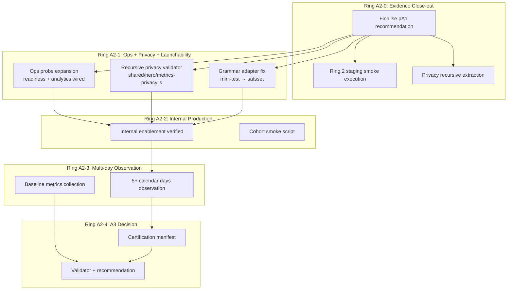

# Hero Mode pA2 — Evidence Close-out, Internal Cohort Measurement, and Minimal Operations Contract

## Overview

A2 converts Hero Mode from a locally validated, default-off system into an internally measured, operationally observable, privacy-safe, team-only production pilot. It closes the pA1 evidence gap honestly, builds a minimal operations surface, fixes the Grammar launchability gap, hardens privacy validation to recursive depth, runs a tiny internal cohort, and produces a grounded A3 go/hold/rollback decision.

No new gameplay. No new earning paths. No production default-on for non-internal accounts.

If pA1 evidence closes with blockers, A2 transitions to Remedial Hardening mode — it does not widen to internal cohort until gaps are resolved. This is a valid success path that prevents unsafe rollout.

---

## Problem Frame

pA1 is code-complete (PRs #613–#627) but calendar-bound evidence remains unfilled: Ring 2 staging smoke, Ring 3 multi-day observation, and Ring 4 internal production are all pending templates. The pA1 recommendation document is still in PENDING status with unchecked items for staging proof, operational readiness, and product safety sections.

A2 must first close this gap honestly. Only after pA1 evidence is resolved may it widen to an internal cohort. The internal cohort itself must be small (3–10 accounts), observable, and produce a measurable baseline for the A3 decision.

Key unresolved technical gaps:
- Grammar `mini-test` launcher is emitted by the provider but unmapped by the launch adapter — a dead CTA risk for breadth-maintenance learners.
- Privacy validation (`validateMetricPrivacy`) is top-level only — nested forbidden fields pass through.
- The ops surface is a single telemetry probe; `readiness.js` and `analytics.js` remain unwired.

---

## Requirements Trace

- R1. Close pA1 evidence gap honestly — complete or supersede Ring 2/3/4 evidence; finalise pA1 recommendation (Goal 1)
- R2. Build minimal operations surface answering the 10 operator questions from origin Goal 2 (Goal 2)
- R3. Fix Grammar launchability parity — no dead primary actions (Goal 3)
- R4. Recursive privacy validation for metrics and ops output (Goal 4)
- R5. Run internal cohort with 3–10 team accounts for 5+ calendar days (Goal 5)
- R6. Establish learning/reward-health baselines across the 4 metric families: learning health, engagement, economy/camp, and technical safety (Goal 6)
- R7. Operator/support explanation path for task selection (Goal 7)
- R8. Produce A3 go/hold/rollback recommendation with evidence (Goal 8)

---

## Scope Boundaries

- No public cohort rollout or production default-on
- No new Hero monsters, earning rules, bonus coins, streak mechanics, or per-question rewards
- No parent reports, six-subject expansion, or broad data warehouse work
- No full analytics dashboard — ops surface is admin-only and minimal
- No direct subject Star mutations, mastery rule changes, or subject-owned mutations via Hero commands or admin tools (subject Stars may change as a natural result of subject learning scheduled by Hero — this is subject engine autonomy, not a Hero mutation)
- No item-level scheduling by Hero Mode

### Deferred to Follow-Up Work

- Full external cohort management (A3 scope if A2 proceeds)
- Per-metric alerting thresholds (requires A2 baselines first)
- Admin panel UI for Hero ops (A2 uses JSON probe only; panel is A3/B-series)
- Automated cohort selection rules (A2 uses explicit account list)

---

## Context & Research

### Relevant Code and Patterns

| Component | Path | Role |
|-----------|------|------|
| Grammar provider | `worker/src/hero/providers/grammar.js` | Emits `mini-test` launcher for breadth-maintenance (L128) |
| Grammar adapter | `worker/src/hero/launch-adapters/grammar.js` | Maps only `smart-practice` → `smart`, `trouble-practice` → `trouble` |
| Privacy validator | `shared/hero/metrics-contract.js:109-120` | Top-level FORBIDDEN_FIELDS check only |
| Recursive strip | `worker/src/hero/telemetry-probe.js:26-37` | Output-side recursive strip — not input-side |
| Readiness checks | `worker/src/hero/readiness.js` | 5 checks (flags, economy, camp, state, corruption) — unwired |
| Health indicators | `worker/src/hero/analytics.js` | Balance bucket, reconciliation gap, spend patterns — unwired |
| Account override | `shared/hero/account-override.js` | JSON secret array, additive force-enable |
| Telemetry probe | `worker/src/hero/telemetry-probe.js` | D1 event_log reader, admin route at L2668 of app.js |

### Institutional Learnings

- **Evidence-locked certification pattern** (grammar-qg): manifest-driven; validator rejects over-claiming. A2 should adopt for A3 readiness.
- **D1 tail latency** (sys-hardening-p5): P95/P50 ratio of 4.2×. Do not set tight thresholds. Use `batch()` never `withTransaction`.
- **Measure-first methodology** (hero-p6): define metrics structure first; set thresholds only after baselines accumulate.
- **Event enrichment, never new event types** (hero-p6): A2 metrics use existing event families.
- **Confidence-gated recommendations** (grammar-qg-p6): declare per-metric confidence based on sample size.
- **Pre-gate ordering** (pA1 security fix #627): authenticate → override → gate. A2 must not regress this.

---

## Key Technical Decisions

- **Grammar fix: add adapter mapping** — Add `'mini-test': 'satsset'` to `launch-adapters/grammar.js`. The Grammar engine already supports `satsset` mode (engine.js L693). This is simpler and more honest than changing the provider intent or suppressing envelopes. One-line change with explicit test coverage.
- **Recursive privacy: extract shared utility** — Lift `stripPrivacyFields` and the expanded FORBIDDEN list from `telemetry-probe.js` into `shared/hero/metrics-privacy.js`. Use it in both input-side validation (`validateMetricPrivacy`) and output-side stripping. This avoids duplicating recursive logic across worker and shared layers.
- **Ops surface: expand existing probe route** — Wire `readiness.js` and `analytics.js` into the existing `/api/admin/hero/telemetry-probe` route (as additional sections in the response) rather than adding multiple new routes. Keeps admin surface minimal and auditable.
- **A2 evidence structure: manifest-driven** — Create `reports/hero/hero-pA2-certification-manifest.json` declaring which evidence artefacts must exist for each ring. A validator script (`scripts/validate-hero-pA2-certification-evidence.mjs`) mechanically gates the A3 recommendation.
- **Cohort smoke script: enriched probe** — The Ring A2-2 / A2-3 observation uses a script that queries the ops probe, formats a dated observation record, and appends to evidence markdown.

---

## Open Questions

### Resolved During Planning

- **Should we build a client admin panel for Hero ops?** No — A2 keeps the ops surface as admin-only JSON probe. A client panel is A3/B-series scope. Operators use the probe output or the cohort smoke script.
- **Should pA1 Ring 4 be completed or replaced?** Replaced. A2's internal cohort ring (Ring A2-2 + A2-3) subsumes pA1 Ring 4. The pA1 recommendation document will be finalised with a "superseded by A2" note for Ring 4.
- **How do we gate the A3 decision mechanically?** Certification manifest pattern from grammar-qg. A JSON manifest declares required evidence files; a validator script rejects claims that lack backing artefacts.

### Deferred to Implementation

- Exact internal cohort account IDs (team operational decision at Ring A2-2 time)
- Exact number of observation days beyond the 5-day minimum (decided during Ring A2-3)
- Whether any metric shows `insufficient_data` requiring extended observation

---

## High-Level Technical Design

> *This illustrates the intended approach and is directional guidance for review, not implementation specification. The implementing agent should treat it as context, not code to reproduce.*

---

## Implementation Units

**Ring parallelism note:** U1 (Ring A2-0 evidence close-out) may run in parallel with U2, U3, U4 (Ring A2-1 code work). The origin contract allows A2 to start code work while evidence is being closed. However, entry into Ring A2-2 (internal production enablement) requires U1 to complete without blocking evidence. If U1 discovers defects, A2 transitions to remedial mode before widening.

- U1. **pA1 Evidence Close-out and Recommendation Finalisation**

**Goal:** Honestly close the pA1 evidence gap. Finalise the recommendation document. Mark pA1 Ring 4 as superseded by A2 internal cohort.

**Requirements:** R1

**Dependencies:** None

**Files:**
- Modify: `docs/plans/james/hero-mode/A/hero-pA1-recommendation.md`
- Modify: `docs/plans/james/hero-mode/A/hero-pA1-ring2-evidence.md`
- Modify: `docs/plans/james/hero-mode/A/hero-pA1-ring3-evidence.md`
- Modify: `docs/plans/james/hero-mode/A/hero-pA1-ring4-evidence.md`

**Approach:**
- Execute `scripts/hero-pA1-staging-smoke.mjs` against local dev (or staging if available) and record Ring 2 evidence
- For Ring 3, document the minimum multi-day observation that pA1's own Ring 3 requires (2+ date keys). If calendar execution has not happened, mark honestly as "deferred to A2 Ring A2-3 (supersedes pA1 Ring 3 with real production data)"
- Mark Ring 4 as "superseded by A2 internal cohort — Ring A2-2 and Ring A2-3 provide stronger evidence under production conditions"
- Complete the recommendation as: **PROCEED TO A2** with condition that A2 begins in evidence close-out mode
- Reconcile test-count position (current: 382+ tests from P6 baseline)
- Ensure no document implies production readiness where only local/staging evidence exists

**Execution note:** Evidence-first — this unit fills templates and finalises documents; no production code changes.

**Patterns to follow:**
- pA1 plan completion report format (`docs/plans/james/hero-mode/A/hero-pA1-plan-completion-report.md`)
- Evidence-locked honesty from grammar-qg pattern (no over-claiming)

**Test scenarios:**
- Test expectation: none — documentation-only unit with no behavioural changes

**Verification:**
- pA1 recommendation status is no longer PENDING
- Ring 2/3/4 evidence documents have a clear status (complete, deferred-to-A2, or superseded-by-A2)
- No document claims Ring 3/4 passed if calendar execution has not occurred

---

- U2. **Recursive Privacy Validator Extraction**

**Goal:** Extract recursive privacy stripping into a shared utility and upgrade `validateMetricPrivacy` to reject forbidden fields at any nesting level.

**Requirements:** R4

**Dependencies:** None

**Files:**
- Create: `shared/hero/metrics-privacy.js`
- Modify: `shared/hero/metrics-contract.js`
- Modify: `worker/src/hero/telemetry-probe.js`
- Create: `tests/hero-pA2-privacy-recursive.test.js`

**Approach:**
- Extract `stripPrivacyFields` and the expanded FORBIDDEN list (`rawAnswer`, `rawPrompt`, `childFreeText`, `childInput`, `answerText`, `rawText`, `childContent`) into `shared/hero/metrics-privacy.js`
- Replace `validateMetricPrivacy` in `metrics-contract.js` with a recursive implementation that walks all nesting levels (objects and arrays) and collects violations at any depth, reporting the full path (`field.nested.rawAnswer`)
- Update `telemetry-probe.js` to import from the shared module rather than maintaining its own copy
- The validator returns `{ valid: boolean, violations: string[] }` where violations include the dotted path to each forbidden field

**Patterns to follow:**
- Existing `stripPrivacyFields` recursion pattern in `telemetry-probe.js`
- Pure shared module convention (zero side-effects, no node: imports)

**Test scenarios:**
- Happy path: payload with no forbidden fields passes validation
- Happy path: payload with allowed nested objects passes validation
- Edge case: forbidden field at root level is detected (`{ rawAnswer: 'x' }`)
- Edge case: forbidden field nested one level deep (`{ data: { childFreeText: 'x' } }`)
- Edge case: forbidden field nested three levels deep (`{ a: { b: { c: { rawPrompt: 'x' } } } }`)
- Edge case: forbidden field inside an array (`{ items: [{ answerText: 'x' }] }`)
- Edge case: empty payload, null payload, non-object payload all pass
- Edge case: multiple violations at different depths reported with full paths
- Integration: `telemetry-probe.js` still strips fields identically after refactor (existing probe test still passes)

**Verification:**
- All new tests pass
- Existing `hero-pA1-telemetry-probe.test.js` still passes without modification
- `validateMetricPrivacy` rejects nested forbidden fields that the old implementation would miss

---

- U3. **Grammar Launchability Parity Fix**

**Goal:** Map `mini-test` launcher to `satsset` mode in the Grammar launch adapter so breadth-maintenance envelopes become launchable.

**Requirements:** R3

**Dependencies:** None

**Files:**
- Modify: `worker/src/hero/launch-adapters/grammar.js`
- Modify: `tests/hero-pA1-launchability-parity.test.js` (update assertions that explicitly assert `mini-test` is non-launchable — this is now intentionally launchable)
- Modify: `tests/hero-launch-adapters.test.js` (update Grammar adapter assertions for `mini-test`)
- Create: `tests/hero-pA2-launchability-secure-grammar.test.js`

**Approach:**
- Add `'mini-test': 'satsset'` to the `LAUNCHER_TO_MODE` mapping in `worker/src/hero/launch-adapters/grammar.js`
- Update existing pA1 launchability tests: assertions like `assert.ok(unsupported.includes('mini-test'))` must be changed to reflect the new launchable status. This is an intentional evolution, not a regression — pA1 proved the gap was safe via fallback; A2 makes it safe via direct mapping
- Write explicit test coverage for every Grammar learner state from the A2 contract Goal 3: Grammar-only with weak, due, retention-after-secure, secure-only, mixed subject learner with unsupported launcher, no eligible subjects, all tasks non-launchable

**Patterns to follow:**
- Existing spelling/punctuation adapter pattern (`'guardian-check': 'guardian'`, `'gps-check': 'gps'`)

**Test scenarios:**
- Happy path: Grammar learner with `secureCount >= 3` produces launchable breadth-maintenance envelope via `mini-test` → `satsset`
- Happy path: Grammar learner with weak concepts produces launchable `trouble-practice` envelope
- Happy path: Grammar learner with due concepts produces launchable `smart-practice` envelope
- Happy path: Grammar learner with retention-after-secure produces launchable `smart-practice` envelope
- Edge case: Grammar-only learner where ALL envelopes are launchable (no fallback needed)
- Edge case: Grammar learner with `secureCount >= 3` and no other concepts — `mini-test` is the only envelope and it must be launchable
- Edge case: mixed learner where Grammar emits `mini-test` and other subjects emit supported launchers — all launchable
- Integration: `mapToSubjectPayload({ launcher: 'mini-test' })` returns `{ launchable: true, subjectId: 'grammar', payload: { mode: 'satsset' } }`

**Verification:**
- `mapToSubjectPayload` returns `launchable: true` for all three Grammar launcher values (`smart-practice`, `trouble-practice`, `mini-test`)
- Existing `hero-pA1-launchability-parity.test.js` passes after assertions are updated to reflect intentional launchability change
- Existing `hero-launch-adapters.test.js` passes after Grammar adapter assertions are updated
- No dead CTA scenario exists for any Grammar learner state

---

- U4. **Ops Probe Expansion — Readiness and Health Indicators**

**Goal:** Wire `readiness.js` and `analytics.js` into the admin hero probe route so operators can answer all 10 questions from A2 §4.2.

**Requirements:** R2, R7

**Dependencies:** U2 (privacy module extraction — for input-side validation of expanded response; output-side stripping already works without U2)

**Files:**
- Modify: `worker/src/app.js` (hero telemetry probe route, ~L2668)
- Modify: `worker/src/hero/telemetry-probe.js` (or create separate probe assembler)
- Create: `tests/hero-pA2-ops-probe.test.js`

**Approach:**
- Expand the `/api/admin/hero/telemetry-probe` response to include three sections:
  1. `events` — existing last-N events (unchanged)
  2. `readiness` — output of `deriveReadinessChecks(heroState, flags)` for the specified learner
  3. `health` — output of `deriveHeroHealthIndicators(heroState, ledger)` plus `deriveReconciliationGap` and `classifySpendPattern`
- Add required query param `?learnerId=X` for readiness/health sections (without it, only `events` is returned). Load state via `repository.readHeroProgress(learnerId)` — `repository` is already in scope as a closure variable at L2670. The ledger lives inside `heroState.economy.ledger` (embedded in the state JSON, not a separate table)
- Resolve flags for the queried learner via `resolveHeroFlagsWithOverride({ env, accountId })` to show effective flag status
- Continue to use recursive privacy stripping on all output (already works via existing `stripPrivacyFields`)
- Add an `overrideStatus` field showing whether the queried account has Hero flags via override vs global env
- Keep rate-limiting (60/min) and admin RBAC gate unchanged

**Note on U2 dependency:** U4 can execute before U2 completes because output-side recursive stripping already works in the probe. U2 adds input-side *validation* (rejecting events that should never have been stored with forbidden fields). U4 benefits from U2 but does not strictly block on it.

**Patterns to follow:**
- Existing admin ops route pattern in `app.js`
- Pure derivation modules read state, never write

**Test scenarios:**
- Happy path: probe returns events + readiness + health sections for a valid learner
- Happy path: `?learnerId=X` param returns data for specified learner
- Happy path: readiness checks all pass for a fully-configured Hero learner
- Edge case: no Hero state exists → readiness returns `not_started`, health returns safe defaults
- Edge case: learner with negative balance → readiness reports `fail` for economyHealthy
- Edge case: reconciliation gap detected → health reports `hasGap: true`
- Error path: non-admin caller rejected with appropriate error
- Error path: rate limit exceeded returns 429
- Privacy: output contains no forbidden fields even if state has unexpected nested content
- Integration: existing telemetry-probe route tests still pass with expanded response shape

**Verification:**
- Admin can query the probe and see flag status, readiness, health indicators, reconciliation, and spend patterns
- All 10 operator questions from A2 §4.2 are answerable from the probe response
- Privacy stripping applies to expanded output

---

- U5. **Internal Override Surface Verification**

**Goal:** Verify the per-account override mechanism works correctly under A2 cohort conditions and add regression coverage for the pA1 security fix (pre-gate ordering).

**Requirements:** R5 (preparation)

**Dependencies:** U4

**Files:**
- Modify: `tests/hero-pA1-account-override.test.js` (add A2-specific scenarios)
- Create: `tests/hero-pA2-internal-override-surface.test.js`

**Approach:**
- Verify that when global Hero flags are OFF but `HERO_INTERNAL_ACCOUNTS` lists an account, that account can: access read-model, start tasks, claim completions, award coins, use Camp
- Verify that non-listed accounts see no Hero surfaces when global flags are OFF
- Regression test for pA1 security fix: authenticate → override → gate ordering (not raw env check before auth)
- Test override with edge cases: empty JSON, malformed JSON, account ID not in list, duplicate entries in list

**Patterns to follow:**
- Existing `hero-pA1-account-override.test.js` structure

**Test scenarios:**
- Happy path: listed account with global-OFF receives all 6 flags force-enabled
- Happy path: listed account can access read-model, launch, claim, and camp routes
- Edge case: non-listed account with global-OFF receives no Hero surfaces (empty read-model)
- Edge case: empty HERO_INTERNAL_ACCOUNTS (`[]`) → no override applied to any account
- Edge case: malformed JSON string → graceful fallback, no override, no crash
- Edge case: account listed twice → still works (no double-enable side-effect)
- Security: direct route access without authentication cannot bypass override → 401 before override resolution
- Security: route pre-gate checks after authenticate-and-override, not before (pA1 #627 regression)
- Integration: override + ops probe → admin for listed account can probe their own Hero state

**Verification:**
- Non-internal accounts cannot see Hero surfaces when global flags are OFF
- Internal accounts see full Hero surfaces via override
- The authenticate→override→gate ordering is proven by test

---

- U6. **Cohort Smoke Script and Observation Infrastructure**

**Goal:** Build the script that exercises production infrastructure for the internal cohort and formats dated observation records.

**Requirements:** R5, R6

**Dependencies:** U4, U5

**Files:**
- Create: `scripts/hero-pA2-cohort-smoke.mjs`
- Create: `docs/plans/james/hero-mode/A/hero-pA2-ops-evidence.md`
- Create: `docs/plans/james/hero-mode/A/hero-pA2-internal-cohort-evidence.md`

**Approach:**
- Script queries the expanded ops probe for each internal cohort account
- Formats a dated observation record (markdown table row) with: date, account pseudonym (no PII), readiness status, health indicators, event count, reconciliation gap, latest claim/award status
- Appends to `hero-pA2-internal-cohort-evidence.md`
- Checks stop conditions: duplicate award, negative balance, dead CTA, privacy violation — reports STOP if any fire
- Validates privacy by running `validateMetricPrivacy` (recursive) on the probe response
- Produces a structured summary suitable for the A3 recommendation

**Patterns to follow:**
- Existing `scripts/hero-pA1-staging-smoke.mjs` pattern
- Grammar QG calibration telemetry: script-only analytics, produce reports not mutations

**Test scenarios:**
- Test expectation: none — script infrastructure for manual/operational use; validated by smoke execution not unit test

**Verification:**
- Script runs against local dev without errors
- Produces correctly formatted observation records
- Stop condition detection logic alerts on injected bad state

---

- U7. **A2 Metrics Baseline Evidence and Health Signals**

**Goal:** Collect and structure the learning/reward-health baselines from the internal cohort for the A3 decision.

**Requirements:** R6

**Dependencies:** U6

**Files:**
- Create: `docs/plans/james/hero-mode/A/hero-pA2-metrics-baseline.md`
- Create: `scripts/hero-pA2-metrics-summary.mjs`

**Approach:**
- After 5+ calendar days of cohort observation, the metrics summary script aggregates probe data into the 4 metric family groups (learning health, engagement, economy/camp, technical safety)
- For each metric, report: observed count, min, max, mean (where applicable), confidence level (high >100, medium 30–100, low 10–30, insufficient <10)
- Flag any metric with `insufficient_data` clearly — these cannot support a PROCEED recommendation
- Identify any stop-condition triggers during the observation window
- Report per-signal results for the A2 contract health test (origin Goal 6): clarity, completion, spam, dead-ends, duplicate rewards, privacy risk, mastery distortion

**Patterns to follow:**
- Grammar QG confidence-gating methodology
- Measure-first: baselines first, thresholds proposed (not enforced) for A3

**Test scenarios:**
- Test expectation: none — analysis script for operational use; correctness proven by output review

**Verification:**
- Metrics baseline document covers all 4 families
- Each metric states its confidence level honestly
- No metric claims full coverage without sufficient observations

---

- U8. **A2 Certification Manifest and Validator**

**Goal:** Create the machine-verifiable certification gate for the A3 recommendation.

**Requirements:** R8

**Dependencies:** U1, U2, U3, U4

**Files:**
- Create: `reports/hero/hero-pA2-certification-manifest.json`
- Create: `scripts/validate-hero-pA2-certification-evidence.mjs`
- Create: `tests/hero-pA2-certification-evidence.test.js`

**Approach:**
- Manifest declares required evidence artefacts for each ring:
  - Ring A2-0: pA1 recommendation finalised, Ring 2/3/4 status resolved
  - Ring A2-1: ops probe test passing, privacy recursive test passing, launchability test passing
  - Ring A2-2: internal cohort evidence file exists with ≥1 observation
  - Ring A2-3: cohort evidence has ≥5 dated observations with ≥2 unique date keys
  - Ring A2-4: metrics baseline exists, risk register exists, recommendation exists
- Validator script checks file existence, parses minimum content requirements, and reports certification status: `NOT_CERTIFIED`, `CERTIFIED_WITH_LIMITATIONS`, `CERTIFIED_PRE_A3`
- Test suite runs the validator against a mock evidence tree to prove the gating logic

**Patterns to follow:**
- `reports/grammar/grammar-qg-p9-certification-manifest.json` structure (adopt the manifest-gates-decision *principle*; the schema differs — grammar-qg validates content generation counts, Hero pA2 validates file existence and observation counts)
- `scripts/validate-grammar-qg-certification-evidence.mjs` pattern (validation logic, not schema)

**Test scenarios:**
- Happy path: all evidence present → `CERTIFIED_PRE_A3`
- Edge case: pA1 recommendation still PENDING → `NOT_CERTIFIED` with reason
- Edge case: cohort evidence has only 3 observations → `NOT_CERTIFIED` (minimum 5)
- Edge case: cohort evidence has 5 observations but only 1 date key → `NOT_CERTIFIED` (minimum 2 date keys)
- Edge case: metrics baseline missing for one family → `CERTIFIED_WITH_LIMITATIONS` (states which family lacks data)
- Edge case: all evidence present but one metric has `insufficient_data` → `CERTIFIED_WITH_LIMITATIONS`

**Verification:**
- Validator correctly rejects incomplete evidence
- Validator correctly accepts complete evidence
- Certification status matches the evidence-locked pattern from grammar-qg

---

- U9. **A3 Decision Recommendation and Risk Register**

**Goal:** Produce the final A3 go/hold/rollback recommendation with full evidence backing.

**Requirements:** R8

**Dependencies:** U7, U8

**Files:**
- Create: `docs/plans/james/hero-mode/A/hero-pA2-risk-register.md`
- Create: `docs/plans/james/hero-mode/A/hero-pA2-recommendation.md`
- Create: `docs/plans/james/hero-mode/A/hero-pA2-completion-report.md`

**Approach:**
- Run the certification validator and record its output
- Write the risk register covering: D1 latency, launchability, privacy, economy integrity, Camp idempotency, rollback safety, cohort blast-radius
- Write the recommendation document with: evidence summary, stop-condition review, unresolved defects, privacy assessment, rollout blast-radius assessment, A3 risk register, confidence levels per metric family
- The recommendation must be one of: PROCEED TO A3 / HOLD AND HARDEN / ROLLBACK
- If proceeding: define A3 scope (limited external cohort), selection criteria, support ownership
- If holding: list specific remediation items with evidence of what failed
- If rolling back: document state-dormancy preservation steps

**Execution note:** This unit executes after the cohort observation window closes. It is a documentation and decision unit, not a code unit.

**Patterns to follow:**
- pA1 recommendation template structure
- Evidence-locked honesty: only claim what evidence supports

**Test scenarios:**
- Test expectation: none — documentation and decision artefact, validated by certification manifest

**Verification:**
- Recommendation document is dated and signed with evidence owner
- Certification validator reports `CERTIFIED_PRE_A3` or explains limitations
- Decision is one of the three allowed options with rationale
- A3 scope is defined if proceeding
- No document over-claims beyond what the evidence supports

---

## System-Wide Impact

- **Interaction graph:** U4 modifies the admin probe route response shape — any existing admin tooling consuming this route will receive additional fields. The change is additive (new keys alongside existing `events`), so consumers that only read `events` are unaffected.
- **Error propagation:** Privacy validation failures in U2 are surfaced as violations in the return value. They do not throw — callers decide whether to reject the event. The probe route strips violations before output.
- **State lifecycle risks:** None. A2 introduces no new state shapes, mutations, or earning paths. All cohort observation is read-only.
- **API surface parity:** The probe route is admin-only and internal. No public API changes.
- **Integration coverage:** U5 verifies the override→route→state chain end-to-end. U6 verifies probe output under real cohort conditions.
- **Unchanged invariants:** 6-flag hierarchy, server-side recomputation, three-tier idempotency, +100/day cap, and subject authority boundaries all remain unchanged. All existing Hero tests (382+) serve as the regression baseline.

---

## Risks & Dependencies

| Risk | Mitigation |
|------|------------|
| Grammar engine `satsset` mode has edge cases with secure-only learners | U3 writes explicit test fixture for this learner state |
| Recursive privacy validator performance on large payloads | Hero event payloads are bounded by design (no unbounded arrays). Add a depth limit of 10 levels |
| Internal cohort too small to produce meaningful baselines | Accept `insufficient_data` honestly rather than over-claiming. Recommend extended observation or more accounts in A3 |
| D1 tail latency variance during cohort observation | Apply 4.2× P95/P50 ratio from sys-hardening-p5 knowledge. Do not set tight thresholds |
| pA1 Ring 2/3 evidence reveals blocking defects | U1 handles this: if evidence reveals blockers, A2 stays in remedial mode and does not widen |
| Existing Hero tests regress from U2/U3/U4 changes | Run full test suite before and after each unit. Zero regressions allowed |

---

## Documentation / Operational Notes

- pA1 recommendation document finalised (no longer PENDING)
- Rollout playbook updated with A2 cohort procedure
- Ops probe usage documented for internal cohort operators
- Privacy validation recursive coverage documented
- Launchability parity note updated (Grammar `mini-test` now mapped)
- A3 forecast grounded from evidence, not hope

---

## Sources & References

- **Origin document:** [docs/plans/james/hero-mode/A/hero-mode-pA2.md](docs/plans/james/hero-mode/A/hero-mode-pA2.md)
- **pA1 plan:** [docs/plans/2026-04-29-010-feat-hero-mode-pA1-staging-rollout-validation-plan.md](docs/plans/2026-04-29-010-feat-hero-mode-pA1-staging-rollout-validation-plan.md)
- **pA1 completion report:** [docs/plans/james/hero-mode/A/hero-pA1-plan-completion-report.md](docs/plans/james/hero-mode/A/hero-pA1-plan-completion-report.md)
- Architecture pattern: `docs/solutions/architecture-patterns/validation-phase-per-account-flag-override-2026-04-29.md`
- Architecture pattern: `docs/solutions/architecture-patterns/hero-p6-production-hardening-metrics-rollout-2026-04-29.md`
- Architecture pattern: `docs/solutions/architecture-patterns/evidence-locked-production-certification-2026-04-29.md`
- Related code: `shared/hero/metrics-contract.js`, `worker/src/hero/telemetry-probe.js`, `worker/src/hero/readiness.js`, `worker/src/hero/analytics.js`
