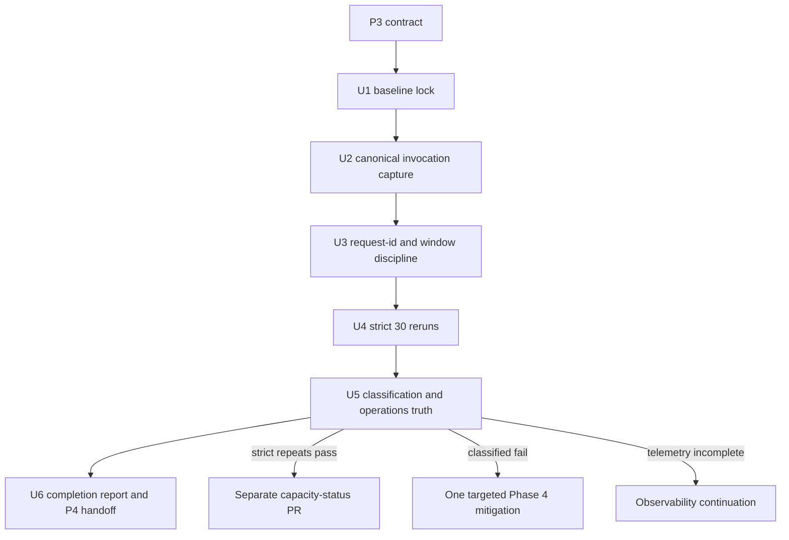

# feat: System Hardening Optimisation P3 Invocation Telemetry Gate

## Summary

Implement P3 as an observability repair and strict evidence decision phase: prove a machine-joinable Cloudflare invocation CPU/wall capture path, repeat the strict 30-learner gate with that telemetry present, then choose one next mitigation path from evidence rather than optimisation guesswork.

PR #699 executed only the repo-local telemetry-tooling slice of this plan. It did not close the original P3 contract. The remaining P3 contract work is the operator smoke, strict production reruns, top-tail classification, and final decision report required by `docs/plans/james/sys-hardening/A/sys-hardening-optimisation-p3.md`.

The 2026-04-30 P3-T0 smoke later proved the live `npm run ops:tail:json` path on a bounded production run, with 2/2 retained top-tail bootstrap samples matched for both invocation CPU/wall and statement logs. That smoke closes the operator-path proof gap only; strict P3-T1 and P3-T5 repeat evidence remain required.

---

## Problem Frame

P2 ended correctly as non-certifying: the first strict 30 run passed, the repeated strict run failed bootstrap P95, statement-log coverage was complete, and Cloudflare invocation CPU/wall coverage was 0/10 for top-tail bootstrap samples. P3 exists because the blocker is now the missing telemetry layer, not a proven D1, Worker CPU, payload, or policy defect.

## Execution Boundary

The source contract remains the authority. A tooling-complete branch is not a P3 terminal outcome. P3 is complete only when the contract exits through one of the product outcomes in the original document: `strict-30-certified-candidate`, `strict-30-still-blocked-classified`, `strict-30-still-blocked-unclassified`, or `telemetry-repair-failed`.

The required final P3 report path remains unfilled until that terminal outcome exists:

```text
docs/plans/james/sys-hardening/A/sys-hardening-optimisation-p3-completion-report.md
```

---

## Assumptions

*This plan was authored without synchronous user confirmation. The items below are agent inferences that fill gaps in the input - un-validated bets that should be reviewed before implementation proceeds.*

- The referenced P3 contract remains the governing scope, and this dated plan should be the executable implementation plan rather than an in-place rewrite of `docs/plans/james/sys-hardening/A/sys-hardening-optimisation-p3.md`.
- The exact Cloudflare export source available to the operator is not yet proven; the plan assumes P3 will validate one approved JSON/JSONL source through fixtures or a non-certifying smoke capture, and will exit as `telemetry-repair-failed` if none can provide CPU/wall telemetry.
- No D1, Worker CPU, payload, launch-policy, threshold, or capacity-wording mitigation should be implemented before the P3 telemetry and classification gates are satisfied.

---

## Requirements

- R1. Preserve the P2 capacity truth: P2 T5 remains the current strict 30 decision row, public wording remains `small-pilot-provisional`, and a single passing T1 must not certify 30 learners.
- R2. Prove one canonical machine-joinable Cloudflare invocation capture path that includes finite CPU and wall time for top-tail Worker invocations.
- R3. Keep invocation coverage and sampled `capacity.request` statement coverage separate; complete statement logs must not be interpreted as complete CPU/wall coverage.
- R4. Preserve request-id pairing and capture-window discipline so strict-run top-tail request IDs can be joined to raw operator-held logs without committing raw logs.
- R5. Keep redaction fail-closed: committed production-derived evidence artefacts use opaque `req_<hash>` and `stmt_<hash>` identifiers and must not include raw `ks2_req_*`, SQL, table/column names, cookies, bearer tokens, learner names, answers, request bodies, or response bodies. New P3 parser fixtures should use synthetic fixture-only request IDs rather than raw-looking `ks2_req_*` IDs unless the test is explicitly exercising legacy raw-ID redaction behaviour.
- R6. Rerun strict 30 evidence only after the capture path is proven; strict certification candidates must use the pinned `reports/capacity/configs/30-learner-beta.json` shape and unique output paths.
- R7. Classify top-tail bootstrap samples using client wall, app/server wall, Cloudflare Worker wall, Worker CPU, D1 duration, query count, D1 rows read/written, response bytes, statement coverage, and classification reasons.
- R8. Update Admin/Operations evidence truth only through verifier-backed and generated summary paths; diagnostic worker-log joins must remain diagnostic-only.
- R9. Keep the 1000-learner ledger modelling-only and explicitly separate from 30-learner certification.
- R10. End P3 with a completion report that chooses exactly one recommended Phase 4 path, or exits as `telemetry-repair-failed` without promotion or speculative optimisation.

---

## Scope Boundaries

- No 60, 100, 300, or 1000 learner certification.
- No threshold relaxation or warm-up/reduced-burst shortcut.
- No paid-tier migration decision.
- No broad bootstrap redesign.
- No D1 index migration, query rewrite, cache-policy change, Worker CPU optimisation, JSON/payload optimisation, or launch-policy change before P3 classifies the tail or exits as telemetry-repair-failed.
- No command write-amplification reduction.
- No Hero Mode, Hero economy, rewards, subject content, or learner-facing UX change.
- No removal of sibling learner state, writable learner identity, selected-learner switching, active-session inclusion, or `notModified` revision invalidation to improve numbers.
- No browser-owned production writes.
- No inference of Worker CPU from wall time.
- No raw `wrangler` deployment or remote D1 path in normal operations; keep package scripts and OAuth-safe wrappers.

### Deferred to Follow-Up Work

- **30-learner public capacity-status update:** separate PR only if P3 strict repeats pass, the verifier passes, joined telemetry is present, and the completion report recommends it.
- **Phase 4 mitigation:** separate plan/PR chosen by P3 classification: D1/query/cache, Worker CPU/JSON, payload, operations/platform, observability continuation, or unit-economics planning.
- **60-learner diagnostic or certification policy:** later work after P3 closes the 30-learner telemetry decision.
- **1000-learner economics:** later unit-economics route; P3 may refresh the ledger but must not certify the lighthouse target.

---

## Context & Research

### Relevant Code and Patterns

- `package.json` already exposes OAuth-safe `ops:tail` and `ops:tail:json` scripts, plus `capacity:classroom`, `capacity:classroom:release-gate`, and `capacity:verify-evidence`.
- `scripts/join-capacity-worker-logs.mjs` parses JSON, JSONL, Workers Trace-style records, Tail/Workers Logs-style records, and `[ks2-worker] capacity.request` console lines into diagnostic-only correlation output.
- `tests/capacity-worker-log-join.test.js` already has fixtures for Workers Trace and Tail Worker shapes and proves redacted request/statement IDs, separate invocation and statement coverage, and diagnostic-only joins.
- `scripts/lib/capacity-evidence.mjs` owns evidence schema version 3, the tail classification vocabulary, diagnostic worker-log join coverage, redaction helpers, and strict 30 release-gate shape checks.
- `scripts/classroom-load-test.mjs` owns capacity evidence generation, threshold config ingestion, top-tail sample retention, request IDs, run-shape metadata, and persisted evidence redaction.
- `scripts/verify-capacity-evidence.mjs` enforces the capacity evidence table, pinned threshold configs, provenance, diagnostic-only Worker log joins, and fail-closed classification for missing/null CPU/wall data.
- `scripts/generate-evidence-summary.mjs` excludes standalone diagnostic artefacts from certification metrics and keeps Admin Production Evidence tied to verified capacity rows.
- `src/platform/hubs/admin-production-evidence.js` builds the Admin evidence panel model and requires positive `certifying: true` for certification-tier states.
- `docs/operations/capacity-cpu-d1-evidence.md` already states that pretty tail can prove statement coverage but cannot fill invocation CPU/wall coverage.
- `docs/operations/capacity-tail-latency.md` already records the P2 evidence lock and says the next move is evidence-capture repair before mitigation.
- `reports/capacity/.gitignore` currently tracks everything under `reports/capacity/evidence/`; P3 should prevent raw worker-log captures from accidentally becoming tracked evidence.

### Institutional Learnings

- `docs/solutions/architecture-patterns/evidence-locked-production-certification-2026-04-29.md` reinforces that certification must be derivable from committed artefacts, not declared in prose.
- `docs/solutions/architecture-patterns/sys-hardening-p5-certification-closure-d1-latency-and-evidence-culture-2026-04-28.md` shows why honest failure records are more valuable than threshold relaxation or retry-until-green behaviour.
- `docs/solutions/best-practices/p3-stability-capacity-multi-learner-patterns-2026-04-27.md` reinforces characterisation-first and measure-first gates, especially for capacity claims and query-budget locks.
- Prior P6/P2 work treated contract documents as governing scope and closed false-promotion routes before claiming completion; P3 should preserve that posture.

### External References

- Cloudflare Workers Trace Events document `CPUTimeMs` and `WallTimeMs` as available fields for Worker invocations. https://developers.cloudflare.com/logs/logpush/logpush-job/datasets/account/workers_trace_events/
- Cloudflare Workers Logs identify invocation logs through `$cloudflare.$metadata.type = "cf-worker-event"` and recommend structured JSON logging for queryable log fields. https://developers.cloudflare.com/workers/observability/logs/workers-logs/
- Cloudflare Workers Logpush docs describe enabling Worker Logpush and note truncation limits for logs/exceptions, which matters when deciding what not to rely on in free-form log messages. https://developers.cloudflare.com/workers/observability/logs/logpush/
- Cloudflare Workers limits distinguish CPU time from waiting on network/database calls and state that Workers Logs, Tail Workers, and Logpush can expose CPU time and wall time. https://developers.cloudflare.com/workers/platform/limits/
- Cloudflare Tail Workers docs describe a real-time tail handler for producer Worker invocations; this is an approved source class only if the operator can provide a bounded export with CPU/wall fields. https://developers.cloudflare.com/workers/observability/logs/tail-workers/

---

## Key Technical Decisions

- **Treat the P3 contract as source of truth:** the implementation plan translates `P3-U0` through `P3-U6` into repo files, tests, and verification without broadening scope.
- **Repair telemetry before mitigation:** no code optimisation path is active until P3 can classify the strict-run top tail or explicitly exits as telemetry-repair-failed.
- **Prefer a canonical JSON/JSONL capture source over pretty-tail copy-paste:** pretty logs can be useful for statement coverage, but P3 requires Cloudflare invocation CPU/wall fields from a machine-joinable source.
- **Validate the chosen export shape with fixtures first:** a small redacted fixture should lock parser behaviour before strict production evidence is treated as decision-grade.
- **Keep missing, null, partial, or malformed CPU/wall data non-certifying:** null must remain non-finite, partial invocation records must be labelled partial, and malformed pretty lines should produce bounded warnings rather than silent success.
- **Keep raw capture files outside git by default:** committed artefacts should be evidence, statement maps, redacted tail correlations, classification markdown, docs, and reports; raw tail exports stay local/operator-held.
- **Use top-tail request IDs as the join contract:** the load driver already captures client/server request IDs and persists redacted evidence; the join path must keep matching redacted evidence back to raw local logs without persisting raw IDs.
- **Make time-window overlap a first-class warning:** capturing the wrong log window reproduces the P2 failure mode, so the join or checklist should warn when log timestamps do not overlap the capacity run.
- **Let strict evidence decide capacity, not diagnostics:** diagnostic joins explain a run; capacity promotion still requires strict verifier-backed evidence and a separate reviewed status update.
- **Make Admin evidence fail closed by construction:** generated summaries may surface failing, stale, missing, or non-certifying rows, but must not let a passing T1 or diagnostic join displace the failed T5 truth.

---

## Open Questions

### Resolved During Planning

- **Can P3 choose D1, Worker CPU, payload, or policy mitigation at plan time?** No. The source contract explicitly blocks mitigation before classification or telemetry-repair failure.
- **Are pretty-tail logs sufficient for P3?** No. P2 proved pretty-tail statement coverage can be complete while invocation CPU/wall coverage is still zero.
- **Does Cloudflare expose CPU/wall telemetry in official surfaces?** Yes. Official Workers Trace, Logs, Tail/Logpush, and limits documentation describe CPU/wall availability, but the repo must still prove the exact operator export shape.
- **Can `diagnostics.workerLogJoin` certify a run?** No. It remains diagnostic-only and cannot promote public capacity wording.
- **Should raw logs be committed for reproducibility?** No. Reproducibility comes from redacted fixtures and diagnostic artefacts; raw logs remain local/operator-held.
- **Whether one or two strict repeats are enough:** The source contract requires P3-T5 strict repeat 2 unless a written policy explains why exactly one repeat is sufficient.

### Deferred to Implementation

- **Which Cloudflare source is the P3 canonical export?** The implementer must select the source that the operator can actually capture and that contains CPU/wall fields, then lock that shape with redacted fixtures.
- **Whether `npm run ops:tail:json` alone is enough:** implementation must prove it with smoke/fixture data; if it lacks CPU/wall fields, choose another approved source or exit telemetry-repair-failed.
- **Exact strict P3 evidence result:** pass/fail status, tail classification, and Phase 4 recommendation depend on production-origin runs.
- **Whether Admin UI copy changes are needed:** docs and generated summary truth may be sufficient unless P3 surfaces a new ambiguous state that the Admin panel cannot represent.

---

## High-Level Technical Design

> *This illustrates the intended approach and is directional guidance for review, not implementation specification. The implementing agent should treat it as context, not code to reproduce.*



The decision matrix for P3 is:

| Evidence result | P3 decision | Next work |
| --- | --- | --- |
| Strict repeats pass, verifier passes, CPU/wall joins are present, no hidden warnings remain | `strict-30-certified-candidate` | Separate reviewed capacity-status PR. |
| Strict repeat fails and top-tail cause is `d1-dominated` | `strict-30-still-blocked-classified` | Phase 4 D1/query/cache mitigation. |
| Strict repeat fails and top-tail cause is `worker-cpu-dominated` | `strict-30-still-blocked-classified` | Phase 4 Worker CPU/JSON construction mitigation. |
| Strict repeat fails and top-tail cause is `payload-size-pressure` | `strict-30-still-blocked-classified` | Phase 4 payload/envelope mitigation. |
| Strict repeat fails and top-tail cause is client/network/platform overhead | `strict-30-still-blocked-classified` | Phase 4 operations/load-driver/platform investigation. |
| Strict repeat fails and top-tail cause is `mixed-no-single-dominant-resource` | `strict-30-still-blocked-classified` | Choose the least risky bounded mitigation from the evidence table and document rejected alternatives. |
| Strict repeat fails and joined invocation exists but statement logs are absent (`partial-invocation-only`) | `strict-30-still-blocked-unclassified` or limited CPU-only classification | Do not approve D1/query work; either classify Worker CPU pressure only if CPU evidence is decisive, or continue observability repair. |
| Strict repeat fails and telemetry is still incomplete | `strict-30-still-blocked-unclassified` | Observability repair continuation; no performance code. |
| No reliable CPU/wall capture source can be proven | `telemetry-repair-failed` | Alternative observability path decision. |

---

## Implementation Units

- U1. **Baseline Lock and P2 Truth Verification**

**Goal:** Confirm the starting evidence truth and prevent P2's single passing T1 from being reinterpreted as certification.

**Requirements:** R1, R6, R8, R9

**Dependencies:** None

**Files:**
- Create: `docs/plans/james/sys-hardening/A/sys-hardening-optimisation-p3-baseline.md`
- Review: `docs/plans/james/sys-hardening/A/sys-hardening-optimisation-p2-completion-report.md`
- Review: `reports/capacity/evidence/2026-04-29-p2-t1-strict-post-p1.json`
- Review: `reports/capacity/evidence/2026-04-29-p2-t5-strict-repeat-1.json`
- Review: `reports/capacity/evidence/2026-04-29-p2-t1-tail-correlation.json`
- Review: `reports/capacity/evidence/2026-04-29-p2-t5-tail-correlation.json`
- Review: `reports/capacity/latest-1000-learner-budget.json`
- Test: `tests/capacity-scripts.test.js`
- Test: `tests/capacity-worker-log-join.test.js`
- Test: `tests/capacity-evidence.test.js`
- Test: `tests/capacity-statement-map.test.js`
- Test: `tests/generate-evidence-summary.test.js`
- Test: `tests/verify-capacity-evidence.test.js`

**Approach:**
- Quote the final P2 decision and record that P2 T5 remains the active strict 30 evidence row.
- Confirm the expected P2 artefacts are present before starting new work.
- Record whether the executor is in a full clone or lean ZIP and whether ancestry verification is available.
- Preserve the distinction between verifier-backed evidence and diagnostic artefacts.

**Patterns to follow:**
- `docs/plans/james/sys-hardening/A/sys-hardening-optimisation-p2-completion-report.md`
- `docs/operations/capacity.md`
- `scripts/verify-capacity-evidence.mjs`

**Test scenarios:**
- Happy path: existing P2 strict evidence and focused capacity script tests pass in the available checkout context.
- Edge case: lean ZIP or shallow context records ancestry limitations explicitly and uses the ZIP-safe verifier bypass only for local review, not certification.
- Error path: missing P2 artefact blocks P3 progression until the baseline note says which artefact is unavailable and why.

**Verification:**
- The baseline note states that P3 starts from `small-pilot-provisional`, not a certified 30-learner state.
- The focused capacity script/verifier coverage still passes or any local-context limitation is recorded.

---

- U2. **Canonical Invocation Capture and Parser Fixtures**

**Goal:** Prove one supported Cloudflare export shape can produce finite `cpuTimeMs` and `wallTimeMs` matches in `diagnostics.workerLogJoin`.

**Requirements:** R2, R3, R5, R7

**Dependencies:** U1

**Files:**
- Modify: `scripts/join-capacity-worker-logs.mjs`
- Modify: `tests/capacity-worker-log-join.test.js`
- Create: `tests/fixtures/capacity-worker-logs/p3-invocation-export.jsonl`
- Modify: `docs/operations/capacity-cpu-d1-evidence.md`
- Modify: `docs/operations/capacity-tail-latency.md`

**Approach:**
- Select and document the canonical P3 capture source from the operator-available Cloudflare surface: JSON tail, Workers Logs export, Workers Trace/Logpush export, Tail Worker export, or another approved JSON/JSONL source.
- Add a synthetic, production-free parser fixture for the chosen shape with CPU/wall fields, outcome/status, timestamp, request URL/method, and enough request-id material to join. The P3 canonical fixture should use fixture-only request IDs, not raw-looking `ks2_req_*` values. Legacy raw-ID fixtures may remain only when they are explicitly testing redaction and parser compatibility.
- Keep parser support permissive for known wrappers but strict for CPU/wall semantics: missing, null, non-finite, or single-sided CPU/wall values must not become zeroes or matched invocation coverage.
- Report invocation coverage separately from statement coverage and preserve partial states.
- Treat malformed pretty/log lines as bounded warnings, not silent success.

**Patterns to follow:**
- `tests/fixtures/capacity-worker-logs/workers-trace.json`
- `tests/fixtures/capacity-worker-logs/tail-worker.jsonl`
- `scripts/lib/capacity-evidence.mjs`
- `docs/operations/capacity-cpu-d1-evidence.md`

**Test scenarios:**
- Happy path: a P3 fixture record with Cloudflare CPU and wall fields joins to a top-tail bootstrap sample and increments invocation matched coverage.
- Happy path: a separate sampled `capacity.request` line joins statement details and leaves statement coverage independent of invocation coverage.
- Edge case: CPU present but wall missing produces partial or insufficient invocation status and never `cpuTimeMs: 0` / `wallTimeMs: 0`.
- Edge case: null CPU/wall values remain non-finite and classify as `unclassified-insufficient-logs`.
- Error path: malformed JSONL or pretty-tail lines produce bounded warnings while preserving valid records in the same file.
- Error path: an export with statement logs but no invocation CPU/wall reproduces the P2 failure shape and classifies as insufficient logs.
- Integration: the correlation output remains diagnostic-only and is accepted by verifier coverage without contributing to certification.

**Verification:**
- The chosen export fixture proves matched finite invocation CPU/wall fields.
- The runbook names one canonical P3 capture source and explicitly says when P3 must exit telemetry-repair-failed.
- Log exports with parsed records but no timestamps produce a machine-readable capture-window warning before they can be treated as decision-grade evidence.

---

- U3. **Request-ID Pairing and Capture-Window Guardrails**

**Goal:** Make it hard to capture the wrong log window or commit raw logs while still allowing redacted evidence to join against raw operator-held request IDs.

**Requirements:** R3, R4, R5, R7

**Dependencies:** U2

**Files:**
- Modify: `scripts/join-capacity-worker-logs.mjs`
- Modify: `tests/capacity-worker-log-join.test.js`
- Modify: `docs/operations/capacity-cpu-d1-evidence.md`
- Modify: `reports/capacity/.gitignore`
- Test: `tests/capacity-scripts.test.js`

**Approach:**
- Add or strengthen overlap warnings when log timestamps do not cover the evidence run's `startedAt` / `finishedAt` window.
- Preserve matching from redacted persisted evidence IDs back to raw local logs while keeping committed outputs opaque.
- Add a machine-readable warning for the exact P2 failure shape: all retained statement logs match, all invocation CPU/wall logs are missing.
- Update the operator checklist to record capture start/end, origin, config path, learners, bootstrap burst, rounds, evidence path, local raw log path, redacted joined artefact path, and invocation coverage.
- Add ignore rules or naming guidance so raw `*-worker-logs*.jsonl` / pretty tail captures do not become committed evidence while redacted correlations and statement maps remain tracked.

**Patterns to follow:**
- `scripts/join-capacity-worker-logs.mjs`
- `reports/capacity/.gitignore`
- `docs/operations/capacity-cpu-d1-evidence.md`

**Test scenarios:**
- Happy path: evidence whose run window overlaps log timestamps produces no overlap warning.
- Edge case: logs entirely before or after the run produce a machine-readable warning while still parsing records.
- Edge case: redacted evidence request IDs match raw local log request IDs through the existing deterministic hash contract.
- Error path: all statement coverage matched plus zero invocation matches emits a specific insufficient-invocation warning.
- Error path: raw worker-log filenames under `reports/capacity/evidence/` are ignored or rejected by convention without hiding redacted `*-tail-correlation.json` artefacts.

**Verification:**
- Operators have a single capture checklist.
- A wrong-window capture is visible in the joined output before anyone reads classification as evidence.
- Raw logs remain local/operator-held and out of git.

---

- U4. **Strict 30 Rerun with Telemetry Present**

**Goal:** Produce P3 strict evidence only after the capture path is proven, with each run separately joinable and verifier-interpretable.

**Requirements:** R1, R4, R6, R7, R9

**Dependencies:** U1, U2, U3

**Files:**
- Create: `reports/capacity/evidence/<date>-p3-t0-smoke.json`
- Create: `reports/capacity/evidence/<date>-p3-t0-tail-correlation.json`
- Create: `reports/capacity/evidence/<date>-p3-t1-strict.json`
- Create: `reports/capacity/evidence/<date>-p3-t1-tail-correlation.json`
- Create: `reports/capacity/evidence/<date>-p3-t1-statement-map.json`
- Create: `reports/capacity/evidence/<date>-p3-t5-strict-r1.json`
- Create: `reports/capacity/evidence/<date>-p3-t5-strict-r1-tail-correlation.json`
- Create: `reports/capacity/evidence/<date>-p3-t5-strict-r1-statement-map.json`
- Create: `reports/capacity/evidence/<date>-p3-t5-strict-r2.json`
- Create: `reports/capacity/evidence/<date>-p3-t5-strict-r2-tail-correlation.json`
- Create: `reports/capacity/evidence/<date>-p3-t5-strict-r2-statement-map.json`
- Modify: `reports/capacity/latest-1000-learner-budget.json`
- Modify: `docs/operations/capacity-1000-learner-free-tier-budget.md`
- Test expectation: none -- this unit produces production evidence artefacts and relies on the script/verifier tests from U1-U3.

**Approach:**
- Start with a non-certifying smoke join or fixture-backed operator capture to prove the chosen telemetry route before strict runs.
- Use the pinned strict 30 gate shape and unique output paths for every certification candidate and repeat.
- Keep reduced-burst or warm-up evidence diagnostic only if needed to explain variability.
- Generate a redacted tail-correlation and statement-map artefact per strict run rather than merging runs together.
- Refresh the 1000-learner ledger from the new evidence while keeping the ledger modelling-only.

**Patterns to follow:**
- `reports/capacity/configs/30-learner-beta.json`
- `docs/operations/capacity-tail-latency.md`
- `docs/operations/capacity-cpu-d1-evidence.md`
- `scripts/classroom-load-test.mjs`
- `scripts/build-capacity-statement-map.mjs`
- `scripts/build-capacity-budget-ledger.mjs`

**Test scenarios:**
- Test expectation: none -- evidence runs are validated through verifier output, redaction scans, and the existing focused script tests.

**Verification:**
- Each strict run has a unique evidence path, redacted tail correlation, and statement map or explicit incomplete-coverage record.
- At least the retained top 10 bootstrap samples have finite invocation CPU/wall coverage, or the run is marked telemetry-incomplete and cannot support certification or mitigation selection.
- Any run considered certification-eligible passes the evidence verifier in a full clone without certification bypass.
- A failing repeat blocks certification even when an earlier strict run passes.

---

- U5. **Top-Tail Classification and Decision Record**

**Goal:** Convert P3 telemetry into a decision that names the current status and exactly one recommended next mitigation path.

**Requirements:** R7, R8, R9, R10

**Dependencies:** U4

**Files:**
- Create: `reports/capacity/evidence/<date>-p3-tail-classification.md`
- Modify: `docs/operations/capacity.md`
- Modify: `docs/operations/capacity-tail-latency.md`
- Modify: `docs/operations/capacity-cpu-d1-evidence.md`
- Modify: `scripts/generate-evidence-summary.mjs` (only if P3 exposes a summary classification gap)
- Modify: `src/platform/hubs/admin-production-evidence.js` (only if Admin cannot represent the P3 truth without ambiguity)
- Test: `tests/generate-evidence-summary.test.js`
- Test: `tests/admin-production-evidence.test.js`
- Test: `tests/react-admin-production-evidence.test.js`
- Test: `tests/verify-capacity-evidence.test.js`

**Approach:**
- Produce a per-run classification table for P3-T1 and every P3-T5 run.
- Include client wall, app/server wall, Worker wall, Worker CPU, D1 duration, query count, D1 rows read/written, response bytes, statement coverage, invocation coverage, and classification reason.
- Select one outcome: certified candidate, classified blocked, unclassified blocked, or telemetry repair failed.
- Update operations docs so the current status cannot be inferred from a passing T1 alone.
- Keep diagnostic artefacts excluded from generated certification metrics while allowing capacity-run evidence with embedded diagnostics to remain interpretable.

**Patterns to follow:**
- `reports/capacity/evidence/2026-04-29-p2-tail-classification.md`
- `scripts/generate-evidence-summary.mjs`
- `src/platform/hubs/admin-production-evidence.js`
- `docs/operations/capacity.md`

**Test scenarios:**
- Happy path: a strict run with repeated passing evidence, verifier eligibility, and certifying metadata appears as a certification candidate only when the capacity table verifies.
- Happy path: a failing strict repeat remains failed/non-certifying even when another strict run passes.
- Edge case: standalone tail-correlation and statement-map artefacts are ignored by summary certification metrics.
- Error path: missing invocation CPU/wall yields `unclassified-insufficient-logs` and cannot become an Admin success state.
- Error path: stale capacity evidence is not refreshed by regenerated summaries or auxiliary operational sources.
- Integration: Admin Production Evidence still prioritises capacity truth over smoke/diagnostic posture rows.

**Verification:**
- The classification record names exactly one recommended Phase 4 path.
- Rejected alternatives are documented with evidence-based reasons.
- Admin/Operations docs keep public wording unchanged unless a separate capacity-status PR is justified.

---

- U6. **Completion Report and Handoff**

**Goal:** Close P3 with an auditable report that does not confuse implementation completion with capacity certification.

**Requirements:** R1, R8, R9, R10

**Dependencies:** U5

**Files:**
- Create: `docs/plans/james/sys-hardening/A/sys-hardening-optimisation-p3-completion-report.md`
- Review: `docs/plans/james/sys-hardening/A/sys-hardening-optimisation-p3.md`
- Test expectation: none -- completion reporting is reviewed against evidence artefacts and verifier output.

**Approach:**
- Report the completion boundary, ZIP/local validation boundary if applicable, evidence inventory, strict run table, tail-correlation coverage table, top-tail classification table, certification decision, 1000-learner interpretation, validation results, residual blockers, and recommended Phase 4.
- Use "complete" only for an explicitly named slice, such as "telemetry-tooling SDLC complete", unless the strict certification criteria actually passed or the contract exits through another terminal P3 outcome.
- Include exact evidence file names and public capacity wording.
- If P3 exits telemetry-repair-failed, state that no performance mitigation or promotion is approved.

**Patterns to follow:**
- `docs/plans/james/sys-hardening/A/sys-hardening-optimisation-p2-completion-report.md`
- `docs/plans/james/sys-hardening/A/sys-hardening-optimisation-p3.md`

**Test scenarios:**
- Test expectation: none -- the completion report is a decision artefact, not executable behaviour.

**Verification:**
- The report states one of the P3 terminal outcomes and one recommended Phase 4 path.
- The report gives exact file paths for evidence and validation artefacts.
- The report keeps 1000-learner budget interpretation modelling-only.
- The governing source contract is not rewritten to relax completion criteria; any cross-reference update must preserve the original acceptance gates.

---

## System-Wide Impact

- **Interaction graph:** P3 touches capacity scripts, evidence artefacts, operations docs, generated evidence summary, and possibly Admin Production Evidence logic. It should not touch learner routes except through existing capacity evidence generation and structured logs.
- **Error propagation:** malformed log exports, missing CPU/wall fields, wrong capture windows, verifier failure, and failed strict repeats must surface as explicit warnings/failures rather than silent success or certification.
- **State lifecycle risks:** raw log files contain production-adjacent request metadata and must remain local; redacted artefacts are the only committed lifecycle objects.
- **API surface parity:** package scripts stay the operator interface; no new public API or learner-facing route is introduced.
- **Integration coverage:** parser, verifier, generated summary, Admin model, and evidence docs must agree that diagnostic artefacts explain but do not certify.
- **Unchanged invariants:** bootstrap payload content, selected learner state, sibling state, writable learner identity, `notModified` invalidation, command behaviour, and public `meta.capacity` boundaries remain unchanged.

---

## Risks & Dependencies

| Risk | Mitigation |
| --- | --- |
| Cloudflare export source does not include CPU/wall in the operator-accessible shape. | Prove the source through U2 fixture/smoke before strict runs; exit telemetry-repair-failed if no approved source works. |
| Pretty-tail statement coverage is mistaken for invocation coverage again. | Keep coverage fields separate and add the P2 failure-shape warning. |
| Raw production logs are accidentally committed under tracked `reports/capacity/evidence/`. | Update ignore/naming guidance and commit only redacted tail correlations, statement maps, classification, and evidence JSON. |
| A single passing strict run tempts false promotion. | Require strict repeat evidence and make the failed/latest row visible in operations docs and Admin summary. |
| Null CPU/wall values are coerced to zero and treated as healthy. | Parser and verifier tests explicitly cover null, missing, partial, and string-garbage CPU/wall values. |
| Diagnostic artefacts displace verified capacity evidence in Admin. | Summary/Admin tests keep standalone diagnostics ignored and certification tied to verified capacity rows. |
| P3 identifies client/platform overhead and engineers still optimise D1/JSON. | Decision record must select one Phase 4 path and document rejected alternatives. |
| 30-learner work is over-read as 1000-learner progress. | Refresh and restate the budget ledger as modelling-only; defer 1000 economics to a separate phase. |

---

## Documentation / Operational Notes

- P3 should update `docs/operations/capacity-cpu-d1-evidence.md` with the canonical capture source, fixture-backed schema notes, raw-log handling, and telemetry-repair-failed exit path.
- P3 should update `docs/operations/capacity-tail-latency.md` with the P3 run matrix and final classification outcome.
- P3 should update `docs/operations/capacity.md` only with verifier-backed status rows and wording that preserves `small-pilot-provisional` unless a separate status PR is justified.
- Raw capture examples should use local paths or explicitly ignored names; committed examples must be redacted fixtures.
- Production strict runs require operator judgement and should follow the existing confirmation and OAuth-safe package-script posture in `AGENTS.md`.

---

## Alternative Approaches Considered

- **Start with D1/query optimisation:** rejected because P2 query count, rows read, payload, 5xx, and hard signals stayed bounded while invocation CPU/wall was missing.
- **Infer CPU from client/app wall time:** rejected because Cloudflare distinguishes CPU execution time from wall time waiting on network/database work.
- **Use pretty-tail logs as the P3 canonical source:** rejected because P2 already proved pretty-tail statement logs did not provide invocation CPU/wall matches.
- **Commit raw worker-log exports for reproducibility:** rejected because raw logs may include unrelated live traffic or sensitive metadata; redacted fixtures and correlations are the durable artefacts.
- **Promote capacity from a passing T1 plus diagnostics:** rejected because P2's repeated strict failure remains the current evidence truth and diagnostic joins do not certify.

---

## Success Metrics

- P3 has a live/operator-proven canonical invocation capture path or a clear telemetry-repair-failed exit. A fixture-backed parser alone is a tooling milestone, not a P3 terminal outcome.
- Strict 30 P3 runs have unique evidence, joined tail-correlation, statement-map, and verifier interpretation.
- Top-tail classification names a resource class or explicitly says telemetry is still insufficient.
- Admin/Operations evidence cannot accidentally promote from T1, diagnostics, stale summary generation, or modelling ledgers.
- The P3 completion report recommends exactly one Phase 4 path.

---

## Final Validation Gates

Before any branch claims P3 completion, run and record:

```sh
node --test \
  tests/capacity-scripts.test.js \
  tests/capacity-worker-log-join.test.js \
  tests/capacity-evidence.test.js \
  tests/capacity-statement-map.test.js \
  tests/generate-evidence-summary.test.js \
  tests/verify-capacity-evidence.test.js

npm run capacity:verify-evidence
npm run check
git diff --check
```

Privacy scans must be recorded separately from test pass/fail. The expected result for new P3 committed evidence, operations docs, and reports is no raw secrets and no raw production request IDs:

```sh
grep -R "ks2_req_" reports/capacity/evidence docs/operations docs/plans/james/sys-hardening/A || true
grep -R "CLOUDFLARE_API_TOKEN\|ks2_session\|Bearer " reports/capacity/evidence docs/operations docs/plans/james/sys-hardening/A || true
```

Existing historical evidence may still contain legacy raw request IDs. That legacy state must be called out as residual risk rather than treated as proof that new P3 artefacts are allowed to persist raw IDs.

---

## Sources & References

- **Origin document:** [docs/plans/james/sys-hardening/A/sys-hardening-optimisation-p3.md](docs/plans/james/sys-hardening/A/sys-hardening-optimisation-p3.md)
- **P2 completion report:** [docs/plans/james/sys-hardening/A/sys-hardening-optimisation-p2-completion-report.md](docs/plans/james/sys-hardening/A/sys-hardening-optimisation-p2-completion-report.md)
- **P2 implementation plan:** [docs/plans/2026-04-29-012-feat-sys-hardening-optimisation-p2-bootstrap-tail-plan.md](docs/plans/2026-04-29-012-feat-sys-hardening-optimisation-p2-bootstrap-tail-plan.md)
- **Capacity operations:** [docs/operations/capacity.md](docs/operations/capacity.md)
- **CPU/D1 evidence attribution:** [docs/operations/capacity-cpu-d1-evidence.md](docs/operations/capacity-cpu-d1-evidence.md)
- **Tail latency diagnostics:** [docs/operations/capacity-tail-latency.md](docs/operations/capacity-tail-latency.md)
- **Evidence scripts:** [scripts/join-capacity-worker-logs.mjs](scripts/join-capacity-worker-logs.mjs), [scripts/lib/capacity-evidence.mjs](scripts/lib/capacity-evidence.mjs), [scripts/verify-capacity-evidence.mjs](scripts/verify-capacity-evidence.mjs), [scripts/generate-evidence-summary.mjs](scripts/generate-evidence-summary.mjs)
- **Admin evidence model:** [src/platform/hubs/admin-production-evidence.js](src/platform/hubs/admin-production-evidence.js)
- **Institutional learning:** [docs/solutions/architecture-patterns/evidence-locked-production-certification-2026-04-29.md](docs/solutions/architecture-patterns/evidence-locked-production-certification-2026-04-29.md)
- **Institutional learning:** [docs/solutions/architecture-patterns/sys-hardening-p5-certification-closure-d1-latency-and-evidence-culture-2026-04-28.md](docs/solutions/architecture-patterns/sys-hardening-p5-certification-closure-d1-latency-and-evidence-culture-2026-04-28.md)
- **Institutional learning:** [docs/solutions/best-practices/p3-stability-capacity-multi-learner-patterns-2026-04-27.md](docs/solutions/best-practices/p3-stability-capacity-multi-learner-patterns-2026-04-27.md)
- **Cloudflare Workers Trace Events:** https://developers.cloudflare.com/logs/logpush/logpush-job/datasets/account/workers_trace_events/
- **Cloudflare Workers Logs:** https://developers.cloudflare.com/workers/observability/logs/workers-logs/
- **Cloudflare Workers Logpush:** https://developers.cloudflare.com/workers/observability/logs/logpush/
- **Cloudflare Workers limits:** https://developers.cloudflare.com/workers/platform/limits/
- **Cloudflare Tail Workers:** https://developers.cloudflare.com/workers/observability/logs/tail-workers/
